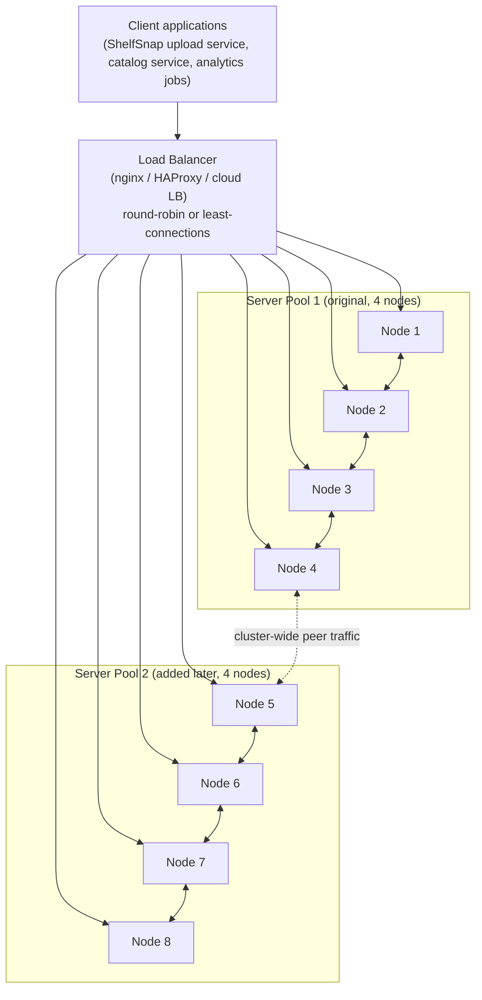
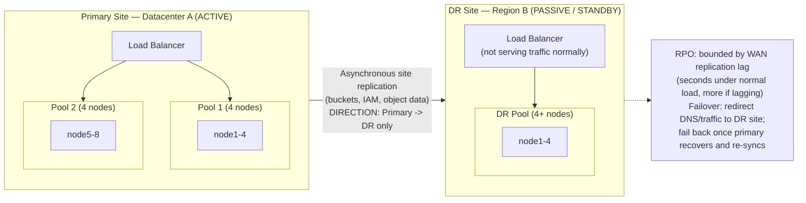

# Distributed Deployment & Site Replication

Chapter 3 explained *how* a distributed MinIO deployment lays objects across drives and nodes, and Chapter 5 went deep on the erasure-coding math that lets a cluster survive losing drives or even whole nodes without losing data or availability. Both of those chapters, though, stayed inside the boundary of **one cluster** — one namespace, one set of erasure sets, typically one physical building or one availability zone. This chapter picks up exactly where that boundary ends, and covers the two operational concerns that erasure coding, by itself, cannot address: **growing a cluster's capacity over time as data accumulates**, and **surviving the loss of an entire site** — a datacenter fire, a regional cloud outage, a fiber cut that isolates a whole facility — none of which erasure coding confined to one cluster can protect against, because erasure coding's entire value proposition depends on the drives it spans still being reachable. If every drive in every node of a cluster goes dark at once because the building lost power or burned down, no parity math saves you; the redundancy never left the building. This chapter is the operational deep dive into scaling a cluster out, and into keeping a live, independent copy of your data somewhere else entirely.

---

## Learning Objectives

By the end of this chapter, you will be able to:

- Read and construct the `minio server http://node{1...4}/data{1...4}` expansion-notation command, and explain exactly what each part of it tells MinIO to do.
- Stand up a 4-node distributed MinIO cluster using Docker Compose (or systemd units), and state why 4+ nodes is the practical minimum for meaningful production fault tolerance.
- Add a new server pool to a live deployment, and explain precisely why doing so grows capacity without moving any existing object — and why that is a deliberate design tradeoff, not a gap to work around.
- Explain why a load balancer belongs in front of every distributed MinIO deployment, given that all nodes are symmetric.
- Distinguish **site replication** (whole-deployment, bidirectional, includes IAM/policies) from **bucket replication** (targeted, bucket-level, one-way or two-way) and from **erasure coding** (protects within one cluster, not across sites).
- Compare active-active and active-passive replication topologies and identify the operational tradeoffs of each — including conflict handling and idle standby capacity.
- Reason about RPO (recovery point objective) under asynchronous, cross-WAN replication, and explain why failover procedures must be tested, not just configured.
- Design a realistic multi-pool, multi-site topology for a growing production workload, using ShelfSnap as a concrete running example.

---

## Prerequisites for This Chapter

This chapter builds directly on [Chapter 3: Architecture & Internals](./03-architecture-and-internals.md) and [Chapter 5: Erasure Coding & Data Protection](./05-erasure-coding-and-data-protection.md). We assume you already know:

- The distinction between drive-level and node-level fault tolerance, and why only a distributed, multi-node, multi-drive topology is appropriate for production (Chapter 3, Section 1).
- What an erasure set is, and why MinIO partitions a cluster's drives into multiple erasure sets rather than one giant pool (Chapter 3, Section 3).
- The basic idea of server pools as an additive scaling mechanism — introduced conceptually in Chapter 3, Section 4 — including that pools do not automatically rebalance existing data.
- EC:N notation, quorum, and self-healing (Chapter 5) — this chapter does not re-derive that math, it builds the operational layer on top of it.
- That MinIO nodes are symmetric with no leader/primary (Chapter 3, Section 6.1) — this fact is exactly why load balancing works trivially, a point this chapter revisits in Section 3.

If any of that feels shaky, revisit Chapters 3 and 5 before continuing — this chapter assumes erasure coding is settled ground and moves one level up the stack.

---

## 1. Deploying a Distributed Multi-Node Cluster

### 1.1 The expansion-notation command, piece by piece

A distributed MinIO deployment is started with a single command run identically on every node, of the shape:

```bash
minio server http://node{1...4}/data{1...4}
```

Breaking this apart piece by piece:

- **`minio server`** — starts MinIO in server mode (as opposed to, say, the `mc` client binary, which is a separate tool entirely).
- **`http://node{1...4}`** — this is **brace-expansion notation**, and MinIO expands it internally before startup. `node{1...4}` expands to `node1`, `node2`, `node3`, `node4` — four hostnames (or IPs) that must all be resolvable, over the network, from every machine running this command. This is what tells MinIO "there are four peer nodes participating in this deployment," not just "listen on this address."
- **`/data{1...4}`** — a second brace-expansion, this time over **drive paths** on each node. `/data{1...4}` expands to `/data1`, `/data2`, `/data3`, `/data4` — four mount points (ideally four independent physical drives, not four directories on one filesystem, or you lose the actual redundancy erasure coding is supposed to buy you) present on **every** node in the hostname list.
- **The full cross-product** — MinIO combines both expansions, so `http://node{1...4}/data{1...4}` describes 4 nodes × 4 drives each = 16 total drives, and this is what determines the erasure set layout MinIO computes at first startup (Chapter 3, Section 3.2).

Every node in the deployment runs the *exact same command* — the same hostname list, the same drive-path list — pointed at its own local drives. MinIO figures out, at startup, which of the listed hostnames it *is*, and treats the rest as peers to coordinate with. There is no separate "primary" configuration file and no per-node customization of the topology string; symmetry (Chapter 3, Section 6.1) starts at the command line, not just in the request-routing behavior.

### 1.2 Minimum node count guidance

You *can* run a distributed MinIO deployment with as few as 2 nodes, but 2- and 3-node deployments are not meaningfully fault-tolerant in a way that matters for production: with few nodes, losing even one often costs you a large fraction of the cluster's total drives at once, leaving little or no parity margin for a second failure, and quorum math (Chapter 5) gets uncomfortably tight. The practical, widely-recommended floor is:

- **4+ nodes** for any deployment you'd call "production" — this is the smallest topology where losing one entire node still comfortably fits inside a reasonable parity budget (Chapter 3's Real-World Scenario walked through exactly this: 4 nodes, EC:4, survives one whole node dying).
- **More nodes and/or more drives per node** as your durability and throughput requirements grow — larger deployments get to choose from a wider range of sensible EC:N parity levels and typically achieve better aggregate throughput, since more independent machines are spreading the I/O.

There is no hard technical ceiling baked into this chapter's advice — MinIO deployments legitimately run into the hundreds of nodes — the "4+" number is a floor for meaningful production fault tolerance, not a target to stop at.

### 1.3 A concrete 4-node deployment with Docker Compose

Below is a Docker Compose file that brings up a 4-node MinIO cluster on a single machine (for learning and local testing — a real production deployment would run these as four *separate physical or virtual machines*, not four containers on one host, since four containers on one host share the same underlying hardware failure domain, defeating the entire point).

```yaml
# docker-compose.yml
version: "3.8"

x-minio-common: &minio-common
  image: minio/minio:latest
  command: server --console-address ":9001" http://node{1...4}/data1
  environment:
    MINIO_ROOT_USER: shelfsnap-admin
    MINIO_ROOT_PASSWORD: change-this-strong-password
  networks:
    - minio-net
  healthcheck:
    test: ["CMD", "curl", "-f", "http://localhost:9000/minio/health/live"]
    interval: 10s
    timeout: 5s
    retries: 5

services:
  node1:
    <<: *minio-common
    hostname: node1
    volumes:
      - node1-data:/data1
    ports:
      - "9000:9000"
      - "9001:9001"

  node2:
    <<: *minio-common
    hostname: node2
    volumes:
      - node2-data:/data1

  node3:
    <<: *minio-common
    hostname: node3
    volumes:
      - node3-data:/data1

  node4:
    <<: *minio-common
    hostname: node4
    volumes:
      - node4-data:/data1

networks:
  minio-net:
    driver: bridge

volumes:
  node1-data:
  node2-data:
  node3-data:
  node4-data:
```

Notes on this file:

- All four services run the **identical command**, `http://node{1...4}/data1`, matching Compose's own service hostnames — this is the symmetry from Section 1.1 in practice.
- Only `node1` exposes ports to the host here for simplicity; in front of a real deployment you would not expose any single node directly to clients at all (Section 3).
- This example uses **one drive per node** (`/data1`) to keep the compose file short; a real deployment would list multiple drive paths per node (`/data{1...4}`) backed by genuinely separate physical disks.

### 1.4 The systemd equivalent

For a bare-metal or VM deployment (the more realistic production shape), each of the four machines runs a systemd unit like:

```ini
# /etc/systemd/system/minio.service
[Unit]
Description=MinIO distributed server
After=network-online.target
Wants=network-online.target

[Service]
Type=notify
EnvironmentFile=/etc/default/minio
ExecStart=/usr/local/bin/minio server $MINIO_OPTS
Restart=always
RestartSec=5
LimitNOFILE=65536
User=minio-user
Group=minio-user

[Install]
WantedBy=multi-user.target
```

with `/etc/default/minio` on every node containing the same:

```bash
MINIO_ROOT_USER=shelfsnap-admin
MINIO_ROOT_PASSWORD=change-this-strong-password
MINIO_OPTS="--console-address :9001 http://node{1...4}.internal/data{1...4}"
```

Each machine is named `node1.internal` through `node4.internal` in internal DNS, each has four real drives mounted at `/data1`–`/data4`, and `systemctl enable --now minio` on all four brings the deployment up together. Because MinIO's startup waits for enough peers to be reachable before serving requests, the order you start the four nodes in does not matter.

---

## 2. Server Pools in Operational Depth: Expanding a Live Deployment

### 2.1 Recap and the operational question

Chapter 3 introduced server pools conceptually: a MinIO deployment scales by federating multiple independently erasure-coded pools under one namespace, and that federation is additive, not redistributive. This section makes that concrete with the actual command and walks through exactly what happens operationally.

### 2.2 The expansion command with a second pool

To add an entirely new pool of nodes and drives to ShelfSnap's existing 4-node deployment, you append a **second expansion group** to the same server command, and restart every node in the deployment (both old and new) with this updated command:

```bash
minio server http://node{1...4}/data{1...4} http://node{5...8}/data{1...4}
```

Piece by piece, on top of what Section 1.1 already established:

- `http://node{1...4}/data{1...4}` is the **original pool** — unchanged, same 16 drives, same erasure sets computed the first time this deployment started.
- `http://node{5...8}/data{1...4}` is a **second, brand-new pool** — 4 new nodes (`node5`–`node8`), each with 4 new drives, that MinIO erasure-codes internally exactly the way it did the first pool, completely independently.
- The two space-separated groups are two distinct pools under **one MinIO deployment** — one namespace, one set of buckets, one endpoint clients talk to. Clients never address a pool by name or index; MinIO decides internally which pool a given new object lands in.

Every node — all 8 of them now — is restarted with this exact same, full command listing both pools. This is the same symmetry principle as Section 1.1, just now applied to a two-pool topology: there's no special "pool 2 controller" node, and no node's config differs from any other's beyond which physical drives it owns.

### 2.3 What actually happens to data during and after this expansion

This is the detail worth being precise about, because assuming otherwise is one of the most common operational mistakes with MinIO (Common Mistakes, below):

- **Existing objects, already sitting on the original 4-node pool, do not move.** Every object ShelfSnap wrote to `product-images` before the expansion stays on exactly the same drives, in exactly the same erasure sets, that it was originally written to. There is no background migration, no rebalancing job, no data movement triggered by adding the new pool.
- **New writes get distributed with awareness of available space across pools.** From the moment the 8-node, two-pool deployment comes up, MinIO's placement decision for a *newly written* object considers the available free space in each pool and increasingly favors whichever pool has more room — so if the original pool is nearly full and the new pool is empty, new uploads will lean heavily toward the new pool. But this is a **forward-looking** placement decision for new data, not a retroactive rebalancing of old data.
- **Reads of old objects work identically to before.** A `GET` for an object written before the expansion is served exactly the same way it always was — MinIO knows which pool (and which erasure set within that pool) owns any given key, old or new, and routes the read there transparently. Clients never need to know or care which pool holds a given object.

### 2.4 Why this is a deliberate tradeoff, not a limitation

It's tempting to see "old data doesn't move" as a missing feature MinIO should eventually add. It is more accurate, and operationally more useful, to see it as a deliberate design choice with real advantages:

- **Rebalancing at scale is inherently risky.** Moving petabytes of already-erasure-coded data across a live, production cluster serving real traffic is a slow, I/O-intensive, and failure-prone operation — every byte moved is a byte that could be corrupted, dropped, or delayed in flight, and the operation would need to run for potentially days or weeks on a large cluster while production traffic continues unabated.
- **Additive pool expansion is fast and low-risk by comparison.** Standing up 4 new machines, erasure-coding them internally (a process contained entirely within the new pool, touching none of the old pool's drives), and wiring the result into the same namespace is a bounded, well-understood, minutes-to-hours operation with no live-data-movement risk at all.
- **The imbalance is manageable operationally, not structurally broken.** An operator who understands this behavior can plan around it: expand *before* the old pool is critically full (not after), and if rebalancing genuinely matters for a specific use case, it can be done deliberately and safely at the object level (e.g., copying old objects to freshly-generated keys, or lifecycle-driven expiry of very old data) — a controlled, application-level choice, rather than something the storage layer forces on you unpredictably in the background.

The practical takeaway: **treat pool expansion as "add more room for new growth," not "rebalance my existing footprint."** Plan capacity with enough lead time that the old pool never has to survive purely on marginal new-pool preference to stay usable.

---

## 3. Load Balancing in Front of a Distributed Deployment

Because every MinIO node is symmetric (Chapter 3, Section 6.1) — any node can fully service any S3 API request for any object in the deployment, regardless of which pool or which drives actually hold that object's shards — a distributed MinIO deployment is a naturally good fit for a plain, stateless load balancer sitting in front of the whole node set. There is no session affinity requirement, no need to route a specific client to a specific node, and no leader to avoid overloading.

In practice, ShelfSnap (or any production deployment) puts something like **nginx**, **HAProxy**, or a cloud provider's managed load balancer (an AWS NLB/ALB, a GCP load balancer, etc.) in front of every node in the cluster, and clients are configured to talk only to the load balancer's address — never to an individual node's hostname or IP directly.



A few operational points worth making explicit:

- **Health checks matter.** Configure the load balancer to health-check each node (MinIO exposes `/minio/health/live` and `/minio/health/ready` endpoints for exactly this) and stop routing to a node that's down, rather than letting client requests hit a dead node and time out.
- **The load balancer doesn't need to know about pools.** All 8 nodes across both pools are equally valid targets for any request — the load balancer's job is purely "spread connections across healthy nodes," not "route pool-1 traffic here and pool-2 traffic there." Pool-aware placement is handled entirely inside MinIO.
- **TLS typically terminates at the load balancer** (or is passed through to MinIO nodes directly, depending on your security posture — Chapter 15 covers this tradeoff in depth).

---

## 4. Site Replication (Active-Active): Protecting Against Losing an Entire Site

### 4.1 A genuinely different mechanism from erasure coding

Everything so far in this chapter, and everything in Chapters 3 and 5, operates **within one cluster** — one deployment, one physical location (or, at most, drives/nodes spread across racks within one datacenter). Erasure coding is extremely good at what it does: surviving drive and node failures *inside* that boundary. But it fundamentally cannot help if the boundary itself disappears — a datacenter fire, a prolonged power-grid failure, a regional cloud-provider outage, a fiber cut isolating an entire facility. If every node and every drive in a cluster becomes unreachable at once, there are no surviving shards anywhere to reconstruct from, no matter how generous the parity budget was.

**Site replication** solves a different problem: it keeps a live, independently-erasure-coded copy of your entire deployment — buckets, IAM users and policies, and object data — in a **second, independent MinIO deployment**, ideally in a different datacenter or region entirely, so that losing the first site's building, power, or network entirely still leaves a fully functional copy of everything serving from elsewhere.

| | Erasure coding (Ch 3, 5) | Site replication (this chapter) |
|---|---|---|
| **Protects against** | Drive failure, node failure — *within* one cluster | Losing an entire site/datacenter/region |
| **Mechanism** | Data + parity shards spread across drives/nodes in one deployment | Continuous, asynchronous replication between two+ independent deployments |
| **Scope** | Object data only, within the cluster's erasure sets | Bucket configuration, IAM users/policies, and object data, across deployments |
| **Failure domain it spans** | One building/one cluster's drives and nodes | Multiple buildings/regions, each independently erasure-coded |
| **Configured via** | Server pool topology at deployment time (Chapter 3) | `mc admin replicate add` between two live deployments |

### 4.2 What site replication actually synchronizes

Site replication (sometimes called **active-active replication**, because both sites can serve live read/write traffic) links two or more **entire MinIO deployments** so that, continuously and in both directions:

- **Bucket configuration** — bucket existence, versioning settings, lifecycle rules, bucket policies, object-lock configuration — created or changed on one site propagates to every other linked site.
- **IAM users, groups, and policies** — identity and access configuration (Chapter 8) stays consistent across sites, so a user or access key valid on one site is valid on all linked sites.
- **Object data** — objects written to a bucket on one site are asynchronously copied to the same bucket on every other linked site, including new versions and deletes (subject to the retention/versioning rules configured on the bucket).

Setting up site replication between two already-running MinIO deployments looks like this using `mc`:

```bash
# Configure aliases for both independent deployments
mc alias set site1 https://minio-us-east.shelfsnap.internal shelfsnap-admin '<password>'
mc alias set site2 https://minio-eu-west.shelfsnap.internal shelfsnap-admin '<password>'

# Link them as replication peers
mc admin replicate add site1 site2
```

From this point forward, the two deployments behave as one logically-replicated system: a bucket created on `site1` appears on `site2` shortly after, an IAM policy added on `site2` appears on `site1`, and an object uploaded to either one is replicated to the other. `mc admin replicate status site1` reports the current replication health and any backlog between the sites.

### 4.3 Why this is not "erasure coding, but bigger"

It's worth stating plainly, because the two mechanisms can superficially sound similar ("data is protected across multiple locations" either way): erasure coding reconstructs an object from *partial* surviving shards using coding-theory math, and requires all participating drives to belong to one coordinated deployment with sub-millisecond-class internal networking. Site replication instead keeps **complete, independent, fully-erasure-coded copies** of your data at each site, kept in sync over an ordinary WAN link, with each site fully capable of operating entirely on its own if the link (or the other site) disappears. Site replication is layered *on top of* erasure coding, not a substitute for it — each individual site linked by site replication should itself be a properly erasure-coded distributed deployment (Chapters 3, 5), or you've simply moved your single point of failure from "one cluster" to "one under-protected cluster that happens to have a remote copy."

---

## 5. Bucket Replication: A More Targeted Alternative

Site replication links **entire deployments** — every bucket, every IAM policy, symmetrically. Sometimes that's more than you want. **Bucket replication** operates at a narrower, more deliberate scope: you configure replication for **specific buckets**, to a **specific remote target**, in **one direction or two**, without making the two deployments symmetric peers in every other respect.

This is the right tool when:

- You want only *some* buckets replicated, not your entire namespace — e.g., ShelfSnap might replicate `product-images` (customer-facing, needs high availability) to a DR site, while keeping `analytics-lake` (internal, rebuildable from source data) unreplicated to save bandwidth and storage cost.
- You want **one-way replication** to a target that's purely a backup/archive copy, with no expectation that writes ever flow back from the target.
- The two deployments have genuinely different IAM setups, tenancy models, or administrative ownership, and you don't want them merged into one symmetric identity/policy namespace the way site replication would.

Configuring one-way bucket replication looks like:

```bash
mc alias set primary https://minio-us-east.shelfsnap.internal shelfsnap-admin '<password>'
mc alias set backup  https://minio-backup.shelfsnap.internal   shelfsnap-admin '<password>'

# Enable versioning on both sides — object replication requires it
mc version enable primary/product-images
mc version enable backup/product-images

# Set up one-way replication from primary to backup
mc replicate add primary/product-images \
  --remote-bucket backup/product-images \
  --replicate "delete,delete-marker,existing-objects"
```

Two-way bucket replication is configured by adding a second `mc replicate add` rule in the opposite direction, targeting the same bucket pair — at which point you have bucket-level active-active behavior, scoped to just that bucket, without the full-deployment symmetry that `mc admin replicate add` implies.

The rule of thumb: reach for **site replication** when you genuinely want two (or more) whole deployments to be interchangeable, symmetric peers. Reach for **bucket replication** when you want a specific, targeted data-protection or data-distribution relationship for particular buckets, without the rest of the deployment coming along for the ride.

---

## 6. Replication Topology Tradeoffs: Active-Active vs. Active-Passive/DR

Whether you're using site replication or two-way bucket replication, the same fundamental topology choice sits underneath: **active-active** or **active-passive**.

### 6.1 Active-active

**Both sites serve live production traffic simultaneously**, and changes flow both ways continuously. A user near the US-East site reads and writes against `site1`; a user near the EU-West site reads and writes against `site2`; replication keeps the two converging toward the same state.

- **Benefit:** geo-distributed applications get local-region reads and writes — lower latency for users near each site, and both sites' hardware is fully utilized rather than sitting idle.
- **Cost:** you must design for the possibility of **near-simultaneous writes to the same object key from both sites** before replication has caught up. Object storage's typical conflict resolution is some form of "last write wins" based on timestamps — which is a real, application-visible behavior your application needs to be either indifferent to (e.g., each site only ever writes keys scoped to its own region/tenant, so true collisions can't happen) or explicitly tolerant of (accepting that a rare near-simultaneous write to the identical key might be resolved in a way your application didn't control). Active-active is a great fit for the ShelfSnap-style pattern of per-region key namespaces, and a worse fit for a single global counter or ledger-style object that both sites might legitimately try to update at the same instant.

### 6.2 Active-passive (disaster recovery)

**One site is the primary**, handling all live read/write traffic; the other is a **standby target only used on failover** — it receives replicated data continuously but serves no production reads or writes under normal operation.

- **Benefit:** dramatically simpler to reason about. There is exactly one place writes originate, so there is no concurrent-write conflict scenario to design around at all — the standby is, by construction, always "behind" the primary by some small replication lag, never diverging from it in a way that needs reconciliation.
- **Cost:** the standby site's hardware sits mostly idle under normal conditions, which is a real, ongoing cost — you are paying to keep a second full-scale, fully-erasure-coded deployment running, powered, and patched, for a scenario (a full site loss) that with any luck never happens. Some organizations mitigate this by running lower-priority workloads (batch analytics, backups-of-backups) against the standby site's spare capacity during normal operation, as long as that doesn't interfere with its readiness to take over on failover.

### 6.3 Choosing deliberately

| | Active-active | Active-passive (DR) |
|---|---|---|
| **Both sites serve traffic?** | Yes, continuously | No — standby only activates on failover |
| **Write conflict handling needed?** | Yes — design for near-simultaneous same-key writes | No — single write origin, no conflicts |
| **Hardware utilization** | Both sites fully used | Standby site mostly idle under normal operation |
| **Best fit** | Geo-distributed apps wanting local-region latency, per-region key namespaces | Straightforward disaster recovery with a clear primary site |
| **Operational complexity** | Higher — conflict awareness, bidirectional monitoring | Lower — one direction of data flow to reason about |

Choose based on your actual traffic pattern and consistency needs, not on which one sounds more sophisticated. A workload with a single, clear primary region and a DR requirement is well served by active-passive's simplicity; a workload that genuinely serves distinct user populations from distinct regions benefits from active-active's local-latency advantage, provided the application is designed with the conflict implications in mind from day one.

---

## 7. Disaster Recovery Runbook Thinking

Configuring replication is necessary but not sufficient for disaster recovery — the other half is knowing, concretely and in advance, what happens the moment your primary site actually goes down.

### 7.1 What an actual failover looks like

1. **Detection.** Monitoring (Chapter 14) confirms the primary site is genuinely down — unreachable, not just slow — rather than acting on a transient blip.
2. **Traffic redirection.** Application traffic is redirected to the surviving site. In practice this usually means updating DNS (lowering TTLs in advance so this propagates quickly) or repointing a global load balancer/traffic manager to the DR site's endpoint, so that client applications — which should already be configured to talk to a logical endpoint, not a hardcoded site address — start reaching the surviving deployment without any client-side changes.
3. **Verification.** Confirm the surviving site is actually serving correctly: reads return expected data, writes succeed, IAM credentials still authenticate (this matters more for active-passive, where the standby's IAM state depends entirely on having received recent replication updates from the now-dead primary).
4. **Communication and monitoring during the outage window.** Track replication lag/backlog reporting (where available) so you know, after the fact, roughly how much data might not have made it across before the primary went down.

### 7.2 RPO: what data-loss window to expect

Site replication (and bucket replication) is **asynchronous** by nature — this is an unavoidable consequence of physics and network reality, not a configuration choice you can simply toggle away. Replicating every write **synchronously** across a WAN link to a genuinely distant site would mean every `PUT` waits on a round-trip to a datacenter possibly thousands of kilometers away before acknowledging the client — an unacceptable latency cost for normal operation. So replication happens in the background, shortly after each local write is already acknowledged to the client.

This means your **RPO (recovery point objective)** — the maximum amount of recent data you should expect to lose if the primary site vanishes at an arbitrary moment — is **not zero**. It's bounded by however far behind the replication stream typically runs, which depends on write volume, object sizes, and the WAN link's bandwidth and latency between sites. Under normal, healthy conditions this might be seconds; under load, network degradation, or a large backlog building up before the outage, it could be considerably more. **Monitor replication lag as an ongoing metric** (Chapter 14), not just as something you glance at once after setup, precisely because your real RPO is only as good as how caught-up replication actually is at the moment disaster strikes — not how caught-up you assumed it would be.

### 7.3 Why testing failover matters as much as configuring it

A DR plan that has never actually been exercised is, in practice, an untested hypothesis about your own system, not a working safety net. Configuring `mc admin replicate add` correctly tells you replication is *flowing* — it tells you nothing about whether your DNS TTLs are actually short enough to fail over quickly, whether your application handles a mid-request site switch gracefully, whether your on-call runbook is accurate, or whether the standby site's hardware has silently drifted out of date on MinIO version or configuration. Regularly rehearsing an actual failover — redirecting real (or realistic synthetic) traffic to the DR site on a schedule, not just during a real emergency — is what turns "we have replication configured" into "we have verified disaster recovery." The Hands-On Exercise below gives you a small-scale version of exactly this rehearsal.

---

## 8. Worked Example: Designing ShelfSnap's Production Topology

Bringing every idea in this chapter together, here's how ShelfSnap's platform team actually designs their topology as the company grows, using the two buckets this course has followed throughout: `product-images` (customer-facing product photos) and `analytics-lake` (internal analytics data, generally larger and less latency-sensitive).

**Stage 1 — Launch: single 4-node cluster.** ShelfSnap starts with a 4-node, 4-drive-per-node distributed deployment (16 drives, one erasure set, EC:4 — Chapter 3's Real-World Scenario) in their primary datacenter, fronted by an nginx load balancer (Section 3). Both `product-images` and `analytics-lake` live in this one deployment.

**Stage 2 — Growth: expanding to 8 nodes, two server pools.** As the product catalog grows and `product-images` approaches the original pool's capacity, the team stands up 4 new nodes (`node5`–`node8`) and restarts the deployment with `minio server http://node{1...4}/data{1...4} http://node{5...8}/data{1...4}` (Section 2). New product photos increasingly land on the new pool as it has more free space; existing photos stay exactly where they were written. The load balancer's node list is updated to include all 8 nodes.

**Stage 3 — Disaster recovery: active-passive site replication.** With the primary datacenter now running a real, revenue-critical workload, the team stands up a second, independently-erasure-coded deployment in a different region, and configures it as an **active-passive** replication target using `mc admin replicate add` (Section 4, Section 6.2) — chosen over active-active because ShelfSnap's traffic has one clear primary region and no need for local-region writes elsewhere, and because active-passive's simplicity (no write-conflict design burden) outweighs the idle-hardware cost for their current scale. The DR site continuously receives replicated bucket configuration, IAM policies, and object data for both buckets, but serves no live traffic under normal conditions.



This gives ShelfSnap a topology where: drive or node failure within either site is absorbed by erasure coding (Chapters 3, 5); capacity growth is handled by adding pools without disrupting existing data (Section 2); client load is spread evenly across all nodes in the active site (Section 3); and the loss of the *entire* primary datacenter is survivable by failing traffic over to a live, independently-protected copy in another region (Sections 4, 6, 7) — each layer of protection addressing a failure domain the layer below it cannot.

---

## Real-World Scenario

**Setup:** Eighteen months after Stage 3 above, ShelfSnap's primary datacenter suffers a real regional power-grid failure — not a drill. The entire building, all 8 nodes across both server pools, goes dark simultaneously. Every erasure set in the primary deployment becomes unreachable at once; erasure coding, doing exactly what it's designed to do, cannot help here, because the failure domain (the whole building) is larger than anything erasure coding within one deployment was ever built to span.

**The failover:**

- Monitoring (Chapter 14) alerts on-call within minutes that the primary site's health checks are failing across the board — not a single node, not a single pool, everything.
- Following the tested runbook (Section 7.3), the on-call engineer redirects the global traffic manager's DNS entry for `storage.shelfsnap.com` to the DR site's load balancer address. Because the team had deliberately kept DNS TTLs low for exactly this scenario, client applications start resolving to the DR site within a few minutes, with no application code changes needed — the applications were already written to talk to the logical `storage.shelfsnap.com` endpoint, never to a hardcoded primary-site address.
- The DR site, having been receiving replicated bucket configuration, IAM policies, and object data continuously (Section 6.2), is already in a state extremely close to the primary's last known-good state. `mc admin replicate status` logs from before the outage show replication had been keeping up well within seconds of lag under normal load, so the team estimates the realistic RPO at "well under a minute of the most recent writes" — not zero, but small, and consistent with what they'd budgeted for when choosing asynchronous, cross-region replication in the first place (Section 7.2).
- `product-images` and `analytics-lake` both serve correctly from the DR site. Product photo uploads and reads continue against the DR deployment; nothing about the S3 API surface changed for client applications.

**Failback, once the primary site recovers:**

- Days later, the primary datacenter's power is restored and its 8 nodes come back online, rejoin the deployment, and MinIO's healing process (Chapter 5) verifies and repairs any shards affected by the outage.
- Because replication had continued flowing in the DR-active direction the whole time the DR site was live (the team had, in fact, temporarily reconfigured replication direction during the incident so the now-active DR site's new writes flowed back toward the recovering primary), the primary catches back up on everything written during the outage window before traffic is redirected back to it.
- Once the primary is confirmed fully caught up and healthy, on-call repoints DNS back to the primary site's load balancer, and the DR site returns to its normal passive/standby role.

The lesson ShelfSnap's postmortem highlighted: the failover itself went smoothly specifically *because* it had been rehearsed before (Section 7.3) — the DNS TTL choice, the runbook steps, and the decision to temporarily reverse replication direction during failback were all things the team had already worked out in a prior drill, not decisions made for the first time under real outage pressure.

---

## Best Practices

- **Plan erasure-set and pool sizing ahead of expected growth.** Because pools are additive, not redistributive (Section 2), the right time to add a new pool is well before the old one is critically full — not after, when new-pool preference alone has to carry all new growth.
- **Always put a load balancer in front of a distributed deployment.** Every node is a symmetric, equally valid target (Section 3); there is no good reason for any client to depend on one node's address directly.
- **Test failover procedures on a regular schedule, not just once at setup.** Replication being configured and replication actually saving you during a real outage are two different claims — only a rehearsed failover (Section 7.3) validates the second one.
- **Choose active-active vs. active-passive deliberately, based on real traffic and consistency needs** (Section 6) — not by default, and not because one sounds more advanced. A single-primary workload is usually simpler and safer as active-passive.
- **Monitor replication lag as an ongoing operational metric.** Your actual RPO during a real disaster is only as good as how caught-up replication was at that exact moment (Section 7.2), so lag needs to be visible, not assumed.
- **Keep DNS TTLs low, and know your failover runbook's exact steps in advance.** Traffic redirection speed during a real incident is bounded by both of these — figuring either out for the first time during an outage costs you real downtime.
- **Use bucket replication instead of full site replication when you only need a targeted relationship** for specific buckets (Section 5), rather than defaulting to symmetric, whole-deployment site replication for every use case.

---

## Common Mistakes

- **Confusing site replication with erasure coding, and thinking one substitutes for the other.** Erasure coding protects against drive/node loss within one cluster; only an independent, remote, replicated deployment protects against losing the whole site (Section 4.1). Skipping erasure coding within each site because "we have site replication" leaves each individual site fragile.
- **Adding a new server pool and expecting old data to automatically rebalance onto it.** Pools are additive; existing objects stay exactly where they were written (Section 2.3) — new-pool free space only influences *future* writes.
- **Deploying without a load balancer, so client applications hardcode one node's address.** This silently reintroduces a single point of failure into a topology that was specifically designed to have none (Section 3) — losing that one node takes down every client depending on it directly, even though the rest of the cluster is perfectly healthy.
- **Never testing an actual failover until a real outage forces it.** A DR configuration that has never been exercised is an untested hypothesis, not a validated safety net (Section 7.3) — assumptions about DNS propagation speed, application behavior, and runbook accuracy all go unverified until it's too late to fix them calmly.
- **Choosing active-active without designing for concurrent-write conflicts.** Active-active replication genuinely allows near-simultaneous writes to the same key from two sites; ignoring that possibility (rather than architecting around it with per-region key namespaces or explicit conflict tolerance) invites subtle, hard-to-reproduce data-correctness bugs (Section 6.1).
- **Assuming replication is synchronous, or that RPO is zero.** Site and bucket replication are asynchronous over a WAN link by nature (Section 7.2); planning as though no data could ever be lost in a sudden failure sets an expectation the architecture cannot actually meet.
- **Sizing a DR site's hardware as an afterthought.** An active-passive standby that's under-provisioned relative to the primary will not actually be able to serve real production load once failover happens — "idle most of the time" does not mean "can be arbitrarily small."

---

## Summary

- A distributed MinIO cluster is started with brace-expansion notation like `minio server http://node{1...4}/data{1...4}`, run identically on every node; 4+ nodes is the practical floor for meaningful production fault tolerance (Section 1).
- **Server pools** scale capacity by appending a second expansion group (`http://node{5...8}/data{1...4}`) to the same command; this adds capacity for new writes without moving existing objects — a deliberate tradeoff that avoids risky, large-scale rebalancing (Section 2).
- Because all MinIO nodes are symmetric, a load balancer (nginx, HAProxy, or a cloud LB) belongs in front of every distributed deployment, spreading client requests across all nodes and pools (Section 3).
- **Site replication** (`mc admin replicate add`) links entire independent MinIO deployments — bucket config, IAM, and object data — to protect against losing a whole site, a fundamentally different concern from erasure coding's drive/node protection within one cluster (Section 4).
- **Bucket replication** offers a more targeted, bucket-scoped alternative to full site replication, one-way or two-way, when full deployment symmetry isn't what you need (Section 5).
- **Active-active** replication serves live traffic from both sites and requires designing for near-simultaneous write conflicts; **active-passive** keeps one site as a standby-only DR target, simpler but with idle standby hardware (Section 6).
- Replication is asynchronous over a WAN link, so **RPO is never zero** — plan for a realistic data-loss window, monitor replication lag, and rehearse failover procedures before you need them for real (Section 7).
- ShelfSnap's realistic topology evolves from a single 4-node cluster, to an 8-node two-pool deployment, to an active-passive DR setup — each layer addressing a failure domain the layer below cannot (Section 8).

---

## Knowledge Check

1. Break down `minio server http://node{1...4}/data{1...4}` piece by piece — what does each expansion group represent, and how does MinIO combine them to determine the erasure-set layout?
2. Your team adds a second server pool (`http://node{5...8}/data{1...4}`) to a nearly-full existing deployment. A colleague expects this to immediately free up space on the original pool. Explain why it won't, and what will actually change going forward.
3. Why does it make sense to put a load balancer in front of a MinIO deployment, given what you know about node symmetry from Chapter 3? What specific problem would hardcoding one node's address in client applications create?
4. Explain, precisely, why site replication is not simply "erasure coding across a bigger area." What does each mechanism actually protect against, and why can't one substitute for the other?
5. A team chooses active-active replication between two sites for an application where both sites might occasionally write to the same object key at nearly the same time. What operational risk does this introduce, and what design choice would reduce it?
6. Why is RPO under site/bucket replication never zero, and what should an operator actually monitor to know their real-world RPO at any given moment?

---

## Hands-On Exercise

**Goal:** Stand up two independent local MinIO "sites," configure site replication between them, confirm data flows correctly in both directions, and then simulate one site going down to confirm the surviving site keeps serving reads.

1. **Create two separate Docker Compose projects**, one per simulated site — e.g., `site1/docker-compose.yml` and `site2/docker-compose.yml` — each bringing up its own small MinIO deployment (a single multi-drive node is fine for this exercise; you don't need a full 4-node cluster per site to exercise replication). Give them distinct host ports, e.g. site1 on `9000`/`9001`, site2 on `9010`/`9011`, and distinct root credentials.

2. **Bring both up**: `docker compose -f site1/docker-compose.yml up -d` and `docker compose -f site2/docker-compose.yml up -d`. Confirm both are healthy via `mc admin info`.

3. **Configure `mc` aliases for both**:
   ```bash
   mc alias set site1 http://localhost:9000 <site1-user> <site1-password>
   mc alias set site2 http://localhost:9010 <site2-user> <site2-password>
   ```

4. **Link them with site replication**:
   ```bash
   mc admin replicate add site1 site2
   mc admin replicate status site1
   ```
   Confirm the status output reports both sites as healthy replication peers.

5. **Create a bucket and upload an object on site1**:
   ```bash
   mc mb site1/product-images
   mc cp ./red-runner-42.jpg site1/product-images/sneakers/red-runner-42.jpg
   ```

6. **Confirm it appears on site2** (allow a few seconds for asynchronous replication):
   ```bash
   mc ls site2/product-images/sneakers/
   mc cat site2/product-images/sneakers/red-runner-42.jpg | sha256sum
   ```
   Compare the checksum against the original file to confirm the replicated object is byte-identical.

7. **Confirm the reverse direction too**: upload a second object directly to `site2/product-images/`, and confirm it appears back on `site1` — validating this is genuinely bidirectional (active-active) replication, not one-way.

8. **Simulate site1 going down**: `docker compose -f site1/docker-compose.yml stop`.

9. **Confirm site2 still serves reads independently**:
   ```bash
   mc cat site2/product-images/sneakers/red-runner-42.jpg > /tmp/recovered.jpg
   sha256sum /tmp/recovered.jpg
   ```
   This should succeed without error, demonstrating that site2 is a fully independent, functioning deployment — not merely a passive cache dependent on site1 being reachable.

10. **Bring site1 back up** (`docker compose -f site1/docker-compose.yml start`) and confirm `mc admin replicate status site1` reports both sites healthy again, with any objects written to site2 while site1 was down now replicated back once site1 rejoins.

---

## Further Reading

- [MinIO Distributed Deployment Guide](https://min.io/docs/minio/linux/operations/install-deploy-manage/deploy-minio-multi-node-multi-drive.html) — the official reference for the multi-node, multi-drive command syntax covered in Section 1.
- [MinIO Server Pools / Expand a Deployment](https://min.io/docs/minio/linux/operations/install-deploy-manage/expand-minio-deployment.html) — the operational reference for adding server pools, covered in Section 2.
- [MinIO Site Replication](https://min.io/docs/minio/linux/operations/install-deploy-manage/multi-site-replication.html) — the official guide to `mc admin replicate` and multi-site, active-active replication, covered in Section 4.
- [MinIO Bucket Replication](https://min.io/docs/minio/linux/administration/bucket-replication.html) — the bucket-level, targeted replication reference covered in Section 5.
- [MinIO Operations Concepts Overview](https://min.io/docs/minio/linux/operations/concepts.html) — broader operational concepts referenced throughout this chapter, including health-check endpoints used in Section 3.

---

<div style="display:flex;justify-content:space-between;align-items:center;">
  <a href="./11-event-notifications-and-integrations.md">← Previous: Event Notifications & Integrations</a>
  <a href="./00-index.md">🏠 Index</a>
  <a href="./13-performance-tuning-and-benchmarking.md">Next: Performance Tuning & Benchmarking →</a>
</div>
