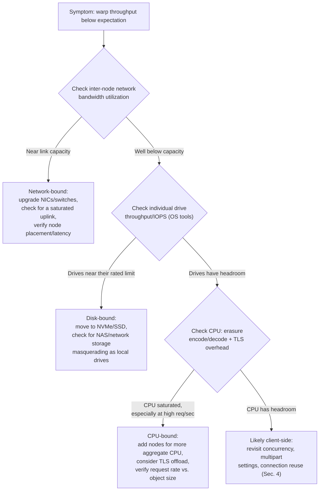
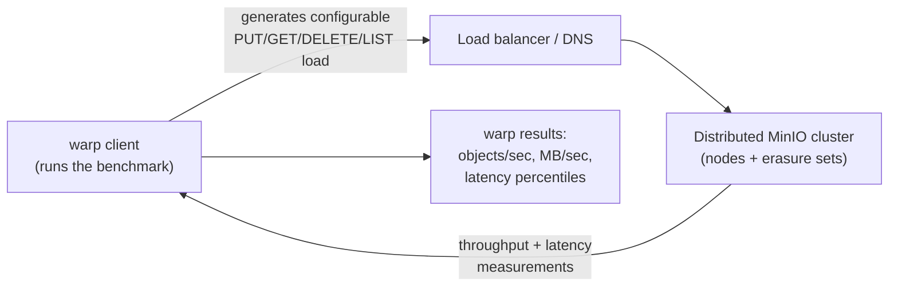

# Performance Tuning & Benchmarking

Chapter 12 was about topology: how many nodes, how many drives per node, how many server pools, and how site replication ties multiple clusters together for disaster recovery. Getting that topology right is necessary, but it is not sufficient. A correctly-designed distributed cluster — the right erasure set sizes, sensible pool boundaries, a sound replication plan — can still perform badly if the network between nodes is thin, the data drives are network-attached spinning disks masquerading as "fast enough," or the client application talks to it with a single thread. Topology answers "will this survive failure?" Performance tuning and benchmarking answer a different question: "will this actually go fast enough for the workload I'm about to point at it?" Those are separate engineering problems, and this chapter is about the second one — measuring what your cluster actually does, understanding what limits it, and closing the gap between the topology you designed and the throughput your application needs.

---

## Learning Objectives

By the end of this chapter, you will be able to:

- Rank the dominant performance factors for a distributed MinIO cluster — network, disk, and CPU — and explain why network is so often the real bottleneck in an erasure-coded system.
- Distinguish small-object workload patterns from large-object workload patterns, and explain why each stresses a different part of the system and calls for a different tuning approach.
- Use `warp`, MinIO's official S3 benchmarking tool, to run realistic mixed and single-operation workloads against a MinIO cluster, and read its throughput and latency output correctly.
- Apply client-side tuning — concurrency, multipart part-size, connection reuse — and explain why an under-parallelized client will bottleneck even a well-tuned cluster.
- Apply server-side tuning levers — erasure set sizing, network bandwidth, filesystem choice — and justify each recommendation from MinIO's underlying architecture.
- Follow a systematic, evidence-based workflow to diagnose whether a slow cluster is network-bound, disk-bound, or CPU-bound, instead of guessing.
- Reproduce and fix a realistic ingestion-pipeline performance problem using `warp` as the diagnostic tool.

---

## Prerequisites for This Chapter

This chapter builds directly on [Chapter 3: Architecture & Internals](./03-architecture-and-internals.md) and [Chapter 12: Distributed Deployment & Site Replication](./12-distributed-deployment-and-site-replication.md). We assume you already know:

- How erasure coding physically spreads an object's data and parity shards across the drives of an erasure set (Chapter 3, Section 5), and that reconstructing or writing an object therefore requires shard traffic between the nodes that hold those drives.
- The distinction between server pools (additive capacity) and erasure sets (bounded groups of drives), and that erasure set width is fixed at cluster-creation time.
- The multipart upload protocol from [Chapter 4](./04-buckets-objects-and-the-s3-api.md) — initiate, upload parts, complete — since a large share of this chapter's client-side tuning advice is about using that protocol well.
- The general shape of a distributed, multi-node MinIO deployment from Chapter 12: multiple symmetric nodes, no leader, a load balancer in front, and internal peer-to-peer shard traffic on every request.

If any of that feels shaky, revisit those chapters — this chapter assumes the topology is already settled and focuses entirely on making that topology fast and on proving it with numbers rather than intuition.

---

## 1. The Three Dominant Performance Factors, in Order of Impact

Every performance conversation about a distributed object store eventually comes back to three resources: network, disk, and CPU. They matter in a specific order, and getting that order backwards is the single most common reason people tune the wrong thing first.

### 1.1 Network: usually the real bottleneck

Recall from Chapter 3 that a MinIO node receiving a request is not necessarily the node holding the relevant shards. On a `PUT`, the receiving node fans data and parity shards out to its peers across the erasure set; on a `GET`, it fans read requests out and pulls shards back, in parallel, from whichever drives hold them. This means **every single object operation in a distributed MinIO deployment generates internal, inter-node network traffic** — not occasionally, not only during rebalancing or healing, but on every ordinary request path, all day, every day.

This is the fact that most people underestimate when they first design a cluster: the network connecting your MinIO nodes is not a background convenience, it is squarely in the critical path of every read and write. A cluster with fast NVMe drives and modern CPUs but a 1GbE network between nodes will bottleneck on that network long before the drives or CPUs break a sweat, because every object's shards have to cross that link to be written or reassembled.

Two network paths matter, and they're easy to conflate:

- **Client-to-cluster bandwidth** — the link between your application and whichever node (or load balancer) it talks to. This caps how fast a single client can push or pull data, independent of anything happening inside the cluster.
- **Inter-node bandwidth** — the link between MinIO nodes themselves, carrying shard traffic. This caps how fast the *cluster* can service requests in aggregate, and it's the one people forget to provision for, because it never shows up in a client-side "my upload is slow" complaint until someone goes looking.

### 1.2 Disk throughput and IOPS

Once data reaches a node, it has to land on a physical drive — and MinIO's own documentation is blunt about this: **use fast local drives, not network-attached storage, for MinIO's data drives.** This deserves unpacking, because it seems counterintuitive at first (isn't MinIO itself a network storage system?).

The distinction is architectural. MinIO already provides the network-storage abstraction *to your applications* — that's the entire point of the S3 API. What it needs *underneath itself*, on the drives it directly manages, is raw local block I/O with predictable, low latency: local NVMe SSDs, or at minimum local SATA/SAS SSDs. Putting MinIO's data drives on top of another network filesystem (NFS, iSCSI, a SAN) means every shard write and read now crosses *two* network hops instead of one — the client-to-cluster hop plus a second, hidden cluster-to-storage-backend hop — and inherits that second layer's latency, its own consistency quirks, and its own failure modes, all while making MinIO's own erasure coding and healing logic reason about a storage layer that doesn't behave like a plain local disk. The performance and reliability cost is real and avoidable: local drives, directly attached to the node that runs MinIO on them, are the recommended baseline for any deployment that needs to perform.

Within "local drives," the hierarchy is what you'd expect:

| Drive type | Relative random IOPS | Relative throughput | Typical fit |
|---|---|---|---|
| NVMe SSD | Highest | Highest (GB/s per drive) | High-throughput production, small-object-heavy workloads |
| SATA/SAS SSD | Medium-high | Medium-high | Solid general-purpose production baseline |
| Spinning HDD | Lowest (mechanical seek-bound) | Lowest for random I/O, decent for pure sequential | Cold/archival tiers, cost-sensitive bulk capacity |

### 1.3 CPU: erasure coding and TLS, both real costs

CPU is the third factor, and it matters most at high throughput rather than at low-to-moderate load. Two specific costs drive this:

- **Erasure coding encode/decode.** Every `PUT` computes parity shards from data shards; every `GET` may need to erasure-decode an object from a mix of data and parity shards (Chapter 3, Section 2). This math is not free — it's why erasure coding trades some CPU cost for its storage-efficiency win over full replication (Chapter 3, Section 2.3) — and at sustained high request rates, encode/decode work becomes a real, measurable CPU load across the cluster.
- **TLS termination.** Production MinIO deployments run behind TLS (Chapter 15 covers this in full), and encrypting/decrypting every byte of every request and response costs CPU cycles too. At low request volume this is invisible; at high sustained throughput, especially with many small requests (more TLS handshakes and more per-request overhead relative to payload size), TLS termination can become a genuine, measurable bottleneck.

The practical takeaway: network is usually the first thing to check, disk is usually the second, and CPU saturation is a symptom you mostly see at the high end of the throughput curve — but all three are real, and the diagnosis workflow in Section 6 treats them as three distinct hypotheses to test, not a single vague "performance problem."

---

## 2. Small Objects vs. Large Objects: Two Different Tuning Problems

A recurring mistake is treating "performance tuning" as one undifferentiated problem. In practice, object storage workloads cluster into two quite different shapes, and each stresses a different part of the system.

### 2.1 Many small objects

Think of ShelfSnap's `product-images` bucket receiving a continuous stream of individual shelf photos from thousands of store devices — each object might be a few hundred KB to a few MB, but there are enormous numbers of them, arriving as high-frequency, mostly-independent requests.

This pattern stresses:

- **Request-overhead and metadata operations** — every `PUT`/`GET`/`HEAD`/`LIST` carries fixed per-request overhead (HTTP handshake, signature verification, metadata read/write) that doesn't shrink just because the payload is small. At high object counts, this fixed overhead, multiplied across millions of requests, dominates.
- **IOPS, not raw throughput.** A drive that can sustain 2 GB/s of sequential throughput might still choke on a workload of 50,000 small, independent writes per second if its random IOPS ceiling is lower than that — small-object workloads are IOPS-bound far more often than bandwidth-bound.
- **Erasure-coding overhead relative to payload.** Splitting a 200 KB object into 8 data shards means each shard is a tiny 25 KB fragment — the fixed per-shard bookkeeping (checksums, metadata) becomes proportionally larger relative to the actual data being protected.

The fix for this pattern leans on: fast local NVMe for IOPS headroom, sufficient concurrency on the client to keep many requests in flight, and — when your access pattern allows it — batching or aggregating very small objects upstream before they ever reach MinIO (a design decision, not just a tuning knob).

### 2.2 Few large objects

Now think of ShelfSnap's `analytics-lake` bucket receiving large Parquet files from a nightly ETL job, or a media pipeline uploading multi-gigabyte video files. Here the object count is low, but each object is large.

This pattern stresses:

- **Raw network and disk throughput** — a single 20 GB object needs 20 GB of bytes to actually move across the network and land on disk; there's no way around moving that much data, so sustained MB/sec (not requests/sec) is the metric that matters.
- **Multipart upload parallelism.** Recall from [Chapter 4](./04-buckets-objects-and-the-s3-api.md) that `mc` and SDKs automatically split large uploads into multipart uploads above a size threshold. For large-object workloads, this is not an incidental detail — it's the single biggest lever you have. Uploading a 20 GB file as one serial stream caps you at whatever throughput one TCP connection and one part-write can sustain; uploading it as, say, 40 parts of 500 MB each, with several parts in flight concurrently, lets you use far more of the available network and cluster-side parallelism at once.

These are genuinely different tuning problems. Throwing more multipart concurrency at a small-object workload does nothing useful (there's nothing to split), and trying to fix a large-object throughput problem by increasing request concurrency on tiny objects misses the point entirely. Diagnose which pattern you actually have before reaching for a fix — Section 6's workflow assumes you've already made this classification.

---

## 3. `warp`: MinIO's Official Benchmarking Tool

You cannot tune what you haven't measured, and guessing at a distributed system's bottleneck from vibes is a losing strategy. `warp` is MinIO's own purpose-built S3 benchmarking tool, and it is the instrument this entire chapter is built around.

### 3.1 What `warp` does

`warp` drives realistic, configurable load against any S3-compatible endpoint — a local MinIO cluster, a production MinIO deployment, or even real AWS S3, which makes it useful for straight comparisons if you ever need one. It supports:

- **Individual operation benchmarks**: `warp put` (uploads only), `warp get` (downloads only), `warp delete`, `warp list`.
- **A realistic mixed workload**: `warp mixed`, which drives a configurable blend of PUT/GET/DELETE/LIST operations against the same bucket concurrently, approximating what a real application actually does rather than testing one operation in isolation.
- **Multipart-aware large-object testing**: object size is configurable, and `warp` transparently exercises multipart upload once objects cross the usual size thresholds, exactly like a real SDK client would.
- **Configurable concurrency**: you control how many concurrent operations `warp` issues at once, which is essential for finding a cluster's actual ceiling rather than the ceiling of a single connection.

### 3.2 Running a basic benchmark

A minimal mixed-workload run against a local MinIO alias:

```bash
warp mixed \
  --host=localhost:9000 \
  --access-key=minioadmin \
  --secret-key=minioadmin \
  --bucket=warp-bench \
  --obj.size=1MiB \
  --concurrent=20 \
  --duration=2m
```

A large-object, PUT-only benchmark, deliberately shaped to mimic ShelfSnap's `analytics-lake` Parquet ingestion pattern:

```bash
warp put \
  --host=localhost:9000 \
  --access-key=minioadmin \
  --secret-key=minioadmin \
  --bucket=analytics-lake-bench \
  --obj.size=512MiB \
  --concurrent=8 \
  --duration=3m
```

A small-object, GET-heavy benchmark shaped like a high-frequency read pattern:

```bash
warp get \
  --host=localhost:9000 \
  --access-key=minioadmin \
  --secret-key=minioadmin \
  --bucket=product-images-bench \
  --obj.size=200KiB \
  --concurrent=100 \
  --duration=2m
```

Key flags worth internalizing: `--obj.size` controls the workload shape (small vs. large, Section 2), `--concurrent` controls how many simultaneous operations `warp` fires — this is what actually stresses a distributed cluster's parallelism rather than testing one connection's ceiling — and `--duration` controls how long the steady-state measurement window runs, which matters because short runs can be skewed by warmup effects and won't reflect sustained throughput.

### 3.3 Reading `warp`'s output

`warp` reports results in a summary block after the run completes, and the numbers that matter are:

- **Throughput in objects/sec** — how many complete operations (PUTs, GETs, etc.) finished per second. This is the number that matters most for small-object, high-request-rate workloads (Section 2.1).
- **Throughput in MB/sec (or GB/sec)** — total data volume moved per second. This is the number that matters most for large-object workloads (Section 2.2).
- **Latency percentiles** (p50/p90/p99, sometimes framed as "average/median/fastest/slowest") — how long individual operations took. A healthy benchmark shows p50 and p99 reasonably close together; a p99 that's wildly higher than p50 indicates some requests are experiencing contention, queuing, or intermittent slow paths worth investigating rather than an evenly-distributed workload.

A `warp mixed` run's output typically breaks these numbers down per operation type (PUT/GET/DELETE/LIST), which is genuinely useful: it's common to see, for example, healthy GET throughput alongside noticeably worse PUT throughput, immediately telling you where to focus — write-side erasure coding and shard fan-out cost more than a simple read in many configurations.

---

## 4. Client-Side and Application-Level Tuning

A perfectly tuned, perfectly networked, all-NVMe distributed cluster will still look slow if the application talking to it is the bottleneck. This is worth stating plainly because it's the most common false diagnosis in the field: **a single-threaded client will never saturate a distributed cluster**, no matter how well the server side is tuned, and blaming the cluster for a client-side limitation wastes real engineering time.

### 4.1 Concurrency in your own code

A distributed MinIO deployment is built to service many requests in parallel across many nodes and drives. A client issuing one request, waiting for the response, then issuing the next, uses essentially none of that parallelism — it's paying full round-trip latency per object with no overlap. Whether you're using `boto3`, the MinIO Go/JS SDK, or raw HTTP, the fix is the same shape: issue multiple requests concurrently (a thread pool, an async event loop, or a worker-queue pattern), tuned to a concurrency level that reflects both your network bandwidth and the cluster's capacity — not an arbitrary constant.

### 4.2 Multipart part-size and concurrent-part-count for large objects

For large objects specifically (Section 2.2), two multipart-specific knobs matter beyond plain request concurrency:

- **Part size.** Too small, and you pay proportionally more per-part overhead (each part is its own signed HTTP request); too large, and you reduce the number of parts available to run in parallel and make a single failed part more expensive to retry. Most SDKs default to a reasonable part size (often in the 5–16 MB range), but for very large objects on well-provisioned networks, deliberately increasing part size can reduce per-part overhead meaningfully.
- **Concurrent part count.** How many parts of the *same* multipart upload are in flight at once. This is the lever that actually lets one large upload use multiple network connections and multiple erasure-set write paths simultaneously, rather than uploading 40 parts one after another over a single connection.

### 4.3 Connection pooling and reuse

Creating a brand-new S3 client (and therefore a brand-new underlying HTTP connection, TLS handshake, and connection-pool entry) for every single request is a subtle but common performance mistake, particularly in short-lived scripts or serverless functions written carelessly. Every SDK — `boto3`, the MinIO SDKs, aws-sdk-js — supports a persistent client object with an internal connection pool; instantiate it once, reuse it across requests, and let the SDK reuse already-established TCP/TLS connections instead of paying handshake cost repeatedly. At high request rates, this difference is not cosmetic — repeated TLS handshakes alone can dominate latency for small, frequent requests.

---

## 5. Server-Side Tuning Levers

### 5.1 Erasure set and pool sizing matched to hardware

Chapter 3 (Section 3.2) and Chapter 5 covered how erasure set width is chosen and why it's bounded (typically 4–16 drives). From a performance angle, the practical recap is: erasure set sizing should reflect the parallelism your actual hardware can deliver. An erasure set spread across nodes with genuinely independent network paths and drives lets MinIO service different objects' shard I/O fully in parallel (Chapter 3, Section 3.3); an erasure set that's numerically wide but bottlenecked behind a single shared network uplink or a shared storage controller doesn't get the parallelism the topology implies on paper. When you add a server pool for capacity (Chapter 12), remember it's also adding an independent set of erasure sets that can service load in parallel with the older pool — which is itself a throughput lever, not just a capacity one.

### 5.2 Network provisioning: bandwidth and latency between nodes

Given Section 1.1's point — every request generates inter-node shard traffic — the network connecting MinIO nodes deserves the same procurement seriousness as the drives themselves. MinIO's own hardware guidance recommends **10GbE or better** for any deployment expecting serious production throughput, and low, consistent latency matters as much as raw bandwidth, since shard fan-out on every request is latency-sensitive (a `GET` isn't done until enough shards come back). Practically:

- Keep MinIO nodes on the same low-latency network segment/rack where possible; cross-datacenter node placement within a *single* MinIO deployment (as opposed to Chapter 12's site replication, which is designed for cross-site) introduces exactly the latency tax you don't want on the request-critical shard path.
- Size inter-node bandwidth for the *aggregate* internal shard traffic your erasure set width and expected request rate imply, not just for the client-facing bandwidth you initially budgeted for.

### 5.3 Filesystem choice: XFS

MinIO's standard recommendation for the filesystem backing its data drives is **XFS**. The reasoning ties directly back to the write pattern MinIO produces: XFS uses extent-based allocation, which is well-suited to the large, mostly-sequential writes that erasure-coded shard data represents on disk — a shard write is a contiguous chunk of bytes plus associated metadata, not a pattern of small scattered in-place updates. XFS's extent allocation, its maturity at large single-file and large-volume sizes, and its long track record under exactly this kind of workload are why it remains MinIO's de facto standard recommendation over ext4 or other general-purpose filesystems for production data drives.

---

## 6. Diagnosing a Bottleneck: A Systematic Workflow

When throughput comes in below expectation, resist the urge to guess. Work through network, disk, and CPU in that order — matching Section 1's impact ranking — using OS-level tools to get an actual answer at each step rather than assuming.



Concretely, at each step:

- **Network.** Use standard OS/network tools (`iftop`, `nload`, switch-level interface counters, or cloud-provider network metrics) to check inter-node link utilization during a `warp` run. If the inter-node links are near saturation while client-facing throughput is disappointing, you've found your answer — this is the single most common outcome in undersized clusters (Section 1.1, Section 5.2).
- **Disk.** If network has headroom, check individual drives with OS tools — `iostat -x` on Linux is the standard choice, showing per-drive throughput, IOPS, and `%util`. A drive sitting at or near 100% utilization with queued I/O is your bottleneck; compare observed numbers against the drive's rated specs to confirm it's not simply undersized or, worse, actually network-attached storage silently adding latency (Section 1.2).
- **CPU.** If both network and disk have headroom, check CPU with `top`/`htop`/`mpstat`, paying attention to whether the load is concentrated in MinIO's own process (erasure coding, TLS) versus system-level (kernel networking stack, interrupt handling). CPU bottlenecks tend to show up specifically at very high request rates rather than at moderate load (Section 1.3).
- **None of the above.** If server-side resources all show headroom during the benchmark and throughput is still disappointing, the bottleneck is very likely client-side — insufficient concurrency, poor multipart configuration, or connection churn (Section 4). This is exactly the scenario worked through in this chapter's Real-World Scenario below.

Where `warp` sits in this workflow is worth drawing out explicitly, since it's the instrument generating the load you're diagnosing against:



`warp` plays the role of a controlled, repeatable stand-in for your real application traffic — the entire point is that it lets you isolate "what does the cluster itself do under known, reproducible load" from "what is my particular application code doing," which is precisely the separation Section 4 and Section 6 depend on.

---

## 7. Worked Benchmark Scenario: Before and After a Tuning Change

ShelfSnap's platform team wants to validate a proposed hardware change before spending the budget on it: replacing the spinning-disk drives in their MinIO cluster's oldest server pool with NVMe SSDs, ahead of an expected surge in `product-images` upload volume from new store rollouts.

**Before — spinning disks:**

```bash
warp mixed --host=cluster.internal:9000 --access-key=... --secret-key=... \
  --bucket=shelfsnap-bench --obj.size=500KiB --concurrent=50 --duration=3m
```

Result (representative): ~180 MB/sec aggregate mixed throughput, PUT p99 latency around 900ms, with `iostat -x` during the run showing the spinning drives sitting at 95-100% `%util` — a clear disk-bound signature per Section 6's checklist, well before the inter-node network links show any real pressure.

**Change applied:** the oldest pool's drives are replaced with NVMe SSDs; no other topology change — same node count, same erasure set width, same network.

**After — NVMe:**

```bash
warp mixed --host=cluster.internal:9000 --access-key=... --secret-key=... \
  --bucket=shelfsnap-bench --obj.size=500KiB --concurrent=50 --duration=3m
```

Result (representative): ~620 MB/sec aggregate mixed throughput, PUT p99 latency down to roughly 220ms, and `iostat -x` now shows the drives with comfortable headroom — but inter-node network utilization has risen substantially and is now the closest thing to a limiting factor.

**Interpreting the before/after numbers:** the roughly 3.4x throughput improvement, alongside the disk utilization dropping from saturated to comfortable, confirms the original bottleneck really was disk I/O, exactly as the `iostat` reading during the "before" run suggested — this wasn't a guess, it was measured. Just as important: the diagnosis workflow doesn't stop at one fix. Now that disk is no longer the constraint, the team's next `warp` run should watch network utilization closely (Section 6), because that's the next factor in line, and a future capacity push (e.g., a second server pool, per Chapter 12) may need to come with a network upgrade to actually realize its throughput potential rather than simply relocating the same disk-era bottleneck onto a different resource.

---

## Real-World Scenario

**Setup:** ShelfSnap's nightly ETL job uploads large Parquet files — typically 2-8 GB each — into the `analytics-lake` bucket after each day's shelf-image analytics run finishes. Recently, engineers reported the ingestion job is taking noticeably longer than expected, and the on-call team's first instinct is "the MinIO cluster must need more hardware."

**Reproducing the bottleneck with `warp`:** before touching any infrastructure, the platform team reproduces the exact workload shape with `warp put`, matching the real object sizes:

```bash
warp put --host=cluster.internal:9000 --access-key=... --secret-key=... \
  --bucket=analytics-lake-bench --obj.size=4GiB --concurrent=4 --duration=5m
```

This run shows the cluster comfortably sustaining well over 1 GB/sec aggregate throughput, with inter-node network and disk `%util` both showing plenty of headroom on the server side. That result is the first important finding: **the cluster itself is not the bottleneck** — under `warp`'s load, using reasonable concurrency, it performs fine.

**Isolating the real cause:** the team then inspects the ETL job's actual ingestion client and finds it uploads each Parquet file using the SDK's default multipart settings with concurrency effectively pinned to 1 — the job was written to upload files one at a time, sequentially, with no concurrent-part-count tuning, meaning a single 6 GB file crawls up through one part after another over what amounts to a single logical stream. This matches Section 2.2's point precisely: large-object throughput depends heavily on multipart parallelism, and a client that doesn't use it will bottleneck no matter how capable the server is.

**Fixing it:** the fix is entirely client-side — reconfigure the ingestion job's S3 client to use a larger part size (matching the network's actual capacity) and a meaningfully higher concurrent-part-count (e.g., 8–16 parts in flight per file, plus running multiple files' uploads concurrently where the pipeline's shape allows it), and to reuse a single pooled S3 client across the job's run instead of creating one per file. Re-running the real ETL job afterward shows ingestion time dropping in line with the `warp` benchmark's demonstrated ceiling — confirming the diagnosis was correct and that no server-side spend (more nodes, faster disks) was ever needed.

**The lesson:** the instinct to blame "the cluster" was reasonable but wrong, and `warp` is exactly the tool that turns "I think the server is slow" into a testable claim, separable from "my client code is under-parallelized" — precisely the client-vs-server split that Section 4 and Section 6 build toward.

---

## Best Practices

- **Always benchmark with `warp` before assuming where a bottleneck lives.** Guessing wastes engineering time and often points spending at the wrong resource (Section 3, Section 7).
- **Use enough client-side concurrency to actually stress a distributed cluster.** A single-threaded or low-concurrency benchmark (or application) will report numbers that reflect the client, not the cluster (Section 4.1).
- **Use local NVMe or SSD, not network-attached storage, for MinIO's data drives.** MinIO already provides the network storage layer for your applications; adding another network hop underneath it costs latency and reliability for no benefit (Section 1.2).
- **Provision 10GbE or better inter-node networking for serious production throughput.** Every request generates internal shard traffic; undersized inter-node bandwidth caps the entire cluster regardless of how fast the drives are (Section 1.1, Section 5.2).
- **Use XFS for MinIO's data drives.** Its extent-based allocation matches the large, mostly-sequential shard-write pattern MinIO produces (Section 5.3).
- **Tune multipart part-size and concurrency deliberately for large-object workloads**, rather than accepting SDK defaults blindly — this is often the single biggest lever for large-file ingestion throughput (Section 4.2, Section 7).
- **Re-run the diagnosis workflow after every fix.** Removing one bottleneck (Section 6, Section 7) typically exposes the next one in line — treat tuning as iterative, not a one-shot exercise.

---

## Common Mistakes

- **Benchmarking with a single-threaded client and concluding the server is slow.** Low concurrency measures the client's own ceiling, not the cluster's (Section 4.1, Section 7).
- **Running MinIO's data drives on network-attached storage and being surprised by poor performance.** This silently adds a second network hop underneath MinIO's own network storage layer, undermining both latency and the point of using local drives at all (Section 1.2).
- **Ignoring inter-node network bandwidth as a bottleneck**, since erasure coding requires shard traffic between nodes on every read and write, not just during rebalancing or healing (Section 1.1).
- **Not distinguishing small-object from large-object tuning needs**, and applying the wrong fix — e.g., chasing multipart concurrency for a small-object workload that has nothing to split, or trying to fix a large-file throughput problem by adding more parallel small requests instead of tuning part-size and part-count (Section 2).
- **Accepting SDK or CLI defaults for multipart part-size and concurrency without testing them against your actual network and object sizes** — defaults are reasonable general-purpose choices, not optimized for every workload (Section 4.2).
- **Treating a `warp` benchmark run as a one-time checkbox** rather than a recurring practice — hardware changes, workload growth, and topology changes (new pools, Chapter 12) can all shift where the next bottleneck lives, and only re-benchmarking will catch that.
- **Jumping straight to buying more/faster hardware before running the diagnosis workflow in Section 6** — as the Real-World Scenario shows, the fix is sometimes entirely on the client side, and no server-side spend was needed at all.

---

## Summary

- Network, disk, and CPU are the three dominant performance factors for MinIO, roughly in that order of impact — network is the most commonly underestimated, because erasure coding drives inter-node shard traffic on every request (Section 1).
- MinIO strongly recommends fast local drives (NVMe/SSD) over network-attached storage for its data drives, because it already provides the network-storage abstraction to applications and doesn't need a second network layer underneath itself (Section 1.2).
- Small-object and large-object workloads stress genuinely different parts of the system — request overhead and IOPS for small objects, raw throughput and multipart parallelism for large objects — and need different tuning approaches (Section 2).
- `warp` is MinIO's official benchmarking tool: it drives realistic PUT/GET/DELETE/LIST/mixed load at configurable object sizes and concurrency against any S3-compatible endpoint, and reports throughput (objects/sec, MB/sec) and latency percentiles (Section 3).
- Client-side tuning — concurrency, multipart part-size and part-count, connection reuse — matters as much as server-side tuning, since an under-parallelized client will bottleneck even a perfectly tuned cluster (Section 4).
- Server-side levers include matching erasure set/pool sizing to real hardware parallelism, provisioning 10GbE+ inter-node networking, and using XFS for data drives (Section 5).
- Bottleneck diagnosis should be systematic: check network, then disk, then CPU, using OS-level tools at each step, rather than guessing (Section 6).
- A before/after `warp` benchmark around a real hardware or configuration change is how you prove a fix worked, not just hope it did (Section 7).

---

## Knowledge Check

1. Why is network bandwidth between MinIO nodes so often the real bottleneck in a distributed, erasure-coded cluster, even when individual drives and CPUs have plenty of headroom?
2. A colleague proposes running MinIO's data drives on an NFS-mounted network share to "simplify storage management." What performance and architectural problems does this introduce?
3. Explain why a many-small-objects workload and a few-large-objects workload require different tuning approaches, using ShelfSnap's `product-images` and `analytics-lake` buckets as examples.
4. You run `warp put` with `--concurrent=1` against a 4-node distributed cluster and get disappointing throughput. Before concluding the cluster is slow, what should you check first, and why?
5. Walk through the bottleneck-diagnosis workflow (network → disk → CPU) for a cluster showing degraded PUT throughput, and describe what OS-level evidence at each step would confirm or rule out that step as the cause.

---

## Hands-On Exercise

**Goal:** Install `warp`, benchmark a local MinIO instance at modest concurrency, then re-run at higher concurrency and interpret the difference.

1. **Install `warp`.** Download the appropriate binary from the [warp GitHub releases page](https://github.com/minio/warp/releases), or build it with `go install github.com/minio/warp@latest` if you have a Go toolchain available. Confirm it runs with `warp --version`.

2. **Ensure a local MinIO instance is running** (reuse your Chapter 1/3 local setup, e.g., the Docker-based single-node multi-drive lab from Chapter 3's Hands-On Exercise), and create a dedicated benchmark bucket: `mc mb local/warp-bench`.

3. **Run a modest-concurrency mixed benchmark:**

   ```bash
   warp mixed --host=localhost:9000 --access-key=minioadmin --secret-key=minioadmin \
     --bucket=warp-bench --obj.size=256KiB --concurrent=4 --duration=1m
   ```

   Record the reported aggregate throughput (objects/sec and MB/sec) and the p50/p99 latency figures from the summary output.

4. **Re-run at significantly higher concurrency**, changing only `--concurrent`:

   ```bash
   warp mixed --host=localhost:9000 --access-key=minioadmin --secret-key=minioadmin \
     --bucket=warp-bench --obj.size=256KiB --concurrent=64 --duration=1m
   ```

   Record the same set of numbers.

5. **Compare the two runs.** Did throughput scale up meaningfully with concurrency, plateau quickly, or barely move? Did latency percentiles rise, and if so by how much?

6. **Interpret what the comparison implies.** If throughput scaled well with concurrency on a modest local setup (likely, since a single-node lab has limited drives/CPU to begin with), what does that tell you about where a *low*-concurrency benchmark's ceiling actually comes from — the server, or the amount of work you asked it to do at once? If you have access to OS tools (`iostat`, `top`) during the higher-concurrency run, note whether disk or CPU shows any saturation, and connect that observation back to Section 6's diagnosis workflow.

---

## Further Reading

- [MinIO Hardware Checklist](https://min.io/docs/minio/linux/operations/checklists/hardware.html) — official hardware recommendations covering network, drive, and CPU provisioning referenced throughout this chapter.
- [MinIO Software Checklist](https://min.io/docs/minio/linux/operations/checklists/software.html) — filesystem, OS, and configuration recommendations, including the XFS guidance from Section 5.3.
- [MinIO Erasure Coding Overview](https://min.io/docs/minio/linux/operations/concepts/erasure-coding.html) — the architectural background (also referenced in Chapter 3) behind why erasure coding drives CPU and inter-node network cost.
- [MinIO Linux Documentation Index](https://min.io/docs/minio/linux/index.html) — the umbrella reference for deployment, operations, and performance guidance across the whole product.
- [`warp` GitHub repository](https://github.com/minio/warp) — source, releases, and full flag reference for the benchmarking tool used throughout this chapter.

---

<div style="display:flex;justify-content:space-between;align-items:center;">
  <a href="./12-distributed-deployment-and-site-replication.md">← Previous: Distributed Deployment & Site Replication</a>
  <a href="./00-index.md">🏠 Index</a>
  <a href="./14-monitoring-and-observability.md">Next: Monitoring & Observability →</a>
</div>
