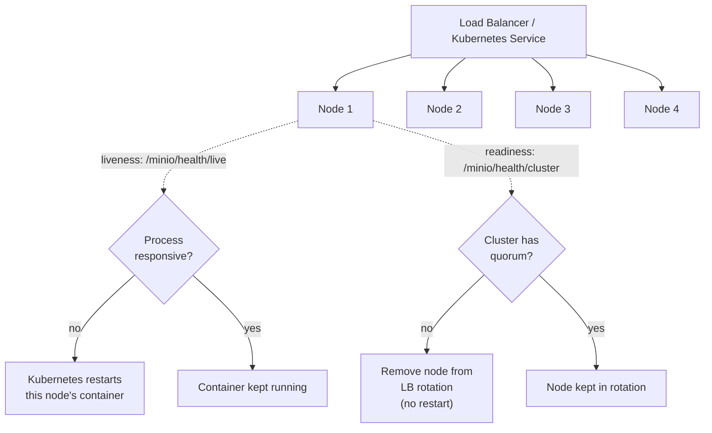
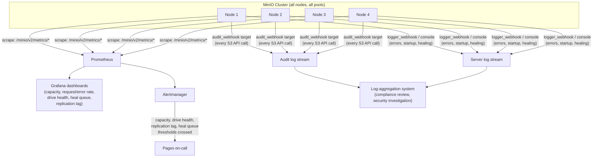

# Monitoring & Observability

Chapter 13 answered "how fast can this cluster go?" with a number, measured once, under controlled load, using `warp`. That number is valuable, but it has a shelf life measured in hours: the moment real traffic hits the cluster, drives fill up, request patterns shift with the business, a node's network card starts flaking, or a healing job silently falls behind — and none of that shows up in a benchmark you ran last Tuesday. Benchmarking tells you what the cluster is *capable of* at a single point in time, under a workload you chose. Monitoring tells you what the cluster is *actually doing*, continuously, under the workload your users chose, whether you're watching or not. This chapter is about building that continuous picture: the metrics MinIO exposes, the dashboards and alerts you build on top of them, the audit trail that answers "who touched what," and the health-check endpoints that let a load balancer or Kubernetes decide, second by second, whether a node deserves traffic at all.

---

## Learning Objectives

By the end of this chapter, you will be able to:

- Enable MinIO's built-in Prometheus metrics endpoint and explain the major categories of metrics it exposes.
- Design a Grafana dashboard for a production MinIO cluster, and justify why each panel earns its place operationally.
- Explain the difference between the MinIO Console's built-in monitoring views and a full Prometheus/Grafana stack, and when each is the right tool.
- Distinguish the `/minio/health/live` and `/minio/health/cluster` endpoints, and wire them correctly into a load balancer and Kubernetes probes.
- Explain what MinIO's audit log captures, how it differs from metrics and server logs, and why it matters for compliance and security investigations.
- Configure server log targets and interpret the operational events they surface (errors, startup/shutdown, healing).
- Translate raw metrics into an alerting strategy that distinguishes "page someone now" from "worth a look on the dashboard tomorrow."

---

## Prerequisites for This Chapter

This chapter assumes you're comfortable with the material from [Chapter 3: Architecture & Internals](./03-architecture-and-internals.md) and [Chapter 12: Distributed Deployment & Site Replication](./12-distributed-deployment-and-site-replication.md):

- How a distributed MinIO deployment is laid out — multiple symmetric nodes, no leader, a load balancer in front, erasure sets spread across drives (Chapter 3).
- What healing is and when it runs: reconstructing missing or corrupted shards after a drive or node failure (Chapter 3, Section 5; also referenced in Chapter 13).
- Server pools and site replication as the two mechanisms for scaling capacity and achieving cross-site resilience (Chapter 12) — this chapter's Real-World Scenario assumes you remember server pools as the lever for adding capacity.
- Chapter 13's performance-tuning vocabulary (network/disk/CPU as the three dominant factors), since several metrics in this chapter are the *continuous, production* version of the same signals `warp` and `iostat` measured as one-off snapshots.

If any of that feels shaky, revisit those chapters first — this chapter assumes the cluster's topology and failure model are already settled and focuses entirely on watching it in production.

---

## 1. The Prometheus Metrics Endpoint

### 1.1 Why Prometheus, specifically

MinIO ships with a **built-in Prometheus-compatible metrics endpoint** — no sidecar exporter, no third-party agent required. Prometheus has become the de facto standard for infrastructure metrics because of its pull-based model (Prometheus scrapes targets on a schedule, rather than every service pushing metrics somewhere) and its query language, PromQL, which is what Grafana dashboards and alert rules are ultimately built on. MinIO exposing metrics natively in this format means the entire ecosystem — Grafana, Alertmanager, and every PromQL-literate engineer — works with zero translation layer.

### 1.2 Enabling metrics

MinIO exposes cluster metrics over HTTP at a well-known path on the S3 API port, authenticated with a bearer token generated via `mc`:

```bash
# Generate a scrape-authentication token (bearer token) for Prometheus
mc admin prometheus generate local
```

This prints a ready-to-use `scrape_config` snippet, including the bearer token, that you drop straight into `prometheus.yml`. Two metrics endpoint styles exist:

- **Cluster metrics** (`/minio/v2/metrics/cluster`) — aggregated, cluster-wide view: total capacity, total requests, cluster-level healing state.
- **Node metrics** (`/minio/v2/metrics/node`) — per-node breakdown, useful for spotting one misbehaving node in an otherwise healthy cluster (a slow drive, a saturated NIC) that a purely cluster-wide aggregate would average away and hide.

Both endpoints exist on every node; since MinIO's nodes are symmetric peers (Chapter 3), Prometheus should be configured to scrape all of them, not just one, both for redundancy and to be able to see node-level metrics at all.

### 1.3 Categories of exposed metrics

The metrics surface is broad. Grouped by the operational question each category answers:

| Category | Answers | Example signals |
|---|---|---|
| **Cluster health & node status** | Is the cluster up, and are all nodes participating? | Node online/offline count, cluster read/write quorum status |
| **Bucket/object counts and sizes** | How much data do we have, and where? | Object count per bucket, total bytes used per bucket, total usable/free capacity |
| **API request rates and latencies** | How is the S3 API performing, per operation? | Requests/sec broken down by operation (`PUT`, `GET`, `DELETE`, `LIST`, `HEAD`), latency histograms per operation, 4xx/5xx error counts |
| **Disk/drive health** | Are the underlying drives OK? | Per-drive online/offline status, per-drive free space, per-drive read/write latency |
| **Healing status** | Is self-healing keeping up? | Objects/shards pending heal, heal jobs in progress, time since last heal completed |
| **Replication status** (site replication, Chapter 12) | Is cross-site replication caught up? | Pending replication bytes/objects, replication failures, replication latency |

This is the same underlying reality Chapter 13 measured with `warp` and `iostat` in a lab setting — request rate, latency, disk health — now exposed as a continuous, scrapeable time series from the production cluster itself, without needing to run a benchmark tool against it.

### 1.4 A scrape-config example

A minimal `prometheus.yml` job scraping every node in a 4-node cluster:

```yaml
scrape_configs:
  - job_name: 'minio-cluster'
    metrics_path: /minio/v2/metrics/cluster
    scheme: https
    bearer_token: '<token from mc admin prometheus generate>'
    static_configs:
      - targets: ['minio-node1:9000']

  - job_name: 'minio-nodes'
    metrics_path: /minio/v2/metrics/node
    scheme: https
    bearer_token: '<token from mc admin prometheus generate>'
    static_configs:
      - targets:
          - 'minio-node1:9000'
          - 'minio-node2:9000'
          - 'minio-node3:9000'
          - 'minio-node4:9000'
    scrape_interval: 30s
```

Note the cluster-metrics job only needs to hit one node (any node can answer for the whole cluster), while the node-metrics job explicitly lists every node — this distinction trips people up the first time they set up scraping and end up with a dashboard that mysteriously only shows one node's disk data.

---

## 2. Grafana Dashboards on Top of Prometheus

### 2.1 Official dashboard templates

MinIO publishes official Grafana dashboard templates (importable by dashboard ID from Grafana's dashboard library, or as JSON from MinIO's own repositories) that are pre-built against the metrics from Section 1. You do not need to hand-craft every panel from scratch — importing the official dashboard is the standard starting point, which you then customize for your own alerting thresholds and panel priorities.

### 2.2 The panels a production dashboard should have, and why

A dashboard is only useful if every panel answers a question someone actually asks during an incident or a planning meeting. The panels below map directly back to Section 1.3's metric categories:

- **Cluster capacity used vs. available.** The single most consequential number on the whole dashboard — a cluster that runs out of capacity stops accepting writes entirely, a full production outage, not a degraded state. This panel should show both the current value and, critically, the *trend* over days/weeks, because capacity problems are entirely predictable in advance if you're watching the slope (see this chapter's Real-World Scenario).
- **Request rate and error rate by API operation.** Request rate shows load and traffic shape (is `GET` or `PUT` dominant right now); error rate (4xx/5xx as a fraction of total requests, broken out per operation) is often the earliest visible sign that something is wrong upstream or downstream of MinIO — a spike in `PUT` 5xx errors while `GET` stays clean points somewhere very different than an across-the-board error spike.
- **Per-drive health.** A grid or heatmap of every drive's online/offline status and free space. One failed drive in a healthy erasure set is a non-event architecturally (Chapter 5) — but it needs to be visible and tracked, because a *second* failure in the same erasure set before the first is healed is how you actually lose data. This panel is the visual complement to the alert in Section 7.
- **Healing queue depth.** How many objects/shards are currently pending heal, and whether that number is shrinking or growing. A healing queue that never drains is a leading indicator of a cluster that can't keep up with its own failure rate — worth its own panel, not buried inside a generic "cluster health" tile.
- **Replication lag** (for clusters using site replication, Chapter 12). Pending bytes/objects not yet replicated to the peer site, and how that number trends over time. A DR site with growing, unbounded replication lag is a DR plan that quietly doesn't work anymore, and the only way to know before you need it is to watch this number continuously.

### 2.3 Why dashboards matter beyond "looks nice"

Every one of these panels exists because it answers a specific operational question fast, under pressure, without anyone needing to SSH into a node and run ad-hoc commands. A good dashboard is what turns "the cluster feels slow" into "PUT p99 latency on node 3 jumped at 14:02, correlated with a drive showing degraded health" — in under a minute, during an actual incident.

---

## 3. The MinIO Console's Built-In Monitoring Views

Chapter 1 introduced the MinIO Console as the web UI for browsing buckets, managing users, and performing one-off admin tasks — and it's worth recapping here that the Console also surfaces a meaningful slice of the same operational picture visually, without standing up a separate Prometheus/Grafana stack at all. Its built-in views cover current capacity usage, node/drive status, and recent request activity, refreshed live.

The distinction that matters operationally:

| | MinIO Console | Prometheus + Grafana |
|---|---|---|
| **Best for** | A quick operational glance — "is the cluster healthy right now?" | Long-term trends, historical comparison, alerting |
| **Setup cost** | Zero — built into MinIO, always available | Separate services to deploy, configure, and maintain |
| **Historical data / trend lines** | Limited to current/recent state | Full history, limited only by Prometheus retention |
| **Alerting** | None | Alertmanager (or equivalent) built on the same metrics |
| **Fits well for** | Small deployments, quick checks, a single operator debugging live | Production deployments of any real size, on-call rotations, capacity planning |

Neither replaces the other by design — the Console is genuinely useful for a fast "let me just check" during a live investigation, and it requires nothing extra to be running. But it cannot alert anyone at 3am, and it cannot answer "how has capacity utilization trended over the last six weeks?" — both of which are exactly what Section 2's dashboard and Section 7's alerts are for. Small deployments (a single dev cluster, a small internal tool) may reasonably stop at the Console; any production deployment of real consequence should run both, using the Console as a convenience layered on top of, not instead of, Prometheus/Grafana.

---

## 4. Health Check Endpoints

MinIO exposes two purpose-built, unauthenticated HTTP endpoints specifically designed to answer the narrow, fast question a load balancer or orchestrator needs answered many times per second: *should I keep sending this node traffic?*

### 4.1 `/minio/health/live` — liveness

`GET /minio/health/live` answers one question: **is this specific MinIO process up and able to respond to HTTP at all?** It returns `200 OK` if the process is alive and responsive, and it deliberately does *not* check the health of the wider cluster, other nodes, or underlying drives — it is intentionally cheap and narrow.

This is what belongs behind:

- A **load balancer's per-node health check**, to stop routing traffic to a node whose process has died or hung, while leaving the rest of the cluster to keep serving.
- A **Kubernetes liveness probe** (tying forward to [Chapter 18](./18-tools-and-ecosystem.md)'s coverage of the MinIO Operator) — if this probe fails repeatedly, Kubernetes concludes the container itself is stuck and restarts it. A liveness check should never depend on anything outside the process itself, which is exactly why this endpoint is scoped the way it is: you don't want a transient network blip to another node causing Kubernetes to restart a perfectly healthy container.

### 4.2 `/minio/health/cluster` — cluster-wide readiness

`GET /minio/health/cluster` answers a broader question: **can this node currently serve requests with the cluster in a state that satisfies read/write quorum?** It returns a non-200 status if the cluster has lost enough drives/nodes that quorum (Chapter 5) is at risk, even if the individual node answering the request is itself perfectly alive.

This is what belongs behind:

- A **load balancer's readiness gate for the whole pool** — distinguishing "this one node is down" (handled by `/minio/health/live` per-node) from "the cluster as a whole shouldn't be trusted with new traffic right now."
- A **Kubernetes readiness probe** — a pod can be alive (liveness passes) but not ready to serve correctly (readiness fails), which tells Kubernetes to stop routing Service traffic to that pod without killing/restarting it, a materially different remediation than what a liveness failure triggers.

### 4.3 Why the split matters

Conflating these two is a common early mistake: wiring `/minio/health/cluster` into a *liveness* probe means a transient, unrelated cluster-quorum blip can cause Kubernetes to restart every node's container simultaneously — exactly the kind of cascading, self-inflicted outage a well-designed health check is supposed to prevent, not cause.



---

## 5. Audit Logging

### 5.1 What audit logging captures

Separately from the metrics stream, MinIO can emit an **audit log**: a structured record of every S3 API call made against the cluster — who made it (which access key/identity), from where (source IP), what it touched (bucket, object key), what operation it was, and whether it succeeded. This is fundamentally different data from Section 1's metrics: metrics are aggregated counters and histograms ("how many `GET`s happened this minute"), while an audit log is a durable, per-request record ("user X fetched object Y at 14:03:07 from IP Z").

### 5.2 Why it matters: compliance and security

This ties directly back to [Chapters 8 and 9](./08-identity-access-management-and-policies.md)'s coverage of IAM, bucket policies, and encryption. Those chapters are about *preventing* unauthorized access up front; audit logging is the complementary control for *proving*, after the fact, exactly what access actually happened — which is precisely what a compliance audit, a security incident investigation, or a "who deleted this object" question needs answered with a durable, queryable record rather than best-effort recollection.

Typical requirements this satisfies:

- **Regulatory compliance** (e.g., demonstrating access controls for sensitive data categories) often explicitly requires an auditable access trail, not just access *controls* — the log itself is the evidence.
- **Security incident response** — when investigating a suspected breach or data exfiltration, the audit log is the record that answers "what exactly did this compromised credential touch, and when," which is a fundamentally different and more urgent use case than a metrics dashboard's aggregate request-rate graph.
- **Internal accountability** — being able to answer "who deleted this bucket's objects" definitively, rather than relying on tribal knowledge or guesswork.

### 5.3 Configuring audit log targets

Audit logs are configured as one or more **targets** that MinIO streams events to — most commonly an HTTP webhook (pointing at a log-aggregation system or a lightweight receiver you run), configured via `mc admin config set`:

```bash
mc admin config set local audit_webhook:compliance \
  endpoint="https://log-aggregator.internal/minio-audit" \
  auth_token="<token>"

mc admin service restart local
```

Because every single S3 API call generates an audit event, audit logging has real volume and throughput implications at scale — this is a genuinely separate stream from metrics, both in what it carries and in the infrastructure it needs behind it (Section 8 revisits this in the worked example, where ShelfSnap ships audit logs to a dedicated log-aggregation system rather than trying to fold them into the metrics/dashboard stack).

---

## 6. Server Logs

Distinct again from both metrics and audit logs, MinIO's **server logs** are application-level operational logs: startup and shutdown messages, configuration errors, internal errors, and healing events (a heal starting, completing, or failing). Where the audit log answers "what did a client do," server logs answer "what is the MinIO process itself doing and encountering."

Server logs (like audit logs) are configured as targets — MinIO supports **console** output (the default, useful for local/dev work and container log collection), **file**-based targets, and **webhook** targets for shipping structured log events to an external system, configured the same way as audit targets:

```bash
mc admin config set local logger_webhook:ops \
  endpoint="https://log-aggregator.internal/minio-server-logs" \
  auth_token="<token>"
```

In a containerized/Kubernetes deployment, the simplest and most common pattern is to leave server logs on console output and let the platform's existing log collection (a DaemonSet-based log shipper, for instance) pick them up from the container's stdout, rather than configuring a MinIO-specific webhook target — a detail worth keeping in mind alongside the audit-log webhook pattern, since the two logs often end up shipped through different mechanisms even when they land in the same eventual system.

---

## 7. Alerting Strategy: What Should Page Someone at 3am

Metrics and dashboards are only as useful as the alerts built on top of them — a dashboard nobody is watching at 3am doesn't stop an outage. The discipline that matters here is translating Section 1's raw metrics into a small number of alert rules that distinguish **things that must wake a human up right now** from **things that are just useful numbers on a dashboard**.

### 7.1 A practical alert set

| Alert | Trigger | Why it pages someone |
|---|---|---|
| **Capacity utilization crossing a threshold** | e.g., cluster-wide usable capacity > 75-80% used | Running out of capacity stops all writes cluster-wide — this is a hard outage, and capacity trends predictably enough that catching it early (Real-World Scenario below) turns a fire drill into a planned pool expansion. |
| **Any drive reporting unhealthy** | A drive transitions to offline/degraded status | One unhealthy drive is tolerable per erasure coding's design (Chapter 5), but it erodes the safety margin against a *second* failure in the same erasure set — worth immediate attention, not next-sprint attention. |
| **Replication lag exceeding a threshold** | Pending replication bytes/objects, or replication delay, above a set bound | A DR site that's silently falling behind is a DR plan that will fail exactly when you need it most — this needs to be caught long before an actual failover is attempted. |
| **Healing queue not draining** | Heal-pending count flat or rising over a sustained window, rather than trending toward zero | A healing queue that never drains means the cluster's self-repair can't keep pace with its own failure rate — left unchecked, this is exactly the condition that turns a single-drive failure into unrecoverable data loss during a second failure. |

### 7.2 The 3am framing

A useful filter for every alert rule you write: **would failing to act on this in the next hour materially increase the risk of an outage or data loss?** If yes, it pages on-call. If the honest answer is "it's worth knowing, but nothing bad happens if we look at it tomorrow morning" — like a moderate, isolated latency blip on one operation type, or a small, recovering dip in throughput — it belongs on the dashboard (Section 2), not in a page. Over-alerting is a real cost: it trains on-call engineers to ignore or snooze pages, which is precisely how the alert that actually mattered gets missed. The four alerts above earn their place because each one, left unaddressed, has a clear, direct path to an outage or unrecoverable data loss — that's the bar every additional alert rule should have to clear.

---

## 8. Worked Example: Designing ShelfSnap's Monitoring Stack

Pulling every piece of this chapter together, here is what ShelfSnap's platform team actually builds around their distributed MinIO cluster (topology from Chapter 12) once it's carrying production traffic:

- **Prometheus** scrapes both the cluster-metrics and node-metrics endpoints (Section 1) from every node in every server pool, on a 30-second interval, with the bearer token generated via `mc admin prometheus generate`.
- **Grafana** runs the official MinIO dashboard, customized with the panels from Section 2 front-and-center: capacity used/available (with a visible trend line), request/error rate by operation for both the `product-images` and `analytics-lake` buckets, a per-drive health grid across all pools, healing queue depth, and — since ShelfSnap runs site replication for DR (Chapter 12) — a dedicated replication-lag panel.
- **Alertmanager**, fed by the same Prometheus instance, is wired to page on-call specifically on the four conditions from Section 7.1: capacity crossing 80%, any drive reporting unhealthy, replication lag exceeding a defined bound, and healing queue depth failing to trend downward over a sustained window. Everything else — moderate latency variance, normal day/night traffic-shape shifts — stays on the dashboard only.
- **Audit logs** are shipped via a webhook target (Section 5.3) to a separate, dedicated log-aggregation system that ShelfSnap's compliance team already uses for other systems — deliberately *not* the same Prometheus/Grafana stack, both because audit records need longer retention for compliance review than metrics do, and because a security investigation needs a durable, tamper-evident, per-request trail that a metrics time series was never designed to provide.
- **Server logs** stay on console output in each MinIO container and are picked up by the platform's existing Kubernetes log-collection pipeline, landing in the same general-purpose log system the rest of ShelfSnap's services already use.
- **Health-check endpoints** are wired into both the front-door load balancer and, for the pools running under the MinIO Operator ([Chapter 18](./18-tools-and-ecosystem.md)), Kubernetes liveness (`/minio/health/live`) and readiness (`/minio/health/cluster`) probes exactly as described in Section 4.

The full picture — two genuinely separate observability pipelines serving two genuinely different purposes — looks like this:



Two things are worth noticing in this design. First, the metrics/alerting pipeline (Prometheus → Grafana/Alertmanager) and the logging pipeline (audit + server logs → log aggregation) are kept genuinely separate, both technically and organizationally — the platform team owns the first for operational health, and the compliance/security team draws on the second, and neither depends on the other being up. Second, the health-check endpoints from Section 4 sit entirely outside both of these pipelines — they're a real-time, per-request routing decision made by the load balancer and Kubernetes, not something that flows through Prometheus at all, even though the *same underlying facts* (is this node alive, does the cluster have quorum) also show up as metrics for historical/dashboard purposes.

---

## Real-World Scenario

**Setup:** ShelfSnap's `analytics-lake` bucket has been growing steadily for months as more stores come online and historical Parquet data accumulates. The cluster's Grafana dashboard has a capacity-utilization alert configured at 80%, wired to page on-call, exactly per Section 7.1.

**The page:** At 2:47am, the on-call engineer gets paged: cluster-wide capacity utilization has crossed 80%. Nothing is actually broken yet — writes are still succeeding, requests are being served normally — but the alert fired specifically *before* the cluster actually runs out of space, which is the entire point of alerting on a leading indicator rather than a hard failure (Section 7.2).

**Diagnosis using the dashboard:** The engineer opens the Grafana capacity panel and looks at the trend line, not just the current value. Utilization has been climbing at a fairly steady rate over the past three weeks, consistent with the pace of new store rollouts onto `analytics-lake`. Extrapolating that trend, the cluster would hit 100% utilization — and stop accepting writes entirely — in roughly nine days if nothing changes. This is precisely why the alert fired at 80% and not 99%: an 80% threshold buys enough runway to respond calmly instead of firefighting a full cluster at 2am.

**Action:** Rather than an emergency response, the engineer files a ticket for the next business day: add a new server pool to the cluster (the capacity-scaling mechanism from [Chapter 12](./12-distributed-deployment-and-site-replication.md)), sized generously enough to absorb several months of projected growth at the observed rate, not just enough to clear the immediate alert. The team schedules and executes the pool expansion during planned maintenance hours, well within the nine-day runway, and capacity utilization drops back to a comfortable level once the new pool comes online and starts absorbing new writes.

**The lesson:** The alert did its job by firing on a *leading indicator* — capacity trend crossing a threshold — long before the *lagging indicator* (writes actually failing because the cluster is full) would have fired. No outage happened, no 3am emergency pool expansion was needed, and the fix was a calm, planned, business-hours change instead of a scramble. This is the exact distinction Section 7.2 draws between alerts that must page immediately and problems that can be handled on a normal schedule — capacity alerts, done right, convert what would otherwise be a hard outage into routine capacity planning.

---

## Best Practices

- **Set up Prometheus/Grafana from day one in production, not as an afterthought.** Retrofitting monitoring after an incident means you have no historical baseline to compare against and no trend data for the exact metric (like capacity) that would have warned you in advance (Section 1, Section 8).
- **Alert on leading indicators — capacity trend, healing queue depth — not only on hard failures.** By the time a hard failure metric fires (cluster full, quorum lost), the outage has typically already started; a leading-indicator alert gives you time to fix it on your own schedule (Section 7, Real-World Scenario).
- **Ship audit logs somewhere durable and separate from the cluster itself.** An audit trail that lives only on the cluster it's auditing is a weaker control — durability and independence from the system being audited both matter for compliance and incident-response credibility (Section 5, Section 8).
- **Wire the correct health-check endpoint into the correct probe** — `/minio/health/live` for liveness (process up), `/minio/health/cluster` for readiness (quorum intact) — and never swap them, since conflating the two can cause cascading, self-inflicted restarts (Section 4.3).
- **Use the Console for quick glances, Prometheus/Grafana for anything you'll need to trend or alert on.** They're complementary, not redundant — don't try to run a serious production deployment on Console-only visibility (Section 3).
- **Keep audit logs, server logs, and metrics as three genuinely separate streams**, each configured and retained according to its own purpose (compliance/security, operational debugging, dashboards/alerting) rather than collapsing them into one pipeline (Section 5, Section 6, Section 8).
- **Review and tune alert thresholds periodically as the cluster grows.** An 80% capacity threshold sized for a small cluster's growth rate may give far less real runway once the cluster is larger and growing faster in absolute terms — thresholds are not "set once and forget."

---

## Common Mistakes

- **Relying only on the Console for a large production deployment.** It's genuinely useful for a quick glance, but it has no long-term trend view and no alerting — a production cluster of real consequence needs Prometheus/Grafana as well, not instead (Section 3).
- **Not alerting on capacity until the cluster is already full.** By the time a "capacity full" condition fires, writes are already failing cluster-wide; the useful alert threshold is well below 100%, with enough runway to act calmly (Section 7, Real-World Scenario).
- **Ignoring healing-queue-depth metrics until a second failure occurs during an unfinished heal.** A heal queue that isn't draining is a visible, measurable warning sign well before it becomes a data-loss incident — treating it as a dashboard curiosity rather than an alert condition wastes the warning (Section 7.1).
- **Not retaining audit logs long enough to satisfy a compliance requirement discovered after the fact.** Retention requirements are often only fully understood once an auditor or investigator actually asks for a specific window of history — decide retention deliberately up front rather than defaulting to whatever the log-aggregation system's out-of-the-box setting happens to be (Section 5).
- **Wiring `/minio/health/cluster` into a Kubernetes liveness probe instead of a readiness probe.** A transient, cluster-wide quorum blip can then trigger container restarts across every node simultaneously — a self-inflicted outage caused by the health check meant to prevent one (Section 4.3).
- **Treating metrics, audit logs, and server logs as interchangeable or mergeable into one pipeline.** They answer different questions for different audiences (operational health vs. compliance/security vs. application debugging) and conflating them tends to under-serve all three (Section 5, Section 6, Section 8).
- **Alerting on every metric that can be graphed, rather than only the ones that meet the "would this cause an outage if ignored for an hour" bar.** Over-alerting trains on-call engineers to tune out pages, which is how the alert that actually mattered gets missed (Section 7.2).

---

## Summary

- Benchmarking (Chapter 13) measures capacity at a point in time; monitoring watches what's actually happening in production, continuously — they are complementary, not substitutes for each other.
- MinIO exposes a built-in Prometheus metrics endpoint (cluster- and node-scoped), covering cluster health, capacity, per-operation API request rates and latencies, drive health, healing status, and replication status (Section 1).
- Grafana dashboards, built on official MinIO templates, should prioritize panels for capacity trend, request/error rate by operation, per-drive health, healing queue depth, and replication lag — each mapping to a specific operational question (Section 2).
- The MinIO Console's built-in monitoring views are useful for a quick operational glance, especially in smaller deployments, but don't provide long-term trends or alerting — a full Prometheus/Grafana stack is still needed for serious production use (Section 3).
- `/minio/health/live` (liveness — is the process up) and `/minio/health/cluster` (readiness — does the cluster have quorum) are distinct endpoints with distinct roles in load balancers and Kubernetes probes, and conflating them causes real incidents (Section 4).
- Audit logging is a separate stream from metrics: a durable, per-request record of every S3 API call, essential for compliance and security investigation, distinct from the application-level server logs that capture errors, startup/shutdown, and healing events (Section 5, Section 6).
- Effective alerting translates raw metrics into a small set of rules that page on genuine leading indicators of outage or data loss — capacity trend, drive health, replication lag, healing queue depth — while leaving everything else as dashboard-only information (Section 7).
- ShelfSnap's monitoring stack demonstrates the full pattern in production: Prometheus scraping all nodes, Grafana dashboards, Alertmanager paging on-call for capacity/drive-health thresholds, and audit logs shipped separately to a dedicated compliance log-aggregation system (Section 8).

---

## Knowledge Check

1. Explain the difference between what Chapter 13's `warp` benchmarking measures and what this chapter's monitoring stack measures. Why do you need both?
2. A colleague configures a Kubernetes liveness probe to hit `/minio/health/cluster` instead of `/minio/health/live`. What could go wrong, and why does the distinction between these two endpoints matter?
3. Your platform team already has the MinIO Console open on a shared monitor for "at-a-glance" health checks. A manager asks why you still need Prometheus and Grafana. What's your answer?
4. Walk through why an alert on "cluster capacity utilization crossing 80%" is more useful operationally than an alert on "cluster capacity utilization at 100%." What does the 80% threshold buy you that the 100% one doesn't?
5. Explain why audit logs and metrics are kept as separate streams rather than being combined into one pipeline, using a concrete example of a question each one can answer that the other cannot.

---

## Hands-On Exercise

**Goal:** Enable MinIO's Prometheus metrics endpoint on a local instance, scrape it manually, understand how a Grafana dashboard would consume it, and exercise the liveness health-check endpoint.

1. **Start (or reuse) a local MinIO instance**, following the Docker-based setup from Chapter 1/Chapter 3's exercises, exposing the API on port 9000.

2. **Generate a Prometheus scrape token:**

   ```bash
   mc admin prometheus generate local
   ```

   This prints a `scrape_config` block including a bearer token. Copy the token value.

3. **Scrape the metrics endpoint manually with `curl`**, using the token from step 2:

   ```bash
   curl -H "Authorization: Bearer <token>" http://localhost:9000/minio/v2/metrics/cluster
   ```

   You should see raw Prometheus-format metrics text (lines like `minio_cluster_capacity_usable_total_bytes ...`). Scroll through the output and identify at least one metric from each category in Section 1.3 (capacity, request rate, drive health).

4. **(Optional) Point a local Prometheus instance at it** by adding the `scrape_config` block from step 2 into a local `prometheus.yml`, starting Prometheus (e.g., via Docker), and confirming the target shows as `UP` in Prometheus's own `/targets` page at `http://localhost:9090/targets`.

5. **Describe importing the official Grafana dashboard:** if you have a local Grafana instance available, add your Prometheus instance as a data source, then import MinIO's official dashboard (via its dashboard ID or JSON definition from MinIO's public dashboard repository). If you don't have Grafana running, write out in your own words which three panels from Section 2.2 you would place at the very top of the dashboard for your own cluster, and why.

6. **Hit the liveness health-check endpoint:**

   ```bash
   curl -i http://localhost:9000/minio/health/live
   ```

   Confirm you get back an HTTP `200` with an empty body. Note that this endpoint required no authentication — by design, since a load balancer or kubelet performing thousands of health checks per day shouldn't need to carry credentials to do so.

7. **Reflect:** compare the richness of the metrics output from step 3 against the single-bit yes/no answer from step 6. Explain, in a sentence or two, why a load balancer's health check needs to be cheap and narrow (Section 4.1) while a monitoring dashboard needs to be broad and detailed (Section 1.3) — they're solving genuinely different problems even though both are "observability."

---

## Further Reading

- [MinIO Metrics and Alerts](https://min.io/docs/minio/linux/operations/monitoring/metrics-and-alerts.html) — the official reference for the Prometheus metrics endpoint, metric categories, and scrape configuration covered in Section 1.
- [MinIO Healthcheck Probes](https://min.io/docs/minio/linux/operations/monitoring/healthcheck-probe.html) — official documentation for `/minio/health/live` and `/minio/health/cluster`, including load balancer and Kubernetes probe guidance from Section 4.
- [MinIO Bucket and Server Audit Logging](https://min.io/docs/minio/linux/operations/monitoring/bucket-notifications.html) — background on MinIO's logging and notification targets referenced in Sections 5 and 6.
- [MinIO Monitoring and Alerting Guide](https://min.io/docs/minio/linux/operations/monitoring.html) — the umbrella page tying together metrics, healthcheck, logging, and Console-based monitoring covered throughout this chapter.
- [MinIO Linux Documentation Index](https://min.io/docs/minio/linux/index.html) — the umbrella reference for deployment, operations, and monitoring guidance across the whole product.

---

<div style="display:flex;justify-content:space-between;align-items:center;">
  <a href="./13-performance-tuning-and-benchmarking.md">← Previous: Performance Tuning & Benchmarking</a>
  <a href="./00-index.md">🏠 Index</a>
  <a href="./15-security-best-practices.md">Next: Security Best Practices →</a>
</div>
