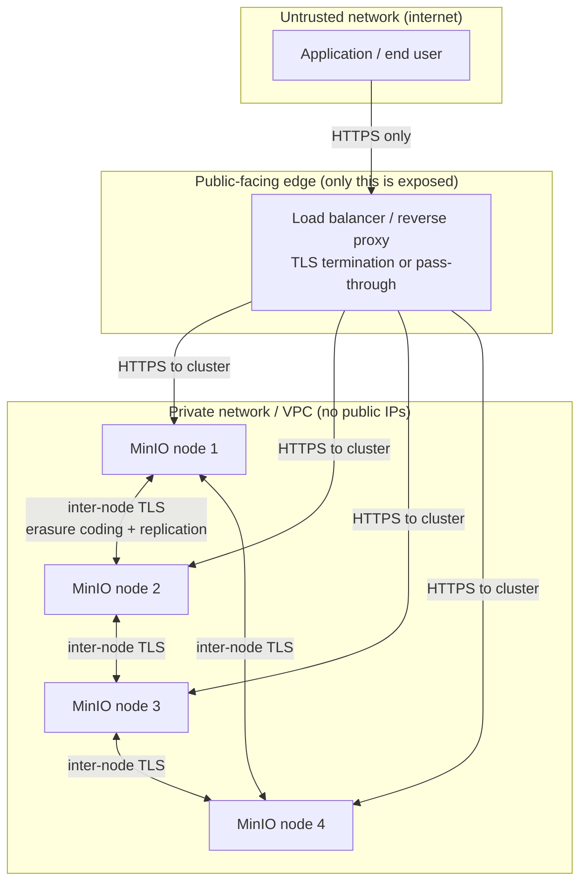
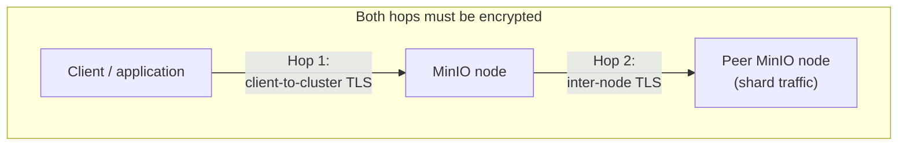
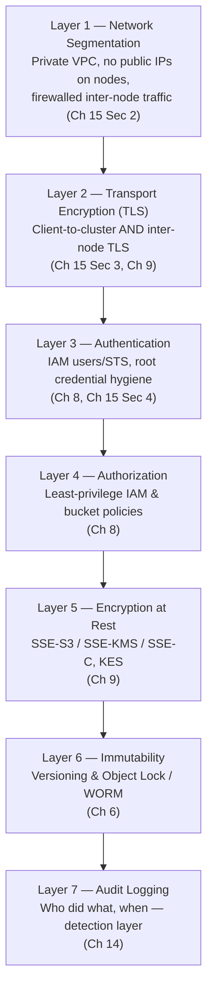

# Security Best Practices

Chapters 8 and 9 gave you two of the three pillars of MinIO security in real depth: Chapter 8 covered *who* can do *what* — IAM users, groups, policies, STS, bucket policies, and presigned URLs — and Chapter 9 covered *protecting data itself* — encryption at rest and in transit, SSE-S3, SSE-KMS, SSE-C, and KES-backed key management. Both chapters assumed something important without spelling it out: that the MinIO deployment those policies and keys are protecting is itself reachable only by the right people, over the right network paths, running on a reasonably hardened host. That assumption is not automatically true — it is a separate thing you have to build. This chapter is that missing layer: the infrastructure and network security wrapper around everything Chapters 8 and 9 taught you. A perfectly designed least-privilege policy means nothing if the cluster is bound to `0.0.0.0` on a public IP with no TLS. A flawless SSE-KMS encryption setup means nothing if the root credentials that can bypass every policy are sitting in a CI pipeline's plaintext environment variables. Access control and encryption are what happens *inside* the deployment; this chapter is about making sure the deployment itself — the network it sits on, the transport it speaks, the credentials that can reach it, and the host it runs on — doesn't undermine all of that good work from the outside.

---

## Learning Objectives

By the end of this chapter, you will be able to:

- Explain why directly exposing an unauthenticated or TLS-less MinIO deployment to the public internet is a genuine, common, and well-documented class of real-world data breach, not a theoretical risk.
- Design a network topology for MinIO that keeps nodes in a private network, exposes only what's necessary through a load balancer, and firewalls inter-node replication and erasure-coding traffic to the cluster's own members.
- Configure and reason about TLS for both client-to-cluster traffic and inter-node traffic in a distributed MinIO deployment, and explain why the second is just as important as the first.
- Apply root credential hygiene: rotation, secrets-manager storage, and near-total avoidance of root credentials for day-to-day operations.
- Assemble network segmentation, TLS, authentication, authorization, encryption at rest, immutability, and audit logging into a single defense-in-depth stack, and explain what each layer catches that the others might miss.
- Harden the underlying host OS that MinIO runs on, distinguishing "MinIO root API user" from "the OS user MinIO runs as."
- Build a concrete, checklist-driven incident response plan for a suspected credential compromise.

---

## Prerequisites for This Chapter

This chapter builds directly on [Chapter 8: Identity, Access Management & Policies](./08-identity-access-management-and-policies.md) and [Chapter 9: Encryption & Key Management](./09-encryption-and-key-management.md). We assume you already know:

- How MinIO's IAM model works: users, groups, policies, the root account, STS, and how bucket policies interact with IAM policies (Chapter 8).
- The principle of least privilege and how to write a scoped IAM policy instead of relying on broad or root-level access (Chapter 8).
- The difference between encryption in transit and encryption at rest, and MinIO's SSE-S3/SSE-KMS/SSE-C options plus the role KES plays as a key management server (Chapter 9).
- Enough general networking vocabulary — private networks, firewalls, load balancers, TLS handshakes — to follow topology diagrams without those terms needing re-derivation (Chapter 1's prerequisites).

If any of that feels shaky, revisit those chapters first. This chapter treats "who can access what" and "is data encrypted" as settled ground, and focuses entirely on making sure the deployment those answers apply to is actually reachable only the way you intend.

---

## 1. Network Exposure: The Most Common, Most Preventable Breach Pattern

### 1.1 A genuinely common incident class, not a hypothetical

If you follow security news for even a few months, a pattern repeats with depressing regularity: an object storage bucket — an AWS S3 bucket, an Azure Blob container, a self-hosted MinIO deployment — is found sitting on the public internet with no authentication, or with authentication so weak (default credentials, no TLS, an open `mc` admin console) that it might as well have none. Researchers, journalists, or attackers stumble across it, and whatever was inside — customer records, internal documents, backups, credentials, medical data — is exposed. This has happened to major companies, government agencies, and startups alike, across every major object storage platform, S3-compatible or not. It is not a MinIO-specific flaw and not a rare edge case; it is simply what happens when a storage system designed to be reachable over HTTP is deployed without the access controls that make "reachable" mean something different from "public."

The mechanism is almost always mundane, not sophisticated:

- A developer spins up MinIO for a quick test, binds it to a public-facing interface or exposes its port through a cloud security group opened to `0.0.0.0/0`, intends to lock it down "later," and later never comes.
- A cluster is deployed with the default `minioadmin`/`minioadmin` credentials (or another well-known default) and nobody rotates them before the deployment goes live.
- TLS is skipped "for now" during initial setup, and credentials or presigned URLs end up traveling in plaintext across a network that turns out not to be as private as assumed.
- Infrastructure-as-code templates are copied from an example or tutorial that prioritized simplicity over security, and the insecure defaults ship straight into production.

None of these require a sophisticated attacker. Automated internet-wide scanners actively probe for exactly this kind of misconfiguration — an open object storage port with no auth is often found and exploited within hours or days of going live, not months. The lesson this chapter opens with is simple and worth internalizing before anything else: **the single highest-leverage security decision you will make about a MinIO deployment is whether it is ever reachable, in any form, from an untrusted network without authentication and TLS in front of it.** Everything else in this chapter assumes that baseline is already correct.

### 1.2 What "never expose directly" actually means

This doesn't mean MinIO can never serve internet traffic — plenty of legitimate use cases need internet-facing object storage (public asset delivery, presigned upload endpoints for end users). It means:

- The MinIO **API port and Console port** should never be the thing a public client connects to directly. A load balancer, reverse proxy, or CDN sits in front, terminates or forwards TLS, and is the only component actually facing untrusted networks.
- **Authentication must always be enforced** — either MinIO's own IAM (Chapter 8) for authenticated clients, or carefully scoped, time-limited presigned URLs (also Chapter 8) for anonymous/public access patterns. "No authentication" should never be a reachable state from an untrusted network, even temporarily during setup.
- **TLS must always be in front of anything internet-facing** — Section 3 covers this in depth, but the short version is: if a request can cross an untrusted network, it must be encrypted, full stop.

---

## 2. Network Segmentation: Keep the Cluster Off Untrusted Networks Entirely

Even with authentication and TLS both correctly configured, the strongest posture is to never let untrusted networks reach the MinIO nodes at all. Defense-in-depth (Section 5) means each layer should assume the layer above it might someday fail — a segmented network limits the blast radius of a future TLS misconfiguration or a leaked credential, because the attacker still has to get onto the right network segment first.

### 2.1 The recommended topology

The rules this diagram encodes:

- **MinIO nodes themselves never receive a public IP address.** They live in a private subnet/VPC that is not routable from the internet at all — not "firewalled to deny by default," but architecturally absent from any public route table.
- **The load balancer is the only component with a public-facing presence**, and it is deliberately narrow in scope: it terminates or passes through TLS and forwards to the cluster. It is easier to harden, patch, and monitor one narrow-purpose edge component than an entire multi-node storage cluster.
- **For fully internal use cases — an analytics data lake feeding only internal ETL jobs, for example — there may be no public-facing component at all.** If nothing outside your own private network ever needs to reach the bucket, don't put anything internet-facing in front of it; the most secure network path is the one that doesn't exist.

### 2.2 Firewalling inter-node traffic specifically

Distributed MinIO deployments (Chapter 12) generate constant peer-to-peer traffic between nodes: erasure-coding shard writes and reads on every request (Chapter 13, Section 1.1), plus site-replication traffic if cross-site replication is configured. This inter-node traffic carries the same sensitive data the client-facing API does — a shard of a customer record is still a piece of a customer record — and it deserves the same suspicion as the front door.

Concretely:

- Firewall rules (security groups, network ACLs, or host-level `iptables`/`nftables`) should permit the MinIO inter-node port (default `9000`, or whatever you've configured) **only from the other nodes in the same cluster**, not from the private network at large. A compromised host elsewhere in your VPC should not be able to talk to the cluster's internal replication port just because it's "on the private network."
- If you run site replication (Chapter 12) between geographically separate clusters, that cross-site traffic crosses a genuinely untrusted path (the public internet, or at best a semi-trusted WAN link) and needs its own TLS and its own tightly scoped firewall rule — typically a VPN tunnel or a dedicated private interconnect between sites, with firewall rules that permit only the specific site-to-site replication traffic, not a blanket allow between two entire networks.
- Treat the list of "hosts allowed to reach the inter-node port" as a small, explicit, reviewed set — the same discipline Section 7 recommends for access policies applies here too.

---

## 3. TLS Everywhere: Client-Facing and Inter-Node, Both

Chapter 9 introduced TLS as the transport-encryption half of "encryption in transit vs. encryption at rest," focused mainly on the client-to-cluster API path. This section recaps that briefly and then expands it to cover the piece that is easy to forget: **TLS between the nodes themselves.**

### 3.1 Client-to-cluster TLS (recap)

Every request from an application, `mc`, or an SDK to the MinIO API (and to the Console) should travel over HTTPS, not plain HTTP. Concretely, this means:

- A valid TLS certificate (from a public CA for internet-facing deployments, or from an internal/private CA for internal-only deployments) installed on each node or on the load balancer terminating TLS in front of the cluster.
- MinIO configured to serve HTTPS directly (certificates placed in MinIO's certs directory) when nodes terminate TLS themselves, or a load balancer configured to terminate TLS and forward to MinIO over a trusted private network segment when the load balancer does it instead.
- No fallback to plain HTTP for any client path — credentials, presigned URL signatures, and object data should never have a plaintext transport option available to accidentally fall back to.

### 3.2 Inter-node TLS: the part that's easy to skip

Here is the expansion that matters for this chapter: in a distributed MinIO deployment, **the traffic between nodes is not automatically covered by client-facing TLS.** Client TLS protects the hop from an application to whichever node or load balancer it talks to. It says nothing about the hop from that node to its peers when it fans out erasure-coding shard writes, reads back shards to reconstruct an object, or streams replication data to another site.

If inter-node TLS is left unconfigured:

- Erasure-coded shard data — real fragments of real objects — crosses the network between nodes in plaintext, even if every client connection into the cluster is perfectly encrypted.
- Site-replication traffic between clusters, which by definition crosses a network boundary between two separate deployments, travels unencrypted unless explicitly configured otherwise.
- Anyone who can observe traffic on the private network segment the nodes share (a compromised host on the same subnet, a misconfigured network tap, a cloud provider's own internal network in a shared-tenancy scenario) can potentially reconstruct object data from the shard traffic, entirely bypassing the fact that the client-facing API looked secure.

MinIO supports configuring TLS for inter-node communication using the same certificate mechanism as client-facing TLS — each node presents a certificate the other nodes trust, and the internal RPC/shard traffic is encrypted just like the external API traffic. For any distributed deployment that takes security seriously, **inter-node TLS is not optional hardening — it is the second half of "TLS everywhere," and skipping it leaves exactly the kind of traffic (raw shard data) that most needs protecting completely exposed.**

### 3.3 The full transport picture

A deployment with Hop 1 encrypted and Hop 2 left in the clear is, in a real sense, only half-covered — and the half that's missing is the one carrying the actual data shards, not just the request/response envelope.

---

## 4. Root Credential Hygiene

Chapter 8 covered the root account's role in MinIO's IAM model and the standing recommendation to avoid using it day-to-day. This section reinforces that guidance specifically as an infrastructure-security concern, because root credentials are, functionally, a master key that bypasses every policy Chapter 8 taught you to write carefully.

### 4.1 Why root credentials deserve special handling

The MinIO root user is not subject to IAM policy evaluation — it has unconditional access to every administrative operation and every bucket, by design, the same way a database superuser bypasses row-level security. That makes root credentials the single highest-value target in the entire deployment: a leaked root access key and secret key is equivalent to a full compromise of every bucket, every policy, and every encryption configuration in the cluster, regardless of how carefully every other user's permissions were scoped.

### 4.2 Rotation

Root credentials should be rotated on a defined schedule, not left static indefinitely:

- Set an explicit rotation cadence (commonly every 90 days, or per your organization's credential policy) and treat it as a routine operational task, not an emergency-only action.
- Rotate immediately, out of cycle, whenever there is any reason to suspect exposure — a departing team member who had access, a credential accidentally committed to a repository, a suspicious audit log entry (Section 8 and Chapter 14 cover the detection side of this).
- Rotation should be a rehearsed procedure, not something improvised for the first time during an actual incident — know in advance exactly which command updates the root credentials and how dependent services will pick up the new value.

### 4.3 Secrets manager, never environment variables in version control

Root credentials (and, really, any long-lived MinIO access key) should live in a proper secrets manager — HashiCorp Vault, AWS Secrets Manager, GCP Secret Manager, Azure Key Vault, or an equivalent — not in:

- A `.env` file or shell environment variable set directly in a server's startup script with no access control of its own.
- A Kubernetes manifest, Docker Compose file, or Terraform variable checked into a Git repository, even a private one — private repositories still have broader read access than a secrets manager's tightly scoped IAM policy, and Git history retains old values indefinitely even after a credential is later rotated out of the current file.
- A CI/CD pipeline's plaintext configuration, rather than that pipeline's secrets-store integration (most CI platforms — GitHub Actions, GitLab CI, Jenkins — have a proper encrypted-secrets feature specifically to avoid this).

The pattern to follow is: the secrets manager holds the credential, the application or deployment pipeline fetches it at runtime (or injects it as an environment variable at deploy time from the secrets manager, not from a checked-in file), and the credential is never written to disk anywhere it could be casually found by grepping a repository or a build log.

### 4.4 Essentially never use root for day-to-day operations

Reinforcing Chapter 8's core recommendation: root credentials should be reserved for genuinely administrative, break-glass scenarios — initial cluster bootstrap, IAM configuration itself, disaster recovery — and essentially nothing else. Every application, every service account, every human operator's routine work should authenticate with a scoped IAM user or STS-issued temporary credential carrying only the permissions that specific task needs (Chapter 8's least-privilege guidance). If root credentials show up in application code, a CI pipeline, or a developer's daily `mc alias` configuration, that is itself a finding worth treating as a security gap, not a convenience worth keeping — Section 6 of this chapter's Real-World Scenario shows exactly this mistake being caught in a review.

---

## 5. Defense-in-Depth: Assembling the Full Stack

Every chapter so far has taught one layer of security in isolation. This section's entire point is to stop treating them as separate topics and assemble them into a single mental model: a stack of layers, each catching what the ones around it might miss.

### 5.1 The full stack, layer by layer

Walking through what each layer specifically catches:

1. **Network segmentation (Section 2).** Catches: an attacker who has no foothold on your private network at all. Even a leaked API credential is useless to someone who can't route to the cluster in the first place. Misses: anything from a host that *is* already on the private network.
2. **Transport encryption / TLS (Section 3).** Catches: passive network eavesdropping — someone who *can* see the traffic but shouldn't be able to read it. Misses: anything if the attacker has valid credentials and a legitimate network path; TLS protects data in motion, not who's allowed to move it.
3. **Authentication (Chapter 8, Section 4).** Catches: anyone without valid credentials — the front door is locked. Misses: what a *valid* but overly broad credential is allowed to do once authenticated.
4. **Authorization / least privilege (Chapter 8).** Catches: a valid but compromised low-privilege credential being used to reach data or operations it was never scoped for. Misses: an attacker who has actually stolen a broad, over-privileged credential — least privilege limits blast radius, it doesn't prevent theft.
5. **Encryption at rest (Chapter 9).** Catches: someone who gets access to the raw disks or backups themselves — a stolen drive, an improperly decommissioned server, cloud storage snapshots reused elsewhere — without also having the decryption key.
6. **Immutability / versioning and Object Lock (Chapter 6).** Catches: an attacker (or a mistaken insider) with write/delete access who tries to destroy or tamper with data — WORM retention means even a compromised credential with delete permission cannot actually remove locked objects before their retention period expires.
7. **Audit logging (Chapter 14).** Catches: everything upstream, after the fact — it's the layer that lets you *detect* that one of the other layers was bypassed or a credential was misused, and reconstruct exactly what happened. It doesn't prevent an incident, but without it you often wouldn't know one occurred at all.

### 5.2 Why layering matters more than any single control

No single layer in this stack is sufficient alone, and that's the point of calling it defense-in-depth rather than "the security feature." A cluster with flawless IAM policies but no TLS is compromised by a passive network observer. A cluster with excellent TLS but a leaked root credential is fully compromised regardless of how good the transport encryption is. A cluster with great authentication and authorization but no audit logging might be quietly misused for months with no one the wiser. Each layer exists specifically because the layers around it have realistic failure modes, and a genuinely secure deployment assumes some layer will eventually be misconfigured, bypassed, or have a credential leak through it — and relies on the *next* layer to limit the damage rather than assuming that one failure means total compromise.

---

## 6. Hardening the Host: OS, Patching, and a Critical Terminology Note

Everything above concerns the network and the MinIO application layer. One layer further down is the host operating system MinIO actually runs on, and it deserves brief but real attention.

### 6.1 Keep MinIO and the OS patched

- **MinIO itself** should be kept reasonably current with upstream releases, particularly security-relevant patches. Track MinIO's release notes for CVEs or security-relevant fixes, and have a process (even a lightweight one) for applying updates in a timely way rather than running a version years out of date because "it works."
- **The host OS** underneath MinIO — kernel, system libraries, container runtime if you're running MinIO in a container — needs the same patching discipline as any other production server. A hardened MinIO configuration sitting on an unpatched, exploitable OS is only as secure as that OS is.

### 6.2 Run MinIO as a non-root OS user — and disambiguate the terminology

This is a genuinely important point of confusion worth calling out explicitly, because the word "root" means two completely different things in this chapter and in Chapter 8:

- **MinIO's "root" API user** (Chapter 8) is an *application-level* concept: the IAM identity with unconditional access to every MinIO operation, authenticated with an access key and secret key over the S3 API. It has nothing to do with the operating system.
- **The OS "root" user** is a completely separate, *operating-system-level* concept: the Linux superuser account with unrestricted access to the entire host — every file, every process, every device.

These two are unrelated, and conflating them is a real mistake to avoid. The MinIO *process* itself — regardless of which MinIO API user is authenticating against it — should run as a dedicated, unprivileged OS user (commonly created specifically for this purpose, e.g., a `minio-user` system account), never as the OS `root` user. This follows the general principle of least privilege one level down the stack: if the MinIO process itself is ever compromised (through a vulnerability in MinIO, a misconfigured plugin, or any other process-level exploit), running it as an unprivileged OS user limits what that compromise can do to the rest of the host — it cannot trivially read other users' files, modify system configuration, or escalate further, the way a compromised process running as OS root could.

### 6.3 Minimize what else runs on MinIO nodes

Nodes that run MinIO should, as a general hardening principle, run as little else as possible:

- Avoid co-locating unrelated application workloads, web servers, or development tools on the same hosts as production MinIO nodes — every additional running service is additional attack surface and additional software that needs its own patching discipline.
- Disable or remove unused OS services, and keep the set of open network ports on each node limited to exactly what MinIO (and its monitoring/SSH access) require.
- Treat MinIO nodes as purpose-built infrastructure, provisioned and configured consistently (ideally via infrastructure-as-code) rather than hand-tuned, drifting servers that accumulate ad hoc changes over time.

---

## 7. Security Scanning and Ongoing Compliance Review

Security hardening is not a checkbox you complete once at deployment time — it's an ongoing practice, and this section covers the two pieces of tooling and process that keep it that way.

### 7.1 Vulnerability scanning in CI/CD

If you deploy MinIO as a container image (a common pattern, especially with the MinIO Operator on Kubernetes — previewed in Chapter 18), scan that image for known vulnerabilities as part of your CI/CD pipeline, using a tool like Trivy, Grype, or your cloud provider's native image-scanning service. This catches known CVEs in the base image or bundled dependencies before the image ever reaches production, and should run automatically on every build, not as a manual, occasional step someone remembers to do.

### 7.2 Periodic access-policy review

Chapter 8 taught you how to write a least-privilege policy at the moment you create it. What Chapter 8 didn't emphasize, and what belongs squarely in this chapter's infrastructure-and-process lens, is that **a policy that was correctly scoped on the day it was written can become over-privileged over time** without anyone changing a single line of it — because the person or service it was granted to changed roles, the project it supported was decommissioned, or the access was only ever meant to be temporary and nobody circled back.

Make access review a recurring, scheduled practice, not a one-time setup step:

- Periodically (quarterly is a common cadence) enumerate every IAM user, group, and service account, and ask: does this identity still need this access, and is the scope still the minimum required?
- Pay particular attention to service accounts and access keys created for a one-off migration, a proof-of-concept, or a former employee's project — these are exactly the credentials most likely to be forgotten and least likely to be missed if disabled.
- Cross-reference access grants against audit logs (Chapter 14): a policy granting broad access that the logs show has never actually been exercised is a strong candidate for tightening.

---

## 8. Incident Response Readiness: A Concrete Checklist

The best time to decide how you'd respond to a suspected credential compromise is before it happens, not during it. This section gives a brief, concrete checklist to have ready.

**Upon suspecting a credential (root or IAM) may be compromised:**

1. **Rotate the affected credential immediately.** Generate new access keys for the affected identity (or the root account, per Section 4.2's rehearsed procedure) and invalidate the old ones — don't wait for confirmation of compromise before rotating; the cost of an unnecessary rotation is far lower than the cost of a delayed one.
2. **Review audit logs (Chapter 14) for the affected credential's activity.** Reconstruct exactly what operations were performed, from where, and when — this tells you the actual scope of what needs remediation, not just what's theoretically possible with that credential's permissions.
3. **Check object versions and integrity (Chapters 5–6).** If the audit trail shows write or delete operations you can't account for, use versioning to inspect and, if necessary, restore prior object versions; if Object Lock/WORM was in place on the affected buckets, confirm it actually prevented any destructive action from succeeding.
4. **Determine blast radius using the policy attached to the credential.** A least-privilege policy (Chapter 8, Layer 4 of Section 5) turns this step from "assume everything is compromised" into "here is the specific, bounded set of buckets and operations that were exposed" — another concrete payoff of having done the least-privilege work in the first place.
5. **Check whether the credential appears anywhere it shouldn't** — a CI pipeline's logs, a repository's history, a developer's local shell history or config file — and remove it from every location found, not just the IAM system itself.
6. **After containment, do a short retrospective**: how did the credential get exposed, and which layer of the Section 5 stack should have caught it sooner? Feed the answer back into the periodic review process from Section 7.2.

Having this checklist agreed upon and lightly rehearsed in advance — even just a tabletop walkthrough — is the difference between a calm, methodical response and an improvised scramble under pressure.

---

## Real-World Scenario

**Setup:** ShelfSnap's largest retail customer is about to begin a compliance audit of ShelfSnap's data-handling practices ahead of signing a multi-year contract renewal. The platform team schedules an internal security review of the production MinIO deployment first, working through this chapter's defense-in-depth checklist layer by layer, before the external auditors arrive.

**Layer 1 — Network segmentation.** The review confirms MinIO nodes sit in a private VPC subnet with no public IPs, and only the load balancer is internet-facing. Good. But digging into the security group rules, the reviewer finds the inter-node port (`9000`) is open to the *entire* private VPC CIDR range, not scoped to just the four MinIO node IPs. **Gap found:** any compromised host anywhere else in the VPC — a web server, a test box, a forgotten development instance — could currently reach the cluster's internal replication/shard traffic port. The fix: tighten the security group rule to allow port `9000` only from the specific IPs (or a dedicated security group) of the cluster's own nodes.

**Layer 2 — Transport encryption.** Client-facing TLS is confirmed correctly configured: the load balancer holds a valid certificate and all client traffic is HTTPS-only. But checking the node configuration further, the reviewer finds **inter-node TLS was never enabled** — the cluster was originally stood up quickly for a proof-of-concept, TLS was added for the client-facing path before go-live, and inter-node TLS was simply never circled back to. **Gap found:** erasure-coding shard traffic and replication data between nodes has been traveling in plaintext across the private network this whole time. The fix: generate and deploy inter-node certificates and enable TLS for internal cluster communication, per Section 3.2.

**Layer 3 — Authentication and root hygiene.** IAM users look properly scoped for the application's service accounts. However, while reviewing the CI/CD pipeline configuration for the nightly ETL job, the reviewer finds the pipeline authenticates to MinIO using **the root access key and secret key, stored as plaintext environment variables directly in the CI platform's job configuration** — not the secrets manager the rest of the organization uses, and not a scoped service account. **Gap found:** exactly the anti-pattern Section 4.3 and 4.4 warn about — root credentials in a CI pipeline, outside a secrets manager. The fix: create a narrowly scoped IAM user with only the permissions the ETL job actually needs (write access to `analytics-lake`, nothing else), move the credential into the organization's secrets manager, update the pipeline to fetch it from there, and rotate the root credentials afterward since they've been sitting in CI configuration for an unknown period.

**Layer 4 — Authorization.** Running through the current IAM policies, the reviewer finds most are appropriately scoped — except for one service account, created eighteen months earlier for a since-completed data migration project, that still holds a broad policy granting read/write/delete across every bucket in the deployment. **Gap found:** an old, over-privileged service account that was never revoked once its original purpose ended — exactly the drift Section 7.2 describes. The fix: confirm with the team that the migration project is indeed finished and nothing depends on this account any longer, then disable and remove it.

**Layers 5–7 — Encryption at rest, immutability, and audit logging.** These check out: SSE-KMS is correctly configured for the buckets containing customer data, Object Lock in compliance mode is applied to the buckets holding audit-relevant records, and audit logging is enabled and flowing into the organization's log pipeline (Chapter 14) with a reasonable retention period.

**Outcome:** the internal review catches and closes three real gaps — the overly broad inter-node firewall rule, the missing inter-node TLS, and both the CI pipeline's root-credential use and the stale over-privileged service account — all before the external auditors arrive. The team documents each finding, the specific `mc admin` or configuration change that closed it, and the date it was remediated, turning what could have been an audit finding into a demonstrated, working security review process. This is precisely the value of walking the defense-in-depth stack layer by layer on a schedule (Section 7.2), rather than assuming that "we set up security correctly once" is still true a year and a half later.

---

## Best Practices

- **Never expose a MinIO deployment directly to the public internet without authentication and TLS.** Put a load balancer or reverse proxy in front, and keep the nodes themselves off any publicly routable network entirely where possible (Section 1, Section 2).
- **Enable TLS for both client-facing and inter-node traffic in any distributed deployment.** Client TLS alone leaves erasure-coding shard traffic and replication data exposed on the internal network (Section 3).
- **Rotate root credentials on a defined schedule and store them in a proper secrets manager** — never in environment variables, config files, or anything checked into version control (Section 4).
- **Reserve root credentials for genuine break-glass administrative tasks only.** Every application, service, and routine human workflow should use a scoped IAM user or STS credential instead (Section 4.4, Chapter 8).
- **Firewall inter-node and replication traffic to the cluster's own members**, not the broader private network it sits on — "private network" is not the same guarantee as "only trusted hosts" (Section 2.2).
- **Run the MinIO process as a dedicated, unprivileged OS user**, and keep the host OS and MinIO version patched (Section 6).
- **Review access policies and revoke unused service accounts on a recurring schedule** — treat this as ongoing operational hygiene, not a one-time setup task (Section 7.2).
- **Have a rehearsed incident-response checklist for credential compromise ready before you need it** (Section 8).

---

## Common Mistakes

- **Exposing an unauthenticated or weakly-authenticated MinIO instance to the public internet**, whether through a misconfigured security group, a "temporary" test deployment that never got locked down, or default credentials left unchanged (Section 1).
- **Using root credentials in application code or CI/CD pipelines** instead of scoped IAM users, often because it was the fastest way to get something working during initial setup and nobody circled back to fix it (Section 4.4, the Real-World Scenario).
- **Enabling client-facing TLS but forgetting inter-node TLS in a distributed deployment**, leaving erasure-coding shard traffic and replication data unencrypted on the internal network even though the client-facing API "looks" secure (Section 3.2).
- **Never reviewing or revoking old service accounts and access keys**, letting access accumulate and drift away from least privilege over months or years as projects end and roles change (Section 7.2).
- **Treating security configuration as a one-time setup task** rather than an ongoing practice — TLS, firewall rules, and policies configured correctly at launch can still silently rot: certificates expire, firewall rules get loosened for a debugging session and never restored, and access grows more permissive by accretion (Section 5, Section 7).
- **Firewalling the inter-node port to "the whole private network" instead of just the cluster's own nodes**, assuming private network placement alone is sufficient isolation (Section 2.2).
- **Confusing the MinIO root API user with the OS root user**, and running the MinIO process itself as OS root out of convenience, unnecessarily widening what a process-level compromise could reach (Section 6.2).

---

## Summary

- Publicly exposed, unauthenticated object storage is one of the most common and well-documented real-world data breach patterns — never bind a MinIO deployment directly to an untrusted network without authentication and TLS in front of it (Section 1).
- Network segmentation keeps MinIO nodes off public networks entirely, exposes only a load balancer (or nothing, for internal-only use cases), and firewalls inter-node traffic to the cluster's own members specifically (Section 2).
- TLS must cover both client-to-cluster traffic and inter-node traffic in distributed deployments — the second is easy to forget and protects exactly the shard and replication data that most needs it (Section 3).
- Root credentials need rotation, secrets-manager storage, and near-total avoidance in day-to-day operations, application code, and CI/CD pipelines (Section 4).
- Defense-in-depth stacks network segmentation, TLS, authentication, authorization, encryption at rest, immutability, and audit logging as layers, each catching what the others might miss — no single layer is sufficient alone (Section 5).
- Host hardening includes patching MinIO and the OS, running the MinIO process as a non-root OS user (distinct from MinIO's own "root" API user), and minimizing what else runs on MinIO nodes (Section 6).
- Vulnerability scanning of container images and periodic access-policy review are ongoing practices, not one-time setup steps (Section 7).
- A concrete, rehearsed incident-response checklist for suspected credential compromise — rotate, review audit logs, check object versions/integrity, assess blast radius — turns a crisis into a methodical process (Section 8).

---

## Knowledge Check

1. Why is "the network was private" not, by itself, sufficient justification for leaving inter-node firewall rules open to an entire VPC or subnet rather than scoped to the cluster's own nodes?
2. Explain why inter-node TLS matters even in a deployment where client-facing TLS is already correctly configured. What specific traffic is left unprotected if it's skipped?
3. Walk through the defense-in-depth stack from Section 5 and, for each layer, describe one specific failure of an *adjacent* layer that it would still catch.
4. A teammate argues that storing root credentials in a CI pipeline's environment variables is fine because the CI platform's project is private. What's wrong with this reasoning, and what should be done instead?
5. Using the Section 8 incident-response checklist, describe the first three concrete actions you would take upon discovering an IAM access key had been accidentally committed to a public repository.

---

## Hands-On Exercise

**Goal:** Perform a security self-audit of a local or described MinIO deployment against this chapter's defense-in-depth checklist, and document the specific fix for every gap you find.

Using either your own local/lab MinIO deployment (from earlier chapters' exercises) or a described production-like deployment you're familiar with, work through each layer below. For every gap you identify, write down (a) what's wrong, (b) why it matters using this chapter's reasoning, and (c) the specific `mc admin` command or configuration change that would close it.

1. **Network exposure.** Is the MinIO API/Console port reachable from an untrusted network without a load balancer or reverse proxy in front of it? Check your security group, firewall, or `docker run -p` port mappings.
2. **Network segmentation.** If distributed, are the nodes on a private network with no public IPs? Is the inter-node port scoped to just the cluster's own node IPs, or open more broadly?
3. **TLS coverage.** Run `mc admin info <alias>` (or check your load balancer/proxy config) to confirm client-facing HTTPS is enforced. If distributed, check whether inter-node TLS is configured — look for TLS certificate configuration in each node's startup configuration, not just the client-facing endpoint.
4. **Root credential hygiene.** Search your deployment scripts, CI/CD configuration, and any `.env` files or checked-in configuration for the root access key. If found anywhere outside a secrets manager, that's a gap — document the migration to a proper secrets manager and the rotation that should follow.
5. **Authorization.** Run `mc admin policy list <alias>` and `mc admin user list <alias>` to enumerate current policies and users. For each, ask: is this still needed, and is the scope minimal? Flag any account or policy you can't justify.
6. **Host hardening.** Check what OS user the MinIO process runs as (`ps aux | grep minio` on the host, or the container's configured user). If it's running as root, document the change needed to run it as a dedicated unprivileged user instead.
7. **Write up your findings** as a short table: Gap | Layer | Risk | Fix (specific command/config change). This is the same format the Real-World Scenario's review would have produced — treat it as practice for exactly that kind of review.

---

## Further Reading

- [MinIO Security Overview](https://min.io/docs/minio/linux/operations/checklists/security.html) — the official security checklist covering TLS, IAM, and network hardening recommendations referenced throughout this chapter.
- [MinIO Network Encryption (TLS) Documentation](https://min.io/docs/minio/linux/operations/network-encryption.html) — configuring TLS certificates for both client-facing and internode traffic.
- [MinIO Server Configuration Settings](https://min.io/docs/minio/linux/reference/minio-server/settings/tls.html) — reference for TLS-related server configuration flags and certificate placement.
- [MinIO Identity and Access Management Overview](https://min.io/docs/minio/linux/administration/identity-access-management.html) — the IAM and root-account model this chapter's credential-hygiene guidance builds on (paired with Chapter 8).
- [MinIO Linux Documentation Index](https://min.io/docs/minio/linux/index.html) — the umbrella reference for deployment, operations, and security guidance across the whole product.

---

  <a href="./14-monitoring-and-observability.md">← Previous: Monitoring & Observability</a>
  <a href="./00-index.md">🏠 Index</a>
  <a href="./16-best-practices.md">Next: Best Practices →</a>

