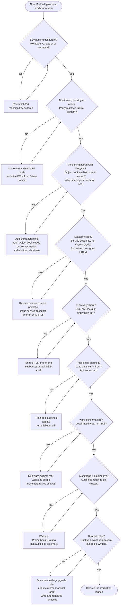

# Best Practices

Across the last fifteen chapters you learned dozens of individually correct recommendations: name object keys as if there were no folders because there aren't any, match parity level to a real failure domain instead of a round number, pair every versioned bucket with an expiration rule so noncurrent versions don't accumulate forever, issue short-lived presigned URLs instead of handing out long-lived credentials, encrypt everything in transit and prefer SSE-KMS when you need an audit trail, benchmark with `warp` before spending money on hardware, and wire up Prometheus/Grafana before the first production incident rather than after it. Each recommendation made sense in the context of the chapter that introduced it. What's been missing is the **view from above** — every one of these practices gathered in one place, organized by theme instead of by chapter number, so you can run through them quickly before a design review, a bucket migration, or a production launch. This chapter is that reference: the checklist a senior infrastructure/platform engineer runs a MinIO design or deployment against before signing off on it. Treat it as a document you return to repeatedly — before you finalize a bucket layout, before you flip a new cluster into production, before you grant a new service account access — not as a one-time read.

---

## Learning Objectives

By the end of this chapter, you will be able to:

- Recite a concise, defensible checklist of best practices spanning bucket/object design, erasure coding topology, versioning/locking/lifecycle, access control, encryption, tooling, scaling, performance, observability, and operations.
- Explain the reasoning behind each practice well enough to adapt it when your workload doesn't match the textbook case.
- Run a structured pre-production review of a MinIO deployment and identify the highest-severity gaps first.
- Recognize the handful of decisions (object lock at bucket creation, erasure set width, parity level, shard key equivalents like bucket layout) that are expensive or impossible to change after data and traffic accumulate, and get them right before launch.
- Distinguish practices that are "nice to have" from the small set that are load-bearing for durability, compliance, or availability.
- Audit a real or hypothetical bucket/cluster configuration against this chapter's consolidated checklist.

---

## Prerequisites for This Chapter

This chapter is a **synthesis** chapter. It assumes you have completed Chapters 1 through 15 and have working knowledge of everything it references — it does not re-teach any technique, it distills and cross-links what you've already learned into one operational reference. The major theme areas it draws from:

- **[Chapter 2: Core Concepts](./02-core-concepts.md)** and **[Chapter 4: Buckets, Objects & the S3 API](./04-buckets-objects-and-the-s3-api.md)** — keys as flat namespace entries, prefixes as pseudo-directories, metadata vs. tags, multipart uploads.
- **[Chapter 3: Architecture & Internals](./03-architecture-and-internals.md)** and **[Chapter 5: Erasure Coding & Data Protection](./05-erasure-coding-and-data-protection.md)** — erasure set sizing, parity levels, quorum, healing.
- **[Chapter 6: Versioning & Object Locking](./06-versioning-and-object-locking.md)** and **[Chapter 7: Lifecycle Management](./07-lifecycle-management.md)** — WORM compliance, retention, expiration rules, noncurrent version cleanup.
- **[Chapter 8: Identity, Access Management & Policies](./08-identity-access-management-and-policies.md)** — least privilege, service accounts, presigned URLs, explicit Deny.
- **[Chapter 9: Encryption & Key Management](./09-encryption-and-key-management.md)** — TLS, SSE-S3/SSE-KMS/SSE-C, KES.
- **[Chapter 10: MinIO Client & SDKs](./10-minio-client-and-sdks.md)** and **[Chapter 11: Event Notifications & Integrations](./11-event-notifications-and-integrations.md)** — `mc` aliasing and scripting, idempotent event consumers.
- **[Chapter 12: Distributed Deployment & Site Replication](./12-distributed-deployment-and-site-replication.md)** — pool/erasure-set sizing ahead of growth, load balancing, replication topology, DR.
- **[Chapter 13: Performance Tuning & Benchmarking](./13-performance-tuning-and-benchmarking.md)** — `warp`, local drives vs. NAS, client-side concurrency.
- **[Chapter 14: Monitoring & Observability](./14-monitoring-and-observability.md)** and **[Chapter 15: Security Best Practices](./15-security-best-practices.md)** — Prometheus/Grafana, leading-indicator alerting, defense-in-depth, audit logging.

If any of these feel unfamiliar, a quick re-read before continuing will make this chapter much more useful — every bullet below has a full chapter behind it if you need the complete explanation.

---

## 1. Bucket and Object Design Best Practices

*(Builds on Chapters 2 and 4)*

- **Design object keys deliberately, as a flat namespace, not a filesystem.** There are no real directories in object storage — a `/` in a key is a display convention that `mc ls` and the S3 API render as pseudo-folders. Choose a key structure that matches how you'll actually query and list objects (by tenant, by date, by content type) since prefix-based listing is the only "directory" operation you get for free.
- **Put high-cardinality, evenly-distributed values early in the key when you need listing/scanning parallelism**, and put low-cardinality grouping values (tenant ID, date) where your application's dominant access pattern actually filters. A key scheme optimized for "how a human would browse it" and a key scheme optimized for "how the application actually queries it" are often different, and the second one should win.
- **Avoid sequential, monotonically increasing key prefixes for very high-throughput ingestion** (e.g., a raw incrementing timestamp as the very first characters of every key) if you're hammering a single bucket with extreme write concurrency — spreading the leading characters of hot keys reduces the chance of hot-spotting the same internal partitions during bursts.
- **Use one bucket per logical dataset/tenant boundary that also maps to a policy or lifecycle boundary**, not one giant bucket for everything. Bucket-level settings (versioning, lifecycle, object lock, encryption defaults, replication) are the actual unit of configuration — if two datasets need different lifecycle or retention rules, they belong in different buckets.
- **Use system/user metadata for information the application needs to interpret the object's bytes** (content-type, encoding, a checksum, a schema version) and **use tags for information you need to filter, search, or drive policy/lifecycle decisions on** — lifecycle rules and some bucket policies can key off tags but not off arbitrary custom metadata, and tags are more efficiently queryable in bulk than scanning metadata object-by-object.
- **Never encode information you'll need to change later into the object key itself.** Keys are effectively immutable (a "rename" is a copy + delete); metadata and tags are mutable in place. A `status=pending` tag can be flipped with a single API call — a `pending/` key prefix requires copying the whole object to a new key.

```bash
# Poor: sequential timestamp-first key on a high-throughput bucket, and
# business status baked into the key path (expensive to "change" later)
product-images/20260706153000123/pending/store-4471/shelf-a12.jpg

# Better: tenant-first for query alignment, a reasonably distributed key,
# status expressed as a tag instead of a path segment
product-images/store-4471/2026/07/06/shelf-a12-8f3e2c.jpg
```

```bash
# Metadata: describes the bytes; Tags: drives policy/lifecycle/filtering
mc cp shelf-a12.jpg local/product-images/store-4471/2026/07/06/shelf-a12-8f3e2c.jpg \
  --attr "Content-Type=image/jpeg;X-Amz-Meta-Schema-Version=2"

mc tag set local/product-images/store-4471/2026/07/06/shelf-a12-8f3e2c.jpg \
  "review-status=pending&retention-class=standard"
```

---

## 2. Erasure Coding and Topology Best Practices

*(Builds on Chapters 3 and 5)*

- **Match parity level to your actual failure domain, not a default.** `EC:4` on a single erasure set spread across drives in one rack tolerates far less than `EC:4` spread across four independent nodes/racks/power domains — the parity count only protects you against the failures it's actually distributed across. Decide what you need to survive (a drive, a node, a rack, an AZ) before picking a number.
- **Never deploy a single-node MinIO instance and call it production.** Standalone/single-node MinIO has no erasure coding across nodes and no tolerance for node loss — it is a development/test configuration only. Production means distributed mode, multiple nodes, with erasure coding actually spread across independent failure domains.
- **Respect the minimum node count for the redundancy you're claiming.** A meaningfully redundant distributed deployment needs at minimum 4 nodes (the smallest practical erasure set that tolerates real node loss); anything smaller is closer to "distributed in name only."
- **Keep erasure set width inside MinIO's supported/practical range (typically 4-16 drives) and size it to genuine hardware parallelism**, not to whatever number of drives happens to be sitting in a rack. A wide erasure set numerically doesn't help if the drives share a single controller or network uplink.
- **Remember erasure set width is fixed at pool-creation time.** You cannot widen an existing erasure set after the fact — capacity growth comes from adding a new server pool (a new set of erasure sets), not from reshaping the old one. Get the initial width right, or plan pool boundaries so a mistake is cheap to work around.
- **Document, explicitly, what failure this topology is designed to survive** (one drive, one node, one rack) as part of the design review artifact, so nobody discovers the actual tolerance during a real outage.

```text
# EC:4 parity notation, sized against three different failure domains —
# only one of these gives you real node-loss tolerance in practice

# Weak: 8 drives, EC:4, all drives in ONE node
#   -> tolerates drive loss, NOT node loss
Node1: [d1 d2 d3 d4 d5 d6 d7 d8]  (erasure set = all local drives)

# Better: 8 drives, EC:4, spread across 4 nodes (2 drives/node)
#   -> tolerates the loss of any single node, since parity covers
#      more shards than any one node holds
Node1: [d1 d2]  Node2: [d3 d4]  Node3: [d5 d6]  Node4: [d7 d8]

# Minimum practical distributed footprint for real redundancy
minio server http://node{1...4}/data{1...2}
```

---

## 3. Versioning, Locking, and Lifecycle Best Practices

*(Builds on Chapters 6 and 7)*

- **Always pair bucket versioning with an expiration/lifecycle rule.** Versioning without lifecycle management is an unbounded storage leak: every overwrite and delete keeps the old version around forever unless something expires noncurrent versions. Decide the noncurrent-version retention window at the same time you enable versioning, not months later when the bucket has quietly tripled in size.
- **Enable Object Lock at bucket creation time if there's any chance you'll need it later — it cannot be turned on retroactively.** Object Lock is a bucket-creation-time-only setting in MinIO's S3-compatible implementation; a bucket created without it can never have it added, and the only fix is creating a new bucket and migrating data. If compliance, legal hold, or ransomware-resistance is even plausible for a bucket's future, enable Object Lock (in compliance or governance mode, retention period configured later) up front — the cost of enabling it unnecessarily is negligible, the cost of needing it later and not having it is a full data migration.
- **Configure lifecycle rules to abort incomplete multipart uploads automatically.** A multipart upload that's interrupted (client crash, network failure) before `CompleteMultipartUpload` leaves its uploaded parts consuming storage indefinitely unless something cleans them up — a standing lifecycle rule (e.g., abort after 7 days) is the standard fix, and every production bucket that accepts multipart uploads should have one.
- **Choose retention mode deliberately: compliance mode for true regulatory WORM (nobody, including root, can shorten or remove it), governance mode when you need an emergency override path** for specific privileged users. Defaulting to compliance mode "to be safe" on data that turns out to need an exception is a self-inflicted problem.
- **Use lifecycle transition/tiering rules to move cold data to a cheaper storage class or tier automatically**, rather than manually tracking which objects have gone cold — this is the same "let policy do the work" principle as expiration rules, applied to cost instead of cleanup.
- **Test lifecycle rules on a non-production bucket before applying them broadly.** A misconfigured expiration rule (wrong prefix filter, wrong day count) that fires against production data is a silent, hard-to-reverse deletion event — validate the rule's filter matches exactly the objects you intend, on a small scope, first.

```bash
# Enable versioning AND object lock at bucket creation — object lock
# cannot be added after the fact, so decide this up front
mc mb --with-lock local/compliance-archive

mc version enable local/compliance-archive

# Pair versioning with a lifecycle rule that expires noncurrent versions —
# never leave versioning unpaired with expiration
cat > lifecycle.json <<'EOF'
{
  "Rules": [
    {
      "ID": "expire-noncurrent-versions",
      "Status": "Enabled",
      "NoncurrentVersionExpiration": { "NoncurrentDays": 90 }
    },
    {
      "ID": "abort-incomplete-multipart",
      "Status": "Enabled",
      "AbortIncompleteMultipartUpload": { "DaysAfterInitiation": 7 }
    }
  ]
}
EOF
mc ilm import local/compliance-archive < lifecycle.json
```

---

## 4. Access Control Best Practices

*(Builds on Chapter 8)*

- **Grant least privilege by default.** Every IAM policy should list exactly the actions and resource ARNs (bucket/prefix scope) a principal needs, never `s3:*` on `arn:aws:s3:::*` out of convenience. A policy written broadly "to unblock the team faster" today is the access-control incident of tomorrow.
- **Use service accounts scoped to a parent user/policy for applications, never shared root or long-lived shared credentials.** Each application/service gets its own service account with its own scoped policy, so a leaked credential has a bounded blast radius and can be individually revoked without affecting other consumers.
- **Prefer short-lived presigned URLs over embedding credentials in clients**, and set expiration to the shortest value that's operationally workable (minutes to low hours, not days). A presigned URL that leaks is only dangerous until it expires — make that window small.
- **Use explicit `Deny` statements for hard boundaries that must never be overridden by another Allow**, such as blocking delete actions on a compliance bucket or blocking access from outside a known network range. Policy evaluation in the S3 model treats an explicit Deny as absolute — it beats any Allow, anywhere, which makes it the right tool for a boundary you never want a permissive policy to accidentally punch through.
- **Rotate access keys and service-account credentials on a defined schedule**, and immediately upon any suspected exposure — treat credential rotation as a routine operational task with a runbook, not a rare emergency response.
- **Review IAM policies periodically, not just at creation time.** Access requirements drift as applications evolve; a policy that was least-privilege at creation can accumulate unused, over-broad permissions unless someone actually revisits it.

```json
{
  "Version": "2012-10-17",
  "Statement": [
    {
      "Sid": "AllowShelfImageWrites",
      "Effect": "Allow",
      "Action": ["s3:PutObject", "s3:GetObject"],
      "Resource": ["arn:aws:s3:::product-images/store-*/*"]
    },
    {
      "Sid": "DenyDeleteOnComplianceArchive",
      "Effect": "Deny",
      "Action": ["s3:DeleteObject", "s3:DeleteObjectVersion", "s3:DeleteBucket"],
      "Resource": ["arn:aws:s3:::compliance-archive", "arn:aws:s3:::compliance-archive/*"]
    }
  ]
}
```

```bash
# Short-lived presigned URL for a one-off client upload/download
mc share upload --expire=15m local/product-images/store-4471/2026/07/06/shelf-a12-8f3e2c.jpg
```

---

## 5. Encryption Best Practices

*(Builds on Chapter 9)*

- **Run TLS everywhere: client-to-cluster and node-to-node, with no exceptions**, including "internal" traffic on a private network — internal doesn't mean trusted, and inter-node shard traffic carries real data.
- **Prefer SSE-KMS over SSE-S3 whenever you need an audit trail of who used which key, or need to control/revoke a key independently of MinIO itself.** SSE-KMS (via KES) gives you per-object or per-bucket key policies, key rotation, and usage logging at the KMS layer, which SSE-S3's server-managed keys don't provide.
- **Set bucket-default encryption so every object is encrypted at rest without depending on every client remembering to request it.** Relying on application code to set encryption headers on every request is fragile; a bucket-level default closes that gap structurally.
- **Reserve SSE-C for the specific case where the client must retain sole control of the key material** and understands the operational cost (the key must be presented on every request, and losing it means losing the data permanently, with no recovery path).
- **Treat KES and its backing key store (Vault, or a cloud KMS) as critical-path infrastructure with its own availability and backup plan.** If SSE-KMS-encrypted objects' keys become unreachable because KES or its backend is down or its keys are lost, the objects are unreadable exactly as if they were deleted — plan KES's own resilience with the same seriousness as the MinIO cluster itself.
- **Verify encryption configuration with an actual test object, not just the configuration command's success message.** Confirm a newly-uploaded object actually reports the expected `x-amz-server-side-encryption` header before considering the control "done."

```bash
# Bucket-default SSE-KMS encryption — every object encrypted at rest
# without relying on client-side headers
mc encrypt set sse-kms my-kms-key local/analytics-lake

# Confirm it's actually applied
mc encrypt info local/analytics-lake

# Verify a real object picked it up
mc stat local/analytics-lake/reports/2026-07-06.parquet | grep -i encrypt
```

---

## 6. Tooling and Application-Integration Best Practices

*(Builds on Chapters 10 and 11)*

- **Use named, purpose-specific `mc` aliases instead of re-typing endpoints/credentials**, and keep production aliases distinct from staging/dev aliases so a copy-pasted command can't accidentally target the wrong environment.
- **Use `mc --json` output for anything you script against**, never scrape human-readable table output — the JSON schema is stable across MinIO versions in a way that the pretty-printed table formatting is not.
- **Design event notification consumers to be idempotent.** Bucket notifications (Kafka, webhook, NATS) are typically at-least-once delivery — a consumer that isn't safe to process the same event twice (e.g., a thumbnail generator that isn't safe to regenerate, or a billing counter that double-counts) will eventually produce a real bug when a redelivery happens, and it will happen.
- **Pin SDK and `mc` versions deliberately in CI/production images**, and test upgrades in staging before rolling them to production tooling — an `mc` behavior change between versions can silently break a script that depended on undocumented output formatting.
- **Reuse a single pooled SDK client per process instead of instantiating a new client per request**, which avoids repeated TLS handshake overhead and connection churn (also covered from the performance angle in Chapter 13).
- **Log the object key, event type, and a correlation ID on every event-driven action**, so a downstream failure (a failed thumbnail generation, a failed indexing call) can be traced back to the specific triggering event without guesswork.

```bash
# Named aliases, clearly separated by environment
mc alias set shelfsnap-prod https://minio.prod.internal:9000 <ACCESS_KEY> <SECRET_KEY>
mc alias set shelfsnap-staging https://minio.staging.internal:9000 <ACCESS_KEY> <SECRET_KEY>

# --json for scripting, never scrape the table output
mc ls shelfsnap-prod/product-images --json | jq -r '.key'
```

```python
# Idempotent event consumer: dedupe on a stable event/object identity
# before doing any side-effecting work
def handle_event(event):
    dedupe_key = f"{event['s3']['bucket']['name']}:{event['s3']['object']['key']}:{event['s3']['object']['versionId']}"
    if already_processed(dedupe_key):
        return  # safe no-op on redelivery
    generate_thumbnail(event)
    mark_processed(dedupe_key)
```

---

## 7. Scaling and Resilience Best Practices

*(Builds on Chapter 12)*

- **Plan pool and erasure-set sizing ahead of growth, not reactively.** Because erasure set width is fixed at creation time (Section 2), capacity growth happens by adding new server pools — decide your pool-expansion cadence and expected growth curve before you're forced into an emergency expansion under storage-pressure conditions.
- **Put a load balancer in front of every distributed cluster** — clients should never be hardcoded to a single node's address. MinIO's nodes are symmetric with no leader, which is exactly what makes a simple round-robin/least-connections load balancer effective; skipping it turns one node into an accidental single point of contact.
- **Actually test failover, don't just assume the topology supports it.** Kill a node (or simulate a drive failure) in staging and confirm the cluster keeps serving reads/writes at reduced capacity, and that healing brings it back to full redundancy afterward — a failure-tolerant design that's never been exercised is a hypothesis, not a verified property.
- **Choose a site-replication topology deliberately: active-active for genuine multi-region read/write, active-passive/DR for a cold or warm standby** — matched to your actual RPO/RTO requirements, not defaulted to whichever is easiest to set up first.
- **Understand what site replication does and doesn't protect against.** It protects against a whole-site outage; it does not protect against a bad delete or a ransomware event replicating to the other site just as it did to the first — that gap is exactly why Section 10's independent backup practice exists.
- **Re-validate topology assumptions whenever you add a pool or a site** — a network or capacity assumption that held for a 2-pool cluster may not hold once a third pool or second site is added.

```bash
# Load balancer in front of a distributed cluster — clients never
# talk to a single node directly
# (nginx upstream example)
upstream minio_cluster {
    server node1.internal:9000;
    server node2.internal:9000;
    server node3.internal:9000;
    server node4.internal:9000;
}

# Adding capacity via a new server pool — never by widening an
# existing erasure set
minio server http://node{1...4}/data{1...4} http://node{5...8}/data{1...4}
```

---

## 8. Performance Best Practices

*(Builds on Chapter 13)*

- **Benchmark with `warp` before assuming where a bottleneck lives.** Guessing wastes engineering time and often directs spend at the wrong resource — reproduce the real workload shape (object size, concurrency, operation mix) and measure, don't estimate.
- **Use fast local drives (NVMe/SSD), never network-attached storage, for MinIO's own data drives.** MinIO already provides the network-storage abstraction to applications; a second network hop underneath it costs latency and reliability for no benefit.
- **Provision enough client-side concurrency to actually exercise a distributed cluster.** A single-threaded client will never saturate a well-built cluster, and mistaking that for a server-side problem sends the investigation in the wrong direction.
- **Tune multipart part-size and concurrent-part-count deliberately for large-object workloads**, and don't reach for multipart tuning on a workload made of genuinely small objects — the two workload shapes need different fixes.
- **Provision inter-node network bandwidth (10GbE or better for serious throughput) with the same seriousness as drives**, since erasure coding drives shard traffic between nodes on every single request, not just during healing.
- **Re-benchmark after every meaningful change** — a hardware swap, a new pool, a topology change — since removing one bottleneck reliably exposes the next one in line.

```bash
# Reproduce the real workload shape before diagnosing further
warp put --host=cluster.internal:9000 --access-key=... --secret-key=... \
  --bucket=perf-check --obj.size=4GiB --concurrent=8 --duration=3m
```

---

## 9. Observability and Security Best Practices

*(Builds on Chapters 14 and 15)*

- **Stand up Prometheus/Grafana monitoring from day one, not after the first incident.** Retrofitting observability onto a cluster that's already misbehaving means you have no historical baseline to compare the bad behavior against.
- **Alert on leading indicators, not just outages.** Rising drive latency, a growing count of offline drives, healing that isn't completing, and certificate expiry approaching are all things you want a page for *before* they become an outage, not a postmortem finding afterward.
- **Practice defense-in-depth: TLS, network segmentation, least-privilege IAM, and encryption at rest together**, not any single control as "the" security measure. Each layer covers a gap the others don't — losing one control shouldn't mean losing everything.
- **Retain audit logs for a defined, deliberately chosen period that matches compliance and incident-investigation needs**, and ship them to storage independent of the cluster they're auditing — an audit log that lives only on the system it's auditing is not trustworthy evidence after a compromise.
- **Restrict the MinIO Console and admin API to trusted networks**, never exposed directly to the public internet, and require MFA for console/administrative access wherever supported.
- **Review and test alert thresholds periodically** — an alert that's too noisy gets ignored, and an alert that's too quiet misses the incident; both failure modes erode trust in the monitoring stack over time.

```yaml
# Prometheus scrape config for a MinIO cluster's admin metrics endpoint
scrape_configs:
  - job_name: minio-cluster
    metrics_path: /minio/v2/metrics/cluster
    scheme: https
    static_configs:
      - targets: ["minio-prod.internal:9000"]
    bearer_token_file: /etc/prometheus/minio-scrape-token
```

```text
# Leading-indicator alert conditions worth wiring up, not just
# "is the cluster up" health checks
- drive latency p99 trending upward over 30 minutes
- any drive reporting offline for > 5 minutes
- healing queue depth non-zero for > 1 hour
- TLS certificate expiry < 30 days
- audit log shipping lag > 5 minutes
```

---

## 10. Operational and Production Best Practices

These practices don't belong to a single earlier chapter — they're what "running MinIO in production" means once bucket design, topology, access control, and monitoring are already correct.

- **Establish a capacity-planning cadence**, reviewing actual growth rate against remaining headroom on a fixed schedule (monthly or quarterly, depending on growth speed), so a new server pool is provisioned ahead of pressure rather than in a scramble once a cluster nears capacity.
- **Roll out upgrades across a distributed cluster one node (or a minority) at a time, verifying health before continuing**, never a simultaneous all-nodes restart — MinIO's symmetric, no-leader design supports rolling upgrades specifically so the cluster keeps serving during the process; taking that path away by upgrading everything at once turns a routine version bump into a planned outage.
- **Maintain a backup strategy beyond site replication.** Site replication protects against a site-level outage, but it faithfully replicates mistakes and malicious deletes too. Add an independent layer — periodic `mc mirror` snapshots to a genuinely separate, ideally offline or write-once target — as insurance against the failure mode replication doesn't cover.
- **Document and rehearse runbooks before they're needed under pressure**: a DR failover procedure, a drive-replacement procedure, and a credential-rotation procedure, at minimum. The value of a runbook is inversely proportional to how calm the person following it needs to be — write it while calm, for use when you won't be.
- **Test restores, not just backups.** An `mc mirror` snapshot or a site-replication failover that's never been exercised is a hope, not a verified recovery path — schedule periodic restore/failover drills the same way you'd schedule any other production readiness check.
- **Keep a single source of truth for the current topology, policy set, and lifecycle configuration** (infrastructure-as-code, not tribal knowledge), so a design review or an incident response doesn't start with someone reverse-engineering what's actually deployed.

```bash
# Independent backup layer beyond site replication: periodic mirror
# to a genuinely separate, cold target
mc mirror --overwrite --remove=false \
  shelfsnap-prod/analytics-lake cold-backup-target/analytics-lake-snapshot

# Rolling upgrade discipline: verify each node's health before moving on
mc admin service restart shelfsnap-prod --targets=node1
mc admin info shelfsnap-prod   # confirm node1 rejoins healthy before touching node2
```

### Diagram: Pre-Production Launch Checklist



---

## Real-World Scenario

**Setup:** You're the senior platform engineer running the pre-launch review for ShelfSnap's new production MinIO deployment — the backing store for shelf-photo uploads, generated analytics Parquet files, and a compliance archive of audit exports that legal has said "will probably need retention guarantees eventually." The team demos the system, and you walk it theme by theme against this chapter's checklist.

**Bucket and object design.** The `product-images` bucket keys objects as `store-{id}/{year}/{month}/{day}/{uuid}.jpg`, tenant-first and matched to the dashboard's actual query pattern — this section passes cleanly. Metadata carries content-type and a schema version; a `review-status` tag drives a downstream workflow instead of a key-path segment. No issues here.

**Erasure coding and topology.** This is where the first real problem surfaces. The team proudly demos the cluster and calls it "production-ready" — but it's a **single MinIO node with four locally attached drives**, `minio server /data{1...4}`, no other nodes. **This is Issue #1**: a single-node deployment does not provide the node-level fault tolerance that "production" implies for a system meant to survive real hardware failure. Erasure coding here only protects against a drive failure on that one box; losing the node itself (motherboard, power supply, the whole chassis) takes the entire service down with zero warning. The fix is a genuine distributed deployment across at minimum 4 independent nodes before this can be called production, not a configuration tweak on the existing box.

**Versioning, locking, and lifecycle.** The `compliance-archive` bucket — the one legal flagged as "will probably need retention guarantees eventually" — was created months ago as an ordinary bucket, versioning enabled after the fact once the team realized they needed version history. **This is Issue #2**: Object Lock was never enabled at bucket creation, and it cannot be added retroactively. Now that legal is asking for WORM retention on this exact bucket, the only path forward is creating a new, lock-enabled bucket and migrating the archive's contents into it — a fully avoidable data migration that a five-second decision at creation time would have prevented. Separately, the team confirms `product-images` has versioning enabled (to protect against accidental overwrites) but **no lifecycle rule expiring noncurrent versions** — **this is Issue #3**: an unbounded storage leak, since every reprocessed or re-uploaded shelf photo keeps its prior versions forever with nothing cleaning them up. Both issues map directly to Section 3 of this chapter.

**Access control.** The ingestion service uses a scoped service account limited to `PutObject`/`GetObject` on `product-images/store-*/*`, and presigned URLs issued to the mobile app expire in 15 minutes — this section passes.

**Encryption.** TLS is enforced cluster-wide, and `analytics-lake` has bucket-default SSE-KMS configured against the team's KES deployment — this section passes.

**Tooling and integration.** `mc` aliases are named and environment-scoped, and the thumbnail-generation Lambda consuming bucket notifications is confirmed idempotent (it dedupes on object key + version ID before processing) — this section passes.

**Scaling and resilience, performance, observability.** Given Issue #1, most of Section 7's checklist is moot until the topology itself is fixed — there's no failover to test on a single node, and no meaningful load-balancer story yet. Once the distributed topology is corrected, the team will need to revisit pool sizing, run `warp` against the new topology's real hardware, and stand up Prometheus/Grafana against it — none of that work is wasted, but none of it can be validated against a single-node stand-in.

**Operations.** No upgrade plan, no independent backup beyond the (not-yet-existing) site replication, and no written runbooks yet — expected, given the deployment isn't production-shaped yet, but flagged as required before go-live regardless.

**Outcome:** Three issues are caught before launch — the single-node deployment masquerading as production, the compliance bucket that needed Object Lock at creation and didn't get it, and the versioned bucket with no lifecycle rule quietly leaking storage — each mapping directly to a section of this chapter, and each dramatically cheaper to fix now than after real compliance obligations, real node failures, or a real storage-cost surprise force the issue later.

---

## Best Practices

The condensed top-10 cheat sheet — the fastest possible pass through this chapter:

1. **Design object keys deliberately for how you'll query them, not how a human would browse folders that don't exist**; use metadata for content, tags for policy/filtering.
2. **Match erasure-coding parity to a real failure domain and never call a single-node deployment production** — minimum 4 nodes for genuine node-loss tolerance.
3. **Always pair versioning with an expiration/lifecycle rule, enable Object Lock at bucket creation if there's any chance you'll need it (it cannot be added later), and set an abort-incomplete-multipart-upload rule on every bucket that accepts multipart uploads.**
4. **Grant least privilege via scoped IAM/service accounts, never shared long-lived credentials; use short-lived presigned URLs; use explicit `Deny` for hard boundaries.**
5. **Run TLS everywhere, prefer SSE-KMS for auditable encryption, and set bucket-default encryption so it doesn't depend on client discipline.**
6. **Use named `mc` aliases, `--json` for scripting, and build event-notification consumers to be idempotent** since delivery is at-least-once.
7. **Plan pool/erasure-set sizing ahead of growth, put a load balancer in front of every cluster, and actually test failover** rather than assuming the topology supports it.
8. **Benchmark with `warp` before assuming a bottleneck's location; use fast local drives, not NAS; ensure enough client-side concurrency.**
9. **Stand up Prometheus/Grafana from day one, alert on leading indicators, practice defense-in-depth, and retain audit logs off-cluster.**
10. **Plan capacity on a cadence, roll out upgrades one node at a time, back up independently of site replication (e.g. `mc mirror` to a cold target), and write and rehearse runbooks before an incident forces you to write them live.**

---

## Common Mistakes

Synthesizing the most consequential anti-patterns from across the whole course:

- **Calling a single-node MinIO deployment "production."** It provides drive-level protection at best and no node-level fault tolerance at all — exactly the gap that turns a routine hardware failure into a full outage.
- **Enabling versioning without a paired lifecycle expiration rule**, turning every overwrite and delete into a permanent, silently accumulating storage cost.
- **Deciding you need Object Lock after the bucket already exists.** It's a creation-time-only setting; discovering the need for WORM retention later means a full data migration to a new bucket, not a configuration change.
- **Treating site replication as a complete backup strategy.** It protects against a site outage; it faithfully replicates a bad delete or a ransomware event to the other site just as reliably as it replicates good data.
- **Granting broad IAM policies (`s3:*` on `*`) "to unblock the team faster"** instead of scoping access to exactly what's needed — the single most common root cause of an access-control incident, in object storage as in every other system.
- **Running MinIO's own data drives on network-attached storage**, adding a hidden second network hop underneath the network-storage abstraction MinIO is already providing, and quietly degrading both latency and reliability.
- **Skipping the upgrade-one-node-at-a-time discipline** and restarting an entire distributed cluster simultaneously for a routine version bump, turning a zero-downtime capability into a planned outage.

---

## Summary

- **Bucket/object design**: deliberate key naming for real query patterns, metadata for content description, tags for policy and filtering (Section 1).
- **Erasure coding/topology**: parity matched to a real failure domain, minimum node counts respected, erasure set width fixed at creation and planned accordingly (Section 2).
- **Versioning/locking/lifecycle**: versioning always paired with expiration, Object Lock enabled at creation whenever plausibly needed, incomplete multipart uploads aborted automatically (Section 3).
- **Access control**: least privilege, service accounts over shared credentials, short-lived presigned URLs, explicit Deny for hard boundaries (Section 4).
- **Encryption**: TLS everywhere, SSE-KMS for auditability, bucket-default encryption (Section 5).
- **Tooling/integration**: named `mc` aliases, `--json` for scripting, idempotent event consumers (Section 6).
- **Scaling/resilience**: pool sizing planned ahead of growth, a load balancer in front of every cluster, tested failover, deliberate replication topology (Section 7).
- **Performance**: benchmark with `warp` before guessing, fast local drives over NAS, sufficient client-side concurrency (Section 8).
- **Observability/security**: Prometheus/Grafana from day one, leading-indicator alerting, defense-in-depth, retained audit logs (Section 9).
- **Operations**: capacity-planning cadence, rolling zero-downtime upgrades, backup beyond replication, and rehearsed runbooks (Section 10).
- The **Real-World Scenario** showed exactly how this checklist catches real, planted issues — a single-node deployment called production, a compliance bucket that needed Object Lock at creation and didn't get it, and a versioned bucket leaking storage with no lifecycle rule — before they become production incidents.

---

## Knowledge Check

1. A colleague argues that a well-tuned single-node MinIO instance with four drives and `EC:4` is "production-grade" because it survives a drive failure. What's missing from that argument?
2. You're reviewing a bucket that legal says "might need compliance retention eventually," but it was created six months ago without Object Lock. What are your options now, and why is there no simple configuration fix?
3. Explain why versioning without a paired lifecycle rule is a storage-cost problem, not just a theoretical concern, and describe the specific rule that fixes it.
4. Why does site replication not substitute for an independent backup strategy? Give a concrete failure scenario that site replication does not protect against.
5. A service account's IAM policy grants `s3:*` on `arn:aws:s3:::*` "to save time during initial development," with a plan to tighten it before launch. What's the risk of leaving this in place, and what should the policy look like instead?
6. Name three "leading indicator" alerts you'd want wired up on a MinIO cluster's monitoring dashboard before launch, and explain what a bad trend in each one would predict.

---

## Hands-On Exercise

You've been handed the following description of a bucket/deployment configuration ahead of its production launch. Audit it against this chapter's checklist and write down every violation you find, along with which section of this chapter it maps to and why it matters.

**The deployment:**

- `raw-uploads` is a single MinIO node with two locally attached NVMe drives, `EC:1` parity, described in the deployment doc as "production, since NVMe is fast."
- `raw-uploads` has versioning enabled (added last month after a bad overwrite incident) but no lifecycle rules of any kind configured.
- `user-exports` accepts multipart uploads from a batch export job; there is no rule aborting incomplete multipart uploads, and `mc admin` output shows several uploads from three months ago still sitting incomplete.
- The application's ingestion service authenticates with the root MinIO credentials, embedded directly in an environment variable in the deployment manifest, shared across three different microservices.
- Presigned URLs handed to the mobile client for direct uploads are generated with a 7-day expiration "so users don't have to worry about upload timing out on slow connections."
- `analytics-lake` has no bucket-default encryption configured; individual client code is expected to set SSE headers on each `PutObject` call.
- Site replication to a secondary region is configured and reported healthy; there is no other backup mechanism, and no one has tested a full DR failover.
- Object keys in `raw-uploads` are structured as `pending-review/{uuid}.jpg`, and the application "moves" objects to `approved/{uuid}.jpg` by copying and deleting whenever a review is approved.

For each bullet, identify: (a) which section of this chapter it violates, (b) the concrete risk if left as-is, and (c) the specific fix you'd propose. Then rank your findings by severity, as you would in an actual pre-launch review — not every violation is equally urgent.

---

## Further Reading

- [MinIO Production Deployment Overview](https://min.io/docs/minio/linux/operations/deploy-minio-multi-node-multi-drive.html) — the official baseline configuration for a real distributed, multi-node, multi-drive deployment referenced throughout Section 2.
- [MinIO Hardening Guide](https://min.io/docs/minio/linux/operations/checklists/security.html) — the official security checklist covering TLS, IAM, and network exposure referenced in Sections 4-5 and 9.
- [MinIO Hardware Checklist](https://min.io/docs/minio/linux/operations/checklists/hardware.html) — network, drive, and CPU provisioning guidance behind Sections 2 and 8.
- [MinIO Bucket Versioning and Object Locking](https://min.io/docs/minio/linux/administration/object-management/object-retention.html) — the authoritative reference on Object Lock's creation-time constraint, behind Section 3.
- [MinIO Linux Documentation Index](https://min.io/docs/minio/linux/index.html) — the umbrella reference for deployment, operations, and administration guidance across the whole product.

<div style="display:flex;justify-content:space-between;align-items:center;">
  <a href="./15-security-best-practices.md">← Previous: Security Best Practices</a>
  <a href="./00-index.md">🏠 Index</a>
  <a href="./17-common-mistakes-and-pitfalls.md">Next: Common Mistakes & Pitfalls →</a>
</div>
