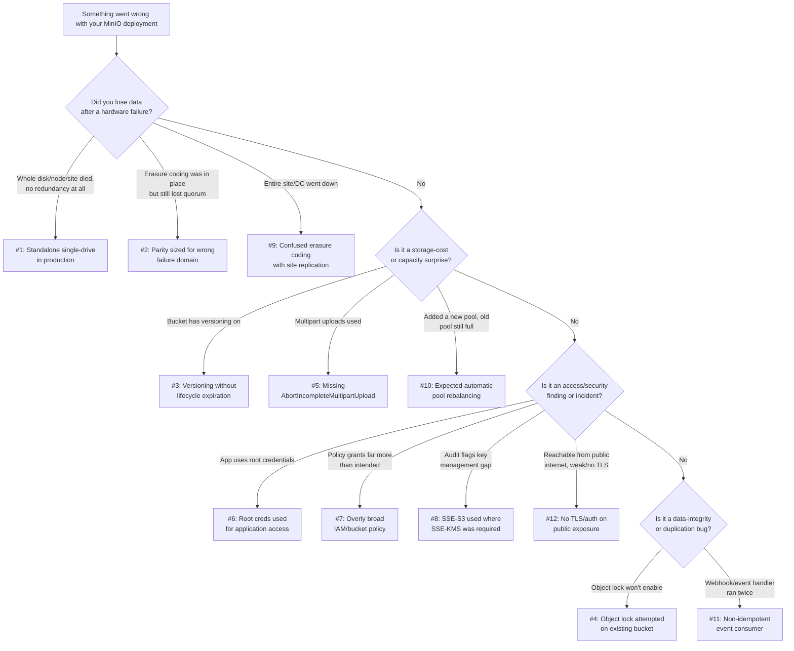

# Common Mistakes & Pitfalls

Chapter 16 gave you a positive checklist — the things a well-run MinIO deployment does right. This chapter is the negative image of that checklist: a **failure mode catalog**. Every numbered section below documents one real, recurring, production-grade mistake that teams make with MinIO and object storage in general — not typos or one-off misconfigurations, but structural misunderstandings that quietly work fine in a demo and then fail expensively in production, usually months later and usually at the worst possible time. Each mistake is told the way an incident report tells it: **Symptom** (what you'd actually observe, as an operator getting paged or a finance team getting a surprise invoice), **Root Cause** (the misunderstanding or missing step that actually caused it), and **Fix** (the concrete configuration or process change that prevents it, with before/after examples). Treat this chapter as a pre-mortem: if you recognize your own deployment in any section below, that's the chapter doing its job.

---

## Learning Objectives

By the end of this chapter, you will be able to:

- Recognize at least ten common, production-grade MinIO/object-storage mistakes from their symptoms alone, before digging into root cause.
- Explain *why* each mistake happens — usually a reasonable-sounding assumption that breaks down under a specific failure condition or at a specific scale.
- Apply the concrete fix for each mistake, including exact `mc` commands and configuration changes.
- Distinguish mistakes that are recoverable after the fact (e.g., a bad IAM policy) from mistakes that are only preventable *before* the fact (e.g., object lock on an existing bucket).
- Diagnose a real incident where multiple mistakes compound into one larger failure, and unwind them one at a time.
- Use this chapter's decision tree to triage an unfamiliar MinIO production issue against a known failure mode.

---

## Prerequisites for This Chapter

This chapter assumes you have worked through **Chapters 1–16** of this course and treats their content as settled ground. In particular, it assumes fluency with:

- Deployment topologies, erasure coding, and erasure sets (Chapters 3, 5)
- Versioning, object locking, and lifecycle rules (Chapters 6–7)
- Multipart uploads (Chapter 4)
- IAM users, service accounts, and bucket/IAM policies (Chapter 8)
- Encryption modes: SSE-S3, SSE-KMS, SSE-C (Chapter 9)
- Event notifications (Chapter 11)
- Server pools and site replication (Chapter 12)
- Security hardening and TLS (Chapter 15)
- The consolidated best-practices checklist (Chapter 16)

If any of those feel shaky, this chapter will still make sense at a narrative level, but the fixes will be more useful if you go back and refresh the relevant chapter first — each section below links back to the chapters it depends on.

---

## 1. Running Standalone MinIO in Production and Losing Everything to One Disk

**Symptom:** A single MinIO container or VM has been running "in production" for months, serving traffic fine. One day the underlying disk fails (or the VM's disk volume gets corrupted, or a `rm -rf` targets the wrong path). MinIO won't start. Every object in every bucket is gone. There is no other copy anywhere.

**Root Cause:** The deployment was started as a single-node, single-drive "standalone" MinIO instance — the mode designed explicitly for local development and quick evaluation (Chapter 3, Section 1.1) — and it was never migrated to a distributed, erasure-coded topology before real traffic and real data landed on it. Standalone mode stores every object as one plain file on one filesystem, on one drive. There is no erasure coding, no parity, no redundancy of any kind: MinIO is trusting the underlying disk completely. This is fine for a laptop; it is indistinguishable from "no backup strategy" for a production service. Teams fall into this because standalone MinIO is the fastest way to get *something* running (`minio server /data`), and "we'll move to distributed mode before launch" quietly never happens under deadline pressure.

**Fix:** Never let a single-drive standalone instance hold data anyone would be upset to lose. At minimum, run single-node, multi-drive mode (4+ drives, erasure-coded within the one machine) so a single disk failure is survivable; for real production, run the distributed, multi-node topology from Chapter 3/12 so an entire machine can die without data loss.

```bash
# Before: standalone, single drive — one disk failure = total data loss
minio server /data

# After: single-node, multi-drive — survives individual disk failure
minio server /data{1...4}

# After (production): distributed, multi-node, multi-drive — survives node failure
minio server https://minio{1...4}.internal:9000/data{1...4}
```

If you inherited a standalone deployment that already has production data on it, treat this as an emergency migration, not a backlog item: stand up a proper distributed cluster, use `mc mirror` to copy every bucket across, cut traffic over, and decommission the standalone instance. Do this before the disk fails, not after.

---

## 2. Under-Provisioning Parity for the Wrong Failure Domain

**Symptom:** The cluster was "erasure coded" and had survived individual drive failures in testing without issue. Then a whole physical server reboots for a kernel patch — or dies outright — and buckets suddenly return `500` errors or read failures on a meaningful fraction of objects, even though the parity math says the cluster should easily tolerate this many missing drives.

**Root Cause:** Erasure coding protects against losing *drives*, but the actual failure domain in production is often the *node*, not the drive. If a server has, say, 8 drives and all 8 participate in the same erasure set, then losing that one node simultaneously removes 8 shards at once — not 1. If the erasure set's parity count was chosen assuming independent, one-at-a-time drive failures (e.g., EC:4 tolerating 4 lost drives), a single node failure that removes more drives than the parity budget allows pushes some erasure sets below quorum, and objects whose shards were concentrated on that node become unreadable until the node returns. The team planned for the wrong failure domain: they sized parity for "a drive dies" when the thing that actually dies in the real world is "a machine dies," taking every drive in it down together.

**Fix:** Size erasure-coding parity around the failure domain you actually expect — usually "one whole node," not "one drive" — and distribute erasure sets across nodes so that no single node holds more shards from one erasure set than your parity can absorb. MinIO's automatic EC-level selection already spreads erasure sets across nodes when you deploy with enough nodes; the mistake usually comes from shrinking node count while keeping drive count high (e.g., "4 drives across 2 nodes" instead of "4 drives across 4 nodes").

```bash
# Before: 2 nodes x 8 drives = 16 drives, but only 2 independent nodes —
# losing 1 node can remove up to 8 shards at once
minio server https://minio{1...2}.internal:9000/data{1...8}

# After: 8 nodes x 2 drives = 16 drives — losing 1 node removes only 2 shards,
# well within typical EC:4/EC:8 parity budgets, and matches the real failure domain
minio server https://minio{1...8}.internal:9000/data{1...2}
```

As a rule of thumb from Chapter 5: always ask "how many shards does my *most likely* failure event take out at once?" before trusting an EC:N number in isolation. A healthy cluster tolerates its realistic blast radius, not just its theoretical one.

---

## 3. Versioning Without a Lifecycle Policy: The Silent Storage Bill

**Symptom:** Storage utilization has been climbing steadily for months with no corresponding increase in "real" data volume reported by the application team. The finance team escalates a MinIO storage bill (or an on-prem capacity-planning ticket) that's 3-4x what anyone expected for the workload.

**Root Cause:** Versioning (Chapter 6) was enabled on a bucket — often for good reasons, like protecting against accidental overwrites or supporting object lock — but no lifecycle rule was ever added to expire noncurrent versions (Chapter 7). Every `PUT` to an existing key doesn't replace the old object; it creates a new version and keeps the old one around, forever, by default. A bucket that gets overwritten frequently (thumbnails regenerated nightly, configuration files rewritten on every deploy, logs rotated in place) silently accumulates an ever-growing tail of noncurrent versions that nobody is looking at, using capacity, and still costing money or exhausting quota.

**Fix:** Whenever you enable versioning, add a noncurrent-version-expiration rule in the same change, not as a follow-up task.

```bash
# Before: versioning on, no cleanup — noncurrent versions accumulate forever
mc version enable myminio/product-images

# After: versioning on, paired with a lifecycle rule that expires
# noncurrent versions after 30 days
mc version enable myminio/product-images
cat > noncurrent-cleanup.json <<'EOF'
{
  "Rules": [
    {
      "ID": "expire-noncurrent-versions",
      "Status": "Enabled",
      "NoncurrentVersionExpiration": { "NoncurrentDays": 30 }
    }
  ]
}
EOF
mc ilm import myminio/product-images < noncurrent-cleanup.json
```

Audit any bucket you *didn't* set up yourself with `mc version info` and `mc ilm ls` before assuming this is handled — inherited buckets are the most common place this mistake hides.

---

## 4. Trying to Enable Object Lock on an Existing Bucket

**Symptom:** A compliance requirement lands — "these records must be immutable, WORM-protected, for 7 years" — and an engineer runs `mc retention` or tries to set object lock on the bucket that already holds the data in question. It fails, or the lock configuration silently doesn't apply the way expected. There is no obvious way to "turn on" object lock after the fact.

**Root Cause:** Object lock (Chapter 6) is not a bucket setting you can toggle at any time — it must be enabled **at bucket creation time**, because it depends on versioning being active from the bucket's very first write and on lock metadata being tracked per-version from day one. MinIO (matching S3 behavior) has no supported path to retroactively enable object lock on a bucket that was created without it, even if you enable versioning on it later. Teams hit this because compliance requirements often arrive *after* a bucket has been in use for months, and "just turn on object lock" sounds like a config flag rather than a bucket-creation-time architectural decision.

**Fix:** There is no in-place fix — you must create a new, object-lock-enabled bucket and migrate the data.

```bash
# This does NOT work on a pre-existing bucket created without lock support:
mc retention set --default GOVERNANCE "30d" myminio/existing-bucket
# mc: <ERROR> ... Object Lock configuration is not enabled on this bucket.

# Correct approach: create a NEW bucket with object lock enabled at creation
mc mb --with-lock myminio/existing-bucket-worm

# Migrate data across (this creates fresh objects/versions in the new,
# lock-capable bucket — old objects are not retroactively locked)
mc mirror myminio/existing-bucket myminio/existing-bucket-worm

# Set the default retention policy on the new bucket
mc retention set --default GOVERNANCE "2555d" myminio/existing-bucket-worm

# Cut applications over to the new bucket name, then decommission the old one
```

Because of this, treat "will this bucket ever need object lock?" as a question to ask **every time you create a bucket**, not just when a compliance team asks for it — retrofitting is a full data migration, not a config change.

---

## 5. Forgetting `AbortIncompleteMultipartUpload` and Paying for Orphaned Parts

**Symptom:** `mc du` or the MinIO Console shows a bucket consuming noticeably more storage than the sum of the objects visible when you list it. Nobody can account for the difference.

**Root Cause:** Multipart uploads (Chapter 4) reserve storage for every part as soon as it's uploaded, before the upload is completed with a final `CompleteMultipartUpload` call. If a client crashes mid-upload, a network connection drops, a mobile app is killed by the OS, or a batch job retries a failed upload without cleaning up its previous attempt, the already-uploaded parts are never assembled into a final object and are never automatically deleted. They sit on disk indefinitely, invisible to a normal object listing, but fully billed/counted as capacity. At scale — many clients uploading large files over unreliable networks — this becomes a slow, silent, compounding storage leak with no visible object to point to and blame.

**Fix:** Every bucket that accepts multipart uploads should have an `AbortIncompleteMultipartUpload` lifecycle rule (Chapter 7) from day one, not added reactively after the storage bill shows up.

```bash
# Before: no cleanup rule — abandoned multipart parts accumulate forever
mc ilm ls myminio/user-uploads
# (no rule targeting incomplete multipart uploads)

# After: abort and reclaim incomplete multipart uploads older than 3 days
cat > abort-mpu.json <<'EOF'
{
  "Rules": [
    {
      "ID": "abort-incomplete-multipart",
      "Status": "Enabled",
      "AbortIncompleteMultipartUpload": { "DaysAfterInitiation": 3 }
    }
  ]
}
EOF
mc ilm import myminio/user-uploads < abort-mpu.json

# Spot-check for pre-existing orphaned uploads right now
mc admin trace myminio &  # optional: watch live traffic while testing
mc ls --incomplete myminio/user-uploads
```

Make this rule part of your standard "new bucket" checklist (Chapter 16) alongside versioning and lifecycle — it costs nothing when there's nothing to abort, and saves real money the moment a client library starts misbehaving.

---

## 6. Using the Root Account for Application Access

**Symptom:** A security review (or a post-incident audit) discovers that every microservice, cron job, and CI pipeline in the company authenticates to MinIO using the same root `MINIO_ROOT_USER`/`MINIO_ROOT_PASSWORD` pair — the same credentials that can create/delete users, change server config, and access every bucket in the cluster. Nobody can say which service did what, because every request looks identical in the audit log.

**Root Cause:** It's the fastest way to get something working: the root credentials are already sitting in an environment variable from cluster setup, so it's tempting to just reuse them in the application instead of provisioning a scoped identity. This is convenient right up until something goes wrong — a leaked credential, a compromised service, or a bug that deletes the wrong bucket — at which point the blast radius is "the entire cluster," and forensic audit logs can't distinguish "the image thumbnailer" from "an attacker" because both used the same identity.

**Fix:** Create a dedicated IAM user or service account per application/service (Chapter 8), scoped to exactly the buckets and actions it needs, and reserve the root account for initial bootstrap and emergency break-glass access only.

```bash
# Before: application config
# MINIO_ACCESS_KEY=<root access key>
# MINIO_SECRET_KEY=<root secret key>

# After: create a scoped service account tied to a least-privilege policy
mc admin policy create myminio thumbnailer-policy thumbnailer-policy.json
mc admin user add myminio thumbnailer-svc <generated-secret>
mc admin policy attach myminio thumbnailer-policy --user thumbnailer-svc

# Application config now uses the scoped identity
# MINIO_ACCESS_KEY=thumbnailer-svc
# MINIO_SECRET_KEY=<generated-secret>
```

If you inherit a deployment where root credentials are already sprinkled across a dozen services, treat rotating each one onto a scoped identity as a security debt item with a deadline, not an optional cleanup.

---

## 7. Overly Broad IAM/Bucket Policies Instead of Least Privilege

**Symptom:** A penetration test or internal audit finds that a service account meant to only read thumbnails from one bucket can, in practice, read and delete objects in every bucket in the cluster, including buckets holding unrelated, more sensitive data.

**Root Cause:** Someone wrote (or copy-pasted from a tutorial) a policy using a wildcard resource ARN to get past a permissions error quickly, intending to "tighten it later" — and later never came.

```json
{
  "Version": "2012-10-17",
  "Statement": [
    {
      "Effect": "Allow",
      "Action": ["s3:*"],
      "Resource": ["arn:aws:s3:::*", "arn:aws:s3:::*/*"]
    }
  ]
}
```

This grants every action on every bucket, present and future. It "works" immediately, which is exactly why it's dangerous — there's no functional signal telling anyone it's wrong until an audit or an incident surfaces it.

**Fix:** Scope the `Resource` to the specific bucket (and, where possible, key prefix) the identity actually needs, and scope `Action` to only the operations it performs — read-only consumers should never hold `s3:DeleteObject` or `s3:PutBucketPolicy`.

```json
{
  "Version": "2012-10-17",
  "Statement": [
    {
      "Effect": "Allow",
      "Action": ["s3:GetObject", "s3:ListBucket"],
      "Resource": [
        "arn:aws:s3:::product-images",
        "arn:aws:s3:::product-images/thumbnails/*"
      ]
    }
  ]
}
```

Treat every `Resource: "arn:aws:s3:::*"` or `Action: "s3:*"` you find in a policy review as a finding, not a style choice — Chapter 8's policy-evaluation model exists precisely so you can write precise grants without extra operational overhead.

---

## 8. Assuming SSE-S3 Satisfies a Compliance Requirement That Actually Needs SSE-KMS

**Symptom:** During a compliance audit (SOC 2, HIPAA, PCI-DSS, or an internal security standard), the auditor asks for key rotation history, key access logs, and evidence of centralized key-lifecycle control for a bucket holding regulated data. The team can show that "encryption at rest is enabled," but has no answers to any of those specific questions, and the audit flags a gap.

**Root Cause:** SSE-S3 (Chapter 9) does encrypt every object at rest, which satisfies a *general* "is data encrypted at rest?" checkbox — but the keys are managed entirely internally by MinIO with no external auditability, no per-tenant key isolation, and no centralized rotation/revocation control. Many real compliance frameworks require more than "encrypted": they require *demonstrable, auditable key management* — who can access which key, when it was rotated, and the ability to revoke access to a key independent of deleting the data. SSE-S3 structurally cannot provide that, no matter how it's configured, because it isn't backed by an external, auditable key management system.

**Fix:** For buckets under a real key-management compliance requirement, use SSE-KMS backed by an external KMS (e.g., MinIO KES with Vault, AWS KMS, or another supported provider — Chapter 9), which provides auditable, centralized, per-key access control and rotation.

```bash
# Before: SSE-S3 — internally managed keys, no external audit trail
mc encrypt set sse-s3 myminio/regulated-records

# After: SSE-KMS via KES — externally managed, auditable, rotatable keys
mc encrypt set sse-kms my-kes-key-id myminio/regulated-records
```

Read the actual compliance requirement's language before choosing an encryption mode — "encrypted at rest" and "centrally managed, auditable keys" are different requirements, and only one of MinIO's SSE modes satisfies the second.

---

## 9. Confusing Erasure Coding With Site Replication

**Symptom:** After a data-center-level outage (power loss, fiber cut, regional cloud-provider incident) takes an entire site offline, the team discovers there is no way to serve traffic from anywhere else — despite having "a fully redundant, erasure-coded cluster." The assumption that the deployment was disaster-resilient turns out to be wrong at the worst possible time.

**Root Cause:** Erasure coding (Chapter 5) and site replication (Chapter 12) protect against two entirely different classes of failure, and it's an easy category error to conflate them. Erasure coding protects against *hardware failure inside one cluster* — a drive, or even several nodes, dying, while the cluster as a whole (and the site/data center it lives in) keeps running. It does nothing if the entire site — power, network, the building — goes down, because every erasure-coded shard for every object lives within that one site. Site replication is the mechanism that protects against losing an entire site, by maintaining a live, independent, geographically separate copy of the data. Teams that deploy a beautifully erasure-coded single-site cluster and call it "disaster recovery" have solved the hardware-failure problem and left the disaster-recovery problem completely unaddressed.

**Fix:** Treat erasure coding and site replication as complementary, not substitutable — a production deployment that needs to survive a site-level outage needs both.

```bash
# Erasure coding protects hardware failure WITHIN site-a (Chapter 5) — already in place
minio server https://minio{1...4}.site-a.internal:9000/data{1...4}

# Site replication protects against LOSING site-a entirely (Chapter 12) — must be added separately
mc alias set site-a https://minio.site-a.example.com admin <secret>
mc alias set site-b https://minio.site-b.example.com admin <secret>
mc admin replicate add site-a site-b
```

When someone says "we have redundancy," always ask "redundant against which specific failure?" — a correct answer names the failure domain (a drive, a node, or a site), not just the word "redundant."

---

## 10. Adding a New Server Pool and Expecting Automatic Rebalancing

**Symptom:** A second server pool is added to expand capacity, but weeks later the original pool is still nearly full while the new pool sits mostly empty. Performance on the original pool's erasure sets remains under pressure, and nobody sees the expected relief.

**Root Cause:** Adding a new server pool (Chapter 12) does not retroactively move any existing data. Each pool is its own independent set of erasure sets; MinIO routes *new* object writes across pools using available capacity, but it does not — by design, not by oversight — automatically migrate already-written objects from the old pool onto the new one. The mental model many teams bring from other systems ("add a node, the cluster rebalances") does not apply here: MinIO's pool-expansion model deliberately favors predictable, low-risk operations (no automatic background data movement that could add unexpected load or risk) over automatic rebalancing.

**Fix:** Understand that pool expansion increases *future* write capacity and *aggregate* read/write throughput immediately, but existing hot data on the original pool stays exactly where it is; if you specifically need to relieve pressure on the original pool's *existing* objects, that requires a deliberate migration (e.g., `mc mirror` a hot bucket's contents into a differently-organized bucket, or plan capacity ahead of the crunch rather than reactively).

```bash
# Expanding capacity — this affects only where NEW writes can land
minio server https://minio{1...4}.internal:9000/data{1...4} \
             https://minio{5...8}.internal:9000/data{1...4}

# This does NOT rebalance pre-existing objects already sitting in pool 1.
# If you need pool-1 data physically relieved, that's a deliberate migration,
# e.g. mirroring specific hot buckets to spread load intentionally:
mc mirror myminio/hot-bucket myminio/hot-bucket-v2
```

Capacity-plan pool additions *before* the original pool is critically full, precisely because there's no "just add a pool and it fixes itself" safety net once you're already there.

---

## 11. Non-Idempotent Event-Notification Consumers Double-Processing Retries

**Symptom:** A thumbnail gets generated twice, a billing event gets charged twice, or a downstream record gets duplicated — intermittently, and only under load or during network hiccups, making it maddening to reproduce.

**Root Cause:** MinIO's event notification system (Chapter 11) delivers events on an **at-least-once** basis, not exactly-once — this matches how essentially every event/webhook delivery system works, because guaranteeing exactly-once delivery across an unreliable network is a much harder (and usually unnecessary) guarantee to provide. If a webhook consumer is slow to respond, times out, or the network blips after the consumer processed the event but before it acknowledged, MinIO (or the queue/broker in front of it, e.g., Kafka or NATS) will redeliver the same event. A consumer written assuming "I'll only ever see this event once" will process the retried delivery as if it were new, producing duplicate side effects.

**Fix:** Design every event-notification consumer to be idempotent — capable of safely processing the same event twice with no double side effect — typically by tracking a unique identifier per event (bucket + key + version ID + event time, or an explicit event ID if the transport provides one) and short-circuiting if that identifier has already been processed.

```python
# Before: not idempotent — retried delivery reprocesses unconditionally
def handle_event(event):
    generate_thumbnail(event["s3"]["object"]["key"])

# After: idempotent — dedupe on a stable event identifier before acting
def handle_event(event):
    event_id = f"{event['s3']['bucket']['name']}:{event['s3']['object']['key']}:{event['s3']['object']['versionId']}"
    if already_processed(event_id):
        return  # safe no-op on retry
    generate_thumbnail(event["s3"]["object"]["key"])
    mark_processed(event_id)
```

Assume every event you ever receive might be a duplicate, because under MinIO's (and most systems') delivery guarantees, eventually one will be.

---

## 12. Exposing MinIO to the Public Internet Without TLS or Strong Authentication

**Symptom:** An external security scan, a bug-bounty report, or — worse — an actual breach reveals that a MinIO deployment's API or Console port is reachable directly from the public internet, either serving plaintext HTTP or still using default/weak credentials.

**Root Cause:** During initial setup or a quick proof-of-concept, MinIO gets exposed on a public IP or through a permissive security group/firewall rule "just to test something," often still using the default `minioadmin`/`minioadmin` credentials or a root account with no rotation. The "temporary" exposure is never revisited once the demo works, and MinIO — being a fully capable S3-compatible object store reachable from anywhere — becomes a direct target: credential-stuffing bots, default-credential scanners, and ransomware campaigns actively probe for exactly this misconfiguration.

**Fix:** Never expose MinIO's API or Console directly to the public internet without TLS termination and strong, rotated, non-default credentials in front of it (Chapter 15) — and prefer routing all external access through a reverse proxy/load balancer that enforces TLS, and restricting network access with firewall rules/security groups to only the clients that need it.

```bash
# Before: MinIO reachable directly, plaintext, default credentials
# security group: 0.0.0.0/0 -> :9000, :9001
# MINIO_ROOT_USER=minioadmin
# MINIO_ROOT_PASSWORD=minioadmin

# After: TLS-terminated reverse proxy in front, credentials rotated,
# direct access restricted to internal network only
# security group: internal-cidr-only -> :9000, :9001
# public access only via https://s3.example.com (proxy terminates TLS)
mc admin user svcacct add myminio admin --access-key <new-key> --secret-key <strong-generated-secret>
mc admin config set myminio api requests_max=1600  # example hardening alongside TLS
```

Rotate any credentials that were ever exposed on a publicly reachable instance — even briefly — as a matter of course; assume they were seen.

---

## Which Mistake Is It? A Diagnostic Decision Tree



---

## Real-World Scenario

**Setup:** ShelfSnap's platform team, six months after launch, gets a Friday-afternoon Slack message from finance: "Why did our object storage bill triple this quarter?" Around the same time, a routine external penetration test flags a finding: the credentials used by the `product-images` upload service can read and delete data in *every* bucket in the cluster, including the `analytics-lake` bucket holding sensitive aggregated store data. Two seemingly unrelated problems, reported an hour apart.

**Diagnosis — pulling the thread:**

The on-call engineer starts with the storage bill, since it has hard numbers attached. Running `mc du` bucket-by-bucket, the `product-images` bucket is far larger than the count of visible objects would suggest. `mc version info myminio/product-images` shows versioning has been enabled for four months — added back when a bug briefly caused an upload service to overwrite the wrong keys, and versioning was switched on as a quick safety net. Nobody ever added a lifecycle rule to expire noncurrent versions (**Mistake #3**). Every one of the millions of nightly-regenerated thumbnails has been quietly keeping every prior version forever. That alone accounts for most of the storage growth.

While writing up the lifecycle fix, the engineer also checks `mc ilm ls` for multipart cleanup, since the product-images upload path uses multipart uploads for large batch imports. There's no `AbortIncompleteMultipartUpload` rule either (**Mistake #5**) — a smaller contributor, but a real one: a flaky mobile upload client has been retrying failed batch imports without ever completing the original multipart upload, leaving orphaned parts behind for weeks.

Turning to the security finding, the team pulls the IAM policy attached to the `product-images-svc` service account and finds exactly the anti-pattern from **Mistake #7**: a policy written in a hurry during initial setup, granting `s3:*` on `Resource: "arn:aws:s3:::*"` "to get uploads working quickly," never tightened afterward. Because that same service account's credentials are embedded in a mobile app's compiled config (extracted by the pen tester via straightforward reverse engineering), the overly broad policy meant a leaked mobile-app credential could have read or wiped ShelfSnap's entire analytics data lake — a near-miss that, by luck rather than design, nobody had exploited yet.

**The fix, applied as one coordinated change:**

1. A noncurrent-version-expiration lifecycle rule (30 days) and an `AbortIncompleteMultipartUpload` rule (3 days) are imported onto `product-images`, immediately halting further storage growth; a one-time `mc ilm` sweep confirms old noncurrent versions age out over the following month, and the bucket's `mc du` size drops by more than half within that window.
2. The `product-images-svc` IAM policy is rewritten to grant only `s3:GetObject`, `s3:PutObject`, and `s3:ListBucket`, scoped to `arn:aws:s3:::product-images/*` — no access to `analytics-lake` or any other bucket, and no destructive actions like `s3:DeleteBucket` or `s3:PutBucketPolicy`.
3. Because the leaked credential could theoretically already be in the wild, it's rotated immediately, and the mobile app is updated to fetch short-lived, narrowly-scoped presigned URLs from a backend service instead of embedding a long-lived static credential at all.

**Lesson:** Neither problem alone would have been catastrophic — a storage-cost creep is an annoyance, and an overly broad policy with no leaked credential is a latent risk, not an active one. It was the **combination** — a policy broad enough to reach sensitive data, embedded in a client that could leak it, sitting undetected for months because there was no habit of periodic policy review — that turned two "someday we should clean that up" items into one near-miss that could have been a genuine breach. Compounding mistakes are the normal case in real incidents, not the exception; this chapter's individual sections are the building blocks, but real postmortems almost always involve more than one of them stacked together.

---

## Best Practices

- **Make the Chapter 16 checklist a gate, not a suggestion** — verify versioning-with-lifecycle, AbortIncompleteMultipartUpload, least-privilege IAM, and TLS/auth are all in place *before* a bucket takes production traffic, not after an incident.
- **Ask "what failure domain am I actually protecting against?" for every redundancy claim** — a drive, a node, or a site are three different guarantees, and conflating them (Mistakes #2, #9) is the single most common architecture-level error in this chapter.
- **Treat bucket-creation-time decisions as one-way doors.** Object lock (Mistake #4) and, to a lesser extent, erasure-set geometry cannot be changed after the fact — decide deliberately at creation time rather than "adding it later."
- **Default every new IAM policy to least privilege, and review existing ones on a schedule** — not just when a pen test or audit forces the issue (Mistakes #6, #7).
- **Design every event consumer assuming at-least-once delivery** — idempotency is not optional hardening, it's a correctness requirement under MinIO's actual delivery guarantee (Mistake #11).
- **Re-read the actual compliance requirement's wording before picking an encryption mode** — "encrypted at rest" and "auditable key management" are different asks (Mistake #8).
- **Run a quarterly "failure mode audit"** using this chapter's list as a checklist against every production bucket and cluster — cheap insurance against exactly the kind of slow-burn issues in Sections 1–12.

---

## Common Mistakes

- **#1 — Standalone single-drive MinIO in production:** one disk failure destroys all data; there is no redundancy at all.
- **#2 — Parity sized for the wrong failure domain:** planning for single-drive loss while a whole node can take out more shards than the parity budget allows.
- **#3 — Versioning without a lifecycle expiration policy:** noncurrent versions accumulate forever, causing runaway storage costs.
- **#4 — Trying to enable object lock on an existing bucket:** impossible after the fact; it must be enabled at bucket creation.
- **#5 — Missing `AbortIncompleteMultipartUpload`:** orphaned multipart parts from failed uploads silently consume storage forever.
- **#6 — Using root credentials for application access:** removes audit granularity and maximizes blast radius on compromise.
- **#7 — Overly broad IAM/bucket policies:** `Resource: "arn:aws:s3:::*"`-style grants instead of least-privilege, prefix-scoped policies.
- **#8 — Assuming SSE-S3 satisfies a compliance requirement that needs SSE-KMS:** internally managed keys can't provide the auditable, centralized key management some frameworks require.
- **#9 — Confusing erasure coding with site replication:** hardware-failure protection is not disaster-recovery protection; you need both.
- **#10 — Expecting automatic rebalancing after adding a server pool:** existing data does not move to the new pool on its own.
- **#11 — Non-idempotent event-notification consumers:** at-least-once delivery means retried webhooks double-process side effects if consumers aren't idempotent.
- **#12 — Exposing MinIO to the public internet without TLS/strong auth:** default credentials and plaintext HTTP directly reachable from the internet is an active invitation to compromise.

---

## Summary

- This chapter is a failure-mode catalog: each numbered mistake follows the same shape — a reasonable-sounding shortcut, a symptom that only shows up later (often much later), a root cause rooted in a real architectural misunderstanding, and a concrete fix.
- Topology mistakes (Sections 1–2, 9–10) come from misunderstanding what erasure coding, site replication, and pool expansion each actually protect against or automate — and, critically, what they don't.
- Data-protection mistakes (Sections 3–5) come from enabling a feature (versioning, object lock, multipart uploads) without also enabling its necessary companion (lifecycle rules) or understanding its one-way-door constraints.
- Access mistakes (Sections 6–8) come from optimizing for short-term convenience (root creds, wildcard policies, the simplest encryption mode) over least-privilege and auditability, and tend to surface only during a security review or an actual incident.
- Ops mistakes (Sections 11–12) come from underestimating real-world delivery and network guarantees — at-least-once event delivery and public internet exposure are both adversarial-by-default conditions that demand defensive design.
- Real incidents are rarely one mistake in isolation — the Real-World Scenario showed how a missing lifecycle rule and an overly broad IAM policy compounded into both a cost problem and a near-miss security incident from the same root cause: skipping the Chapter 16 checklist under launch-deadline pressure.
- The fastest way to avoid ending up in this chapter is to treat its contents as a pre-launch checklist, not a post-incident reading list.

---

## Knowledge Check

1. A team reports that after a routine kernel-patch reboot took one server offline for ten minutes, a meaningful number of objects became temporarily unreadable — even though the cluster is "erasure coded" and should tolerate several missing drives. Which mistake is this, and what specifically was misjudged?
2. Six months after launch, a bucket that receives frequent overwrites (e.g., regenerated thumbnails) is consuming far more storage than the number of "current" objects would suggest. Name the mistake and the two-line fix.
3. An engineer needs to add WORM compliance protection to a bucket that has been live in production for a year and is told this isn't possible without a full data migration. Which mistake does this describe, and why is there no simpler fix?
4. A webhook consumer occasionally generates the same thumbnail twice under load. What delivery guarantee does MinIO's event notification system actually provide, and what should the consumer have done differently?
5. A team says "we have full redundancy" because their cluster is erasure coded across four nodes, and are then surprised when an entire data-center power outage takes their whole service down. What's the precise gap in their reasoning?
6. A penetration test finds that a mobile app's embedded MinIO credential can delete objects in a completely unrelated, more sensitive bucket. Name the mistake, and describe the least-privilege policy change that would have prevented it.

---

## Hands-On Exercise

**Goal:** Reproduce Mistake #4 (object lock cannot be added to an existing bucket) locally, observe the failure, then apply the correct fix.

1. Start a local MinIO instance and set up an alias (adjust credentials/ports to your local setup):

```bash
mc alias set local http://localhost:9000 minioadmin minioadmin
```

2. Create an ordinary bucket **without** object lock, and put a test object in it:

```bash
mc mb local/compliance-test
echo "sensitive record" | mc pipe local/compliance-test/record-001.txt
```

3. Try to enable versioning and set a default retention policy on it, simulating a compliance requirement arriving after the fact:

```bash
mc version enable local/compliance-test
mc retention set --default GOVERNANCE "30d" local/compliance-test
```

Observe: the retention command fails with an error indicating object lock is not enabled on the bucket — confirming that versioning alone is not sufficient, and that object lock cannot be retrofitted.

4. Apply the real fix: create a new bucket **with** object lock enabled at creation time, and migrate the data across:

```bash
mc mb --with-lock local/compliance-test-worm
mc mirror local/compliance-test local/compliance-test-worm
mc retention set --default GOVERNANCE "30d" local/compliance-test-worm
```

5. Confirm the fix by verifying the retention policy is now active, and that an attempt to delete the migrated object under governance mode is blocked as expected:

```bash
mc retention info local/compliance-test-worm
mc rm local/compliance-test-worm/record-001.txt
# Expect a governance-retention error rather than a successful delete
```

6. Clean up your local test buckets when finished:

```bash
mc rb --force local/compliance-test
mc rb --force local/compliance-test-worm
```

**What you should take away:** the failure in step 3 is not a bug or a permissions problem — it's a structural, by-design limitation. The only correct remediation is the create-new-bucket-and-migrate pattern in step 4, which is exactly why "does this bucket need object lock?" belongs on your bucket-creation checklist, not your later-cleanup list.

---

## Further Reading

- [MinIO Object Locking documentation](https://min.io/docs/minio/linux/administration/object-management/object-retention.html) — the authoritative reference on object lock's bucket-creation-time requirement.
- [MinIO Bucket Lifecycle Management documentation](https://min.io/docs/minio/linux/administration/object-management/object-lifecycle-management.html) — full reference for expiration, noncurrent-version cleanup, and `AbortIncompleteMultipartUpload` rules.
- [MinIO Identity and Access Management documentation](https://min.io/docs/minio/linux/administration/identity-access-management.html) — policy syntax and least-privilege design guidance referenced throughout Sections 6–7.
- [MinIO Server-Side Encryption documentation](https://min.io/docs/minio/linux/administration/server-side-encryption.html) — SSE-S3 vs. SSE-KMS vs. SSE-C tradeoffs referenced in Section 8.
- [MinIO Site Replication documentation](https://min.io/docs/minio/linux/administration/bucket-replication/enable-server-side-bucket-replication.html) — the mechanism referenced in Section 9's erasure-coding-vs-replication distinction.

---

<div style="display:flex;justify-content:space-between;align-items:center;">
  <a href="./16-best-practices.md">← Previous: Best Practices</a>
  <a href="./00-index.md">🏠 Index</a>
  <a href="./18-tools-and-ecosystem.md">Next: Tools & Ecosystem →</a>
</div>
