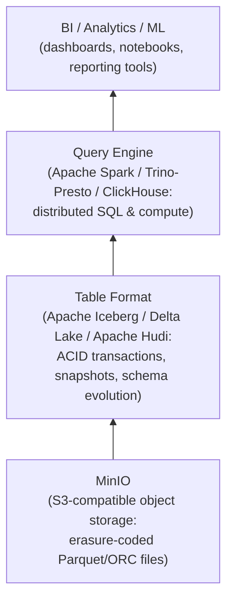
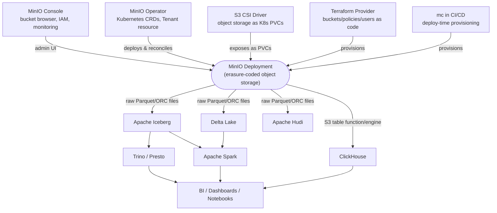

# Tools & Ecosystem

Chapter 10 gave you fluency with `mc` and the language SDKs — the tools you reach for every day to move data in and out of MinIO. Chapter 12 showed you how to stand up a distributed MinIO cluster by hand, node by node, with the `minio server` expansion-notation command. Having mastered those daily-driver skills, this chapter pulls the camera back. It surveys the broader ecosystem that surrounds a production MinIO deployment: the graphical Console as an admin surface, the Kubernetes-native Operator that replaces hand-rolled `minio server` invocations with declarative Custom Resources, the CSI driver that exposes MinIO as Kubernetes storage, and — arguably the single biggest reason object storage matters in modern data platforms — how query engines like Spark, Trino, and ClickHouse turn a MinIO bucket into the storage layer of a data lakehouse. By the end, you'll have a full map of what sits around MinIO in a real production stack, not just what sits inside it.

---

## Learning Objectives

By the end of this chapter, you will be able to:

- Explain what the MinIO Console offers beyond `mc`, and when a graphical admin tool is (and isn't) the right choice for a team.
- Describe the MinIO Operator's role: managing MinIO deployments on Kubernetes declaratively via Custom Resource Definitions (CRDs), centered on the Tenant resource.
- Contrast Kubernetes-native deployment (Operator) with the manual `minio server ...` approach from Chapter 12, and articulate why cloud-native organizations prefer the former.
- Explain, at a conceptual level, how the MinIO CSI driver exposes object storage to Kubernetes stateful workloads.
- Explain how analytics engines (Spark, Trino/Presto, ClickHouse) read and write directly against MinIO using the S3 API, and why this pattern is called a "data lakehouse."
- Describe what table formats (Apache Iceberg, Delta Lake, Apache Hudi) add on top of raw object storage, and why they matter for transactional analytics workloads.
- Recall that MinIO Gateway mode existed historically and has been deprecated/removed, and explain why that matters for interview and legacy-documentation contexts.
- Use Terraform and `mc` in CI/CD pipelines to provision buckets, policies, and users as code.

---

## Prerequisites for This Chapter

This chapter assumes you've completed Chapters 1–17, and specifically leans on:

- **Chapter 10 (MinIO Client & SDKs)** — this chapter does not re-teach `mc` command syntax or SDK usage; it assumes you're already comfortable with both and instead shows *where else* those skills plug in (CI pipelines, Terraform-adjacent tooling).
- **Chapter 12 (Distributed Deployment & Site Replication)** — you should be comfortable with the manual `minio server http://node{1...4}/data{1...4}` deployment model, server pools, and erasure-set layout, because this chapter contrasts that manual approach directly against the Kubernetes Operator's declarative model.
- **Chapter 14 (Monitoring & Observability)**, for the Console's monitoring views — this chapter recaps them briefly rather than re-deriving them.
- General familiarity with Kubernetes concepts (Pods, StatefulSets, Custom Resource Definitions, PersistentVolumes) is helpful but not required — key terms are explained as they appear.

---

## 1. The MinIO Console, Revisited: A Real Admin Tool, Not a Toy

Chapters 10 and 14 already introduced the MinIO Console in passing — as the place you glanced at metrics, and as an alternative to `mc` for one-off tasks. This section treats it as a first-class piece of the ecosystem in its own right, because for a meaningful slice of MinIO deployments, it is the primary interface, not a fallback.

### 1.1 What the Console actually contains

The Console is a full single-page web application, served by MinIO itself (or as a separate Console component in some deployment modes), that exposes nearly everything the Admin API and S3 API can do, through a browser:

- **Bucket browser.** Create/delete buckets, browse objects and prefixes as a familiar folder tree, upload/download files by drag-and-drop, inspect object metadata and tags, manage versions and legal holds, and configure per-bucket settings (versioning, object locking, lifecycle rules, replication, encryption) through forms instead of JSON policy documents or `mc` flags.
- **IAM management.** Create and manage users, groups, and policies visually — a policy editor with syntax highlighting, a user list with attached-policy visibility, and service-account (access key) creation for applications, all without hand-writing `mc admin policy` invocations or memorizing policy JSON structure from Chapter 8.
- **Monitoring views.** A recap from Chapter 14: the Console surfaces live cluster health, drive status, capacity usage, request-rate graphs, and replication status — a lighter-weight alternative to standing up Prometheus and Grafana for teams that don't need long-term metrics retention or custom alerting.
- **Configuration.** Server-side settings (notification targets, KMS/encryption configuration, identity provider federation) are all reachable through Console screens.

### 1.2 When the Console is genuinely the right tool

It's tempting, having spent nine chapters becoming fluent with `mc` and the S3 API, to view the Console as training wheels. That's the wrong framing for smaller teams and smaller deployments:

- A small team running one or two MinIO clusters, without a dedicated platform/SRE function, gets real value from an admin who can visually confirm "does this bucket have versioning on?" or "which policy is actually attached to this user?" without writing a script first.
- Onboarding new team members is faster with a GUI they can explore than with a page of `mc` commands they have to memorize or look up.
- Ad-hoc incident response — "quickly check if this one object still exists and what its retention date is" — is often faster by eye in the Console than by constructing the equivalent `mc stat` invocation.

### 1.3 Where the Console stops being the right tool

At scale, the calculus flips, for reasons that should feel familiar from every "manual vs. automated" tradeoff earlier in this course (lifecycle rules in Chapter 7, IAM policies in Chapter 8):

- **It doesn't scale to repeatable, auditable operations.** Clicking through a UI to create the same bucket-plus-policy pattern across 40 environments is slow and error-prone; a `mc` script or Terraform module does it identically every time (Section 6).
- **It has no natural place in CI/CD.** You cannot meaningfully code-review a sequence of button clicks, and a pipeline can't drive a browser as reliably as it can call an API or CLI.
- **It doesn't produce a diff.** Infrastructure-as-code tooling shows you exactly what will change before it changes; clicking through screens doesn't leave that kind of audit trail.

The practical rule, matching a theme from Chapter 16 (Best Practices): **use the Console for visibility and one-off human tasks; use `mc`/SDKs/Terraform for anything that needs to be repeatable, reviewed, or automated.** The two are complementary, not competing — plenty of production teams keep the Console open in a tab for observation while every actual provisioning change flows through code.

---

## 2. The MinIO Operator: Kubernetes-Native Deployment

### 2.1 The problem the Operator solves

Chapter 12 showed you the manual model: SSH (or its container equivalent) into every node, run the same `minio server http://node{1...4}/data{1...4}` command everywhere, and hand-manage a systemd unit or Docker Compose file per host. That works, and understanding it deeply was the point of Chapter 12 — but it does not fit naturally into a Kubernetes-centric organization, where the norm is that *nothing* is deployed by manually running commands on hosts. Everything is described declaratively and reconciled continuously by controllers.

The **MinIO Operator** is MinIO's answer to that expectation: a Kubernetes controller (itself running as a Deployment inside the cluster) that watches for a set of **Custom Resource Definitions (CRDs)** and reconciles the actual state of the cluster to match what those resources declare.

### 2.2 The central resource: the Tenant

The core CRD the Operator introduces is the **Tenant** — a single Kubernetes object that declaratively describes an entire distributed MinIO deployment: how many server pools, how many drives per pool, how many replicas, what storage class to request for each drive's PersistentVolumeClaim, TLS configuration, and more.

Conceptually, a Tenant manifest is a declarative restatement of everything Chapter 12 taught you to reason about by hand:

```yaml
apiVersion: minio.min.io/v2
kind: Tenant
metadata:
  name: shelfsnap-tenant
  namespace: analytics
spec:
  pools:
    - servers: 4          # 4 pods in this pool
      volumesPerServer: 4 # 4 drives (PVCs) per pod
      volumeClaimTemplate:
        spec:
          storageClassName: fast-ssd
          resources:
            requests:
              storage: 500Gi
  mountPath: /export
  requestAutoCert: true    # Operator provisions internal TLS certs
```

Compare this directly to the Chapter 12 command:

```
minio server http://node{1...4}/data{1...4}
```

Both describe *the same shape of deployment* — 4 nodes, 4 drives each, one server pool — but the Tenant manifest describes it **declaratively** (state the desired end result; let a controller make it true and keep it true) rather than **imperatively** (run this exact command on these exact hosts).

### 2.3 What the Operator actually does with that declaration

Once a Tenant resource is applied (`kubectl apply -f tenant.yaml`), the Operator:

1. Creates a **StatefulSet** (or equivalent per-pool workload resource) with the right number of replicas.
2. Creates the **PersistentVolumeClaims** for each pod's drives, matching the requested storage class and size — these bind to whatever CSI-backed storage the cluster provides (Section 3 covers one option).
3. Generates and mounts **TLS certificates** for inter-node and client-facing traffic if `requestAutoCert` is set, integrating with Kubernetes Secrets rather than requiring you to hand-place certificate files.
4. Continuously **reconciles**: if a pod is deleted or a node fails, Kubernetes' own scheduler restarts the pod, and the Operator ensures it rejoins the erasure set correctly — self-healing at the orchestration layer, layered on top of the self-healing MinIO already does at the erasure-coding layer (Chapter 5).
5. Exposes **scaling as a manifest edit**: expanding server pools (the Chapter 12, Section 2 operation of adding a second `http://node{5...8}/data{1...4}` pool) becomes appending a second entry to `spec.pools` and re-applying — the Operator handles pod creation and pool-join sequencing.

### 2.4 Why this matters for cloud-native organizations

None of this is capability MinIO lacks without Kubernetes — Chapter 12's manual model is fully production-capable. The Operator matters because of *fit with how an organization already works*:

- **Declarative configuration matches GitOps.** The Tenant manifest lives in a Git repository alongside every other Kubernetes resource; changes go through the same pull-request review and the same `kubectl apply` (or ArgoCD/Flux) pipeline as the rest of the platform. There's no separate "how do we deploy MinIO" runbook that only the storage team understands.
- **Self-healing pods** integrate with the scheduler's existing failure-recovery behavior. A node failing is handled the same way whether it was running MinIO or any other stateful workload — one operational mental model, not a MinIO-specific one.
- **Integration with existing Kubernetes RBAC, networking, and Secrets** means MinIO inherits the access controls, NetworkPolicies, and secret-management practices the organization already has in place, instead of requiring a parallel set of host-level firewall rules and file-permission conventions.
- **Uniform tooling.** Observability, alerting, and deployment tooling built around Kubernetes primitives (`kubectl`, Kubernetes-native monitoring, admission controllers) all apply to MinIO for free, because to Kubernetes, a MinIO Tenant's pods are just pods.

The tradeoff, honestly stated: the Operator adds a layer of abstraction and a CRD to learn, and organizations that are not already running Kubernetes gain nothing from adopting it just for MinIO. Chapter 12's manual approach remains the right choice for a bare-metal or VM-based footprint. The Operator is the right choice specifically when MinIO needs to live inside an existing Kubernetes estate.

---

## 3. MinIO as Kubernetes Persistent Storage: The CSI Angle

Section 2 covered MinIO running *on* Kubernetes. There is a related but distinct integration point: MinIO (or S3-compatible storage generally) serving *as* persistent storage *for* other Kubernetes workloads, via a **CSI (Container Storage Interface)** driver.

Kubernetes' native persistent-volume model is built around **block storage**: a PersistentVolume is typically a raw block device or network-attached disk, mounted into a pod as a filesystem. Many workloads — databases, message queues — genuinely need that block-level semantics. But a growing set of workloads (backup targets, log archives, ML training data, static asset stores) want **S3-style object access** instead: a key-based, HTTP API-driven store rather than a mounted filesystem.

An S3-compatible CSI driver bridges this gap, letting a Kubernetes workload request storage through the standard PersistentVolumeClaim mechanism, backed transparently by an S3 bucket — often surfaced to the pod as a FUSE-mounted filesystem view over the bucket, so the application can still do ordinary file I/O while the actual bytes land in object storage underneath. This is useful specifically when:

- You want the durability and erasure-coded protection of MinIO for data that's logically "files" to the application, without redesigning that application to speak the S3 API directly.
- You want Kubernetes-native lifecycle (PVC creation/deletion tied to pod lifecycle) over storage that's ultimately object storage.

This is a narrower, more specialized use case than the Operator (Section 2) and is worth knowing about at a conceptual level — the detail to retain for this course's purposes is *that this integration point exists and why*, not the mechanics of any specific CSI driver implementation.

---

## 4. MinIO as the Storage Layer for Data Lakes and Analytics Engines

This is, in practical terms, one of the most important reasons object storage exists at all in modern data platforms, and it's worth understanding well beyond a passing mention.

### 4.1 The core idea: separating storage from compute

Traditional data warehouses tightly couple storage and compute — the same system that stores your data is the only system that can query it, and scaling one means scaling both. The **data lakehouse** pattern breaks that coupling deliberately:

- **Storage** is just files sitting in an S3-compatible object store (MinIO, or a cloud provider's S3) — typically in an efficient columnar format like **Parquet** or **ORC**.
- **Compute** is one or more independent query engines that read those files directly over the S3 API, on demand, and can be scaled, swapped, or run side-by-side without touching the data itself.

Because MinIO speaks the same S3 API that essentially every analytics engine already knows how to talk to, MinIO can sit underneath this pattern as a self-hosted, S3-compatible alternative to a cloud object store — the same architecture, running on your own infrastructure.

### 4.2 Query engines reading and writing MinIO directly

- **Apache Spark** — Spark's `S3A` filesystem connector lets Spark jobs read and write Parquet/ORC/CSV files directly against a MinIO bucket by pointing Spark's S3 endpoint configuration at MinIO's URL and supplying MinIO access/secret keys, exactly like configuring any S3-compatible endpoint. Spark becomes the distributed compute engine; MinIO is purely the durable storage underneath it.
- **Trino / Presto** — Trino's Hive connector (and Iceberg connector — Section 4.3) can register a MinIO bucket as the location backing a SQL table, letting analysts run standard SQL queries that Trino executes by reading Parquet files straight out of MinIO, again via the S3 API and MinIO credentials configured on the connector.
- **ClickHouse** — this repo's own [ClickHouse course](../clickhouse-course/00-index.md) covers this from the other side: ClickHouse's `s3` table function and `S3` table engine let you query Parquet/CSV files sitting in a MinIO bucket directly with SQL, or use S3/MinIO as a storage tier for ClickHouse's own MergeTree table data (see Chapter 7's lifecycle/tiering material for the object-storage side of that same idea). The pattern is identical in shape to Spark's and Trino's: point a `s3(...)` function call or engine configuration at MinIO's endpoint, bucket, and credentials, and query.

In every case, the mechanism is the same: **the query engine treats MinIO as nothing more than an S3 endpoint.** No MinIO-specific driver or protocol is required — this is the entire point of the S3-API-compatibility strategy this course has emphasized since Chapter 1.

### 4.3 Table formats: adding transactions on top of raw files

Querying raw Parquet files directly (Section 4.2) works, but has real limitations once multiple writers and readers are involved: there's no atomic multi-file commit, no built-in way to see a consistent snapshot while a write is in progress, no cheap way to "time travel" to a previous state, and no efficient way to delete or update individual rows without rewriting whole files.

**Table formats** sit in the layer between raw object storage and the query engine, adding exactly this metadata and transactional discipline on top of ordinary Parquet (or ORC/Avro) files stored in the object store:

- **Apache Iceberg** — tracks table snapshots, schema evolution, and partition layout in a metadata layer stored alongside the data files, giving ACID transactions, time travel, and safe concurrent writes over files sitting in MinIO or any S3-compatible store.
- **Delta Lake** — originated at Databricks, plays the same role as Iceberg (ACID transactions, versioning, schema enforcement) using its own transaction-log (`_delta_log`) format, also happy to sit on top of any S3-compatible object store.
- **Apache Hudi** — again the same category, with particular strength in incremental/upsert-heavy ingestion patterns (frequently updated records rather than purely append-only data).

The relationship to remember: **object storage (MinIO) provides durable, erasure-coded bytes; a table format (Iceberg/Delta/Hudi) provides the transactional/versioned semantics on top of those bytes; a query engine (Spark/Trino/ClickHouse) provides the SQL/compute layer on top of the table format.** Each layer does one job, and any layer can typically be swapped independently — that composability is the defining characteristic of a lakehouse architecture, as opposed to a monolithic data warehouse.



---

## 5. Historical Context: MinIO Gateway Mode (Deprecated)

Earlier in MinIO's history, the project shipped **Gateway modes** — `minio gateway nas`, `minio gateway s3`, and similar — that put an S3-API-speaking MinIO process in front of a different backend storage system (a NAS filesystem, another cloud provider's object store, and so on), effectively translating S3 API calls into operations on that other backend.

This feature has been **deprecated and removed** from current MinIO releases. MinIO's own project direction shifted decisively toward being a storage system in its own right — with its own erasure coding, its own on-disk format, and its own replication — rather than a universal S3-API translation layer sitting in front of other systems.

Two reasons this is worth knowing even though you should never reach for it today:

- **It surfaces in older documentation, blog posts, and interview questions.** If you encounter a reference to "MinIO Gateway" in older material, or someone asks about it in a systems-design interview, you should recognize it as a legacy feature, not something to propose using.
- **It's a useful contrast for explaining what MinIO is today.** MinIO is not "a generic S3 proxy" — it is a complete, independent, erasure-coded storage system that happens to speak the S3 API natively. Gateway mode's removal is the clearest historical signal of that positioning.

If you need to front an existing NAS or another cloud's object store with an S3-compatible API today, that is squarely out of scope for current MinIO — you'd look at a different, purpose-built tool, not MinIO Gateway.

---

## 6. CI/CD and Infrastructure-as-Code Tooling

Section 1.3 argued that production bucket/policy/user management belongs in code, not in Console clicks. Two concrete tools make that practical.

### 6.1 The Terraform provider for MinIO

A community-maintained [Terraform provider for MinIO](https://registry.terraform.io/providers/aminueza/minio/latest) lets you declare buckets, bucket policies, IAM users, groups, and service accounts as Terraform resources, in the same style as any other cloud infrastructure:

```hcl
resource "minio_s3_bucket" "analytics_lake" {
  bucket = "analytics-lake"
}

resource "minio_iam_policy" "lake_reader" {
  name   = "lake-reader"
  policy = data.minio_iam_policy_document.lake_reader.json
}

resource "minio_iam_user" "trino_service_account" {
  name = "trino-svc"
}
```

This gets you everything Chapter 16's best-practices chapter already argued for in general — a diffable plan before every change, a reviewable pull request for new buckets or policy edits, and a single source of truth for what IAM state *should* look like — applied specifically to MinIO's bucket/IAM surface.

### 6.2 `mc` in CI pipelines

Not everything needs a Terraform resource. `mc`, already fluent from Chapter 10, is equally at home as a deployment-time provisioning step inside a CI/CD pipeline — for example, a pipeline stage that runs after infrastructure is provisioned, to ensure application-specific buckets and lifecycle rules exist before the application itself deploys:

```yaml
# Example CI stage (pipeline-tool-agnostic pseudocode)
deploy-storage:
  script:
    - mc alias set ci-target https://minio.internal $ACCESS_KEY $SECRET_KEY
    - mc mb --ignore-existing ci-target/app-uploads
    - mc ilm rule add ci-target/app-uploads --expire-days 90
    - mc admin policy attach ci-target app-readwrite --user app-service-account
```

The dividing line between "use Terraform" and "use `mc` in CI" is mostly about lifecycle: long-lived infrastructure (the buckets and IAM identities that back a whole platform) tends to fit Terraform's plan/apply model well; per-deployment, per-environment provisioning that happens as part of shipping a specific application often reads more naturally as a `mc` script step in that application's own pipeline. Many production setups use both side by side.

---

## 7. The Full Ecosystem Map

Pulling every piece from this chapter together:



Every arrow in this diagram corresponds to a section above: the Console, Operator, and CSI driver are ways of *running and exposing* MinIO; Terraform and `mc`-in-CI are ways of *provisioning* it as code; and the analytics engines, table formats, and BI tools above it are what turn a MinIO deployment into the foundation of a data platform, not just a file store.

---

## Real-World Scenario

ShelfSnap — the running example company from earlier chapters, most recently seen designing an 8-node, two-pool distributed cluster in Chapter 12 — has grown a data engineering function. Product, inventory, and clickstream events are now landed nightly as Parquet files into an `analytics-lake` bucket, and the analytics team wants to run ad-hoc SQL against that data without waiting on a nightly warehouse load.

**The deployment.** Rather than repeat Chapter 12's manual, host-by-host `minio server` setup for this new cluster, the platform team — already running Kubernetes for the rest of ShelfSnap's services — installs the **MinIO Operator** and defines a `Tenant` resource describing a 4-pool, erasure-coded MinIO deployment dedicated to analytics workloads. The manifest lives in the same Git repository as every other Kubernetes resource, goes through the same pull-request review, and is applied via the team's existing GitOps pipeline. When a node in the underlying Kubernetes cluster is drained for maintenance, the Operator and Kubernetes' scheduler cooperate to reschedule the affected MinIO pod with no manual intervention — the self-healing behavior Section 2.4 described in the abstract, now a concrete operational win for the team.

**The lakehouse.** The `analytics-lake` bucket itself holds nightly Parquet exports, but the team knows raw Parquet alone won't support the semantics they need: analysts want to run repeatable queries against a stable snapshot even while new data is landing, and occasionally need to correct a bad batch of the previous night's data without rewriting the entire partition. So the bucket is organized as **Apache Iceberg** tables rather than bare Parquet files — Iceberg's metadata layer, stored alongside the data in the same MinIO bucket, gives the team snapshot isolation and safe concurrent writes (Section 4.3).

**The query layer.** A **Trino** cluster is pointed at the bucket via its Iceberg connector, configured with MinIO's S3-compatible endpoint and a scoped-down IAM service account (created via the Terraform MinIO provider, Section 6.1, with read-only access to `analytics-lake`) rather than the cluster's root credentials. Analysts connect to Trino with a standard SQL client and query `analytics-lake` tables as if they were ordinary database tables — Trino handles reading the correct Iceberg snapshot's Parquet files directly out of MinIO underneath, entirely transparently to the analyst.

The result is the full picture this chapter set out to draw: an Operator-managed, Kubernetes-native MinIO deployment, provisioned as code, serving as the durable object-storage foundation beneath a table format and a SQL query engine — a complete, self-hosted data lakehouse.

---

## Best Practices

- **Use the Operator for Kubernetes-native deployments** rather than hand-rolling StatefulSets and PersistentVolumeClaims yourself — the Operator encodes MinIO-specific reconciliation logic (pool expansion, certificate rotation, upgrade sequencing) that a generic StatefulSet definition won't get right by accident.
- **Manage buckets, policies, and users as code** via the Terraform provider (or an equivalent) rather than manual Console clicks or ad-hoc `mc` commands run by hand in production — you want a diff and a review trail before every IAM or bucket change, not tribal knowledge of who clicked what.
- **Reserve the Console for observation and human, ad-hoc tasks**, and route anything repeatable or auditable through code — the two tools are complementary, not competing, per Section 1.3.
- **Adopt a table format (Iceberg or Delta Lake) the moment you need transactional semantics** on your data lake — concurrent writers, row-level updates/deletes, or consistent snapshots for readers. Raw Parquet files on MinIO are excellent for simple append-only or batch-replace patterns, but they are not a transactional system on their own.
- **Scope analytics engines' MinIO credentials tightly.** A Trino, Spark, or ClickHouse service account reading `analytics-lake` should hold a least-privilege IAM policy (Chapter 8) restricted to that bucket, not the cluster's root or admin credentials.
- **Treat the Gateway feature as historical only.** If you find old tutorials or scripts referencing `minio gateway`, do not port them forward — they describe a removed feature, not a supported deployment pattern.
- **Match the deployment model to the organization, not the other way around.** If you are not already running Kubernetes, adopting the Operator purely to run MinIO adds complexity without buying anything Chapter 12's manual model doesn't already provide.

---

## Common Mistakes

- **Hand-rolling Kubernetes manifests for MinIO instead of using the Operator.** A bespoke StatefulSet can start a MinIO cluster, but it won't correctly handle pool-expansion sequencing, certificate management, or version upgrades the way the purpose-built Operator does — reinventing this logic is a common source of subtle outages.
- **Manually clicking through the Console for production provisioning.** Treating the Console as the system of record for bucket/policy state means there is no diff, no review, and no way to reconstruct "why does this policy look like this" after the fact.
- **Expecting raw object storage alone to provide ACID transactional guarantees.** MinIO guarantees durability and consistency of individual object writes (Chapter 5), but it has no concept of a multi-file, multi-partition transaction — that semantic layer is exactly what a table format like Iceberg or Delta Lake exists to add. Skipping the table format and expecting "the data lake" to behave like a database is a frequent and costly misunderstanding.
- **Assuming Gateway mode is still a supported or recommended pattern.** It's deprecated and removed; proposing it in a design (or in an interview) signals outdated knowledge of the project.
- **Pointing analytics engines at MinIO with overly broad credentials.** Giving Spark or Trino a root/admin access key "to keep things simple" violates least-privilege and turns a single compromised query engine into a full-cluster compromise.
- **Conflating the Operator (running MinIO on Kubernetes) with the CSI driver (using MinIO as storage for other Kubernetes workloads).** They solve different problems and are frequently confused by newcomers to this part of the ecosystem.
- **Adopting the Operator or a table format before there's an actual need.** Both add real operational surface area; a single-node development MinIO instance backing a handful of raw Parquet files rarely needs either.

---

## Summary

- The **MinIO Console** is a genuinely useful admin tool — a full bucket browser, IAM manager, and monitoring dashboard — well suited to smaller teams and ad-hoc human tasks, but it doesn't replace `mc`/Terraform for repeatable, auditable, production provisioning.
- The **MinIO Operator** brings Kubernetes-native, declarative deployment to MinIO via CRDs, centered on the **Tenant** resource, which describes an entire distributed deployment (pools, drives, replicas) the way Chapter 12's `minio server` command did imperatively — but reconciled continuously by a controller instead of run once by hand.
- Kubernetes-native deployment matters for cloud-native organizations because it brings declarative config, self-healing pods, and integration with existing K8s RBAC/networking/Secrets — fitting MinIO into tooling and processes the organization already uses for everything else.
- A **CSI driver** can expose S3-compatible object storage as Kubernetes PersistentVolumeClaims, for workloads that want object-storage semantics without redesigning around the S3 API directly.
- **Data lakehouse architectures** put MinIO underneath query engines like **Apache Spark**, **Trino/Presto**, and **ClickHouse**, all of which read/write MinIO buckets directly over the S3 API — no MinIO-specific integration required.
- **Table formats** (Apache Iceberg, Delta Lake, Apache Hudi) add ACID transactions, snapshots, and schema evolution on top of raw Parquet/ORC files in object storage — exactly the layer needed for serious analytical workloads with concurrent writers.
- **MinIO Gateway mode** — fronting other backends with an S3 API — is a deprecated, removed feature, worth knowing about historically but never worth using today.
- **Terraform and `mc` in CI/CD** let buckets, policies, and users be managed as reviewable, repeatable code rather than manual operations.

---

## Knowledge Check

1. What does the MinIO Operator's `Tenant` Custom Resource declare, and how does applying a Tenant manifest differ operationally from running `minio server http://node{1...4}/data{1...4}` by hand, as in Chapter 12?
2. Name two reasons a cloud-native organization already running Kubernetes would prefer the Operator over Chapter 12's manual deployment model.
3. Explain, step by step, how a query engine like Trino or ClickHouse reads a Parquet file that lives in a MinIO bucket. What protocol/API is actually being used under the hood?
4. What specific problem does a table format like Apache Iceberg or Delta Lake solve that raw Parquet files sitting in a bucket do not solve on their own?
5. What was MinIO Gateway mode, and why is it no longer the right answer if someone asks you today how to front another storage backend with an S3 API?

---

## Hands-On Exercise

1. **Explore the Console.** Start a local MinIO instance (single-node is fine, as in earlier chapters) and open its Console in a browser. Locate and note down where each of the following lives: the bucket browser and object upload flow, the IAM/policy editor and user creation screen, and the monitoring/metrics view. Create one bucket and attach one policy entirely through the UI, then note how you would have done the same two operations with `mc` from Chapter 10.
2. **Sketch a Tenant manifest.** Without necessarily applying it (a local `kind` or `minikube` cluster plus the MinIO Operator's Helm chart or manifests works if you want to go further), write a minimal `Tenant` YAML for a 4-server, 2-drives-per-server pool, and annotate each field with the Chapter 12 concept it corresponds to (server count, drives-per-node, storage class/backing volumes). If you do have a local Kubernetes cluster available, install the Operator and apply your Tenant, then run `kubectl get pods` to watch it come up.
3. **Wire up an analytics engine conceptually.** Pick either Trino or ClickHouse (this repo's [ClickHouse course](../clickhouse-course/00-index.md) is a good reference if you choose ClickHouse). Write out the exact connection settings you would configure to point it at a local MinIO bucket: endpoint URL, access key/secret key (or a scoped service account), bucket/path, and (for Trino) which connector you'd use. You do not need to actually run a large dataset through it — the goal is to be able to name every configuration field and explain what it's for.
4. **Draft a least-privilege policy.** Using Chapter 8's IAM policy skills, write the JSON policy you would attach to the analytics engine's service account from step 3, granting it read-only access to a single bucket and nothing else.

---

## Further Reading

- [MinIO Documentation — Linux Admin Guide](https://min.io/docs/minio/linux/index.html) — the umbrella reference for deployment, administration, and the Console.
- [MinIO Kubernetes Operator Documentation](https://min.io/docs/minio/kubernetes/upstream/index.html) — Tenant CRD reference, installation, and Kubernetes-specific operational guidance.
- [Apache Iceberg Documentation](https://iceberg.apache.org/) — the project's own explanation of snapshots, schema evolution, and its S3-compatible storage integration.
- [Delta Lake Documentation](https://delta.io/) — Delta Lake's transaction log design and its use atop S3-compatible object stores.
- [Apache Hudi Documentation](https://hudi.apache.org/) — table-format alternative optimized for incremental/upsert-heavy ingestion.

---

<div style="display:flex;justify-content:space-between;align-items:center;">
  <a href="./17-common-mistakes-and-pitfalls.md">← Previous: Common Mistakes & Pitfalls</a>
  <a href="./00-index.md">🏠 Index</a>
  <a href="./19-capstone-projects.md">Next: Capstone Projects →</a>
</div>
