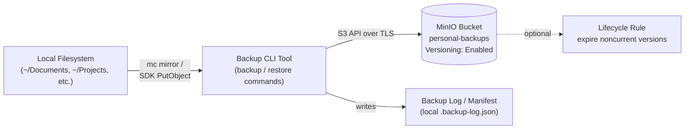
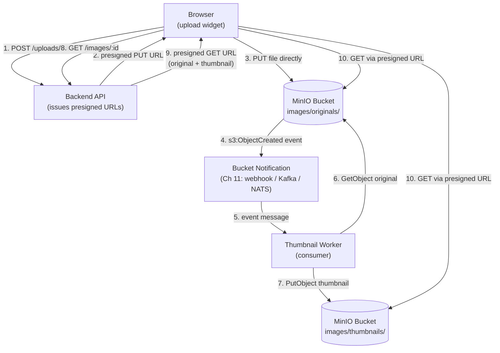
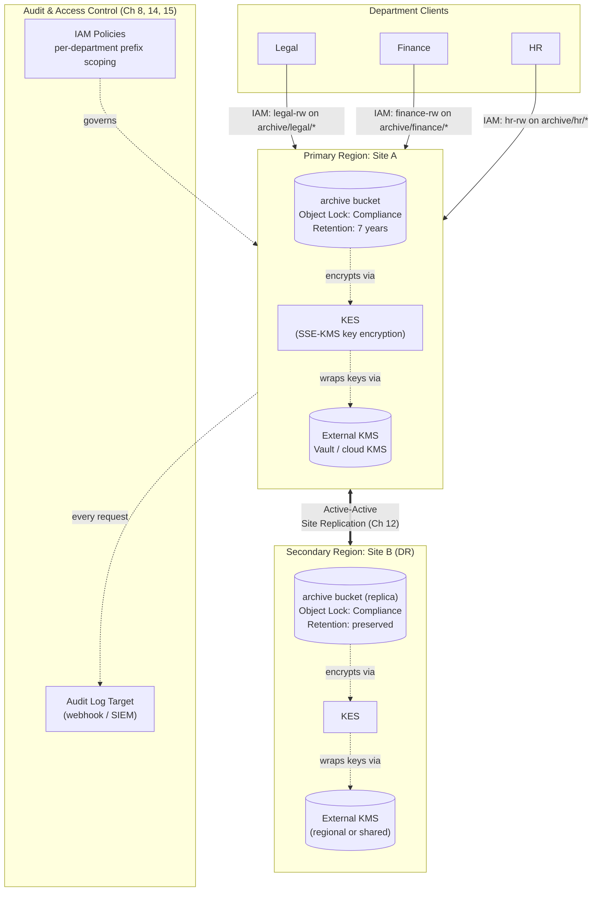
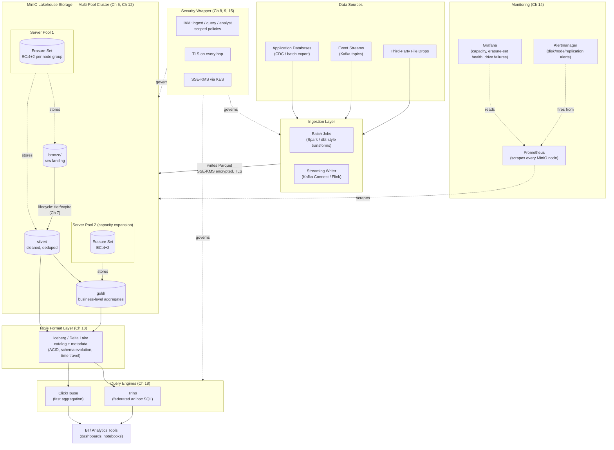

# Capstone Projects

Eighteen chapters have handed you every individual piece: what object storage is and how MinIO's erasure-coded architecture works (Ch 1–3), the S3 API and multipart uploads (Ch 4), erasure coding and data protection (Ch 5), versioning and WORM object locking (Ch 6), lifecycle management (Ch 7), IAM and presigned URLs (Ch 8), encryption and KES (Ch 9), the `mc` client and SDKs (Ch 10), event notifications (Ch 11), distributed deployment and site replication (Ch 12), performance tuning (Ch 13), monitoring (Ch 14), security hardening (Ch 15), a consolidated best-practices checklist (Ch 16), the common failure modes to avoid (Ch 17), and the broader tooling ecosystem (Ch 18). This chapter is where all of that stops being theory and becomes four real, portfolio-worthy systems — from a simple personal backup tool to a production-grade data lakehouse serving analytical queries at scale. Each project is a self-contained brief: requirements, architecture, folder structure, a phased implementation plan that points back to the exact chapter teaching each step, best practices to bake in from day one, and extensions to attempt once the core works. Read a brief fully before writing a line of code, and build the four projects in order — each one deliberately reuses storage, security, and operational skills from the one before it.

---

## Learning Objectives

By the end of this chapter, you will be able to:

- Build a CLI tool that reliably backs up and restores a local filesystem against a versioned MinIO bucket, using either `mc mirror` or an SDK
- Design a presigned-URL upload flow where browsers write directly to object storage, and wire an event-notification pipeline that reacts to those uploads asynchronously
- Combine object lock in Compliance mode, SSE-KMS encryption, scoped IAM policies, and site replication into a single system that satisfies a real regulatory retention requirement
- Design and stand up a distributed, multi-pool MinIO cluster with an erasure-coding layout sized for a real failure domain, not a toy default
- Integrate MinIO as the storage layer of a data lakehouse — Parquet ingestion, lifecycle-managed tiering, and Iceberg/Delta table formats queried by an external engine
- Apply defense-in-depth security (IAM, encryption, TLS, network hardening) and full observability (Prometheus/Grafana) across an entire multi-service architecture, not just a single bucket
- Recognize which mistakes from Chapter 17 tend to resurface at each project tier, and design around them before they happen

## Prerequisites for This Chapter

This is the **synthesis chapter** of the course. It assumes you have completed Chapters 1 through 18 — no new MinIO theory is introduced here, only application. If an implementation step below references a mechanism you don't remember (erasure-coding math, object lock retention modes, presigned URL signing, bucket notification targets, site replication, KES), treat that as a signal to revisit the cited chapter, not to skip the step.

You will also need, practically:

- A local MinIO installation (single-node standalone is enough for Projects 1–2; Docker Compose or a small VM cluster for Projects 3–4) (Ch 1, Ch 12)
- The `mc` CLI configured with at least one alias, and comfort with at least one SDK (Python, Go, or JS) (Ch 10)
- A working backend environment in any language you're comfortable with, and an HTTP client library, for the API layers in Projects 2–4
- Comfort reading and writing Mermaid diagrams, since every project below is specified with one
- For Project 3: access to (or a simulation of) a second region/site, since site replication is a core requirement
- For Project 4: Docker Compose or Kubernetes familiarity, since it stands up a multi-pool MinIO cluster, a query engine (Trino or ClickHouse), and a monitoring stack together

Work through the four projects **in order**. Each one deliberately reuses the CLI, security, and operational instincts built in the one before it — jumping straight to Project 4 means re-learning fundamentals under the pressure of the hardest project in the course.

---

## Project 1 (Beginner): Personal File Backup Service

### Requirements

- A CLI tool (any language — Bash wrapping `mc`, or a Python/Go SDK program) that backs up a chosen local directory to a dedicated MinIO bucket
- The tool must support both a **one-shot backup** and a **restore** operation that pulls the bucket's contents back down to a local path
- **Versioning enabled** on the target bucket before the first backup runs, so an accidental overwrite or delete never destroys the only copy of a file (Ch 6)
- Deterministic object keys that mirror the local relative path (e.g., `documents/2026/report.pdf` stays `documents/2026/report.pdf` in the bucket), so restore is a straightforward reverse mapping
- A basic manifest or log of each backup run (timestamp, object count, bytes transferred, any errors) for auditability
- No web UI required — this project's deliverable is a working, scriptable CLI and a bucket configuration you can defend

### Architecture



This is intentionally the simplest architecture in the course: one directory, one CLI, one bucket. The entire point of Project 1 is to get comfortable with the `mc`/SDK basics, versioning, and the backup-restore round trip before any operational complexity is added anywhere else.

### Folder Structure

```text
personal-backup-cli/
├── src/
│   ├── backup.py                   # walks local dir, uploads via SDK or shells out to `mc mirror`
│   ├── restore.py                  # pulls bucket contents back to a target local path
│   ├── manifest.py                 # writes/reads the backup-run log
│   └── config.py                   # bucket name, endpoint, credentials loading
├── scripts/
│   ├── setup_bucket.sh             # mc mb + mc version enable (Ch 6)
│   ├── run_backup.sh               # convenience wrapper around backup.py / mc mirror
│   └── run_restore.sh              # convenience wrapper around restore.py / mc mirror (reverse)
├── config/
│   └── backup.config.yaml          # source dir, bucket name, exclude patterns
├── logs/
│   └── backup-log.json             # append-only run history (gitignored)
├── tests/
│   └── test_roundtrip.py           # backs up a scratch dir, deletes it, restores, diffs
└── README.md
```

### Implementation Plan

1. **Stand up a local MinIO instance.** Single binary or Docker, with `mc` configured against it as an alias (Ch 1, Ch 10).
2. **Create the target bucket and enable versioning immediately, before any data is written.** `mc mb ALIAS/personal-backups && mc version enable ALIAS/personal-backups` — versioning must exist from the first upload, not be retrofitted after a mistake has already happened (Ch 6).
3. **Decide the key-naming scheme.** Mirror the local relative path exactly, so restoring is a direct reverse of backing up, and so `mc ls` on the bucket reads like a directory listing a human recognizes (Ch 4).
4. **Implement the backup command.** Either shell out to `mc mirror /local/path ALIAS/personal-backups` for simplicity, or use an SDK's `put_object`/`fput_object` in a loop with basic retry-on-failure logic for a more instructive build (Ch 4, Ch 10).
5. **Implement the restore command.** `mc mirror ALIAS/personal-backups /restore/target` (or the SDK equivalent walking `list_objects` and calling `get_object`) — restoring into an empty directory, not overwriting the live source, so a bad restore can't destroy good data (Ch 4, Ch 10).
6. **Add the manifest/log.** After every run, append an entry with timestamp, files transferred, total bytes, and any errors — this is what turns "I think the backup worked" into "I can prove the backup worked" (Ch 16).
7. **Run a full backup → simulated data loss → restore cycle.** Back up a real directory, delete (or move aside) the local copy, restore from the bucket, and diff the restored tree against a known-good copy to confirm byte-for-byte fidelity (Ch 4, Ch 17).
8. **Verify versioning is actually protecting you.** Modify a backed-up file locally, back up again, then use `mc ls --versions` to confirm the old version is still retrievable, and practice restoring a specific prior version, not just the latest (Ch 6).

### Best Practices to Apply

- Enable versioning **before** the first object is ever written to the bucket — a bucket that already has unversioned objects when versioning is turned on only protects writes going forward (Ch 6, Ch 16).
- Use TLS between the CLI and MinIO even for a local personal tool — treat it as the default, not something added later for "real" deployments (Ch 9, Ch 15).
- Never hardcode credentials in the CLI source — load them from environment variables or a local credentials file excluded from version control (Ch 8, Ch 16).
- Make restore write into a fresh target directory by default, never directly overwrite the original source path, so a bug in the restore path can't compound a data-loss incident (Ch 17).
- Log every backup run's outcome (success, partial failure, byte counts) somewhere durable — a backup tool nobody can audit is a backup tool nobody should trust (Ch 14, Ch 16).

### Extensions / Improvements to Try Next

- Add a lifecycle policy that expires noncurrent (old) versions after N days, so versioning protects you from mistakes without the bucket growing unbounded forever (Ch 7).
- Add SSE-S3 or SSE-KMS encryption on the bucket so backed-up files are encrypted at rest by default (Ch 9).
- Add a `--dry-run` flag that reports what would be uploaded/changed without actually transferring data, useful before large or unfamiliar directories.
- Schedule the backup via cron/systemd timer and alert (email/webhook) on failure, turning the one-shot CLI into a genuinely unattended backup service.
- Add checksum verification (compare local file hash against the object's ETag/checksum after upload) to catch silent corruption in transit.

---

## Project 2 (Intermediate): Secure Image Upload & Thumbnail Service

### Requirements

- Building on Project 1's stack (a running MinIO instance, `mc`/SDK fluency), build a **web app backend** that lets a browser upload images directly to MinIO without the backend ever touching the file bytes
- The backend issues **presigned upload URLs** scoped to a single object key with a short expiry, which the browser uses to `PUT` the file directly to MinIO (Ch 8)
- A **bucket notification** fires on every completed upload (`s3:ObjectCreated:*`), delivered to a queue or webhook target (Ch 11)
- A **worker service** consumes that notification, downloads the original image, generates a thumbnail, and uploads the thumbnail back to a separate `thumbnails/` prefix or bucket
- The backend also issues **presigned download URLs** so the browser can privately view both the original and the generated thumbnail without the bucket ever being public
- Basic upload validation (content-type allowlist, max size) enforced both in the presigned URL's policy conditions and by the worker before processing

### Architecture



### Folder Structure

```text
secure-image-upload-service/
├── backend/
│   ├── src/
│   │   ├── routes/
│   │   │   ├── uploads.routes.js       # POST /uploads/init -> presigned PUT (Ch 8)
│   │   │   └── images.routes.js        # GET /images/:id -> presigned GET (original + thumb)
│   │   ├── services/
│   │   │   ├── presign.service.js      # scoped presigned URL generation, short expiry
│   │   │   └── validation.service.js   # content-type/size policy conditions
│   │   └── app.js
│   └── tests/
│       └── presign.test.js             # asserts expiry + scope, tests a rejected oversized upload
├── worker/
│   ├── src/
│   │   ├── consumer.js                 # subscribes to the notification target (Ch 11)
│   │   ├── thumbnail.js                # image resize logic
│   │   └── worker.js                   # entrypoint: consume -> fetch -> resize -> upload
│   └── tests/
│       └── thumbnail.test.js
├── infra/
│   ├── setup_buckets.sh                # mc mb images-originals images-thumbnails
│   ├── setup_notification.sh           # mc event add ... arn:minio:sqs::webhook (Ch 11)
│   └── docker-compose.yml              # MinIO + webhook/queue target + backend + worker
├── frontend/
│   └── upload-widget/                  # minimal HTML/JS demonstrating the presigned PUT flow
└── README.md
```

### Implementation Plan

1. **Create the buckets.** `images-originals` and `images-thumbnails` (or a single bucket with `originals/` and `thumbnails/` prefixes), carrying forward the versioning habit from Project 1 (Ch 4, Ch 6).
2. **Build the presigned-upload endpoint.** `POST /uploads/init` accepts a desired filename/content-type, generates a unique object key, and returns a presigned `PUT` URL with a short expiry (minutes, not hours) and policy conditions constraining content-type and max size (Ch 8).
3. **Build the browser upload flow.** The frontend requests the presigned URL, then `PUT`s the file bytes directly to MinIO — confirm with browser dev tools that the file bytes never transit the backend server at all (Ch 8).
4. **Configure the bucket notification.** Wire `s3:ObjectCreated:*` on the `images-originals` bucket to a webhook, Kafka, or NATS target reachable by the worker service, and confirm a test upload produces a visible event (Ch 11).
5. **Build the worker's consumer loop.** Subscribe to the notification target, parse the event payload for the bucket/key that changed, and treat unrecognized or malformed events defensively (log and skip, don't crash) (Ch 11).
6. **Implement thumbnail generation.** On a valid event, `GetObject` the original, resize it to a fixed thumbnail dimension, and `PutObject` the result under `images-thumbnails/<same-key>` (Ch 4).
7. **Build the presigned-download endpoint.** `GET /images/:id` returns presigned `GET` URLs for both the original and its thumbnail (if generated yet), each with its own short expiry (Ch 8).
8. **Handle the race condition.** A client may request the thumbnail before the worker has finished generating it — return a clear "processing" status rather than a broken image link, and have the frontend poll or retry (Ch 11, Ch 17).
9. **Load-test the upload path.** Fire many concurrent presigned-upload requests and uploads, and confirm the notification pipeline and worker keep up without dropping events or falling permanently behind (Ch 13, Ch 16).
10. **Verify security boundaries.** Confirm an expired presigned URL is rejected, confirm an oversized or wrong-content-type upload is rejected by policy conditions (not just application code), and confirm the buckets are not publicly readable outside the presigned-URL flow (Ch 8, Ch 15).

### Best Practices to Apply

- Keep presigned URL expiry as short as the user experience tolerates — a leaked long-lived presigned URL is a leaked write (or read) capability until it naturally expires (Ch 8, Ch 15).
- Enforce upload constraints (content-type, max size) in the presigned policy conditions themselves, not only in application code checked after the fact — the policy condition is enforced by MinIO regardless of what client code does (Ch 8).
- Never make the originals or thumbnails bucket publicly readable — every read goes through a presigned URL issued by an authenticated backend request, so access is always attributable to a user session (Ch 8, Ch 15).
- Design the worker to be safely re-runnable — if it crashes mid-thumbnail and the notification is redelivered, regenerating the same thumbnail should be a no-op overwrite, not a corruption (Ch 11, Ch 17).
- Prefer a durable notification target (Kafka, or a queue with delivery guarantees) over a bare webhook once uptime matters — a webhook target that's briefly down can silently drop events unless retried (Ch 11).

### Extensions / Improvements to Try Next

- Add multiple thumbnail sizes (small/medium/large) generated in one worker pass, keyed by suffix (Ch 4).
- Add a virus/malware scan step in the worker before a file is considered "published," quarantining failed scans to a separate prefix.
- Move from a webhook target to Kafka for the notification pipeline and measure the throughput/reliability difference under load (Ch 11, Ch 13).
- Add server-side encryption (SSE-S3) on both buckets and confirm presigned URLs still function correctly with an encrypted bucket (Ch 9).
- Add a lifecycle rule that expires orphaned originals whose thumbnail generation never succeeded after N retries (Ch 7).

---

## Project 3 (Advanced): Multi-Region Compliant Document Archive

### Requirements

- A document-archival system for a regulated organization (think: financial records, legal holds, healthcare documents) that must prove documents **cannot be altered or deleted** for a defined retention period
- **Object Lock in Compliance mode** on the archive bucket, with a retention period set per regulatory requirement (e.g., 7 years) — Compliance mode specifically, since Governance mode can be overridden by a privileged user and therefore doesn't satisfy a true regulatory guarantee (Ch 6)
- **SSE-KMS encryption** for every object, backed by MinIO's KES (Key Encryption Service) integrated with an external KMS, so encryption keys are managed and auditable independently of MinIO itself (Ch 9)
- **Scoped IAM policies per department** (Legal, Finance, HR, etc.), each department restricted to its own prefix and unable to read or write another department's documents (Ch 8)
- **Site replication** to a secondary region, so a full regional outage or disaster does not put retained documents at risk, and replicated objects retain their lock/retention metadata (Ch 12)
- An audit trail (via MinIO's audit logging, Ch 14/15) proving who uploaded, read, or attempted to delete each document

### Architecture



### Folder Structure

```text
compliant-document-archive/
├── infra/
│   ├── site-a/
│   │   ├── docker-compose.yml          # or Terraform/K8s manifests for Site A
│   │   └── kes-config.yaml             # KES <-> external KMS config (Ch 9)
│   ├── site-b/
│   │   ├── docker-compose.yml          # Site B, same shape, DR region
│   │   └── kes-config.yaml
│   └── replication/
│       └── setup_site_replication.sh   # mc admin replicate add SITEA SITEB (Ch 12)
├── policies/
│   ├── legal-policy.json               # scoped to archive/legal/* only (Ch 8)
│   ├── finance-policy.json             # scoped to archive/finance/* only
│   ├── hr-policy.json                  # scoped to archive/hr/* only
│   └── setup_iam_users.sh              # mc admin user/policy attach per department
├── bucket-config/
│   ├── setup_bucket.sh                 # mc mb + object-lock enable at bucket creation
│   ├── set_retention.sh                # mc retention set --mode COMPLIANCE --until ... (Ch 6)
│   └── set_encryption.sh               # mc encrypt set sse-kms <key> archive (Ch 9)
├── app/
│   ├── src/
│   │   ├── routes/
│   │   │   └── documents.routes.js     # upload/read endpoints, department-scoped credentials
│   │   └── services/
│   │       └── archive.service.js      # applies retention on upload, never assumes bucket default suffices
│   └── tests/
│       └── retention.test.js           # attempts an early delete, asserts it is rejected
├── audit/
│   ├── audit-log-config.md             # audit target wiring notes (Ch 14, 15)
│   └── verify_audit_trail.sh           # confirms an upload/read/delete-attempt is logged
├── docs/
│   └── retention-policy-mapping.md     # regulatory requirement -> retention period -> bucket config
└── README.md
```

### Implementation Plan

1. **Provision the primary bucket with Object Lock enabled at creation time.** Object Lock can only be turned on when the bucket is created, not retrofitted later — get this right in phase one (Ch 6).
2. **Set Compliance-mode retention.** Configure a default retention (e.g., 7 years) at the bucket level, and confirm — by attempting and failing an early delete as a test — that not even the root/admin credential can remove an object before its retention expires (Ch 6, Ch 17).
3. **Stand up KES and connect it to an external KMS.** Configure SSE-KMS as the bucket's default encryption so every object is encrypted at rest with keys managed outside MinIO itself, then confirm an uploaded object's metadata shows KMS-backed encryption (Ch 9).
4. **Design and apply per-department IAM policies.** Each department gets a policy scoped to `archive/<department>/*` with explicit `s3:GetObject`/`s3:PutObject` (and no `s3:DeleteObject`, since retention should be the only deletion gate), then create per-department users/service accounts bound to their policy (Ch 8).
5. **Verify isolation between departments.** As the Finance user, attempt to read or write under `archive/legal/*` and confirm it's denied — do this for every department pair, not just one (Ch 8, Ch 17).
6. **Build the minimal upload/read application layer.** A thin API that authenticates a department's request and performs the upload/read using that department's scoped credentials — the application should never use a single all-powerful credential for all departments (Ch 8, Ch 16).
7. **Configure site replication to the secondary region.** Set up active-active (or active-passive, depending on the DR requirement) site replication between Site A and Site B, and confirm replicated objects preserve their Object Lock mode and retention date, not just their bytes (Ch 12).
8. **Test disaster recovery.** Simulate a Site A outage and confirm Site B can serve reads for previously replicated documents, including correctly reporting their retention status (Ch 12, Ch 17).
9. **Wire up audit logging.** Route MinIO's audit log to a durable target (SIEM, log aggregator, or at minimum a append-only file store) and confirm every upload, read, and delete *attempt* (including rejected ones) produces a traceable entry (Ch 14, Ch 15).
10. **Document the retention-policy mapping.** For each department/document type, write down the regulatory requirement driving its retention period and confirm the bucket configuration actually matches what's written down — this document is what an auditor will actually ask for (Ch 6, Ch 16).

### Best Practices to Apply

- Use Compliance mode, not Governance mode, whenever the retention guarantee needs to hold even against a compromised or malicious admin credential — Governance mode is for internal safety nets, not regulatory proof (Ch 6, Ch 17).
- Enable Object Lock at bucket creation — never assume it can be added later, and never discover that gap after documents are already stored (Ch 6).
- Scope every department's IAM policy to its own prefix with the narrowest verb set that still lets the application function — omit `s3:DeleteObject` entirely where retention alone should govern object lifecycle (Ch 8, Ch 16).
- Manage encryption keys through an external KMS via KES rather than relying on MinIO-internal key material alone — key rotation, revocation, and audit become the KMS's job, which is where regulated organizations already expect that responsibility to sit (Ch 9).
- Treat "documents are replicated" and "documents are retained correctly at the replica" as two separate things to verify — confirm the replica actually enforces the same Object Lock guarantee, not merely that the bytes arrived (Ch 12, Ch 17).
- Log and retain rejected/denied requests, not only successful ones — a denied delete attempt is exactly the kind of event a compliance audit will ask about (Ch 14, Ch 15).

### Extensions / Improvements to Try Next

- Add legal hold support (independent of retention) for documents under active litigation, and document the process for placing/removing a hold (Ch 6).
- Add a scheduled job that reports on documents approaching retention expiry, so a human reviews whether to extend retention before automatic eligibility for deletion (Ch 7).
- Add MFA-delete or additional approval workflow for any operation attempting to touch retained objects, even ones the system would technically permit.
- Extend site replication to a third region and document the quorum/consistency implications of a three-site topology (Ch 12).
- Integrate the audit log with a SIEM alerting rule that pages a human on any repeated denied-access pattern against the archive.

---

## Project 4 (Production-Grade Capstone): S3-Compatible Data Lakehouse

### Requirements

- A **distributed, multi-pool MinIO cluster** with erasure coding sized for a real failure domain — deliberately reasoned drive/node/rack topology, not a copy-pasted default (Ch 5, Ch 12)
- A **Parquet-based ingestion path**: batch and/or streaming jobs land raw and curated Parquet files into structured prefixes (bronze/silver/gold or landing/staging/curated), with **lifecycle rules** tiering older data to a cooler storage class or expiring obsolete raw data (Ch 7)
- A **table format layer** (Apache Iceberg or Delta Lake) providing ACID semantics, schema evolution, and time travel over the Parquet files sitting in MinIO (Ch 18)
- **Query engines** — Trino and/or ClickHouse — configured to read the table format directly against MinIO's S3 API, serving both ad hoc analyst SQL and a downstream BI tool (Ch 18)
- **End-to-end security**: IAM policies scoping ingestion vs. query-engine vs. analyst access separately, TLS everywhere, and encryption at rest (SSE-KMS) across every storage tier (Ch 8, Ch 9, Ch 15)
- **Full observability**: Prometheus metrics scraped from every MinIO node, Grafana dashboards for cluster health/capacity/erasure-set status, and alerting on drive failures, replication lag, and capacity thresholds (Ch 14)

### Architecture



### Folder Structure

```text
s3-lakehouse-capstone/
├── infra/
│   ├── minio-cluster/
│   │   ├── docker-compose.yml          # or K8s/Operator manifests: multi-pool topology (Ch 12, Ch 18)
│   │   ├── pool1/                      # server pool 1 node/drive layout
│   │   ├── pool2/                      # server pool 2 (capacity expansion)
│   │   └── erasure-set-plan.md         # EC:N sizing rationale for the assumed failure domain (Ch 5)
│   ├── kes/
│   │   └── kes-config.yaml             # SSE-KMS backing (Ch 9)
│   └── monitoring/
│       ├── prometheus.yml              # scrape config for every MinIO node (Ch 14)
│       └── grafana-dashboards/         # cluster health, capacity, erasure-set status
├── ingestion/
│   ├── batch/
│   │   └── spark_jobs/                 # raw -> bronze -> silver Parquet transforms
│   ├── streaming/
│   │   └── kafka_connect_sink.json     # streaming writer config -> bronze/
│   └── lifecycle/
│       ├── bronze_lifecycle.json       # expire/tier raw data (Ch 7)
│       └── silver_lifecycle.json
├── table-format/
│   ├── iceberg/
│   │   ├── catalog-config.yaml         # REST/Hive catalog pointing at MinIO S3 endpoint
│   │   └── ddl/
│   │       └── create_gold_tables.sql
│   └── docs/
│       └── schema-evolution-notes.md
├── query-engines/
│   ├── trino/
│   │   ├── catalog/
│   │   │   └── iceberg.properties      # Trino Iceberg connector -> MinIO S3 endpoint
│   │   └── queries/
│   │       └── sample_analytics.sql
│   └── clickhouse/
│       └── table-functions/
│           └── iceberg_read.sql        # ClickHouse Iceberg/S3 table function definitions
├── security/
│   ├── iam/
│   │   ├── ingest-policy.json          # write-only to bronze/ (Ch 8)
│   │   ├── query-engine-policy.json    # read-only to silver/, gold/
│   │   └── analyst-policy.json         # read-only, scoped further via query engine, not direct S3
│   └── tls/                            # certs, hardening notes (Ch 15)
├── scripts/
│   ├── loadgen_parquet.py              # generates realistic-volume Parquet batches for testing
│   ├── failure_drill.sh                # kills a node/drive, verifies read/write availability (Ch 5)
│   └── capacity_expansion_drill.sh     # adds server pool 2, verifies rebalancing behavior (Ch 12)
├── ops/
│   ├── topology.md                     # pool/node/drive layout, sizing rationale
│   ├── monitoring.md                   # Grafana panels, alert thresholds
│   └── runbooks/
│       └── drive-failure-runbook.md
└── README.md
```

### Implementation Plan

1. **Design and size the erasure-coded topology.** Choose an `EC:N` layout (e.g., EC:4+2 across 6-drive erasure sets) that survives the failure domain you're actually planning for — a single rack, a single AZ, or multiple AZs — and write the reasoning down before deploying anything (Ch 5).
2. **Stand up the initial server pool.** Deploy MinIO across multiple nodes/drives matching the chosen erasure-set layout, confirm the cluster reports healthy, and intentionally take a drive offline to confirm the cluster keeps serving reads/writes and begins healing (Ch 5, Ch 12).
3. **Add a second server pool to simulate capacity expansion.** Expand the cluster with a new pool of different (larger) capacity and confirm MinIO correctly distributes new writes across both pools without requiring a full data migration (Ch 12).
4. **Build the bronze/silver/gold prefix structure and ingestion jobs.** Batch and/or streaming jobs land raw Parquet into `bronze/`, a transform step cleans/dedupes into `silver/`, and a further aggregation step produces `gold/` business-level tables (Ch 4, Ch 18).
5. **Apply lifecycle rules to bronze and silver data.** Expire raw bronze data past a retention window once it's been durably processed into silver, and consider tiering silver data older than N days if a cooler storage class or remote tier is available (Ch 7).
6. **Stand up the table format layer.** Configure an Iceberg (or Delta Lake) catalog pointing at the MinIO S3 endpoint for the `silver/`/`gold/` prefixes, and confirm you can query a table's schema and history through the catalog, not just list raw Parquet files (Ch 18).
7. **Connect Trino and/or ClickHouse to the table format.** Configure the Iceberg/Delta connector or table function pointing at the MinIO endpoint with correct credentials, and run a query that spans multiple underlying Parquet files as one logical table (Ch 18).
8. **Apply end-to-end security.** Separate IAM policies for the ingestion job (write-only to `bronze/`), the query engines (read-only to `silver/`/`gold/`), and analysts (access mediated only through the query engine, never direct S3 credentials); enforce TLS on every hop; enable SSE-KMS via KES on all buckets (Ch 8, Ch 9, Ch 15).
9. **Wire up full observability.** Scrape Prometheus metrics from every MinIO node, build Grafana dashboards for cluster capacity, erasure-set health, and per-node drive status, and configure alerts for drive failure, pool imbalance, and approaching capacity thresholds (Ch 14).
10. **Load-test with realistic Parquet volumes.** Generate ingestion volume large enough (many GB to low TB, realistic file sizes rather than tiny toy files) that query engine performance, lifecycle transitions, and cluster capacity behavior are all observed under real conditions, not assumed (Ch 13, Ch 16).
11. **Run failure drills.** Kill a drive, kill a node, and (if feasible) simulate a full server-pool outage; confirm the cluster maintains quorum and availability as erasure coding math predicts, and that query engines continue serving reads throughout (Ch 5, Ch 12, Ch 17).
12. **Document the whole system as a handoff.** Finalize `topology.md`, `monitoring.md`, and the drive-failure runbook as if handing this platform to another engineer — sizing rationale, alert thresholds, known limitations, and the tested failure behavior (Ch 16, Ch 18).

### Best Practices to Apply

- Size the erasure-coding layout from an explicit failure-domain assumption (rack, AZ, node) and document it — a default EC ratio copied from a tutorial protects against the failures the tutorial's author assumed, not necessarily yours (Ch 5, Ch 16).
- Separate IAM policies by role (ingestion, query engine, analyst) with the narrowest verb set each actually needs — an ingestion job should never hold read access it doesn't use, and analysts should never hold direct S3 credentials at all once a query engine mediates access (Ch 8, Ch 15).
- Let lifecycle rules do the data-tiering work instead of manual cleanup scripts — express retention/tiering as bucket configuration so it survives team turnover and isn't tribal knowledge (Ch 7, Ch 16).
- Treat the table format's ACID/schema-evolution guarantees as the reason to use it, not an afterthought — design gold-layer schemas expecting to evolve them, and verify time-travel queries actually work before depending on them (Ch 18).
- Load-test with realistic Parquet file sizes and volumes before declaring the platform done — a lakehouse that performs well against a handful of small test files can behave very differently once query engines are scanning thousands of real-sized files across two server pools (Ch 13, Ch 16, Ch 17).
- Monitor and alert on erasure-set and drive health continuously, not only on total capacity — a cluster can have plenty of free space while quietly running with a degraded erasure set that one more drive failure would break (Ch 5, Ch 14).

### Extensions / Improvements to Try Next

- Add a data-catalog UI (e.g., a lightweight metadata browser) so analysts can discover gold-layer tables without reading raw configuration files.
- Extend the cluster with site replication to a secondary region for full disaster recovery of the lakehouse, combining Project 3's replication skills with Project 4's scale (Ch 12).
- Add row-level or column-level access control at the query-engine layer (Trino's system access control, or ClickHouse row policies) for sensitive gold-layer tables.
- Benchmark the same query set against Trino and ClickHouse side by side and document where each engine's strengths show up given this storage layout (Ch 13, Ch 18).
- Add automated data-quality checks (schema drift detection, null-rate thresholds) as a gate before promoting silver data to gold.

---

## Real-World Scenario

Read the four projects back to back and they trace the same arc a real platform/infrastructure engineer walks over a career. Project 1 is the first task a junior engineer gets: back up something real, get versioning right before it's needed, and prove a restore actually works — no web layer, no cluster, nothing to hide behind. Project 2 is the mid-level engineer's assignment: the product needs users to upload files without routing gigabytes of bytes through the application server, and "have the backend proxy every upload" stops being acceptable the moment traffic grows — this is where presigned URLs and event-driven processing start mattering more than general backend skill. Project 3 is what a senior engineer gets handed when Legal says a category of documents must be provably unalterable for seven years and survive a regional outage — suddenly Object Lock's Compliance vs. Governance distinction, KMS-backed encryption, and site replication aren't academic, they're the difference between passing an audit and a postmortem. Project 4 is the staff-level, cross-team problem: leadership wants a self-service analytics platform built on cheap, S3-compatible storage instead of a proprietary warehouse, and it has to survive drive failures, scale by adding pools instead of re-architecting, and stay secure and observable while three different teams query it. Very few engineers are handed Project 4 on day one, and the ones who succeed at it are almost always the ones who quietly built the muscle memory of Projects 1 through 3 first, even if nobody called them "capstones" at the time.

---

## Best Practices

- **Build incrementally, project by project.** The CLI/versioning fluency from Project 1, the presigned-URL and event-driven instincts from Project 2, and the compliance/security discipline from Project 3 are exactly the building blocks Project 4 assumes you already have — skipping ahead means learning them under the pressure of the hardest project instead of the easiest one.
- **Test with realistic data volumes and object sizes early, not at the end.** A backup tool, thumbnail worker, or lakehouse query that looks fine against a handful of small test files can behave completely differently at the volume and file sizes a real deployment accumulates — generate realistic load as early as Project 2, not as an afterthought before shipping Project 4.
- **Validate failure-tolerance assumptions by actually simulating failures.** Don't trust erasure-coding math, replication, or object-lock retention because the documentation says it should work — kill a drive, kill a node, attempt an early delete against a locked object, and confirm the system behaves exactly as designed before depending on it.
- **Treat security as a design input, not a bolt-on.** IAM scoping, encryption, and TLS are far cheaper to design in from Project 2 onward than to retrofit onto a system already serving traffic or already holding regulated data.
- **Version infrastructure and policy definitions as code** (bucket setup scripts, IAM policy JSON, lifecycle configuration checked into the repo, not commands typed once into `mc` and forgotten), so a fresh environment can be stood up reproducibly and a teammate can see exactly what exists and why.
- **Reuse rather than rewrite.** By Project 4 you should be importing and adapting the presigned-URL patterns, IAM policy shapes, and monitoring configuration from the earlier projects — that reuse is itself evidence the earlier chapters have become instinct rather than reference material.
- **Document every non-default decision.** Erasure-coding ratios, retention periods, shard/pool topology, and IAM scope should each have a one-paragraph justification somewhere in the repo — an auditor, a teammate, or your future self will ask "why" long after the reasoning has left your head.

---

## Common Mistakes

- **Skipping erasure-coding and topology planning and just running standalone MinIO.** A single-node deployment with no erasure coding works fine in a demo and offers no protection at all against the drive or node failure that eventually happens in any real deployment.
- **Not testing presigned URL expiration and permission boundaries before shipping.** A presigned URL that never actually expires (misconfigured duration) or that grants broader access than intended (missing policy conditions) is a silent security hole that a functional test alone won't catch — you have to deliberately try to misuse it.
- **Not verifying object lock or retention actually behaves as expected before relying on it for compliance.** Assuming Compliance mode "just works" because it was configured once, without ever attempting (and confirming the failure of) an early delete, means the first real test of your retention guarantee happens during an actual legal or regulatory event — the worst possible time to discover a misconfiguration.
- **Treating a bucket notification pipeline as guaranteed-delivery without verifying it.** Webhook targets can go down, consumers can crash mid-processing, and events can arrive more than once — a worker that isn't idempotent or a pipeline that was never tested against a dropped connection will lose or duplicate work silently.
- **Declaring a distributed cluster production-ready after one successful demo run, without a failure drill.** A cluster that has never had a drive or node killed under load hasn't been proven resilient, it's only been proven to work when nothing goes wrong — exactly the assumption erasure coding exists to protect against.
- **Using a single, all-powerful credential across ingestion, query, and analyst access.** It's the fastest way to get a lakehouse or archive working, and the fastest way to lose the ability to reason about who can do what — scoped IAM policies per role should exist from the first working version, not be retrofitted after an incident.
- **Skipping the restore/DR drill for backups and replication.** A backup that has never been restored from, or a secondary site that has never actually served traffic during a simulated primary outage, is an unproven safety net, not a real one.

---

## Summary

- **Project 1** (Personal File Backup Service) is a pure CLI-and-versioning exercise — the deliverable is a working backup/restore round trip against a versioned bucket, with nothing else added.
- **Project 2** (Secure Image Upload & Thumbnail Service) adds presigned URLs and an event-driven worker, so uploads bypass the backend entirely and thumbnail generation happens asynchronously off the request path.
- **Project 3** (Multi-Region Compliant Document Archive) adds Object Lock Compliance mode, KMS-backed encryption, per-department IAM scoping, and site replication to satisfy a real regulatory retention and disaster-recovery requirement.
- **Project 4** (S3-Compatible Data Lakehouse) adds a multi-pool, erasure-coded cluster, Parquet ingestion with lifecycle tiering, an Iceberg/Delta table format, Trino/ClickHouse query engines, end-to-end security, and full observability — synthesizing nearly every chapter in this course into one working platform.
- Each project deliberately builds on the one before it: the CLI, security, and operational instincts are meant to carry forward, so working through them in order is itself part of the curriculum.
- The recurring meta-lesson across all four tiers is that **realistic data volume, actual failure simulation, and a tested restore/DR drill are what separate "it worked in the demo" from "it's ready for production."**

---

## Knowledge Check

1. In Project 1, why must versioning be enabled before the first object is written to the backup bucket, and what specifically would be unprotected if you enabled it only after the bucket already held data?
2. In Project 2, why should upload constraints (content-type, max size) be enforced in the presigned URL's policy conditions rather than only in application code that runs after the URL is issued?
3. In Project 3, why does Compliance mode provide a stronger regulatory guarantee than Governance mode, even though both can technically block a delete request under normal operation?
4. In Project 3, what specifically would you need to verify about a replicated object at the secondary site before trusting it to satisfy the same retention guarantee as the primary?
5. In Project 4, how would you decide the erasure-coding ratio and server-pool layout for a specific assumed failure domain, and what would change about that decision if the failure domain were "a single rack" versus "an entire availability zone"?

---

## Hands-On Exercise

Scaffold **Project 1 (Personal File Backup Service)** right now, end to end:

1. Stand up a local MinIO instance (Docker or the single binary) and configure an `mc` alias against it.
2. Create a bucket named `personal-backups` and enable versioning on it immediately, before uploading anything.
3. Write a small CLI tool (a shell script wrapping `mc mirror`, or a short SDK program) with two commands: `backup <local-dir>` and `restore <target-dir>`.
4. Pick a real (or realistic scratch) local directory with a mix of file sizes and a nested folder structure, and run `backup` against it.
5. Confirm the objects in the bucket mirror the local relative paths using `mc ls --recursive`.
6. Modify one file locally and re-run `backup`, then use `mc ls --versions` on that object to confirm the previous version is still retained.
7. Delete (or move aside) the original local directory entirely, then run `restore` into a fresh target directory.
8. Diff the restored directory against a known-good copy of the original to confirm byte-for-byte fidelity, and separately restore the *previous* version of the file you modified in step 6 to prove versioning actually protects you, not just that it's enabled.

Stop there for today — resist adding a lifecycle policy or moving on to Project 2 until the full backup-modify-delete-restore cycle has actually been run and verified; that discipline is the whole point of the beginner tier.

---

## Further Reading

- [MinIO Documentation](https://min.io/docs/minio/linux/index.html) — the official admin guide referenced throughout all four projects, for bucket configuration, object lock, replication, and cluster deployment.
- [MinIO Docs — Bucket Versioning](https://min.io/docs/minio/linux/administration/object-management/object-versioning.html) and [Object Locking / Retention](https://min.io/docs/minio/linux/administration/object-management/object-retention.html) — the mechanisms behind Projects 1 and 3.
- [MinIO Docs — Site Replication](https://min.io/docs/minio/linux/administration/bucket-replication.html) and [Multi-Site/Server Pool Deployment](https://min.io/docs/minio/linux/operations/install-deploy-manage/multi-node-multi-drive.html) — the topology and DR mechanisms behind Projects 3 and 4.
- [Apache Iceberg Documentation](https://iceberg.apache.org/docs/latest/) — table format concepts (catalogs, snapshots, schema evolution) used in Project 4's lakehouse layer.
- [Trino Documentation — Iceberg Connector](https://trino.io/docs/current/connector/iceberg.html) — configuring Trino against an S3-compatible endpoint like MinIO for Project 4.
- [ClickHouse Documentation — S3 Table Function and Engine](https://clickhouse.com/docs/en/engines/table-engines/integrations/s3) — querying Parquet/table-format data directly from MinIO in Project 4.

---

<div style="display:flex;justify-content:space-between;align-items:center;">
  <a href="./18-tools-and-ecosystem.md">← Previous: Tools & Ecosystem</a>
  <a href="./00-index.md">🏠 Index</a>
  <a href="./20-interview-preparation.md">Next: Interview Preparation →</a>
</div>
