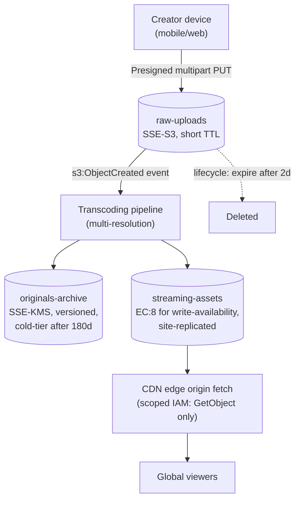

# Interview Preparation

You've built the full stack over nineteen chapters: what object storage is and how it differs from block and file storage, MinIO's erasure-coded internals and distributed architecture, the S3 API and its client tooling, versioning and WORM object locking, lifecycle management, identity and access management, encryption and key management, event-driven integrations, distributed deployment and site replication, performance tuning, monitoring, security hardening, best practices, common failure modes, the broader ecosystem, and a capstone project. This final chapter is not new material — it is a rehearsal. Its job is to take everything from Chapters 1–19 and compress it into the exact shape a technical interviewer asks for: a crisp conceptual answer delivered in under a minute, a calm, structured diagnosis under scenario pressure, a defensible system-design walkthrough with justified trade-offs, working configuration under a shared editor, and a war story that proves you've actually operated object storage in production, not just read about it. Work through this chapter the way you'd rehearse for a real interview loop: read a question, form your own answer before reading the model answer, and treat any gap between the two as a pointer back to the specific earlier chapter you need to revisit tonight.

---

## Learning Objectives

By the end of this chapter, you will be able to:

- Answer 15+ core object-storage and MinIO conceptual interview questions confidently and instructively, spanning storage models, erasure coding math, versioning/object lock, IAM/policy evaluation, presigned URLs, encryption, and distributed topology
- Diagnose realistic production scenarios — multi-tenant access design, capacity exhaustion, regulatory retention, secure mobile uploads, and NFS-to-object-storage migration — using the same diagnostic discipline taught in Chapters 13, 15, and 17
- Write correct IAM policies, erasure-coding topologies, lifecycle rules, and presigned-URL/event-notification pipelines from a plain-English problem statement under interview conditions
- Deliver a structured, interview-shaped system-design answer for an object-storage-backed platform, covering bucket/topology design, access control, encryption, and replication/lifecycle at scale
- Recognize composite, illustrative production case studies that show how this course's concepts play out as real incidents and scaling milestones
- Run a full 45-minute mock interview against yourself and honestly self-grade the result
- Walk into an object-storage/infrastructure-focused interview able to state assumptions, name trade-offs, and justify every design decision instead of reciting definitions

---

## Prerequisites for This Chapter

This is the capstone review chapter of the entire course. It assumes you have completed, or are comfortable quickly skimming back through, **all of Chapters 1–19**:

- **Ch 1–3**: object storage vs. block/file storage, MinIO's core terminology, and erasure coding, distributed topology, and on-disk layout internals
- **Ch 4–7**: bucket/object CRUD via `mc`/SDK/REST, multipart uploads, erasure coding math and healing, versioning and WORM object locking, and lifecycle management
- **Ch 8–9**: IAM users/groups/policies, STS, bucket policies, presigned URLs, and encryption (SSE-S3, SSE-KMS, SSE-C, KES)
- **Ch 10–11**: `mc`/SDK fluency and event-driven pipelines via bucket notifications
- **Ch 12**: distributed server pools, expanding a cluster, and active-active site replication
- **Ch 13–15**: performance tuning and `warp` benchmarking, Prometheus/Grafana monitoring, and security hardening
- **Ch 16–18**: the consolidated best-practices checklist, known failure modes, and the tooling/ecosystem landscape
- **Ch 19**: the capstone project you designed or built end-to-end

Every answer below is instructive on its own, but if any of it feels unfamiliar rather than "oh right, I remember this," that's your signal to reopen the relevant chapter before the interview — not during it.

---

## 1. Conceptual Q&A

Unlike the "Knowledge Check" sections in earlier chapters, which deliberately withhold answers so you self-test honestly, every question in this section comes with a full model answer — because that's exactly what an interview demands of you in real time.

### Q1. What is object storage, and how does it fundamentally differ from block storage and file storage?

Block storage exposes raw, fixed-size blocks of storage to an OS or hypervisor, which then imposes its own filesystem on top — it's the model behind a cloud VM's attached disk, optimized for low-latency random reads/writes to arbitrary byte ranges. File storage (NFS, SMB) adds a hierarchical directory tree and POSIX semantics (permissions, locks, atomic renames) on top of that, letting multiple clients share files over a network. Object storage abandons both the block-and-filesystem layer and the directory hierarchy entirely: data is stored as immutable, whole objects (an opaque blob of bytes plus metadata) addressed by a flat key inside a bucket, accessed over HTTP via a simple API (`PUT`, `GET`, `DELETE`, `LIST`) rather than POSIX file calls. This trade-off — no partial-object in-place writes, no real directories, no POSIX locking — is exactly what lets object storage scale horizontally to billions of objects and exabytes across commodity nodes, which is why it's the default choice for unstructured data (images, backups, logs, Parquet files) at scale, while block storage remains the right choice for a database's transaction log and file storage remains the right choice for legacy applications that need genuine shared POSIX semantics (Ch 1).

### Q2. Explain erasure coding: what are data and parity blocks, and what does "EC:N" notation mean?

Erasure coding is a data-protection scheme that splits each object into a set of data blocks and computes additional parity blocks using Reed-Solomon math, then stores every block on a different drive — the property that makes it useful is that the original object can be fully reconstructed from *any* subset of blocks equal in size to the number of data blocks, regardless of *which* blocks are missing, up to the number of parity blocks lost. MinIO's `EC:N` notation states the parity block count directly — `EC:4` means 4 parity blocks are computed and stored alongside however many data blocks make up the rest of the erasure set (e.g., 12 data + 4 parity in a 16-drive set). This is fundamentally different from full replication (keeping N complete copies of the same data): erasure coding buys equivalent or better fault tolerance for dramatically less storage overhead, because instead of paying 2x or 3x the raw capacity for 1 or 2 extra full copies, you pay only the parity fraction (e.g., 4/16 = 25% overhead for tolerating 4 drive failures, versus 100%+ overhead for 2-3x replication) (Ch 3, 5).

### Q3. Walk through the read-quorum and write-quorum math for an erasure set, with a concrete example.

For an erasure set of `N` total drives holding `D` data blocks and `P` parity blocks (`D + P = N`), the **read quorum** equals `D` — you need at least `D` of the `N` blocks online and intact to mathematically reconstruct the object, meaning the system tolerates up to `P` simultaneous drive failures for reads. The **write quorum** is `D + 1` — one more drive than the strict minimum needed to read — because MinIO requires a safety margin above the bare reconstruction threshold before it will accept a new write, guaranteeing that even the very next drive to fail after a successful write still leaves a readable object. Concretely, in a 12-drive erasure set configured as `EC:4` (8 data + 4 parity): read quorum is 8 (tolerate up to 4 drives down for reads), and write quorum is 9 (tolerate up to 3 drives down while still accepting new writes) — notice the write path is deliberately less fault-tolerant than the read path, which is the correct trade-off, since refusing risky writes during a degraded state protects data integrity far more than refusing reads does (Ch 5).

### Q4. What is an erasure set, and why does MinIO cap it at a maximum of 16 drives rather than using one giant set?

An erasure set is the unit over which a single erasure-coding computation runs — MinIO groups the drives in a deployment into multiple erasure sets (typically sized somewhere between 4 and 16 drives each, chosen automatically based on total drive count for a roughly even, quorum-friendly split), and every object is erasure-coded within exactly one set, never spanning sets. The cap exists because Reed-Solomon computation cost and the blast radius of "how many simultaneous drive failures does this one set need to tolerate" both grow with set size, and beyond roughly 16 drives the marginal fault-tolerance and performance benefits flatten while the mathematical/CPU cost of encoding and reconstructing keeps climbing — 16 is the empirically chosen sweet spot MinIO settled on. A deployment with many drives simply runs many erasure sets in parallel (each independently protected), and MinIO's placement algorithm distributes objects across sets for balanced utilization, so a single very large drive failure event is contained to only the sets it actually touches rather than threatening the whole deployment at once (Ch 3, 5).

### Q5. What happens to bucket contents when you delete an object in a versioned bucket, versus a non-versioned bucket?

In a non-versioned bucket, a `DELETE` permanently removes the object immediately — there is no way to recover it afterward. In a versioned bucket, a `DELETE` never removes underlying data at all; instead, it inserts a **delete marker** — a zero-byte placeholder that becomes the new "current" version of that key, causing normal `GET`/`LIST` operations to behave as if the object is gone, while every prior version remains fully intact and retrievable by its version ID. Deleting the delete marker itself (an explicit, version-ID-qualified delete) is what "undeletes" the object, restoring the next-most-recent version to current status. This is precisely why Chapter 7's lifecycle chapter treats noncurrent-version expiration as mandatory once versioning is enabled — without it, every overwrite or delete just keeps stacking billable, invisible-by-default noncurrent versions forever (Ch 6, 7).

### Q6. Explain WORM object locking, and the difference between Governance and Compliance retention modes.

Object lock implements Write-Once-Read-Many (WORM) semantics: once applied to an object version, that version cannot be deleted or overwritten until its retention period expires, and object lock must be enabled at bucket *creation* time — it cannot be turned on for a pre-existing bucket, which makes it a decision you have to get right up front, not retrofit later. **Governance mode** is retention with an escape hatch: it prevents deletion/overwrite by default, but a principal holding the specific `s3:BypassGovernanceRetention` permission can override it on an explicit request — useful for internal policies that need an audited emergency-override path. **Compliance mode** has no escape hatch at all: not even the root/admin identity can delete or shorten the retention period before it expires, which is the mode regulators actually mean when they require WORM storage for something like financial records or audit logs. Both modes require versioning to be enabled (since retention is tracked per version), and both can be paired with an independent **legal hold** flag, which blocks deletion indefinitely until explicitly lifted, regardless of any retention date (Ch 6).

### Q7. What is a lifecycle rule, and how does it interact with object lock?

A lifecycle rule is a bucket-level, declarative policy with three parts — a filter (prefix and/or tags), a time condition (N days after creation/noncurrent, or a fixed date), and an action (expire, transition to another storage tier, or abort an incomplete multipart upload) — evaluated automatically by a background scanning process with no per-request application logic involved. The critical interaction with object lock: a lifecycle expiration rule is, from the storage engine's point of view, just another actor attempting a delete, and it is bound by the exact same rules as anyone else — compliance-mode retention and active legal holds refuse the delete outright with no override, every scan cycle, until the lock lifts, and governance-mode retention only yields to an explicit bypass request from a permitted identity, which automated lifecycle scans do not carry by default. The practical takeaway: you must design retention windows and expiration windows together deliberately, because a shorter expiration window than the retention period doesn't make the object disappear on schedule — it just gets silently, repeatedly refused (Ch 6, 7).

### Q8. How does IAM policy evaluation work in MinIO, and what wins when policies conflict?

MinIO evaluates access by combining every policy that could apply to a request — policies attached directly to the user, policies inherited from any group the user belongs to, and any bucket policy attached to the target bucket — and unions together every `Allow` statement across all of them; if *any* applicable policy grants the requested action on the requested resource, and none explicitly denies it, the request is allowed. The one rule that overrides everything else: an **explicit `Deny`** in any applicable policy always wins, regardless of how many other policies say `Allow` — there is no way to override an explicit deny with a competing allow, by design, since deny-wins is what makes it possible to safely carve out narrow exceptions ("allow this group broad access, except this one sensitive prefix") without needing to enumerate every other permission around the exception. Absent any explicit statement either way, the default is implicit deny — a principal with no matching policy at all has zero access, which is the least-privilege-by-default posture the whole IAM model is built around (Ch 8).

### Q9. How do presigned URLs work, and what are they actually good for?

A presigned URL is a normal HTTPS request to a specific bucket/object with the request's signature (computed via AWS SigV4 using an existing access key/secret key pair) embedded directly in the URL's query string, along with an explicit expiration timestamp — this lets the URL holder perform exactly one specific action (a `GET`, a `PUT`, etc.) against exactly one object, without ever possessing the underlying credentials themselves, and only until the URL expires (a maximum of 7 days under SigV4). This is the standard mechanism for letting an untrusted client — a browser, a mobile app — upload or download directly to/from MinIO without proxying the bytes through your application server: your backend authenticates the user through its own normal flow, generates a short-lived presigned URL scoped to the exact object key the request is entitled to touch, and hands that single URL back to the client. The security model depends entirely on generating URLs with the narrowest scope and shortest expiration that the use case tolerates — a presigned URL is a bearer credential for the duration it's valid, so a leaked or over-broadly-scoped one is a real exposure (Ch 8).

### Q10. Compare SSE-S3, SSE-KMS, and SSE-C, and explain when you'd choose each.

**SSE-S3** is server-managed encryption where MinIO generates and manages the encryption keys entirely internally — the simplest option, requiring zero client-side change, but offering no visibility into or control over individual key lifecycle, rotation, or per-object key auditing. **SSE-KMS** delegates key management to an external or MinIO-integrated Key Encryption Service (KES) backed by a real KMS (Vault, AWS KMS, Google Cloud KMS, Azure Key Vault): each object gets its own unique data key, which is itself encrypted ("wrapped") by a master key held in the KMS, giving you centralized key rotation, per-key audit logs, and the ability to revoke access to whole classes of objects by disabling a master key — the right choice whenever compliance or key-governance requirements exist. **SSE-C** puts key custody entirely on the client: the caller supplies their own encryption key on every request (over TLS, since the key travels in the request), MinIO uses it to encrypt/decrypt on the fly, and never stores or retains the key anywhere — this gives the strongest guarantee that MinIO itself never has durable custody of the key, at the cost of the client being fully responsible for key storage, distribution, and the fact that losing the key means the data is unrecoverable, permanently (Ch 9).

### Q11. What is a MinIO server pool, and how does adding one differ from just adding more drives to an existing node?

A server pool is a complete, independently erasure-coded group of nodes and drives added to a running MinIO deployment as a distinct unit — when you run out of capacity, you don't reshape existing erasure sets (which are fixed in size and drive membership once created) or add mismatched drives into an existing node's set; instead, you start an entirely new pool (which can even use different node counts, drive sizes, or parity levels than the original pool) and MinIO's placement layer begins routing new object writes across all pools based on available capacity, effectively load-balancing at the pool level. This additive, non-disruptive expansion model — old data stays exactly where it is, on its original erasure sets, while new capacity simply becomes available for new writes — is precisely why MinIO scales operationally: capacity growth never requires re-encoding existing objects or downtime, though it does mean an unevenly-filled deployment (an old, nearly-full pool alongside a new, mostly-empty one) may eventually warrant a `mc admin rebalance` pass to even out utilization over time (Ch 12).

### Q12. What's the difference between erasure coding and site replication, and why do you need both?

Erasure coding protects against **drive- and node-level** failure *within a single site/cluster* — it's the mechanism that lets a deployment survive losing several drives (or even a full node, with the right topology) without data loss, computed and stored at write time as part of the same physical deployment. Site replication protects against **whole-site failure** — a datacenter outage, a regional network partition, a natural disaster — by asynchronously, continuously copying buckets, objects, versions, and even IAM/policy configuration from one independent MinIO deployment to one or more geographically separate deployments, each with its own independent erasure coding underneath. These are non-substitutable, complementary layers: erasure coding alone doesn't survive a whole datacenter going dark (all its parity is local), and site replication alone, without erasure coding at each site, would mean each individual site is still fragile to ordinary drive failures. A production-grade deployment needs erasure coding as its baseline durability layer at every site, and site replication layered on top for true disaster recovery and multi-region availability (Ch 5, 12).

### Q13. Why do multipart uploads exist, and what happens if one is never completed?

Multipart upload splits a single large object into independently-uploaded parts (each a separate HTTP `PUT`), which the client (or SDK, automatically above a size threshold) later finalizes with a single "complete" call that assembles the parts into one addressable object — this exists so that large uploads can be parallelized across multiple connections for throughput, can resume from a failed part without re-uploading the whole object, and don't need to fit an entire large file's bytes in memory on either end. If a multipart upload is started but never explicitly completed or aborted — a crashed client, a dropped connection, a buggy retry path that never calls completion — its already-uploaded parts remain on disk as real, billable storage, but the upload never becomes a listed, addressable object, so it's invisible during normal bucket browsing. This is exactly why Chapter 7 treats the `AbortIncompleteMultipartUpload` lifecycle action as a near-mandatory rule on any bucket accepting multipart uploads: without it, abandoned parts accumulate silently and can represent a meaningful, easy-to-miss fraction of total storage usage (Ch 4, 7).

### Q14. How does MinIO detect and repair bit rot and drive failures?

Every erasure-coded block MinIO writes is stored alongside a cryptographic checksum (BLAKE2b by default), computed at write time; on every read, MinIO recomputes the checksum of each block it retrieves and compares it against the stored value, and any mismatch — silent on-disk corruption, a failing drive returning garbage without throwing an I/O error, a bit flip — is detected immediately rather than being served to the client unnoticed. When corruption or a missing block is detected (or a drive is replaced after failure), MinIO's background **healing** process reconstructs the affected block(s) from the surviving data and parity blocks in that erasure set using the same Reed-Solomon math that made the object recoverable in the first place, and writes the repaired block back to disk (or to the newly-inserted replacement drive) — this can also be triggered proactively via `mc admin heal`. This two-part mechanism (checksum-driven bit-rot detection plus erasure-coded self-healing) is what lets MinIO guarantee data integrity beyond what RAID or simple replication alone provides, since RAID typically can't distinguish silent corruption from a healthy block without an equivalent checksumming layer (Ch 3, 5).

### Q15. How do bucket event notifications work, and what's a realistic pipeline built on them?

MinIO can publish structured events (`s3:ObjectCreated:*`, `s3:ObjectRemoved:*`, and others) to an external target — Kafka, a webhook, NATS, AMQP, Redis, or Elasticsearch — configured per bucket with an optional prefix/suffix filter, so downstream systems can react to storage changes without polling the bucket. A realistic pipeline: a mobile app uploads a photo directly via a presigned `PUT` URL (Q9), which triggers an `s3:ObjectCreated:Put` event MinIO publishes to a Kafka topic; a consumer service subscribed to that topic picks up the event, generates a thumbnail, runs a content-moderation check, and writes the object's processed status back to an application database — all fully decoupled from the upload path itself, so the mobile client's upload latency is unaffected by however long post-processing takes. This event-driven pattern is the standard alternative to having application code poll the bucket or manually track uploads, and it composes naturally with lifecycle rules and replication, since all three are independent background behaviors layered on the same bucket (Ch 11).

### Q16. What consistency model does MinIO actually provide for reads and writes?

MinIO provides strong (read-after-write) consistency for both new object creation and object overwrites/deletes on the same key: once a `PUT` or `DELETE` returns success to the client, any subsequent `GET`, `LIST`, or `HEAD` from any client is guaranteed to reflect that change — there is no "eventually consistent" window where a just-written object might not yet appear, which some legacy or early cloud object stores historically did have. This strong guarantee is possible because writes require meeting write quorum (Q3) before returning success, so by the time a write is acknowledged, enough of the erasure set has durably recorded it that any subsequent read (needing only read quorum) is guaranteed to see it. The one place this doesn't extend is cross-site replication (Q12) — site replication is explicitly asynchronous, so a secondary site can briefly lag behind the primary, and a candidate who conflates "MinIO is strongly consistent" with "replicated sites are always in sync" is missing exactly the distinction interviewers probe for here (Ch 3, 12).

### Q17. Why do small-object workloads perform so differently from large-object workloads on MinIO, and what tuning applies to each?

A large-object workload (multi-megabyte to multi-gigabyte files) is typically throughput-bound: performance is dominated by raw network and disk bandwidth, parallel part uploads, and drive sequential-I/O characteristics, so tuning focuses on multipart chunk size, concurrent connection counts, and ensuring the network path between clients and nodes isn't the bottleneck. A small-object workload (thousands of small files — thumbnails, log fragments, sensor readings) is typically IOPS- and metadata-bound instead: every object requires its own erasure-coding computation, checksum, and metadata write regardless of how tiny it is, so the fixed per-object overhead dominates rather than bandwidth, and drive IOPS characteristics (NVMe vs. spinning disk) matter far more than raw throughput specs. The practical tuning difference: large-object workloads benefit from bigger multipart chunks and more parallelism; small-object workloads benefit from batching writes where the application can (or accepting that a small-object-heavy workload simply needs a bigger, more IOPS-capable drive fleet), and benchmarking both patterns separately with `warp` (rather than assuming one benchmark run characterizes a deployment) is the correct way to validate this before it becomes a production surprise (Ch 13).

### Q18. What are the main layers of security hardening for a production MinIO deployment?

TLS everywhere — encrypting both client-to-node and inter-node traffic — protects against network interception and is non-negotiable for SSE-C in particular, since that mode transmits the encryption key itself on every request. Network-level hardening (firewalling MinIO's ports to only the application tier and admin network, never exposing the API or Console port directly to the internet, placing the cluster in a private subnet/VPC) protects against unauthorized network access reaching the service at all. IAM and bucket policies enforce least-privilege application-level authorization once a request does arrive, and encryption at rest (SSE-S3/KMS, Q10) protects the data itself if physical drives are ever removed or stolen. Audit logging (every request logged with identity, action, and target) provides the forensic trail needed to detect and investigate anything that slips past the earlier layers, and object lock/versioning (Q5, Q6) provides a last line of defense against both accidental and malicious deletion. None of these layers is assumed sufficient alone — this is defense in depth, and an interviewer asking "how would you secure a MinIO deployment" is listening for you to name multiple independent layers, not just the one you find most interesting (Ch 15).

### Q19. What metrics would you watch on a MinIO monitoring dashboard to catch problems before they become incidents?

At the cluster-health level, watch drive online/offline counts and healing status per erasure set — a single offline drive is a routine, self-healing event, but a rising count approaching an erasure set's parity threshold is an early warning that the set is losing its safety margin before quorum itself is at risk. At the capacity level, watch per-pool and per-drive usage trending toward full, ideally with an alert threshold well before 100% (MinIO's write path degrades and eventually refuses writes as drives fill, and it's far cheaper to add a server pool proactively than to firefight a full cluster). At the request level, watch error rates by API (a spike in `5xx` responses on `PutObject` specifically, versus a general elevated error rate, points to very different root causes) and request latency percentiles (p99 latency creeping up is often the earliest signal of a degraded drive or a healing job competing for I/O, well before it becomes a user-visible outage). Finally, watch S3 API request counts by bucket/prefix over time to catch runaway or misbehaving clients (a bug that retries a failed upload in a tight loop looks identical to legitimate traffic growth until you're specifically watching for anomalous request-rate shape) (Ch 14).

### Q20. What does the MinIO Operator add for a Kubernetes deployment, and when would you choose it over a bare-metal/VM deployment?

The MinIO Operator is a Kubernetes-native controller that manages MinIO deployments as custom resources (`Tenant` objects), automating what would otherwise be manual operational work: provisioning pods and persistent volumes across nodes according to the desired erasure-coding topology, handling rolling upgrades without taking the cluster offline, managing TLS certificate issuance and rotation for inter-pod and client traffic, and integrating with Kubernetes-native monitoring and secret management. Choosing the Operator makes sense when your organization already runs its infrastructure on Kubernetes and wants MinIO to be managed with the same tooling, GitOps workflows, and operational muscle memory as everything else — provisioning a new tenant becomes a manifest applied through the same CI/CD pipeline as any other service. A bare-metal or VM deployment remains the right choice when you want direct control over drive layout and hardware-level performance tuning (NVMe drives mounted and tuned specifically for MinIO, without a container storage interface layer in between), or when the organization doesn't already have Kubernetes operational expertise, since adopting Kubernetes purely to run MinIO adds real operational surface area rather than removing it (Ch 18).

---

## 2. Scenario-Based Questions

### Scenario 1: "How would you design bucket/access architecture for a multi-tenant SaaS product storing customer files?"

The two broad options are a bucket-per-tenant model and a shared-bucket-with-prefix-isolation model, and the right default for most SaaS products is the latter: create one (or a small number of) shared buckets, key every object under a `tenants/<tenant_id>/...` prefix, and never let application code construct a key without that prefix. A bucket-per-tenant model looks appealingly simple for access isolation (one IAM policy scoped to one bucket per tenant) but breaks down operationally well before you reach thousands of tenants — bucket-level lifecycle/replication/notification configuration has to be replicated and kept in sync across every bucket, and most object stores have practical or hard limits on bucket count per account. For access control on the shared-bucket model, the strongest pattern is short-lived, dynamically-scoped credentials rather than static per-tenant IAM users: your application backend acts as an STS broker, issuing temporary credentials scoped via a policy condition to exactly `tenants/${session_tag:tenant_id}/*` for the duration of a single user session, so a compromised or leaked credential is both time-limited and tenant-scoped by construction. Layer encryption per sensitivity tier if requirements demand it (e.g., SSE-KMS with tenant-specific key IDs for enterprise customers who want independently revocable encryption), and always assume the prefix-based isolation could have an application bug — treat "a query missing the tenant filter" as a security-severity bug class, not a performance one, exactly as this course's IAM chapter frames it (Ch 8, 9).

### Scenario 2: "A cluster is running low on capacity — walk through your options."

First, before touching hardware, audit whether the shortage is real usage growth or unmanaged storage bloat: check for buckets with versioning enabled but no noncurrent-version-expiration rule (Q5, Ch 7), abandoned multipart uploads with no abort rule (Q13), and any obviously stale data that a lifecycle expiration or cold-tier transition rule could offload immediately without touching capacity at all — this is often the fastest, cheapest fix and should always be checked first. If genuine growth demands more raw capacity, the additive option is adding a new **server pool** (Q11) — a complete new set of nodes/drives joining the deployment as an independent erasure-coded unit, with zero disruption to existing data and no re-encoding required, which is the standard, MinIO-native way to scale out. A secondary lever is tiering colder data to a cheaper remote tier (another MinIO cluster, S3, Azure Blob, or GCS) via `mc ilm tier`/transition rules, which frees local hot-tier capacity while keeping objects transparently readable. What you should *not* reach for reflexively: reducing parity to squeeze out more usable capacity from existing drives, since that directly trades away fault tolerance for space, and should only ever be a deliberate, reviewed decision tied to an explicit risk tolerance, never an emergency capacity patch (Ch 5, 7, 12).

### Scenario 3: "How would you satisfy a 7-year regulatory retention requirement?"

Object lock in **Compliance mode** is the correct mechanism, and the first decision point is timing: object lock can only be enabled at bucket *creation* (`mc mb --with-lock`), so this has to be designed in from day one rather than retrofitted onto an existing bucket holding data already subject to the requirement — if that bucket already exists without lock enabled, the fix is creating a new locked bucket and migrating data into it, not trying to enable lock after the fact. Set a default bucket retention configuration of Compliance mode with a 7-year (2555-day) period, so every new object automatically inherits it without relying on the uploading application to remember to set per-object retention explicitly, and apply per-object retention overrides only for exceptions that genuinely need a different window. Compliance mode guarantees no identity — not even root — can shorten or bypass the retention, which is exactly the guarantee most regulatory frameworks (financial records, healthcare, audit logs) require; pair it with an optional lifecycle expiration rule set safely *beyond* the retention window (e.g., expire at 7 years + 30 days) purely so storage is eventually reclaimed once the legal requirement lapses, rather than retaining data forever by accident. Finally, extend this to your DR posture: if you replicate this bucket to a secondary site (Q12), confirm site replication preserves object lock and retention metadata (it does, but verify it explicitly for your MinIO version), since a compliance obligation that only holds at the primary site isn't actually satisfied (Ch 6, 7, 12).

### Scenario 4: "Design a secure direct-upload flow for a mobile app."

The app should never hold long-lived storage credentials, and the app server should never proxy upload bytes through itself if avoidable — the standard pattern is: the mobile client authenticates to your application backend through its normal auth flow, the backend validates the request (is this user allowed to upload to this specific location, does it pass any size/type policy) and generates a short-lived **presigned PUT URL** (Q9) scoped to one exact object key, typically with an expiration measured in minutes, not hours. The mobile client then uploads directly to MinIO using that URL, bypassing the application server entirely for the actual byte transfer — this keeps upload latency and bandwidth cost off your application tier. Critically, do not trust the client's "upload finished" signal as the source of truth for anything security- or business-sensitive: instead, configure a bucket event notification (Q15) on `s3:ObjectCreated:Put` for the relevant prefix, and have a backend consumer react to the *actual* event MinIO emits — verifying the object's size/content-type, running any virus/content-moderation scan, generating derived assets (thumbnails), and only then marking the upload complete in your application database. This closes the gap where a client could claim success without ever actually completing the upload, or where a malicious client uploads something outside the expected shape. If the object needs default encryption or specific tagging, apply that via a bucket-level default configuration rather than trusting client-supplied headers on the presigned request (Ch 8, 9, 11).

### Scenario 5: "How would you migrate an existing on-prem NFS-based file store to MinIO?"

Start with an inventory pass over the existing NFS tree: total size, file-count distribution, directory depth, and — most importantly — which applications touch it and how (read-heavy, write-heavy, does anything rely on POSIX-specific behavior like atomic directory renames, hard links, or file locking). This matters because object storage has no true directory hierarchy — prefixes are just substrings of a flat object key that clients render as folders — so any application logic that does an atomic "rename this whole directory" operation has no direct object-storage equivalent; it has to become "copy every object under the old prefix to the new prefix, then delete the old objects," which is not atomic and needs to be designed around explicitly. Design the bucket/key schema next, generally mapping the existing directory structure onto prefixes as a starting point (`/data/customers/acme/report.pdf` → key `customers/acme/report.pdf`), then do a bulk initial copy with `mc mirror` (or `rclone`), which is idempotent and resumable. Run a dual-write or watch-based sync phase before cutover — `mc mirror --watch` can continuously replicate ongoing NFS changes to MinIO — verify data integrity with `mc diff` or checksum comparison across a meaningful sample, then cut application read traffic over to the S3 API (which typically means real code changes: replacing POSIX file-open calls with SDK `GetObject`/`PutObject` calls), and only decommission the NFS export once the application has run successfully against MinIO for a full validation window. Treat this as a phased, verifiable migration with a rollback path at every stage, not a one-shot cutover (Ch 1, 4, 10).

### Scenario 6: "How would you design a backup/DR strategy that's actually independent from site replication?"

The key framing to lead with (reinforced by the second Section 6 case study below): site replication protects against *site failure*, but it faithfully propagates every write and delete, including mistaken or malicious ones, so it cannot be the whole DR story on its own. A genuinely independent backup layer needs at least one property replication doesn't give you: immutability or point-in-time recovery that a bad actor or a buggy deploy can't also propagate. In practice this means layering versioning and object lock (Governance mode is often sufficient here, reserving Compliance mode for actual regulatory needs) on top of site replication, so that even if a destructive operation replicates to the DR site instantly, prior versions remain recoverable at both sites independently. For an additional, fully out-of-band layer, periodic exports to a genuinely separate storage system or account (a scheduled `mc mirror` snapshot to cold storage in a different administrative domain, with its own credentials that the primary application never touches) protects against the scenario where the compromise itself is at the credential/IAM level — since a compromised admin credential with delete rights could otherwise reach both the primary and its replication target. The concrete deliverable in an interview answer: name replication, versioning/object lock, and an out-of-band periodic export as three distinct layers, each defending against a different failure mode, rather than presenting any single one of them as sufficient (Ch 6, 12).

---

## 3. Practical & Configuration Challenges

### Challenge 1 — Write an IAM policy for a CI/CD service account

**Problem**: A CI/CD pipeline needs to upload build artifacts to `deploy-artifacts/builds/` and list what's there, but must never be able to delete anything (protecting against a compromised pipeline wiping historical builds) and must have zero access to any other prefix or bucket.

```json
{
  "Version": "2012-10-17",
  "Statement": [
    {
      "Effect": "Allow",
      "Action": [
        "s3:PutObject",
        "s3:GetObject"
      ],
      "Resource": [
        "arn:aws:s3:::deploy-artifacts/builds/*"
      ]
    },
    {
      "Effect": "Allow",
      "Action": ["s3:ListBucket"],
      "Resource": ["arn:aws:s3:::deploy-artifacts"],
      "Condition": {
        "StringLike": { "s3:prefix": ["builds/*"] }
      }
    },
    {
      "Effect": "Deny",
      "Action": ["s3:DeleteObject", "s3:DeleteObjectVersion"],
      "Resource": ["arn:aws:s3:::deploy-artifacts/*"]
    }
  ]
}
```

**Why it's correct**: `s3:PutObject`/`s3:GetObject` are scoped to the `builds/*` object-resource pattern only, so the service account cannot touch any other prefix, and `s3:ListBucket` (a bucket-level, not object-level, action) is granted on the bucket ARN itself but scoped with an `s3:prefix` condition so listing is also confined to `builds/`. The explicit `Deny` on delete actions is defense in depth — even though no `Allow` for delete exists (so it would already be implicitly denied), an explicit deny guarantees that if a future, overly broad `Allow` statement is ever added to this or an inherited group policy, deletion still cannot occur, since explicit deny always wins regardless of what else grants access (Q8).

### Challenge 2 — Calculate an erasure-coding topology for full node-failure write tolerance

**Problem**: You have a 4-node cluster, 16 drives per node at 4TB each (64 drives, 256TB raw total). Design an erasure-coding topology that keeps the cluster **writable** even if one entire node goes down, and calculate the resulting usable capacity.

**Solution**: Arrange the deployment as a single 16-drive erasure set that draws exactly 4 drives from each of the 4 nodes (rather than one set per node), so that losing one whole node removes exactly 4 drives from that one set, not an entire set's worth of drives concentrated in one failure domain. Set parity to `EC:8` (8 data + 8 parity, i.e., `P = N/2`): losing a full node removes 4 of the 16 drives, leaving 12 online. Read quorum is `D = 8` (12 ≥ 8, reads unaffected), and write quorum is `D + 1 = 9` (12 ≥ 9, **writes continue** through the full node outage) — this is exactly the design goal. Usable capacity = `(D / N) × raw` = `(8/16) × 256TB = 128TB`.

**Why it's correct, and the trade-off to name out loud**: a lower-parity choice like `EC:4` (12 data + 4 parity) would yield more usable capacity (`12/16 × 256TB = 192TB`) but fails the stated requirement — losing a full node removes 4 drives, leaving exactly 12 online, which meets read quorum (8) but *not* write quorum (13), so the cluster would go read-only during the outage. This is the concrete trade-off interviewers want named explicitly: `EC:8` costs 50% capacity overhead to buy write-availability through a full node failure, versus `EC:4`'s 25% overhead which only guarantees read-availability through the same failure — the correct choice depends entirely on whether the stated requirement (write-through-node-failure) is real, not on picking the "safer-sounding" number by default (Q3, Q4).

### Challenge 3 — Design a lifecycle rule set for a log-ingestion bucket

**Problem**: A bucket ingests application logs continuously. Requirements: keep logs on fast local storage for 90 days (actively queried by the ops team), transition them to a cheap remote cold tier from day 90 through day 400, then delete them entirely after 400 days total, and clean up any abandoned multipart upload after 7 days.

```bash
# Register the cold tier target once
mc ilm tier add s3 myminio LOGS-COLD \
  --endpoint https://s3.amazonaws.com \
  --access-key <AWS_ACCESS_KEY> \
  --secret-key <AWS_SECRET_KEY> \
  --bucket logs-cold-archive \
  --region us-east-1

# Transition to cold storage after 90 days
mc ilm rule add myminio/app-logs \
  --transition-days 90 \
  --transition-tier LOGS-COLD

# Expire entirely 400 days after creation
mc ilm rule add myminio/app-logs \
  --expire-days 400

# Clean up abandoned multipart uploads bucket-wide
mc ilm rule add myminio/app-logs \
  --abort-incomplete-multipart-upload-days-after-initiation 7
```

**Why it's correct**: transition and expiration are independent rules evaluated on their own schedules against the same object — the transition rule fires first (day 90) because its threshold is earlier, moving the object's bytes to the remote tier while its key remains transparently queryable through MinIO, and the expiration rule fires later (day 400) against the object regardless of which tier it currently lives in, since expiration is a logical delete of the key, not a tier-specific operation. Scoping the multipart-abort rule with no filter is deliberate (Ch 7): abandoned multipart uploads are an operational accident affecting the whole bucket, not a concern specific to any one prefix.

### Challenge 4 — Design a presigned-URL + event-notification pipeline for user-generated image uploads

**Problem**: Users upload profile photos from a web app. Design the upload path and a pipeline that generates a thumbnail automatically after each successful upload, without the web app server proxying image bytes.

**Solution**:

```bash
# 1. Backend generates a scoped, short-lived presigned PUT URL (illustrative SDK call, Python)
# url = client.presigned_put_object("user-photos", f"raw/{user_id}/{upload_id}.jpg", expires=timedelta(minutes=10))

# 2. Configure a bucket event notification targeting a queue for post-processing
mc admin config set myminio notify_webhook:thumbnailer \
  endpoint="https://internal-pipeline.example.com/webhook/thumbnail"

mc event add myminio/user-photos arn:minio:sqs::thumbnailer:webhook \
  --prefix "raw/" --suffix ".jpg" --event put
```

The web app authenticates the user, then requests a presigned PUT URL scoped to `raw/<user_id>/<upload_id>.jpg` with a 10-minute expiration; the browser uploads directly to that URL. MinIO fires an `s3:ObjectCreated:Put` event (filtered to the `raw/` prefix and `.jpg` suffix) to the configured webhook the moment the upload completes. A consumer service behind that webhook downloads the raw object, generates a thumbnail, writes it to `thumbnails/<user_id>/<upload_id>.jpg`, and updates the user's profile record only once the thumbnail exists.

**Why it's correct**: the presigned URL keeps the multi-megabyte image bytes off the application server entirely, while the prefix/suffix-filtered event notification ensures the thumbnailer only fires for genuinely new raw uploads (not, say, the thumbnail-writing step itself, which lives under a different prefix and would otherwise risk triggering an infinite processing loop if the filter were missing) (Q9, Q15).

### Challenge 5 — Write a bucket policy for public read access to one prefix only

**Problem**: A bucket hosts both private customer documents and a `public-assets/` prefix of marketing images that should be readable by anyone without authentication, while the rest of the bucket remains fully private.

```json
{
  "Version": "2012-10-17",
  "Statement": [
    {
      "Effect": "Allow",
      "Principal": { "AWS": ["*"] },
      "Action": ["s3:GetObject"],
      "Resource": ["arn:aws:s3:::company-assets/public-assets/*"]
    }
  ]
}
```

**Why it's correct**: the `Principal: "*"` combined with `Effect: Allow` on a bucket policy (not an IAM user policy) is what grants genuinely anonymous, unauthenticated access — but the `Resource` is scoped to exactly `public-assets/*`, so anonymous requests for any other key in `company-assets` fall through to the default implicit deny. This is a case where the blast radius of a mistake is severe (an overly broad `Resource` pattern like `company-assets/*` with no narrower prefix would expose the entire bucket publicly), so this policy should always be reviewed with the narrowest possible resource pattern and tested with an unauthenticated request against both an in-scope and an out-of-scope key before shipping (Q8).

### Challenge 6 — Expand a capacity-constrained cluster with a new server pool

**Problem**: An existing 4-node MinIO deployment is running low on capacity. Add a second server pool of 4 new nodes without disrupting the running cluster or existing data.

```bash
# Original startup command (pool 1) — for reference, do not re-run
# minio server http://node{1...4}/data{1...16}

# Updated startup command including the new pool — apply to ALL nodes (old and new) and restart
minio server \
  http://node{1...4}/data{1...16} \
  http://newnode{1...4}/data{1...16}
```

```bash
# After the new pool is online, check balance and optionally rebalance data across pools
mc admin pool ls myminio
mc admin rebalance start myminio
```

**Why it's correct**: MinIO's startup arguments accept multiple space-separated pool arguments in a single invocation, and pools are additive — the original pool's erasure sets, drive membership, and existing data are completely untouched by adding a second pool; new object writes are simply distributed across pools by MinIO's capacity-aware placement layer from that point forward. This is the reason server-pool expansion requires no downtime and no re-encoding of existing data, which is exactly why it's the correct answer to "the cluster is out of space" rather than trying to grow an existing erasure set in place (which MinIO does not support) (Q11).

### Challenge 7 — Configure active-active site replication for disaster recovery

**Problem**: Two independently deployed MinIO clusters (`site-primary`, `site-dr`) already exist in different regions. Configure active-active site replication so buckets, objects, and IAM policies stay in sync across both, satisfying a disaster-recovery requirement.

```bash
# Register both sites as mc aliases first
mc alias set site-primary https://minio-primary.example.com ACCESS_KEY_1 SECRET_KEY_1
mc alias set site-dr https://minio-dr.example.com ACCESS_KEY_2 SECRET_KEY_2

# Establish active-active replication between the two sites
mc admin replicate add site-primary site-dr

# Verify replication status and catch-up progress
mc admin replicate status site-primary
mc admin replicate info site-primary
```

**Why it's correct**: `mc admin replicate add` configures site-level replication, not bucket-level replication — every existing and future bucket, its objects, its versions, and its IAM users/policies replicate bidirectionally between the two sites automatically, which is the correct scope for a genuine DR posture (a bucket-level replication rule would require remembering to add every new bucket individually, an easy operational gap to introduce later). `mc admin replicate status` is the command to actually confirm catch-up progress rather than assuming the `add` command's success meant replication was instantly complete — for a large existing data set, initial synchronization is not instantaneous, and treating it as complete before verifying is a common mistake when standing up DR under deadline pressure.

---

## 4. System Design Discussion

### System Design 1: Design the storage layer for a video-streaming platform's user uploads

**Clarifying questions to ask first.** Before designing anything, ask: what's the expected upload volume and typical/maximum file size (this changes multipart chunk sizing and whether resumable upload matters as much as it does here)? Is the audience single-region or global (this decides whether site replication and CDN origin placement are in scope at all)? What's the retention policy for rejected/failed uploads and for originals after successful transcoding? Is there a compliance dimension (age-restricted content, DMCA takedown requirements) that affects access control beyond ordinary creator/viewer roles? The answers below assume a global audience, multi-gigabyte maximum file sizes, and no special compliance dimension beyond standard content moderation — state those assumptions explicitly in a real interview rather than silently picking them.

**Requirements.** Creators upload raw video files ranging from tens of megabytes to tens of gigabytes; uploads must resume reliably on flaky mobile/home connections; uploaded video must be transcoded into multiple resolutions before being served; viewers need low-latency streaming globally; the platform must retain originals for reprocessing but can tolerate slower access to old, rarely-re-transcoded originals; and the system must scale to millions of uploads without re-architecture.

**Bucket/topology design.** Use three buckets with distinct roles rather than one undifferentiated bucket: `raw-uploads` (short-lived, holds original files only until transcoding completes), `originals-archive` (long-term retention of source files, versioned, for future re-transcodes), and `streaming-assets` (the transcoded, multi-resolution output actually served to viewers, fronted by a CDN). Separating these matters because each has a different lifecycle and access pattern: `raw-uploads` should aggressively expire (nothing needs to live there once transcoding succeeds), `originals-archive` should transition to a cold tier after a defined window since re-transcodes are rare, and `streaming-assets` should never expire on its own schedule (removal is a deliberate content-management action, not a storage-cost decision). Erasure-coding topology follows Challenge 2's reasoning: `streaming-assets` is the availability-critical bucket (every viewer request depends on it), so provision it on a pool sized for write-and-read availability through a full node failure (higher parity, e.g., `EC:8`), while `originals-archive` can run leaner parity since a brief write-unavailability window during a rare node failure is tolerable for infrequently-touched archival data.

**Access control and encryption.** Uploads use presigned PUT URLs (Challenge 4's pattern) issued per-upload by the application backend after authenticating the creator, scoped to `raw-uploads/<creator_id>/<upload_id>/...` with multipart upload for anything above a few hundred megabytes, since a dropped connection mid-upload should only cost the client the current part, not the whole file. `streaming-assets` objects backing the CDN are read via the CDN's own origin-fetch credentials (a narrowly scoped IAM policy granting only `s3:GetObject` on that one bucket) rather than being made bucket-policy-public, keeping origin access auditable and revocable independently of any public CDN edge caching layer. Encryption: SSE-KMS on `originals-archive` (creators' unpublished source material is sensitive and benefits from centralized key rotation/audit), SSE-S3 is sufficient for the transient `raw-uploads` bucket, and `streaming-assets` can run without server-side encryption at rest if the content is genuinely public once published — a judgment call worth stating explicitly rather than defaulting blindly.

**Replication and lifecycle at scale.** An event notification on `raw-uploads` (`s3:ObjectCreated:CompleteMultipartUpload`) triggers the transcoding pipeline, which writes outputs into `streaming-assets` and copies the original into `originals-archive`, after which a lifecycle rule expires the now-redundant object out of `raw-uploads` after a short buffer (e.g., 2 days, covering transcoding retries). `originals-archive` gets a transition rule to a cold remote tier after 180 days of no re-access. `streaming-assets` is a strong candidate for site replication to a second region if the platform serves a genuinely global audience with regional CDN origins, so a regional outage doesn't take down origin fetches for that region's viewers.



### System Design 2: Design a compliant financial-document archive using object storage

**Clarifying questions to ask first.** Ask: which specific regulation drives the retention requirement (this affects whether Compliance mode's absolute no-bypass guarantee is mandatory, or whether Governance mode with an audited bypass path would actually satisfy the real requirement)? Is there a legal-hold workflow needed on top of standard retention for active litigation or investigations? What's the expected read pattern — routine reporting queries, or rare, audit-triggered retrieval only — since that changes whether any tiering strategy is appropriate at all? Is multi-region disaster recovery a hard requirement or a nice-to-have, since that's the single biggest cost and complexity driver in this design? The answers below assume Compliance mode is mandated by the regulation in question and that DR is a hard requirement.

**Requirements.** A financial institution must retain transaction records and statements for 7 years under regulatory mandate, guarantee tamper-proof immutability provable to auditors, support fast retrieval for active investigations, and survive a full-site disaster without losing retained records or their retention guarantees.

**Bucket/topology design.** A single dedicated bucket, `financial-records`, created from day one with object lock enabled (`mc mb --with-lock`, Scenario 3) — this is a one-way door, so this bucket is never repurposed for anything outside the compliance scope, and no other data is ever comingled into it, keeping the audit boundary unambiguous. Key schema uses a predictable, queryable prefix scheme reflecting how auditors will actually request data — `records/<account_id>/<year>/<document_id>` — acknowledging explicitly that this is a flat-namespace convention for human/tooling readability, not a real directory structure, so no application logic should ever assume atomic "move this year's folder" semantics. Erasure coding at the primary site uses a moderate-to-high parity (`EC:6` or `EC:8` depending on node count) since availability during an active audit matters, but the truly load-bearing durability guarantee here is object lock plus site replication, not erasure coding alone.

**Access control and encryption strategy.** Default bucket retention is set to Compliance mode, 2555 days, applied automatically to every object at write time so retention is never dependent on the uploading service remembering to set it per object. IAM policy grants write access only to the automated ingestion service (which itself has no delete permission at all, belt-and-suspenders alongside compliance-mode's own delete refusal), and read access is split into two tiers: a broad-but-audited read policy for the compliance team, and a narrower, time-boxed STS-issued read policy for individual auditors during a specific investigation window, so external audit access is inherently self-expiring rather than a standing credential. SSE-KMS is mandatory here, not optional — financial records are exactly the case where centralized key rotation and an independent audit trail of key usage (who decrypted what, when) is itself part of the compliance story, and audit logging (Ch 15) is enabled bucket-wide so every access, not just writes, is part of the evidentiary record.

**Replication and lifecycle at scale.** Site replication (Ch 12) to a geographically separate MinIO deployment is mandatory, not optional, given the disaster-survival requirement — and it must be verified explicitly that object lock/retention metadata replicates along with object data, since a "compliant" record that loses its immutability guarantee on failover to the DR site isn't actually compliant. A lifecycle expiration rule is set well beyond the retention window (e.g., 2555 + 90 days) purely so storage is eventually reclaimed once the legal obligation lapses and no legal hold is active — this rule will simply be refused by the lock every cycle until then, which is expected and correct, not a bug to chase. No tiering to a third-party cloud cold tier unless that provider's compliance posture (data residency, its own durability SLAs) has been independently vetted, since offloading bytes to an under-vetted external tier can itself become the weakest link in an otherwise well-designed compliance architecture.

---

## 5. Practical Troubleshooting Exercises

### Exercise 1 — "Small-object upload throughput is far below what benchmarks suggested"

**Symptom**: A `warp` benchmark run showed strong throughput numbers using large test objects, but the actual production workload — hundreds of thousands of small (a few KB) sensor-reading files per hour — is running at a small fraction of expected throughput.

**Diagnosis**: The `warp` benchmark almost certainly used its default or a large object size, characterizing a throughput-bound workload, while production is IOPS/metadata-bound (Q17) — every small object still pays the full fixed cost of erasure-coding computation, checksum generation, and metadata write, so per-object overhead dominates rather than bandwidth. Confirm by re-running `warp` explicitly configured with the production object-size distribution rather than defaults, and check drive-level IOPS utilization (not just throughput) during a production load window:

```bash
# Re-run warp with a size distribution matching the real workload, not the default
warp put --obj.size 4KiB --duration 5m --concurrent 64 --host myminio:9000

# Compare against drive-level IOPS/throughput via the admin API during a real load window
mc admin trace --stats myminio
```

**Fix**: If the application can batch small records into fewer, larger objects (e.g., writing one object per minute of aggregated sensor readings instead of one object per reading), that is almost always the highest-leverage fix, directly reducing the number of erasure-coding operations per unit of data. If batching isn't feasible, the fix shifts to hardware: ensure drives are NVMe/SSD-backed rather than spinning disk for an IOPS-bound workload, since this workload shape is fundamentally drive-IOPS-limited rather than network-limited (Ch 13).

### Exercise 2 — "A bucket meant to be private is unexpectedly returning objects to unauthenticated requests"

**Symptom**: A security review discovers that `curl`-ing an object URL with no credentials at all successfully returns object data from a bucket the team believed was private.

**Diagnosis**: Check the bucket policy directly with `mc anonymous get myminio/<bucket>` (or the bucket policy JSON) before suspecting IAM — anonymous access in MinIO/S3 is governed exclusively by the bucket policy's `Principal` field, and a policy statement with `"Principal": {"AWS": ["*"]}` and a `Resource` pattern broader than intended (Challenge 5) is the almost-certain cause, commonly introduced when a policy meant to scope public access to one prefix (`public-assets/*`) was instead written or edited to the whole-bucket wildcard (`*`) by mistake.

```bash
# Inspect the exact anonymous-access policy currently attached
mc anonymous get-json myminio/company-assets

# Reproduce the exposure directly to confirm scope before and after the fix
curl -sI https://minio.example.com/company-assets/private/customer-contract.pdf
```

**Fix**: Correct the `Resource` pattern to the intended narrow prefix, re-verify with both an in-scope and out-of-scope anonymous request, and as a preventive measure, treat any bucket policy change containing `Principal: "*"` as requiring a second reviewer before deployment — this exact mistake (a wildcard `Resource` broader than intended, on a policy that does grant real anonymous access) is one of the most common real-world object-storage data-exposure incidents, not a hypothetical (Ch 8, 15).

### Exercise 3 — "A versioned bucket's storage usage has grown 6x over six months with no corresponding increase in unique content"

**Symptom**: Total bucket storage usage has grown far faster than the actual volume of new, distinct content being written, and the team can't explain where the extra usage is coming from.

**Diagnosis**: List with `mc ls --versions` (or `mc du` with version awareness) against a sample of frequently-overwritten keys — this pattern is almost always versioning enabled without a corresponding noncurrent-version-expiration rule (Q5, Ch 7): every overwrite of a frequently-updated object (a nightly-regenerated report, a repeatedly-corrected image) keeps stacking a new noncurrent version forever, with nothing ever cleaning them up.

```bash
# Confirm suspicion: how many versions does one frequently-updated key actually have?
mc ls --versions myminio/reports/nightly/2026-07-01.json | wc -l

# Confirm no noncurrent-version-expiration rule exists on the bucket
mc ilm rule list myminio/reports --json | grep -i noncurrent
```

**Fix**: Add a noncurrent-version-expiration rule (`mc ilm rule add ... --noncurrent-expire-days 90 --newer-noncurrent-versions 5`, Ch 7) scoped appropriately to the affected prefixes, and audit every other versioned bucket in the deployment for the same gap rather than assuming this is an isolated case — this is one of the single most common and most expensive lifecycle-management mistakes teams make, precisely because storage growth from it is gradual and easy to miss until a capacity alert or a bill spike forces the investigation (Ch 7, 17).

### Exercise 4 — "After a drive failure and replacement, the cluster is healed but write latency remains elevated"

**Symptom**: A failed drive was detected, replaced, and `mc admin heal` reports the erasure set as healthy again — but write latency on that node's erasure set stays noticeably higher than the rest of the cluster days later.

**Diagnosis**: Check `mc admin heal status` and the healing job's actual completion state rather than trusting a one-time "healthy" report — background healing after a drive replacement can take substantial time proportional to the amount of data that needed reconstruction, and if a large erasure set had accumulated a lot of data before the failure, healing may still be running in the background, consuming I/O bandwidth on that node's drives that competes directly with live client writes. Also check whether the replacement drive itself is a slower model or has a different performance profile than its peers in the set (a common oversight when hardware is swapped under time pressure).

**Fix**: If healing is still in progress, elevated latency during that window is expected and should resolve once healing completes — monitor `mc admin heal status` to completion rather than assuming the initial "healed" message meant the background work was done. If healing has genuinely finished and latency remains elevated, verify the replacement drive's specs match the rest of the set exactly; a mismatched, slower drive silently degrades that entire erasure set's write quorum latency since the set is only as fast as its slowest required drive under quorum (Ch 3, 5, 13).

### Exercise 5 — "A 4-node, `EC:4` cluster has gone read-only after two nodes went down"

**Symptom**: Two of four nodes in a distributed deployment lose power simultaneously (a shared rack PDU failure). The remaining two nodes stay up, but every write request now fails, while reads continue to succeed.

**Diagnosis**: Work out the quorum math for the deployed topology rather than guessing (Q3): with erasure sets spanning all 4 nodes evenly and `EC:4` parity on, say, a 16-drive-per-set layout (8 data + 8 parity), losing 2 of 4 nodes removes half the drives in every set — if that leaves exactly 8 of 16 drives online, read quorum (`D = 8`) is met right at the boundary, so reads still succeed, but write quorum (`D + 1 = 9`) is not met, so every write is correctly refused rather than risking a write that only 8 drives could confirm. This is not a bug — it's the erasure-coding safety mechanism from Q3 working exactly as designed, refusing writes it cannot guarantee durability for.

**Fix**: There is no configuration change that restores write availability while 2 of 4 nodes remain down under this topology — the immediate fix is restoring power/connectivity to at least one of the two failed nodes, which is an infrastructure incident-response action, not a MinIO configuration action. The real fix belongs in the postmortem: if "tolerate a 2-node simultaneous outage and keep writing" is a genuine requirement, the topology needs to be redesigned with that explicit target in mind (a higher-node-count deployment with parity sized so that losing 2 nodes still leaves write quorum intact, and — just as importantly — physically distributing nodes across independent power/network domains, since two nodes sharing a single PDU is itself a single point of failure the erasure-coding math alone cannot compensate for) (Ch 3, 5, 12).

---

## 6. Real-World Production Case Studies

The following are illustrative, composite scenarios reflecting well-known object-storage failure and scaling patterns — not citations of a specific company's confidential incident — but each is a realistic, commonly-reported shape of production issue.

**The versioning bill that crept up for six months before anyone noticed.** A media company enabled bucket versioning across its entire asset library after a near-miss where a script accidentally overwrote several thousand production images, treating versioning purely as an insurance policy against exactly that mistake happening again. No one paired it with a noncurrent-version-expiration rule, reasoning that storage was cheap and the safety net was worth it. Over the following months, a routine automated process that re-generated and re-uploaded resized thumbnails daily silently stacked a new noncurrent version of every thumbnail, every day, for every asset in the library — millions of essentially-worthless old versions accumulating invisibly, since normal bucket browsing only ever showed current versions. A capacity-planning review six months later found actual unique content had grown modestly, but total storage had grown more than sixfold, and the root cause traced directly to the missing lifecycle rule. The lesson: versioning without a noncurrent-version-expiration rule isn't a safety net with a small ongoing cost — it's an unbounded liability, and the two should always be configured together, in the same change, never as a "we'll add the cleanup rule later" afterthought.

**The team that treated site replication as a backup strategy.** An engineering team set up active-active site replication between two MinIO deployments and considered their disaster-recovery and backup requirements both satisfied by that one configuration, since data now existed in two places. Months later, a buggy deployment script issued a bulk, mistaken `DELETE` across a large swath of a production bucket — and because site replication faithfully and near-instantly propagates deletes exactly the way it propagates writes, the secondary site's copies were deleted within seconds of the primary's, offering zero protection against the mistake. The team's actual recovery path ended up being versioning and object lock on the primary bucket (which they had, fortunately, also enabled for unrelated reasons) letting them restore prior versions — site replication itself contributed nothing to the recovery. The lesson: site replication protects against site failure, not against logical errors, malicious deletion, or application bugs, because it replicates *intent*, including mistaken intent, just as faithfully as legitimate writes — versioning, object lock, and genuinely independent (often air-gapped or immutable-snapshot) backups are the actual defenses against those failure modes, and conflating "replicated" with "backed up" is a distinct, common, and expensive category error.

**The capacity crunch that triggered a risky, wrong-first-instinct fix.** An operations team facing an unexpected capacity shortage under deadline pressure considered lowering the erasure-coding parity on an existing bucket's storage class to free up usable space quickly, reasoning that fault tolerance could always be "tightened back up later" once new hardware arrived. A more careful read of the documentation (and a colleague's pushback) surfaced two problems: existing objects' erasure encoding is fixed at write time per erasure set and isn't something a parity-level change retroactively alters, so the change would only affect *future* writes while leaving the team confused about which objects had which actual protection level, and even for future writes, deliberately reducing fault tolerance during a period when hardware was already under strain (the reason capacity was tight in the first place) was precisely the wrong moment to accept a weaker failure-tolerance posture. The team instead added a new server pool on short-notice cloud-hosted nodes as a temporary capacity bridge while permanent hardware was procured — an additive, non-disruptive change that didn't touch existing data's protection level at all. The lesson: capacity pressure creates real time pressure to find the fastest-looking fix, but a fix that trades away durability guarantees under exactly the conditions (strained infrastructure) where those guarantees matter most is the wrong direction — additive scaling (a new pool) is almost always the safer lever than reducing protection on what you already have.

---

## Real-World Scenario

A mock 45-minute object-storage/MinIO technical interview, structured the way a real onsite or virtual loop typically runs — rehearse this end-to-end, out loud, with a timer.

| Time | Segment | Pull from |
|---|---|---|
| 0:00 – 0:05 | Warm-up / background | Briefly describe your Chapter 19 capstone project and one architectural decision you'd defend |
| 0:05 – 0:15 | Rapid conceptual Q&A | Pick 4-5 from Section 1: e.g., Q3 (quorum math), Q6 (Governance vs. Compliance), Q8 (policy precedence), Q10 (SSE-S3/KMS/C), Q12 (erasure coding vs. site replication) |
| 0:15 – 0:20 | One scenario/debugging question | Section 2, Scenario 2 ("cluster running low on capacity") — narrate your diagnostic order, not just the answer |
| 0:20 – 0:35 | Live configuration challenge | Section 3, Challenge 1 or 2 (IAM policy, or the erasure-coding capacity/fault-tolerance calculation) — write it from scratch without looking, then check against the model solution |
| 0:35 – 0:44 | System design | Section 4, System Design 1 (video-streaming upload storage layer) — walk through requirements, bucket/topology design, access control/encryption, and replication/lifecycle out loud in under 9 minutes |
| 0:44 – 0:45 | Your questions for the interviewer | Have two ready: e.g., "what does your erasure-coding/parity topology look like today" or "how do you currently catch missing noncurrent-version-expiration rules before they become a capacity incident" |

Time yourself strictly. If you run long on any segment, note which one — running long on conceptual Q&A at the expense of the system design segment is the single most common way candidates mismanage this format.

---

## Best Practices

- **Always state a trade-off, never just a choice** — "I'd use `EC:8` here because the requirement is write-availability through a full node failure, at the cost of 50% capacity overhead instead of 25%" is a materially stronger answer than "I'd use `EC:8`."
- **Answer conceptual questions with the definition-mechanism-trade-off shape**: one sentence defining the concept, one sentence on the underlying mechanism (what MinIO actually does), and one sentence on when it breaks down or costs something — this keeps answers tight (30-60 seconds) without sounding rehearsed.
- **In scenario/debugging questions, narrate your diagnostic order out loud** — an interviewer evaluating a "cluster is out of capacity" or "bucket is publicly exposed" question is watching *how* you isolate the cause (check for unmanaged lifecycle bloat before proposing new hardware; check the bucket policy before suspecting IAM), not just whether you eventually guess right.
- **In system design questions, ask clarifying questions before designing** — access pattern, retention/compliance requirements, expected object-size distribution, and single-site vs. multi-region scope all change the right topology, and asking first signals senior-level judgment rather than pattern-matching to a memorized architecture.
- **Ground every answer in a mechanism, not a memorized rule** — being able to derive read/write quorum from data and parity shard counts (Q3) is worth far more than reciting "N/2 and N/2+1" without being able to explain why, especially when a follow-up changes the parity level.
- **Have one real (or realistic capstone-based) war story ready** — most interviewers eventually ask "tell me about a production storage issue you've seen or can imagine," and a concrete, specific answer (even hypothetical, reasoned from first principles, like the Section 6 case studies) outperforms a generic answer every time.
- **Practice the configuration challenges by hand, not by memorizing solutions** — interviewers frequently tweak the problem statement slightly (a different fault-tolerance target, a different prefix, an added condition), specifically to see whether you understand the mechanism or memorized an answer.
- **Verify a claimed fix rather than asserting it** — in a troubleshooting question, actually stating the `mc`/`mc admin` command you'd run to confirm the diagnosis (as Section 5's exercises do) before proposing the fix reads as far more credible than jumping straight to "the fix is X."

---

## Common Mistakes

- **Confusing erasure coding with replication** — describing erasure coding as "keeping multiple copies" misses the entire point of Reed-Solomon parity math, and an interviewer will immediately probe with "so how much storage overhead does that cost compared to 3x replication" to check whether you actually understand the distinction (Q2, Q12).
- **Forgetting that object lock cannot be added after bucket creation** — proposing "enable object lock on the existing bucket" as part of a compliance design is a factual error that undermines an otherwise-good answer; the correct answer always involves creating a new locked bucket and migrating data if the existing bucket wasn't created with lock enabled (Q6, Scenario 3).
- **Not considering the flat-namespace implication when designing a key schema** — proposing an architecture that relies on atomic "move/rename this folder" semantics, or assuming a prefix delete is a single fast operation rather than N individual object deletes, signals unfamiliarity with how object storage actually represents hierarchy (Q1, Scenario 5).
- **Jumping to a complex multi-region design when a simpler single-cluster answer satisfies the stated requirements** — proposing site replication and multi-region active-active topology for a requirement that only calls for surviving a drive or node failure (which erasure coding alone already solves) signals reaching for the biggest hammer before matching the design to the actual stated failure domain (Q12).
- **Treating site replication as a backup strategy** — as the second Section 6 case study shows, conflating "replicated" with "backed up" misses that replication faithfully propagates mistakes and malicious deletes just as fast as legitimate writes; only versioning, object lock, and genuinely independent backups defend against logical/malicious data loss.
- **Skipping clarifying questions in system design and diving straight into an architecture** — this is the single most common signal of junior-level pattern-matching versus senior-level engineering judgment, and interviewers weight it heavily.
- **Overclaiming MinIO's consistency guarantees** — stating that replicated sites are always instantly in sync, when site replication is explicitly asynchronous, is a specific and commonly-probed nuance gap (Q16).
- **Reaching for lower erasure-coding parity as a quick fix for a capacity shortage** — as the third Section 6 case study shows, proposing a parity reduction on existing infrastructure under time pressure (rather than an additive server pool) trades away durability at precisely the moment infrastructure is already under strain, and signals not having internalized that parity is a deliberate, reviewed design decision, not a capacity dial.

---

## Summary

This course started with a single question — what is object storage, and why does it exist as a category distinct from block and file storage — and built outward one load-bearing layer at a time. Chapters 1–3 gave you the motivation, MinIO's core terminology, and the erasure-coded, distributed architecture that underlies everything else in the course. Chapters 4–7 made you fluent in the S3 API, multipart uploads, erasure coding's data-protection math, versioning, WORM object locking, and lifecycle management — the data-protection and hygiene core of the course. Chapters 8–11 covered identity and access management, encryption and key management, `mc`/SDK tooling, and event-driven integrations — the security and application-integration layer. Chapter 12 widened the lens to scale and resilience: distributed server pools and active-active site replication. Chapters 13–15 took the system into production operations: performance tuning and benchmarking, monitoring and observability, and security hardening. Chapters 16–18 consolidated everything into a professional best-practices checklist, a catalog of known failure modes, and a map of the broader tooling ecosystem. Chapter 19 asked you to build something real. And this chapter, Chapter 20, rehearsed all of it under interview conditions — conceptual answers, scenario diagnosis, hands-on configuration, system design, troubleshooting, and production war stories.

You are now equipped to:

- **Explain object storage's architecture precisely**, and contrast it with block and file storage in terms of mechanism, not just performance claims
- **Design and defend an erasure-coding topology**, including the read/write quorum math and reading a stated fault-tolerance requirement correctly rather than defaulting to a memorized parity level
- **Write IAM policies, lifecycle rules, and presigned-URL/event pipelines from a plain-English problem statement**, including least-privilege scoping and defense-in-depth patterns
- **Reason about site replication and erasure coding as complementary, non-substitutable layers**, knowing precisely which failure domain each one protects against
- **Diagnose a slow, insecure, or misconfigured production deployment methodically**, working from the cheapest, most information-dense check outward rather than guessing
- **Deliver a structured system design answer** under time pressure, stating assumptions and trade-offs at every step
- **Talk about MinIO the way someone who has operated it talks about it** — in terms of mechanisms and trade-offs, not memorized definitions

Congratulations on completing the course. Go back to the [course index](./00-index.md) and check off every box in the Milestones Checklist from memory — if any box gives you pause, that's your last-mile study list before an interview, not a sign you need to redo the whole course. This is the full arc: from "what is object storage?" to a professional capable of designing, building, securing, and defending a production MinIO deployment in front of a whiteboard. Good luck.

---

## Knowledge Check

Rate your confidence (1-5) on each of the following, honestly, before your next interview:

1. Can you explain, from memory and without notes, why erasure coding provides equivalent or better fault tolerance than full replication at a fraction of the storage overhead, and derive read/write quorum from a given data/parity shard split?
2. Can you explain the difference between Governance and Compliance retention modes, state why object lock must be enabled at bucket creation, and correctly predict what happens when a lifecycle expiration rule targets a locked object?
3. Can you write a correct, least-privilege IAM policy and a complete lifecycle rule set from a plain-English requirement in under 10 minutes, without referring back to this chapter's solutions?
4. Can you explain when a shared bucket with prefix isolation is preferable to a bucket-per-tenant model (and vice versa), and describe precisely how site replication differs from erasure coding, well enough to defend a design choice under follow-up questions?
5. Can you deliver a full system design answer (requirements → bucket/topology design → access control/encryption → replication/lifecycle at scale) for an object-storage-backed system you've never seen before, out loud, in under 12 minutes, stating your assumptions as you go?

---

## Hands-On Exercise

Run a full mock interview against yourself:

1. **Pick 3 conceptual questions** from Section 1 (try to pick across different areas — e.g., one on erasure coding/quorum, one on IAM/policy evaluation, one on encryption).
2. **Pick 2 configuration challenges** from Section 3 (include at least one you find genuinely uncomfortable, not just the easiest ones).
3. **Pick 1 system design question** from Section 4.

Answer all six out loud or in writing — with a timer, under realistic time pressure — **without looking at the model answers first**. Only after you've committed to your own answer, compare it against the model answer in this chapter and self-grade honestly against these criteria: Did you name the underlying mechanism, not just the term? Did you state at least one trade-off? For the configuration challenges, is your policy/rule/topology actually correct against the stated requirement, and did you choose the right approach for the stated constraint rather than just something that looks plausible? For the system design question, did you ask clarifying questions before designing, and did you address access control, encryption, and replication/lifecycle explicitly rather than stopping at the initial bucket layout?

Repeat this exercise with a fresh set of questions in a day or two — the goal isn't to memorize this chapter's specific answers, but to build the reflex of structuring any object-storage question, seen or unseen, the same disciplined way. If you have access to a local MinIO instance (any of the earlier chapters' Docker or single-binary setups work), go one step further for the configuration challenges: actually apply the IAM policy or lifecycle rule you wrote with `mc`, then verify it behaves the way you predicted (an anonymous request should fail exactly where your policy says it should, a lifecycle rule should show up correctly in `mc ilm rule list --json`) — running your own answer against a real cluster catches syntax mistakes and wrong assumptions that reading a model answer alone never will.

---

## Further Reading

- [MinIO Documentation](https://min.io/docs/minio/linux/index.html) — the official reference; the erasure coding, IAM/policy, and ILM pages are the ones you'll return to most both in interviews and on the job.
- [MinIO Blog](https://blog.min.io/) — MinIO's own engineering team publishes deep-dive posts on internals, performance benchmarks, and real production architecture stories from the systems they and their customers operate.
- [AWS S3 API Reference](https://docs.aws.amazon.com/AmazonS3/latest/API/Welcome.html) — since MinIO tracks the S3 API closely, this is the canonical reference for request/response shapes, policy syntax, and semantics that interviewers assume you know.
- [MinIO `mc` Command Reference](https://min.io/docs/minio/linux/reference/minio-mc.html) — full flag reference for every `mc` subcommand used throughout this chapter's configuration challenges.
- [MinIO GitHub Discussions](https://github.com/minio/minio/discussions) — real engineers debugging real production issues in the open, an excellent source of the kind of war stories and edge cases interviewers probe for.

---

<div style="display:flex;justify-content:space-between;align-items:center;">
  <a href="./19-capstone-projects.md">← Previous: Capstone Projects</a>
  <a href="./00-index.md">🏠 Index</a>
  <span></span>
</div>
