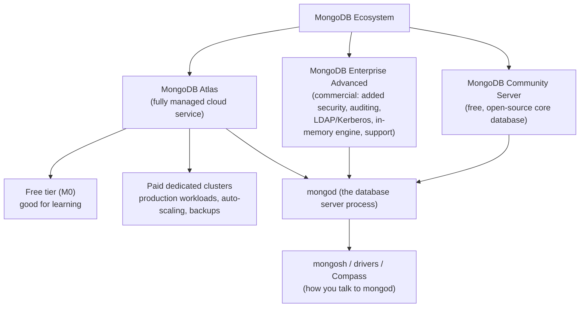

# Introduction & Prerequisites

Welcome to the first chapter of this course. Before you write a single query, you need a clear picture of what MongoDB actually *is*, why it exists, when it's the right tool, and — just as important — when it isn't. This chapter also gets your machine ready: by the end of it, you'll have MongoDB running (locally, in Docker, or in the cloud via Atlas), you'll have connected to it with `mongosh`, and you'll have inserted and queried your first documents. Everything from Chapter 2 onward assumes this foundation is in place, so take your time here even if some of it feels basic — the mental model you build in this chapter is what makes the aggregation pipeline (the real point of this course) click later instead of feeling like memorized syntax.

---

## Learning Objectives

By the end of this chapter, you will be able to:

- Explain what a document database is and how it differs from a relational (SQL) database, in plain language.
- Describe the history and motivation behind MongoDB — the problems it was built to solve — and honestly evaluate when it's *not* the right choice.
- Identify realistic production use cases where MongoDB is a strong fit.
- Distinguish between MongoDB's editions and deployment options: Community Server, Enterprise Advanced, and Atlas.
- Install MongoDB using at least one method (Docker or Atlas) and connect to it using `mongosh`.
- Run your first database, collection, insert, and query commands from the shell.
- State the difference between JSON and BSON at a level sufficient to move into Chapter 2's deep dive.

---

## Prerequisites for This Chapter

This course assumes a specific, deliberately small set of background knowledge. You do **not** need any prior database experience — that's the whole point of starting here.

You should already be comfortable with:

- **Basic programming** — you can read and write simple code involving variables, functions, loops, and arrays/objects (in *any* language: JavaScript, Python, Java, Go, whatever you use day to day).
- **JSON** — you can look at a nested JSON structure like the one below and understand what's happening: objects with key-value pairs, arrays, nesting.
- **Command line basics** — you know how to open a terminal, run a command, and install software on your operating system (or you're willing to follow copy-paste instructions to do so).

Here's the kind of JSON structure you should already find readable, because MongoDB documents look almost exactly like this:

```json
{
  "name": "Aria Fernandez",
  "age": 29,
  "email": "aria@example.com",
  "skills": ["JavaScript", "MongoDB", "Docker"],
  "address": {
    "city": "Lisbon",
    "country": "Portugal"
  }
}
```

If that reads naturally to you, you're ready. Prior SQL/relational database experience is **optional** — it's not required, but if you have it, this course (and its sibling, the [PostgreSQL course](../postgresql-course/00-index.md)) will draw frequent side-by-side comparisons to help you map what you already know onto the document model.

### Self-Assessment Checklist

Check off each item honestly before continuing:

- [ ] I can read a JSON object with nested objects and arrays and describe its structure out loud.
- [ ] I can open a terminal/shell on my computer and run a command.
- [ ] I know how to install software on my OS (via a package manager, an installer, or Docker).
- [ ] I understand basic programming concepts: variables, functions, loops, arrays, key-value structures (objects/dictionaries).
- [ ] (Optional) I have used a SQL database before, or I'm fine skipping the SQL comparisons.

If any of the *non-optional* boxes are unchecked, spend 20–30 minutes reviewing JSON syntax and basic terminal usage before continuing — the rest of this course builds directly on top of these skills.

---

## 1. What Is MongoDB? Document Databases Explained

MongoDB is a **document database** — a type of database that stores data as flexible, JSON-like documents rather than as rows in rigid, predefined tables. It belongs to a broader family of databases called **NoSQL** databases.

Let's unpack both of those terms carefully, because they're often used loosely.

### 1.1 What "document" means here

A **document** in MongoDB is a single record, represented internally in a binary format called **BSON** (Binary JSON — we'll look at this more closely in Section 9, and in full depth in Chapter 2). For now, think of a document as a JSON object that represents one "thing" — one user, one product, one order, one blog post:

```json
{
  "_id": "665f1a2b3c4d5e6f7a8b9c0d",
  "title": "Getting Started with MongoDB",
  "author": {
    "name": "Priya Shah",
    "email": "priya@example.com"
  },
  "tags": ["mongodb", "databases", "nosql"],
  "views": 1240,
  "published": true,
  "publishedAt": "2026-01-15T09:00:00Z"
}
```

Notice a few things that will matter a lot later:

- The document is **self-contained** — the author's name and email are embedded directly inside the blog post document, rather than living in a separate "authors" table that you'd have to join against.
- Fields can hold **arrays** (`tags`) and **nested objects** (`author`) directly, with no special syntax.
- Every document has a unique identifier field, `_id`, which MongoDB creates automatically if you don't supply one.

Documents are grouped into **collections** (roughly analogous to a table in a relational database), and collections live inside a **database**. We'll formalize this terminology precisely in Chapter 2 — for now, the rough mapping is: database → collection → document, similar to database → table → row in the relational world.

### 1.2 What "NoSQL" actually means

"NoSQL" is a famously imprecise term — originally it meant "non-SQL," but it's more accurately understood today as "**not only SQL**." It's an umbrella label for databases that don't use the traditional relational (table-based, fixed-schema, SQL-query) model. NoSQL isn't one technology — it's a category that includes several distinct sub-types:

- **Document databases** (MongoDB, CouchDB) — store JSON-like documents.
- **Key-value stores** (Redis, DynamoDB) — store simple key → value pairs, optimized for speed.
- **Column-family stores** (Cassandra, HBase) — store data in column groups, optimized for massive write throughput.
- **Graph databases** (Neo4j) — store nodes and relationships, optimized for traversing connections.

MongoDB specifically is a document database — that's the precise term. "NoSQL" just tells you it isn't relational; it doesn't tell you *how* it stores data. Get in the habit of saying "document database" when you mean MongoDB specifically, and reserve "NoSQL" for the broader category.

### 1.3 A brief contrast with relational databases

If you've used a relational database (MySQL, PostgreSQL, SQL Server), here's the core structural difference, at a glance:

| Aspect | Relational (e.g., PostgreSQL) | Document (MongoDB) |
|---|---|---|
| Structure | Rows in tables, fixed columns defined by a schema | Documents in collections, fields can vary per document |
| Schema | Enforced upfront (DDL: `CREATE TABLE ...`) | Flexible by default; can add validation rules later |
| Relationships | Modeled via foreign keys and `JOIN`s across tables | Often modeled by **embedding** related data in one document; references + `$lookup` are also available |
| Query language | SQL | MongoDB Query Language (MQL) — a JSON-shaped API, plus `mongosh`/driver methods |
| Natural fit | Data with fixed, well-known structure and heavy cross-entity relationships | Data with evolving or naturally hierarchical/nested structure |

This is a deliberately brief comparison — it exists to orient you, not to declare a winner. Chapter 2 revisits this mapping in much more depth once you know MongoDB's terminology precisely, and if you want the relational side of this comparison taught with the same rigor, the companion [PostgreSQL course](../postgresql-course/00-index.md) covers it chapter by chapter. Many engineers end up using both — a relational database for strongly structured, transactional core data, and a document database for flexible, high-volume, or rapidly evolving data — in the same system.

---

## 2. Why MongoDB Exists: History and Motivation

### 2.1 A short history

MongoDB was created in 2007 by a company called **10gen** (later renamed MongoDB, Inc.), and the first public release shipped in **2009**. The founders — who had previously built large-scale advertising infrastructure — kept running into the same wall with relational databases: scaling them horizontally (across many machines) was hard, and rigid schemas slowed down development in fast-moving web applications where data shapes changed constantly.

They set out to build a database that:

1. Stored data in a shape close to how developers already think in code (objects, not normalized rows spread across tables).
2. Could scale out horizontally across commodity servers rather than requiring ever-bigger single machines.
3. Let schemas evolve without painful, locking `ALTER TABLE` migrations.

MongoDB has evolved substantially since 2009 — the storage engine changed (Chapter 3 covers **WiredTiger**, the current default), multi-document ACID transactions were added in 2018, and the aggregation pipeline (this course's centerpiece) grew from a simple grouping tool into a full data-processing framework. But the founding motivations are still visible in the product today, and understanding them helps you understand *why* MongoDB is designed the way it is, not just *how* to use it.

### 2.2 Problems MongoDB solves well

- **Flexible, evolving schemas.** In relational databases, adding a new field to represent a new product attribute means an `ALTER TABLE`, which can lock a large table and requires coordinated migration. In MongoDB, you can add a field to new documents immediately — older documents simply don't have it until you choose to backfill them. This matters most in early-stage products where the data model is still being discovered.
- **Developer productivity with JSON-shaped data.** Modern applications — especially JavaScript/Node.js, but really any language — already think in objects and JSON. MongoDB documents map almost one-to-one onto in-memory application objects, removing a lot of the "impedance mismatch" work of translating rows into objects and back (an entire category of tooling in the relational world — ORMs — exists largely to paper over this gap).
- **Natural fit for hierarchical/nested data.** An e-commerce order with line items, a blog post with comments, a user profile with addresses — these are naturally tree-shaped. Embedding them as one document avoids the multi-table `JOIN`s a relational schema would require to reassemble the same "thing."
- **Horizontal scalability.** MongoDB was designed from the start to **shard** — split a collection's data across many servers — so that write and storage capacity can grow by adding machines rather than only by buying a bigger single machine. Chapter 13 covers sharding in depth.
- **High write throughput for semi-structured, high-volume data.** Logs, events, sensor readings, and similar data often don't need strict relational integrity but do need to be written and queried fast, at scale.

### 2.3 Honest tradeoffs: when NOT to use MongoDB

A good engineer picks tools based on tradeoffs, not hype. Be honest with yourself about these:

- **Heavy multi-entity transactional integrity.** If your core problem is "many different entity types with lots of strict, interdependent relationships that must always stay consistent" (e.g., double-entry accounting ledgers, complex multi-table financial reconciliation), a mature relational database with decades of transactional tooling is often a better default. MongoDB *does* support multi-document ACID transactions (Chapter 11), but they're not the design center of the product the way they are in PostgreSQL.
- **Complex, ad-hoc, many-way joins as the primary access pattern.** If your workload is dominated by unpredictable, exploratory joins across many normalized tables (classic OLAP/BI workloads), SQL and a relational (or columnar analytical) engine is usually more natural. MongoDB's `$lookup` aggregation stage (Chapter 8) can join, but it's not engineered to be the primary way you read data at scale.
- **Small teams already fluent and productive in SQL with a stable, well-understood schema.** If your data model is genuinely fixed and well known upfront, some of MongoDB's flexibility advantages simply don't apply, and you'd be trading away mature SQL tooling for no real benefit.
- **Strict global uniqueness/referential-integrity constraints across collections.** Relational databases enforce foreign key constraints natively. MongoDB does not enforce cross-collection referential integrity by default — your application (or schema validation rules, Chapter 5) has to take on that responsibility.

The right answer for many real systems is **"both"** — a relational database for the strongly structured transactional core, and MongoDB for the flexible, high-volume, or rapidly evolving parts. This course will keep returning to this "right tool for the job" framing rather than pretending MongoDB is universally superior.

---

## 3. Real-World Use Cases

MongoDB shows up across a wide range of production systems. Some of the most common patterns:

- **Content management systems (CMS).** Articles, pages, and media assets naturally vary in structure (a photo gallery page has different fields than a text article) — a flexible schema fits without needing dozens of nullable columns or a table-per-content-type design.
- **Product catalogs (e-commerce).** A catalog of electronics, clothing, and groceries has wildly different attributes per category (screen size vs. shoe size vs. expiration date). Documents let each product carry exactly the attributes relevant to it.
- **Real-time analytics and dashboards.** The aggregation pipeline (Chapters 7–10) is purpose-built for computing rollups, groupings, and time-windowed metrics directly inside the database, which is a major reason MongoDB is popular for operational dashboards.
- **IoT and sensor data.** High-volume, semi-structured event streams (device readings, telemetry) benefit from MongoDB's write throughput and flexible schema as device types and firmware versions evolve.
- **Mobile and web application backends.** MongoDB's document model maps cleanly onto the JSON payloads mobile and web apps already send and receive over REST/GraphQL APIs.
- **Single-view / data-aggregation applications.** Pulling together data from multiple source systems (CRM, support tickets, billing) into one unified "single view of the customer" document is a classic MongoDB pattern, often built using the aggregation pipeline's `$merge` stage (Chapter 10).

---

## 4. MongoDB Editions and Ecosystem, At a Glance

MongoDB (the company) offers the database in a few different forms. Understanding the landscape now saves confusion later when you see these names in documentation.



- **MongoDB Community Server** — the free, open-source edition. This is what you'll install locally or run via Docker in this course. It includes the full core database engine, the aggregation pipeline, replication, and sharding.
- **MongoDB Enterprise Advanced** — a commercial, self-managed offering layered on top of Community Server, adding enterprise features like advanced auditing, LDAP/Kerberos authentication, an in-memory storage engine, and vendor support contracts. You'd typically encounter this in large organizations with strict compliance or support requirements.
- **MongoDB Atlas** — MongoDB's own **fully managed cloud database service**. You don't install or patch anything; you click (or script) a cluster into existence, and Atlas handles provisioning, backups, patching, and scaling. Atlas has a genuinely useful **free tier (M0)**, which is why this course recommends it for hands-on learning — no local install required, and it's how most new MongoDB usage in industry actually happens today.

For this course, you can use **either** a local/Docker install **or** Atlas's free tier — both are covered below, and everything you learn transfers directly between them, since you're always talking to the same underlying database engine through the same `mongosh` shell and query language.

---

## 5. Installation Options

You have three realistic ways to get a MongoDB server running for this course. Pick whichever fits your setup — Docker or Atlas are the fastest paths and are what this course's exercises assume by default.

### 5.1 Option A: Local install

MongoDB Community Server can be installed natively on Windows, macOS, and Linux via official packages.

- **macOS** (via Homebrew):
  ```bash
  brew tap mongodb/brew
  brew install mongodb-community@7.0
  brew services start mongodb-community@7.0
  ```
- **Ubuntu/Debian**: follow the official apt-repository instructions at the MongoDB documentation (link in Further Reading) — the exact steps vary slightly by MongoDB version and Ubuntu release, so the official page is the source of truth rather than a command copied here that might go stale.
- **Windows**: download the MSI installer from the official downloads page and run it, optionally installing MongoDB Compass alongside it.

A local install is a fine option if you want MongoDB always available offline, but it means you're responsible for managing the service, upgrades, and data directory yourself.

### 5.2 Option B: Docker (recommended for this course)

If you already have Docker installed, this is the fastest, cleanest way to get a disposable, reproducible MongoDB instance — no system-level install, easy to remove, and easy to pin to an exact version.

```bash
# Pull and run MongoDB Community Server in a container,
# exposing the default MongoDB port (27017) to your host machine
docker run -d -p 27017:27017 --name mongo mongo:latest
```

A few notes on this command:

- `-d` runs the container in the background (detached).
- `-p 27017:27017` maps the container's MongoDB port to the same port on your host machine — `27017` is MongoDB's default port, worth memorizing.
- `--name mongo` gives the container a friendly name so you can refer to it later (`docker stop mongo`, `docker logs mongo`, etc.).
- `mongo:latest` pulls the latest official MongoDB image. For real projects, **pin an exact version** instead (e.g., `mongo:7.0.14`) — see Best Practices below for why.

Verify it's running:

```bash
docker ps
```

You should see a `mongo` container with port `27017` mapped. If you want your data to persist across container restarts/removal, mount a volume:

```bash
docker run -d -p 27017:27017 --name mongo -v mongodb_data:/data/db mongo:latest
```

### 5.3 Option C: MongoDB Atlas (free tier)

Atlas requires no local installation at all and is the option most beginners find least error-prone. Steps to get a free cluster running:

1. Go to `https://www.mongodb.com/cloud/atlas/register` and create a free account (email or Google/GitHub sign-in).
2. When prompted to create a deployment, choose the **M0 (Free)** tier — no credit card is required for M0.
3. Pick a cloud provider and region (any nearby region is fine for learning purposes).
4. Wait 1–3 minutes for the cluster to provision.
5. Under **Database Access**, create a database user with a username and password (you'll need these to connect).
6. Under **Network Access**, add an IP access entry — for learning purposes, "Allow Access from Anywhere" (`0.0.0.0/0`) is fine; for anything beyond learning, scope this down.
7. Click **Connect** on your cluster, choose **Drivers** (or **Shell**), and copy the provided `mongosh` connection string — it looks like:
   ```
   mongodb+srv://<username>:<password>@cluster0.abcde.mongodb.net/
   ```

Keep that connection string handy — you'll use it in the next section.

---

## 6. Installing and Connecting with `mongosh`

`mongosh` (the "MongoDB Shell") is the modern, officially supported command-line interface for talking to a MongoDB server. It's a JavaScript-based REPL (read-eval-print loop): you type commands, and it evaluates them against your database and prints the result — similar in spirit to opening your browser's developer console, but for MongoDB.

> **Note:** `mongosh` replaces the legacy `mongo` shell, which was deprecated and removed from current MongoDB distributions. If you see tutorials online using a bare `mongo` command, mentally translate it to `mongosh` — the syntax you'll type inside the shell is almost identical.

### 6.1 Installing mongosh

- If you installed MongoDB via **Homebrew** on macOS or via the **apt/yum** package repositories on Linux, `mongosh` is typically installed as part of the same setup, or via a very similar package (`mongodb-mongosh`).
- Standalone installers for `mongosh` are also available directly from the official downloads page for Windows, macOS, and Linux.
- If you're using **Docker** for the server itself, you don't need to install `mongosh` inside the container — install it natively on your host machine so you get a normal terminal experience, and point it at `localhost:27017`.

Verify your installation:

```bash
mongosh --version
```

### 6.2 Connecting

**If you're running MongoDB locally or via Docker** (default port, no auth configured yet):

```bash
mongosh "mongodb://localhost:27017"
```

**If you're connecting to Atlas**, use the connection string you copied in Section 5.3:

```bash
mongosh "mongodb+srv://<username>:<password>@cluster0.abcde.mongodb.net/"
```

On success, you'll land in a prompt that looks like:

```
Current Mongosh Log ID: ...
Connecting to: mongodb://localhost:27017/...
Using MongoDB: 7.0.x
Using Mongosh: 2.x.x

test>
```

That `test>` prompt is `mongosh` telling you which database you're currently "in" — `test` is the default. You're now ready to run commands.

### 6.3 MongoDB Compass (GUI)

**MongoDB Compass** is the official graphical client for MongoDB — think of it as a visual companion to `mongosh`. It lets you browse databases and collections, view and edit documents in a table or JSON view, build queries and aggregation pipelines with a visual pipeline builder, and inspect indexes and performance — all without typing shell commands.

Compass is optional for this course (everything will be shown in `mongosh` syntax, since that's what translates directly into scripts and application code), but it's genuinely useful for visually exploring data as you learn, especially once you get into the aggregation pipeline in Chapter 7 — its pipeline builder lets you see the output of each stage as you add it, which is a great learning aid. Download it from the same downloads page as the server; it connects using the same connection string you used for `mongosh`.

---

## 7. Your First Commands

With `mongosh` connected, let's run a tiny end-to-end example: list existing databases, create a new one, insert a document, and read it back.

```javascript
// List all databases on this server
show dbs

// Switch to (and implicitly create) a database called "mydb"
// Note: MongoDB doesn't actually create the database until you
// write data to it — an empty database won't show up in "show dbs" yet.
use mydb

// Insert a single document into a collection called "people"
// (the collection is also created automatically on first insert)
db.people.insertOne({
  name: "Aria Fernandez",
  age: 29,
  skills: ["JavaScript", "MongoDB", "Docker"]
})

// Query the collection back
db.people.find()
```

Walking through what just happened:

1. `show dbs` lists the databases currently on the server (initially, just MongoDB's internal system databases like `admin`, `config`, and `local`).
2. `use mydb` switches your session's context to a database named `mydb`. If `mydb` doesn't exist yet, MongoDB doesn't create it immediately — it waits until you actually write data.
3. `db.people.insertOne({...})` inserts one document into the `people` collection inside `mydb`, creating both the database and the collection at that moment. `db` refers to "the currently selected database," and `people` is the collection name — you can use almost any name here.
4. `db.people.find()` returns every document currently in the `people` collection, as a cursor that `mongosh` automatically prints.

You should see output resembling:

```javascript
[
  {
    _id: ObjectId("665f1a2b3c4d5e6f7a8b9c0d"),
    name: 'Aria Fernandez',
    age: 29,
    skills: [ 'JavaScript', 'MongoDB', 'Docker' ]
  }
]
```

Notice the `_id` field — you didn't specify it, but MongoDB generated one automatically (an `ObjectId`, a special BSON type covered in Chapter 2). Every document in MongoDB has an `_id` that uniquely identifies it within its collection.

Now confirm `mydb` shows up in the database list:

```javascript
show dbs
```

You should now see `mydb` in the list, since it actually contains data.

---

## 8. Databases, Collections, and Documents — the Shape of Things

Before moving to BSON, it's worth naming the three-level structure you just used, even though Chapter 2 formalizes it in full:

- A **server** (`mongod` process) can host multiple **databases**.
- A **database** contains multiple **collections**.
- A **collection** contains multiple **documents**.

This mirrors — loosely — server → database → table → row in the relational world, with "collection" standing in for "table" and "document" standing in for "row." The mapping isn't perfect (a collection's documents don't need identical fields, unlike a table's rows), which is exactly why Chapter 2 spends real time getting the terminology and the differences precise rather than treating it as a one-to-one translation.

---

## 9. A First Look at BSON vs. JSON

You've been writing and reading JSON-looking documents all chapter — but MongoDB doesn't actually store JSON on disk. It stores **BSON** (Binary JSON), a binary-encoded superset of JSON's data model. This section is intentionally brief: BSON gets a full chapter's worth of attention in Chapter 2, so the goal here is just to plant the idea.

Why does this distinction matter at all?

- **JSON** is a *text* format with a small set of types: strings, numbers, booleans, `null`, arrays, and objects. Text JSON has no native way to represent, say, "this number is specifically a 64-bit integer" vs. "this is a floating point number," or to represent dates and binary data without resorting to string encoding conventions.
- **BSON** is a *binary* format that extends JSON's type system with precise types MongoDB needs internally — including `ObjectId` (the auto-generated identifier you just saw), `Date`, distinct integer and floating-point types, `Decimal128` (for exact decimal arithmetic, e.g., money), and binary data.
- BSON is also designed to be **fast to parse and traverse** (it encodes field lengths so the database can skip over fields it doesn't need to look at, rather than having to scan character by character the way text JSON parsing does) and reasonably **compact**.

When you type a document into `mongosh` using JSON-like syntax, `mongosh` converts it to BSON before sending it to the server, and converts BSON back into a readable, JSON-like form when displaying results to you. This is why what you type and what you see looks like JSON, even though BSON is what's actually stored and transmitted. Chapter 2 covers every BSON type in detail, along with exactly how `_id`/`ObjectId` work internally.

---

## Real-World Scenario

**Setup:** You're the first backend engineer at an early-stage startup building a social recipe-sharing app. The product team is iterating fast — this week recipes need tags and a difficulty rating; next week they want to add "dietary restrictions" (an array that varies wildly per recipe: vegan, gluten-free, nut-free, and combinations no one has thought of yet), and the week after, a completely different feature might need "estimated cook time ranges" that don't apply to older recipes at all.

**Weighing the options:**

- A relational schema would need a `recipes` table with fixed columns, plus likely a separate `recipe_tags` and `recipe_dietary_restrictions` junction table to handle the variable-length, evolving lists — each new attribute type is a migration, and some migrations (adding a new junction table, backfilling nullable columns) require careful coordination on a live production database.
- A document model lets each recipe be stored as one self-contained document. Adding `dietaryRestrictions: ["vegan", "gluten-free"]` to new documents is just... writing documents with that field. Older recipes without the field aren't broken — queries for `dietaryRestrictions` on those simply won't match, which the application can handle explicitly. No `ALTER TABLE`, no downtime-sensitive migration.
- The team also plans to build a "trending recipes this week" dashboard early on — exactly the kind of grouping/rollup problem the aggregation pipeline is built for (a major reason this course dedicates four chapters to it).

**Decision:** For this specific stage of the product — fast-changing schema, JSON-shaped API payloads from a React Native mobile app, a small team optimizing for iteration speed over rigid data integrity — MongoDB is a strong fit, and the team chooses it (running on Atlas, so no one has to manage database infrastructure while the team is small). They note, honestly, that if the app later adds a financial/payments ledger for creator payouts, that specific piece might be better served by a relational database with strong transactional guarantees — a decision they defer until it's actually needed, rather than guessing upfront. This is the same "right tool for the job, not a permanent ideological choice" theme from Section 2.3.

---

## Best Practices

- **Learn on Atlas's free tier or Docker, not a fragile local install.** Both give you a clean, disposable, easy-to-reset environment, which matters a lot while you're still experimenting and might want to blow away your data and start over.
- **Pin an exact MongoDB version** in real projects (`mongo:7.0.14`, not `mongo:latest`) so that "it works on my machine" doesn't quietly break when a new major version ships with behavior changes.
- **Install `mongosh` natively on your host machine**, even if the server itself runs in Docker or Atlas — it gives you tab completion, command history, and a normal terminal experience.
- **Get comfortable with both `mongosh` and Compass early.** The shell is what you'll script and automate with; Compass is invaluable for visually exploring unfamiliar data and, later, for the aggregation pipeline builder.
- **Read connection strings carefully**, especially with Atlas — a wrong username, password, or missing IP allowlist entry is the single most common "why can't I connect" problem beginners hit.
- **Don't skip the terminology in Chapter 2** just because documents "look like JSON you already know." The precise vocabulary (document, collection, `_id`, BSON types) is what the rest of this course is built on.

---

## Common Mistakes

- **Assuming MongoDB has "no schema at all."** MongoDB has a **flexible** schema, not the absence of one — documents in a collection typically share a similar (if not identical) shape by convention and application logic, and MongoDB even supports optional schema *validation* rules (Chapter 5) to enforce structure when you want it. "Schemaless" is a common but misleading buzzword.
- **Treating `show dbs` confusion as a bug.** Beginners often run `use mydb` and then `show dbs`, expecting to see `mydb` immediately, and conclude something is broken. In reality, MongoDB defers creating the database until the first write — this is expected behavior, not an error.
- **Using `mongo:latest` (or no pinned version) in anything beyond a five-minute experiment.** It's fine for this chapter's quick test; it's a reliability risk in any project you intend to keep around, because the image can change out from under you.
- **Choosing MongoDB (or any NoSQL database) purely because it's popular or "web-scale," without checking the tradeoffs in Section 2.3.** The right choice depends on your actual access patterns and consistency needs, not trends — this course will keep returning to this point.
- **Forgetting that MongoDB doesn't enforce cross-collection referential integrity by default.** If you delete a document that other documents reference by ID, MongoDB will not stop you or cascade the deletion automatically — that responsibility sits with your application (or with schema design choices covered in Chapter 5), unlike a relational database's foreign key constraints.
- **Skipping straight to the aggregation pipeline chapters without building CRUD fluency first.** The pipeline builds directly on query syntax and document-shape intuition from Chapters 2–6 — rushing ahead usually means re-learning fundamentals mid-pipeline anyway.

---

## Summary

- MongoDB is a **document database**: it stores data as flexible, JSON-like documents (technically encoded as **BSON**) grouped into collections, rather than rows in fixed-schema tables.
- "NoSQL" is an umbrella term for non-relational databases; document databases are one specific category within it.
- MongoDB was created in **2009 by 10gen** to solve real problems: rigid schemas slowing down fast-moving development, an awkward mismatch between application objects and relational rows, and the need to scale out horizontally.
- MongoDB has real, honest tradeoffs — it's a poor fit for workloads dominated by complex multi-table joins or strict cross-entity transactional integrity, where a relational database usually remains the better default.
- Common real-world use cases include content management, product catalogs, real-time analytics, IoT, and mobile/web backends.
- The ecosystem includes **Community Server** (free, open-source), **Enterprise Advanced** (commercial, self-managed), and **Atlas** (fully managed cloud, with a usable free tier).
- You can install MongoDB locally, via **Docker** (`docker run -d -p 27017:27017 --name mongo mongo:latest`), or by signing up for **Atlas's free M0 tier**.
- **`mongosh`** is the modern shell for connecting to and interacting with MongoDB; **Compass** is the official GUI.
- You ran your first commands: `show dbs`, `use mydb`, `db.people.insertOne(...)`, and `db.people.find()`.
- **BSON** is the binary format MongoDB actually stores and transmits data in — a superset of JSON's type system with extra types like `ObjectId`, `Date`, and `Decimal128`. Chapter 2 covers it in full.

---

## Knowledge Check

1. In your own words, explain the difference between a "document database" and "NoSQL" as terms — why is one more specific than the other?
2. Name two problems that motivated the original creation of MongoDB, and explain how the document model addresses each.
3. Describe a realistic scenario where a relational database would be a better choice than MongoDB, and justify why.
4. What is the difference between MongoDB Community Server, Enterprise Advanced, and Atlas?
5. Why does `show dbs` not immediately show a newly created database after running `use mydb`, before any data has been inserted?

---

## Hands-On Exercise

Complete the following steps end to end. Use either Docker or Atlas — pick whichever you set up in Section 5.

1. **Get a MongoDB server running.**
   - Docker: `docker run -d -p 27017:27017 --name mongo mongo:latest`, then confirm it's running with `docker ps`.
   - Atlas: complete the free-tier signup steps in Section 5.3 and confirm your cluster shows a green "active" status in the Atlas UI.
2. **Connect with `mongosh`.**
   - Docker/local: `mongosh "mongodb://localhost:27017"`
   - Atlas: `mongosh "<your Atlas connection string>"`
   - Confirm you land at a `test>` prompt (or similar) with no connection errors.
3. **Create a database and collection.** Run `use bookstore`, then insert your first document to actually create it:
   ```javascript
   db.books.insertOne({
     title: "The Pragmatic Programmer",
     author: "Andrew Hunt",
     year: 1999,
     tags: ["software", "career"]
   })
   ```
4. **Insert several more documents** in one call using `insertMany`:
   ```javascript
   db.books.insertMany([
     { title: "Clean Code", author: "Robert C. Martin", year: 2008, tags: ["software", "quality"] },
     { title: "Designing Data-Intensive Applications", author: "Martin Kleppmann", year: 2017, tags: ["databases", "systems"] }
   ])
   ```
5. **Query them back.** Run `db.books.find()` and confirm you see all three books, each with an auto-generated `_id`.
6. **Run `show dbs`** and confirm `bookstore` now appears in the list, with a non-zero size.
7. **Bonus:** If you installed Compass, connect it to the same server/cluster and browse the `bookstore.books` collection visually — compare what you see to the `mongosh` output.

---

## Further Reading

- [MongoDB Manual — Introduction](https://www.mongodb.com/docs/manual/introduction/) — the official conceptual overview of MongoDB.
- [MongoDB Manual — Install MongoDB Community Edition](https://www.mongodb.com/docs/manual/administration/install-community/) — up-to-date, OS-specific installation instructions.
- [MongoDB Manual — `mongosh` documentation](https://www.mongodb.com/docs/mongodb-shell/) — full reference for the modern shell.
- [MongoDB Atlas — Getting Started](https://www.mongodb.com/docs/atlas/getting-started/) — official walkthrough of the free-tier signup and first cluster.
- [MongoDB University](https://learn.mongodb.com/) — free, official interactive courses; the "MongoDB Basics" learning path pairs well with this chapter.

---

<div style="display:flex;justify-content:space-between;align-items:center;">
  <a href="./00-index.md">← Previous: Index</a>
  <a href="./00-index.md">🏠 Index</a>
  <a href="./02-core-concepts.md">Next: Core Concepts →</a>
</div>
