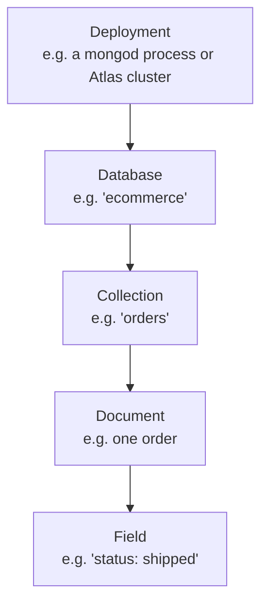
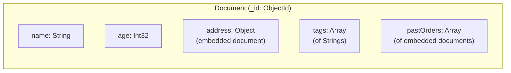

# Core Concepts

Chapter 1 got MongoDB installed — locally, in Docker, or on Atlas — and had you run your first `mongosh` session: connecting, inserting a document or two, and running a basic `find()`. That was enough to prove the engine works. It was not enough to actually *think* in MongoDB. This chapter is where you build the vocabulary and mental model that every later chapter assumes you already have: what a document really is, what BSON is and why it exists, how `_id` works, how the RDBMS concepts you may already know map onto MongoDB's world, and the basic verbs and building blocks (CRUD, cursors, drivers) that give you the words for what comes next.

Nothing here requires new tooling beyond what Chapter 1 already set up. Treat this chapter as the map you draw before hiking the terrain — skimming it will not stop you from running commands in Chapter 4, but it will make many of those commands feel like unexplained magic instead of applications of ideas you already understand.

---

## Learning Objectives

By the end of this chapter, you will be able to:

- Explain what a document is, describe its structure (fields, nesting, arrays), and explain what "dynamic schema" actually means in practice — and what it does *not* mean.
- Explain what `_id` is, how `ObjectId` is structured conceptually, and when and why you'd supply your own custom `_id`.
- Define BSON, explain why MongoDB stores data as BSON instead of plain JSON, and list its major data types from memory.
- Translate RDBMS terms (database, table, row, column, index, join, primary key) into their MongoDB equivalents, and know where the mapping is imperfect.
- Read and write an embedded document and an array of embedded documents, and explain why embedding is a first-class modeling tool in MongoDB.
- Use the terms insert, query, update, delete, cursor, and driver correctly and confidently in later chapters.

---

## Prerequisites for This Chapter

This chapter builds directly on [Chapter 1: Introduction & Prerequisites](./01-introduction-and-prerequisites.md). We assume you already:

- Have `mongosh` installed and can connect to a running MongoDB instance (local, Docker, or Atlas).
- Have run at least one `insertOne()` and one `find()` in `mongosh`, even if you didn't fully understand every part of what happened.
- Are comfortable with JSON syntax — objects, arrays, nesting, key/value pairs — since MongoDB's documents look like JSON on the surface (Section 1 explains how they differ underneath).
- Know basic programming concepts: variables, arrays/lists, and key-value structures (dictionaries/objects), from the course's general prerequisites.

If any of that feels shaky, revisit Chapter 1 before continuing — this chapter assumes it as settled ground.

---

## 1. The Document Model, In Depth

### 1.1 What a document actually is

A **document** is the basic unit of data in MongoDB — the equivalent of a "record." Structurally, a document is an ordered set of key/value pairs, written using a JSON-like syntax:

```js
{
  _id: ObjectId("64f1a2b3c4d5e6f7a8b9c0d1"),
  name: "Priya Sharma",
  age: 29,
  active: true,
  signupDate: ISODate("2025-03-14T00:00:00Z")
}
```

Each key is called a **field**. Each field has a **value**, and that value can be any of MongoDB's supported types (Section 3) — including, critically, another document or an array. This is what makes the model "document-oriented" rather than "row-oriented": a single document can represent an entire object graph, not just a flat list of scalar attributes.

Documents live inside **collections** (Section 4), which are the rough equivalent of tables — but with one crucial difference explained next.

### 1.2 Fields, nesting, and arrays

A field's value is not limited to strings and numbers. It can be:

- A **scalar** — string, number, boolean, date, null, etc.
- An **embedded document** (also called a sub-document) — a value that is itself a full `{ }` object with its own fields.
- An **array** — an ordered list of values, which can themselves be scalars, documents, or even other arrays.

```js
{
  _id: ObjectId("64f1a2b3c4d5e6f7a8b9c0d2"),
  name: "Priya Sharma",
  address: {
    street: "221B Residency Road",
    city: "Bengaluru",
    zip: "560025"
  },
  tags: ["premium", "newsletter-subscriber"],
  pastOrders: [
    { orderId: "A1001", total: 1499.00 },
    { orderId: "A1002", total: 899.50 }
  ]
}
```

Here, `address` is an embedded document, `tags` is an array of strings, and `pastOrders` is an array of embedded documents. All of this lives inside **one single document** — no joins required to read it back. This nesting capability is the single biggest structural difference from a relational row, and it's the reason schema design in MongoDB (Chapter 5) is as much about "what do I nest vs. what do I split into another collection" as it is about field names and types.

### 1.3 Dynamic schema: what it really means

MongoDB is often described as "schemaless." That word is misleading enough that this course avoids it — the more accurate term is **dynamic schema** (or "flexible schema"), and the distinction matters in practice.

Concretely: **documents in the same collection are not required to have the same set of fields, the same field types, or the same structure.** MongoDB does not enforce a fixed table definition at the database engine level the way a relational database enforces a `CREATE TABLE` schema. This is legal, in a single `users` collection:

```js
// Document A
{ _id: 1, name: "Priya", age: 29 }

// Document B — no "age" field at all, has an extra "plan" field
{ _id: 2, name: "Alex", plan: "pro" }

// Document C — "age" is a string here, not a number
{ _id: 3, name: "Sam", age: "thirty" }
```

MongoDB will happily store all three. But "the database won't stop you" is very different from "you shouldn't plan a shape." In virtually every real application, documents in a given collection *do* share a common, intentional structure, because your application code reads specific fields and expects specific types. The flexibility is a tool for controlled evolution — adding an optional field to new documents without a migration, letting different document "kinds" coexist in one collection when that's a deliberate modeling choice — not a license to skip design. Chapter 5 covers **schema validation** (`$jsonSchema` rules you can attach to a collection) for exactly this reason: teams almost always want *some* enforced structure once an application matures, and MongoDB lets you opt into that enforcement rather than forcing it from day one.

The practical takeaway: dynamic schema shifts *when* and *where* structure is enforced (mostly in application code and, optionally, validation rules) rather than eliminating structure altogether.

---

## 2. `_id` and `ObjectId`

### 2.1 Why every document needs an `_id`

Every document in a MongoDB collection **must** have a field named `_id` that is unique within that collection — it is the document's primary key. If you insert a document without one, MongoDB automatically generates and inserts an `_id` of type `ObjectId` for you before the write completes.

```js
db.users.insertOne({ name: "Priya", age: 29 })
// Resulting stored document:
// { _id: ObjectId("64f1a2b3c4d5e6f7a8b9c0d1"), name: "Priya", age: 29 }
```

`_id` is automatically indexed (Chapter 6 covers indexes in depth), which is what makes lookups by `_id` fast even on large collections, and is what MongoDB uses internally to guarantee uniqueness within the collection.

### 2.2 The structure of an `ObjectId`

`ObjectId` is a 12-byte identifier, conventionally displayed as a 24-character hexadecimal string. Conceptually, it's built from these components, generated so that IDs created independently — even on different machines, with no coordination — are overwhelmingly likely to be unique:

| Bytes | Component | Purpose |
|---|---|---|
| 4 bytes | Timestamp | Seconds since the Unix epoch, when the `ObjectId` was created |
| 5 bytes | Random value | A per-process value, randomly generated once, shared by all ObjectIds that process creates |
| 3 bytes | Incrementing counter | Starts at a random value, increments for each `ObjectId` generated by that process, avoiding collisions within the same second |

A useful, often-overlooked consequence: because the first 4 bytes are a timestamp, **ObjectIds are roughly sortable by creation time**, and you can extract that creation time from any `ObjectId` without storing a separate `createdAt` field:

```js
let id = ObjectId("64f1a2b3c4d5e6f7a8b9c0d1")
id.getTimestamp()
// ISODate("2023-08-31T20:15:15.000Z")
```

Don't over-rely on this for precision, though — the timestamp component only has second-level granularity, and multiple documents inserted in the same second will not sort perfectly by insertion order using `_id` alone.

### 2.3 Custom `_id` values

`_id` doesn't have to be an `ObjectId`. It can be any BSON type, as long as it's unique within the collection — a string, a number, even a compound (embedded document) value:

```js
db.products.insertOne({ _id: "SKU-10245", name: "Wireless Mouse", price: 799 })

db.events.insertOne({
  _id: { deviceId: "sensor-07", ts: ISODate("2026-07-01T08:00:00Z") },
  reading: 21.4
})
```

Supplying your own `_id` is common when a natural, already-unique business key exists (a SKU, an email address, an external system's ID) and you want to use it directly as the primary key rather than carrying both that key and a separate `ObjectId` around. The tradeoff: you become responsible for guaranteeing uniqueness and choosing a value with sensible size and indexing characteristics — MongoDB will reject a second insert with a duplicate `_id`, but it won't stop you from picking a poor key design.

---

## 3. BSON, In Depth

### 3.1 What BSON is

**BSON** stands for **Binary JSON**. It's the binary-encoded serialization format MongoDB actually uses to store documents on disk and send them over the wire — `mongosh` and every driver show you a JSON-*like* text representation for readability, but underneath, every document is BSON.

### 3.2 Why not just use plain JSON?

JSON is a great human-readable interchange format, but it's a poor fit as a database's native storage format, for three concrete reasons:

1. **JSON has a very limited type system.** JSON only really has strings, numbers, booleans, null, objects, and arrays. It has no native date type (dates are just strings or numbers by convention), no distinction between integer and floating-point, no binary data type, and no way to represent something like a 128-bit high-precision decimal. BSON adds a rich set of concrete types (Section 3.3) so the database itself understands and can index a value as "this is a real date" or "this is a 32-bit integer," not "this is a string that looks like a date."
2. **BSON is designed for fast traversal, not just fast parsing.** BSON documents are prefixed with length fields — every document and every string is preceded by its byte length. This lets MongoDB's engine skip over fields it doesn't need and jump to specific parts of a document without scanning character-by-character the way a JSON text parser must.
3. **BSON encodes more efficiently for machine consumption.** Numbers are stored as their native binary representation rather than as decimal-digit text, which is both more compact for numeric-heavy data and avoids repeated text-to-number parsing on every read.

The tradeoff is that BSON is somewhat less space-efficient than JSON for things like short field names repeated across many documents (a cost schema design patterns in Chapter 5 sometimes account for), and it isn't human-readable in its raw form — but the type richness and traversal speed are worth it for a database engine.

### 3.3 Key BSON types

| BSON Type | Example | Notes |
|---|---|---|
| Double | `3.14` | 64-bit IEEE 754 floating point |
| String | `"hello"` | UTF-8 |
| Object | `{ city: "Pune" }` | An embedded document |
| Array | `[1, 2, 3]` | Ordered list, mixed types allowed |
| Binary data | `BinData(0, "...")` | Raw binary — images, hashes, encrypted blobs |
| ObjectId | `ObjectId("64f1...")` | 12-byte unique identifier (Section 2) |
| Boolean | `true` / `false` | |
| Date | `ISODate("2026-07-06T00:00:00Z")` | Milliseconds since Unix epoch, stored as a real date type |
| Null | `null` | Explicit absence of a value |
| Regular Expression | `/^abc/i` | A stored regex pattern, usable in queries |
| 32-bit Integer | `NumberInt(42)` | Whole numbers that fit in 32 bits |
| Timestamp | `Timestamp(1719900000, 1)` | Internal type used by replication (Chapter 12) — not for application "createdAt" fields |
| 64-bit Integer | `NumberLong(9999999999)` | Whole numbers exceeding 32-bit range |
| Decimal128 | `NumberDecimal("19.99")` | High-precision decimal — for money/financial values where floating-point rounding is unacceptable |

You will not memorize this whole table today, but two entries deserve special attention because they cause real bugs: **Date** (Section 3.4) and **Decimal128** (use it, not `Double`, for currency amounts where cent-level rounding errors matter).

### 3.4 Practical facts that trip up beginners

- **Dates and numbers are real types, not strings.** In plain JSON, a date is just a string you have to parse yourself, and there's no way to tell "this number is an integer" from "this number happens to look like an integer." In BSON, `ISODate(...)` is a genuine date type that supports date range queries and correct sorting, and integers, longs, doubles, and decimals are genuinely distinct types the engine understands. Never store dates as strings like `"2026-07-06"` if you intend to query or sort by them as dates — use an actual `Date`.
- **16MB is the maximum size of a single BSON document.** This is a hard limit, not a soft guideline — an `insertOne()` or `updateOne()` that would produce a document over 16MB fails outright. It exists to keep a single document from monopolizing RAM and network bandwidth, and it's a real design constraint: an ever-growing array embedded in one document (e.g., "all comments ever posted on this blog post," in one array, forever) can eventually hit this ceiling. Chapter 5 covers modeling patterns (like the "Subset" and "Bucket" patterns) specifically designed around this limit.
- **Field order is preserved** within a document as stored, though you generally shouldn't design logic that depends on it.

---

## 4. Databases, Collections, and Documents — and the RDBMS Mapping

MongoDB's structural hierarchy, from broadest to narrowest, is: a **deployment** (a running `mongod`/cluster) hosts one or more **databases**, each database holds one or more **collections**, and each collection holds many **documents**, each of which contains **fields**.



If you've used a relational database (e.g., in this site's [PostgreSQL course](../postgresql-course/00-index.md)), most of these concepts have a direct — though not perfect — analog:

| RDBMS Term | MongoDB Term | Notes |
|---|---|---|
| Database | Database | Roughly equivalent — a namespace holding collections |
| Table | Collection | A collection does **not** enforce a fixed column set the way a table enforces a schema (Section 1.3) |
| Row | Document | A document can nest structure a flat row cannot |
| Column | Field | Fields can vary per document within the same collection |
| Index | Index | Conceptually the same purpose: speed up lookups. Types differ — see Chapter 6 |
| Join | `$lookup` (aggregation stage) or embedding | MongoDB favors embedding related data into one document over joining across collections; `$lookup` exists for when you do need a join-like operation (Chapter 8) |
| Primary key | `_id` | Every document has one automatically; every collection's `_id` is automatically indexed |

The mapping is a teaching aid, not a perfect equivalence — lean on it to get oriented quickly, but don't assume every relational habit transfers unchanged. The biggest mindset shift, covered in depth in Chapter 5, is that **normalization is a default in RDBMS design, while embedding related data into a single document is often the *preferred* MongoDB approach** — precisely because collections don't require uniform structure and documents can nest freely.

---

## 5. Embedded Documents and Arrays of Documents — A Worked Example

Section 1.2 introduced embedding briefly; here's a fuller, realistic example: an e-commerce order with an embedded array of line items.

```js
{
  _id: ObjectId("64f1a2b3c4d5e6f7a8b9c0e0"),
  orderNumber: "ORD-58291",
  customer: {
    name: "Priya Sharma",
    email: "priya@example.com"
  },
  status: "shipped",
  placedAt: ISODate("2026-06-30T10:15:00Z"),
  lineItems: [
    { sku: "SKU-1001", name: "Wireless Mouse", qty: 2, unitPrice: NumberDecimal("799.00") },
    { sku: "SKU-2044", name: "USB-C Cable",    qty: 1, unitPrice: NumberDecimal("249.00") }
  ],
  shippingAddress: {
    line1: "221B Residency Road",
    city: "Bengaluru",
    zip: "560025"
  }
}
```

Notice everything needed to display this order — customer info, line items, shipping address — comes back from **a single `find()`**, with no join across an `orders` table, a `line_items` table, and a `customers` table the way a relational schema would typically require. This is embedding used well: `customer`, `shippingAddress`, and `lineItems` are all data that logically *belongs to* this one order and is almost always read together with it.

You can query directly into nested structure using **dot notation**, without pulling the whole document apart in application code:

```js
// Find orders that include the SKU "SKU-1001"
db.orders.find({ "lineItems.sku": "SKU-1001" })

// Find orders shipped to Bengaluru
db.orders.find({ "shippingAddress.city": "Bengaluru" })
```

Embedding isn't always the right call — Chapter 5 spends significant time on when to embed versus when to reference (link) documents across collections instead (for example, when the embedded data is large, unbounded, or needs to be queried/updated independently at scale). For now, the important idea is simply that **embedding is available as a first-class modeling tool**, not a workaround.

---

## 6. CRUD Verbs — A Conceptual Preview

Every database operation you'll ever run falls into one of four categories, together known as **CRUD**. Chapter 4 covers each in full technical depth (operators, options, bulk variants); this section just anchors the vocabulary so nothing in later chapters is a new word:

- **Create (Insert)** — adding new documents to a collection: `insertOne()`, `insertMany()`.
- **Read (Query)** — retrieving documents that match some criteria: `find()`, `findOne()`.
- **Update** — modifying fields in existing documents: `updateOne()`, `updateMany()`, `replaceOne()`.
- **Delete** — removing documents: `deleteOne()`, `deleteMany()`.

You already used the "C" and "R" in Chapter 1 without necessarily naming them as such. Everything about *how* to filter, project, and modify documents precisely is deferred to Chapter 4 — for now, just recognize these four verbs as the complete vocabulary of data manipulation in MongoDB.

---

## 7. Cursors — A Conceptual Preview

When you run `db.orders.find({ status: "shipped" })`, MongoDB does **not** immediately hand your application every matching document all at once. Instead, it returns a **cursor** — a pointer to the result set on the server, from which your client (whether that's `mongosh` or a driver in your application) pulls results incrementally, typically in batches.

Think of a cursor the way you'd think of a paginated results page rather than a single giant download: it lets MongoDB avoid loading potentially millions of matching documents into memory at once, and lets your application start processing the first results before the rest have even been computed or transferred. In `mongosh`, this is why typing `db.orders.find()` on a large collection prints an initial batch and then offers `it` to fetch more — you're watching a cursor being consumed interactively.

Chapter 4 covers cursor methods in depth — `.sort()`, `.limit()`, `.skip()`, iterating a cursor in a driver with a `for` loop or `.forEach()` — but the concept to hold onto now is simple: **a cursor is a handle to a result set, not the result set itself.**

---

## 8. Drivers — A Conceptual Preview

A **MongoDB driver** is a client library, written for a specific programming language, that lets your application code talk to a MongoDB server — translating method calls in that language (Python, Java, Go, C#, Node.js, and others) into the wire protocol MongoDB actually speaks, and translating BSON responses back into that language's native data structures.

Here's a detail worth knowing early, because it explains why `mongosh` syntax and, say, Node.js application code look so similar: **`mongosh` itself is built on top of the official Node.js driver.** The `db.collection.find({...})` syntax you're practicing right now in the shell is not a shell-only convenience invented separately — it closely mirrors what you'll write in real application code using a driver, which is precisely why time spent getting fluent in `mongosh` transfers directly to writing application code later.

Every officially supported language has its own driver, and an entire ecosystem exists on top of drivers (Object-Document Mappers like Mongoose for Node.js, connection pooling behavior, driver-level retry logic). Chapter 18 (Tools, Drivers & Ecosystem) is dedicated to surveying that landscape — for now, just remember: **driver = the library your programming language uses to talk to MongoDB**, and `mongosh` is a shell built on one such driver.

---

## 9. Putting the Hierarchy Together

Here's a single sample document, annotated to show how the concepts in this chapter compose:



Every concept introduced in this chapter — documents, fields, nesting, arrays, `_id`, BSON types, collections, CRUD, cursors, drivers — is the working vocabulary for everything from here forward. Chapter 3 goes one level deeper, into how MongoDB physically stores and retrieves this data (the WiredTiger storage engine, `mongod`/`mongos` processes, and what actually happens on disk and over the network for a read or write).

---

## Real-World Scenario

**Setup:** You're modeling a simple blog platform. Each blog post can have any number of comments, and you need to decide how to represent "a post and its comments" using what this chapter just taught you.

**Applying this chapter's concepts:**

- A blog post is naturally a **document** in a `posts` collection. It has scalar fields (`title`, `body`, `publishedAt`) and, if you choose to embed, an **array of embedded documents** for comments — exactly the `lineItems`-style pattern from Section 5.

```js
{
  _id: ObjectId("64f1a2b3c4d5e6f7a8b9c0f0"),
  title: "Understanding the Document Model",
  body: "MongoDB stores data as documents...",
  author: "Akash",
  publishedAt: ISODate("2026-07-01T09:00:00Z"),
  tags: ["mongodb", "databases"],
  comments: [
    { author: "Rahul", text: "Great explanation!", postedAt: ISODate("2026-07-01T10:30:00Z") },
    { author: "Meera", text: "Finally a clear write-up on BSON.", postedAt: ISODate("2026-07-01T11:05:00Z") }
  ]
}
```

- Because comments are embedded, fetching a post **with all its comments** is one `findOne({ _id: ... })` — no join, matching Section 4's join-vs-embedding tradeoff.
- Querying "find all posts where Rahul commented" uses dot notation into the array: `db.posts.find({ "comments.author": "Rahul" })` — a direct application of Section 5.
- This design isn't automatically correct forever: Section 3.4's 16MB document limit is a real constraint here. A wildly popular post with fifty thousand comments would eventually make this document too large, and Chapter 5 covers exactly this scenario under the name "the unbounded array anti-pattern," along with the modeling patterns (like splitting comments into their own collection once a post crosses a comment-count threshold) used to avoid it.
- Notice this is a **design decision**, not something MongoDB forces on you — you could equally have chosen to store comments in a separate `comments` collection referencing `postId`. Dynamic schema (Section 1.3) means MongoDB permits either approach; picking correctly is what Chapter 5 is for.

---

## Best Practices

- **Design your document shape deliberately, even though MongoDB won't force one on you.** "Dynamic schema" is a capability for controlled evolution, not permission to skip modeling — decide your fields, types, and nesting intentionally, and consider schema validation (Chapter 5) once an application stabilizes.
- **Use real BSON types for real semantics.** Store dates as `Date`, not strings; store money as `Decimal128`, not `Double`, when exact precision matters; don't smuggle structured data into a string field just because it's convenient at insert time.
- **Default to embedding for data that's always read together and doesn't grow unbounded**, and default to referencing (separate collections) for data that's large, independently queried, or shared across many parent documents. Chapter 5 formalizes this decision.
- **Keep the 16MB document limit in mind when a field is an array that could grow without bound** — an embedded array of comments, log entries, or events is a common way to hit this ceiling in production.
- **Let `_id` be automatically generated unless you have a genuine, already-unique business key** — and if you do supply a custom `_id`, choose a compact, stable value, since it's indexed and referenced everywhere the document is looked up.
- **Learn `mongosh` fluently — it transfers directly.** Because `mongosh` is built on the Node.js driver and mirrors real driver syntax, time spent here is not shell-only trivia; it's the same mental model you'll use writing application code in Chapter 18 and beyond.

---

## Common Mistakes

- **Calling MongoDB "schemaless" and concluding structure doesn't matter.** The engine doesn't enforce a fixed shape, but your application does, implicitly, the moment it reads a specific field expecting a specific type. Treat it as "flexible schema," not "no schema."
- **Storing dates or numbers as strings.** A "date" like `"2026-07-06"` stored as a plain string cannot be correctly range-queried or sorted as a date, and a "price" stored as a string can't be summed in an aggregation without an explicit conversion. Use the real BSON types from Section 3.3.
- **Not knowing about the 16MB document size limit until an insert or update fails in production.** Unbounded embedded arrays are the most common way to hit it — plan for growth during schema design (Chapter 5), not after a write starts failing.
- **Assuming `ObjectId`'s embedded timestamp gives precise, gap-free insertion ordering.** It's only second-granularity and shares a per-process random/counter component — good enough for "roughly when," not a substitute for a dedicated, precisely ordered field when exact ordering matters.
- **Using `Double` for currency values** and being surprised by floating-point rounding errors in financial totals — use `Decimal128` (`NumberDecimal(...)`) instead.
- **Confusing a cursor with "the results."** Code that assumes `find()` has already fetched everything into memory (for example, expecting `.length` to work like an array without first materializing it, e.g., via `.toArray()`) misunderstands that a cursor is a handle to be iterated, not a pre-loaded collection of documents.
- **Over-embedding "for convenience" without considering access patterns.** Embedding every possible related piece of data into one document because "then I only need one query" can produce documents that are slow to update, wastefully large to transfer when you only need a fragment, or that approach the size limit — embedding is a tool with tradeoffs, not a default to maximize.

---

## Summary

- A **document** is MongoDB's basic data unit — an ordered set of fields whose values can be scalars, embedded documents, or arrays, allowing rich nested structure inside a single record.
- **Dynamic schema** means the database engine doesn't enforce a fixed shape per collection, not that structure is unimportant — real applications still design and often validate a shape.
- Every document has a unique **`_id`** (a primary key), auto-generated as an **`ObjectId`** (timestamp + per-process random value + counter) unless you supply your own.
- **BSON** (Binary JSON) is MongoDB's actual storage/wire format: a richer type system than JSON, length-prefixed for fast traversal, and more compact/efficient for machines to read — with a hard **16MB per-document size limit**.
- The **RDBMS-to-MongoDB mapping** (database↔database, table↔collection, row↔document, column↔field, join↔`$lookup`/embedding, primary key↔`_id`) is a useful — if imperfect — bridge for anyone coming from SQL.
- **Embedding** (nesting documents/arrays inside a parent document) is a first-class MongoDB modeling tool, illustrated by an order document with embedded line items.
- **CRUD** (Create, Read, Update, Delete), **cursors** (a pointer to a result set, fetched incrementally, not the whole result set at once), and **drivers** (language-specific client libraries — `mongosh` itself runs on the Node.js driver) are the vocabulary the next several chapters build on.

---

## Knowledge Check

1. Two documents in the same `users` collection have different sets of fields, and one shares a field name (`age`) but with a different type (number vs. string) across the two documents. Is this valid in MongoDB? What does this tell you about the difference between "the engine allows it" and "your application should do it"?
2. What are the three conceptual components of an `ObjectId`, and what practical property of `ObjectId`s does the first component (the timestamp) give you?
3. Give two concrete reasons MongoDB stores data as BSON rather than plain-text JSON, referencing both type richness and performance.
4. Using the RDBMS-to-MongoDB mapping table, explain what a relational "join" typically becomes in a MongoDB schema, and name the two options.
5. What is a cursor, and why doesn't `find()` return "all the matching documents" directly into memory the moment you call it?

---

## Hands-On Exercise

Work through these in `mongosh`, connected to your Chapter 1 instance. Use a scratch database, e.g., `use coreConceptsLab`.

1. **Insert documents of varying shapes into one collection**, to see dynamic schema firsthand:

   ```js
   db.people.insertOne({ name: "Priya", age: 29 })
   db.people.insertOne({ name: "Alex", plan: "pro", signedUpAt: new Date() })
   db.people.insertOne({ name: "Sam", age: "thirty" })   // note: age is a string here
   db.people.find().pretty()
   ```

   Confirm all three documents were inserted despite having different fields and a mismatched type for `age`.

2. **Inspect the generated `_id` values:**

   ```js
   db.people.find({}, { _id: 1 })
   let doc = db.people.findOne({ name: "Priya" })
   doc._id
   doc._id.getTimestamp()
   ```

   Confirm the timestamp roughly matches when you ran the insert.

3. **Observe BSON types directly.** Insert a document with several distinct types, then inspect them:

   ```js
   db.typesDemo.insertOne({
     aString: "hello",
     aDouble: 3.14,
     anInt: NumberInt(42),
     aLong: NumberLong(9999999999),
     aDecimal: NumberDecimal("19.99"),
     aDate: new Date(),
     aBool: true,
     aNull: null,
     anArray: [1, 2, 3],
     anObject: { nested: true }
   })

   let t = db.typesDemo.findOne()
   typeof t.aString      // "string"
   typeof t.aDouble      // "number"
   t.aDate instanceof Date   // true
   Array.isArray(t.anArray)  // true
   ```

   Notice `typeof`/`instanceof` are JavaScript-level checks in `mongosh` — they confirm the driver deserialized BSON into genuinely distinct JavaScript types (a real `Date` object, not a date-like string).

4. **Insert a document with an embedded array, and query into it with dot notation:**

   ```js
   db.orders.insertOne({
     orderNumber: "ORD-1",
     customer: { name: "Priya", email: "priya@example.com" },
     lineItems: [
       { sku: "SKU-1001", qty: 2 },
       { sku: "SKU-2044", qty: 1 }
     ]
   })

   db.orders.find({ "lineItems.sku": "SKU-1001" })
   db.orders.find({ "customer.name": "Priya" })
   ```

   Confirm both dot-notation queries return the order, without you having to manually pull the document apart first.

5. **Try to break the `_id` uniqueness rule** to see MongoDB enforce it:

   ```js
   db.people.insertOne({ _id: "fixed-id-1", name: "Test A" })
   db.people.insertOne({ _id: "fixed-id-1", name: "Test B" })  // expect a duplicate key error
   ```

---

## Further Reading

- [Documents — MongoDB Manual](https://www.mongodb.com/docs/manual/core/document/)
- [BSON Types — MongoDB Manual](https://www.mongodb.com/docs/manual/reference/bson-types/)
- [ObjectId — MongoDB Manual](https://www.mongodb.com/docs/manual/reference/method/ObjectId/)
- [Databases and Collections — MongoDB Manual](https://www.mongodb.com/docs/manual/core/databases-and-collections/)
- [Data Modeling Introduction — MongoDB Manual](https://www.mongodb.com/docs/manual/core/data-modeling-introduction/)

---

<div style="display:flex;justify-content:space-between;align-items:center;">
  <a href="./01-introduction-and-prerequisites.md">← Previous: Introduction & Prerequisites</a>
  <a href="./00-index.md">🏠 Index</a>
  <a href="./03-architecture-and-internals.md">Next: Architecture & Internals →</a>
</div>
