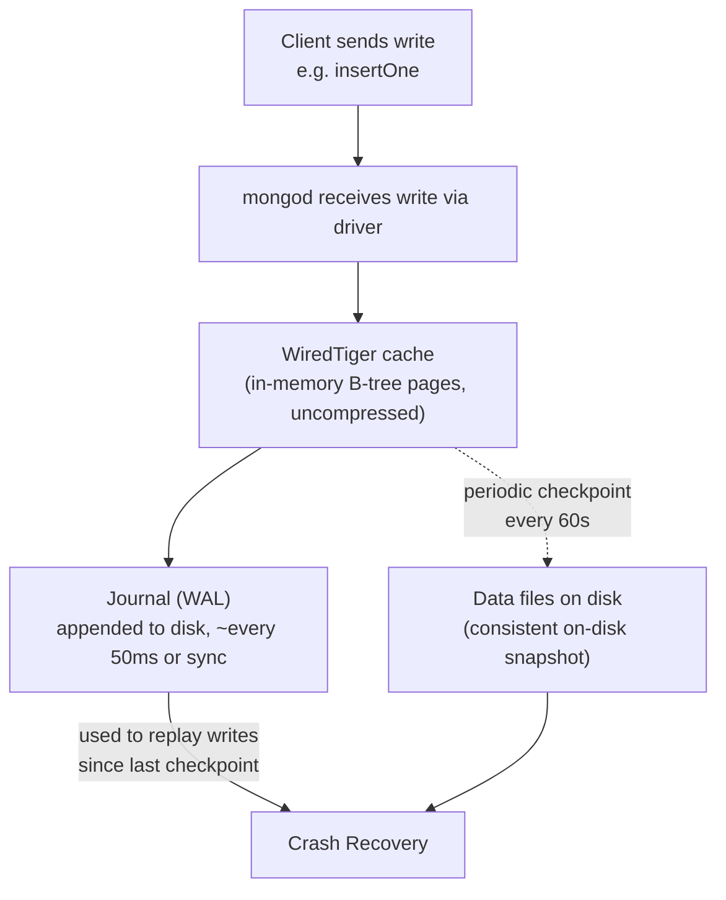
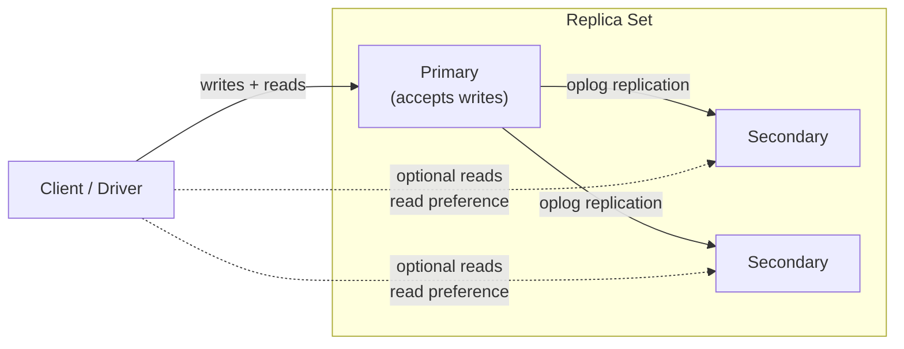
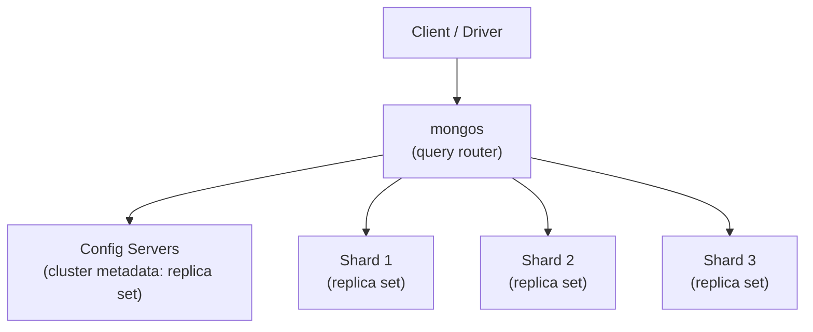

# Architecture & Internals

Chapter 2 gave you the document model: documents, collections, BSON types, and how MongoDB's schema-flexible world maps onto (and departs from) the relational tables you may already know. That chapter answered "what does MongoDB store, and in what shape?" This chapter answers a different question: "what actually happens, mechanically, when you insert a document or run a query?" We're popping the hood — looking at the `mongod` process, the WiredTiger storage engine underneath it, how writes become durable, how reads get fast, and how a single server's architecture extends into replica sets and sharded clusters. None of this changes how you write queries, but all of it explains *why* MongoDB behaves the way it does under load, after a crash, or at scale — and that understanding is what separates someone who uses MongoDB from someone who can operate it professionally.

---

## Learning Objectives

By the end of this chapter, you will be able to:

- Explain what the `mongod` process is and does, and how it relates to your data files on disk.
- Describe the WiredTiger storage engine's core design: B-tree-based storage, document-level concurrency, and compression — and why MongoDB adopted it as the default engine.
- Trace the full lifecycle of a write: cache, journal (write-ahead log), and checkpoint — and connect this to the concept of write concern.
- Trace the full lifecycle of a read: query planner, plan caching, the WiredTiger cache, and cursor batching.
- Describe, at an orienting level, how a replica set (primary/secondary, oplog) and a sharded cluster (`mongos`, config servers, shards) are structured.
- Explain how a collection and its indexes are physically organized as separate B-trees within WiredTiger.
- Diagnose common symptoms (data loss after a crash, slow-then-fast queries) by reasoning about the internals covered in this chapter.

---

## Prerequisites for This Chapter

This chapter builds directly on [Chapter 2: Core Concepts](./02-core-concepts.md). We assume you're comfortable with:

- **Documents and BSON** — a document is a BSON object; a collection is a named group of documents.
- **Collections** as the rough analog of a table, without a fixed schema enforced by the database itself.
- The general shape of client-server database systems (a server process, a client driver, a network connection) — no prior MongoDB-specific operational knowledge is assumed.

This chapter deliberately stays at the "orienting" level for replication (full depth in [Chapter 12](./12-replication-and-high-availability.md)) and sharding (full depth in [Chapter 13](./13-sharding-and-scalability.md)). Anything replication- or sharding-specific here is scoped to *just enough to place the standalone-server internals in context* — do not expect (or need) mastery of failover or shard-key design yet.

---

## 1. The `mongod` Process

`mongod` (pronounced "mongo-D," for "Mongo Daemon") is the core server process — the actual database. Every MongoDB deployment, no matter how large, is built out of `mongod` processes: a single standalone instance for local development, several `mongod` instances forming a replica set for high availability, or many `mongod` instances organized into shards for horizontal scale.

When you run `mongod`, it:

1. **Listens on a network port** (27017 by default) for connections from drivers and `mongosh`.
2. **Parses and executes commands** sent by clients — inserts, queries, updates, deletes, administrative commands, and aggregation pipelines.
3. **Manages storage** by delegating the actual work of writing and reading bytes on disk to a pluggable **storage engine** — WiredTiger, covered in Section 2.
4. **Enforces access control** (authentication and authorization) if security is enabled — covered fully in [Chapter 15](./15-security.md).
5. **Reports its own health and metrics** through commands like `db.serverStatus()`, which you'll use in this chapter's hands-on exercise.

Conceptually, where does your data live? A `mongod` instance is configured with a **data directory** (`--dbpath`, commonly `/data/db` locally or `/var/lib/mongodb` on Linux packages, or a mounted volume in Docker/Atlas). Inside that directory, the storage engine keeps:

- The actual data and index files (WiredTiger's own file format, described in Section 2).
- The **journal** directory — the write-ahead log described in Section 3.
- A few metadata and lock files.

You never need to open or parse these files directly — that's the storage engine's job — but knowing this directory exists, and that it's the single source of truth for everything in your database, matters enormously for backup, disaster recovery, and understanding *why* a corrupted or deleted data directory means a corrupted or deleted database.

> **Terminology note:** `mongod` is the database server. `mongosh` is the interactive shell client you type commands into. `mongos` (Section 6) is a *router* used only in sharded clusters — not a database itself. It's easy to conflate these three names early on; they are three distinct programs.

---

## 2. The WiredTiger Storage Engine

### 2.1 What a storage engine actually does

A **storage engine** is the layer of `mongod` responsible for how data is physically stored on disk and in memory, how concurrent operations are isolated from each other, and how durability is guaranteed. MongoDB's query language, aggregation pipeline, and replication logic all sit *above* the storage engine and are (mostly) engine-agnostic — the storage engine is swappable machinery underneath.

Since MongoDB 3.2, **WiredTiger** has been the default (and, since 4.2, the only fully-supported general-purpose) storage engine. Understanding it is the core of this chapter.

### 2.2 B-tree-based storage

WiredTiger organizes both collection data and index data as **B-trees** — specifically, a variant tuned for its own copy-on-write, checkpoint-based design. Each collection and each index gets its **own separate B-tree** (more on this in Section 7). A B-tree keeps keys in sorted order and is shaped to minimize the number of disk reads needed to find a given key, which is exactly why B-trees (and their cousins, like LSM-trees) are the workhorse data structure behind nearly every serious database engine.

Practically, this means:

- Looking up a document by an indexed field is a small number of B-tree page reads, not a scan of the whole collection.
- Range queries (`$gt`, `$lt`, sorted queries) are efficient, because B-trees keep keys ordered — walking a contiguous range of an ordered tree is cheap.
- Writes update the tree in a copy-on-write fashion: WiredTiger never overwrites a page in place. It writes new versions of the affected pages and, at defined points, atomically switches to a new tree root. This is part of what makes crash recovery tractable (Section 3).

### 2.3 Document-level concurrency control

Before WiredTiger, MongoDB's original storage engine (MMAPv1) locked at the *collection* level for writes — meaning two writes to *different* documents in the same collection could block each other. This was a major scalability ceiling under write-heavy, highly concurrent workloads.

WiredTiger introduced **document-level concurrency control**: two operations writing to two different documents in the same collection can proceed truly in parallel, with no lock contention between them. Locking only becomes relevant when two operations touch the *same* document at (nearly) the same time. This single change is arguably the biggest reason WiredTiger's arrival was a watershed moment for MongoDB's viability in high-throughput production systems — write throughput on concurrent, multi-document workloads improved dramatically compared to MMAPv1.

WiredTiger uses **multi-version concurrency control (MVCC)** under the hood to achieve this: readers see a consistent, point-in-time snapshot of the data without blocking writers, and writers don't block readers. This is the same family of technique used by engines like PostgreSQL's MVCC — if you've studied that course, the mental model transfers directly.

### 2.4 Compression

WiredTiger compresses data on disk by default — collections use **snappy** compression by default (fast, moderate ratio), with **zlib** and **zstd** available as alternatives (slower, higher ratio) for workloads where disk footprint matters more than raw CPU cost. Indexes use **prefix compression** by default, which is especially effective because index keys are stored sorted and often share long common prefixes.

The practical effect: MongoDB with WiredTiger typically has a substantially smaller on-disk footprint than the equivalent uncompressed data, at a modest, usually-worthwhile CPU cost. Compression is configurable per collection at creation time if you need to tune this trade-off.

### 2.5 Why MongoDB switched to WiredTiger

To summarize why this engine swap (culminating in it becoming the default in MongoDB 3.2, and eventually the *only* engine from 4.2 onward) mattered so much:

| Dimension | MMAPv1 (legacy) | WiredTiger |
|---|---|---|
| **Write locking** | Collection-level | Document-level |
| **Compression** | None | Snappy/zlib/zstd (data), prefix (indexes) |
| **Concurrency model** | Coarse locks | MVCC, fine-grained |
| **Durability mechanism** | Simpler, less flexible | Journal + checkpoints (Section 3) |
| **Typical write throughput under concurrency** | Degrades under contention | Scales much better |

You will not encounter MMAPv1 in any modern MongoDB deployment (it was removed entirely in version 4.2), but knowing this history explains *why* certain WiredTiger design choices — like document-level locking and journaling — are emphasized so heavily in MongoDB's own documentation and in this chapter: they were the actual, measured, production-grade fix for the previous engine's real limitations.

---

## 3. How Writes Actually Happen

This is the mechanical heart of the chapter. When you run an insert, update, or delete, here is the real sequence of events inside a single `mongod`:



Walking through it stage by stage:

### 3.1 Write to the WiredTiger cache

The write is first applied to WiredTiger's **in-memory cache** — a region of RAM (by default, roughly 50% of (total RAM − 1GB), or 256MB, whichever is larger) holding the "hot," uncompressed working set of B-tree pages. This is where the actual document mutation happens first. From the *server's* point of view, the operation is complete very quickly, because it hasn't yet had to touch slow disk I/O at all.

### 3.2 The journal (write-ahead log)

If only the in-memory cache were updated, a server crash or power loss before the next checkpoint would lose every write since that checkpoint — unacceptable for a database. To prevent this, WiredTiger also appends every write to the **journal**, a write-ahead log (WAL) stored on disk separately from the main data files. By default, the journal is flushed to disk at least every 50 milliseconds (configurable), and can be flushed synchronously and immediately if a write requests it (see write concern, below).

The journal is intentionally a much simpler, append-only, sequential structure than the main B-tree data files — sequential disk writes are fast, which is exactly why WAL-based durability is such a common pattern across databases (you'll see the same idea in PostgreSQL's WAL, if that's familiar to you).

### 3.3 Checkpoints

A **checkpoint** is a periodic operation (by default, every 60 seconds, or when the journal reaches a configured size) where WiredTiger takes the current, consistent, in-memory state of all its B-trees and flushes it to the actual data files on disk as a new, complete, self-consistent snapshot. Because of the copy-on-write B-tree design (Section 2.2), a checkpoint is atomic: readers always see either the previous complete checkpoint or the next one, never a half-written, corrupt one.

Checkpoints matter for crash recovery: on restart, WiredTiger loads the *last complete checkpoint* from the data files, then **replays the journal entries recorded since that checkpoint** to bring the data back up to the exact state it was in the instant before the crash. This is why both pieces — checkpoint *and* journal — exist together: the checkpoint provides a solid, infrequent baseline; the journal provides fine-grained, frequent durability on top of it, without requiring every single write to trigger an expensive full checkpoint.

### 3.4 How this connects to write concern (preview)

Here's the piece that trips up almost everyone the first time they meet it: **by default, MongoDB acknowledges a write back to your application as soon as it's applied to the in-memory cache on the primary — not necessarily once it's durably on disk via the journal.** Whether an acknowledged write is guaranteed to survive a crash depends entirely on the **write concern** you request:

- A write concern that doesn't require journal acknowledgment can, in principle, be "acknowledged" to your app and then lost if the server crashes in the small window before the next journal flush.
- A write concern that requires journal acknowledgment (`j: true`) waits for the journal flush before acknowledging — trading a little latency for a durability guarantee.
- In a replica set, write concern also controls how many *nodes* (not just the journal) must confirm the write — a related but distinct dimension.

This is only a preview. [Chapter 11](./11-transactions-and-acid.md) and [Chapter 12](./12-replication-and-high-availability.md) cover write concern levels, read concern, and their interaction with replication in full depth. For now, the essential mental model is: **"the write returned successfully" and "the write is guaranteed durable" are two different claims, and the gap between them is exactly the cache → journal → checkpoint pipeline you just read about.**

---

## 4. How Reads Actually Happen

Reads have their own pipeline, distinct from writes, though they share the same underlying cache.

### 4.1 The query planner

When you run a `find()` or the first stages of an aggregation pipeline, `mongod`'s **query planner** has to decide *how* to actually execute it: which index (if any) to use, in what order to apply filters, whether to sort using an index or an in-memory sort, and so on. If more than one index could plausibly satisfy the query, the planner doesn't just guess — it runs a **plan selection process**:

1. It generates several *candidate plans* (e.g., "use index A," "use index B," "scan the collection").
2. It runs a brief "trial heat" of each candidate plan concurrently against a small number of documents.
3. Whichever candidate returns the required results fastest (in terms of "work done," measured in documents examined) wins, and becomes the plan actually used to complete the query.

### 4.2 The query plan cache

Repeating that trial-heat process on every single query would be wasteful, since the same query *shape* (same fields filtered/sorted, regardless of the specific values) tends to recur constantly in a real application. So MongoDB **caches the winning plan** for a given query shape, and reuses it directly on subsequent, similarly-shaped queries — skipping the trial-and-comparison step entirely until something invalidates the cache (e.g., an index is added or dropped, the collection is restarted, or the cached plan's performance degrades significantly enough to trigger re-planning).

This caching behavior is *exactly* why "the first run of a new query pattern is slower than subsequent runs" is a real and expected phenomenon — not a bug — and it's one of the two reasons behind the "slow-then-fast" pattern explored in this chapter's Real-World Scenario (the other reason being the data cache, next).

You'll dig into reading `explain()` output and understanding plan selection in far more mechanical detail in [Chapter 14](./14-performance-tuning-and-query-optimization.md); here, the goal is just to know that this two-step "compete, then cache the winner" process exists and explains observed latency patterns.

### 4.3 The WiredTiger cache, again — this time for reads

Just as writes land in the in-memory WiredTiger cache before being durably persisted, reads are satisfied from that **same cache** whenever the requested data is already resident in RAM. If the data (and relevant index pages) needed to answer a query are already cached — because they were recently written, or recently read by another query — the read is served entirely from memory and is fast. If the data isn't cached, WiredTiger must fetch the relevant B-tree pages from disk, decompress them, and pull them into the cache — noticeably slower, especially on spinning disks or under I/O contention, though modern SSDs blunt this considerably.

This is the concept of a **working set**: the subset of your data and indexes that's actively being accessed. When your working set fits comfortably in the WiredTiger cache, most reads are cache hits and performance is consistently good. When your working set exceeds available cache (RAM), MongoDB is forced into constant disk I/O to service reads, and performance degrades — often sharply. Sizing RAM relative to your working set, not your total dataset size, is one of the single most important capacity-planning skills in operating MongoDB (see Best Practices, below).

### 4.4 Cursors and batching

A query rarely returns "all documents matching the filter" as one giant blob. Instead, `mongod` returns a **cursor** — a server-side handle representing the (potentially large) result set — and streams results back to the client in **batches** (101 documents or 16MB, whichever comes first, for the initial batch by default; subsequent batches are also capped, and configurable via `batchSize`). The driver on the client side (and `mongosh` interactively) transparently requests the next batch (a `getMore` command) as your application iterates past the current batch.

This matters practically: it means a query matching a million documents doesn't require a million documents' worth of memory on either the server or the client at once, and it means the server can start responding before it has finished computing the entire result set for simple, unsorted, index-supported queries. You'll work with cursors directly starting in [Chapter 4](./04-crud-fundamentals.md).

---

## 5. Replica Set Architecture — An Orienting Overview

A single `mongod` is a single point of failure: if that process or its host dies, your database is down. A **replica set** solves this by running the same data across multiple `mongod` instances that continuously replicate from one another.

At a glance:

- One member is elected **primary** and accepts all writes.
- The other members are **secondaries**, which continuously replicate the primary's writes and can (depending on read preference) serve reads.
- Every write the primary applies is recorded in a special capped collection called the **oplog** (operations log) — secondaries **tail the oplog** and re-apply each recorded operation to stay in sync.
- If the primary becomes unreachable, the remaining members hold an **election** and promote a new primary automatically, so the system keeps accepting writes with minimal manual intervention.



Everything in Sections 1–4 of this chapter (the WiredTiger cache, journal, checkpoints, query planner) happens **independently, inside each individual `mongod` member** of the replica set — replication is a layer built on top of those single-node mechanics, not a replacement for them. The oplog itself is stored and durability-protected exactly like any other collection's data (cache → journal → checkpoint).

**This is intentionally a preview.** [Chapter 12: Replication & High Availability](./12-replication-and-high-availability.md) covers elections, replica set configuration, read preference modes, and failover behavior in full depth. The goal here is only to give you enough of a mental map that "primary," "secondary," and "oplog" aren't unfamiliar words when they resurface in Sections 3–4's discussion of write/read behavior in a replicated deployment.

---

## 6. Sharded Cluster Architecture — An Orienting Overview

A replica set solves *availability* but every member still holds the *entire* dataset — it doesn't solve the problem of a dataset (or a write workload) too large for any single server to handle. **Sharding** solves that by horizontally partitioning data across multiple independent replica sets, called **shards**, each holding a portion of the total data.

A sharded cluster has three kinds of components:

- **Shards** — each shard is itself typically a full replica set (Section 5), holding a subset of the collection's documents, determined by a **shard key**.
- **Config servers** — a small replica set that stores the cluster's metadata: which ranges of shard-key values live on which shard, cluster configuration, and so on.
- **`mongos`** — a lightweight, stateless **router** process that clients actually connect to. `mongos` consults the config servers to figure out which shard(s) hold the data relevant to a given query, routes the query there, and merges results back into a single response for the client. `mongos` stores no data itself.



Note the nesting: a production sharded cluster is, structurally, "several replica sets, plus a metadata replica set, plus stateless routers in front" — every internal mechanic from Sections 1–5 (WiredTiger, journal, oplog, elections) is still happening inside each shard's individual `mongod` processes.

**This is intentionally a preview.** [Chapter 13: Sharding & Scalability](./13-sharding-and-scalability.md) covers shard key selection, chunk balancing, zone sharding, and operational trade-offs in full depth. For now, just recognize the three roles (`mongos`, config servers, shards) and understand that sharding is an architecture built *on top of* replica sets, which are themselves built *on top of* the single-`mongod` internals from Sections 1–4.

---

## 7. Namespaces and Physical Organization in WiredTiger

A **namespace** in MongoDB is the fully-qualified name of a collection or index — conventionally written as `database.collection` (e.g., `shop.orders`). Internally, WiredTiger treats each namespace as its own independent unit of storage.

Concretely, this means:

- **Each collection is its own B-tree** (its own WiredTiger "table," in WiredTiger's own terminology), stored as its own set of files/pages under the data directory.
- **Each index on that collection is *also* its own, separate B-tree** — entirely distinct from the collection's own data B-tree. A collection with three indexes physically exists as *four* separate WiredTiger B-trees on disk: one holding the actual documents (keyed internally by a hidden record ID), and three holding just the indexed field(s) plus a pointer back to the corresponding record.

This is worth internalizing because it explains several things you'll rely on throughout the rest of this course:

- **Why indexes cost storage and write overhead.** Every index is a *fully separate structure* that must be kept in sync on every insert/update/delete — this is exactly why "just add an index" is never a free action, and why over-indexing is a real, common mistake (see [Chapter 6](./06-indexes-fundamentals.md)).
- **Why an index-only ("covered") query can be so much faster.** If a query can be satisfied entirely from an index's own B-tree — filter fields, sort field, and projected fields all present in the index — WiredTiger never even has to touch the (larger, differently-organized) collection B-tree at all.
- **Why `db.collection.stats()` reports separate sizes for collection storage and total index size** — because they really are physically separate WiredTiger structures, with independent compression and independent cache residency. You'll see this directly in this chapter's hands-on exercise.

Each namespace's B-tree is also independently checkpointed and journaled as part of the same overall cache → journal → checkpoint cycle described in Section 3 — there's no special-case durability logic per namespace; it's all the same underlying WiredTiger machinery, applied uniformly.

---

## Real-World Scenario

**Setup:** You're on-call for a mid-sized e-commerce backend running a standalone `mongod` in a staging environment (production runs a proper replica set, but a cost-cutting decision left staging single-node for now — a decision you've already flagged as risky). Two unrelated incidents happen in the same week, and both turn out to be explainable directly from this chapter.

**Incident 1 — "We lost the last few seconds of orders after the server restarted."**

A hardware fault caused an ungraceful restart of the staging host. On restart, the team notices the last handful of order documents inserted right before the crash are simply gone, even though the application had already returned "success" to the checkout flow for those orders.

Walking through Section 3: the application's driver was configured with a write concern that acknowledges the write once it's applied to the primary's in-memory cache, **without** requiring `j: true` (journal acknowledgment). That means "success" was returned to the checkout flow the instant the write hit RAM — potentially *before* the journal had flushed it to disk (recall: journal flushes happen roughly every 50ms by default, not on every single write unless requested). If the crash landed in that small window, those writes existed only in memory, and memory doesn't survive a power loss or unclean shutdown. On restart, WiredTiger correctly recovered to the last complete checkpoint plus everything actually captured in the journal — which, by definition, did not include those last few unflushed writes.

**Diagnosis and fix:** This isn't data corruption or a MongoDB bug — it's a write concern choice that traded durability for latency, operating exactly as configured. The fix (explored fully in [Chapter 11](./11-transactions-and-acid.md)) is to use a write concern that requires journal acknowledgment (and, in a proper replica set, acknowledgment from a majority of members) for any write where losing it is unacceptable — order confirmations being a textbook example.

**Incident 2 — "This report query is slow the first time, but fast every time after."**

A new analytics query, filtering and sorting by a rarely-used combination of fields, takes several seconds the first time an analyst runs it after a service restart, but under 50ms on every subsequent run with similar parameters.

Walking through Section 4: on the very first execution of that query *shape*, the query planner had no cached plan to reuse, so it ran its trial-heat process across candidate plans before settling on a winner — extra work, done once. Separately, and probably more significantly, the relevant collection and index pages for that rarely-queried field combination were not yet resident in the WiredTiger cache (they hadn't been part of the recent working set), so the first execution had to pull them from disk. Once run, both effects disappear: the winning plan is cached for that query shape, and the relevant pages are now warm in the WiredTiger cache — so every subsequent, similarly-shaped query is fast on both counts.

**Diagnosis and fix:** No bug, no misconfiguration — this is expected cold-cache and cold-plan-cache behavior. If this specific report needs to be consistently fast even on a cold cache (e.g., it's the very first query run after every nightly restart), the operational answer is either to avoid restarting the process unnecessarily, to run a warming query proactively after any planned restart, or to ensure the working set for this report fits comfortably within the configured WiredTiger cache size in the first place.

---

## Best Practices

- **Size the WiredTiger cache (and host RAM) around your working set, not your total data size.** If your actively-queried data and indexes don't fit in cache, you'll pay disk I/O costs on a large fraction of your reads, no matter how good your indexes are.
- **Never disable journaling in production.** It's tempting to think of the journal as pure overhead, but disabling it removes your only fast-recovery path after an unclean shutdown, and dramatically increases the blast radius of any crash.
- **Choose write concern deliberately per operation, not as a single global default you never revisit.** A shopping-cart "add item" click and a payment confirmation do not deserve the same durability/latency trade-off — the former can tolerate more risk than the latter.
- **In production, run a replica set, never a lone standalone `mongod`.** Section 5's primary/secondary/oplog mechanics exist specifically so a single host failure doesn't take your database down; a standalone instance has no such protection.
- **Design indexes with their WiredTiger cost in mind.** Every index is a fully separate B-tree (Section 7) that consumes RAM in the cache and must be updated on every write — index what you actually query, and periodically audit for unused indexes.
- **Monitor `db.serverStatus()`'s WiredTiger cache metrics regularly**, not just when something is already on fire — cache eviction pressure and rising "pages read into cache" rates are leading indicators of an undersized cache, well before users notice slow queries.
- **Treat a cold start (post-deploy or post-restart) as an expected slow window, not an incident**, and plan warming strategies for latency-sensitive query shapes if a cold first run genuinely can't be tolerated.

---

## Common Mistakes

- **Assuming an acknowledged write is instantly and unconditionally durable.** As Section 3.4 and the Real-World Scenario show, the default write concern acknowledges before the journal necessarily flushes — a real, if narrow, durability gap that surprises teams who never explicitly considered write concern.
- **Sizing servers by disk capacity alone and ignoring RAM relative to the working set.** A server can have terabytes of cheap disk and still perform badly if the actively-queried subset of data can't fit in the WiredTiger cache.
- **Believing a slow first query indicates a fundamental performance bug**, when it's actually ordinary cold-cache/cold-plan-cache behavior (Section 4) that resolves itself on repeated, similarly-shaped access.
- **Running production workloads on a standalone `mongod`** "temporarily," which quietly becomes permanent, leaving zero tolerance for host failure and no automatic recovery path.
- **Adding indexes freely without accounting for their storage-engine cost.** Because each index is its own separate B-tree (Section 7) maintained on every write, indiscriminate indexing silently taxes both write latency and cache memory.
- **Conflating `mongod`, `mongos`, and `mongosh`.** Confusing the database server, the sharded-cluster router, and the interactive shell client leads to genuine misunderstandings about what process is doing what in an architecture diagram or an incident report.
- **Panicking over disk usage numbers without separating collection storage from index storage.** `db.collection.stats()` reports these separately for a reason (Section 7) — diagnosing "why is this collection so big" requires knowing which physical structure is actually large.

---

## Summary

- `mongod` is the core database server process; it accepts client connections, executes operations, and delegates physical storage to a pluggable storage engine — WiredTiger, since MongoDB 3.2 (and the only engine since 4.2).
- WiredTiger stores collections and indexes as **B-trees**, supports **document-level concurrency** via MVCC (a major upgrade over the old MMAPv1 engine's collection-level locking), and **compresses** data and indexes by default.
- Writes go through a **cache → journal → checkpoint** pipeline: applied to the in-memory cache first, appended to the on-disk journal (write-ahead log) for durability, and periodically flushed as a consistent checkpoint to the data files. Write concern determines how much of this pipeline must complete before your application is told "success."
- Reads go through a **query planner** that selects (and caches) a winning execution plan per query shape, are served from the same **WiredTiger cache** when the working set is warm, and are streamed back to clients as **cursors** in batches rather than as one giant response.
- A **replica set** (primary/secondaries/oplog) provides high availability on top of the same single-node internals; full depth is in [Chapter 12](./12-replication-and-high-availability.md).
- A **sharded cluster** (`mongos` routers, config servers, shards) provides horizontal scale by partitioning data across multiple replica sets; full depth is in [Chapter 13](./13-sharding-and-scalability.md).
- A collection and each of its indexes are physically **separate B-trees (namespaces)** in WiredTiger — a fact that explains index storage/write cost, covered queries, and how `stats()` reports storage.

---

## Knowledge Check

1. Walk through, in order, what happens to a single `insertOne()` call from the moment `mongod` receives it to the moment it is guaranteed to survive an unclean server restart. Name each stage.
2. Why did MongoDB's switch from MMAPv1 to WiredTiger as the default storage engine matter so much for write-heavy, highly concurrent workloads?
3. A query is slow the first time it's run after a deployment but fast on every subsequent, similarly-shaped run. Name the two distinct internal mechanisms (one about plans, one about data) that could each independently explain this.
4. In one or two sentences each, explain the distinct roles of a shard, a config server, and `mongos` in a sharded cluster.
5. Why does a collection with three secondary indexes actually correspond to four separate B-tree structures inside WiredTiger, and why does that matter for both write performance and query performance?

---

## Hands-On Exercise

Work through these steps against a local MongoDB instance (installed directly or running in Docker, per [Chapter 1](./01-introduction-and-prerequisites.md)'s setup instructions) using `mongosh`.

1. **Inspect the WiredTiger cache.** Connect with `mongosh` and run:
   ```javascript
   db.serverStatus().wiredTiger.cache
   ```
   Look at fields like `"bytes currently in the cache"`, `"maximum bytes configured"`, and `"pages read into cache"`. Compare the configured maximum to your machine's total RAM — does it look like roughly 50% of (RAM − 1GB), the default? Run a handful of queries against a collection with a reasonable amount of data, then re-run this command — do the cache byte counts change?

2. **Compare storage size to document count.** Pick (or create) a collection with at least a few thousand documents, then run:
   ```javascript
   db.<yourCollection>.stats()
   ```
   Note `count` (document count), `size` (uncompressed logical data size), `storageSize` (actual on-disk size, after WiredTiger compression), and `totalIndexSize` (combined size of all index B-trees, separate from the collection's own storage). Compute `size / storageSize` as a rough compression ratio, and compare `storageSize` to `totalIndexSize` — are your indexes a meaningful fraction of your total footprint?

3. **Locate the journal directory.** If running MongoDB locally, find your configured `dbpath` (check your config file or startup flags) and look inside it for a `journal/` subdirectory. If running via Docker, exec into the container (`docker exec -it <container> bash`) and inspect the same path inside the container's filesystem (commonly `/data/db/journal`). You don't need to (and shouldn't try to) parse the journal files directly — just confirm they exist and note that their presence is exactly the on-disk write-ahead log described in Section 3.

4. **Force a plan cache observation.** Run a `find()` with a filter and sort combination you haven't used before on a collection with a supporting index, and time it (`mongosh`'s `.explain("executionStats")` reports `executionTimeMillis`). Run the *exact same shape* of query again with different literal values and compare the timing. Then run `db.<yourCollection>.getPlanCache().list()` to see the cached plan(s) MongoDB is now reusing.

---

## Further Reading

- [WiredTiger Storage Engine](https://www.mongodb.com/docs/manual/core/wiredtiger/) — official reference on WiredTiger's architecture, concurrency model, and compression options.
- [Journaling](https://www.mongodb.com/docs/manual/core/journaling/) — how the write-ahead log works, journal flush intervals, and its role in crash recovery.
- [`db.serverStatus()` Reference](https://www.mongodb.com/docs/manual/reference/command/serverStatus/) — full field-by-field reference, including the `wiredTiger` cache metrics used in this chapter's exercise.
- [`db.collection.stats()` Reference](https://www.mongodb.com/docs/manual/reference/method/db.collection.stats/) — full field reference for storage size, index size, and document counts.
- [Read/Write Concern Overview](https://www.mongodb.com/docs/manual/reference/write-concern/) — the durability/acknowledgment options previewed in Section 3.4, covered fully in Chapters 11–12.

---

<div style="display:flex;justify-content:space-between;align-items:center;">
  <a href="./02-core-concepts.md">← Previous: Core Concepts</a>
  <a href="./00-index.md">🏠 Index</a>
  <a href="./04-crud-fundamentals.md">Next: CRUD Fundamentals →</a>
</div>
