# CRUD Fundamentals

Chapter 3 took you underneath the hood: how WiredTiger stores documents on disk, how the journal protects durability, and how a write actually travels from `mongod` down to storage and back. That was the "how it works." This chapter is the "how you use it" — the four verbs that make up essentially every interaction a real application has with MongoDB: **C**reate, **R**ead, **U**pdate, **D**elete.

Everything here runs in `mongosh`, MongoDB's interactive shell, against ordinary collections. By the end of this chapter you'll be able to insert documents safely (singly and in bulk), query them with the full range of operators, project exactly the fields you need, update them precisely (including atomically, which matters far more than it sounds), delete them, and mix several operations into a single efficient round trip. This is also the chapter where the "document database" abstraction from Chapter 2 stops being a diagram and starts being something you type.

---

## Learning Objectives

By the end of this chapter, you will be able to:

- Insert one or many documents with `insertOne`/`insertMany`, and explain the difference between ordered and unordered inserts when a duplicate key error occurs.
- Write query filters using comparison, logical, element, evaluation, and array operators to find exactly the documents you mean.
- Shape query results with projections, including projecting specific elements out of arrays.
- Update documents correctly using field update operators (`$set`, `$inc`, `$unset`, ...) and array update operators (`$push`, `$pull`, `$addToSet`, ...), and know when to reach for `upsert: true`.
- Delete documents precisely with `deleteOne`/`deleteMany`, understanding the blast radius of each.
- Explain why `findOneAndUpdate`/`findOneAndDelete`/`findOneAndReplace` are atomic, and use that atomicity to solve real read-modify-write problems (counters, queue pops, stock decrements).
- Use cursors (`sort`, `limit`, `skip`) correctly and combine heterogeneous operations with `bulkWrite()`.

---

## Prerequisites for This Chapter

This chapter builds directly on [Chapter 2: Core Concepts](./02-core-concepts.md) and [Chapter 3: Architecture & Internals](./03-architecture-and-internals.md). We assume you already know:

- The document/collection/database model, BSON types, and the role of `_id` (Chapter 2).
- That a single document write is always atomic in MongoDB, and roughly how a write reaches the storage engine and gets acknowledged (Chapter 3).
- How to open `mongosh` and connect to a local or Atlas deployment (Chapter 1).

If any of that is shaky, revisit those chapters first — this chapter assumes the document model and durability basics as settled ground and moves straight into syntax and semantics.

---

## 1. Setting Up: The Sample Collections

Every example in this chapter runs against two small collections you can create as you go: `products` (a catalog) and `orders` (customer purchases). Start `mongosh`, switch to a scratch database, and seed a few products:

```javascript
use crud_course

db.products.insertMany([
  { _id: 1, sku: "TSHIRT-BLK-M", name: "Black T-Shirt", category: "apparel",
    price: 19.99, stock: 42, tags: ["cotton", "casual"], ratings: [4, 5, 3] },
  { _id: 2, sku: "MUG-CERAMIC", name: "Ceramic Mug", category: "home",
    price: 12.50, stock: 0, tags: ["kitchen"], ratings: [5, 5] },
  { _id: 3, sku: "LAPTOP-13", name: "13-inch Laptop", category: "electronics",
    price: 999.00, stock: 7, tags: ["computers", "featured"], ratings: [4, 4, 5, 2] }
])
```

We'll extend and query this collection throughout the chapter. Keep this shell session open.

---

## 2. Insert: Creating Documents

### 2.1 `insertOne`

`insertOne` inserts exactly one document and returns an acknowledgment containing the generated (or supplied) `_id`:

```javascript
db.products.insertOne({
  sku: "HOODIE-GRY-L",
  name: "Grey Hoodie",
  category: "apparel",
  price: 39.99,
  stock: 15,
  tags: ["fleece", "casual"]
})
// { acknowledged: true, insertedId: ObjectId("...") }
```

Because we didn't specify `_id`, MongoDB generated an `ObjectId` automatically (Chapter 2 covered `ObjectId`'s structure).

### 2.2 `insertMany`

`insertMany` inserts an array of documents in a single call — this is the batch-insert workhorse:

```javascript
db.products.insertMany([
  { _id: 4, sku: "KEYBOARD-01", name: "Mechanical Keyboard", category: "electronics", price: 79.00, stock: 25, tags: ["computers"] },
  { _id: 5, sku: "DESK-LAMP", name: "LED Desk Lamp", category: "home", price: 22.00, stock: 60, tags: ["kitchen", "lighting"] }
])
```

### 2.3 Ordered vs. Unordered Inserts

This is the detail that trips up almost everyone the first time they hit a duplicate key error mid-batch.

By default, `insertMany` is **ordered**: MongoDB inserts documents in array order and **stops at the first error**, leaving every document after the failing one un-inserted.

```javascript
// _id: 3 already exists — this will fail partway through
db.products.insertMany([
  { _id: 6, sku: "NEW-ITEM-A", name: "Item A", price: 5.00 },
  { _id: 3, sku: "DUPLICATE", name: "Will collide", price: 1.00 },   // duplicate _id
  { _id: 7, sku: "NEW-ITEM-B", name: "Item B", price: 8.00 }         // never attempted
])
```

Result: document `_id: 6` is inserted, the write on `_id: 3` throws a `E11000 duplicate key error`, and `_id: 7` is **never even attempted**. `mongosh` reports a `BulkWriteError` with `writeErrors` describing exactly which index failed and why.

Set `{ ordered: false }` to change this behavior: MongoDB attempts **every** document regardless of earlier failures, and reports all errors at the end.

```javascript
db.products.insertMany(
  [
    { _id: 6, sku: "NEW-ITEM-A", name: "Item A", price: 5.00 },
    { _id: 3, sku: "DUPLICATE", name: "Will collide", price: 1.00 },
    { _id: 7, sku: "NEW-ITEM-B", name: "Item B", price: 8.00 }
  ],
  { ordered: false }
)
```

Result: `_id: 6` **and** `_id: 7` are both inserted successfully; only `_id: 3` fails. The trade-off is exactly what you'd expect — ordered gives you fail-fast, sequential semantics (useful when later documents logically depend on earlier ones succeeding); unordered gives you maximum throughput and "insert everything that can possibly succeed," at the cost of the collection no longer reflecting a clean prefix of your input array on partial failure.

> **Rule of thumb:** use unordered inserts for independent, bulk-loaded data (e.g., a nightly import) where you want maximum completion despite occasional collisions; use ordered inserts (the default) when documents have a logical sequence or later ones assume earlier ones landed.

---

## 3. Query: Reading Documents

### 3.1 `find()` vs. `findOne()`

- `find(filter, projection)` returns a **cursor** over all matching documents (Section 7).
- `findOne(filter, projection)` returns a **single document** (the first match) or `null` — no cursor to manage.

```javascript
db.products.find({ category: "electronics" })          // cursor, iterate or toArray()
db.products.findOne({ sku: "LAPTOP-13" })               // one document or null
db.products.find().toArray()                             // materialize the whole cursor
```

### 3.2 Comparison Operators

| Operator | Meaning | Example |
|---|---|---|
| `$eq` | equals | `{ price: { $eq: 19.99 } }` (same as `{ price: 19.99 }`) |
| `$ne` | not equal | `{ category: { $ne: "home" } }` |
| `$gt` | greater than | `{ price: { $gt: 50 } }` |
| `$gte` | greater than or equal | `{ stock: { $gte: 10 } }` |
| `$lt` | less than | `{ price: { $lt: 20 } }` |
| `$lte` | less than or equal | `{ stock: { $lte: 5 } }` |
| `$in` | value is one of a set | `{ category: { $in: ["apparel", "home"] } }` |
| `$nin` | value is none of a set | `{ category: { $nin: ["electronics"] } }` |

```javascript
// Products priced between $10 and $50
db.products.find({ price: { $gte: 10, $lte: 50 } })

// Products that are apparel or home goods
db.products.find({ category: { $in: ["apparel", "home"] } })
```

### 3.3 Logical Operators

| Operator | Meaning |
|---|---|
| `$and` | all conditions must match |
| `$or` | at least one condition must match |
| `$not` | negates a single condition |
| `$nor` | none of the conditions may match |

Top-level fields are implicitly ANDed, so explicit `$and` is only needed when you have multiple conditions on the **same field**, or to compose other logical operators:

```javascript
// Implicit AND — no operator needed
db.products.find({ category: "electronics", stock: { $gt: 0 } })

// Explicit $and — required here because both conditions target "price"
db.products.find({ $and: [ { price: { $gt: 10 } }, { price: { $lt: 100 } } ] })

// $or — out of stock OR under $15
db.products.find({ $or: [ { stock: 0 }, { price: { $lt: 15 } } ] })

// $not — price NOT greater than 100
db.products.find({ price: { $not: { $gt: 100 } } })

// $nor — neither out of stock NOR apparel
db.products.find({ $nor: [ { stock: 0 }, { category: "apparel" } ] })
```

### 3.4 Element Operators

`$exists` and `$type` query the *shape* of a document rather than a value — essential in a schema-flexible database where fields can legitimately be missing.

```javascript
// Documents that have a "tags" field at all
db.products.find({ tags: { $exists: true } })

// Documents missing a "discount" field
db.products.find({ discount: { $exists: false } })

// Documents where "price" is stored as a double (BSON type checking)
db.products.find({ price: { $type: "double" } })
```

### 3.5 Evaluation Operators

```javascript
// $regex — name contains "Lamp", case-insensitive
db.products.find({ name: { $regex: "lamp", $options: "i" } })

// $expr — compare two fields of the SAME document (impossible with plain query syntax)
db.products.insertOne({ _id: 8, sku: "BUDGET-ITEM", price: 20, cost: 25, category: "misc" })
db.products.find({ $expr: { $lt: ["$price", "$cost"] } })   // selling at a loss
```

`$expr` matters because ordinary query filters can only compare a field to a literal — comparing two fields *to each other* requires the aggregation-style expression syntax that `$expr` unlocks (previewed here, covered fully starting Chapter 7).

### 3.6 Array Query Operators

```javascript
// $all — must contain every listed value (order doesn't matter)
db.products.find({ tags: { $all: ["cotton", "casual"] } })

// $size — array has exactly this many elements
db.products.find({ ratings: { $size: 2 } })

// $elemMatch — a SINGLE array element must satisfy multiple conditions together
db.orders.insertOne({
  _id: 101, customer: "alice",
  items: [
    { sku: "TSHIRT-BLK-M", qty: 2, price: 19.99 },
    { sku: "MUG-CERAMIC", qty: 1, price: 12.50 }
  ]
})

db.orders.find({ items: { $elemMatch: { sku: "TSHIRT-BLK-M", qty: { $gte: 2 } } } })
```

`$elemMatch` is the one beginners most often skip and then get bitten by: without it, `{ "items.sku": "TSHIRT-BLK-M", "items.qty": { $gte: 2 } }` would match an order where *any* item has that SKU and *any* item (possibly a different one) has `qty >= 2` — not necessarily the same array element. `$elemMatch` pins both conditions to a single element.

---

## 4. Projections: Shaping the Result

The second argument to `find()`/`findOne()` is a **projection** — which fields to return.

```javascript
// Include only name and price (plus _id, which is always included unless excluded)
db.products.find({ category: "apparel" }, { name: 1, price: 1 })

// Exclude _id explicitly
db.products.find({ category: "apparel" }, { name: 1, price: 1, _id: 0 })

// Exclude a field, return everything else (inclusion and exclusion cannot be mixed,
// except for _id)
db.products.find({}, { tags: 0 })
```

### 4.1 Projecting From Arrays

```javascript
// $elemMatch in a PROJECTION — return only the first matching array element
db.orders.find(
  { "items.sku": "TSHIRT-BLK-M" },
  { items: { $elemMatch: { sku: "TSHIRT-BLK-M" } } }
)

// $slice — return only the first 2 elements of the "ratings" array
db.products.find({ _id: 3 }, { ratings: { $slice: 2 } })

// positional $ in a projection — return the ONE array element that matched the query
db.orders.find(
  { "items.sku": "MUG-CERAMIC" },
  { "items.$": 1 }
)
```

The positional `$` projection and `$elemMatch` projection look similar but differ subtly: `$elemMatch` projection can apply conditions that weren't part of the top-level query filter, while positional `$` reflects whichever array element satisfied the query filter itself.

---

## 5. Update: Modifying Documents

### 5.1 `updateOne` vs. `updateMany`

Both take `(filter, update, options)`. `updateOne` stops after the **first** match; `updateMany` applies to **every** matching document.

```javascript
db.products.updateOne(
  { sku: "MUG-CERAMIC" },
  { $set: { stock: 30 } }
)

db.products.updateMany(
  { category: "apparel" },
  { $set: { onSale: true } }
)
```

### 5.2 `replaceOne`

`replaceOne` swaps the **entire document body** (except `_id`) for a new one — it does not merge fields, it replaces the whole thing:

```javascript
db.products.replaceOne(
  { sku: "MUG-CERAMIC" },
  { sku: "MUG-CERAMIC", name: "Ceramic Mug (Large)", category: "home", price: 14.00, stock: 30 }
)
```

Any field not present in the replacement document (like the old `tags` array) is **gone** after this call. Use `replaceOne` only when you genuinely mean "this document is now a completely different set of fields" — for normal edits, `updateOne` with `$set` is almost always what you want.

### 5.3 Field Update Operators

| Operator | Effect | Example |
|---|---|---|
| `$set` | set/overwrite a field's value | `{ $set: { price: 24.99 } }` |
| `$unset` | remove a field entirely | `{ $unset: { discount: "" } }` |
| `$inc` | increment/decrement a numeric field | `{ $inc: { stock: -1 } }` |
| `$mul` | multiply a numeric field | `{ $mul: { price: 1.10 } }` |
| `$rename` | rename a field | `{ $rename: { "qty": "quantity" } }` |
| `$min` | set field only if new value is smaller | `{ $min: { price: 15.00 } }` |
| `$max` | set field only if new value is larger | `{ $max: { highestPrice: 999.00 } }` |

```javascript
// Decrement stock by 1 (an order shipped)
db.products.updateOne({ sku: "TSHIRT-BLK-M" }, { $inc: { stock: -1 } })

// Apply a 10% price increase across all electronics
db.products.updateMany({ category: "electronics" }, { $mul: { price: 1.10 } })

// Never let "lowestSeen" rise above a previously recorded lower price
db.products.updateOne({ sku: "LAPTOP-13" }, { $min: { lowestSeen: 949.00 } })
```

### 5.4 Array Update Operators

```javascript
// $push — append a value to an array
db.products.updateOne({ sku: "LAPTOP-13" }, { $push: { tags: "back-to-school" } })

// $push with $each — append multiple values at once
db.products.updateOne({ sku: "LAPTOP-13" }, { $push: { ratings: { $each: [5, 4] } } })

// $addToSet — append ONLY if the value isn't already present (no duplicates)
db.products.updateOne({ sku: "LAPTOP-13" }, { $addToSet: { tags: "featured" } })

// $pull — remove all array elements matching a condition
db.products.updateOne({ sku: "LAPTOP-13" }, { $pull: { ratings: { $lt: 3 } } })

// $pop — remove the first (-1) or last (1) element of an array
db.products.updateOne({ sku: "LAPTOP-13" }, { $pop: { ratings: 1 } })
```

**Positional `$` in updates** — update the one array element that matched the query filter, without knowing its index:

```javascript
db.orders.updateOne(
  { _id: 101, "items.sku": "TSHIRT-BLK-M" },
  { $set: { "items.$.qty": 3 } }
)
```

**`$[]` and `arrayFilters`** — `$[]` updates *every* element in the array; `arrayFilters` lets you target a *subset* of elements by condition (useful when more than one element could match and you need to pick which):

```javascript
// Apply a 10% discount to EVERY item in the order
db.orders.updateOne(
  { _id: 101 },
  { $mul: { "items.$[].price": 0.90 } }
)

// Apply the discount only to items with qty >= 2
db.orders.updateOne(
  { _id: 101 },
  { $mul: { "items.$[elem].price": 0.90 } },
  { arrayFilters: [ { "elem.qty": { $gte: 2 } } ] }
)
```

### 5.5 `upsert: true`

An **upsert** updates a document if it exists, or **inserts a new one built from the filter and update** if it doesn't — a single atomic "update-or-create":

```javascript
db.products.updateOne(
  { sku: "STICKER-PACK" },
  { $set: { name: "Sticker Pack", price: 4.99, category: "misc" }, $setOnInsert: { stock: 100 } },
  { upsert: true }
)
```

`$setOnInsert` sets fields **only** when the upsert actually inserts a new document — it's ignored if an existing document was updated instead. This is the standard pattern for "give new records a default, but never overwrite that default on an existing record."

---

## 6. Delete: Removing Documents

```javascript
// Delete a single document (the first match)
db.products.deleteOne({ sku: "STICKER-PACK" })

// Delete every matching document
db.products.deleteMany({ stock: 0 })

// Delete EVERYTHING in the collection — empty filter matches all documents
db.products.deleteMany({})
```

`deleteOne` and `deleteMany` behave symmetrically to `updateOne`/`updateMany`: one stops at the first match, the other removes every match. There is no "undo" — always run the equivalent `find()` with the same filter first to confirm what will be affected, especially before a `deleteMany`.

---

## 7. Atomic Find-and-Modify Operations

`findOneAndUpdate`, `findOneAndDelete`, and `findOneAndReplace` combine a find and a write **into one atomic operation**, and — unlike a plain `updateOne`/`deleteOne` — they **return the document itself** (by default, the document as it looked *before* the modification).

### 7.1 Why atomicity matters here

Consider the naive, *wrong* way to decrement stock:

```javascript
// DO NOT DO THIS — read-then-write race condition
const product = db.products.findOne({ sku: "LAPTOP-13" })
if (product.stock > 0) {
  db.products.updateOne({ sku: "LAPTOP-13" }, { $inc: { stock: -1 } })
}
```

Between the `findOne` and the `updateOne`, another concurrent request can run the exact same check-then-write sequence. Both requests can see `stock: 1`, both decide "yes, we can sell one," and both decrement — selling the same last unit twice. This is a classic **race condition**, and it is invisible in single-user testing and devastating in production under real concurrency.

The fix is to make the "check and modify" a single atomic operation the storage engine guarantees can't be interleaved:

```javascript
const result = db.products.findOneAndUpdate(
  { sku: "LAPTOP-13", stock: { $gt: 0 } },   // condition is part of the filter
  { $inc: { stock: -1 } },
  { returnDocument: "after" }
)

if (result === null) {
  // filter didn't match — stock was already 0, nothing was decremented
  print("Out of stock")
} else {
  print(`Stock is now ${result.stock}`)
}
```

Because the filter (`stock: { $gt: 0 }`) and the modification (`$inc: { stock: -1 }`) happen as one atomic unit, no other operation can slip in between "check" and "act." Either the document matched and was decremented, or it didn't match and nothing happened — there is no window for a race.

### 7.2 The three variants

```javascript
// findOneAndUpdate — atomic read + update, returns the document
db.products.findOneAndUpdate(
  { sku: "MUG-CERAMIC" },
  { $inc: { stock: -1 } },
  { returnDocument: "after" }   // "before" (default) or "after"
)

// findOneAndDelete — atomic read + delete, returns the deleted document
// Classic use case: popping the next job off a work queue
db.jobQueue.findOneAndDelete(
  { status: "pending" },
  { sort: { priority: -1, createdAt: 1 } }   // pop highest-priority, oldest job
)

// findOneAndReplace — atomic read + full replace, returns the document
db.products.findOneAndReplace(
  { sku: "MUG-CERAMIC" },
  { sku: "MUG-CERAMIC", name: "Ceramic Mug v2", category: "home", price: 13.00, stock: 25 },
  { returnDocument: "after" }
)
```

The queue-pop pattern above is worth internalizing: `findOneAndDelete` with a `sort` is how you implement a safe, concurrent-worker-friendly job queue directly on top of MongoDB — each worker atomically claims-and-removes exactly one job, and no two workers can ever grab the same one.

---

## 8. Cursors in Practice

`find()` doesn't return an array — it returns a **cursor**, a pointer to the result set that the driver fetches from the server in batches as you iterate.

```javascript
// Sort: 1 = ascending, -1 = descending
db.products.find().sort({ price: -1 })

// Limit: cap the number of results
db.products.find().limit(2)

// Skip: skip the first N results (useful for simple pagination on small datasets)
db.products.find().skip(2).limit(2)

// Chaining — most expensive 2 electronics products
db.products.find({ category: "electronics" }).sort({ price: -1 }).limit(2)
```

Iterating explicitly instead of calling `toArray()` (important for large result sets, so you never materialize everything in memory at once):

```javascript
const cursor = db.products.find({ category: "apparel" })
while (cursor.hasNext()) {
  printjson(cursor.next())
}
```

Under the hood, the driver requests documents from the server in **batches** (a `batchSize` you can tune, defaulting to 101 documents for the first batch and 16 MB per subsequent batch) rather than one at a time or all at once — this is a direct consequence of the client-driver-server round trip discussed in Chapter 3. For very large collections, prefer `skip`/`limit`-based pagination only for small offsets; for deep pagination, a range filter on an indexed, sortable field (a "keyset" or "seek" pagination) avoids the cost of skipping over documents the server still has to walk past (indexing strategy is covered fully in Chapter 6).

---

## 9. `bulkWrite()`: Mixing Operations in One Round Trip

`bulkWrite()` accepts an array of heterogeneous operations — inserts, updates, deletes, all mixed together — and sends them to the server as a single batch, dramatically cutting down on network round trips compared to issuing each one individually.

```javascript
db.products.bulkWrite([
  { insertOne: { document: { _id: 9, sku: "NOTEBOOK", name: "Notebook", category: "office", price: 3.50, stock: 200 } } },
  { updateOne: {
      filter: { sku: "KEYBOARD-01" },
      update: { $inc: { stock: -5 } }
  } },
  { updateMany: {
      filter: { category: "home" },
      update: { $set: { onSale: true } }
  } },
  { deleteOne: { filter: { sku: "STICKER-PACK" } } },
  { replaceOne: {
      filter: { sku: "DESK-LAMP" },
      replacement: { sku: "DESK-LAMP", name: "LED Desk Lamp v2", category: "home", price: 25.00, stock: 55 }
  } }
], { ordered: false })
```

Just like `insertMany`, `bulkWrite` supports `{ ordered: true/false }` with the same fail-fast-vs-attempt-everything semantics from Section 2.3. Use `bulkWrite` whenever your application logic naturally produces a batch of varied writes at once (e.g., processing a webhook that both creates a new record and updates three related ones) — it is materially faster than looping over individual calls because it collapses many network round trips into one.

### 9.1 CRUD Lifecycle, End to End


### 9.2 Decision Tree: Which Update Operator Do I Need?

```mermaid
flowchart TD
    Q["What are you changing?"] --> S["A scalar field's value"]
    Q --> AR["An array field"]
    Q --> DOC["The whole document"]

    S --> S1["Set it directly -> $set"]
    S --> S2["Add/subtract a number -> $inc"]
    S --> S3["Multiply a number -> $mul"]
    S --> S4["Remove the field -> $unset"]
    S --> S5["Rename the field -> $rename"]
    S --> S6["Only if new value is smaller/larger -> $min / $max"]

    AR --> AR1["Add an element -> $push"]
    AR --> AR2["Add only if not already present -> $addToSet"]
    AR --> AR3["Remove elements matching a condition -> $pull"]
    AR --> AR4["Remove first/last element -> $pop"]
    AR --> AR5["Modify the ONE matched element -> positional $"]
    AR --> AR6["Modify a SUBSET of elements -> $[] with arrayFilters"]

    DOC --> DOC1["Replace everything except _id -> replaceOne"]
    DOC --> DOC2["Create if missing, else update -> upsert: true"]
    DOC --> DOC3["Read + modify must be one atomic step -> findOneAndUpdate"]
```



---

## Real-World Scenario

**Setup:** You're building the backend for a shopping cart in an e-commerce app. Carts are stored as one document per user in a `carts` collection, each holding an `items` array and a `total`.

**Adding an item to the cart (avoiding duplicate line items):**

```javascript
// If the SKU is already in the cart, don't add a duplicate line — bump qty instead.
// $addToSet alone can't conditionally increment, so we handle it in two steps
// guarded by a query filter, which keeps each individual step atomic.

db.carts.updateOne(
  { userId: "u123", "items.sku": "TSHIRT-BLK-M" },
  { $inc: { "items.$.qty": 1 } }
)
// If that matched zero documents (SKU not yet in the cart), push a new line item:
db.carts.updateOne(
  { userId: "u123", "items.sku": { $ne: "TSHIRT-BLK-M" } },
  { $push: { items: { sku: "TSHIRT-BLK-M", qty: 1, price: 19.99 } } },
  { upsert: true }
)
```

**Updating quantity directly (user changes the quantity selector):**

```javascript
db.carts.updateOne(
  { userId: "u123", "items.sku": "TSHIRT-BLK-M" },
  { $set: { "items.$.qty": 3 } }
)
```

**Checkout — atomically decrementing stock so two customers can never oversell the last unit:**

```javascript
function tryReserveStock(sku, qty) {
  const result = db.products.findOneAndUpdate(
    { sku: sku, stock: { $gte: qty } },
    { $inc: { stock: -qty } },
    { returnDocument: "after" }
  )
  return result !== null   // null means insufficient stock — filter didn't match
}

if (tryReserveStock("TSHIRT-BLK-M", 3)) {
  print("Reserved — proceed to payment")
} else {
  print("Insufficient stock — reject checkout")
}
```

**Clearing the cart after a successful order:**

```javascript
db.carts.updateOne({ userId: "u123" }, { $set: { items: [], total: 0 } })
```

This scenario uses nearly every tool from this chapter: `$push`/`$addToSet`-style dedup logic, `$inc` for quantity math, `upsert` for create-or-update, and — critically — `findOneAndUpdate` for the one operation where correctness under concurrency actually matters: never selling more stock than you have.

---

## Best Practices

- **Filter on an indexed field whenever possible.** A query filter that can't use an index forces a full collection scan; this matters even more for `updateMany`/`deleteMany`, which must find every matching document before acting (indexing strategy is Chapter 6).
- **Use `updateOne`/`deleteOne` when you mean exactly one document, and say so explicitly.** Don't rely on a filter that "happens" to match only one document today — an ambiguous filter that later matches more will silently multiply the blast radius of a bug.
- **Reach for `findOneAndUpdate` (or a transaction) instead of read-then-write** whenever the update decision depends on the document's current state — stock checks, counters, and queue pops are the textbook cases (Section 7.1).
- **Always project only the fields you need**, especially on large documents or over the network to a client — it reduces bandwidth and reduces the chance of leaking fields you didn't mean to expose.
- **Use `bulkWrite`/`insertMany` for batch workloads** rather than looping over single-document calls — fewer round trips means significantly better throughput.
- **Test destructive filters with `find()` first.** Before running `deleteMany` or `updateMany` with a new filter, run the identical filter through `find()` (or `countDocuments()`) to confirm the blast radius matches your intent.
- **Cap unbounded array growth.** Use `$push` with `$slice` (to cap array length) for fields like "recent activity log" that could otherwise grow indefinitely and hurt document size and performance (more on this anti-pattern in Chapter 17).

---

## Common Mistakes

- **Read-then-write race conditions.** Checking a value with `find`/`findOne` and then writing based on that check in a separate call is not atomic — concurrent requests can interleave and corrupt invariants like stock counts. Use `findOneAndUpdate` (or a transaction) instead.
- **Reaching for `updateOne` when `updateMany` was intended (or vice versa).** A filter that matches multiple documents but is applied with `updateOne` silently updates only the first match — a frequent, quiet source of "why didn't this update apply everywhere?" bugs.
- **Unbounded `find()` without `limit()` in production code paths.** Returning every matching document from a large collection can exhaust application memory and blow past network payload limits; always paginate or cap results in code that serves requests.
- **`$push` onto an array with no bound**, letting a single document's array grow without limit — this bloats document size, slows down every read and write of that document, and can eventually approach the 16 MB BSON document size limit (Chapter 2).
- **Forgetting that `replaceOne` drops unlisted fields.** Reaching for `replaceOne` when you meant a partial update (`updateOne` with `$set`) silently deletes every field not included in the replacement document.
- **Assuming array position update targets the right element.** Using `$push`/`$pull`/positional `$` without a precise enough filter can silently touch the wrong array element, especially in arrays with duplicate-looking sub-documents — always test array-targeting filters against real data shapes.
- **Ignoring the result of `insertMany`/`bulkWrite` under `{ ordered: false }`.** Because unordered operations continue past errors, you must inspect the returned error/result object to know which operations actually succeeded — assuming "no exception thrown" means "everything succeeded" is not safe here.

---

## Summary

- `insertOne`/`insertMany` create documents; **ordered** inserts (the default) stop at the first duplicate-key/validation error, **unordered** inserts (`{ ordered: false }`) attempt every document and report all errors together.
- `find()`/`findOne()` read documents using filters built from comparison (`$eq`, `$gt`, `$in`, ...), logical (`$and`, `$or`, `$not`, `$nor`), element (`$exists`, `$type`), evaluation (`$regex`, `$expr`), and array (`$all`, `$elemMatch`, `$size`) operators.
- Projections shape which fields come back, including targeted array projection via positional `$`, `$elemMatch`, and `$slice`.
- `updateOne`/`updateMany`/`replaceOne` modify documents; field operators (`$set`, `$inc`, `$unset`, ...) and array operators (`$push`, `$pull`, `$addToSet`, `$pop`, positional `$`, `$[]`/`arrayFilters`) give you precise control, and `upsert: true` turns an update into "update or create."
- `deleteOne`/`deleteMany` remove documents — always confirm the filter's blast radius with `find()` first.
- `findOneAndUpdate`/`findOneAndDelete`/`findOneAndReplace` combine read and write into one **atomic** operation, which is the correct tool for any check-then-act logic under concurrency (stock, counters, queues).
- Cursors (`sort`, `limit`, `skip`) shape and paginate results; the driver fetches results from the server in batches, not all at once.
- `bulkWrite()` batches heterogeneous operations (insert/update/delete/replace) into a single network round trip for significantly better throughput.

---

## Knowledge Check

1. You call `insertMany` with five documents and the third one violates a duplicate key constraint. Under the default settings, which documents end up in the collection? What changes if you pass `{ ordered: false }`?
2. Write a query filter that finds all `products` documents that are either out of stock (`stock: 0`) or priced under `$10`, but explicitly exclude anything in the `"clearance"` category.
3. Explain, with an example, why `{ "items.sku": "X", "items.qty": { $gte: 2 } }` can match a document where no single array element actually has both `sku: "X"` and `qty >= 2`, and how `$elemMatch` fixes it.
4. A colleague writes application code that calls `findOne` to check a counter's value, then calls `updateOne` to increment it if it's below a threshold. What can go wrong under concurrent requests, and which single operation would you replace both calls with?
5. What is the difference in behavior between `updateOne` with `$set` and `replaceOne`, given the same filter and a document that currently has five fields but the update/replacement body only specifies two of them?

---

## Hands-On Exercise

Work through these steps in `mongosh` against a scratch database (e.g., `use crud_exercise`):

1. **Insert.** Insert at least five documents into a `products` collection, covering at least three different `category` values, with varying `price`, `stock`, and a `tags` array on each.
2. **Query with comparison operators.** Write a query that returns all products priced between two values of your choice using `$gte`/`$lte`.
3. **Query with logical operators.** Write a query using `$or` that returns products that are either out of stock or belong to a specific category.
4. **Query with array operators.** Add a `tags` array to a couple of documents and write a query using `$all` or `$elemMatch` to find a specific combination.
5. **Project.** Re-run one of your queries but return only `name` and `price`, excluding `_id`.
6. **Upsert.** Run an `updateOne` with `upsert: true` against a filter that matches no existing document, and confirm a new document was created with `$setOnInsert` defaults.
7. **Atomic increment.** Use `findOneAndUpdate` to decrement a product's `stock` by 1, guarded by a `stock: { $gt: 0 }` filter, and print the returned document.
8. **Delete.** Delete a single document with `deleteOne` using a specific filter (not an empty one).
9. **Verify.** Run `find().toArray()` (or iterate the cursor) over the whole collection and confirm the final state matches everything you did in steps 1–8.

---

## Further Reading

- [MongoDB Manual: CRUD Operations](https://www.mongodb.com/docs/manual/crud/) — the official overview of create, read, update, and delete operations.
- [MongoDB Manual: Query and Projection Operators](https://www.mongodb.com/docs/manual/reference/operator/query/) — the full reference for every comparison, logical, element, evaluation, and array query operator.
- [MongoDB Manual: Field Update Operators](https://www.mongodb.com/docs/manual/reference/operator/update/) — the full reference for `$set`, `$inc`, array update operators, and more.
- [MongoDB Manual: `findAndModify` / Atomic Operations](https://www.mongodb.com/docs/manual/reference/method/db.collection.findOneAndUpdate/) — atomicity guarantees for find-and-modify operations.
- [MongoDB Manual: Bulk Write Operations](https://www.mongodb.com/docs/manual/core/bulk-write-operations/) — `bulkWrite()` semantics, ordered vs. unordered execution.

---

<div style="display:flex;justify-content:space-between;align-items:center;">
  <a href="./03-architecture-and-internals.md">← Previous: Architecture & Internals</a>
  <a href="./00-index.md">🏠 Index</a>
  <a href="./05-data-modeling-and-schema-design.md">Next: Data Modeling & Schema Design →</a>
</div>
