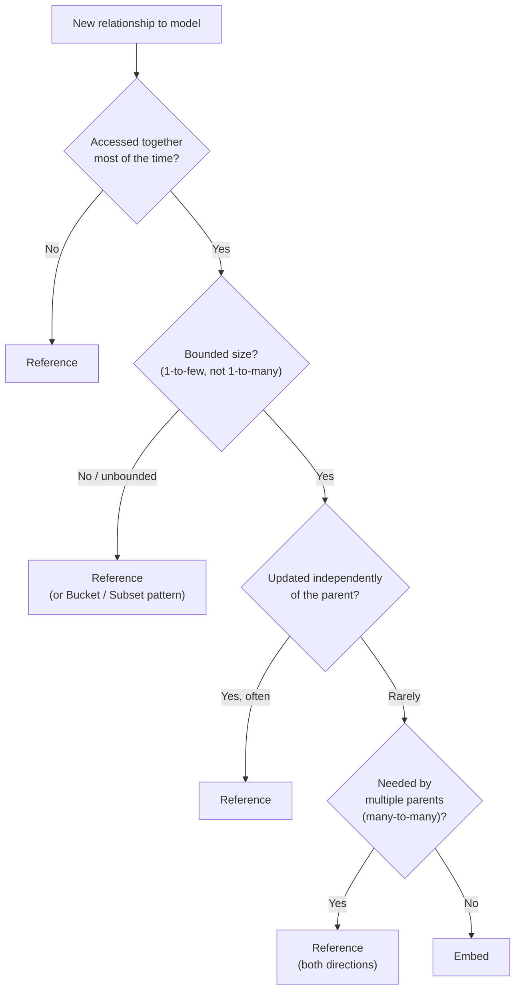
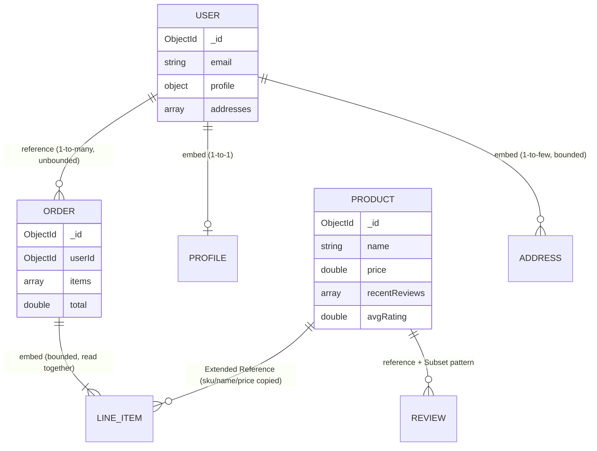

# Data Modeling & Schema Design

Chapter 4 gave you complete command over manipulating documents — inserting, querying, updating, and deleting them with precision. But every one of those examples assumed the documents already had a shape: a `products` collection with a `tags` array, an `orders` collection with an embedded `items` array. Nobody handed you that shape; it was a design decision. Now that you can operate fluently on documents, the harder and more consequential question comes into focus: **how should those documents be shaped in the first place?** Unlike a relational schema, where normalization rules give you a fairly mechanical procedure to follow, MongoDB hands you a genuine design space — the same real-world data can be modeled a dozen structurally different ways, and the "right" one depends entirely on how your application reads and writes that data. This chapter builds the framework and vocabulary to make that decision well, and gives you the named patterns MongoDB's own engineering team has published for the situations that come up again and again.

---

## Learning Objectives

By the end of this chapter, you will be able to:

- Explain the central embedding-vs-referencing tradeoff and apply a concrete decision framework to a real modeling problem.
- Model one-to-one, one-to-many, and many-to-many relationships in MongoDB using appropriate embedding or referencing strategies.
- Recognize and apply at least seven named MongoDB schema design patterns: Attribute, Subset, Bucket, Extended Reference, Polymorphic, Computed, and Outlier.
- Explain the 16MB document size limit and how it constrains embedding decisions in practice.
- Enforce document structure with `$jsonSchema` validation, including required fields, type constraints, and validation levels/actions.
- Weigh denormalization's read-performance benefits against its consistency costs, and name patterns that manage that tradeoff deliberately.
- Design a complete, justified schema for a multi-collection application (e.g., an e-commerce order system) from scratch.

---

## Prerequisites for This Chapter

This chapter builds on [Chapter 2: Core Concepts](./02-core-concepts.md) and [Chapter 4: CRUD Fundamentals](./04-crud-fundamentals.md). We assume you already know:

- The document/collection/database model, BSON types, and how embedded sub-documents and arrays look inside a document (Chapter 2).
- How to insert, query, update (including array update operators like `$push` and positional `$`), and delete documents fluently (Chapter 4).
- That MongoDB does not require a fixed schema by default — every document in a collection can, in principle, have different fields (Chapter 2).

If any of that is shaky, revisit those chapters first. This chapter assumes CRUD mechanics as settled ground and spends its entire budget on the design decisions that determine *what* those documents look like before you ever write a query against them.

---

## 1. The Central Tradeoff: Embedding vs. Referencing

In a relational database, the shape of your tables is dictated by normalization rules — you factor out repeated data into separate tables and connect them with foreign keys almost mechanically, then let `JOIN` reassemble what you need at query time. MongoDB gives you no such mechanical procedure. Instead, you make an explicit choice for every relationship in your data: **embed** the related data as a nested sub-document/array inside the parent document, or **reference** it by storing an identifier and looking it up separately (optionally with `$lookup`, covered in Chapter 8).

Neither is "more correct." They are different tools with different performance and consistency characteristics, and picking wrong is the single most common cause of a MongoDB schema that becomes painful in production.

### 1.1 Worked example: a blog post and its comments

**Embedding** — comments live inside the post document itself:

```javascript
{
  _id: ObjectId("64f1a2b3c4d5e6f7a8b9c0d1"),
  title: "Why Document Databases Exist",
  slug: "why-document-databases-exist",
  author: "akash",
  publishedAt: ISODate("2026-01-10"),
  body: "...",
  comments: [
    { author: "riya", text: "Great explanation!", postedAt: ISODate("2026-01-11") },
    { author: "sam",  text: "Clarified a lot for me.", postedAt: ISODate("2026-01-11") }
  ]
}
```

One `find()` on `posts` returns the post *and* every comment — a single round trip, no join. This is fast and simple as long as the comment list stays small and is always read together with the post.

**Referencing** — comments live in their own collection, pointing back to the post:

```javascript
// posts collection
{
  _id: ObjectId("64f1a2b3c4d5e6f7a8b9c0d1"),
  title: "Why Document Databases Exist",
  slug: "why-document-databases-exist",
  author: "akash",
  publishedAt: ISODate("2026-01-10"),
  body: "..."
}

// comments collection
{ _id: ObjectId("..."), postId: ObjectId("64f1a2b3c4d5e6f7a8b9c0d1"), author: "riya", text: "Great explanation!", postedAt: ISODate("2026-01-11") }
{ _id: ObjectId("..."), postId: ObjectId("64f1a2b3c4d5e6f7a8b9c0d1"), author: "sam",  text: "Clarified a lot for me.", postedAt: ISODate("2026-01-11") }
```

Now reading a post's comments requires a second query (or a `$lookup` aggregation) against `comments` filtered by `postId` — but a viral post with fifty thousand comments no longer bloats a single document, comments can be paginated independently, and deleting or updating one comment never touches the post document at all.

### 1.2 Worked example: an order and its line items

The same tension shows up with orders and line items, and the right answer is often the opposite of what intuition suggests coming from a relational background:

```javascript
// EMBEDDED — usually the right call for order line items
{
  _id: ObjectId("..."),
  customerId: ObjectId("..."),
  orderDate: ISODate("2026-07-01"),
  status: "shipped",
  items: [
    { sku: "TSHIRT-BLK-M", name: "Black T-Shirt", qty: 2, unitPrice: 19.99 },
    { sku: "MUG-CERAMIC",  name: "Ceramic Mug",   qty: 1, unitPrice: 12.50 }
  ],
  total: 52.48
}
```

Line items are almost always read together with the order (you never display an order's total without its items), the set is bounded (an order realistically has dozens of line items, not millions), and once the order ships, that data is effectively immutable history — a perfect embedding candidate, and a deliberate copy of the product's *name* and *price at time of purchase*, which brings us to a pattern in Section 4.

Compare this to comments on a post, which are unbounded, grow indefinitely, and are frequently read/paginated/moderated independently of the post — the opposite profile, and why referencing wins there instead. The lesson is not "embed orders, reference comments" as a rule — it's that **the shape of the relationship and its access pattern**, not the domain name, determines the right call.

---

## 2. A Decision Framework: When to Embed, When to Reference

Ask these questions, in roughly this order, for every relationship in your data model:

| Question | Favors Embedding | Favors Referencing |
|---|---|---|
| Is the related data almost always read together with the parent? | Yes | No — read independently |
| Is the relationship bounded ("1-to-few")? | Yes (a handful to a few hundred) | No — unbounded or "1-to-many/millions" |
| Could the sub-document/array grow without a practical bound? | No | Yes (danger — see Section 5) |
| Is the sub-entity ever updated/queried *on its own*, independent of the parent? | Rarely | Frequently |
| Does the sub-entity need to be shared/linked from *multiple* parents (many-to-many)? | No | Yes |
| Is the sub-document itself large (many fields, large text/binary)? | No | Yes |
| Do you need atomic, single-document updates across parent + child together? | Yes (embedding gives this for free) | No — requires a transaction |



No single rule wins every case — real schemas mix both strategies even within one collection (embed the small, stable parts; reference the large or independently-changing parts). Sections 4 and 5 below show named patterns that live precisely at that boundary.

---

## 3. Modeling Relationships in MongoDB

### 3.1 One-to-one

A one-to-one relationship (a user and their profile settings) is usually just **embedded directly as a sub-document** — there's rarely a reason to split it, unless one side is large and rarely accessed (see the Subset pattern, Section 4.2).

```javascript
{
  _id: ObjectId("..."),
  username: "akashg",
  email: "akash@example.com",
  profile: {
    displayName: "Akash Gaur",
    bio: "Backend engineer",
    avatarUrl: "https://cdn.example.com/avatars/akashg.png"
  }
}
```

### 3.2 One-to-many

One-to-many splits further into **one-to-few** (embed) and **one-to-many/one-to-squillions** (reference). A user with a handful of shipping addresses is one-to-few:

```javascript
{
  _id: ObjectId("..."),
  username: "akashg",
  addresses: [
    { label: "home", line1: "12 MG Road", city: "Pune", zip: "411001" },
    { label: "work", line1: "5 Tech Park", city: "Pune", zip: "411006" }
  ]
}
```

A user with potentially thousands of orders is one-to-many — reference from the "many" side back to the "one":

```javascript
// users collection — no orders array here; it would grow forever
{ _id: ObjectId("u1"), username: "akashg", email: "akash@example.com" }

// orders collection — each order references its user
{ _id: ObjectId("o1"), userId: ObjectId("u1"), orderDate: ISODate("2026-06-01"), total: 52.48 }
{ _id: ObjectId("o2"), userId: ObjectId("u1"), orderDate: ISODate("2026-07-01"), total: 19.99 }
```

Querying "all of a user's orders" is `db.orders.find({ userId: ObjectId("u1") })` — fast, provided `userId` is indexed (Chapter 6).

### 3.3 Many-to-many

Many-to-many (students enroll in many courses; courses have many students) has no natural "embed everything" answer, because embedding on either side duplicates the relationship and risks unbounded growth on both. The conventional approach is **referencing from both sides**, or a **join collection**, depending on whether the relationship itself carries data:

```javascript
// Referencing an array of ids on each side (fine when both sides are modestly bounded)
// students collection
{ _id: ObjectId("s1"), name: "Riya", courseIds: [ObjectId("c1"), ObjectId("c2")] }

// courses collection
{ _id: ObjectId("c1"), title: "Intro to MongoDB", studentIds: [ObjectId("s1"), ObjectId("s2")] }
```

```javascript
// Join/junction collection (preferred when the relationship itself has attributes,
// e.g. enrollment date, grade — and when either side could grow large)
// enrollments collection
{ _id: ObjectId("..."), studentId: ObjectId("s1"), courseId: ObjectId("c1"), enrolledAt: ISODate("2026-01-15"), grade: "A" }
```

The join-collection approach is almost always the safer default for many-to-many in production: it avoids unbounded arrays on either parent document, and it gives the relationship itself a natural place to carry its own fields (enrollment date, order-line quantity, permission level) without cramming them awkwardly into an array of bare IDs.

---

## 4. Named Schema Design Patterns

MongoDB's engineering team has published a well-known catalog of recurring schema design patterns (the "Building with Patterns" blog series). These aren't exotic — they're names for solutions you'd likely reinvent anyway once you hit the underlying problem. Learning the names lets you communicate design intent precisely with other engineers.

### 4.1 Attribute Pattern

**Problem it solves:** A document has many similar fields that differ mostly by *type* of attribute — e.g., a product with `color`, `size`, `voltage`, `weight`, some of which apply only to some products. Querying "any attribute with value X" or indexing every possible attribute field separately becomes unwieldy and requires a growing number of indexes.

**Example:**

```javascript
// Before — a sparse, ever-growing set of top-level fields, hard to index generically
{ _id: 1, name: "Travel Adapter", voltageInput: "100-240V", voltageOutput: "5V", weightGrams: 120 }

// After — Attribute Pattern: attributes become an array of {k, v} pairs
{
  _id: 1,
  name: "Travel Adapter",
  attributes: [
    { k: "voltageInput", v: "100-240V" },
    { k: "voltageOutput", v: "5V" },
    { k: "weightGrams", v: 120 }
  ]
}
```

A single compound index on `attributes.k` + `attributes.v` can now answer queries across *any* attribute, instead of needing a separate index per field.

**When to use it:** Products with wildly varying, optional attributes (catalogs, specs sheets); documents where you'd otherwise need dozens of sparse, rarely-indexed fields.

### 4.2 Subset Pattern

**Problem it solves:** A document embeds an array that's mostly useful in small quantities (e.g., "show the 10 most recent reviews on the product page") but the full array could grow large, bloating a document you load on every page view even when you only need a slice of it.

**Example:**

```javascript
// products collection — only the 10 most recent/helpful reviews embedded
{
  _id: 1,
  name: "13-inch Laptop",
  price: 999.00,
  recentReviews: [
    { user: "riya", rating: 5, text: "Great value" },
    { user: "sam",  rating: 4, text: "Solid build" }
    // ... up to ~10
  ],
  reviewCount: 482,
  avgRating: 4.3
}

// reviews collection — the FULL, unbounded set, referenced by productId
{ _id: ObjectId("..."), productId: 1, user: "riya", rating: 5, text: "Great value", postedAt: ISODate("2026-05-01") }
```

**When to use it:** Product pages, "recent activity," or any case where you frequently need only the first N of a logically large collection, and want to avoid loading (or exceeding the size of) the whole thing on the common path.

### 4.3 Bucket Pattern

**Problem it solves:** High-volume, time-series-like data (sensor readings, log events, metrics) generates one document per reading, leading to enormous numbers of tiny documents, high per-document overhead, and index bloat. The Bucket Pattern groups readings from a fixed time window into one document.

**Example — one document per sensor per hour, instead of one document per reading:**

```javascript
// Before — one document per reading (thousands per sensor per day)
{ sensorId: "temp-01", ts: ISODate("2026-07-06T10:00:00Z"), value: 21.4 }
{ sensorId: "temp-01", ts: ISODate("2026-07-06T10:01:00Z"), value: 21.5 }
// ... one document every minute, forever

// After — Bucket Pattern: one document per sensor per hour
{
  sensorId: "temp-01",
  bucketStart: ISODate("2026-07-06T10:00:00Z"),
  bucketEnd:   ISODate("2026-07-06T11:00:00Z"),
  count: 60,
  sumValue: 1287.4,
  readings: [
    { ts: ISODate("2026-07-06T10:00:00Z"), value: 21.4 },
    { ts: ISODate("2026-07-06T10:01:00Z"), value: 21.5 }
    // ... up to 60 for the hour, then a new bucket document starts
  ]
}
```

Bucketing drastically reduces document count and index entries, and precomputed fields like `count`/`sumValue` make rollup queries cheap without re-scanning every raw reading. (MongoDB's dedicated **time series collections**, covered operationally in later chapters, implement a highly optimized version of this same idea natively.)

**When to use it:** IoT/sensor data, application metrics, log aggregation — any high-frequency, naturally time-ordered data.

### 4.4 Extended Reference Pattern

**Problem it solves:** Pure referencing means every read of a "parent" needs a `$lookup`/second query just to show a few frequently-needed fields from the "child" (e.g., showing a customer's name and shipping city on every order row, when the full customer record lives elsewhere). The Extended Reference Pattern copies **only the handful of fields you actually need for the common read**, alongside the reference, avoiding the join for the 95% case.

**Example:**

```javascript
// orders collection — full reference PLUS a small denormalized subset of customer fields
{
  _id: ObjectId("..."),
  customerId: ObjectId("c1"),
  customer: { name: "Riya Sharma", city: "Pune" },   // extended reference — just what's shown on an order summary
  items: [ { sku: "TSHIRT-BLK-M", qty: 2, unitPrice: 19.99 } ],
  total: 39.98
}
```

Listing a customer's recent orders with their name and city needs zero joins; only when you need the customer's *full* record (email, all addresses, order history) do you follow `customerId` back to the `customers` collection.

**When to use it:** Any read-heavy display that needs a small, stable slice of a related entity's fields on nearly every read — order summaries, comment author names/avatars, dashboard rows.

### 4.5 Polymorphic Pattern

**Problem it solves:** A single collection needs to hold documents that are mostly similar but differ in some fields depending on a "type" — e.g., a `vehicles` collection with cars, motorcycles, and trucks, or a `content` collection with articles, videos, and podcasts. Splitting into separate collections per type forces the application (and every query) to know which collection to hit; the Polymorphic Pattern keeps them together with a discriminator field.

**Example:**

```javascript
{ _id: 1, type: "car", make: "Toyota", model: "Corolla", doors: 4 }
{ _id: 2, type: "motorcycle", make: "Royal Enfield", model: "Classic 350", cc: 350 }
{ _id: 3, type: "truck", make: "Tata", model: "Ace", payloadKg: 750 }
```

A single query (`db.vehicles.find({ make: "Toyota" })`) works across all subtypes uniformly, while type-specific fields (`doors`, `cc`, `payloadKg`) simply coexist — this is exactly the schema flexibility Chapter 2 introduced as MongoDB's core selling point, applied deliberately.

**When to use it:** Content types with a shared "base" shape and type-specific extensions, especially when you routinely query *across* types (a unified activity feed, a unified vehicle listing) more often than you query within one type alone.

### 4.6 Computed Pattern

**Problem it solves:** Recomputing an expensive aggregate (a total, an average rating, a running count) from scratch on every read wastes CPU on data that doesn't change every request. The Computed Pattern stores the precomputed result directly on the document, updated incrementally whenever the underlying data changes.

**Example:**

```javascript
// Instead of summing all reviews' ratings on every product page load...
db.reviews.aggregate([ { $match: { productId: 1 } }, { $group: { _id: null, avg: { $avg: "$rating" } } } ])

// ...store and incrementally maintain the computed value on the product itself:
{ _id: 1, name: "13-inch Laptop", price: 999.00, avgRating: 4.3, reviewCount: 482 }

// updated incrementally whenever a new review arrives, not recomputed from scratch:
db.products.updateOne(
  { _id: 1 },
  { $set: { avgRating: 4.31 }, $inc: { reviewCount: 1 } }
)
```

**When to use it:** Read-heavy aggregates (view counts, ratings, running totals, leaderboards) where the read volume vastly exceeds the write volume, and a small amount of staleness between "true" and "computed" values is acceptable.

### 4.7 Outlier Pattern

**Problem it solves:** A schema works well for the overwhelming majority ("normal") of documents, but a small number of outliers would break an embedding assumption — e.g., embedding a "list of buyers" on a product works fine until a viral product accumulates millions of buyers and threatens the 16MB limit (Section 5). The Outlier Pattern keeps the normal case embedded but detects and diverts outliers into a referenced overflow structure.

**Example:**

```javascript
// Normal product — buyer list embedded, small and bounded
{ _id: 1, name: "Niche Gadget", recentBuyers: ["u1", "u2", "u3"], hasExtendedBuyers: false }

// Outlier / viral product — flips a flag once the embedded list nears a safe cap,
// and overflow buyers move to a separate collection
{ _id: 2, name: "Viral Gadget", recentBuyers: ["u1", "..."], hasExtendedBuyers: true }
// buyersOverflow collection holds buyer #1001 onward for product _id: 2
```

**When to use it:** Any embedding decision that's correct for 99% of documents but has a small number of extreme cases (viral posts, celebrity accounts, best-selling products) that would otherwise blow past sane document size or array length — let the common case stay simple and handle the rare case explicitly.

---

## 5. The 16MB Document Size Limit

Every BSON document in MongoDB is capped at **16 megabytes**. This isn't an arbitrary inconvenience — it exists to keep a single document's read/write cost bounded and predictable, so that fetching or updating one document can never become an unbounded, cluster-destabilizing operation.

In practice, 16MB is enormous for a "normal" document — a product, a user profile, an order will never come close. The limit becomes a real constraint specifically when you embed an **unbounded, ever-growing array or sub-document**:

- A product's `reviews` array, embedded directly, grows without bound as reviews accumulate — a popular product can realistically accumulate tens of thousands of reviews, each with author, text, rating, and timestamp. Do the arithmetic: even a modest 200-byte review times 100,000 reviews is 20MB — already over the limit, and the document has been getting slower to read and write for a long time before it fails outright.
- A "chat" or "activity log" document that appends every event ever, forever, embedded in the same document, is the same failure shape.
- Even well under the hard limit, a document that grows to several megabytes is expensive: every read transfers the whole document over the wire, every update that changes the document's size may require the storage engine to relocate it on disk, and it puts pressure on the WiredTiger cache (Chapter 3) far more than a lean, focused document would.

This is precisely *why* Sections 4.2–4.7 exist: the Subset, Bucket, Extended Reference, and Outlier patterns are all, in different ways, deliberate techniques for **getting embedding's read-locality benefits without embedding's unbounded-growth risk**. Whenever you're tempted to embed an array, ask explicitly: "what is the realistic maximum size of this array, and am I certain it's bounded?" If the honest answer is "I don't know" or "it could grow indefinitely," that's a reference, a Subset, or a Bucket — not a plain embed.

---

## 6. Schema Validation with `$jsonSchema`

MongoDB does not *require* a fixed schema — that flexibility is a feature, not a bug, and it's why the document model works so well for evolving applications. But "no required schema" does not mean "no schema is a good idea." In practice, almost every production collection benefits from *some* enforced structure, to catch bugs (a missing required field, a string where a number belongs) at write time rather than as a confusing surprise deep in application code or an aggregation pipeline months later.

MongoDB gives you this via **schema validation** using `$jsonSchema`, attached either at collection creation or added later.

### 6.1 Creating a validated collection

```javascript
db.createCollection("products", {
  validator: {
    $jsonSchema: {
      bsonType: "object",
      required: ["name", "price", "category"],
      properties: {
        name: {
          bsonType: "string",
          description: "must be a string and is required"
        },
        price: {
          bsonType: "double",
          minimum: 0,
          description: "must be a non-negative number and is required"
        },
        category: {
          enum: ["apparel", "electronics", "home", "office", "misc"],
          description: "must be one of the enumerated categories and is required"
        },
        stock: {
          bsonType: "int",
          minimum: 0,
          description: "must be a non-negative integer if present"
        },
        tags: {
          bsonType: "array",
          items: { bsonType: "string" },
          description: "must be an array of strings if present"
        }
      }
    }
  },
  validationLevel: "strict",
  validationAction: "error"
})
```

### 6.2 Adding validation to an existing collection

Most real collections already exist by the time you decide to add validation — use `collMod`:

```javascript
db.runCommand({
  collMod: "products",
  validator: {
    $jsonSchema: {
      bsonType: "object",
      required: ["name", "price", "category"],
      properties: {
        name: { bsonType: "string" },
        price: { bsonType: "double", minimum: 0 },
        category: { enum: ["apparel", "electronics", "home", "office", "misc"] }
      }
    }
  },
  validationLevel: "moderate",
  validationAction: "warn"
})
```

### 6.3 `validationLevel` and `validationAction`

| Option | Values | Meaning |
|---|---|---|
| `validationLevel` | `"strict"` (default) | Applies the validator to **all** inserts and updates. |
| | `"moderate"` | Applies the validator to inserts and to updates of documents that **already** satisfy the schema; existing documents that predate the schema and don't conform are left alone until they're touched. |
| `validationAction` | `"error"` (default) | Rejects any write that violates the schema. |
| | `"warn"` | Logs a warning to the MongoDB log but **allows** the write to proceed anyway. |

`{ validationLevel: "moderate", validationAction: "warn" }` is the standard rollout strategy for adding validation to a collection that already has real, possibly-messy production data: it lets you observe how many writes *would* fail without breaking anything, before flipping to `"strict"`/`"error"` once you've cleaned up (or confirmed there's nothing to clean up).

---

## 7. Denormalization: Read Performance vs. Consistency Cost

Every embedding decision and every Extended Reference/Computed pattern application is, at its core, an act of **denormalization** — deliberately storing the same fact in more than one place to make reads cheap, at the cost of now owing yourself the discipline to keep every copy in sync.

**The benefit is real and large:** a denormalized order document that embeds `customer: { name, city }` and product `name`/`price` needs zero joins to render an order confirmation page. In a system serving thousands of reads per second, avoiding a `$lookup` (Chapter 8) on the hot path is a legitimate, often decisive, performance win.

**The cost is equally real:** if a customer changes their name, every order document that copied the old name is now stale unless something updates them. This is the fundamental tradeoff, and there is no way to make it disappear — only ways to manage it deliberately:

- **Accept staleness where it's harmless.** An order's embedded customer name/city is a snapshot of "who placed this order, and from where" at the time of purchase — arguably that's *more* correct than always showing the customer's current name on a three-year-old order, not less. Many "duplicated" fields are actually intentional historical snapshots, not bugs waiting to happen.
- **Update copies explicitly, on the write path that changes the source of truth**, using `updateMany` against every place the duplicated field lives (feasible when the fan-out is small and known).
- **Use the Computed Pattern (4.6) for aggregates** so you're maintaining one incrementally-updated number, not recomputing (or worse, letting drift accumulate in) an expensive `$group` on every read.
- **Use the Extended Reference Pattern (4.4) narrowly** — copy only the two or three fields the hot read path actually needs, keeping the full record's `_id` reference alongside it so you always have a path back to ground truth.

The rule of thumb: denormalize deliberately, in service of a specific, known read pattern — never accidentally, and never without an explicit answer to "what happens when the source of truth changes?"

---

## 8. E-Commerce Domain: An Annotated Model



Walking the annotations: a user's `profile` and `addresses` are embedded (bounded, always read with the user); orders are referenced from users (unbounded over a lifetime) but an order's own line items are embedded (bounded, always read together, and effectively a purchase-time snapshot via Extended Reference to the product); a product's `recentReviews` uses the Subset Pattern (a bounded slice embedded, the full history referenced separately) with `avgRating` maintained via the Computed Pattern.

---

## Real-World Scenario

**Setup:** You're designing the schema for a mid-sized e-commerce platform from scratch: users, products, orders, and reviews. Walk through each collection and justify the embed/reference call using the framework from Section 2.

**`users` collection:**

```javascript
{
  _id: ObjectId("u1"),
  email: "riya@example.com",
  passwordHash: "...",
  profile: { displayName: "Riya Sharma", avatarUrl: "https://cdn.example.com/riya.png" },
  addresses: [
    { label: "home", line1: "12 MG Road", city: "Pune", zip: "411001" }
  ],
  createdAt: ISODate("2025-03-01")
}
```
*Justification:* `profile` is one-to-one, always read with the user — embed. `addresses` is one-to-few and bounded (nobody has thousands of addresses) — embed. Orders and reviews are **not** embedded here even though they "belong" to the user, because both are unbounded over the user's lifetime and are frequently accessed independently of the user record (e.g., an admin dashboard listing recent orders across all users).

**`products` collection (with the Subset and Computed patterns):**

```javascript
{
  _id: ObjectId("p1"),
  sku: "LAPTOP-13",
  name: "13-inch Laptop",
  price: 999.00,
  category: "electronics",
  attributes: [ { k: "ramGb", v: 16 }, { k: "storageGb", v: 512 } ],
  recentReviews: [
    { user: "riya", rating: 5, text: "Excellent build quality" }
  ],
  avgRating: 4.3,
  reviewCount: 482
}
```
*Justification:* `attributes` uses the Attribute Pattern — specs vary a lot across product categories. `recentReviews` uses the Subset Pattern — the product page only ever shows the latest few; the full history lives in a separate `reviews` collection so a viral product's review count can't threaten document size. `avgRating`/`reviewCount` use the Computed Pattern — cheap to read, incrementally maintained on write.

**`reviews` collection (referenced, unbounded):**

```javascript
{ _id: ObjectId("r1"), productId: ObjectId("p1"), userId: ObjectId("u1"), rating: 5, text: "Excellent build quality", postedAt: ISODate("2026-06-15") }
```
*Justification:* Reviews are unbounded per product, need independent pagination/moderation, and are written far more often (by many different users) than the product itself changes — a textbook reference case.

**`orders` collection (embedded line items, Extended Reference to product and user):**

```javascript
{
  _id: ObjectId("o1"),
  userId: ObjectId("u1"),
  customerSnapshot: { name: "Riya Sharma", city: "Pune" },
  orderDate: ISODate("2026-07-01"),
  status: "shipped",
  items: [
    { productId: ObjectId("p1"), sku: "LAPTOP-13", name: "13-inch Laptop", qty: 1, unitPrice: 999.00 }
  ],
  total: 999.00
}
```
*Justification:* `items` is embedded — bounded per order, always read together with the order, and effectively an immutable historical snapshot once the order ships (the laptop's *current* price shouldn't retroactively change what this order says the customer paid). `customerSnapshot` and each item's `name`/`unitPrice` are Extended References — small, deliberately-copied fields that make an order summary render with zero joins, while `userId`/`productId` remain as the path back to current, authoritative records.

---

## Best Practices

- **Model for your application's access patterns, not for normalization purity.** The question is never "is this normalized?" — it's "what does my application read and write, and how often?" Start from your queries, not your entities.
- **Default to embedding for bounded, together-accessed data; default to referencing the moment growth is unbounded or access is independent.** When in doubt, ask "could this array realistically have thousands of elements one day?" — if yes, don't embed it as a plain array.
- **Validate schemas in production, even though MongoDB doesn't require it.** `$jsonSchema` with `validationLevel`/`validationAction` catches malformed writes before they become a debugging session three weeks later.
- **Denormalize deliberately, and always know the update path.** Every duplicated field needs an answer to "what updates this when the source of truth changes?" before you ship it — not after.
- **Reach for a named pattern instead of reinventing one.** If you're solving "many similar-but-different sub-documents," "a huge sub-array," "expensive per-read aggregates," or "a few outlier documents breaking my embedding assumption," there is almost certainly already a named pattern (Section 4) for it.
- **Revisit the schema as access patterns change.** A schema that was right at launch (low traffic, small data) may need to shift from embedding to referencing (or vice versa) as scale changes the cost/benefit balance — this isn't a failure of the original design, it's normal evolution.
- **Keep the 16MB limit in mind from day one for any array field**, not just when a document actually approaches it — by the time you notice, you may already have production data that's expensive to migrate.

---

## Common Mistakes

- **Embedding an unbounded array, like "all reviews ever" or "every login event," directly inside a parent document.** This is the single most common MongoDB schema mistake, and it's exactly what the 16MB limit (Section 5) and the Subset/Bucket patterns (Sections 4.2, 4.3) exist to prevent.
- **Over-normalizing out of relational habit, forcing a `$lookup` for every single read.** Splitting every relationship into its own collection "because that's how you'd do it in SQL" throws away MongoDB's biggest performance advantage — reading one document instead of joining several.
- **Ignoring the 16MB limit until a document actually hits it.** By the time a write starts failing in production, you likely have months of accumulated data that now needs a painful migration; design against the limit from the start for any field that could plausibly grow.
- **Duplicating data (denormalizing) with no plan to keep copies in sync.** Copying a customer's name into every order without ever revisiting how a name change propagates is a silent data-integrity bug waiting to surface.
- **Treating schema flexibility as "no schema needed."** Skipping `$jsonSchema` validation entirely because "MongoDB doesn't require a schema" trades a small amount of upfront design work for an unbounded amount of "why does this document have a string where a number should be" debugging later.
- **Choosing a modeling pattern based on the entity's name rather than its access pattern.** "Comments" aren't always referenced and "line items" aren't always embedded — the deciding factor is boundedness and access pattern (Section 2), not what the entity is called.
- **Forgetting that embedded sub-documents can't be queried, indexed, or paginated as independently as a separate collection.** If you find yourself wanting to sort/paginate/`$lookup` into a sub-array constantly, that's a signal it probably wants to be its own referenced collection.

---

## Summary

- MongoDB gives you a genuine design choice for every relationship: **embed** (nest the data in the parent document) or **reference** (store an ID and look it up separately) — there is no mechanical normalization procedure to fall back on.
- Decide using access patterns: embed when data is read together, bounded, and doesn't grow unboundedly; reference when data is accessed independently, unbounded, large, or needed by many parents (many-to-many).
- One-to-one and one-to-few relationships are usually embedded; one-to-many/one-to-squillions and many-to-many relationships are usually referenced, often via a join collection when the relationship itself carries data.
- MongoDB's published pattern catalog names recurring solutions: **Attribute** (varying optional fields), **Subset** (embed only a bounded slice), **Bucket** (group time-series data into windowed documents), **Extended Reference** (copy a few hot fields alongside a reference), **Polymorphic** (a discriminator field for mixed-type documents in one collection), **Computed** (precompute expensive aggregates), and **Outlier** (handle the rare document that would break a normal embedding assumption).
- Every document is capped at **16MB** — a hard boundary that makes unbounded embedding dangerous well before the limit is actually hit, due to cache pressure and per-write cost.
- `$jsonSchema` validation (via `db.createCollection()` or `collMod`) lets you enforce required fields and types even though MongoDB never requires a schema; `validationLevel`/`validationAction` control how strictly and how loudly violations are treated.
- Denormalization trades consistency cost (multiple copies to keep in sync) for read performance — a deliberate tradeoff, best managed with the Computed and Extended Reference patterns rather than ad hoc duplication.

---

## Knowledge Check

1. A colleague proposes embedding a `messages` array directly inside a `chatRoom` document, since "messages always belong to a room." Using the decision framework from Section 2, explain what's risky about this design and what you'd propose instead.
2. Explain the difference between the Subset Pattern and the Extended Reference Pattern — both involve copying a small amount of related data, but they solve different problems. Give an example of each.
3. Why does the 16MB document size limit matter even for documents that are currently only a few hundred kilobytes in size?
4. You add `$jsonSchema` validation to a `products` collection that already contains 500,000 documents, some of which don't conform to the new schema. Explain what `{ validationLevel: "moderate", validationAction: "warn" }` will and won't do to existing and new writes, and why you might choose this over `{ "strict", "error" }` initially.
5. Give an example of a many-to-many relationship in a domain of your choice, and explain why a join/junction collection is usually preferable to storing an array of IDs on both sides.

---

## Hands-On Exercise

Design and implement, in `mongosh`, a schema for a simple blogging platform with `users`, `posts`, and `comments`. Use at least two named patterns from this chapter.

1. **Set up a scratch database.**
   ```javascript
   use blog_modeling_exercise
   ```

2. **Design `users`** — embed a one-to-one `profile` sub-document and a bounded `addresses`-style field of your choosing (e.g., `socialLinks`). Insert two or three users.

3. **Design `posts`** with a `$jsonSchema` validator requiring `title`, `authorId`, and `body`, and constraining `title` to a string and `authorId` to an `objectId`:
   ```javascript
   db.createCollection("posts", {
     validator: {
       $jsonSchema: {
         bsonType: "object",
         required: ["title", "authorId", "body"],
         properties: {
           title: { bsonType: "string" },
           authorId: { bsonType: "objectId" },
           body: { bsonType: "string" },
           tags: { bsonType: "array", items: { bsonType: "string" } }
         }
       }
     },
     validationLevel: "strict",
     validationAction: "error"
   })
   ```
   Apply the **Subset Pattern**: give each post document a `recentComments` array (top 3, embedded) rather than embedding every comment.

4. **Design `comments`** as its own referenced collection (`postId`, `authorId`, `text`, `postedAt`) — the full, unbounded set backing the Subset Pattern's embedded slice.

5. **Apply the Computed Pattern.** Add a `commentCount` field to each post, and write an `updateOne` that increments it via `$inc` whenever a new comment is inserted into `comments`.

6. **Verify validation works.** Attempt to insert a post missing `authorId` and confirm MongoDB rejects it with a validation error. Then attempt a valid insert and confirm it succeeds.

7. **Query across the design.** Write a query that returns a post along with its embedded `recentComments`, without touching the `comments` collection at all — this demonstrates the whole point of the Subset Pattern: the common read path needs no join.

---

## Further Reading

- [MongoDB Manual: Data Modeling Introduction](https://www.mongodb.com/docs/manual/core/data-modeling-introduction/) — the official overview of embedding vs. referencing and modeling considerations.
- [MongoDB Manual: Model One-to-One Relationships](https://www.mongodb.com/docs/manual/tutorial/model-embedded-one-to-one-relationships-between-documents/) and [Model One-to-Many Relationships](https://www.mongodb.com/docs/manual/tutorial/model-embedded-one-to-many-relationships-between-documents/) — worked tutorials from MongoDB's own docs.
- [MongoDB Manual: Schema Validation](https://www.mongodb.com/docs/manual/core/schema-validation/) — the full reference for `$jsonSchema`, `validationLevel`, and `validationAction`.
- [MongoDB Blog: Building with Patterns](https://www.mongodb.com/blog/post/building-with-patterns-a-summary) — the original series introducing the Attribute, Subset, Bucket, Extended Reference, Polymorphic, Computed, Outlier, and other named patterns in depth.
- [MongoDB Manual: BSON Document Size Limit](https://www.mongodb.com/docs/manual/reference/limits/#mongodb-limit-BSON-Document-Size) — the authoritative reference on the 16MB limit and related limits.

---

<div style="display:flex;justify-content:space-between;align-items:center;">
  <a href="./04-crud-fundamentals.md">← Previous: CRUD Fundamentals</a>
  <a href="./00-index.md">🏠 Index</a>
  <a href="./06-indexes-fundamentals.md">Next: Indexes Fundamentals →</a>
</div>
