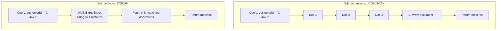
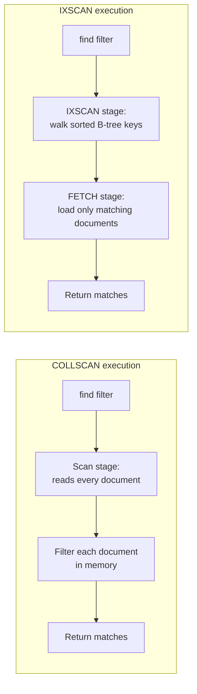

# Indexes Fundamentals

Chapter 5 gave you the tools to design a schema: embedding vs. referencing, named modeling patterns, and schema validation. That chapter answered "given my application's access patterns, what shape should my documents be?" This chapter answers the next, equally practical question: "given that shape, how do I make my actual queries fast?" A well-modeled schema queried without the right indexes still performs badly — MongoDB will happily scan every document in a collection to find the ones you asked for, and that gets slower, linearly, as your collection grows. Indexes are the single biggest lever you have over query performance, and — unlike most performance work — you can reason about them precisely, before you ever touch production, using the exact tool you'll rely on for the rest of your MongoDB career: `explain()`.

---

## Learning Objectives

By the end of this chapter, you will be able to:

- Explain why indexes exist by contrasting a collection scan (`COLLSCAN`) with an index scan (`IXSCAN`), and articulate the tradeoffs indexes introduce (read speed vs. write cost, storage, and RAM).
- Create single-field and compound indexes, and state the **index prefix rule** that governs which queries a compound index can and cannot serve.
- Explain multikey indexes (indexes on array fields) and their restriction to a single array field per compound index.
- Identify when to reach for a text, geospatial, hashed, or wildcard index instead of a standard B-tree index.
- Apply unique, partial, sparse, and TTL index properties to solve real modeling problems (deduplication, conditional indexing, auto-expiring documents).
- Read `explain("executionStats")` output well enough to distinguish an efficient query plan from an inefficient one, using `nReturned` vs. `totalDocsExamined`.
- Understand, at a high level, how MongoDB builds indexes on existing collections without blocking reads and writes.

---

## Prerequisites for This Chapter

This chapter builds on two earlier chapters:

- [Chapter 3: Architecture & Internals](./03-architecture-and-internals.md) — you should be comfortable with the idea that WiredTiger stores both collections and indexes as **B-trees**, and that a collection with several indexes is physically several separate B-tree structures on disk (Chapter 3, Section 7). Everything in this chapter is a direct, practical consequence of that fact.
- [Chapter 4: CRUD Fundamentals](./04-crud-fundamentals.md) — you should be comfortable writing `find()` queries with filters, projections, and sorts; this chapter is entirely about making those queries fast.

Deeper query-plan analysis, the ESR (Equality, Sort, Range) rule for ordering compound index fields, and systematic index-strategy design are the subject of [Chapter 14: Performance Tuning & Query Optimization](./14-performance-tuning-and-query-optimization.md). This chapter gives you the mechanics and vocabulary; Chapter 14 gives you the deep strategy.

---

## 1. Why Indexes Exist

### 1.1 The collection scan

Without an index, MongoDB has exactly one way to answer a query: look at every document in the collection, one by one, and check whether it matches the filter. This is a **collection scan**, reported in `explain()` output as `COLLSCAN`.

```javascript
db.orders.find({ customerId: "C-4471" })
```

If `orders` has no index on `customerId`, MongoDB reads *every single document* in the collection into memory (or fetches it from disk if it isn't cached), inspects its `customerId` field, and keeps the ones that match. If the collection holds 10,000 documents, that's 10,000 document examinations to find perhaps a handful of matches. If it holds 50 million documents, it's 50 million examinations — for the exact same query.

### 1.2 The index scan

An **index** is a separate, ordered data structure — a B-tree, per Chapter 3 — that stores a sorted copy of one or more fields' values, each paired with a pointer back to the full document. Querying via an index means walking that small, sorted structure to find matching keys directly, then fetching only the matching documents. This is an **index scan**, reported as `IXSCAN`.

```javascript
db.orders.createIndex({ customerId: 1 })
db.orders.find({ customerId: "C-4471" })   // now uses IXSCAN
```

With the index in place, MongoDB narrows straight to the handful of B-tree entries matching `"C-4471"` and fetches only those documents — regardless of whether the collection holds 10,000 or 50 million documents. This is the entire value proposition of indexing: it turns "cost proportional to collection size" into "cost proportional to result size" (roughly — more precisely, proportional to `O(log n)` for the tree walk plus the number of matches).



### 1.3 The tradeoff: indexes are not free

Every index is its own separate B-tree (Chapter 3, Section 7), and that has real costs:

| Benefit | Cost |
|---|---|
| Dramatically faster reads for supported query patterns | Every insert/update/delete must also update every affected index — slower writes |
| Enables efficient sorting without an in-memory sort | Extra disk storage for the index structure itself |
| Can make some queries "covered" (answered from the index alone) | Extra RAM pressure — index pages compete for space in the WiredTiger cache (Chapter 3, Section 4.3) |

This is why indexing is a *design decision*, not a reflexive "add an index to everything" action. The right number of indexes is "exactly the ones your real query and sort patterns need" — no more. We'll return to this as a Common Mistake below, and as full strategy in Chapter 14.

### 1.4 The default `_id` index

Every MongoDB collection has exactly one index created automatically and unconditionally: a unique index on `_id`. You cannot drop it. This is why `findOne({ _id: someId })` is always fast, no matter the collection's size — it's the one lookup pattern MongoDB guarantees is indexed from the moment the collection exists.

```javascript
db.orders.getIndexes()
// [ { v: 2, key: { _id: 1 }, name: '_id_' } ]
```

---

## 2. Single-Field Indexes

A **single-field index** indexes exactly one field. You create one with `createIndex()`, specifying the field and a sort direction:

```javascript
db.orders.createIndex({ status: 1 })
```

The `1` means ascending; `-1` means descending. For a **single-field** index, the direction almost never matters for query performance — a B-tree can be walked in either direction with equal efficiency, so `find({ status: "shipped" })` uses the index just as well whether it was created ascending or descending. Direction only starts to matter once you introduce **sorting on multiple fields with mixed directions**, or **compound indexes** (Section 3) — a query sorting `{ price: 1, rating: -1 }` needs an index whose stored directions match that combination to avoid an in-memory sort.

```javascript
// Both perform identically for equality/range queries on a single field:
db.products.createIndex({ price: 1 })
db.products.find({ price: { $gt: 100 } })       // IXSCAN, ascending walk
db.products.find({ price: { $gt: 100 } }).sort({ price: -1 })  // still uses the same index, walked backward
```

Single-field indexes support:

- Equality queries (`{ field: value }`)
- Range queries (`$gt`, `$gte`, `$lt`, `$lte`)
- Sorting on that field, in either direction

---

## 3. Compound Indexes

A **compound index** indexes multiple fields together, in a specified order:

```javascript
db.orders.createIndex({ customerId: 1, status: 1, orderDate: -1 })
```

This builds a single B-tree whose keys are sorted first by `customerId`, then — within each `customerId` value — by `status`, then — within each `(customerId, status)` pair — by `orderDate`. Think of it like a phone book sorted by last name, then first name, then middle name: incredibly efficient for "find everyone named Smith," reasonably efficient for "find everyone named Smith, John," and useless for "find everyone with the middle name Robert" if you don't also know the last and first name.

### 3.1 The index prefix rule

This is the single most important rule in this chapter: **a compound index can serve any query (or sort) that uses a left-to-right prefix of its fields — but not a query that skips a leading field.**

For the index `{ customerId: 1, status: 1, orderDate: -1 }`:

| Query | Uses this index? | Why |
|---|---|---|
| `{ customerId: "C-1" }` | Yes (`IXSCAN`) | Prefix of one field |
| `{ customerId: "C-1", status: "shipped" }` | Yes (`IXSCAN`) | Prefix of two fields |
| `{ customerId: "C-1", status: "shipped", orderDate: { $gte: ... } }` | Yes (`IXSCAN`), and can also serve a `sort({ orderDate: -1 })` for free | Full match, all three fields |
| `{ status: "shipped" }` | No — `COLLSCAN` (or a different index, if one exists) | Skips the leading field `customerId` |
| `{ orderDate: { $gte: ... } }` | No — `COLLSCAN` | Skips the two leading fields |
| `{ customerId: "C-1", orderDate: { $gte: ... } }` (skipping `status`) | Partially — MongoDB can use the index for the `customerId` equality, but not efficiently narrow further on `orderDate` without also examining every `status` value in between | Prefix broken by the gap |

The intuition: since the B-tree is sorted first by `customerId`, then by `status`, then by `orderDate`, values of `status` are *only* meaningfully sorted within a fixed `customerId`. Ask the index anything that doesn't first pin down `customerId`, and it has no useful sorted structure to exploit for `status` or `orderDate` alone.

This is why one well-designed compound index frequently replaces three or four single-field indexes that only ever get used one at a time — and why understanding this rule is worth more than memorizing index syntax.

### 3.2 One compound index can serve many query shapes

Because of the prefix rule, you generally do **not** need a separate index for `{ customerId: 1 }` if you already have `{ customerId: 1, status: 1, orderDate: -1 }` — the compound index already serves queries filtering on `customerId` alone. Creating both is usually redundant (see Common Mistakes).

---

## 4. Multikey Indexes (Indexing Arrays)

When you index a field whose value is an **array**, MongoDB automatically creates a **multikey index**: rather than one index entry per document, it creates one index entry *per array element*, each pointing back to the same document.

```javascript
db.products.insertOne({
  _id: 1,
  name: "Trail Runner",
  tags: ["shoes", "running", "outdoor"]
})

db.products.createIndex({ tags: 1 })
// Creates three index entries pointing at _id: 1 —
// one each for "shoes", "running", "outdoor"

db.products.find({ tags: "running" })   // IXSCAN — matches via the multikey entry
```

`explain()` reports `"isMultiKey": true` on a multikey index so you can confirm this at a glance.

### 4.1 The restriction: only one array field per compound index

A compound index may include **at most one array field**. MongoDB will reject an attempt to create a compound index over two array fields, because it would require indexing the full cross-product of both arrays' elements per document — an unbounded, unpredictable index size.

```javascript
db.products.insertOne({ tags: ["a", "b"], sizes: ["S", "M", "L"] })

// This fails — cannot compound-index two array fields together:
db.products.createIndex({ tags: 1, sizes: 1 })
// Error: cannot index parallel arrays
```

If you need to query efficiently across two separate array fields, you generally need separate indexes (used one at a time by the query planner) or a schema redesign (e.g., embedding tag/size pairs as objects and indexing a single array of subdocuments instead).

---

## 5. Other Index Types

Beyond the standard ascending/descending B-tree index, MongoDB supports several specialized index types for specialized query patterns.

### 5.1 Text indexes

A **text index** supports `$text` search across string content — tokenizing, stemming, and stop-word filtering the indexed fields for keyword-style search.

```javascript
db.articles.createIndex({ title: "text", body: "text" })

db.articles.find({ $text: { $search: "aggregation pipeline" } })
```

A collection can have **at most one text index** (though that one index can cover multiple fields, as above). Text indexes are a genuinely useful lightweight search tool, but for serious full-text search needs (relevance tuning, fuzzy matching, faceted search), production systems typically reach for **Atlas Search** (covered in [Chapter 18](./18-tools-drivers-and-ecosystem.md)) instead.

### 5.2 Geospatial indexes

A **`2dsphere` index** supports geospatial queries on GeoJSON data — "find all locations within 5km," "find the nearest three stores," polygon containment, and so on.

```javascript
db.stores.createIndex({ location: "2dsphere" })

db.stores.find({
  location: {
    $near: {
      $geometry: { type: "Point", coordinates: [-73.99, 40.73] },
      $maxDistance: 5000  // meters
    }
  }
})
```

### 5.3 Hashed indexes

A **hashed index** stores the hash of a field's value rather than the value itself. Hashed indexes cannot support range queries (a hash destroys ordering), but they're excellent at distributing values evenly — which is exactly why they're most commonly used as a **shard key** index to avoid hot-spotting on monotonically increasing values (covered fully in [Chapter 13](./13-sharding-and-scalability.md)).

```javascript
db.events.createIndex({ userId: "hashed" })
```

### 5.4 Wildcard indexes

A **wildcard index** (`$**`) indexes *all* fields (or all fields under a specified subtree) in a collection's documents, without knowing their names in advance. This is useful for collections with highly variable, unpredictable schemas — for example, a generic "attributes" object that differs per document type.

```javascript
db.products.createIndex({ "attributes.$**": 1 })

// Now queries on any field nested under "attributes" can use the index,
// even fields that didn't exist when the index was created:
db.products.find({ "attributes.color": "red" })
db.products.find({ "attributes.voltage": 220 })
```

Wildcard indexes trade some per-field efficiency and add storage overhead compared to a purpose-built compound index — reach for them when the query shape is genuinely unpredictable, not as a substitute for actually knowing your access patterns.

---

## 6. Special Index Properties

The index types above describe *what* is indexed. The properties below describe *behavioral constraints* you can layer onto (mostly) any index type.

### 6.1 Unique indexes

A **unique index** rejects any insert or update that would create a duplicate value for the indexed field(s) across documents.

```javascript
db.users.createIndex({ email: 1 }, { unique: true })

db.users.insertOne({ email: "a@example.com" })
db.users.insertOne({ email: "a@example.com" })
// WriteError: E11000 duplicate key error
```

Unique indexes can also be compound (`{ tenantId: 1, email: 1 }`, unique) — enforcing "unique per tenant" rather than "globally unique," a common multi-tenant pattern.

### 6.2 Partial indexes

A **partial index** only includes documents that match a specified filter expression, via `partialFilterExpression`. This keeps the index smaller (less storage, less RAM, faster writes) when you only ever query a subset of documents.

```javascript
// Only index orders that are still "active" — most queries never touch
// completed/cancelled historical orders anyway.
db.orders.createIndex(
  { customerId: 1, status: 1 },
  { partialFilterExpression: { status: { $in: ["pending", "processing"] } } }
)
```

A common combined use: a **unique, partial** index that enforces uniqueness only among documents matching a condition — e.g., "at most one *active* subscription per user," while still allowing many historical (cancelled/expired) subscription documents with repeated `userId` values.

```javascript
db.subscriptions.createIndex(
  { userId: 1 },
  { unique: true, partialFilterExpression: { status: "active" } }
)
```

### 6.3 Sparse indexes

A **sparse index** only includes documents where the indexed field *exists at all*, regardless of value. This is an older, coarser predecessor to partial indexes — useful when a field is genuinely optional across your schema and you don't want documents lacking it cluttering the index.

```javascript
db.users.createIndex({ referralCode: 1 }, { sparse: true })
```

In modern MongoDB, a partial index with an explicit `$exists: true` filter expression is generally the more flexible, more explicit choice — sparse indexes remain supported mostly for backward compatibility and simple "field may or may not exist" cases.

### 6.4 TTL indexes

A **TTL (time-to-live) index** automatically deletes documents once a date field passes a specified age, via `expireAfterSeconds`. This is the standard MongoDB pattern for session data, verification tokens, logs, or any document that should self-destruct after a fixed window — no cron job or manual cleanup script required.

```javascript
db.sessions.createIndex(
  { createdAt: 1 },
  { expireAfterSeconds: 3600 }   // documents expire 1 hour after createdAt
)

db.sessions.insertOne({ userId: "u1", createdAt: new Date() })
// This document is automatically removed ~1 hour later by a background task
```

A few operational details worth knowing:

- The indexed field **must be a BSON Date** (or an array of dates, using the earliest) — TTL indexes silently do nothing on non-date values.
- Expiration isn't instantaneous: a background job runs roughly every 60 seconds to purge expired documents, so there's normal slack of up to about a minute (more under heavy load).
- `expireAfterSeconds: 0` combined with storing an explicit "expire at" `Date` in the field lets you expire documents at a specific future timestamp rather than a fixed offset from creation.

---

## 7. `explain()`: Reading What MongoDB Actually Did

Everything above is meaningless in production unless you can *verify* which plan MongoDB actually chose for a given query. `explain()` is that verification tool, and you'll use it constantly, starting now and continuing through Chapter 14.

```javascript
db.orders.find({ customerId: "C-4471", status: "shipped" })
  .explain("executionStats")
```

Three verbosity levels exist (`"queryPlanner"` — plan only, no execution; `"executionStats"` — plan plus real execution stats, actually runs the query; `"allPlansExecution"` — adds stats for rejected candidate plans too). `"executionStats"` is what you'll reach for almost every time.

### 7.1 The key fields to read

```javascript
{
  queryPlanner: {
    winningPlan: {
      stage: "FETCH",
      inputStage: {
        stage: "IXSCAN",              // <-- was an index used?
        indexName: "customerId_1_status_1",
        keyPattern: { customerId: 1, status: 1 }
      }
    }
  },
  executionStats: {
    nReturned: 12,                    // documents actually returned
    totalKeysExamined: 12,            // index entries examined
    totalDocsExamined: 12,            // documents fetched to check/return
    executionTimeMillis: 1
  }
}
```

Focus on three things, in order:

1. **`winningPlan.stage`** (or the nested `inputStage.stage`) — is it `IXSCAN` (index used) or `COLLSCAN` (full scan)? This is the first thing to check, every time.
2. **`nReturned` vs. `totalDocsExamined`** — this ratio is the single best efficiency signal in the whole output. If `nReturned` is 12 and `totalDocsExamined` is 12, the index precisely targeted the matching documents — excellent. If `nReturned` is 12 but `totalDocsExamined` is 400,000, an index *was* used, but it wasn't selective enough — MongoDB walked a huge swath of the index (or fetched a huge number of documents) to find those 12 matches, and you likely need a better (often compound) index.
3. **`totalKeysExamined` vs. `totalDocsExamined`** — a mismatch here can point to a covered vs. non-covered query, or an index that only partially matches your filter's selectivity.

### 7.2 `COLLSCAN` vs. `IXSCAN`, side by side



A quick rule of thumb from this section, worth internalizing before Chapter 14 goes deeper: **`nReturned` should be close to `totalDocsExamined`, and both should be close to `totalKeysExamined`.** Large gaps between any of these three numbers are exactly what "the query plan is inefficient" looks like in raw data.

---

## 8. Index Builds on Existing Collections

Creating an index on an empty or small collection is instant. Creating one on a collection with millions of existing documents is a real operation — MongoDB has to walk every existing document once to populate the new B-tree.

A few things worth knowing at this introductory level:

- **Modern MongoDB builds indexes without blocking reads and writes by default.** Since MongoDB 4.2, index builds run as a background process that allows other operations on the collection to continue concurrently — a major improvement over the old "foreground build blocks the whole collection" and even the older "background build is slower but non-blocking" tradeoff that existed in earlier versions. You don't need to choose a build mode explicitly for a normal `createIndex()` call anymore.
- **A large index build is still resource-intensive** — it consumes CPU, I/O, and temporary disk space, and can measurably affect performance on a heavily loaded production system even though it no longer *blocks* operations outright. Building large indexes during lower-traffic windows remains good operational practice.
- **`createIndex()` calls block the issuing shell/connection until the build completes** (or fails), even though other clients can keep reading and writing the collection in the meantime — don't confuse "your terminal is waiting" with "the database is locked."

Deeper index-strategy topics — the **ESR rule** (Equality fields first, then Sort fields, then Range fields, when designing a compound index), diagnosing plan regressions, and the query profiler — are the subject of [Chapter 14](./14-performance-tuning-and-query-optimization.md). Everything in this chapter is the prerequisite vocabulary and mechanics that chapter builds on.

---

## Real-World Scenario

**Setup:** You maintain the backend for an order-management dashboard. Support agents run a query like this dozens of times per hour, and it has started taking 4–6 seconds — unacceptable for an interactive dashboard:

```javascript
db.orders.find({
  customerId: "C-90210",
  orderDate: { $gte: ISODate("2026-01-01"), $lte: ISODate("2026-06-30") }
}).sort({ orderDate: -1 })
```

**Diagnosis.** The first move is always `explain("executionStats")`:

```javascript
db.orders.find({
  customerId: "C-90210",
  orderDate: { $gte: ISODate("2026-01-01"), $lte: ISODate("2026-06-30") }
}).sort({ orderDate: -1 }).explain("executionStats")
```

Suppose the output shows `winningPlan.stage: "COLLSCAN"`, with `totalDocsExamined` equal to the full 8 million documents in `orders`, and an in-memory `SORT` stage on top consuming a noticeable chunk of the 32MB sort-memory limit. There's no usable index at all — the collection was modeled well (Chapter 5), but never indexed for this access pattern.

**Designing the fix.** The query has three logical parts:

1. An **equality** filter on `customerId`.
2. A **range** filter on `orderDate`.
3. A **sort** on `orderDate`, descending.

Applying the index prefix rule (Section 3.1): a compound index should put the equality field first, so a single `customerId` narrows the B-tree walk down to just that customer's orders immediately. `orderDate` comes second — and because it's used for *both* the range filter and the sort, in the same direction requested by the sort, one field placement satisfies both needs at once:

```javascript
db.orders.createIndex({ customerId: 1, orderDate: -1 })
```

**Verifying the fix.** Re-running the identical query with `explain("executionStats")` now shows `winningPlan.inputStage.stage: "IXSCAN"` using the new index, no separate `SORT` stage (the index's own order already satisfies `sort({ orderDate: -1 })`), and `totalDocsExamined` roughly equal to `nReturned` — only this customer's matching orders were ever touched. The query drops from several seconds to a few milliseconds, with no application code changes at all — just the right index, chosen by reasoning about the query's actual shape rather than guessing.

**Why not index `orderDate` first?** Putting `orderDate` before `customerId` would mean the B-tree is primarily sorted by date across *all* customers — a `customerId` equality filter could no longer narrow the walk down before scanning across the date range, defeating the whole point of the equality-first ordering. This exact ordering question — equality fields before range fields — is the heart of the ESR rule you'll formalize fully in Chapter 14.

---

## Best Practices

- **Index for your actual query and sort patterns, not speculatively.** Every unused index is pure cost (write overhead, storage, RAM) with zero benefit — audit indexes periodically and drop ones nothing queries against.
- **Prefer one well-ordered compound index over several overlapping single-field indexes**, when your queries share a common prefix — the prefix rule (Section 3.1) means one compound index often serves many query shapes at once.
- **Put equality-filtered fields before range-filtered fields in a compound index**, and align a trailing field's sort direction with the query's `sort()` to avoid an in-memory sort stage — this is the ESR rule previewed here and formalized in Chapter 14.
- **Always verify with `explain("executionStats")` — never assume an index is being used.** A subtly wrong query shape (e.g., using `$regex` without an anchored prefix, or comparing across mismatched types) can silently fall back to a `COLLSCAN` even with a seemingly relevant index present.
- **Reach for TTL indexes for anything that should expire automatically** (sessions, one-time tokens, verbose logs) instead of building and maintaining a separate cleanup job.
- **Use partial indexes to keep large collections' indexes lean** when queries only ever target a well-defined subset of documents (e.g., "active" records) — don't pay index cost for documents you never query that way.
- **Build large indexes during lower-traffic windows**, even though modern builds don't block reads/writes — the CPU/I/O cost of the build itself is still real.

---

## Common Mistakes

- **Creating a separate single-field index for every field you ever filter on**, instead of recognizing that one well-designed compound index (via the prefix rule) can replace several of them.
- **Assuming a compound index helps a query that skips its leading field(s).** `{ a: 1, b: 1 }` does not help `find({ b: value })` — this is the prefix rule violated, and it's the most common indexing misunderstanding beginners hit.
- **Never running `explain()` and assuming "I created an index, so it must be fast now."** Plenty of well-intentioned indexes go entirely unused because the query shape doesn't actually match them (wrong field order, wrong operators, mismatched types).
- **Indexing every array field into the same compound index and hitting the "parallel arrays" error**, or not realizing a multikey index on a large, frequently-updated array can be expensive to maintain on every write.
- **Confusing sparse indexes with partial indexes** and reaching for the older, coarser sparse behavior when a partial index with an explicit filter expression would be more precise and flexible.
- **Forgetting that TTL indexes only work on BSON `Date` fields** and silently expiring nothing because the field was stored as a string or a numeric timestamp instead.
- **Adding indexes reactively, one at a time, chasing individual slow queries forever**, instead of stepping back and designing a small set of compound indexes that cover the application's actual, known access patterns holistically.

---

## Summary

- Without an index, MongoDB answers a query with a **collection scan (`COLLSCAN`)** — cost proportional to collection size. With a supporting index, it uses an **index scan (`IXSCAN`)** — cost roughly proportional to result size. Indexes trade faster reads for slower writes, extra storage, and extra RAM.
- Every collection has an automatic, undroppable unique index on `_id`. **Single-field indexes** support equality, range, and sort on one field; direction rarely matters until sorting or compounding is involved.
- **Compound indexes** index multiple fields in a fixed order and obey the **prefix rule**: they serve queries (and sorts) that use a left-to-right prefix of their fields, not queries that skip a leading field.
- **Multikey indexes** are created automatically when you index an array field (one entry per element); a compound index may include at most one array field.
- Beyond standard B-tree indexes, MongoDB offers **text** (`$text` search, one per collection), **geospatial** (`2dsphere`), **hashed** (often used for shard keys), and **wildcard** (`$**`, for unpredictable schemas) index types.
- **Unique**, **partial** (`partialFilterExpression`), **sparse**, and **TTL** (`expireAfterSeconds`) are behavioral properties layered onto indexes — useful for deduplication, lean conditional indexing, optional fields, and auto-expiring documents respectively.
- `explain("executionStats")` is the ground truth for whether an index was used at all (`COLLSCAN` vs. `IXSCAN`) and how efficient it was (`nReturned` vs. `totalDocsExamined`) — never assume, always verify.
- Modern MongoDB (4.2+) builds indexes on existing collections without blocking reads or writes, though large builds still consume real resources. Deep index-strategy design (the ESR rule and beyond) is Chapter 14's territory.

---

## Knowledge Check

1. A collection has a compound index `{ a: 1, b: 1, c: 1 }`. For each of the following queries, state whether it can use the index as an efficient `IXSCAN` on all specified fields, and why: `find({ a: 1 })`, `find({ b: 1 })`, `find({ a: 1, c: 1 })`, `find({ a: 1, b: 1, c: 1 })`.
2. Why can't a compound index include two array fields? What actually goes wrong if MongoDB tried to allow it?
3. You run `explain("executionStats")` on a query and see `winningPlan.stage: "IXSCAN"`, `nReturned: 8`, and `totalDocsExamined: 250000`. Is this query well-served by its index? What would you investigate next?
4. Describe a real scenario where a TTL index is a better solution than a manually scheduled cleanup job, and one important requirement the indexed field must satisfy for the TTL index to work at all.
5. You need "at most one active cart per user," but users are allowed to have any number of *completed* or *abandoned* carts with repeated `userId` values. What single index definition enforces this, and which two index properties does it combine?

---

## Hands-On Exercise

Work through this against a local `mongosh` connection (per [Chapter 1](./01-introduction-and-prerequisites.md)'s setup).

1. **Create sample data.**
   ```javascript
   use indexLab

   for (let i = 0; i < 20000; i++) {
     db.orders.insertOne({
       customerId: "C-" + (i % 500),
       status: ["pending", "shipped", "delivered", "cancelled"][i % 4],
       orderDate: new Date(2025, 0, 1 + (i % 365)),
       total: Math.round(Math.random() * 500 * 100) / 100
     })
   }
   ```

2. **Confirm the collection scan.**
   ```javascript
   db.orders.find({ customerId: "C-42", status: "shipped" })
     .explain("executionStats")
   ```
   Check `winningPlan.stage` — it should be `"COLLSCAN"`, and `totalDocsExamined` should equal the full document count (20,000).

3. **Create the right compound index and re-verify.**
   ```javascript
   db.orders.createIndex({ customerId: 1, status: 1 })

   db.orders.find({ customerId: "C-42", status: "shipped" })
     .explain("executionStats")
   ```
   Confirm `winningPlan.inputStage.stage` is now `"IXSCAN"`, and that `totalDocsExamined` is dramatically smaller — close to `nReturned`.

4. **Test the prefix rule directly.**
   ```javascript
   db.orders.find({ status: "shipped" }).explain("executionStats")
   ```
   Confirm this falls back to `"COLLSCAN"` — it skips the leading `customerId` field of your compound index, exactly as Section 3.1 predicts.

5. **Add a TTL index.**
   ```javascript
   db.sessions.createIndex({ createdAt: 1 }, { expireAfterSeconds: 120 })
   db.sessions.insertOne({ userId: "u1", createdAt: new Date() })
   ```
   Wait roughly two to three minutes, then run `db.sessions.find()` and confirm the document has been automatically removed.

6. **Add a partial index.**
   ```javascript
   db.orders.createIndex(
     { customerId: 1, orderDate: -1 },
     { partialFilterExpression: { status: { $in: ["pending", "shipped"] } } }
   )
   ```
   Run `db.orders.getIndexes()` and confirm the new index is listed with its `partialFilterExpression`. Then run a query matching the filter (`status: "pending"`) and one that doesn't (`status: "cancelled"`) with `explain()`, and observe that only the first can use this particular partial index.

---

## Further Reading

- [Indexes](https://www.mongodb.com/docs/manual/indexes/) — the official index type reference and overview.
- [Compound Indexes](https://www.mongodb.com/docs/manual/core/index-compound/) — prefix rule details and sort-order interactions.
- [Multikey Indexes](https://www.mongodb.com/docs/manual/core/index-multikey/) — array indexing mechanics and the parallel-arrays restriction.
- [Expire Data from Collections by Setting TTL](https://www.mongodb.com/docs/manual/tutorial/expire-data/) — full TTL index configuration and edge cases.
- [`explain()` Results](https://www.mongodb.com/docs/manual/reference/explain-results/) — the complete field-by-field reference for every `explain()` output field used in this chapter.

---

<div style="display:flex;justify-content:space-between;align-items:center;">
  <a href="./05-data-modeling-and-schema-design.md">← Previous: Data Modeling & Schema Design</a>
  <a href="./00-index.md">🏠 Index</a>
  <a href="./07-aggregation-pipeline-fundamentals.md">Next: Aggregation Pipeline Fundamentals →</a>
</div>
