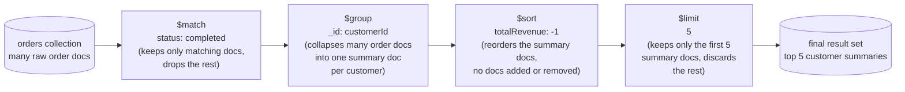

# Aggregation Pipeline Fundamentals

This is the chapter where this course's real subject begins. Chapter 4 gave you `find()` — the tool for retrieving documents and filtering them down with query operators like `$gt`, `$in`, or `$regex`. That covers a huge amount of ground: "give me the documents that match this condition." But `find()` has a hard ceiling. It cannot reshape a document into a different shape. It cannot compute a new field from existing ones. It cannot collapse a thousand order documents into one summary row per customer. It cannot join across collections. `find()` answers "which documents?" — it has no vocabulary for "and now transform, group, and summarize them." That gap is exactly what the **aggregation framework** exists to fill, and it's the single most powerful feature MongoDB offers: a composable, stage-by-stage data-processing pipeline capable of everything from a simple reshaped projection to full analytical reporting that would otherwise require pulling data out into another system entirely. Four chapters of this course (7 through 10) are dedicated to it, because mastering it is the difference between using MongoDB as a document store and using it as the analytical engine it's designed to be.

---

## Learning Objectives

By the end of this chapter, you will be able to:

- Explain what the aggregation framework is, why it exists, and how it differs fundamentally from `find()`.
- Describe the pipeline mental model precisely: an ordered array of stages, where each stage transforms the *output* of the previous stage, not the original collection.
- Use `$match`, `$project`, `$sort`, `$limit`, `$skip`, and `$count` to filter, reshape, order, and paginate documents inside a pipeline.
- Use `$group` with its `_id` grouping key and the core accumulator operators (`$sum`, `$avg`, `$min`, `$max`, `$push`, `$addToSet`, `$first`, `$last`) to produce grouped summaries.
- Translate familiar SQL clauses (`WHERE`, `SELECT`, `GROUP BY`, `HAVING`, `ORDER BY`, `LIMIT`, `JOIN`) into their aggregation-pipeline equivalents.
- Decide, for a given problem, whether `find()` or `aggregate()` is the right tool.
- Recognize the first-order performance rule for pipelines — put `$match` and `$sort` as early as possible so they can use indexes — and know where the deeper treatment of this topic lives later in the course.

---

## Prerequisites for This Chapter

This chapter builds directly on two earlier chapters:

- **[Chapter 4: CRUD Fundamentals](./04-crud-fundamentals.md)** — you should be comfortable writing `find()` queries with filter documents, comparison/logical query operators, and projections. The aggregation pipeline's `$match` stage reuses the exact same query-operator syntax you already know from `find()`.
- **[Chapter 6: Indexes Fundamentals](./06-indexes-fundamentals.md)** — you should understand what an index is and why one speeds up a query. Aggregation pipeline performance depends heavily on whether early stages can use an index, a theme introduced briefly here and developed fully in Chapters 8, 10, and 14.

If either of those feels shaky, it's worth a quick review before continuing — this chapter assumes both as settled ground.

---

## 1. What the Aggregation Framework Is, and Why It Exists

### 1.1 The gap `find()` leaves open

Recall from Chapter 4 that `find()` takes a filter document and returns the documents matching it, optionally reshaped by a *projection* that includes or excludes top-level fields. That's genuinely useful, but consider a question like: **"What is the total revenue and number of orders for each customer?"** There is no filter document that answers this. `find()` returns documents as they exist in the collection (or a trimmed version of them) — it cannot combine ten separate order documents belonging to the same customer into one summary document with a computed total. Answering that question with `find()` alone would mean pulling every order document into your application and doing the grouping and math yourself, in your own code, after the fact.

The aggregation framework moves that work into the database, next to the data, where it can be done efficiently and expressed declaratively.

### 1.2 The Unix-pipe analogy

The clearest way to understand the aggregation framework is one you likely already know from the command line. In a Unix shell, you chain small, single-purpose commands together with the pipe operator:

```bash
cat access.log | grep "ERROR" | sort | uniq -c | sort -rn | head -5
```

Each command in that chain does one focused thing, and passes its *output* to the next command as *input*. `grep` doesn't know or care that its input came from `cat`. `sort` doesn't know or care what `grep` did. Each stage is simple and composable in isolation, but chained together they answer a fairly sophisticated question: "what are the 5 most frequent error lines in this log file?"

MongoDB's aggregation pipeline works on exactly this principle, applied to documents instead of lines of text:

```js
db.orders.aggregate([
  { $match: { status: "completed" } },
  { $group: { _id: "$customerId", totalRevenue: { $sum: "$orderTotal" } } },
  { $sort: { totalRevenue: -1 } },
  { $limit: 5 }
])
```

Read that the same way you'd read the shell pipeline: start with all orders, keep only the completed ones, collapse them into one summary document per customer, sort those summaries by revenue descending, and keep the top 5. Each `{ ... }` object in the array is a **stage**. Each stage consumes a stream of documents and produces a (typically different) stream of documents. Stages are combined in an ordered array — the second argument to `.aggregate()` — and MongoDB executes them, conceptually, one after another, left to right, exactly like a left-to-right chain of piped shell commands.

### 1.3 A pipeline is not "one big query" — it's a sequence of small transformations

This is worth stating plainly because it's the single biggest conceptual shift from `find()`: with `find()`, you write one filter and get one answer back in one step. With `aggregate()`, you are describing a *sequence of transformations*, and the final result is whatever comes out the far end of the last stage. Nothing about any individual stage is exotic — `$match` is just filtering, `$sort` is just ordering, `$group` is just grouping — the power comes entirely from *composing* simple stages into an arbitrarily sophisticated data-processing job, without ever leaving the database.

---

## 2. The Pipeline Mental Model, in Depth

Three rules govern every aggregation pipeline you will ever write. Internalize these before moving to individual stages, because misunderstanding any one of them is the source of nearly every beginner mistake with `$group`, `$project`, or `$match` used together.

### 2.1 Rule 1 — Order matters

A pipeline is an **array**, and arrays have order. `[ { $sort: ... }, { $limit: 5 } ]` (sort, then take the top 5) is completely different from `[ { $limit: 5 }, { $sort: ... } ]` (take an arbitrary 5, then sort just those 5). MongoDB does not "figure out" a smarter order for you the way a SQL query planner sometimes reorders relational-algebra operations internally — the stages run in the sequence you wrote them, full stop. Every decision about *where* to place a stage in the array is a decision you are making about the shape of the intermediate data at that point in the pipeline.

### 2.2 Rule 2 — Each stage operates on the OUTPUT of the previous stage, not the original collection

This is the rule beginners trip over most. After the first stage runs, the *original collection is no longer directly visible* to the rest of the pipeline. Every stage after the first only ever sees whatever the immediately preceding stage produced. Concretely:

```js
db.orders.aggregate([
  { $match: { status: "completed" } },   // sees the orders collection
  { $group: { _id: "$customerId", n: { $sum: 1 } } }, // sees ONLY completed orders
  { $match: { n: { $gt: 3 } } }          // sees ONLY the grouped {_id, n} documents —
                                          // it can no longer see `status`, `items`, or `orderDate` at all!
])
```

By the time the third stage runs, the documents flowing through the pipeline no longer look anything like the original `orders` documents — they're `{ _id: "<customerId>", n: <count> }` documents, because that's what `$group` produced. If you tried to write `{ $match: { status: "completed" } }` as the *third* stage instead of the first, it would silently match nothing, because `status` doesn't exist on the grouped documents anymore. Always ask, at each stage, "given what the previous stage output, what does this stage receive as input?"

### 2.3 Rule 3 — Stages can repeat

There is no rule that says "you may use `$match` only once" or "`$sort` can only appear at the start." A pipeline can use the same stage type multiple times, wherever it's needed. You'll see this explicitly later in this chapter: one `$match` before `$group` (filtering raw documents — SQL's `WHERE`) and a second `$match` after `$group` (filtering the grouped summaries — SQL's `HAVING`). They're doing different jobs at different points in the stream, even though they're the same stage keyword.

### 2.4 Visualizing the stream of documents

Here is a four-stage pipeline over the `orders` collection, annotated with what happens to the document stream at each step:



Read this diagram the same way you read the Unix pipe: the shape and count of documents can change at every arrow. `$match` can shrink the stream (fewer documents, same shape). `$group` fundamentally reshapes and typically shrinks the stream (fewer documents, *different* shape — original fields are gone unless explicitly carried forward). `$sort` changes order only. `$limit` shrinks the stream by count, without touching shape.

### 2.5 The running example for this chapter

Every example in this chapter (and in Chapters 8, 9, and 10) uses the same `orders` collection, so the schema is worth memorizing now:

```js
{
  _id: ObjectId("64f1a2b3c4d5e6f7a8b9c0e1"),
  customerId: "CUST-1001",
  items: [
    { product: "Wireless Mouse", qty: 2, price: 799 },
    { product: "USB-C Cable",    qty: 1, price: 249 }
  ],
  status: "completed",        // "completed" | "pending" | "cancelled"
  orderDate: ISODate("2026-01-15T10:00:00Z")
}
```

Note that there is no `orderTotal` field stored directly — it has to be *computed* from `items`, which is exactly the kind of reshaping `find()` cannot do and the aggregation framework handles naturally.

---

## 3. `$match` — Filtering Documents

`$match` filters the document stream, keeping only documents that satisfy a query. If that description sounds identical to `find()`'s filter document, that's because it is — `$match` accepts exactly the same query operators (`$eq`, `$gt`, `$in`, `$and`, `$regex`, and everything else from Chapter 4).

```js
db.orders.aggregate([
  { $match: { status: "completed" } }
])
```

```js
db.orders.aggregate([
  { $match: {
      status: "completed",
      orderDate: { $gte: ISODate("2026-01-01") }
  } }
])
```

### 3.1 Why `$match` should come as early as possible

Two independent reasons make "put `$match` first, or as close to first as the logic allows" one of the most important habits in this entire course:

1. **Less data to process downstream.** Every stage after a `$match` only has to work on whatever documents survived the filter. A `$match` that eliminates 95% of a collection means every subsequent `$group`, `$sort`, or `$project` in the pipeline is operating on 5% of the data instead of 100% of it.
2. **Index usage.** When `$match` is the *first* stage in a pipeline, MongoDB's query planner can use an index on the matched fields exactly the way it would for an equivalent `find()` query — turning a full collection scan into an efficient index lookup. Once a `$match` appears *after* stages like `$group` or `$project` that reshape the documents, that opportunity is gone: there is no longer an index on the reshaped, synthetic documents flowing through the pipeline. This is a preview of a theme this course returns to repeatedly (Chapters 8, 10, and especially 14) — for now, the rule of thumb is simply: **filter early, filter with indexed fields when you can.**

---

## 4. `$project` — Reshaping Documents

`$project` controls exactly which fields appear in the output documents, and lets you compute new fields on the fly. Where `find()`'s projection argument can only include or exclude existing top-level fields, `$project` inside a pipeline is a full reshaping tool.

### 4.1 Including and excluding fields

```js
db.orders.aggregate([
  { $project: { customerId: 1, status: 1, orderDate: 1, _id: 0 } }
])
```

Same rule as `find()` projections: `1` means include, `0` means exclude, and (with the single exception of `_id`, which is included by default and must be explicitly excluded) you cannot mix inclusion and exclusion of other fields in the same `$project`.

### 4.2 Computed fields

This is where `$project` goes beyond what `find()` can do — a field's value can be an *expression*, computed from other fields on the same document:

```js
db.orders.aggregate([
  {
    $project: {
      _id: 0,
      customerId: 1,
      itemCount: { $size: "$items" },
      orderTotal: {
        $sum: {
          $map: {
            input: "$items",
            as: "it",
            in: { $multiply: ["$$it.qty", "$$it.price"] }
          }
        }
      }
    }
  }
])
```

```js
// Sample output
{ customerId: "CUST-1001", itemCount: 2, orderTotal: 1847 }
```

Don't worry about fully parsing `$map`/`$multiply` yet — the complete expression-operator language (arithmetic, string, array, date, conditional) is the entire subject of Chapter 9. For now, the key takeaway is simply that `$project` can *compute* a field's value from an expression, not just copy or drop existing fields.

### 4.3 Renaming fields

There's no dedicated "rename" keyword — you rename by projecting the old field's value into a new field name and excluding the old one:

```js
db.orders.aggregate([
  { $project: { _id: 0, customer: "$customerId", placedOn: "$orderDate" } }
])
```

`"$customerId"` (a string starting with `$`) is a **field-path expression** — it means "the value of the `customerId` field on the current document," as opposed to the literal string `"customerId"`. This `$fieldName` syntax is used everywhere in aggregation expressions, not just `$project` — you'll see it constantly from here on.

---

## 5. `$sort`, `$limit`, and `$skip` — Ordering and Paging

These three stages work exactly the way they sound, and exactly the way their `find().sort()/.limit()/.skip()` cursor-method counterparts from Chapter 4 work — except here they're pipeline stages that can appear anywhere the logic calls for them, including more than once.

```js
db.orders.aggregate([
  { $match: { status: "completed" } },
  { $sort: { orderDate: -1 } },   // -1 = descending, 1 = ascending
  { $skip: 20 },
  { $limit: 10 }
])
```

That pipeline returns "page 3" of completed orders (skip the first 20, then take the next 10), newest first. Order among these three matters just as much as anywhere else in a pipeline: `$sort` before `$skip`/`$limit` means "sort everything, then page through the sorted result" (almost always what you want); reversing them would page through an *unsorted* stream and then sort only the page, which is rarely the intended behavior.

A performance note that previews Section 9: when `$sort` is the *first* stage in a pipeline (or immediately follows a `$match` that used an index), MongoDB can potentially use an index to satisfy the sort without scanning and sorting the entire result set in memory. A `$sort` placed after a `$group` or `$project` has no index to lean on — it always has to sort whatever the pipeline handed it.

---

## 6. `$count` — Counting Documents at a Stage

`$count` collapses the entire current document stream into a single document reporting how many documents reached that point in the pipeline:

```js
db.orders.aggregate([
  { $match: { status: "completed" } },
  { $count: "completedOrderCount" }
])
```

```js
// Output
{ completedOrderCount: 47 }
```

The string you give `$count` (`"completedOrderCount"` above) becomes the field name in the single output document — it's purely a naming choice, not a special keyword. `$count` is exactly equivalent to `{ $group: { _id: null, completedOrderCount: { $sum: 1 } } }` followed by dropping the `_id` field — it exists as a stage in its own right simply because "how many documents matched?" is common enough to deserve a one-line shorthand.

---

## 7. `$group` — Grouping and Aggregating, in Depth

`$group` is the workhorse of the aggregation framework, and the stage most people mean when they say "I need to run an aggregation." It collapses many input documents into fewer output documents, grouped by a key you specify, while computing summary values (accumulators) over each group.

### 7.1 The `_id` field defines the grouping key

Every `$group` stage requires an `_id` field, and its value is the expression that defines how documents are bucketed together. This is the single most important thing to understand about `$group`: **whatever expression you put as `_id` is the grouping key** — every input document that produces the same value for that expression ends up in the same output group.

**Grouping by a single field:**

```js
db.orders.aggregate([
  { $group: { _id: "$customerId" } }
])
```

This produces one output document per distinct `customerId` value: `{ _id: "CUST-1001" }`, `{ _id: "CUST-1002" }`, and so on — one row per group, with nothing computed yet beyond the grouping key itself.

**Grouping by `null` — collapsing everything into one group:**

```js
db.orders.aggregate([
  { $match: { status: "completed" } },
  { $group: { _id: null, totalRevenue: { $sum: "$orderTotal" } } }
])
```

`_id: null` means "treat every input document as belonging to a single group" — there is no grouping key at all, just one summary document for the entire input stream. This is how you compute a single grand-total figure ("total revenue across all completed orders") rather than a per-customer breakdown.

**Grouping by a computed or compound key:**

The `_id` expression doesn't have to be a bare field reference — it can be any expression, including an entire embedded document, which lets you group by more than one field at once:

```js
db.orders.aggregate([
  {
    $group: {
      _id: { customer: "$customerId", status: "$status" },
      orderCount: { $sum: 1 }
    }
  }
])
```

```js
// Sample output
{ _id: { customer: "CUST-1001", status: "completed" }, orderCount: 4 }
{ _id: { customer: "CUST-1001", status: "cancelled" }, orderCount: 1 }
{ _id: { customer: "CUST-1002", status: "completed" }, orderCount: 2 }
```

Each distinct *combination* of `customerId` and `status` becomes its own group — this is the direct equivalent of SQL's `GROUP BY customer_id, status`. You can also group by a computed value, such as the year and month extracted from `orderDate`, to produce monthly summaries (the full date-expression toolkit for this arrives in Chapter 9).

### 7.2 The accumulator operators

Every field in `$group` other than `_id` must be an **accumulator expression** — an operator that reduces a group of documents down to a single value. Here is the complete core set:

| Accumulator | What it computes | Example |
|---|---|---|
| `$sum` | Sum of a numeric expression across the group (or a count, via `$sum: 1`) | `{ totalRevenue: { $sum: "$orderTotal" } }` |
| `$avg` | Average of a numeric expression across the group | `{ avgOrderValue: { $avg: "$orderTotal" } }` |
| `$min` | Smallest value across the group | `{ firstOrderDate: { $min: "$orderDate" } }` |
| `$max` | Largest value across the group | `{ lastOrderDate: { $max: "$orderDate" } }` |
| `$push` | Appends every value into an array — duplicates kept | `{ allStatuses: { $push: "$status" } }` |
| `$addToSet` | Appends every *distinct* value into an array — duplicates removed | `{ distinctStatuses: { $addToSet: "$status" } }` |
| `$first` | The value from the *first* document in the group, given the current document order | `{ earliestStatus: { $first: "$status" } }` |
| `$last` | The value from the *last* document in the group, given the current document order | `{ latestStatus: { $last: "$status" } }` |

Two things about this table are easy to miss and worth calling out explicitly:

- **`$sum: 1` is how you count documents per group.** There's no dedicated "count per group" accumulator — instead you sum the literal `1` once for every document, which is exactly a count. `{ $group: { _id: "$customerId", orderCount: { $sum: 1 } } }` reads naturally once you see it once.
- **`$first` and `$last` depend on document order, which depends on a `$sort` stage *before* the `$group`.** `$group` itself does not guarantee any particular order among the documents entering a group unless you've explicitly sorted them first. If you want "the customer's earliest order status," you must `$sort: { orderDate: 1 }` immediately before the `$group` — otherwise "first" is whatever order the documents happened to arrive in, which is not guaranteed to be meaningful.

### 7.3 Worked example: total revenue and order count per customer

This is the pipeline you'll come back to conceptually for the rest of the chapter — it's the canonical `$group` example, and it combines a computed field (Section 4.2's `orderTotal`), a `$match` filter, and three accumulators in one pipeline:

```js
db.orders.aggregate([
  // 1. Only consider completed orders
  { $match: { status: "completed" } },

  // 2. Compute each order's total from its line items
  {
    $addFields: {
      orderTotal: {
        $sum: {
          $map: {
            input: "$items",
            as: "it",
            in: { $multiply: ["$$it.qty", "$$it.price"] }
          }
        }
      }
    }
  },

  // 3. Group by customer, summarizing revenue and order count
  {
    $group: {
      _id: "$customerId",
      totalRevenue: { $sum: "$orderTotal" },
      orderCount:   { $sum: 1 },
      avgOrderValue: { $avg: "$orderTotal" },
      firstOrderDate: { $min: "$orderDate" },
      lastOrderDate:  { $max: "$orderDate" }
    }
  },

  // 4. Highest-revenue customers first
  { $sort: { totalRevenue: -1 } }
])
```

```js
// Sample output
{
  _id: "CUST-1001",
  totalRevenue: 4267,
  orderCount: 3,
  avgOrderValue: 1422.33,
  firstOrderDate: ISODate("2026-01-15T10:00:00Z"),
  lastOrderDate:  ISODate("2026-03-11T09:30:00Z")
}
{
  _id: "CUST-1002",
  totalRevenue: 600,
  orderCount: 1,
  avgOrderValue: 600,
  firstOrderDate: ISODate("2026-01-20T14:00:00Z"),
  lastOrderDate:  ISODate("2026-01-20T14:00:00Z")
}
```

`$addFields` (used in step 2) adds new computed fields while keeping every existing field intact — unlike `$project`, which requires you to explicitly list everything you want to keep. It's the right tool when you want to *add* a field without rewriting the whole document shape, and you'll use it constantly alongside `$group`.

---

## 8. SQL to Aggregation Pipeline: A Direct Comparison

If you know SQL, the aggregation pipeline will click faster if you map each familiar clause onto its pipeline equivalent directly.

| SQL clause | Aggregation stage | Notes |
|---|---|---|
| `WHERE` | `$match` (before `$group`) | Filters raw rows/documents before any grouping |
| `SELECT` | `$project` (or `$addFields`) | Chooses/computes/renames output columns/fields |
| `GROUP BY` | `$group` | The `_id` expression is the grouping key |
| `HAVING` | `$match` (after `$group`) | Filters *grouped* results — same stage as `WHERE`, different position in the pipeline |
| `ORDER BY` | `$sort` | Direction: `1` ascending, `-1` descending |
| `LIMIT` | `$limit` | Identical concept |
| `OFFSET` | `$skip` | Identical concept |
| `JOIN` | `$lookup` | Previewed here, covered in full in [Chapter 8](./08-aggregation-stages-deep-dive.md) |

The `HAVING` row deserves emphasis because it's exactly Section 2.3's "stages can repeat" rule in action: `WHERE` and `HAVING` are two different SQL clauses because relational engines distinguish "filter before aggregation" from "filter after aggregation." MongoDB doesn't need two different keywords — it just uses `$match` twice, once before `$group` and once after, and *position in the array* is what tells them apart.

### 8.1 One query, two languages, side by side

**The question:** "For each customer with more than one completed order, show their total revenue, ordered highest first, top 5 only."

**As SQL** (assuming a relational schema with an `orders` table and an `order_total` column already computed):

```sql
SELECT customer_id, SUM(order_total) AS total_revenue
FROM orders
WHERE status = 'completed'
GROUP BY customer_id
HAVING COUNT(*) > 1
ORDER BY total_revenue DESC
LIMIT 5;
```

**As an aggregation pipeline:**

```js
db.orders.aggregate([
  { $match: { status: "completed" } },                       // WHERE
  {
    $addFields: {
      orderTotal: {
        $sum: {
          $map: { input: "$items", as: "it", in: { $multiply: ["$$it.qty", "$$it.price"] } }
        }
      }
    }
  },
  {
    $group: {                                                 // GROUP BY + SELECT SUM(...)
      _id: "$customerId",
      totalRevenue: { $sum: "$orderTotal" },
      orderCount:   { $sum: 1 }
    }
  },
  { $match: { orderCount: { $gt: 1 } } },                     // HAVING
  { $sort: { totalRevenue: -1 } },                            // ORDER BY
  { $limit: 5 }                                               // LIMIT
])
```

Line up the two blocks and every clause has a direct, one-to-one counterpart — that mapping holds for the overwhelming majority of reporting-style queries you'll write in either language.

---

## 9. `aggregate()` vs. `find()`: A Decision Guide

Both are read operations, and both accept query-operator syntax for filtering, but they solve different problems. Use this as a quick decision guide:

**Reach for `find()` when:**
- You need documents largely as they're stored, with at most a flat include/exclude projection.
- Your filter is a single query document — no grouping, no cross-document computation, no reshaping.
- You want the simplest, most directly indexable, most cache-friendly form of a read.

**Reach for `aggregate()` when:**
- You need to **group** documents and compute summaries (totals, averages, counts) across groups.
- You need to **reshape** documents — compute new fields from existing ones, rename fields, restructure arrays.
- You need to **join** data from another collection (`$lookup`, Chapter 8).
- You need multiple, sequential transformation steps that a single `find()` filter/projection cannot express.
- You're building anything that would be a `GROUP BY`, multi-table `JOIN`, or windowed report in SQL.

A useful heuristic: if the question you're answering starts with "for each X, what's the total/average/count of Y," it's an aggregation question, not a `find()` question — the moment you need a summary *across* documents rather than a filtered *list* of documents, `find()` is the wrong tool.

---

## 10. A First Look at Pipeline Performance

This chapter is not the deep performance chapter — that role belongs to Chapter 14, with Chapters 8 and 10 adding aggregation-specific performance patterns along the way (memory limits, `allowDiskUse`, reading `explain()` output for a multi-stage pipeline). But one rule is important enough to introduce now, because it shapes how you should be writing pipelines from your very first one:

> **Put `$match` and `$sort` as early in the pipeline as the logic allows.**

The reasoning connects directly back to Section 3.1 and to what you learned about indexes in Chapter 6: an index can only help a stage that is filtering or sorting *the original collection's documents*, using *the original collection's fields*. The instant a `$group` or `$project` reshapes the stream, any index on the original collection becomes irrelevant to everything downstream — there's nothing left for it to index. So:

- A `$match` as the very first stage can use an index on the matched field(s), exactly like an equivalent `find()` would.
- A `$sort` immediately following an index-eligible `$match` (or as the very first stage itself) may also be satisfiable via an index, avoiding an expensive in-memory sort.
- A `$match` placed after `$group`/`$project`/`$unwind` cannot use any collection index — it's filtering synthetic, reshaped documents that no index was ever built for.

None of this means "never `$match` after `$group`" — the `HAVING`-equivalent `$match` in Section 8.1 is completely correct and necessary, because you're filtering on a value (`orderCount`) that didn't exist before the grouping happened. The rule is specifically about *filtering conditions you could have applied before grouping* — those belong before `$group`, both for correctness of intent and for performance.

---

## Real-World Scenario

**The request:** Your product manager asks for a "top 5 customers by revenue in the last 30 days" widget for an internal sales dashboard, refreshed on every page load.

**Building it with exactly the stages from this chapter:**

```js
const thirtyDaysAgo = new Date();
thirtyDaysAgo.setDate(thirtyDaysAgo.getDate() - 30);

db.orders.aggregate([
  // Step 1: $match, first and using indexed fields — filters BEFORE any
  // reshaping, and (assuming a compound index on { status: 1, orderDate: 1 })
  // can use an index instead of scanning every order ever placed.
  {
    $match: {
      status: "completed",
      orderDate: { $gte: thirtyDaysAgo }
    }
  },

  // Step 2: compute each order's total (needed before we can sum revenue)
  {
    $addFields: {
      orderTotal: {
        $sum: {
          $map: { input: "$items", as: "it", in: { $multiply: ["$$it.qty", "$$it.price"] } }
        }
      }
    }
  },

  // Step 3: $group — collapse orders into one summary document per customer
  {
    $group: {
      _id: "$customerId",
      totalRevenue: { $sum: "$orderTotal" },
      orderCount:   { $sum: 1 }
    }
  },

  // Step 4: $sort — highest revenue first
  { $sort: { totalRevenue: -1 } },

  // Step 5: $limit — only the top 5 for the widget
  { $limit: 5 },

  // Step 6: $project — reshape into exactly the fields the dashboard needs
  {
    $project: {
      _id: 0,
      customerId: "$_id",
      totalRevenue: 1,
      orderCount: 1
    }
  }
])
```

Walking through why each stage sits where it does:

- `$match` is first, so it can use an index and immediately discard orders outside the 30-day window and non-completed orders — the smallest possible input reaches every later stage.
- The revenue computation happens right after filtering, on the already-reduced set of documents, rather than on the whole collection.
- `$group` does the heavy lifting: one document per customer, with the two numbers the widget actually needs.
- `$sort` then `$limit` — in that order — because sorting first guarantees the "top 5" are genuinely the top 5 by revenue, not five arbitrary customers.
- `$project` is last, purely cosmetic: it renames `_id` back to `customerId` so the dashboard's front-end code doesn't have to know about MongoDB's grouping convention.

This single pipeline — six stages, every one of them covered in this chapter — is a complete, production-shaped answer to a real reporting request. That's the whole point of the aggregation framework: composable simplicity that adds up to genuine analytical power.

---

## Best Practices

- **Filter first.** Place `$match` as early as possible, and prefer conditions on indexed fields, so the earliest stages can benefit from an index instead of scanning the whole collection.
- **Sort before you limit, not after.** `$sort` then `$limit`, always in that order, unless you have a specific reason to page through an unsorted stream (you almost never do).
- **Reshape last, filter first.** Do `$match`/`$sort` before `$group`/`$project` whenever the filtering logic doesn't depend on the grouped result — reshaping destroys index eligibility for everything downstream.
- **Remember `$group`'s `_id` is just an expression.** It can be a field, `null`, or a whole computed/compound document — choose whichever shape matches the question you're answering ("per customer," "overall," "per customer per month").
- **Use `$sum: 1` for counts, and sort before relying on `$first`/`$last`.** Both are easy to get subtly wrong without remembering these two specific rules.
- **Prototype pipelines stage by stage.** Comment out everything after stage *N* and run the pipeline to inspect the intermediate output — since each stage only sees the previous stage's output, seeing that output directly is the fastest way to debug a pipeline that isn't doing what you expect.
- **Reach for `aggregate()` only when `find()` genuinely can't express the question** — grouping, joining, or multi-step reshaping are the signal; a single filter and flat projection should usually stay a `find()`.

---

## Common Mistakes

- **Forgetting that later stages can't see the original document.** Trying to `$match` on a field like `status` *after* a `$group` has already collapsed it away is a frequent source of "why does this return nothing?" bugs — the field simply doesn't exist on the grouped documents anymore.
- **Putting `$match` at the end "because it's a filter."** A `$match` placed late in the pipeline still works correctly, but it forces every earlier stage to process documents that will just get thrown away, and it loses any chance of using an index.
- **Confusing `$match` before `$group` with `$match` after `$group`.** They look identical syntactically but do fundamentally different jobs — `WHERE` vs. `HAVING`. Filtering on a field that only exists *after* grouping (like an accumulator's output) must come after `$group`; filtering on a raw document field should come before.
- **Using `$push` where `$addToSet` was intended, or vice versa.** `$push` keeps every value including duplicates; `$addToSet` deduplicates. Reaching for the wrong one silently produces an array with the wrong contents (duplicates you didn't want, or missing repeats you actually needed to count).
- **Relying on `$first`/`$last` without a preceding `$sort`.** Without an explicit `$sort` immediately before `$group`, "first" and "last" are not guaranteed to mean anything meaningful — they reflect whatever order the documents happened to arrive in.
- **Treating `aggregate()` as always slower or always "the advanced tool to avoid."** A well-formed pipeline with an early, indexed `$match` is often just as fast as an equivalent `find()` — the framework isn't inherently heavyweight, and avoiding it in favor of pulling all documents into application code to do the grouping there is almost always worse.
- **Building overly long pipelines without checking intermediate output.** A 10-stage pipeline that doesn't behave as expected is much easier to debug one stage at a time (Best Practices, above) than by staring at the whole thing looking for the bug.

---

## Summary

- `find()` filters and retrieves; it cannot reshape, group, or summarize. The **aggregation framework** exists to fill exactly that gap.
- A pipeline is an ordered array of **stages**, each one transforming a stream of documents, directly analogous to chaining commands with a Unix pipe (`cmd1 | cmd2 | cmd3`).
- **Order matters**, and each stage sees only the **output of the previous stage** — never the original collection directly, past the first stage. Stages can repeat.
- `$match` filters (reuses `find()`'s query operators); putting it early enables index use and shrinks the work for every later stage.
- `$project` reshapes documents: include/exclude fields, compute new fields with expressions, and rename via `newName: "$oldName"`.
- `$sort`, `$limit`, and `$skip` order and page a pipeline's results, and should be used in that order (sort, then skip/limit).
- `$count` collapses the stream into a single document reporting how many documents reached that stage.
- `$group`'s `_id` defines the grouping key (a field, `null` for one overall group, or a compound/computed expression), paired with accumulators: `$sum`, `$avg`, `$min`, `$max`, `$push`, `$addToSet`, `$first`, `$last`.
- SQL maps cleanly onto pipeline stages: `WHERE`→`$match`, `SELECT`→`$project`, `GROUP BY`→`$group`, `HAVING`→a second `$match` after `$group`, `ORDER BY`→`$sort`, `LIMIT`→`$limit`, `JOIN`→`$lookup` (Chapter 8).
- Choose `aggregate()` over `find()` whenever the question requires grouping, joining, or multi-step reshaping rather than a filtered list of documents.
- Pipeline performance starts with one rule: **`$match`/`$sort` as early as possible**, so they can use indexes — the full performance story continues in Chapters 8, 10, and 14.

---

## Knowledge Check

1. Why can't `find()` answer a question like "total revenue per customer," even with a well-chosen projection?
2. A pipeline has `$group` as its first stage and a `$match` on `status` as its second stage. Explain precisely why this `$match` will not behave as the author probably intended.
3. What is the difference between `$push` and `$addToSet` as `$group` accumulators, and when would you deliberately choose one over the other?
4. Write the aggregation-pipeline equivalent, stage by stage, of this SQL query: `SELECT status, COUNT(*) AS cnt FROM orders GROUP BY status HAVING COUNT(*) > 10 ORDER BY cnt DESC;`
5. Why does placing `$sort` before `$limit` matter, and what would go wrong if they were reversed?
6. Give one concrete scenario where `find()` is clearly the right tool and one where `aggregate()` is clearly the right tool, and justify each choice.

---

## Hands-On Exercise

Work through this in `mongosh`, using the same `orders` schema from this chapter.

**1. Seed the collection:**

```js
db.orders.insertMany([
  { customerId: "CUST-1001", items: [{ product: "Wireless Mouse", qty: 2, price: 799 }, { product: "USB-C Cable", qty: 1, price: 249 }], status: "completed", orderDate: ISODate("2026-06-02T10:00:00Z") },
  { customerId: "CUST-1001", items: [{ product: "Keyboard", qty: 1, price: 2499 }], status: "completed", orderDate: ISODate("2026-06-18T09:30:00Z") },
  { customerId: "CUST-1001", items: [{ product: "Monitor Stand", qty: 1, price: 1200 }], status: "cancelled", orderDate: ISODate("2026-06-20T11:00:00Z") },
  { customerId: "CUST-1002", items: [{ product: "USB-C Cable", qty: 3, price: 249 }], status: "completed", orderDate: ISODate("2026-05-10T14:00:00Z") },
  { customerId: "CUST-1002", items: [{ product: "Webcam", qty: 1, price: 3499 }], status: "completed", orderDate: ISODate("2026-06-25T16:20:00Z") },
  { customerId: "CUST-1003", items: [{ product: "Wireless Mouse", qty: 1, price: 799 }], status: "pending", orderDate: ISODate("2026-06-28T08:00:00Z") },
  { customerId: "CUST-1003", items: [{ product: "Keyboard", qty: 2, price: 2499 }, { product: "Mousepad", qty: 1, price: 199 }], status: "completed", orderDate: ISODate("2026-06-29T13:45:00Z") }
])
```

**2. Write a pipeline computing total revenue per customer, sorted descending:**

```js
db.orders.aggregate([
  { $match: { status: "completed" } },
  {
    $addFields: {
      orderTotal: {
        $sum: { $map: { input: "$items", as: "it", in: { $multiply: ["$$it.qty", "$$it.price"] } } }
      }
    }
  },
  { $group: { _id: "$customerId", totalRevenue: { $sum: "$orderTotal" }, orderCount: { $sum: 1 } } },
  { $sort: { totalRevenue: -1 } }
])
```

Confirm `CUST-1001` and `CUST-1002` both appear with correct totals, and that `CUST-1003`'s pending order is excluded (only its one completed order should count).

**3. Extend it with a `$match` filtering to a date range** (e.g., only orders from June 2026):

```js
db.orders.aggregate([
  {
    $match: {
      status: "completed",
      orderDate: { $gte: ISODate("2026-06-01T00:00:00Z"), $lt: ISODate("2026-07-01T00:00:00Z") }
    }
  },
  {
    $addFields: {
      orderTotal: {
        $sum: { $map: { input: "$items", as: "it", in: { $multiply: ["$$it.qty", "$$it.price"] } } }
      }
    }
  },
  { $group: { _id: "$customerId", totalRevenue: { $sum: "$orderTotal" }, orderCount: { $sum: 1 } } },
  { $sort: { totalRevenue: -1 } }
])
```

Verify `CUST-1002`'s May order is now excluded from its total, changing the numbers from step 2.

**4. Add a second `$match` after `$group`** to keep only customers with more than one completed order in that window (the `HAVING` equivalent):

```js
db.orders.aggregate([
  {
    $match: {
      status: "completed",
      orderDate: { $gte: ISODate("2026-06-01T00:00:00Z"), $lt: ISODate("2026-07-01T00:00:00Z") }
    }
  },
  {
    $addFields: {
      orderTotal: {
        $sum: { $map: { input: "$items", as: "it", in: { $multiply: ["$$it.qty", "$$it.price"] } } }
      }
    }
  },
  { $group: { _id: "$customerId", totalRevenue: { $sum: "$orderTotal" }, orderCount: { $sum: 1 } } },
  { $match: { orderCount: { $gt: 1 } } },
  { $sort: { totalRevenue: -1 } }
])
```

Confirm only `CUST-1001` (two completed June orders) survives this final `$match`, while `CUST-1002` and `CUST-1003` (one completed June order each) are filtered out — and note that this `$match` could only be written *after* `$group`, since `orderCount` doesn't exist until the grouping stage produces it.

---

## Further Reading

- [Aggregation Pipeline (Official Manual)](https://www.mongodb.com/docs/manual/core/aggregation-pipeline/) — the conceptual overview this chapter is grounded in.
- [Aggregation Pipeline Stages Reference](https://www.mongodb.com/docs/manual/reference/operator/aggregation-pipeline/) — the full, authoritative list of every stage, including ones covered in later chapters.
- [`$group` (Reference)](https://www.mongodb.com/docs/manual/reference/operator/aggregation/group/) — complete accumulator list and edge-case behavior.
- [`$match` (Reference)](https://www.mongodb.com/docs/manual/reference/operator/aggregation/match/) — including notes on index usage and combining with `$text`.
- [Aggregation Pipeline Optimization](https://www.mongodb.com/docs/manual/core/aggregation-pipeline-optimization/) — a preview of the performance material developed further in Chapters 8, 10, and 14.

---

<div style="display:flex;justify-content:space-between;align-items:center;">
  <a href="./06-indexes-fundamentals.md">← Previous: Indexes Fundamentals</a>
  <a href="./00-index.md">🏠 Index</a>
  <a href="./08-aggregation-stages-deep-dive.md">Next: Aggregation Stages Deep Dive →</a>
</div>
