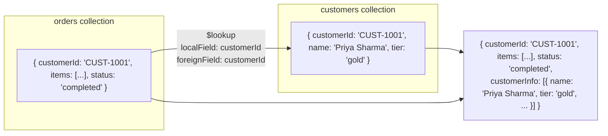
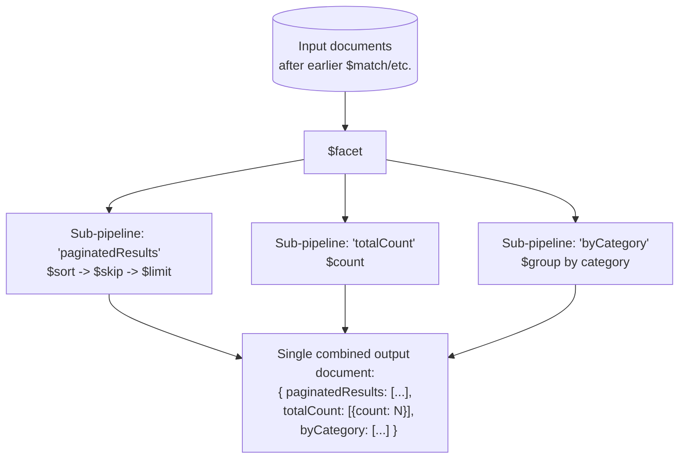

# Aggregation Stages Deep Dive

Chapter 7 gave you the pipeline mental model and the stages that filter, reshape, order, and group a single stream of documents: `$match`, `$project`, `$sort`, `$limit`, `$skip`, `$count`, and `$group`. Those seven stages alone cover an enormous fraction of real reporting work, but they all share one limitation — every one of them operates on documents that were already sitting in a single collection, in a single shape. Real systems don't work that way. Orders need customer names. Product catalogs need category trees. Dashboards need three unrelated summaries side by side on one screen. Reports need to bucket continuous values into ranges, sample a collection at random, or materialize a computed result back into a real collection so other queries can read it cheaply. This chapter is about the stages that make the aggregation framework a genuine data-processing platform rather than just a smarter `find()`: stages that **join** across collections, **branch** a document stream into independent parallel computations, **reshape** documents more radically than `$project` can, and **materialize** pipeline output as a new collection. By the end of this chapter you'll be able to write pipelines that would otherwise require multiple round trips to your application code — or a completely different database — to accomplish.

---

## Learning Objectives

By the end of this chapter, you will be able to:

- Join two collections with `$lookup`, using both the simple equality form (`localField`/`foreignField`) and the advanced correlated sub-pipeline form (`let`/`pipeline`).
- Deconstruct array fields with `$unwind`, including its options for preserving empty arrays and tracking original array position, and combine it with `$group` to aggregate across array elements.
- Choose correctly between `$addFields`/`$set` and `$project` when adding or reshaping fields.
- Replace a document's top-level shape entirely with `$replaceRoot`/`$replaceWith`.
- Run multiple independent sub-pipelines over the same input and combine their results into one document with `$facet` — the standard pattern behind paginated search and dashboard endpoints.
- Group documents into ranges with `$bucket` and `$bucketAuto`, and build recursive tree/graph traversals with `$graphLookup`.
- Combine result sets from multiple collections with `$unionWith`, and understand the difference between `$out` (replace) and `$merge` (upsert/merge) for materializing pipeline results.
- Use `$sample` for random sampling and know that `$redact` exists for document-level field redaction.

---

## Prerequisites for This Chapter

This chapter builds directly on **[Chapter 7: Aggregation Pipeline Fundamentals](./07-aggregation-pipeline-fundamentals.md)**. Everything below assumes you are already comfortable with:

- The pipeline mental model — an ordered array of stages, each one operating only on the output of the previous stage (Chapter 7, Section 2).
- `$match` for filtering, and the habit of placing it as early as possible.
- `$project` for including/excluding/computing fields, and `$fieldName` path-expression syntax.
- `$group`, its `_id` grouping key, and the core accumulators (`$sum`, `$avg`, `$min`, `$max`, `$push`, `$addToSet`, `$first`, `$last`).
- `$sort`, `$limit`, and `$skip` for ordering and paging results.

If any of that feels shaky, revisit Chapter 7 before continuing — this chapter will move quickly past those basics to build on top of them.

We continue with the same `orders` collection from Chapter 7:

```js
{
  _id: ObjectId("64f1a2b3c4d5e6f7a8b9c0e1"),
  customerId: "CUST-1001",
  items: [
    { product: "Wireless Mouse", qty: 2, price: 799 },
    { product: "USB-C Cable",    qty: 1, price: 249 }
  ],
  status: "completed",        // "completed" | "pending" | "cancelled"
  orderDate: ISODate("2026-01-15T10:00:00Z")
}
```

This chapter introduces one new collection, `customers`, which several stages below use for joins:

```js
{
  _id: ObjectId("64f1a2b3c4d5e6f7a8b9c000"),
  customerId: "CUST-1001",
  name: "Priya Sharma",
  email: "priya@example.com",
  tier: "gold",              // "gold" | "silver" | "bronze"
  region: "APAC"
}
```

---

## 1. `$lookup` — Left Outer Joins Across Collections

Chapter 7's SQL comparison table flagged `JOIN` → `$lookup` and deferred the details here. This is that payoff.

MongoDB's document model favors embedding related data directly inside a document (Chapter 5), which is why joins are less central to everyday MongoDB queries than they are in a relational schema. But embedding isn't always right — `customers` and `orders` are a classic case for staying separate: a customer can have many orders, customer data changes independently of any single order, and you don't want to duplicate a customer's name and email into every one of their orders. `$lookup` is how you recombine data that's intentionally been kept in separate collections, for exactly the same reason a SQL `JOIN` exists.



### 1.1 The simple equality form

The most common shape of `$lookup` joins on equal values between two fields, exactly like an equi-join in SQL:

```js
db.orders.aggregate([
  { $match: { status: "completed" } },
  {
    $lookup: {
      from: "customers",          // the collection to join against
      localField: "customerId",   // field on the INPUT (orders) documents
      foreignField: "customerId", // field on the FROM (customers) documents
      as: "customerInfo"          // name of the new array field to add
    }
  }
])
```

```js
// Sample output
{
  _id: ObjectId("64f1a2b3c4d5e6f7a8b9c0e1"),
  customerId: "CUST-1001",
  items: [
    { product: "Wireless Mouse", qty: 2, price: 799 },
    { product: "USB-C Cable",    qty: 1, price: 249 }
  ],
  status: "completed",
  orderDate: ISODate("2026-01-15T10:00:00Z"),
  customerInfo: [
    { _id: ObjectId("..."), customerId: "CUST-1001", name: "Priya Sharma", email: "priya@example.com", tier: "gold", region: "APAC" }
  ]
}
```

Three things about this output are essential to internalize:

1. **`$lookup` always adds an array**, even when exactly one matching document exists. `customerInfo` is `[{ ... }]`, not `{ ... }` — this is the single most common source of "why is my field an array?" confusion after adding a `$lookup`.
2. **It is a *left outer* join.** Every input document from `orders` is kept in the output, whether or not a match was found in `customers`. If no `customers` document has a matching `customerId`, `customerInfo` is simply `[]` (an empty array) — the order document is not dropped.
3. **The join key comparison is exact equality**, evaluated between `localField`'s value on each input document and `foreignField`'s value on each document in the `from` collection.

### 1.2 Flattening the joined array with `$unwind`

Since `customerInfo` comes back as a single-element array in the common case, it's idiomatic to immediately follow `$lookup` with `$unwind` (covered fully in Section 2) to turn it back into a plain embedded object:

```js
db.orders.aggregate([
  { $match: { status: "completed" } },
  { $lookup: { from: "customers", localField: "customerId", foreignField: "customerId", as: "customerInfo" } },
  { $unwind: "$customerInfo" },
  {
    $project: {
      _id: 0,
      orderId: "$_id",
      customerName: "$customerInfo.name",
      tier: "$customerInfo.tier",
      status: 1,
      orderDate: 1
    }
  }
])
```

```js
// Sample output
{ orderId: ObjectId("64f1a2b3c4d5e6f7a8b9c0e1"), customerName: "Priya Sharma", tier: "gold", status: "completed", orderDate: ISODate("2026-01-15T10:00:00Z") }
```

This `$lookup` → `$unwind` → `$project` sequence is, by a wide margin, the most common join pattern you'll write in MongoDB. It's worth memorizing as a unit.

### 1.3 The advanced form: `let` and a correlated sub-pipeline

The equality form covers "join where field A equals field B," but real joins are often more sophisticated than that — "join, but only bring back the customer's *gold-tier* profile fields," or "join against orders that happened *before* this order," or a join condition that isn't simple equality at all. For that, `$lookup` accepts a `let` clause (defining variables from the input document) and a `pipeline` (a full sub-pipeline run against the `from` collection, with access to those variables):

```js
db.orders.aggregate([
  { $match: { status: "completed" } },
  {
    $lookup: {
      from: "customers",
      let: { custId: "$customerId" },
      pipeline: [
        {
          $match: {
            $expr: { $eq: ["$customerId", "$$custId"] }   // note the double-$ for a `let` variable
          }
        },
        { $project: { _id: 0, name: 1, tier: 1, email: 1 } }
      ],
      as: "customerInfo"
    }
  },
  { $unwind: "$customerInfo" }
])
```

```js
// Sample output
{
  _id: ObjectId("64f1a2b3c4d5e6f7a8b9c0e1"),
  customerId: "CUST-1001",
  items: [ /* ... */ ],
  status: "completed",
  orderDate: ISODate("2026-01-15T10:00:00Z"),
  customerInfo: { name: "Priya Sharma", tier: "gold", email: "priya@example.com" }
}
```

Two syntax points that trip people up the first time:

- **`let` variables are referenced with two dollar signs** (`$$custId`), not one — a single `$` always means "a field on the current document," while `$$` means "a variable defined outside the current document's own fields" (`let` variables, and the built-in system variables you'll meet in Chapter 9, like `$$ROOT` and `$$NOW`).
- **Inside the sub-pipeline, you cannot compare a field to a `let` variable with plain `{ field: value }` query syntax.** You must use `$expr` together with an expression operator like `$eq`, because `let`-variable comparison is an *expression*, not a static query filter.

The sub-pipeline form unlocks everything a query-operator equality join cannot express:

```js
// "For each customer, attach only their 3 most recent completed orders"
db.customers.aggregate([
  {
    $lookup: {
      from: "orders",
      let: { custId: "$customerId" },
      pipeline: [
        { $match: { $expr: { $and: [
          { $eq: ["$customerId", "$$custId"] },
          { $eq: ["$status", "completed"] }
        ] } } },
        { $sort: { orderDate: -1 } },
        { $limit: 3 },
        { $project: { _id: 0, orderDate: 1, items: 1 } }
      ],
      as: "recentOrders"
    }
  }
])
```

This is the pattern to reach for the moment a join needs filtering, sorting, limiting, or reshaping *on the joined-in side* — something the simple `localField`/`foreignField` form has no vocabulary for at all.

### 1.4 When to use which form

| Use the simple form when... | Use the `let`/`pipeline` form when... |
|---|---|
| The join is a plain equality on one field pair | You need a non-equality condition, or multiple conditions |
| You want every matching document, unfiltered | You need to filter, sort, or limit the *joined-in* side (e.g., "only the 3 most recent") |
| You don't need to reshape the joined documents before they're attached | You want to project the joined-in documents down to only the fields you need, before they're attached |
| Simplicity and readability matter more than the extra control | The join condition itself needs an expression (e.g., comparing a date range) |

---

## 2. `$unwind` — Deconstructing Arrays

Every `orders` document embeds an `items` array. That's the right modeling choice for storage and for reading a whole order at once (Chapter 5), but it's the *wrong* shape the moment you need to answer a question about individual items — "what's total revenue by product, across every order?" is a question about `items` entries, not about whole orders. `$unwind` bridges that gap: it takes an array field and outputs **one separate document per array element**, copying all the other fields from the parent document onto each one.

### 2.1 Basic usage

```js
db.orders.aggregate([
  { $match: { customerId: "CUST-1001" } },
  { $unwind: "$items" }
])
```

Input (one document):

```js
{
  _id: ObjectId("A"),
  customerId: "CUST-1001",
  items: [
    { product: "Wireless Mouse", qty: 2, price: 799 },
    { product: "USB-C Cable",    qty: 1, price: 249 }
  ],
  status: "completed"
}
```

Output (two documents — one per array element):

```js
{ _id: ObjectId("A"), customerId: "CUST-1001", items: { product: "Wireless Mouse", qty: 2, price: 799 }, status: "completed" }
{ _id: ObjectId("A"), customerId: "CUST-1001", items: { product: "USB-C Cable",    qty: 1, price: 249 }, status: "completed" }
```

Notice `items` stops being an array at all after `$unwind` — it becomes a single embedded object, one per output document, and every other field (`_id`, `customerId`, `status`) is duplicated across both output documents. A one-document input can turn into many output documents; this is the one stage in the whole framework (besides `$lookup`'s multiplying effect and `$graphLookup`) that can *increase* document count rather than only shrink or preserve it.

### 2.2 `preserveNullAndEmptyArrays`

By default, `$unwind` **drops** any document where the array field is missing, `null`, or an empty array — because there's nothing to unwind into. That's frequently *not* what you want in a reporting pipeline, where you'd rather keep those documents (with the field set to missing) than silently lose them:

```js
db.orders.aggregate([
  { $unwind: { path: "$items", preserveNullAndEmptyArrays: true } }
])
```

With `preserveNullAndEmptyArrays: true`, a document whose `items` is `[]`, missing, or `null` is passed through unchanged (with `items` remaining absent/null) instead of being dropped from the output entirely. Always ask "could this array legitimately be empty, and do I still care about that document?" before deciding whether you need this option — the default silent-drop behavior is a frequent source of "why did my order count go down?" bugs.

### 2.3 `includeArrayIndex`

Sometimes you need to know *where* in the original array each unwound element came from — useful for reconstructing order, or debugging:

```js
db.orders.aggregate([
  { $match: { customerId: "CUST-1001" } },
  { $unwind: { path: "$items", includeArrayIndex: "itemIndex" } }
])
```

```js
// Sample output
{ _id: ObjectId("A"), items: { product: "Wireless Mouse", qty: 2, price: 799 }, itemIndex: NumberLong(0) }
{ _id: ObjectId("A"), items: { product: "USB-C Cable",    qty: 1, price: 249 }, itemIndex: NumberLong(1) }
```

`itemIndex` is a new field name you choose — it holds the zero-based position each element occupied in the original array.

### 2.4 The canonical combination: `$unwind` + `$group` for revenue by product

This is the pattern that makes `$unwind` indispensable rather than a curiosity: unwind the array so each line item becomes its own document, then `$group` across *all orders* by product to get true item-level analytics — something no single `orders` document could ever answer on its own.

```js
db.orders.aggregate([
  { $match: { status: "completed" } },
  { $unwind: "$items" },
  {
    $group: {
      _id: "$items.product",
      totalRevenue: { $sum: { $multiply: ["$items.qty", "$items.price"] } },
      totalUnitsSold: { $sum: "$items.qty" },
      orderCount: { $sum: 1 }
    }
  },
  { $sort: { totalRevenue: -1 } }
])
```

```js
// Sample output
{ _id: "Wireless Mouse", totalRevenue: 1598, totalUnitsSold: 4, orderCount: 2 }
{ _id: "Keyboard",       totalRevenue: 2499, totalUnitsSold: 1, orderCount: 1 }
{ _id: "USB-C Cable",    totalRevenue: 747,  totalUnitsSold: 3, orderCount: 3 }
```

Read this the same way as any `$group`: after `$unwind`, each document in the stream represents one line item across the entire (filtered) collection, so grouping by `$items.product` collapses "every time this product appeared in any completed order" into one summary row — a report that's genuinely impossible to produce with `$group` alone, because `$group` has no way to reach *inside* an array to group by its elements without `$unwind` flattening it first.

---

## 3. `$addFields` / `$set` vs. `$project` — Choosing the Right Reshaping Tool

Chapter 7 introduced `$addFields` in passing (Section 7.3) to compute `orderTotal` without disturbing the rest of the document. It's time to make the distinction between `$addFields`/`$set` and `$project` explicit, because reaching for the wrong one is a common source of accidentally-dropped fields.

### 3.1 `$set` is an alias for `$addFields`

There is no behavioral difference between them — `$set` was added later as a more intuitive name (mirroring the update operator `$set` you'll use with `updateOne()`), and both stages do exactly the same thing: add new fields, or overwrite existing ones, **while leaving every other field in the document untouched.**

```js
db.orders.aggregate([
  { $addFields: { itemCount: { $size: "$items" } } }
  // identical to: { $set: { itemCount: { $size: "$items" } } }
])
```

```js
// Output — every original field is still present, PLUS the new one
{ _id: ObjectId("A"), customerId: "CUST-1001", items: [...], status: "completed", orderDate: ISODate("..."), itemCount: 2 }
```

### 3.2 `$project` requires you to name everything you want to keep

`$project`, by contrast, replaces the document's field list entirely with whatever you specify — anything not mentioned (other than `_id`, kept by default) is dropped:

```js
db.orders.aggregate([
  { $project: { itemCount: { $size: "$items" } } }
])
```

```js
// Output — customerId, items, status, and orderDate are ALL GONE
{ _id: ObjectId("A"), itemCount: 2 }
```

Same expression, same new field — completely different outcome, because `$project` is fundamentally an "output exactly this shape" instruction, while `$addFields`/`$set` is fundamentally an "add/modify these fields, keep everything else" instruction.

### 3.3 The decision rule

| Use `$addFields` / `$set` when... | Use `$project` when... |
|---|---|
| You want to add a computed field but keep the rest of the document intact | You want precise control over the final output shape (e.g., an API response, a dashboard payload) |
| You're mid-pipeline and later stages still need the original fields | This is the last reshaping step before the pipeline's results are consumed |
| You're overwriting a field in place without touching its siblings | You need to explicitly drop or rename several fields at once |

A practical habit: use `$addFields`/`$set` for intermediate computation steps (like `orderTotal` before a `$group`), and save `$project` for the final "here's exactly what I'm returning" stage at (or near) the end of the pipeline.

---

## 4. `$replaceRoot` / `$replaceWith` — Promoting a Sub-Document

`$project` and `$addFields` both reshape a document's *fields*, but sometimes what you actually want is to discard the top-level document entirely and promote some **embedded sub-document** to become the new top-level document. `$replaceRoot` (and its more concise alias, `$replaceWith`) does exactly that.

Suppose, after the `$lookup` + `$unwind` join from Section 1.2, you want the final output to *be* the customer document, with the order's `status` merged in, rather than a wrapper document containing a nested `customerInfo` field:

```js
db.orders.aggregate([
  { $match: { status: "completed" } },
  { $lookup: { from: "customers", localField: "customerId", foreignField: "customerId", as: "customerInfo" } },
  { $unwind: "$customerInfo" },
  {
    $replaceWith: {
      $mergeObjects: [
        "$customerInfo",
        { lastOrderStatus: "$status" }
      ]
    }
  }
])
```

```js
// Sample output — the document IS now a customer document, with one extra field
{
  _id: ObjectId("64f1a2b3c4d5e6f7a8b9c000"),
  customerId: "CUST-1001",
  name: "Priya Sharma",
  email: "priya@example.com",
  tier: "gold",
  region: "APAC",
  lastOrderStatus: "completed"
}
```

`$mergeObjects` (fully covered in Chapter 9) shallow-merges several documents into one; here it's used to combine the joined-in customer document with one extra field from the order. `$replaceWith: "$customerInfo"` alone (without the merge) would work too, if you just wanted the bare customer document with nothing added.

**`$replaceRoot` vs. `$replaceWith`:** they are the same stage under two names — `$replaceRoot` takes its argument wrapped in `{ newRoot: <expression> }`, while `$replaceWith` takes the expression directly, which is why virtually all modern code prefers `$replaceWith` for brevity:

```js
{ $replaceRoot: { newRoot: "$customerInfo" } }   // older, more verbose form
{ $replaceWith: "$customerInfo" }                // equivalent, preferred form
```

Use `$replaceRoot`/`$replaceWith` any time the *interesting* data is nested one level down (commonly, right after a `$lookup` + `$unwind`) and you want the pipeline's output to be that nested document directly, not a wrapper around it.

---

## 5. `$facet` — Multiple Parallel Sub-Pipelines, One Result Document

Every stage covered so far — including in Chapter 7 — processes one linear stream of documents. `$facet` breaks that model deliberately: it runs **several independent sub-pipelines, in parallel, over the same input**, and combines each sub-pipeline's entire result set into one field of a single output document. This is the stage that makes "one API call, one round trip" dashboard and search-results endpoints possible.



### 5.1 The canonical use case: paginated results + total count + a breakdown, in one query

This is the problem `$facet` was built to solve. A typical search/listing page needs three things at once: the current page of results, the total number of matching results (for "Page 3 of 12" or infinite-scroll logic), and often a category/facet breakdown for filter UI — and doing that as three separate queries means three round trips against data that might change between them.

```js
db.orders.aggregate([
  { $match: { status: "completed" } },
  {
    $facet: {
      // Sub-pipeline 1: the current page of results
      paginatedResults: [
        { $sort: { orderDate: -1 } },
        { $skip: 0 },
        { $limit: 10 }
      ],
      // Sub-pipeline 2: total count of ALL matching documents (not just this page)
      totalCount: [
        { $count: "count" }
      ],
      // Sub-pipeline 3: breakdown by status (here, always "completed", but
      // imagine this ran before narrowing to one status — see Real-World Scenario)
      byStatus: [
        { $group: { _id: "$status", count: { $sum: 1 } } }
      ]
    }
  }
])
```

```js
// Sample output — ONE document, with three independent result arrays inside it
{
  paginatedResults: [
    { _id: ObjectId("..."), customerId: "CUST-1003", items: [...], status: "completed", orderDate: ISODate("2026-06-29T13:45:00Z") },
    { _id: ObjectId("..."), customerId: "CUST-1002", items: [...], status: "completed", orderDate: ISODate("2026-06-25T16:20:00Z") }
    // ... up to 10 documents
  ],
  totalCount: [ { count: 47 } ],
  byStatus: [ { _id: "completed", count: 47 } ]
}
```

### 5.2 Why `$facet` has to work this way

A few structural rules are worth calling out, because they explain output shapes that otherwise look strange:

- **Each `$facet` sub-pipeline sees the *same* input** — whatever documents reached the `$facet` stage, every sub-pipeline gets its own independent copy of that stream to work with. One sub-pipeline's stages have zero effect on any other sub-pipeline.
- **The overall output is always exactly one document**, whose fields are the sub-pipeline names you chose (`paginatedResults`, `totalCount`, `byStatus` above), each holding an *array* — the full result set of that sub-pipeline, even when (like `totalCount` here) it's an array containing a single element.
- **`$facet` sub-pipelines cannot use `$out`, `$merge`, `$indexStats`, `$collStats`, or (in most server versions) `$geoNear`.** They're meant for computing several read-only views of the same input, not for stages with special positional or side-effecting requirements.
- Because every sub-pipeline re-scans the *same* input documents, `$facet` is best placed **after** the heaviest filtering (`$match`) has already trimmed the input down — running three sub-pipelines over a million documents is three times the work of running one over a million documents.

---

## 6. `$bucket` and `$bucketAuto` — Grouping into Ranges

`$group` collapses documents by *exact* matching values of an expression. Often what you actually want is closer to a histogram: "how many orders fall into the $0–500 range, $500–1500, $1500+" — grouping by *which range a value falls into*, not by the value itself. That's `$bucket`.

### 6.1 `$bucket` — you define the boundaries

```js
db.orders.aggregate([
  { $match: { status: "completed" } },
  {
    $addFields: {
      orderTotal: { $sum: { $map: { input: "$items", as: "it", in: { $multiply: ["$$it.qty", "$$it.price"] } } } }
    }
  },
  {
    $bucket: {
      groupBy: "$orderTotal",
      boundaries: [0, 500, 1500, 3000, 10000],
      default: "Other",           // catches values outside every boundary range
      output: {
        count: { $sum: 1 },
        orderIds: { $push: "$_id" }
      }
    }
  }
])
```

```js
// Sample output — one document per range, using the LOWER boundary as _id
{ _id: 0,    count: 3, orderIds: [ ObjectId("..."), ObjectId("..."), ObjectId("...") ] }   // $0 - $499.99
{ _id: 500,  count: 5, orderIds: [ ObjectId("..."), /* ... */ ] }                            // $500 - $1499.99
{ _id: 1500, count: 2, orderIds: [ ObjectId("..."), ObjectId("...") ] }                       // $1500 - $2999.99
```

`boundaries` must be sorted ascending, and each range is **inclusive of the lower bound, exclusive of the upper bound** (`[0, 500)`, `[500, 1500)`, and so on) — exactly like `$gte`/`$lt` combined. Any value that doesn't fall inside any specified range is placed into the `default` bucket instead of causing an error (omit `default` and such values will cause the stage to fail, which is worth knowing before you rely on boundaries covering every possible value).

### 6.2 `$bucketAuto` — let MongoDB choose the boundaries

When you don't know good boundaries in advance, `$bucketAuto` asks for a target *number* of buckets and computes boundaries itself, attempting to distribute documents as evenly as possible across them:

```js
db.orders.aggregate([
  { $match: { status: "completed" } },
  {
    $addFields: {
      orderTotal: { $sum: { $map: { input: "$items", as: "it", in: { $multiply: ["$$it.qty", "$$it.price"] } } } }
    }
  },
  {
    $bucketAuto: {
      groupBy: "$orderTotal",
      buckets: 4,
      output: { count: { $sum: 1 }, avgTotal: { $avg: "$orderTotal" } }
    }
  }
])
```

```js
// Sample output — MongoDB chose the boundaries, aiming for ~equal-size buckets
{ _id: { min: 249,  max: 799 },  count: 3, avgTotal: 524 }
{ _id: { min: 799,  max: 1598 }, count: 3, avgTotal: 1180 }
{ _id: { min: 1598, max: 2499 }, count: 3, avgTotal: 2050 }
{ _id: { min: 2499, max: 3499 }, count: 2, avgTotal: 2999 }
```

**Use `$bucket` when the ranges themselves are meaningful and fixed** (price tiers your business defines, age brackets, SLA thresholds). **Use `$bucketAuto` when you want a quick, roughly-even distribution for exploratory analysis** and don't have predetermined range semantics — the boundaries `$bucketAuto` picks are a statistical convenience, not a business rule.

---

## 7. `$graphLookup` — Recursive Joins Over Self-Referencing or Hierarchical Data

`$lookup` performs exactly one join hop. Some data is inherently hierarchical or graph-shaped — an org chart (employees reporting up through managers), a category tree (subcategories nested under categories, which nest under departments), a social graph (followers of followers) — where the number of hops isn't fixed in advance. `$graphLookup` performs a **recursive** search, following a chain of references until no more matches are found (or a depth limit is hit).

Consider a `categories` collection modeling a product category tree:

```js
{ _id: "electronics", name: "Electronics", parentCategory: null },
{ _id: "computers",   name: "Computers",   parentCategory: "electronics" },
{ _id: "laptops",     name: "Laptops",     parentCategory: "computers" },
{ _id: "ultrabooks",  name: "Ultrabooks",  parentCategory: "laptops" }
```

```js
db.categories.aggregate([
  { $match: { _id: "ultrabooks" } },
  {
    $graphLookup: {
      from: "categories",
      startWith: "$parentCategory",   // begin the walk from THIS field's value
      connectFromField: "parentCategory", // ...then keep following THIS field on each result
      connectToField: "_id",              // ...matching it against THIS field on candidate documents
      as: "ancestors",
      depthField: "depth"                 // optional: records how many hops away each result is
    }
  }
])
```

```js
// Sample output — the full ancestor chain, in one document, regardless of tree depth
{
  _id: "ultrabooks",
  name: "Ultrabooks",
  parentCategory: "laptops",
  ancestors: [
    { _id: "laptops",     name: "Laptops",     parentCategory: "computers",  depth: NumberLong(0) },
    { _id: "computers",   name: "Computers",   parentCategory: "electronics", depth: NumberLong(1) },
    { _id: "electronics", name: "Electronics", parentCategory: null,          depth: NumberLong(2) }
  ]
}
```

The recursion keeps walking — laptops, then computers (laptops' parent), then electronics (computers' parent), then stops because `electronics`'s `parentCategory` is `null` and nothing else connects to it. The same stage works identically for an org chart (`connectFromField: "managerId"`, `connectToField: "_id"`, walking up a reporting chain) or a "who does this employee manage, at every level" query (reverse the direction of `startWith`/`connectFromField`/`connectToField`).

A production caveat worth knowing now and returning to in Chapter 14: `$graphLookup` can be expensive on deep or densely connected graphs, since each hop is effectively another lookup — an optional `maxDepth` parameter lets you cap how many hops it will follow, which is worth setting explicitly on any data where recursion depth isn't naturally bounded.

---

## 8. `$unionWith` — Combining Results from Multiple Collections

`$lookup` combines data *horizontally* (adding fields from a related collection onto each document). `$unionWith` combines data *vertically* — it appends the results of a second collection's pipeline onto the current stream, the same way SQL's `UNION ALL` concatenates two result sets.

Imagine `orders` (current orders) and a separate `archivedOrders` collection (orders older than two years, moved out of the primary collection for performance). Reporting "total revenue including archived orders" requires querying both:

```js
db.orders.aggregate([
  { $match: { status: "completed" } },
  {
    $unionWith: {
      coll: "archivedOrders",
      pipeline: [
        { $match: { status: "completed" } }
      ]
    }
  },
  {
    $group: {
      _id: null,
      totalOrders: { $sum: 1 }
    }
  }
])
```

The `pipeline` inside `$unionWith` is optional — omitting it simply unions in every document from the other collection unfiltered — but including one lets you filter or reshape the second collection's documents so their shape matches the first collection's before they're combined. `$unionWith` does **not** deduplicate; it's a straight concatenation, so if the same logical document could exist in both collections, you'll need a subsequent `$group` (as above) or explicit deduplication logic to avoid double-counting.

---

## 9. `$out` vs. `$merge` — Writing Pipeline Results Back to a Collection

Every stage covered so far produces a **result set returned to the caller** — nothing is written back to the database. `$out` and `$merge` are different in kind: they're **terminal** stages (must be last in the pipeline) that write the pipeline's output into a real collection, turning an aggregation into a materialized view. Chapter 10 covers both in full production depth (incremental refresh strategies, `whenMatched`/`whenNotMatched` options, scheduling); this is a preview so you recognize the two options and know which to reach for.

### 9.1 `$out` — replace the entire target collection

```js
db.orders.aggregate([
  { $match: { status: "completed" } },
  { $unwind: "$items" },
  { $group: { _id: "$items.product", totalRevenue: { $sum: { $multiply: ["$items.qty", "$items.price"] } } } },
  { $out: "productRevenueSummary" }
])
```

This computes revenue-by-product (Section 2.4's pipeline) and **completely replaces** the `productRevenueSummary` collection with the result — if that collection already existed with different documents, they're gone, atomically swapped out for the new result set. `$out` is the right tool for "this collection should always reflect exactly the latest run of this report, nothing more, nothing less" — a full-refresh materialized view.

### 9.2 `$merge` — insert, update, or merge into an existing collection

```js
db.orders.aggregate([
  { $match: { status: "completed" } },
  { $unwind: "$items" },
  { $group: { _id: "$items.product", totalRevenue: { $sum: { $multiply: ["$items.qty", "$items.price"] } } } },
  {
    $merge: {
      into: "productRevenueSummary",
      on: "_id",
      whenMatched: "replace",
      whenNotMatched: "insert"
    }
  }
])
```

`$merge` is far more flexible: rather than wiping the target collection, it merges each output document into the target *by key* (`on`, defaulting to `_id`) — updating matching documents, inserting new ones, or applying custom merge logic, depending on `whenMatched`/`whenNotMatched`. This makes `$merge` suitable for **incremental** updates (e.g., "only recompute today's data and merge it into a running summary collection that also has historical data from previous days"), which `$out`'s full-replace semantics cannot do without recomputing everything, every time.

### 9.3 The decision, in one line

**`$out` replaces the whole collection with this run's results. `$merge` can insert, replace, or merge specific documents while leaving the rest of the target collection untouched.** Reach for `$out` for simple full-refresh reporting tables; reach for `$merge` the moment you need incremental updates, multiple pipelines writing into the same collection, or to preserve any existing data the current pipeline run didn't touch. Chapter 10 builds real materialized-view and incremental-refresh patterns on top of this exact choice.

---

## 10. `$sample` — Random Sampling

`$sample` returns a specified number of randomly-selected documents from its input:

```js
db.orders.aggregate([
  { $sample: { size: 3 } }
])
```

This returns 3 random documents from `orders` each time it runs. Typical uses: pulling a representative subset for manual QA/spot-checking, generating quick demo data, or approximate statistical sampling of a large collection without scanning and processing all of it. When `$sample` is the first stage and the requested sample size is small relative to the collection, MongoDB can use an efficient random-cursor strategy rather than reading every document — another example of why "what's the first stage in this pipeline" continues to matter for performance, a theme fully developed in Chapter 14.

---

## 11. A Brief Mention: `$redact`

One more stage exists worth knowing by name even without a deep example here: `$redact` restricts the *content* of each document based on information stored within the document itself, evaluated recursively at every level (including nested sub-documents) — useful for field-level access-control scenarios, such as hiding a `salary` sub-document unless the current document also flags the viewer as authorized. It has largely been superseded in modern application design by `$match`/`$project` combinations or by application-level authorization logic, and its API is more awkward than most other stages, so most teams reach for it rarely. It's mentioned here only so the name is recognizable if you encounter it in older code or the official docs.

---

## Real-World Scenario

**The request:** Your product manager wants a single API endpoint that powers a product search results page: given a category filter, return **page 2 of matching orders** (10 per page), the **total number of matching orders** (for pagination controls), a **price-range breakdown** (for a filter sidebar showing "$0–500 (12), $500–1500 (8), ..."), and each order's **customer name** joined in — all from one aggregation call, so the front end makes exactly one request.

```js
db.orders.aggregate([
  // Step 1: filter early — only completed orders count as "results"
  { $match: { status: "completed" } },

  // Step 2: join in the customer's name (simple equality $lookup is enough here)
  {
    $lookup: {
      from: "customers",
      localField: "customerId",
      foreignField: "customerId",
      as: "customerInfo"
    }
  },
  { $unwind: "$customerInfo" },

  // Step 3: compute each order's total once, up front, so every $facet branch can reuse it
  {
    $addFields: {
      orderTotal: {
        $sum: { $map: { input: "$items", as: "it", in: { $multiply: ["$$it.qty", "$$it.price"] } } }
      }
    }
  },

  // Step 4: fan out into three independent views of the SAME filtered, joined, computed stream
  {
    $facet: {
      // 4a: page 2 (skip 10, take 10), newest first, reshaped for the UI
      pagedResults: [
        { $sort: { orderDate: -1 } },
        { $skip: 10 },
        { $limit: 10 },
        {
          $project: {
            _id: 0,
            orderId: "$_id",
            customerName: "$customerInfo.name",
            orderTotal: 1,
            orderDate: 1
          }
        }
      ],
      // 4b: total count of ALL matching orders, for "Page 2 of N"
      totalCount: [
        { $count: "count" }
      ],
      // 4c: price-range breakdown for the filter sidebar
      priceBreakdown: [
        {
          $bucket: {
            groupBy: "$orderTotal",
            boundaries: [0, 500, 1500, 3000, 10000],
            default: "3000+",
            output: { count: { $sum: 1 } }
          }
        }
      ]
    }
  }
])
```

```js
// Sample combined output — everything the results page needs, in one document
{
  pagedResults: [
    { orderId: ObjectId("..."), customerName: "Priya Sharma", orderTotal: 1598, orderDate: ISODate("2026-06-18T09:30:00Z") },
    // ... 9 more
  ],
  totalCount: [ { count: 47 } ],
  priceBreakdown: [
    { _id: 0,    count: 12 },
    { _id: 500,  count: 21 },
    { _id: 1500, count: 9 },
    { _id: 3000, count: 5 }
  ]
}
```

Walking through why the pipeline is shaped this way:

- `$match` runs first, as always, to shrink the working set before any join or fan-out work happens.
- `$lookup` + `$unwind` run **before** `$facet`, once, so all three facet branches see the customer name already attached — doing the join *inside* each `$facet` branch would mean paying for it three times over.
- `orderTotal` is computed once with `$addFields`, before the `$facet`, for the same reason: every branch that needs it (`pagedResults` and `priceBreakdown`) gets it for free, rather than recomputing the same `$map`/`$multiply` expression in two separate sub-pipelines.
- `$facet` is the natural home for "three unrelated shapes of the same underlying data, needed in one response" — exactly the dashboard/search-results pattern it exists for.
- The front end gets pagination, a total, and a filter breakdown from a single round trip — no application-side stitching of three separate query results required.

---

## Best Practices

- **Filter and join once, before `$facet`, not inside every branch.** Any work needed by more than one facet branch (a `$match`, a `$lookup`, a computed `$addFields` field) belongs *before* the `$facet` stage — putting it inside multiple branches means paying for it multiple times over the same input.
- **Follow `$lookup` with `$unwind` whenever you expect at most one match.** It turns an awkward single-element array into a plain embedded object and makes every stage after it simpler to write and read.
- **Reach for the `let`/`pipeline` form of `$lookup` the moment you need to filter, sort, limit, or reshape the joined-in side** — trying to force that logic into a later `$match`/`$project` after a simple-form `$lookup` is usually more complicated and less efficient than doing it inside the join itself.
- **Always consider `preserveNullAndEmptyArrays` before using `$unwind` in a reporting pipeline.** The default silent-drop behavior for missing/empty arrays is a common source of undercounted results that's easy to miss until someone asks why the totals don't add up.
- **Choose `$addFields`/`$set` for intermediate computation, `$project` for final shaping.** Defaulting to `$project` throughout a long pipeline risks silently dropping fields a later stage still needed.
- **Prefer `$merge` over `$out` the moment "recompute everything from scratch every time" stops being acceptable** — incremental workloads, multiple pipelines writing to one collection, or preserving historical data all rule out `$out`'s full-replace semantics.
- **Set `maxDepth` on `$graphLookup` for any hierarchy whose depth isn't tightly bounded** — an unexpectedly deep or cyclic graph can turn a recursive lookup into a very expensive one.

---

## Common Mistakes

- **Forgetting `$lookup` always produces an array, even for a one-to-one relationship.** Code that reads `order.customerInfo.name` directly (instead of `order.customerInfo[0].name`, or unwinding first) will fail or silently produce `undefined`.
- **Not realizing `$facet` sub-pipelines don't share work.** Repeating an identical `$match` or `$lookup` inside two different `$facet` branches processes the same documents twice (or three times) for no benefit — that filtering/joining almost always belongs before the `$facet` stage instead.
- **Using plain query syntax to compare against a `let` variable inside a `$lookup` sub-pipeline.** `{ customerId: "$$custId" }` does not do what it looks like it does — comparisons against `let` variables require `$expr` with an expression operator like `$eq`.
- **Losing documents to `$unwind`'s default array-handling.** Any order with an empty or missing `items` array simply vanishes from the output unless `preserveNullAndEmptyArrays: true` is set — a frequent, quiet cause of undercounted reports.
- **Reaching for `$out` when incremental updates were actually needed.** `$out` wipes and replaces the entire target collection on every run; using it for a workload that should only touch "today's" documents destroys yesterday's already-computed results.
- **Treating `$bucket` boundaries as inclusive on both ends.** They are `[lower, upper)` — inclusive of the lower bound, exclusive of the upper — and a value exactly equal to the top boundary lands in the *next* bucket, not the one you might expect.
- **Confusing `$unionWith`'s concatenation with deduplication.** `$unionWith` does not remove duplicates between the two combined result sets — if the same logical record could appear in both collections, you need an explicit `$group` or dedup step afterward.

---

## Summary

- `$lookup` performs a left outer join against another collection: the simple `localField`/`foreignField` form for plain equality, and the `let`/`pipeline` sub-pipeline form for correlated, filtered, or reshaped joins. It always produces an array, even for one-to-one matches.
- `$unwind` deconstructs an array field into one document per element, duplicating the rest of the parent document onto each — essential before you can `$group` across array contents (e.g., revenue per product across every order's `items`). `preserveNullAndEmptyArrays` and `includeArrayIndex` control edge-case behavior.
- `$addFields`/`$set` add or overwrite fields while preserving everything else; `$project` replaces the entire field list with exactly what you specify. Use the former mid-pipeline, the latter for final output shaping.
- `$replaceRoot`/`$replaceWith` promote a nested sub-document (often the result of a `$lookup` + `$unwind`) to become the new top-level document.
- `$facet` runs multiple independent sub-pipelines over the same input and returns their results as separate arrays inside one combined document — the standard pattern for paginated results + total count + a breakdown, all from a single aggregation call.
- `$bucket` groups documents into ranges you define; `$bucketAuto` picks roughly-even-sized ranges automatically when you don't have predetermined boundaries.
- `$graphLookup` performs a recursive join, walking a chain of references (org charts, category trees) until no further matches are found or `maxDepth` is reached.
- `$unionWith` concatenates a second collection's (optionally filtered/reshaped) results onto the current stream — SQL's `UNION ALL`, without deduplication.
- `$out` fully replaces a target collection with a pipeline's results; `$merge` can insert, replace, or merge specific documents into an existing collection, enabling incremental materialized views — both previewed here, developed fully in Chapter 10.
- `$sample` returns randomly selected documents; `$redact` exists for recursive, document-content-based field redaction but is rarely used in modern designs.

---

## Knowledge Check

1. Why does `$lookup` always return an array in the joined-in field, even when you know there's exactly one matching document on the other side? What's the idiomatic way to flatten that array back to a plain object?
2. You need to join `orders` to `customers`, but only want to attach each customer's 3 most recent orders, sorted newest first. Which form of `$lookup` do you need, and why can't the simple `localField`/`foreignField` form express this?
3. A pipeline unwinds `items`, but afterward the total order count in the results is *higher* than the number of documents in the `orders` collection. Is this a bug? Explain what's actually happening.
4. You add a computed field with `$project` mid-pipeline, and a later `$group` stage that needed an earlier field suddenly can't find it. What's the most likely cause, and how would `$addFields` have avoided it?
5. Design (in words, or as pseudocode) a `$facet` pipeline that returns, in one call: the top 5 highest-value orders, the total number of orders, and a breakdown of order count by status.
6. What is the practical difference between `$out` and `$merge`, and which one would you choose to maintain a `dailyRevenue` collection that should only be updated with each new day's totals, without erasing previous days?

---

## Hands-On Exercise

Work through this in `mongosh`.

**1. Seed the `orders` and `customers` collections:**

```js
db.customers.insertMany([
  { customerId: "CUST-1001", name: "Priya Sharma", email: "priya@example.com", tier: "gold", region: "APAC" },
  { customerId: "CUST-1002", name: "Miguel Torres", email: "miguel@example.com", tier: "silver", region: "EMEA" },
  { customerId: "CUST-1003", name: "Aisha Bello",   email: "aisha@example.com",  tier: "bronze", region: "APAC" }
])

db.orders.insertMany([
  { customerId: "CUST-1001", items: [{ product: "Wireless Mouse", qty: 2, price: 799 }, { product: "USB-C Cable", qty: 1, price: 249 }], status: "completed", orderDate: ISODate("2026-06-02T10:00:00Z") },
  { customerId: "CUST-1001", items: [{ product: "Keyboard", qty: 1, price: 2499 }], status: "completed", orderDate: ISODate("2026-06-18T09:30:00Z") },
  { customerId: "CUST-1002", items: [{ product: "USB-C Cable", qty: 3, price: 249 }], status: "completed", orderDate: ISODate("2026-05-10T14:00:00Z") },
  { customerId: "CUST-1002", items: [{ product: "Webcam", qty: 1, price: 3499 }], status: "completed", orderDate: ISODate("2026-06-25T16:20:00Z") },
  { customerId: "CUST-1003", items: [{ product: "Wireless Mouse", qty: 1, price: 799 }], status: "pending", orderDate: ISODate("2026-06-28T08:00:00Z") },
  { customerId: "CUST-1003", items: [{ product: "Keyboard", qty: 2, price: 2499 }, { product: "Mousepad", qty: 1, price: 199 }], status: "completed", orderDate: ISODate("2026-06-29T13:45:00Z") }
])
```

**2. Write a `$lookup` pipeline joining orders to customers, flattened with `$unwind`:**

```js
db.orders.aggregate([
  { $match: { status: "completed" } },
  { $lookup: { from: "customers", localField: "customerId", foreignField: "customerId", as: "customerInfo" } },
  { $unwind: "$customerInfo" },
  { $project: { _id: 0, customerName: "$customerInfo.name", tier: "$customerInfo.tier", orderDate: 1 } }
])
```

Confirm every result has a `customerName` and `tier` populated, and that the pending order (`CUST-1003`, June 28) is excluded.

**3. Unwind `items` and compute revenue by product across all completed orders:**

```js
db.orders.aggregate([
  { $match: { status: "completed" } },
  { $unwind: "$items" },
  {
    $group: {
      _id: "$items.product",
      totalRevenue: { $sum: { $multiply: ["$items.qty", "$items.price"] } },
      unitsSold: { $sum: "$items.qty" }
    }
  },
  { $sort: { totalRevenue: -1 } }
])
```

Verify "Keyboard" appears with `unitsSold: 3` (1 from CUST-1001's order plus 2 from CUST-1003's order) and a correspondingly combined `totalRevenue`.

**4. Build a `$facet` pipeline returning paginated orders, a total count, and a status breakdown, in one call:**

```js
db.orders.aggregate([
  {
    $facet: {
      pagedResults: [
        { $sort: { orderDate: -1 } },
        { $skip: 0 },
        { $limit: 3 },
        { $project: { _id: 0, customerId: 1, status: 1, orderDate: 1 } }
      ],
      totalCount: [
        { $count: "count" }
      ],
      byStatus: [
        { $group: { _id: "$status", count: { $sum: 1 } } }
      ]
    }
  }
])
```

Confirm `totalCount` reports 6 (the full seeded collection, since this pipeline has no leading `$match`), `byStatus` shows `completed: 5` and `pending: 1`, and `pagedResults` contains exactly 3 documents, the most recent orders first.

**5. Extend step 4 with a `$bucket` stage** grouping completed orders by computed `orderTotal` into ranges `[0, 800)`, `[800, 2000)`, `[2000, 5000)`, and inspect which orders land in each range — this combines `$addFields`, `$match`, and `$bucket` from this chapter in one pipeline.

---

## Further Reading

- [`$lookup` (Reference)](https://www.mongodb.com/docs/manual/reference/operator/aggregation/lookup/) — full syntax for both the equality and `let`/`pipeline` forms.
- [`$unwind` (Reference)](https://www.mongodb.com/docs/manual/reference/operator/aggregation/unwind/) — all options including `preserveNullAndEmptyArrays` and `includeArrayIndex`.
- [`$facet` (Reference)](https://www.mongodb.com/docs/manual/reference/operator/aggregation/facet/) — restrictions on which stages can appear inside facet sub-pipelines.
- [`$graphLookup` (Reference)](https://www.mongodb.com/docs/manual/reference/operator/aggregation/graphLookup/) — recursive search options including `maxDepth` and `restrictSearchWithMatch`.
- [`$merge` (Reference)](https://www.mongodb.com/docs/manual/reference/operator/aggregation/merge/) — the full set of `whenMatched`/`whenNotMatched` behaviors, previewed here and developed fully in [Chapter 10](./10-advanced-aggregation-patterns.md).

---

<div style="display:flex;justify-content:space-between;align-items:center;">
  <a href="./07-aggregation-pipeline-fundamentals.md">← Previous: Aggregation Pipeline Fundamentals</a>
  <a href="./00-index.md">🏠 Index</a>
  <a href="./09-aggregation-expressions-and-operators.md">Next: Aggregation Expressions & Operators →</a>
</div>
