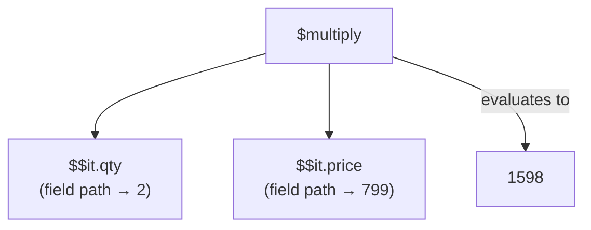
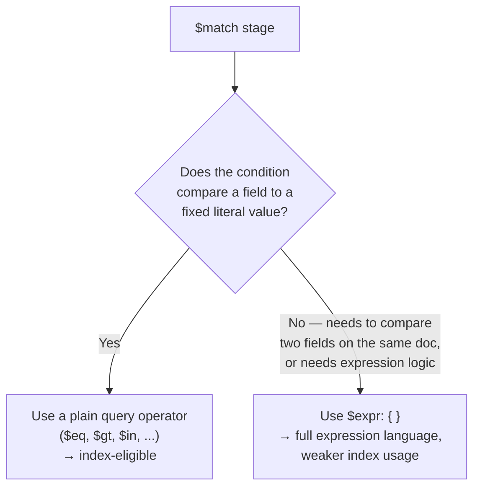

# Aggregation Expressions & Operators

Chapters 7 and 8 gave you the *stages* — `$match`, `$group`, `$project`, `$lookup`, `$unwind`, `$facet`, `$bucket`, `$merge`, and the rest of the vocabulary for describing *what happens* to the document stream at each step of a pipeline. But look back at nearly every non-trivial example in those two chapters and you'll notice something: the interesting work rarely happens in the stage keyword itself. It happens inside the curly braces — in expressions like `{ $multiply: ["$$it.qty", "$$it.price"] }` or `{ $sum: { $map: { input: "$items", as: "it", in: { $multiply: ["$$it.qty", "$$it.price"] } } } }`, which showed up repeatedly without full explanation, with a promise that "the complete expression-operator language is the entire subject of Chapter 9." This is that chapter. If Chapters 7–8 taught you the pipeline's *grammar* (the stages, and the order you can arrange them in), this chapter teaches you its *vocabulary* — the rich, composable, `$`-prefixed expression language you write *inside* `$project`, `$addFields`, `$group`, and `$match`'s `$expr` operator to compute, transform, and reason about values. By the end of this chapter, the expressions that looked like unexplained syntax in Chapters 7 and 8 will read as plainly as arithmetic.

---

## Learning Objectives

By the end of this chapter, you will be able to:

- Distinguish a field-path expression (`"$field"`), a literal value, and a nested expression object, and explain why that distinction is the single most common source of aggregation bugs.
- Use the core arithmetic operators (`$add`, `$subtract`, `$multiply`, `$divide`, `$mod`, `$round`, `$trunc`) to compute derived numeric fields.
- Use the core string operators (`$concat`, `$toUpper`/`$toLower`, `$substr`/`$substrCP`, `$trim`, `$split`, `$strLenCP`) to transform and inspect text fields.
- Use array operators (`$size`, `$arrayElemAt`, `$slice`, `$filter`, `$map`, `$reduce`, `$in`, `$concatArrays`) to compute values from embedded arrays without needing `$unwind`.
- Use date operators (`$year`, `$month`, `$dateToString`, `$dateFromParts`, `$dateDiff`, `$dateTrunc`) to extract components from dates and bucket documents by time period.
- Use `$cond`, `$switch`, and `$ifNull` to branch logic inside an expression, and use `$toString`/`$toInt`/`$toDouble`/`$toDate`/`$convert` to control BSON types explicitly.
- Explain what `$expr` does inside `$match`, when it's necessary (comparing two fields on the same document), and why it should be avoided when a plain query would do.
- Explain the dual nature of operators like `$sum` and `$push`: accumulators inside `$group`, ordinary array-producing expressions inside `$project`/`$addFields`.

---

## Prerequisites for This Chapter

This chapter builds directly on the two chapters immediately before it:

- **[Chapter 7: Aggregation Pipeline Fundamentals](./07-aggregation-pipeline-fundamentals.md)** — you should be comfortable with the pipeline mental model (an ordered array of stages, each seeing only the previous stage's output), and with `$match`, `$project`, `$group`, `$sort`, and the core accumulators. Section 4.2 of that chapter previewed a `$map`/`$multiply` expression without fully explaining it — this chapter is that explanation, in full.
- **[Chapter 8: Aggregation Stages Deep Dive](./08-aggregation-stages-deep-dive.md)** — you should know `$lookup` (including its sub-pipeline form with `let`), `$unwind`, `$facet`, and `$bucket`. This chapter revisits `$lookup`'s `let`/`$expr` combination in Section 9, so having seen it once already will help it click.

If either chapter feels shaky, a quick review pays off — this chapter assumes both as settled ground, and every example below reuses the same `orders` collection from Chapters 7 and 8:

```js
{
  _id: ObjectId("64f1a2b3c4d5e6f7a8b9c0e1"),
  customerId: "CUST-1001",
  items: [
    { product: "Wireless Mouse", qty: 2, price: 799 },
    { product: "USB-C Cable",    qty: 1, price: 249 }
  ],
  status: "completed",        // "completed" | "pending" | "cancelled"
  orderDate: ISODate("2026-01-15T10:00:00Z")
}
```

---

## 1. Expression Syntax Fundamentals

Before touching a single operator, you need to be fluent in the three building blocks every aggregation expression is made from. Get this section wrong and every later section will feel like memorizing arbitrary syntax instead of composing a small, consistent language.

### 1.1 Field paths: `"$field"`

A string that starts with `$` is not an ordinary string — it's a **field-path expression**, meaning "look up the value of this field on the current document." You saw this already in Chapter 7:

```js
{ $project: { customer: "$customerId" } }
```

`"$customerId"` means "the value of the `customerId` field," not the four characters `c`-`u`-`s`-`t`. Field paths can reach into nested documents with dot notation, exactly like `find()` queries: `"$items.product"` refers to the `product` field inside the (array-valued) `items` field.

### 1.2 Literal values

Any value that does *not* start with `$` is treated as a literal — used as-is, with no lookup:

```js
{ $project: { region: "APAC", customerId: 1 } }
```

Here `"APAC"` is a plain string literal — every output document gets exactly that value in its `region` field. Numbers, booleans, dates, and arrays are literals too, unless they contain a nested expression object (Section 1.4). If you ever need to use a literal string that *itself* starts with `$` (rare, but it happens — e.g., a product SKU literally named `"$special"`), wrap it with the `$literal` operator: `{ $literal: "$special" }` tells MongoDB "treat this as data, not as a field path."

### 1.3 The `$fieldPath` vs. `"fieldPath"` trap

This single distinction — one leading character — is worth its own callout before moving on, because it is, without exaggeration, the single most common syntax mistake beginners make with the expression language:

| Written as | Meaning |
|---|---|
| `"$customerId"` | The **value** of the `customerId` field on the current document |
| `"customerId"` | The literal **string** `"customerId"` (four... well, ten characters) |

```js
// WRONG — every output document gets the literal string "customerId"
{ $project: { customer: "customerId" } }

// RIGHT — every output document gets the actual customer ID value
{ $project: { customer: "$customerId" } }
```

MongoDB will not error on the wrong version — it will silently produce a field full of the literal text `"customerId"` in every single document, which is a frustrating bug to spot precisely because nothing throws. When an aggregation result looks suspiciously like it's full of your *field names* instead of your *field values*, this is the first thing to check.

### 1.4 Nested expression objects

Expressions compose by nesting: an operator's arguments can themselves be expressions, which can themselves contain further operators, arbitrarily deep. This is what gives the language its power — you're not limited to one operation per field:

```js
{
  $project: {
    customerId: 1,
    // an expression whose arguments are themselves expressions
    lineItemCount: { $size: "$items" },
    firstProduct: { $arrayElemAt: ["$items.product", 0] }
  }
}
```

Every aggregation operator follows the same shape: `{ $operatorName: <argument or array of arguments> }`. Some take a single argument (`{ $toUpper: "$customerId" }`), some take an array of positional arguments (`{ $subtract: ["$price", "$discount"] }`), and some take a document of named arguments (`{ $map: { input: "$items", as: "it", in: ... } }`). Learning to read the operator's *shape* — is it single-arg, array-arg, or document-arg? — is more useful than memorizing operators one at a time, because most new operators you encounter will follow one of those three shapes.

### 1.5 A quick evaluation-tree mental model

An expression is really a small tree: the outermost operator is the root, and every field path or literal argument is a leaf. Evaluating it means walking the tree from the leaves up, exactly like evaluating a nested arithmetic expression in any programming language:



Every operator in this chapter — no matter how deeply nested your real pipelines get — reduces to this same idea: leaves resolve to values first, then each operator combines its already-resolved arguments into one output value, working from the bottom of the tree to the top.

---

## 2. Arithmetic Operators

Arithmetic operators compute numeric results from other expressions. All of them take positional arrays of arguments (except `$round` and `$trunc`, which can take a single value or a `[value, place]` pair).

| Operator | Meaning | Example |
|---|---|---|
| `$add` | Sum of two or more numbers (or add a number of milliseconds to a date) | `{ $add: ["$price", 50] }` |
| `$subtract` | First argument minus second | `{ $subtract: ["$price", "$discount"] }` |
| `$multiply` | Product of two or more numbers | `{ $multiply: ["$qty", "$price"] }` |
| `$divide` | First argument divided by second | `{ $divide: ["$totalRevenue", "$orderCount"] }` |
| `$mod` | Remainder of first argument divided by second | `{ $mod: ["$qty", 2] }` |
| `$round` | Rounds a number to a given decimal place (default 0) | `{ $round: ["$avgOrderValue", 2] }` |
| `$trunc` | Truncates (does not round) a number to a given decimal place | `{ $trunc: ["$avgOrderValue", 1] }` |

### 2.1 Computing a line-item subtotal

The most natural place to see arithmetic operators is computing each line item's subtotal (`qty * price`) inside the `items` array:

```js
db.orders.aggregate([
  {
    $addFields: {
      itemSubtotals: {
        $map: {
          input: "$items",
          as: "it",
          in: { $multiply: ["$$it.qty", "$$it.price"] }
        }
      }
    }
  }
])
```

```js
// Sample output (items field unchanged, itemSubtotals is new)
{
  customerId: "CUST-1001",
  items: [ { product: "Wireless Mouse", qty: 2, price: 799 }, { product: "USB-C Cable", qty: 1, price: 249 } ],
  itemSubtotals: [ 1598, 249 ]
}
```

Don't worry yet about the mechanics of `$map` — it's covered fully in Section 4. For now, notice that `$multiply` is just an ordinary two-argument operator nested inside it.

### 2.2 Rounding a computed average

```js
db.orders.aggregate([
  { $match: { status: "completed" } },
  {
    $group: {
      _id: "$customerId",
      avgOrderValue: { $avg: { $sum: "$items.price" } }
    }
  },
  { $addFields: { avgOrderValue: { $round: ["$avgOrderValue", 2] } } }
])
```

`$round` and `$trunc` matter in practice because raw division rarely lands on a clean two-decimal currency value — without rounding, a dashboard showing `avgOrderValue: 1422.333333333333` looks broken even though the math is correct.

### 2.3 `$mod` for bucketing

`$mod` shows up more often than beginners expect — for example, flagging every 10th order for a sampling audit:

```js
{ $addFields: { auditSample: { $eq: [{ $mod: ["$orderSeq", 10] }, 0] } } }
```

---

## 3. String Operators

String operators manipulate text fields — normalizing case, slicing substrings, joining values, or measuring length.

| Operator | Meaning | Example |
|---|---|---|
| `$concat` | Joins strings together | `{ $concat: ["$customerId", " - ", "$status"] }` |
| `$toUpper` / `$toLower` | Case conversion | `{ $toUpper: "$status" }` |
| `$substrCP` | Extracts a substring by Unicode code point position/length (preferred over legacy `$substr`) | `{ $substrCP: ["$customerId", 0, 4] }` |
| `$trim` | Removes leading/trailing whitespace (or a specified character set) | `{ $trim: { input: "$productName" } }` |
| `$split` | Splits a string into an array on a delimiter | `{ $split: ["$customerId", "-"] }` |
| `$strLenCP` | String length, counted in Unicode code points (preferred over byte-based `$strLenBytes`) | `{ $strLenCP: "$customerId" }` |

### 3.1 Worked example: normalizing and deriving fields from `customerId`

```js
db.orders.aggregate([
  {
    $project: {
      _id: 0,
      customerId: 1,
      // "CUST-1001" -> "CUST"
      customerPrefix: { $substrCP: ["$customerId", 0, 4] },
      // "CUST-1001" -> ["CUST", "1001"]
      customerParts: { $split: ["$customerId", "-"] },
      statusUpper: { $toUpper: "$status" },
      idLength: { $strLenCP: "$customerId" }
    }
  }
])
```

```js
// Sample output
{
  customerId: "CUST-1001",
  customerPrefix: "CUST",
  customerParts: ["CUST", "1001"],
  statusUpper: "COMPLETED",
  idLength: 9
}
```

### 3.2 Why `$substrCP`/`$strLenCP` instead of `$substr`/`$strLenBytes`

`$substr` is a legacy alias still accepted for backward compatibility, but it (and `$strLenBytes`) operate on raw bytes, which misbehaves on any text containing multi-byte UTF-8 characters (accented letters, CJK text, emoji). `$substrCP` and `$strLenCP` operate on Unicode code points instead, giving correct results regardless of the character set involved. Default to the `CP` variants unless you have a specific reason not to.

### 3.3 Building a display label with `$concat`

```js
{
  $addFields: {
    orderLabel: {
      $concat: [
        "$customerId",
        " placed on ",
        { $dateToString: { format: "%Y-%m-%d", date: "$orderDate" } }
      ]
    }
  }
}
```

This nests a date operator (Section 5) directly inside `$concat` — a good early illustration of how naturally the expression language composes across categories.

---

## 4. Array Operators

Array operators are what let you work with an embedded array like `items` *without* first flattening it with `$unwind`. This matters for performance and for correctness: `$unwind` turns one order document into N documents (one per item), which is often exactly what you don't want when you just need a computed summary field on the *original* order document.

| Operator | Meaning | Example |
|---|---|---|
| `$size` | Number of elements in an array | `{ $size: "$items" }` |
| `$arrayElemAt` | Element at a given index (negative indexes count from the end) | `{ $arrayElemAt: ["$items", 0] }` |
| `$slice` | A sub-array (like `Array.slice`) | `{ $slice: ["$items", 1, 2] }` |
| `$filter` | Keeps only elements matching a condition | `{ $filter: { input: "$items", as: "it", cond: { $gt: ["$$it.qty", 1] } } }` |
| `$map` | Transforms every element, producing a new array of the same length | `{ $map: { input: "$items", as: "it", in: "$$it.product" } }` |
| `$reduce` | Folds an array down to a single accumulated value | see 4.3 below |
| `$in` | Whether a value exists in an array | `{ $in: ["Wireless Mouse", "$items.product"] }` |
| `$concatArrays` | Joins two or more arrays into one | `{ $concatArrays: ["$items", "$bonusItems"] }` |

### 4.1 `$filter` — keeping only some elements

```js
db.orders.aggregate([
  {
    $addFields: {
      bulkItems: {
        $filter: {
          input: "$items",
          as: "it",
          cond: { $gte: ["$$it.qty", 2] }
        }
      }
    }
  }
])
```

`as` names the per-element variable (`it`, referenced as `$$it` — note the *double* dollar sign for a user-defined variable, versus a single `$` for a document field path; Section 9 explains this distinction fully). `cond` is a boolean expression evaluated once per element; only elements where it's true survive into the output array.

### 4.2 `$map` — transforming every element

```js
db.orders.aggregate([
  {
    $project: {
      _id: 0,
      customerId: 1,
      productNames: {
        $map: { input: "$items", as: "it", in: "$$it.product" }
      }
    }
  }
])
```

```js
// Sample output
{ customerId: "CUST-1001", productNames: ["Wireless Mouse", "USB-C Cable"] }
```

`$map` always produces an array of the *same length* as the input — one output element per input element, transformed by whatever expression you put in `in`.

### 4.3 Worked example: computing an order total from `items` with `$map` + `$reduce` — no `$unwind` required

This is the pipeline Chapter 7 used without full explanation. Here it is again, fully unpacked, alongside an equivalent built with `$reduce` instead of the `$sum`/`$map` combination:

```js
// Approach A: $map to compute each line-item subtotal, then $sum reduces the resulting array
db.orders.aggregate([
  {
    $addFields: {
      orderTotal: {
        $sum: {
          $map: {
            input: "$items",
            as: "it",
            in: { $multiply: ["$$it.qty", "$$it.price"] }
          }
        }
      }
    }
  }
])
```

```js
// Approach B: $reduce folds the array directly into a single number,
// without an intermediate array of subtotals
db.orders.aggregate([
  {
    $addFields: {
      orderTotal: {
        $reduce: {
          input: "$items",
          initialValue: 0,
          in: { $add: ["$$value", { $multiply: ["$$this.qty", "$$this.price"] }] }
        }
      }
    }
  }
])
```

Both approaches produce the same result, `{ customerId: "CUST-1001", orderTotal: 1847, ... }`, on one document per order — the original document shape and count are entirely preserved, which is precisely what `$unwind` would *not* give you (it would split this one order into two separate documents, one per item, which you'd then have to `$group` back together just to undo). `$reduce` introduces two special accumulator-style variables: `$$value` (the running accumulated result, seeded by `initialValue`) and `$$this` (the current array element being folded in) — both explained further in Section 9.

**When to prefer `$map`/`$reduce` over `$unwind` + `$group`:** whenever you need a computed value *per original document* rather than a summary across many documents. `$unwind` is the right tool when you genuinely need one output document per array element (Chapter 8, Section on `$unwind`); `$map`/`$reduce` is the right tool when you need to summarize an array *inline*, keeping the one-document-per-order shape intact.

### 4.4 `$arrayElemAt` and `$slice`

```js
{
  $project: {
    firstItem: { $arrayElemAt: ["$items", 0] },
    lastItem: { $arrayElemAt: ["$items", -1] },   // negative index = from the end
    firstTwoItems: { $slice: ["$items", 2] },
    middleItem: { $slice: ["$items", 1, 1] }       // skip 1, take 1
  }
}
```

### 4.5 `$in` and `$concatArrays`

```js
{
  $match: {
    $expr: { $in: ["Wireless Mouse", "$items.product"] }
  }
}
```

```js
{ $addFields: { allProducts: { $concatArrays: ["$items.product", "$bonusItems.product"] } } }
```

(`$expr` inside `$match` is covered fully in Section 8 — it's needed here because `$in` is an aggregation expression operator, distinct from the `$in` *query* operator you already know from Chapter 4's `find()` filters, which happens to share the same name but a different argument shape.)

---

## 5. Date Operators

Dates are ubiquitous in reporting, and MongoDB's date-expression operators are what let you extract components, format dates as strings, reconstruct dates from parts, compute differences, and truncate to a time bucket — all inside the pipeline, without pulling raw `Date` objects into application code to do the same work.

| Operator | Meaning | Example |
|---|---|---|
| `$year`, `$month`, `$dayOfMonth` | Extract a numeric date component | `{ $year: "$orderDate" }` → `2026` |
| `$dateToString` | Format a date as a string, with a `format` pattern | `{ $dateToString: { format: "%Y-%m", date: "$orderDate" } }` |
| `$dateFromParts` | Construct a `Date` from numeric year/month/day/etc. fields | `{ $dateFromParts: { year: 2026, month: 6, day: 1 } }` |
| `$dateDiff` | Difference between two dates, in a chosen unit | `{ $dateDiff: { startDate: "$orderDate", endDate: "$$NOW", unit: "day" } }` |
| `$dateTrunc` | Rounds a date *down* to the start of a unit (day, week, month, etc.) | `{ $dateTrunc: { date: "$orderDate", unit: "month" } }` |

### 5.1 Extracting components

```js
db.orders.aggregate([
  {
    $project: {
      _id: 0,
      customerId: 1,
      year: { $year: "$orderDate" },
      month: { $month: "$orderDate" },
      day: { $dayOfMonth: "$orderDate" }
    }
  }
])
```

### 5.2 Worked example: bucketing orders by month for a revenue report

There are two idiomatic ways to bucket by month, and it's worth seeing both since you'll encounter each in real codebases.

**Using `$dateToString` to build a group key:**

```js
db.orders.aggregate([
  { $match: { status: "completed" } },
  {
    $addFields: {
      orderTotal: {
        $sum: { $map: { input: "$items", as: "it", in: { $multiply: ["$$it.qty", "$$it.price"] } } }
      }
    }
  },
  {
    $group: {
      _id: { $dateToString: { format: "%Y-%m", date: "$orderDate" } },
      monthlyRevenue: { $sum: "$orderTotal" },
      orderCount: { $sum: 1 }
    }
  },
  { $sort: { _id: 1 } }
])
```

```js
// Sample output
{ _id: "2026-01", monthlyRevenue: 4867, orderCount: 3 }
{ _id: "2026-02", monthlyRevenue: 6120, orderCount: 4 }
```

**Using `$dateTrunc` to group by an actual `Date` value (not a string):**

```js
db.orders.aggregate([
  { $match: { status: "completed" } },
  {
    $addFields: {
      orderTotal: {
        $sum: { $map: { input: "$items", as: "it", in: { $multiply: ["$$it.qty", "$$it.price"] } } }
      }
    }
  },
  {
    $group: {
      _id: { $dateTrunc: { date: "$orderDate", unit: "month" } },
      monthlyRevenue: { $sum: "$orderTotal" },
      orderCount: { $sum: 1 }
    }
  },
  { $sort: { _id: 1 } }
])
```

The `$dateTrunc` version's `_id` is a real `ISODate`, which sorts correctly and can be fed straight into a charting library that expects native dates; the `$dateToString` version's `_id` is a display-ready string, convenient when you're building the label directly. Choose based on whether the *consumer* of the result wants a `Date` or a formatted string — it's a presentation decision, not a correctness one, as long as you sort accordingly.

### 5.3 `$dateFromParts` and `$dateDiff`

```js
// Construct the first moment of the current month, e.g. for a "this month so far" filter
{ $dateFromParts: { year: { $year: "$$NOW" }, month: { $month: "$$NOW" }, day: 1 } }
```

```js
// How many days ago was this order placed?
{ $dateDiff: { startDate: "$orderDate", endDate: "$$NOW", unit: "day" } }
```

`$$NOW` is a special variable (Section 9) that evaluates once, to the current wall-clock time, at pipeline execution — it's the aggregation-expression equivalent of calling `new Date()` in application code, and it reappears in the Real-World Scenario below.

---

## 6. Conditional Operators

Conditional operators let a single expression branch on data, computing different results depending on a condition — the aggregation language's equivalent of an `if`/`else` or `switch` statement.

### 6.1 `$cond` — if/then/else

`$cond` takes three arguments — a boolean condition, a "then" value, and an "else" value — in either array form or named-argument form:

```js
{
  $addFields: {
    sizeLabel: {
      $cond: {
        if: { $gte: [{ $size: "$items" }, 3] },
        then: "bulk order",
        else: "standard order"
      }
    }
  }
}
```

```js
// Equivalent, terser array form
{ $addFields: { sizeLabel: { $cond: [{ $gte: [{ $size: "$items" }, 3] }, "bulk order", "standard order"] } } }
```

### 6.2 `$switch` — multiple branches

`$switch` generalizes `$cond` to more than two outcomes, evaluating an ordered list of `case`/`then` branches and falling through to `default` if none match:

```js
{
  $addFields: {
    statusLabel: {
      $switch: {
        branches: [
          { case: { $eq: ["$status", "completed"] }, then: "Delivered" },
          { case: { $eq: ["$status", "pending"] },   then: "In progress" },
          { case: { $eq: ["$status", "cancelled"] }, then: "Cancelled — no charge" }
        ],
        default: "Unknown status"
      }
    }
  }
}
```

Reach for `$switch` over nesting several `$cond`s inside each other — three or more nested `$cond`s become difficult to read; `$switch`'s flat branch list stays readable no matter how many cases you add.

### 6.3 `$ifNull` — defaulting missing or null values

```js
{ $addFields: { discountRate: { $ifNull: ["$discountRate", 0] } } }
```

`$ifNull` takes a list of expressions and returns the first one that is *not* `null` or missing, falling back to the final argument as an ultimate default — the direct aggregation-expression equivalent of the `??` (nullish coalescing) operator in JavaScript. It's the standard way to guard against sparse fields — orders that never had a `discountRate` set get a sensible default of `0` instead of propagating `null`/`undefined` through the rest of the pipeline.

---

## 7. Type Conversion Operators

Documents in a real collection sometimes have fields stored as inconsistent types — a `qty` that's occasionally a string because of a buggy import script, a legacy `price` stored as a numeric string. Type-conversion operators let a pipeline coerce values explicitly rather than silently producing wrong arithmetic or comparison results.

| Operator | Converts to | Example |
|---|---|---|
| `$toString` | String | `{ $toString: "$qty" }` → `"2"` |
| `$toInt` | 32-bit integer | `{ $toInt: "$qtyAsString" }` |
| `$toDouble` | Double | `{ $toDouble: "$priceAsString" }` |
| `$toDate` | Date | `{ $toDate: "$orderDateString" }` |
| `$convert` | Any BSON type, with explicit error handling | see 7.1 below |

### 7.1 `$convert` with `onError`/`onNull`

`$toInt`, `$toDouble`, etc. are convenient shorthands for the more general `$convert` operator, which is the one to reach for when a conversion might legitimately fail (malformed data) and you need to control what happens instead of the whole pipeline erroring out:

```js
{
  $addFields: {
    qtySafe: {
      $convert: {
        input: "$qty",
        to: "int",
        onError: 0,     // if conversion throws, use 0 instead of failing the pipeline
        onNull: 0        // if the input is null/missing, use 0 instead of null
      }
    }
  }
}
```

Without `onError`, a single malformed document (say, one order with `qty: "two"` instead of `qty: 2`) would abort the *entire* aggregation with a conversion error — a single bad document taking down a report over millions of good ones. `onError`/`onNull` make conversions resilient to exactly the kind of messy real-world data that motivated this section in the first place.

---

## 8. `$expr` Inside `$match` — Expressions in a Query Context

Every stage covered in Chapter 7 and 8's `$match` examples used ordinary query operators (`$eq`, `$gt`, `$in`, and so on) — the same syntax as `find()`. Those operators compare a field against a *literal* value or another query operator's argument. What they **cannot** do is compare two fields *on the same document* against each other — and that's precisely the gap `$expr` fills.

### 8.1 The problem `$expr` solves

Suppose the `orders` collection also stores a `discountedPrice` field per item (hypothetically flattened onto the order for this example), and you want to find orders where the discounted price is somehow *greater* than the original price — a data-integrity bug worth auditing for. A plain `$match` filter document has no way to express "field A greater than field B" — every ordinary query operator compares a field to a fixed value you write literally into the query, not to another field:

```js
// This does NOT work — 500 is a literal, there's no way to reference another field here
{ $match: { discountedPrice: { $gt: "$price" } } }   // WRONG: compares discountedPrice to the literal string "$price"
```

`$expr` wraps an *aggregation expression* (everything from Sections 1–7 of this chapter) so it can be used as a `$match` condition, giving you the full expression language — including field-to-field comparisons — inside a query context:

```js
db.orders.aggregate([
  { $match: { $expr: { $gt: ["$discountedPrice", "$price"] } } }
])
```

This is the direct, worked example this section promised: `$gt` here is the *aggregation* comparison operator (Section 1's expression language), not the *query* operator — same name, different context, and `$expr` is exactly the bridge between the two.

### 8.2 Combining `$expr` with ordinary conditions

`$expr` can sit alongside ordinary query fields in the same `$match` document — MongoDB evaluates both:

```js
db.orders.aggregate([
  {
    $match: {
      status: "completed",
      $expr: { $gt: ["$discountedPrice", "$price"] }
    }
  }
])
```

### 8.3 Why `$expr` matters, and why it comes with a real cost

`$expr` matters because it's the *only* way to express same-document field comparisons in a `$match` stage — there is no other syntax for it. But that power comes at a real performance cost that's worth understanding precisely, not just reciting: MongoDB's query planner has much more limited ability to use indexes to satisfy an `$expr` condition compared to an equivalent plain query operator. A condition like `{ status: "completed" }` can use an index on `status` directly; `{ $expr: { $eq: ["$status", "completed"] } }` expressing the *same logical condition* is far less reliably optimized, because the planner has to evaluate a general expression tree per document rather than doing a direct index lookup. **The rule of thumb: use `$expr` only when you genuinely need to compare fields to each other (or need an expression a plain query operator can't express) — never as a stylistic alternative to a plain query condition you could otherwise write directly.** Section 8.1's field-to-field comparison is exactly the legitimate case; rewriting `{ status: "completed" }` as `{ $expr: { $eq: ["$status", "completed"] } }` for no reason is exactly the mistake to avoid (and it reappears in Common Mistakes below).



---

## 9. Special Variables

Aggregation expressions have access to a small set of built-in variables, plus the ability to define your own. All variables are referenced with a **double** dollar sign (`$$name`) — deliberately distinct from the single-dollar field-path syntax (`$name`) from Section 1, because a variable is not a field on the current document; it's a value bound by the surrounding context (the pipeline, a `$lookup`, or an array operator).

### 9.1 `$$ROOT` and `$$CURRENT`

`$$ROOT` refers to the *original* input document to the current pipeline stage, even from deep inside a nested expression where the "current" document context has changed (for example, inside a `$group` accumulator, where the natural "current document" is the group, not the original order):

```js
db.orders.aggregate([
  { $match: { status: "completed" } },
  {
    $group: {
      _id: "$customerId",
      latestOrder: { $last: "$$ROOT" }   // keep the whole original document, not just one field
    }
  }
])
```

`$$CURRENT` is functionally equivalent to `$$ROOT` in most contexts but refers to the current document at the *current* stage of the pipeline rather than always the absolute original — in practice `$$ROOT` is what you'll reach for the overwhelming majority of the time; `$$CURRENT` exists mainly so that `$$CURRENT.field` and `"$field"` are interchangeable spellings of the same thing when you want the explicit form.

### 9.2 `$$NOW`

`$$NOW` evaluates once, at the moment the pipeline runs, to the current date and time — the aggregation-expression equivalent of `new Date()`. You already saw it in Section 5.3 computing "days since order placed," and it appears again in this chapter's Real-World Scenario.

### 9.3 `let`/`vars` inside `$lookup`'s sub-pipeline form

Chapter 8 introduced `$lookup`'s sub-pipeline form, which uses `let` to pass values from the outer document into the sub-pipeline's `$match`:

```js
db.orders.aggregate([
  {
    $lookup: {
      from: "customers",
      let: { custId: "$customerId" },
      pipeline: [
        { $match: { $expr: { $eq: ["$_id", "$$custId"] } } }
      ],
      as: "customerInfo"
    }
  }
])
```

This is the same `$expr` from Section 8, doing the same job — comparing two values that an ordinary query operator can't reach — but here the second value (`"$$custId"`) is a `let`-bound variable rather than a second field on the same document. `let` is precisely how a `$lookup` sub-pipeline gets access to a value from the *outer* document at all, since the sub-pipeline otherwise only sees documents from the `from` collection.

### 9.4 `$$this` and `$$value` inside `$map`/`$filter`/`$reduce`

Section 4 already used these without naming them explicitly as "special variables" — now that you've seen `$$ROOT` and `$$NOW`, it's worth being precise about them:

- Inside `$filter` and `$map`, the `as` argument names the per-element variable (commonly written `as: "it"`, referenced as `$$it`, though the name is arbitrary — you could write `as: "item"` and reference `$$item`). If `as` is omitted, `$map`/`$filter` default the variable name to `$$this`.
- Inside `$reduce`, two variables are always available regardless of any `as`: `$$value` (the running accumulated result, seeded by `initialValue`) and `$$this` (the current element being folded in) — these names are fixed, not configurable.

```js
{
  $reduce: {
    input: "$items",
    initialValue: 0,
    in: { $add: ["$$value", { $multiply: ["$$this.qty", "$$this.price"] }] }
  }
}
```

---

## 10. Accumulator Expressions Recap: Dual Nature

Chapter 7 introduced `$sum`, `$avg`, `$min`, `$max`, `$first`, `$last`, `$push`, and `$addToSet` purely as `$group` **accumulators** — operators that reduce a *group of documents* down to one value. It's worth being explicit now about something Chapter 7 didn't need to dwell on: several of these operators have a **second, different meaning** depending purely on *where* they're used.

### 10.1 Inside `$group`: accumulating across documents

```js
{ $group: { _id: "$customerId", totalRevenue: { $sum: "$orderTotal" } } }
```

Here, `$sum` operates *across every document in the group* — it's a many-documents-to-one-value reduction. This is the accumulator meaning, and it's the only place `$first`, `$last`, `$push`, and `$addToSet` are legal at all — they don't have a second meaning; they only work as accumulators.

### 10.2 Inside `$project`/`$addFields`: an ordinary array-to-value expression

`$sum`, `$avg`, `$min`, and `$max` (but *not* `$first`/`$last`/`$push`/`$addToSet`) can *also* be used inside `$project` or `$addFields`, operating on a *single document's array field* rather than across documents in a group:

```js
{
  $project: {
    orderTotal: { $sum: "$items.price" },   // sums the price field across this ONE document's items array
    maxItemPrice: { $max: "$items.price" },
    avgItemPrice: { $avg: "$items.price" }
  }
}
```

This is a fundamentally different operation from Section 10.1's usage, even though the operator's *name* is identical: here, `$sum` takes a single array (from one document) and reduces it to a single number — there's no "group of documents" involved at all, because `$project`/`$addFields` never groups anything.

### 10.3 Why this distinction matters

| | Inside `$group` | Inside `$project`/`$addFields` |
|---|---|---|
| **What it reduces** | Many documents in a group → one value | One array field, on one document → one value |
| **Which operators work this way** | `$sum`, `$avg`, `$min`, `$max`, `$first`, `$last`, `$push`, `$addToSet` | Only `$sum`, `$avg`, `$min`, `$max` (array-input form) |
| **Typical argument** | A field-path expression evaluated once per document in the group | An array-valued field path (or array expression) evaluated once, on the current document |

Getting this backwards is a genuine source of confusion: seeing `{ $sum: "$items.price" }` inside a `$project` and assuming it behaves like a `$group` accumulator (across documents) is wrong — it's summing the array *within the current document*, and produces a completely different result than a `$group`-stage `$sum` would. Keep the mental rule simple: **the stage determines the meaning.** `$group` accumulates across documents; `$project`/`$addFields` operate on the current document alone, and any accumulator-named operator you see there is working on an array field, not a stream of sibling documents.

---

## Real-World Scenario

**The request:** The marketing team wants two new fields available on every customer summary: **days since their last order** (to identify customers going cold) and a **discount-eligibility flag** — `true` if it's been more than 60 days since their last completed order, so a "come back" discount can be offered.

**Building it with this chapter's operators:**

```js
db.orders.aggregate([
  // Step 1: only completed orders count toward "last order"
  { $match: { status: "completed" } },

  // Step 2: one summary document per customer, keeping their most recent order date
  {
    $group: {
      _id: "$customerId",
      lastOrderDate: { $max: "$orderDate" },
      totalOrders: { $sum: 1 }
    }
  },

  // Step 3: compute days-since-last-order using $dateDiff and $$NOW
  {
    $addFields: {
      daysSinceLastOrder: {
        $dateDiff: { startDate: "$lastOrderDate", endDate: "$$NOW", unit: "day" }
      }
    }
  },

  // Step 4: derive the discount-eligibility flag with $cond
  {
    $addFields: {
      discountEligible: {
        $cond: {
          if: { $gt: ["$daysSinceLastOrder", 60] },
          then: true,
          else: false
        }
      }
    }
  },

  // Step 5: reshape for the marketing dashboard
  {
    $project: {
      _id: 0,
      customerId: "$_id",
      lastOrderDate: 1,
      daysSinceLastOrder: 1,
      discountEligible: 1
    }
  },

  { $sort: { daysSinceLastOrder: -1 } }
])
```

```js
// Sample output
{ customerId: "CUST-1003", lastOrderDate: ISODate("2025-11-02T08:00:00Z"), daysSinceLastOrder: 246, discountEligible: true }
{ customerId: "CUST-1001", lastOrderDate: ISODate("2026-05-20T09:30:00Z"), daysSinceLastOrder: 47,  discountEligible: false }
```

**Why each expression is doing what it's doing:**

- `$max` (Section 10.1, the accumulator form) finds each customer's most recent completed order — an ordinary `$group` accumulator, nothing new.
- `$dateDiff` with `endDate: "$$NOW"` computes an always-current "days since" value without the caller needing to compute or pass in "today" from application code — the pipeline is self-contained and correct no matter when it happens to run.
- `$cond` turns a numeric threshold into the boolean flag marketing actually wants to consume, rather than making the dashboard's front-end code re-derive the same threshold logic in JavaScript (and risk it drifting out of sync with the backend's definition of "eligible").

**A variant using `$expr` in `$match`:** if marketing instead wants *only* the eligible customers returned (rather than a flag on every customer), you could filter directly:

```js
db.orders.aggregate([
  { $match: { status: "completed" } },
  { $group: { _id: "$customerId", lastOrderDate: { $max: "$orderDate" } } },
  {
    $match: {
      $expr: { $gt: [{ $dateDiff: { startDate: "$lastOrderDate", endDate: "$$NOW", unit: "day" } }, 60] }
    }
  }
])
```

This `$match` legitimately needs `$expr` — the condition depends on a *computed expression* (a date difference against `$$NOW`), not a comparison to a fixed literal, so there's no plain query-operator form available. This is precisely the "no other syntax exists" case from Section 8.3, not the "used `$expr` needlessly" mistake.

---

## Best Practices

- **Default to the `CP`-suffixed string operators** (`$substrCP`, `$strLenCP`) over their byte-based legacy counterparts (`$substr`, `$strLenBytes`) — code-point-based operators behave correctly on any text, not just ASCII.
- **Prefer `$map`/`$reduce`/`$filter` over `$unwind` + `$group`** whenever you need a computed value per original document rather than a summary across many documents — it avoids the document-count explosion `$unwind` causes and skips the "undo" `$group` that would otherwise be needed to collapse it back.
- **Reach for `$expr` only when a plain query operator genuinely cannot express the condition** — field-to-field comparisons on the same document, or comparisons against a computed expression. Never use it as a stylistic substitute for `{ field: value }`.
- **Guard type conversions with `$convert`'s `onError`/`onNull`** whenever the input data's type isn't guaranteed clean — one malformed document should degrade gracefully, not abort an entire pipeline run over millions of good documents.
- **Use `$switch` instead of nesting three or more `$cond`s.** Deeply nested `$cond` is one of the hardest aggregation patterns to read back later; `$switch`'s flat branch list scales cleanly to any number of cases.
- **Remember the double-dollar-sign convention.** `$field` is a document field path; `$$variable` is a bound variable (`$$ROOT`, `$$NOW`, `$$this`, a `let`-bound name, or an `as`-named array element). Confusing the two either errors outright or silently resolves to the wrong value.
- **Compute expensive derived fields once, early, with `$addFields`, rather than recomputing them inline in every later stage that needs them.** If three downstream stages all need `orderTotal`, compute it once and reuse the field, instead of repeating the `$map`/`$multiply` expression three times.

---

## Common Mistakes

- **Forgetting the `$` prefix on a field path**, producing a literal string instead of a field lookup (Section 1.3) — this is the single most common aggregation-expression bug, and it fails silently rather than throwing an error.
- **Using `$expr` in `$match` when a plain filter would work.** `{ $match: { $expr: { $eq: ["$status", "completed"] } } }` is logically identical to `{ $match: { status: "completed" } }` but far less index-friendly — always prefer the plain form unless you specifically need cross-field or computed-expression comparison.
- **Confusing the query-operator and aggregation-expression versions of operators that share a name.** `$in`, `$eq`, `$gt`, and others exist in *both* worlds with different argument shapes — a query-operator `$in` takes `{ field: { $in: [...] } }`, while an aggregation-expression `$in` takes `{ $in: [value, array] }` and must be wrapped in `$expr` to be used inside `$match` at all.
- **Using `$sum`/`$avg`/`$max`/`$min` inside `$project` and expecting `$group`-style cross-document behavior.** As Section 10 covered, these operators mean something different depending on the stage — inside `$project`/`$addFields` they reduce one document's array, not a group of documents.
- **Reaching for `$unwind` + `$group` out of habit** when `$map`/`$reduce`/`$filter` would compute the same per-document result more directly, without inflating the document count mid-pipeline.
- **Letting a single malformed document crash an entire report** by using `$toInt`/`$toDouble`/`$toDate` without `$convert`'s `onError`/`onNull` guard on data you don't fully control the shape of.
- **Mixing up `$$this`/`$$value` (fixed names inside `$reduce`) with an `as`-named variable (chosen name inside `$map`/`$filter`).** Writing `$$this` inside a `$map` that used `as: "it"` silently resolves to nothing useful — the variable name has to match what you actually declared.

---

## Summary

- Aggregation expressions are the "vocabulary" inside the stage "grammar" from Chapters 7–8: `"$field"` is a field-path lookup, a bare value is a literal, and expressions nest into evaluation trees.
- Arithmetic operators (`$add`, `$subtract`, `$multiply`, `$divide`, `$mod`, `$round`, `$trunc`) compute derived numeric fields, commonly line-item subtotals.
- String operators (`$concat`, `$toUpper`/`$toLower`, `$substrCP`, `$trim`, `$split`, `$strLenCP`) transform and inspect text — prefer the code-point-safe (`CP`) variants.
- Array operators (`$size`, `$arrayElemAt`, `$slice`, `$filter`, `$map`, `$reduce`, `$in`, `$concatArrays`) let you compute values from embedded arrays like `items` *without* `$unwind`, keeping the one-document-per-order shape intact.
- Date operators (`$year`, `$month`, `$dateToString`, `$dateFromParts`, `$dateDiff`, `$dateTrunc`) extract components and bucket documents by time period — `$dateTrunc` for real `Date` group keys, `$dateToString` for display-ready string keys.
- `$cond`, `$switch`, and `$ifNull` add branching logic inside an expression; type-conversion operators (`$toString`, `$toInt`, `$toDouble`, `$toDate`, `$convert`) control BSON types explicitly, with `$convert`'s `onError`/`onNull` guarding against messy data.
- `$expr` inside `$match` brings the full expression language into a query context — its one irreplaceable job is comparing two fields on the same document (or filtering on a computed expression), and it comes at a real index-usage cost that means it should never replace a plain query condition.
- Special variables use a double dollar sign (`$$ROOT`, `$$CURRENT`, `$$NOW`, `let`-bound names in `$lookup`, `$$this`/`$$value` in `$reduce`) to distinguish them from ordinary single-dollar field paths.
- Several accumulator-named operators (`$sum`, `$avg`, `$min`, `$max`) have a **dual nature**: cross-document accumulators inside `$group`, single-document array reducers inside `$project`/`$addFields` — the stage they appear in determines which behavior applies.

---

## Knowledge Check

1. What is the difference between `"$customerId"` and `"customerId"` as values inside a `$project` stage, and why does the mistake of confusing them fail silently rather than throwing an error?
2. Rewrite `{ $group: { _id: "$customerId", n: { $sum: "$items.qty" } } }`'s intent using `$map`/`$reduce` inside `$addFields` instead, so that the total is computed per order document rather than collapsed across all of a customer's orders. Explain why the two pipelines produce different results.
3. Why can't an ordinary `find()`-style `$match` filter document express "find orders where `discountedPrice` is greater than `price`," and what specifically does `$expr` add that makes it possible?
4. Explain, with an example, the difference in meaning between `$$this` inside `$reduce` and an `as`-named variable inside `$map`.
5. `$sum` appears both inside `$group` and inside `$project`. Describe a concrete pipeline where using it in one of those two places instead of the other would silently produce the wrong number.
6. Why is `$dateTrunc` sometimes preferable to `$dateToString` as a `$group` key, even though both can bucket orders by month?

---

## Hands-On Exercise

Work through this in `mongosh`, reusing (or re-seeding, if needed) the `orders` collection from Chapter 7's Hands-On Exercise.

**1. Re-seed the collection (skip if it already has this data from Chapter 7):**

```js
db.orders.insertMany([
  { customerId: "CUST-1001", items: [{ product: "Wireless Mouse", qty: 2, price: 799 }, { product: "USB-C Cable", qty: 1, price: 249 }], status: "completed", orderDate: ISODate("2026-06-02T10:00:00Z") },
  { customerId: "CUST-1001", items: [{ product: "Keyboard", qty: 1, price: 2499 }], status: "completed", orderDate: ISODate("2026-06-18T09:30:00Z") },
  { customerId: "CUST-1002", items: [{ product: "USB-C Cable", qty: 3, price: 249 }], status: "completed", orderDate: ISODate("2026-05-10T14:00:00Z") },
  { customerId: "CUST-1002", items: [{ product: "Webcam", qty: 1, price: 3499 }], status: "completed", orderDate: ISODate("2026-06-25T16:20:00Z") },
  { customerId: "CUST-1003", items: [{ product: "Keyboard", qty: 2, price: 2499 }, { product: "Mousepad", qty: 1, price: 199 }], status: "completed", orderDate: ISODate("2026-06-29T13:45:00Z") }
])
```

**2. Use `$addFields` with `$map`/`$reduce`/`$multiply` to compute a per-order total without `$unwind`:**

```js
db.orders.aggregate([
  {
    $addFields: {
      orderTotal: {
        $reduce: {
          input: "$items",
          initialValue: 0,
          in: { $add: ["$$value", { $multiply: ["$$this.qty", "$$this.price"] }] }
        }
      }
    }
  }
])
```

Confirm the output still has exactly five documents (one per order, unchanged from the seed) and that each has a correctly computed `orderTotal` field alongside its original `items` array.

**3. Also add an `itemCount` and a `bulkItems` array using `$size` and `$filter`:**

```js
db.orders.aggregate([
  {
    $addFields: {
      orderTotal: {
        $reduce: { input: "$items", initialValue: 0, in: { $add: ["$$value", { $multiply: ["$$this.qty", "$$this.price"] }] } }
      },
      itemCount: { $size: "$items" },
      bulkItems: { $filter: { input: "$items", as: "it", cond: { $gte: ["$$it.qty", 2] } } }
    }
  }
])
```

Verify that only line items with `qty >= 2` appear in each order's `bulkItems` array.

**4. Build a monthly revenue report using `$dateToString` and `$group`:**

```js
db.orders.aggregate([
  { $match: { status: "completed" } },
  {
    $addFields: {
      orderTotal: {
        $reduce: { input: "$items", initialValue: 0, in: { $add: ["$$value", { $multiply: ["$$this.qty", "$$this.price"] }] } }
      }
    }
  },
  {
    $group: {
      _id: { $dateToString: { format: "%Y-%m", date: "$orderDate" } },
      monthlyRevenue: { $sum: "$orderTotal" },
      orderCount: { $sum: 1 }
    }
  },
  { $sort: { _id: 1 } }
])
```

Confirm you see one document for `"2026-05"` (CUST-1002's May order only) and one for `"2026-06"` (the remaining four orders).

**5. Add a `discountedPrice` field to one order manually, then use `$expr` inside `$match` to find pricing anomalies:**

```js
db.orders.updateOne(
  { customerId: "CUST-1003" },
  { $set: { discountedPrice: 3000, price: 2500 } }   // intentionally inconsistent: "discounted" > original
)

db.orders.aggregate([
  { $match: { $expr: { $gt: ["$discountedPrice", "$price"] } } }
])
```

Confirm exactly one document is returned — the `CUST-1003` order you just updated — and explain to yourself why this specific filter could not have been written without `$expr`.

---

## Further Reading

- [Aggregation Pipeline Operators (Reference)](https://www.mongodb.com/docs/manual/reference/operator/aggregation/) — the complete, authoritative index of every expression operator, organized by category exactly as this chapter is.
- [`$expr` (Reference)](https://www.mongodb.com/docs/manual/reference/operator/query/expr/) — full semantics, index-usage notes, and restrictions.
- [Date Expression Operators (Reference)](https://www.mongodb.com/docs/manual/reference/operator/aggregation/#date-expression-operators) — every date operator this chapter covered, plus additional ones for time zones and ISO week calculations.
- [Array Expression Operators (Reference)](https://www.mongodb.com/docs/manual/reference/operator/aggregation/#array-expression-operators) — the complete array-operator family, including several not covered here (`$zip`, `$range`, `$reverseArray`).
- [Variables in Aggregation Expressions (Reference)](https://www.mongodb.com/docs/manual/reference/aggregation-variables/) — the full list of built-in system variables, including `$$ROOT`, `$$CURRENT`, `$$NOW`, and others this chapter didn't have room for (`$$REMOVE`, `$$PRUNE`, `$$DESCEND`).

---

<div style="display:flex;justify-content:space-between;align-items:center;">
  <a href="./08-aggregation-stages-deep-dive.md">← Previous: Aggregation Stages Deep Dive</a>
  <a href="./00-index.md">🏠 Index</a>
  <a href="./10-advanced-aggregation-patterns.md">Next: Advanced Aggregation Patterns →</a>
</div>
