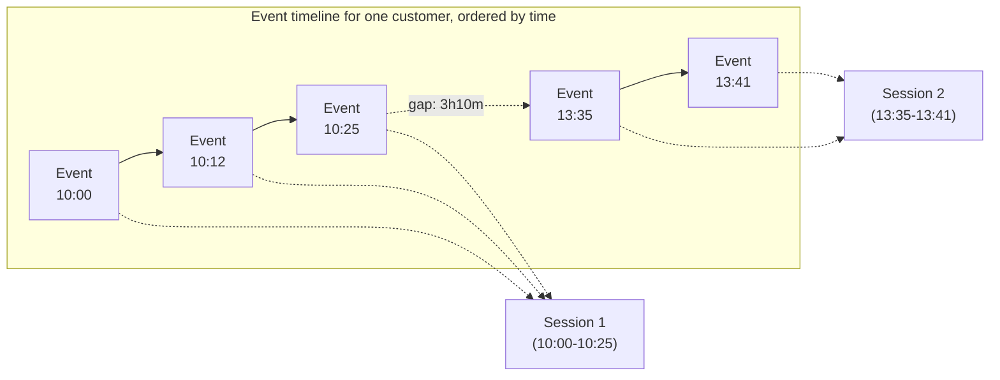
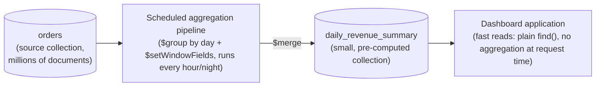

# Advanced Aggregation Patterns

Chapter 7 gave you the pipeline mental model and the core stages. Chapter 8 went deep on joins, reshaping, and analytical stages like `$facet` and `$bucket`. Chapter 9 armed you with the full expression language — arithmetic, string, array, date, and conditional operators — so you can compute anything a stage needs. This chapter closes out the aggregation-pipeline arc (Chapters 7–10) by combining all of it into the patterns that actually show up in production systems: window functions for per-row analytics that don't collapse your data, sessionization for turning event streams into meaningful sessions, multi-facet dashboards answered in a single round trip, materialized views that make expensive aggregations cheap to read, and the performance discipline needed to run all of this at scale without falling over. If Chapters 7–9 taught you the vocabulary and grammar of the aggregation framework, this chapter teaches you how to write production prose with it.

---

## Learning Objectives

By the end of this chapter, you will be able to:

- Explain the "window over a partition" mental model behind `$setWindowFields`, and map its syntax directly onto SQL window function vocabulary (`PARTITION BY`, `ORDER BY`, window frames).
- Compute running totals, cumulative averages, and rankings (`$rank`, `$denseRank`) per group without collapsing rows the way `$group` does.
- Use `$shift` to look at a preceding or following document's value within a partition, the same way SQL's `LAG`/`LEAD` do.
- Implement the sessionization pattern: turning a raw stream of timestamped events into discrete sessions based on a time-gap threshold.
- Design a single multi-facet aggregation pipeline that powers an entire product listing page — results, count, price buckets, category counts, and rating distribution — in one round trip.
- Build and maintain a materialized view with `$merge`, understand `whenMatched`/`whenNotMatched`, and explain why this beats recomputing an aggregation from scratch on every read.
- Diagnose and fix aggregation performance problems at scale: the 100MB stage memory limit, `allowDiskUse`, stage ordering for index use, and reading `explain()` output for a pipeline.
- Describe, at a conceptual level, how change streams and aggregation pipelines combine for near-real-time analytics (full detail in Chapter 18).

---

## Prerequisites for This Chapter

This chapter assumes you're fluent with everything built across the first three chapters of the aggregation arc:

- **[Chapter 7: Aggregation Pipeline Fundamentals](./07-aggregation-pipeline-fundamentals.md)** — the pipeline mental model (an array of stages, each transforming a stream of documents), and the core stages `$match`, `$project`, `$group`, `$sort`, `$limit`.
- **[Chapter 8: Aggregation Stages Deep Dive](./08-aggregation-stages-deep-dive.md)** — `$lookup` for joins, `$unwind` for array flattening, `$bucket`/`$bucketAuto` for histograms, `$graphLookup` for recursive traversal, `$out`/`$merge` for writing pipeline results to a collection, and your first introduction to `$facet` for running multiple sub-pipelines over the same input.
- **[Chapter 9: Aggregation Expressions & Operators](./09-aggregation-expressions-and-operators.md)** — expression syntax (`$field` references, `$$variables`), arithmetic/string/array/date operators, and conditional logic (`$cond`, `$switch`, `$expr`).

If any of `$group`, `$lookup`, `$facet`, or expression syntax feels shaky, this chapter will be difficult to follow — it assumes you can read a five-stage pipeline without translating it line by line. Go back and solidify Chapters 7–9 first.

We continue the same running example from Chapter 7: an `orders` collection shaped like this —

```js
{
  _id: ObjectId("64f1a2b3c4d5e6f7a8b9c0e1"),
  customerId: "CUST-1001",
  items: [
    { product: "Wireless Mouse", qty: 2, price: 799 },
    { product: "USB-C Cable",    qty: 1, price: 249 }
  ],
  status: "completed",
  orderDate: ISODate("2026-01-15T10:00:00Z")
}
```

---

## 1. `$setWindowFields` — Window Functions in MongoDB

### 1.1 The core idea: a window over a partition

Everything you've done with `$group` so far shares one property: it **collapses** documents. Ten orders from the same customer go in, one summary document comes out. Most of the time that's exactly what you want — but sometimes you want the opposite: keep every document, and *attach* a calculation that references other documents in the same group. "Show me every order, and next to each one, this customer's running total so far." "Rank every customer by their spend this month, but still list every customer." `$group` cannot do this — the moment it runs, the individual orders are gone.

`$setWindowFields` is MongoDB's answer, and it is structurally identical to SQL's window functions (`OVER (...)`). The mental model is:

1. **Partition** the documents into groups (conceptually like `$group`'s `_id`, except rows are *not* collapsed).
2. **Order** the documents within each partition (needed for anything sequential: ranking, running totals, "previous row").
3. Define a **window** — which neighboring documents, relative to the current one, participate in the calculation (all documents so far? the last 7? the whole partition?).
4. Compute a value for each document using that window, and attach it as a new field — the original document survives, untouched, alongside the new computed field.

This is precisely the "keep every row, but compute across a group of them" idea that SQL window functions provide, and if you've worked through the [PostgreSQL course's window functions chapter](../postgresql-course/17-window-functions.md), the mapping below will feel immediate.

### 1.2 Syntax, and the direct SQL mapping

```js
{
  $setWindowFields: {
    partitionBy: "$customerId",
    sortBy: { orderDate: 1 },
    output: {
      runningTotal: {
        $sum: "$orderTotal",
        window: { documents: ["unbounded", "current"] }
      }
    }
  }
}
```

| SQL (`OVER (...)`) | `$setWindowFields` equivalent | Purpose |
|---|---|---|
| `PARTITION BY dept_id` | `partitionBy: "$customerId"` | Split documents into groups; rows are **kept**, not collapsed |
| `ORDER BY salary DESC` (inside `OVER`) | `sortBy: { orderDate: 1 }` | Order within each partition — required for ranking and sequential calculations |
| `ROWS BETWEEN UNBOUNDED PRECEDING AND CURRENT ROW` | `window: { documents: ["unbounded", "current"] }` | The window frame — which neighboring documents participate |
| `RANK() OVER (...)` | `$rank` | Ranking with gaps on ties (1, 1, 3) |
| `DENSE_RANK() OVER (...)` | `$denseRank` | Ranking with no gaps on ties (1, 1, 2) |
| `SUM(x) OVER (...)` / `AVG(x) OVER (...)` | `$sum`, `$avg` with a `window` | Running/cumulative or moving aggregates |
| `LAG(x)` / `LEAD(x)` | `$shift` | Access a preceding/following document's value in the partition |

Just like SQL, `partitionBy` and `sortBy` are both optional, but most useful window operators (ranking, `$shift`, cumulative sums) require `sortBy` to have a meaningful, deterministic order to work against.

### 1.3 The window frame: `documents` vs `range`

A `window` can be specified two ways, mirroring SQL's `ROWS` vs `RANGE`:

- **`documents`** — counts physical documents, positionally, relative to the current one. `["unbounded", "current"]` means "from the start of the partition through the current document" (a running total). `[-6, "current"]` means "the previous 6 documents plus this one" (a 7-document moving window).
- **`range`** — groups by the *value* of the `sortBy` field rather than document position, useful for time-based windows like "the last 30 days" regardless of how many documents fall in that span. `range: [-30, "current"], unit: "day"` means "documents whose `sortBy` date falls within the last 30 days of the current document's date."

If you omit `window` entirely, `$rank` and `$denseRank` use the whole partition implicitly (they don't need a frame), while accumulators like `$sum` default to the same "unbounded preceding to current row" behavior SQL defaults to when you specify `ORDER BY` without an explicit frame — which is exactly the kind of implicit default that causes surprises in SQL too. Prefer specifying `window` explicitly for accumulators; it costs one line and removes any ambiguity about what's being summed.

### 1.4 Worked example: running total of revenue per customer

First, compute each order's total (Chapter 9's array/arithmetic operators):

```js
db.orders.aggregate([
  { $match: { status: "completed" } },
  {
    $addFields: {
      orderTotal: {
        $sum: {
          $map: {
            input: "$items",
            as: "it",
            in: { $multiply: ["$$it.qty", "$$it.price"] }
          }
        }
      }
    }
  },
  {
    $setWindowFields: {
      partitionBy: "$customerId",
      sortBy: { orderDate: 1 },
      output: {
        runningTotal: {
          $sum: "$orderTotal",
          window: { documents: ["unbounded", "current"] }
        }
      }
    }
  },
  { $sort: { customerId: 1, orderDate: 1 } },
  { $project: { customerId: 1, orderDate: 1, orderTotal: 1, runningTotal: 1, _id: 0 } }
])
```

```js
// Sample output
{ customerId: "CUST-1001", orderDate: ISODate("2026-01-15"), orderTotal: 1847, runningTotal: 1847 }
{ customerId: "CUST-1001", orderDate: ISODate("2026-02-03"), orderTotal:  920, runningTotal: 2767 }
{ customerId: "CUST-1001", orderDate: ISODate("2026-03-11"), orderTotal: 1500, runningTotal: 4267 }
{ customerId: "CUST-1002", orderDate: ISODate("2026-01-20"), orderTotal:  600, runningTotal:  600 }
```

Notice every order survives — unlike `$group`, which would have produced a single row per customer. Notice too that the partition boundary resets `runningTotal` cleanly: `CUST-1002`'s running total starts fresh at 600, unaffected by `CUST-1001`'s totals.

### 1.5 Worked example: ranking customers by monthly spend

Ranking requires two passes conceptually: first collapse orders into a monthly spend per customer, then rank those monthly totals. `$group` handles the first pass; `$setWindowFields` handles the second:

```js
db.orders.aggregate([
  { $match: { status: "completed" } },
  {
    $addFields: {
      orderTotal: {
        $sum: { $map: { input: "$items", as: "it", in: { $multiply: ["$$it.qty", "$$it.price"] } } }
      },
      yearMonth: { $dateToString: { format: "%Y-%m", date: "$orderDate" } }
    }
  },
  {
    // Pass 1: collapse to one row per customer per month
    $group: {
      _id: { customerId: "$customerId", yearMonth: "$yearMonth" },
      monthlySpend: { $sum: "$orderTotal" }
    }
  },
  {
    // Pass 2: rank customers within each month, without collapsing further
    $setWindowFields: {
      partitionBy: "$_id.yearMonth",
      sortBy: { monthlySpend: -1 },
      output: {
        spendRank: { $rank: {} },
        spendDenseRank: { $denseRank: {} }
      }
    }
  },
  { $sort: { "_id.yearMonth": 1, spendRank: 1 } }
])
```

```js
// Sample output for 2026-01
{ _id: { customerId: "CUST-1001", yearMonth: "2026-01" }, monthlySpend: 1847, spendRank: 1, spendDenseRank: 1 }
{ _id: { customerId: "CUST-1003", yearMonth: "2026-01" }, monthlySpend: 1847, spendRank: 1, spendDenseRank: 1 }
{ _id: { customerId: "CUST-1002", yearMonth: "2026-01" }, monthlySpend:  600, spendRank: 3, spendDenseRank: 2 }
```

This is the exact `RANK()` vs `DENSE_RANK()` tie behavior from SQL: two customers tied for first, `$rank` skips to 3 for the next distinct value, `$denseRank` continues at 2 with no gap.

### 1.6 `$shift` — looking at a neighboring document, like `LAG`/`LEAD`

`$shift` reaches forward or backward within a partition (after sorting) and returns another document's value for the current row — exactly SQL's `LAG`/`LEAD`:

```js
{
  $setWindowFields: {
    partitionBy: "$customerId",
    sortBy: { orderDate: 1 },
    output: {
      previousOrderTotal: {
        $shift: { output: "$orderTotal", by: -1, default: null }
      },
      daysSincePreviousOrder: {
        $shift: { output: "$orderDate", by: -1, default: null }
      }
    }
  }
}
```

- `by: -1` looks one document *back* in the sorted partition — this is `LAG`.
- `by: 1` looks one document *forward* — this is `LEAD`.
- `default` supplies a value when there's no such neighboring document (the first order in a partition has no "previous" order).

This single operator is the building block for the sessionization pattern in the next section, and for any "compare this row to the one before it" calculation — month-over-month change, days-since-last-purchase, detecting a price change between consecutive line items, and similar.

---

## 2. The Sessionization Pattern

### 2.1 The problem

A stream of timestamped events — page views in a clickstream, or in our running example, a customer's individual order events — is not naturally grouped into meaningful units of activity. You often want to group events into **sessions**: bursts of activity separated by a gap of inactivity past some threshold. "This customer placed 3 orders within an hour, then nothing for two weeks — that's session 1. Then 2 more orders within 10 minutes — that's session 2." Sessions are foundational to funnel analysis, engagement metrics, and behavioral segmentation.



A gap threshold (say, 30 minutes) decides where one session ends and the next begins: events 1–3 are close together and form Session 1; the 3-hour-10-minute gap before event 4 exceeds the threshold, so event 4 starts a new session.

### 2.2 Implementing it with `$setWindowFields` + `$group`

The trick is a three-step combination of everything covered in Section 1:

1. Use `$shift` to attach the *previous* event's timestamp to each document.
2. Compute the gap (current timestamp minus previous timestamp) and flag whether it exceeds the threshold — this flag marks "a new session starts here."
3. Use a **running total** (Section 1.4's pattern) over that boolean flag to produce an incrementing session number: every time the flag is `true`, the running sum increases, giving every event in the same session the same session number.
4. `$group` by `customerId` + session number to produce one document per session.

```js
db.orderEvents.aggregate([
  { $match: { customerId: "CUST-1001" } },
  {
    $setWindowFields: {
      partitionBy: "$customerId",
      sortBy: { eventAt: 1 },
      output: {
        prevEventAt: { $shift: { output: "$eventAt", by: -1, default: null } }
      }
    }
  },
  {
    $addFields: {
      gapMinutes: {
        $cond: [
          { $eq: ["$prevEventAt", null] },
          0,
          { $divide: [{ $subtract: ["$eventAt", "$prevEventAt"] }, 60000] }
        ]
      }
    }
  },
  {
    $addFields: {
      isNewSession: { $cond: [{ $gt: ["$gapMinutes", 30] }, 1, 0] }
    }
  },
  {
    // Running total of the "new session" flag = an incrementing session id
    $setWindowFields: {
      partitionBy: "$customerId",
      sortBy: { eventAt: 1 },
      output: {
        sessionNumber: {
          $sum: "$isNewSession",
          window: { documents: ["unbounded", "current"] }
        }
      }
    }
  },
  {
    $group: {
      _id: { customerId: "$customerId", sessionNumber: "$sessionNumber" },
      sessionStart: { $min: "$eventAt" },
      sessionEnd: { $max: "$eventAt" },
      eventCount: { $sum: 1 }
    }
  },
  { $sort: { "_id.sessionNumber": 1 } }
])
```

This is a genuinely advanced pattern — it's the point in the course where two separate `$setWindowFields` stages, `$shift`, a running total, and a final `$group` all compose into one pipeline. Read it stage by stage if it doesn't click immediately: `$shift` gives you a neighbor to compare against, the comparison produces a flag, and the running total over that flag is a classic trick for turning "boundaries" into "group IDs" — the same trick works for any "detect a change and number the runs" problem, not just sessionization.

---

## 3. The Faceted Dashboard Pattern

Chapter 8 introduced `$facet` as a way to run multiple independent sub-pipelines over the same input set and return all their results together. This section extends that into the pattern you'll actually build in production: a single pipeline that answers *everything* a product listing page needs — paginated results, a total count for pagination controls, a price-range histogram for a filter sidebar, category counts, and a rating distribution — in **one round trip to the database**, rather than five separate queries.

```js
db.products.aggregate([
  { $match: { category: "electronics", inStock: true } },
  {
    $facet: {
      // Facet 1: the actual page of results
      results: [
        { $sort: { popularity: -1 } },
        { $skip: 0 },
        { $limit: 20 },
        { $project: { name: 1, price: 1, rating: 1, category: 1 } }
      ],

      // Facet 2: total count, for pagination UI ("1,204 results")
      totalCount: [
        { $count: "count" }
      ],

      // Facet 3: price buckets for a filter sidebar
      priceBuckets: [
        {
          $bucket: {
            groupBy: "$price",
            boundaries: [0, 500, 1000, 2500, 5000, 10000],
            default: "10000+",
            output: { count: { $sum: 1 } }
          }
        }
      ],

      // Facet 4: how many results per sub-category
      categoryCounts: [
        { $group: { _id: "$subCategory", count: { $sum: 1 } } },
        { $sort: { count: -1 } }
      ],

      // Facet 5: distribution of star ratings (rounded down)
      ratingDistribution: [
        { $group: { _id: { $floor: "$rating" }, count: { $sum: 1 } } },
        { $sort: { _id: -1 } }
      ]
    }
  }
])
```

```js
// Shape of the single result document
{
  results: [ { name: "...", price: 1499, rating: 4.3, category: "electronics" }, /* ...20 docs */ ],
  totalCount: [ { count: 1204 } ],
  priceBuckets: [
    { _id: 0, count: 310 }, { _id: 500, count: 540 }, { _id: 1000, count: 250 }, /* ... */
  ],
  categoryCounts: [ { _id: "headphones", count: 402 }, { _id: "cameras", count: 188 }, /* ... */ ],
  ratingDistribution: [ { _id: 4, count: 610 }, { _id: 3, count: 340 }, /* ... */ ]
}
```

The `$match` stage runs once, before the split into facets, and its filtered result set feeds every sub-pipeline — this is the whole efficiency win over running five separate `find()`/`aggregate()` calls, each of which would repeat the same filtering work independently. The cost model matters here, and it's covered fully in Section 5: every sub-pipeline inside `$facet` still scans the *entire* input handed to it, so an expensive, unindexed `$facet` on millions of documents can be slower than it looks, even though it's "one query."

---

## 4. Materialized Views with `$merge`

### 4.1 Why materialize at all

Some aggregations are expensive and get requested constantly — a sales dashboard that recomputes "revenue per day for the last 90 days" from millions of raw order documents, on every single page load, from every viewer. Recomputing that from scratch on every read is wasteful: the underlying orders for last Tuesday do not change once Tuesday is over, so there is no reason to re-scan and re-aggregate them every time someone opens the dashboard.

The fix is a **materialized view**: run the expensive aggregation once, on a schedule, and write its output into an ordinary collection. The application then reads that summary collection directly with a trivial, fast `find()` — the expensive work already happened, off the critical path of any user's request.



### 4.2 `$merge`: writing pipeline output into an existing collection

`$out` (Chapter 8) replaces an entire collection with a pipeline's output — fine for a one-shot rebuild, but it obliterates anything not produced by this run. `$merge` is the tool for *incrementally maintaining* a collection: it writes each output document into a target collection, matching against existing documents by a key, and lets you control precisely what happens on a match versus no match.

```js
db.orders.aggregate([
  { $match: { status: "completed", orderDate: { $gte: startOfToday, $lt: startOfTomorrow } } },
  {
    $addFields: {
      orderTotal: { $sum: { $map: { input: "$items", as: "it", in: { $multiply: ["$$it.qty", "$$it.price"] } } } },
      day: { $dateToString: { format: "%Y-%m-%d", date: "$orderDate" } }
    }
  },
  {
    $group: {
      _id: "$day",
      totalRevenue: { $sum: "$orderTotal" },
      orderCount: { $sum: 1 }
    }
  },
  {
    $merge: {
      into: "daily_revenue_summary",
      on: "_id",                 // the field that uniquely identifies a summary row
      whenMatched: "replace",    // today's row already exists (re-run) -> overwrite it
      whenNotMatched: "insert"   // no row for this day yet -> insert one
    }
  }
])
```

### 4.3 `whenMatched` and `whenNotMatched`, in detail

| Option | Applies when | Common values |
|---|---|---|
| `whenMatched` | A document in the target collection already has the same `on` key | `"replace"` (overwrite the whole document), `"merge"` (shallow-merge fields), `"keepExisting"` (leave the old document untouched), `"fail"` (abort the pipeline), or a custom **update pipeline** (an array of stages, e.g. `[{ $set: { totalRevenue: { $add: ["$totalRevenue", "$$new.totalRevenue"] } } }]`) for true incremental accumulation |
| `whenNotMatched` | No existing document has this `on` key | `"insert"` (add it as new), `"discard"` (silently drop it), `"fail"` (abort the pipeline) |

The `on` field (or compound set of fields) is what makes `$merge` a true upsert rather than a blind append — **without a well-chosen `on` key, re-running the same pipeline creates duplicate summary rows instead of updating the existing one.** For a daily summary keyed only by day, `_id: "$day"` (or an explicit `on: "day"` if `day` isn't your `_id`) is the natural unique key. For a summary keyed by day *and* customer, `on` would be a compound key like `["day", "customerId"]`, and every document in both the target collection and the pipeline output needs that same field combination to be unique.

### 4.4 Full recompute of a window vs. true incremental accumulation

Two different "incremental" strategies get conflated in practice, and it's worth being precise:

- **Windowed recompute (the pattern above, and the one recommended for most cases):** each scheduled run re-aggregates a bounded, recent slice of the source data — "today," or "the last 3 days" to tolerate late-arriving or corrected orders — and `whenMatched: "replace"`s the corresponding summary rows. This is simple, self-correcting (a late order or a correction gets folded in the next time that day is recomputed), and never touches historical days that have already settled.
- **True delta accumulation** (`whenMatched` as an update pipeline that adds new deltas to existing totals) processes only *new* documents since the last run and adds their contribution to an existing running total, without re-scanning the day's data at all. It's more efficient at very large scale, but it is easy to get wrong: re-running the same batch twice (a retry after a timeout, a re-delivered message) will double-count unless you track exactly which source documents have already been merged (e.g., a `lastProcessedOrderId` watermark) or make the update pipeline idempotent.

For most workloads, windowed recompute is the right default — it trades a small amount of redundant computation (re-aggregating the last few days) for correctness that doesn't depend on careful watermarking. Reach for true delta accumulation only once you've measured that windowed recompute is genuinely too slow.

---

## 5. Aggregation Performance at Scale

Everything above is only useful in production if it runs fast and reliably against real data volumes. This section is deliberately scoped to **aggregation-specific** performance — general query and index optimization gets its own full treatment in [Chapter 14](./14-performance-tuning-and-query-optimization.md).

### 5.1 The 100MB stage memory limit and `allowDiskUse`

Certain aggregation stages — most notably `$group`, `$sort`, and `$bucket` — build up in-memory state as they process documents (a `$group` has to hold every distinct group's accumulator state; a `$sort` with no preceding index has to hold every document it's sorting). By default, **any single stage is capped at 100MB of RAM**, and a stage that exceeds it fails outright with an error, not a warning.

```js
db.orders.aggregate([
  { $group: { _id: "$customerId", allOrders: { $push: "$$ROOT" } } }
], { allowDiskUse: true })
```

Setting `allowDiskUse: true` on the aggregation call lets stages that would otherwise fail spill their intermediate data to temporary files on disk instead of erroring out. This is necessary and correct for genuinely large, unavoidable in-memory operations — but it is not free: disk I/O is orders of magnitude slower than RAM, so a spilling stage can turn a sub-second aggregation into one that takes tens of seconds. `allowDiskUse` is a safety valve for correctness at scale, not a default setting to bolt onto every pipeline to make memory errors "go away" — if a pipeline is spilling to disk routinely, that's a signal to look at whether the stage can be made to process fewer, smaller documents (see 5.2) rather than simply tolerating the spill forever.

### 5.2 Stage ordering: get `$match`/`$sort`/`$limit` as early as possible

The aggregation optimizer does perform some automatic reordering — it will often push a `$match` earlier in the pipeline when it's safe to do so, and it can sometimes coalesce an early `$sort` + `$limit` into a top-k sort that avoids sorting the entire input. But you should not rely on the optimizer to rescue a badly ordered pipeline; write it well-ordered from the start:

- **Put `$match` first, and as restrictive as possible, before any stage that reshapes or explodes the data** (`$unwind`, `$lookup`, `$group`). A `$match` at the very start of the pipeline, on an indexed field, can use that index to skip straight to the relevant documents — a `$match` placed after a `$group` or `$unwind` cannot use an index at all, because by then the "documents" flowing through the pipeline are pipeline-generated, not the original indexed collection documents.
- **Put `$sort` before `$limit`, and as early as possible** — ideally right after an index-satisfying `$match`, so the sort itself can be satisfied by an index (no in-memory sort needed) rather than requiring MongoDB to buffer and sort every matching document.
- **`$project` away fields you don't need, early**, if a later stage doesn't need them — smaller documents flowing through the rest of the pipeline mean less memory pressure on every subsequent stage, especially `$group` and `$sort`.
- **Inside `$facet`, remember every sub-pipeline scans the same full input** — an unbounded, unfiltered `$facet` over a huge collection runs every one of its sub-pipelines against every document. Put the shared `$match` (Section 3's example) before the `$facet`, not inside each branch, so filtering happens once instead of N times.

### 5.3 Reading `explain()` on an aggregation pipeline

Just like `find()` (Chapter 6), an aggregation pipeline can be explained to see exactly what the server did, stage by stage:

```js
db.orders.explain("executionStats").aggregate([
  { $match: { status: "completed" } },
  { $sort: { orderDate: -1 } },
  { $limit: 20 }
])
```

The output includes a `stages` array showing, per pipeline stage, whether an index was used (`IXSCAN`) or the collection was fully scanned (`COLLSCAN`), how many documents were examined vs. returned, and — critically — whether stages got merged together by the optimizer (e.g., a `$sort` immediately followed by `$limit` often becomes a single, memory-bounded "top-k sort" internally, visible in the explain output as `$sort` reporting a `limit`). A `COLLSCAN` on a large collection, or a `$sort` stage reporting it had to buffer and sort the full input in memory, are the two most common aggregation-specific red flags to look for — both usually point back to Section 5.2's advice: add or use an index that satisfies the leading `$match`/`$sort`, and make sure that stage is early enough in the pipeline to benefit from it.

### 5.4 Looking ahead: aggregation + change streams

Everything in Sections 4–5 assumes a **scheduled batch** refresh — run the aggregation every hour, every night, on a cron-like schedule. There's a further step some systems take: instead of waiting for the next scheduled run, listen to a **change stream** on the source collection (a live feed of every insert/update/delete as it happens) and trigger a small, targeted `$merge` update the moment a relevant document changes, keeping the summary collection continuously fresh with sub-second lag instead of hourly lag. This combination — change streams driving incremental aggregation-and-merge updates — is how "near-real-time" dashboards are typically built on MongoDB. Change streams themselves, their guarantees, and resumability are covered in full in [Chapter 18](./18-tools-drivers-and-ecosystem.md); for now, just recognize the shape: a change stream is the trigger, and the aggregation pipeline you already know how to write is the work that trigger kicks off.

---

## Real-World Scenario

**Setup:** Your e-commerce platform's leadership wants a real-time sales analytics dashboard: daily and monthly revenue, top customers, and revenue trends, refreshed continuously and loading in well under a second even as the `orders` collection grows into the tens of millions of documents.

**Applying this chapter's concepts:**

- A naive dashboard that runs a full aggregation over the entire `orders` collection on every page load would get slower every single day as the collection grows, and would routinely hit the Section 5.1 memory ceiling on `$group` stages without `allowDiskUse` — and even with it, users would be staring at a spinner while gigabytes of historical data get re-scanned for a number that hasn't changed since yesterday.
- Instead, you build a **scheduled aggregation pipeline** (Section 4) that runs every hour: it filters to a recent, bounded window of orders (Section 4.4's windowed-recompute strategy), computes daily rollups with `$group`, and uses **`$setWindowFields`** (Section 1) to also compute each day's running month-to-date total and each customer's rank by monthly spend in the same pass.
- That pipeline ends in a **`$merge`** into a `daily_revenue_summary` collection, keyed `on: "day"`, with `whenMatched: "replace"` so re-running the same hour's data simply overwrites that day's row instead of duplicating it.
- The dashboard application never touches the raw `orders` collection for its main view — it runs a trivial `find()` against the small, pre-aggregated `daily_revenue_summary` collection, which returns in milliseconds regardless of how large `orders` has grown, because the expensive work already happened on the schedule, off the user's request path.
- The "top customers this month" panel and the "orders by price range" filter both reuse the **`$facet`** pattern (Section 3) against a much smaller, already-filtered slice of data, so even the less-precomputed parts of the dashboard stay fast.
- Once volume grows further, the team adds a **change stream** (Section 5.4) on `orders` that triggers a lightweight incremental `$merge` for just today's row immediately after a new order completes, shrinking the dashboard's staleness from "up to an hour old" to "a few seconds old," without changing the fundamental architecture — the aggregation-and-merge logic they already wrote is simply triggered more often, by events instead of a clock.

---

## Best Practices

- **Materialize expensive, frequently-read aggregations instead of recomputing them on every request.** If the same aggregation is requested far more often than its underlying data changes, a scheduled `$merge` into a summary collection is almost always the right trade.
- **Use `allowDiskUse` deliberately, not as a default crutch.** Reach for it when a stage genuinely needs to process more than 100MB of intermediate state; if you find yourself needing it constantly, first ask whether the pipeline can be restructured (earlier filtering, smaller projected documents) to avoid the spill in the first place.
- **Index the fields used in `partitionBy` and `sortBy` for `$setWindowFields`**, and the fields used in a leading `$match`/`$sort`, the same way you would for a plain query — an unindexed sort feeding a window function still pays the full in-memory sort cost.
- **Choose the `$merge` key (`on`) as deliberately as you'd choose a primary key.** It determines whether re-running a pipeline updates existing summary rows correctly or silently accumulates duplicates.
- **Prefer windowed recompute over fragile true-delta accumulation** for materialized views unless you've measured a genuine need for the latter — self-correcting idempotent re-aggregation of a bounded recent window is far easier to reason about than watermark-tracked incremental deltas.
- **Put `$match`, `$sort`, and `$limit` as early in the pipeline as the logic allows**, and place any shared filtering before a `$facet` rather than duplicating it inside every branch.
- **Run `explain("executionStats")` on any aggregation pipeline you're about to put in a hot path**, before it becomes a production incident — the same discipline you'd apply to a slow `find()` query.

---

## Common Mistakes

- **Hitting the 100MB stage memory limit in production and getting a hard failure**, because `allowDiskUse` was never set and no one tested with production-scale data volumes during development.
- **Using `$facet` with unbounded, unfiltered sub-pipelines**, forgetting that every branch scans the entire input independently — a `$facet` with five branches over an unfiltered multi-million-document collection does roughly five times the scanning work of a single filtered pass.
- **Forgetting `$merge` needs a deliberate, unique `on` key.** Using a non-unique or poorly chosen key silently produces duplicate or overwritten summary rows instead of the intended upsert behavior — and because `$merge` doesn't error loudly on a bad key choice, this often isn't caught until someone notices the dashboard numbers don't add up.
- **Recomputing full historical aggregations on every scheduled run** instead of bounding the recomputation to a recent window, which makes the "materialized view" scheduled job itself get slower every day as history accumulates — defeating much of the point of materializing in the first place.
- **Relying on the aggregation optimizer to fix a badly ordered pipeline.** It performs some automatic `$match`/`$sort` optimization, but a `$match` placed after a `$group` or `$unwind` can never use an index, no matter how the optimizer rearranges things after that point.
- **Treating `allowDiskUse: true` as a performance fix rather than a correctness safety valve.** It prevents a hard failure; it does not make a spilling stage fast. The actual fix for a slow, spilling `$group`/`$sort` is almost always earlier filtering or a supporting index, not just tolerating the disk spill.
- **Building `$setWindowFields` pipelines without a `sortBy`** when the operator being used (ranking, `$shift`, a running total) fundamentally depends on a deterministic order — an unspecified or non-unique sort order makes ranking and cumulative results non-deterministic across runs.

---

## Summary

- **`$setWindowFields`** computes across a partition of documents while keeping every document, directly mirroring SQL window functions: `partitionBy` ↔ `PARTITION BY`, `sortBy` ↔ `ORDER BY`, `window` ↔ the frame clause.
- **`$rank`/`$denseRank`** provide SQL-style ranking (with and without gaps on ties); accumulators like `$sum`/`$avg` with a `documents` or `range` window produce running totals and moving averages; **`$shift`** replicates `LAG`/`LEAD` for comparing a document to its neighbor in a partition.
- **Sessionization** combines `$shift` (detect a time gap), a boolean flag, a running total over that flag (to number the runs), and a final `$group` — a general "detect boundaries, then group by run" pattern useful well beyond sessions.
- **`$facet`** extended to a full dashboard pattern lets one pipeline answer results, total count, price buckets, category counts, and rating distribution in a single round trip — as long as shared filtering happens once, before the `$facet`, not once per branch.
- **`$merge`** incrementally maintains a materialized view; `whenMatched`/`whenNotMatched` control upsert behavior, and the `on` key is what prevents duplicate summary rows on re-runs. Windowed recompute is usually a better default than true delta accumulation.
- **Aggregation performance at scale** means respecting the 100MB stage memory limit (`allowDiskUse` as a deliberate escape hatch, not a default), ordering stages so `$match`/`$sort`/`$limit` run early enough to use indexes, and reading `explain("executionStats")` to verify it. Chapter 14 covers query/index optimization more broadly.
- **Change streams + aggregation** (previewed here, detailed in Chapter 18) turn a scheduled batch materialized view into a near-real-time one, without changing the underlying pipeline logic.

---

## Knowledge Check

1. Explain, in your own words, why `$group` cannot answer "show me every order alongside this customer's running total so far," but `$setWindowFields` can.
2. Three customers have identical monthly spend and are tied for first place. What ranks would `$rank` assign them, and what would `$denseRank` assign the customer immediately below the tie? Why do they differ?
3. Walk through the sessionization pattern from Section 2 and explain what would happen to the computed `sessionNumber` values if the `sortBy` in the second `$setWindowFields` stage were removed.
4. Why does a `$facet` pipeline with an unfiltered input potentially do far more work than the same logic run as five separate, independently filtered aggregations might suggest?
5. A team's nightly `$merge` job into `monthly_summary` is producing duplicate rows for the same month every time it re-runs. What is the most likely root cause, and how would you fix it?
6. Your `$group` stage on a 50-million-document collection fails with a memory limit error. Name two different fixes, and explain the tradeoff between them.

---

## Hands-On Exercise

Work through these in `mongosh` against a scratch database with a populated `orders` collection matching this chapter's shape (`customerId`, `items: [{ product, qty, price }]`, `status`, `orderDate`). If you don't already have sample data from earlier chapters, insert a few dozen orders across 3–4 customers spanning several months before starting.

1. **Compute a running total of revenue per customer, ordered by date:**

   ```js
   db.orders.aggregate([
     { $match: { status: "completed" } },
     {
       $addFields: {
         orderTotal: {
           $sum: { $map: { input: "$items", as: "it", in: { $multiply: ["$$it.qty", "$$it.price"] } } }
         }
       }
     },
     {
       $setWindowFields: {
         partitionBy: "$customerId",
         sortBy: { orderDate: 1 },
         output: {
           runningTotal: { $sum: "$orderTotal", window: { documents: ["unbounded", "current"] } }
         }
       }
     },
     { $project: { customerId: 1, orderDate: 1, orderTotal: 1, runningTotal: 1, _id: 0 } }
   ])
   ```

   Confirm the running total resets to the order's own total for the first order of each customer, and accumulates correctly for subsequent orders.

2. **Rank customers by total spend, overall (not per month):**

   ```js
   db.orders.aggregate([
     { $match: { status: "completed" } },
     {
       $addFields: {
         orderTotal: { $sum: { $map: { input: "$items", as: "it", in: { $multiply: ["$$it.qty", "$$it.price"] } } } }
       }
     },
     { $group: { _id: "$customerId", totalSpend: { $sum: "$orderTotal" } } },
     {
       $setWindowFields: {
         sortBy: { totalSpend: -1 },
         output: { spendRank: { $rank: {} } }
       }
     },
     { $sort: { spendRank: 1 } }
   ])
   ```

   Note there's no `partitionBy` here — the whole result set is one partition, so customers are ranked against each other globally.

3. **Build a `daily_revenue` materialized view with `$merge`.** Run this once, then insert a few more orders for "today" and re-run it to confirm it updates rather than duplicates:

   ```js
   db.orders.aggregate([
     { $match: { status: "completed" } },
     {
       $addFields: {
         orderTotal: { $sum: { $map: { input: "$items", as: "it", in: { $multiply: ["$$it.qty", "$$it.price"] } } } },
         day: { $dateToString: { format: "%Y-%m-%d", date: "$orderDate" } }
       }
     },
     {
       $group: {
         _id: "$day",
         totalRevenue: { $sum: "$orderTotal" },
         orderCount: { $sum: 1 }
       }
     },
     {
       $merge: {
         into: "daily_revenue",
         on: "_id",
         whenMatched: "replace",
         whenNotMatched: "insert"
       }
     }
   ])

   db.daily_revenue.find().sort({ _id: 1 })
   ```

   Insert one more `orders` document dated "today," re-run the pipeline, and confirm `db.daily_revenue` shows exactly one row for today with the updated total — not two rows.

4. **Run `explain()` on your Step 1 pipeline** and identify whether the leading `$match` used an index (create one on `{ status: 1, customerId: 1, orderDate: 1 }` if it didn't, and re-run the explain to compare):

   ```js
   db.orders.explain("executionStats").aggregate([
     { $match: { status: "completed" } },
     { $sort: { customerId: 1, orderDate: 1 } }
   ])
   ```

5. **Deliberately trigger and then fix a memory limit scenario.** If your dataset is small, simulate it conceptually: add `{ allowDiskUse: true }` as the options argument to a `$group` stage that pushes full documents into an array (`$push: "$$ROOT"`), and explain in your own words what would change in the server's behavior on a much larger dataset with and without that option.

---

## Further Reading

- [`$setWindowFields` (Aggregation Stage) — MongoDB Manual](https://www.mongodb.com/docs/manual/reference/operator/aggregation/setWindowFields/)
- [`$merge` (Aggregation Stage) — MongoDB Manual](https://www.mongodb.com/docs/manual/reference/operator/aggregation/merge/)
- [Aggregation Pipeline Optimization — MongoDB Manual](https://www.mongodb.com/docs/manual/core/aggregation-pipeline-optimization/)
- [`$facet` (Aggregation Stage) — MongoDB Manual](https://www.mongodb.com/docs/manual/reference/operator/aggregation/facet/)
- [Analyze Query Performance (`explain()`) — MongoDB Manual](https://www.mongodb.com/docs/manual/tutorial/analyze-query-plan/)

---

<div style="display:flex;justify-content:space-between;align-items:center;">
  <a href="./09-aggregation-expressions-and-operators.md">← Previous: Aggregation Expressions & Operators</a>
  <a href="./00-index.md">🏠 Index</a>
  <a href="./11-transactions-and-acid.md">Next: Transactions & ACID →</a>
</div>
