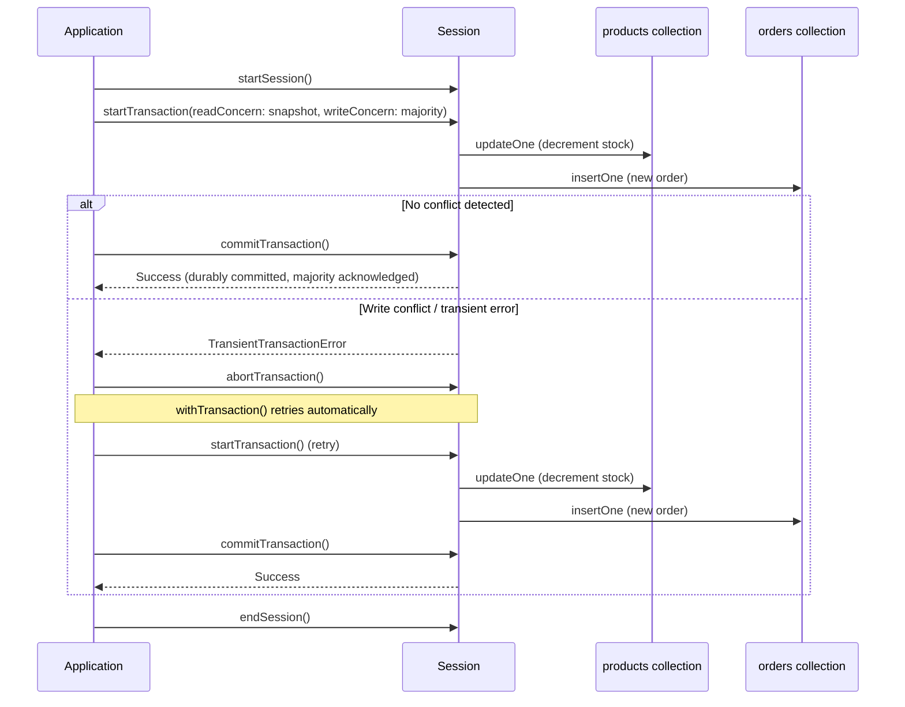

# Transactions & ACID

You've now spent five chapters mastering data inside a single-document, single-collection mental model: designing documents (Chapter 5), reading and writing them atomically one at a time (Chapter 4), and reshaping them with aggregation pipelines (Chapters 7–10). For a large share of real applications, that mental model is sufficient forever — MongoDB was deliberately designed so that good schema design makes "atomic enough" the default. But some operations, by their nature, must touch more than one document — sometimes in more than one collection — and either fully succeed together or fully fail together, with no in-between state ever visible to anyone. Transferring money between two bank accounts, or placing an order that must decrement inventory and create an order record as a single indivisible unit, are the classic examples. This chapter is about what MongoDB gives you when a single document's atomicity guarantee isn't enough: multi-document ACID transactions, how they work under the hood, and — just as important — when the right answer is to avoid needing one at all.

---

## Learning Objectives

By the end of this chapter, you will be able to:

- Define the four ACID properties precisely, and explain how each applies to a database transaction in general.
- Explain why every single-document write in MongoDB — including updates to nested fields and arrays — is always atomic, with no transaction required.
- Recognize the specific situations where single-document atomicity is not enough, and true multi-document/multi-collection transactions are required.
- Write a multi-document transaction using `startSession()`, `startTransaction()`/`commitTransaction()`/`abortTransaction()`, and the `withTransaction()` convenience wrapper.
- Handle retryable transaction errors (`TransientTransactionError`, `UnknownTransactionCommitResult`) correctly instead of failing silently or crashing.
- Explain how read concern (`"snapshot"`) and write concern (`"majority"`) interact with transactions, and what causal consistency guarantees within a session.
- Apply the idiomatic MongoDB design principle: model data to avoid needing transactions where possible, and reach for them only when you genuinely need atomic multi-document semantics.

---

## Prerequisites for This Chapter

This chapter builds directly on [Chapter 4: CRUD Fundamentals](./04-crud-fundamentals.md) and [Chapter 5: Data Modeling & Schema Design](./05-data-modeling-and-schema-design.md). We assume you already know:

- The full range of CRUD operations, including atomic read-modify-write operators like `findOneAndUpdate` and field/array update operators such as `$set`, `$inc`, and `$push` (Chapter 4).
- The embedding-vs-referencing trade-off, and named schema design patterns like the Extended Reference and Subset patterns (Chapter 5). This matters enormously here: whether you *need* a transaction at all is frequently a schema design decision made back in Chapter 5, not something you fix later with more transaction code.
- The basic mongod/replica-set architecture and the idea of write acknowledgment previewed in [Chapter 3: Architecture & Internals](./03-architecture-and-internals.md) — this chapter uses that vocabulary but doesn't require deep replication knowledge, which arrives in full in [Chapter 12](./12-replication-and-high-availability.md).

If any of that is shaky, revisit those chapters first — this chapter assumes CRUD syntax and the embed-vs-reference decision as settled ground and builds straight on top of them.

---

## 1. ACID, Precisely

"ACID" is an acronym for four properties a database transaction should guarantee. These properties originated in relational database theory, but they are properties of *any* transactional system, MongoDB included, once you're doing more than a single atomic write.

- **Atomicity** — A transaction is "all or nothing." Every operation inside it either commits together, or none of them take effect at all. There is no partial-completion state that any other client can ever observe.
- **Consistency** — A transaction takes the database from one valid state to another valid state, never violating declared constraints (schema validation rules, unique indexes, application invariants) along the way or at the end.
- **Isolation** — Concurrent transactions do not see each other's uncommitted, in-progress changes. From inside a transaction, and from outside it, the system behaves as if transactions ran one at a time, even if they're actually interleaved for performance.
- **Durability** — Once a transaction is reported as committed, its effects survive — even a server crash immediately afterward will not lose that data, because it has been durably written (and, per your write concern, replicated).

In a general database context, these four properties are what let application developers reason about correctness without personally re-deriving concurrency control theory for every feature. You write "do A and B together," and the database guarantees you'll never observe "A happened but B didn't," or "B saw an in-progress, half-finished A."

MongoDB has supported single-document ACID compliance since its earliest versions. Multi-document ACID transactions — the main subject of this chapter — arrived in MongoDB 4.0 for replica sets (2018) and were extended to sharded clusters in MongoDB 4.2 (2019).

---

## 2. Single-Document Atomicity: The Default You Already Have

This is the single most important fact in this chapter, and it's easy to underrate because it was already true in every example back in Chapter 4: **every write to a single document in MongoDB is always atomic**, automatically, with no transaction, no session, and no extra syntax required.

This atomicity is not limited to simple top-level field replacement. It covers:

- Setting or incrementing a top-level field.
- Modifying a deeply nested field inside embedded sub-documents.
- Pushing, pulling, or otherwise mutating elements inside an array field.
- Any combination of the above, applied by a single update operator document, such as:

```javascript
db.accounts.updateOne(
  { _id: "acct-1" },
  {
    $inc: { balance: -50 },
    $push: { history: { type: "debit", amount: 50, at: new Date() } }
  }
)
```

Even though this single `updateOne` call touches two logically different parts of the document (a scalar balance and a history array), MongoDB guarantees that no other client can ever observe a state where the balance was decremented but the history entry wasn't appended, or vice versa. The whole document-level update is applied as one atomic unit at the storage engine level.

### 2.1 Why this is a deliberate design point

This is not an incidental implementation detail — it's a foundational design decision, and it's the reason Chapter 5 spent an entire chapter teaching you *when to embed*. If related data lives together inside one document, you get atomicity, isolation, and consistency for operations on that data **for free**, with better performance than a transaction would ever give you, because there's no cross-document locking or coordination overhead at all.

Consider an e-commerce cart: if `cartItems` is an array embedded inside the `cart` document, adding an item and updating the cart's `updatedAt` timestamp and `itemCount` field can all happen in one atomic `updateOne` call. No transaction needed — the schema design already made the operation atomic by construction.

This is why the idiomatic MongoDB advice, revisited throughout this chapter, is: **reach for embedding first, transactions second.** A well-modeled schema (Chapter 5) often eliminates the *need* for a multi-document transaction entirely, simply by putting the things that must change together into the same document.

---

## 3. When Single-Document Atomicity Isn't Enough

Embedding solves atomicity within one document, but not every real-world "must happen together" requirement can be collapsed into one document. Two canonical examples:

**1. Funds transfer between two accounts.** If `checking` and `savings` are separate documents (often even in the same `accounts` collection, but as two distinct documents with their own `_id`), then "debit $100 from checking, credit $100 to savings" is fundamentally a two-document operation. There is no way to embed one bank account inside another — they're independent entities that must each be independently queryable, indexable, and updatable outside of any single transfer. A crash between the debit and the credit would either destroy $100 (debited but never credited) or create $100 out of nowhere (credited but never debited).

**2. Order placement across two collections.** Decrementing `stock` on a document in the `products` collection and inserting a new document into the `orders` collection are, by definition, changes to two different collections. You cannot embed an entire product document inside every order (that duplicates and staleness-risks the whole catalog), and you cannot embed all of a product's orders inside the product document (unbounded array growth, Chapter 5's "Massive Array" anti-pattern). These are legitimately separate collections that must nonetheless change together, atomically, for this one business operation.

In both cases, the correct fix is not "restructure the schema harder until it fits in one document" — the data genuinely models two independent entities. This is precisely the situation multi-document transactions exist for.

---

## 4. Multi-Document Transactions in Depth

A MongoDB transaction is always associated with a **session** — a construct that tracks a sequence of related operations. Sessions matter here because a transaction's very identity (which operations belong to it) is defined by which session's `startTransaction()` and `commitTransaction()` calls bracket them.

### 4.1 The manual (low-level) API

```javascript
const session = db.getMongo().startSession();

try {
  session.startTransaction({
    readConcern: { level: "snapshot" },
    writeConcern: { w: "majority" }
  });

  const products = session.getDatabase("shop").products;
  const orders = session.getDatabase("shop").orders;

  products.updateOne(
    { _id: "sku-123", stock: { $gte: 1 } },
    { $inc: { stock: -1 } }
  );

  orders.insertOne({
    _id: "order-9001",
    sku: "sku-123",
    quantity: 1,
    status: "placed",
    createdAt: new Date()
  });

  session.commitTransaction();
} catch (error) {
  session.abortTransaction();
  throw error;
} finally {
  session.endSession();
}
```

Walking through the lifecycle:

- **`startSession()`** creates a logical session — a lightweight handle the server uses to track state (including causal consistency, Section 6) across multiple operations.
- **`startTransaction()`** marks the beginning of the atomic block. No writes inside it are visible to any other session until commit.
- Every operation between `startTransaction()` and `commitTransaction()` must run **through the session handle** (note `session.getDatabase(...)` above, not the top-level `db`) — this is the most common beginner mistake, covered again in Section 9.
- **`commitTransaction()`** durably applies all buffered operations as one atomic unit, subject to the write concern specified.
- **`abortTransaction()`** discards every operation in the transaction as if none of them ever happened — this is what you call explicitly on business-logic failure (e.g., insufficient stock), and what you must call in a `catch` block on any unexpected error, or the transaction (and the locks/resources it holds) can linger.

### 4.2 The convenience wrapper: `withTransaction()`

Hand-rolling try/catch/retry logic around commit and abort is repetitive and easy to get subtly wrong, so the driver provides `withTransaction()`, which wraps a callback with the correct commit, abort, and — critically — **retry** behavior built in:

```javascript
const session = db.getMongo().startSession();

try {
  session.withTransaction(() => {
    const products = session.getDatabase("shop").products;
    const orders = session.getDatabase("shop").orders;

    const result = products.updateOne(
      { _id: "sku-123", stock: { $gte: 1 } },
      { $inc: { stock: -1 } }
    );

    if (result.modifiedCount === 0) {
      throw new Error("Insufficient stock");
    }

    orders.insertOne({
      _id: "order-9001",
      sku: "sku-123",
      quantity: 1,
      status: "placed",
      createdAt: new Date()
    });
  }, {
    readConcern: { level: "snapshot" },
    writeConcern: { w: "majority" }
  });
} finally {
  session.endSession();
}
```

`withTransaction()` automatically retries the entire callback if MongoDB reports a retryable error, and automatically aborts the transaction if the callback throws for any other reason. This is why it's the recommended entry point for essentially all application code — reach for the manual API in Section 4.1 only when you need control the wrapper doesn't give you.

### 4.3 Retryable transaction errors

Transactions can fail for reasons that are transient and expected under normal operation — a replica set election happening mid-transaction, a momentary network blip, or another transaction briefly holding a conflicting lock. MongoDB surfaces these as **error labels** on the exception, and the driver's retry logic (and `withTransaction()`) key off them:

- **`TransientTransactionError`** — the entire transaction failed before commit was attempted (or definitely didn't commit), and it is safe to retry the whole transaction from the top, including `startTransaction()` again.
- **`UnknownTransactionCommitResult`** — the commit itself was attempted, but the client couldn't confirm whether it succeeded (e.g., a network timeout waiting for the commit acknowledgment). It is safe to retry *only the commit* — not the whole transaction — because the operations were already sent; MongoDB's commit retry logic is idempotent for this reason.

Retry logic matters because, without it, an application that hand-rolls transactions will intermittently and unpredictably fail on conditions that are a completely normal part of operating a replicated, concurrent system — not genuine application bugs. Treating a `TransientTransactionError` as a hard failure (e.g., surfacing a 500 to the end user) instead of retrying is one of the most common — and most avoidable — transaction mistakes in production MongoDB code.

### 4.4 Transaction lifecycle diagram



---

## 5. Read Concern and Write Concern Inside Transactions

Transactions interact with two settings you'll see formalized in full in [Chapter 12](./12-replication-and-high-availability.md), but need a working understanding of now:

- **Read concern `"snapshot"`** — Inside a transaction, all reads see a single, consistent snapshot of the data as of the moment the transaction started (technically, as of the first read or write in the transaction), regardless of what other concurrent writes commit while your transaction is still open. This is what delivers the **Isolation** property: your transaction never sees another transaction's half-finished work, and never sees data change mid-transaction due to unrelated concurrent activity.
- **Write concern `"majority"`** — When you commit a transaction with `writeConcern: { w: "majority" }`, the commit is not reported as successful until a majority of replica set members have acknowledged it. This is what delivers the **Durability** property in a replicated deployment: a committed transaction survives the failure of the primary, because a majority of nodes already have the data.

These two settings are usually specified together at `startTransaction()` (or as defaults on the client), because a transaction that used a weak read concern loses isolation guarantees, and one committed with a weak write concern loses durability guarantees — using `snapshot`/`majority` together is what makes "ACID transaction" a true, complete claim rather than a partial one. MongoDB's transaction API actually defaults transactions to `readConcern: "snapshot"` and `writeConcern: "majority"` if you don't specify them explicitly, precisely because those are the settings that make the ACID guarantees hold.

---

## 6. Causal Consistency, Briefly

Every session (including one used for a transaction) provides **causal consistency** for the sequence of operations run through it: if operation B runs after operation A in the same session, and A causally affects B (for example, A writes a value that B then reads), the driver guarantees B will observe the effects of A — even if B is routed to a different secondary node that might otherwise be slightly behind.

In plain terms: within one session, you never have to worry about "read your own write" failures, or seeing operations appear out of the order you issued them in. This matters even outside transactions (a plain session gets causal consistency too), but it's especially relevant inside a transaction, where every operation in the block must build on a single, mutually consistent view of the world. Full replication mechanics — how secondaries actually stay in sync, and how read preference interacts with causal consistency — are covered in depth in [Chapter 12](./12-replication-and-high-availability.md).

---

## 7. Performance and Design Guidance

Transactions are not free. Compared to a single-document write, a multi-document transaction:

- **Holds locks for longer.** A transaction holds resources (including locks relevant to write conflict detection) from `startTransaction()` until commit or abort — the longer that window stays open, the more it can block or conflict with concurrent operations touching the same documents.
- **Adds coordination overhead.** Snapshot reads, majority write acknowledgment, and (in a sharded cluster) two-phase commit across shards all add latency that a single-document atomic update simply doesn't incur.
- **Has a default execution time limit.** MongoDB aborts transactions that run past a configurable limit (one minute by default) specifically to prevent long-running transactions from accumulating too much lock contention and oplog pressure.

This is why the idiomatic MongoDB advice bears repeating as an explicit design rule, tying directly back to Chapter 5:

> **Model your data (embed related, together-changing data into one document) to avoid needing transactions wherever the domain allows it. Reach for multi-document transactions only when you have two or more genuinely independent entities — as in Section 3 — that must change atomically together.**

A schema that embeds sensibly (Chapter 5's guidance: embed things that are read together, updated together, and don't grow unboundedly) will need far fewer transactions than a schema that reflexively normalizes everything into separate collections the way a relational schema would. Transactions exist as a safety net for the genuine cross-entity cases — not as a substitute for schema design.

---

## Real-World Scenario

**Setup:** An e-commerce backend has a `products` collection (tracking `stock` per SKU) and a separate `orders` collection (one document per placed order). When a customer places an order, the system must decrement the product's stock **and** create the order record — and it must never do just one of the two. If the process crashes after decrementing stock but before creating the order, that unit of stock is silently lost forever with no order to account for it. If it crashes after creating the order but before decrementing stock, the shop can oversell.

**The transactional solution**, using `withTransaction()` as the recommended entry point:

```javascript
function placeOrder(client, sku, quantity, customerId) {
  const session = client.startSession();

  try {
    let orderId;

    session.withTransaction(() => {
      const products = session.getDatabase("shop").products;
      const orders = session.getDatabase("shop").orders;

      // Atomically decrement stock, but only if enough is available.
      const stockUpdate = products.updateOne(
        { _id: sku, stock: { $gte: quantity } },
        { $inc: { stock: -quantity } },
        { session }
      );

      if (stockUpdate.matchedCount === 0) {
        // Not enough stock — abort the whole transaction.
        throw new Error(`Insufficient stock for SKU ${sku}`);
      }

      orderId = new ObjectId();
      orders.insertOne({
        _id: orderId,
        sku: sku,
        quantity: quantity,
        customerId: customerId,
        status: "placed",
        createdAt: new Date()
      }, { session });
    }, {
      readConcern: { level: "snapshot" },
      writeConcern: { w: "majority" }
    });

    return orderId;
  } finally {
    session.endSession();
  }
}
```

**Why this works:** If the stock update fails the `stock: { $gte: quantity }` filter (out of stock), `matchedCount` is `0`, the callback throws, and `withTransaction()` aborts everything — no order document is ever created for a sale that can't be fulfilled. If a transient replica set event happens mid-transaction, `withTransaction()` retries the entire callback automatically. And because both writes are inside one transaction with `writeConcern: "majority"`, any observer — another request reading `products` or `orders` — either sees the world exactly as it was before the order (both unchanged) or exactly as it is after (stock decremented **and** order present). No third state is ever visible, and no crash between the two writes can produce a torn outcome.

---

## Best Practices

- **Prefer schema design that avoids needing transactions in the first place.** Revisit Chapter 5's embedding patterns before reaching for a transaction — many apparent "multi-document" problems are actually a sign the schema should embed the related data.
- **Keep transactions short-lived.** Do the minimum number of reads/writes needed, avoid unrelated work inside the transaction body, and never make an external network call (an API request, an email send) from inside an open transaction.
- **Always use `withTransaction()` rather than hand-rolling commit/abort/retry logic.** It already implements the correct retry behavior for `TransientTransactionError` and `UnknownTransactionCommitResult` — reinventing it is a common source of subtle bugs.
- **Always implement (or rely on the driver's) retry logic for transient transaction errors.** These are a normal, expected part of operating a distributed, replicated system, not exceptional application failures.
- **Use `readConcern: "snapshot"` and `writeConcern: "majority"` together for transactions that need true ACID guarantees.** Weakening either one weakens the corresponding guarantee (isolation or durability).
- **Route every operation inside a transaction through the session handle**, not the top-level `db` object — an operation issued outside the session silently runs outside the transaction.
- **Design idempotent business logic where feasible**, so that a retried transaction (e.g., after an `UnknownTransactionCommitResult`) can't accidentally double-apply an effect from the caller's point of view.

---

## Common Mistakes

- **Reaching for transactions as a first resort instead of considering embedding.** This is the single most common mistake — teams coming from relational backgrounds instinctively normalize schemas and then patch the resulting cross-collection consistency problem with transactions, when embedding (Chapter 5) would have avoided the problem entirely.
- **Not handling `TransientTransactionError` and treating a normal, retryable condition as a hard failure** — surfacing an error to the end user (or crashing a background job) for a condition the driver was designed to retry through automatically.
- **Holding a transaction open across a slow external call** (an HTTP request to a payment gateway, a file upload, an email send). This dramatically extends lock hold time, increases the chance of hitting the transaction time limit, and can stall unrelated operations on the same documents.
- **Assuming transactions have zero performance cost.** Every transaction adds snapshot-read and majority-commit overhead compared to a single-document write; using transactions indiscriminately for operations that don't need cross-document atomicity degrades throughput for no benefit.
- **Forgetting to pass the session into every operation inside the transaction callback.** An `updateOne` or `insertOne` issued without `{ session }` (or without going through the session-scoped database handle) executes entirely outside the transaction, silently breaking the atomicity guarantee you thought you had.
- **Not calling `abortTransaction()` (or letting `withTransaction()` do it) on unexpected errors**, leaving a transaction dangling until it times out, unnecessarily holding locks in the meantime.
- **Retrying only the commit step for a `TransientTransactionError`** (rather than the whole transaction from `startTransaction()`) — the two error labels require different retry scopes, and conflating them can silently drop operations on retry.

---

## Summary

- **ACID** — Atomicity, Consistency, Isolation, Durability — describes the guarantees a transaction gives you: all-or-nothing effects, valid-state-to-valid-state transitions, no visibility into other transactions' in-progress work, and survival of committed data past a crash.
- **Every single-document write in MongoDB, including nested fields and arrays, is always atomic** — no transaction required. Good schema design (Chapter 5's embedding patterns) leans on this to avoid needing transactions at all.
- **Multi-document, multi-collection operations** — like a funds transfer between two account documents, or an order flow that decrements stock in `products` and inserts into `orders` — genuinely need atomic guarantees a single document can't provide on its own.
- Multi-document transactions use **sessions** (`startSession()`), are bracketed by `startTransaction()`/`commitTransaction()`/`abortTransaction()`, and are best driven through the **`withTransaction()`** convenience wrapper, which handles retry logic for you.
- **`TransientTransactionError`** means retry the whole transaction; **`UnknownTransactionCommitResult`** means retry only the commit — both are normal, expected conditions in a distributed system, not application bugs.
- Transactions default to (and should generally use) **`readConcern: "snapshot"`** for isolation and **`writeConcern: "majority"`** for durability; **causal consistency** within a session guarantees operations observe the effects of earlier operations in the same session.
- Transactions have real overhead — longer lock hold times, coordination cost, and an execution time limit — so the idiomatic advice is: **model data to avoid needing transactions where possible (Chapter 5), and use them only when you genuinely need atomic multi-document semantics.**

---

## Knowledge Check

1. Explain, in your own words, why an update that modifies both a top-level field and a nested array element in the same document never requires a transaction in MongoDB.
2. A colleague proposes storing every customer's entire order history as an embedded array inside their customer document, specifically "to avoid needing transactions." What's wrong with this plan, and what does Chapter 5 call this kind of anti-pattern?
3. What is the difference between a `TransientTransactionError` and an `UnknownTransactionCommitResult`, and why does the correct retry behavior differ between the two?
4. Why does MongoDB default multi-document transactions to `readConcern: "snapshot"` and `writeConcern: "majority"` rather than weaker settings? What guarantee would be lost with each one weakened?
5. Describe a scenario (other than the order-placement example in this chapter) that genuinely requires a multi-document transaction, and explain why embedding could not solve it instead.

---

## Hands-On Exercise

Work through this in `mongosh` against a replica set (transactions require a replica set or sharded cluster — a standalone `mongod` cannot run them; a local single-node replica set via `rs.initiate()`, or a free Atlas cluster, both work).

1. **Seed the collections.** Create a `stock_test` database with a `products` collection containing one document, `{ _id: "sku-42", name: "Wireless Mouse", stock: 3 }`, and an empty `orders` collection.

2. **Implement the transaction.** Write a `placeOrder(sku, quantity)` function (following the pattern from the Real-World Scenario above) using `startSession()` and `withTransaction()` that: (a) decrements `stock` on the matching product only if `stock >= quantity`, throwing if not; (b) inserts a new document into `orders` recording the sale.

3. **Run a successful order.** Call `placeOrder("sku-42", 1)`. Confirm `products` now shows `stock: 2` and `orders` contains exactly one new document.

4. **Simulate a failure partway through.** Modify your function temporarily to throw an error *after* the stock `updateOne` call but *before* the `orders.insertOne()` call (e.g., `throw new Error("simulated failure")`). Run `placeOrder("sku-42", 1)` again and let it fail.

5. **Confirm the abort left no partial state.** Query `products` and confirm `stock` is still `2` (unchanged from step 3 — the decrement inside the aborted transaction was rolled back) and query `orders` and confirm no new document was inserted. This proves atomicity: the simulated crash between the two writes left the database exactly as it was before the attempt, not in a torn "stock decremented, no order" state.

6. **Remove the simulated failure and re-run.** Restore your function to its correct form, call `placeOrder("sku-42", 1)` once more, and confirm `stock` correctly drops to `1` with a second order document present — the transaction succeeds cleanly once nothing interrupts it.

7. **Test the stock-guard business rule.** Call `placeOrder("sku-42", 100)` (more than available stock) and confirm the transaction aborts with your "insufficient stock" error, and that neither `stock` nor `orders` changed as a result.

---

## Further Reading

- [Transactions](https://www.mongodb.com/docs/manual/core/transactions/) — the official conceptual and API reference for multi-document transactions.
- [Read Concern](https://www.mongodb.com/docs/manual/reference/read-concern/) — full reference on read concern levels, including `"snapshot"`.
- [Write Concern](https://www.mongodb.com/docs/manual/reference/write-concern/) — full reference on write concern, including `"majority"` and durability semantics.
- [Read Isolation, Consistency, and Recency](https://www.mongodb.com/docs/manual/core/read-isolation-consistency-recency/) — how MongoDB delivers isolation guarantees, including causal consistency.
- [Production Considerations for Transactions](https://www.mongodb.com/docs/manual/core/transactions-production-consideration/) — operational limits (time limits, oplog sizing) relevant to running transactions safely in production.

---

<div style="display:flex;justify-content:space-between;align-items:center;">
  <a href="./10-advanced-aggregation-patterns.md">← Previous: Advanced Aggregation Patterns</a>
  <a href="./00-index.md">🏠 Index</a>
  <a href="./12-replication-and-high-availability.md">Next: Replication & High Availability →</a>
</div>
