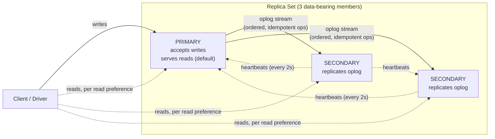
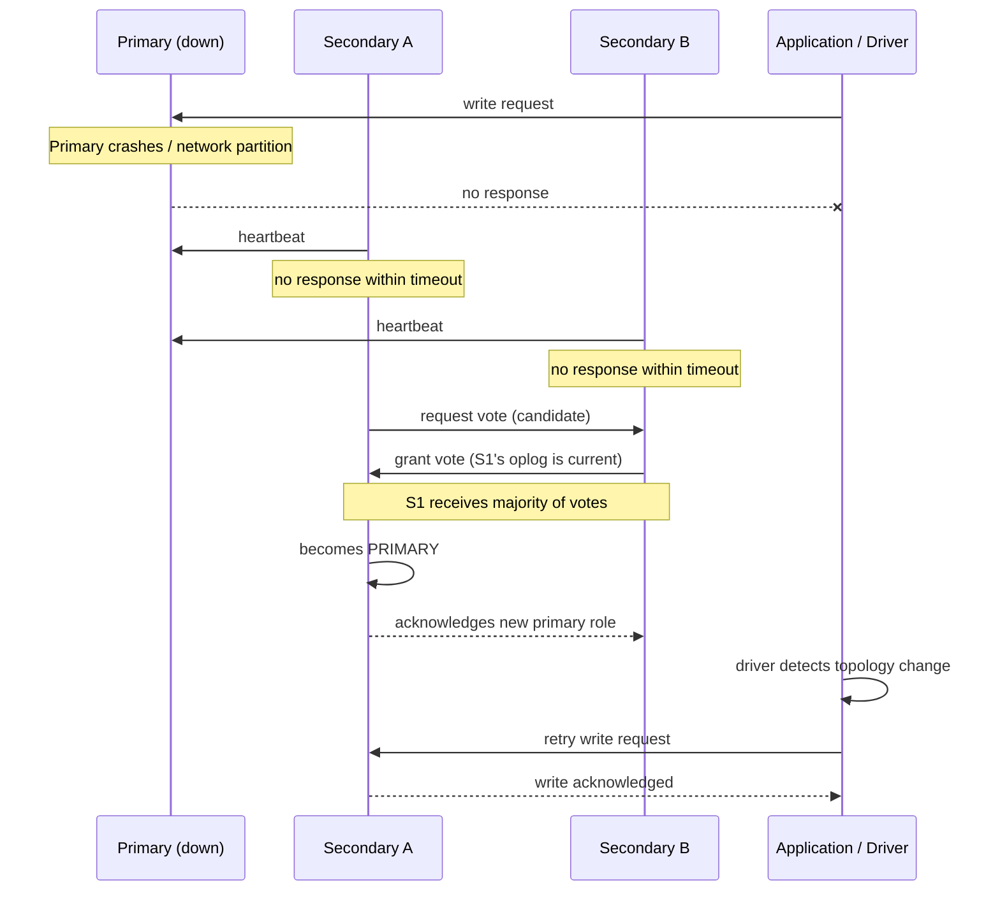

# Replication & High Availability

Chapter 11 leaned on two settings — write concern and read concern — without fully explaining the machinery underneath them: what does it actually mean for a write to be acknowledged by "a majority," or for a read to be "linearizable"? Those guarantees are not abstractions MongoDB invents on the spot; they are direct consequences of how a **replica set** — a group of `mongod` processes holding copies of the same data — replicates writes from one member to the rest, and how it decides who is allowed to accept writes at all. This chapter goes deep on that machinery: the oplog that carries every write from primary to secondaries, the election process that picks a new primary within seconds of a failure, the full menu of read preference and write/read concern options that Chapter 11 previewed, and the failover and rollback behavior that determines whether your data actually survives a primary crash. By the end, "majority write concern" and "snapshot read concern" will no longer be settings you copy from an example — they'll be guarantees you can derive from first principles.

---

## Learning Objectives

By the end of this chapter, you will be able to:

- Explain what a replica set is, why production MongoDB deployments never run as a single standalone `mongod`, and how primary/secondary roles work.
- Describe the oplog's structure and role, including how replication lag and oplog sizing affect a secondary's ability to stay in sync.
- Trace an election end-to-end — heartbeats, priority, majority voting — and explain the role of arbiters and the brief write-unavailability window during failover.
- Choose the correct read preference mode (`primary`, `primaryPreferred`, `secondary`, `secondaryPreferred`, `nearest`) for a given workload, and articulate the consistency trade-off each one makes.
- Explain write concern (`w: 1`, `w: "majority"`, `w: <n>`, `j`) and read concern (`local`, `available`, `majority`, `linearizable`) in full depth, building on Chapter 11's preview.
- Explain what rollback is, why it happens after a failover, and why `w: "majority"` is the specific setting that prevents a client from ever losing an acknowledged write to it.
- Stand up a working three-node replica set, insert data with an explicit write concern, and observe an automatic election after killing the primary.

---

## Prerequisites for This Chapter

This chapter builds directly on [Chapter 3: Architecture & Internals](./03-architecture-and-internals.md) and [Chapter 11: Transactions & ACID](./11-transactions-and-acid.md). We assume you already know:

- The single-node write pipeline — cache, journal, checkpoint — from Chapter 3, and that a replica set's oplog is durability-protected by that exact same pipeline, not by some separate mechanism.
- Chapter 3's orienting-level preview of replica set architecture (primary, secondaries, oplog) — this chapter is the "full depth" that preview explicitly deferred to here.
- Chapter 11's read concern (`"snapshot"`) and write concern (`"majority"`) as used *inside a transaction* — this chapter generalizes both concepts to every write and read in a replicated deployment, transactional or not.
- Basic `mongosh` usage from earlier chapters, since the hands-on exercise runs real replica-set administration commands.

If any of that is shaky, revisit those chapters first — this chapter assumes the vocabulary of "primary," "secondary," and "oplog" as already-introduced terms and goes straight into their internals.

---

## 1. Replica Set Fundamentals

### 1.1 What a replica set is

A **replica set** is a group of `mongod` processes that maintain the same data set. One member is elected **primary** and is the only member that accepts write operations; the rest are **secondaries**, which continuously copy the primary's writes and apply them to their own copy of the data. If the primary becomes unavailable for any reason — a crash, a network partition, a planned maintenance restart — the remaining eligible members automatically hold an **election** and promote one of themselves to primary, so the replica set as a whole keeps accepting writes without a human paged awake at 3 a.m. to manually fail it over.

A typical production replica set has an **odd number of voting members** — most commonly three: one primary and two secondaries. The odd count isn't a superstition; it's what makes majority voting (Section 3) unambiguous, and it's directly why Section 8's hands-on exercise builds exactly three nodes.

### 1.2 Why not just run one server?

Chapter 3 already flagged this as a Best Practice, but it's worth stating precisely here: a standalone `mongod` is a **single point of failure**. If its host crashes, its disk fails, or its process is killed, your database is down for as long as it takes a human to notice and intervene — and if the failure was a disk failure rather than a process crash, "intervene" might mean restoring from a backup that's hours old, i.e., real data loss, not just downtime.

A replica set converts that single point of failure into a **fault-tolerant system**: as long as a majority of voting members are up and can reach each other, the replica set keeps functioning, automatically, without manual failover. This is the entire reason replication exists as a MongoDB feature, and it is also what makes multi-document transactions possible at all (Chapter 11) — transactions require a replica set (or sharded cluster) specifically because their durability guarantee (`writeConcern: "majority"`) is a *replication* guarantee, not something a standalone server could ever provide on its own.

### 1.3 Primary and secondary roles

- **The primary** accepts all writes (by default) and records every one of them, in order, in its oplog. It can also serve reads, and does so by default (`readPreference: "primary"`, Section 4).
- **Secondaries** replicate the primary's oplog and apply the same operations, in the same order, to their own data — this is what keeps them consistent with the primary, modulo a small amount of unavoidable **replication lag** (Section 2). Secondaries can optionally serve reads if the client's read preference allows it (Section 4), and they vote in elections (Section 3).
- **Hidden members** are secondaries that replicate normally but are invisible to client read preference routing and to `db.hello()`'s list of servers — useful for a dedicated backup or reporting node that shouldn't accidentally receive application traffic.
- **Delayed members** are secondaries deliberately configured to lag behind the primary by a fixed time window (e.g., one hour), replicating everything but with a delay — a built-in defense against operator error or application bugs that corrupt data, since a delayed member gives you a rewindable, recent-but-not-*too*-recent copy to recover from.
- **Arbiters** (Section 3.3) vote in elections but hold no data at all.



---

## 2. The Oplog: How Secondaries Stay in Sync

### 2.1 What the oplog is

The **oplog** (short for "operations log") is a special, fixed-size (capped) collection — `local.oplog.rs` — that lives on every member of a replica set. Every write the primary applies is recorded in the oplog as an idempotent, ordered entry describing that operation, *after* it has been applied to the primary's own data. Secondaries continuously **tail the oplog** — reading new entries as they're appended, essentially the same technique as `tail -f` on a log file — and apply each entry to their own copy of the data, in the exact order it appears.

Critically, oplog entries are **idempotent**: applying the same entry twice produces the same result as applying it once. An `$inc: { stock: -1 }` in application code is not idempotent (running it twice halves the stock further), but the oplog doesn't record "decrement stock by 1" — it records the resulting operation in a form equivalent to "set stock to 41," a specific, replayable state transition. This property is what makes crash recovery and resync (Section 2.3) safe: if a secondary accidentally re-applies an entry it already processed, nothing breaks.

### 2.2 Oplog size and replication lag

The oplog is a **capped collection**: it has a fixed maximum size, and once full, the oldest entries are automatically overwritten by new ones — first in, first out. This has a direct, important consequence:

- The oplog's size determines its **time window** — how far back in time its oldest surviving entry goes. A larger oplog, or a lower write volume, means a longer window; a smaller oplog under heavy write load means a shorter window.
- **Replication lag** is simply the delay between an operation being applied on the primary and that same operation being applied on a given secondary. Some lag is normal and expected — network latency, a secondary doing more disk I/O than the primary, or a secondary temporarily busy with another task can all cause it.
- The danger case: if a secondary falls behind by **more than the oplog's time window**, the entries it still needs to catch up on have already been overwritten. That secondary can no longer catch up incrementally — it requires a **full resync** (or restoring from a recent backup/snapshot), copying the entire dataset from scratch, which is slow and resource-intensive on a large collection.

This is precisely why oplog sizing is a real operational concern, not a one-time default to accept blindly: a healthy oplog window should comfortably exceed your worst realistic maintenance or network-partition duration, so a secondary that's offline for, say, a few hours during a maintenance window can still catch up normally rather than needing a full resync.

### 2.3 Monitoring and sizing the oplog in practice

You can inspect the oplog's current window with:

```javascript
rs.printReplicationInfo()
```

which reports the oplog's configured size, its first and last recorded timestamps, and the time span they cover. Watching `rs.status()`'s `optimeDate` per member over time is the standard way to observe live replication lag. The oplog's size is set at replica set initialization (defaulting to a percentage of free disk space) but can be resized later with `replSetResizeOplog` without downtime — a common operational adjustment as write volume grows.

---

## 3. Elections

### 3.1 Heartbeats and failure detection

Every member of a replica set sends a **heartbeat** to every other member roughly every 2 seconds, and expects a response within a configurable timeout (10 seconds by default). If a member — including the primary — fails to respond to enough consecutive heartbeats, the other members mark it as unreachable. When enough members can no longer reach the primary, an election is triggered automatically: no human needs to declare the primary dead.

### 3.2 How a new primary is chosen

An election is fundamentally a **majority vote** among the replica set's voting members, run using a Raft-inspired consensus protocol. At a conceptual level:

1. A secondary that can no longer reach the primary (and believes an election is warranted) becomes a **candidate** and requests votes from the other voting members.
2. Each voting member casts at most one vote per election term, generally for the candidate with the most up-to-date, highest-priority data — a member whose oplog is behind cannot become primary and effectively won't win a vote against a more current candidate.
3. **`priority`** (a configurable 0–1000 value per member, default 1) biases this further: higher-priority members are preferred as primary, and a member with `priority: 0` can never become primary at all — useful for a secondary you deliberately want to keep out of the primary role (e.g., a reporting-only or geographically distant node).
4. The candidate that receives votes from a **strict majority of all voting members** (not just of the members currently reachable) wins and becomes the new primary. This majority requirement is exactly why replica sets need an odd number of voting members and why a partition that leaves fewer than a majority reachable results in **no primary at all** — the surviving minority correctly refuses to elect one, because it cannot be sure the majority side (if it exists) hasn't already elected a different primary. This avoids a split-brain scenario where two primaries could both accept writes simultaneously.

### 3.3 Arbiters

An **arbiter** is a special replica set member that participates in elections (it votes) but holds **no data** and cannot itself become primary. Arbiters exist purely to break ties and satisfy the majority-vote math cheaply: a two-data-node replica set (primary + one secondary) has an even number of votes and can't safely resolve every failure scenario, but adding one arbiter makes it three voting members total, restoring an odd number without the cost of a third full data copy.

Arbiters are a reasonable cost-saving option for smaller or budget-constrained deployments, but they come with a real trade-off worth naming: because an arbiter holds no data, it can never actually take over as primary or serve reads — it only ever adds a vote. Most production guidance today favors three full data-bearing nodes over "two data nodes plus an arbiter" specifically because the third data-bearing node also gives you an actual extra durable copy of your data, not just an extra vote.

### 3.4 The unavailability window during an election

An election takes a real, if brief, amount of wall-clock time — typically on the order of a few seconds to a small number of seconds under normal conditions (dominated by the heartbeat-timeout detection window plus the vote itself), though it can take longer under network instability. **During that window, the replica set has no primary, and therefore cannot accept any writes at all.** Reads with `readPreference: "secondary"` (or similar) can continue uninterrupted, since secondaries are unaffected by the election happening around them, but any client attempting a write (or a read requiring the primary) will see errors or elevated latency until the new primary is elected and the driver's topology-monitoring logic discovers it.

Modern MongoDB drivers handle this gracefully via **retryable writes**: a write that fails specifically because of a primary stepping down or an election in progress is automatically retried once against the newly elected primary, transparently to your application code, provided the driver and server both support it (the default since MongoDB 3.6). This doesn't make the election window disappear, but it does mean a well-behaved, retry-aware driver usually shields your application from having to handle this failure mode manually.



---

## 4. Read Preference Modes

**Read preference** controls which replica set member(s) a driver is allowed to route a given read operation to. It's specified per query, per collection, or as a client-level default, and it's the single setting most responsible for the consistency-vs-availability-vs-latency trade-offs a MongoDB application makes on its read path.

| Mode | Routes reads to | Use when |
|---|---|---|
| `primary` (default) | The primary only | You need to always read the absolute latest write — the safe, strongly-consistent default. |
| `primaryPreferred` | The primary, if available; otherwise a secondary | You want primary-level freshness normally, but can tolerate briefly reading slightly stale data during a failover rather than failing the read outright. |
| `secondary` | Secondaries only (never the primary) | You want to deliberately offload read load off the primary and can tolerate replication lag — e.g., an analytics job, a reporting dashboard, or a batch export. |
| `secondaryPreferred` | Secondaries, if any are available; otherwise the primary | Same intent as `secondary`, but you'd rather fall back to the primary than fail the read entirely if no secondary is reachable. |
| `nearest` | Whichever member (primary or secondary) has the lowest network latency to the client | Latency matters more than which specific role serves the read — common in geographically distributed deployments where "the closest node" beats "the primary" for read speed. |

### 4.1 The consistency trade-off, explicitly

Reading from a secondary (`secondary` or `secondaryPreferred`) means accepting **eventual consistency** on that read: because of replication lag (Section 2.2), a secondary may not yet reflect the very latest write accepted by the primary. For an analytics dashboard aggregating yesterday's order volume, a few hundred milliseconds (or even a few seconds) of staleness is irrelevant. For "does this specific order exist yet, immediately after the checkout API call returned," reading from a lagging secondary can produce a wrong, confusing answer — the classic symptom being "I just wrote it, why isn't it showing up?"

A practical, common pattern: use `primary` (or `primaryPreferred`) for read-your-writes-sensitive application paths, and `secondary`/`secondaryPreferred` specifically for reporting, analytics, and background jobs that can tolerate a lag window in exchange for not competing with production traffic for the primary's resources.

### 4.2 Tag sets

Read preference can be further refined with **tag sets** — arbitrary key-value labels attached to replica set members (e.g., `{ region: "us-east" }`) — letting you express intent like "route to the nearest secondary in this specific data center," which matters in multi-region deployments where "nearest" by raw latency and "nearest" by compliance/data-residency requirements aren't always the same node.

---

## 5. Write Concern in Depth

Chapter 11 previewed write concern as the setting controlling how many nodes must acknowledge a write, and briefly introduced `j` alongside the journal pipeline in Chapter 3. Here is the complete picture.

### 5.1 The `w` option

`w` controls **how many replica set members** must acknowledge a write before the server reports it as successful to the client:

- **`w: 1`** (the historical default in older driver/server combinations) — only the **primary** needs to apply the write to its in-memory state before acknowledging. This is the fastest option latency-wise, but it carries a real risk: if the primary crashes before that write ever replicates to any secondary, and a failover then elects one of those secondaries as the new primary, the write can be **rolled back** and permanently lost (Section 7) — even though your application already received a success response.
- **`w: "majority"`** — a majority of the replica set's **voting, data-bearing members** must acknowledge the write. This is the modern recommended default for any write you cannot afford to lose: because a majority of nodes have the write, that write is guaranteed to survive any single-primary failover, since any newly elected primary is, by the majority-vote math of Section 3.2, guaranteed to have been part of (or as current as) that same majority.
- **`w: <n>`** — an explicit numeric count of members (e.g., `w: 2` in a three-node set) — a middle ground, though in practice `"majority"` is almost always preferable to a hardcoded number, because `"majority"` automatically adapts if the replica set's member count changes, whereas a fixed number silently stops meaning "a majority" the moment your topology grows or shrinks.
- **`w: 0`** — no acknowledgment requested at all ("fire and forget"). The driver doesn't even wait to learn whether the write succeeded. This is rarely appropriate outside of very specific, loss-tolerant, high-throughput logging-style workloads, since it discards MongoDB's own error reporting, not just replication guarantees.

### 5.2 The `j` (journal) option

`j: true` additionally requires that the acknowledging member(s) have written the operation to their on-disk **journal** (Chapter 3, Section 3.2) — not just applied it to the in-memory cache — before acknowledging. This closes the specific durability gap Chapter 3's Real-World Scenario walked through: without `j: true`, an acknowledged write on a given member could still be lost if *that member* crashes before its next journal flush, even if it was otherwise the primary and even independent of any replication concern. `j: true` is implied by default alongside `w: "majority"` on WiredTiger deployments in modern MongoDB versions, but it's worth understanding as its own explicit dimension, because it addresses single-node crash durability, whereas `w` addresses cross-node replication durability — two different failure scenarios, both real.

### 5.3 The latency/durability trade-off, concretely

| Write concern | What's guaranteed | Latency cost | Appropriate for |
|---|---|---|---|
| `{ w: 0 }` | Nothing — no acknowledgment at all | Lowest | High-volume, fully loss-tolerant telemetry/logging only |
| `{ w: 1 }` | Applied on primary's memory only | Low | Non-critical writes where losing a rare in-flight write on failover is acceptable |
| `{ w: 1, j: true }` | Durable on primary's disk, but not yet replicated | Low–moderate | Single-node durability without paying cross-node replication latency |
| `{ w: "majority" }` | Applied on a majority of members' memory | Moderate–higher | Most application writes that must survive a failover |
| `{ w: "majority", j: true }` | Durable on disk on a majority of members (the modern strong default) | Highest of these options | Financial transactions, order placement, anything where losing an acknowledged write is unacceptable |

The pattern to internalize: every additional guarantee (more nodes, plus disk durability) costs additional latency, because the primary has to wait for more confirmations before it can tell your application "done." Chapter 11's advice to choose write concern "deliberately per operation, not as one global default" is exactly what this table operationalizes — a shopping-cart click and a payment confirmation legitimately belong in different rows of this table.

---

## 6. Read Concern Levels

**Read concern** is a different axis entirely from read *preference* (Section 4): read preference decides **which member** answers a read; read concern decides **what guarantee** the returned data carries about how durably/consistently committed it is, regardless of which member serves it.

- **`local`** (the default for most reads) — returns the most recent data available on the member that serves the read, with no guarantee that data has been replicated to any other member yet. It's possible, in rare failover scenarios, for `local`-read data to later be rolled back (Section 7) if it turns out the read reflected a write that a majority of the replica set never actually received.
- **`available`** — similar to `local`, but relevant primarily to sharded clusters: it returns whatever data is present without waiting to filter out documents that might belong to since-migrated chunks. On a plain replica set (no sharding), `available` and `local` behave equivalently; the distinction becomes meaningful in [Chapter 13](./13-sharding-and-scalability.md).
- **`majority`** — returns only data that has been acknowledged by a majority of the replica set's members, meaning it's guaranteed to reflect a write that will **not** be rolled back, even if the primary that served the read subsequently fails. This is the read concern used inside transactions (as `"snapshot"`, a stronger relative — Section 6.1 below) and recommended wherever a read result must be safe to act on irreversibly.
- **`linearizable`** — the strongest level: guarantees that a read reflects the effects of every write that was majority-acknowledged before the read began, even across the boundary of a failover happening concurrently with the read. `linearizable` reads must go to the primary and involve extra coordination (effectively confirming the read against the current majority state before returning), making them the slowest but strictly strongest option — appropriate for genuinely rare cases like reading a lock/leader-election document where any staleness at all would be a correctness bug, not just an inconvenience.

### 6.1 How this connects to Chapter 11's `"snapshot"`

Chapter 11's `readConcern: "snapshot"` (used inside transactions) is a related but distinct guarantee from `"majority"`: `"snapshot"` guarantees a single, consistent point-in-time view across every read in the transaction (the **isolation** property), while `"majority"` guarantees that whatever is read has been durably majority-acknowledged and won't be rolled back (closer to the **durability**/rollback-safety guarantee discussed here). In practice, transactions typically combine both by reading at a snapshot that is *also* majority-committed, which is exactly why Chapter 11 recommended pairing `readConcern: "snapshot"` with `writeConcern: "majority"` together.

---

## 7. Failover and Rollback, End to End

This section connects Sections 3, 5, and 6 into the single scenario that motivates most of this chapter's guidance: **what actually happens to a write that was accepted by a primary but never made it to a majority before that primary went down?**

### 7.1 The failover sequence

1. The primary becomes unreachable (crash, network partition, manual step-down).
2. Remaining members detect this via missed heartbeats (Section 3.1) and hold an election (Section 3.2).
3. A new primary is elected — specifically, the most up-to-date eligible secondary, per the vote.
4. The old primary, if it later recovers and rejoins the replica set (rather than being permanently gone), discovers that a new primary now exists with a higher election term, and steps down to become a secondary itself.
5. Here's the crux: the old primary may have applied — and even acknowledged to a `w: 1` client — writes that it never got the chance to replicate to any other member before it went down. Those writes exist **only** in the old primary's own oplog/data, and the newly elected primary's oplog does **not** contain them (since, by definition, the new primary was elected as the *most current member the majority could agree on*, which by construction did not include those never-replicated writes).

### 7.2 Rollback

When the old primary rejoins as a secondary, MongoDB must reconcile its data with the new primary's oplog, since the two have diverged. Any operations the old primary applied that are **not** present in the new primary's (and thus the replica set's authoritative) oplog are **rolled back** — reverted from the rejoining member's data set, so its data matches the rest of the replica set. Historically, MongoDB wrote these rolled-back documents to a `rollback/` directory on disk (as BSON files) rather than silently discarding them, precisely so an operator could inspect what was lost and manually decide whether to salvage or reapply any of it — a step worth knowing about if you're ever debugging "data that used to be there, now isn't, after an incident."

### 7.3 Why `w: "majority"` protects against this specifically

Walk through the logic one more time, because it's the single most important cause-and-effect chain in this chapter: an election can only be won by a candidate that a **majority** of voting members agree has sufficiently current data (Section 3.2). A write acknowledged under `w: "majority"` was, by definition, already present on a majority of members *before* the acknowledgment was returned. Therefore, any future election's winner — being a member that a majority could agree on — is mathematically guaranteed to already have that write. There is no possible election outcome in which a majority-acknowledged write gets rolled back, because there is no possible winning candidate that lacks it.

Contrast this with `w: 1`: the write only needed to reach the primary, so it's entirely possible for that write to exist on the (about-to-fail) primary alone, with zero secondaries having received it — leaving it fully exposed to being rolled back the moment that specific primary goes down before replicating.

This is precisely the mechanism behind Chapter 11's guidance to default transactions to `writeConcern: "majority"`, and it's the mechanism you should point to, specifically, any time someone asks "why does MongoDB recommend majority write concern for anything that matters?"

---

## 8. Setting Up a Replica Set

This walkthrough uses three `mongod` instances on your local machine via Docker, following the same tooling assumed in [Chapter 1](./01-introduction-and-prerequisites.md).

### 8.1 Start three `mongod` containers on a shared Docker network

```bash
docker network create rs-net

docker run -d --name mongo1 --network rs-net -p 27017:27017 \
  mongo:7 --replSet rs0 --bind_ip_all

docker run -d --name mongo2 --network rs-net -p 27018:27017 \
  mongo:7 --replSet rs0 --bind_ip_all

docker run -d --name mongo3 --network rs-net -p 27019:27017 \
  mongo:7 --replSet rs0 --bind_ip_all
```

Each `mongod` is started with `--replSet rs0`, naming the replica set it will belong to, but at this point they're three independent, uninitialized servers that don't yet know about each other.

### 8.2 Initiate the replica set

Connect to the first node and initiate:

```bash
docker exec -it mongo1 mongosh
```

```javascript
rs.initiate({
  _id: "rs0",
  members: [
    { _id: 0, host: "mongo1:27017" },
    { _id: 1, host: "mongo2:27017" },
    { _id: 2, host: "mongo3:27017" }
  ]
})
```

`rs.initiate()` bootstraps the replica set configuration and, since this is the very first member, causes an initial election to run immediately — `mongo1` will typically become primary within a few seconds. Confirm with:

```javascript
rs.status()
```

Look at each member's `stateStr` (`PRIMARY` or `SECONDARY`) and `health` (should be `1` for all three).

### 8.3 (Alternative) Add members one at a time

If you prefer to initiate with a single node and add the others incrementally — closer to how you'd grow an existing replica set in production — you can instead run:

```javascript
rs.initiate({ _id: "rs0", members: [{ _id: 0, host: "mongo1:27017" }] })
rs.add("mongo2:27017")
rs.add("mongo3:27017")
```

`rs.add()` is the same command you'd use to grow a live replica set later, and it's worth knowing on its own — Section 8.2's all-at-once form is simply a shortcut for the same end state.

### 8.4 Verify replication is working

From the primary:

```javascript
db.getSiblingDB("demo").pings.insertOne({ at: new Date() }, { writeConcern: { w: "majority", j: true } })
```

Then connect to a secondary directly and confirm it received the document (secondaries reject reads by default unless you explicitly opt in):

```bash
docker exec -it mongo2 mongosh
```

```javascript
rs.secondaryOk()   // permit reads on this connection despite not being primary
db.getSiblingDB("demo").pings.find()
```

Seeing the same document on `mongo2` confirms oplog replication is functioning end-to-end — the exact mechanism described in Section 2.

---

## Real-World Scenario

**Setup:** An order-processing API backed by a three-node replica set (`mongo1` primary, `mongo2`/`mongo3` secondaries) is handling peak Black Friday traffic when the host running `mongo1` suffers a hardware fault and disappears from the network entirely, mid-second, with dozens of checkout requests in flight.

**What the driver does automatically:** MongoDB drivers maintain a continuous, background topology-monitoring connection to every replica set member (independent of your application's actual query traffic). Within a few seconds of `mongo1` going dark, the driver's monitoring detects the primary is unreachable — around the same time the remaining members' heartbeats (Section 3.1) time out and trigger an election. `mongo2` and `mongo3` hold a vote; whichever has the more current oplog (in a healthy, low-lag deployment, this is typically whichever one was closest to `mongo1`'s last applied writes) wins and becomes the new primary within roughly the heartbeat-timeout-plus-election-latency window — commonly single-digit seconds. The driver's topology monitor picks up this change and begins routing new writes to the newly elected primary automatically, with no application code changes and no manual DNS/config update required.

**What happens to in-flight writes, by write concern:**

- Checkout requests that had already been acknowledged with **`w: "majority"`** before `mongo1` failed are, per Section 7.3's argument, guaranteed to be present on the newly elected primary — those orders are safe, full stop, and the customer's "order confirmed" response was truthful.
- Checkout requests still **in flight** at the exact moment of the crash — sent to `mongo1` but not yet acknowledged at all — simply fail from the application's point of view (a timeout or connection error). A well-built checkout flow treats this the same way it would treat any other network failure: surface a retry to the client, or use the driver's built-in **retryable writes** support so the exact same write attempt is safely retried against the new primary once elected, without double-charging or double-decrementing inventory (retryable writes are specifically designed to be safe against this kind of primary-failover retry).
- Checkout requests that had been accepted and acknowledged by `mongo1` under **`w: 1`**, but had not yet replicated to `mongo2` or `mongo3` before the crash, are the dangerous case: if `mongo1` never comes back (hardware fault, not just a restart), those orders are gone. If `mongo1` does eventually rejoin as a secondary, those specific writes are rolled back (Section 7.2) — removed to bring it in line with the new primary — meaning they are lost from the replica set's data entirely, even though the customer may have already seen an "order confirmed" screen.

**The lesson, made concrete:** the difference between "every Black Friday order is safe through a mid-transaction hardware fault" and "some confirmed orders quietly vanish" is not a matter of luck or MongoDB reliability — it is entirely determined by whether the checkout write path used `writeConcern: { w: "majority", j: true }`. This is precisely why Chapter 11 and this chapter both treat write concern as a business decision, not a performance knob to tune purely for speed.

---

## Best Practices

- **Use `writeConcern: { w: "majority", j: true }` for any write your business cannot afford to lose**, and reserve `w: 1` deliberately for genuinely low-stakes, high-volume writes where losing a rare in-flight one on failover is an acceptable trade for lower latency.
- **Run production replica sets with an odd number of voting, data-bearing members** — three is the standard minimum — so majority-vote elections are always unambiguous and single-member failures never strand the set without a possible primary.
- **Size the oplog with your worst realistic downtime window in mind**, not just default disk-percentage sizing, and monitor `rs.printReplicationInfo()` and replication lag regularly so an undersized oplog is caught before it forces a full resync.
- **Route analytics, reporting, and batch-export reads to secondaries** (`secondaryPreferred` or `secondary`) to keep that load off the primary, but never assume a secondary read reflects the very latest write — pair this with an explicit tolerance for eventual consistency in the application logic that consumes it.
- **Prefer three full data-bearing nodes over two nodes plus an arbiter** where cost allows, since an arbiter only adds a vote, not an actual durable extra copy of your data.
- **Enable retryable writes in your driver configuration** (the modern default) so transient failover windows are absorbed automatically rather than surfacing as user-facing errors on every election.
- **Test failover deliberately, before it happens in production** — kill a primary in staging, watch the election with `rs.status()`, and confirm your application's retry/reconnect behavior actually works the way you assume it does.

---

## Common Mistakes

- **Using `w: 1` for financial or otherwise critical writes** because it's the historically familiar default, without realizing it leaves a real, if narrow, window where an acknowledged write can be rolled back after a failover.
- **Reading from secondaries for latency-sensitive, read-your-writes application paths** (e.g., "show the user their own just-placed order") without accounting for replication lag, producing confusing, intermittent "it's not there yet" bugs that are hard to reproduce.
- **Undersizing the oplog relative to write volume and expected downtime**, so a secondary offline for routine maintenance falls outside the oplog's time window and requires an expensive full resync instead of a quick catch-up.
- **Treating an arbiter as equivalent to a real secondary** when reasoning about durability — an arbiter adds a vote for elections but never holds a durable copy of your data, so it does nothing to protect against actual data loss.
- **Assuming an even number of data-bearing members is fine** — an even vote count increases the chance of an ambiguous election outcome or a scenario where no majority is reachable at all after a partition.
- **Ignoring `rs.status()` and replication lag metrics until an incident forces attention**, rather than monitoring them continuously as a leading indicator of an undersized oplog, network issues, or an overloaded secondary.
- **Hardcoding `w: 2` (or another fixed number) instead of `w: "majority"`**, which silently stops meaning "a majority" the moment the replica set's member count changes — a config drift bug that's easy to introduce and hard to notice.

---

## Summary

- A **replica set** is a group of `mongod` processes holding the same data, with one **primary** accepting writes and **secondaries** replicating them — this is how MongoDB achieves high availability instead of relying on a single point-of-failure server.
- The **oplog** is a capped collection recording every write in order; secondaries tail it to stay in sync, and its fixed size defines a time window beyond which a lagging secondary requires a full resync rather than incremental catch-up.
- **Elections** are majority votes triggered by missed heartbeats; they require an odd number of voting members to avoid ambiguity, briefly halt writes (but not necessarily secondary reads) while in progress, and are the mechanism that automatically recovers from a primary failure.
- **Read preference** (`primary`, `primaryPreferred`, `secondary`, `secondaryPreferred`, `nearest`) controls *which member* serves a read and trades consistency for availability/latency/load distribution.
- **Write concern** (`w: 1` / `w: "majority"` / `w: <n>`, plus `j`) controls how many members — and how durably — must acknowledge a write before it's reported successful, directly trading latency for durability.
- **Read concern** (`local`, `available`, `majority`, `linearizable`) controls what guarantee the returned data itself carries about being durable/non-rollback-able, independent of which member answered.
- **Rollback** discards writes an old primary accepted but never replicated to a majority before a failover; **`w: "majority"`** mathematically guarantees an acknowledged write can never be the target of a future rollback, which is the single most important practical takeaway of this chapter.

---

## Knowledge Check

1. Why does a healthy production replica set need an odd number of voting, data-bearing members, and what specifically goes wrong with an even number?
2. A secondary has been offline for six hours for maintenance. Under what oplog-related condition can it resync incrementally when it comes back online, and under what condition is it forced into a full resync instead?
3. Explain, in your own words, why a write acknowledged under `w: "majority"` can never be rolled back, tracing the argument back to how elections choose a winning candidate.
4. Your team wants to run nightly analytics aggregations without impacting production checkout latency. Which read preference mode would you choose, and what specific consistency trade-off are you accepting in exchange?
5. Describe the difference between what read preference controls and what read concern controls — why are these two genuinely separate settings rather than one combined setting?

---

## Hands-On Exercise

Work through this using the three-node Docker replica set from Section 8 (`mongo1`, `mongo2`, `mongo3`, replica set `rs0`).

1. **Confirm the topology.** Connect to whichever node is currently primary and run `rs.status()`. Note which `_id` is `PRIMARY` and which two are `SECONDARY`, along with each member's `health` and `state`.

2. **Insert with majority write concern.** Run:
   ```javascript
   db.getSiblingDB("demo").orders.insertOne(
     { customer: "alice", total: 42.50, placedAt: new Date() },
     { writeConcern: { w: "majority", j: true } }
   )
   ```
   Confirm it returns successfully, and note the acknowledgment implies a majority of the three nodes already have this document.

3. **Kill the primary process.** Identify which container is currently primary (from step 1) and stop it: `docker stop <primary-container-name>` (e.g., `docker stop mongo1`).

4. **Observe the election.** Within a few seconds, connect to one of the two remaining nodes and run `rs.status()` repeatedly (or watch it a couple of times over ~10-15 seconds). Observe the `stateStr` transition — one of the two survivors should become `PRIMARY`, and note roughly how long the transition took.

5. **Confirm the data survived.** Once a new primary is elected, query `db.getSiblingDB("demo").orders.find()` on it and confirm Alice's order from step 2 is present — direct, hands-on confirmation of Section 7.3's guarantee that a majority-acknowledged write survives the failover.

6. **Restart the old primary and watch it rejoin.** Run `docker start <old-primary-container-name>` and, after a few moments, run `rs.status()` again from any node. Confirm the restarted node rejoins as a `SECONDARY` (not primary) — direct confirmation of Section 7.1's description of how a recovering old primary steps down and reconciles with the new primary.

---

## Further Reading

- [Replication](https://www.mongodb.com/docs/manual/replication/) — the official conceptual overview of replica sets, elections, and oplog mechanics covered in this chapter.
- [Replica Set Elections](https://www.mongodb.com/docs/manual/core/replica-set-elections/) — full detail on the election protocol, priority, and voting behavior from Section 3.
- [Read Preference](https://www.mongodb.com/docs/manual/core/read-preference/) — the complete reference for the read preference modes and tag sets covered in Section 4.
- [Write Concern](https://www.mongodb.com/docs/manual/reference/write-concern/) — the full reference for `w`, `j`, and their interaction, extending Section 5.
- [Read Concern](https://www.mongodb.com/docs/manual/reference/read-concern/) — the full reference for `local`, `available`, `majority`, and `linearizable`, extending Section 6.

---

<div style="display:flex;justify-content:space-between;align-items:center;">
  <a href="./11-transactions-and-acid.md">← Previous: Transactions & ACID</a>
  <a href="./00-index.md">🏠 Index</a>
  <a href="./13-sharding-and-scalability.md">Next: Sharding & Scalability →</a>
</div>
