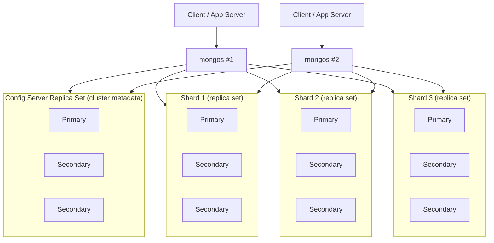
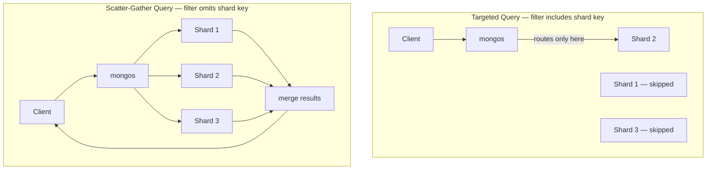

# Sharding & Scalability

Chapter 12 solved *availability*: a replica set keeps your database online through hardware failure, maintenance, and network partitions, because every member holds a full copy of the data and any of them can become primary. But a replica set does not solve a different, equally real problem — every single member of that replica set, including the primary, still has to hold the **entire dataset** and absorb the **entire write load**. If your working set outgrows the RAM of the largest server you can buy, or your write throughput outgrows what one primary can process, replication alone cannot help you; adding more secondaries adds more read capacity and more redundancy, but not more room and not more write capacity. **Sharding** is MongoDB's answer to that different problem: horizontally partitioning a collection's data across multiple independent replica sets, called shards, so that both storage and throughput scale by adding more machines rather than bigger ones. This chapter covers how a sharded cluster is put together, the single most consequential design decision you'll make in one (the shard key), and the operational realities — chunks, balancing, zones, and query routing — that follow from it.

---

## Learning Objectives

By the end of this chapter, you will be able to:

- Explain why sharding exists: the limits of vertical scaling and of a single replica set's storage and write capacity.
- Describe the three components of a sharded cluster — `mongos`, config servers, and shards — and how they work together to route a query.
- Define a shard key and evaluate one against the three properties of a good shard key: cardinality, frequency, and monotonicity.
- Compare ranged and hashed sharding strategies and choose correctly between them for a given workload.
- Explain chunks and the balancer, and how MongoDB redistributes data as a cluster grows.
- Describe zone (tag-aware) sharding and when to use it for data residency or hardware-tiering requirements.
- Distinguish targeted queries from scatter-gather queries and explain the performance consequence of each.

---

## Prerequisites for This Chapter

This chapter builds on two earlier chapters:

- [Chapter 3: Architecture & Internals](./03-architecture-and-internals.md), Section 6, which previewed the sharded cluster topology (`mongos`, config servers, shards) at an orienting level. This chapter is that preview's full depth.
- [Chapter 12: Replication & High Availability](./12-replication-and-high-availability.md), because **every shard in a production sharded cluster is itself a replica set**. You should be comfortable with primaries, secondaries, elections, and read preference before reasoning about how those mechanics compose with sharding.

We'll also assume the indexing vocabulary from [Chapter 6](./06-indexes-fundamentals.md) — the shard key is backed by an index, and query targeting behaves a lot like index selection at a larger scale.

---

## 1. Why Shard? The Limits This Solves

Before reaching for sharding, it's worth being precise about which problem it actually solves, because it's a significant operational commitment and the wrong tool for some very common complaints.

**Vertical scaling has a ceiling.** The simplest way to handle more data or more load is to make the single server bigger — more RAM, faster disks, more CPU cores. This works, right up until it doesn't: at some point you're already running the largest instance your cloud provider offers, or the cost curve of "bigger machine" stops being linear and starts being absurd. Vertical scaling also does nothing for the fact that a single `mongod` primary can only accept writes sequentially for a given document, and only has so much CPU and I/O to spread across all the writes arriving concurrently.

**A dataset can outgrow one server's resources in two distinct ways:**

- **Storage/working-set size.** If your total data (or, more precisely, your actively-queried working set — recall [Chapter 3, Section 4.3](./03-architecture-and-internals.md)) no longer fits comfortably in the RAM and disk of any single machine you're willing to run, every replica set member pays that cost identically, because replication copies the *entire* dataset to every member. More secondaries do not shrink the dataset each one has to hold.
- **Write throughput.** A replica set has exactly one primary at a time, and all writes go through it. If your write volume exceeds what one primary's CPU, disk I/O, and lock contention can sustain — no matter how well-indexed and well-tuned it is — adding secondaries doesn't help, because secondaries don't accept writes; they only replicate what the primary already processed.

Sharding addresses both by splitting a collection's documents across multiple shards, each of which is a separate, independently-scaled replica set with its own primary. Total storage capacity becomes the *sum* of every shard's capacity, and total write throughput becomes (roughly, and with real caveats around shard key choice, covered below) the *sum* of every shard's write capacity, because different documents can be written to different shards' primaries concurrently.

**When sharding is not the answer.** If your actual problem is "queries are slow because of missing indexes," "the working set doesn't fit because of unindexed table scans," or "read load is high but write load is fine," those are usually solved by better indexing, read scaling via secondaries, or query optimization ([Chapter 14](./14-performance-tuning-and-query-optimization.md)) — all of which are far cheaper and simpler than sharding. Sharding is an architecture you reach for when you've already exhausted vertical scaling and single-primary write capacity, not a default you start with. This distinction resurfaces in Common Mistakes below.

---

## 2. Sharded Cluster Components and Topology

A sharded cluster has three distinct kinds of processes, each with a narrow, well-defined job. [Chapter 3](./03-architecture-and-internals.md) introduced these briefly; here's the full picture.

### 2.1 Shards

A **shard** holds a subset of a sharded collection's documents. In any real deployment, each shard is not a single `mongod` but a full **replica set** — meaning every shard independently has its own primary, secondaries, oplog, and election behavior, exactly as covered in Chapter 12. This is a crucial point: sharding and replication are not alternatives, they *compose*. A production sharded cluster is "several replica sets side by side, each holding a slice of the data, plus infrastructure to route queries to the right slice."

### 2.2 Config Servers

The **config servers** are, themselves, a small replica set with one job: store the cluster's metadata. This metadata includes which ranges of shard-key values live on which shard, the list of shards in the cluster, chunk boundaries (Section 5), and other cluster-wide configuration. Every `mongos` router consults the config servers (and caches what it learns) to know where to send a query. Because losing config server data effectively means losing the map of your entire cluster, config servers are deployed as a properly replicated set, never as a single node, in any real deployment.

### 2.3 `mongos` — the Query Router

`mongos` is a lightweight, **stateless** router process — it stores no data of its own. It's the process your application's driver actually connects to in a sharded deployment (never directly to an individual shard's `mongod` in normal operation). For every incoming operation, `mongos`:

1. Consults its cached copy of the config servers' metadata to determine which shard(s) could hold relevant data for this operation.
2. Routes the operation to just those shard(s) when possible, or to all shards when it must (Section 7).
3. Merges results from multiple shards back into a single response for the client, applying any final sort/limit/skip that spans shard boundaries.

Because `mongos` is stateless, you typically run several of them (often colocated with application servers) purely for availability and load distribution — losing one `mongos` just means clients reconnect to another.

### 2.4 Full Topology Diagram



Notice the nesting once more, because it's the single most important structural fact in this chapter: **every box labeled "replica set" internally runs the full primary/secondary/oplog machinery from Chapter 12**, and every individual `mongod` inside those boxes runs the full WiredTiger cache/journal/checkpoint machinery from Chapter 3. Sharding adds a routing and partitioning layer *on top of* everything you already know — it does not replace or bypass any of it.

---

## 3. The Shard Key

The **shard key** is one or more fields, present in every document of a sharded collection, that MongoDB uses to decide which shard each document belongs on. You choose it once when you shard a collection (`sh.shardCollection()`), and it is backed by an index on those fields (MongoDB will create one for you if it doesn't already exist).

This is, without exaggeration, **the single most consequential decision in this entire chapter**. A good shard key is chosen based on your actual query and write patterns and is extremely difficult (though not, since MongoDB 5.0, impossible — see Section 9) to change later without significant operational effort. A bad shard key can silently bottleneck your entire cluster on a single shard, defeating the entire purpose of sharding while still paying its full operational complexity cost.

Three properties determine whether a field (or combination of fields) makes a good shard key:

### 3.1 Cardinality

**Cardinality** is the number of distinct values the shard key can take on. High cardinality is necessary because MongoDB partitions data into chunks by shard-key *ranges* (or hash buckets — Section 4), and a chunk cannot be split smaller than a single distinct shard-key value. If your shard key has low cardinality — say, a `status` field with only three possible values (`"active"`, `"pending"`, `"closed"`) — then, in the extreme, your entire collection can only ever be split into three chunks, no matter how large it grows, and a shard holding a popular value's worth of data can never be shrunk below that entire value's worth of documents. A boolean field or a small enum is a textbook example of a shard key that will eventually cap your ability to scale out further.

### 3.2 Frequency

**Frequency** (sometimes discussed as the inverse of cardinality, but worth calling out separately) is about how evenly distributed the *actual* values are across your real data, not just how many distinct values are theoretically possible. A field can have high cardinality overall yet still be dominated by a small number of very frequent values in practice — for example, a `customerId` field with millions of distinct values, but where one enormous enterprise customer accounts for 40% of all documents. That single frequent value creates a **jumbo chunk**: a chunk that can't be split further (because splitting happens at shard-key-value boundaries) and can't be balanced away easily, creating a hot, oversized shard even though the field's cardinality looked fine on paper. Good shard keys need both adequate cardinality *and* even frequency across the values that actually occur in your data.

### 3.3 Monotonicity (avoiding the hot shard problem)

**Monotonicity** is about whether the shard key's values change in a predictable, ever-increasing (or ever-decreasing) direction over time — the classic examples being an auto-incrementing `_id`, a `createdAt` timestamp, or any kind of sequence number. This is the property that causes the most damage in practice, and it deserves the most attention.

Here's the mechanism: with ranged sharding (Section 4.1), chunk ranges are ordered by shard-key value. If your shard key always increases (every new document's key is numerically or chronologically larger than every previous document's key), then **every single insert lands in the same chunk — the one holding the current "highest" range** — which lives on exactly one shard at any given moment. All your other shards sit idle for inserts while one shard absorbs 100% of the write load. This is the **hot shard problem**, and it is the most common way a real sharding deployment fails to deliver the write-scaling benefit it was adopted for in the first place. The balancer (Section 5) will eventually move chunks around to keep data volume even across shards, but it cannot fix the *write* hotspot in real time — new writes keep landing on whichever shard currently owns the "leading edge" of the range, regardless of how balanced the total stored data looks.

This doesn't mean timestamp-like fields can never be part of a shard key — it means using one **alone**, with ranged sharding, is the anti-pattern to recognize. Common fixes include hashing the key (Section 4.2), which deliberately scrambles the insertion order across shards, or choosing a compound shard key that leads with a high-cardinality, non-monotonic field (like a tenant or device ID) and only *then* incorporates a timestamp for range-query efficiency within that value.

---

## 4. Ranged Sharding vs. Hashed Sharding

MongoDB supports two fundamentally different strategies for mapping shard-key values to chunks, and the choice interacts directly with everything in Section 3.

### 4.1 Ranged Sharding

With **ranged sharding**, MongoDB divides the entire space of possible shard-key values into contiguous ranges, and each range is a chunk assigned to a shard. Documents with "nearby" shard-key values end up in the same or adjacent chunks — and, often, the same shard.

- **Strength:** Range queries on the shard key (`$gte`/`$lte`, sorted scans) can be efficiently **targeted** to just the shard(s) holding the relevant range, because `mongos` can compute which range(s) a query's bounds fall into and skip every other shard entirely.
- **Weakness:** If the shard key is monotonically increasing (Section 3.3), ranged sharding is exactly the setup that produces the hot-shard problem — new documents keep landing in the single chunk representing "the highest values seen so far," which lives on one shard.

Ranged sharding is the right choice when your dominant, performance-critical query pattern genuinely needs efficient range scans on the shard key itself (e.g., "give me all events for `deviceId` X between two timestamps," when `deviceId` is the leading shard key field, or a compound key like `{ deviceId: 1, timestamp: 1 }`), and the leading field has enough cardinality and even frequency to avoid concentrating writes.

### 4.2 Hashed Sharding

With **hashed sharding**, MongoDB computes a hash of the shard-key field's value and uses *that* hash — not the raw value — to assign the document to a chunk. Because a good hash function scatters even sequential inputs pseudo-randomly across its output range, hashed sharding deliberately breaks up any natural ordering in the underlying field.

- **Strength:** Writes are distributed extremely evenly across all shards, even if the underlying field is monotonically increasing — hashing is the standard, MongoDB-native fix for the hot-shard problem when your natural, application-relevant key happens to be sequential (an `_id`, a timestamp, an auto-incrementing order number).
- **Weakness:** Range queries on the original field become **scatter-gather** (Section 7) almost by definition — because consecutive original values hash to essentially random, unrelated locations, there's no contiguous range of chunks `mongos` can target for a range query like "all orders between these two dates." Every shard has to be asked and the results merged.

Hashed sharding is the right choice when your dominant need is **even write distribution** and you don't rely on efficient range scans directly over the shard key's raw values — for example, ingesting a high-volume stream of events keyed by a naturally sequential ID, where your actual query patterns are point lookups or aggregations that don't depend on shard-key ordering.

| | Ranged Sharding | Hashed Sharding |
|---|---|---|
| **Write distribution on monotonic keys** | Poor — hot shard risk | Excellent — evenly scattered |
| **Range query targeting** | Excellent — contiguous chunks | Poor — effectively scatter-gather |
| **Best fit** | Non-monotonic key, or compound key with range queries as a primary access pattern | High write throughput, sequential/monotonic natural key, point-lookup-dominated queries |

---

## 5. Chunks and the Balancer

MongoDB divides a sharded collection's data into **chunks** — contiguous ranges of shard-key values (or hash values, under hashed sharding) that are the actual unit of data movement between shards. A chunk is not a fixed-size physical structure; it's a logical range tracked in the config servers' metadata, along with which shard currently owns it.

As data is inserted and a chunk grows past a configured size threshold, MongoDB automatically **splits** it into two smaller chunks covering two sub-ranges of the original. This keeps any single chunk from growing unboundedly (with one caveat: a chunk that's dominated by a single shard-key value — Section 3.2's jumbo chunk case — cannot be split further, since a split requires an internal boundary value to divide on).

The **balancer** is a background process (running as part of the cluster, coordinated via the config servers) that continuously monitors the distribution of chunks across shards and migrates chunks from more-loaded shards to less-loaded ones to keep the cluster roughly even. This runs automatically and is triggered by:

- **Organic growth** — as a collection grows, new chunks appear and need a home.
- **Adding a new shard** — an empty new shard starts with zero chunks; the balancer will gradually migrate existing chunks onto it until the cluster is even again.
- **Removing a shard** — before a shard can be safely decommissioned, the balancer drains it by migrating all of its chunks onto the remaining shards.

Chunk migration itself happens without downtime: the source shard continues serving the chunk's data while it's copied to the destination, and only a brief metadata update (redirecting `mongos` to the new owner) is needed to complete the handoff. This is transparent to the application, though it does consume some background I/O and network bandwidth on the shards involved, which is why balancing windows are often scheduled during off-peak hours in write-heavy production deployments.

---

## 6. Zone Sharding (Tag-Aware Sharding)

**Zone sharding** (formerly called "tag-aware sharding") lets you pin specific ranges of shard-key values to a specific subset of shards, rather than leaving chunk placement entirely up to the balancer's default even-distribution logic. You define a **zone**, associate one or more shards with it, and associate one or more shard-key ranges with that zone — the balancer then ensures chunks in that range only ever live on shards belonging to that zone.

The canonical use case is **geographic data residency**: a multi-region application with a shard key like `{ region: 1, userId: 1 }` can define a zone for `region: "EU"` pinned to shards physically hosted in the EU, and a zone for `region: "US"` pinned to US-hosted shards — satisfying a legal or contractual requirement that EU user data never leaves EU infrastructure, while still operating as a single logical sharded collection from the application's point of view. Other common uses include:

- **Hardware tiering** — pinning a "hot," recent-data range to shards backed by fast NVMe storage, while an older, colder range lives on shards with cheaper, larger, slower disks.
- **Workload isolation** — dedicating specific shards to a specific high-value tenant's data range, so that tenant's load doesn't compete for chunk placement with everyone else's.

Zone sharding is a placement *constraint* layered on top of everything else in this chapter — the shard key, chunking, and balancer all still work exactly as described; zones just narrow which shards the balancer is allowed to place a given range's chunks on.

---

## 7. Querying a Sharded Cluster: Targeted vs. Scatter-Gather

How a query performs against a sharded cluster depends almost entirely on whether it includes the shard key.

### 7.1 Targeted queries

A **targeted query** includes the shard key (or, under ranged sharding, a range that maps cleanly onto specific chunk ranges) in its filter. `mongos` can compute exactly which shard(s) could possibly hold matching documents, using its cached cluster metadata, and route the query only there. This is the fast path, and it's the entire reason shard key selection is tied so closely to your query patterns, not just your write patterns — a shard key chosen purely to spread writes evenly, while ignoring your read patterns, can leave your most common queries permanently unable to target.

### 7.2 Scatter-gather queries

A **scatter-gather query** omits the shard key from its filter entirely (or uses hashed sharding while filtering on a range of the original field, per Section 4.2). Because `mongos` cannot determine which shard(s) hold relevant documents, it must send the query to **every shard**, wait for every shard to respond, and merge the results. This isn't necessarily *wrong* — the query still returns correct results — but it means every shard's resources are consumed for every such query, and your worst-case latency is bounded by your *slowest* shard's response time, not your fastest. As a cluster grows to more shards, scatter-gather queries get proportionally more expensive, actively working against the reason you sharded in the first place.



The practical takeaway: **shard key selection is a query-pattern decision as much as a write-distribution decision.** A key that distributes writes beautifully but doesn't appear in your most frequent, most latency-sensitive queries condemns those queries to scatter-gather forever, at every scale you grow into.

---

## 8. Aggregation in a Sharded Cluster

Aggregation pipelines (Chapters 7–10) run against sharded collections too, and MongoDB automatically splits the work: whichever pipeline stages *can* run independently on each shard's own data are pushed down and executed **on each shard in parallel** (e.g., an early `$match` that can be targeted, or a per-shard `$group`/`$sort` that doesn't need to see the whole dataset at once). The partial results from each shard are then sent to a single **merging point** — either `mongos` itself, or, for certain stages that benefit from running on a shard with direct access to the data (like `$lookup` or `$graphLookup` in some configurations), a designated **primary shard** for the merge — where the remaining stages complete against the combined results.

The practical implication for pipeline design: an early `$match` on the shard key lets MongoDB skip shards that can't possibly match, exactly like a targeted query; a `$sort` or `$group` placed early in the pipeline can often be partially computed per-shard and cheaply merged, whereas placing expensive computation *after* a stage that requires all shards' data to already be combined forces more work onto the single merging point. This is a preview — [Chapter 14](./14-performance-tuning-and-query-optimization.md) covers aggregation performance diagnostics in full, including how to read `explain()` output for a sharded pipeline and see exactly which stages ran on which shards.

---

## 9. Resharding

Choosing a shard key is not, strictly speaking, a one-way door anymore — since MongoDB 5.0, the `reshardCollection` command allows changing a collection's shard key in place, with MongoDB handling the redistribution of data under the new key automatically. This is a genuinely useful safety net for a cluster that outgrows its original design.

That said, resharding is a heavyweight, resource-intensive background operation: it involves copying and reorganizing the entire collection's data under the new key while the cluster continues serving traffic, and it takes time proportional to your data size. It is a "we can recover from a mistake" mechanism, not a "shard key choice doesn't matter much" license. Every hour spent resharding a large production collection is an hour of extra load, operational risk, and monitoring overhead that a well-reasoned shard key chosen up front — grounded in real cardinality, frequency, and query-pattern analysis — would have avoided entirely. Treat Section 3's three properties as due diligence to do *before* running `sh.shardCollection()`, not as something to defer because resharding exists as a fallback.

---

## Real-World Scenario

**Setup:** Your team runs a multi-tenant SaaS order-management platform (the same domain this course's Weeks 5–6 project is built around). The `orders` collection started on a single replica set and has grown to the point where the working set no longer fits in RAM on any instance size your cloud budget tolerates, and peak write throughput during month-end invoicing runs is starting to saturate the primary. It's time to shard.

**Evaluating candidate shard keys:**

- **`_id` (default ObjectId) alone.** ObjectIds embed a timestamp component and are effectively monotonically increasing. Sharding on `_id` alone would concentrate every new order's insert onto whichever shard owns the current "highest" range — the textbook hot-shard problem from Section 3.3. Rejected immediately.

- **`orderDate` alone.** Same problem in a more obvious form: it's explicitly a timestamp, explicitly monotonic, and would produce the exact same single-shard write bottleneck during the very month-end traffic spikes that motivated sharding in the first place. Rejected.

- **`tenantId` alone.** Every order document already carries a `tenantId`, since this is a multi-tenant system. Cardinality is reasonable (as many distinct values as there are paying tenants), and it's not monotonic — tenant IDs don't correlate with insertion order. This is a strong candidate. The team checks frequency next: does any single tenant dominate the dataset? A quick aggregation reveals the platform's three largest enterprise customers together account for over half of all order volume — a real frequency skew (Section 3.2). Sharding on `tenantId` alone risks jumbo chunks and uneven load concentrated on whichever shard happens to hold those large tenants' data.

- **Hashed `tenantId`.** Hashing scrambles tenant IDs across shards evenly regardless of order volume per tenant *only if* no single tenant's data alone is large enough to dominate one shard — hashing helps distribute *which shard a tenant lands on*, but a single enormous tenant is still, physically, one tenant's worth of data landing together (hashing operates on the field value, and all of one tenant's documents share that one value, so they still hash to the same location). This mitigates cross-tenant skew for the *typical* tenant but doesn't fully solve the largest-tenant concentration by itself.

- **Compound key `{ tenantId: 1, orderId: 1 }` (or hashed `tenantId` combined with a range-friendly secondary field).** The team settles on a compound shard key: `tenantId` as the leading field (ensuring most single-tenant queries and dashboards — "show tenant X's recent orders" — are targeted queries that hit exactly one shard), with `orderId` (a high-cardinality, tenant-scoped sequence) as the second field to spread a single large tenant's documents across a wider effective range and avoid one tenant becoming an unsplittable jumbo chunk. For the handful of largest enterprise tenants specifically, the team additionally considers **zone sharding** (Section 6): pinning those tenants' key ranges to a dedicated set of shards with beefier hardware, isolating their disproportionate load from the shared pool serving smaller tenants.

**Why this reasoning matters beyond just this example:** every step above is Section 3's three properties (cardinality, frequency, monotonicity) applied literally, plus Section 7's reminder that the team also checked their *actual dominant query pattern* ("fetch this tenant's orders") against the candidate key before finalizing it — a shard key that ignored tenant-scoped queries in favor of pure write-distribution would have condemned the platform's single most common query to scatter-gather at every scale it grows into.

---

## Best Practices

- **Analyze your real write and query patterns before choosing a shard key** — cardinality and frequency numbers should come from your actual data distribution, not intuition, and your most frequent queries should be checked against candidate keys for targetability (Section 7).
- **Prefer compound shard keys over a single field when a single field can't satisfy both write distribution and query targeting** — a leading high-cardinality, non-monotonic field plus a secondary field for range efficiency is a common, effective pattern.
- **Use hashed sharding deliberately when your natural key is monotonic and write distribution matters more than range-query targeting** — don't default to ranged sharding just because it's the historical default; choose based on Section 4's trade-off table.
- **Reserve zone sharding for genuine placement requirements** (data residency, hardware tiering, tenant isolation) rather than as a general-purpose load-balancing knob — the balancer's default even-distribution logic handles the common case well on its own.
- **Monitor chunk distribution and jumbo chunks proactively**, not just overall disk/CPU per shard — an evenly-loaded-looking cluster can still be heading toward a single frequency-skewed shard key value becoming unsplittable.
- **Shard only when you've exhausted vertical scaling, indexing, and read-scaling options** (Section 1) — sharding adds meaningful, permanent operational complexity that isn't worth paying for a problem a simpler fix would solve.
- **Treat resharding (Section 9) as an emergency safety net, not a substitute for upfront shard key analysis** — it's expensive and disruptive enough that "we can always reshard later" is not a sound design strategy.

---

## Common Mistakes

- **Choosing a monotonically increasing shard key** (default `_id`, a timestamp, an auto-incrementing sequence) with ranged sharding, and discovering the hot-shard problem only under real production write load.
- **Sharding a collection far too early**, before working-set size or write throughput has actually exceeded what a well-indexed, appropriately-sized replica set can handle — paying sharding's operational complexity tax for a problem that didn't yet exist.
- **Choosing a low-cardinality shard key** (a status enum, a boolean flag, a small fixed category set) that caps the number of chunks the collection can ever be split into, regardless of how large it grows.
- **Ignoring query patterns when picking a shard key**, optimizing purely for even write distribution and ending up with the application's most frequent, most latency-sensitive query permanently reduced to a scatter-gather across every shard.
- **Overlooking frequency skew** — verifying a field has enough *distinct* values (cardinality) without checking whether a handful of those values dominate the actual data (frequency), and discovering a jumbo chunk only once it's already unsplittable.
- **Running config servers or shard replica sets without proper replication themselves**, treating them as an afterthought instead of the same production-grade, multi-member deployments every shard and metadata store needs to be.
- **Assuming the balancer alone fixes a poor shard key** — the balancer redistributes *existing* chunk volume evenly over time, but it cannot retroactively fix a monotonic key's tendency to concentrate every *new* write on one shard in real time.

---

## Summary

- Sharding solves horizontal scale (storage and write throughput) beyond what a single replica set can provide; replication (Chapter 12) solves availability — they are complementary, not competing, and every shard in production is itself a replica set.
- A sharded cluster has three components: **shards** (data, each a replica set), **config servers** (cluster metadata, also a replica set), and **`mongos`** (stateless query router that clients connect to).
- The **shard key** determines data placement and is evaluated on three properties: **cardinality** (enough distinct values), **frequency** (no value dominates in practice), and **monotonicity** (avoid ever-increasing keys that concentrate writes on one shard — the hot-shard problem).
- **Ranged sharding** favors efficient range queries but risks hot shards on monotonic keys; **hashed sharding** distributes writes evenly but turns range queries on the original field into scatter-gather.
- **Chunks** are the unit of data movement; the **balancer** automatically redistributes them as data grows or shards are added/removed.
- **Zone sharding** pins shard-key ranges to specific shards, commonly for geographic data residency or hardware tiering.
- **Targeted queries** (include the shard key) hit only relevant shards; **scatter-gather queries** (omit it) hit every shard and merge results — shard key choice is a query-pattern decision, not just a write-distribution one.
- Aggregation pipelines push down what they can to each shard and merge remaining work on `mongos` or a designated merging shard.
- **Resharding** exists as a safety net since MongoDB 5.0, but is expensive enough that upfront shard key analysis remains far cheaper than fixing a bad choice later.

---

## Knowledge Check

1. A replica set with plenty of secondaries is still struggling under write load. Explain why adding more secondaries doesn't fix this, and what sharding changes structurally that does.
2. Define cardinality, frequency, and monotonicity as they apply to shard key selection, and give an example of a field that would fail each one individually.
3. A team shards a collection on a hashed version of an auto-incrementing order ID. What write-distribution problem does this avoid, and what query-performance problem does it likely introduce?
4. What is the difference between a targeted query and a scatter-gather query, and why does that difference matter more, not less, as a cluster grows to more shards?
5. Why is it accurate to say resharding is "a safety net, not a strategy"? What real costs does resharding carry that make upfront shard key analysis still worthwhile?

---

## Hands-On Exercise

**Design exercise: a global IoT sensor-reading platform.**

You're designing the sharding strategy for a collection ingesting sensor readings from millions of IoT devices worldwide. Each document looks roughly like:

```json
{
  "deviceId": "dev-8841203",
  "timestamp": ISODate("2026-07-06T14:22:10Z"),
  "region": "us-east",
  "metric": "temperature",
  "value": 21.4
}
```

Write volume is extremely heavy and continuous (millions of readings per minute across all devices), and the dominant query pattern is "give me all readings for device X over a time range" for dashboards and alerting.

Work through the following, in writing, before checking your reasoning against this chapter:

1. **Evaluate `timestamp` alone as a shard key.** Which of the three properties (cardinality, frequency, monotonicity) does it fail, and what specific operational symptom would you expect to see under this heavy, continuous write load?
2. **Evaluate `deviceId` alone as a shard key**, both under ranged and hashed sharding. Consider cardinality (millions of devices — good), frequency (do some devices report far more often than others?), and how each sharding strategy affects the dashboard's dominant time-range query.
3. **Propose a compound shard key** that balances write distribution against the dashboard's need to efficiently query a single device's data over a time range. Justify your choice using Section 3's three properties and Section 4's ranged-vs-hashed trade-off explicitly.
4. **State whether ranged or hashed sharding fits your proposed key better**, and why — there isn't a single universally correct answer here; the point is to justify the trade-off against the stated write pattern and query pattern.

If you have a local sharded cluster available (e.g., via Docker Compose running multiple `mongod`/`mongos`/config server containers — a fuller walkthrough of that setup belongs in [Chapter 18](./18-tools-drivers-and-ecosystem.md)), you can validate your design conceptually with:

```javascript
// Enable sharding for the database
sh.enableSharding("iotPlatform")

// Shard the collection on your proposed compound key
sh.shardCollection(
  "iotPlatform.sensorReadings",
  { deviceId: "hashed", timestamp: 1 }
)

// Inspect chunk distribution once data is flowing
sh.status()
db.sensorReadings.getShardDistribution()
```

Compare `getShardDistribution()`'s output across shards after loading a representative sample of data — is the distribution close to even, or is one shard already trending hot? That observed distribution is the empirical version of the cardinality/frequency/monotonicity analysis you just did on paper.

---

## Further Reading

- [Sharding Introduction](https://www.mongodb.com/docs/manual/sharding/) — official overview of sharded cluster architecture and components.
- [Choose a Shard Key](https://www.mongodb.com/docs/manual/core/sharding-choose-a-shard-key/) — MongoDB's own guidance on cardinality, frequency, and monotonicity considerations.
- [Hashed Sharding](https://www.mongodb.com/docs/manual/core/hashed-sharding/) and [Ranged Sharding](https://www.mongodb.com/docs/manual/core/ranged-sharding/) — the mechanics behind Section 4's comparison.
- [Zones (Zone Sharding)](https://www.mongodb.com/docs/manual/core/zone-sharding/) — full reference on tag-aware sharding for data residency and hardware tiering.
- [Reshard a Collection](https://www.mongodb.com/docs/manual/core/sharding-reshard-a-collection/) — official documentation on the `reshardCollection` capability previewed in Section 9.

---

<div style="display:flex;justify-content:space-between;align-items:center;">
  <a href="./12-replication-and-high-availability.md">← Previous: Replication & High Availability</a>
  <a href="./00-index.md">🏠 Index</a>
  <a href="./14-performance-tuning-and-query-optimization.md">Next: Performance Tuning & Query Optimization →</a>
</div>
