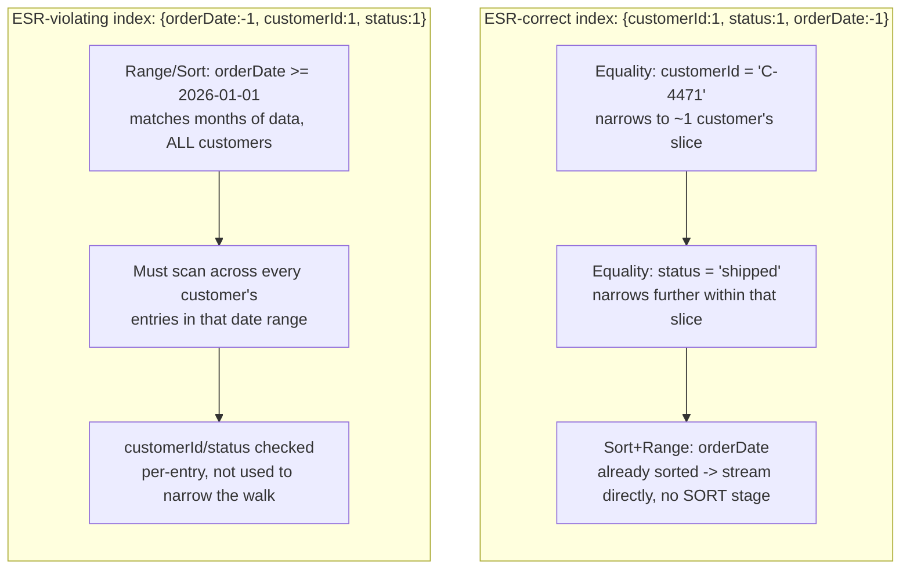
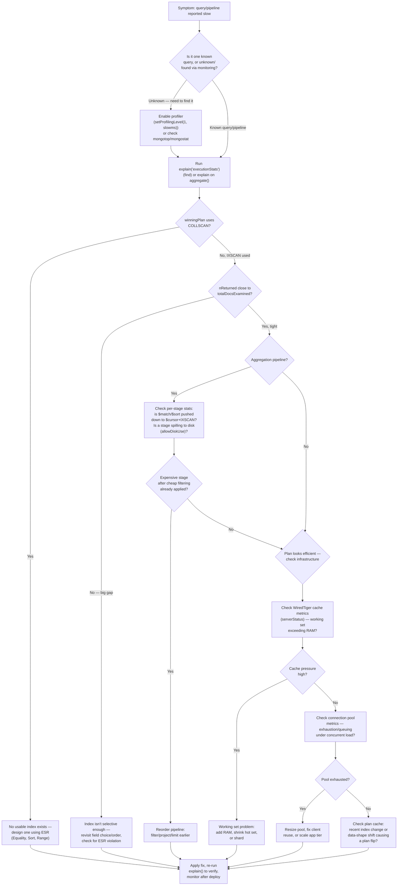

# Performance Tuning & Query Optimization

Chapter 6 taught you the mechanics of indexing and gave you your first look at `explain("executionStats")` — enough to tell `COLLSCAN` from `IXSCAN` and to spot an obviously bad ratio between `nReturned` and `totalDocsExamined`. Chapters 7 through 10 then spent four full chapters teaching you to *write* aggregation pipelines — from `$match`/`$group` fundamentals through `$lookup`, `$facet`, window functions, and materialized views — with Chapter 10's Section 5 giving you a first pass at aggregation performance (the 100MB stage limit, `allowDiskUse`, basic stage ordering). This chapter is where those two threads merge into one discipline: **systematically making anything slow — a `find()`, an `aggregate()`, or a whole workload under load — fast, and proving it with evidence rather than guesswork.** Everything here assumes you can already read a basic `explain()` plan and write a working pipeline; the job now is depth — reading *every* field of an explain plan that matters, deriving the ESR rule instead of just applying it, capturing slow operations you didn't even know to look for, and reasoning about RAM, connection pools, and plan stability at production scale.

---

## Learning Objectives

By the end of this chapter, you will be able to:

- Read `explain("queryPlanner")`, `explain("executionStats")`, and `explain("allPlansExecution")` output in full, including `winningPlan` vs. `rejectedPlans` and the plan cache that sits behind them.
- State and justify the **ESR rule** (Equality, Sort, Range) for ordering compound index fields, and predict what specifically degrades when the order is violated.
- Identify a **covered query** from `explain()` output and design indexes that produce one when it's worth the tradeoff.
- Use the database **profiler** (`system.profile`) to capture slow operations in a running production system, and know when `mongotop`/`mongostat` are the right tool instead.
- Run `explain()` on an aggregation pipeline, read per-stage execution stats, and determine whether the pipeline's leading `$match`/`$sort` is actually using an index.
- Explain what `allowDiskUse` costs you and why pipeline reordering is usually the real fix, not a substitute for it.
- Explain connection pooling and size a driver's connection pool sensibly for a given workload.
- Diagnose a working-set-vs-RAM problem using WiredTiger cache metrics, and follow a repeatable troubleshooting workflow for "this is slow" that ties all of the above together.

---

## Prerequisites for This Chapter

This chapter assumes you are comfortable with:

- [Chapter 6: Indexes Fundamentals](./06-indexes-fundamentals.md) — index types, the compound index prefix rule, and basic `explain("executionStats")` reading (`COLLSCAN` vs. `IXSCAN`, `nReturned` vs. `totalDocsExamined`). This chapter extends that vocabulary; it does not re-derive it.
- [Chapter 7: Aggregation Pipeline Fundamentals](./07-aggregation-pipeline-fundamentals.md) — the pipeline mental model and core stages (`$match`, `$project`, `$group`, `$sort`).
- [Chapter 10: Advanced Aggregation Patterns](./10-advanced-aggregation-patterns.md), Section 5 — the 100MB stage memory limit, `allowDiskUse` as an escape hatch, and the basic idea that stage order affects index use. This chapter goes considerably deeper on all three.

You should also recall the WiredTiger cache and working-set concepts from [Chapter 3: Architecture & Internals](./03-architecture-and-internals.md), Section 4.3 — this chapter makes that idea directly actionable with real metrics.

---

## 1. Reading Query Plans in Depth

### 1.1 The three verbosity levels, precisely

`explain()` accepts one of three verbosity modes, and choosing the right one matters:

```javascript
db.orders.find({ status: "shipped" }).explain("queryPlanner")
db.orders.find({ status: "shipped" }).explain("executionStats")
db.orders.find({ status: "shipped" }).explain("allPlansExecution")
```

| Mode | What it does | When to use it |
|---|---|---|
| `"queryPlanner"` | Returns the **winning plan only** — no query execution happens at all. Fast, safe to run against production, even on a write-heavy query (`explain()` never actually writes, even for `update`/`delete`/`aggregate` with `$merge`/`$out`). | Quick sanity check: "would this even use an index?" without touching real execution cost. |
| `"executionStats"` | **Actually runs the query** to completion and reports real counters (`nReturned`, `totalKeysExamined`, `totalDocsExamined`, `executionTimeMillis`) for the winning plan only. | The default choice for almost all performance work — this is what Chapter 6 already had you using. |
| `"allPlansExecution"` | Runs the query like `"executionStats"`, **plus** re-runs a partial trial of every plan the optimizer considered and rejected, reporting their stats too (capped at a small number of documents/results, not run to completion). | Diagnosing *why* the optimizer picked plan A over plan B — e.g., confirming a compound index was rejected in favor of a less-ideal single-field index, and seeing by how much. |

A subtlety worth internalizing: `"executionStats"` and `"allPlansExecution"` genuinely execute the query. On a write-modifying command wrapped in `explain()` (`explain().update(...)`, `explain().remove(...)`), MongoDB evaluates the plan without applying the write — but a plain `find()`/`aggregate()` explain at these verbosities really does read the data and consume real I/O and cache pages. Running `explain("executionStats")` on a query that returns 40 million documents is not a free operation just because you're "only explaining" it.

### 1.2 `winningPlan` vs. `rejectedPlans`

For any query with more than one usable index, MongoDB's query planner runs a brief **plan selection process**: candidate plans are evaluated against a small sample of the actual data (a technique often called a "plan race" or trial period), and whichever candidate finds the required number of results fastest — using the fewest work units — becomes the `winningPlan`. The other candidates that were tried and lost appear under `rejectedPlans` (visible under `"allPlansExecution"` and, structurally, even under `"queryPlanner"`, though without execution stats).

```javascript
{
  queryPlanner: {
    winningPlan: {
      stage: "FETCH",
      inputStage: {
        stage: "IXSCAN",
        indexName: "customerId_1_status_1_orderDate_-1",
        keyPattern: { customerId: 1, status: 1, orderDate: -1 }
      }
    },
    rejectedPlans: [
      {
        stage: "FETCH",
        inputStage: {
          stage: "IXSCAN",
          indexName: "status_1",
          keyPattern: { status: 1 }
        }
      }
    ]
  }
}
```

Seeing a *reasonable-looking* index show up under `rejectedPlans` is not a bug report — it's confirmation the optimizer correctly preferred a better-targeted plan. It becomes worth investigating only when the *winning* plan looks wrong (e.g., a `COLLSCAN` won over an available `IXSCAN`, which usually means the index doesn't actually match the query's predicate types, or a `$type` mismatch is silently defeating it).

### 1.3 The plan cache: what it is and when it gets recomputed

Running that trial-and-select process on *every single query execution* would be wasteful — so MongoDB caches the winning access plan per **query shape** (the combination of filter predicate structure, sort, and projection — not the literal parameter values). The next query with the same shape reuses the cached plan directly, skipping the trial period entirely. This is the mechanism Chapter 3 referenced when describing the "first query on a cold restart is slower" symptom.

A cached plan is **not permanent**. MongoDB invalidates and recomputes it when:

- An index is added to or dropped from the collection.
- The collection is restarted (`mongod` restart, or the server evicts the cache entry under memory pressure) — cache entries do not survive a restart.
- The cached plan's efficiency degrades significantly compared to its original performance, as measured by MongoDB's internal plan cache feedback mechanism — repeatedly returning far fewer documents relative to work examined than when it was cached can trigger re-planning.
- You explicitly clear it: `db.orders.getPlanCache().clear()` (or `.clearPlansByQuery(...)` for a specific shape).

You can inspect what's currently cached:

```javascript
db.orders.getPlanCache().list()
```

This matters operationally because of a failure mode worth naming explicitly: **a plan flip**. If your data's distribution changes shape over time (e.g., a `status` field that used to be evenly distributed becomes 95% `"delivered"`), a plan that was optimal when cached can become suboptimal without any code or index change on your part — and because it's cached, MongoDB won't necessarily notice immediately. This is why "the query was fast yesterday and slow today, and nothing changed" is a legitimate, common production incident — see Common Mistakes below.

---

## 2. The ESR Rule: Equality, Sort, Range

Chapter 6 previewed this in its Real-World Scenario without naming it formally. Here is the full rule, and — more importantly — *why* it holds.

### 2.1 The rule

When designing a compound index to serve a query with **equality** filters, a **sort**, and **range** filters, order the index fields:

1. **E — Equality fields first.** Fields compared with exact-match conditions (`{ field: value }`, or `$in` against a small fixed set).
2. **S — Sort fields second.** Fields the query sorts by (in a direction matching the sort, so the index's own order satisfies it without an extra in-memory sort).
3. **R — Range fields last.** Fields compared with `$gt`, `$gte`, `$lt`, `$lte`, or `$ne`.

### 2.2 Why this ordering is optimal — a worked example

Consider this query, run constantly against an `orders` collection:

```javascript
db.orders.find({
  customerId: "C-4471",
  status: "shipped",
  orderDate: { $gte: ISODate("2026-01-01") }
}).sort({ orderDate: -1 })
```

This query has one equality field (`customerId`... actually two: `customerId` and `status` are both exact matches), one sort field (`orderDate`), and one range field (`orderDate` again — the same field serves double duty as both sort and range here, which is common and fine). Applying ESR:

```javascript
db.orders.createIndex({ customerId: 1, status: 1, orderDate: -1 })
//                       E           E          S+R
```

Walk through *why* this order wins, field by field:

- **`customerId` and `status` (equality) go first** because a B-tree sorted first by these fields lets MongoDB jump directly to the single, narrow sub-range of the tree containing exactly `customerId: "C-4471", status: "shipped"` — a small number of contiguous keys — before it has to think about `orderDate` at all. Equality fields collapse the search space the most, per field, of any predicate type, so they should do their collapsing first.
- **`orderDate` (sort) goes next**, in the `-1` direction matching the query's `sort({ orderDate: -1 })`, because *within* the narrow `customerId + status` slice, the index entries are now already stored in exactly the order the query wants them returned. MongoDB streams them straight off the index with **zero extra sorting** — no `SORT` stage, no in-memory sort buffer, no 100MB sort limit to worry about.
- **The range condition on `orderDate` is satisfied by the very same field**, for free, once it's positioned second.

### 2.3 What goes wrong with a different field order

Suppose you instead built the index with `orderDate` first — a natural-looking but ESR-violating choice, since date fields "feel like" they should lead:

```javascript
db.orders.createIndex({ orderDate: -1, customerId: 1, status: 1 })
```

Now the B-tree is sorted **primarily by date across every customer**. To answer the same query, MongoDB can still use this index, but it can no longer narrow to "just this customer" before it starts walking `orderDate` values — it must walk the date range `>= 2026-01-01` **across the entire collection**, checking `customerId` and `status` on every entry it passes, because those fields are only meaningfully sorted *within* a fixed `orderDate`, not across it. If `orderDate: { $gte: ... }` matches six months of data across every customer, that's potentially millions of index entries examined to find the few hundred belonging to `"C-4471"` — exactly the `nReturned` vs. `totalKeysExamined` gap Chapter 6 taught you to watch for.



The general principle behind ESR: **equality narrows a B-tree the way a range never can** (an equality predicate reduces the candidate keyspace to one contiguous slice; a range predicate only bounds it, often leaving a large slice). Sort fields placed immediately after equality fields turn a would-be in-memory `SORT` stage into free index order. Range fields placed last "consume" the remaining, already-narrowed slice — placing a range field *before* a sort or equality field breaks the sortedness those later fields depend on, because a B-tree range scan doesn't preserve a single fixed sub-ordering for whatever comes next.

### 2.4 A quick self-check table

| Field role in the query | Index position | Why |
|---|---|---|
| Equality (`{ field: value }`, small `$in`) | First | Narrows the B-tree walk the most; every subsequent field's ordering is only meaningful within one equality slice |
| Sort (`.sort({ field: dir })`) | Second (matching direction) | Lets the index's natural order satisfy the sort with no separate `SORT` stage |
| Range (`$gt`/`$gte`/`$lt`/`$lte`) | Last | Bounds — rather than pins down — a slice of the tree; placing it earlier would break the sortedness needed for later fields |

---

## 3. Covered Queries

### 3.1 What makes a query "covered"

A query is **covered** when MongoDB can answer it **entirely from the index itself**, without ever fetching the actual document from the collection. This requires two conditions simultaneously:

1. **Every field referenced in the query's filter, sort, and projection exists in the index.**
2. **No field is excluded via projection that isn't also true of `_id`** — practically: the projection must either explicitly exclude `_id` (since `_id` is not part of this index unless you included it), or the query must not need `_id` at all, and every field it *does* need must be present in the index keys.

When both hold, MongoDB skips the `FETCH` stage entirely — the `IXSCAN` stage alone produces the full result.

```javascript
db.orders.createIndex({ customerId: 1, status: 1, orderDate: -1 })

db.orders.find(
  { customerId: "C-4471", status: "shipped" },
  { _id: 0, customerId: 1, status: 1, orderDate: 1 }
)
```

Every field in the filter (`customerId`, `status`) and the projection (`customerId`, `status`, `orderDate`) is a key in the index, and `_id` is explicitly excluded. This query is covered.

### 3.2 Spotting a covered query in `explain()`

```javascript
{
  executionStats: {
    nReturned: 340,
    totalKeysExamined: 340,
    totalDocsExamined: 0,        // <-- the tell
    executionTimeMillis: 1
  },
  queryPlanner: {
    winningPlan: {
      stage: "PROJECTION_COVERED",   // no FETCH stage beneath it
      inputStage: {
        stage: "IXSCAN",
        indexName: "customerId_1_status_1_orderDate_-1"
      }
    }
  }
}
```

The unambiguous signal is **`totalDocsExamined: 0`** combined with the absence of a `FETCH` stage — replaced by `PROJECTION_COVERED` sitting directly atop `IXSCAN`. If you see any `FETCH` stage anywhere in `winningPlan`, the query is not covered, no matter how selective the index scan itself was.

### 3.3 When covering is (and isn't) worth pursuing

Covered queries are the fastest possible read path short of an in-memory cache in front of the database entirely — they avoid disk/cache document fetches altogether. But engineering a covering index has a real cost: every field you add to satisfy a projection is a field that must be duplicated into that index's B-tree and kept in sync on every write. Reach for covering indexes deliberately for **hot, narrow, high-frequency reads** (a dashboard counter, an autocomplete lookup) — not reflexively for every query, or you'll pay index bloat for marginal gains on queries that were already fast enough.

---

## 4. The Database Profiler and Operational Tooling

`explain()` answers "how would/did *this specific* query run?" — you have to already know which query to ask about. In production, the harder problem is usually **finding out which queries are slow in the first place**. That's the profiler's job.

### 4.1 `db.setProfilingLevel()` and `system.profile`

The **database profiler** logs operations to a special capped collection, `system.profile`, so you can inspect them after the fact.

```javascript
// Level 0: profiler off (default)
// Level 1: log only operations slower than a threshold (default 100ms)
// Level 2: log every single operation (very high overhead — dev/debug only)

db.setProfilingLevel(1, { slowms: 50 })   // capture anything over 50ms

// Check the current setting
db.getProfilingStatus()
// { was: 1, slowms: 50, sampleRate: 1 }
```

Once enabled, inspect captured slow operations directly:

```javascript
db.system.profile.find({ millis: { $gt: 100 } })
  .sort({ ts: -1 })
  .limit(20)
```

Each captured document includes the operation type, the full filter/pipeline, `millis` (duration), `docsExamined`, `keysExamined`, the plan summary, and the client that issued it — effectively a persisted `explain("executionStats")` for operations you didn't know to explain ahead of time.

A few operational notes:

- **`system.profile` is a capped collection** (default 1MB unless resized) — it silently rolls over, so don't treat it as a durable audit log; export or query it promptly if you need to keep findings.
- **Level 2 (profile everything) has real overhead** and is not something you leave on in a busy production system indefinitely — use it briefly, on a specific problem window, or on a non-critical replica member.
- **`sampleRate`** (settable alongside the level) lets you profile only a fraction of slow operations under very high-throughput workloads, trading completeness for reduced overhead.
- On MongoDB Atlas, the equivalent capability is largely exposed through the **Performance Advisor** and **Real-Time Performance Panel** in the UI, built on the same underlying data.

### 4.2 `mongotop` and `mongostat`: quick operational vitals

Two command-line utilities, bundled with the MongoDB tools, answer narrower but faster operational questions than the profiler:

- **`mongotop`** — reports, per collection, how much time was spent in reads vs. writes over the last second, refreshed continuously. It answers "which collection is hot *right now*?" at a glance, without configuring anything.

  ```
  mongotop 5   # refresh every 5 seconds
  ```

- **`mongostat`** — reports server-wide counters (inserts/queries/updates/deletes per second, cache utilization percentage, connections, queued reads/writes, network I/O) in a continuously refreshing table. It answers "is the server under load, and what kind, right now?"

  ```
  mongostat --host mongodb0.example.net
  ```

Neither tool replaces the profiler or `explain()` — they don't tell you *why* something is slow, only *that* something is busy, and where. Use them as a first-glance triage step before reaching for the heavier diagnostic tools.

---

## 5. Aggregation Pipeline Performance in Depth

### 5.1 Running `explain()` on `aggregate()`

```javascript
db.orders.aggregate(
  [
    { $match: { status: "shipped" } },
    { $sort: { orderDate: -1 } },
    { $group: { _id: "$customerId", total: { $sum: "$amount" } } }
  ],
  { explain: true }
)

// or, equivalently and more commonly:
db.orders.explain("executionStats").aggregate([ /* pipeline */ ])
```

The output is structurally similar to `find()`'s explain, but organized around a `stages` array — one entry per pipeline stage — because an aggregation's execution plan is genuinely a sequence of distinct operators, not a single access path.

### 5.2 Reading per-stage execution stats

```javascript
{
  stages: [
    {
      "$cursor": {
        queryPlanner: {
          winningPlan: {
            stage: "FETCH",
            inputStage: { stage: "IXSCAN", indexName: "status_1_orderDate_-1" }
          }
        },
        executionStats: {
          nReturned: 4200,
          totalKeysExamined: 4200,
          totalDocsExamined: 4200,
          executionTimeMillisEstimate: 8
        }
      }
    },
    { "$group": { /* ... */ }, nReturned: 310, executionTimeMillisEstimate: 41 }
  ]
}
```

Two things to look for immediately:

1. **A leading `$cursor` stage wrapping a real `IXSCAN`/`FETCH` plan** means MongoDB pushed your `$match` (and often `$sort`, and `$limit`) down into the native query engine, running it exactly like an optimized `find()` before the rest of the pipeline ever runs. This is the single biggest aggregation performance lever: **an unindexed leading `$match` means the aggregation opens with a full `COLLSCAN` visible right there in `stages[0].$cursor.queryPlanner.winningPlan.stage`,** and every downstream stage then has to process the entire collection.
2. **Per-stage `executionTimeMillisEstimate`** tells you where time is actually going *after* the initial cursor stage — a `$group` or `$lookup` stage that dominates the total time is a signal to look at that stage's algorithmic cost (cardinality of the group key, size of the joined collection) rather than indexing, since indexes generally only help the stages MongoDB can push down to the storage layer.

### 5.3 When the initial `$match`/`$sort` does — and doesn't — use an index

MongoDB will use an index for a pipeline's leading `$match` and/or `$sort` under the same rules as a plain `find()`/`sort()` — including the ESR rule from Section 2 — **but only if those stages are literally first**, or separated from the start only by stages that don't reshape the documents being filtered (e.g., a `$match` immediately after another `$match`, or in some cases after an early `$addFields` that doesn't touch the matched fields). The moment a `$group`, `$unwind`, `$project` that drops fields, or `$lookup` runs *before* your `$match`, that later `$match` is filtering already-transformed, in-memory documents — no index in the world helps it, because it's no longer talking to the storage layer at all.

```javascript
// Index-eligible: $match is first
db.orders.aggregate([
  { $match: { status: "shipped" } },        // can use an index
  { $group: { _id: "$customerId", total: { $sum: "$amount" } } }
])

// NOT index-eligible: $match runs after $group reshaped the documents
db.orders.aggregate([
  { $group: { _id: "$customerId", statuses: { $push: "$status" } } },
  { $match: { statuses: "shipped" } }        // scans grouped, in-memory results
])
```

### 5.4 `allowDiskUse` and its real cost

Chapter 10 introduced `allowDiskUse: true` as the escape hatch for `$group`/`$sort` stages that would otherwise exceed the 100MB in-memory limit and fail outright. It is worth restating precisely what it costs, because it is one of the most commonly misused settings in the aggregation framework:

- **It converts a hard failure into a slow success**, by spilling intermediate data to temporary files on disk once the in-memory limit is hit.
- **Disk I/O is orders of magnitude slower than RAM**, so a spilling stage doesn't just get "a bit slower" — it can become dramatically slower, and its performance now depends on disk speed and contention, which is much less predictable than in-memory processing.
- **It does not make an inefficient pipeline efficient** — it only makes an already-oversized in-memory operation *survivable*. If a `$group` is spilling because it's grouping over billions of essentially-unique keys, the fix is almost always to filter earlier (`$match` before `$group`, using an index), reduce cardinality, or reshape the query — not to lean on `allowDiskUse` as a permanent crutch.

### 5.5 Pipeline reordering as an optimization technique

Because aggregation stages run strictly in the order you write them, and because MongoDB's optimizer will only automatically reorder a narrow set of adjacent stage pairs (e.g., it can sometimes move a `$match` earlier past a `$addFields` that doesn't affect the matched fields, or push a `$limit` earlier alongside a `$sort` to enable a top-k optimization), **you carry most of the responsibility for stage order yourself.** The general reordering principles, in priority order:

1. **Filter as early as possible.** Move `$match` stages — especially ones that can use an index — to the very front of the pipeline, even ahead of stages that logically "belong" elsewhere in the narrative, as long as correctness isn't affected.
2. **Reduce document volume before reshaping it.** A `$match` or `$limit` before an expensive `$lookup` or `$unwind` means that expensive stage processes far fewer documents.
3. **Project away unneeded fields early** (a lean `$project`) when downstream stages don't need the full document — less data flowing through each subsequent stage means less memory and CPU per stage, though be careful not to strip a field a later stage still needs.
4. **Push `$sort` next to `$limit`** where possible — MongoDB can perform an efficient top-k sort (bounded memory, no need to sort the entire set) when a `$limit` immediately follows a `$sort`.

---

## 6. Connection Pooling

### 6.1 What it is and why it matters

Every driver (Node.js, Python, Java, etc.) maintains a **connection pool** to `mongod`/`mongos` — a set of already-established TCP connections (each with its own authentication handshake completed) that application threads/requests borrow from and return to, rather than opening a brand-new connection per operation.

Opening a fresh connection per request is expensive: TCP handshake, TLS negotiation (if enabled), and authentication all add real latency — often several milliseconds to tens of milliseconds — *before* your actual query even starts. Under load, paying that cost on every single request instead of once per pooled connection is a direct, avoidable latency and throughput tax.

### 6.2 Sizing the pool

Most official drivers default to a maximum pool size of **100 connections per pool** (one pool per distinct application process/`MongoClient` instance, by default). Reasonable sizing guidance:

- **Create one client (and therefore one pool) per application process, and reuse it** across all requests — the single most common connection-pooling mistake is instantiating a new client (and thus a new pool) per request, which defeats pooling entirely and can exhaust the server's total connection limit under load.
- **Size the pool to your actual concurrency needs, not arbitrarily high.** A pool larger than the number of concurrent operations your application can actually issue at once wastes server-side resources (`mongod` allocates real memory and threads per connection) without benefit.
- **Account for total connections across all application instances.** If you run 20 application server processes, each with a 100-connection pool, that's up to 2,000 concurrent connections against one `mongod` — check that figure against the server's configured `maxIncomingConnections` and available memory (`mongod` reserves roughly 1MB of memory per connection by default) well before you scale horizontally.
- **Watch for pool exhaustion under load**, surfaced as operations queuing/waiting for an available connection (visible in driver-side connection pool metrics, and in `mongostat`'s connection counters) — this looks identical to "the database is slow" from the application's perspective, but the actual bottleneck is the pool, not the database engine itself (see Common Mistakes).

---

## 7. Working Set and RAM Sizing, Made Actionable

Chapter 3 introduced the working set concept: the actively-accessed subset of your data and indexes needs to fit in the WiredTiger cache (roughly 50% of RAM − 1GB by default) for consistently fast reads. Here is how to actually *measure* that in a running system.

### 7.1 Key metrics from `db.serverStatus()`

```javascript
db.serverStatus().wiredTiger.cache
```

Watch these fields specifically:

| Field | What it tells you |
|---|---|
| `bytes currently in the cache` | How much data is actually resident right now |
| `maximum bytes configured` | The configured cache ceiling |
| `bytes read into cache` (cumulative) | Rising quickly and steadily = frequent cache misses forcing disk reads — a strong working-set-too-large signal |
| `pages evicted by application threads` | High values mean reads/writes are being slowed down *directly* because the cache is full and had to evict pages synchronously to make room — a clear red flag, distinct from routine background eviction |
| `tracked dirty bytes in the cache` | High relative to the configured maximum indicates write pressure building up faster than it can be flushed |

### 7.2 Per-collection sizing with `stats()`

```javascript
db.orders.stats()
// { size: <uncompressed data size>, storageSize: <on-disk, compressed>,
//   totalIndexSize: <all indexes combined>, ... }
```

Comparing `size` (or, more usefully, an estimate of your actual hot working subset) plus `totalIndexSize` against the configured WiredTiger cache maximum gives you a rough capacity check. It is not "does my whole database fit in RAM" — most production datasets don't, and don't need to — it is "does the data and indexes I *actually query regularly* fit."

### 7.3 What it looks like when the working set doesn't fit

Symptoms are consistent and recognizable once you know the pattern: latency that's fine for a while, then degrades under normal (not even necessarily increasing) load, particularly for queries touching "colder" data (older date ranges, less-frequently-accessed customers); `pages read into cache` and `pages evicted by application threads` both climbing; and `explain()` on the exact same query shape showing wildly inconsistent `executionTimeMillis` across runs (fast when the needed pages happen to be cached, slow when they've been evicted). The structural fix is one of: add RAM (raise the cache ceiling), shrink the working set (partial/TTL indexes to stop indexing data you rarely query, archiving old data out of the hot collection), or shard to distribute the working set across more machines' combined cache (Chapter 13).

---

## 8. A Structured Troubleshooting Workflow

Bringing Sections 1–7 together into one repeatable checklist for "this query/pipeline is slow":



Step-by-step, in prose:

1. **Establish the symptom precisely.** A specific query/pipeline reported slow by a user, or a general "the system feels slow" signal from monitoring? If you don't yet know *which* operation is slow, enable the profiler (Section 4.1) or check `mongotop`/`mongostat` first to find it.
2. **Run `explain("executionStats")`** (or the aggregation equivalent) on the exact, real operation — not an approximation of it.
3. **Check for `COLLSCAN` first, always.** If present, no supporting index exists for this query shape — design one using the ESR rule (Section 2).
4. **If `IXSCAN` is present, check the `nReturned`-to-`totalDocsExamined`/`totalKeysExamined` ratio.** A large gap means the index exists but isn't selective enough — usually an ESR ordering problem or a missing field in the compound index.
5. **For aggregations, check per-stage stats.** Is the leading `$match`/`$sort` pushed down into an indexed `$cursor` stage (Section 5.3)? Is any stage spilling to disk under `allowDiskUse` (Section 5.4)? Would reordering (Section 5.5) reduce the volume of data reaching the expensive stage?
6. **If the plan itself looks efficient, look at infrastructure.** Check WiredTiger cache metrics (Section 7.1) for working-set pressure, and connection pool metrics (Section 6.2) for exhaustion/queuing — both produce "the database feels slow" symptoms with a perfectly fine query plan underneath.
7. **Consider the plan cache.** Was an index recently added or dropped? Has the data's distribution shifted enough to make a previously-good cached plan (Section 1.3) go stale? Clearing and letting it re-plan (or explicitly verifying the new winning plan) closes this loop.
8. **Apply exactly one fix at a time, then re-verify with `explain()`** — never change an index, a pipeline, and a connection pool setting simultaneously and hope; you need to know which change actually mattered.

---

## Real-World Scenario

**Setup:** An e-commerce platform's customer service dashboard runs this query dozens of times per minute — "this customer's shipped orders, most recent first":

```javascript
db.orders.find({
  customerId: "C-778812",
  status: "shipped"
}).sort({ orderDate: -1 }).limit(20)
```

For the first year of the platform's life, this query ran in single-digit milliseconds. Over the last quarter, as `orders` grew from 2 million to 40 million documents, response times crept from ~10ms to 3–4 seconds, and support agents started complaining the dashboard "feels broken."

**Step 1 — establish the symptom precisely.** This is a known, specific query (not a mystery to hunt down via the profiler), so we go straight to `explain("executionStats")` on the exact query as issued.

**Step 2 — run `explain()`.**

```javascript
db.orders.find({
  customerId: "C-778812",
  status: "shipped"
}).sort({ orderDate: -1 }).limit(20)
  .explain("executionStats")
```

Suppose the output shows `winningPlan.inputStage.stage: "IXSCAN"` using an existing index `{ status: 1 }` — so an index *is* being used, ruling out the "no index at all" case immediately. But `executionStats` shows `nReturned: 20`, `totalKeysExamined: 1,800,000`, `totalDocsExamined: 1,800,000`, and a separate `SORT` stage above the `FETCH` consuming a large in-memory sort buffer.

**Step 3 — diagnose using ESR.** The `{ status: 1 }` index is a single-field index on the *least* selective field of the three logical clauses (`status` has only four or five possible values across the whole collection — millions of documents share `status: "shipped"`). MongoDB uses it, but it only narrows the search from "all orders" to "all shipped orders across every customer" — still on the order of 1.8 million documents — before checking `customerId` on each one, and it still has to sort all matching documents in memory since the index doesn't provide `orderDate` order at all. This is exactly the "index used, but not selective enough" branch of the troubleshooting workflow.

**Step 4 — design the fix with ESR.** The query has:

- **Equality**: `customerId`, `status`
- **Sort**: `orderDate` (descending)
- **Range**: none in this particular query, though the collection's other queries do filter `orderDate` by range, which is worth keeping in mind for index reuse

Applying Equality-Sort-Range:

```javascript
db.orders.createIndex({ customerId: 1, status: 1, orderDate: -1 })
```

**Step 5 — verify with `explain()` again.**

```javascript
db.orders.find({
  customerId: "C-778812",
  status: "shipped"
}).sort({ orderDate: -1 }).limit(20)
  .explain("executionStats")
```

Now `winningPlan.inputStage.stage: "IXSCAN"` uses the new compound index, there is **no separate `SORT` stage** (the index's own order already matches `sort({ orderDate: -1 })`), and `totalDocsExamined` drops to 20 — exactly `nReturned`. `executionTimeMillis` drops from several seconds back to under 2ms, at 40 million documents and growing, because the query's cost is now proportional to the result size (20 documents) rather than the size of any intermediate scan.

**Step 6 — close the loop.** The old `{ status: 1 }` index is now checked against the rest of the application's query patterns (per Chapter 6's audit discipline) — if nothing else genuinely needs a `status`-only index once the new compound index exists, it's dropped, since every write to `orders` was paying to maintain an index that was actively steering the optimizer toward a bad plan for this exact workload.

---

## Best Practices

- **Always design compound indexes with ESR (Equality, Sort, Range) as the starting heuristic**, then verify with `explain("executionStats")` — ESR is a strong prior, not a substitute for measurement on your actual data distribution.
- **Treat the profiler as a discovery tool, not just `explain()` as a confirmation tool.** Run the profiler periodically (or continuously at a conservative `slowms` threshold) in production so you find slow operations proactively, not from a user complaint.
- **Reorder aggregation pipelines to filter, project, and limit as early as possible**, and confirm the leading stages are pushed down to an indexed `$cursor` via `explain()` — don't assume the optimizer will do this reordering for you.
- **Reuse one client/connection pool per application process** and size it deliberately against real concurrency and the server's total connection budget across all app instances — never instantiate a client per request.
- **Monitor WiredTiger cache metrics and connection pool metrics continuously**, not only when a query is already reported slow — cache eviction pressure and pool queuing are leading indicators that predate user-visible symptoms.
- **Re-run `explain()` after every index or pipeline change, and periodically even without one** — plan cache flips driven by shifting data distribution are silent by default.

---

## Common Mistakes

- **Ordering compound index fields by "how the query reads" instead of by ESR** — e.g., putting a date range field first because it "feels like" the primary filter, which defeats the equality-narrowing benefit for every other field in the index (Section 2.3).
- **Reaching for `allowDiskUse: true` as the fix for a slow, spilling aggregation stage**, rather than treating it as a correctness safety valve and fixing the actual root cause (earlier filtering, a supporting index, lower-cardinality grouping).
- **Never monitoring the plan cache and being blindsided by a plan flip** — a query that was fast for months can become slow overnight purely because the underlying data's shape shifted enough to make a cached plan stale, with no code deploy to blame.
- **Ignoring connection pool exhaustion as a cause of "database slowness"** — queued or blocked requests waiting for a pooled connection look identical to slow query execution from the application's point of view, but the fix is pool sizing or client reuse, not indexing.
- **Creating a new `MongoClient`/connection pool per request** instead of one long-lived client per process, which defeats pooling entirely and can exhaust the server's connection limit under moderate load.
- **Chasing `explain()` on an isolated query in a quiet test environment and declaring victory**, without validating against realistic data volume, concurrency, and cache warmth — a plan that looks perfect on a lightly loaded staging box can behave differently once the working set and connection load resemble production.
- **Sizing RAM/cache against total dataset size instead of working set**, and being surprised when a "small" fraction of genuinely hot, actively-queried data still doesn't fit once indexes and per-page overhead are accounted for.

---

## Summary

- `explain()` has three verbosity modes: `"queryPlanner"` (no execution), `"executionStats"` (executes, reports real counters for the winning plan), and `"allPlansExecution"` (also trial-runs rejected candidates). MongoDB caches a winning plan **per query shape**, and that cache is invalidated by index changes, restarts, and detected efficiency degradation — a stale cached plan can silently cause a "nothing changed but it got slow" incident.
- The **ESR rule** — Equality fields first, Sort fields second, Range fields last — is the default heuristic for ordering compound index fields, because equality narrows the B-tree the most, sort fields immediately after can be satisfied by the index's own order (avoiding an in-memory `SORT`), and range fields consume what's left without breaking earlier sortedness.
- A **covered query** is answered entirely from the index, with `totalDocsExamined: 0` and a `PROJECTION_COVERED` stage replacing `FETCH` — a powerful but deliberately-applied optimization for hot, narrow reads.
- The **profiler** (`db.setProfilingLevel()`, `system.profile`) captures slow operations you didn't know to look for; `mongotop`/`mongostat` give fast, low-ceremony operational vitals.
- Aggregation `explain()` reports **per-stage** execution stats; the biggest lever is confirming the leading `$match`/`$sort` is pushed into an indexed `$cursor` stage. `allowDiskUse` prevents a hard failure but does not make a spilling stage fast — pipeline reordering (filter/project/limit early) is usually the real fix.
- **Connection pooling** amortizes the cost of TCP/TLS/auth handshakes across many operations; reuse one client per process and size the pool against real concurrency and the server's total connection budget.
- **Working set vs. RAM** is diagnosed with WiredTiger cache metrics (`bytes read into cache`, `pages evicted by application threads`) — a working set that no longer fits in cache produces inconsistent latency that looks like a query-plan problem but isn't.
- A structured troubleshooting workflow — symptom, `explain()`, plan/index diagnosis, infrastructure (cache/pool) diagnosis, one fix at a time, re-verify — turns "this is slow" from guesswork into a repeatable procedure.

---

## Knowledge Check

1. What's the practical difference between `explain("executionStats")` and `explain("allPlansExecution")`, and when would you specifically need the latter instead of the former?
2. A query filters on an equality field, a range field, and sorts on a third field. Using the ESR rule, in what order should a compound index list these three fields, and what specifically goes wrong (in terms of index behavior, not just "it's slower") if the range field is placed first?
3. You run `explain("executionStats")` on a query and see `totalDocsExamined: 0`. What does this tell you, and what two structural conditions must the index and query projection satisfy for this to be possible?
4. Your aggregation pipeline starts with `$unwind` followed by `$match`. Explain why the `$match` stage in this position cannot use an index, even if a perfectly matching index exists on the collection.
5. Describe a realistic scenario in which `explain()` on a query looks completely efficient (tight `IXSCAN`, `nReturned` close to `totalDocsExamined`), yet the query is still measured as slow in production. What two categories of infrastructure metric would you check next?
6. Why is instantiating a new database client per incoming HTTP request considered a serious anti-pattern, even if each individual query it issues is fast?

---

## Hands-On Exercise

Work through this against a local `mongosh` connection.

1. **Build a realistic dataset.**
   ```javascript
   use perfLab

   for (let i = 0; i < 200000; i++) {
     db.events.insertOne({
       userId: "U-" + (i % 2000),
       eventType: ["login", "purchase", "click", "logout"][i % 4],
       createdAt: new Date(2025, 0, 1 + (i % 365), i % 24),
       value: Math.round(Math.random() * 1000)
     })
   }
   ```

2. **Define the target query** — a realistic equality + sort + range shape:
   ```javascript
   db.events.find({
     userId: "U-1000",
     eventType: "purchase",
     createdAt: { $gte: ISODate("2025-06-01") }
   }).sort({ createdAt: -1 })
     .explain("executionStats")
   ```
   Confirm this currently reports `COLLSCAN` and `totalDocsExamined: 200000`.

3. **Design and build the ESR-correct compound index.** Identify the roles: `userId` and `eventType` are equality, `createdAt` is both sort and range.
   ```javascript
   db.events.createIndex({ userId: 1, eventType: 1, createdAt: -1 })
   ```
   Re-run the same `explain("executionStats")` call. Confirm `winningPlan.inputStage.stage` is `IXSCAN` on the new index, there is no separate `SORT` stage, and `totalDocsExamined` is close to `nReturned` (roughly the handful of matching purchase events for that user in that date range).

4. **Build the same fields in the "wrong" (ESR-violating) order for comparison.**
   ```javascript
   db.events.createIndex({ createdAt: -1, userId: 1, eventType: 1 })
   ```
   Force the planner to consider it directly by hinting it:
   ```javascript
   db.events.find({
     userId: "U-1000",
     eventType: "purchase",
     createdAt: { $gte: ISODate("2025-06-01") }
   }).sort({ createdAt: -1 })
     .hint({ createdAt: -1, userId: 1, eventType: 1 })
     .explain("executionStats")
   ```
   Compare `totalKeysExamined`/`totalDocsExamined` and `executionTimeMillis` against Step 3's results — you should see the wrong-order index examining dramatically more keys/documents (it must walk the entire matching date range across all users) despite technically being "an index on the same three fields."

5. **Attempt a covered query.** Re-run the Step 3 query with a projection limited to indexed fields and `_id` excluded:
   ```javascript
   db.events.find(
     { userId: "U-1000", eventType: "purchase", createdAt: { $gte: ISODate("2025-06-01") } },
     { _id: 0, userId: 1, eventType: 1, createdAt: 1 }
   ).explain("executionStats")
   ```
   Confirm `totalDocsExamined: 0` and a `PROJECTION_COVERED` stage.

6. **Turn on the profiler and generate some slow queries.**
   ```javascript
   db.setProfilingLevel(1, { slowms: 5 })
   db.events.find({ eventType: "click" }).sort({ value: -1 }).toArray()
   db.system.profile.find().sort({ ts: -1 }).limit(5).pretty()
   ```
   Confirm the slow, unindexed query you just ran appears in `system.profile` with its `millis`, `docsExamined`, and plan summary — then turn profiling back off with `db.setProfilingLevel(0)`.

---

## Further Reading

- [`explain()` Results](https://www.mongodb.com/docs/manual/reference/explain-results/) — the full field-by-field reference for `queryPlanner`, `executionStats`, and `allPlansExecution` output.
- [Analyze Query Performance](https://www.mongodb.com/docs/manual/tutorial/analyze-query-plan/) — the official walkthrough of diagnosing and fixing slow queries with `explain()`.
- [Create Compound Indexes to Support Several Different Queries](https://www.mongodb.com/docs/manual/tutorial/equality-sort-range-rule/) — MongoDB's own treatment of the ESR (Equality, Sort, Range) rule.
- [Database Profiler](https://www.mongodb.com/docs/manual/tutorial/manage-the-database-profiler/) — configuring profiling levels and querying `system.profile`.
- [Connection Pool Overview](https://www.mongodb.com/docs/drivers/node/current/connect/connection-options/#connection-pool-options) — driver-level connection pool configuration and sizing guidance.

---

<div style="display:flex;justify-content:space-between;align-items:center;">
  <a href="./13-sharding-and-scalability.md">← Previous: Sharding & Scalability</a>
  <a href="./00-index.md">🏠 Index</a>
  <a href="./15-security.md">Next: Security →</a>
</div>
