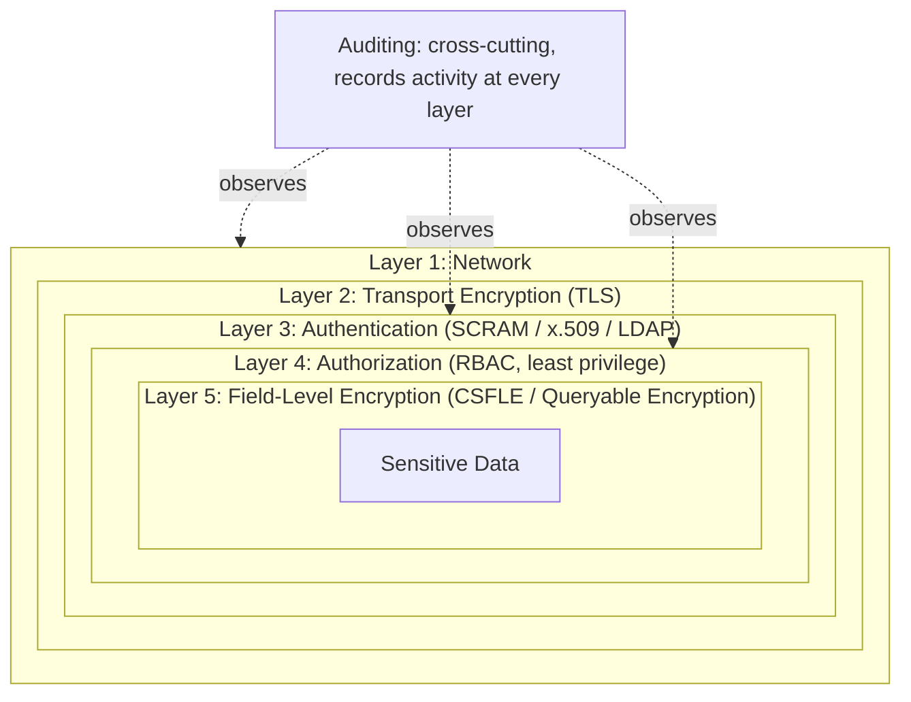

# Security

Chapter 14 taught you how to make a MongoDB deployment fast: reading query plans, using the profiler, applying the ESR rule, and tuning aggregation pipelines so they run efficiently at scale. None of that matters if the cluster you just optimized is also trivially readable, writable, or destroyable by anyone who happens to find its IP address. A beautifully indexed, perfectly sharded, sub-millisecond-latency deployment that ships customer PII to an attacker in plaintext is not a success — it's a liability with excellent throughput. This chapter is about closing that gap: authenticating who can connect, authorizing what they can do once connected, encrypting data both at rest and in transit, protecting specific sensitive fields even from privileged database users, locking down the network perimeter, auditing activity for compliance, and defending against MongoDB-specific injection risks in application code. Security in MongoDB is not one setting you flip — it's a set of independent, complementary layers, and this chapter walks through each one.

---

## Learning Objectives

By the end of this chapter, you will be able to:

- Explain MongoDB's authentication mechanisms — SCRAM, x.509 certificates, and (at a conceptual level) LDAP/Kerberos — and when to use each.
- Design a role-based access control (RBAC) scheme using built-in roles and custom roles that follow the principle of least privilege.
- Explain encryption at rest (the WiredTiger encrypted storage engine, Atlas's automatic encryption) and encryption in transit (TLS/SSL for client and intra-cluster connections).
- Explain Client-Side Field Level Encryption (CSFLE) and Queryable Encryption at a conceptual level, including the queryability trade-off they impose.
- Apply network security fundamentals: `bindIp`, firewalls, and VPC peering/private endpoints, and explain why an internet-exposed, unauthenticated `mongod` is a critical, historically-exploited misconfiguration.
- Describe what database auditing captures and why it matters for compliance.
- Recognize and prevent MongoDB-specific injection risks caused by passing unsanitized user input directly into query filters.

---

## Prerequisites for This Chapter

This chapter builds on the deployment topology introduced in [Chapter 12: Replication & High Availability](./12-replication-and-high-availability.md) — securing a cluster means securing every member of a replica set (or every shard and config server), not just a single node, so it helps to already have that topology in mind. It also draws on the process- and network-level architecture from [Chapter 3: Architecture & Internals](./03-architecture-and-internals.md): the `mongod`/`mongos` processes, the network port they listen on, and how clients connect to them are exactly the surfaces this chapter locks down.

We assume you're comfortable with:

- The distinction between a standalone `mongod`, a replica set, and a sharded cluster (Chapters 3, 12, 13).
- Basic connection strings and connecting via `mongosh` or a driver (Chapter 1, 4).
- Reading and writing simple documents and query filters (Chapter 4).

If any of that is shaky, revisit those chapters first — this chapter assumes you know *how* to connect to and query MongoDB, and focuses entirely on *who should be allowed to*, and *how to protect what they see*.

---

## 1. Authentication: Proving Who You Are

Authentication answers one question: **is this connection who it claims to be?** By default, a freshly installed, unconfigured `mongod` has authentication *disabled* — anyone who can reach it over the network can read and write everything, with no credentials at all. This is convenient for a five-minute local tutorial and catastrophic in production. The first step of securing any real deployment is enabling authentication and choosing a mechanism.

### 1.1 SCRAM (default username/password authentication)

**SCRAM** (Salted Challenge Response Authentication Mechanism) is MongoDB's default authentication mechanism and the one nearly every deployment starts with. It's a challenge-response protocol built on top of a salted, hashed password — the plaintext password is never sent over the wire, and the server never stores it in plaintext either (it stores a salted hash).

Enabling it is a two-step process: start `mongod` with authentication turned on, then create users.

```bash
# mongod.conf
security:
  authorization: enabled
```

```javascript
// Connect once, before authorization takes effect, to create the first admin user
use admin
db.createUser({
  user: "admin",
  pwd: passwordPrompt(),      // prompts interactively instead of hardcoding a password
  roles: [ { role: "userAdminAnyDatabase", db: "admin" } ]
})
```

After restarting `mongod` with `authorization: enabled`, every connection — including from `mongosh` — must authenticate:

```bash
mongosh "mongodb://admin@localhost:27017/admin" --authenticationDatabase admin
```

SCRAM is simple, requires no additional infrastructure (no certificate authority, no external identity provider), and is the right default for the overwhelming majority of deployments, especially smaller teams and Atlas's free/shared tiers.

### 1.2 x.509 certificate authentication

**x.509 authentication** replaces usernames and passwords with client TLS certificates. Instead of "prove you know a secret string," the model is "prove you hold the private key matching a certificate signed by a trusted certificate authority (CA)." Each client (a human user or, more commonly, an application service) is issued a certificate whose *subject* MongoDB maps to a specific database user.

x.509 is preferred in environments that already run a certificate infrastructure (common in large enterprises, regulated industries, and service-to-service authentication inside a Kubernetes cluster with a service mesh) because it:

- Eliminates password rotation and credential-sprawl problems — certificates are issued, rotated, and revoked centrally.
- Ties authentication to the same TLS handshake already used for encryption in transit (Section 4), so there's no separate authentication round-trip.
- Scales cleanly to machine-to-machine authentication, where "typing a password" was never the right model to begin with.

The trade-off is operational complexity: you now need a CA, a certificate issuance/rotation process, and revocation handling (certificate revocation lists or short-lived certificates) — real infrastructure that SCRAM doesn't require.

### 1.3 LDAP and Kerberos (Enterprise/Atlas)

For organizations with an existing enterprise identity provider — Active Directory, OpenLDAP, or a Kerberos realm — **MongoDB Enterprise Advanced** and **Atlas** support authenticating MongoDB users against that external directory via **LDAP (via proxy or SASL)** and **Kerberos (GSSAPI)**. The practical benefit is single sign-on: employees authenticate with the same corporate credentials they already use everywhere else, access is centrally deprovisioned the moment someone leaves the company, and there's no MongoDB-specific password to manage at all. This course covers LDAP/Kerberos only conceptually — the mechanism details are the same "proof of identity" idea as Sections 1.1–1.2, just delegated to an external system, and the community (non-Enterprise) edition of `mongod` does not include this feature.

---

## 2. Authorization and Role-Based Access Control (RBAC)

Authentication answers "who are you?" **Authorization** answers a completely different question: **now that I know who you are, what are you allowed to do?** MongoDB's authorization model is role-based — every user is assigned one or more roles, and each role is a bundle of granular *privileges* (an action, like `find` or `insert`, paired with a resource, like a specific collection or database).

### 2.1 Built-in roles

MongoDB ships a set of built-in roles that cover the vast majority of real needs without hand-writing privilege lists. The most commonly used:

| Role | Scope | Grants |
|---|---|---|
| `read` | Per-database | Read-only access to all collections in the database |
| `readWrite` | Per-database | Read and write access to all collections in the database |
| `dbAdmin` | Per-database | Schema-related admin tasks: indexes, `collStats`, `validate`, but not user/role management |
| `userAdmin` | Per-database | Create and manage users and roles within that database |
| `dbOwner` | Per-database | `readWrite` + `dbAdmin` + `userAdmin` combined — full control of one database |
| `clusterAdmin` | Cluster-wide | Highest cluster-wide administrative role: replication, sharding, server config |
| `clusterMonitor` | Cluster-wide | Read-only access to monitoring tools and status commands |
| `readAnyDatabase` / `readWriteAnyDatabase` | All databases | Same as `read`/`readWrite`, applied across every database on the server |
| `root` | Cluster-wide | Superuser — combines nearly every administrative role. Reserve for a very small number of break-glass accounts |

### 2.2 The principle of least privilege

The single most important rule in this section: **grant the minimum set of privileges a user or application actually needs to do its job, and nothing more.** In practice this means:

- Applications get a role scoped to `readWrite` on *the one database they use* — never `root`, never `readWriteAnyDatabase`, and never the same account humans use for admin tasks.
- A reporting service that only ever runs aggregation pipelines and never writes gets `read`, not `readWrite`.
- Human operators who manage indexes and diagnose performance get `dbAdmin`, not `dbOwner` or `root`, unless they specifically also need user management.
- Break-glass, cluster-wide accounts (`root`, `clusterAdmin`) exist for a small number of named individuals, are rarely used day-to-day, and are ideally protected by additional controls (MFA at the identity-provider layer, just-in-time access) where the platform supports it.

Least privilege doesn't just limit intentional misuse — it dramatically limits the *blast radius* of a compromised credential. If an application's database user is leaked or an application server is compromised, a `readWrite`-on-one-database credential can only touch that one database; a leaked `root` credential hands the attacker the entire cluster.

### 2.3 Custom roles

When the built-in roles don't line up with your access model — for example, an internal analytics tool that should be able to read every collection *except* one containing raw payment data — you define a **custom role** scoped to exactly the actions and resources you need:

```javascript
use admin
db.createRole({
  role: "analyticsReadLimited",
  privileges: [
    {
      resource: { db: "shop", collection: "orders" },
      actions: ["find"]
    },
    {
      resource: { db: "shop", collection: "products" },
      actions: ["find"]
    }
    // note: no privilege granted on shop.payments — implicitly inaccessible
  ],
  roles: []   // not composed from other roles; built entirely from explicit privileges
})

db.createUser({
  user: "analytics_svc",
  pwd: passwordPrompt(),
  roles: [ { role: "analyticsReadLimited", db: "admin" } ]
})
```

Custom roles can also be composed from other roles (via the `roles` array) plus additional explicit privileges, letting you build precise, auditable access tiers instead of reaching for an overly broad built-in role out of convenience.

---

## 3. Encryption at Rest

**Encryption at rest** protects data as it sits on disk — data files, journal files, and backups — so that someone who gains access to the underlying storage (a stolen disk, an improperly decommissioned drive, a cloud storage snapshot leaked or misconfigured) cannot read the raw bytes without the encryption key.

MongoDB Enterprise's WiredTiger storage engine includes a native **encrypted storage engine**: WiredTiger encrypts each page of data before writing it to disk and decrypts it on read, using AES-256 by default, with keys managed either locally (a keyfile) or through an external **Key Management Interoperability Protocol (KMIP)** server for centralized key rotation and management. This is transparent to the application — no query or schema change is required — and it protects only against *offline* access to the files, not against a client that has already authenticated and been authorized to read the data.

**MongoDB Atlas** enables encryption at rest automatically for every cluster, using the underlying cloud provider's encrypted storage volumes (and, on higher tiers, an integrated KMS/BYOK — Bring Your Own Key — option so you retain control of the encryption keys). For most teams on Atlas, this is genuinely a "nothing to configure" checkbox that's already checked; the value of understanding it is knowing what it does and doesn't protect against, which brings us to the layers that follow.

---

## 4. Encryption in Transit (TLS/SSL)

Encryption at rest protects data sitting still; it does nothing for data moving across a network. **Encryption in transit**, via TLS/SSL, protects two distinct connection paths that are easy to forget come in pairs:

- **Client-to-server**: the connection between your application (or `mongosh`, or Compass) and `mongod`/`mongos`.
- **Intra-cluster**: the connections *between* the members of a replica set, and between shards, config servers, and `mongos` routers in a sharded cluster.

Both matter. Encrypting only the client connection while leaving replica set members talking to each other in plaintext still exposes every document replicated over the internal network to anyone positioned to intercept that traffic — a real risk in shared or multi-tenant network environments.

```yaml
# mongod.conf
net:
  tls:
    mode: requireTLS
    certificateKeyFile: /etc/ssl/mongodb.pem
    CAFile: /etc/ssl/ca.pem
    clusterFile: /etc/ssl/cluster.pem   # used for intra-cluster (member-to-member) TLS
```

`mode: requireTLS` rejects any connection that doesn't negotiate TLS, closing off unencrypted access entirely (as opposed to `preferTLS` or `allowTLS`, which are useful only transitionally, while migrating a live cluster onto TLS without an outage). MongoDB Atlas enforces TLS on every client connection by default and cannot be configured otherwise — another example of a control that's "on" the moment you provision a cluster there.

---

## 5. Field-Level Encryption: CSFLE and Queryable Encryption

Encryption at rest and in transit both share the same blind spot: once a connection is authenticated and authorized, the data is decrypted and fully visible to that connection — including to a database administrator running `db.users.find()` directly on the server. For the most sensitive fields (a social security number, a credit card number, a health record), some organizations need a stronger guarantee: **not even a database administrator with full cluster access should be able to see the plaintext.**

### 5.1 Client-Side Field Level Encryption (CSFLE)

**CSFLE** encrypts specific fields *on the client*, before the document ever leaves the application process, using keys the MongoDB server never sees. The server stores and returns only ciphertext for those fields; it has no ability to decrypt them, no matter what privileges the connecting user holds. Decryption happens back on an authorized client, using a driver configured with access to the correct encryption keys (themselves protected by a key management system — a local keyfile for development, or a cloud KMS like AWS KMS/Azure Key Vault/GCP KMS in production).

```javascript
// Conceptual sketch — exact driver API varies by language
const encryptedFieldsMap = {
  "customers.users": {
    fields: [
      { path: "ssn", bsonType: "string", keyId: dataKeyId }
    ]
  }
};
// The driver transparently encrypts `ssn` on insert/update and decrypts it on read,
// using the referenced data key — mongod never sees plaintext.
```

### 5.2 Queryable Encryption

Naive field encryption has an obvious problem: if `ssn` is stored as opaque ciphertext, how do you run `db.users.find({ ssn: "123-45-6789" })`? Ordinary encryption breaks equality search entirely, because the same plaintext doesn't (and for security reasons, shouldn't) always encrypt to the same ciphertext.

**Queryable Encryption** solves this for a specific, useful subset of queries: it uses structured encryption techniques that allow the *server* to perform equality matches (and, in newer versions, range queries) directly against encrypted field data — without the server ever decrypting the field or learning anything about the plaintext beyond "these two ciphertexts represent equal values." This gives you the best of both worlds for the fields it supports: strong protection against server-side exposure, and the ability to keep querying on that field.

### 5.3 The trade-off: limited queryability

Both CSFLE and Queryable Encryption trade query flexibility for confidentiality. Encrypted fields:

- Cannot generally be used in range queries, regex, sorting, or aggregation expressions beyond what the specific encryption algorithm chosen supports (Queryable Encryption's equality and range query support is real but bounded — check current server version support before designing around it).
- Cannot be indexed the same way plaintext fields can — encrypted equality indexes exist but have different performance characteristics than a plain B-tree index on plaintext.
- Add client-side CPU and latency overhead for encryption/decryption on every read and write of those fields.

The right call is almost never "encrypt everything at the field level" — it's identifying the small number of genuinely sensitive fields (SSNs, payment details, health identifiers) where confidentiality outweighs the lost query flexibility, and leaving the rest of the document under normal encryption-at-rest/in-transit protection.

---

## 6. Network Security

Authentication and authorization assume a connection has already reached `mongod`. Network security is about controlling *which connections get that far in the first place* — arguably the most consequential layer of all, because a missing network control can render every other layer irrelevant.

### 6.1 `bindIp`

By default, recent versions of `mongod` bind only to `localhost` — a safe default that requires deliberate action to change. The `bindIp` setting controls which network interfaces `mongod` listens on:

```yaml
# mongod.conf
net:
  bindIp: 127.0.0.1,10.0.1.15   # localhost + one specific private interface — never 0.0.0.0 in production
  port: 27017
```

Binding to `0.0.0.0` (all interfaces) makes `mongod` reachable from every network the host is connected to, including — if the host has any public IP or NAT path — the public internet. There is essentially never a good reason to do this in production; bind explicitly to the private interfaces that need to reach the database.

### 6.2 Firewalls and security groups

Beyond `bindIp`, a firewall (an OS-level `iptables`/`nftables` ruleset, or a cloud security group) should restrict inbound connections on MongoDB's port to only the specific hosts that legitimately need access — typically application servers and a small number of administrative bastion hosts — and nothing else. This is defense in depth: even if `bindIp` were ever misconfigured, a correctly scoped firewall rule is a second, independent barrier.

### 6.3 VPC peering and private endpoints (Atlas)

MongoDB Atlas encourages — and on many plans defaults toward — connecting via **VPC peering** or **private endpoints** (AWS PrivateLink, Azure Private Link, GCP Private Service Connect) rather than a public IP allowlist. With a private endpoint, cluster traffic never traverses the public internet at all; it stays entirely within your cloud provider's private network backbone between your application's VPC and Atlas's. This is a strictly stronger posture than an IP allowlist on a public endpoint, because it removes an entire class of exposure (internet-facing attack surface) rather than just restricting who's allowed through it.

### 6.4 Never expose an unauthenticated database to the internet

This point is worth stating on its own because it is, empirically, the single most damaging MongoDB misconfiguration in the wild: **a `mongod` bound to `0.0.0.0`, reachable from the public internet, with authentication disabled.** Historically, this exact combination — an internet-facing, unauthenticated database — has been the root cause behind waves of mass MongoDB ransom incidents, where automated scanners simply connect to any exposed instance, copy or delete its data, and leave a ransom note demanding payment for its return (often with no actual backup of the stolen data ever being honored). None of these incidents required breaking encryption, guessing a password, or exploiting a vulnerability in MongoDB itself — they required only that someone left the front door completely open. Every control in this chapter matters, but this one is the floor: authentication enabled, `bindIp` scoped to trusted interfaces, and a firewall or private network boundary in front of it, always, non-negotiably, before a cluster ever holds real data.

---

## 7. Auditing

**Auditing** answers a question none of the previous layers answer on their own: **after the fact, who did what, when?** MongoDB Enterprise Advanced and Atlas support a system-level **audit log** that records events like authentication attempts (successful and failed), authorization checks, CRUD operations, schema changes, and user/role administration, each entry including the authenticated user, timestamp, and operation details.

Auditing exists primarily to satisfy compliance regimes (SOC 2, HIPAA, PCI-DSS, GDPR-adjacent data-access requirements) that mandate a durable, tamper-evident record of who accessed or modified regulated data — but it's operationally valuable well beyond compliance checkboxes: it's often the only way to reconstruct exactly what happened during a suspected breach or an internal data-misuse investigation. Audit filters can be scoped narrowly (for example, "log every read of the `payments` collection" rather than every operation on the cluster) to keep log volume manageable while still capturing what actually matters.

---

## 8. Injection Risks Specific to MongoDB

SQL injection is a familiar risk to most developers: unsanitized user input concatenated into a SQL string can change the query's meaning. MongoDB has no SQL string to concatenate into — queries are built from BSON documents, not text — but that doesn't make it immune to an analogous class of bugs. The risk shows up when **user-controlled input is passed directly into a query filter as a full sub-document**, letting an attacker inject query *operators* the application never intended to expose.

### 8.1 How operator injection happens

Imagine a login endpoint that builds its filter directly from a parsed request body:

```javascript
// DANGEROUS: req.body is attacker-controlled and used directly as a filter
app.post("/login", async (req, res) => {
  const user = await db.collection("users").findOne({
    username: req.body.username,
    password: req.body.password
  });
  // ...
});
```

If `req.body.password` is expected to be a string, a normal client sends `{ "username": "alice", "password": "hunter2" }`. But nothing stops a malicious client from sending a JSON body where `password` is itself an *object* containing a query operator:

```json
{ "username": "alice", "password": { "$gt": "" } }
```

Because MongoDB interprets `{ "$gt": "" }` as "greater than the empty string" — true for almost any non-empty stored password hash — the filter effectively becomes "find the user named alice, with any password at all," bypassing authentication entirely without ever knowing the real password. The same category of bug allows injecting `$ne`, `$regex`, or, in older MongoDB versions with server-side JavaScript execution enabled, `$where` with attacker-supplied JavaScript evaluated against every document in the collection — a far more serious risk, since `$where` can be used for both data exfiltration and denial-of-service via expensive scripts.

### 8.2 Preventing it

- **Schema validation.** Enforce a JSON Schema validator (Chapter 5) on the collection so that fields like `password` are rejected outright if they arrive as anything other than the expected BSON type — an object where a string is expected fails validation before it can do damage. This protects the data layer even if application code has a bug.
- **Type-check and sanitize input before building filters.** Never splice a parsed request body directly into a filter document. Explicitly extract and type-check each field (`String(req.body.username)`, reject if `typeof req.body.password !== "string"`) so an object literally cannot reach the filter where a scalar is expected.
- **Use driver-level query builders, not raw JSON.** Constructing filters through your driver's typed query-builder APIs (or an ODM like Mongoose with its own schema types) makes it structurally harder to smuggle an operator into a field, because the builder is expressing "equals this string" rather than "this JSON blob, whatever it contains."
- **Avoid `$where` and server-side JavaScript with any user input, full stop.** `$where` accepts arbitrary JavaScript evaluated per-document; there is essentially no safe way to include user input in it. Nearly every legitimate use of `$where` has a safer equivalent using standard query operators or `$expr`.
- **Disable server-side JavaScript execution** (`--noscripting` / `security.javascriptEnabled: false`) where the application doesn't genuinely need `$where`, `mapReduce`, or `db.eval` — removing the capability entirely is stronger than merely being careful with it.

---

## 9. Defense in Depth: How the Layers Stack

None of the controls in this chapter is sufficient alone — each protects against a different failure of the others. The security posture of a well-run MongoDB deployment is best understood as concentric layers, where an attacker (or a mistake) has to get through all of them, not just one, to reach plaintext data.



Reading this from the outside in: network controls (`bindIp`, firewalls, private endpoints) determine who can even open a connection; TLS protects that connection's contents in flight; authentication confirms identity; authorization limits what that identity can do; and field-level encryption protects the most sensitive individual fields even from a fully authenticated, fully authorized connection. Auditing doesn't block anything — it watches everything, providing the record you need after the fact regardless of which layer was involved.

---

## Real-World Scenario

**Setup:** Your team has just provisioned a brand-new production replica set (three `mongod` nodes, per Chapter 12's topology) for a customer-facing application that stores a `users` collection, including each user's `ssn` field for identity verification. It's freshly installed, with every default in place — meaning, right now, authentication is off and it's bound to a permissive interface. You have one working day to make this production-ready before the application team starts pointing real traffic at it.

**Working through it, layer by layer:**

1. **Enable authentication first.** Before anything else touches this cluster, set `security.authorization: enabled` in the config of every replica set member (Section 1), and — for a replica set specifically — configure a shared **keyfile** so the members can authenticate to *each other* as well, not just to clients. Restart each `mongod` one at a time (a rolling restart, so the replica set stays available) and confirm no client can connect without credentials.

2. **Create a proper user hierarchy, not one shared login.** Create a single break-glass admin user with a strong, uniquely generated password and the `userAdminAnyDatabase`/`dbAdminAnyDatabase` roles (Section 2), used only by named human operators. Then create a dedicated **application user** scoped to exactly what the app needs:

   ```javascript
   use admin
   db.createUser({
     user: "app_users_svc",
     pwd: passwordPrompt(),
     roles: [ { role: "readWrite", db: "customerapp" } ]
   })
   ```

   The application connects with `app_users_svc`, never with the admin account — if the application's credentials ever leak, the blast radius is "read/write on one database," not "the entire cluster."

3. **Enable TLS for every connection.** Issue (or obtain from your CA) a server certificate for each replica set member and a cluster certificate for intra-cluster traffic, then set `net.tls.mode: requireTLS` on every member (Section 4). Update the application's connection string to use `tls=true`. Confirm that a plaintext connection attempt is now rejected outright.

4. **Lock down the network.** Set `bindIp` on every member to the specific private network interfaces the replica set and application servers use — never `0.0.0.0` — and configure security groups/firewall rules so only the application servers and a bastion host for admin access can reach port 27017 at all (Section 6). If this is running in a cloud VPC, prefer a private endpoint over any public IP allowlist.

5. **Add field-level encryption for `ssn`.** Because `ssn` is exactly the kind of field that should be unreadable even to someone with full `dbOwner`-level access, configure CSFLE (Section 5) on the driver side: generate a data encryption key stored in your KMS, define an encrypted-fields map for `customerapp.users` covering the `ssn` path, and confirm that querying the collection directly in `mongosh` as the admin user shows only ciphertext for that field, while the application (using the correctly configured encrypted client) can still read and write it transparently.

6. **Validate the whole chain before cutover.** Connect as the scoped `app_users_svc` user and confirm a forbidden action — say, `db.dropDatabase()` or reading a different database — fails with an authorization error. Connect without TLS and confirm the connection is refused. Attempt to reach the cluster's port from a machine outside the allowed network range and confirm it times out. Only once all three checks fail the way you expect them to is the cluster genuinely ready for production traffic.

This is the shape of "securing a cluster from scratch": each step closes off a distinct failure mode, and skipping any one of them — especially step 1 or step 4 — reproduces exactly the kind of exposure that has caused real-world MongoDB ransom incidents.

---

## Best Practices

- **Enable authentication and TLS before the cluster ever holds real data**, not as a retrofit after launch — retrofitting means a window during which the cluster was genuinely exposed.
- **Give every application its own scoped user, never a shared admin account.** Least privilege (Section 2.2) limits the blast radius of any single leaked credential and makes audit trails meaningful (you know *which* service did *what*, not just "the admin account did something").
- **Treat `bindIp: 0.0.0.0` in production as a hard stop, not a warning.** Combined with disabled authentication, this single misconfiguration is the leading historical cause of mass MongoDB data-ransom incidents — there is no legitimate production reason to accept it.
- **Reserve field-level encryption (CSFLE/Queryable Encryption) for genuinely sensitive fields**, not the whole document — it buys strong confidentiality at the cost of query flexibility and added latency, so apply it surgically (SSNs, payment data, health identifiers).
- **Rotate credentials and certificates on a schedule, not just after an incident.** Password rotation, certificate renewal, and key rotation (for encryption-at-rest and CSFLE data keys) should be routine operational hygiene, not a one-time setup step.
- **Validate and type-check all user input that reaches a query filter.** Combine schema validation at the database layer with input sanitization at the application layer so operator injection (Section 8) is prevented at two independent points, not one.
- **Enable auditing wherever compliance requires it, and review the logs.** An audit log nobody reads provides no real security value beyond a checkbox — build it into an actual review or alerting workflow.

---

## Common Mistakes

- **Leaving authentication disabled and the instance bound to `0.0.0.0`, exposed to the public internet.** This is not a hypothetical risk — it is the well-documented, real-world root cause behind repeated waves of MongoDB ransomware/ransom-note incidents, where scanners found unauthenticated instances, exfiltrated or deleted their data, and demanded payment. Every deployment should treat "authentication on + network scoped" as a non-negotiable minimum, verified before go-live.
- **Using one shared admin (or `root`) credential for the application** instead of a role scoped to `readWrite` on a single database. This turns any application-level vulnerability (an injection bug, a leaked environment variable, a compromised dependency) into full cluster compromise instead of a contained incident.
- **Passing raw, unvalidated user JSON straight into a `find()`/`update()` filter**, allowing an attacker to smuggle in query operators (`$gt`, `$ne`, `$where`) and bypass intended logic like authentication checks (Section 8). Always type-check and validate input before it reaches a filter.
- **Assuming encryption at rest protects against everything.** It protects only against someone accessing the raw storage/disk offline — it does nothing against an authenticated, authorized connection reading data normally, which is exactly why field-level encryption (Section 5) exists as a separate, additional layer.
- **Enabling TLS for client connections but forgetting intra-cluster traffic.** A replica set or sharded cluster that encrypts client-to-server traffic but leaves member-to-member replication traffic in plaintext still exposes every replicated document on the internal network.
- **Treating security as a one-time setup task.** Certificates expire, dependencies accumulate CVEs, employees change roles and should have access revoked, and new collections get created without anyone re-applying the existing RBAC model to them. Security requires periodic review, not a single configuration pass at launch.
- **Over-encrypting at the field level "to be safe."** Applying CSFLE broadly across a document instead of to the few fields that truly need it needlessly sacrifices query flexibility and adds performance overhead without a corresponding security benefit.

---

## Summary

- **Authentication** (SCRAM by default, x.509 for certificate-based auth, LDAP/Kerberos for enterprise SSO in Enterprise/Atlas) establishes *who* is connecting.
- **Authorization/RBAC** determines *what* an authenticated identity can do, using built-in roles (`read`, `readWrite`, `dbAdmin`, `clusterAdmin`, etc.) or custom roles, always guided by the principle of least privilege.
- **Encryption at rest** (WiredTiger's encrypted storage engine, or automatic on Atlas) protects data on disk; **encryption in transit** (TLS) protects data on the wire, for both client connections and intra-cluster replication traffic — both are needed, neither substitutes for the other.
- **Field-level encryption** (CSFLE and Queryable Encryption) protects specific sensitive fields even from privileged database users, at the cost of reduced queryability on those fields — apply it surgically, not broadly.
- **Network security** (`bindIp`, firewalls, VPC peering/private endpoints) controls which connections can reach the server at all — an unauthenticated instance exposed to the public internet is the single most damaging, historically real, MongoDB misconfiguration.
- **Auditing** (Enterprise/Atlas) provides a durable record of who did what, supporting compliance and incident investigation.
- **Operator injection** is MongoDB's analog to SQL injection: unsanitized user input passed directly into a query filter can smuggle in operators like `$gt` or `$where`. Prevent it with schema validation, type-checking, driver-level query builders, and avoiding `$where`/server-side JS with user input.
- These controls form **defense in depth**: no single layer is sufficient, but together they mean a failure in one layer doesn't automatically compromise the whole system.

---

## Knowledge Check

1. What is the difference between authentication and authorization in MongoDB, and give one example role that illustrates authorization?
2. Why would an organization choose x.509 certificate authentication over SCRAM, and what additional infrastructure does that choice require?
3. Explain why encryption at rest does not protect against a fully authenticated, authorized user reading sensitive data — and which layer of security actually addresses that gap.
4. A junior developer writes `db.collection("users").findOne(req.body)` in a login handler. What specific attack does this enable, and what are two independent ways to prevent it?
5. Describe, using the concentric-layers model from Section 9, what would still protect a `users.ssn` field even if an attacker obtained valid `dbOwner` credentials for the database.

---

## Hands-On Exercise

Work through this on a local MongoDB installation (not a shared or production instance):

1. **Enable authentication.** Stop your local `mongod`, add `security.authorization: enabled` to its config file (or start it with `--auth`), and restart it. Confirm that `mongosh` without credentials can no longer read any data.

2. **Create an admin user.** While the instance was still unauthenticated (or via the localhost exception on first startup), create an admin user with `userAdminAnyDatabase` and `dbAdminAnyDatabase` on the `admin` database. Confirm you can log in as this user.

3. **Create a scoped application user.** As the admin user, create a second user with only `readWrite` on a single database (e.g., `shopdb`) — no roles on any other database, and no cluster-wide roles.

4. **Confirm the scoping actually works.** Connect via `mongosh` as the scoped user. Insert and read a document in `shopdb` — it should succeed. Then attempt an operation it should *not* be allowed to do, such as reading a different database (`use admin` and querying `system.users`) or running `db.dropDatabase()` on a database it wasn't granted access to. Confirm MongoDB rejects the forbidden action with an authorization error, and record the exact error message.

5. **Demonstrate operator injection conceptually.** Write a short script (Node.js with the MongoDB driver, or any language you're comfortable with) that inserts one test document, e.g. `{ username: "alice", password: "hashedvalue123" }`, into a `users` collection. Then write two versions of a "login" function:
   - **Unsafe version:** takes a raw object as the filter's `password` value directly from a variable meant to simulate user input, e.g. `{ username: "alice", password: userInput }`.
   - Call it once with `userInput = "wrongpassword"` (should return no match) and once with `userInput = { "$gt": "" }` (observe that it *matches* the document despite never supplying the real password).
   - **Safe version:** add a type check (`if (typeof userInput !== "string") reject`) before the filter is built, and confirm the same `{ "$gt": "" }` payload is now rejected before ever reaching the database.

   Write down, in a sentence or two, what the unsafe version demonstrates and which specific mitigation from Section 8.2 fixed it.

---

## Further Reading

- [Security Checklist](https://www.mongodb.com/docs/manual/administration/security-checklist/) — MongoDB's official, comprehensive pre-production security checklist.
- [Authentication](https://www.mongodb.com/docs/manual/core/authentication/) — full reference on SCRAM, x.509, LDAP, and Kerberos authentication mechanisms.
- [Role-Based Access Control](https://www.mongodb.com/docs/manual/core/authorization/) — built-in roles, custom roles, and privilege actions in depth.
- [In-Use Encryption (CSFLE / Queryable Encryption)](https://www.mongodb.com/docs/manual/core/csfle/) — the full mechanics of client-side field level encryption and queryable encryption.
- [Configure TLS/SSL](https://www.mongodb.com/docs/manual/tutorial/configure-ssl/) — step-by-step TLS setup for client and intra-cluster connections.

---

<div style="display:flex;justify-content:space-between;align-items:center;">
  <a href="./14-performance-tuning-and-query-optimization.md">← Previous: Performance Tuning & Query Optimization</a>
  <a href="./00-index.md">🏠 Index</a>
  <a href="./16-best-practices.md">Next: Best Practices →</a>
</div>
