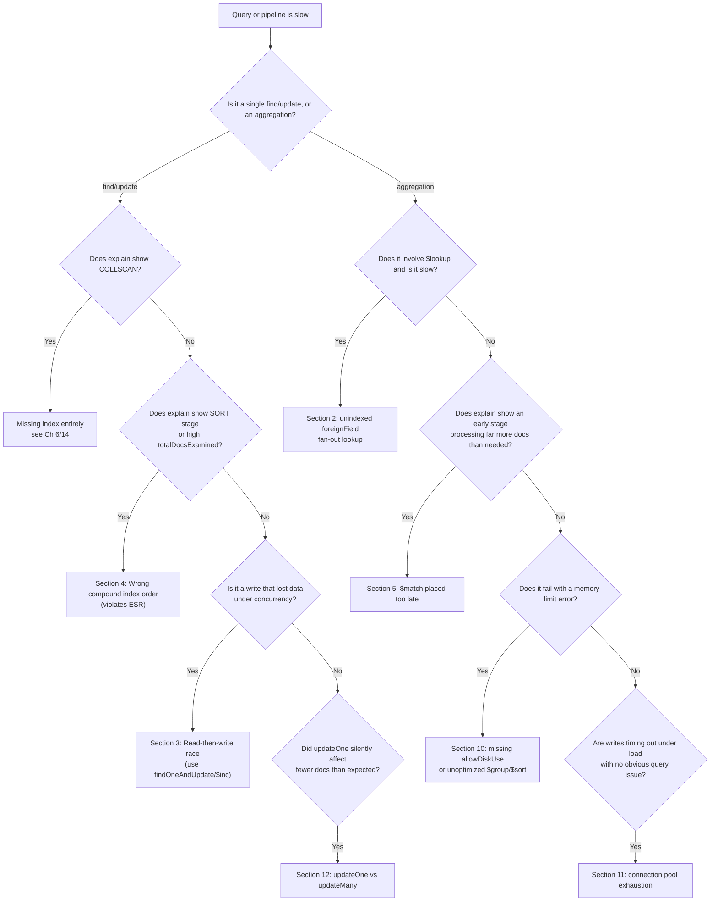

# Common Mistakes & Pitfalls

Chapter 16 gave you a checklist of what to *do*. This chapter is the mirror image: a catalog of what goes wrong when you don't — told not as abstract warnings, but as failure modes with a shape you can recognize in production. Every numbered section below is one real, recurring MongoDB mistake, walked through the same way an incident review would: **Symptom** (what you'd actually see in dashboards, logs, or angry Slack messages), **Root Cause** (the misunderstanding or shortcut that produced it), and **Fix** (the concrete change, with before/after code). These aren't hypothetical edge cases — they are the mistakes that show up over and over in MongoDB postmortems, Stack Overflow threads, and support tickets, across teams of every size. If Chapter 16 was the map, this chapter is the collection of cliffs marked on it.

---

## Learning Objectives

By the end of this chapter, you will be able to:

- Recognize at least ten specific, production-grade MongoDB failure modes from their symptoms alone (slow queries, memory errors, lost writes, hot shards).
- Explain the root cause behind each mistake in terms of MongoDB's underlying architecture — not just "don't do X," but *why* X breaks.
- Apply the correct fix for each mistake, including index redesign, atomic operators, pipeline reordering, and schema validation.
- Use a diagnostic decision tree to triage "my query/pipeline is slow" into a specific, named mistake.
- Read an incident narrative and identify which compounding mistakes caused it, in the style of a real postmortem.
- Reproduce at least one of these mistakes locally in `mongosh`, observe the bad behavior directly, and confirm the fix resolves it.

---

## Prerequisites for This Chapter

This chapter assumes you have completed **Chapters 1–16** of this course. In particular, we build directly on:

- **Chapter 5** (Data Modeling & Schema Design) — embedding vs. referencing, and the 16MB document limit.
- **Chapter 6** (Indexes Fundamentals) and **Chapter 14** (Performance Tuning) — compound indexes, the ESR rule, and reading `explain()` output.
- **Chapters 7–10** (Aggregation Pipeline) — stage ordering, `$lookup`, `$unwind`, memory limits, and `allowDiskUse`.
- **Chapters 11–12** (Transactions & ACID, Replication) — write concern, atomicity, and failover semantics.
- **Chapter 13** (Sharding & Scalability) — shard key selection and chunk distribution.
- **Chapter 15** (Security) — injection risks and query sanitization.
- **Chapter 16** (Best Practices) — the positive-framing checklist this chapter inverts into failure cases.

If any of those feel shaky, this chapter will still make sense, but the fixes will land harder if you've seen the underlying mechanism first.

---

## 1. Unbounded Array Growth

### Symptom

A collection of "user" or "post" documents starts fine, but months into production, updates to certain documents get progressively slower — not gradually across the whole collection, but concentrated on a shrinking set of specific "hot" documents (a popular post, a long-lived chat thread, a busy IoT sensor). Eventually, writes to those specific documents start failing outright with:

```text
BSONObj size: 16793601 (0x1005A01) is invalid.
Size must be between 0 and 16793600(16MB)
```

### Root Cause

Someone modeled a one-to-many relationship by embedding the "many" side as an array that has no natural upper bound — "all comments on this post," "all messages in this thread," "all readings from this sensor" — inside the parent document.

```js
// Anti-pattern: unbounded embedded array
{
  _id: ObjectId("..."),
  title: "Why MongoDB Rocks",
  author: "akash",
  comments: [
    { user: "alice", text: "Great post!", ts: ISODate("2024-01-01") },
    { user: "bob",   text: "Disagree...", ts: ISODate("2024-01-02") },
    // ... could grow to tens of thousands of entries
  ]
}
```

Two things degrade before you ever hit the hard 16MB BSON limit:

1. **Update cost grows with document size.** Every `$push` into `comments` requires WiredTiger to read, modify, and rewrite the *entire* document (or at least re-serialize the changed region within it), even though you only added one small subitem. As the array grows, each write gets measurably slower and consumes more of the storage engine's write-ahead log.
2. **The whole document travels on every read**, even if the caller only wanted the title and author — you're shipping tens of thousands of comments over the wire to render a page header.

The 16MB ceiling is real, but it's the *least* of your problems — performance degrades to unusable well before you get anywhere near it.

### Fix

Recognize the relationship's growth pattern (Chapter 5's Extended Reference / Subset patterns) and split the "many" side into its own collection, referencing the parent by ID:

```js
// Fix: comments live in their own collection
// posts collection
{ _id: ObjectId("post1"), title: "Why MongoDB Rocks", author: "akash",
  commentCount: 428 } // denormalized counter, kept in sync via $inc

// comments collection, indexed on postId
{ _id: ObjectId("..."), postId: ObjectId("post1"), user: "alice",
  text: "Great post!", ts: ISODate("2024-01-01") }

db.comments.createIndex({ postId: 1, ts: -1 });

// Fetch the latest 20 comments for a post — bounded, indexed, fast
db.comments.find({ postId: ObjectId("post1") }).sort({ ts: -1 }).limit(20);
```

If you need a *bounded* embedded array (e.g., "last 10 activity events" for a preview), use the **Bucket Pattern** or a capped sub-array with `$push` + `$slice` to enforce the bound explicitly:

```js
db.posts.updateOne(
  { _id: ObjectId("post1") },
  { $push: { recentComments: { $each: [newComment], $slice: -10 } } }
);
```

This keeps the array's size mathematically bounded regardless of how many comments ever get added.

---

## 2. Fan-Out `$lookup` Without an Index on the Foreign Field

### Symptom

An aggregation pipeline joining `orders` to `customers` was fast in development (a few hundred test documents) but becomes catastrophically slow in production — a report that should take milliseconds takes minutes, pegs CPU, and shows up in `db.currentOp()` as a long-running aggregation.

### Root Cause

`$lookup` performs, conceptually, one lookup into the foreign collection *per document* flowing through the pipeline at that stage (MongoDB batches and optimizes this somewhat, but the fundamental requirement stands): the foreign field being matched against must be indexed, or each of those lookups degenerates into a full collection scan.

```js
// customers collection has NO index on customerId
db.orders.aggregate([
  { $match: { status: "shipped" } },       // 500,000 matching orders
  { $lookup: {
      from: "customers",
      localField: "customerId",
      foreignField: "customerId",           // unindexed!
      as: "customer"
  }}
]);
```

With 500,000 input documents and no index on `customers.customerId`, this is effectively 500,000 collection scans of `customers`. `explain()` on the `$lookup` stage will show `totalDocsExamined` on the foreign collection exploding far past its actual document count.

### Fix

Always index the field named in `foreignField` before joining at scale — this is exactly as non-negotiable as indexing a SQL join column:

```js
db.customers.createIndex({ customerId: 1 });
```

Also apply the ESR-adjacent aggregation rule: filter (`$match`) and reduce the pipeline's working set on the **local** side *before* the `$lookup`, so you're joining 5,000 pre-filtered orders instead of 500,000:

```js
db.orders.aggregate([
  { $match: { status: "shipped", orderDate: { $gte: startOfMonth } } }, // narrows first
  { $lookup: {
      from: "customers",
      localField: "customerId",
      foreignField: "customerId",   // now indexed
      as: "customer"
  }}
]);
```

For very large joins, also consider `$lookup`'s pipeline syntax with its own internal `$match`, and verify with `.explain("executionStats")` that the join reports an `IXSCAN`, not a `COLLSCAN`, on the foreign collection.

---

## 3. Read-Then-Write Race Conditions

### Symptom

A "decrement inventory on checkout" feature occasionally oversells a product — two concurrent checkouts both succeed even though only one item was in stock. Under load testing or a flash-sale traffic spike, the inventory count in the database goes negative, which should be structurally impossible.

### Root Cause

The application reads the current value, computes a new value in the application layer, and writes it back — three separate steps with a window for another process to interleave:

```js
// Anti-pattern: read-modify-write, not atomic
const product = await db.collection("products").findOne({ _id: productId });
if (product.stock > 0) {
  await db.collection("products").updateOne(
    { _id: productId },
    { $set: { stock: product.stock - 1 } }
  );
}
```

Between the `findOne` and the `updateOne`, another request can read the *same* `stock` value, and both requests will decrement from the same starting point — a classic **lost update**. MongoDB never serialized these two operations against each other because, from the database's point of view, they were two unrelated, independent commands.

### Fix

Push the read-check-write logic into a single atomic operation using update operators (`$inc`) combined with a query filter that encodes the precondition:

```js
// Fix: atomic conditional decrement
const result = await db.collection("products").findOneAndUpdate(
  { _id: productId, stock: { $gt: 0 } },   // precondition checked atomically
  { $inc: { stock: -1 } },
  { returnDocument: "after" }
);

if (!result) {
  // stock was already 0 — the match failed, no write happened
  throw new Error("Out of stock");
}
```

Because the filter and the update execute as a single atomic operation on the storage engine (Chapter 11's single-document atomicity guarantee), no interleaving is possible: either the document matched (stock was positive) and got decremented, or it didn't match and nothing happened — there is no window in between. For multi-document invariants (e.g., decrementing stock *and* writing an order in one unit), reach for a multi-document transaction instead, but for single-document counters, `$inc`/`findOneAndUpdate` is simpler, faster, and lock-free compared to a transaction.

---

## 4. Wrong Compound Index Field Order (Violating ESR)

### Symptom

A query that filters on `status` and `customerId` and sorts by `orderDate` is slow despite "having an index." `explain()` shows a high `totalDocsExamined` relative to `nReturned`, and/or a `SORT` stage with `"stage": "SORT"` performing an in-memory sort rather than the index handing back pre-sorted results.

### Root Cause

A compound index was created, but with fields in an order that doesn't follow the **ESR rule** (Equality, Sort, Range — covered in Chapter 14):

```js
// Query
db.orders.find({ status: "shipped", customerId: "C123" })
         .sort({ orderDate: -1 });

// Anti-pattern index — sort field placed before the equality fields
db.orders.createIndex({ orderDate: -1, status: 1, customerId: 1 });
```

With this index, MongoDB can use it to satisfy the sort, but it cannot use it to narrow down `status`/`customerId` efficiently — it has to walk the index in `orderDate` order and re-check `status`/`customerId` on every entry, examining vastly more index entries than the query actually needs. Alternatively, if the equality fields are indexed but the range/sort field is placed in the wrong position relative to a range query, MongoDB may abandon the index for sorting entirely and perform a `SORT` in memory, which is capped by `internalQueryMaxBlockingSortMemoryUsageBytes` (100MB by default) — meaning that beyond a certain result size, the query fails outright with an error rather than merely being slow.

### Fix

Reorder the compound index so **Equality** fields come first, then the **Sort** field, then any **Range** fields:

```js
// Fix: Equality, Sort, Range
db.orders.createIndex({ status: 1, customerId: 1, orderDate: -1 });
```

Now MongoDB can seek directly to the `(status, customerId)` equality prefix and walk that slice of the index in `orderDate` order for free — no in-memory sort, and `totalDocsExamined` collapses to roughly `nReturned`. Always verify with:

```js
db.orders.find({ status: "shipped", customerId: "C123" })
         .sort({ orderDate: -1 })
         .explain("executionStats");
```

Look for `"stage": "IXSCAN"` feeding directly into the result with no `"stage": "SORT"` in the plan.

---

## 5. `$match` Placed Too Late in an Aggregation Pipeline

### Symptom

An aggregation pipeline that computes a per-customer summary is slow and its `explain()` shows the `$match` stage running *after* an `$unwind` or an expensive `$project`, with `executionStats` showing that early stages processed the entire collection before any filtering happened.

### Root Cause

The pipeline was written in the "natural" order the report was described in, rather than in the order that minimizes work — for example, unwinding a large array and reshaping every document before filtering out the 99% of documents that were never needed:

```js
// Anti-pattern: filter comes after expensive stages
db.orders.aggregate([
  { $unwind: "$items" },                      // explodes every order into N documents
  { $project: { customer: 1, items: 1, total: { $multiply: ["$items.price", "$items.qty"] } } },
  { $match: { "customer.region": "APAC" } }   // only NOW do we discard non-APAC data
]);
```

Every document in the entire collection gets unwound and reshaped before the pipeline throws most of that work away. `$unwind` in particular can massively multiply the document count flowing into subsequent stages, so doing it before filtering is one of the most expensive ordering mistakes possible.

### Fix

Move `$match` as early as possible — ideally as the very first stage, and split it further if a second filter becomes available after a `$lookup` or `$unwind`:

```js
// Fix: filter first, using an index if possible
db.orders.aggregate([
  { $match: { "customer.region": "APAC" } },   // uses an index, discards early
  { $unwind: "$items" },
  { $project: { customer: 1, items: 1, total: { $multiply: ["$items.price", "$items.qty"] } } }
]);
```

Note that MongoDB's query optimizer already tries to push `$match` stages earlier and merge/reorder some stages automatically (visible via `explain()`'s `queryPlanner.optimizedPipeline` — Chapter 10), but it cannot always do this safely — for instance, it generally cannot hoist a `$match` across a `$group` or `$unwind` if the match depends on fields computed or exploded by that stage. Never rely on the optimizer to save you from a badly ordered pipeline; write it in the efficient order yourself and use an index-covered `$match` as the first stage whenever the query pattern allows it.

---

## 6. Treating MongoDB as "Schemaless" and Skipping Validation

### Symptom

Months into a project, an aggregation pipeline that sums an `amount` field silently returns `0` or wrong totals for a subset of documents. Debugging reveals that some documents have `amount` as a string (`"49.99"`) instead of a number, some have `Amount` (capitalized) instead of `amount`, and a few have no such field at all — each written by a different service or an earlier version of the app.

### Root Cause

"Schemaless" was taken literally to mean "schema doesn't matter," rather than correctly understood as "schema enforcement is optional and application-controlled, not database-controlled by default" (Chapter 5). Without any validation layer, every service that writes to the collection can independently drift in field names, types, and shapes, and MongoDB will happily accept all of it:

```js
// No schema validation — anything goes
db.orders.insertOne({ customerId: "C1", Amount: "49.99" });   // wrong case, wrong type
db.orders.insertOne({ customerId: "C2", amount: 49.99 });     // correct
db.orders.insertOne({ customerId: "C3" });                    // missing entirely
```

`$sum: "$amount"` silently ignores the documents where the field is missing or of a non-numeric type — no error is raised, the aggregation just quietly produces an under-counted result. This is far more dangerous than a hard failure, because it goes unnoticed until someone reconciles numbers against another system.

### Fix

Attach **schema validation** (Chapter 5) to enforce a minimum contract at the database level, so bad writes fail loudly at insert time instead of corrupting aggregations silently later:

```js
db.runCommand({
  collMod: "orders",
  validator: {
    $jsonSchema: {
      bsonType: "object",
      required: ["customerId", "amount"],
      properties: {
        customerId: { bsonType: "string" },
        amount:     { bsonType: ["double", "decimal"], minimum: 0 }
      }
    }
  },
  validationLevel: "strict",
  validationAction: "error"
});
```

For an existing collection with legacy bad data, start with `validationAction: "warn"` to log offenders without blocking writes, run a cleanup migration, then flip to `"error"`. Pair this with application-level typing (e.g., a schema library like Zod, or a Mongoose schema) so bad shapes are rejected client-side too, and periodically audit field-type consistency with an aggregation like:

```js
db.orders.aggregate([
  { $group: { _id: { $type: "$amount" }, count: { $sum: 1 } } }
]);
```

---

## 7. `$where` and Unsanitized User Input as Query Operators

### Symptom

A search endpoint that lets users filter by an arbitrary field starts behaving strangely under adversarial input — some requests take far longer than others, and a security audit (tying back to Chapter 15) flags that the endpoint is vulnerable to NoSQL injection, potentially allowing an attacker to bypass filters or exfiltrate data they shouldn't see.

### Root Cause

The application either uses the `$where` operator to run arbitrary JavaScript server-side, or builds query objects directly from unsanitized user-supplied JSON, allowing an attacker to inject MongoDB operators instead of plain values:

```js
// Anti-pattern 1: $where executes arbitrary JS per document (slow AND dangerous)
db.users.find({ $where: `this.username == '${req.body.username}'` });

// Anti-pattern 2: user input passed straight through as a query filter
db.users.findOne({ username: req.body.username, password: req.body.password });
// If req.body.password is the object { "$ne": null }, this becomes:
// db.users.findOne({ username: "...", password: { $ne: null } })
// which matches ANY user with a non-null password — an authentication bypass.
```

`$where` runs a full JavaScript interpreter per document (no index usage, and a large performance cost even when not exploited), and unsanitized input lets a client smuggle operators like `$ne`, `$gt`, or `$regex` into what was meant to be a plain equality value.

### Fix

Never use `$where` for anything reachable from user input (avoid it in general — nearly every use case has a faster, safer native-operator equivalent). Validate and coerce input types strictly before building a query, and use a schema/validation library to reject unexpected object shapes:

```js
// Fix: enforce types before building the query
const username = String(req.body.username);
const password = String(req.body.password);

if (typeof req.body.username !== "string" || typeof req.body.password !== "string") {
  throw new Error("Invalid input");
}

const user = await db.collection("users").findOne({ username });
const valid = await bcrypt.compare(password, user.passwordHash); // never query on raw passwords at all
```

Also enable `express-mongo-sanitize` (or equivalent middleware in your stack) to strip `$`-prefixed keys from incoming request bodies as a defense-in-depth layer, and review Chapter 15's guidance on least-privilege database roles so that even a successful injection is limited in blast radius.

---

## 8. Choosing a Monotonically Increasing Shard Key

### Symptom

A sharded cluster is under-utilizing most of its shards — `sh.status()` or the Atlas metrics dashboard shows one shard consistently absorbing nearly all write traffic and disk growth, while the others sit idle. Write latency climbs even though the cluster "has capacity" on paper.

### Root Cause

The shard key chosen was `_id` (with default `ObjectId`s) or an explicit ascending timestamp field — both of which are monotonically increasing over time (Chapter 13). Every new document's shard key value is numerically/lexically greater than the last, so the balancer's range-based chunk assignment routes *all* new inserts to whichever single chunk currently owns the "highest" range — almost always the most recently split chunk, living on one shard:

```js
// Anti-pattern: monotonically increasing shard key
sh.shardCollection("app.events", { _id: 1 });          // ObjectId is time-ordered
// or
sh.shardCollection("app.events", { createdAt: 1 });     // explicitly time-ordered
```

Every single insert lands in the same "newest" chunk on the same shard. Your write throughput is capped at what *one shard* can handle, no matter how many shards you add — the exact opposite of what sharding is supposed to buy you.

### Fix

Choose a shard key with high cardinality and even, unpredictable distribution across the key space, or use **hashed sharding** to explicitly scramble a naturally sequential key:

```js
// Fix 1: hashed shard key spreads inserts evenly across shards
sh.shardCollection("app.events", { _id: "hashed" });

// Fix 2: compound key combining a high-cardinality field with time,
// useful when you still want range queries over time within a partition
sh.shardCollection("app.events", { deviceId: 1, createdAt: 1 });
```

Hashed sharding sacrifices efficient range queries on the hashed field (a range scan across hash values touches every shard), so weigh that against your read patterns — a compound key like `{ deviceId: 1, createdAt: 1 }` is often the better real-world choice when you both write heavily and query by a natural partition key (device, tenant, region) plus a time range.

---

## 9. Using `w: 1` Write Concern for Critical Data

### Symptom

During a routine primary failover (a planned maintenance restart or an unplanned crash), a small number of recently "successful" writes — order confirmations, payment records — simply vanish. The application logged a success response for them, but they are nowhere to be found after the new primary takes over.

### Root Cause

Writes were issued with the default or explicit `w: 1` write concern, which only requires acknowledgment from the primary before returning success — it does not wait for the write to replicate to any secondary (Chapters 11–12):

```js
// Anti-pattern: acknowledged by primary only
db.payments.insertOne(
  { orderId: "O123", amount: 49.99, status: "confirmed" },
  { writeConcern: { w: 1 } }
);
```

If the primary crashes (or is stepped down) before that write replicates to any secondary, and a secondary that never received it is elected the new primary, the write is permanently lost from the replica set's perspective — even though the original client received an acknowledgment. This is a classic **rollback on failover** scenario: the old primary, upon rejoining, will have its un-replicated writes rolled back to match the new primary's oplog.

### Fix

Use `w: "majority"` for any write where durability matters more than the last few milliseconds of latency — this ensures a majority of voting replica set members have the write in their oplog before the client considers it successful, which guarantees it survives any single-node failover:

```js
// Fix: majority write concern for critical data
db.payments.insertOne(
  { orderId: "O123", amount: 49.99, status: "confirmed" },
  { writeConcern: { w: "majority" } }
);
```

For truly critical multi-document operations, combine `w: "majority"` with a transaction and `readConcern: "majority"` on the reads that need to observe it durably (Chapter 11). Reserve `w: 1` deliberately for high-volume, loss-tolerant data (e.g., ephemeral telemetry pings) where the throughput gain is worth the durability trade-off — the mistake isn't using `w: 1`, it's using it *without deciding to*.

---

## 10. Skipping `allowDiskUse` and Hitting the Aggregation Memory Limit

### Symptom

An aggregation pipeline that has run fine for months in production suddenly starts failing with:

```text
MongoServerError: Sort exceeded memory limit of 104857600 bytes, but did not opt in
to external sorting.
```

This shows up not during development, but weeks or months later, exactly when the collection crosses some data-volume threshold — often during a seasonal traffic spike or a large batch import, which is the worst possible time for a report to start hard-failing.

### Root Cause

Blocking aggregation stages — `$sort`, `$group`, `$bucket`, and others that must materialize their entire working set before producing output — are capped at 100MB of RAM per stage by default. As the collection grows, a `$group` or `$sort` stage that used to comfortably fit in 100MB eventually doesn't, and the stage fails outright rather than silently degrading:

```js
// Fails once the group's working set exceeds 100MB
db.events.aggregate([
  { $group: { _id: "$userId", events: { $push: "$$ROOT" } } },
  { $sort: { _id: 1 } }
]);
```

### Fix

There are two complementary fixes, and you generally want both:

1. **Allow the stage to spill to disk** as an immediate, safe unblock:

```js
db.events.aggregate([
  { $group: { _id: "$userId", events: { $push: "$$ROOT" } } },
  { $sort: { _id: 1 } }
], { allowDiskUse: true });
```

2. **Fix the pipeline so it doesn't need that much memory in the first place** — this is the real, durable fix, since disk spilling is significantly slower than in-memory processing and just delays the next failure as data keeps growing:

```js
// Better: filter and project down before the expensive $group,
// and avoid $push-ing entire documents when you only need a few fields
db.events.aggregate([
  { $match: { createdAt: { $gte: last30Days } } },        // shrink input first
  { $project: { userId: 1, eventType: 1, createdAt: 1 } }, // strip unneeded fields
  { $group: { _id: "$userId", count: { $sum: 1 } } }        // aggregate, don't accumulate raw docs
]);
```

Treat `allowDiskUse: true` as a safety net you should set proactively on any pipeline touching unbounded data volumes — not a fix you only discover you need after a production outage — but always pair it with pipeline-level optimization (early `$match`/`$project`, avoiding `$push: "$$ROOT"` at scale) rather than treating it as a substitute for a well-designed pipeline.

---

## 11. Ignoring Connection Pool Exhaustion Under Load

### Symptom

Under moderate-to-heavy load, the application starts throwing timeout errors across seemingly unrelated operations — some requests hang for the full timeout window before failing, and the errors cluster in bursts rather than scaling smoothly with traffic. Database server-side metrics (`db.serverStatus().connections`) look fine, but client-side latency is terrible.

### Root Cause

The driver's connection pool (Chapter 3/18) has a finite maximum size (`maxPoolSize`, default 100 in most modern drivers). When the application issues more concurrent operations than the pool has connections available, additional requests queue up waiting for a connection to free — and if that queue grows faster than connections free up (e.g., because some queries are themselves slow due to a missing index, compounding the problem), requests start timing out waiting merely to *acquire a connection*, before a single query byte has even been sent:

```js
// Anti-pattern: default/unconsidered pool size, no monitoring,
// and a new MongoClient created per request (never reused!)
app.get("/orders", async (req, res) => {
  const client = new MongoClient(uri);   // new pool, new connections, every request
  await client.connect();
  const orders = await client.db("app").collection("orders").find().toArray();
  res.json(orders);
});
```

Creating a new `MongoClient` per request is the single most common variant of this mistake — it defeats pooling entirely, opening and tearing down TCP/TLS connections constantly and multiplying load on `mongod`'s connection accounting.

### Fix

Create **one** `MongoClient` per application process (it manages its own internal pool and is safe to share across requests), size the pool deliberately based on measured concurrency needs, and monitor pool saturation as a first-class metric:

```js
// Fix: a single, shared, appropriately sized client
const client = new MongoClient(uri, {
  maxPoolSize: 200,        // sized to expected concurrent operations
  minPoolSize: 10,         // keep some warm connections ready
  waitQueueTimeoutMS: 5000 // fail fast instead of hanging indefinitely
});
await client.connect();

app.get("/orders", async (req, res) => {
  const orders = await client.db("app").collection("orders").find().toArray();
  res.json(orders);
});
```

Also fix the root amplifiers: slow, unindexed queries hold connections longer than necessary, so a missing index (Sections 2 and 4 of this chapter) can look like a "connection pool problem" when the real fix is an index. Monitor `connections.current`, `connections.available`, and driver-side pool wait times so you see saturation coming before it becomes an outage.

---

## 12. `updateOne` When `updateMany` Was Intended

### Symptom

A migration script meant to flag every order from a canceled promotional campaign as `refunded: true` runs without error, reports success, but a data audit later reveals only *one* order was actually updated — the other 4,999 matching documents were untouched.

### Root Cause

MongoDB's update methods are intentionally split between single-document and multi-document variants, and it's easy to reach for the wrong one out of habit (especially coming from APIs that default to "all matches"), or to have copy-pasted a single-document example without adjusting it:

```js
// Anti-pattern: only updates the FIRST matching document, silently
db.orders.updateOne(
  { campaignId: "PROMO2024", status: "pending" },
  { $set: { refunded: true } }
);
// Returns { matchedCount: 1, modifiedCount: 1 } — looks successful!
// The other 4,999 matching documents are left exactly as they were.
```

The dangerous part isn't that it fails — it's that it *succeeds*, returning a normal-looking acknowledgment, so nothing in the immediate feedback loop signals that anything went wrong. The bug surfaces only later, via a downstream audit or a customer complaint.

### Fix

Use `updateMany` whenever the intent is "every document matching this filter," and make it a habit to sanity-check `matchedCount` against an independent `countDocuments()` call for any bulk operation, especially in one-off scripts and migrations:

```js
// Fix: updateMany, and verify the count matches expectations
const expected = await db.orders.countDocuments({ campaignId: "PROMO2024", status: "pending" });

const result = await db.orders.updateMany(
  { campaignId: "PROMO2024", status: "pending" },
  { $set: { refunded: true } }
);

if (result.matchedCount !== expected) {
  throw new Error(`Expected to match ${expected}, matched ${result.matchedCount}`);
}
console.log(`Updated ${result.modifiedCount} of ${expected} orders`);
```

For any migration or bulk-write script touching production data, treat "does `matchedCount`/`modifiedCount` equal what I expected?" as a mandatory assertion, not an optional log line — this single habit catches this entire class of mistake before it ships.

---

## Diagnostic Decision Tree: "My Query/Pipeline Is Slow — Which Mistake Is It?"



---

## Real-World Scenario

**Setup:** A mid-size social-reading app stores each book's discussion thread as a single document, with all comments embedded directly in an array — a design that felt natural during the MVP phase and was never revisited. Six months post-launch, the most popular book club threads have accumulated tens of thousands of comments each.

**The incident:** On a Friday evening, a celebrity book club pick goes viral. Traffic to that one thread spikes 50x. Within twenty minutes, on-call gets paged for two separate alerts: write latency on the `threads` collection has spiked into the seconds, and shortly after, a burst of `BSONObj size... exceeds maximum` errors appear in the logs for that specific thread's `_id`.

**Diagnosis, step by step:**

1. The team's first instinct is "we're getting hit hard, let's check the shard distribution." `sh.status()` reveals the `threads` collection is sharded on `_id` (a default `ObjectId`) — every new thread lands on whatever shard owns the current top of the range, so *new thread creation* isn't actually the bottleneck here (Section 8's mistake exists in this system, but it isn't today's fire), while the **hot document problem is orthogonal**: it's one specific existing document being hammered with updates and reads, not new inserts landing unevenly.
2. Looking at the slow-write logs, the on-call engineer runs `explain()` conceptually on the update pattern and realizes every new comment does a `$push` into the thread's `comments` array — which, for this one viral document, has already grown past 12MB. Each `$push` now has to rewrite an enormous document (**Section 1: unbounded array growth**), and write latency for *that specific document* has degraded to multiple seconds — explaining the first alert.
3. Twenty minutes later, the array crosses 16MB and writes to that thread start hard-failing with the BSON size error — the array growth mistake has gone from "slow" to "broken."
4. While triaging, the team also notices that a chunk of "successful" comment writes from the ten minutes *before* the outage are missing entirely after they fail over a replica set member for emergency maintenance capacity — those writes were issued with the driver's default write concern, which in this deployment had been left at `w: 1` (**Section 9**). The primary acknowledged them before they replicated, and the failover rolled them back. Users who posted comments minutes before the outage find them gone, compounding user-visible damage on top of the outage itself.
5. **The fix, applied live and then hardened afterward:** Comments are migrated out into their own `comments` collection referencing `threadId`, with a compound index on `{ threadId: 1, ts: -1 }` (Section 1's fix) — this immediately uncaps the growth problem for every thread, not just the viral one. The team also flips write concern for comment inserts to `w: "majority"` (Section 9's fix) so a future failover cannot silently drop acknowledged writes. As a follow-up (not urgent enough to block the fix, but flagged for the next sprint), they schedule a shard-key migration for `threads` off of `_id` and onto a hashed key, closing the Section 8 exposure before it becomes its own incident.

**Lesson:** No single mistake caused this outage — unbounded array growth caused the *slowdown*, and it was `w: 1` write concern that turned a slowdown into *silent data loss* during the emergency response to it. Production incidents are rarely one clean textbook mistake; they're usually two or three of this chapter's failure modes compounding, each one making the others more damaging.

---

## Best Practices

- **Model growth, not just structure.** Before embedding an array, ask "what is the maximum realistic size of this, and is there a hard case where it's unbounded?" If you can't name a bound, it doesn't belong embedded.
- **Index every field you `$lookup` on, `$match` on, or `sort()` by**, and get in the habit of running `explain("executionStats")` on any query or pipeline before it ships, not after it's slow in production.
- **Reach for atomic operators (`$inc`, `findOneAndUpdate`, transactions) for anything touching a shared counter or balance** — never trust a read-modify-write round trip through the application layer for concurrent state.
- **Choose write concern and shard keys deliberately, as an explicit design decision**, not as whatever the driver/cluster defaults to — write down why `w: 1` vs `w: "majority"`, and why a given shard key, were chosen.
- **Validate schemas at the database layer**, not just in application code — different services, languages, and code versions will drift unless the database itself enforces a contract.
- **Treat `matchedCount`/`modifiedCount` assertions as mandatory in scripts and migrations** — a "successful" bulk operation that touched the wrong number of documents is a silent data bug waiting to be discovered by someone else.
- **Set `allowDiskUse: true` proactively on any pipeline touching unbounded or fast-growing data**, and separately optimize the pipeline so disk spilling is a safety net, not the plan.

---

## Common Mistakes

- **Unbounded array growth** — embedding an ever-growing "all X" array degrades writes long before hitting the 16MB document limit.
- **Fan-out `$lookup` without an index** — an unindexed `foreignField` turns a join into a collection scan per input document.
- **Read-then-write races** — non-atomic read-modify-write cycles lose updates under concurrency; use `findOneAndUpdate`/`$inc` instead.
- **Wrong compound index field order** — violating ESR (Equality, Sort, Range) causes in-memory sorts and excessive document examination.
- **`$match` placed too late** — filtering after an expensive `$unwind`/`$project` wastes work on documents that get discarded anyway.
- **Treating MongoDB as schemaless** — skipping validation lets field types/names drift across services, silently corrupting aggregations.
- **`$where`/unsanitized input as query operators** — a NoSQL injection and performance risk; validate and type-check all user input.
- **Monotonically increasing shard keys** — `_id`/timestamp shard keys create a hot shard that absorbs all writes.
- **`w: 1` for critical data** — writes acknowledged only by the primary can be silently lost on failover.
- **Skipping `allowDiskUse`** — blocking aggregation stages hard-fail past the 100MB memory limit without it.
- **Ignoring connection pool exhaustion** — undersized pools (or a `MongoClient` created per request) cause cascading timeouts under load.
- **`updateOne` instead of `updateMany`** — silently updates only the first matching document, with no error to signal the mistake.

---

## Summary

- Each mistake in this chapter follows the same shape: a shortcut that works fine at small scale, and a specific architectural reason it stops working at production scale or under concurrency/failover.
- Schema mistakes (unbounded arrays, missing validation) and index mistakes (wrong ESR order, unindexed `$lookup` fields) are the most common root causes of "it was fast in dev, it's slow in prod."
- Concurrency and durability mistakes (read-then-write races, `w: 1` on critical data) are the most dangerous because they fail *silently* — the system reports success while data is lost or corrupted.
- Operational mistakes (`updateOne`/`updateMany` confusion, connection pool exhaustion, skipping `allowDiskUse`) are avoidable with small, mechanical habits: assert counts, monitor pool saturation, and set safety nets proactively.
- Real incidents are rarely one mistake in isolation — the Real-World Scenario shows how unbounded array growth and weak write concern compounded into both an outage and silent data loss simultaneously.
- The fix for nearly every mistake here was known and documented well before it caused an incident — this chapter exists so you recognize the symptom *before* production does it for you.

---

## Knowledge Check

1. A collection's write latency degrades specifically for a small number of "hot" documents, and eventually those documents fail to update at all with a BSON size error. Which mistake is this, and what's the schema-level fix?
2. An aggregation joining two collections is fast in staging but takes minutes in production once the collections reach real size. `explain()` shows a huge `totalDocsExamined` on the foreign collection. Name the mistake and the one-line fix.
3. A checkout flow occasionally sells one more unit of a product than was actually in stock, only under concurrent load. What class of bug is this, and which MongoDB operator(s) close the gap?
4. A query filtering on two equality fields and sorting by a date field shows a `SORT` stage in `explain()` even though a compound index exists on all three fields. What's wrong with the index, and how should it be reordered?
5. After a planned replica set failover, a handful of recently "successful" writes are missing entirely. What write concern was almost certainly in use, and what should it have been for this data?
6. A migration script reports success and a normal-looking `modifiedCount`, but an audit later shows most matching documents were never touched. What's the likely one-word bug in the script?

---

## Hands-On Exercise

**Goal:** Reproduce the wrong-compound-index-order mistake (Section 4) locally, observe the bad query plan, then fix it and confirm the improvement.

1. **Seed a test collection** in `mongosh`:

```js
use pitfalls_demo;
db.orders.drop();

const statuses = ["pending", "shipped", "delivered", "cancelled"];
const docs = [];
for (let i = 0; i < 200000; i++) {
  docs.push({
    status: statuses[i % 4],
    customerId: "C" + (i % 5000),
    orderDate: new Date(2024, 0, 1 + (i % 365)),
    amount: Math.round(Math.random() * 10000) / 100
  });
}
db.orders.insertMany(docs, { ordered: false });
```

2. **Create the anti-pattern index** (sort field first, equality fields after) and run the query:

```js
db.orders.createIndex({ orderDate: -1, status: 1, customerId: 1 });

db.orders.find({ status: "shipped", customerId: "C123" })
         .sort({ orderDate: -1 })
         .explain("executionStats");
```

Inspect the output: look at `executionStats.totalDocsExamined` versus `executionStats.nReturned`, and check `executionStats.executionStages.stage` (or nested `inputStage.stage`) for a `"SORT"` stage — that means MongoDB could not use the index to satisfy the sort order combined with the filter efficiently, or examined far more documents than it returned.

3. **Drop the bad index, create the correct one (Equality, Sort, Range)**:

```js
db.orders.dropIndex({ orderDate: -1, status: 1, customerId: 1 });
db.orders.createIndex({ status: 1, customerId: 1, orderDate: -1 });

db.orders.find({ status: "shipped", customerId: "C123" })
         .sort({ orderDate: -1 })
         .explain("executionStats");
```

4. **Confirm the fix**: `totalDocsExamined` should now be very close to `nReturned`, `executionTimeMillis` should drop substantially, and there should be no blocking `SORT` stage in the plan — the index itself hands back results in the correct order.

5. **Stretch goal:** Repeat the experiment with `db.orders.find({ status: "shipped" }).sort({ orderDate: -1 })` (dropping the `customerId` equality filter) and observe how the optimal index shape changes — this reinforces that ESR ordering depends on which fields in your query are actually equality filters versus which are absent.

---

## Further Reading

- [MongoDB Manual — Aggregation Pipeline Limits](https://www.mongodb.com/docs/manual/core/aggregation-pipeline-limits/) — the 100MB stage memory limit and `allowDiskUse` behavior, straight from the source.
- [MongoDB Manual — Read Isolation, Consistency, and Recency](https://www.mongodb.com/docs/manual/core/read-isolation-consistency-recency/) — the mechanics behind write concern, rollback on failover, and majority reads referenced in Section 9.
- [MongoDB Manual — Sharding: Choose a Shard Key](https://www.mongodb.com/docs/manual/core/sharding-choose-a-shard-key/) — the official guidance on avoiding monotonically increasing shard keys (Section 8).
- [MongoDB Manual — Model One-to-Many Relationships with Document References](https://www.mongodb.com/docs/manual/tutorial/model-referenced-one-to-many-relationships-between-documents/) — the canonical fix for unbounded embedded arrays (Section 1).
- [MongoDB Manual — Security Checklist](https://www.mongodb.com/docs/manual/administration/security-checklist/) — covers `$where`/injection hardening referenced in Section 7, complementing Chapter 15.

---

<div style="display:flex;justify-content:space-between;align-items:center;">
  <a href="./16-best-practices.md">← Previous: Best Practices</a>
  <a href="./00-index.md">🏠 Index</a>
  <a href="./18-tools-drivers-and-ecosystem.md">Next: Tools, Drivers & Ecosystem →</a>
</div>
