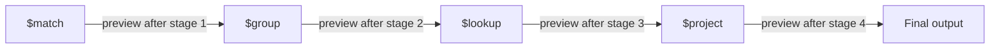
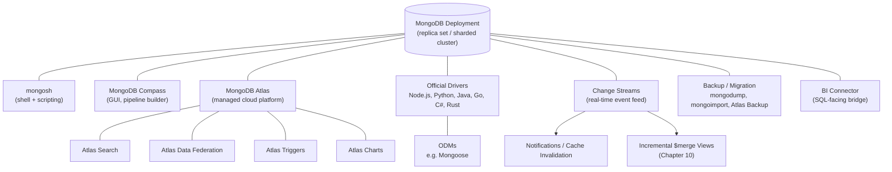

# Tools, Drivers & Ecosystem

Chapters 1–17 taught you MongoDB itself: the document model, CRUD, indexing, the aggregation pipeline in depth, transactions, replication, sharding, performance, security, and the professional judgment to use all of it well. But almost nobody interacts with MongoDB through raw `mongosh` commands in production — real systems talk to MongoDB through official drivers embedded in application code, are inspected and administered through GUI tools, run on managed infrastructure like Atlas, and react to data changes in real time through change streams. This chapter is a deliberately broad survey: not new query syntax to master, but a map of the tooling and ecosystem a working MongoDB engineer uses day-to-day and should, at minimum, know exists. By the end, you'll be able to pick the right tool for a given job and know where to go deeper when you need to.

---

## Learning Objectives

By the end of this chapter, you will be able to:

- Use `mongosh` beyond interactive queries — running `.js` scripts, `load()`-ing files, and scripting non-interactive admin tasks.
- Explain what MongoDB Compass adds on top of `mongosh`, including its visual aggregation pipeline builder, schema analysis, index management UI, and real-time performance tab.
- Describe MongoDB Atlas's managed services beyond "a hosted cluster": Atlas Search, Atlas Data Federation, Atlas Triggers, and Atlas Charts.
- Compare the official drivers (Node.js, Python, Java, Go, C#, Rust) and translate aggregation-pipeline concepts from earlier chapters into real driver code.
- Explain what an ODM (Mongoose) adds over a raw driver, and the tradeoff of layering schema enforcement on top of MongoDB's native flexibility.
- Implement a change stream to react to real-time data changes, and identify realistic production use cases for one.
- Choose the right backup/migration tool (`mongodump`/`mongorestore` vs. `mongoimport`/`mongoexport` vs. Atlas backups) for a given scenario.

---

## Prerequisites for This Chapter

This chapter assumes everything from Chapters 1–17: the document model, CRUD, indexing (especially the text index from [Chapter 6](./06-indexes-fundamentals.md)), the full aggregation pipeline (Chapters 7–10, particularly `$merge`-based materialized views from [Chapter 10](./10-advanced-aggregation-patterns.md)), transactions, replication (including the oplog, from [Chapter 12](./12-replication-and-high-availability.md)), and the security and best-practices material from Chapters 15–17.

Specifically, we build on [Chapter 1](./01-introduction-and-prerequisites.md)'s initial introduction of `mongosh`, Compass, and Atlas — Chapter 1 got you connected and running your first queries; this chapter goes deep on what each of those tools (and several more) can actually do.

---

## 1. `mongosh` in Depth: Beyond the Interactive Prompt

Chapter 1 introduced `mongosh` as a JavaScript REPL you type commands into. That's how you'll use it while learning, but in production, `mongosh` is also a **scripting engine** — you write `.js` files and run them non-interactively, exactly like you'd run a shell script or a Python script for admin automation.

### 1.1 Running a script non-interactively

```bash
# Run a script against a specific connection string and exit
mongosh "mongodb://localhost:27017/mydb" --file create-indexes.js

# Equivalent, piping the script in
mongosh "mongodb://localhost:27017/mydb" < create-indexes.js
```

A typical admin script — creating indexes idempotently across an environment:

```javascript
// create-indexes.js
db = db.getSiblingDB("shop");

db.orders.createIndex({ customerId: 1, createdAt: -1 });
db.orders.createIndex({ status: 1 });
db.products.createIndex({ sku: 1 }, { unique: true });

print("Indexes ensured on shop.orders and shop.products");
```

This is exactly the kind of script you'd wire into a deployment pipeline (run once after a schema migration, or as part of a CI job that provisions a fresh environment) rather than typing by hand every time.

### 1.2 `load()` for composing scripts

Inside an interactive `mongosh` session — or from within another script — `load()` executes a `.js` file in the current context, letting you build up a library of reusable helper scripts:

```javascript
// helpers.js
function printCollectionStats(dbName, collName) {
  const stats = db.getSiblingDB(dbName).getCollection(collName).stats();
  print(`${dbName}.${collName}: ${stats.count} docs, ${stats.size} bytes`);
}
```

```javascript
// In an interactive mongosh session, or another script:
load("helpers.js");
printCollectionStats("shop", "orders");
```

### 1.3 Why this matters

Every "one-off admin task" you'll actually repeat — reindexing after a deploy, backfilling a field, auditing collection sizes across a cluster — should live as a checked-in `.js` file, not a command you retype from memory. This is the same discipline SQL admins apply with `.sql` migration files; `mongosh` scripting is MongoDB's equivalent.

---

## 2. MongoDB Compass: The GUI Tool

Compass is MongoDB's official GUI client. Chapter 1 mentioned it briefly as "a visual companion to `mongosh`"; here's what that actually buys you in daily work.

### 2.1 Schema analysis

Point Compass at a collection and its **Schema** tab samples documents and shows you, field by field, the inferred types, value distributions, and how consistently a field appears across documents — instantly surfacing schema drift (a field that's a `string` in 95% of documents and a `number` in the rest) that would otherwise require writing an aggregation to detect. This is invaluable when you inherit an unfamiliar collection with no up-front schema documentation.

### 2.2 Visual query building

Compass's **Documents** tab lets you build a `find()` filter, projection, and sort visually, with live results and the equivalent shell/driver syntax always visible alongside — a fast way to prototype a query before dropping it into application code.

### 2.3 Visual aggregation pipeline builder — connecting back to Chapters 7–10

This is Compass's most valuable feature for anyone still building fluency with the aggregation pipeline. The **Aggregations** tab lets you add stages one at a time from a dropdown (`$match`, `$group`, `$lookup`, `$unwind`, `$facet`, and every other stage from Chapters 7–9), and after *every single stage* it shows you a live preview of the output documents at that point in the pipeline.

That live, per-stage preview is exactly the debugging technique Chapters 8–10 taught you to do manually — comment out trailing stages and re-run to see intermediate output. Compass does it automatically and visually:



Practical uses:

- **Learning aid.** While you're still internalizing how `$unwind` explodes an array or how `$lookup` shapes its output, building the pipeline in Compass and watching each stage's effect is faster feedback than editing a `mongosh` script and re-running the whole thing.
- **Export to code.** Once a pipeline looks right, Compass can export it directly as a code snippet in your target driver language (Node.js, Python, Java, etc.) — the visual pipeline you built becomes the array of stage objects you paste into your application.
- **Prototyping complex `$facet` dashboards.** Chapter 10's multi-facet dashboard patterns are much easier to get right when you can see each facet's sub-pipeline output independently before combining them.

Compass is not a replacement for understanding the pipeline stages and expressions from Chapters 7–9 — it's an accelerant for building and debugging pipelines once you do.

### 2.4 Index management UI

Compass's **Indexes** tab lists every index on a collection with its size, usage statistics (how many times each index has actually been used to satisfy a query, sourced from the same `$indexStats` data covered in [Chapter 14](./14-performance-tuning-and-query-optimization.md)), and lets you create or drop indexes without writing `createIndex()` calls by hand — useful for a quick sanity check of "is this collection over-indexed or under-indexed?"

### 2.5 Real-time performance tab

The **Performance** tab shows live operation counters — reads, writes, and their throughput — plus a real-time view of currently slow operations, giving you an at-a-glance health check of a `mongod` instance without opening a separate monitoring tool. It's a lighter-weight complement to the profiler techniques from Chapter 14, good for a quick "is something happening right now" check during an incident.

---

## 3. MongoDB Atlas in Depth

Chapter 1 introduced Atlas as "a fully managed cloud database service with a free tier." That's true, but Atlas is really a platform of related managed services built around the core database. This section covers the pieces beyond "a cluster you didn't have to install."

### 3.1 Managed clusters and the free tier

At its core, Atlas provisions, patches, backs up, and scales `mongod`/`mongos` deployments for you — replica sets and sharded clusters, across AWS, Google Cloud, or Azure, in any supported region. The **M0 free tier** (a shared, resource-limited cluster) is what this course recommends for hands-on practice: it's a real replica set, so everything you learned about replication, read preferences, and failover in Chapter 12 genuinely applies, just at small scale. Paid tiers (dedicated M10+ clusters) add dedicated resources, VPC peering, advanced auditing, and the features described below.

### 3.2 Atlas Search: Lucene-based full-text search

Chapter 6 covered MongoDB's built-in **text index** — lightweight keyword search via `$text`, useful but limited (no relevance tuning, no fuzzy matching, no faceting, at most one text index per collection).

**Atlas Search** is a full Apache Lucene search engine embedded directly into Atlas, queried via the `$search` aggregation stage. It runs alongside your data (no separate search cluster like Elasticsearch to operate) and supports what a text index cannot:

| Capability | `$text` (Chapter 6) | Atlas Search (`$search`) |
|---|---|---|
| Engine | MongoDB's built-in tokenizer | Apache Lucene |
| Relevance tuning | Basic term-frequency scoring | Configurable scoring, boosting, custom analyzers |
| Fuzzy matching / typo tolerance | No | Yes |
| Faceted search | No | Yes (`$searchMeta`, facet collectors) |
| Autocomplete | No | Yes (dedicated `autocomplete` field type) |
| Multiple search indexes per collection | No (max one text index) | Yes |
| Where it runs | Same `mongod` as your data | Managed Lucene indexes, kept in sync with your data automatically |

```javascript
// Atlas Search: fuzzy, relevance-ranked product search
db.products.aggregate([
  {
    $search: {
      index: "product_search",
      text: {
        query: "wireles headphones",   // note the typo — fuzzy matching handles it
        path: "name",
        fuzzy: { maxEdits: 2 }
      }
    }
  },
  { $limit: 10 }
]);
```

For any product-facing search box — "search as you type," typo-tolerant search, relevance-ranked results — Atlas Search is the production-grade upgrade path from a Chapter 6 text index.

### 3.3 Atlas Data Federation

**Atlas Data Federation** lets you run a single MongoDB query language (including aggregation pipelines) across data that lives in *multiple places* — one or more Atlas clusters, AWS S3 buckets (e.g., Parquet or JSON archives of cold data), and other configured sources — without first copying everything into one collection. You define a **virtual database** that maps to these underlying sources, then query it exactly like a normal MongoDB database. A common pattern: keep hot, recent data in an Atlas cluster and archive older data to cheap S3 storage, then use Data Federation to run a single query/report that spans both without an ETL job.

### 3.4 Atlas Triggers

**Atlas Triggers** are serverless functions (backed by Atlas's own hosted function runtime) that execute automatically in response to data changes — a managed layer built on top of the same **change streams** mechanism covered in Section 6 below. You configure a trigger to fire on inserts, updates, deletes, or replacements on a given collection, and Atlas runs your function (written in JavaScript) with the change event as its argument — no server of your own to run and keep alive for the listener. This is the "I don't want to operate my own always-on change-stream listener process" version of the pattern in Section 6.

### 3.5 Atlas Charts

**Atlas Charts** is a built-in dashboarding tool: point it at a collection (or an aggregation pipeline) and build line charts, bar charts, geospatial maps, and dashboards directly against live Atlas data, embeddable in internal tools or shared externally. It's a lightweight alternative to standing up a full BI tool for internal dashboards, and it consumes aggregation pipelines directly — the exact pipelines you learned to write in Chapters 7–10 can become chart data sources with no separate transformation layer.

---

## 4. Official Drivers: The Landscape

`mongosh` is a shell for humans; **drivers** are libraries that let application code — in whatever language you're building in — talk to MongoDB natively. MongoDB officially maintains drivers for all major languages, and every driver exposes the same underlying concepts from Chapters 4–10 (CRUD, cursors, aggregation pipelines, sessions/transactions) through language-idiomatic APIs.

### 4.1 Comparison

| Driver | Language | Package | Aggregation pipeline API | Typical use case |
|---|---|---|---|---|
| MongoDB Node.js Driver | JavaScript/TypeScript | `mongodb` (npm) | Array of stage objects, `.aggregate([...])` | Web backends (Express, NestJS), serverless functions |
| PyMongo | Python | `pymongo` (pip) | List of dicts, `.aggregate([...])` | Data engineering, ML pipelines, Django/Flask backends |
| MongoDB Java Driver | Java/Kotlin | `mongodb-driver-sync`/`-reactivestreams` (Maven) | Fluent `Aggregates.match(...)`, `Aggregates.group(...)` builders or raw `Document` stages | Enterprise backends, Spring Boot (via Spring Data MongoDB) |
| MongoDB Go Driver | Go | `go.mongodb.org/mongo-driver` | `mongo.Pipeline{}` of `bson.D` stages | High-throughput microservices |
| MongoDB C# Driver | C#/.NET | `MongoDB.Driver` (NuGet) | Fluent `PipelineDefinition`/LINQ-style builders | .NET backends |
| MongoDB Rust Driver | Rust | `mongodb` (crates.io) | `Vec<Document>` of stages | Performance-critical services, systems programming |

All six are officially built and supported by MongoDB Inc., not community volunteers — this matters for the "use official drivers in production" best practice in Section on best practices below.

### 4.2 Node.js example

```javascript
const { MongoClient } = require("mongodb");

async function main() {
  const client = new MongoClient("mongodb://localhost:27017");
  await client.connect();
  const orders = client.db("shop").collection("orders");

  // CRUD: insert one order
  await orders.insertOne({
    customerId: "cust_42",
    status: "pending",
    total: 89.99,
    createdAt: new Date(),
  });

  // Aggregation: revenue per status, mirroring Chapter 7-8 pipelines
  const summary = await orders.aggregate([
    { $match: { createdAt: { $gte: new Date("2026-01-01") } } },
    { $group: { _id: "$status", totalRevenue: { $sum: "$total" }, count: { $sum: 1 } } },
    { $sort: { totalRevenue: -1 } },
  ]).toArray();

  console.log(summary);
  await client.close();
}

main().catch(console.error);
```

### 4.3 Python (PyMongo) example

```python
from pymongo import MongoClient
from datetime import datetime, timezone

client = MongoClient("mongodb://localhost:27017")
orders = client["shop"]["orders"]

# CRUD: insert one order
orders.insert_one({
    "customerId": "cust_42",
    "status": "pending",
    "total": 89.99,
    "createdAt": datetime.now(timezone.utc),
})

# Aggregation: same revenue-per-status pipeline as the Node.js example
pipeline = [
    {"$match": {"createdAt": {"$gte": datetime(2026, 1, 1)}}},
    {"$group": {"_id": "$status", "totalRevenue": {"$sum": "$total"}, "count": {"$sum": 1}}},
    {"$sort": {"totalRevenue": -1}},
]
summary = list(orders.aggregate(pipeline))
print(summary)
```

Notice the pipeline structure is identical in shape to what you wrote in `mongosh` throughout Chapters 7–10 — a driver's `.aggregate()` call takes exactly the same array of stage objects; only the host language's syntax for writing that array changes.

---

## 5. ODMs: Mongoose and the Schema-Enforcement Tradeoff

A raw driver gives you documents as plain language-native structures (a JS object, a Python dict) with no shape enforcement. An **ODM** (Object-Document Mapper) sits on top of a driver and adds structure: defined schemas, model classes, validation, and lifecycle hooks. **Mongoose** (Node.js) is the canonical example.

### 5.1 Schemas and models

```javascript
const mongoose = require("mongoose");

const orderSchema = new mongoose.Schema({
  customerId: { type: String, required: true },
  status: { type: String, enum: ["pending", "shipped", "delivered"], default: "pending" },
  total: { type: Number, required: true, min: 0 },
  createdAt: { type: Date, default: Date.now },
});

const Order = mongoose.model("Order", orderSchema);

// Application code now works with a typed, validated model
const order = new Order({ customerId: "cust_42", total: 89.99 });
await order.save(); // Mongoose validates against orderSchema before writing
```

### 5.2 Middleware (hooks)

Mongoose lets you attach **middleware** — functions that run before or after a document operation:

```javascript
orderSchema.pre("save", function (next) {
  if (this.total < 0) return next(new Error("Order total cannot be negative"));
  next();
});

orderSchema.post("save", function (doc) {
  console.log(`Order ${doc._id} saved for customer ${doc.customerId}`);
});
```

This is useful for cross-cutting concerns — audit logging, derived-field computation, notification triggers — expressed once, at the model level, instead of scattered across every call site that writes an `Order`.

### 5.3 The tradeoff

MongoDB's native flexibility (Chapter 2's schema-less document model, refined in Chapter 5 with `$jsonSchema` validation) is a deliberate design choice: different documents in a collection can have different shapes, and that's normal, not a bug. An ODM like Mongoose reintroduces a rigid, application-level schema on top of that flexibility — which is often exactly what you want for application correctness (catching a bad write before it hits the network), but it's worth being explicit about what you're trading:

- **Gain:** compile-time-ish safety in a dynamically typed language, less boilerplate validation code, a familiar "models" mental model for teams coming from ORMs.
- **Cost:** an ODM's schema is enforced only by *application code that goes through the ODM*. A script, a different service, or a direct driver call that bypasses Mongoose writes straight past its validation — the database itself doesn't know or care about the Mongoose schema. If you need guarantees that hold regardless of which code path writes to the collection, you need database-level `$jsonSchema` validation (Chapter 5) as well, not instead.

Use an ODM for developer ergonomics; don't mistake it for a substitute for the database enforcing its own invariants.

---

## 6. Change Streams: Real-Time Reactions to Data Changes

### 6.1 What they are

A **change stream** is an API that lets application code subscribe to a real-time feed of data changes on a collection, a database, or an entire deployment — every insert, update, delete, and replace, delivered as an event, as it happens. Under the hood, change streams are built on the same **oplog** ([Chapter 12](./12-replication-and-high-availability.md)) that replica set members use to replicate writes to each other — a change stream is, conceptually, a filtered, resumable, and driver-friendly read of that same stream of operations, exposed as a first-class API rather than an internal replication detail you'd have to tail yourself.

Chapter 10 previewed this: incremental `$merge`-based materialized views can be triggered by a change stream instead of a fixed schedule, turning an hourly-refreshed summary collection into a near-real-time one.

### 6.2 Watching a collection for new documents

```javascript
const { MongoClient } = require("mongodb");

async function watchOrders() {
  const client = new MongoClient("mongodb://localhost:27017");
  await client.connect();
  const orders = client.db("shop").collection("orders");

  // Watch only for inserts
  const pipeline = [{ $match: { operationType: "insert" } }];
  const changeStream = orders.watch(pipeline);

  changeStream.on("change", (change) => {
    console.log("New order inserted:", change.fullDocument);
    // e.g., push a notification, invalidate a cache, trigger a $merge refresh
  });
}

watchOrders().catch(console.error);
```

The `$match` stage inside `.watch()` uses the same aggregation-pipeline filtering vocabulary from Chapters 7–9 — you can filter a change stream by operation type, by field, or by any expression, exactly as you'd filter documents in a normal pipeline.

### 6.3 Resume tokens: the detail that matters most

Every change event includes a `_id` field called a **resume token**. If your application disconnects or crashes, restarting `.watch()` with `{ resumeAfter: lastSeenResumeToken }` resumes exactly where you left off instead of silently missing events that occurred during the downtime:

```javascript
let resumeToken = loadLastSavedResumeToken(); // from your own durable storage

const changeStream = orders.watch(pipeline, { resumeAfter: resumeToken });
changeStream.on("change", (change) => {
  processChange(change);
  saveResumeToken(change._id); // persist after processing, not before
});
```

### 6.4 Realistic use cases

- **Cache invalidation.** When an `orders` document changes, evict or refresh the corresponding cache entry instead of relying on a fixed TTL that might serve stale data.
- **Real-time notifications.** Push a WebSocket message or mobile push notification the instant a relevant document is inserted or updated — the Real-World Scenario below builds exactly this.
- **Feeding materialized views.** As Chapter 10 previewed, a change stream can trigger a targeted, incremental `$merge` update the moment a source document changes, rather than waiting for the next scheduled batch job — the mechanism behind "near-real-time" dashboards.
- **Cross-system synchronization.** Mirror changes from MongoDB into a search index, a data warehouse, or another service's cache without polling.

---

## 7. Backup, Migration & Import/Export Tooling

| Tool | Purpose | Format | Typical use |
|---|---|---|---|
| `mongodump` / `mongorestore` | Full binary backup/restore | BSON | Production backups, full environment cloning, disaster recovery |
| `mongoexport` / `mongoimport` | Row-level data interchange | JSON/CSV | One-off data loads, moving data to/from non-MongoDB tools, small datasets |
| Atlas Continuous Backup | Managed, automated, point-in-time backup | Internal snapshots + oplog | Production Atlas clusters — the default recommendation |

`mongodump`/`mongorestore` operate on BSON and preserve full type fidelity, indexes, and collection options — this is the correct tool for a real backup:

```bash
mongodump --uri="mongodb://localhost:27017" --db=shop --out=./backup
mongorestore --uri="mongodb://localhost:27017" --db=shop ./backup/shop
```

`mongoimport`/`mongoexport` operate on JSON or CSV, one document/row at a time, and lose BSON-specific type information (e.g., a `Date` round-trips as a string unless you use MongoDB's Extended JSON conventions carefully). They're the right tool for a quick data load or exporting a sample for a spreadsheet — not for backing up a production database:

```bash
mongoexport --uri="mongodb://localhost:27017/shop" --collection=orders --out=orders.json
mongoimport --uri="mongodb://localhost:27017/shop" --collection=orders --file=orders.json
```

**Atlas's built-in continuous backup** takes this responsibility off your plate entirely for managed clusters: it maintains point-in-time snapshots automatically, lets you restore to any point within your retention window, and is the recommended default for any production Atlas deployment — no cron job wrapping `mongodump` to maintain yourself.

---

## 8. The BI Connector

The **MongoDB Connector for BI** lets traditional SQL-speaking BI tools (Tableau, Power BI, and other tools that only know how to talk to a SQL data source) query MongoDB data as if it were a relational database. It works by exposing a MySQL-wire-protocol endpoint in front of your MongoDB deployment, sampling your collections to infer a relational schema, and translating incoming SQL queries into MongoDB queries/aggregations behind the scenes. It's a bridge for organizations with existing BI investment in SQL-only tools — for anything built new, native tools like Atlas Charts (Section 3.5) or direct aggregation-pipeline-powered dashboards are usually a better fit.

---

## Ecosystem Map



---

## Real-World Scenario

**Setup:** You're building a small real-time notification feature for an e-commerce admin dashboard: whenever a new order is placed, warehouse staff should see a live notification pop up in their browser, without refreshing the page.

**Applying this chapter's concepts:**

1. **Driver choice.** The backend is a Node.js service, so you use the official Node.js driver (Section 4) — not a community wrapper — to connect to the `shop` database.
2. **Change stream setup.** On service startup, you open a change stream on the `orders` collection filtered to `operationType: "insert"` (Section 6.2), exactly like the `watchOrders()` example above.
3. **Resume tokens for reliability.** You persist the resume token (Section 6.3) after processing each event — to a small `changeStreamState` collection, keyed by service name — so that if the notification service restarts (a deploy, a crash, a rolling update), it resumes from the last processed order rather than silently missing any orders placed during the gap.
4. **Pushing the notification.** Each `change` event's `fullDocument` (the newly inserted order) is serialized and pushed to connected browser clients over a WebSocket connection — the change stream is the trigger, and ordinary application code (unrelated to MongoDB) delivers the actual notification.
5. **Extending the pattern.** The same change stream infrastructure could simultaneously feed a Chapter 10-style incremental `$merge` update to a `daily_order_summary` materialized view, so the dashboard's summary numbers and its live notification feed both update from a single underlying event source, with no duplicated polling logic.

```javascript
const { MongoClient } = require("mongodb");
const { WebSocketServer } = require("ws");

async function startNotificationService() {
  const client = new MongoClient("mongodb://localhost:27017");
  await client.connect();
  const orders = client.db("shop").collection("orders");
  const state = client.db("shop").collection("changeStreamState");

  const saved = await state.findOne({ _id: "orderNotifier" });
  const options = saved ? { resumeAfter: saved.resumeToken } : {};

  const changeStream = orders.watch(
    [{ $match: { operationType: "insert" } }],
    options
  );

  const wss = new WebSocketServer({ port: 8080 });

  changeStream.on("change", async (change) => {
    // Broadcast to all connected warehouse-dashboard clients
    wss.clients.forEach((ws) => ws.send(JSON.stringify(change.fullDocument)));

    // Persist resume token after successful processing
    await state.updateOne(
      { _id: "orderNotifier" },
      { $set: { resumeToken: change._id } },
      { upsert: true }
    );
  });
}

startNotificationService().catch(console.error);
```

This is a small, complete illustration of how Sections 4 (drivers) and 6 (change streams) combine into a real production feature.

---

## Best Practices

- **Use Compass's visual pipeline builder while learning, and to prototype.** Watching each stage's output live is one of the fastest ways to build intuition for the aggregation concepts from Chapters 7–10 — and Compass can export the finished pipeline directly as driver code.
- **Use official drivers in production, not unofficial community wrappers.** Official drivers get security patches, protocol updates, and compatibility guarantees directly from MongoDB Inc. — a meaningful difference for anything customer-facing.
- **Always persist and correctly resume change stream tokens.** A change stream listener that doesn't handle disconnects with `resumeAfter` will silently miss events during any downtime — treat resume-token persistence as a required part of the feature, not an optional nicety.
- **Layer an ODM's schema on top of, not instead of, database-level `$jsonSchema` validation** for anything where data integrity must hold regardless of which code path performs the write.
- **Use `mongodump`/`mongorestore` or Atlas's built-in backups for real backups; reserve `mongoimport`/`mongoexport` for small, one-off data interchange.** They are not interchangeable tools despite superficially similar names.
- **Prefer Atlas Search over a Chapter 6 text index the moment you need relevance tuning, fuzzy matching, or faceting** — trying to bolt those onto `$text` results in fragile application-level workarounds that Atlas Search already solves natively.
- **Script recurring admin tasks as checked-in `mongosh` `.js` files**, not ad hoc commands retyped from memory each time.

---

## Common Mistakes

- **Not handling change stream resume tokens or reconnection logic.** A listener that restarts with a fresh `.watch()` call (no `resumeAfter`) after any crash or deploy silently drops every event that occurred during the outage — a subtle, hard-to-notice data-loss bug.
- **Treating an ODM's schema as a substitute for actual database-level validation.** A Mongoose schema only protects writes that go through that specific Mongoose model; a script, migration, or another service writing directly via the driver bypasses it entirely. Use `$jsonSchema` (Chapter 5) when the guarantee must be unconditional.
- **Using `mongoexport`/`mongoimport` for large-scale production backups** instead of `mongodump`/`mongorestore` or Atlas's continuous backup — this loses BSON type fidelity, is far slower at scale, and isn't designed for point-in-time restore.
- **Reaching for the BI Connector or a full data warehouse before trying Atlas Charts or a direct aggregation pipeline** for what's really just an internal dashboard — adding SQL-translation infrastructure for a problem the aggregation framework already solves natively.
- **Using a community-maintained or unofficial driver in production** to save a dependency, without accounting for the loss of official security patches and MongoDB Inc. support.
- **Building a custom polling loop to detect new documents** ("check every 5 seconds for new orders") instead of a change stream — polling wastes resources, adds latency, and change streams already solve this problem natively and efficiently via the oplog.
- **Forgetting that Compass's pipeline builder output still needs review** — copy-pasting an exported pipeline into production code without checking index usage or `explain()` output (Chapter 14) skips the performance discipline that chapter taught.

---

## Summary

- `mongosh` is more than an interactive REPL — `.js` files, `load()`, and `--file` make it a legitimate scripting and admin-automation tool.
- **MongoDB Compass** adds schema analysis, visual query/pipeline building with live per-stage previews, index management, and a real-time performance tab on top of the raw shell — its visual aggregation pipeline builder is a genuine accelerant for the concepts in Chapters 7–10.
- **MongoDB Atlas** is a platform, not just a hosted cluster: **Atlas Search** (Lucene-based, far beyond the Chapter 6 text index), **Atlas Data Federation** (querying across multiple data sources), **Atlas Triggers** (serverless functions on data changes), and **Atlas Charts** (built-in dashboards) all extend the managed cluster.
- MongoDB officially maintains drivers for **Node.js, Python (PyMongo), Java, Go, C#, and Rust** — all expose the same CRUD/aggregation concepts from earlier chapters through language-idiomatic APIs.
- **ODMs** like **Mongoose** add schemas, models, and middleware on top of a raw driver — valuable for developer ergonomics, but not a substitute for database-level `$jsonSchema` validation when integrity must hold regardless of the write path.
- **Change streams** deliver a real-time feed of insert/update/delete/replace events, built on the replication oplog, and are the correct tool for cache invalidation, real-time notifications, and feeding incremental `$merge`-based materialized views — always with correctly persisted **resume tokens**.
- Use `mongodump`/`mongorestore` (or Atlas's continuous backup) for real backups; use `mongoimport`/`mongoexport` only for small-scale, one-off data interchange.
- The **BI Connector** bridges MongoDB to SQL-only BI tools for organizations with existing SQL-tool investment.

---

## Knowledge Check

1. What is the difference between running `mongosh` interactively and running it with `--file script.js`, and when would you use each?
2. Explain, concretely, how Compass's aggregation pipeline builder helps you debug a multi-stage pipeline, and connect this to a debugging technique from Chapter 8 or 10.
3. A team needs typo-tolerant, relevance-ranked search over a `products` collection. Why is the Chapter 6 text index insufficient, and what Atlas feature should they use instead?
4. Your application uses Mongoose with a strict schema, but a nightly batch script writes directly to the collection using the raw MongoDB Node.js driver, bypassing Mongoose entirely. What could go wrong, and what change would close this gap at the database level?
5. A change-stream-based notification service is restarted after a crash. Without any special handling, what happens to events that occurred during the downtime, and what specific mechanism prevents this?

---

## Hands-On Exercise

1. **Install and connect Compass.** Download MongoDB Compass and connect it to either your local MongoDB instance or your Atlas free-tier cluster from Chapter 1, using the same connection string you used for `mongosh`.
2. **Reproduce a Chapter 7 pipeline visually.** Pick one multi-stage aggregation pipeline you wrote in Chapter 7 (e.g., a `$match` + `$group` + `$sort` revenue-by-category pipeline). Rebuild it stage by stage in Compass's Aggregations tab, checking the live preview after each stage. Confirm the final output matches what you got from `mongosh`.
3. **Export the pipeline as code.** Use Compass's "Export to language" feature to export your pipeline as Node.js (or your language of choice) code, and compare its shape to what you wrote by hand in Sections 4.2/4.3 of this chapter.
4. **Write a change stream watcher.** Using the official Node.js or Python driver, write a small script that opens a change stream on any collection in your database and logs every insert event's `fullDocument` to the console as it happens. Test it by inserting a document from a separate `mongosh` session while your script is running, and confirm the event appears immediately.
5. **Bonus: add resume-token persistence.** Extend your change stream script to save the resume token to a local file after each event, restart the script with `resumeAfter` set from that saved token, insert a document while the script is stopped, and confirm that restarting the script does *not* re-deliver events it already processed but *does* pick up ones it missed.

---

## Further Reading

- [MongoDB Manual — Change Streams](https://www.mongodb.com/docs/manual/changeStreams/) — full reference on change stream behavior, resumability, and guarantees.
- [MongoDB Drivers Documentation](https://www.mongodb.com/docs/drivers/) — the landing page for all officially supported drivers, including Node.js, Python, Java, Go, C#, and Rust.
- [MongoDB Manual — `mongosh`](https://www.mongodb.com/docs/mongodb-shell/) — scripting, configuration, and the full `mongosh` API reference.
- [MongoDB Manual — MongoDB Compass](https://www.mongodb.com/docs/compass/current/) — full feature reference, including the aggregation pipeline builder and schema analysis.
- [MongoDB Manual — Atlas Search](https://www.mongodb.com/docs/atlas/atlas-search/) — index configuration, `$search` stage reference, and relevance tuning.

---

<div style="display:flex;justify-content:space-between;align-items:center;">
  <a href="./17-common-mistakes-and-pitfalls.md">← Previous: Common Mistakes & Pitfalls</a>
  <a href="./00-index.md">🏠 Index</a>
  <a href="./19-capstone-projects.md">Next: Capstone Projects →</a>
</div>
