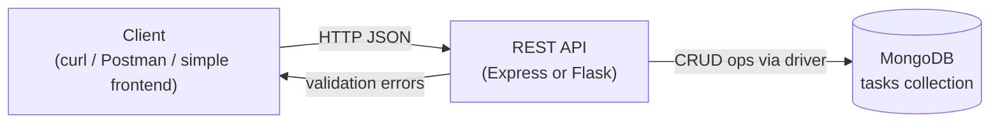
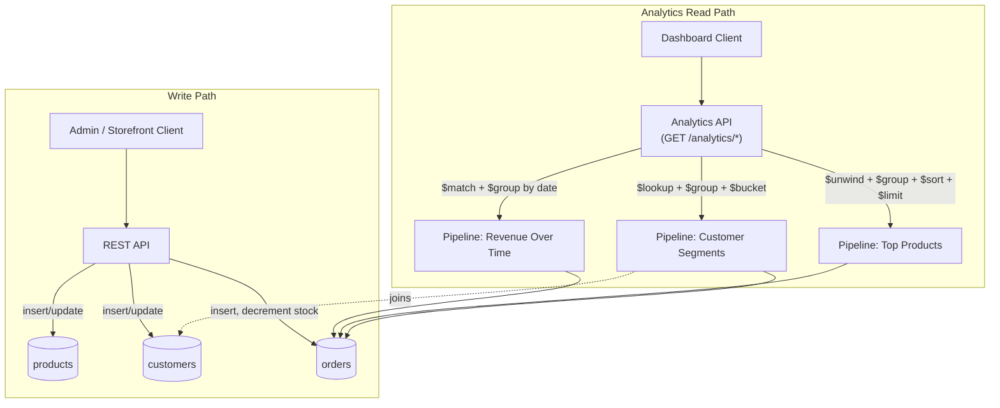
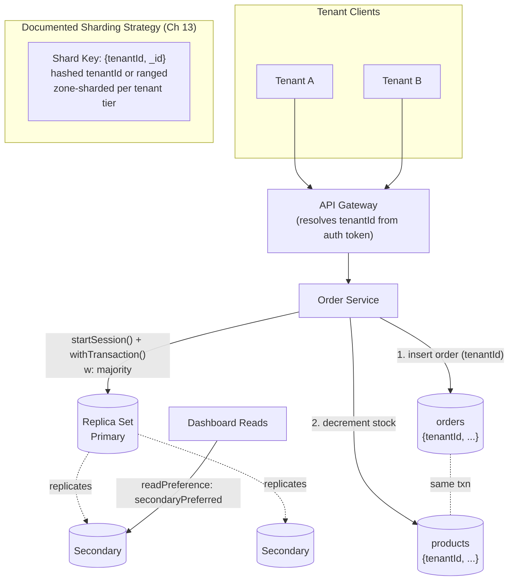
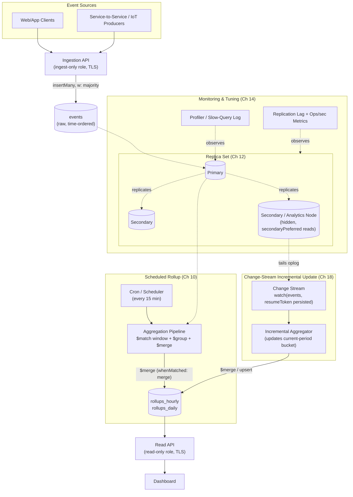

# Capstone Projects

Eighteen chapters have handed you every individual piece: the document model and internals (Ch 1–3), CRUD and query operators (Ch 4), schema design patterns (Ch 5), indexing strategy (Ch 6), the aggregation pipeline from fundamentals through advanced patterns (Ch 7–10), transactions (Ch 11), replication (Ch 12), sharding (Ch 13), performance tuning (Ch 14), security (Ch 15), a professional best-practices checklist (Ch 16), the failure modes to avoid (Ch 17), and the driver/tooling ecosystem (Ch 18). This chapter is where you stop reading about MongoDB and build with it, four times, at increasing difficulty — from a simple CRUD API to a production-grade, replica-set-backed, real-time analytics platform. Each project is a self-contained brief: requirements, architecture, folder structure, a phased implementation plan that points back to the exact chapter that taught each step, best practices to bake in from day one, and extensions to attempt once the core works. Treat these as real work assignments — read a brief fully before writing a line of code, and build them in order, since each one deliberately reuses skills and, where practical, code from the one before it.

---

## Learning Objectives

By the end of this chapter, you will be able to:

- Translate a one-paragraph product requirement into a concrete data model, folder structure, and phased implementation plan for a MongoDB-backed application
- Build a REST API over MongoDB with correct CRUD semantics, query filtering, and pagination
- Design an analytics layer entirely out of aggregation pipelines, backed by indexes chosen for the actual query workload
- Apply multi-document transactions, write/read concerns, and a documented sharding strategy to a multi-tenant system that must stay consistent under concurrent writes
- Combine scheduled batch aggregation with change-stream-driven incremental updates to build a near-real-time materialized-view pipeline
- Secure, monitor, and deploy a MongoDB-backed system the way a production on-call engineer would, not just the way a tutorial would
- Recognize which mistakes from Chapter 17 tend to resurface at each project tier, and design around them before they happen

## Prerequisites for This Chapter

This is the **synthesis chapter** of the course. It assumes you have completed Chapters 1 through 18 — there is no new MongoDB theory introduced here, only application. If an implementation step below references a mechanism you don't remember (a schema design pattern, `$setWindowFields`, causal consistency, a shard key, RBAC roles, change streams), treat that as a signal to revisit the cited chapter, not to skip the step.

You will also need, practically:

- A working Node.js (18+) or Python (3.10+) environment, and comfort with one HTTP framework (Express or Flask) — either is fine, and this chapter uses whichever fits the example better without mandating one
- A local MongoDB installation or free-tier Atlas cluster (Ch 1), with a replica set available for Projects 3 and 4 (a single-node replica set is enough to exercise the mechanics locally)
- `mongosh` and MongoDB Compass for inspecting data and query plans as you build (Ch 18)
- Comfort reading and writing Mermaid diagrams, since every project below is specified with one

Work through the four projects **in order**. Each one deliberately reuses the data-modeling, indexing, and aggregation skills built in the one before it — jumping straight to Project 4 means re-learning fundamentals under the pressure of the hardest project in the course.

---

## Project 1 (Beginner): Personal Task & Notes API

### Requirements

- A REST API over a single `tasks` collection supporting create, read, update, delete, and list-with-filtering
- Each task has at minimum: `title`, `description`, `status` (`todo` / `in_progress` / `done`), `priority`, `dueDate`, `tags` (array of strings), `createdAt`, `updatedAt`
- List endpoint supports filtering by `status`, `priority`, and `tags`, plus pagination (`limit`/`skip` or cursor-based) and sorting by `dueDate` or `createdAt`
- Input validation: reject malformed payloads (missing title, invalid `status` enum value, non-date `dueDate`) with a `400` and a clear error body
- No authentication required for v1 — this is a single-user, local-first project
- Runs entirely against a local MongoDB instance or a free-tier Atlas cluster

### Architecture



This is intentionally the simplest possible architecture in the course: one client, one API process, one collection, no caching layer, no message queue, no auth. The entire point of Project 1 is to make plain CRUD, correct validation, and correct query filtering solid before any complexity is added anywhere else.

### Folder Structure

```text
task-notes-api/
├── src/
│   ├── db/
│   │   └── connection.js        # MongoClient setup, connection pooling (Ch 4, Ch 18)
│   ├── models/
│   │   └── task.schema.js       # JSON Schema validator definition (Ch 5)
│   ├── routes/
│   │   └── tasks.routes.js      # GET/POST/PATCH/DELETE /tasks
│   ├── controllers/
│   │   └── tasks.controller.js  # request handling, calls into services
│   ├── services/
│   │   └── tasks.service.js     # query building, CRUD logic (Ch 4)
│   ├── middleware/
│   │   ├── validate.js          # request payload validation
│   │   └── errorHandler.js      # centralized error responses
│   └── app.js                   # Express app wiring
├── scripts/
│   └── seed.js                  # inserts realistic sample tasks
├── tests/
│   └── tasks.test.js            # integration tests against a test DB
├── .env.example
├── package.json
└── README.md
```

### Implementation Plan

1. **Stand up the connection layer.** Configure a single shared `MongoClient` with sane pool sizing, and confirm you can `ping` the deployment before wiring any routes (Ch 4, Ch 18).
2. **Design the document shape.** Decide field names and types for a task, and attach a `$jsonSchema` validator on the collection so malformed documents are rejected at the database layer, not only in application code (Ch 5).
3. **Implement create and read.** Build `POST /tasks` (insert one, return the inserted document with its `_id`) and `GET /tasks/:id` (find by `_id`, `404` if not found).
4. **Implement list with filtering, sorting, and pagination.** Build `GET /tasks` accepting query-string filters (`status`, `priority`, `tags`), translating them into a MongoDB filter document, plus `sort`, `limit`, and `skip` (or a cursor built from `_id`/`createdAt` for larger datasets) (Ch 4).
5. **Implement update and delete.** Build `PATCH /tasks/:id` using `$set` for partial updates (never a full-document replace for a partial edit) and `DELETE /tasks/:id`; always set `updatedAt` on every mutation (Ch 4).
6. **Add indexes for the filters you actually query.** Add a single-field index on `status`, a multikey index on `tags`, and a compound index that supports the common combination (e.g., `{ status: 1, dueDate: 1 }`), and verify each with `explain()` (Ch 6).
7. **Add centralized validation and error handling.** Validate request bodies before they reach the database, and return consistent, structured error responses (Ch 5).
8. **Seed realistic data and write integration tests.** Seed at least a few hundred tasks with varied status/priority/tags/dates, and write tests covering the happy path, the validation-rejection path, and an empty-result list query.

### Best Practices to Apply

- Use a `$jsonSchema` validator on the collection, not just application-level validation, so bad data can never enter the database through any other client (Ch 5, Ch 16).
- Never build MongoDB filter documents by string-concatenating user input — construct the filter object programmatically so operators like `$where` or arbitrary JS injection are never reachable (Ch 15, Ch 16).
- Index the fields your `list` endpoint actually filters and sorts on, and confirm with `explain()` that queries are using an index (`IXSCAN`), not a full collection scan (`COLLSCAN`) (Ch 6, Ch 14).
- Keep the database connection a singleton, reused across requests — never open a new `MongoClient` per request (Ch 4, Ch 18).
- Return pagination metadata (total count or a `hasMore` flag) so the client never has to guess when it's reached the end of a list.

### Extensions / Improvements to Try Next

- Add authentication (JWT-based user accounts) and scope every task to an `ownerId`, turning this into a genuinely multi-user API — this is the on-ramp to Project 2's customer model.
- Add tags as a proper many-to-many relationship using the **Subset Pattern** or a separate `tags` collection with a join table pattern from Chapter 5, instead of a bare string array, once tags need their own metadata (color, description).
- Add full-text search over `title`/`description` using a MongoDB text index (Ch 6).
- Add optimistic concurrency control (a version field checked on update) to handle two clients editing the same task at once.

---

## Project 2 (Intermediate): E-Commerce Analytics Dashboard

### Requirements

- Extend the Project 1 stack to model an e-commerce domain: `products`, `customers`, and `orders` collections, using embedding vs. referencing decisions justified by the actual access patterns (Ch 5)
- A write path: create products, register customers, and place orders that decrement stock (no transactional guarantee required yet — that's Project 3)
- A read/analytics path exposed as a JSON API, where **every analytics endpoint is powered by an aggregation pipeline**, not by pulling raw documents and computing in application code:
  - Revenue over time (daily/weekly/monthly rollups)
  - Top N products by revenue and by units sold, over a date range
  - Customer segments (e.g., recency/frequency/monetary-style buckets)
- Indexes chosen specifically to support both the transactional queries (look up a product, look up a customer's orders) and the aggregation pipelines' initial `$match`/`$sort` stages
- A small frontend or a documented set of `curl` calls is enough to demonstrate the dashboard — this project is about the data layer, not UI polish

### Architecture



### Folder Structure

```text
ecommerce-analytics/
├── src/
│   ├── db/
│   │   └── connection.js
│   ├── models/
│   │   ├── product.schema.js
│   │   ├── customer.schema.js
│   │   └── order.schema.js       # embeds line items, references product/customer ids (Ch 5)
│   ├── routes/
│   │   ├── products.routes.js
│   │   ├── customers.routes.js
│   │   ├── orders.routes.js
│   │   └── analytics.routes.js   # GET /analytics/revenue, /top-products, /segments
│   ├── services/
│   │   ├── catalog.service.js    # product/customer/order CRUD
│   │   └── analytics.service.js  # aggregation pipeline builders
│   ├── pipelines/
│   │   ├── revenueOverTime.js
│   │   ├── topProducts.js
│   │   └── customerSegments.js
│   └── app.js
├── scripts/
│   ├── seed.js                   # realistic multi-month order history
│   └── indexes.js                # createIndex calls, run once against the deployment
├── tests/
│   ├── catalog.test.js
│   └── analytics.test.js         # asserts pipeline output shape and known totals
├── package.json
└── README.md
```

### Implementation Plan

1. **Model the domain.** Decide embed-vs-reference for each relationship: line items embedded inside `orders` (read together, never queried independently), `productId`/`customerId` referenced from `orders` (products and customers are large, independently queried entities), and a denormalized `productName`/`unitPrice` snapshot embedded in each line item so historical orders don't change if a product's price changes later — the **Extended Reference Pattern** (Ch 5).
2. **Build the write path.** Implement product and customer CRUD, then order placement that inserts the order document and decrements `product.stock` with two separate writes for now — deliberately leaving the atomicity gap open, since closing it with a transaction is the explicit subject of Project 3 (Ch 4, Ch 11 preview).
3. **Seed realistic volume.** Generate at least tens of thousands of orders spread across many months and hundreds of products/customers with a believable long-tail distribution (a few best-sellers, a long tail of rarely-bought items) — analytics pipelines behave very differently at realistic scale than on 20 hand-typed documents (Ch 16).
4. **Design and create indexes for the workload.** Add a compound index on `orders` supporting `{ orderDate: 1 }` range scans for the revenue pipeline, one supporting the `$unwind`+`$group` product-lookup path, and confirm the `$match` stage of every pipeline hits an index using `explain()` before the `$group` stage runs, per the ESR rule (Ch 6, Ch 9, Ch 14).
5. **Build the revenue-over-time pipeline.** `$match` on a date range, `$group` by a truncated date (`$dateTrunc` or a `$dateToString` key) summing `lineItems.quantity * lineItems.unitPrice`, `$sort` by the date key (Ch 7, Ch 9).
6. **Build the top-products pipeline.** `$match` on date range, `$unwind` line items, `$group` by `productId` summing revenue and units, `$sort` descending, `$limit N`, then `$lookup` back to `products` for display fields (Ch 8).
7. **Build the customer-segmentation pipeline.** `$group` orders by `customerId` to compute recency (most recent order date), frequency (order count), and monetary value (total spend) per customer, then `$bucket` or a `$switch`-based `$addFields` stage to assign each customer to a segment label (Ch 8, Ch 9).
8. **Expose all three as a small analytics API**, each endpoint accepting a date-range query parameter and returning pipeline output directly as JSON.
9. **Validate every pipeline against hand-computed expected values** on a small fixed subset of seeded data, so you know the aggregation logic is correct before trusting it on the full dataset (Ch 16, Ch 17).
10. **Run `explain("executionStats")` on every analytics endpoint** and confirm no stage is scanning more documents than the `$match` should have let through.

### Best Practices to Apply

- Put the `$match` stage first in every pipeline and make sure it's covered by an index — this is the single highest-leverage aggregation performance rule in the whole course (Ch 9, Ch 14).
- Use the **Extended Reference Pattern** for line items so historical order data is immutable and doesn't silently change when a product is edited later (Ch 5).
- Seed data at a volume where a missing index actually hurts (tens of thousands of documents, not dozens) — performance bugs that are invisible at toy scale are exactly the ones that reach production undetected (Ch 16, Ch 17).
- Keep each pipeline in its own file/function so it can be unit-tested and `explain()`-checked independently of the HTTP layer (Ch 16).
- Never compute aggregate numbers by pulling raw documents into application code and summing in JavaScript/Python — that defeats the entire purpose of this project and doesn't scale past a demo dataset.

### Extensions / Improvements to Try Next

- Add a `$facet` stage to the dashboard's summary endpoint so revenue, top products, and order counts for a given date range come back in a single round trip (Ch 8).
- Add `$setWindowFields` to compute a rolling 7-day revenue average alongside the daily total, for a smoother trend line (Ch 10).
- Turn the revenue-over-time pipeline into a **materialized view** refreshed nightly with `$merge`, and compare dashboard load latency before and after (a preview of Chapter 10's pattern, revisited fully in Project 4).
- Add a low-stock alert derived from an aggregation over `products` and recent `orders`, rather than a naive per-request stock check.

---

## Project 3 (Advanced): Multi-Tenant SaaS Order Management System

### Requirements

- Convert the order-management core into a **multi-tenant** system: every document belongs to a `tenantId`, and no query, index, or aggregation may ever cross tenant boundaries
- Order placement must be **atomic**: creating the order and decrementing inventory either both succeed or both roll back, even under concurrent orders for the same product (Ch 11)
- Reads and writes must specify **explicit read/write concerns** appropriate to their criticality — order placement uses a majority write concern; a dashboard read can use a relaxed read preference against a secondary (Ch 12)
- The system must be **replica-set-aware**: document (in prose, and where feasible demonstrate locally) what happens to in-flight transactions and reads during a primary election
- A **documented sharding strategy** for scaling tenant data — you do not need a multi-shard cluster running for this project, but you must choose and justify a shard key (Ch 13)
- Basic tenant-scoped authentication/authorization: a request can only ever touch its own tenant's data

### Architecture



### Folder Structure

```text
saas-order-management/
├── src/
│   ├── db/
│   │   ├── connection.js          # replica-set connection string, read/write concern defaults
│   │   └── session.js             # helper wrapping withTransaction (Ch 11)
│   ├── middleware/
│   │   ├── tenantContext.js       # resolves tenantId from auth, injects into every query
│   │   └── auth.js
│   ├── models/
│   │   ├── product.schema.js      # tenantId is part of every document
│   │   ├── customer.schema.js
│   │   └── order.schema.js
│   ├── services/
│   │   ├── orderPlacement.service.js  # the transactional order+inventory operation
│   │   └── analytics.service.js       # reuses Project 2 pipelines, tenant-scoped
│   ├── routes/
│   │   └── orders.routes.js
│   └── app.js
├── scripts/
│   ├── seed.js                    # multiple tenants, concurrent-order stress scenario
│   ├── indexes.js                 # compound indexes always leading with tenantId
│   └── simulateFailover.js        # demo script: step down primary mid-transaction
├── docs/
│   └── sharding-strategy.md       # shard key choice, justification, zone sharding plan (Ch 13)
├── tests/
│   ├── transactions.test.js       # concurrent order placement, forced rollback scenario
│   └── tenantIsolation.test.js    # asserts cross-tenant queries return zero results
├── package.json
└── README.md
```

### Implementation Plan

1. **Add `tenantId` to every document and every index.** Every compound index must lead with `tenantId` so tenant-scoped queries are always efficient and cross-tenant scans are structurally rare (Ch 5, Ch 6, Ch 13).
2. **Enforce tenant scoping centrally.** Build a single middleware that resolves `tenantId` from the authenticated request and a query-building helper that every service function must go through, so it is structurally impossible to write a query missing a tenant filter (Ch 15, Ch 16).
3. **Convert order placement into a multi-document transaction.** Wrap the order insert and the product stock decrement in a session with `withTransaction()`, using `findOneAndUpdate` with a stock-availability filter (e.g., `{ stock: { $gte: qty } }`) so a race between two concurrent orders for the last unit of stock is resolved correctly, not silently oversold (Ch 4, Ch 11).
4. **Choose and apply read/write concerns deliberately.** Use `writeConcern: { w: "majority" }` for order placement so a committed order survives a primary failover; use `readConcern: "majority"` or `"local"` and an appropriate `readPreference` for dashboard queries depending on whether staleness is acceptable (Ch 12).
5. **Test the transaction under concurrency.** Fire concurrent order-placement requests against the same low-stock product and confirm the transaction layer prevents overselling — this is the concrete, observable payoff of Step 3 (Ch 11, Ch 17).
6. **Simulate a replica set election mid-operation.** On a local multi-node replica set, step down the primary while a transaction is in flight and observe/document the driver's retry behavior (retryable writes) versus what happens to an already-committed vs. not-yet-committed transaction (Ch 12).
7. **Write the sharding strategy document.** Evaluate candidate shard keys — `{ tenantId: 1 }` alone (risks large, unsplittable chunks for big tenants), `{ tenantId: 1, _id: 1 }` (keeps tenant data colocated with good cardinality), and a hashed `tenantId` (better write distribution, worse locality) — and justify a final choice given an assumed tenant-size distribution; document how zone sharding could pin large/regulated tenants to specific shards (Ch 13).
8. **Re-run Project 2's analytics pipelines, tenant-scoped.** Add `tenantId` to the leading `$match` of every pipeline and re-verify with `explain()` that the compound index (`tenantId` + date) is used (Ch 9, Ch 14).
9. **Write an isolation test suite.** Assert, for every read and write path, that a request authenticated as Tenant A can never read or mutate Tenant B's documents, even via a crafted query parameter.

### Best Practices to Apply

- Make `tenantId` filtering structurally unavoidable (via a shared query-builder or middleware) rather than a convention every developer must remember on every query — this is the single most common way multi-tenant systems leak data across tenants (Ch 15, Ch 17).
- Keep transactions short and touch as few documents as possible — a transaction spanning many collections or a slow external call inside `withTransaction()` increases contention and abort rates (Ch 11, Ch 16).
- Use `findOneAndUpdate` with a condition on the pre-transaction state (stock availability) rather than reading-then-writing separately, even inside a transaction, to avoid relying on transactions to paper over a logic race (Ch 4, Ch 11).
- Choose write/read concerns per operation based on its actual criticality, not one global setting for the whole application — over-using `w: majority` everywhere adds latency where it isn't needed, and under-using it where it is needed risks silently losing committed data on failover (Ch 12).
- Document the sharding strategy even if you don't deploy a sharded cluster — in a real system this decision is far harder to change after data has grown than to get right up front (Ch 13, Ch 16).

### Extensions / Improvements to Try Next

- Actually stand up a 2-shard cluster locally (via `mongos` + config servers) and migrate the seeded dataset onto the documented shard key, observing chunk distribution in practice (Ch 13).
- Add per-tenant rate limiting and a per-tenant usage/billing aggregation pipeline (orders per tenant per billing period).
- Add idempotency keys to the order-placement endpoint so a client retry after a network timeout can't double-place an order even outside the transaction boundary.
- Promote large or regulated tenants onto a dedicated zone using zone sharding, and document the operational runbook for doing so without downtime.

---

## Project 4 (Production-Grade Capstone): Real-Time Analytics Platform

### Requirements

- Ingest a continuous stream of application events (e.g., page views, purchases, or IoT-style sensor readings) into a raw `events` collection at meaningful volume
- Maintain **materialized-view rollup collections** (hourly/daily summaries) built with `$merge`, refreshed two ways: a **scheduled batch job** (e.g., every 15 minutes, full recompute of the trailing window) and **change-stream-driven incremental updates** (near-real-time, updating the current period's rollup as events arrive) (Ch 10, Ch 18)
- A read API serving dashboard queries **exclusively from the summary/rollup collections**, never by aggregating the full raw `events` collection on every request
- **Security**: authentication, role-based access control separating an ingestion-only role from a read-only dashboard role, and TLS on all client-to-database connections (Ch 15)
- **Monitoring**: query and replication metrics collected, slow operations surfaced via the profiler, and at least one documented tuning pass using `explain()` (Ch 14)
- A **documented replica-set topology** (member count, priorities, and a justified choice of hidden/analytics or delayed member if used) suitable for this workload (Ch 12)

### Architecture



### Folder Structure

```text
realtime-analytics-platform/
├── ingestion/
│   ├── ingest.api.js              # POST /events, ingest-only DB role
│   └── validators/
│       └── event.schema.js        # $jsonSchema validator (Ch 5)
├── rollups/
│   ├── pipelines/
│   │   ├── hourlyRollup.pipeline.js  # $match + $group + $merge (Ch 10)
│   │   └── dailyRollup.pipeline.js
│   ├── batch/
│   │   └── scheduledRefresh.js    # cron-triggered full-window recompute
│   └── streaming/
│       ├── changeStreamWatcher.js # watch(events), resume-token persistence (Ch 18)
│       └── incrementalUpdater.js  # per-event upsert into current rollup bucket
├── api/
│   ├── read.api.js                # GET /dashboard/*, read-only DB role
│   └── queries/
│       └── dashboardQueries.js    # simple finds against rollup collections only
├── security/
│   ├── roles.js                   # createRole definitions: ingestOnly, dashboardRead (Ch 15)
│   └── tls/                       # cert config notes, connection string flags
├── ops/
│   ├── replicaSetTopology.md      # member layout, priorities, justification (Ch 12)
│   ├── indexes.js                 # indexes for events (time-based) and rollups
│   └── monitoring.md              # profiler setup, alert thresholds, explain() findings (Ch 14)
├── scripts/
│   ├── loadgen.js                 # synthetic event generator at realistic volume/rate
│   └── resumeTokenStore.js        # persists change-stream resume tokens (crash recovery)
├── tests/
│   ├── rollupConsistency.test.js  # batch and streaming rollups agree within tolerance
│   └── failover.test.js           # dashboard reads survive a primary election
├── docker-compose.yml             # local 3-node replica set for development
└── README.md
```

### Implementation Plan

1. **Design the raw event schema and ingestion path.** Define a minimal, append-only `events` document shape (`tenantId`/`source`, `type`, `timestamp`, `payload`), validate with `$jsonSchema`, and index on `timestamp` (and any commonly filtered field) to support both ingestion-time writes and the rollup pipelines' `$match` stage (Ch 5, Ch 6).
2. **Stand up a replica set and document its topology.** Run a 3-node replica set locally (Docker Compose is enough), and write down member priorities and the role of the third node (a standard secondary vs. a hidden analytics node used to isolate rollup-pipeline load from client-facing traffic) (Ch 12).
3. **Build the scheduled rollup pipeline.** Write an aggregation pipeline that `$match`es a trailing time window, `$group`s by a truncated time bucket plus any relevant dimension, computes the needed metrics, and writes results with `$merge` (`whenMatched: "merge"` or `"replace"` as appropriate) into `rollups_hourly`/`rollups_daily`, and schedule it to run every N minutes (Ch 10).
4. **Build the change-stream incremental updater.** Open a change stream on `events` (or a resumable change stream against the whole database), and for every insert, upsert the corresponding current-period bucket in the rollup collection with an incremental `$inc`/`$set` update rather than a full recompute — persist the resume token so the watcher can recover after a restart without dropping or double-counting events (Ch 18).
5. **Reconcile batch and streaming paths.** Verify that the periodic full-window batch recompute and the incrementally-updated current bucket agree once a period closes, and design the batch job to be the source of truth that "corrects" any drift from the incremental path (e.g., from a missed or duplicated change-stream event) (Ch 10, Ch 17).
6. **Build the read API against rollups only.** Every dashboard endpoint queries `rollups_hourly`/`rollups_daily` directly — simple, fast, indexed finds — never re-aggregating raw `events` on the request path (Ch 9, Ch 14).
7. **Apply RBAC and TLS.** Create two custom roles — an ingest-only role with `insert` on `events` only, and a read-only role with `find` on the rollup collections only — and configure the deployment to require TLS on every client connection (Ch 15).
8. **Load-test with a synthetic generator.** Run `loadgen.js` at a sustained event rate high enough to make replication lag, index selection, and change-stream backlog observable, not just theoretical (Ch 16, Ch 17).
9. **Instrument monitoring and run a tuning pass.** Enable the profiler for slow operations, watch replication lag on secondaries under load, and use `explain("executionStats")` on both the rollup pipelines and the dashboard read queries to find and fix at least one real inefficiency (Ch 14).
10. **Test failover behavior end-to-end.** Step down the primary while the load generator and change-stream watcher are running, and confirm: ingestion resumes (retryable writes), the change-stream watcher resumes from its persisted resume token without gaps or duplicates, and dashboard reads (via `secondaryPreferred`) stay available throughout (Ch 12, Ch 18).
11. **Write the operational documentation.** Finalize `replicaSetTopology.md` and `monitoring.md` as if handing this system to another on-call engineer — topology, alert thresholds, known failure modes, and the runbook for a stuck change-stream resume token.

### Best Practices to Apply

- Never serve a dashboard request by aggregating raw `events` on the fly once a materialized rollup exists for that metric — the entire architectural point of this project is that expensive aggregation happens off the request path (Ch 10, Ch 14).
- Always persist and use the change stream's resume token, and design the incremental updater to be idempotent (an upsert keyed by time-bucket, not a blind `$inc` replayed twice) so a resume after a crash cannot double-count events (Ch 18, Ch 17).
- Treat the scheduled batch rollup as the reconciling source of truth, and the change-stream path as a latency optimization on top of it — this gives you both near-real-time dashboards and eventual correctness if the streaming path ever drifts (Ch 10, Ch 18).
- Grant the ingestion path and the read path **separate, minimally-scoped roles** — an ingestion service should never hold `find` privileges on operational collections it doesn't need, and a dashboard service should never hold `insert` privileges at all (Ch 15, Ch 16).
- Load-test before declaring the project done. A pipeline and a change-stream watcher that both work correctly at 10 events/second can behave completely differently at 10,000/second — under-provisioned indexes, replication lag, and change-stream backlog only show up under realistic load (Ch 14, Ch 16, Ch 17).
- Document the replica-set topology and monitoring thresholds as artifacts, not tribal knowledge — this is what makes the system operable by someone other than the person who built it.

### Extensions / Improvements to Try Next

- Add a documented (or actually deployed) sharding layer for the `events` collection once ingestion volume would exceed a single replica set's practical write capacity, reusing the shard-key evaluation process from Project 3 (Ch 13).
- Add anomaly detection on top of the rollups (e.g., flag an hourly bucket that deviates significantly from its trailing average) using `$setWindowFields` for the trailing statistics (Ch 10).
- Add a caching layer (in-memory or Redis) in front of the read API for the hottest dashboard queries, with cache invalidation tied to rollup writes.
- Add audit logging (Ch 15) for all administrative and RBAC-sensitive operations, and wire monitoring alerts (Ch 14) to page on replication lag or change-stream backlog breaching a threshold.

---

## Real-World Scenario

Read the four projects back to back and they trace the same arc a real database-focused engineer walks over a career. Project 1 is the first task an intern gets: wire up CRUD over a well-understood collection, get the query filters right, don't break anything. Project 2 is the mid-level engineer's assignment: the business now wants numbers out of the data — revenue trends, top sellers, customer segments — and "pull all the documents and sum them in a loop" stops being an acceptable answer the moment the dataset stops fitting comfortably in memory; this is where aggregation-pipeline fluency starts mattering more than general programming skill. Project 3 is what a senior engineer gets handed when the product goes multi-tenant and a customer loses money because two concurrent checkouts oversold the last unit of a product — suddenly transactions, write concerns, and a defensible sharding story aren't academic, they're the difference between a postmortem and a non-event. Project 4 is the staff-level, cross-team problem: leadership wants a live dashboard, not a nightly report, over a system that must stay correct, secure, and observable while ingesting continuously and never going down. Very few engineers are handed Project 4 on day one — and the ones who succeed at it are almost always the ones who quietly built the muscle memory of Projects 1 through 3 first, even if nobody called them "capstones" at the time.

---

## Best Practices

- **Build incrementally, project by project.** The schema-design instincts from Project 1, the aggregation fluency from Project 2, and the transaction/replica-set discipline from Project 3 are exactly the building blocks Project 4 assumes you already have — skipping ahead means learning them under the pressure of the hardest project instead of the easiest one.
- **Write realistic seed data for every project past the first.** A handful of hand-typed documents cannot expose a missing index, an oversell race condition, or a change-stream backlog — generate volumes and distributions (long-tail products, bursty event traffic, many tenants of different sizes) that resemble the real system you're modeling.
- **Load-test before declaring a project done.** "It worked when I tried it once" and "it's correct under concurrent load at realistic volume" are different claims; the gap between them is exactly where oversold inventory, missed change-stream events, and replication-lag-induced stale reads live.
- **Run `explain()` on every query and pipeline you ship**, not just the ones that feel slow — an unindexed `$match` or a missing compound index is invisible on a small local dataset and very visible in production.
- **Treat security and operability as core requirements from the start of Project 3 onward**, not extensions to bolt on later — RBAC roles, TLS, and documented topology are far cheaper to design in from the beginning than to retrofit onto a system already in use.
- **Version your indexes and pipeline definitions as code** (scripts checked into the repo, not commands typed once into `mongosh` and forgotten), so a fresh environment can be stood up reproducibly and a teammate can see exactly what indexes exist and why.
- **Reuse rather than rewrite.** By Project 4 you should be importing and adapting the connection layer, schema-validation patterns, and aggregation-pipeline builders from the earlier projects — that reuse is itself evidence the earlier chapters have become instinct rather than reference material.

---

## Common Mistakes

- **Skipping schema design and wiring up CRUD ad hoc.** Adding fields to documents as they come up, with no `$jsonSchema` validator and no deliberate embed-vs-reference decision, works fine at demo scale and becomes expensive technical debt the moment a second developer or a second client touches the same collection.
- **Not seeding realistic data volumes.** Testing an analytics dashboard against 20 orders never surfaces the missing index or the unbounded `$unwind` that will make the same pipeline time out against 2 million orders — performance problems that don't exist at toy scale are not solved problems, they're undiscovered ones.
- **Shipping a dashboard endpoint without running `explain()` on its pipeline first.** A `$match` that isn't backed by an index, or a `$group` running before a `$match` has narrowed the input, is a silent time bomb that only detonates once the collection is large enough to matter — check `executionStats` before, not after, a slow-query alert fires in production.
- **Treating multi-tenant isolation as a convention instead of a structural guarantee.** Relying on every developer to remember to add `{ tenantId }` to every query is exactly how cross-tenant data leaks happen; it has to be enforced by a shared query-building layer that makes the mistake impossible to make.
- **Reading and writing without ever setting an explicit read/write concern**, then being surprised when a failover loses a "committed" write or a dashboard shows stale data — the defaults are reasonable, but Project 3 and 4 specifically require you to reason about the tradeoff, not inherit it silently.
- **Building the change-stream path without persisting resume tokens**, so a watcher restart after a crash either replays events it already processed (double-counting) or silently skips the gap (undercounting) — both are correctness bugs that are invisible until someone notices the numbers don't add up.
- **Declaring the production capstone "done" after a single successful manual demo run**, without a load test, a failover test, or a documented monitoring/runbook artifact — a system that only works when nothing goes wrong hasn't been proven production-ready.

---

## Summary

- **Project 1** (Personal Task & Notes API) is a pure CRUD REST API over one collection — the deliverable is correct validation, correct query filtering, and correctly chosen indexes, with nothing else added.
- **Project 2** (E-Commerce Analytics Dashboard) adds a proper multi-collection schema and moves every analytics number into an aggregation pipeline, backed by indexes chosen for that pipeline's `$match`/`$sort` stages.
- **Project 3** (Multi-Tenant SaaS Order Management) adds multi-document transactions for order placement, deliberate read/write concern choices, structural tenant isolation, and a documented, justified sharding strategy.
- **Project 4** (Real-Time Analytics Platform) combines scheduled `$merge`-based rollups with change-stream-driven incremental updates, secured with RBAC and TLS, deployed on a documented replica-set topology, and validated under load with monitoring and a tuning pass — synthesizing nearly every chapter in this course into one working system.
- Each project deliberately builds on the one before it: the schema instincts, the aggregation pipelines, and the operational discipline are meant to carry forward, so working through them in order is itself part of the curriculum.
- The recurring meta-lesson across all four tiers is that **realistic data volume, `explain()`, and a load/failover test are what separate "it worked in the demo" from "it's ready for production."**

---

## Knowledge Check

1. In Project 1, why does adding a `$jsonSchema` validator at the database layer matter even though the API already validates incoming requests?
2. In Project 2, why must the `$match` stage of an aggregation pipeline come first and be backed by an index — what specifically goes wrong performance-wise if it doesn't?
3. In Project 3, why is `findOneAndUpdate` with a stock-availability condition inside a transaction a safer pattern than a separate read-then-write, even though the transaction itself provides atomicity?
4. In Project 4, why is the scheduled batch rollup kept as the "source of truth" that reconciles the change-stream-driven incremental updates, rather than relying on the change stream alone?
5. Across all four projects, what specific shard-key or tenant-isolation decision from Project 3 would you revisit if a single tenant grew to dominate the dataset's total volume, and why?

---

## Hands-On Exercise

Scaffold **Project 1 (Personal Task & Notes API)** right now, end to end:

1. Create the project folder structure shown above (`task-notes-api/` with `src/`, `scripts/`, `tests/`).
2. Initialize the project (`npm init` or a Python virtualenv + `pip install flask pymongo`) and add your MongoDB connection string to a `.env` file (local instance or a free Atlas cluster).
3. Write the connection module and confirm it can successfully ping your deployment before writing any routes.
4. Define the `tasks` collection's `$jsonSchema` validator with the fields listed in the Requirements section above.
5. Implement `POST /tasks` (create) and `GET /tasks` (list, with at least `status` filtering and pagination via `limit`/`skip`).
6. Manually test both endpoints with `curl` or Postman: create at least 5 tasks with varied `status`/`priority`/`tags`, then confirm the list endpoint correctly filters and paginates them.
7. Add a compound index supporting your most common list-query filter combination, and run `explain()` to confirm it's used.

Stop there for today — resist implementing update/delete or moving on to Project 2 until create and list are solid and tested; that discipline is the whole point of the beginner tier.

---

## Further Reading

- [MongoDB Manual — Aggregation Pipeline](https://www.mongodb.com/docs/manual/core/aggregation-pipeline/) — the full stage and operator reference you'll return to throughout Projects 2–4.
- [MongoDB Manual — Transactions](https://www.mongodb.com/docs/manual/core/transactions/) — the authoritative reference for `withTransaction()`, session semantics, and retryable writes used in Project 3.
- [MongoDB Manual — Change Streams](https://www.mongodb.com/docs/manual/changeStreams/) — resume tokens, resumability, and event ordering guarantees used in Project 4's incremental updater.
- [MongoDB Manual — Sharding](https://www.mongodb.com/docs/manual/sharding/) — shard key selection and zone sharding, for writing Project 3's sharding strategy document.
- [Microsoft REST API Guidelines](https://github.com/microsoft/api-guidelines) — a solid, vendor-neutral reference for REST resource naming, pagination, and error-response conventions applicable to every project's HTTP layer.

---

<div style="display:flex;justify-content:space-between;align-items:center;">
  <a href="./18-tools-drivers-and-ecosystem.md">← Previous: Tools, Drivers & Ecosystem</a>
  <a href="./00-index.md">🏠 Index</a>
  <a href="./20-interview-preparation.md">Next: Interview Preparation →</a>
</div>
