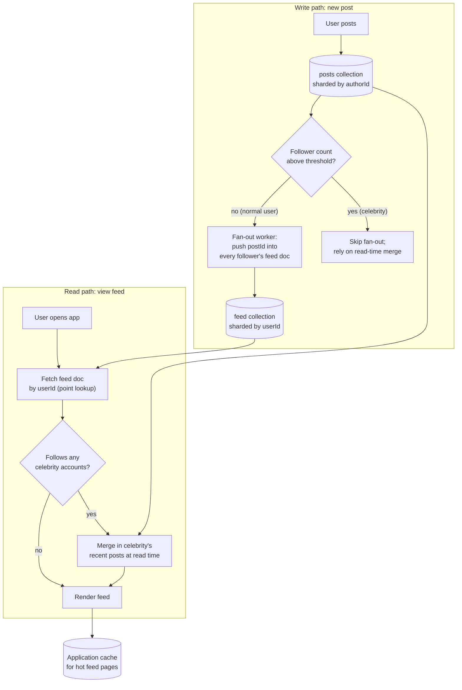

# Interview Preparation

You've built the full stack over nineteen chapters: the document model and BSON, CRUD and query operators, schema design patterns, indexing strategy, four chapters of aggregation pipeline mastery, transactions, replication, sharding, performance tuning, security, best practices, common pitfalls, the tooling ecosystem, and a capstone project. This final chapter is not new material — it is a rehearsal. Its job is to take everything from Chapters 1–19 and drill it into the exact shape a technical interviewer asks for: a crisp conceptual answer under thirty seconds, a calm diagnosis under scenario pressure, a structured system-design walkthrough with justified trade-offs, working aggregation code under a whiteboard or shared editor, and a war story that proves you've actually operated MongoDB in production, not just read about it. Work through this chapter the way you'd rehearse for a real loop: read a question, form your own answer before reading the model answer, and treat any gap between the two as a pointer back to the specific earlier chapter you need to revisit tonight.

---

## Learning Objectives

By the end of this chapter, you will be able to:

- Answer 15+ core MongoDB conceptual interview questions confidently and instructively, spanning the document model, indexing, aggregation, transactions, replication, sharding, and security
- Diagnose realistic production scenarios — a schema redesign, a slow query at scale, a hot shard, a multi-tenant design — using the same diagnostic discipline taught in Chapters 14 and 17
- Write correct, performant aggregation pipelines from a plain-English problem statement under interview conditions, including `$lookup`, `$facet`, and `$setWindowFields`
- Deliver a structured, interview-shaped system design answer for a MongoDB-backed product, covering schema, indexing, read/write patterns, and scaling
- Recognize composite, illustrative production case studies that show how the concepts in this course play out as real incidents and scaling milestones
- Run a full 45-minute mock interview against yourself and honestly self-grade the result
- Walk into a MongoDB-focused interview able to state assumptions, name trade-offs, and justify every design decision instead of reciting definitions

---

## Prerequisites for This Chapter

This is the capstone review chapter of the entire course. It assumes you have completed, or are comfortable quickly skimming back through, **all of Chapters 1–19**:

- **Ch 1–3**: why document databases exist, the document/BSON model, WiredTiger internals and how `mongod`/`mongos` actually handle a read or write
- **Ch 4–6**: CRUD fluency, embedding vs. referencing and named schema design patterns, index types and the ESR rule
- **Ch 7–10**: the aggregation pipeline mental model, every major stage (`$lookup`, `$unwind`, `$facet`, `$bucket`, `$graphLookup`, `$merge`/`$out`), the full expression language, and advanced patterns (`$setWindowFields`, sessionization, materialized views)
- **Ch 11–13**: multi-document ACID transactions, replica sets and failover, sharded clusters and shard key selection
- **Ch 14–15**: reading query plans and using the profiler, authentication/authorization/encryption
- **Ch 16–18**: the consolidated best-practices checklist, known failure modes, and the driver/tooling ecosystem
- **Ch 19**: the capstone project you designed or built end-to-end

Every answer below is instructive on its own, but if any of it feels unfamiliar rather than "oh right, I remember this," that's your signal to reopen the relevant chapter before the interview — not during it.

---

## 1. Conceptual Q&A

Unlike the "Knowledge Check" sections in earlier chapters, which deliberately withhold answers so you self-test honestly, every question in this section comes with a full model answer — because that's exactly what an interview demands of you in real time.

### Q1. What is MongoDB, and how does the document model differ from the relational model?

MongoDB is a document-oriented NoSQL database that stores data as BSON documents — binary-encoded, JSON-like structures — grouped into collections rather than rows grouped into tables. The core difference from the relational model is that a document can hold nested sub-documents and arrays natively, so data that would require several joined tables in a relational schema (an order and its line items, a user and their addresses) can live in a single document. This trades the relational model's normalization and mechanical join semantics for a design space where you explicitly decide, per relationship, whether to embed or reference — a decision with real performance consequences (Ch 2, 5).

### Q2. What is BSON, and why doesn't MongoDB just store JSON directly?

BSON (Binary JSON) is a binary-encoded serialization format that extends JSON with additional types JSON doesn't have — `ObjectId`, `Date`, `Decimal128`, `BinData`, and distinct integer/long/double numeric types — and encodes them so that a database engine can traverse, index, and compare them without repeatedly parsing text. Plain JSON has no native date type (dates end up as ambiguous strings) and no efficient binary representation for lengths and offsets, which text parsing would need to recompute on every access. BSON gives MongoDB a self-describing binary format that's fast to scan, easy to traverse field-by-field without parsing the whole document, and rich enough to preserve types that matter for querying and sorting.

### Q3. When should you embed related data versus reference it?

Embed when the related data is read together with the parent almost every time, is bounded in size (won't grow unboundedly, given the 16MB document limit), and doesn't need to be queried independently — a blog post and a handful of tags, or an order and its line items. Reference when the related data is large, unbounded, shared across many parents, updated independently and frequently, or queried on its own — a product referenced from thousands of orders, or a user's full activity history. Most real schemas use both: a small, frequently-accessed subset embedded (see the Subset and Extended Reference patterns), with the full related collection referenced for anything beyond that. The decision should follow your application's actual read and write patterns, not a reflex toward "always normalize" or "always embed" (Ch 5).

### Q4. What is the 16MB document size limit, and how does it change your schema design?

Every BSON document, including all of its embedded sub-documents and arrays, is capped at 16MB, and this is a hard limit enforced by the server. It exists partly for historical/practical reasons (keeping a single document's transfer and in-memory footprint bounded) and partly as a forcing function against unbounded embedding. It directly affects modeling decisions: an unbounded array — comments on a viral post, sensor readings pushed into one document forever — will eventually hit the limit and start failing writes, which is exactly the failure mode the Bucket pattern and Outlier pattern (Ch 5) exist to solve, by pre-emptively splitting or capping growth instead of embedding without limit.

### Q5. Explain the compound index prefix rule.

A compound index on fields `{a: 1, b: 1, c: 1}` can efficiently serve queries that filter on `a` alone, `a` and `b` together, or `a`, `b`, and `c` together — because a B-tree index is physically sorted first by `a`, then by `b` within each `a`, then by `c` within each `b`, so any *prefix* of that field order is a usable, contiguous sorted range. A query that filters on `b` alone, or on `c` alone, cannot use this index efficiently, because skipping the leading field(s) means the matching values are scattered non-contiguously throughout the tree. This is why compound index field order is a deliberate design decision, not an arbitrary listing (Ch 6, 14).

### Q6. What is the ESR (Equality, Sort, Range) rule, and why does field order matter this much?

ESR is the rule of thumb for ordering fields in a compound index: put **Equality** match fields first, then fields used for **Sort**, then fields used for **Range** filters last. Equality fields first because they narrow the B-tree walk to a single contiguous slice immediately; sort fields next because if the sort order is already satisfied by the index's physical order within that slice, MongoDB avoids an expensive in-memory `SORT` stage entirely; range fields last because a range condition (`$gt`, `$lt`, `$in` over many values) can only narrow, not eliminate, the remaining scan, and putting it before a sort field would break the index's ability to serve that sort for free. Getting this order wrong is one of the most common causes of a "why is this query still slow, I have an index" bug in production (Ch 6, 14).

### Q7. What's the difference between a covered query and a regular index-scan query?

A regular `IXSCAN` walks the index to find matching keys, then still fetches each full document from the collection (a `FETCH` stage in `explain()`) to return the requested fields. A **covered query** is one where every field in both the query filter and the projection is present in the index itself, so MongoDB can answer entirely from the index's B-tree without ever touching the underlying document — visible in `explain()` as an `IXSCAN` with no `FETCH` stage and `"totalDocsExamined": 0`. Covered queries are meaningfully faster because they skip a random-access document read entirely, but they only apply to narrow, index-field-only projections — most real queries still need a small number of non-indexed fields and pay the `FETCH` cost.

### Q8. What is a multikey index, and what's its key restriction?

A multikey index is an index on a field that holds an array — MongoDB indexes each array element as a separate index entry pointing back to the same document, rather than indexing the array as one opaque value. The critical restriction is that **a compound index can have at most one multikey (array) field** — you cannot create a compound index on two array fields at once, because the Cartesian-product explosion of index entries (every combination of elements from both arrays) would make the index both enormous and semantically ambiguous for range queries across both arrays simultaneously. This restriction directly shapes schema decisions when a document has multiple array fields you'd like to query together (Ch 6).

### Q9. Walk through the aggregation pipeline mental model.

An aggregation pipeline is an ordered array of stages, and each stage takes the stream of documents produced by the previous stage, transforms it, and passes the result to the next — the same conceptual shape as piping commands together in a Unix shell. Unlike a `find()` query, which can only filter, project, and sort, a pipeline can reshape documents entirely: group and summarize (`$group`), join across collections (`$lookup`), unwind arrays into individual documents (`$unwind`), branch into parallel sub-pipelines (`$facet`), and compute per-row analytics without collapsing rows (`$setWindowFields`). The mental model that unlocks everything else is: each stage's *output document shape* becomes the next stage's *input document shape* — so building a pipeline is really designing a sequence of shape transformations (Ch 7).

### Q10. Why should `$match` and `$sort` generally appear as early as possible in a pipeline?

Placing `$match` (and, when possible, `$sort`) near the start of a pipeline lets MongoDB use an existing index to satisfy that stage — a `$match` at the very front of a pipeline is eligible for exactly the same `IXSCAN` optimization as an equivalent `find()` filter, and an early `$sort` immediately followed by a compatible index can avoid an in-memory sort. Once a pipeline has passed through a reshaping stage like `$group`, `$project` with computed fields, or `$unwind`, the documents no longer correspond one-to-one with indexed fields on the original collection, so any `$match` after that point falls back to scanning the intermediate result set in memory. The practical rule: filter down to the smallest possible working set using indexed fields as early as the pipeline allows, and only then reshape (Ch 10, 14).

### Q11. What's the difference between `$group` and `$setWindowFields`?

`$group` **collapses** documents — many input documents sharing a `_id` key become exactly one output document per group, and the original individual documents are gone. `$setWindowFields` **preserves** every input document and *attaches* a computed value (a running total, a rank, a moving average) to each one, based on a partition and sort order, the same way a SQL window function (`OVER (PARTITION BY ... ORDER BY ...)`) works. Use `$group` when you want a summary; use `$setWindowFields` when you want the detail rows intact with per-row analytics layered on top — "every order, with this customer's running total so far" is a `$setWindowFields` problem, not a `$group` problem (Ch 10).

### Q12. Explain `$lookup` and its performance implications.

`$lookup` performs a left outer join, matching documents from the pipeline's current collection against documents in another collection based on a field equality (or a more general sub-pipeline `let`/`pipeline` form for non-equality joins), and embeds the matched documents as an array in each output document. Performance depends heavily on whether the joined-on field in the *foreign* collection is indexed — `$lookup` performs, conceptually, an indexed lookup per input document if that index exists, and a full collection scan of the foreign collection per input document if it doesn't, which is catastrophic at scale. It's also important to `$match`/filter down to the smallest possible set of documents *before* a `$lookup`, since the join cost scales with how many documents enter that stage, not with the size of either collection alone (Ch 8, 14).

### Q13. What does `$facet` do, and when would you use it?

`$facet` runs multiple independent sub-pipelines against the *same* set of input documents in a single aggregation call, producing one output document whose fields hold each sub-pipeline's results side by side. The canonical use case is a product listing or search results page that needs the paginated results, the total count, a price-bucket histogram, and a category breakdown all from the same filtered input — without `$facet`, that's four separate round trips to the database (and four separate re-executions of the same `$match` filter); with it, it's one round trip. The trade-off is that all of `$facet`'s sub-pipelines run against documents already loaded for that stage, so it's best used after an early, index-supported `$match` has already narrowed the working set (Ch 8, 10).

### Q14. What is `$graphLookup`, and what problem does it solve that `$lookup` can't?

`$graphLookup` performs a recursive search on a collection, following a chain of references (e.g., "manager" pointing to another employee document, that employee's manager pointing to another) until no further matches exist or a `maxDepth` is reached, returning the entire matched hierarchy as an array. Regular `$lookup` performs exactly one level of join; it cannot express "find this employee's entire management chain" or "find every product connected to this one within three degrees of a 'frequently bought together' graph" without either a fixed, hardcoded number of manual `$lookup` stages or explicit application-level recursion. `$graphLookup` is the right tool specifically for tree- or graph-shaped data — org charts, category hierarchies, social graphs — where the depth isn't known in advance (Ch 8).

### Q15. What ACID guarantees does MongoDB provide, and when do you actually need a multi-document transaction?

Every single-document write in MongoDB — including updates to deeply nested fields and array elements — is always atomic by default, with no transaction required; this covers the vast majority of real application writes when documents are modeled well. A genuine multi-document transaction (`startSession()`/`startTransaction()`/`commitTransaction()`, or the `withTransaction()` wrapper) is needed only when an operation must atomically touch multiple documents, potentially across multiple collections, with true all-or-nothing semantics — the classic example is transferring funds between two account documents, where you must never observe one account debited without the other credited. The idiomatic MongoDB approach is to model data (via embedding, and denormalized fields) so that as many operations as possible are naturally single-document atomic, and reach for multi-document transactions only for the remainder, because transactions carry real performance and complexity cost compared to the default (Ch 11).

### Q16. Explain read concern and write concern, and how they differ from isolation levels in a relational database.

Write concern controls how many replica set members must acknowledge a write before the driver considers it successful — `{w: 1}` (just the primary), `{w: "majority"}` (a majority of voting members, durable against most failover scenarios), or a specific number. Read concern controls what guarantee a read gives about the data it returns — `"local"` (whatever the node currently has, possibly not yet replicated or even later rolled back), `"majority"` (only data acknowledged by a majority of the replica set, so it won't be rolled back), or `"snapshot"` (a consistent point-in-time view, used inside transactions). Unlike a relational database's isolation levels, which primarily govern concurrent-transaction visibility on a single node, MongoDB's read/write concerns are fundamentally about the *replication* dimension — how much durability and cross-node consistency you're willing to trade for latency — which makes sense given MongoDB's replica-set-first architecture (Ch 3, 11, 12).

### Q17. How does replica set failover actually work?

A MongoDB replica set is a primary node plus one or more secondaries continuously replicating the primary's oplog (operations log). If the primary becomes unreachable — a heartbeat timeout is missed by the other members — the remaining voting members hold an election, using the Raft-derived protocol, and promote whichever eligible secondary has the most up-to-date oplog and receives a majority of votes to be the new primary. Any writes that were on the old primary but hadn't yet replicated to a majority before the failover can be rolled back once the old primary rejoins as a secondary, which is precisely why `{w: "majority"}` write concern matters for data you can't afford to lose in a failover. Applications using the drivers' built-in retryable writes and topology monitoring generally recover from this transparently within seconds, though in-flight requests during the election window will see transient errors (Ch 12).

### Q18. What is a shard key, and why is choosing it correctly so hard to change later?

A shard key is the field (or compound set of fields) MongoDB uses to partition a collection's documents across the shards of a sharded cluster — it determines both how data is distributed at rest and how queries get routed by `mongos`. Choosing it well requires high cardinality (many distinct values, so data spreads evenly), even write distribution (avoiding a monotonically increasing key like a timestamp or auto-incrementing `_id`, which concentrates all new writes on one shard — the "hot shard" problem), and alignment with your dominant query patterns (queries that don't include the shard key become inefficient scatter-gather queries across every shard). It's hard to change later because the shard key is baked into how every document's location is physically determined across the cluster; changing it historically required a full data migration to a new sharded collection, though modern MongoDB versions support resharding online — still an expensive, carefully-planned operation, not a config tweak (Ch 13).

### Q19. Name the layers of MongoDB security and what each one protects against.

Authentication (verifying who a client is — SCRAM, x.509 certificates, or enterprise LDAP/Kerberos integration) protects against unauthorized connections entirely. Authorization via role-based access control (RBAC) protects against an authenticated-but-unauthorized user performing actions beyond their granted role, by scoping permissions to specific databases, collections, and actions. Encryption in transit (TLS) protects data crossing the network from interception; encryption at rest (WiredTiger's native encryption, or filesystem/disk-level encryption) protects data on disk if physical storage or a backup is compromised. Network security (binding to specific interfaces, IP allowlisting, VPC/firewall placement) protects against the cluster being reachable at all from untrusted networks. Auditing logs who did what, which doesn't prevent an incident but is essential for detecting and investigating one after the fact — together these layers form defense in depth, where no single layer is assumed sufficient on its own (Ch 15).

### Q20. What is the WiredTiger storage engine, and why does it matter that MongoDB uses B-trees?

WiredTiger is MongoDB's default storage engine, responsible for how collections and indexes are actually persisted to and read from disk, how concurrency control works (document-level locking via MVCC-style snapshots, not collection- or database-level locks), and how the in-memory cache is managed. Both collections and indexes are stored as B-tree structures on disk, which is precisely why index scans achieve roughly `O(log n)` lookup performance instead of the `O(n)` cost of a collection scan — this single fact underlies nearly every indexing and performance discussion in the course, from why compound index field order matters to why the WiredTiger cache competing for RAM against your working set is a real operational concern (Ch 3).

---

## 2. Scenario-Based Questions

### Scenario 1: "How would you model a social media feed with posts, likes, and comments?"

Posts, likes, and comments have very different read/write and growth characteristics, so they shouldn't all be modeled the same way. A `posts` collection holds the post content plus a small, denormalized set of counters (`likeCount`, `commentCount`) updated atomically with `$inc` on every like/comment event — these counters make rendering a feed fast without a `$lookup` or a separate count query per post. Likes are typically referenced in a separate `likes` collection (`{postId, userId, createdAt}`) rather than embedded, because a popular post's likes are unbounded and would blow past the 16MB document limit, and because "has this user already liked this post" needs a fast, independent lookup — a compound unique index on `{postId, userId}` both enforces one-like-per-user and serves that lookup. Comments are borderline: if a post typically gets a handful of comments, embedding the most recent N (Subset pattern) directly in the post document lets the feed render top comments with zero extra queries, while the full comment thread lives in its own `comments` collection referenced by `postId` for "view all comments." The feed itself is generated by a `$match` on the followed-user-IDs plus an index on `{authorId: 1, createdAt: -1}` to serve both the filter and the reverse-chronological sort in one pass — this is exactly the ESR rule in action (equality on authorship set, sort on time) (Ch 5, 6).

### Scenario 2: "A query that used to be fast is now slow after the collection grew to 50M documents — how do you diagnose it?"

Start with `explain("executionStats")` on the exact slow query, and look at the ratio of `totalDocsExamined` to `nReturned` — a query examining millions of documents to return a handful is the single most common symptom, and it means either no index exists for this filter, an existing compound index has the wrong field order for the ESR rule, or the query's filter shape (an `$or`, a leading wildcard regex, a negation) can't use an index the way it did before. Next, check whether this collection recently crossed a size threshold where the working set no longer fits in the WiredTiger cache — a query that was fast because its index pages were resident in RAM can become slow purely from cache eviction pressure as the collection (and its indexes) outgrow available memory, which is an infrastructure/sizing issue, not a query-shape issue. Also check the system profiler for concurrent load: a query that's individually fine can look "slow" under a spike in concurrent write traffic contending for the same documents or index pages. The diagnostic order is: confirm the index situation first (cheapest to check and fix), then check cache/memory sizing, then check for concurrency contention — and only reach for a schema or sharding change once indexing has been ruled out, which is the single most common instinct to correct in this scenario (Ch 14, 17).

### Scenario 3: "Design a schema for a multi-tenant SaaS application."

The first decision is isolation strategy: a shared collection with a `tenantId` field on every document (cheapest to operate, works well for small-to-medium tenants, and is the default recommendation), separate databases per tenant (stronger isolation and easier per-tenant backup/restore, but doesn't scale operationally past a few hundred tenants due to per-database overhead), or fully separate clusters per tenant (used only for enterprise tenants with hard compliance or noisy-neighbor requirements). For the common shared-collection approach, `tenantId` must be the **leading field** in every compound index on every collection, following the ESR rule, so that every query is naturally scoped to one tenant's contiguous index range rather than scanning across tenants — this also becomes the natural shard key prefix if the application ever needs to shard (typically `{tenantId: 1, someHighCardinalityField: 1}` as a compound shard key to avoid a single giant tenant creating a hot shard). Enforce tenant isolation at the data-access layer with `$jsonSchema` validation requiring `tenantId` on every document, and, for defense in depth, never construct a query without an explicit `tenantId` filter anywhere in the application, treating a missing tenant filter as a security bug, not just a performance one. Finally, plan for tenant-size skew from day one: a "whale" tenant with 100x the data of a typical tenant will eventually need special handling (its own zone in a sharded cluster, or migration to a dedicated database), so the schema should make that migration path realistic rather than assuming all tenants stay uniform forever (Ch 5, 13, 15).

### Scenario 4: "You realize your original shard key choice causes hot shards — how do you migrate to a new one?"

First, confirm the diagnosis with the `$shardedDataDistribution` aggregation stage or `sh.status()`/Atlas metrics showing skewed chunk and operation distribution across shards, and identify specifically whether the problem is a monotonically increasing key concentrating writes on one shard, or a low-cardinality key creating a few oversized, unsplittable jumbo chunks. On modern MongoDB versions (4.4+), the `reshardCollection` command performs an online resharding operation: it creates a new, temporary collection sharded on the target key, uses change streams internally to replay ongoing writes from the original collection during the copy, and performs a brief cutover once the two are in sync — this avoids the older approach of manually dumping, transforming, and reloading data with real downtime. Before running it, validate the new shard key against production-like write and query patterns in a staging environment, because getting the *second* choice wrong is far more expensive to redo than the first. As a compound key (e.g., adding a hashed or high-cardinality field alongside the original business key: `{tenantId: 1, userId: "hashed"}`) is usually preferable to a single monotonic field, since it preserves query locality where it matters while breaking up the write hot spot. Throughout the migration, expect a temporary doubling of storage and write load (both collections receiving writes during the sync phase), so this should be planned and scheduled like any major production migration, with a rollback plan if resharding doesn't complete cleanly (Ch 13, 14).

### Scenario 5: "How would you design change-data tracking for a system that needs to sync MongoDB data into a search index and a data warehouse?"

Change streams are the right primitive: they expose a real-time, resumable feed of every insert/update/delete/replace on a collection (or database, or whole deployment), built on top of the oplog, without requiring the consuming application to poll or to have any special access beyond `find` on the relevant namespace. Each downstream consumer (the search-index sync job, the data-warehouse ETL job) opens its own change stream and tracks its own **resume token**, so if either consumer crashes or is redeployed, it resumes exactly where it left off rather than replaying everything or silently missing events. For the search index specifically, the consumer applies incremental updates (an inserted document becomes an index write, a deleted document becomes an index deletion) rather than rebuilding the whole index — this is essentially the "incremental indexing" discipline applied to MongoDB's own change feed. For the warehouse, since analytical stores usually want append-only or slowly-changing-dimension semantics rather than in-place updates, the ETL job typically writes each change event as a new row keyed by document ID and timestamp, letting the warehouse's own transformation layer resolve "current state." The main operational risk to flag is oplog retention: if a consumer is down longer than the oplog window (or, for change streams, the configured `changeStreamPreAndPostImages`/resume-token retention), its resume token expires and it must fall back to a full re-sync — so the retention window has to be sized against the consumers' realistic worst-case downtime (Ch 12, 18).

---

## 3. Aggregation Pipeline Coding Challenges

Assume three collections throughout, shaped like this:

```js
// orders
{ _id: "O-1001", customerId: "C-77", items: [
    { productId: "P-1", qty: 2, price: 799 },
    { productId: "P-9", qty: 1, price: 1499 } ],
  status: "completed", orderDate: ISODate("2026-03-02") }

// customers
{ _id: "C-77", name: "Priya Shah", tier: "gold", country: "IN" }

// products
{ _id: "P-1", name: "Wireless Mouse", category: "Electronics" }
```

### Challenge 1 — Total revenue per customer, joined with customer name

**Problem**: For every customer with at least one `completed` order, return their name, tier, and total revenue across all their completed orders, sorted highest revenue first.

```js
db.orders.aggregate([
  { $match: { status: "completed" } },
  { $unwind: "$items" },
  { $group: {
      _id: "$customerId",
      revenue: { $sum: { $multiply: ["$items.qty", "$items.price"] } }
  }},
  { $lookup: {
      from: "customers",
      localField: "_id",
      foreignField: "_id",
      as: "customer"
  }},
  { $unwind: "$customer" },
  { $project: {
      _id: 0,
      customerId: "$_id",
      name: "$customer.name",
      tier: "$customer.tier",
      revenue: 1
  }},
  { $sort: { revenue: -1 } }
])
```

**Why it's correct/performant**: `$match` runs first and, given an index on `{status: 1}`, narrows the working set before the more expensive `$unwind`/`$group` stages touch it. The revenue calculation happens per line item before grouping, which is required since `items` is an array of `{qty, price}` pairs. `$lookup` runs *after* grouping, so it only performs one join per distinct customer rather than per order — a materially smaller number of lookups than joining before aggregating.

### Challenge 2 — Product listing page: results, count, and category breakdown in one round trip

**Problem**: Given a `category` filter and pagination (`skip`/`limit`), return the matching products, the total count of matches (for pagination UI), and a count of products per category across the *unfiltered* catalog — all in a single aggregation call.

```js
db.products.aggregate([
  { $facet: {
      results: [
        { $match: { category: "Electronics" } },
        { $skip: 0 },
        { $limit: 20 }
      ],
      totalCount: [
        { $match: { category: "Electronics" } },
        { $count: "count" }
      ],
      categoryBreakdown: [
        { $group: { _id: "$category", count: { $sum: 1 } } },
        { $sort: { count: -1 } }
      ]
  }}
])
```

**Why it's correct/performant**: `$facet` runs all three sub-pipelines against the same loaded input in one call, avoiding three separate round trips to the server and three re-executions of any shared upstream filtering. Note that `results` and `totalCount` re-apply the same `$match` independently, since `$facet`'s sub-pipelines don't share filtering state — this is expected and still cheaper than three full round trips. `categoryBreakdown` intentionally omits the filter, since it's meant to summarize the whole catalog for a sidebar facet UI, not just the current filtered view.

### Challenge 3 — Running total and rank of customer spend per month

**Problem**: For each customer, for each calendar month, compute their total spend that month, a running total of spend across all months so far (ordered by month), and their spend rank among all customers for that month.

```js
db.orders.aggregate([
  { $match: { status: "completed" } },
  { $unwind: "$items" },
  { $group: {
      _id: {
        customerId: "$customerId",
        month: { $dateToString: { format: "%Y-%m", date: "$orderDate" } }
      },
      monthlySpend: { $sum: { $multiply: ["$items.qty", "$items.price"] } }
  }},
  { $setWindowFields: {
      partitionBy: "$_id.customerId",
      sortBy: { "_id.month": 1 },
      output: {
        runningTotal: { $sum: "$monthlySpend", window: { documents: ["unbounded", "current"] } }
      }
  }},
  { $setWindowFields: {
      partitionBy: "$_id.month",
      sortBy: { monthlySpend: -1 },
      output: {
        rankThisMonth: { $rank: {} }
      }
  }},
  { $sort: { "_id.customerId": 1, "_id.month": 1 } }
])
```

**Why it's correct/performant**: two separate `$setWindowFields` stages are needed because the running total partitions *by customer* (ordered by month) while the rank partitions *by month* (ordered by spend) — a single window definition can't satisfy both. `$group` collapses to one row per customer-month first, since window functions operate on rows, and computing a running total or rank on un-aggregated line items would be both wrong and wasteful. This is the direct MongoDB equivalent of a SQL query using two different `OVER (PARTITION BY ...)` clauses in the same `SELECT`.

### Challenge 4 — Flatten and re-price every line item across all orders, applying a tiered discount

**Problem**: Return a flat list of every line item across all orders, with a `discountedPrice` computed using array/conditional operators: gold-tier customers get 10% off, everyone else gets 5% off orders over ₹2000, and no discount otherwise.

```js
db.orders.aggregate([
  { $lookup: {
      from: "customers", localField: "customerId",
      foreignField: "_id", as: "customer"
  }},
  { $unwind: "$customer" },
  { $project: {
      customerId: 1,
      orderId: "$_id",
      lineItems: {
        $map: {
          input: "$items",
          as: "item",
          in: {
            productId: "$$item.productId",
            qty: "$$item.qty",
            price: "$$item.price",
            discountedPrice: {
              $let: {
                vars: { lineTotal: { $multiply: ["$$item.qty", "$$item.price"] } },
                in: {
                  $switch: {
                    branches: [
                      { case: { $eq: ["$customer.tier", "gold"] },
                        then: { $multiply: ["$$lineTotal", 0.90] } },
                      { case: { $gt: ["$$lineTotal", 2000] },
                        then: { $multiply: ["$$lineTotal", 0.95] } }
                    ],
                    default: "$$lineTotal"
                  }
                }
              }
            }
          }
        }
      }
  }},
  { $unwind: "$lineItems" },
  { $replaceRoot: { newRoot: { $mergeObjects: ["$lineItems", { customerId: "$customerId", orderId: "$orderId" }] } } }
])
```

**Why it's correct/performant**: `$map` transforms the `items` array in place, computing each line's discount without first flattening the whole order — this keeps the customer-tier lookup a single per-order operation instead of repeating it per line item outside the array. `$let` avoids recomputing `qty * price` twice inside the `$switch`. The final `$unwind` + `$replaceRoot`/`$mergeObjects` combination flattens to one output document per line item only after all the per-order computation is done, which is cheaper than unwinding first and repeating the customer lookup per line item.

### Challenge 5 — Reduce an order's items into a single summary string and item count

**Problem**: For each order, produce a human-readable summary like `"2x Wireless Mouse, 1x USB-C Cable"` and the total item count, using array operators only (no `$unwind`).

```js
db.orders.aggregate([
  { $lookup: {
      from: "products", localField: "items.productId",
      foreignField: "_id", as: "productDocs"
  }},
  { $project: {
      totalItemCount: { $sum: "$items.qty" },
      summary: {
        $reduce: {
          input: {
            $map: {
              input: "$items",
              as: "item",
              in: {
                $concat: [
                  { $toString: "$$item.qty" }, "x ",
                  {
                    $let: {
                      vars: {
                        match: {
                          $first: {
                            $filter: {
                              input: "$productDocs",
                              cond: { $eq: ["$$this._id", "$$item.productId"] }
                            }
                          }
                        }
                      },
                      in: "$$match.name"
                    }
                  }
                ]
              }
            }
          },
          initialValue: "",
          in: {
            $cond: [
              { $eq: ["$$value", ""] },
              "$$this",
              { $concat: ["$$value", ", ", "$$this"] }
            ]
          }
        }
      }
  }}
])
```

**Why it's correct/performant**: this deliberately avoids `$unwind` + `$group` (which would work but re-collapses what was never really "many rows" from the caller's point of view — one order should produce one summary document) in favor of pure array operators that stay inside a single document's `$project`. `$reduce` builds the comma-joined string with a `$cond` to avoid a leading `", "`; `$map` + `$filter` + `$first` resolves each item's product name from the batch-fetched `productDocs` array without a per-item database round trip, since the `$lookup` already pulled every referenced product in one join.

### Challenge 6 — Materialized daily sales summary using `$merge`

**Problem**: Maintain an always-up-to-date `dailySales` collection summarizing revenue and order count per day, without recomputing from the full `orders` history on every run.

```js
db.orders.aggregate([
  { $match: { status: "completed", orderDate: { $gte: ISODate("2026-03-01") } } },
  { $unwind: "$items" },
  { $group: {
      _id: { $dateToString: { format: "%Y-%m-%d", date: "$orderDate" } },
      revenue: { $sum: { $multiply: ["$items.qty", "$items.price"] } },
      orderIds: { $addToSet: "$_id" }
  }},
  { $project: {
      revenue: 1,
      orderCount: { $size: "$orderIds" }
  }},
  { $merge: {
      into: "dailySales",
      on: "_id",
      whenMatched: "replace",
      whenNotMatched: "insert"
  }}
])
```

**Why it's correct/performant**: scheduling this pipeline to run incrementally (filtering `orderDate` to just the last day or two, as shown, rather than the full collection every time) turns an O(all-time orders) recomputation into an O(recent orders) one, and `$merge`'s `whenMatched: "replace"` idempotently overwrites just the affected days rather than requiring a delete-then-reinsert of the whole `dailySales` collection. This is the standard materialized-view pattern for powering a fast-reading dashboard without hitting the raw `orders` collection (and its full aggregation cost) on every dashboard page load (Ch 10).

---

## 4. System Design Discussion

### System Design 1: Design the data layer for a URL shortener

**Requirements.** Given a long URL, generate a short code and redirect `GET /{code}` to the original URL with low latency (sub-50ms) at very high read:write ratio (typically 100:1 or higher — links are created once, clicked many times). Need basic click analytics (count, and ideally time/geo breakdown) and optional link expiration.

**Schema design.**

```js
// urls collection
{
  _id: "aZ3kQ9",              // the short code itself, used as _id
  longUrl: "https://example.com/some/very/long/path?x=1",
  createdAt: ISODate("2026-01-01"),
  expiresAt: ISODate("2027-01-01"),   // optional, null = never
  ownerId: "U-1001",
  clickCount: 0                        // denormalized counter, updated with $inc
}

// clicks collection (for analytics, written asynchronously)
{ _id: ObjectId(...), code: "aZ3kQ9", ts: ISODate(...), country: "IN", referrer: "twitter.com" }
```

Using the short code itself as `_id` avoids a separate index and a separate lookup field — the redirect's only query is a primary-key lookup by definition. `clickCount` is denormalized directly onto the `urls` document and updated with an atomic `$inc` on every redirect, so the hot-path read never needs to touch the much larger `clicks` collection; the `clicks` collection exists purely for detailed analytics and is written to (ideally asynchronously, off the critical redirect path — e.g., via a message queue or fire-and-forget write) rather than read on every request.

**Indexing strategy.** The only index the hot path needs is the default `_id` index, since lookups are always by short code. A **TTL index** on `expiresAt` (`db.urls.createIndex({expiresAt: 1}, {expireAfterSeconds: 0})`) automatically removes expired links without any application-level cleanup job. On `clicks`, a compound index on `{code: 1, ts: -1}` supports "recent clicks for this link" queries for the analytics dashboard.

**Read/write patterns.** Writes (creating a new short URL) are rare and can afford a slightly slower path, including a uniqueness check/retry loop if short codes are generated randomly rather than sequentially (to handle the rare collision). Reads (the redirect itself) are the overwhelming majority of traffic and must be as close to a single indexed point lookup as possible — this workload is also an extremely good fit for an in-memory cache (Redis or an application-level LRU) in front of MongoDB, since a small fraction of links (viral links) receive a hugely disproportionate share of clicks, and a cache absorbs that skew before it ever reaches the database.

**Scaling with replication and sharding.** A three-node replica set with read preference `secondaryPreferred` (redirects can tolerate reading slightly stale `longUrl` data, since URLs are rarely edited after creation) handles a large amount of read scaling on its own, especially combined with the cache layer above. If write volume or dataset size eventually demands sharding, the short code itself (already high-cardinality and roughly uniformly distributed if generated via a good hash or random-base62 scheme) is a strong shard key, spreading both storage and the (already cache-absorbed) read traffic evenly — critically, avoid sharding on `createdAt` or any time-based field, which would concentrate all new writes and, worse, all currently-popular-link reads onto whichever shard holds the most recent time range.

### System Design 2: Design the data layer for an Instagram-style feed

**Requirements.** Users post photos/videos; other users follow them and see a reverse-chronological (or ranked) feed of posts from people they follow, plus likes and comments on each post. Needs to support millions of users, posts with heavy read amplification (a popular user's post is read by millions of followers), and reasonably fresh feeds (seconds to low minutes of staleness is acceptable).

**Schema design.**

```js
// users
{ _id: "U-1001", username: "akash", followerCount: 15234, followingCount: 180 }

// follows
{ _id: ObjectId(...), followerId: "U-2002", followeeId: "U-1001", createdAt: ISODate(...) }

// posts
{ _id: ObjectId(...), authorId: "U-1001", mediaUrl: "...", caption: "...",
  createdAt: ISODate(...), likeCount: 0, commentCount: 0,
  recentComments: [ { userId: "U-99", text: "Nice!", ts: ISODate(...) } ]  // Subset pattern: last few only
}

// feed_U-2002  (or a single feeds collection keyed by userId)
{ _id: "U-2002", items: [ { postId: ObjectId(...), authorId: "U-1001", createdAt: ISODate(...) }, ... ] }
```

The central design decision is **fan-out on write vs. fan-out on read**. Fan-out on write pre-computes each follower's feed at post-creation time — when `U-1001` posts, a background job inserts a feed entry into every one of their ~15,000 followers' `feed` documents (via the Bucket pattern: capped arrays of recent post references, one document per user, trimmed to the most recent few hundred entries). This makes feed *reads* extremely cheap (a single document fetch) at the cost of expensive, fanned-out *writes* — which becomes a real problem for celebrity accounts with millions of followers (the "celebrity problem"). The standard production answer is a **hybrid**: fan-out on write for accounts under some follower threshold, and fan-out on read (merge the celebrity's recent posts into the feed at read time via a small `$lookup`/`$unionWith`-style query) for accounts above it — trading a slightly more expensive read for a small number of very-high-fan-out accounts instead of an enormous background write storm on every celebrity post.

**Indexing strategy.** `posts` needs a compound index on `{authorId: 1, createdAt: -1}` (ESR: equality on author, sort on time) to support building/backfilling feeds and viewing a user's own post history. `follows` needs indexes on both `{followerId: 1}` (who does this user follow, for fan-out) and `{followeeId: 1}` (who follows this user, for fan-out-on-write's follower list). The `feed` collection needs no secondary index at all if it's keyed by `_id: userId`, since a feed read is always a primary-key lookup.

**Read/write patterns.** Reads dominate overwhelmingly (viewing a feed happens far more often than posting), which is exactly why pre-computing the feed shape at write time pays off for the common case. Likes and comment counts are denormalized onto the post document and updated with atomic `$inc`, so rendering a feed never needs a join to compute engagement numbers; the full comment thread lives in a separate `comments` collection referenced by `postId`, with only the most recent few embedded (Subset pattern) for the feed view itself.

**Scaling with replication and sharding.** Reads scale first via replica set secondaries (`secondaryPreferred` for feed reads, which tolerate a few seconds of staleness fine) and an application-level cache for hot feed documents. At real Instagram scale, `posts` would be sharded on `authorId` (or a hashed/compound variant to avoid a single extremely prolific author becoming a hot shard) so that a given author's posts and their write load land predictably; `feed` documents would be sharded on `userId` directly, since every feed read and fan-out write is naturally scoped to one user. The fan-out-on-write background jobs themselves become a distributed queue-worker system independent of the sharded cluster's own scaling.



---

## 5. Practical Troubleshooting Exercises

### Exercise 1 — "We added an index but the query is still slow"

**Symptom**: A query filtering on `{status: "pending", createdAt: {$gte: X}}` and sorting by `createdAt` is still slow after adding an index on `{createdAt: 1, status: 1}`.

**Diagnosis**: Run `explain("executionStats")` — it will almost certainly show a `SORT` stage in memory, or a much higher `totalDocsExamined` than expected, because the index field order violates the ESR rule: `status` is an equality filter and should come *before* `createdAt` (a range filter here, and also the sort field), not after. With `createdAt` leading, the index can't narrow to the `"pending"` subset first — it walks the full time-ordered index and filters `status` out document-by-document.

**Fix**: Drop and recreate the index as `{status: 1, createdAt: -1}` (equality field first, then the field serving both range and sort) — this lets a single index serve the equality filter, the range bound, and the sort with no separate in-memory sort stage. Re-run `explain()` to confirm `IXSCAN` with no `SORT` stage and `totalDocsExamined` close to `nReturned` (Ch 6, 14).

### Exercise 2 — "Writes are timing out under moderate load, but reads are fine"

**Symptom**: A collection has six secondary indexes; write latency has crept up steadily as data volume grew, though the server isn't CPU-saturated.

**Diagnosis**: Every write must update every index on the collection, not just the one relevant to that document's changed fields — six indexes means six B-tree updates per insert, plus more if any of them are multikey (array) indexes with several array elements. Check `db.collection.getIndexes()` against the collection's actual query patterns from the profiler: it's common to accumulate indexes over time ("just in case") that no query actually uses. Also check whether WiredTiger's cache is under memory pressure (index pages competing with data pages for RAM), which slows every write needing to touch a not-currently-cached index page.

**Fix**: Use `$indexStats` or the profiler's query shape statistics to identify genuinely unused indexes and drop them — this is a direct write-latency win with no read-side cost, since an index nobody queries only ever costs you write time and RAM. For indexes that are used but expensive (e.g., a multikey index on a large array), consider whether that access pattern actually needs a dedicated index or could be served by a `$lookup`/reference redesign instead (Ch 6, 14, 17).

### Exercise 3 — "A multi-document transaction keeps failing with TransientTransactionError"

**Symptom**: A funds-transfer operation wrapped in `withTransaction()` intermittently fails, especially under concurrent load from multiple users transferring between overlapping accounts.

**Diagnosis**: `TransientTransactionError` is MongoDB's signal that the transaction hit a retryable condition — most commonly a write conflict, where two concurrent transactions tried to modify the same document(s) and one had to abort so the other could proceed (this is the isolation guarantee working as intended, not a bug). It's expected behavior under contention, not a sign of corruption, but the application must handle it correctly.

**Fix**: Confirm the transaction logic is wrapped in `withTransaction()` (which automatically retries the entire transaction body on `TransientTransactionError`) rather than a bare `startTransaction()`/`commitTransaction()` pair with no retry loop — a common bug is treating the first error as final instead of retrying. If retries remain frequent even after using `withTransaction()`, that's a signal of genuine hot-document contention (many transactions touching the *same* account simultaneously), which is a modeling/traffic-shape issue no retry loop can fully absorb — the real fix there might be smaller transaction scope, shorter transaction duration, or an application-level queue per hot account (Ch 11).

### Exercise 4 — "Aggregation pipeline fails with a memory limit error on large datasets"

**Symptom**: A reporting pipeline with a `$group` and `$sort` over a large collection fails with an error about exceeding the 100MB memory limit for a pipeline stage.

**Diagnosis**: Blocking stages like `$group`, `$sort` (without an index to satisfy it), and `$bucket` must hold their intermediate working set in memory, and MongoDB caps any single stage at 100MB by default specifically to prevent one runaway aggregation from starving the server's memory. This commonly surfaces only after a collection crosses a size threshold where the grouped/sorted intermediate result finally exceeds that cap — the pipeline "used to work" because the data was smaller, not because the pipeline was well-designed.

**Fix**: The correct first fix is almost always to reduce the working set *before* the expensive stage — push an earlier, index-supported `$match` as far forward as possible, and project away fields the later stages don't need with an early `$project` so less data flows into `$group`/`$sort`. Only as a last resort (this is explicitly the fallback, not the fix), set `{allowDiskUse: true}` on the aggregation call, which lets MongoDB spill intermediate stage data to disk — this unblocks the pipeline but trades memory pressure for I/O and materially slower execution, so it should prompt a follow-up look at whether the pipeline can be restructured or the reporting workload moved to a scheduled materialized view via `$merge` instead of running the full computation on every request (Ch 10, 14).

---

## 6. Real-World Production Case Studies

The following are illustrative, composite scenarios reflecting well-known MongoDB failure and scaling patterns — not citations of a specific company's confidential incident — but each is a realistic, commonly-reported shape of production issue.

**The unbounded array that finally hit the wall.** A team modeled a customer support system by embedding every message in a support conversation as an array element inside a single `conversations` document, reasoning that a conversation and its messages are always read together — a textbook-looking embedding decision at first. For the first two years, this worked well and even outperformed a referenced design on read latency. Then a handful of enterprise customers began running long-lived, high-volume support threads (automated monitoring bots posting hundreds of messages a day into the same conversation), and those specific documents began approaching the 16MB document limit; writes to those conversations started failing outright with document-too-large errors, seemingly randomly from the application's point of view, since only a tiny fraction of conversations were affected. The team's fix was a schema migration to the Bucket pattern: paginate the conversation into time-bounded "bucket" sub-documents referenced from a lightweight parent conversation document, capping any single document's growth permanently. The lesson: an embedding decision that's correct for the *typical* case still needs an explicit bound or escape hatch for the *outlier* case, because "average size" and "worst-case size" can diverge enormously in a system with any long-tail usage at all — this is precisely why the Outlier and Bucket patterns exist as named patterns rather than ad hoc fixes.

**The shard key that looked fine until the traffic pattern changed.** An events-tracking platform sharded its primary collection on `{createdAt: 1}`, reasoning that time-based partitioning made time-range queries (their dominant read pattern) efficient by concentrating each query to a small number of shards. This worked acceptably at moderate write volume. As the product grew and write throughput increased significantly, the team noticed one shard was consistently far busier than the others and increasingly lagging in replication — the classic hot-shard symptom, caused by the fact that a monotonically increasing shard key sends *every single new write*, at any point in time, to whichever shard currently owns the newest chunk range. The eventual fix combined a compound shard key (prefixing with a coarse, higher-cardinality field like a hashed device or tenant ID, keeping `createdAt` as a secondary component to preserve some time-range query locality) with an online resharding operation, executed carefully during a low-traffic window with full monitoring of replication lag throughout. The lesson: a shard key that optimizes beautifully for your *read* pattern can simultaneously be the worst possible choice for your *write* pattern, and at high write volume, the write-distribution consequence usually dominates — shard key selection needs to weigh both sides, not just the query pattern that's easiest to picture.

**The aggregation pipeline that quietly got slower every month.** A SaaS analytics dashboard ran a moderately complex aggregation pipeline (`$match` → `$lookup` → `$unwind` → `$group` → `$sort`) directly against live transactional data on every dashboard page load, and it performed fine at launch. Over roughly a year, as the underlying collections grew from hundreds of thousands to tens of millions of documents, dashboard load times crept up gradually enough that no single deploy or change was ever the obvious cause — it looked like organic, unavoidable growth rather than a fixable problem, and for a while the team's response was simply "the dashboard is a bit slow now, we'll optimize it eventually." A performance review using `explain()` on the live pipeline revealed the `$lookup` stage was the dominant cost, joining against a foreign collection that had no supporting index on the joined field — a gap that had gone unnoticed because at the original, smaller data volume, the unindexed join was still fast enough not to be noticed. The team's fix was two-fold: add the missing index on the `$lookup`'s foreign field for immediate relief, and — recognizing that a live-recomputed dashboard aggregation was never going to scale indefinitely regardless of indexing — migrate the dashboard to read from a `$merge`-maintained materialized summary collection refreshed on a schedule, decoupling dashboard read latency from the size of the raw transactional data entirely. The lesson: performance regressions from organic data growth are often invisible in day-to-day monitoring until they cross a threshold, which is exactly why periodic `explain()` review of production-critical pipelines belongs in a maintenance routine, not just in a one-time launch checklist.

---

## Real-World Scenario

A mock 45-minute MongoDB technical interview, structured the way a real onsite or virtual loop typically runs — rehearse this end-to-end, out loud, with a timer.

| Time | Segment | Pull from |
|---|---|---|
| 0:00 – 0:05 | Warm-up / background | Briefly describe your Chapter 19 capstone project and one architectural decision you'd defend |
| 0:05 – 0:15 | Rapid conceptual Q&A | Pick 4-5 from Section 1: e.g., Q3 (embed vs. reference), Q6 (ESR rule), Q11 (`$group` vs. `$setWindowFields`), Q15 (transactions), Q18 (shard key) |
| 0:15 – 0:20 | One scenario/debugging question | Section 2, Scenario 2 ("query that used to be fast is now slow") — narrate your diagnostic order, not just the answer |
| 0:20 – 0:35 | Live aggregation coding | Section 3, Challenge 1 or 3 (revenue-per-customer join, or running total + rank) — write it from scratch without looking, then check against the model solution |
| 0:35 – 0:44 | System design | Section 4, System Design 1 (URL shortener) — walk through requirements, schema, indexing, and scaling out loud in under 9 minutes |
| 0:44 – 0:45 | Your questions for the interviewer | Have two ready: e.g., "what does your sharding topology look like today" or "how do you currently catch aggregation performance regressions before they reach production" |

Time yourself strictly. If you run long on any segment, note which one — running long on conceptual Q&A at the expense of the system design segment is the single most common way candidates mismanage this format.

---

## Best Practices

- **Always state a trade-off, never just a choice** — "I'd embed comments because they're read together with the post and bounded in size, at the cost of the post document growing" is a materially stronger answer than "I'd embed comments."
- **Answer conceptual questions with the definition-mechanism-tradeoff shape**: one sentence defining the concept, one sentence on the underlying mechanism (what actually happens), and one sentence on when it breaks down or costs something — this keeps answers tight (30-60 seconds) without sounding rehearsed.
- **In scenario/debugging questions, narrate your diagnostic order out loud** — an interviewer evaluating a "why is this slow" question is watching *how* you isolate the cause (index first, then cache/memory, then concurrency, as in Exercise 2 in Section 5), not just whether you eventually guess right.
- **In system design questions, ask clarifying questions before designing** — scale, read:write ratio, latency budget, and consistency requirements all change the right schema and indexing strategy; asking first signals senior-level judgment rather than pattern-matching to a memorized architecture.
- **Ground every answer in a mechanism, not a memorized rule** — being able to explain *why* the ESR rule works (B-tree prefix locality) is worth far more than reciting "Equality, Sort, Range" without being able to justify it if challenged.
- **Have one real (or realistic capstone-based) war story ready** — most interviewers eventually ask "tell me about a production issue you've seen or can imagine," and a concrete, specific answer (even hypothetical, reasoned from first principles, like the Section 6 case studies) outperforms a generic answer every time.
- **Practice the aggregation pipeline challenges by hand, not by memorizing solutions** — interviewers frequently tweak the problem statement slightly (add a filter, change the grouping key) specifically to see whether you understand the pipeline or memorized an answer.

---

## Common Mistakes

- **Reciting a definition without ever discussing trade-offs** — correctly defining sharding, replication, or transactions but never mentioning what they cost (complexity, latency, operational burden) under-scores against a candidate who names both sides.
- **Jumping straight to sharding for a problem solvable with a better index** — in Scenario 2/Exercise 1's slow-query pattern, proposing "shard the collection" before checking `explain()` for a missing or badly-ordered index is one of the most common and most costly interview missteps, because it signals reaching for the biggest hammer before diagnosing the actual problem.
- **Forgetting to discuss consistency and durability trade-offs when asked about writes** — an answer about write performance that never mentions write concern (`{w: "majority"}` vs. `{w: 1}`) is incomplete; interviewers listening for production maturity are specifically listening for this.
- **Treating embedding vs. referencing as a fixed rule instead of a per-relationship decision** — a strong candidate makes this call relationship-by-relationship within the same schema (as in the multi-tenant and social-feed scenarios above), not as one global policy applied everywhere.
- **Skipping clarifying questions in system design and diving straight into an architecture** — this is the single most common signal of junior-level pattern-matching versus senior-level engineering judgment, and interviewers weight it heavily.
- **Writing an aggregation pipeline stage-order that's technically correct but inefficient** — e.g., `$lookup` before `$match`, or `$sort` after a reshaping `$group` when it could have run earlier — getting the *right output* is necessary but not sufficient; interviewers evaluating pipeline code are also grading for performance awareness.
- **Overclaiming ACID guarantees** — stating that "MongoDB transactions work exactly like relational transactions" without acknowledging MongoDB's single-document-atomicity-first design philosophy, or without being able to say when a transaction is genuinely necessary versus avoidable through better modeling.

---

## Summary

This course started with a single question — what is a document database, and why does it exist — and built outward one load-bearing layer at a time. Chapters 1–3 gave you the motivation, the document/BSON model, and WiredTiger's internals. Chapters 4–6 made you fluent in CRUD, schema design trade-offs, and indexing strategy. Chapters 7–10 — four full chapters, the deliberate center of gravity of this course — took you from the aggregation pipeline's basic mental model all the way to window functions, materialized views, and production-grade pipeline performance. Chapters 11–13 widened the lens to reliability and scale: transactions and ACID guarantees, replica set failover, and sharded clusters. Chapters 14–15 took the system into production operations: reading query plans and tuning performance, and securing a deployment end-to-end. Chapters 16–18 consolidated everything into a professional best-practices checklist, a catalog of known failure modes, and a map of the driver and tooling ecosystem. Chapter 19 asked you to build something real. And this chapter, Chapter 20, rehearsed all of it under interview conditions — conceptual answers, scenario diagnosis, live aggregation coding, system design, troubleshooting, and production war stories.

You are now equipped to:

- **Explain the document model and BSON precisely**, and justify embedding vs. referencing decisions relationship-by-relationship rather than by fixed rule
- **Design and defend an indexing strategy**, including the ESR rule and reading `explain()` output to distinguish an efficient plan from an inefficient one
- **Write multi-stage aggregation pipelines from a plain-English problem statement**, including joins, faceted dashboards, and window-function-style analytics
- **Reason about transactions, replication, and sharding** well enough to know not just how each works, but when each is genuinely necessary versus avoidable
- **Diagnose a slow or broken production system methodically**, working from the cheapest, most information-dense check outward rather than guessing
- **Deliver a structured system design answer** under time pressure, stating assumptions and trade-offs at every step
- **Talk about MongoDB the way someone who has operated it talks about it** — in terms of mechanisms and trade-offs, not memorized definitions

Congratulations on completing the course. Go back to the [course index](./00-index.md) and check off every box in the Milestones Checklist from memory — if any box gives you pause, that's your last-mile study list before an interview, not a sign you need to redo the whole course. This is the full arc: from "what is a document?" to a professional capable of designing, building, optimizing, and defending a production MongoDB system in front of a whiteboard. Good luck.

---

## Knowledge Check

Rate your confidence (1-5) on each of the following, honestly, before your next interview:

1. Can you explain, from memory and without notes, the embedding-vs-referencing decision framework and at least four named schema design patterns from Chapter 5, with a concrete example of each?
2. Can you state the ESR rule, explain *why* it works in terms of B-tree structure (not just recite the acronym), and read an `explain("executionStats")` output to tell whether a query is using an index efficiently?
3. Can you write a 5+ stage aggregation pipeline from a plain-English problem statement in under 10 minutes, including at least one `$lookup` and one `$facet` or `$setWindowFields` stage, without referring back to this chapter's solutions?
4. Can you explain when a multi-document transaction is genuinely necessary versus avoidable through better schema design, and describe what happens during replica set failover and sharded cluster chunk migration well enough to defend a design choice under follow-up questions?
5. Can you deliver a full system design answer (requirements → schema → indexing → read/write patterns → scaling) for a system you've never seen before, out loud, in under 12 minutes, stating your assumptions as you go?

---

## Hands-On Exercise

Run a full mock interview against yourself:

1. **Pick 3 conceptual questions** from Section 1 (try to pick across different areas — e.g., one on indexing, one on aggregation, one on replication/sharding).
2. **Pick 2 coding challenges** from Section 3 (include at least one you find genuinely uncomfortable, not just the easiest ones).
3. **Pick 1 system design question** from Section 4.

Answer all six out loud or in writing — with a timer, under realistic time pressure — **without looking at the model answers first**. Only after you've committed to your own answer, compare it against the model answer in this chapter and self-grade honestly against these criteria: Did you name the underlying mechanism, not just the term? Did you state at least one trade-off? For the coding challenges, does your pipeline actually produce correct output, and did you order stages for performance (filtering early, joining late) rather than just correctness? For the system design question, did you ask clarifying questions before designing, and did you address scaling explicitly rather than stopping at the initial schema?

Repeat this exercise with a fresh set of questions in a day or two — the goal isn't to memorize this chapter's specific answers, but to build the reflex of structuring any MongoDB question, seen or unseen, the same disciplined way.

---

## Further Reading

- [MongoDB Certification](https://www.mongodb.com/certification) — official MongoDB Certified Developer and DBA certification paths, a credible way to validate and signal the skills built across this course.
- [MongoDB University](https://learn.mongodb.com) — free, official courses covering everything from CRUD fundamentals to data modeling, performance, and sharding, useful both for gap-filling and for interview refreshers.
- [MongoDB Manual](https://www.mongodb.com/docs/manual/) — the official reference documentation; the aggregation pipeline reference and operator index are the pages you'll return to most both in interviews and on the job.
- [MongoDB Aggregation Pipeline Quick Reference](https://www.mongodb.com/docs/manual/meta/aggregation-quick-reference/) — a fast, official refresher on every stage and expression operator, ideal for a night-before review.
- [MongoDB Atlas](https://www.mongodb.com/atlas) — spin up a free cluster to actually re-run every coding challenge and scenario in this chapter hands-on rather than reading them passively; nothing replaces having actually executed the pipeline yourself.

---

<div style="display:flex;justify-content:space-between;align-items:center;">
  <a href="./19-capstone-projects.md">← Previous: Capstone Projects</a>
  <a href="./00-index.md">🏠 Index</a>
  <span></span>
</div>
