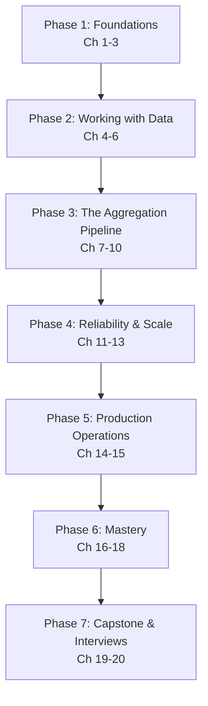

# MongoDB & the Aggregation Pipeline — Complete Course

> From "what is a document database?" to designing, optimizing, and operating production-grade MongoDB systems with advanced aggregation pipelines — a structured, professional learning path.

---

## Course Overview

MongoDB is the most widely used document database, and the **aggregation pipeline** is its signature feature — a composable, stage-by-stage data-processing framework that replaces (and often surpasses) what you'd write in SQL for reporting, analytics, transformation, and real-time dashboards.

This course takes you from absolute beginner to professional, covering:

- The document data model, BSON, and why MongoDB is designed the way it is
- Storage engine internals (WiredTiger), replica sets, and sharded clusters
- CRUD operations, query operators, and cursors
- Schema design patterns: embedding vs. referencing, and named modeling patterns used in production
- Indexing: types, strategy, and reading query plans
- **The aggregation pipeline in depth**: every major stage, every expression category, window functions, and advanced real-world patterns
- Transactions, replication, sharding, and performance tuning
- Security, operational best practices, and common failure modes
- Capstone projects and interview preparation

Every chapter builds on the previous one. Concepts are introduced in plain language first, then formalized, then connected to production practice. Four full chapters (07–10) are dedicated to the aggregation pipeline alone, because that depth is the point of this course.

---

## Who This Course Is For

You should be comfortable with:

- **Basic programming** — variables, functions, arrays/objects, running scripts
- **JSON** — reading and writing nested JSON structures
- **Command line basics** — running a shell, installing software

You do **not** need prior database experience. If you've used SQL/relational databases before (e.g., our [PostgreSQL course](../postgresql-course/00-index.md)), you'll find frequent side-by-side comparisons throughout this course — that background accelerates you but isn't required.

---

## Learning Roadmap

| Phase | Milestone | Chapters |
|---|---|---|
| 1. Foundations | Explain the document model, BSON, and MongoDB's internal architecture from memory | 1–3 |
| 2. Working with Data | Perform all CRUD operations, model a schema correctly, and design the right indexes | 4–6 |
| 3. The Aggregation Pipeline | Write multi-stage aggregation pipelines confidently, including joins, windows, and analytics | 7–10 |
| 4. Reliability & Scale | Explain transactions, replica set failover, and sharding well enough to design for them | 11–13 |
| 5. Production Operations | Diagnose slow queries, tune performance, and secure a deployment | 14–15 |
| 6. Mastery | Apply best practices and recognize known failure modes fluently | 16–18 |
| 7. Capstone & Interviews | Ship a production-grade capstone and pass a MongoDB system-design interview | 19–20 |

---

## Estimated Learning Timeline (75 Days)

**Weeks 1–2 — Foundations & CRUD** (Ch 1–4): install MongoDB, understand the document model and internals, master CRUD and query operators.
*Project: A CLI note-taking app with full CRUD.*

**Weeks 3–4 — Modeling, Indexing & the Aggregation Pipeline** (Ch 5–9): schema design patterns, indexing strategy, and the aggregation framework from `$match`/`$group` through `$lookup`, `$facet`, and expression operators.
*Project: An analytics dashboard over a product-catalog dataset, built entirely with aggregation pipelines.*

**Weeks 5–6 — Advanced Aggregation, Transactions & Scale** (Ch 10–13): window functions, materialized views with `$merge`, multi-document transactions, replication, and sharding.
*Project: A multi-tenant order-management system with replica-set-aware reads/writes.*

**Weeks 7–8 — Production, Mastery & Capstone** (Ch 14–20): performance tuning, security, best practices, common pitfalls, tooling, capstone project, interview preparation.
*Project: A production-grade capstone — a real-time analytics platform combining aggregation pipelines, indexing strategy, and change streams.*

If you can commit ~1–1.5 hours/day, 75 days is realistic for professional proficiency. Compress to ~3 weeks at 3–4 hours/day if you already know a query language well.

---

## Prerequisites

See [Chapter 1](./01-introduction-and-prerequisites.md) for a full self-assessment, covering:

- **Programming**: variables, loops, functions, arrays and objects/dictionaries
- **Data formats**: JSON structure and nesting
- **Tools**: comfort installing software and running a terminal/shell
- **Optional but helpful**: prior SQL experience (used for comparison throughout, never required)

---

## Complete Chapter Index

| # | Chapter | What You'll Learn |
|---|---|---|
| 01 | [Introduction & Prerequisites](./01-introduction-and-prerequisites.md) | What MongoDB is, why document databases exist, self-assessment, installation (local, Docker, Atlas) |
| 02 | [Core Concepts](./02-core-concepts.md) | Documents, collections, BSON types, `_id`, terminology, RDBMS-to-MongoDB mapping |
| 03 | [Architecture & Internals](./03-architecture-and-internals.md) | WiredTiger storage engine, journaling, `mongod`/`mongos`, how reads and writes actually happen |
| 04 | [CRUD Fundamentals](./04-crud-fundamentals.md) | Insert, find, update, delete, query operators, projections, cursors, bulk writes |
| 05 | [Data Modeling & Schema Design](./05-data-modeling-and-schema-design.md) | Embedding vs. referencing, named schema design patterns, schema validation |
| 06 | [Indexes Fundamentals](./06-indexes-fundamentals.md) | Index types, compound indexes, multikey/text/geospatial/TTL indexes, `explain()` |
| 07 | [Aggregation Pipeline Fundamentals](./07-aggregation-pipeline-fundamentals.md) | The pipeline mental model, `$match`/`$project`/`$group`/`$sort`, SQL-to-pipeline mapping |
| 08 | [Aggregation Stages Deep Dive](./08-aggregation-stages-deep-dive.md) | `$lookup`, `$unwind`, `$facet`, `$bucket`, `$graphLookup`, `$merge`/`$out`, and more |
| 09 | [Aggregation Expressions & Operators](./09-aggregation-expressions-and-operators.md) | Expression syntax, arithmetic/string/array/date operators, `$cond`, `$expr`, variables |
| 10 | [Advanced Aggregation Patterns](./10-advanced-aggregation-patterns.md) | `$setWindowFields`, materialized views, sessionization, faceted dashboards, pipeline performance |
| 11 | [Transactions & ACID](./11-transactions-and-acid.md) | Single-document atomicity, multi-document transactions, sessions, read/write concerns |
| 12 | [Replication & High Availability](./12-replication-and-high-availability.md) | Replica sets, elections, oplog, read preference, failover |
| 13 | [Sharding & Scalability](./13-sharding-and-scalability.md) | Shard keys, config servers, `mongos`, balancing, zone sharding |
| 14 | [Performance Tuning & Query Optimization](./14-performance-tuning-and-query-optimization.md) | Reading query plans, the profiler, the ESR rule, aggregation performance |
| 15 | [Security](./15-security.md) | Authentication, RBAC, encryption at rest/in transit, network security, auditing |
| 16 | [Best Practices](./16-best-practices.md) | Consolidated professional checklist across the whole stack |
| 17 | [Common Mistakes & Pitfalls](./17-common-mistakes-and-pitfalls.md) | Failure modes and how to avoid them |
| 18 | [Tools, Drivers & Ecosystem](./18-tools-drivers-and-ecosystem.md) | `mongosh`, Compass, Atlas, drivers, Mongoose, change streams, Atlas Search |
| 19 | [Capstone Projects](./19-capstone-projects.md) | Beginner → production-grade project specs and architecture |
| 20 | [Interview Preparation](./20-interview-preparation.md) | Q&A, system design, aggregation coding challenges, production case studies |

---

## Milestones Checklist

- [ ] Explain the document model and BSON, and why MongoDB trades joins for embedding
- [ ] Perform all CRUD operations confidently, including bulk and atomic read-modify-write operations
- [ ] Design a schema using at least three named modeling patterns and justify embed-vs-reference decisions
- [ ] Choose and create the right indexes for a given query workload, and read an `explain()` plan
- [ ] Write a 5+ stage aggregation pipeline from scratch, including a `$lookup` join and a `$facet`
- [ ] Implement a window-function-style running total or ranking with `$setWindowFields`
- [ ] Explain when multi-document transactions are necessary and when they should be avoided
- [ ] Explain replica set failover and shard key selection well enough to defend a design choice
- [ ] Diagnose and fix a slow query using `explain()` and the profiler
- [ ] Complete a production-grade capstone project
- [ ] Answer all interview questions in Chapter 20 confidently

---

## Recommended Resources

**Official docs**: `https://www.mongodb.com/docs/manual/` (the aggregation pipeline reference and operator index are the pages you'll return to most).

**Interactive practice**: MongoDB University (free courses, `learn.mongodb.com`), `mongoplayground.net` (quick pipeline experimentation).

**Tools**: MongoDB Compass (GUI), `mongosh` (shell), MongoDB Atlas (managed cloud service with a free tier — used throughout this course for hands-on exercises).

**Books**: *MongoDB: The Definitive Guide* (Chodorow & Dirolf); *MongoDB Applied Design Patterns* (Rick Copeland).

**Related course**: [PostgreSQL — From Absolute Beginner to Professional](../postgresql-course/00-index.md), for side-by-side comparison with the relational model.

Good luck. Start with **01-introduction-and-prerequisites.md**.

---

  
  <a href="./00-index.md">🏠 Index</a>
  <a href="./01-introduction-and-prerequisites.md">Next: Introduction & Prerequisites →</a>

