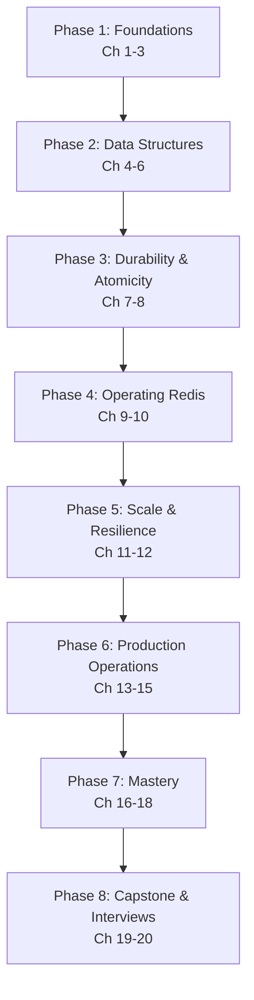

# Redis — Complete Course

> From "what is an in-memory data store?" to designing, securing, and operating production-grade Redis deployments — a structured, professional learning path.

---

## Course Overview

Redis is the world's most popular in-memory data structure store — used as a database, cache, message broker, and streaming platform. Its defining trait isn't just speed (sub-millisecond operations from RAM); it's a rich set of native data structures — strings, lists, hashes, sets, sorted sets, streams, bitmaps, HyperLogLogs, and geospatial indexes — each with purpose-built commands that let you model problems (leaderboards, rate limiters, session stores, job queues, real-time feeds) directly, without translating them into rows and columns first.

This course takes you from absolute beginner to professional, covering:

- What an in-memory data structure store is, and how Redis differs from a traditional disk-based database or a plain cache
- Redis's internal architecture: the single-threaded event loop, memory layout, and why that design choice is a feature
- Every core data type in depth: strings, lists, hashes, sets, sorted sets, bitmaps, HyperLogLog, streams, and geospatial commands
- Persistence: RDB snapshots, the Append-Only File (AOF), and how to choose (or combine) them for your durability needs
- Transactions (`MULTI`/`EXEC`), optimistic locking (`WATCH`), and Lua scripting for atomic multi-step operations
- Expiration policies, eviction policies, and memory optimization for production workloads
- Client libraries and connection management (connection pooling, pipelining)
- Replication, Sentinel-based high availability, and Redis Cluster for horizontal scaling
- Performance tuning, monitoring, and security hardening for production
- Best practices, common failure modes, and the broader ecosystem (RedisInsight, RedisJSON, RediSearch, RedisTimeSeries, RedisBloom)
- Capstone projects and interview preparation

Every chapter builds on the previous one. Concepts are introduced in plain language first, then formalized, then connected to production practice. Because Redis's value proposition is architectural (single-threaded event loop, in-memory data structures) as much as it is command-shaped, this course spends real time on internals (Chapters 3–6) before going deep on day-to-day operations.

---

## Who This Course Is For

You should be comfortable with:

- **Command line basics** — running a shell, installing software, using Docker
- **Basic programming literacy** — enough to read a short Python/Node.js/Go snippet
- **General data structure intuition** — what an array, a hash map, and a set are

You do **not** need prior experience with Redis, caching, or in-memory systems. If you've taken this repo's [PostgreSQL](../postgresql-course/00-index.md), [MongoDB](../mongodb-course/00-index.md), [ClickHouse](../clickhouse-course/00-index.md), or [MinIO](../minio-course/00-index.md) courses, you already have useful contrast: those persist data to disk as the source of truth behind a query engine or blob API, while Redis keeps data in memory for speed and treats durability (RDB/AOF) as an explicit, tunable choice — a genuinely different trade-off worth having side by side.

---

## Learning Roadmap

| Phase | Milestone | Chapters |
|---|---|---|
| 1. Foundations | Explain the in-memory data structure model and Redis's single-threaded architecture from memory | 1–3 |
| 2. Data Structures | Choose and use the correct native data type — including streams and geospatial — for a given problem | 4–6 |
| 3. Durability & Atomicity | Configure RDB/AOF correctly and write atomic multi-step operations with transactions and Lua | 7–8 |
| 4. Operating Redis | Design expiration/eviction policies and use client libraries correctly (pooling, pipelining) | 9–10 |
| 5. Scale & Resilience | Explain replication, Sentinel failover, and Cluster sharding well enough to design a topology | 11–12 |
| 6. Production Operations | Tune performance, monitor a deployment, and harden it for production | 13–15 |
| 7. Mastery | Apply best practices and recognize known failure modes fluently | 16–18 |
| 8. Capstone & Interviews | Ship a production-grade capstone and pass a Redis system-design interview | 19–20 |

---

## Estimated Learning Timeline (55 Days)

**Weeks 1–2 — Foundations & Data Structures** (Ch 1–6): install Redis, understand the single-threaded event loop and memory model, master every core data type including streams and geospatial commands.
*Project: A real-time leaderboard and session store using sorted sets and hashes.*

**Weeks 3–4 — Durability, Atomicity & Operations** (Ch 7–10): RDB/AOF persistence, transactions, Lua scripting, expiration/eviction policies, client libraries with pipelining.
*Project: A rate-limiting middleware and job queue built entirely on native Redis data structures.*

**Weeks 5–6 — Scale & Production** (Ch 11–15): replication, Sentinel, Redis Cluster, performance tuning with `redis-benchmark`, monitoring, and security hardening.
*Project: A Sentinel-managed replica set and a sharded Redis Cluster with full observability.*

**Weeks 7–8 — Mastery & Capstone** (Ch 16–20): best practices, common pitfalls, the broader ecosystem (RedisInsight, RedisJSON, RediSearch), capstone project, interview preparation.
*Project: A production-grade capstone — a real-time analytics and caching layer in front of a relational database.*

If you can commit ~1–1.5 hours/day, 55 days is realistic for professional proficiency. Compress to ~2 weeks at 3–4 hours/day if you already know another caching or key-value system well.

---

## Prerequisites

See [Chapter 1](./01-introduction-and-prerequisites.md) for a full self-assessment, covering:

- **Command line & Docker**: comfort running containers and a terminal
- **Basic data structures**: arrays, hash maps, sets at a conceptual level
- **Optional but helpful**: prior experience with any cache (Memcached, application-level caching) or key-value store

---

## Complete Chapter Index

| # | Chapter | What You'll Learn |
|---|---|---|
| 01 | [Introduction & Prerequisites](./01-introduction-and-prerequisites.md) | What Redis is, in-memory vs. disk-based stores, cache vs. database vs. broker, self-assessment, installation |
| 02 | [Core Concepts](./02-core-concepts.md) | Keys, values, the keyspace, data type overview, terminology, `redis-cli` basics |
| 03 | [Architecture & Internals](./03-architecture-and-internals.md) | The single-threaded event loop, I/O multiplexing, memory allocator, `SAVE`/fork mechanics |
| 04 | [Strings, Lists & Hashes](./04-strings-lists-and-hashes.md) | Core data structures deep dive: strings/counters, lists as queues/stacks, hashes as objects |
| 05 | [Sets, Sorted Sets & Bitmaps](./05-sets-sorted-sets-and-bitmaps.md) | Sets for uniqueness/relations, sorted sets for leaderboards/ranges, bitmaps and HyperLogLog |
| 06 | [Streams & Pub/Sub](./06-streams-and-pub-sub.md) | Redis Streams, consumer groups, Pub/Sub messaging, geospatial commands |
| 07 | [Persistence: RDB & AOF](./07-persistence-rdb-and-aof.md) | RDB snapshots, AOF rewriting, durability trade-offs, hybrid persistence |
| 08 | [Transactions & Lua Scripting](./08-transactions-and-lua-scripting.md) | `MULTI`/`EXEC`/`WATCH`, optimistic locking, `EVAL`/`EVALSHA`, Redis Functions |
| 09 | [Expiration, Eviction & Memory Management](./09-expiration-eviction-and-memory-management.md) | TTLs, eviction policies (LRU/LFU/random), `maxmemory`, memory analysis |
| 10 | [Client Libraries & Connection Management](./10-client-libraries-and-connection-management.md) | Connection pooling, pipelining, Python/Node.js/Go client patterns |
| 11 | [Replication & High Availability](./11-replication-and-high-availability.md) | Leader-replica replication, Redis Sentinel, automatic failover |
| 12 | [Redis Cluster & Sharding](./12-redis-cluster-and-sharding.md) | Hash slots, resharding, multi-key operations, cluster topology design |
| 13 | [Performance Tuning & Benchmarking](./13-performance-tuning-and-benchmarking.md) | `redis-benchmark`, slow log, latency monitoring, big-key/hot-key diagnosis |
| 14 | [Monitoring & Observability](./14-monitoring-and-observability.md) | `INFO`, Prometheus/Grafana, RedisInsight, `MONITOR`, key-space notifications |
| 15 | [Security](./15-security.md) | ACLs, `requirepass`, TLS, network hardening, command renaming/disabling |
| 16 | [Best Practices](./16-best-practices.md) | Consolidated professional checklist across the whole stack |
| 17 | [Common Mistakes & Pitfalls](./17-common-mistakes-and-pitfalls.md) | Failure modes and how to avoid them |
| 18 | [Tools & Ecosystem](./18-tools-and-ecosystem.md) | RedisInsight, RedisJSON, RediSearch, RedisTimeSeries, RedisBloom, managed Redis offerings |
| 19 | [Capstone Projects](./19-capstone-projects.md) | Beginner → production-grade project specs and architecture |
| 20 | [Interview Preparation](./20-interview-preparation.md) | Q&A, system design, troubleshooting, production case studies |

---

## Milestones Checklist

- [ ] Explain the in-memory data structure model and why Redis's single-threaded design doesn't limit its throughput
- [ ] Use every core data type (strings, lists, hashes, sets, sorted sets, streams, bitmaps, HyperLogLog, geo) correctly
- [ ] Configure RDB and AOF persistence to meet a given durability requirement
- [ ] Write an atomic multi-step operation using transactions and a Lua script
- [ ] Design an expiration and eviction policy for a memory-constrained cache
- [ ] Use a client library with connection pooling and pipelining for throughput
- [ ] Explain replication and Sentinel failover well enough to design a highly available topology
- [ ] Explain Redis Cluster hash slots well enough to design a sharded deployment
- [ ] Benchmark a deployment with `redis-benchmark` and diagnose a hot-key or big-key problem
- [ ] Set up Prometheus/Grafana monitoring for a Redis deployment
- [ ] Complete a production-grade capstone project
- [ ] Answer all interview questions in Chapter 20 confidently

---

## Recommended Resources

**Official docs**: `https://redis.io/docs/latest/` (the commands reference and data types pages are the ones you'll return to most).

**Tools**: `redis-cli`, RedisInsight (GUI), `redis-benchmark` (load testing), Redis Sentinel and Redis Cluster tooling built into the server.

**Interactive practice**: `try.redis.io` (browser-based tutorial), running Redis locally via Docker or the single-binary distribution — every chapter's exercises are designed to work against a local instance.

**Books/talks**: *Redis in Action* (Josiah Carlson); Redis's own blog and conference talks (RedisConf) for production architecture case studies.

**Related courses**: [PostgreSQL](../postgresql-course/00-index.md), [MongoDB & the Aggregation Pipeline](../mongodb-course/00-index.md), [ClickHouse & Columnar Databases](../clickhouse-course/00-index.md), and [MinIO & Object Storage](../minio-course/00-index.md), for contrast with relational, document, columnar-analytical, and object storage models.

Good luck. Start with **01-introduction-and-prerequisites.md**.

---

  
  <a href="./00-index.md">🏠 Index</a>
  <a href="./01-introduction-and-prerequisites.md">Next: Introduction & Prerequisites →</a>

