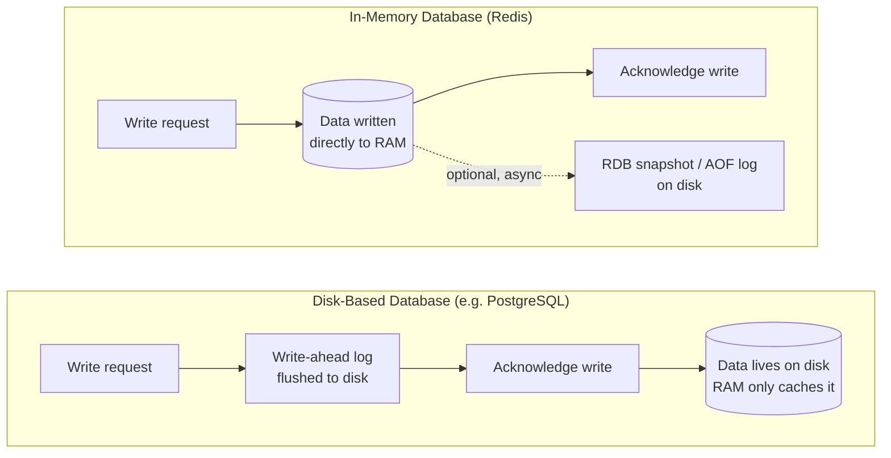
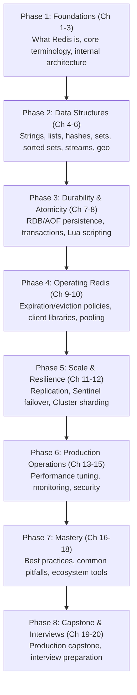

# Chapter 1: Introduction & Prerequisites

Every developer eventually hits the same wall: a database query that used to take 2 milliseconds now takes 200, because the table it hits has grown from ten thousand rows to ten million, and it's being asked the same handful of questions thousands of times a second. The fix usually isn't "buy a bigger database." It's "stop asking the database the same question twice." That single insight — cache the answer, keep the hot data in memory, and touch disk only when you must — is the entire reason Redis exists, and the reason it has become one of the most widely deployed pieces of infrastructure on the internet.

This chapter has one job: get you oriented. By the end, you'll know what Redis actually is, where it fits next to a database like PostgreSQL or MongoDB, why companies you use every day depend on it, and you'll have it running on your machine with your first command executed against it. Nothing here is deep yet — depth starts in Chapter 2. This is the map before the terrain.

---

## Learning Objectives

By the end of this chapter, you will be able to:

- Define Redis precisely — an in-memory data structure store — and explain why that phrase, not just "cache," is the accurate one.
- Explain the fundamental trade-off between in-memory and disk-based databases, and why "in-memory" does not mean "the data disappears the moment you stop looking at it."
- Distinguish the four roles Redis can play in a system — database, cache, message broker, streaming platform — with a concrete example of each.
- Compare Redis to Memcached and to disk-based systems (relational, document, columnar, object storage) well enough to justify a technology choice in a design discussion.
- Install Redis locally (via package manager or Docker) and confirm it's alive with `redis-cli PING`.
- Describe, at a roadmap level, what each of the remaining phases of this course will teach you and why they're sequenced the way they are.

---

## Prerequisites

There are no Redis-specific prerequisites for this chapter — that's the point of Chapter 1. But this course does assume a general technical baseline, carried over directly from the [course index](./00-index.md)'s "Who This Course Is For":

- **Command line basics** — you can open a terminal, run a program, and install software without hand-holding.
- **Docker familiarity** — you know that `docker run` starts a container, and roughly what a container is (you don't need to be a Docker expert).
- **Basic programming literacy** — you can read a short Python, Node.js, or Go snippet and understand what it's doing, even if you wouldn't write it from scratch in that language.
- **General data structure intuition** — you have a working mental model of what an array, a hash map (dictionary), and a set are, and why each is useful.

You do **not** need any prior experience with Redis, caching systems, or in-memory databases. If you've already worked through this repo's [PostgreSQL](../postgresql-course/00-index.md), [MongoDB](../mongodb-course/00-index.md), [ClickHouse](../clickhouse-course/00-index.md), or [MinIO](../minio-course/00-index.md) courses, you have a genuine head start — not because Redis works like any of them, but because you already know what a disk-backed system feels like, which makes Redis's very different trade-offs easier to appreciate by contrast. We'll draw on that contrast throughout this chapter.

### Self-assessment checklist

Before moving on, honestly check yourself against this list. You don't need a "yes" on everything — this is a calibration tool, not a gate.

- [ ] I can open a terminal and run a command-line program comfortably.
- [ ] I know what `docker run <image>` does, roughly, even if I've never written a `Dockerfile`.
- [ ] I can read a 10-15 line Python or JavaScript function and describe what it does in plain English.
- [ ] I know what an array/list is and why looking up an item by index is fast.
- [ ] I know what a hash map (dictionary, associative array) is and why looking up a value by key is fast.
- [ ] I know what a set is and why it guarantees uniqueness.
- [ ] I've used *some* kind of database before (SQL or NoSQL) — I don't need Redis-specific experience, just the general shape of "store data, query it later."

If most of these are checked, you're in good shape to start. If several aren't, that's fine too — the concepts below are self-contained, and the "further reading" sections in each chapter point to primers if you want to shore up a specific gap.

---

## 1. What Redis Is

**Redis** stands for **RE**mote **DI**ctionary **S**erver. That name is worth unpacking, because it's a more literal description than most product names ever bother to be:

- **Remote** — Redis runs as a separate server process. Your application talks to it over a network connection (even if that "network" is just `localhost`), the same way it would talk to a relational database.
- **Dictionary** — at its core, Redis is a giant key-value dictionary: every piece of data has a key (a string you choose) and a value. But unlike a plain dictionary, the *value* isn't limited to a string or a blob — it can be a list, a hash, a set, a sorted set, a stream, and more. This is why Redis calls itself a **data structure** store, not just a key-value store: the structures are native, with dozens of purpose-built commands operating on them directly inside the server.
- **Server** — it's a long-running daemon process, typically `redis-server`, that you start once and then talk to for as long as you need it.

Put together: **Redis is an in-memory data structure store**, usable as a database, cache, message broker, and streaming platform. Every one of those four roles (covered in Section 3) comes from the same underlying engine — you're not bolting on different products, you're using different facets of one server.

### A brief history

Redis was created in 2009 by **Salvatore Sanfilippo** (online handle `antirez`), an Italian developer who was working on scaling the backend of a startup (a real-time web analytics tool) and found that no existing tool gave him fast enough access to frequently-changing counters and lists. Rather than force the problem into a relational database, he wrote a small, purpose-built in-memory server, open-sourced it, and kept developing it — Sanfilippo remained Redis's lead maintainer for the following decade, personally authoring an enormous share of its core design decisions (including the deliberately single-threaded architecture you'll study in Chapter 3).

Redis stayed a BSD-licensed open-source project for most of its life, growing into what independent developer surveys (Stack Overflow's annual survey, among others) have repeatedly ranked as the most-loved database technology for years running. In 2024, Redis Ltd. (the company that emerged around the project) changed the licensing of future Redis versions away from the original open-source license, which led to a community fork called **Valkey** (hosted by the Linux Foundation) that continues under the original open license. For the purposes of this course, the commands, data structures, and architecture are effectively identical between Redis and Valkey — what you learn here transfers directly. We'll flag license/versioning nuances where they matter (mainly in Chapter 18, on the ecosystem).

---

## 2. In-Memory vs. Disk-Based Databases

This is the single most important conceptual distinction in this entire course, so it's worth being precise about it early.

### The fundamental trade-off

A traditional database — PostgreSQL, MySQL, MongoDB — treats disk as its primary home for data. Every write is designed, by default, to survive a crash: it's flushed or logged to disk before the database tells you "OK, that's saved." This durability-by-default is exactly why relational and document databases are the systems of record for things you can never afford to lose — financial transactions, user accounts, orders.

Redis flips the default. Data lives primarily in **RAM** — the same memory your CPU uses for everything else it's doing right now. Reading and writing RAM is roughly **100-1,000x faster** than reading and writing even a fast NVMe SSD, because there's no disk controller, no filesystem, no seek time, no I/O scheduler in the way — just direct memory access. That's the entire source of Redis's legendary speed: sub-millisecond response times and throughput in the hundreds of thousands of operations per second on modest hardware aren't a clever trick, they're just what you get when you stop touching disk on the hot path.

The trade-off is exactly what you'd expect: RAM is **volatile**. Cut the power, and its contents vanish. So a database that treats RAM as its primary store has to answer, deliberately, the question a disk-based database answers for you automatically: *if the process dies right now, what do I lose?*

|  | Disk-based (PostgreSQL, MongoDB, etc.) | In-memory (Redis) |
|---|---|---|
| **Primary storage location** | Disk | RAM |
| **Default durability** | On by default (WAL/journal before acknowledging a write) | Off by default — you must opt in |
| **Typical latency** | Single-digit milliseconds | Sub-millisecond |
| **Why it's slower** | Disk I/O, even on SSDs, is inherently slower than RAM access | N/A — no disk in the hot path |
| **What a crash costs you, by default** | Little to nothing (committed writes survive) | Everything since the last snapshot/log, unless configured otherwise |

### "In-memory" does not mean "not persistent"

This is a trap almost every Redis newcomer falls into, so let's kill it now: **Redis can absolutely persist data to disk — it's just opt-in and explicit rather than mandatory and implicit.** Redis offers two persistence mechanisms, covered in full in **Chapter 7**:

- **RDB (Redis Database) snapshots** — periodic point-in-time dumps of the entire dataset to a single compact file on disk.
- **AOF (Append-Only File)** — a log of every write operation, replayed on startup to reconstruct the dataset, similar in spirit to a database's write-ahead log.

You can run Redis with neither (pure ephemeral cache — a restart means starting from empty), either one, or both combined for maximum durability. The point to internalize now: **"in-memory" describes where Redis serves reads and writes from, not whether your data can survive a restart.** Durability in Redis is a dial you turn deliberately, not a binary property baked into the storage engine the way it is in most disk-based systems. We'll return to this dial in detail in Chapter 7 — for now, just remember it exists, because Section 6's common mistakes below assumes you've read this paragraph.



Notice the asymmetry: in the disk-based path, disk is on the critical path *before* you get an acknowledgment. In the Redis path, disk (if used at all) is off to the side, asynchronous or periodic, and never blocks the operation that made your application fast in the first place.

---

## 3. Redis as Database vs. Cache vs. Message Broker vs. Streaming Platform

People often introduce Redis as "just a cache." That undersells it badly. The same server process, the same set of data structures, can be pointed at four genuinely different jobs:

### 3.1 As a cache

The most common use case: sit Redis in front of a slower system of record (usually a relational or document database) and store the results of expensive queries, keyed by something derivable from the request. When a request comes in, check Redis first (a "cache hit" avoids the expensive query entirely); only on a miss do you hit the real database, then populate Redis for next time.

*Example:* An e-commerce product page that requires joining product details, pricing, and inventory across several tables. Cache the assembled JSON under a key like `product:8842` with a short TTL (time-to-live), and 95%+ of page views never touch the database at all.

### 3.2 As a primary database

Because Redis's data structures are rich enough to model real problems directly (not just cache pre-computed answers), many systems use Redis as the **system of record** for specific, latency-critical pieces of state — with persistence (Chapter 7) turned on to make this safe.

*Example:* A real-time leaderboard for a mobile game, stored entirely as a Redis **sorted set** (Chapter 5). There is no "source of truth" elsewhere for the current live rankings — Redis *is* the source of truth, because sorted sets give you "get rank of player X" and "get top 10" in logarithmic time natively, something that's awkward and slow to compute repeatedly from a relational table.

### 3.3 As a message broker

Redis's **Pub/Sub** feature (Chapter 6) lets one process publish a message to a named channel, and any number of subscribed processes receive it instantly. This turns Redis into lightweight infrastructure for real-time fan-out messaging between services, without standing up a dedicated message queue product.

*Example:* A chat application publishes each new message to a channel named after the chat room; every connected server instance handling WebSocket connections for that room is subscribed, and instantly relays the message to its connected clients — regardless of which server the sender was connected to.

### 3.4 As a streaming platform

**Redis Streams** (Chapter 6) is a log-like data structure — an append-only sequence of entries, each with an ID, that multiple consumer groups can read independently and at their own pace, with acknowledgment and replay semantics similar in spirit to Kafka (at a smaller operational scale).

*Example:* An order-processing pipeline where each new order is appended as a stream entry. One consumer group updates inventory, another sends a confirmation email, and a third feeds an analytics dashboard — each processing the same stream of events independently, able to pick up where it left off if it restarts.

The throughline across all four roles: Redis doesn't have four different products bolted together. It has one server, one set of native data structures, and different commands that happen to compose into database, cache, broker, and streaming patterns. That versatility is a major reason it shows up in so many places in a typical production architecture.

---

## 4. How Redis Compares to Alternatives

### 4.1 Redis vs. Memcached

**Memcached** is the other well-known in-memory system, and the comparison is worth making precise, because people often treat them as interchangeable — they aren't, beyond the shared "keep hot data in RAM" idea.

| | Memcached | Redis |
|---|---|---|
| **Purpose** | Cache only | Database, cache, broker, streaming platform |
| **Data types** | Strings/blobs only | Strings, lists, hashes, sets, sorted sets, streams, bitmaps, HyperLogLog, geospatial |
| **Threading model** | Multi-threaded | Single-threaded event loop for command execution (Chapter 3) |
| **Persistence** | None — pure cache, data is always disposable | Optional RDB and/or AOF persistence |
| **Replication/clustering** | Client-side sharding only, no native replication | Native replication, Sentinel, and Cluster (Chapters 11-12) |
| **Best fit** | Simple, maximally simple object caching where you need raw multi-core throughput and never need anything but "get blob by key" | Anything beyond simple caching — leaderboards, rate limiters, session stores, queues, real-time feeds |

Memcached's multi-threading can give it an edge in raw throughput for the narrow case of simple key-blob caching on a many-core machine, since it can use every core for cache lookups directly. Redis's single-threaded design (explored fully in Chapter 3) trades that off for something else entirely: every operation is atomic without any locking, which is what makes commands like "increment this counter" or "add this player's score and immediately return their new rank" trivially safe under massive concurrent load — no race conditions, no mutexes, no partial updates. In practice, this makes Redis the default choice unless you have a very specifically threading-bound workload that only Memcached's model suits.

### 4.2 Redis vs. disk-based databases

This repo has sibling courses on several disk-based systems, and it's worth being explicit about how Redis relates to each — not as a replacement, but as a different tool with a different job:

- **[PostgreSQL](../postgresql-course/00-index.md)** — a relational database: structured tables, joins, transactions, and strong consistency guarantees, with disk as the durable system of record. Redis doesn't compete with PostgreSQL for "where does the business's core data permanently live" — it sits in front of or alongside it, absorbing read load and handling latency-critical, ephemeral, or high-churn state.
- **[MongoDB](../mongodb-course/00-index.md)** — a document database: flexible, schema-less JSON-like documents, good for evolving data models. Same relationship to Redis as PostgreSQL: durable document store on disk, Redis as the fast layer in front of or beside it.
- **[ClickHouse](../clickhouse-course/00-index.md)** — a columnar analytical database, built for scanning billions of rows for aggregate queries (sums, counts, group-bys) rather than fetching single records fast. Redis and ClickHouse solve opposite problems: ClickHouse is for "crunch a huge amount of historical data," Redis is for "answer one small question as fast as physically possible."
- **[MinIO](../minio-course/00-index.md)** — S3-compatible object storage, built for storing and retrieving large, mostly-immutable blobs (images, backups, files) cheaply at scale. Redis is a poor fit for large blobs (it's memory-priced, not disk-priced) — the two are typically used together, with MinIO holding the actual files and Redis caching their metadata or presigned URLs.

The pattern across all four: disk-based systems are where data *lives*; Redis is where data *moves fast*. A mature architecture usually has both, each doing the job it's actually good at.

---

## 5. Real-World Use Cases at Scale

Redis's adoption at large, high-traffic companies isn't an accident — it's a direct result of the speed/versatility trade-off discussed above. A few well-documented examples:

- **Twitter/X** has used Redis-family in-memory caching extensively in its timeline and object-caching infrastructure, where the volume of repeated reads for the same tweets and user objects makes a fast cache layer essential to keeping the site responsive.
- **GitHub** uses Redis for caching, background job queuing (via Sidekiq, which is backed by Redis lists), and other latency-sensitive infrastructure across its web application.
- **Stack Overflow** has published detailed engineering accounts of using Redis as a caching layer in front of their SQL Server databases, crediting it as a key part of how a relatively small server footprint serves enormous read traffic.
- **Uber** uses Redis for use cases including caching and low-latency lookups in parts of its dispatch and geolocation-adjacent infrastructure, where response time directly affects rider/driver matching experience.

Beyond specific companies, four use-case patterns recur constantly across the industry and will each get hands-on treatment in this course:

- **Caching** — the canonical use case (Section 3.1), reducing load on a primary database.
- **Session storage** — storing logged-in user session data in Redis instead of in a single application server's memory, so any server behind a load balancer can serve any user's request without "sticky sessions."
- **Leaderboards and counters** — using sorted sets and atomic increments for gaming leaderboards, view counters, and vote tallies that need to be both fast and always consistent under concurrent updates.
- **Rate limiting** — using Redis's atomic operations and expiration to enforce "no more than N requests per user per minute" style API limits cheaply and correctly, even across many application server instances.

---

## 6. Self-Assessment: Are You Ready to Continue?

Before Chapter 2 introduces the keyspace and Redis's terminology in full, confirm you can honestly check off the following. This is the same spirit as the checklist in the Prerequisites section, but now specific to what Chapter 1 itself covered:

- [ ] I can explain, in one or two sentences, what "in-memory data structure store" means and why it's more accurate than just calling Redis "a cache."
- [ ] I understand why in-memory access is dramatically faster than disk access, at least at the level of "no disk I/O in the hot path."
- [ ] I can explain that Redis *can* persist data to disk, and that doing so is a deliberate configuration choice, not the default behavior.
- [ ] I can name at least three distinct roles Redis can play (database, cache, message broker, streaming platform) and give an example use case for each.
- [ ] I understand, at a high level, why Redis and Memcached aren't interchangeable (data types, persistence, single- vs. multi-threaded).
- [ ] I understand that Redis is not a replacement for PostgreSQL/MongoDB/ClickHouse/MinIO-style systems, but a complementary layer with a different job.
- [ ] I have Redis running somewhere I can reach it (see the installation section below), and `redis-cli PING` returns `PONG`.

If all of these feel solid, you're ready for Chapter 2.

---

## 7. Installation

You have three realistic options for getting a Redis server to practice against. Docker is the recommended path for this course, because it's identical across operating systems and trivially disposable, but all three are covered.

### Option A: Docker (recommended)

```bash
# Pull and run the official Redis image, exposing the default port
docker run -d --name redis-course -p 6379:6379 redis

# Confirm it's running
docker ps --filter "name=redis-course"
```

This starts Redis in the background, listening on port `6379` (Redis's default port) on your local machine. Because no volume is mounted, this container's data will **not** survive a restart yet — that's intentional for now, and revisited in the Hands-On Exercise below and in depth in Chapter 7.

### Option B: Local package install

**Debian/Ubuntu (`apt`):**

```bash
sudo apt update
sudo apt install redis-server

# Start it (systemd-managed systems)
sudo systemctl enable --now redis-server
```

**macOS (`brew`):**

```bash
brew install redis

# Start it as a background service
brew services start redis
```

### Option C: Redis Cloud / managed services

For production workloads (and for later chapters on replication and clustering), running your own server isn't always the right call. Managed offerings — **Redis Cloud** (the official managed service from Redis Ltd.), plus Redis-compatible offerings from AWS (ElastiCache), Google Cloud (Memorystore), and Azure (Azure Cache for Redis) — handle provisioning, failover, patching, and scaling for you. Chapter 18 covers these in more detail; for this course's hands-on exercises, a local Docker or package install is all you need.

### First contact: `redis-cli`

`redis-cli` is Redis's command-line client — your primary tool for the rest of this course. Once a server is running (via any of the options above), connect to it:

```bash
redis-cli
```

You should land in an interactive prompt. Send Redis its simplest possible command, `PING`, which exists purely to confirm the server is alive and responsive:

```
127.0.0.1:6379> PING
PONG
```

`PONG` back means everything is working: the client connected, the server received the command, processed it, and replied — all in well under a millisecond. Try a couple more commands while you're in there, just to get a feel for the shape of things (full depth on these arrives in Chapter 4):

```
127.0.0.1:6379> SET greeting "hello, redis"
OK
127.0.0.1:6379> GET greeting
"hello, redis"
127.0.0.1:6379> EXIT
```

If you're running Redis via Docker instead of a local install, you can either install `redis-cli` locally (it ships with the `redis-tools` package on Debian/Ubuntu, or with `redis` via Homebrew) and point it at `localhost`, or run the client from inside the container itself:

```bash
docker exec -it redis-course redis-cli PING
```

Either way, seeing `PONG` is your green light for the rest of this course.

---

## 8. A Tour of What's Ahead

This course is organized into eight phases (see the [full roadmap in the index](./00-index.md#learning-roadmap)). Here's what each one builds toward, so you know where today's chapter fits into the bigger picture:



You're standing at the very start of **Phase 1**. Chapter 2 gives you the vocabulary (keys, the keyspace, data type overview) you'll use for the rest of the course; Chapter 3 opens up the internals — the single-threaded event loop that makes Redis's atomicity guarantees possible, which is the payoff for the "no locking needed" claim made in Section 4.1 above. From there, Phase 2 is where you'll actually get hands-on with every native data structure, one chapter at a time.

---

## Real-World Scenario: Introducing QuickCart

Starting in this chapter, and continuing through the rest of the course, we'll follow a single running example: **QuickCart**, a fictional mid-sized e-commerce company. Every later chapter will extend this same scenario with the concepts it introduces, so the pieces accumulate into something resembling a real production system by the time you reach the capstone in Chapter 19.

### QuickCart's situation

QuickCart runs its storefront, checkout, and account management on a fairly typical stack: a handful of application servers behind a load balancer, talking to a single PostgreSQL database that holds products, inventory, orders, and user accounts. Business is growing, and growth has exposed four separate architectural problems, all stemming from the same root cause — **the database is being asked to do far more work than necessary, because nothing sits between it and the application layer.**

1. **The database is getting hammered by repeated reads.** The product catalog page is one of the most-viewed pages on the site, and every view re-runs the same joins across products, pricing, and inventory tables — for the same handful of popular products, over and over, thousands of times an hour. The underlying data changes rarely; the query traffic is enormous. This is a textbook caching problem (Section 3.1).

2. **User sessions don't survive across app servers.** QuickCart currently stores logged-in session data in each application server's local memory. When the load balancer routes a returning user's request to a different server than the one that handled their login, the server doesn't recognize them, and they're bounced back to the login page. Engineering has been forced into "sticky sessions" (always route a user to the same server) as a workaround, which makes it impossible to take a server down for a deploy without logging out everyone attached to it.

3. **Shopping carts are fragile and slow.** Carts are currently rows in PostgreSQL, updated on every add/remove-item click. Under load, this generates a disproportionate share of write traffic for data that's inherently temporary — most carts are abandoned or converted into an order within minutes, yet they're being treated with the same durability machinery as permanent order records.

4. **There's no gamification, no rate limiting, and no real-time order pipeline.** Product wants a "top buyers this month" leaderboard to drive engagement; the public API has no protection against a client hammering it with requests; and the fulfillment team wants near-real-time visibility into new orders instead of polling the orders table every few seconds.

### Why Redis is the answer QuickCart is reaching for

Each of these four problems maps directly onto a Redis capability you've just been introduced to in this chapter, and each will get a full worked example in a later chapter:

- **Repeated catalog reads** → Redis as a **cache** in front of PostgreSQL (Section 3.1), covered hands-on starting in Chapter 4.
- **Sessions that need to survive across servers** → Redis as a **shared session store** (a **database** role, Section 3.2), using hashes — covered in Chapter 4.
- **Fragile, high-churn shopping carts** → Redis hashes and TTLs modeling carts as first-class, expiring in-memory objects — covered in Chapters 4 and 9.
- **A leaderboard** → Redis **sorted sets**, purpose-built for exactly this — Chapter 5.
- **API rate limiting** → atomic counters with expiration — Chapters 4 and 9.
- **A real-time order-event pipeline** → Redis **Streams**, with consumer groups for inventory, notifications, and fulfillment — Chapter 6.

By the end of this course, you'll have effectively rebuilt QuickCart's caching, session, cart, leaderboard, rate-limiting, and order-event layers on Redis, exercising nearly every major feature this course covers along the way. Keep QuickCart in mind as you move forward — when a new data structure or feature is introduced, ask "which of QuickCart's four problems does this solve?" It's the fastest way to keep the material grounded in something concrete rather than abstract command syntax.

---

## Best Practices

Even at this "just getting started" stage, a few habits will save you pain later:

- **Always pin a specific Redis version**, in Docker (`redis:7.4` rather than bare `redis`) and in package installs. "Latest" drifts under you and makes bugs hard to reproduce across a team.
- **Use the official Docker image** (`redis` on Docker Hub, maintained by the Redis project) rather than a random third-party image, for security and correctness guarantees.
- **Decide about persistence deliberately, from day one** — even if the answer for a throwaway dev container is "no persistence, I don't care," make that a conscious choice rather than something you discover by accident after a restart (Chapter 7 goes deep on this).
- **Keep `redis-cli` within arm's reach while learning.** Reading about a command is no substitute for running it and looking at the exact output — this course is built around that habit.
- **Note your Redis version early**, since command availability and defaults do shift across major versions (e.g., some data types like Streams didn't exist before Redis 5.0). `redis-cli INFO server` will tell you what you're running.

---

## Common Mistakes

Watch for these — they're the mistakes almost everyone new to Redis makes at least once:

- **Treating Redis as a magic, bottomless cache with no eviction plan.** RAM is finite and typically far smaller than disk. If you cache without any `maxmemory` limit or eviction policy (Chapter 9), a busy application can fill available memory and crash the server, or start rejecting writes outright. Have an eviction plan before you have a memory problem.
- **Assuming a Redis restart preserves your data by default.** As Section 2 explained, Redis's default behavior without configured persistence is to hold data purely in RAM. Stop the process (or the container) without RDB/AOF configured, and everything is gone — permanently, with no warning. This surprises nearly every newcomer exactly once.
- **Confusing "cache" with "database" without thinking it through.** It's tempting to store something in Redis "because it's fast" without asking whether that data can tolerate being lost. Session tokens for an active checkout flow probably need at least some durability; a pre-computed "trending products" list probably doesn't. Make that call consciously per use case.
- **Ignoring the single-threaded execution model when picking commands.** A single very slow command (e.g., scanning a huge, unindexed collection with `KEYS *` in production) blocks every other client for its duration, because there's one thread executing commands. Chapter 3 covers this in depth, but it's worth knowing from day one: Redis rewards small, fast, well-chosen operations.
- **Running Docker containers without a named volume and then being surprised data vanished.** This is really the same lesson as the second bullet, but it deserves repeating in Docker-specific terms: `docker run redis` with no volume mount means the container's filesystem — RDB/AOF files included, if enabled — disappears when the container is removed.

---

## Summary

- Redis is an **in-memory data structure store** — a "remote dictionary server" whose values can be strings, lists, hashes, sets, sorted sets, streams, and more, not just blobs. It was created by Salvatore Sanfilippo in 2009.
- The core trade-off versus disk-based databases is **speed vs. durability-by-default**: RAM access is 100-1,000x faster than disk, but volatile by nature. Redis makes durability an explicit, configurable choice (RDB/AOF, Chapter 7) rather than an automatic guarantee.
- Redis plays (at least) **four roles**: database, cache, message broker (Pub/Sub), and streaming platform (Streams) — all from the same engine and data structures.
- Redis differs from **Memcached** in data type richness, persistence options, clustering support, and threading model; it differs from disk-based systems like **PostgreSQL, MongoDB, ClickHouse, and MinIO** in that it's optimized for speed on hot, frequently-accessed data rather than being the durable system of record for everything.
- Large-scale companies (Twitter/X, GitHub, Stack Overflow, Uber, among many others) rely on Redis for caching, sessions, leaderboards, and rate limiting — the same four patterns this course's running example, **QuickCart**, will build hands-on.
- You should now have Redis installed and responding to `redis-cli PING` with `PONG`.

---

## Knowledge Check

1. **What does "Redis" stand for, and what does each part of the acronym describe about the system?**
   *Answer: REmote DIctionary Server. "Remote" — it runs as a separate server process accessed over a connection. "Dictionary" — data is stored as key-value pairs, though values can be rich structures, not just blobs. "Server" — it's a persistent daemon process you connect to repeatedly, not a one-shot program.*

2. **Why is in-memory access so much faster than disk access, even with modern SSDs?**
   *Answer: RAM access has no disk controller, filesystem, or I/O scheduling in the path — the CPU addresses memory directly. Even fast NVMe SSDs involve I/O operations orders of magnitude slower than a RAM access, roughly 100-1,000x depending on the workload.*

3. **True or false: "In-memory" means Redis data cannot survive a restart.** Explain your answer.
   *Answer: False. Redis can persist data to disk via RDB snapshots and/or the AOF log (Chapter 7), and reload it on startup. "In-memory" describes where Redis serves reads/writes from during normal operation, not whether the data can survive a process restart — that's a separate, configurable choice.*

4. **Name the four roles Redis can play, and give one example use case for each.**
   *Answer: Database (e.g., a live leaderboard stored as a sorted set), cache (e.g., caching an expensive product page query), message broker (e.g., Pub/Sub fan-out for a chat room), streaming platform (e.g., an order-event log read by multiple independent consumer groups via Streams).*

5. **Give two concrete differences between Redis and Memcached.**
   *Answer: Any two of — Memcached supports only simple string/blob values while Redis has rich native data types (lists, hashes, sets, sorted sets, streams, etc.); Memcached is multi-threaded while Redis's command execution is single-threaded; Memcached has no built-in persistence while Redis offers optional RDB/AOF; Memcached has no native replication/clustering while Redis has Sentinel and Cluster.*

6. **QuickCart's product catalog page is hit thousands of times an hour for the same popular products, and the underlying data rarely changes. Which Redis role (Section 3) best addresses this, and why?**
   *Answer: Redis as a cache. Since the query results change rarely but are requested extremely often, storing the assembled result under a key with a TTL lets the vast majority of requests be served from RAM, avoiding repeated expensive database queries entirely.*

7. **Why does QuickCart's "sticky sessions" workaround exist, and what Redis-based fix would remove the need for it?**
   *Answer: Sessions are stored in each app server's local memory, so a user must always be routed to the same server or they appear logged out. Moving session storage into a shared Redis instance (accessible by every app server) removes that constraint — any server can serve any user's request, because the session lives outside any single application server's memory.*

8. **Why is running `KEYS *` against a large production Redis dataset considered risky, given what you now know about Redis's execution model?**
   *Answer: Redis executes commands on a single thread, so a slow command (like scanning every key in a large dataset) blocks all other clients for its full duration. On a large dataset this can cause a multi-second stall visible to every connected application. (Chapter 3 covers the single-threaded model in full, and later chapters introduce `SCAN` as the safe, incremental alternative.)*

---

## Hands-On Exercise

Complete the following steps and note the exact output at each stage — this is the pattern you'll repeat throughout the course.

**Step 1 — Run Redis without persistence, and observe data loss on restart.**

```bash
# Start a plain container, no volume
docker run -d --name redis-ex1 -p 6379:6379 redis

# Connect and set a value
redis-cli -h localhost SET mykey "will this survive?"
redis-cli -h localhost GET mykey
# Expect: "will this survive?"

# Restart the container
docker restart redis-ex1

# Check again
redis-cli -h localhost GET mykey
```

Because the base `redis` image runs without persistence enabled by default and without a mounted volume, restarting the *container* (not just the Redis process) discards the container's writable layer. Note what you observe.

**Step 2 — Enable persistence and a volume, and confirm data survives.**

```bash
# Clean up the first container
docker rm -f redis-ex1

# Start a new container with a named volume and RDB persistence enabled (--save)
docker volume create redis-ex2-data
docker run -d --name redis-ex2 -p 6379:6379 \
  -v redis-ex2-data:/data \
  redis redis-server --save 60 1 --dir /data

# Set a value
redis-cli -h localhost SET mykey "this should survive"
redis-cli -h localhost GET mykey

# Force a save explicitly (don't wait for the 60-second/1-change trigger)
redis-cli -h localhost SAVE

# Restart the container
docker restart redis-ex2

# Check again
redis-cli -h localhost GET mykey
# Expect: "this should survive"
```

**Step 3 — Reflect.** Write down, in your own words, what specifically changed between Step 1 and Step 2 that caused the different outcome. (You'll formalize the mechanics of `--save`, RDB, and AOF fully in Chapter 7 — for now, the goal is just to see the behavior with your own eyes and connect it back to Section 2's claim that persistence is opt-in.)

**Cleanup:**

```bash
docker rm -f redis-ex2
docker volume rm redis-ex2-data
```

---

## Further Reading

- [Redis official documentation](https://redis.io/docs/latest/) — the canonical reference for commands, data types, and configuration; you'll return to this constantly throughout the course.
- [Redis command reference](https://redis.io/docs/latest/commands/) — every command, with complexity notes and examples.
- [Try Redis](https://try.redis.io/) — a browser-based interactive tutorial, useful if you want a no-install way to experiment alongside this chapter.
- [Redis on Docker Hub](https://hub.docker.com/_/redis) — the official image used in this chapter's installation and exercise sections.
- *Redis in Action* by Josiah Carlson — a practical, example-driven book covering many of the patterns (caching, leaderboards, queues) this course builds toward.
- [Valkey project](https://valkey.io/) — background on the open-source fork that emerged after Redis's 2024 licensing change, useful context if you encounter it in the wild.

---

<div style="display:flex;justify-content:space-between;align-items:center;">
  <a href="./00-index.md">← Previous: Index</a>
  <a href="./00-index.md">🏠 Index</a>
  <a href="./02-core-concepts.md">Next: Core Concepts →</a>
</div>
