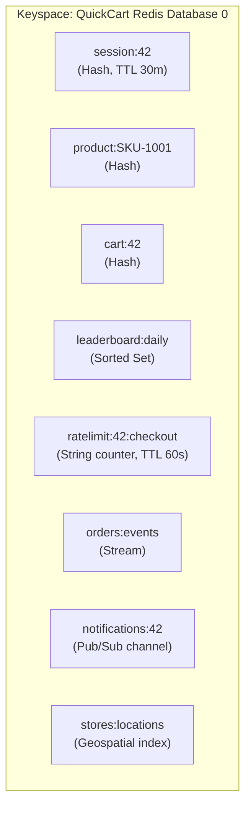

# Chapter 2: Core Concepts

Chapter 1 answered "what is Redis and why would I use it?" This chapter answers "how do I think about the data inside it?" Everything that follows in this course — every data type, every persistence mechanism, every scaling strategy — is built on the mental model and vocabulary established here. Skim this chapter and later ones will feel like they're speaking a language you half-know; read it properly and the rest of the course clicks into place.

This chapter also introduces **QuickCart**, a fictional e-commerce company we'll follow for the rest of the course. Every chapter from here forward uses QuickCart's systems — sessions, product cache, shopping cart, leaderboard, rate limiter, order stream, notifications, and store locator — as the running example. Learn its shape now; you'll see it again in every chapter.

---

## Learning Objectives

By the end of this chapter, you will be able to:

- Explain Redis's key-value model: every piece of data is a key mapping to a value, and keys are binary-safe strings while values can take one of several native types.
- Describe the Redis keyspace as a single flat namespace per logical database, and contrast it with the schema/collection model of relational and document databases.
- Give a one-paragraph summary of each of Redis's native data types, along with a QuickCart use case for each.
- Design sane, consistent key names using the `object-type:id` convention, and explain why key design is effectively "schema design" in Redis.
- Run the core `redis-cli` commands (`SET`, `GET`, `DEL`, `EXISTS`, `TYPE`, `EXPIRE`, `TTL`) confidently, and explain why `KEYS *` is dangerous in production.
- Define the essential Redis glossary terms (keyspace, TTL, eviction, persistence, replica, sentinel, cluster, pipeline) well enough to follow later chapters without re-explaining them.

---

## Prerequisites for This Chapter

This chapter builds directly on [Chapter 1: Introduction & Prerequisites](./01-introduction-and-prerequisites.md). We assume you already know:

- What Redis is at a high level: an in-memory data structure store used as a cache, database, and message broker.
- How Redis differs from a traditional disk-based database — data lives in RAM by default, with persistence (RDB/AOF, covered in Chapter 7) as an explicit, tunable choice rather than the default source of truth.
- That you have a working Redis instance available, per Chapter 1's installation instructions (via Docker, package manager, or the single-binary distribution), and can open a `redis-cli` prompt against it.

If any of that feels shaky, revisit Chapter 1 before continuing — everything below assumes it as settled ground.

---

## Meet QuickCart

**QuickCart** is a mid-sized online retailer. Its engineering team adopted Redis not as a single tool for a single job, but as infrastructure that shows up in nearly every part of the stack. Over the course of this book, QuickCart's Redis usage will grow into the following inventory of keys — introduced briefly here, and used as the worked example in every chapter from now on:

| Use case | Key pattern | Redis type | Chapter deep-dive |
|---|---|---|---|
| Session storage | `session:{userId}` | Hash (or String) with TTL | Ch 4 |
| Product cache | `product:{sku}` | Hash | Ch 4 |
| Shopping cart | `cart:{userId}` | Hash (sku → quantity) | Ch 4 |
| Gamification leaderboard | `leaderboard:daily` | Sorted Set (score = points) | Ch 5 |
| API rate limiting | `ratelimit:{userId}:{endpoint}` | String counter with TTL | Ch 9 |
| Order event stream | `orders:events` | Stream | Ch 6 |
| Real-time notifications | `notifications:{userId}` | Pub/Sub channel | Ch 6 |
| Store locator | `stores:locations` | Geospatial index | Ch 6 |

You don't need to understand every type in that table yet — that's the rest of this chapter's job. Keep the table as a reference point; we'll build each row up from first principles.

---

## 1. The Key-Value Model

At its core, Redis is deceptively simple: **everything is a key mapping to a value.** There is no deeper structure above that — no tables, no documents, no columns. A Redis instance, conceptually, is one enormous dictionary (hash map) held in memory.

Two properties matter immediately:

- **Keys are binary-safe strings.** A key can be any sequence of bytes — `"session:abc123"`, `"1"`, or even a JPEG's raw bytes, technically. In practice, keys are almost always short, human-readable, UTF-8 strings, but Redis places no format requirement on them beyond "byte sequence" (with a practical size ceiling around 512MB, though sane keys are a handful of characters to a few dozen).
- **Values can be one of several native types**, not just strings. This is the single biggest thing that distinguishes Redis from a plain key-value cache like Memcached: a value isn't limited to "a blob of bytes you get back verbatim." It can be a string, a list, a hash, a set, a sorted set, a stream, or specialized structures like bitmaps, HyperLogLogs, and geospatial indexes — each with its own command family that operates on it *server-side*, without you having to fetch the whole value, deserialize it in your application, mutate it, and write it back.

For QuickCart, this second property is the whole reason Redis earns its place in the stack. Consider the shopping cart: `cart:{userId}` is not a JSON blob QuickCart's app fetches, parses, edits, and re-saves on every `PUT /cart` request. It's a **hash** — a genuine field→value map living inside Redis — so adding a SKU to the cart is a single atomic `HSET cart:42 sku:1001 2` command. The "quantity += 1" logic for an existing item is a single atomic `HINCRBY cart:42 sku:1001 1`. No read-modify-write race condition, no deserialization step, no wasted round trip fetching data you're about to throw away and rewrite.

This is the mental shift this chapter wants to lock in: **don't think "Redis stores blobs I parse in my app." Think "Redis stores data structures I operate on directly."** Chapters 4–6 are dedicated to using each of those data structures well; this chapter just establishes that they exist and why that matters.

---

## 2. The Keyspace

A **keyspace** is the entire set of keys that exist inside one logical Redis database at a point in time. This is a much flatter concept than what you may be used to from other databases:

- **No schemas.** There's no equivalent of a SQL table definition or a MongoDB collection schema (even a loose one). A key is just a key; nothing declares in advance what "kind" of thing it is or what fields it must have.
- **No tables or collections as first-class containers.** In PostgreSQL, rows live inside tables, and tables live inside schemas. In MongoDB, documents live inside collections. In Redis, every key lives directly in the keyspace — there's no intermediate grouping construct. What *looks* like grouping (all of QuickCart's product keys sharing a `product:` prefix) is a **naming convention**, not an enforced structural boundary. Redis has no idea that `product:SKU-1001` and `product:SKU-1002` are "the same kind of thing" — that relationship exists only in your team's head and your key-naming discipline (Section 4).
- **One flat namespace per logical database.** A single Redis server exposes up to 16 numbered logical databases by default (`0` through `15`), selected with `SELECT <index>` — a leftover from Redis's early design, roughly analogous to having 16 independent keyspaces on one server process. Keys in database 0 are completely invisible to a client that has run `SELECT 1`. In modern practice, most teams don't use numbered databases at all (Redis Cluster doesn't support them beyond database 0), preferring separate Redis instances or key-prefixing instead — but you should know they exist because you'll see `SELECT` in older code and default configs.

If you've worked with MongoDB or a SQL database, here's the contrast to internalize: those systems give you *structural* isolation and validation (a collection's documents share a purpose; a table's rows share a column definition enforced by the engine). Redis gives you none of that for free. A single database's keyspace happily holds `session:42` (a hash), `leaderboard:daily` (a sorted set), and `orders:events` (a stream) side by side, with nothing enforcing that they don't collide, get accidentally overwritten, or drift into inconsistent naming over time. That responsibility shifts entirely onto you, the application developer — which is exactly why Section 4 (key naming conventions) is not a stylistic nicety in Redis, it's load-bearing design.



Notice the diagram: eight keys, eight different purposes, five different underlying data types, all sitting in the exact same flat namespace with no structural wall between them. Redis doesn't know or care that `session:42` and `cart:42` both relate to "user 42" — that relationship is something only QuickCart's engineers know, encoded purely in the naming convention.

---

## 3. Overview of Redis's Native Data Types

This section is intentionally a *teaser*. Every type below gets a full chapter (Chapters 4–6); the goal here is just to give you enough of a mental picture to recognize each one when it shows up, and to see why QuickCart reaches for a particular type in a particular situation.

**Strings.** The simplest and most-used type: a key mapping to a single sequence of bytes, which can hold text, a serialized number, JSON, or even binary data up to 512MB. Strings also support atomic numeric operations (`INCR`, `DECRBY`), which is what makes them useful for counters. QuickCart uses a string for its per-user, per-endpoint **API rate limiter** (`ratelimit:{userId}:{endpoint}`) — `INCR` bumps the counter atomically on every request, and a TTL makes the counter reset itself after the rate-limit window expires, with zero cleanup code required.

**Lists.** Ordered collections of strings, implemented so that pushing and popping from either end (`LPUSH`/`RPUSH`, `LPOP`/`RPOP`) is fast, making them a natural fit for queues and stacks. QuickCart could use a list for a simple "recently viewed products" trail per user, or a lightweight background job queue for tasks like "resize this product image."

**Hashes.** A key mapping to a field→value map — essentially a nested dictionary. This is the closest thing Redis has to "an object" or "a row," and it's the natural fit whenever a single logical entity has several named attributes you want to read or update independently. QuickCart's **product cache** (`product:{sku}`) is a hash with fields like `name`, `price`, and `stock` — updating just the `stock` field after a sale is one `HSET`, with no need to fetch and rewrite `name` and `price` too. The **shopping cart** (`cart:{userId}`) is also a hash, mapping each SKU to its quantity in the cart.

**Sets.** Unordered collections of unique strings, with fast membership tests and set algebra (union, intersection, difference). QuickCart could use a set to track "SKUs a user has wish-listed" or "users who viewed product X today" — anything where uniqueness matters and order doesn't.

**Sorted Sets (ZSETs).** Like a set, but every member has an associated floating-point **score**, and the set is kept ordered by that score, supporting fast range and rank queries. This is Redis's signature data structure for leaderboards, and it's exactly what powers QuickCart's **gamification leaderboard** (`leaderboard:daily`): each member is a user ID, each score is that user's points for the day, and `ZREVRANGE` instantly returns the top 10 without QuickCart's application ever having to sort anything itself.

**Streams.** An append-only log of timestamped entries, each with its own ID, supporting consumer groups for reliable, distributed processing — conceptually close to a lightweight Kafka topic built into Redis itself. QuickCart's **order event stream** (`orders:events`) records every order-lifecycle event (`created`, `paid`, `shipped`) as a stream entry, letting multiple downstream services (billing, fulfillment, analytics) each read the same stream independently and pick up where they left off.

**Pub/Sub.** Not a stored data type but a messaging pattern: clients `SUBSCRIBE` to named channels, and any client that `PUBLISH`es a message to that channel has it fanned out instantly to every current subscriber, with nothing persisted. QuickCart uses a per-user channel (`notifications:{userId}`) to push real-time events — "your order shipped," "price drop on a wish-listed item" — straight to a connected client.

**Bitmaps.** Not a distinct type but a way of treating a string as a compact vector of individual bits, addressed and manipulated with `SETBIT`/`GETBIT`/`BITCOUNT`. Extremely memory-efficient for yes/no flags across a huge population — QuickCart could track "has this user logged in today?" for millions of users in a single bitmap keyed by date, using a fraction of the memory a hash or set would need.

**HyperLogLog.** A probabilistic structure that estimates the cardinality (count of distinct elements) of a huge set using a tiny, fixed amount of memory (about 12KB, regardless of whether you're counting thousands or billions of items), at the cost of a small, well-understood error margin. QuickCart could use one to answer "roughly how many unique visitors hit the site today?" without storing every visitor ID.

**Geospatial.** Built on top of sorted sets, this lets you store latitude/longitude coordinates under member names and query them by radius or distance. QuickCart's **store locator** (`stores:locations`) stores every physical store's coordinates, so "find stores within 10km of this customer" becomes a single `GEOSEARCH` command.

Each of these gets a proper deep-dive later: strings, lists, and hashes in Chapter 4; sets, sorted sets, and bitmaps/HyperLogLog in Chapter 5; streams, Pub/Sub, and geospatial commands in Chapter 6. For now, the goal is recognition, not mastery: when you see a QuickCart key later in this course, you should be able to guess its type from its job.

---

## 4. Key Naming Conventions

Because Redis's keyspace is flat and schema-free (Section 2), **key design is Redis's version of schema design.** In a relational database, you express structure through tables, columns, and foreign keys, enforced by the engine. In Redis, you express structure entirely through *how you name your keys* and *which data type you choose* — and nothing stops you from getting it wrong, since Redis will happily store `usersession_42`, `Session:42`, and `session:42:data` as three completely unrelated keys even if you meant them all to represent the same thing.

The convention nearly every production Redis codebase converges on is:

```
object-type:id
object-type:id:field
```

Colons act as an informal namespace separator — Redis attaches no special meaning to `:` (it's just another byte in the key string), but tooling (RedisInsight, `redis-cli --scan --pattern`) and human readers universally treat it as a hierarchy delimiter. QuickCart's keys all follow this pattern:

- `session:42` — session object type, user ID 42
- `product:SKU-1001` — product object type, SKU 1001
- `cart:42` — cart object type, user ID 42
- `ratelimit:42:checkout` — rate-limit object type, user 42, scoped further by endpoint

Why does this matter so much in practice?

- **Discoverability.** A teammate six months from now, staring at `product:SKU-1001` in RedisInsight, immediately knows what it is and can guess the pattern for every other product without reading any documentation.
- **Safe pattern matching.** Tools like `SCAN ... MATCH product:*` (Section 5) let you operate on "all products" as a logical group, entirely because of a naming discipline — Redis provides no structural grouping to fall back on if your naming is inconsistent.
- **Collision avoidance.** As QuickCart's system grows — sessions, products, carts, rate limits, and more all sharing one keyspace — a consistent, deliberate naming scheme is the only thing preventing two features from accidentally reading or overwriting each other's keys.
- **Operational sanity.** When something goes wrong in production and you're staring at `INFO keyspace` or a memory report broken down by key pattern, consistent naming is what makes a five-minute triage possible instead of a two-hour archaeology dig.

A naming convention isn't enforced by Redis — it's enforced by your team's discipline, code review, and (ideally) a shared constants module in your application code that generates key names in one place rather than string-concatenating `"session:" + userId` inline all over the codebase. Treat that lack of enforcement as a design constraint, not a loophole.

---

## 5. `redis-cli` Fundamentals

`redis-cli` is Redis's interactive command-line client, and it's how you'll run nearly every example in this course. If Chapter 1 walked you through installation, you should already be able to open a prompt:

```
$ redis-cli
127.0.0.1:6379>
```

If your instance requires authentication or lives on a different host/port (common with Docker or a managed Redis service), connect explicitly:

```
$ redis-cli -h 127.0.0.1 -p 6379 -a yourpassword
```

(Passing `-a` on the command line leaks the password into your shell history and process list — fine for local learning, avoid it in real deployments; Chapter 15 covers proper auth.)

### Core commands

| Command | Purpose | Example |
|---|---|---|
| `SET key value` | Set a string key's value | `SET product:SKU-1001:name "Wireless Mouse"` |
| `GET key` | Retrieve a string key's value | `GET product:SKU-1001:name` |
| `DEL key [key ...]` | Delete one or more keys | `DEL session:42` |
| `EXISTS key` | Check whether a key exists (returns count) | `EXISTS cart:42` |
| `TYPE key` | Report the data type stored at a key | `TYPE leaderboard:daily` → `zset` |
| `EXPIRE key seconds` | Attach a TTL (time-to-live) to an existing key | `EXPIRE session:42 1800` |
| `TTL key` | Check remaining seconds before a key expires (`-1` = no TTL, `-2` = key doesn't exist) | `TTL session:42` |

### `KEYS` vs. `SCAN` — and why it matters

`KEYS pattern` returns every key in the current database matching a glob pattern, e.g. `KEYS product:*`. It looks harmless in a tutorial with a dozen keys. **It is dangerous in production.**

The reason traces straight back to something Section 6 formalizes: `KEYS` is an O(N) operation over the *entire* keyspace, and Redis is single-threaded. On a database with millions of keys, `KEYS *` can block the server for seconds — during which **every other client is frozen**, because there's no second thread free to serve their `GET`s and `SET`s while `KEYS` runs. Running `KEYS *` against QuickCart's production instance, with its millions of session and product keys, could stall checkout for every shopper on the site for the duration of the scan.

`SCAN` solves this by trading a single blocking pass for a series of small, non-blocking increments: `SCAN 0 MATCH product:* COUNT 100` returns a cursor and a small batch of keys, and you call `SCAN` again with the returned cursor until it comes back as `0`, meaning the full iteration is complete. Each individual call is cheap and doesn't monopolize the server, so other clients keep getting served between your `SCAN` calls, at the cost of the iteration taking a bit longer overall and (unlike `KEYS`) not guaranteeing a perfectly consistent snapshot if keys are being added or removed while you iterate.

**Rule of thumb for this entire course:** reach for `KEYS` only in a scratch/learning session against a tiny local database, exactly as we do in the exercises below. In any real QuickCart environment, `SCAN` (and its type-specific cousins `HSCAN`, `SSCAN`, `ZSCAN`) is the only acceptable way to iterate a keyspace. We'll use `SCAN` properly once we're doing production-flavored exercises in later chapters.

---

## 6. Redis's Command Model: Why Big-O Matters Here

Every Redis command's documentation page states its time complexity in Big-O notation — and unlike in many systems where that's a nice-to-have for algorithms nerds, in Redis **it's operationally critical information**, for one reason that Chapter 3 will unpack in full: **Redis serves commands on a single main thread.**

That single thread means commands run to completion one at a time, in order — there's no other thread that can interleave and pick up slack while a slow command runs. This has a direct, practical consequence: **a single slow command doesn't just take a while for the client that issued it — it blocks every other client on the server for that same duration.** An O(1) command like `GET` or `HSET` on a single field completes in a small, predictable number of microseconds regardless of how much other data lives in the database. An O(N) command — `KEYS *` (Section 5), `LRANGE key 0 -1` on a million-element list, or `SMEMBERS` on a huge set — takes time proportional to N, and while it runs, the whole server is effectively paused for everyone else.

This is why experienced Redis users develop a reflex: **before running an unfamiliar command against a non-trivial dataset, check its documented complexity.** A command marked O(1) (most single-key point operations: `GET`, `SET`, `HGET`, `HSET`, `ZSCORE`) is always safe. A command marked O(log N) (most sorted-set range and rank operations, thanks to their skip-list implementation: `ZRANK`, `ZADD`) scales gracefully even to huge collections. A command marked O(N) or worse (`KEYS`, `SMEMBERS` on a huge set, `SORT` on a big list, or `HGETALL` on a hash with thousands of fields) is a candidate for careful use — fine on small collections, a potential production incident on large ones.

For QuickCart, this shapes real decisions you'll see formalized in later chapters: the leaderboard uses `ZADD` (O(log N)) for every point update rather than re-sorting the whole set, and reading the top 10 uses `ZREVRANGE key 0 9` — bounded by the 10 requested, not by the size of the leaderboard. Chapter 3 goes deep on *why* the single-threaded design works despite this constraint (spoiler: I/O multiplexing and in-memory operations make most commands fast enough that this rarely bites you — as long as you avoid the O(N) traps).

---

## 7. Terminology Glossary

A handful of terms will recur constantly starting in the next chapter. One-line definitions now; full treatment later.

- **Keyspace** — the complete set of keys in one logical Redis database (Section 2).
- **TTL (time-to-live)** — the remaining number of seconds before a key is automatically deleted; set with `EXPIRE`, checked with `TTL`. Central to session storage and rate limiting; formalized in Chapter 9.
- **Eviction** — the process by which Redis proactively removes keys (even ones without an expired TTL, under certain policies) when memory runs low, governed by a configurable eviction policy. Covered fully in Chapter 9.
- **Persistence** — the mechanism(s) by which Redis writes its in-memory data to disk so it can survive a restart: RDB snapshots and the Append-Only File (AOF). Covered fully in Chapter 7.
- **Replica** — a Redis server that maintains a continuously updated copy of another server's (the leader's) dataset, for read scaling and failover. Covered fully in Chapter 11.
- **Sentinel** — a separate Redis process that monitors leader/replica health and automates failover if the leader goes down. Covered fully in Chapter 11.
- **Cluster** — Redis's built-in horizontal-scaling mode, which shards the keyspace across multiple nodes using hash slots. Covered fully in Chapter 12.
- **Pipeline** — a client technique of sending multiple commands to the server without waiting for each individual reply, then reading all the replies at once, to cut round-trip latency. Covered fully in Chapter 10.

---

## Real-World Scenario

QuickCart's engineers are wiring up the very first Redis-backed feature: storing a logged-in user's session and caching a product record, so the storefront doesn't hit the primary database on every page view. Here's their actual `redis-cli` session (comments added for clarity):

```
127.0.0.1:6379> SELECT 0
OK

# Store a session as a hash: user 42 just logged in
127.0.0.1:6379> HSET session:42 userId 42 email "priya@example.com" cartId 42
(integer) 3

# Give the session a 30-minute TTL, so it auto-expires if the user goes idle
127.0.0.1:6379> EXPIRE session:42 1800
(integer) 1

# Check the TTL
127.0.0.1:6379> TTL session:42
(integer) 1800

# Confirm the type -- this should be a hash, not a string
127.0.0.1:6379> TYPE session:42
hash

# Cache a product as a hash with several fields
127.0.0.1:6379> HSET product:SKU-1001 name "Wireless Mouse" price 799 stock 154
(integer) 3

# Read back a single field without fetching the whole hash
127.0.0.1:6379> HGET product:SKU-1001 price
"799"

# Read the whole product record at once
127.0.0.1:6379> HGETALL product:SKU-1001
1) "name"
2) "Wireless Mouse"
3) "price"
4) "799"
5) "stock"
6) "154"

# A sale just happened -- decrement stock atomically, no read-modify-write needed
127.0.0.1:6379> HINCRBY product:SKU-1001 stock -1
(integer) 153

# Does the session key exist?
127.0.0.1:6379> EXISTS session:42
(integer) 1

# Clean up this learning session
127.0.0.1:6379> DEL session:42 product:SKU-1001
(integer) 2
```

Notice what just happened conceptually: two keys, `session:42` and `product:SKU-1001`, sitting in the same flat keyspace, both hashes, but representing completely different concepts — connected only by the naming convention QuickCart's engineers chose. Redis enforced none of the "this is a session" or "this is a product" meaning; that meaning lives entirely in how the keys were named and used. This is the key-value model and the flat keyspace (Sections 1–2), made concrete.

---

## Best Practices

- **Adopt an `object-type:id` naming convention from day one**, and centralize key-name generation in one place in your application code (a small helper function or constants module) rather than string-concatenating key names inline everywhere.
- **Never run `KEYS *` (or any broad `KEYS pattern`) against a production database.** Use `SCAN` (and `HSCAN`/`SSCAN`/`ZSCAN` for large collections) instead — it's slightly more code, and it's the difference between a safe iteration and a production stall.
- **Set explicit TTLs on anything that represents transient state** — sessions, rate-limit counters, short-lived cache entries. Don't rely on remembering to delete these keys manually; let Redis expire them for you.
- **Choose the data type that matches the shape of your data**, not the type that's easiest to serialize. QuickCart's product cache is a hash, not a JSON string, precisely so individual fields can be read and updated without round-tripping the whole object.
- **Check a command's documented time complexity before using it on a collection that might grow large.** An O(N) command that's fine today at 50 elements can become a production incident at 5 million.

---

## Common Mistakes

- **Inconsistent key naming.** Mixing `session_42`, `Session:42`, and `session:42:` for what's meant to be the same concept fragments your keyspace and breaks pattern-based tooling (`SCAN ... MATCH`). Pick one convention, document it, and enforce it in code review.
- **Using Redis like a relational database.** Storing an entire product record as one giant flat string key per field (`product:1001:name`, `product:1001:price`, `product:1001:stock` as three separate string keys) instead of one `product:1001` hash sacrifices atomicity (you can no longer update related fields together) and wastes memory on repeated key-name overhead. Redis gave you hashes precisely so you wouldn't do this — use them.
- **Forgetting that keys are case-sensitive.** `session:42` and `Session:42` are two completely unrelated keys to Redis, not the same key with different casing. A stray inconsistency in casing between two parts of a codebase (or between a script and an application) silently creates orphaned keys and "missing" data that's actually sitting right there under a different-case key.
- **Skipping TTLs on transient data "for now."** Forgotten TTL-less session or rate-limit keys accumulate forever, quietly consuming memory until an eviction policy (Chapter 9) or an out-of-memory error forces the issue.
- **Treating `KEYS *` as a normal debugging tool out of habit.** It's fine on a local instance with a handful of keys (as in this chapter's exercises); the habit becomes dangerous the moment it's run against anything resembling a production dataset.

---

## Summary

- Redis's data model is a flat key-value store: keys are binary-safe strings, and values can be one of several native data types (strings, lists, hashes, sets, sorted sets, streams, and specialized structures like bitmaps, HyperLogLog, and geospatial indexes).
- The **keyspace** is a single flat namespace per logical database (0–15 by default) — there are no tables, collections, or enforced schemas; any structure you perceive comes entirely from your own naming conventions.
- Each native data type has a natural QuickCart use case: strings for rate-limit counters, hashes for sessions/products/carts, sorted sets for the leaderboard, streams for order events, Pub/Sub for notifications, and geospatial commands for the store locator. Each gets a full chapter later (Ch 4–6).
- Key naming (`object-type:id`, colon-delimited) is Redis's substitute for schema design — it's the only thing enforcing structure in an otherwise schema-free keyspace, and it directly enables safe, pattern-based operations like `SCAN`.
- `redis-cli` fundamentals — `SET`, `GET`, `DEL`, `EXISTS`, `TYPE`, `EXPIRE`, `TTL` — are the tools you'll use in nearly every exercise going forward. `KEYS *` is a learning-only tool; `SCAN` is the production-safe way to iterate a keyspace.
- Redis documents every command's time complexity because the server is single-threaded: an O(N) command on a large collection blocks every other client for its duration, not just the caller. Big-O awareness is an operational habit, not academic trivia (more in Chapter 3).
- QuickCart's eight-key inventory (sessions, products, cart, leaderboard, rate limits, order stream, notifications, store locator) is the running example for the rest of this course — get familiar with its shape now.

---

## Knowledge Check

1. Explain, in your own words, why Redis's value types (hashes, sorted sets, etc.) matter more than just "Redis is fast." What would QuickCart lose if Redis only supported plain string values?
2. What does it mean for the Redis keyspace to be "flat," and how does that contrast with tables in a relational database or collections in MongoDB?
3. QuickCart wants to add a new feature: tracking each customer's most recently viewed products. Propose a key name for this feature following the `object-type:id` convention, and state which native data type you'd use and why.
4. Why is `KEYS *` dangerous on a production Redis instance, and what should be used instead? Tie your answer to Redis's single-threaded command model.
5. A teammate stores a user's session under the key `Session:42` (capital S) in one microservice, while another microservice looks it up as `session:42` (lowercase). What will happen, and why?
6. What's the difference between an O(1) command and an O(N) command in practical, operational terms — not just mathematically?
7. Name three of the seven glossary terms from Section 7 and explain, in one sentence each, why they matter for a production deployment (even though we haven't covered the mechanics yet).

---

## Hands-On Exercise

Using a local Redis instance and `redis-cli` (from Chapter 1's setup), model two pieces of QuickCart's system exactly as described in this chapter:

1. **Session key.** Create `session:100` as a hash with fields `userId` set to `100`, `email` set to your own placeholder email, and `cartId` set to `100`. Attach a TTL of 900 seconds. Confirm the TTL with `TTL`, and confirm the type with `TYPE`.
2. **Product cache.** Create `product:SKU-2002` as a hash with fields `name`, `price`, and `stock` of your choosing. Read back only the `price` field with `HGET`. Then simulate two sales by decrementing `stock` twice, atomically, using `HINCRBY`.
3. **Existence and cleanup checks.** Use `EXISTS` to confirm both keys are present. Use `DEL` to remove `session:100` only, then use `EXISTS` again to confirm it's gone while `product:SKU-2002` remains.
4. **Case-sensitivity check.** Try `HGETALL Product:SKU-2002` (capital P) against the key you created with lowercase `product:`. Observe and explain the (empty) result — this is Common Mistake #3 from this chapter, reproduced deliberately.
5. **Stretch goal.** Run `KEYS *` and note how it returns everything in one shot on your tiny local database. Then look up the syntax for `SCAN 0 MATCH product:*` in the Redis docs and run it instead, to see the cursor-based result shape you'll be using for real work starting in later chapters.

---

## Further Reading

- [Redis Data Types](https://redis.io/docs/latest/develop/data-types/) — the official reference for every native type introduced in Section 3.
- [Redis Keyspace](https://redis.io/docs/latest/develop/use/keyspace/) — official documentation on keys, the keyspace, and logical databases.
- [Redis Commands Reference](https://redis.io/docs/latest/commands/) — every command's syntax, examples, and documented time complexity (Section 6).
- [`SCAN` command documentation](https://redis.io/docs/latest/commands/scan/) — the cursor-based iteration API that replaces `KEYS` in production, referenced in Section 5.
- *Redis in Action* (Josiah Carlson) — Chapter 1–2 cover the same key-design philosophy this chapter introduces, with additional worked examples.

---

<div style="display:flex;justify-content:space-between;align-items:center;">
  <a href="./01-introduction-and-prerequisites.md">← Previous: Introduction & Prerequisites</a>
  <a href="./00-index.md">🏠 Index</a>
  <a href="./03-architecture-and-internals.md">Next: Architecture & Internals →</a>
</div>
