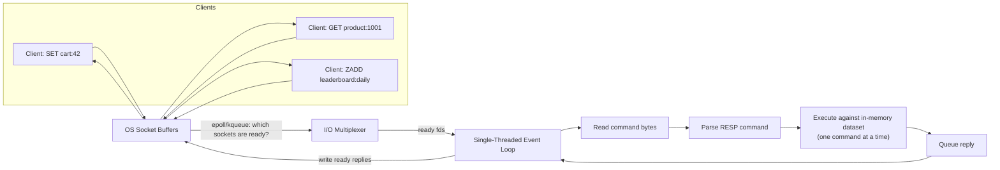
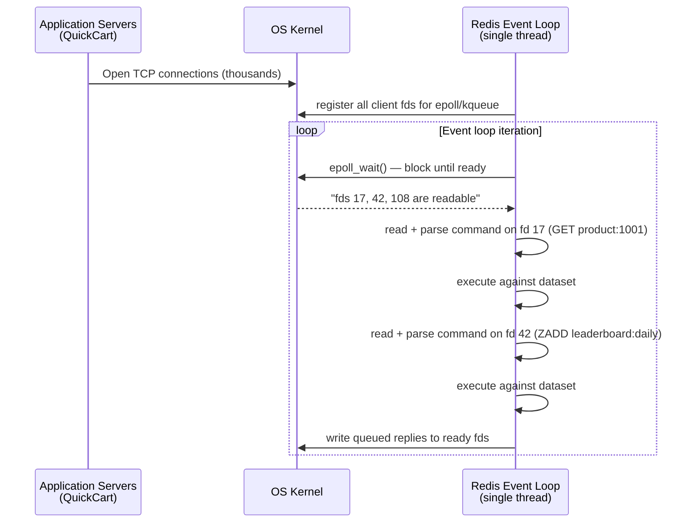
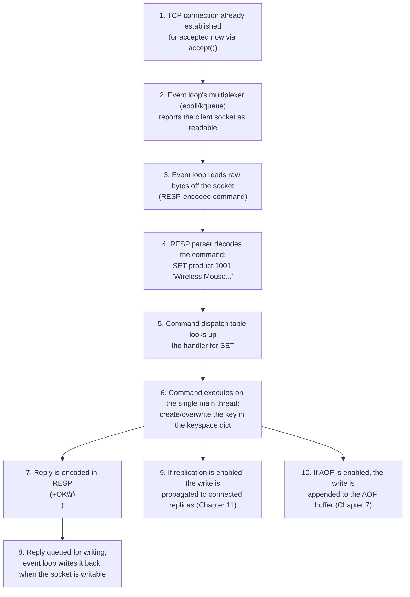

# Chapter 3: Architecture & Internals

Chapter 1 told you what Redis is and why teams reach for it. Chapter 2 gave you the vocabulary — keys, values, the keyspace, data types, `redis-cli` — using QuickCart, our running e-commerce example, to make it concrete: `session:{userId}` for logins, `product:{sku}` for catalog data, `cart:{userId}` for shopping carts, a `leaderboard:daily` sorted set for gamified deals, `ratelimit:{userId}:{endpoint}` counters, an `orders:events` stream, a `notifications:{userId}` pub/sub channel, and a `stores:locations` geo index.

This chapter answers a different question: **why does Redis behave the way it does?** Why is a single `KEYS *` call on a production instance a genuine incident, while a `GET` is safe to fire thousands of times a second? Why does memory usage briefly spike during a backup? Why do people say "Redis is single-threaded" and then, in the same breath, mention I/O threads? None of this is trivia — every operational decision from Chapter 4 onward (which command to use, how to size an instance, what to alert on) rests on the internals covered here. Skimming this chapter is the single most common reason engineers get surprised by Redis in production.

---

## Learning Objectives

By the end of this chapter, you will be able to:

- Explain why Redis processes commands on a single thread using an event loop, and why that is a deliberate design choice rather than a limitation to work around.
- Describe how I/O multiplexing (the reactor pattern, `epoll`/`kqueue`) lets one thread serve thousands of concurrent client connections.
- Identify exactly where multi-threading exists in modern Redis (I/O threads, lazy-freeing) and why command execution itself stays single-threaded.
- Explain Redis's in-memory storage model, the role of the `jemalloc` allocator, and why small values can carry disproportionately large per-key overhead.
- Recognize which commands are dangerous to run on a busy production instance, and why, in terms of the single-threaded model.
- Explain how `fork()` and copy-on-write let `BGSAVE`/AOF rewrite snapshot memory without blocking clients — and the memory-sizing implication of that mechanism.
- Describe RESP (the Redis Serialization Protocol) and the practical difference between RESP2 and RESP3.

---

## Prerequisites

This chapter builds directly on:

- [Chapter 1: Introduction & Prerequisites](./01-introduction-and-prerequisites.md) — what Redis is, in-memory vs. disk-based stores, installation.
- [Chapter 2: Core Concepts](./02-core-concepts.md) — keys, values, the keyspace, data type overview, `redis-cli` basics, and the QuickCart running example used throughout this course.

You should be comfortable running `redis-cli` against a local instance and issuing basic commands like `SET`, `GET`, and `INFO`. No new tooling is required for this chapter — everything here is conceptual, with hands-on verification at the end.

---

## 1. The Single-Threaded Event Loop

### 1.1 The claim, precisely stated

Redis's core command execution — the part that reads your command, looks up or mutates a key, and writes a reply — runs on a **single thread**, processing one command to completion before starting the next. There is no interleaving of two `SET` commands on two different keys at the CPU-instruction level; command A finishes entirely before command B begins.

This surprises people coming from multi-threaded systems (a typical web server, a relational database with a thread- or process-per-connection model), where "handle more load" usually means "add more threads." Redis's answer is different, and it's worth understanding *why* before you learn *what*.

### 1.2 What an event loop actually does

A naive server might dedicate one OS thread per client connection, blocking that thread on a `read()` call until data arrives. This works, but doesn't scale past a few thousand connections — each thread costs memory (a stack, kernel bookkeeping) and every context switch between threads costs real CPU cycles.

Redis instead uses a **single-threaded event loop** built around **I/O multiplexing**: one thread asks the operating system, "of these thousands of sockets, which ones actually have data ready right now?" and only touches the sockets that are ready. Everything else — waiting — is delegated to the kernel, for free, without spinning up a thread per connection.

At a high level, the loop looks like this:

1. Ask the OS which of the registered file descriptors (client sockets) are readable or writable.
2. For each ready socket, read the pending command bytes.
3. Parse and execute each command against the in-memory dataset.
4. Queue the reply for writing back to the client.
5. Flush queued writes to sockets that are ready to accept them.
6. Handle any due timer events (e.g., expiring keys).
7. Repeat.



### 1.3 Why this is a feature, not a limitation

Three concrete benefits fall directly out of single-threaded execution, and none of them are hand-waving:

- **No locking overhead.** In a multi-threaded database, every data structure that could be touched by two threads at once needs a mutex or some other synchronization primitive, and every lock acquisition costs cycles even when there's no contention. Redis's core data structures need zero internal locks, because only one thread ever touches them.
- **No context-switch overhead for command execution.** The OS doesn't need to preempt and reschedule the command-processing thread mid-command. The CPU cache stays "hot" for the data structure being worked on, instead of being invalidated by a switch to an unrelated thread's working set.
- **Atomicity of individual commands is free.** Because a `SADD`, `HINCRBY`, or `ZADD` runs start-to-finish with no other command interleaved, every single Redis command is inherently atomic with respect to other commands — you get this property automatically, without any explicit locking in your application code. This is *exactly* the property that makes Redis useful for counters, rate limiters (QuickCart's `ratelimit:{userId}:{endpoint}` keys), and leaderboards (`leaderboard:daily`): `INCR` and `ZINCRBY` can be called concurrently from many clients and never race against each other, because "many clients" is an illusion the event loop maintains one command at a time underneath.

Given that Redis operations are typically sub-microsecond to low-microsecond CPU-bound work (in-memory hash lookups, skip-list traversals), the overhead a multi-threaded design would add — locking, cache invalidation, scheduling — would often cost *more* than the work itself. Single-threading isn't a compromise Redis accepts despite wanting to be faster; for its workload shape, it's how Redis *is* fast.

---

## 2. I/O Multiplexing in Depth: The Reactor Pattern

### 2.1 The problem: thousands of sockets, one thread

QuickCart's storefront might have tens of thousands of concurrent connections into Redis at peak (application servers, background workers, the checkout service reading `cart:{userId}`, the notification service publishing to `notifications:{userId}`). If the event-loop thread tried to check every single socket for data in a plain loop (`for each socket: try to read`), most of that work would be wasted — the vast majority of sockets are idle at any given instant, and checking each one is a system call with real cost.

### 2.2 The reactor pattern

Redis solves this with the **reactor pattern**, implemented in Redis's `ae` (async event) library, which wraps whatever the best multiplexing syscall is on the host OS:

- **`epoll`** on Linux (the common production case)
- **`kqueue`** on BSD/macOS
- **`select`** as a portable fallback (rarely used in production due to its O(n) scaling)

The pattern works like this: instead of the application asking the kernel about each socket individually, the application registers *all* sockets of interest with the kernel once, along with what it cares about (readable, writable). Then it makes a single call — `epoll_wait()`, for example — that **blocks until at least one registered socket is ready**, and returns exactly the list of ready sockets. This turns "check 20,000 sockets" into "the kernel tells me the 3 that actually matter right now," which is what lets one thread scale to a very large number of connections without wasting CPU polling idle ones.



### 2.3 Non-blocking sockets

For this to work, every client socket is set to **non-blocking** mode. A blocking `read()` call on an idle socket would freeze the entire event loop thread — with thousands of connections, that's fatal to the model. Non-blocking sockets return immediately (with "no data yet" or "buffer full") instead of waiting, so the event loop only ever spends time on sockets the kernel has already confirmed are ready, and never sits idle inside a syscall waiting on one connection while others go unserved.

This is the mechanical reason a single Redis thread can hold open tens of thousands of client connections — the classic "C10K problem" — while still executing commands quickly: the loop never blocks waiting on network I/O, only briefly on CPU-bound command execution, which is normally very fast.

---

## 3. Where Multi-Threading Actually Exists (Redis 6+)

"Redis is single-threaded" is a useful simplification, but it's not the complete picture since Redis 4 (lazy freeing) and especially Redis 6 (I/O threads). It's worth being precise, because interview questions and production tuning decisions both hinge on getting this right.

### 3.1 Command execution: still single-threaded

This is the part that does **not** change: reading a command's *semantics*, looking up or mutating the keyspace, and computing the reply is still done by exactly one thread, in isolation, with the atomicity guarantees described in Section 1. No version of Redis parallelizes the execution of two commands against the shared dataset. This is the guarantee your application logic (and every "Redis command is atomic" assumption you'll make in later chapters) actually depends on.

### 3.2 I/O threads (Redis 6+)

What *did* change starting in Redis 6 is **who does the socket reading and writing**. Parsing raw bytes off the network into a command, and serializing a reply back into bytes to write to the socket, is comparatively mechanical work that doesn't need to touch the shared dataset. Redis 6 introduced optional **I/O threads** (`io-threads` in `redis.conf`) that can perform this socket read/write and RESP parsing/encoding work in parallel across multiple threads, while the actual command execution against the dataset is still handed off to, and completed by, the single main thread.

In other words: multiple threads can now be reading bytes off multiple sockets and parsing them into commands *at the same time*, and multiple threads can be serializing and flushing replies *at the same time* — but the moment a command needs to touch the actual data (increment a counter, push to a list, look up a hash field), that step is serialized back onto the single main thread. This raises the ceiling on network-bound throughput (many small commands, many connections) without touching the atomicity guarantee that makes Redis commands safe to use as building blocks.

### 3.3 Background threads for lazy freeing

The other place Redis uses real OS threads is for **lazy freeing** of memory. Deleting a very large key (a hash with millions of fields, say) means freeing potentially millions of small memory allocations. If the main thread did that synchronously, it would block every other client for the duration — the exact problem Section 5 covers in general. Since Redis 4, `UNLINK` (and, optionally, expiry- and eviction-driven deletes, controlled by `lazyfree-lazy-*` config directives) hands the actual freeing work off to a **background thread**, so the main thread only has to unlink the key from the keyspace (a fast, constant-time operation) and can move on to the next command immediately, while the memory is actually reclaimed asynchronously.

### 3.4 Summary of the threading model

| Component | Threaded? | What it does |
|---|---|---|
| Command execution (reading/writing the dataset) | No — single thread | Guarantees per-command atomicity; the core guarantee your app relies on |
| Socket I/O and RESP parsing/encoding (Redis 6+) | Optionally multi-threaded | Reads/writes bytes on the wire faster under many-connection, network-bound workloads |
| Lazy freeing (`UNLINK`, expired/evicted big keys) | Background thread(s) | Frees memory for large deleted objects without blocking the main thread |
| `BGSAVE` / AOF rewrite | Separate forked process (Section 6) | Snapshots memory to disk without blocking the main thread |

The mental model to keep: **Redis parallelizes the "plumbing" (network I/O, deferred memory reclamation, background persistence) but never the actual mutation of your data.** That's what preserves the single-threaded atomicity guarantee while still letting Redis scale on modern multi-core hardware.

---

## 4. Memory Architecture

### 4.1 Everything lives in RAM

Redis's defining performance trait is that reads and writes operate on data resident in RAM, not on disk — there's no page cache miss, no disk seek, no B-tree traversal to a leaf page. This is *why* a `GET` or `HSET` on QuickCart's `product:{sku}` hash completes in microseconds rather than milliseconds. Persistence to disk (RDB, AOF — Chapter 7) is a deliberate, separate concern layered on top of this in-memory model, not the primary read/write path.

### 4.2 The allocator: `jemalloc`

Redis doesn't call the operating system's default `malloc`/`free` for every allocation. By default (on Linux), Redis links against **jemalloc**, a memory allocator originally developed for FreeBSD and later hardened at Facebook, chosen specifically because it:

- Reduces memory fragmentation better than the glibc allocator under Redis's allocation patterns (many small, short- and long-lived objects of varying sizes).
- Groups allocations into size classes, so objects of similar size share pools, which improves both allocation speed and memory locality.
- Exposes rich introspection — `INFO memory` reports `mem_allocator` and jemalloc-specific stats like `mem_fragmentation_ratio`, which you'll use operationally in Chapter 9 and Chapter 13.

You can confirm which allocator a running instance uses:

```bash
redis-cli INFO memory | grep mem_allocator
# mem_allocator:jemalloc-5.3.0
```

### 4.3 Why small keys can have large overhead

A beginner's mental model — "a string `"42"` costs 2 bytes" — is wrong in a way that matters for capacity planning. Every key-value pair in Redis carries structural overhead well beyond the bytes of the value itself:

- The key itself is stored as a Redis string object, with its own small header (type, encoding, refcount, length metadata).
- The value is wrapped in a `robj` (Redis object) structure carrying type and encoding information.
- The dictionary entry that maps the key to the value has pointer overhead (typically 3 pointers per entry on a 64-bit system: key, value, next-in-bucket).
- If the key has a TTL, there's additional bookkeeping in the expiry dictionary.

In practice, a single tiny key-value pair (a short string counter, for instance) can carry on the order of 50-90+ bytes of pure overhead on a 64-bit build, *before* counting the actual payload. This is exactly why storing millions of individual small keys (imagine one key per QuickCart cart line-item instead of one hash per cart) can consume dramatically more memory than the "logical" data size would suggest — the overhead, multiplied by millions, dominates.

### 4.4 Compact encodings and `OBJECT ENCODING`

Redis mitigates this by giving small collections a **compact, non-pointer-heavy internal encoding** when they're small enough that the usual hash-table/skip-list/linked-list representation would waste more memory on overhead than it saves on lookup speed. Instead of an array of pointers to separately-allocated objects, small collections are packed as one contiguous, serialized blob (a `listpack`, the modern successor to the older `ziplist`), and Redis falls back to the "full" pointer-based structure only once the collection grows past a configurable threshold.

You can (and, professionally, should) inspect a key's actual internal representation with `OBJECT ENCODING`:

```bash
127.0.0.1:6379> HSET product:1001 name "Wireless Mouse" price 1999 stock 42
(integer) 3
127.0.0.1:6379> OBJECT ENCODING product:1001
"listpack"

127.0.0.1:6379> SADD product:1001:tags electronics accessories wireless
(integer) 3
127.0.0.1:6379> OBJECT ENCODING product:1001:tags
"listpack"

127.0.0.1:6379> ZADD leaderboard:daily 4500 "user:701" 3200 "user:552"
(integer) 2
127.0.0.1:6379> OBJECT ENCODING leaderboard:daily
"listpack"
```

If QuickCart's `product:1001` hash grows past `hash-max-listpack-entries` (default 128) or a field exceeds `hash-max-listpack-value` (default 64 bytes), Redis transparently converts it to `hashtable` encoding — still correct, but with the fuller per-entry pointer overhead described above. The same pattern applies to sets (`listpack`/`intset` → `hashtable`), sorted sets (`listpack` → `skiplist`), and lists (`listpack` → `quicklist`). Knowing which encoding a hot key is using is a real, actionable lever for memory-sensitive designs — a topic Chapter 9 develops fully.

---

## 5. The Danger of Blocking Commands

This section is where Sections 1-3 stop being trivia and start being an operational hazard you must respect.

### 5.1 Why a "slow" command isn't just slow for one client

Because command execution is single-threaded (Section 1, Section 3.1), **every command shares the same thread**. If one command takes 500ms to execute, every other client — regardless of how simple their own command is — waits behind it. There is no preemption inside command execution: Redis doesn't pause a long-running `SORT` halfway through to let a waiting `GET` jump the queue. The event loop is, from the perspective of any other client, entirely occupied for the full duration of that one slow command.

This is the single most important operational fact in this chapter: **on Redis, "slow for me" always means "slow for everyone," because there is only one lane.**

### 5.2 The usual suspects

- **`KEYS *`** (or `KEYS pattern*`) — scans the *entire* keyspace in one call, O(N) in the total number of keys, and returns them all at once. On an instance with millions of keys, this can take seconds, during which no other client gets served.
- **`FLUSHALL` / `FLUSHDB`** — synchronously (by default) walks and frees every key in the dataset before returning; on a large dataset, this is a long, fully blocking operation (mitigated somewhat by the `ASYNC` option, which defers freeing to a background thread per Section 3.3, but the keyspace-clearing itself still blocks briefly).
- **A huge `SORT`** (or `SORT` with `BY`/`GET` patterns against large lists) — O(N log N) against the full collection, computed synchronously.
- **Large aggregate operations in general** — `SMEMBERS`/`HGETALL`/`LRANGE 0 -1` on a genuinely huge collection, `SUNION`/`SINTER` across large sets, or any command whose complexity is documented as O(N) or worse where N is the size of a large collection rather than the number of items you actually need.

### 5.3 The right instinct: incremental, cursor-based access

The general fix is to replace "give me everything in one blocking call" with "give me a small slice, and let me ask again." Redis's `SCAN` family (`SCAN`, `HSCAN`, `SSCAN`, `ZSCAN`) does exactly this: each call does a small, bounded amount of work and returns a cursor to resume from, so the cost of iterating a huge keyspace or collection is spread across many cheap calls instead of concentrated into one expensive one — none of which individually blocks the event loop for long. Section 8 (the Real-World Scenario) walks through exactly this trade-off with a concrete QuickCart incident.

---

## 6. Fork-Based Persistence Mechanics

### 6.1 The problem persistence has to solve

`BGSAVE` (which produces an RDB snapshot — Chapter 7) needs to write a **consistent, point-in-time copy** of the entire in-memory dataset to disk. But the dataset can be many gigabytes, disk I/O is slow relative to memory operations, and — per everything above — the main thread cannot simply pause serving clients for however long that write takes. AOF rewrite (which compacts the append-only log) faces the identical structural problem: it needs a consistent view of the dataset to rebuild a compact log from, without stopping the world.

### 6.2 The solution: `fork()` and copy-on-write

Redis solves this using the POSIX `fork()` system call. When `BGSAVE` (or a background AOF rewrite) starts:

1. The main process calls `fork()`, which creates a **child process** that is, at the instant of creation, an exact duplicate of the parent — same memory contents, same file descriptors.
2. Critically, `fork()` does **not** physically copy the parent's memory pages. Both parent and child initially share the *same physical memory pages*, marked copy-on-write (COW) by the OS's virtual memory system. This is why fork itself is fast even for a large dataset.
3. The **child process** walks its (frozen, as far as it's concerned) view of memory and writes it out to the RDB file (or rewritten AOF) on disk, entirely independently of the parent.
4. Meanwhile, the **parent process** (the main Redis thread) keeps right on serving client commands — `SET`, `GET`, `ZADD` on QuickCart's live traffic — completely unblocked.
5. Whenever the parent needs to *modify* a page that both processes still share, the kernel intercepts the write, copies that one page for the parent, and lets the write proceed. The child continues to see the original, unmodified page — exactly the consistent snapshot it needs, page by page, without anyone doing a bulk upfront copy.

```mermaid
sequenceDiagram
    participant Client as QuickCart Clients
    participant Main as Main Redis Process
    participant Kernel as OS Kernel (COW)
    participant Child as Forked Child Process
    participant Disk as RDB File on Disk

    Client->>Main: SET, GET, ZADD (live traffic)
    Main->>Kernel: fork()
    Kernel-->>Main: returns immediately (pages shared, not copied)
    Kernel-->>Child: child starts with same shared pages

    par Parent keeps serving
        Client->>Main: more writes (e.g. HSET cart:42 ...)
        Main->>Kernel: write to page X
        Kernel->>Kernel: copy-on-write: duplicate page X for parent
        Kernel-->>Main: parent's copy updated; child's original page X untouched
    and Child snapshots memory
        Child->>Child: walk snapshot view of dataset
        Child->>Disk: write RDB snapshot
    end

    Child-->>Main: exits when snapshot complete
    Disk-->>Main: RDB file now durable on disk
```

### 6.3 The practical implication: memory can spike

Copy-on-write is efficient, but it is not free, and this is the part every capacity plan needs to account for. If the workload is write-heavy while a fork is in progress, every page the parent modifies during that window gets duplicated — one copy for the parent's live, mutating view, one copy (unmodified) still referenced by the child for its snapshot. On a sufficiently busy write workload with a long-running fork (large dataset, slow disk), enough pages can end up duplicated that **resident memory usage approaches roughly double the dataset's normal footprint** for the duration of the fork.

This is precisely why sizing a Redis instance at, say, 90% of available RAM under normal load is dangerous: the moment `BGSAVE` (or AOF rewrite, or a full sync to a new replica, which uses the same mechanism) kicks off during a busy period, copy-on-write growth can push the process into swap or trigger the OOM killer, taking the *entire* instance down — not just the backup. Chapter 9 (memory management) and Chapter 13 (performance tuning) return to this as a concrete sizing rule: leave meaningful headroom specifically for fork-time COW growth, not just for the dataset itself.

---

## 7. Client-Server Protocol: RESP

### 7.1 What RESP is

Every command you send to Redis and every reply you get back is encoded using **RESP**, the **RE**dis **S**erialization **P**rotocol — a simple, text-based (with binary-safe strings), line-oriented wire protocol. It's deliberately simple to parse (both to write and to read) rather than optimized for minimal byte count, which is a reasonable trade-off given how cheap the CPU-bound parsing step is relative to the win of having every client library be trivial to implement correctly.

A command like `SET product:1001 "Wireless Mouse"` is sent over the wire as a RESP array of bulk strings, roughly:

```
*3
$3
SET
$12
product:1001
$14
Wireless Mouse
```

`*3` says "array of 3 elements," and each `$N` announces the byte length of the bulk string that follows — which is what makes the protocol binary-safe (values can contain any bytes, including newlines, because the length is explicit rather than inferred from a terminator).

### 7.2 RESP2 vs. RESP3

**RESP2** has been Redis's protocol since very early versions and remains the default that every client library must support. It has a small set of reply types: simple strings, errors, integers, bulk strings, and arrays — everything else (maps, sets, booleans) has to be represented as one of those, by convention, which leaves some ambiguity for client libraries to work around.

**RESP3**, introduced alongside Redis 6, adds richer, more precisely-typed replies — dedicated types for maps, sets, doubles, booleans, big numbers, verbatim strings, and push messages (used for features like client-side caching invalidation and keyspace notifications delivered without a separate polling connection). A client opts into RESP3 with the `HELLO 3` command during connection setup; if it doesn't, the connection stays on RESP2 for full backward compatibility. In practice, you rarely hand-manage this — modern client libraries negotiate the protocol version for you — but knowing RESP3 exists explains why some newer client library APIs can return, say, a native `dict` or `set` object directly from a Redis reply instead of an array you have to reinterpret yourself.

---

## 8. Putting It Together: The Life of a `SET` Command

Let's trace exactly what happens, end to end, when a QuickCart application server issues:

```
SET product:1001 "Wireless Mouse - Ergonomic, 2.4GHz"
```



1. **Connection accept.** If this is a new client, the main thread's `accept()` call (itself just another event the multiplexer reports) establishes the TCP connection and registers the new socket with the event loop for future read/write readiness events.
2. **Event loop dispatch.** On a subsequent iteration, `epoll`/`kqueue` reports that this client's socket has data to read (Section 2).
3. **Read and parse.** The event loop reads the pending bytes and the RESP parser (Section 7) decodes them into a structured command: `SET`, with arguments `product:1001` and the description string.
4. **Command execution.** The single main thread (Section 1, Section 3.1) looks up the command handler for `SET`, and executes it directly against the in-memory keyspace: it creates (or overwrites) the `product:1001` key, allocating memory via jemalloc (Section 4) and choosing an appropriate internal encoding for the string value.
5. **Response encoding.** The handler produces a simple `+OK\r\n` RESP reply, which is queued for the client's socket.
6. **Write-back.** On a later event loop iteration (often the same one, if the socket is immediately writable), the reply bytes are flushed back to the client.
7. **Replication propagation (teaser for Chapter 11).** If this Redis instance has connected replicas, the write is also propagated down the replication stream so replicas apply the identical `SET` and stay consistent with the leader — asynchronously, without the original client waiting for replica acknowledgment unless `WAIT` is explicitly used.
8. **AOF logging (teaser for Chapter 7).** If AOF persistence is enabled, the command is also appended to the AOF buffer, to be flushed to disk according to the configured `fsync` policy, so the write survives a restart even without a full RDB snapshot.

Notice how much of this end-to-end path traces directly back to the concepts in this chapter: the event loop and multiplexing made steps 1-2 and 6 possible without a thread per connection; single-threaded execution made step 4 atomic and lock-free; the allocator and encoding choices from Section 4 determined exactly how that key is stored in memory; and RESP (Section 7) is the wire format for every byte exchanged in steps 3 and 6.

---

## Real-World Scenario: The Black Friday `KEYS` Incident

**Setup:** It's Black Friday. QuickCart's traffic is at its yearly peak — checkout flows hammering `cart:{userId}` hashes, the leaderboard for a flash-sale gamification event updating `leaderboard:daily` on every purchase, rate limiters ticking away on `ratelimit:{userId}:{endpoint}`. A junior engineer needs to find every product key matching a promotional prefix for a one-off reporting script, and reaches for the obvious-looking command:

```
KEYS product:promo:*
```

against the production instance, which by this point holds several million keys across all of QuickCart's key patterns.

**What happens, mechanically:**

- `KEYS` is O(N) in the *total number of keys in the keyspace* — it has to walk the entire keyspace dictionary, not just the keys matching the pattern, to find the matches. With several million keys, this single command can easily take multiple seconds of continuous CPU-bound work.
- Because command execution is single-threaded (Section 1, Section 5), that multi-second `KEYS` call **occupies the only lane** every other command travels through. It is not merely "slow for the reporting script" — it is a full-stop for the entire instance.
- Every checkout trying to read or update `cart:{userId}`, every rate-limiter check on `ratelimit:{userId}:{endpoint}`, every leaderboard update on `leaderboard:daily`, and every session lookup on `session:{userId}` queues up behind it, because the event loop cannot get to them until the `KEYS` command finishes and control returns to the loop.
- From the outside, this looks exactly like a site-wide outage: checkout latency spikes into the multi-second range for every single concurrent user, precisely during the highest-value traffic window of the year — not because Redis is "overloaded" in any capacity sense (CPU and memory were both comfortably provisioned), but because one single blocking call monopolized the one thread everything else depends on.

**What they should have done:**

- Use **`SCAN`** with a `MATCH` pattern instead: `SCAN 0 MATCH product:promo:* COUNT 100`, then repeat with the returned cursor until it comes back as `0`. Each individual `SCAN` call does a small, bounded amount of work and returns quickly, so it interleaves cheaply with every other client's commands on the event loop instead of blocking it outright.
- Run the reporting script during a lower-traffic window regardless, and rate-limit its own request rate against production — bounded-cost commands are still commands, and thousands of tiny `SCAN` calls in a tight loop with no pacing can still add meaningful load.
- More structurally: if this kind of "find all keys matching a pattern" query is a recurring business need (not a one-off), that's a signal to maintain an explicit index (e.g., a Redis **set** of promo SKUs, updated incrementally whenever a promo key is created) rather than relying on pattern-scanning the entire keyspace at all — `SCAN` is safe, but it's still not a substitute for a real index when the same query runs often.
- For visibility going forward: enable **slow log** monitoring (`SLOWLOG GET`, covered in Chapter 13) so a command like this gets flagged and alerted on the moment it's issued anywhere, rather than being discovered only after the incident.

The root cause, in one sentence: a command whose cost scales with the *total* keyspace size was run synchronously on the single thread everything else depends on, during the one week of the year when that thread could least afford to be monopolized.

---

## Best Practices

- **Never run `KEYS`, `FLUSHALL`/`FLUSHDB` (without `ASYNC`), or unbounded `SORT`/`SMEMBERS`/`HGETALL`/`LRANGE` against large collections in production.** Use the `SCAN` family, bounded ranges, and pagination instead — see Section 5 and the scenario above.
- **Monitor memory and fork behavior proactively**, not just after an incident: watch `INFO memory`'s `mem_fragmentation_ratio` and `used_memory`, and `INFO persistence`'s `rdb_bgsave_in_progress`, `aof_rewrite_in_progress`, and `latest_fork_usec` to see how long recent forks took and correlate that with any observed latency spikes.
- **Leave real memory headroom for copy-on-write growth**, not just for the dataset's own footprint — size instances assuming a busy `BGSAVE`/AOF-rewrite/full-sync can transiently approach ~2x memory usage (Section 6.3), especially under write-heavy load.
- **Check `OBJECT ENCODING` on your hot, memory-sensitive keys** (large hashes, sets, sorted sets, lists) so you know whether they're in a compact encoding or have crossed into the full pointer-based representation — and tune `hash-max-listpack-entries` and siblings deliberately, rather than being surprised by a memory jump when a collection crosses a threshold.
- **Treat the single-threaded model as a hard constraint when writing application-side Redis calls**, not just a piece of trivia — every command you issue, no matter how small, is queued behind whatever else is running; batch and pipeline (Chapter 10) rather than issuing many tiny round-trips where one bigger, bounded call would do.

---

## Common Mistakes

- **Running expensive O(N) commands against large production collections** — `KEYS`, unbounded `SMEMBERS`/`HGETALL`/`LRANGE`, `SORT` on a huge list — because they "work fine" against a small local dataset and the cost only becomes visible once the collection is large enough to matter, usually in production, usually at the worst time (see the Real-World Scenario).
- **Assuming Redis is "just multi-threaded like everything else."** Redis 6+'s I/O threads make this an easy trap: engineers see `io-threads` in the config and conclude command execution itself is parallel, then write application logic that assumes two commands touching related keys can't race each other in ways single-threaded atomicity would otherwise prevent — or, in the other direction, assume adding more `io-threads` will speed up CPU-bound command execution, when it only helps with network I/O throughput (Section 3.2).
- **Ignoring fork memory overhead when sizing instances**, then getting paged when `BGSAVE` (or a new replica's full sync) triggers an OOM kill during a traffic spike — the dataset fit comfortably in RAM under normal conditions, but nobody budgeted for the copy-on-write growth described in Section 6.3.
- **Treating `OBJECT ENCODING` as a curiosity instead of an operational signal.** A hash that silently crossed from `listpack` to `hashtable` because a script pushed one field over `hash-max-listpack-value` can multiply that key's memory footprint without any alert firing unless someone is actually watching encoding and memory metrics.
- **Confusing "in-memory" with "unlimited and free."** Because reads and writes are fast, it's easy to forget that RAM is also the most expensive and most finite resource in the deployment, and that per-key structural overhead (Section 4.3) means a naive schema (millions of tiny individual keys) can cost far more memory than a smarter one (a smaller number of hashes) holding the identical logical data.

---

## Summary

- Redis executes commands on a **single thread**, using an **event loop** built on OS-level I/O multiplexing (`epoll`/`kqueue`) — a deliberate design that trades away multi-core parallelism for zero locking overhead, zero context-switch overhead, and free per-command atomicity.
- The **reactor pattern** with **non-blocking sockets** is what lets that one thread serve thousands of concurrent client connections without wasting CPU polling idle ones.
- Since Redis 6, **I/O threads** parallelize socket reading/writing and RESP parsing/encoding, and **background threads** (since Redis 4) handle lazy freeing of large deleted keys — but **command execution against the dataset itself remains single-threaded** in every version.
- Data lives in **RAM**, managed by the **jemalloc** allocator; every key carries real structural overhead beyond its logical payload, which is why Redis uses compact encodings (`listpack`, formerly `ziplist`) for small collections — inspectable via `OBJECT ENCODING`.
- **Blocking commands** (`KEYS`, unbounded `SORT`/`SMEMBERS`/`HGETALL`, `FLUSHALL` without `ASYNC`) stall the *entire* instance, not just the caller, because there is only one execution lane — use `SCAN`-family commands instead.
- `BGSAVE` and AOF rewrite use **`fork()` and copy-on-write** to snapshot memory without blocking the main thread — at the cost of potential memory usage approaching ~2x the dataset size during a busy fork.
- **RESP** is the wire protocol for every client-server interaction; **RESP3** (Redis 6+) adds richer typed replies (maps, sets, doubles, push messages) over RESP2's smaller type set, negotiated via `HELLO 3`.
- A single `SET` traces through connection accept, event-loop dispatch, RESP parsing, single-threaded execution, RESP-encoded reply, and (when enabled) AOF logging and replication propagation — every stage shaped by the internals covered in this chapter.

---

## Knowledge Check

1. Explain, in your own words, why Redis's single-threaded design is described as a deliberate choice rather than a limitation. Name the three specific benefits this chapter attributes to it.
2. What is the reactor pattern, and what specific problem does it solve that a naive "one thread per connection, blocking `read()`" design would not?
3. A colleague says, "Redis 6 added multi-threading, so two `INCR` commands on different keys can now run truly in parallel." Is this correct? What exactly did Redis 6 make multi-threaded, and what did it deliberately leave single-threaded?
4. Why can a hash containing three small fields report `OBJECT ENCODING` of `listpack`, but the same hash report `hashtable` once it grows past a certain size? What's the operational reason Redis makes this switch instead of always using one representation?
5. Explain, step by step, how `fork()` and copy-on-write let `BGSAVE` produce a consistent snapshot without stopping the main thread from serving clients — and why a busy write workload can cause memory usage to spike during that snapshot.
6. Why is `KEYS *` dangerous on a large production dataset, but `SCAN` with the same matching pattern is considered safe? What specifically does `SCAN` do differently?
7. What is RESP, and what is the practical difference between RESP2 and RESP3 that would show up in how a modern client library returns a `HGETALL` reply to your application code?
8. Trace, from memory, the roughly eight steps that happen between a QuickCart application server calling `SET product:1001 "..."` and that server receiving `+OK` back.

---

## Hands-On Exercise

You'll need a local Redis instance (from Chapter 1's installation) and `redis-cli`. This exercise reuses QuickCart's key patterns so the data feels connected to the rest of the course.

**Step 1 — Populate some QuickCart-style test data.**

```bash
# A handful of product hashes (small — should stay compact)
for i in $(seq 1001 1010); do
  redis-cli HSET product:$i name "Product $i" price $((1000 + i)) stock $((i % 50)) > /dev/null
done

# A cart with several line items
redis-cli HSET cart:42 product:1001 2 product:1004 1 product:1007 3

# A larger sorted set to simulate the daily leaderboard
for i in $(seq 1 200); do
  redis-cli ZADD leaderboard:daily $((RANDOM % 5000)) "user:$i" > /dev/null
done

# A deliberately large hash to force an encoding conversion
for i in $(seq 1 200); do
  redis-cli HSET product:9999:reviews review:$i "Great product, would buy again! Review number $i with some extra padding text." > /dev/null
done
```

**Step 2 — Inspect encodings with `OBJECT ENCODING`.**

```bash
redis-cli OBJECT ENCODING product:1001        # expect: listpack
redis-cli OBJECT ENCODING cart:42             # expect: listpack
redis-cli OBJECT ENCODING leaderboard:daily   # expect: skiplist (200 entries exceeds the listpack threshold)
redis-cli OBJECT ENCODING product:9999:reviews  # expect: hashtable (large field values push it over hash-max-listpack-value)
```

Explain, in a sentence each, why `product:1001` and `cart:42` stayed compact while `leaderboard:daily` and `product:9999:reviews` converted to their fuller representations. (Hint: revisit Section 4.4 and check `CONFIG GET hash-max-listpack-*` and `CONFIG GET zset-max-listpack-*` against what you just populated.)

**Step 3 — Find your biggest keys with `redis-cli --bigkeys`.**

```bash
redis-cli --bigkeys
```

Read the summary output: it samples the keyspace and reports the largest key found per data type, plus averages. Identify which key it flags as the largest hash — it should be `product:9999:reviews` (or close to it, if you populated other large test keys). Note that `--bigkeys` itself is implemented using `SCAN` internally, not `KEYS` — which is exactly why it's safe to run against a live instance, unlike a naive "get every key and check its size" script would be.

**Step 4 — Check overall memory behavior with `INFO memory`.**

```bash
redis-cli INFO memory
```

Find and record these three fields:

- `used_memory_human` — total memory Redis believes it's using for the dataset and overhead.
- `mem_allocator` — confirm it says `jemalloc` (Section 4.2).
- `mem_fragmentation_ratio` — a value near 1.0 means allocated-vs-used memory is efficient; a much higher value indicates fragmentation worth investigating (a topic Chapter 9 covers in depth).

**Step 5 — Trigger a fork and watch it happen live.**

In one terminal, start a `BGSAVE` and immediately check its status:

```bash
redis-cli BGSAVE
redis-cli INFO persistence | grep -E "rdb_bgsave_in_progress|rdb_last_bgsave_status|latest_fork_usec"
```

`latest_fork_usec` reports how long the actual `fork()` call took, in microseconds, for your (small, local) dataset — on a multi-gigabyte production dataset, this number and the subsequent copy-on-write growth are exactly what Section 6.3 asks you to budget memory headroom for.

**Reflection:** Based on what `--bigkeys` and `OBJECT ENCODING` showed you, which of QuickCart's key patterns from Chapter 2 (`session:{userId}`, `product:{sku}`, `cart:{userId}`, `leaderboard:daily`, `ratelimit:{userId}:{endpoint}`) would you expect to need the closest ongoing attention to encoding thresholds as the site scales to millions of users — and why?

---

## Further Reading

- Redis official docs — ["Redis administration"](https://redis.io/docs/latest/operate/oss_and_stack/management/admin/) and the command reference pages for `KEYS`, `SCAN`, `OBJECT ENCODING`, and `BGSAVE`, for authoritative, version-specific detail beyond this chapter's conceptual treatment.
- Redis official docs — ["Redis persistence"](https://redis.io/docs/latest/operate/oss_and_stack/management/persistence/), which formalizes the fork/copy-on-write mechanics previewed in Section 6; full depth arrives in Chapter 7.
- Redis official docs — [RESP protocol specification](https://redis.io/docs/latest/develop/reference/protocol-spec/), for the complete byte-level grammar of RESP2 and RESP3.
- Redis official docs — ["Redis configuration" (`redis.conf`) reference](https://redis.io/docs/latest/operate/oss_and_stack/management/config/), particularly the `io-threads`, `lazyfree-lazy-*`, and `*-max-listpack-*` directives referenced in this chapter.
- Salvatore Sanfilippo (Redis's creator) — various blog posts and conference talks on Redis internals and the design rationale for the single-threaded model, useful for the historical "why," not just the current "how."
- jemalloc project documentation — for readers who want to go deeper on allocator internals than Section 4.2's summary.

---

<div style="display:flex;justify-content:space-between;align-items:center;">
  <a href="./02-core-concepts.md">← Previous: Core Concepts</a>
  <a href="./00-index.md">🏠 Index</a>
  <a href="./04-strings-lists-and-hashes.md">Next: Strings, Lists & Hashes →</a>
</div>
