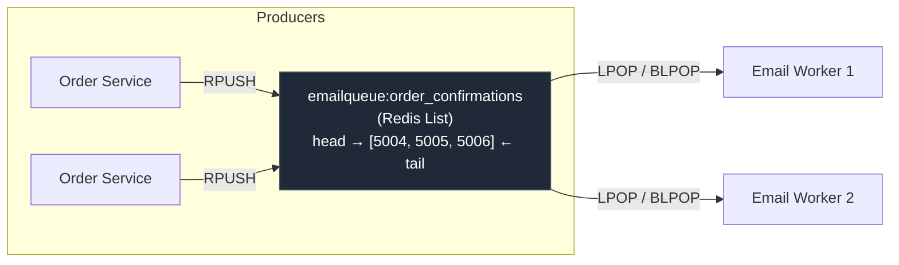
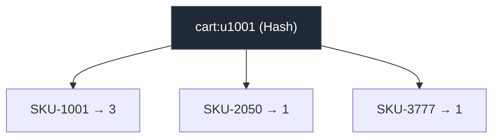
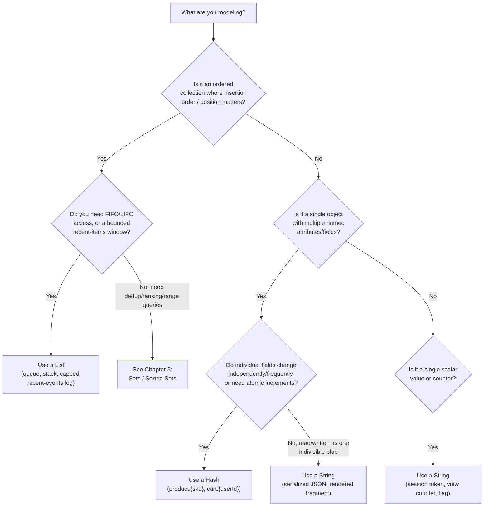

# Chapter 4: Strings, Lists & Hashes

Chapters 1–3 gave you the mental model: Redis is an in-memory data structure store, keys live in a single flat keyspace, and a single-threaded event loop executes commands one at a time against structures held in RAM. This chapter is where that mental model starts paying rent. You're going to spend real, hands-on time with the three data types you'll use constantly in production: **strings**, **lists**, and **hashes**.

This is one of the most important chapters in the course. Nearly every Redis use case you'll build in later chapters — caching (Ch 9), rate limiting, session stores, job queues, leaderboards (Ch 5), streams (Ch 6) — is built out of these three structures (plus sets and sorted sets, which get their own chapter next). Getting comfortable with their commands, their complexity characteristics, and their trade-offs now will make everything downstream easier.

We'll keep using QuickCart, our fictional e-commerce company, as the running example: `session:{userId}` strings, `product:{sku}` hashes, `cart:{userId}` hashes, and a new one for this chapter — an order-confirmation email job queue built on a Redis list.

---

## Learning Objectives

By the end of this chapter, you will be able to:

- Use the full string command set — including atomic counters (`INCR`/`INCRBY`/`INCRBYFLOAT`) — and explain when a string should hold a serialized object versus a hash should model it.
- Use lists as both a FIFO queue and a LIFO stack, including the blocking pop commands, and explain why lists are a decent *simple* job queue but not a production message queue.
- Model real-world objects (a product, a shopping cart) as Redis hashes, and use field-level commands like `HINCRBY` and `HMGET` to update and read them atomically and efficiently.
- Recite the Big-O complexity of the core string/list/hash commands and use that knowledge to avoid an O(N) command becoming a production incident.
- Apply a decision framework for choosing between a string, a list, and a hash for a given data-modeling problem.
- Recognize and avoid the most common string/list/hash mistakes: unbounded `LRANGE`, oversized JSON blobs as strings, and misunderstanding hash field TTLs.

---

## Prerequisites

This chapter builds directly on:

- [Chapter 1: Introduction & Prerequisites](./01-introduction-and-prerequisites.md) — what Redis is and how to run it locally.
- [Chapter 2: Core Concepts](./02-core-concepts.md) — the keyspace, key naming conventions (like `product:{sku}`), and `redis-cli` basics (`SET`, `GET`, `DEL`, `TYPE`, `EXPIRE`, `TTL`, `KEYS`/`SCAN`).
- [Chapter 3: Architecture & Internals](./03-architecture-and-internals.md) — the single-threaded event loop (which is *why* command complexity matters so much — every command you run blocks every other client until it finishes) and `OBJECT ENCODING` (which we'll revisit here for hashes).

If you haven't run `redis-cli` yet or don't know what `OBJECT ENCODING somekey` prints, go back to Chapters 2–3 first — this chapter assumes you can start a local Redis instance and run commands against it comfortably.

All examples assume a local Redis instance reachable via `redis-cli` with no auth, e.g. `docker run -d --name redis -p 6379:6379 redis:7.4`.

---

## 1. Strings Deep Dive

The Redis string is the most primitive type — and, despite the name, it's not just for text. A Redis string is a binary-safe sequence of bytes, up to 512 MB, that can hold text, a serialized JSON document, an image, a protobuf blob, or a number that Redis will happily treat as an integer for arithmetic commands.

### 1.1 The basics: `SET`, `GET`, and friends

```bash
# Basic set/get
127.0.0.1:6379> SET session:u1001 "authenticated"
OK
127.0.0.1:6379> GET session:u1001
"authenticated"

# SETNX — set only if the key does NOT already exist (classic use: simple locks)
127.0.0.1:6379> SETNX session:u1001 "overwrite-attempt"
(integer) 0        # 0 = not set, key already existed
127.0.0.1:6379> SETNX session:u1002 "authenticated"
(integer) 1        # 1 = key was set

# SETEX — set with an expiry (seconds) in one atomic command
127.0.0.1:6379> SETEX session:u1001 1800 "authenticated"
OK
127.0.0.1:6379> TTL session:u1001
(integer) 1800

# Modern equivalent using SET with options (preferred since Redis 2.6.12+)
127.0.0.1:6379> SET session:u1001 "authenticated" EX 1800 NX
OK
```

`SETNX` and `SETEX` still work and are worth recognizing in legacy code, but in modern Redis you'll mostly reach for `SET key value [EX seconds | PX milliseconds] [NX | XX] [GET]` — a single command that folds in expiry, existence conditions, and "return the old value" behavior. This matters because in a single-threaded server, one command that does three things atomically beats three round-trips that can race against other clients.

```bash
# GETSET (legacy) — atomically set a new value and return the old one
127.0.0.1:6379> GETSET session:u1001 "renewed"
"authenticated"

# Modern equivalent
127.0.0.1:6379> SET session:u1001 "renewed" GET
"authenticated"
```

### 1.2 Substring and length operations

```bash
127.0.0.1:6379> SET product:SKU-1001:name "Wireless Mouse"
OK
127.0.0.1:6379> STRLEN product:SKU-1001:name
(integer) 15

# GETRANGE key start end — inclusive, supports negative indices (like Python slicing)
127.0.0.1:6379> GETRANGE product:SKU-1001:name 0 7
"Wireless"
127.0.0.1:6379> GETRANGE product:SKU-1001:name -5 -1
"Mouse"

# SETRANGE key offset value — overwrite starting at a byte offset
127.0.0.1:6379> SETRANGE product:SKU-1001:name 9 "Trackpad"
(integer) 17
127.0.0.1:6379> GET product:SKU-1001:name
"Wireless Trackpad"

# APPEND key value — append to the end (creates the key if missing)
127.0.0.1:6379> APPEND product:SKU-1001:name " (2024)"
(integer) 24
127.0.0.1:6379> GET product:SKU-1001:name
"Wireless Trackpad (2024)"
```

`GETRANGE`/`SETRANGE`/`APPEND` are handy but niche — most applications don't slice strings byte-by-byte in Redis. Where they *do* matter: building up log lines or small buffers incrementally without a round trip to fetch-modify-write, and bitmap-adjacent binary tricks (more in Chapter 5).

### 1.3 Strings as atomic counters

This is where strings become genuinely powerful beyond "cache a value." Redis guarantees `INCR` and friends execute atomically — no read-modify-write race is possible, even with thousands of concurrent clients, because the single-threaded event loop processes each command to completion before the next one starts.

```bash
# INCR / DECR — increment/decrement by 1, key auto-initializes at 0 if missing
127.0.0.1:6379> INCR page:views:product:SKU-1001
(integer) 1
127.0.0.1:6379> INCR page:views:product:SKU-1001
(integer) 2

# INCRBY / DECRBY — increment/decrement by an arbitrary integer
127.0.0.1:6379> INCRBY page:views:product:SKU-1001 48
(integer) 50
127.0.0.1:6379> DECRBY page:views:product:SKU-1001 10
(integer) 40

# INCRBYFLOAT — for non-integer increments (e.g. accumulating a running average, currency)
127.0.0.1:6379> SET product:SKU-1001:avg_rating 4.2
OK
127.0.0.1:6379> INCRBYFLOAT product:SKU-1001:avg_rating 0.3
"4.5"
```

**QuickCart example — rate limiting.** A classic fixed-window rate limiter is just `INCR` plus `EXPIRE`, combined atomically:

```bash
127.0.0.1:6379> SET ratelimit:u1001:checkout 0 EX 60 NX
OK
127.0.0.1:6379> INCR ratelimit:u1001:checkout
(integer) 1
127.0.0.1:6379> INCR ratelimit:u1001:checkout
(integer) 2
# ... application checks: if the returned counter > limit (e.g. 5), reject the request
```

A subtlety worth internalizing now (Chapter 8 covers this properly with Lua/`MULTI`): if you `INCR` a fresh key and *then* `EXPIRE` it as two separate commands, there's a tiny window where the key exists without a TTL if your process crashes between the two calls. The `SET ... NX EX` pattern above avoids that by seeding the counter with its expiry up front, or you can use a Lua script to make the whole increment-and-maybe-expire sequence atomic. File this away — it's a recurring theme.

**QuickCart example — page-view counters.** Every product page view does one `INCR product:SKU-1001:views`. No read-modify-write, no lock, no race condition, even under heavy concurrent traffic — this is the single-threaded model's payoff in its purest form.

---

## 2. Strings for More Than Text

### 2.1 Caching serialized objects: JSON string vs. hash

A very common Redis pattern is caching an object — say, a fully-rendered product detail payload — as a single string holding serialized JSON:

```bash
127.0.0.1:6379> SET product:SKU-1001:json '{"name":"Wireless Mouse","price":24.99,"stock":142,"category":"Electronics"}'
OK
127.0.0.1:6379> GET product:SKU-1001:json
"{\"name\":\"Wireless Mouse\",\"price\":24.99,\"stock\":142,\"category\":\"Electronics\"}"
```

This works, and it's simple: one key, one `GET`, deserialize in the application. But it comes with a real trade-off against modeling the same product as a **hash** (Section 5):

| | String holding JSON | Hash |
|---|---|---|
| Read whole object | 1 command (`GET`), fast | 1 command (`HGETALL`), fast |
| Read *one* field (e.g. just `stock`) | Must fetch and deserialize the *entire* blob | `HGET product:SKU-1001 stock` — fetches only that field |
| Update *one* field (e.g. decrement stock) | Read-modify-write: `GET` → deserialize → mutate → serialize → `SET` (not atomic without `MULTI`/Lua) | `HINCRBY product:SKU-1001 stock -1` — atomic, single round trip |
| Network payload for a small update | Entire object, every time | Only the changed field(s) |
| Schema flexibility | Whatever your JSON shape supports (nested objects, arrays) | Flat field→value map only (no native nesting) |
| Best for | Objects mutated rarely / read as a whole (e.g. a rendered page fragment, a config blob) | Objects with independently-updated fields (e.g. stock counts, view counts) |

The rule of thumb we'll formalize in Section 8: **if you frequently update or read individual fields, use a hash; if you always read/write the object as one indivisible unit, a JSON string is simpler and perfectly fine.** QuickCart's `product:{sku}` is modeled as a hash precisely because `stock` changes on every purchase while `name` and `category` almost never change — updating stock shouldn't require rewriting the whole record.

### 2.2 Binary data

Because Redis strings are binary-safe (they're length-prefixed byte arrays internally, not null-terminated C strings), you can store anything: a small thumbnail image, a serialized protobuf message, a session token's raw bytes. `redis-cli` will display binary data oddly (or you'll need `--no-raw`), but the server doesn't care — it just stores and returns bytes. This is why Redis client libraries (Ch 10) typically work with byte arrays or buffers, not just strings, at the wire protocol level.

### 2.3 Bitmaps — a teaser

Strings also back Redis's **bitmap** commands (`SETBIT`, `GETBIT`, `BITCOUNT`, `BITOP`) — a bitmap is literally just a Redis string interpreted as a sequence of individual bits instead of bytes. It's an extremely memory-efficient way to track boolean flags per user (e.g., "did user X log in on day Y?") across millions of users. We're only naming it here; Chapter 5 covers bitmaps and HyperLogLog in full, right alongside sets and sorted sets.

---

## 3. Lists Deep Dive

A Redis list is a doubly linked list of string values, ordered by insertion, that supports very fast push/pop from *either end*. That "either end" property is what makes lists useful as both a **queue** (FIFO: push one end, pop the other) and a **stack** (LIFO: push and pop the same end).

### 3.1 Core commands

```bash
# LPUSH / RPUSH — push one or more values onto the left (head) or right (tail)
127.0.0.1:6379> RPUSH emailqueue:order_confirmations "order:5001"
(integer) 1
127.0.0.1:6379> RPUSH emailqueue:order_confirmations "order:5002" "order:5003"
(integer) 3

# LRANGE key start stop — read a range (0-indexed, inclusive, negative indices count from the tail)
127.0.0.1:6379> LRANGE emailqueue:order_confirmations 0 -1
1) "order:5001"
2) "order:5002"
3) "order:5003"

# LLEN — length of the list
127.0.0.1:6379> LLEN emailqueue:order_confirmations
(integer) 3

# LPOP / RPOP — pop from the left/right; optionally pop N elements at once
127.0.0.1:6379> LPOP emailqueue:order_confirmations
"order:5001"
127.0.0.1:6379> LPOP emailqueue:order_confirmations 2
1) "order:5002"
2) "order:5003"

# LINDEX key index — read a single element by position without popping it
127.0.0.1:6379> RPUSH emailqueue:order_confirmations "order:5004" "order:5005"
(integer) 2
127.0.0.1:6379> LINDEX emailqueue:order_confirmations 0
"order:5004"

# LREM key count value — remove occurrences of a value (count > 0: from head, < 0: from tail, 0: all)
127.0.0.1:6379> RPUSH emailqueue:order_confirmations "order:5004"
(integer) 3
127.0.0.1:6379> LREM emailqueue:order_confirmations 1 "order:5004"
(integer) 1

# LTRIM key start stop — keep only the given range, discard the rest (in place)
127.0.0.1:6379> LTRIM emailqueue:order_confirmations 0 0
OK
127.0.0.1:6379> LRANGE emailqueue:order_confirmations 0 -1
1) "order:5004"
```

### 3.2 Lists as a queue (FIFO) vs. a stack (LIFO)

The same two commands, `LPUSH`/`RPUSH` and `LPOP`/`RPOP`, give you both structures depending on which ends you pair up:

- **Queue (FIFO — first in, first out):** producers `RPUSH` (append to the tail), consumers `LPOP` (remove from the head). Whoever got in line first gets served first.
- **Stack (LIFO — last in, first out):** producers and consumers both use the same end, e.g. `LPUSH` to add, `LPOP` to remove. The most recently added item comes out first.



**QuickCart example — order-confirmation email job queue.** When a customer completes checkout, the order service `RPUSH`es a job onto `emailqueue:order_confirmations`. A pool of worker processes `LPOP`s (or, better, `BLPOP`s) jobs off the same list, renders the email, and sends it. Because it's a single shared list, multiple workers can pop concurrently without double-processing the same job — `LPOP` is atomic, so two workers racing to pop will never both get the same element.

### 3.3 Blocking pops: `BLPOP` / `BRPOP`

Polling a queue with `LPOP` in a tight loop wastes CPU and adds latency (you either poll too often, burning cycles, or too rarely, adding delay). `BLPOP`/`BRPOP` solve this: they behave exactly like `LPOP`/`RPOP`, except if the list is empty, the client blocks (waits) until either an element becomes available or a timeout expires.

```bash
# Worker: block for up to 5 seconds waiting for a job
127.0.0.1:6379> BLPOP emailqueue:order_confirmations 5
1) "emailqueue:order_confirmations"
2) "order:5004"

# If the queue is empty and nothing arrives within 5s, returns (nil)
127.0.0.1:6379> BLPOP emailqueue:order_confirmations 5
(nil)
```

You can block on multiple lists at once — `BLPOP queue1 queue2 queue3 0` returns from whichever list gets an element first (with a timeout of `0` meaning "block forever"). This is a lightweight way to have a single worker service several priority queues, checked in the order you list them.

A production detail worth flagging: a blocked client still holds a connection to Redis and counts against your connection/client limits, and because Redis is single-threaded, a *very* long-blocked command doesn't stall other clients (blocking is handled specially, not by tying up the event loop) — but you should still use a sane timeout rather than `0` in most application code, so workers can cycle, check for shutdown signals, and reconnect gracefully.

---

## 4. List Internals and Caveats

### 4.1 Why `LRANGE` on a huge list is dangerous

Internally, a Redis list (in its `quicklist` encoding — a linked list of small compressed arrays) is optimized for pushes and pops at the ends, which are **O(1)**. But `LRANGE key start stop` is **O(S+N)**, where S is the offset of `start` and N is the number of elements returned. Critically, `LRANGE key 0 -1` — "give me everything" — is **O(N)** where N is the *entire list length*.

On a list with a few hundred items, that's instant. On a list that's grown to a few million items (because nobody's trimming it — see 4.2), `LRANGE key 0 -1` becomes a multi-second, single-threaded-event-loop-blocking operation that stalls *every other client* connected to that Redis instance. This is one of the most common "why did Redis suddenly freeze for 3 seconds" production incidents, and it's entirely self-inflicted.

### 4.2 `LTRIM` for capped lists

The fix, when you only ever need "the most recent N items," is to trim the list down after every push:

```bash
# Keep only the most recent 100 events — trim after every push
127.0.0.1:6379> RPUSH orders:events:recent "order:5006:created"
(integer) 145
127.0.0.1:6379> LTRIM orders:events:recent -100 -1
OK
127.0.0.1:6379> LLEN orders:events:recent
(integer) 100
```

`LTRIM` is O(N) in the number of elements *removed*, not the number kept, so trimming a list that's already capped at 100 after each single push is cheap. This "last N events" pattern (recent activity feeds, last N audit log lines, last N price changes for a SKU) is one of the best uses of a plain Redis list.

### 4.3 Why lists aren't a real message queue at scale

A Redis list *can* function as a simple job queue — and for QuickCart's email jobs, at moderate volume, it's genuinely fine. But it's missing several things a real message-queue system needs once you're operating at scale or need strong delivery guarantees:

- **No consumer groups.** Every `LPOP`/`BLPOP` removes the element for good, for whichever single worker happened to grab it. There's no built-in way for multiple independent *groups* of consumers to each see every message, or to track per-consumer-group progress.
- **No delivery acknowledgment.** Once a worker `LPOP`s a job and then crashes before finishing it, the job is simply gone — there's no automatic "put it back if not acknowledged" mechanism (you'd have to build this yourself, e.g. with `LMOVE` into a "processing" list and a reaper process).
- **No replay.** Once popped, an element cannot be re-read by another consumer or re-read later for auditing — the list has no persistent, replayable log semantics.
- **No per-message metadata or IDs** beyond what you serialize into the value yourself.

Redis actually ships a purpose-built solution for exactly this gap: **Streams** (`XADD`/`XREADGROUP`/`XACK`), covered in full in [Chapter 6](./06-streams-and-pub-sub.md). Streams give you consumer groups, acknowledgment, replay, and persistent IDs — everything a list-as-a-queue is missing. Keep this chapter's list-based queue in mind as the simple version; Chapter 6 rebuilds `orders:events` on top of a Stream once you need those guarantees.

---

## 5. Hashes Deep Dive

A Redis hash is a field→value map, all stored under one Redis key — exactly like a small dictionary, or a single row/record with named columns. This is the natural fit for "model one object" (a product, a cart, a user profile) as a single Redis key with multiple named attributes.

### 5.1 Core commands

```bash
# HSET key field value [field value ...] — set one or more fields
127.0.0.1:6379> HSET product:SKU-1001 name "Wireless Mouse" price 24.99 stock 142 category "Electronics"
(integer) 4

# HGET key field — read a single field
127.0.0.1:6379> HGET product:SKU-1001 name
"Wireless Mouse"

# HGETALL key — read every field/value pair
127.0.0.1:6379> HGETALL product:SKU-1001
1) "name"
2) "Wireless Mouse"
3) "price"
4) "24.99"
5) "stock"
6) "142"
7) "category"
8) "Electronics"

# HMGET key field [field ...] — read several fields at once, in one round trip
127.0.0.1:6379> HMGET product:SKU-1001 name price
1) "Wireless Mouse"
2) "24.99"

# HDEL key field [field ...] — delete one or more fields
127.0.0.1:6379> HSET product:SKU-1001 discontinued "false"
(integer) 1
127.0.0.1:6379> HDEL product:SKU-1001 discontinued
(integer) 1

# HEXISTS key field — check whether a field exists
127.0.0.1:6379> HEXISTS product:SKU-1001 stock
(integer) 1

# HKEYS / HVALS — list just the field names, or just the values
127.0.0.1:6379> HKEYS product:SKU-1001
1) "name"
2) "price"
3) "stock"
4) "category"
127.0.0.1:6379> HVALS product:SKU-1001
1) "Wireless Mouse"
2) "24.99"
3) "142"
4) "Electronics"

# HLEN — number of fields
127.0.0.1:6379> HLEN product:SKU-1001
(integer) 4

# HINCRBY / HINCRBYFLOAT — atomic increment of a single numeric field
127.0.0.1:6379> HINCRBY product:SKU-1001 stock -1
(integer) 141
```

### 5.2 QuickCart's cart: `cart:{userId}` as a hash

QuickCart's shopping cart is modeled as a hash mapping each product SKU to the quantity in the cart — a natural fit, since "how many of item X does this cart have" is exactly a field→value pair:

```bash
127.0.0.1:6379> HSET cart:u1001 SKU-1001 2 SKU-2050 1
(integer) 2
127.0.0.1:6379> HGETALL cart:u1001
1) "SKU-1001"
2) "2"
3) "SKU-2050"
4) "1"

# Customer adds one more mouse — atomic increment, no read-modify-write needed
127.0.0.1:6379> HINCRBY cart:u1001 SKU-1001 1
(integer) 3

# Customer removes an item from their cart entirely
127.0.0.1:6379> HDEL cart:u1001 SKU-2050
(integer) 1
```



Notice what this buys QuickCart: incrementing a quantity, removing one line item, or checking whether a specific SKU is already in the cart (`HEXISTS cart:u1001 SKU-1001`) are all single, atomic, O(1) operations that touch *only* the relevant field — not the whole cart.

---

## 6. Hash vs. String-of-JSON: the Trade-off, Formalized

Section 2.1 previewed this; here's the full picture now that you've seen hash commands in action.

### 6.1 Partial updates and atomicity

If `product:SKU-1001` were a JSON string instead of a hash, decrementing stock on every sale would require:

```bash
# The JSON-string way — NOT atomic across the round trip
GET product:SKU-1001:json
# ... application deserializes, decrements "stock", re-serializes ...
SET product:SKU-1001:json '{"name":"Wireless Mouse","price":24.99,"stock":141,"category":"Electronics"}'
```

Between the `GET` and the `SET`, another concurrent request could read the *old* stock value and make its own decision from stale data — a classic lost-update race. You'd need `MULTI`/`WATCH` or a Lua script (Chapter 8) to make this safe.

As a hash, the same operation is a single atomic command with no race window at all:

```bash
127.0.0.1:6379> HINCRBY product:SKU-1001 stock -1
(integer) 140
```

This is the single biggest practical reason to prefer hashes for objects with fields that change independently and frequently (counters, quantities, statuses) — you get atomicity and reduced network payload essentially for free.

### 6.2 Memory efficiency: `listpack` encoding

Recall from Chapter 3 that Redis chooses an internal encoding for each value based on its size and shape, and that you can inspect it with `OBJECT ENCODING`. Small hashes get a compact, memory-efficient encoding:

```bash
127.0.0.1:6379> OBJECT ENCODING product:SKU-1001
"listpack"
```

As long as a hash stays under the configured thresholds — by default `hash-max-listpack-entries 128` and `hash-max-listpack-value 64` (bytes per value) — Redis stores it as a `listpack`: a single compact, contiguous memory blob, far cheaper per-field than a full hash-table structure with pointers. Once a hash grows past either threshold, Redis transparently converts it to the `hashtable` encoding — still correct, still fast (O(1) field access), but with noticeably higher per-field memory overhead.

Practical implication for QuickCart: a `product:{sku}` hash with 4-6 fields comfortably stays `listpack`-encoded — cheap to store, cheap to scan. This is a genuine, measurable memory advantage over storing the same six attributes as six separate top-level string keys (`product:SKU-1001:name`, `product:SKU-1001:price`, ...), which has none of this compaction and multiplies Redis's fixed per-key overhead six-fold.

---

## 7. Command Complexity Cheat-Sheet

Because Redis is single-threaded (Chapter 3), every command's time complexity directly affects how long *all other clients* wait. Memorize the O(N) ones — they're exactly the commands that need a size cap or careful use in production.

| Command | Complexity | Notes |
|---|---|---|
| `SET` / `GET` | O(1) | |
| `SETNX` / `SETEX` | O(1) | |
| `APPEND` | O(1) amortized | Occasional reallocation |
| `STRLEN` | O(1) | |
| `GETRANGE` / `SETRANGE` | O(N) | N = length of the range returned/written |
| `INCR` / `INCRBY` / `DECR` / `INCRBYFLOAT` | O(1) | |
| `LPUSH` / `RPUSH` | O(1) per element pushed | O(N) for N elements in one call |
| `LPOP` / `RPOP` | O(1) for a single pop | O(N) if popping a count |
| `LLEN` | O(1) | |
| `LINDEX` | O(N) | N = distance from the nearest end; near-head/tail is fast |
| `LRANGE` | O(S+N) | S = start offset, N = elements returned — `0 -1` on a huge list is dangerous |
| `LREM` | O(N) | N = list length |
| `LTRIM` | O(N) | N = number of elements *removed* |
| `BLPOP` / `BRPOP` | O(1) | Plus blocking wait time |
| `HSET` / `HGET` | O(1) per field | O(N) for N fields in one call |
| `HMGET` | O(N) | N = number of fields requested |
| `HGETALL` / `HKEYS` / `HVALS` | O(N) | N = number of fields in the hash |
| `HDEL` | O(N) | N = number of fields removed |
| `HINCRBY` / `HINCRBYFLOAT` | O(1) | |
| `HEXISTS` / `HLEN` | O(1) | |

The pattern to internalize: **anything that has to touch every element of a collection (`LRANGE 0 -1`, `HGETALL` on a huge hash, `LREM`, `KEYS`) scales with the collection's size.** Anything that touches one element or one end (`HGET`, `HINCRBY`, `LPUSH`, `LPOP`) doesn't. Design your key sizes and your access patterns around that line.

---

## 8. Choosing the Right Structure: a Decision Framework

Use this checklist when you're not sure whether a piece of QuickCart's data belongs in a string, a list, or a hash.



Spelled out as rules of thumb:

1. **A single scalar value, flag, token, or counter** → **string**. QuickCart: `session:{userId}`, `page:views:product:{sku}`, `ratelimit:{userId}:{endpoint}`.
2. **A blob you always read/write as one indivisible unit, rarely updating a piece of it** → **string** holding serialized JSON (or another format — see Best Practices below). QuickCart: a fully-rendered, rarely-changing page fragment cached for a few minutes.
3. **An ordered sequence where you push/pop from the ends, especially a queue or stack** → **list**. QuickCart: `emailqueue:order_confirmations`; a capped "last 100 price changes" log via `LTRIM`.
4. **A single logical object with several named fields, especially if fields update independently or need atomic numeric increments** → **hash**. QuickCart: `product:{sku}` (name/price/stock/category), `cart:{userId}` (sku→quantity).
5. **You need uniqueness, membership tests, ranking, or range queries by score** → neither of these three; see [Chapter 5](./05-sets-sorted-sets-and-bitmaps.md) for sets and sorted sets (QuickCart's `leaderboard:daily` and `stores:locations`).

---

## Real-World Scenario

QuickCart's cart service and order-confirmation email pipeline, built entirely from what this chapter covered.

### Shopping cart lifecycle with `cart:{userId}`

```bash
# Customer u1001 browses and adds two Wireless Mice (SKU-1001) and one Desk Lamp (SKU-3777)
127.0.0.1:6379> HSET cart:u1001 SKU-1001 2
(integer) 1
127.0.0.1:6379> HSET cart:u1001 SKU-3777 1
(integer) 1

# Give the cart a TTL so abandoned carts don't live forever (Chapter 9 covers eviction/TTL policy in depth)
127.0.0.1:6379> EXPIRE cart:u1001 86400
(integer) 1

# Customer increases mouse quantity to 3
127.0.0.1:6379> HINCRBY cart:u1001 SKU-1001 1
(integer) 3

# Customer removes the desk lamp
127.0.0.1:6379> HDEL cart:u1001 SKU-3777
(integer) 1

# Checkout page renders the full cart in one round trip
127.0.0.1:6379> HGETALL cart:u1001
1) "SKU-1001"
2) "3"

# On successful checkout, clear the cart entirely
127.0.0.1:6379> DEL cart:u1001
(integer) 1
```

### Order-confirmation email queue with a list

```bash
# Order service enqueues a job the moment checkout succeeds
127.0.0.1:6379> RPUSH emailqueue:order_confirmations "order:5001|u1001|u1001@example.com"

# Cap the queue defensively at 10,000 pending jobs so a stalled worker fleet
# can't grow the list unboundedly (LTRIM keeps only the most recent N if it overflows)
127.0.0.1:6379> LTRIM emailqueue:order_confirmations -10000 -1
OK

# Email worker process (run this loop in a real worker):
127.0.0.1:6379> BLPOP emailqueue:order_confirmations 5
1) "emailqueue:order_confirmations"
2) "order:5001|u1001|u1001@example.com"
# ... worker parses the job, renders and sends the email ...

# If the queue is idle, the worker simply times out and loops again
127.0.0.1:6379> BLPOP emailqueue:order_confirmations 5
(nil)
```

Note the defensive `LTRIM -10000 -1` above: it's a safety net, not the primary control. If jobs are piling up because workers are falling behind, that's an operational problem (scale up workers, or migrate to Streams per Section 4.3) — the trim just prevents an already-bad situation from also becoming an out-of-memory incident.

---

## Best Practices

- **Prefer a hash over many separate string keys for a small, multi-field object.** `product:{sku}` as one hash beats `product:{sku}:name`, `product:{sku}:price`, `product:{sku}:stock` as three-plus string keys — fewer keys, `listpack` memory savings, and atomic per-field updates.
- **Cap list growth explicitly with `LTRIM`** any time a list is used as a rolling log or a queue that could theoretically back up. Don't rely on "it'll probably stay small."
- **Be explicit and consistent about your serialization format** when a string holds a structured object — pick JSON, MessagePack, or protobuf deliberately, document it, and never mix formats under the same key pattern. Future-you (and every other service reading that key) needs to know how to deserialize it without guessing.
- **Reach for `HINCRBY`/`INCR` instead of read-modify-write** whenever you're updating a number based on its current value — it's both simpler code and race-free by construction.
- **Set TTLs on ephemeral data** (`session:{userId}`, `cart:{userId}`) so abandoned data doesn't accumulate forever — Chapter 9 goes deep on expiration policy.
- **Use `SCAN`/`HSCAN`, never `KEYS`/`HGETALL` on huge structures, in production code paths.** `HGETALL` on a hash with tens of thousands of fields has the same O(N) blocking risk as `LRANGE 0 -1` on a huge list.

---

## Common Mistakes

- **Running `LRANGE key 0 -1` on a list that's grown to millions of entries in a hot code path.** This blocks the single-threaded event loop for the full O(N) duration, stalling every other client. Cap the list with `LTRIM`, or paginate reads with bounded `LRANGE key 0 99`-style windows.
- **Storing a large, frequently-partially-updated JSON blob as a plain string.** If you find yourself doing `GET` → deserialize → mutate one field → serialize → `SET` on every write, that's a strong signal the object should be a hash instead — you're paying full read/write bandwidth and losing atomicity for a change that touches one field.
- **Assuming hash fields can have their own TTL, by default they can't.** A `TTL`/`EXPIRE` in classic Redis applies to the whole key (the whole hash), not to an individual field — you cannot natively expire just the `stock` field while keeping `name` and `price` alive. **Redis 7.4+ adds `HEXPIRE`/`HPEXPIRE`/`HTTL`/`HPERSIST`** for genuine per-field expiration, but treat it as a newer, more limited feature (check your server version and client library support before depending on it) rather than a long-standing guarantee.
- **Letting a job queue silently grow unbounded** when consumers can't keep up, with no monitoring on `LLEN`. A queue depth alert and an `LTRIM` safety cap both matter — see the Real-World Scenario above.
- **Reaching for `KEYS product:*` to "find all products"** instead of `SCAN` with a `MATCH` pattern — `KEYS` is O(N) over the *entire keyspace* and, like unbounded `LRANGE`, blocks every other client while it runs. Chapter 2 introduced `SCAN`; this is exactly the kind of command where that distinction stops being academic.

---

## Summary

- **Strings** are Redis's most primitive type but far from simple: full text/binary operations (`GETRANGE`/`SETRANGE`/`APPEND`), atomic numeric counters (`INCR`/`INCRBY`/`INCRBYFLOAT`), and a natural home for serialized objects, binary blobs, and (as a teaser for Chapter 5) bitmaps.
- **Lists** are doubly linked lists supporting O(1) push/pop at either end, making them a natural FIFO queue or LIFO stack. `BLPOP`/`BRPOP` give you efficient blocking consumption instead of wasteful polling.
- **`LRANGE`/`HGETALL`-style "read everything" operations are O(N)** — safe on small collections, dangerous on large ones, because Redis's single-threaded event loop means an O(N) command blocks every other client for its duration. `LTRIM` is your defense for lists.
- Lists make a fine *simple* job queue but lack consumer groups, acknowledgment, and replay — real requirements at scale point to **Streams** (Chapter 6).
- **Hashes** model an object as a field→value map under one key, giving you atomic partial updates (`HINCRBY`, `HSET` on one field) and, while small, a memory-efficient `listpack` encoding — usually a better fit than either "one string key per field" or "one JSON-string blob" for objects with independently-changing fields.
- Choosing between a string, a list, and a hash comes down to: is it a scalar/blob (string), an ordered push/pop sequence (list), or a multi-field object (hash)? Section 8's decision framework formalizes this.

---

## Knowledge Check

1. Why is `INCR` guaranteed to be race-free even with thousands of concurrent clients, when a naive "read the value, add one, write it back" in application code is not?
2. QuickCart is deciding whether to store `product:{sku}` as a JSON string or a hash. Stock changes on every purchase; name and category almost never change. Which structure should they choose, and why, in terms of atomicity and network payload?
3. What does `OBJECT ENCODING` report for a small hash, and under what two conditions does Redis convert it to the more memory-heavy `hashtable` encoding?
4. Explain, using `LPUSH`/`RPUSH`/`LPOP`/`RPOP`, how the exact same two commands can implement both a FIFO queue and a LIFO stack.
5. Why is `LRANGE key 0 -1` dangerous on a list with 5 million elements, specifically in terms of what it does to *other* clients connected to the same Redis instance?
6. Name two capabilities a real message queue needs that a plain Redis list-as-queue lacks, and name the Redis feature (covered in a later chapter) that provides them.
7. What is `HEXPIRE`, and why should you not assume it's available or relied-upon by default in an arbitrary Redis deployment?
8. A teammate proposes storing a product's `name`, `price`, `stock`, and `category` as four separate top-level string keys instead of one hash. Give two concrete downsides of that approach.

---

## Hands-On Exercise

Using a local Redis instance (`redis-cli`), build QuickCart's cart and email-queue features end to end.

**Part 1 — Shopping cart (hash):**

1. Create a cart for user `u2002` containing 2 units of `SKU-4010` and 1 unit of `SKU-5090`, using a single `HSET` call with multiple field/value pairs.
2. Set a 24-hour TTL on the cart key.
3. Increase the quantity of `SKU-4010` to 4 using an atomic command (not a read-then-write).
4. Read back only the quantities of `SKU-4010` and `SKU-5090` in a single round trip.
5. Remove `SKU-5090` from the cart entirely.
6. Confirm with `OBJECT ENCODING` that the cart is still `listpack`-encoded.
7. Print the entire cart, then delete it to simulate a completed checkout.

**Part 2 — Order-confirmation email queue (list):**

1. Enqueue three order jobs (`order:9001`, `order:9002`, `order:9003`) onto `emailqueue:order_confirmations` using `RPUSH`.
2. Check the queue depth with `LLEN`.
3. Simulate one worker processing a job with `BLPOP` (use a short timeout, e.g. 3 seconds).
4. Simulate the queue going empty and a worker timing out — call `BLPOP` again with a 2-second timeout on an empty queue and observe the `(nil)` response and the delay.
5. Push 150 more dummy jobs (a quick shell loop calling `RPUSH` is fine), then use `LTRIM` to cap the queue at the most recent 100 jobs. Confirm the new length with `LLEN`.

**Stretch goal:** Write a short pseudocode (or real Python/Node.js, if you're comfortable) snippet for a worker loop that calls `BLPOP` with a timeout, processes a job if one arrives, and loops forever, cleanly handling the `(nil)` timeout case. This is a preview of the client-library patterns Chapter 10 covers properly.

---

## Further Reading

- [Redis Strings documentation](https://redis.io/docs/latest/develop/data-types/strings/) — official reference for every string command.
- [Redis Lists documentation](https://redis.io/docs/latest/develop/data-types/lists/) — official reference, including the `quicklist` encoding details.
- [Redis Hashes documentation](https://redis.io/docs/latest/develop/data-types/hashes/) — official reference, including the Redis 7.4 field-TTL commands (`HEXPIRE` family).
- [Redis commands reference](https://redis.io/docs/latest/commands/) — the canonical, per-command complexity and syntax reference; bookmark this, you'll use it constantly.
- *Redis in Action*, Josiah Carlson — Chapter 3 ("Commands in Redis") walks through strings/lists/hashes with additional worked examples beyond this chapter's scope.

---

<div style="display:flex;justify-content:space-between;align-items:center;">
  <a href="./03-architecture-and-internals.md">← Previous: Architecture & Internals</a>
  <a href="./00-index.md">🏠 Index</a>
  <a href="./05-sets-sorted-sets-and-bitmaps.md">Next: Sets, Sorted Sets & Bitmaps →</a>
</div>
