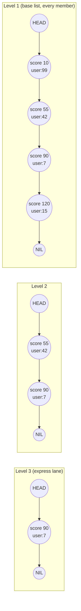
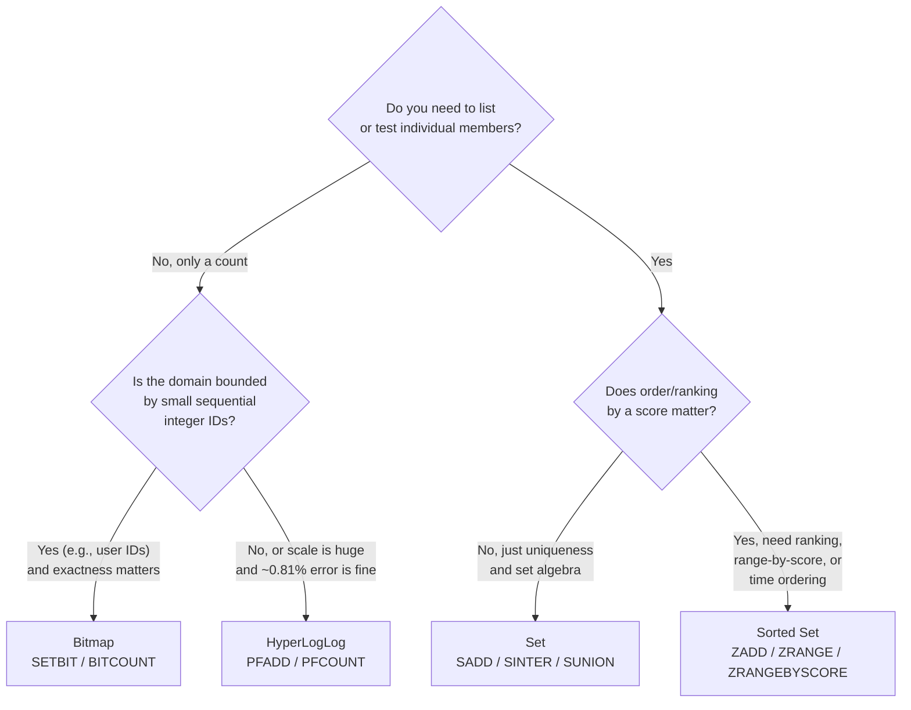

# Chapter 5: Sets, Sorted Sets & Bitmaps

Chapter 4 gave QuickCart its workhorse structures: strings for counters and session blobs, lists for queues, hashes for object-shaped records like `product:{sku}` and `cart:{userId}`. Those three cover "a value," "an ordered sequence," and "a small object." They do not cover three questions that come up constantly in real systems: *is this thing unique?*, *what's the ranking?*, and *how many distinct things happened, at a scale where counting exactly would bankrupt your memory budget?*

This chapter answers all three. Sets give you uniqueness and set algebra (union/intersection/difference) for free. Sorted sets add a score to every member and keep everything ordered by that score at all times — the structure behind every leaderboard, priority queue, and time-ordered index you'll ever build in Redis. Bitmaps and HyperLogLog are two different answers to "track or count huge numbers of booleans/uniques without huge memory," one exact, one probabilistic. By the end of this chapter you'll have the data-structure vocabulary to model almost any "track a collection of things" problem QuickCart throws at you.

---

## Learning Objectives

By the end of this chapter, you will be able to:

- Use the full Set command surface (`SADD`, `SREM`, `SMEMBERS`, `SISMEMBER`, `SCARD`, `SRANDMEMBER`, `SPOP`) to model unordered, unique collections.
- Perform set algebra (`SINTER`, `SUNION`, `SDIFF` and their `*STORE` variants) to answer relationship questions like "customers who viewed both product A and product B."
- Explain how a sorted set is internally structured (skip list + hash table) and use its full command surface (`ZADD`, `ZSCORE`, `ZRANGE`, `ZREVRANGE`, `ZRANGEBYSCORE`, `ZRANK`, `ZINCRBY`, `ZREM`, `ZCARD`) to build leaderboards, range queries, priority queues, and time-ordered indexes.
- Design composite scores to break ties deterministically in a leaderboard.
- Use bitmaps (`SETBIT`, `GETBIT`, `BITCOUNT`, `BITOP`, `BITPOS`) to track large populations of booleans (e.g., daily active users) in a tiny memory footprint.
- Use HyperLogLog (`PFADD`, `PFCOUNT`, `PFMERGE`) to estimate cardinality at massive scale within ~0.81% error using a fixed ~12 KB, and articulate when to trade exactness for that memory win.
- Apply a decision framework to choose between Set, Sorted Set, Bitmap, and HyperLogLog for a given "count/track unique things" problem.

---

## Prerequisites

This chapter builds directly on [Chapter 4: Strings, Lists & Hashes](./04-strings-lists-and-hashes.md). We assume you're comfortable with:

- Basic `redis-cli` usage and Redis's key-value model (Chapter 2).
- Redis's single-threaded event loop and why command cost is measured in algorithmic complexity, not raw CPU parallelism (Chapter 3) — this matters a lot in this chapter, since a few Set/ZSET commands are O(N) or worse and can block the loop on large collections.
- Strings as counters, Lists as queues/stacks, and Hashes as compact objects — QuickCart's `session:{userId}`, `product:{sku}`, and `cart:{userId}` structures from Chapter 4.

If any of that feels shaky, revisit Chapter 4 before continuing.

---

## 1. Sets Deep Dive: Unordered, Unique Collections

A Redis **Set** is an unordered collection of unique strings. Internally, small sets are stored as a compact `listpack` (a flat, memory-efficient sequence), and once a set grows past configured thresholds (`set-max-listpack-entries`, `set-max-listpack-value`) or contains non-integer members past `set-max-intset-entries`, Redis promotes it to a real hash table — giving you O(1) average-case add, remove, and membership checks regardless of size.

The core guarantee a Set gives you that a List doesn't: **no duplicates, ever**, and membership testing that doesn't require scanning.

### 1.1 Core commands

| Command | Purpose | Complexity |
|---|---|---|
| `SADD key member [member ...]` | Add one or more members | O(1) per member |
| `SREM key member [member ...]` | Remove one or more members | O(1) per member |
| `SMEMBERS key` | Return all members (unordered) | O(N) |
| `SISMEMBER key member` | Test membership | O(1) |
| `SMISMEMBER key m1 m2 ...` | Test membership of several members at once | O(N) for N members checked |
| `SCARD key` | Cardinality (count of members) | O(1) |
| `SRANDMEMBER key [count]` | Return random member(s) without removing | O(N) if `count` given |
| `SPOP key [count]` | Remove and return random member(s) | O(N) if `count` given |

### 1.2 QuickCart example: unique visitors to a product page

Every time a user views `product:P-1001`, record them in a per-product visitor Set:

```
SADD product:P-1001:visitors user:42
SADD product:P-1001:visitors user:99
SADD product:P-1001:visitors user:42   # no-op, already a member

SCARD product:P-1001:visitors
(integer) 2

SISMEMBER product:P-1001:visitors user:42
(integer) 1
```

`SADD` silently deduplicates — you don't need an `if not exists` check in application code. This is the simplest possible "unique visitor tracker," and it's *exact*. The catch, which Section 6 and 7 come back to, is that it stores every visitor ID forever, one entry per visitor — fine for one product with thousands of viewers, potentially expensive for a homepage with tens of millions.

### 1.3 QuickCart example: tagging products with categories

Sets are also the natural fit for many-to-many tagging:

```
SADD product:P-1001:tags "electronics" "audio" "wireless" "on-sale"
SMEMBERS product:P-1001:tags
1) "electronics"
2) "audio"
3) "wireless"
4) "on-sale"

SREM product:P-1001:tags "on-sale"   # promotion ended
```

And the reverse index — "which products are tagged wireless" — is just another Set:

```
SADD tag:wireless:products P-1001 P-1042 P-1077
```

Now `SISMEMBER tag:wireless:products P-1001` answers "is this product wireless?" in O(1), and `SMEMBERS tag:wireless:products` lists every wireless product. This bidirectional tagging pattern (`product:{sku}:tags` and `tag:{name}:products`) is a staple of catalog modeling in Redis.

`SRANDMEMBER` and `SPOP` earn their keep in sampling and lottery-style logic — e.g., picking a random product from a Set of "flash sale eligible" SKUs (`SRANDMEMBER`, non-destructive) versus dealing out one-time-use discount codes from a Set until it's empty (`SPOP`, destructive).

---

## 2. Set Algebra: SINTER, SUNION, SDIFF

The reason Sets are more than "a hash table with no values" is that Redis gives you whole-collection algebra as single atomic server-side operations — no need to pull two sets into your application and diff them yourself.

| Command | Meaning | `*STORE` variant |
|---|---|---|
| `SINTER key [key ...]` | Members present in **all** given sets | `SINTERSTORE dest key [key ...]` |
| `SUNION key [key ...]` | Members present in **any** given set | `SUNIONSTORE dest key [key ...]` |
| `SDIFF key [key ...]` | Members in the first set but **not** in any of the rest | `SDIFFSTORE dest key [key ...]` |
| `SINTERCARD numkeys key [key ...] [LIMIT n]` | *Count* of the intersection, without materializing it | — |

The `*STORE` variants compute the result and save it directly to a new key, which is usually what you want in production — it lets you cache an expensive computation instead of recomputing it (and re-transferring the whole result set over the wire) on every request.

### 2.1 QuickCart example: recommendation logic via intersection

QuickCart wants to power "customers who viewed this also viewed that" by finding shoppers who viewed **both** product A and product B — a strong signal they're comparison-shopping between the two:

```
SADD product:P-1001:visitors user:42 user:99 user:7
SADD product:P-2050:visitors user:99 user:7 user:15

SINTER product:P-1001:visitors product:P-2050:visitors
1) "user:99"
2) "user:7"
```

To power a recommendation job that runs periodically, store the result instead of recomputing it on every page load:

```
SINTERSTORE cross-shoppers:P-1001:P-2050 product:P-1001:visitors product:P-2050:visitors
(integer) 2
EXPIRE cross-shoppers:P-1001:P-2050 3600
```

### 2.2 Union and difference in the same catalog

- **Union** — "everyone who viewed *either* product, for a combined retargeting audience":
  ```
  SUNIONSTORE retarget:audience product:P-1001:visitors product:P-2050:visitors
  ```
- **Difference** — "users who viewed product A but never bothered looking at its direct competitor B" (a useful signal that A alone convinced or lost them):
  ```
  SDIFF product:P-1001:visitors product:P-2050:visitors
  1) "user:42"
  ```

### 2.3 A performance note that foreshadows Section 7

`SINTER`, `SUNION`, and `SDIFF` are O(N × M) — proportional to the total number of elements across the input sets. Redis is single-threaded (Chapter 3): while it computes a union of two 5-million-member sets, **no other client's commands run**. If you only need the *size* of an intersection (e.g., "how many customers overlap between segment A and segment B") rather than the actual members, prefer `SINTERCARD`, which can stop early and never has to build or transfer the full result set.

---

## 3. Sorted Sets (ZSETs) Deep Dive

A **Sorted Set** (ZSET) is a Set where every member additionally carries a floating-point **score**, and Redis maintains the entire collection ordered by that score at all times. This one structural addition — "unique members, each with a score, always kept sorted" — makes ZSETs one of the most versatile data structures Redis offers.

### 3.1 Internal structure: skip list + hash table

A large ZSET is backed by two structures simultaneously:

- A **hash table** mapping member → score, giving O(1) score lookups (`ZSCORE`).
- A **skip list** — a linked structure with multiple "express lane" levels — giving O(log N) ordered operations: insert, delete, and range queries by rank or score.

(Small ZSETs, like small Sets, use a compact `listpack` encoding instead and only graduate to the skip-list+hash-table representation past `zset-max-listpack-entries` / `zset-max-listpack-value`.)



Intuition: to find "the member with the closest score to 90," you don't walk every node one at a time — you traverse the top express lane until you'd overshoot, then drop down a level and keep walking, the same way you'd use highway exits instead of surface streets. That's what makes `ZRANGEBYSCORE` and rank lookups O(log N) instead of O(N), and it's also why sorted sets are more memory-expensive per member than plain Sets: every member pays for its skip-list pointers in addition to its hash table entry.

### 3.2 Core commands, using QuickCart's `leaderboard:daily`

QuickCart runs a daily gamification leaderboard: shoppers earn points for purchases, reviews, and referrals, tracked in `leaderboard:daily` with `userId` as the member and accumulated points as the score.

```
ZADD leaderboard:daily 120 user:15
ZADD leaderboard:daily 90  user:7
ZADD leaderboard:daily 55  user:42
ZADD leaderboard:daily 10  user:99

ZSCORE leaderboard:daily user:7
"90"

ZCARD leaderboard:daily
(integer) 4
```

| Command | Purpose |
|---|---|
| `ZADD key [NX\|XX] [GT\|LT] score member ...` | Add/update member(s) with a score |
| `ZSCORE key member` | Get a member's score |
| `ZRANGE key start stop [WITHSCORES]` | Members by rank, ascending |
| `ZREVRANGE key start stop [WITHSCORES]` | Members by rank, descending |
| `ZRANGEBYSCORE key min max [WITHSCORES] [LIMIT off cnt]` | Members within a score range, ascending |
| `ZRANK key member [WITHSCORE]` | A member's 0-based ascending rank |
| `ZREVRANK key member` | A member's 0-based descending rank |
| `ZINCRBY key increment member` | Atomically add to a member's score |
| `ZREM key member ...` | Remove member(s) |
| `ZCARD key` | Total number of members |

Top 3 by points (descending), with scores:

```
ZREVRANGE leaderboard:daily 0 2 WITHSCORES
1) "user:15"
2) "120"
3) "user:7"
4) "90"
5) "user:42"
6) "55"
```

A purchase just completed — award 15 points atomically, no read-modify-write race:

```
ZINCRBY leaderboard:daily 15 user:42
"70"
```

Where does user:42 rank now (0-based, descending order via `REV`)?

```
ZREVRANK leaderboard:daily user:42
(integer) 2
```

> **Modern note:** Redis 6.2+ unified `ZRANGE` with a `REV` and `BYSCORE`/`BYLEX` option, so `ZRANGE key min max BYSCORE` is now the recommended way to write what `ZRANGEBYSCORE` does, and `ZRANGE key start stop REV` replaces `ZREVRANGE`. The older commands still work and are what you'll see in most existing codebases and documentation, so this chapter uses both forms — but prefer the unified `ZRANGE` syntax in new code.

---

## 4. Sorted Set Patterns

### 4.1 Leaderboards with ties: composite scores

`ZADD leaderboard:daily 90 user:7` and a later `ZADD leaderboard:daily 90 user:15` leave two members tied at score 90. Redis breaks ties by comparing members lexicographically (as strings) — which means whichever `userId` sorts first wins ties, an arbitrary and usually *wrong* tiebreaker for a leaderboard (you don't want `user:100` to always outrank `user:7` on ties just because of string comparison).

The standard fix is a **composite score**: encode a secondary sort key into the same floating-point score, alongside the primary one. A common approach for "highest points, and among ties, whoever got there first wins":

```
composite_score = points * 10_000_000_000 - timestamp_seconds
```

Multiplying points by a large constant reserves the low-order digits for a timestamp offset, so points always dominate the ordering, but within equal points, the earlier timestamp (smaller subtracted value → larger composite score) ranks higher:

```
ZADD leaderboard:daily 899999998300001600 user:7    # 90 pts, earlier timestamp
ZADD leaderboard:daily 899999998300000800 user:15   # 90 pts, later timestamp
```

`user:7` now ranks strictly above `user:15` despite an equal point total, with no additional data structure and no read-modify-write required at query time. The trade-off: your raw score is no longer a human-readable point count, so you typically keep the *real* point total in a companion Hash (`leaderboard:daily:meta`) or recompute it by reversing the encoding, and use the composite score purely for ordering.

### 4.2 Range queries by score: "top N with a minimum score"

`ZRANGEBYSCORE` (or `ZRANGE ... BYSCORE`) answers "give me everyone above a threshold," which plain rank-based `ZRANGE`/`ZREVRANGE` can't do directly:

```
ZRANGEBYSCORE leaderboard:daily 70 +inf WITHSCORES
1) "user:42"
2) "70"
3) "user:7"
4) "90"
5) "user:15"
6) "120"
```

Combine with `LIMIT offset count` to page through a large qualifying range without pulling it all at once — e.g., "the next 10 users scoring at least 50, skipping the first 20":

```
ZRANGEBYSCORE leaderboard:daily 50 +inf LIMIT 20 10
```

`-inf` and `+inf` are valid bounds, and `(` before a number makes the bound exclusive (`ZRANGEBYSCORE key (70 +inf` — strictly greater than 70).

### 4.3 ZSETs as a priority queue

A worker pool can use a ZSET as a priority queue: score = priority (lower = more urgent), member = job ID. `ZRANGE key 0 0` peeks the highest-priority job; `ZREM` after processing pops it. For blocking consumption, `BZPOPMIN`/`BZPOPMAX` (blocking variants) let a worker sleep until a job appears rather than polling — genuinely useful for QuickCart's order-fulfillment worker picking the most time-sensitive order first.

### 4.4 ZSETs as a time-ordered index

Set the score to a Unix timestamp and you have a time-ordered index for free, independent of insertion order — useful anywhere you need "everything between time A and time B":

```
ZADD orders:by-time 1751800000 order:9001
ZADD orders:by-time 1751800300 order:9002

ZRANGEBYSCORE orders:by-time 1751800000 1751800200
1) "order:9001"
```

This pattern — score-as-timestamp — previews Chapter 6's Streams, which are purpose-built for exactly this kind of time-ordered event log but add consumer groups and at-least-once delivery semantics on top.

---

## 5. Bitmaps: Booleans at Massive Scale

A **bitmap** isn't a distinct Redis data type — it's a *view* over a String, where you address and manipulate individual bits instead of the whole byte sequence. Since a String can hold up to 512 MB, a single bitmap key can in principle represent over 4 billion individual boolean flags.

| Command | Purpose | Complexity |
|---|---|---|
| `SETBIT key offset value` | Set the bit at `offset` to 0 or 1 | O(1) |
| `GETBIT key offset` | Read the bit at `offset` | O(1) |
| `BITCOUNT key [start end [BYTE\|BIT]]` | Count set bits (population count) | O(N) over the range |
| `BITOP AND\|OR\|XOR\|NOT dest key [key ...]` | Bitwise operation across bitmaps, stored to `dest` | O(N) |
| `BITPOS key bit [start [end]]` | Find the first bit matching 0 or 1 | O(N) worst case |

### 5.1 QuickCart example: daily active users, 1 bit per user

Give each user a stable integer ID and use it as a bit offset into a per-day bitmap:

```
SETBIT dau:2026-07-06 42 1
SETBIT dau:2026-07-06 99 1
SETBIT dau:2026-07-06 100000 1

GETBIT dau:2026-07-06 42
(integer) 1

BITCOUNT dau:2026-07-06
(integer) 3
```

The memory cost is purely a function of the **highest offset used**, not the number of set bits: a bitmap covering 10 million possible user IDs costs roughly 10,000,000 / 8 ≈ 1.25 MB, whether 5 users or 5 million are active that day. That is dramatically cheaper than a Set holding 5 million string user IDs.

`BITOP` lets you answer cohort questions across days without touching application code:

```
BITOP AND dau:both 2026-07-05 dau:2026-07-06    # active both days
BITOP OR  dau:either 2026-07-05 dau:2026-07-06  # active on at least one day
BITCOUNT dau:both
```

### 5.2 QuickCart example: feature-flag rollout tracking

Rolling a new checkout flow out to a percentage of users? Flip a bit per user ID as they're enrolled, and `BITCOUNT` gives you an instant rollout-size readout, while `GETBIT` is an O(1) per-request check of "is this user in the rollout":

```
SETBIT rollout:new-checkout 42 1
GETBIT rollout:new-checkout 42
(integer) 1
BITCOUNT rollout:new-checkout
```

`BITPOS rollout:new-checkout 0` finds the first user ID *not yet* enrolled — handy for incrementally expanding a rollout in ID order.

---

## 6. HyperLogLog: Probabilistic Cardinality at Scale

Section 1.2's visitor-tracking Set is exact but doesn't scale: one entry per unique visitor, forever, per key. If QuickCart wants "approximate unique visitors across the entire site, today," a Set could balloon into hundreds of megabytes for a single key on a high-traffic day.

**HyperLogLog (HLL)** is a probabilistic algorithm that estimates the cardinality (count of distinct elements) of a set using a small, *fixed* amount of memory — regardless of whether you've added a thousand elements or a billion. Redis's implementation uses **at most ~12 KB per key**, with a standard error of **~0.81%**. It does not store the elements themselves, so you trade the ability to answer "was X a member?" or "list the members" for a massive memory win on "how many distinct members are there?"

| Command | Purpose | Complexity |
|---|---|---|
| `PFADD key element [element ...]` | Add element(s) to the estimator | O(1) per element |
| `PFCOUNT key [key ...]` | Estimate cardinality (of the union, if multiple keys) | O(1) per key (approx.) |
| `PFMERGE destkey sourcekey [sourcekey ...]` | Merge several HLLs into one, non-destructively on sources | O(N) in number of keys merged |

### 6.1 QuickCart example: approximate unique daily visitors at scale

```
PFADD visitors:2026-07-06 user:42 user:99 user:7
PFADD visitors:2026-07-06 user:42          # duplicate, doesn't change the estimate

PFCOUNT visitors:2026-07-06
(integer) 3
```

At small scale the estimate and the true count often coincide exactly (Redis's HLL implementation uses a dense/sparse hybrid encoding that's very accurate for small cardinalities). The value proposition shows up at scale: 50 million unique visitors tracked with `PFADD` still costs the same ~12 KB that 3 visitors did, whereas a Set tracking the same 50 million string IDs could cost several gigabytes.

Merging is where HLL really shines operationally — combine per-hour HLLs into a daily figure without re-touching raw event data:

```
PFADD visitors:2026-07-06:09h user:42 user:7
PFADD visitors:2026-07-06:10h user:99 user:7

PFMERGE visitors:2026-07-06:merged visitors:2026-07-06:09h visitors:2026-07-06:10h
PFCOUNT visitors:2026-07-06:merged
(integer) 3
```

`PFCOUNT` given multiple keys directly computes the union's cardinality without a separate merge step — useful for one-off cross-day comparisons: `PFCOUNT visitors:2026-07-05 visitors:2026-07-06`.

---

## 7. Choosing Between Set, Sorted Set, Bitmap, and HyperLogLog

All four structures can, in some sense, "track a collection of things." The right choice depends on three questions: *do you need to enumerate members, do you need an order, and can you tolerate approximation for a massive memory win?*



| Dimension | Set | Sorted Set | Bitmap | HyperLogLog |
|---|---|---|---|---|
| **Exactness** | Exact | Exact | Exact | Approximate (~0.81% error) |
| **Ordering** | None | Ordered by score | Ordered by bit offset (implicit ID order) | None |
| **Membership test** | O(1), `SISMEMBER` | O(1) score lookup, `ZSCORE` | O(1), `GETBIT` | Not supported |
| **Enumerate members** | Yes, `SMEMBERS` | Yes, `ZRANGE` | Only via offset iteration | Not supported |
| **Memory cost** | ~ proportional to member count × avg size | Higher per-member than Set (skip-list pointers) | ~ (highest offset) / 8 bytes, independent of set-bit count | Fixed, ≤ ~12 KB regardless of cardinality |
| **Set algebra** | `SINTER`/`SUNION`/`SDIFF` | `ZINTERSTORE`/`ZUNIONSTORE`/`ZDIFFSTORE` (score-aware) | `BITOP AND/OR/XOR/NOT` | `PFMERGE` (union only) |
| **Best QuickCart fit** | Product tags, small-scale visitor sets, recommendation overlap | Leaderboards, priority queues, time-ordered indexes | DAU tracking, feature-flag rollouts (bounded integer IDs) | Site-wide unique-visitor estimates at huge scale |

The rule of thumb: reach for a **Set** by default for "unique things I need to list or test membership on, at moderate scale." Reach for a **Sorted Set** the moment ranking, range queries, or time-ordering enter the picture. Reach for a **Bitmap** when your members are naturally small sequential integers and you want compact exact tracking. Reach for **HyperLogLog** the instant you only care about a *count*, not the members themselves, at a scale where a Set would be memory-irresponsible.

---

## Real-World Scenario

QuickCart's product team wants two things live for launch day: a **daily gamification leaderboard** for the loyalty program, and an **"estimated unique visitors today"** number on the internal analytics dashboard. Neither needs to be perfectly precise in the second case, but the leaderboard absolutely must be exact and correctly ordered.

**Leaderboard, built on `leaderboard:daily` (a Sorted Set):**

```
# Order placed: award points
ZADD leaderboard:daily 25 user:501
ZADD leaderboard:daily 40 user:502
ZADD leaderboard:daily 25 user:777

# Referral bonus arrives later for user:501 — add to existing score atomically
ZINCRBY leaderboard:daily 10 user:501

# Render the top-5 board for the homepage widget
ZREVRANGE leaderboard:daily 0 4 WITHSCORES

# A specific shopper checks their own rank (0-based, descending)
ZREVRANK leaderboard:daily user:777

# End of day: archive and reset for tomorrow
ZRANGE leaderboard:daily 0 -1 WITHSCORES   # snapshot before clearing
RENAME leaderboard:daily leaderboard:2026-07-06
```

Because two shoppers (`user:502` post-bonus and any other 35-point tie) could land on the same score, QuickCart's leaderboard service actually stores a composite score (Section 4.1) in production — encoding "points, tie-broken by earliest achievement time" — so re-running the same query never reorders equally-scored users between requests.

**Unique visitor estimate, built on HyperLogLog:**

```
# Every page view fires this (deduplicated automatically by PFADD)
PFADD visitors:2026-07-06 user:501
PFADD visitors:2026-07-06 user:502
PFADD visitors:2026-07-06 anon:8f3a91c2   # anonymous visitors keyed by a client-generated ID

# Dashboard polls this on a timer — cheap regardless of traffic volume
PFCOUNT visitors:2026-07-06

# Weekly rollup, without re-processing seven days of raw events
PFMERGE visitors:week-27 visitors:2026-06-30 visitors:2026-07-01 visitors:2026-07-02 \
                          visitors:2026-07-03 visitors:2026-07-04 visitors:2026-07-05 visitors:2026-07-06
PFCOUNT visitors:week-27
```

The leaderboard needed exactness and ordering, so it earned the heavier, exact Sorted Set. The visitor counter only needed a number, at a scale where a Set of raw visitor IDs would be wasteful, so it got HyperLogLog — the two structures solving two superficially similar-sounding problems ("track visitor activity") with deliberately different tools.

---

## Best Practices

- **Use `ZRANGEBYSCORE`/`ZRANGEBYLEX` (or `ZRANGE ... BYSCORE` with `LIMIT`) instead of pulling an entire large sorted set.** `ZRANGE key 0 -1` on a million-member leaderboard drags the whole thing across the wire and blocks the event loop building the reply — page it.
- **Reach for HyperLogLog the moment you only need a count, not membership.** If nothing in your application ever calls `SISMEMBER` or lists the members of a "visitors" Set, you're paying Set-sized memory for HyperLogLog-shaped needs.
- **Design your composite score before you have a tie-breaking bug in production**, not after. Decide up front whether ties should favor "first to reach this score" or some other secondary key, and encode it into the score at write time.
- **Prefer `*STORE` variants (`SINTERSTORE`, `ZUNIONSTORE`, etc.) to cache expensive set-algebra results** rather than recomputing `SINTER`/`SUNION` on every request — pair with a short `EXPIRE` for time-bounded aggregates like "today's cross-shoppers."
- **Watch for hash-tag and key-sharding implications on multi-key set-algebra operations.** `SINTERSTORE`, `SUNIONSTORE`, `ZINTERSTORE`, `BITOP`, and `PFMERGE` all require their input (and output) keys to live on the *same* node in a clustered deployment — Chapter 12 covers hash tags (`{...}` in a key name) as the mechanism for co-locating related keys so these commands keep working after sharding.

---

## Common Mistakes

- **Using a Set to count unique visitors at massive scale.** It's exact, but memory grows without bound as traffic grows — a viral product page can turn a Set-based visitor tracker into a multi-gigabyte key overnight. Use HyperLogLog when only the count matters (Section 6).
- **Forgetting that `ZADD` score ties need an explicit tie-breaking strategy.** Redis breaks ties lexicographically by member name by default, which is rarely the ordering you actually want for a leaderboard. Bake a secondary sort key into a composite score (Section 4.1) instead of discovering the bug when two users hit the same score in production.
- **Running `SUNIONSTORE`/`SINTERSTORE`/`BITOP` on huge sets without considering blocking cost.** Recall Chapter 3: Redis is single-threaded, so an O(N × M) set-algebra operation over multi-million-member sets stalls every other client for its full duration. Benchmark these operations against realistic data sizes, run them off-peak or against a replica when possible, and prefer `SINTERCARD` when you only need a cardinality, not the actual result set.

---

## Summary

- **Sets** (`SADD`/`SISMEMBER`/`SMEMBERS`/`SCARD`/`SRANDMEMBER`/`SPOP`) give exact, unordered, deduplicated collections with O(1) membership tests — ideal for tags and moderate-scale unique-visitor tracking.
- **Set algebra** (`SINTER`/`SUNION`/`SDIFF` and their `*STORE` variants, plus `SINTERCARD` for cardinality-only queries) turns relationship questions like "viewed both A and B" into single atomic server-side operations.
- **Sorted Sets** attach a score to every member and keep the whole collection ordered via a skip list + hash table, giving O(log N) ranked inserts and range queries — the backbone of QuickCart's `leaderboard:daily`.
- **Composite scores** solve the tie-breaking problem that plain `ZADD` scores leave to (usually undesirable) lexicographic ordering, and score-as-timestamp turns a ZSET into a time-ordered index or priority queue for free.
- **Bitmaps** (`SETBIT`/`GETBIT`/`BITCOUNT`/`BITOP`/`BITPOS`) represent large populations of booleans in a footprint proportional only to the highest offset used — exact, and dramatically cheaper than a Set for bounded-integer-ID domains like daily-active-user or feature-flag tracking.
- **HyperLogLog** (`PFADD`/`PFCOUNT`/`PFMERGE`) trades exactness (~0.81% standard error) for a fixed ~12 KB memory footprint regardless of cardinality — the right tool when only a count, not membership, is needed at large scale.
- Choosing among these four is a matter of three questions: do you need to enumerate/test members, do you need ordering, and can you tolerate approximation for a large memory win (Section 7's decision tree and comparison table).

---

## Knowledge Check

1. Why does `SADD` never produce duplicate entries, and what internal property of a Set guarantees this?
2. QuickCart wants "customers who viewed product A or product B, but not both" (a symmetric-difference-style audience). Which Set commands would you combine to get this, given only `SINTER`, `SUNION`, and `SDIFF`?
3. Explain, in your own words, why a Sorted Set's skip-list structure makes `ZRANGEBYSCORE` O(log N) instead of O(N).
4. Two shoppers both reach 90 points on `leaderboard:daily` on the same day. Without any application-level intervention, how does Redis order them, and why is that usually the wrong behavior for a leaderboard? How would you fix it?
5. Why does a bitmap's memory cost depend on the highest offset used rather than the number of bits actually set to 1? What does this imply for choosing user IDs as bit offsets?
6. A HyperLogLog and a Set can both answer "how many unique elements were added?" What's the fundamental trade-off between them, and name one operation a Set supports that a HyperLogLog cannot perform at all.
7. Why is `SUNIONSTORE` on two multi-million-member sets a risk in a single-threaded Redis server, and what's one mitigation mentioned in this chapter?
8. In Redis Cluster (previewed here, covered fully in Chapter 12), why might `SINTERSTORE` fail on two keys that individually work fine on their own?

---

## Hands-On Exercise

Work through this against a local `redis-cli` session.

**Part 1 — Build the QuickCart leaderboard:**

1. Create `leaderboard:daily` and add five users with distinct point totals using `ZADD`.
2. Simulate a purchase event: use `ZINCRBY` to add 20 points to your lowest-scoring user, then re-check their new rank with `ZREVRANK`.
3. Retrieve the top 3 with scores using `ZREVRANGE ... WITHSCORES`.
4. Retrieve everyone with at least 50 points using `ZRANGEBYSCORE` (or `ZRANGE ... BYSCORE`).
5. Deliberately create a tie: `ZADD` two different users to the exact same score. Run `ZREVRANGE 0 -1 WITHSCORES` and observe which one Redis lists first. Then redesign both entries using a composite score (points \* a large constant, minus a Unix timestamp) so the earlier achiever consistently outranks the other, and confirm the new ordering.

**Part 2 — Build an HLL-based unique-visitor counter:**

1. Create `visitors:today` and `PFADD` 10 distinct simulated user IDs, plus 5 duplicates of IDs you already added.
2. Run `PFCOUNT visitors:today` and confirm it reads close to (or exactly) 10.
3. Create a second key `visitors:yesterday` with a different, partially overlapping set of 10 IDs.
4. Use `PFMERGE` to combine both into `visitors:two-day`, and `PFCOUNT` it. Compare that number to `SADD`-ing the same combined raw IDs into a real Set and running `SCARD` on it — they should be very close, illustrating HLL's error bound at small scale.
5. As a memory sanity check, run `MEMORY USAGE visitors:two-day` (the HLL key) versus `MEMORY USAGE` on the equivalent Set from step 4, and note the difference even at this tiny scale — it becomes dramatic at millions of members.

---

## Further Reading

- [Redis Sets](https://redis.io/docs/latest/develop/data-types/sets/) — official data type reference.
- [Redis Sorted Sets](https://redis.io/docs/latest/develop/data-types/sorted-sets/) — official data type reference, including the skip-list implementation notes.
- [Redis Bitmaps](https://redis.io/docs/latest/develop/data-types/bitmaps/) — official guide, including `BITFIELD` for packed multi-bit counters (a natural next step beyond single-bit flags).
- [Redis HyperLogLog](https://redis.io/docs/latest/develop/data-types/probabilistic/hyperloglogs/) — official guide, with a deeper explanation of the dense/sparse encoding trade-off.
- Flajolet, P. et al. (2007). ["HyperLogLog: The Analysis of a Near-Optimal Cardinality Estimation Algorithm."](http://algo.inria.fr/flajolet/Publications/FlFuGaMe07.pdf) — the original algorithm paper behind `PFADD`/`PFCOUNT`.
- [Redis Cluster specification](https://redis.io/docs/latest/operate/oss_and_stack/reference/cluster-spec/) — for a preview of hash slots and hash tags relevant to Section "Best Practices" above; covered fully in Chapter 12.

---

<div style="display:flex;justify-content:space-between;align-items:center;">
  <a href="./04-strings-lists-and-hashes.md">← Previous: Strings, Lists & Hashes</a>
  <a href="./00-index.md">🏠 Index</a>
  <a href="./06-streams-and-pub-sub.md">Next: Streams & Pub/Sub →</a>
</div>
