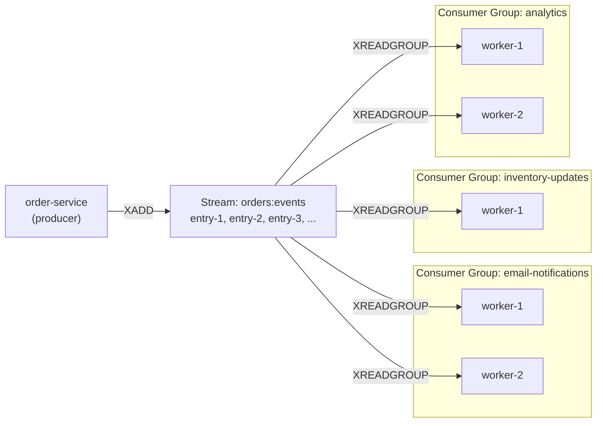
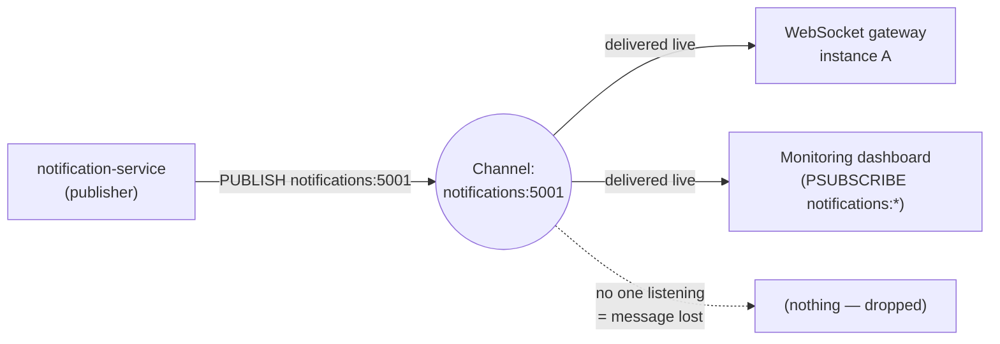
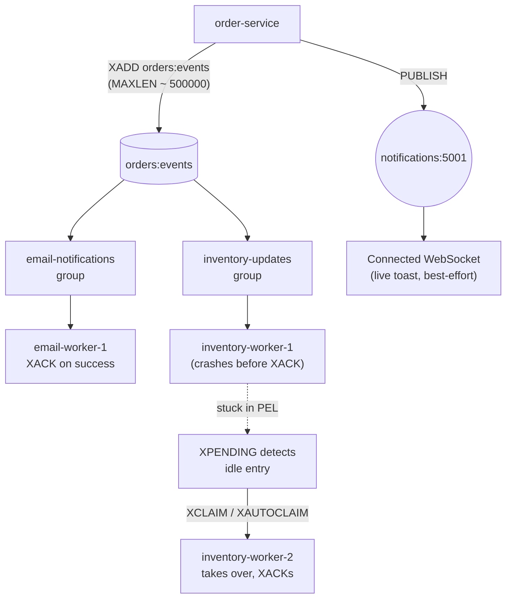

# Chapter 6: Streams & Pub/Sub

Chapters 4 and 5 gave you Redis's general-purpose data structures: strings, lists, hashes, sets, sorted sets, and bitmaps. Along the way you used a **list** as a naive job queue (`LPUSH`/`BRPOP`) and a **sorted set** as a time-ordered index (scores as timestamps, `ZRANGEBYSCORE` for windows). Both worked, and both had sharp edges the moment you needed more than one consumer to cooperate safely.

This chapter introduces the two data types Redis built specifically for messaging and event distribution: **Streams**, an append-only log with consumer-group semantics borrowed conceptually from Kafka, and **Pub/Sub**, a fire-and-forget broadcast mechanism. It closes with **geospatial commands**, which are really sorted sets wearing a trench coat — a natural place to put them now that you understand sorted sets deeply.

By the end of this chapter you'll know exactly which of these three tools to reach for, and — just as important — when to stop using Redis and reach for a dedicated message queue instead.

---

## Learning Objectives

By the end of this chapter, you will be able to:

- Explain why Lists are inadequate as a production job queue, and what specific problems Streams were designed to solve.
- Use the core Stream commands (`XADD`, `XRANGE`, `XREVRANGE`, `XLEN`, `XREAD`) and reason correctly about entry IDs.
- Set up consumer groups (`XGROUP CREATE`, `XREADGROUP`, `XACK`, `XPENDING`, `XCLAIM`/`XAUTOCLAIM`) to get at-least-once delivery with multiple independent worker pools.
- Bound stream memory growth with `XTRIM` and `MAXLEN`, including the exact-vs-approximate trimming trade-off.
- Decide, with justification, when Redis Streams are the right tool versus when Kafka/RabbitMQ/SQS are a better fit.
- Use Pub/Sub (`SUBSCRIBE`, `PUBLISH`, `PSUBSCRIBE`) for ephemeral real-time fan-out, and explain precisely why it cannot replace Streams for durable delivery.
- Use geospatial commands (`GEOADD`, `GEOSEARCH`, `GEODIST`, `GEOPOS`) to answer "what's near this point?" queries.

---

## Prerequisites

This chapter builds directly on:

- **[Chapter 4: Strings, Lists & Hashes](./04-strings-lists-and-hashes.md)** — you saw a Redis **List** used as a naive job queue with `LPUSH`/`RPUSH` and `BRPOP`/`BLPOP`. Keep that pattern in mind: everything in Section 1 below is framed as "here's exactly where that pattern breaks."
- **[Chapter 5: Sets, Sorted Sets & Bitmaps](./05-sets-sorted-sets-and-bitmaps.md)** — you used a **sorted set** as a time-ordered index (score = timestamp) to answer range queries like "give me everything between time A and time B." Streams generalize this idea into a purpose-built log, and geospatial indexes (Section 8) turn out to *be* sorted sets internally, scored by a geohash instead of a timestamp.
- QuickCart's running key vocabulary from earlier chapters: `session:{userId}`, `product:{sku}` (hash), `cart:{userId}` (hash), `leaderboard:daily` (sorted set), `ratelimit:{userId}:{endpoint}`. This chapter adds `orders:events` (stream), `notifications:{userId}` (Pub/Sub channel), and `stores:locations` (geo index).

If lists-as-queues and sorted-sets-as-indexes aren't solid yet, revisit those chapters first — this chapter assumes you can already picture QuickCart's cart, session, and leaderboard keys without looking them up.

---

## 1. Why Streams Exist: Where Lists Break as Queues

In Chapter 4, QuickCart used a Redis List as a lightweight job queue: a producer `LPUSH`es a job payload, a worker `BRPOP`s it off the other end. For a single worker processing non-critical background work, this is perfectly fine and genuinely useful. But push on it a little and it falls apart fast — precisely at the points where a real order-processing pipeline needs guarantees.

**Problem 1: `BRPOP` is destructive and exclusive.** The moment a worker pops an item off the list, it's gone from Redis. If that worker crashes mid-processing — say, after popping an "order placed" event but before it finishes updating inventory — the event is lost forever. There is no record that it ever existed, let alone that it was half-processed.

**Problem 2: No consumer tracking.** A List has no concept of "which consumer took this item" or "is this item still being worked on." If you want three worker processes competing for jobs, `BRPOP` will hand each item to exactly one of them (which is good for load-balancing) — but if that worker dies, nothing else in Redis knows the job needs to be retried by someone else.

**Problem 3: No replay.** Once popped, an item cannot be re-read. If QuickCart wants to add a *new* consumer later — say, an analytics pipeline that wants to process every order event from the last 24 hours to backfill a dashboard — a List offers nothing. The history is gone the instant it's consumed.

**Problem 4: No fan-out to independent consumer groups.** QuickCart's real requirement is that the *same* order event needs to be processed independently by an email-notification worker, an inventory-update worker, and an analytics worker. With a plain List, once one `BRPOP` claims an item, it's unavailable to everyone else — you'd need to `LPUSH` the same payload into three separate lists, manually duplicating data and juggling three sets of producer logic.

Redis Streams (added in Redis 5.0) exist to fix all four problems at once. A Stream is an **append-only log**: entries are never removed by reading them, every entry gets a durable, ordered ID, multiple independent groups of consumers can each read the entire log at their own pace, and — critically — a **consumer group** mechanism tracks exactly which consumer has claimed which entry and whether it's been acknowledged as done. This is the same conceptual family as Kafka's topics/partitions/consumer-groups, reimplemented as a native Redis data type.

| Requirement | List (`LPUSH`/`BRPOP`) | Stream (`XADD`/`XREADGROUP`) |
|---|---|---|
| Durable ordered log | No — items vanish on pop | Yes — entries persist until explicitly trimmed |
| Replay history | No | Yes — `XRANGE` re-reads any time range |
| Multiple independent consumer groups | Only by manual duplication | Native — one stream, many groups |
| Track in-flight/unacknowledged work | No | Yes — pending-entries list (PEL) |
| Recover a crashed consumer's work | No | Yes — `XCLAIM`/`XAUTOCLAIM` |
| At-least-once delivery guarantee | No | Yes, via `XACK` + PEL |

---

## 2. Streams Fundamentals: `XADD`, `XRANGE`, `XREVRANGE`, `XLEN`, `XREAD`

### 2.1 Adding entries with `XADD`

Every write to a stream is an `XADD`. Each entry is a small ordered set of field-value pairs (like a mini hash) with a unique, monotonically increasing **ID**.

```bash
# Auto-generated ID (the * tells Redis to assign one)
XADD orders:events * order_id 90142 status "placed" user_id 5001 amount 89.97

# Redis returns something like:
# "1719999999123-0"
```

QuickCart models every order lifecycle transition as one entry on a single stream, `orders:events`:

```bash
XADD orders:events * order_id 90142 status "placed"   user_id 5001 amount 89.97
XADD orders:events * order_id 90142 status "paid"     user_id 5001 amount 89.97
XADD orders:events * order_id 90142 status "shipped"  user_id 5001 tracking "1Z999AA1"
XADD orders:events * order_id 90142 status "delivered" user_id 5001
```

One stream, one append-only history of everything that ever happened to every order — a genuine event log, not just a mutable "current state" hash.

### 2.2 Entry IDs: `<ms>-<seq>`

An auto-generated ID has the form `<milliseconds-since-epoch>-<sequence>`. The millisecond part comes from the server's clock at write time; the sequence part disambiguates multiple entries added within the same millisecond (`0`, `1`, `2`, ...). IDs are strictly increasing, which is what makes range queries and "give me everything since ID X" semantics work correctly.

You can also supply an **explicit ID** instead of `*` — useful when migrating data from another system with its own ordering, or when you want to guarantee a specific ID for testing:

```bash
XADD orders:events 1719999999123-0 order_id 90143 status "placed"
```

Redis will reject an explicit ID that's less than or equal to the stream's current last ID — IDs must always increase. A common partial form is `<ms>-*`, which lets you pin the millisecond component and let Redis auto-assign the sequence.

### 2.3 Reading ranges: `XRANGE` and `XREVRANGE`

`XRANGE` reads entries between two IDs, oldest to newest. Use `-` and `+` as "beginning of time" and "end of time":

```bash
# Every event ever recorded for this stream
XRANGE orders:events - +

# Every event since a specific ID (exclusive start via "(")
XRANGE orders:events (1719999999123-0 +

# Only the 10 most recent, newest first
XREVRANGE orders:events + - COUNT 10
```

Because IDs embed a timestamp, you can also range-query by wall-clock time directly, without knowing an exact ID:

```bash
# Everything from 2026-07-06 00:00:00 UTC onward
XRANGE orders:events 1783382400000 +
```

This is the direct generalization of the sorted-set time-range trick from Chapter 5 — same mental model, purpose-built data type.

### 2.4 `XLEN` and blocking reads with `XREAD`

`XLEN orders:events` returns the entry count — handy for monitoring stream growth (see Section 4).

`XREAD` is for consumers that don't need consumer-group bookkeeping — a single reader tailing the stream:

```bash
# Block up to 5000ms waiting for anything newer than the last-seen ID
XREAD BLOCK 5000 STREAMS orders:events $
```

`$` means "only entries added after this call started" — the live-tail equivalent of `tail -f`. Plain `XREAD` is fine for a single-consumer use case, but it has no memory of what's been read across restarts and no way to coordinate multiple competing consumers — which is exactly why consumer groups exist.

---

## 3. Consumer Groups: At-Least-Once Delivery That Survives Crashes

A **consumer group** is a named cursor plus a bookkeeping ledger over a stream, shared by one or more consumers. This is where Streams earn their keep over Lists and over plain `XREAD`.

### 3.1 Creating a group

```bash
# $ = start reading from entries added after now, not stream history
XGROUP CREATE orders:events email-notifications $ MKSTREAM
XGROUP CREATE orders:events inventory-updates   $ MKSTREAM
XGROUP CREATE orders:events analytics           0 MKSTREAM
```

QuickCart creates **three independent consumer groups** on the same stream — one per downstream concern. `MKSTREAM` creates the stream if it doesn't exist yet. Note `analytics` starts from `0` (the beginning of the log) so it can backfill from full history, while the other two start from `$` (only new events going forward) — a good illustration of why a shared append-only log beats three separately-fed lists: each group chooses its own starting point over the *same* data.

### 3.2 Reading as part of a group: `XREADGROUP`

```bash
XREADGROUP GROUP email-notifications worker-1 COUNT 10 BLOCK 5000 STREAMS orders:events >
```

The `>` means "give me entries no one in this group has been given yet." Redis records, in that group's **pending entries list (PEL)**, that `worker-1` was handed this entry and hasn't yet confirmed processing.

### 3.3 Acknowledging: `XACK`

Once `worker-1` finishes processing (e.g., sends the email), it must explicitly acknowledge:

```bash
XACK orders:events email-notifications 1719999999123-0
```

This removes the entry from that group's PEL. Only after `XACK` is the entry considered "done" from that group's perspective — this is the mechanism that gives Streams **at-least-once delivery**: an entry is redelivered (never silently dropped) if it's never acknowledged, but a crash *before* acknowledgment can result in the same entry being processed twice by a replacement consumer. Downstream logic that isn't naturally idempotent (e.g., "send exactly one email") needs a dedupe guard — check `order_id` + `status` against a "already emailed" set before sending, for example.

### 3.4 Inspecting stuck work: `XPENDING`

```bash
# Summary: how many pending entries, oldest/newest ID, per-consumer counts
XPENDING orders:events email-notifications

# Detail: entries idle for more than 60 seconds
XPENDING orders:events email-notifications IDLE 60000 - + 10
```

`XPENDING` is your window into "what's been claimed but not finished" — the diagnostic tool for a crashed or stuck worker.

### 3.5 Recovering crashed consumers: `XCLAIM` and `XAUTOCLAIM`

If `worker-1` crashes after `XREADGROUP` but before `XACK`, its claimed entries sit in the PEL forever unless someone reclaims them. `XCLAIM` transfers ownership of specific, sufficiently-idle entries to another consumer:

```bash
XCLAIM orders:events email-notifications worker-2 60000 1719999999123-0
```

This says: "if entry `1719999999123-0` has been idle (unacknowledged) for at least 60000ms, reassign it to `worker-2`." `worker-2` can now process it and `XACK` it.

`XAUTOCLAIM` (Redis 6.2+) is the easier, cursor-based version — it scans the PEL for you instead of requiring you to already know the stuck IDs:

```bash
XAUTOCLAIM orders:events email-notifications worker-2 60000 0
```

This claims every entry idle for 60+ seconds, starting the PEL scan from cursor `0`, and hands them to `worker-2` in one call — the pattern a supervisory/janitor process runs on a timer to sweep up after crashed workers.



Each consumer group reads the **entire stream independently** — an email being sent doesn't consume the entry for the inventory group. Within a single group, consumers compete for entries (load-balanced), and each entry an individual consumer receives is tracked in that group's PEL until `XACK`.

---

## 4. Bounding Growth: `XTRIM` and Capped Streams

An append-only log that's never trimmed grows forever, and `orders:events` accumulating every order event since QuickCart's founding is a real memory liability — Redis is an in-memory store, and unbounded stream growth is one of the most common ways a stream quietly becomes the largest key in the keyspace.

`XTRIM` caps a stream to (approximately or exactly) the most recent N entries:

```bash
# Approximate trim — fast, uses internal macro-node boundaries
XTRIM orders:events MAXLEN ~ 100000

# Exact trim — guarantees precisely 100000 entries remain, costs more CPU
XTRIM orders:events MAXLEN = 100000
```

The `~` (approximate) form is strongly preferred in production: Redis stores stream entries in memory as "radix tree nodes" grouping many entries together, and an exact trim may have to split a node, which is more expensive. Approximate trimming only removes whole nodes it doesn't need, so it can leave somewhat more than N entries around but does so cheaply — a good trade for a use case where "roughly the last 100k events" is entirely sufficient.

You can also trim at write time, so you never need a separate trim job:

```bash
XADD orders:events MAXLEN ~ 100000 * order_id 90144 status "placed"
```

This tells Redis "append this entry, and while you're at it, opportunistically trim the stream to roughly 100,000 entries" — a single round trip instead of two.

An alternative to count-based trimming is `MINID`, which trims by ID (effectively by time) instead of by count — useful when your retention requirement is "keep 7 days of events" rather than "keep the last N events":

```bash
XTRIM orders:events MINID ~ 1719900000000
```

**A crucial caveat**: trimming removes entries from the stream itself, but a consumer group's PEL can still reference an entry that's since been trimmed away, which produces confusing gaps. Size `MAXLEN`/`MINID` generously enough that your slowest consumer group always catches up well before its unread backlog gets trimmed out from under it.

---

## 5. Streams vs. a Dedicated Message Queue

Streams give you a genuinely useful chunk of Kafka-like semantics for free, inside a data store you're probably already running. But "for free" comes with real limits — knowing them is what separates "used Redis correctly" from "found out the hard way in an incident."

**Where Redis Streams are a good fit:**

- You already run Redis and want durable event delivery without standing up and operating an entirely separate system (ZooKeeper/KRaft-backed Kafka cluster, RabbitMQ broker, or a managed queue with its own cost and latency profile).
- Throughput and retention needs are moderate — thousands to low tens of thousands of events/sec, with a retention window measured in hours to days, not months to years.
- You need low operational overhead: one more Redis key type, not one more distributed system with its own failure modes to learn.
- Consumer group semantics (competing consumers, independent groups, replay, crash recovery) cover your actual requirements without needing partition-level ordering guarantees across a cluster, exactly-once semantics, or complex routing/exchange topologies.

**Where a dedicated system (Kafka, RabbitMQ, SQS) wins:**

- **Massive scale and long-term retention.** Kafka is designed to durably retain terabytes of history across partitioned, replicated brokers as a genuine system of record; Redis Streams live in memory (persistence is via RDB/AOF, covered in Chapter 7) and aren't designed to be your indefinite audit log.
- **Complex routing.** RabbitMQ's exchange/binding model (topic, fanout, direct, headers exchanges) supports routing topologies Streams simply don't model — Streams are a single ordered log per key, not a routing engine.
- **Exactly-once or transactional delivery guarantees.** Streams give you at-least-once (Section 3.3); if your business logic genuinely cannot tolerate occasional duplicate processing even with idempotency guards, that's a signal to look at systems with stronger built-in guarantees.
- **Cross-datacenter, multi-region durability at queue scale.** Kafka's replication and partition model is purpose-built for this; Redis replication (Chapter 11) and Cluster (Chapter 12) solve related but different problems.
- **Enormous consumer fan-out or organizationally-decoupled teams.** A large, independently-evolving set of teams each with their own topics, schemas, and retention policies is Kafka's home turf.

A useful rule of thumb for QuickCart: `orders:events` as an internal, same-service coordination mechanism between a handful of in-house workers is a great Streams use case. If QuickCart later needs to stream every order event to a data warehouse, three other business units, and an external partner API with strict delivery SLAs and multi-year retention, that's the point to introduce Kafka *alongside* Redis, not to keep stretching Streams past its design center.

---

## 6. Pub/Sub Fundamentals

Pub/Sub is Redis's other messaging primitive, and it is architecturally almost the opposite of Streams: no persistence, no history, no consumer groups, no acknowledgment. It is pure, ephemeral broadcast.

### 6.1 Core commands

```bash
# Terminal A: subscribe to a channel
SUBSCRIBE notifications:5001

# Terminal B: publish a message
PUBLISH notifications:5001 '{"order_id": 90142, "status": "shipped"}'
```

The moment `PUBLISH` runs, Redis delivers the message to every client currently subscribed to `notifications:5001` — and that's the entire contract. If Terminal A wasn't connected and subscribed at that exact moment, it never sees that message. There's no buffer, no log, nothing to replay.

`UNSUBSCRIBE` (optionally with channel names) stops receiving on given channels; with no arguments it unsubscribes from all.

### 6.2 Pattern matching with `PSUBSCRIBE`

`PSUBSCRIBE` subscribes to a glob-style pattern instead of an exact channel name:

```bash
# Receive messages published to notifications:5001, notifications:5002, etc.
PSUBSCRIBE notifications:*
```

This is useful for a fan-in service that needs to observe all user notification traffic (e.g., a monitoring dashboard) without subscribing to every user's channel individually.

### 6.3 QuickCart's use case: real-time order-status pushes

QuickCart's web app keeps a WebSocket connection open per logged-in user. When an order's status changes, a lightweight notification service publishes to that user's channel:

```bash
PUBLISH notifications:5001 '{"order_id": 90142, "status": "shipped", "tracking": "1Z999AA1"}'
```

A small Redis-connected process on the backend, subscribed via `SUBSCRIBE notifications:5001` (or `PSUBSCRIBE notifications:*` fanning out to the right WebSocket by parsing the channel name), forwards the message straight to that user's open WebSocket. If the user isn't currently connected, the message is simply gone — which is fine here, because the *authoritative* status lives in the `orders:events` stream and the order-detail page; the push is a nice-to-have live update, not the system of record.



Every currently-subscribed client gets the message at the moment of publish; anyone not subscribed at that instant gets nothing, with no way to ask for it later.

---

## 7. Pub/Sub vs. Streams: The Decision Framework

These two are easy to conflate because both are "publish something, other things receive it" — but the guarantees are almost opposites, and mixing them up is how critical events silently vanish.

| | Pub/Sub | Streams |
|---|---|---|
| Persistence | None — in-memory, transient | Persisted as a normal key (survives via RDB/AOF like any other data) |
| Replay history | No | Yes — `XRANGE`, or a group starting from ID `0` |
| Delivery guarantee | At-most-once, and only to currently-connected subscribers | At-least-once, with tracked delivery via PEL |
| Missed-message behavior | Silently gone forever | Sits in the stream / that group's backlog until read and acked |
| Consumer coordination | None — every subscriber gets every message independently | Consumer groups let multiple *workers* split one logical stream of work |
| Best for | Ephemeral, "nice if seen" live updates | Durable events that must eventually be processed exactly once (at-least-once + idempotency) |

**The decision rule:** ask "if a message here were silently dropped and nobody ever saw it, would that be a shrug or an incident?"

- **Shrug → Pub/Sub.** A live "your order shipped!" toast notification that didn't render because the user's browser tab was closed at that instant is not a data-loss event — the order-detail page still shows "shipped" the next time they load it, sourced from durable state (a hash or the stream itself), not from the Pub/Sub message.
- **Incident → Streams.** "Send a confirmation email for every paid order" or "decrement inventory for every order" absolutely cannot be a shrug — a dropped message means a customer never gets their receipt or oversold inventory goes uncorrected. That's `orders:events` plus consumer groups, full stop.

A subtlety worth internalizing: it is entirely reasonable, and is exactly what QuickCart does, to use **both** for the same underlying business event — `XADD` to `orders:events` as the durable record that workers process reliably, *and* `PUBLISH` to `notifications:{userId}` purely as a "hey, something changed, go re-render" signal to a live UI. The stream is truth; the Pub/Sub message is just a doorbell.

---

## 8. Geospatial Commands (Sorted Sets in Disguise)

Redis's geo commands aren't a separate data type — they're a set of commands layered on top of a **sorted set**, where each member's score is a 52-bit geohash encoding its longitude and latitude. Everything you learned about sorted sets in Chapter 5 (`ZRANGE`, `ZSCORE`, `ZREM`, persistence, memory behavior) applies directly; the geo commands are just a friendlier interface for the coordinate-specific math.

### 8.1 Adding locations: `GEOADD`

```bash
GEOADD stores:locations -122.4194 37.7749 "store:sf-market-st"
GEOADD stores:locations -122.2712 37.8044 "store:oakland-broadway"
GEOADD stores:locations -73.9857 40.7484 "store:nyc-5th-ave"
```

Order is `longitude latitude member` — longitude first is a common gotcha (it's the opposite of the everyday "lat, long" convention).

### 8.2 Finding nearby stores: `GEOSEARCH`

```bash
# Every store within 25 km of a customer's coordinates, nearest first
GEOSEARCH stores:locations FROMLONLAT -122.41 37.77 BYRADIUS 25 km ASC WITHCOORD WITHDIST
```

This is QuickCart's store-locator feature in one command: "find the nearest store to this customer." `GEOSEARCH` (which replaced the older `GEORADIUS` in Redis 6.2+) also supports `BYBOX` for rectangular search areas and `COUNT` to cap results.

### 8.3 Distance and raw coordinates: `GEODIST` and `GEOPOS`

```bash
# Distance between two known members, in kilometers
GEODIST stores:locations "store:sf-market-st" "store:oakland-broadway" km

# Raw longitude/latitude back out for a member
GEOPOS stores:locations "store:sf-market-st"
```

Because it's a sorted set underneath, `ZREM stores:locations "store:sf-market-st"` removes a closed location exactly the way you'd expect, and `ZCARD stores:locations` tells you how many stores are indexed — no separate geo-specific cleanup commands needed.

---

## Real-World Scenario: QuickCart's Order Pipeline, End to End

Put Sections 3, 6, and 7 together into the shape QuickCart actually runs in production.

**1. Order placed — the producer writes once.**

```bash
XADD orders:events MAXLEN ~ 500000 * order_id 90142 status "placed" user_id 5001 amount 89.97
```

The `order-service` doesn't know or care who's downstream — it appends one entry and moves on. `MAXLEN ~ 500000` keeps the stream bounded automatically on every write.

**2. Two independent workers process it via two consumer groups.**

```bash
# email-worker instance, part of the "email-notifications" group
XREADGROUP GROUP email-notifications email-worker-1 COUNT 5 BLOCK 5000 STREAMS orders:events >
# ... sends confirmation email ...
XACK orders:events email-notifications 1719999999123-0

# inventory-worker instance, part of the "inventory-updates" group, reading the SAME entry
XREADGROUP GROUP inventory-updates inventory-worker-1 COUNT 5 BLOCK 5000 STREAMS orders:events >
# ... decrements product:{sku} stock field ...
XACK orders:events inventory-updates 1719999999123-0
```

Both groups see entry `1719999999123-0` independently — the email group acknowledging it has zero effect on whether the inventory group still needs to process it.

**3. A worker crashes mid-processing — detect and recover.**

Suppose `inventory-worker-1` crashes right after `XREADGROUP` claims an entry but before it calls `XACK`. A supervisory job periodically checks for stuck work:

```bash
XPENDING orders:events inventory-updates IDLE 30000 - + 10
```

This surfaces the entry, still sitting unacknowledged, idle for 30+ seconds. A fresh worker reclaims and finishes it:

```bash
XCLAIM orders:events inventory-updates inventory-worker-2 30000 1719999999123-0
# ... inventory-worker-2 decrements stock ...
XACK orders:events inventory-updates 1719999999123-0
```

Or, run continuously as a janitor process instead of manually inspecting `XPENDING` first:

```bash
XAUTOCLAIM orders:events inventory-updates inventory-worker-2 30000 0
```

No order is silently lost because a container happened to die mid-request — this is the entire point of building this on Streams instead of a plain List.

**4. Meanwhile, the notification service pushes a live update — no durability needed.**

```bash
PUBLISH notifications:5001 '{"order_id": 90142, "status": "placed"}'
```

If the customer's browser tab is open, they see "Order placed!" instantly. If it isn't, nothing breaks — the order detail page will show the correct status (sourced from durable state) the next time they load it. This message was never meant to be the system of record; `orders:events` already is.



---

## Best Practices

- **Always set `MAXLEN ~` on production streams**, either as a standing `XTRIM` cron or inline on every `XADD`, so a stream can never become an unbounded memory sink. Pick a size that comfortably outlasts your slowest consumer group's expected processing lag.
- **Monitor `XPENDING` per consumer group continuously**, and alert on entries idle beyond a sane threshold (e.g., 2–5x normal processing time) — a growing pending list is the earliest reliable signal of a stuck or crashed consumer.
- **Run a periodic `XAUTOCLAIM` sweep** as a lightweight janitor process rather than relying on manual intervention when a worker crashes.
- **Make downstream processing idempotent** wherever possible (dedupe by entry ID or business key) since Streams guarantee at-least-once, not exactly-once, delivery.
- **Never use Pub/Sub for anything that can't tolerate silent message loss.** If a missed message would cause a customer, financial, or inventory-correctness problem, it belongs on a stream with a consumer group, not a Pub/Sub channel.
- **Size `MAXLEN`/`MINID` with your slowest consumer group's backlog in mind** — trimming an entry a lagging group hasn't read yet creates permanent, silent gaps in that group's view of the world.

---

## Common Mistakes

- **Using Pub/Sub for critical business events.** A subscriber that's offline, mid-restart, or briefly disconnected during a `PUBLISH` simply never sees that message — there is no buffering, no replay, and no way to detect after the fact that anything was missed. This is fine for a live toast notification; it is a production incident if it's how you decrement inventory or trigger a payment capture.
- **Letting a stream grow unbounded.** Forgetting `MAXLEN`/`XTRIM` entirely turns `orders:events` into a permanently growing key that eventually dominates memory usage and slows operations that need to scan or load it — bound it from day one, not after an incident.
- **Forgetting to `XACK`.** Every entry a consumer reads via `XREADGROUP` stays in that group's pending entries list until acknowledged. A worker that processes successfully but forgets the `XACK` call leaves a phantom, ever-growing PEL that eventually distorts `XPENDING` output and can make `XCLAIM`/`XAUTOCLAIM` reprocess already-completed work.
- **Mixing up which command needs `MKSTREAM`.** `XGROUP CREATE` on a stream key that doesn't exist yet fails without the `MKSTREAM` flag — a common first-run surprise.
- **Assuming `XREAD` (without a group) gives you crash recovery.** Plain `XREAD` has no PEL, no `XACK`, and no `XCLAIM` — it's a simple tailing mechanism, not a substitute for consumer groups when reliability matters.
- **Confusing exact vs. approximate trim performance.** Defaulting to `MAXLEN =` (exact) "to be safe" on a busy stream adds real CPU overhead for a guarantee ("exactly N entries") that's rarely actually needed; `~` is the right default almost everywhere.

---

## Summary

- Redis Lists make a fine single-consumer queue but have no consumer tracking, no replay, and no way to fan work out to multiple independent consumer groups — Streams exist specifically to fix that.
- A Stream is an append-only log of ID-ordered entries (`<ms>-<seq>`), written with `XADD` and read with `XRANGE`/`XREVRANGE`/`XREAD`.
- Consumer groups (`XGROUP CREATE`, `XREADGROUP`, `XACK`, `XPENDING`, `XCLAIM`/`XAUTOCLAIM`) give at-least-once delivery: each group tracks its own read position and a pending-entries list of claimed-but-unacknowledged work, which lets a crashed consumer's work be detected and reclaimed.
- Streams must be bounded with `XTRIM`/`MAXLEN` (prefer the approximate `~` form) to avoid unbounded memory growth; `MINID` trims by time/ID instead of count.
- Streams are a strong fit for lightweight, embedded, low-ops event delivery between services already sharing Redis; a dedicated system (Kafka/RabbitMQ/SQS) wins at massive scale, complex routing, or long-term source-of-truth retention.
- Pub/Sub (`SUBSCRIBE`/`PUBLISH`/`PSUBSCRIBE`) is fire-and-forget: no persistence, no replay, no consumer groups — perfect for ephemeral fan-out like live notifications, wrong for anything that can't tolerate silent loss.
- Geospatial commands (`GEOADD`/`GEOSEARCH`/`GEODIST`/`GEOPOS`) are sorted sets scored by geohash — the same mental model from Chapter 5, applied to "what's near this point?" queries.

---

## Knowledge Check

1. Name three specific limitations of using a Redis List as a job queue that Streams were designed to solve.
2. What are the two components of a stream entry ID, and why must IDs be strictly increasing?
3. Explain, step by step, what happens in Redis's bookkeeping when a consumer calls `XREADGROUP` and then never calls `XACK`.
4. Why is `XPENDING` combined with `XCLAIM` (or `XAUTOCLAIM`) necessary for reliable processing, when `XACK` alone seems like it should be enough?
5. What's the practical difference between `XTRIM ... MAXLEN ~ 100000` and `XTRIM ... MAXLEN = 100000`, and which would you default to in production and why?
6. A teammate proposes using Pub/Sub to notify a billing service that a payment needs to be captured. What's wrong with this design, and what should they use instead?
7. Give one scenario where Pub/Sub is clearly the right tool and Streams would be overkill.
8. Why are Redis's geo commands described as "sorted sets in disguise," and what practical implication does that have (e.g., for removing a location)?

---

## Hands-On Exercise

Work through this against a local `redis-cli` session (or `redis-cli -x`/multiple terminals for the blocking parts).

**Part 1 — Build the stream and a consumer group:**

```bash
# 1. Create the stream with a couple of order events
XADD orders:events * order_id 1 status "placed" user_id 100
XADD orders:events * order_id 2 status "placed" user_id 101
XADD orders:events * order_id 3 status "placed" user_id 102

# 2. Confirm entries and count
XRANGE orders:events - +
XLEN orders:events

# 3. Create a consumer group starting from the beginning of the stream
XGROUP CREATE orders:events inventory-updates 0
```

**Part 2 — Simulate a worker claiming work and crashing before ack:**

```bash
# 4. "worker-A" reads two entries but does NOT XACK either (simulating a crash)
XREADGROUP GROUP inventory-updates worker-A COUNT 2 STREAMS orders:events >

# 5. Confirm they're stuck pending
XPENDING orders:events inventory-updates
XPENDING orders:events inventory-updates - + 10
```

**Part 3 — Detect and reclaim the stuck work:**

```bash
# 6. Reclaim anything idle for at least 10 seconds (wait ~10s after step 4 first)
XCLAIM orders:events inventory-updates worker-B 10000 <paste-one-entry-id-from-step-5>

# 7. Or reclaim everything at once with the cursor-based version
XAUTOCLAIM orders:events inventory-updates worker-B 10000 0

# 8. worker-B finishes the job properly this time
XACK orders:events inventory-updates <entry-id>

# 9. Confirm the pending list has shrunk
XPENDING orders:events inventory-updates
```

**Part 4 — Bound the stream and try Pub/Sub:**

```bash
# 10. Cap the stream to the most recent 1000 entries going forward
XADD orders:events MAXLEN ~ 1000 * order_id 4 status "placed" user_id 103

# 11. In one terminal, subscribe:
SUBSCRIBE notifications:100
# 12. In a second terminal, publish a status update and watch it arrive live:
PUBLISH notifications:100 '{"order_id": 1, "status": "shipped"}'
```

Write down, in your own words: what would have happened to the message in step 12 if you had run the `PUBLISH` *before* starting the `SUBSCRIBE`? Contrast that with what happened to the entries in steps 4–5 when `worker-A` "crashed" — why does one vanish and the other doesn't?

---

## Further Reading

- Redis official docs — [Streams introduction](https://redis.io/docs/latest/develop/data-types/streams/) — the canonical reference for entry IDs, consumer groups, and the PEL.
- Redis official docs — [Pub/Sub](https://redis.io/docs/latest/develop/interact/pubsub/) — channel/pattern semantics and Redis Cluster considerations for Pub/Sub.
- Redis official docs — [Geospatial](https://redis.io/docs/latest/develop/data-types/geospatial/) — full `GEOADD`/`GEOSEARCH` command reference and geohash precision notes.
- Kleppmann, M., *Designing Data-Intensive Applications* — Chapter 11 ("Stream Processing") for the broader conceptual background Streams borrow from (logs, consumer groups, at-least-once vs. exactly-once).
- Redis blog — "Redis Streams" launch posts, for the original design rationale comparing Streams to Kafka's log model.

---

<div style="display:flex;justify-content:space-between;align-items:center;">
  <a href="./05-sets-sorted-sets-and-bitmaps.md">← Previous: Sets, Sorted Sets & Bitmaps</a>
  <a href="./00-index.md">🏠 Index</a>
  <a href="./07-persistence-rdb-and-aof.md">Next: Persistence: RDB & AOF →</a>
</div>
