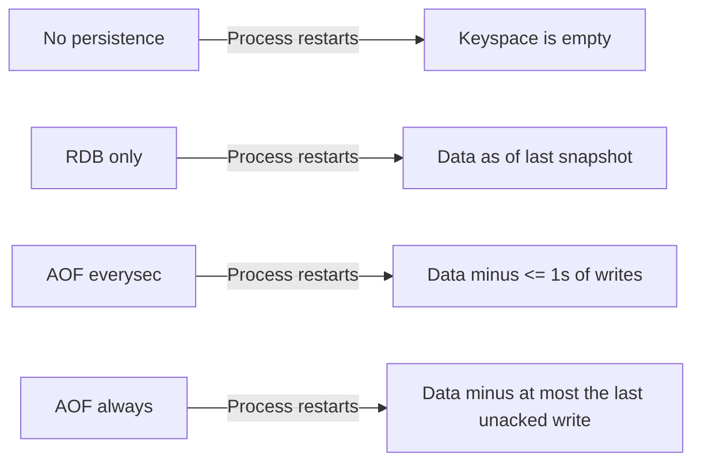

# Chapter 7: Persistence: RDB & AOF

Every chapter so far has treated Redis as a place where data simply *is* — you `SET` a key, you `LPUSH` onto a list, you `XADD` to a stream, and it's there the next time you ask. That framing has been useful for learning commands, but it quietly hides one of the most consequential design decisions in Redis: **by default, "there" means "in RAM, and only in RAM."** If the process dies, restarts, or the host reboots, everything you wrote is gone unless you explicitly told Redis to write it somewhere durable first.

This chapter is about that explicit choice. Redis gives you two independent persistence mechanisms — RDB snapshots and the Append-Only File (AOF) — plus a hybrid mode that combines them, and none of them are switched on to "maximally safe" out of the box. Understanding what each one actually guarantees, what it costs in performance and disk I/O, and how to pick between them for a given workload is a core operational skill, not a footnote. QuickCart, our running e-commerce example, will use three different persistence strategies across three different Redis instances in this chapter — because "how much data loss can I tolerate on this instance" is a question with a different answer depending on what the instance is for.

---

## Learning Objectives

By the end of this chapter, you will be able to:

- Explain why Redis persistence is an opt-in configuration decision, and describe precisely what data loss looks like with no persistence enabled at all.
- Configure RDB snapshotting (`save` directives, `SAVE` vs. `BGSAVE`) and explain the fork-based mechanism that makes `BGSAVE` non-blocking.
- Configure AOF (`appendonly yes`, `appendfsync` policies) and reason about the durability/performance trade-off each `fsync` policy makes.
- Explain how AOF rewriting (`BGREWRITEAOF`) keeps the log from growing unbounded, and describe Redis 7's multi-part AOF format.
- Combine RDB and AOF via hybrid persistence (`aof-use-rdb-preamble`) to get fast restarts with a small data-loss window.
- Design a per-instance persistence strategy for a real multi-instance deployment, and describe how a replica's initial sync relates to RDB.

---

## Prerequisites for This Chapter

This chapter builds directly on [Chapter 3: Architecture & Internals](./03-architecture-and-internals.md), specifically the discussion of Redis's single-threaded event loop and the `fork()`/copy-on-write mechanics that make `BGSAVE` possible. If you haven't internalized that model yet, here's the two-sentence recap this chapter leans on repeatedly:

> When Redis needs to write a consistent snapshot of memory to disk without blocking the main event loop, it calls `fork()` to create a child process. Thanks to the operating system's copy-on-write page sharing, the child initially shares all memory pages with the parent — pages are only duplicated when either process writes to them — so the fork itself is fast and the child can serialize a stable point-in-time view of memory while the parent keeps serving requests.

Everything about `BGSAVE`'s non-blocking behavior, its memory overhead under heavy write load, and its interaction with instance sizing traces back to that one mechanism. We'll also refer back to [Chapter 6: Streams & Pub/Sub](./06-streams-and-pub-sub.md) briefly, since stream data (unlike Pub/Sub messages) is exactly the kind of durable, replay-oriented data where persistence choices matter most.

You should also be comfortable with:

- Editing `redis.conf` and restarting a Redis instance to pick up configuration changes (Chapter 1).
- Basic `redis-cli` usage (Chapter 2).
- Docker basics, since the hands-on exercise uses a Redis container.

---

## 1. Persistence Is a Choice, Not a Default Guarantee

Redis is, first and foremost, an **in-memory** data structure store. That's the entire basis for its speed: reads and writes touch RAM, not disk, so latency is measured in microseconds rather than milliseconds. But RAM is volatile — it does not survive a process crash, an `OOM kill`, a Kubernetes pod eviction, a host reboot, or someone accidentally running `docker rm` on the wrong container.

If you start a Redis server with both persistence mechanisms disabled — no `save` directives, `appendonly no` — and load it with data, that data exists **only** in that one process's memory. There is no background copy anywhere. Restart the process, even gracefully, and the keyspace comes back empty. This is not a bug; it is Redis behaving exactly as configured, and it is also the exact behavior a surprising number of teams discover by accident, in production, at the worst possible time.

This matters because Redis's role has expanded well beyond "cache in front of a real database." Session stores, shopping carts, rate-limiter counters, job queues built on lists or streams, and leaderboards built on sorted sets are all cases where Redis holds data that has no other copy anywhere else. For those use cases, "no persistence" isn't a performance optimization — it's a decision to accept unbounded data loss on every restart.

The practical takeaway for the rest of this chapter: every Redis instance you deploy should have its persistence configuration chosen **deliberately**, based on one question — *if this process restarts right now, how much data can I afford to lose, and can I reconstruct it from somewhere else?* Redis gives you the dials (RDB, AOF, both, or neither); it does not pick sensible defaults for your business requirements, because it can't know them.



---

## 2. RDB Snapshots: Point-in-Time Binary Dumps

### 2.1 What RDB is

RDB (Redis Database) persistence produces a single, compact binary file — by default `dump.rdb` — that is a point-in-time snapshot of the entire keyspace at the moment the snapshot was taken. Think of it as a photograph: it captures everything that existed at that instant, and nothing that happened before or after.

### 2.2 `SAVE` vs. `BGSAVE`

Redis exposes two commands to trigger a snapshot:

- **`SAVE`** — performs the snapshot synchronously, in the main thread, blocking every other client until it finishes. On a large dataset this can mean seconds of total unresponsiveness. **Avoid `SAVE` in production** except in narrow, deliberate maintenance windows where you've already stopped traffic.
- **`BGSAVE`** — forks a child process (the mechanism from Chapter 3) and lets the child write the snapshot while the parent process keeps serving reads and writes normally. This is the command Redis itself uses internally when your `save` directives fire, and it's the one you should reach for if you ever trigger a snapshot manually.

```
127.0.0.1:6379> BGSAVE
Background saving started
127.0.0.1:6379> INFO persistence
# Persistence
rdb_bgsave_in_progress:0
rdb_last_bgsave_status:ok
rdb_last_bgsave_time_sec:1
```

Because `BGSAVE` relies on `fork()` and copy-on-write, it has a real (if usually modest) memory cost: every page the parent modifies while the child is still writing gets duplicated rather than shared. On a write-heavy instance with a large keyspace, a slow disk, or an oversized fork, this copy-on-write overhead can spike memory usage noticeably during the snapshot — the exact mechanism covered in Chapter 3, now with an operational consequence: **size your instance's available memory headroom with `BGSAVE`'s worst-case fork cost in mind, not just the resident dataset size.**

### 2.3 The `save` directive

Automatic snapshotting is controlled by one or more `save` lines in `redis.conf`, each specifying a "seconds elapsed, minimum number of changes" pair. Redis triggers a `BGSAVE` automatically once **any** of the configured conditions is satisfied:

```conf
# Save the DB if at least 1 key changed in 900 seconds (15 min)
save 900 1
# Save the DB if at least 10 keys changed in 300 seconds (5 min)
save 300 10
# Save the DB if at least 10000 keys changed in 60 seconds
save 60 10000
```

These three lines are checked independently and continuously — the first one to be satisfied fires a snapshot, and the internal change counter resets. Setting `save ""` (empty string) disables automatic RDB snapshotting entirely, which you'll do deliberately for pure-cache instances or when you're relying on AOF alone.

### 2.4 RDB file format basics

An RDB file is a compact, custom binary format: a header identifying the format version, followed by a sequence of key-value entries encoded with type-specific, size-optimized representations (the same internal encodings you saw in Chapters 4–5 — e.g., a small hash stored as a `listpack` serializes far more compactly than an equivalent Java-style hash table would), an optional expire timestamp per key, and a trailing checksum (CRC64) for corruption detection. Because it's a serialized, type-aware format rather than a memory dump, RDB files are portable across machines, architectures, and even Redis versions within reason — you can copy `dump.rdb` from one server to another and load it directly.

### 2.5 RDB: pros and cons

**Pros:**

- **Compact** — a single file, smaller than the in-memory footprint, cheap to store and transfer.
- **Fast restarts** — loading a binary snapshot is dramatically faster than replaying a command log, especially on large datasets.
- **Ideal for backups** — a single, atomic, portable file is exactly what you want for off-box backup and disaster-recovery tooling.
- **Low runtime overhead** — outside the fork moment, RDB adds essentially zero per-write cost, since ordinary writes don't touch disk at all.

**Cons:**

- **Data-loss window** — anything written after the last successful snapshot and before a crash is gone. With `save 300 10`, that window can be up to five minutes of writes.
- **Fork cost on large datasets** — the `BGSAVE` fork, while fast, is not free, and on very large keyspaces or memory-constrained hosts it can cause latency blips or OOM risk (Chapter 3's territory again).
- **All-or-nothing recovery point** — you get exactly the state at snapshot time; there's no partial recovery to "a few seconds before the crash."

---

## 3. AOF: The Append-Only File

### 3.1 What AOF is

Where RDB captures a *photograph*, AOF captures a *video log*: every write command Redis executes is appended, in order, to a log file. Restarting Redis with AOF enabled means replaying that entire log from the beginning to reconstruct the keyspace exactly as it was, command by command.

Enable it with:

```conf
appendonly yes
appendfilename "appendonly.aof"
appenddirname "appendonlydir"
```

### 3.2 `appendfsync` policies

Appending to the log is one thing; making sure the operating system has actually flushed those bytes to physical disk (`fsync`) is another — the OS page cache will happily buffer writes in memory and flush them lazily unless told otherwise. Redis exposes three `fsync` policies:

| Policy | Behavior | Durability | Performance cost |
|---|---|---|---|
| `always` | `fsync` after every single write command | Best — at most the in-flight write is at risk | Highest — every write pays a disk sync round-trip |
| `everysec` | `fsync` once per second, batching all writes in that window | Good default — at most ~1 second of writes at risk | Low — background thread handles the sync, barely visible to clients |
| `no` | Never call `fsync` explicitly; let the OS decide when to flush | Weak — as much data as the OS's own buffer can hold before a crash | Lowest — no sync overhead at all |

```conf
appendfsync everysec
```

`everysec` is the practical default for the overwhelming majority of workloads: it bounds your worst-case loss to about one second of writes, and because the `fsync` happens in a background thread rather than on the request path, it barely affects request latency. `always` is for workloads where even one second of data loss is unacceptable — financial ledgers, for instance — but it comes at a real cost: every write now waits on a disk sync before it's acknowledged as durable, and disk sync latency (even on SSD) is orders of magnitude slower than an in-memory operation. `no` is rarely a deliberate choice; it mostly shows up as a way to squeeze extra throughput out of AOF while accepting that a crash could lose an arbitrary, OS-dependent amount of recent writes.

### 3.3 AOF rewrite: keeping the log from growing forever

A naive append-only log grows without bound — if a counter is incremented a million times, the log contains a million `INCR` commands, even though the *current* state could be represented by one `SET counter 1000000`. Redis solves this with **AOF rewriting**: it produces a new, compact AOF file that represents the current dataset with the minimum necessary commands (much like an RDB snapshot, but written in AOF's command-log format), then atomically swaps it in for the old, bloated file.

Rewriting happens automatically based on growth-ratio thresholds:

```conf
auto-aof-rewrite-percentage 100
auto-aof-rewrite-min-size 64mb
```

This says: once the AOF has grown to at least 100% larger than the size it was after the last rewrite (and is at least 64 MB), trigger a rewrite automatically. You can also trigger one manually:

```
127.0.0.1:6379> BGREWRITEAOF
Background append only file rewriting started
```

Like `BGSAVE`, `BGREWRITEAOF` forks a child process — the same copy-on-write mechanics from Chapter 3 apply here too. While the child builds the new compact file, the parent keeps appending new writes to the *old* file and buffers writes that occur during the rewrite so nothing is lost when the swap happens.

---

## 4. AOF File Format Evolution: Multi-Part AOF (Redis 7+)

Older Redis versions (pre-7.0) used a single monolithic AOF file. Rewriting it meant writing an entirely new file from scratch and then renaming it into place — functionally fine, but operationally awkward: it made it hard to keep historical AOF files around cheaply, it meant every rewrite re-wrote data that hadn't actually changed, and tooling that wanted to inspect "just the recent writes" had no way to do so without parsing the whole file.

Redis 7.0 introduced the **multi-part AOF** format, which splits persistence into three pieces inside a manifest-tracked directory (`appenddirname`, shown above):

- **Base file** (`appendonly.aof.1.base.rdb` or `.aof`) — a full snapshot of the dataset at the time of the last rewrite, written in either RDB or AOF format (see `aof-use-rdb-preamble` in Section 5).
- **Incremental file(s)** (`appendonly.aof.1.incr.aof`) — the ongoing log of write commands appended since that base was written.
- **Manifest file** (`appendonly.aof.manifest`) — a small text file listing which base and incremental files are currently active, in order, so Redis (and any tooling) knows exactly how to reconstruct state on startup.

```
appendonlydir/
├── appendonly.aof.1.base.rdb
├── appendonly.aof.1.incr.aof
└── appendonly.aof.manifest
```

This is a meaningful operational improvement over the old single-file approach:

- **Rewrites become cheaper and safer** — a rewrite only needs to write a new base file and start a fresh, empty incremental file; it no longer needs to re-serialize and atomically replace one giant file in a single risky step.
- **Crash safety during rewrite improves** — because the base and incremental files are separate and the manifest is only updated once both are safely on disk, a crash mid-rewrite can't corrupt the previously-working AOF state the way a botched single-file swap could.
- **History and tooling get easier** — you can copy or archive base+incremental+manifest sets as a unit, and external tools can reason about "what's the base, what's new since then" without re-implementing rewrite logic.

If you're running Redis 7 or later (which you should be, for new deployments), this is what `appendonly yes` gives you by default — you don't need to opt into the multi-part format explicitly, but it's worth recognizing the file layout when you see it on disk, since it looks unfamiliar if you learned AOF from older documentation.

---

## 5. Combining RDB + AOF: Hybrid Persistence

RDB and AOF aren't mutually exclusive — running both is common and, for most durability-sensitive workloads, recommended. But there's a specific setting worth calling out: `aof-use-rdb-preamble`.

```conf
appendonly yes
aof-use-rdb-preamble yes
```

When enabled (it's the default), the **base file** produced during an AOF rewrite is written in RDB's compact binary format instead of as a long sequence of AOF commands. The result is a hybrid file: an RDB-formatted preamble (fast to load, compact) followed by the incremental AOF commands that occurred since that base was written (captures everything up to the last `fsync`).

This gets you the best of both mechanisms at once:

- **Fast restarts**, because the bulk of the dataset loads via RDB's efficient binary deserialization rather than replaying millions of individual commands.
- **Minimal data loss**, because the incremental AOF tail still captures every write since the last rewrite, subject to your `appendfsync` policy.

```mermaid
gantt
    title RDB vs AOF: Data-Loss Window Over Time
    dateFormat  X
    axisFormat %Ls
    section RDB (save 300 10)
    Snapshot at t=0           :milestone, m1, 0, 0
    Writes accumulating (at risk) :active, 0, 300
    Snapshot at t=300         :milestone, m2, 300, 300
    section AOF (everysec)
    Continuous log + fsync/sec :done, 0, 300
    Max loss window ~1s        :crit, 299, 300
    section Hybrid (RDB base + AOF tail)
    RDB base at last rewrite  :milestone, m3, 0, 0
    AOF tail (everysec)       :done, 0, 300
```



Read the diagram as: pure RDB's risk window is the full interval between snapshots (up to 300 seconds in this configuration); AOF's risk window is bounded by the `fsync` policy (about 1 second with `everysec`); hybrid persistence restarts fast from the RDB-formatted base but still only risks losing the same ~1 second tail that plain AOF would.

---

## 6. Choosing a Persistence Strategy by Workload

There's no single "correct" persistence configuration — the right answer depends entirely on what happens if the data disappears.

| Workload | Recoverable elsewhere? | Recommended strategy |
|---|---|---|
| Pure cache (e.g., rendered API responses, computed aggregates) | Yes — recompute or re-fetch from source | `appendonly no`, RDB optional or `save ""` (none) |
| Read-through cache of a slow-changing catalog | Yes — rebuild from the source database | RDB only, generous `save` intervals |
| Session store | No — user gets logged out, mildly annoying but not catastrophic | AOF, `appendfsync everysec` |
| Shopping cart / job queue | No — real user or business data, loss is costly | AOF, `appendfsync everysec` (or `always` for the most critical queues) |
| Leaderboard / gamification state | No — regenerating trust and progress is expensive in goodwill | Hybrid: RDB base + AOF `everysec` |
| Rate-limiter counters | Yes — worst case, limits briefly reset, low blast radius | `appendonly no`, RDB optional |

The general heuristic: **ask whether Redis is the source of truth or a derived view.** If it's a derived view (a cache) with a cheap, reliable way to repopulate it, disposable is fine and persistence should be minimal or absent — you're trading a slightly slower cold start for zero durability overhead on every write. If Redis *is* the source of truth for that data — no other system has a copy — durability stops being optional, and you should be running AOF at minimum, hybrid persistence for anything users would notice or complain about losing.

QuickCart's deployment, introduced across earlier chapters, splits exactly along these lines — worked through in full in the Real-World Scenario below.

---

## 7. Backup and Disaster Recovery

Persistence and backup are related but distinct: persistence protects you from a *process* restart; backups protect you from *everything else* — disk failure, a bad deploy that corrupts data, an operator running `FLUSHALL` against the wrong instance, or a host that never comes back.

### 7.1 Backing up RDB files

Because RDB is a single, self-contained, atomically-written file, backing it up is straightforward:

```bash
# Trigger a fresh snapshot, then copy it off-box
redis-cli BGSAVE
# wait for rdb_bgsave_in_progress:0 in `INFO persistence`, then:
cp /var/lib/redis/dump.rdb /backups/redis/dump-$(date +%F-%H%M).rdb
```

For a running instance you don't want to `BGSAVE` against (e.g., to avoid the fork cost during peak traffic), `redis-cli --rdb` streams a point-in-time RDB-format dump directly to a local file over the existing connection, without needing filesystem access to the server:

```bash
redis-cli -h prod-redis.internal --rdb /backups/redis/snapshot.rdb
```

This is especially useful for managed Redis services where you don't have shell access to the box the data file lives on.

### 7.2 Restoring from a backup

Restoring is just the reverse: stop the server (or point a fresh instance at the file), place the RDB file at the configured `dir`/`dbfilename` path, and start Redis — it loads the file automatically on boot.

```bash
systemctl stop redis
cp /backups/redis/dump-2026-07-05-0300.rdb /var/lib/redis/dump.rdb
systemctl start redis
redis-cli DBSIZE   # sanity-check the key count matches expectations
```

If you're running AOF, restoring means restoring the entire `appendonlydir/` (base + incremental + manifest) as a unit — restoring only the incremental file, or only the base, will not reconstruct correct state.

### 7.3 Test your restores

A backup you have never restored is a hypothesis, not a backup. The only way to know your RDB or AOF backup actually works is to periodically spin up a throwaway Redis instance, point it at the backup file(s), start it, and verify the data looks right — key counts, spot-checked values, and (if you track it) an application-level smoke test against that instance. This should be a scheduled, automated exercise, not something you do for the first time during an actual incident.

---

## 8. Interaction with Replication (Preview of Chapter 11)

Persistence and replication are separate mechanisms, but they lean on each other in an important way that's worth previewing now, ahead of the full treatment in [Chapter 11: Replication & High Availability](./11-replication-and-high-availability.md).

When a replica connects to a leader for the first time (or reconnects after being disconnected too long for a partial resync), it performs a **full sync**: the leader runs the equivalent of a `BGSAVE`, streams the resulting RDB snapshot to the replica over the replication connection, and the replica loads it wholesale to bootstrap its initial dataset. From that point forward, the leader streams every subsequent write command to the replica incrementally, the same way it would append them to its own AOF, keeping the replica's state converging with the leader's in near real time.

The practical implication for this chapter: **RDB isn't just a backup mechanism — it's the literal bootstrap payload for replication.** An instance with `save ""` and no RDB snapshotting still generates an RDB-format payload on demand when a replica attaches, because the full-sync mechanism reuses the same snapshot machinery regardless of your on-disk persistence configuration. This is one more reason the fork/copy-on-write cost from Chapter 3 matters operationally: it fires not only on your scheduled `BGSAVE`s, but every time a replica needs a full resync.

---

## Real-World Scenario: Per-Instance Persistence at QuickCart

QuickCart runs three logically distinct Redis instances, each serving a different purpose, and each configured with a deliberately different persistence strategy rather than one blanket setting copy-pasted across the fleet.

### Product-cache instance: RDB-only (disposable)

This instance caches rendered product pages and computed category listings, all derived from QuickCart's PostgreSQL catalog. If it's wiped, the application simply falls through to the database and repopulates the cache — slower for a few minutes, but never wrong or lost.

```conf
# quickcart-cache.conf
appendonly no
save 900 1
save 300 100
maxmemory 4gb
maxmemory-policy allkeys-lru
```

RDB snapshots are kept mostly so a routine restart (deploy, host maintenance) doesn't force a fully cold cache — not as a durability guarantee. `appendonly no` avoids paying any per-write `fsync` cost on an instance where durability isn't valued.

### Cart/session instance: AOF, `everysec`

This instance holds shopping carts and login sessions — real, no-other-copy user state where losing a cart mid-checkout is a real (if not catastrophic) customer-experience problem.

```conf
# quickcart-cart-session.conf
appendonly yes
appendfsync everysec
aof-use-rdb-preamble yes
auto-aof-rewrite-percentage 100
auto-aof-rewrite-min-size 64mb
save ""
```

AOF with `everysec` bounds data loss to roughly one second of writes on a crash — an acceptable trade for near-zero impact on write latency. `save ""` disables independent RDB snapshotting since `aof-use-rdb-preamble` already gives hybrid persistence via the AOF rewrite's RDB-formatted base file.

### Leaderboard instance: hybrid RDB + AOF

QuickCart runs seasonal sales gamification — points, badges, and a live leaderboard built on sorted sets (Chapter 5). Losing a customer's earned progress generates support tickets and real ill will, even though it's "just points." This instance gets the most conservative configuration on the fleet.

```conf
# quickcart-leaderboard.conf
appendonly yes
appendfsync everysec
aof-use-rdb-preamble yes
auto-aof-rewrite-percentage 50
auto-aof-rewrite-min-size 32mb
save 300 1
```

Here, RDB snapshotting (`save 300 1`) runs *alongside* AOF for an extra layer of standalone, portable backup artifacts — useful for the nightly off-box backup job described in Section 7 — while AOF with `everysec` handles the moment-to-moment durability. The lower rewrite threshold (`50%`/`32mb`) keeps the AOF file smaller and rewrites more frequent, since this instance's write volume is modest and the team would rather pay the small, regular cost of more frequent rewrites than let the log grow large between them.

---

## Best Practices

- **Set a persistence strategy per use case, not per fleet.** A cache instance and a source-of-truth instance should almost never share a `redis.conf` template — treat persistence configuration as part of the instance's role definition, the way QuickCart's three profiles show.
- **Test your restore process before you need it.** Schedule regular, automated restores of your RDB/AOF backups into a scratch instance and verify the data, not just that the file exists in the backup bucket.
- **Monitor rewrite duration and disk I/O, not just success/failure.** `INFO persistence` exposes `rdb_last_bgsave_time_sec`, `aof_rewrite_in_progress`, and `aof_last_bgrewrite_status` — alert on rewrites that take unusually long, since that's often an early signal of disk contention or a keyspace that's outgrown its current instance sizing.
- **Understand the fork memory cost before sizing instances that use `BGSAVE`.** Chapter 3's copy-on-write mechanics mean a `BGSAVE` (or `BGREWRITEAOF`) on a heavily-written, large-keyspace instance can transiently use significantly more memory than the resident dataset alone — leave real headroom, don't size to the wire.
- **Prefer `everysec` over `always` unless you've measured that you actually need `always`.** The latency cost of `always` is easy to underestimate until it's in production under load.
- **Keep an eye on AOF directory size and rewrite cadence**, especially on write-heavy instances — an AOF that never rewrites because `auto-aof-rewrite-percentage` is misconfigured (or manual rewrites were disabled) can grow to consume unexpected disk space and lengthen restart time.

---

## Common Mistakes

- **Assuming `appendfsync always` is "free" durability with no downside.** It durably syncs every single write to disk before acknowledging it — on workloads with meaningful write throughput, this is a measurable and sometimes severe latency and throughput cost, not a free upgrade.
- **Never actually testing backup restoration.** A backup job that runs successfully every night for a year but has never been restored is unverified — the first restore attempt during a real incident is the worst possible time to discover a corrupt file, a missing manifest, or a wrong path.
- **Running `SAVE` (not `BGSAVE`) against a production instance**, usually by habit or muscle memory from `redis-cli`, and blocking every connected client for the duration of a synchronous snapshot on a large dataset.
- **Treating a pure-cache instance as if it needs the same durability posture as a source-of-truth store.** Turning on `appendfsync always` for a disposable, rebuildable cache spends real latency and disk I/O budget protecting data that was never worth protecting in the first place.
- **Forgetting that disabling `save` directives doesn't disable RDB entirely.** As covered in Section 8, replication full-syncs still generate an RDB payload on demand regardless of your `save` configuration — "I turned off RDB" is not quite as absolute as it sounds.
- **Restoring only part of a multi-part AOF.** Copying just the incremental file without its matching base file and manifest produces an incomplete, unloadable, or silently wrong dataset.

---

## Summary

- Redis is in-memory first; persistence (RDB, AOF, or both) is an explicit, opt-in configuration decision, and running with neither means total data loss on any restart or crash.
- **RDB** produces compact, point-in-time binary snapshots. `SAVE` blocks; `BGSAVE` forks (via the Chapter 3 copy-on-write mechanism) to snapshot without blocking. Configured via `save <seconds> <changes>` directives. Fast to restore, but has a data-loss window between snapshots.
- **AOF** logs every write command as it happens. `appendfsync` controls the durability/performance trade-off: `always` (safest, slowest), `everysec` (practical default), `no` (fastest, weakest). `BGREWRITEAOF` compacts the log periodically.
- **Redis 7's multi-part AOF format** splits persistence into a base file, incremental file(s), and a manifest, making rewrites cheaper and safer than the old single-file approach.
- **Hybrid persistence** (`aof-use-rdb-preamble yes`) writes the AOF rewrite's base file in RDB format, combining RDB's fast restarts with AOF's small data-loss window.
- **Strategy should follow workload**: disposable/rebuildable data needs little or no persistence; source-of-truth data (sessions, carts, gamification state) needs AOF at minimum, often hybrid.
- **Backups are distinct from persistence** and protect against different failure modes (disk loss, corruption, operator error); `redis-cli --rdb` and periodic restore testing are the concrete tools.
- **Replication's full sync reuses RDB's snapshot machinery** to bootstrap a new replica, regardless of your own instance's persistence configuration — the first deep link to Chapter 11.

---

## Knowledge Check

1. You start a Redis instance with `save ""` and `appendonly no`, load it with data, and restart it gracefully. What happens to the data, and why?
2. Explain, in terms of the fork/copy-on-write mechanism from Chapter 3, why `BGSAVE` doesn't block other clients the way `SAVE` does — and what its actual (non-zero) cost is.
3. You need to guarantee that no more than one second of writes can ever be lost on a crash, without paying the full cost of syncing on every write. Which `appendfsync` setting do you choose, and why?
4. What problem does `BGREWRITEAOF` solve, and what would go wrong for an instance under sustained write load if AOF rewriting never ran?
5. Describe the three files that make up Redis 7's multi-part AOF format and the role each one plays.
6. What does `aof-use-rdb-preamble yes` actually change about the AOF rewrite process, and why does that give you both fast restarts and a small data-loss window?
7. QuickCart's product-cache instance runs `appendonly no` with generous `save` intervals. Justify why this is an appropriate choice rather than a durability gap.
8. A replica connects to a leader for the first time. What role does RDB play in that process, even if the leader's own `redis.conf` has `save ""`?

---

## Hands-On Exercise

**Goal:** Configure a local Redis with both RDB and AOF enabled, force a rewrite, kill the container, and verify your data survived.

1. **Start a Redis container with a bind-mounted data directory and a custom config:**

   Create `redis-persist.conf`:

   ```conf
   appendonly yes
   appendfsync everysec
   aof-use-rdb-preamble yes
   save 60 1
   dir /data
   ```

   ```bash
   mkdir -p ~/redis-lab/data
   docker run -d --name redis-persist \
     -v ~/redis-lab/data:/data \
     -v ~/redis-lab/redis-persist.conf:/usr/local/etc/redis/redis.conf \
     -p 6379:6379 \
     redis:7 redis-server /usr/local/etc/redis/redis.conf
   ```

2. **Write some data and confirm it's there:**

   ```bash
   redis-cli SET quickcart:cart:user123 '{"items":["sku-42","sku-7"]}'
   redis-cli SADD quickcart:leaderboard:season1 "playerA" "playerB"
   redis-cli DBSIZE
   ```

3. **Inspect the persistence files on disk:**

   ```bash
   ls -la ~/redis-lab/data
   ls -la ~/redis-lab/data/appendonlydir
   cat ~/redis-lab/data/appendonlydir/appendonly.aof.manifest
   ```

   Confirm you can see `dump.rdb` (once a `save` threshold fires or you `BGSAVE` manually) and the `appendonlydir/` with its base, incremental, and manifest files.

4. **Force an AOF rewrite and watch it compact:**

   ```bash
   redis-cli BGREWRITEAOF
   redis-cli INFO persistence | grep aof_
   ```

   Confirm `aof_rewrite_in_progress` returns to `0` and `aof_last_bgrewrite_status` reads `ok`.

5. **Kill the container hard (simulate a crash, not a graceful stop):**

   ```bash
   docker kill redis-persist
   docker rm redis-persist
   ```

6. **Restart against the same data directory and verify recovery:**

   ```bash
   docker run -d --name redis-persist \
     -v ~/redis-lab/data:/data \
     -v ~/redis-lab/redis-persist.conf:/usr/local/etc/redis/redis.conf \
     -p 6379:6379 \
     redis:7 redis-server /usr/local/etc/redis/redis.conf

   redis-cli GET quickcart:cart:user123
   redis-cli SMEMBERS quickcart:leaderboard:season1
   redis-cli DBSIZE
   ```

   You should see both keys intact. Repeat the exercise with `appendonly no` and `save ""` to see the contrast — data will **not** survive the hard kill, making the earlier discussion in Section 1 concrete rather than theoretical.

---

## Further Reading

- Redis official docs — [Persistence](https://redis.io/docs/latest/operate/oss_and_stack/management/persistence/) — the canonical reference for RDB, AOF, and hybrid configuration options.
- Redis official docs — [`redis.conf` reference](https://redis.io/docs/latest/operate/oss_and_stack/management/config/) — full annotated list of every `save`, `appendonly`, and `aof-*` directive.
- Redis blog — coverage of the Redis 7 multi-part AOF format and its design rationale, for readers who want the original engineering write-up behind Section 4.
- [Chapter 3: Architecture & Internals](./03-architecture-and-internals.md) — revisit the fork/copy-on-write mechanics that underpin both `BGSAVE` and `BGREWRITEAOF`.
- [Chapter 11: Replication & High Availability](./11-replication-and-high-availability.md) — the full treatment of full sync, partial resync, and how persistence and replication interact in production topologies.

---

<div style="display:flex;justify-content:space-between;align-items:center;">
  <a href="./06-streams-and-pub-sub.md">← Previous: Streams & Pub/Sub</a>
  <a href="./00-index.md">🏠 Index</a>
  <a href="./08-transactions-and-lua-scripting.md">Next: Transactions & Lua Scripting →</a>
</div>
