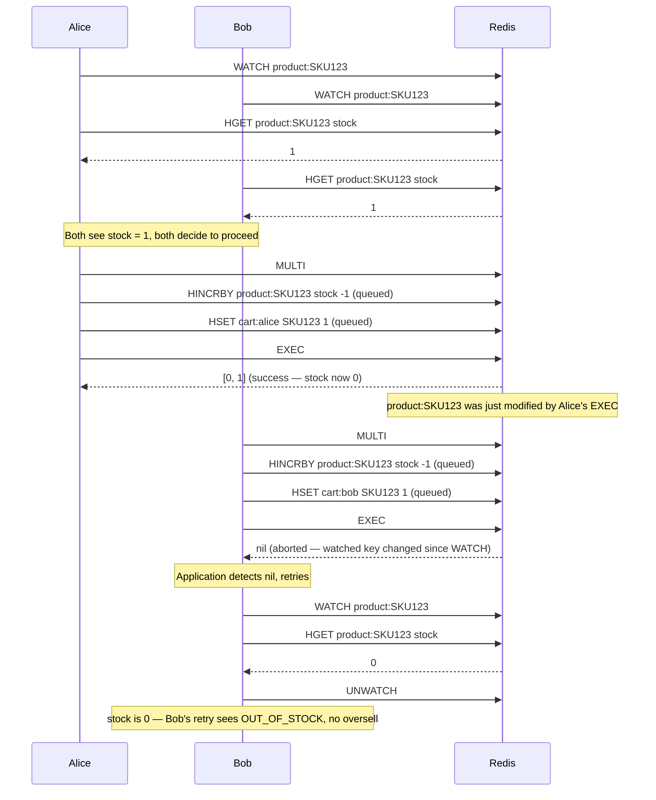

# Chapter 8: Transactions & Lua Scripting

Chapter 3 established that Redis processes commands one at a time on a single thread — no other command can interleave in the middle of one you've issued. Chapters 4 and 5 gave you rich data structures — strings, hashes, sorted sets — each of which is safe to mutate with a single command. This chapter is about the gap between those two facts: what happens when your *business logic* needs more than one command to do something correct, and two clients hit that logic at the same time?

QuickCart's checkout flow is the running example: read `product:{sku}`'s stock, decide whether there's enough, and decrement it — all before another customer's checkout can sneak in and oversell the last unit. A single `DECR` won't express "only if stock is sufficient." That's what `MULTI`/`EXEC`, `WATCH`, and Lua scripting are for — three tools, in increasing order of power, for making multi-step operations behave atomically.

---

## Learning Objectives

By the end of this chapter, you will be able to:

- Explain why single Redis commands are atomic but multi-command business logic is not, and connect this directly to the single-threaded execution model from Chapter 3.
- Use `MULTI`, `EXEC`, and `DISCARD` to queue and run a block of commands, and correctly describe how Redis transactions differ from SQL transactions (no mid-transaction rollback).
- Implement optimistic locking with `WATCH` and a check-modify-`EXEC` retry loop, and explain why an `EXEC` can return `nil`.
- Recognize when `WATCH`-based optimistic locking degrades under contention, and when to reach for Lua instead.
- Write, cache, and invoke a Lua script with `EVAL`/`EVALSHA` using the `KEYS`/`ARGV` convention, and explain why the whole script runs atomically.
- Describe Redis Functions (7.0+) as the more maintainable evolution of ad-hoc scripting, and apply a decision framework for choosing transactions vs. Lua vs. neither.

---

## Prerequisites for This Chapter

This chapter assumes you're comfortable with:

- **[Chapter 3: Architecture & Internals](./03-architecture-and-internals.md)** — specifically, the single-threaded event loop model. Every guarantee in this chapter (why `MULTI`/`EXEC` can't be interrupted, why a Lua script can't be interleaved with another client's commands) is a direct consequence of that architecture. If "why can't two clients run commands at the exact same instant?" doesn't have an obvious answer for you yet, revisit Chapter 3 before continuing.
- **[Chapter 4: Strings, Lists & Hashes](./04-strings-lists-and-hashes.md)** and **[Chapter 5: Sets, Sorted Sets & Bitmaps](./05-sets-sorted-sets-and-bitmaps.md)** — you should be able to read `HGET`, `HSET`, `HINCRBY`, `DECRBY`, and similar commands without looking them up. This chapter's examples lean on QuickCart's `product:{sku}` hash (fields like `stock`, `price`, `name`) and `cart:{userId}` hash.
- Basic familiarity with the idea of a "race condition" — two concurrent operations interleaving in a way that produces a wrong result. If that phrase is new, the Section 1 example below builds it from scratch.

---

## 1. Why Atomicity Needs Help Beyond Single Commands

### 1.1 The guarantee you already have

Because Redis runs one command to completion before starting the next (Chapter 3), **every individual command is atomic**. `INCR counter` is atomic. `HSET product:SKU123 stock 40` is atomic. `SADD` on a set with a million members touching a thousand new elements is atomic. No other client's command can be spliced into the middle of any single command's execution, no matter how much work that command does.

This is a strong guarantee, and it's why Redis needs no explicit locking for single-key, single-command operations — the kind of thing you'd reach for a `synchronized` block or a database row lock for elsewhere.

### 1.2 Where the guarantee runs out

The guarantee is scoped to *one command*. It says nothing about a *sequence* of commands issued by your application. Consider QuickCart's naive checkout logic in pseudocode:

```
stock = HGET product:SKU123 stock
if stock >= 1:
    HINCRBY product:SKU123 stock -1
    HSET cart:user42 SKU123 1
```

Each of those three Redis commands (`HGET`, `HINCRBY`, `HSET`) is individually atomic. But the *sequence* is not. Between the `HGET` returning `stock = 1` and the `HINCRBY` running, another client's checkout for a different user can run its own `HGET`, also see `stock = 1`, and also decide "there's enough." Both customers proceed to decrement — stock goes to `-1`, and QuickCart has sold a product it doesn't have. This is a classic **check-then-act race condition**, and it's invisible in testing because it only shows up under real concurrency.

The same shape of bug appears anywhere you read a value, make a decision based on it, and write a result back — a pattern often called **read-modify-write** or **check-and-set**. Rate limiting (`ratelimit:{userId}:{endpoint}` — read the count, check the threshold, increment) and leaderboard adjustments that depend on a prior read have the identical shape.

Redis gives you three tools to close this gap, in order of the power (and cost) they bring:

| Tool | What it guarantees | Best for |
|---|---|---|
| `MULTI`/`EXEC` | A batch of commands runs back-to-back with no other client's commands interleaved | Simple multi-key writes with no branching |
| `WATCH` + `MULTI`/`EXEC` | The above, plus "abort if a watched key changed since I looked" | Occasional-conflict check-and-set |
| Lua scripting (`EVAL`) | A whole block of logic — reads, branching, writes — runs as one atomic unit | Conditional atomic logic, high contention |

---

## 2. `MULTI`/`EXEC`/`DISCARD`: Queuing Commands as a Block

### 2.1 The basic mechanics

`MULTI` starts a transaction block. Every command issued after `MULTI` is **queued**, not executed, until `EXEC` is called — at which point Redis runs the entire queued batch back-to-back, with no other client's command able to interleave anywhere in the middle. `DISCARD` cancels a queued transaction without running it.

```
> MULTI
OK
> HINCRBY product:SKU123 stock -1
QUEUED
> HSET cart:user42 SKU123 1
QUEUED
> EXEC
1) (integer) 39
2) (integer) 1
```

Between `MULTI` and `EXEC`, the client is in a special mode: commands return `QUEUED` immediately rather than their normal reply, because they haven't run yet. `EXEC` triggers execution of the whole queue as a single atomic unit and returns an array of replies, one per queued command, in order.

If you decide midway through queuing that you don't want to proceed, `DISCARD` throws away the queue and returns the connection to normal mode:

```
> MULTI
OK
> HINCRBY product:SKU123 stock -1
QUEUED
> DISCARD
OK
```

### 2.2 What this buys you — and what it does not

`MULTI`/`EXEC` guarantees two things: **no other client's commands can run in between** your queued commands, and **all queued commands execute** (barring the error case below) — there's no partial batch where three of five commands ran and Redis moved on to another client's request in between.

This is genuinely useful for QuickCart operations that are multi-key but have **no conditional logic** — for example, atomically moving an item from `cart:{userId}` into an `orders:events` stream entry and clearing that cart field, where every command should simply run, unconditionally, as a unit:

```
> MULTI
OK
> XADD orders:events '*' userId user42 sku SKU123 qty 1
QUEUED
> HDEL cart:user42 SKU123
QUEUED
> EXEC
```

### 2.3 The critical nuance: this is not an SQL transaction

If you come from a relational database background, the word "transaction" carries a specific promise: if something goes wrong partway through, the whole thing rolls back and the database looks as if none of it happened. **Redis transactions do not work this way, and assuming they do is the single most common mistake developers make with `MULTI`/`EXEC`.**

Redis distinguishes two very different kinds of errors:

**Queuing-time errors (syntax errors)** — if you queue a command that doesn't exist, or supplies the wrong number of arguments, Redis catches this *while queuing*, marks the transaction as tainted, and refuses to run `EXEC` at all:

```
> MULTI
OK
> NOTACOMMAND foo
(error) ERR unknown command 'NOTACOMMAND'
> HSET product:SKU123 stock 40
QUEUED
> EXEC
(error) EXECABORT Transaction discarded because of previous errors.
```

Here, nothing ran — the whole batch was aborted before execution, which does resemble a rollback.

**Runtime errors** — if a command is syntactically valid and gets queued successfully, but fails when it actually *runs* (for example, calling `HINCRBY` on a key that holds a list, a WRONGTYPE error), Redis does **not** roll back the commands that already succeeded:

```
> MULTI
OK
> HSET product:SKU123 stock 39
QUEUED
> LPUSH product:SKU123 oops
QUEUED
> EXEC
1) OK
2) (error) WRONGTYPE Operation against a key holding the wrong kind of value
```

The `HSET` committed. The `LPUSH` failed. Redis simply reports both results in the reply array and moves on — there is no automatic undo. If your application logic needs "all or nothing," you are responsible for designing commands that can't fail at runtime (or for using Lua, Section 5, where you write the rollback logic yourself if needed).

> **Rule of thumb:** `MULTI`/`EXEC` guarantees *isolation* (no interleaving) and *all-queued-commands-run*, but it does **not** guarantee application-level atomicity across a runtime failure. Treat it as "an uninterruptible batch," not as "an undoable unit."

---

## 3. Optimistic Locking with `WATCH`

### 3.1 The problem `MULTI`/`EXEC` alone doesn't solve

`MULTI`/`EXEC` prevents interleaving *once you start queuing*, but it does nothing about the read that typically happens *before* you decide what to queue. QuickCart's checkout still needs to read `product:SKU123`'s stock, decide whether to proceed, and only then queue the decrement — and that read-then-decide step is exactly where the race from Section 1.2 lives.

`WATCH` closes this gap with **optimistic locking**: instead of blocking other clients from touching the key while you think (a *pessimistic* lock), you watch the key, proceed under the optimistic assumption that nothing will change, and let Redis detect and abort if you were wrong.

### 3.2 How `WATCH` works

`WATCH key [key ...]` tells Redis: "remember the state of these keys; if any of them is modified by *any* client before my next `EXEC`, abort my transaction." The sequence is:

1. `WATCH product:SKU123`
2. Read the current stock with `HGET` (a normal command, outside `MULTI`).
3. Decide in your application code whether the read value is sufficient.
4. `MULTI`, queue the write(s), `EXEC`.

If no other client modified `product:SKU123` between steps 1 and 4, `EXEC` runs normally and returns the array of results. If another client *did* modify it — even just touching the same key with a no-op write — `EXEC` returns `nil` (a null reply), and **none of the queued commands run**. Your application must detect the `nil` and retry the whole sequence from step 1.

`UNWATCH` clears all watched keys for the connection without running a transaction — useful if you decide, after reading, not to proceed at all (e.g., insufficient stock and you want to bail out cleanly).

### 3.3 QuickCart example: oversell-proof stock decrement

```
FUNCTION checkout(userId, sku):
    loop:
        WATCH product:{sku}
        stock = HGET product:{sku} stock

        if stock < 1:
            UNWATCH
            return "OUT_OF_STOCK"

        MULTI
        HINCRBY product:{sku} stock -1
        HSET cart:{userId} {sku} 1
        result = EXEC

        if result is not nil:
            return "SUCCESS"
        # else: someone else modified product:{sku} between WATCH and EXEC — retry
```

Walking through the concurrent-conflict case with two customers, Alice and Bob, both checking out the last unit of `SKU123` (stock = 1) at nearly the same instant:



Alice's `EXEC` succeeds and decrements stock to 0. Bob's `EXEC` is silently aborted because the key he was watching changed underneath him — Redis detected the conflict, not Bob's application code. Bob's retry loop re-reads stock, sees 0, and correctly reports out-of-stock instead of overselling. This is the entire point of optimistic locking: correctness is enforced by Redis detecting staleness, not by the application getting lucky with timing.

### 3.4 Implementation detail worth knowing

`WATCH` is connection-scoped and coarse-grained: it doesn't care *what* changed about the key or by *how much* — any write to a watched key (even one that sets it back to the same value) marks the transaction dirty. It's also worth knowing that watching a key that doesn't exist yet, then having another client create it, also counts as a modification and triggers the abort.

---

## 4. When `WATCH` Starves Under Contention

The retry loop in Section 3.3 works — but think through what happens on a Black Friday flash sale, where fifty concurrent checkout requests are hammering the same low-stock SKU:

- All fifty clients `WATCH` the same key at roughly the same time.
- Only one `EXEC` can win per round (the first to reach `EXEC` before anyone else's write invalidates it).
- Every other client's `EXEC` returns `nil` and must retry — re-issuing `WATCH`, re-reading, re-deciding, re-queuing.
- Under sustained high contention, a client can retry many times before it finally gets a clean window, because there's always another competing write landing between its `WATCH` and its `EXEC`. In the worst case, some unlucky clients retry far more than others — this is **starvation**: not a correctness failure (stock is never oversold), but a fairness and latency failure, where retries pile up as extra round-trips to Redis under exactly the load conditions you can least afford them.

The root cause is structural: `WATCH`-based optimistic locking requires **two separate round-trips from your application to Redis** (the read, then the `MULTI`/`EXEC`), with a window of vulnerability in between and in your application's own processing time. Every extra millisecond your application spends deciding, between the read and the `EXEC`, is one more millisecond in which a conflicting write can land. Under high contention, that window is exactly what gets hit over and over.

**Lua scripting solves this at the root** by collapsing the read, the decision, and the write into a single request that Redis executes as one atomic, uninterruptible unit — there is no window between read and write for another client to land a conflicting write, because nothing else can run *at all* while the script executes. No conflict detection is needed because no conflict is possible.

---

## 5. Lua Scripting Fundamentals

### 5.1 `EVAL` and the `KEYS`/`ARGV` convention

Redis embeds a Lua interpreter, and `EVAL` lets you send a Lua script to be executed server-side:

```
EVAL script numkeys key [key ...] arg [arg ...]
```

- `script` — the Lua source code, as a string.
- `numkeys` — how many of the following arguments are Redis keys (as opposed to plain values).
- The keys are accessible inside the script as the Lua table `KEYS` (1-indexed: `KEYS[1]`, `KEYS[2]`, ...).
- Any remaining arguments are accessible as the Lua table `ARGV` (`ARGV[1]`, `ARGV[2]`, ...).

```
> EVAL "return redis.call('HGET', KEYS[1], ARGV[1])" 1 product:SKU123 stock
"39"
```

Here `1` says "one key follows," `product:SKU123` is `KEYS[1]`, and `stock` is `ARGV[1]`. Inside the script, `redis.call(...)` invokes a normal Redis command exactly as you would from `redis-cli`, and its return value becomes a Lua value you can branch on.

**Why bother separating `KEYS` from `ARGV` instead of just hardcoding key names in the script string?** Two reasons: it lets Redis Cluster (Chapter 12) statically determine which keys a script touches — necessary for routing and for the cluster's key-slot rules — and it lets you reuse the exact same script text across different keys/values without string-templating, which matters once you start caching scripts (Section 7).

### 5.2 Why the whole script is atomic

This is the payoff. Because Redis is single-threaded (Chapter 3), and `EVAL` hands the entire script to that one thread to run start-to-finish before touching the next queued client request, **no other client's command — not even another `EVAL` — can execute at any point while your script is running.** Every `redis.call()` inside the script sees a keyspace that is guaranteed not to have been touched by anyone else since the script started, and every write the script makes is visible in full, or not at all, to the outside world once the script finishes.

This gives you something stronger than `MULTI`/`EXEC`: you get to make **decisions based on reads, in the middle of the atomic unit**, with the guarantee that nothing changes out from under you between the read and the subsequent write — exactly the gap that made `WATCH`'s retry loop necessary in the first place.

---

## 6. A Concrete Script: Atomic Stock Decrement for QuickCart

Here is the actual Lua logic for QuickCart's "decrement stock if sufficient, otherwise fail" checkout operation — the same business rule as Section 3.3, but now genuinely atomic in one round trip:

```lua
-- KEYS[1] = product:{sku}   e.g. product:SKU123
-- KEYS[2] = cart:{userId}   e.g. cart:user42
-- ARGV[1] = sku             e.g. SKU123
-- ARGV[2] = quantity to purchase, e.g. 1

local stock = tonumber(redis.call('HGET', KEYS[1], 'stock'))

if stock == nil then
    return redis.error_reply('PRODUCT_NOT_FOUND')
end

local qty = tonumber(ARGV[2])

if stock < qty then
    return redis.error_reply('OUT_OF_STOCK')
end

redis.call('HINCRBY', KEYS[1], 'stock', -qty)
redis.call('HINCRBY', KEYS[2], ARGV[1], qty)

return redis.status_reply('OK')
```

Invoking it from `redis-cli` for a purchase of 1 unit of `SKU123` for `user42`:

```
> EVAL "$(cat decrement_stock.lua)" 2 product:SKU123 cart:user42 SKU123 1
+OK
```

If stock is insufficient, the script returns an error reply the client library will surface as an exception/error rather than a normal value — which is the correct Lua idiom for signaling failure back to the caller (as opposed to returning a plain string like `"OUT_OF_STOCK"` that the client might mistake for a successful reply).

Notice the read (`HGET`), the branch (`if stock < qty`), and both writes (`HINCRBY` twice) all happen inside a single `EVAL` call. There is no `WATCH`, no retry loop, and no possibility of another client's checkout interleaving between the read and the writes — the entire block is one atomic unit as far as every other client is concerned.

---

## 7. Script Caching: `SCRIPT LOAD` and `EVALSHA`

Sending the full Lua source text on every single call — as the `EVAL` examples above do — works, but wastes bandwidth once a script is more than a few lines and is called frequently (which, for something like a checkout hot path, it will be). Redis solves this with a server-side script cache addressed by SHA1 hash.

**`SCRIPT LOAD script`** — uploads a script to Redis's script cache without executing it, and returns its SHA1 hash:

```
> SCRIPT LOAD "$(cat decrement_stock.lua)"
"a3f8c9e1b2d4567890abcdef1234567890abcdef"
```

**`EVALSHA sha numkeys key [key ...] arg [arg ...]`** — runs a previously cached script by its hash instead of its source, identical in every other respect to `EVAL`:

```
> EVALSHA a3f8c9e1b2d4567890abcdef1234567890abcdef 2 product:SKU123 cart:user42 SKU123 1
+OK
```

This is the standard production pattern: load the script once at application startup (or lazily on first use), cache the returned SHA in your application, and call `EVALSHA` with that SHA on every subsequent invocation — sending only the key names, arguments, and a 40-character hash, never the script body again.

Two supporting commands round this out:

- **`SCRIPT EXISTS sha [sha ...]`** — checks whether one or more SHAs are currently in the script cache, returning an array of `1`/`0`. Use this defensively: if a Redis restart or `SCRIPT FLUSH` has evicted your cached script, `EVALSHA` fails with a `NOSCRIPT` error, and the correct recovery is to fall back to `EVAL` (or re-`SCRIPT LOAD`) once, then resume using `EVALSHA`.
- **`SCRIPT FLUSH [ASYNC|SYNC]`** — clears the entire script cache. Rarely needed in application code; mostly an operational/administrative command.

> **Production pattern:** always call `EVAL` optimistically as a fallback for `NOSCRIPT` errors from `EVALSHA`, rather than assuming a script you loaded earlier is still cached — the cache is not guaranteed to survive a restart or a `FLUSHALL`/`SCRIPT FLUSH`.

---

## 8. Redis Functions (7.0+): A More Maintainable Alternative

Redis 7.0 introduced **Functions** as a structured evolution of ad-hoc `EVAL` scripting, aimed squarely at the maintainability problems teams hit once they have dozens of scripts scattered across application code: no versioning, no namespacing, and no way to inspect "what scripts are actually loaded on this server right now" beyond opaque SHA hashes.

A **library** is a named, versioned unit of Lua code, registered once with `FUNCTION LOAD`, that can define multiple callable functions:

```lua
#!lua name=quickcart_checkout

redis.register_function('decrement_stock', function(keys, args)
    local stock = tonumber(redis.call('HGET', keys[1], 'stock'))
    local qty = tonumber(args[2])
    if stock == nil then
        return redis.error_reply('PRODUCT_NOT_FOUND')
    end
    if stock < qty then
        return redis.error_reply('OUT_OF_STOCK')
    end
    redis.call('HINCRBY', keys[1], 'stock', -qty)
    redis.call('HINCRBY', keys[2], args[1], qty)
    return redis.status_reply('OK')
end)
```

Loading and calling it:

```
> FUNCTION LOAD "$(cat quickcart_checkout.lua)"
"quickcart_checkout"
> FCALL decrement_stock 2 product:SKU123 cart:user42 SKU123 1
+OK
```

What Functions add over raw `EVAL`/`SCRIPT LOAD` scripts:

- **A named library with a version identifier**, rather than an anonymous blob addressed only by hash — `FUNCTION LIST` shows you exactly what's loaded and under what library name, which is a real operational improvement over hunting down which SHA corresponds to which application feature.
- **Persistence across restarts** — libraries loaded with `FUNCTION LOAD` are saved in RDB/AOF (Chapter 7) the same way data is, so they survive a restart without your application needing to re-`SCRIPT LOAD` on startup.
- **Multiple named functions per library**, letting you group related logic (e.g., all of QuickCart's checkout-related atomic operations) under one deployable unit instead of one script per operation.
- **`FUNCTION DUMP`/`FUNCTION RESTORE`** for explicitly exporting and importing the whole function catalog, useful for deployment pipelines.

For new production code on Redis 7.0+, Functions are generally the better default over raw `EVAL` scripts for anything beyond a quick one-off — the versioning and persistence story alone tends to pay for the slightly more verbose registration syntax. `EVAL`/`EVALSHA` remain fully supported and are still perfectly reasonable for simpler, one-off atomic operations or when targeting pre-7.0 Redis.

---

## 9. Decision Framework: Transactions vs. Lua vs. Neither

| Situation | Reach for | Why |
|---|---|---|
| A single command already does what you need (e.g., `HINCRBY`, `ZADD`) | **Neither** | Chapter 3's single-threaded model already makes it atomic; adding `MULTI`/`EXEC` or Lua is pure overhead. |
| Multiple keys/commands must run as an uninterrupted batch, with **no branching on a read** (e.g., write an order event and clear a cart field together) | **`MULTI`/`EXEC`** | Simple, no scripting language needed, and it's exactly what `MULTI`/`EXEC` is for. |
| A read must inform a conditional write, but conflicts are **rare** (e.g., updating a user's own profile hash based on its own prior value, with only that one user ever writing it) | **`WATCH` + `MULTI`/`EXEC`** | Optimistic locking is simple to reason about and cheap when conflicts are uncommon; the occasional retry is a non-issue. |
| A read must inform a conditional write **and conflicts are frequent/high-contention** (QuickCart's Black Friday checkout on a hot, low-stock SKU) | **Lua (`EVAL`/`EVALSHA`) or a Redis Function** | Collapses read-decide-write into one atomic round trip; no retry storms, no starvation, and typically fewer network round trips overall. |
| The same atomic logic is reused across many services/features and needs versioning, persistence across restarts, or a maintainable catalog | **Redis Functions** | Purpose-built for exactly this over raw `EVAL` scripts. |

A useful gut-check question: **"Does my decision depend on a value I just read from Redis?"** If no, `MULTI`/`EXEC` (or no tool at all) is enough. If yes, and conflicts will be rare, `WATCH` is simplest. If yes, and conflicts will be frequent, go straight to Lua/Functions — don't wait to be burned by starvation in production before switching.

---

## Real-World Scenario

**Setup:** It's the QuickCart Black Friday sale. A limited drop of 200 units of `SKU777` (a doorbuster item) goes live at 9:00 AM, and the marketing team has driven a surge of traffic specifically to that product page. Within the first ten seconds, QuickCart's monitoring shows over 3,000 concurrent checkout attempts hitting `product:SKU777`.

**Approach 1 — `WATCH`-based optimistic locking:**

```
FUNCTION checkoutWatch(userId, sku, qty):
    loop:
        WATCH product:{sku}
        stock = HGET product:{sku} stock
        if stock < qty:
            UNWATCH
            return "OUT_OF_STOCK"
        MULTI
        HINCRBY product:{sku} stock -qty
        HSET cart:{userId} {sku} qty
        result = EXEC
        if result is not nil:
            return "SUCCESS"
        # retry — someone else's write invalidated our WATCH
```

This is correct — stock is never oversold, exactly as demonstrated in Section 3.3's sequence diagram. But with 3,000 concurrent attempts against 200 units, the vast majority of clients will lose the optimistic race on their first attempt (since the key is written to 200 times in rapid succession while thousands of others are also reading it), forcing a retry. Many will retry multiple times before either succeeding or correctly discovering the item is sold out. Every retry is an extra `WATCH` + `HGET` + `MULTI`/`EXEC` round trip, and under this load the retry traffic itself adds meaningfully to Redis's request volume, right when you can least afford it — the starvation problem from Section 4, now concrete.

**Approach 2 — Lua script:**

```lua
-- KEYS[1] = product:{sku}, KEYS[2] = cart:{userId}
-- ARGV[1] = sku, ARGV[2] = qty
local stock = tonumber(redis.call('HGET', KEYS[1], 'stock'))
if stock == nil or stock < tonumber(ARGV[2]) then
    return redis.error_reply('OUT_OF_STOCK')
end
redis.call('HINCRBY', KEYS[1], 'stock', -tonumber(ARGV[2]))
redis.call('HINCRBY', KEYS[2], ARGV[1], tonumber(ARGV[2]))
return redis.status_reply('OK')
```

Called via `EVALSHA` from every checkout request. Every one of the 3,000 concurrent attempts still has to wait its turn (Redis is still single-threaded — that never changes), but each one resolves in exactly **one** round trip, with no retry loop, no wasted `WATCH`/`HGET` cycles from clients that were always going to lose the race, and no risk of starvation. The 200 customers who get through get a clean `OK`; the rest get an immediate, correct `OUT_OF_STOCK` on their first and only attempt.

**QuickCart's choice:** for the Black Friday doorbuster path specifically, QuickCart uses the Lua script (registered as a Redis Function for versioning — Section 8). The `WATCH`-based approach remains in the codebase for lower-contention flows, like a user updating their own saved address or applying a one-off coupon to their own cart, where the same customer is virtually never racing against another customer for the same key and the simplicity of `WATCH` outweighs Lua's edge. The team's rule: **any atomic operation on a key expected to see hot, multi-writer contention goes through Lua/Functions by default; low-contention, single-writer-in-practice operations can stay on `WATCH`.**

---

## Best Practices

- **Default to Lua/Functions for any conditional atomic logic**, not just under known high contention — it's one round trip either way, and it removes an entire class of retry-loop bugs from application code before they have a chance to surface.
- **Keep scripts short and fast.** A running Lua script blocks the *entire* server — every other client's command, on every other key — for its full duration, a direct consequence of the single-threaded model from Chapter 3. A script that loops over a huge collection or calls `KEYS *` internally can stall your whole Redis instance for other tenants. Treat script runtime as a shared-resource budget, not a private one.
- **Use `EVALSHA` in production, with `EVAL`/`SCRIPT LOAD` as the fallback path** for `NOSCRIPT` errors, rather than sending full script source on every call.
- **Version scripts and functions deliberately.** Prefer Redis Functions' named-library versioning for anything long-lived; if sticking with raw `EVAL`, keep script source in version control and treat a script's SHA as a build artifact, not something to hand-type.
- **Make writes inside a script idempotent-safe where practical**, and always validate inputs (`tonumber`, nil checks) before calling `redis.call()` — a script that errors partway through a write sequence can leave partial writes behind, exactly like the `MULTI`/`EXEC` runtime-error case in Section 2.3, since Lua gives you no automatic rollback either.
- **Never call blocking commands from inside a script** (see Common Mistakes below) — the single-threaded model means a blocking call inside a script has nothing to unblock it.

---

## Common Mistakes

- **Assuming `MULTI`/`EXEC` rolls back on a runtime error, like an SQL transaction.** As shown in Section 2.3, only *queuing-time* errors abort the whole batch; a runtime error (e.g., `WRONGTYPE`) on one queued command does not undo commands that already succeeded in the same `EXEC`.
- **Writing long-running Lua scripts.** A script that scans large collections, does heavy string processing, or loops without bound blocks every other client on the server for its entire runtime — there is no "background thread" the script can hand work off to. Benchmark scripts under realistic data sizes before shipping them.
- **Not handling a `WATCH`-based `EXEC` returning `nil`.** Forgetting to check for the abort case and retry means silently dropping the operation on conflict — QuickCart's checkout would appear to do nothing, with no error and no stock decrement, exactly when contention is highest.
- **Forgetting that Lua scripts run atomically and therefore must not call blocking commands.** Commands like `BLPOP`, `BRPOP`, or `WAIT` are designed to block the *calling client* until a condition is met — but inside a script, "the calling client" is the single Redis thread itself. Calling a blocking command from Lua either raises an error or (depending on version/command) behaves as a non-blocking variant; either way, treating a script as a place to "wait" for something is a fundamental misunderstanding of what atomic execution means. Do the waiting in your application, outside the script.
- **Hardcoding key names inside script source instead of using `KEYS`/`ARGV`.** Beyond breaking Redis Cluster's key-slot routing (Chapter 12), it also defeats script caching — every different key means a different script string, which won't match a single cached `EVALSHA` hash.

---

## Summary

- Single Redis commands are always atomic, courtesy of Chapter 3's single-threaded model — but multi-step business logic (check-then-act, read-modify-write) is not atomic on its own, and needs one of this chapter's tools.
- `MULTI`/`EXEC`/`DISCARD` queue and run a batch of commands with no interleaving from other clients, but they are **not** an SQL-style transaction: only queuing-time errors abort the batch; runtime errors leave prior successful commands in place with no rollback.
- `WATCH` adds optimistic locking on top of `MULTI`/`EXEC`: watch a key, read it, decide, and `EXEC` — if the watched key changed in between, `EXEC` returns `nil` and your application must retry the whole loop.
- `WATCH`-based retries are simple and correct but can starve under high contention, because every conflict costs an extra round trip and the window between read and `EXEC` never shrinks to zero.
- Lua scripting (`EVAL`/`EVALSHA`) runs an entire block of read-decide-write logic as one atomic unit on Redis's single thread — no other command interleaves anywhere inside it, which eliminates the conflict window entirely rather than just detecting it.
- `SCRIPT LOAD` + `EVALSHA` avoid re-sending script source on every call; `SCRIPT EXISTS`/`FLUSH` manage the server-side cache.
- Redis Functions (7.0+) formalize scripting into named, versioned libraries via `FUNCTION LOAD`/`FCALL` — better suited to production maintainability than ad-hoc `EVAL` scripts.
- Choose based on whether your logic branches on a read at all, and if so, how much contention you expect: no branching → `MULTI`/`EXEC`; low-contention branching → `WATCH`; high-contention or reusable branching logic → Lua/Functions.

---

## Knowledge Check

1. Why is a single `HINCRBY` command always atomic, but a `HGET` followed by a conditional `HINCRBY` (issued as two separate commands) not atomic, even on the same single-threaded Redis server?
2. A `MULTI` block queues four commands. The third one fails at runtime with a `WRONGTYPE` error. What happens to the first two commands, and what happens to the fourth? How does this differ from what you'd expect in a SQL database transaction?
3. Walk through what `WATCH product:SKU123` actually guarantees, and describe a concrete sequence of events (two clients, in order) that causes an `EXEC` to return `nil`.
4. Why does `WATCH`-based optimistic locking tend to perform worse specifically under *high contention on the same key*, rather than under high overall Redis load in general?
5. Explain, in terms of the single-threaded execution model, why an entire Lua script executed via `EVAL` is guaranteed to be atomic with respect to every other client — including other `EVAL` calls.
6. What is the difference between `EVAL` and `EVALSHA`, and what error should your application code be prepared to handle when using `EVALSHA`?
7. Name two concrete advantages Redis Functions (`FUNCTION LOAD`/`FCALL`) have over ad-hoc `EVAL` scripts loaded via `SCRIPT LOAD`.
8. Why is calling a blocking command like `BLPOP` from inside a Lua script conceptually broken, even ignoring whatever specific error Redis returns for it?

---

## Hands-On Exercise

Using a local Redis instance (Chapter 1's Docker setup) and `redis-cli` or a client library of your choice:

**Part 1 — Set up the data.**
```
HSET product:SKU777 name "Doorbuster Widget" price 999 stock 3
```

**Part 2 — Implement the `WATCH`-based approach.**
Write a small script (Python, Node.js, or shell) that implements the retry loop from Section 3.3: `WATCH product:SKU777`, `HGET` the stock, check if `>= 1`, then `MULTI`/`HINCRBY -1`/`HSET cart:{userId} SKU777 1`/`EXEC`, retrying on a `nil` result. Parameterize it to accept a `userId`.

**Part 3 — Simulate concurrency.**
Reset stock to 3 (`HSET product:SKU777 stock 3`), then launch 10 concurrent instances of your Part 2 script with 10 different user IDs (e.g., 10 parallel background processes, or a thread pool). Confirm: exactly 3 succeed, 7 report `OUT_OF_STOCK`, and `HGET product:SKU777 stock` ends at exactly `0` (never negative). Note how many retries occurred in total across all 10 clients.

**Part 4 — Implement the Lua version.**
Save the script from Section 6 to a file (`decrement_stock.lua`). Load it with `SCRIPT LOAD`, and write a small script that calls it via `EVALSHA` for a given `userId`, handling a `NOSCRIPT` error by falling back to `EVAL` once.

**Part 5 — Re-run the concurrency test against the Lua version.**
Reset stock to 3, launch the same 10 concurrent clients against your Part 4 script instead. Confirm the same correctness result (exactly 3 succeed, stock ends at 0), but note that each client makes exactly **one** call to Redis, with no retry logic needed at all.

**Part 6 — Compare.**
Write down: how many total Redis round trips did the `WATCH` version make across all 10 clients (including retries) versus the Lua version? At what number of concurrent clients (try 50, then 200) does the difference become dramatic? This is the empirical version of Section 4's starvation argument.

---

## Further Reading

- Redis official docs — [Transactions](https://redis.io/docs/latest/develop/interact/transactions/): the authoritative reference for `MULTI`/`EXEC`/`DISCARD`/`WATCH` semantics.
- Redis official docs — [Scripting with Lua](https://redis.io/docs/latest/develop/interact/programmability/eval-intro/): full `EVAL`/`EVALSHA` reference, including scripting-specific commands like `redis.call` vs. `redis.pcall`, and determinism requirements for replication.
- Redis official docs — [Redis Functions](https://redis.io/docs/latest/develop/interact/programmability/functions-intro/): the full Functions API, library registration format, and `FUNCTION` command reference.
- Redis official docs — [Command reference: `WATCH`](https://redis.io/docs/latest/commands/watch/) and [`EVAL`](https://redis.io/docs/latest/commands/eval/) for exact argument and reply semantics.
- *Redis in Action* (Josiah Carlson) — Chapter on transactions and locking patterns, including a worked example of optimistic-locking marketplaces very close in spirit to QuickCart's checkout flow.

---

<div style="display:flex;justify-content:space-between;align-items:center;">
  <a href="./07-persistence-rdb-and-aof.md">← Previous: Persistence: RDB & AOF</a>
  <a href="./00-index.md">🏠 Index</a>
  <a href="./09-expiration-eviction-and-memory-management.md">Next: Expiration, Eviction & Memory Management →</a>
</div>
