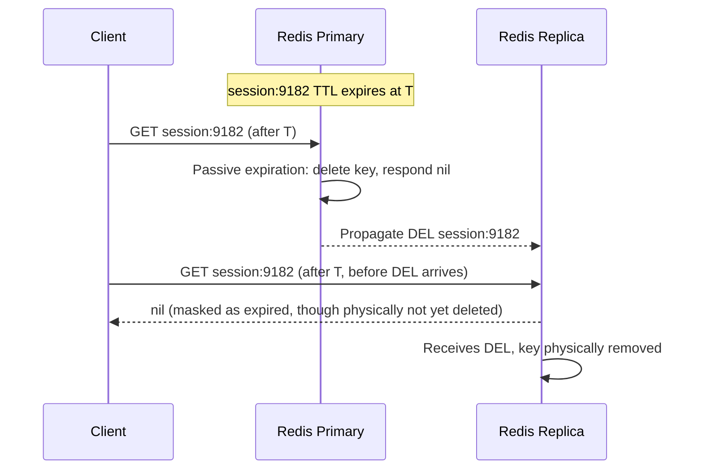
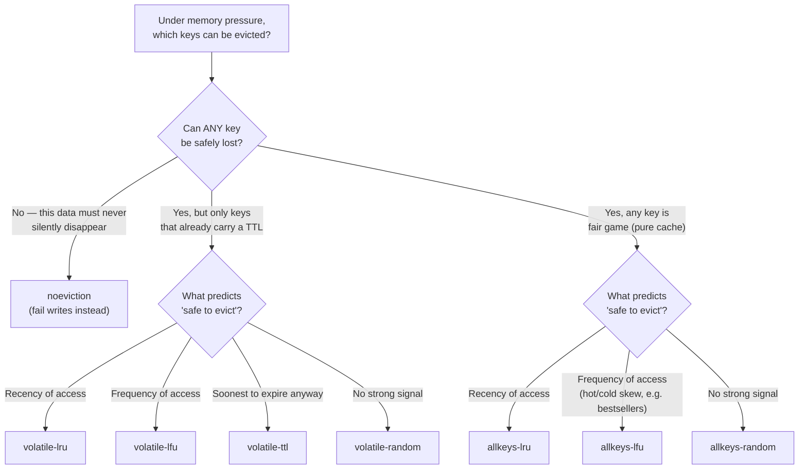

# Chapter 9: Expiration, Eviction & Memory Management

Every chapter so far has treated memory as if it were infinite: you store a session hash, add a sorted set member, cache a product — and it just sits there. In production, it doesn't. Redis keeps its entire working set in RAM, RAM is finite and expensive, and a Redis instance that grows without bound will eventually be killed by the operating system at the worst possible moment. This chapter is about the two mechanisms Redis gives you to keep memory under control on purpose, instead of by accident: **expiration** (keys that should disappear after a certain time) and **eviction** (keys that get forcibly removed under memory pressure, according to a policy you choose). Get this chapter wrong and QuickCart's Redis process either OOM-kills itself under the OS's judgment, or starts silently discarding data your application assumed was durable. Get it right, and Redis becomes a predictable, self-managing memory budget instead of a landmine.

---

## Learning Objectives

By the end of this chapter, you will be able to:

- Set and inspect TTLs with `EXPIRE`, `PEXPIRE`, `EXPIREAT`, `TTL`, and `PERSIST`, and explain how Redis stores expiration timestamps internally.
- Explain the difference between passive (lazy) expiration and active (background) expiration, and why a replica can briefly serve a logically-expired key.
- Configure `maxmemory` deliberately, and explain what happens to write traffic when memory fills up with no eviction policy configured.
- Compare all eight `maxmemory-policy` eviction strategies (`noeviction`, `allkeys-lru`, `volatile-lru`, `allkeys-lfu`, `volatile-lfu`, `allkeys-random`, `volatile-random`, `volatile-ttl`) and choose the correct one for a given workload.
- Diagnose memory usage with `INFO memory`, `MEMORY USAGE`, `MEMORY DOCTOR`, and `redis-cli --bigkeys`/`--memkeys`.
- Apply memory-optimization techniques (compact encodings, shorter keys, right-sized values) and do rough capacity-planning math for sizing a Redis instance.

---

## Prerequisites

This chapter assumes the memory model and object internals from [Chapter 3: Architecture & Internals](./03-architecture-and-internals.md) — specifically:

- How Redis lays out keys and values in memory via `redisObject`, and how `OBJECT ENCODING` reveals the internal representation Redis chose for a given value (e.g., `listpack` vs. `hashtable` for a hash, `intset` vs. `hashtable` for a set).
- Why the single-threaded event loop means memory-bookkeeping work (like active expiration and eviction sampling) has to be cheap and incremental rather than a heavyweight sweep.
- The role of `fork()` in `SAVE`/`BGSAVE` (relevant again in Section 8 below, when we account for fork headroom in capacity planning) — see also [Chapter 7: Persistence](./07-persistence-rdb-and-aof.md).

If any of that is unfamiliar, skim Chapter 3's memory-layout section before continuing — this chapter builds directly on "how a value is represented in RAM" to explain "how Redis decides which values to keep."

---

## 1. TTLs: Giving Keys a Lifespan

### 1.1 The commands

By default, every key in Redis lives forever (or until explicitly deleted). A **TTL** (time-to-live) tells Redis "delete this key automatically after N seconds/milliseconds have passed."

| Command | What it does |
|---|---|
| `EXPIRE key seconds` | Set a TTL of `seconds` from now. |
| `PEXPIRE key milliseconds` | Same, but in milliseconds — useful for sub-second precision. |
| `EXPIREAT key unix-timestamp` | Set the key to expire at an absolute Unix timestamp (seconds). |
| `PEXPIREAT key unix-ms-timestamp` | Same, but the absolute timestamp is in milliseconds. |
| `TTL key` | Return remaining seconds until expiry (`-1` = no TTL set, `-2` = key doesn't exist). |
| `PTTL key` | Same, in milliseconds. |
| `PERSIST key` | Remove the TTL, making the key permanent again. |
| `SET key value EX 30` | Set a value and a TTL (in seconds) atomically, in one command. |
| `SET key value KEEPTTL` | Overwrite a key's value **without** clearing its existing TTL (normally a plain `SET` clears any TTL). |

```bash
127.0.0.1:6379> SET session:9182 "user-data-blob" EX 1800
OK
127.0.0.1:6379> TTL session:9182
(integer) 1800
127.0.0.1:6379> PERSIST session:9182
(integer) 1)
127.0.0.1:6379> TTL session:9182
(integer) -1
```

### 1.2 How TTLs are stored internally

A TTL is not a separate key or a timer thread — it's a single extra field. Internally, Redis keeps a dictionary mapping keys to their expiration timestamp (an absolute Unix time in milliseconds), stored in a structure logically separate from the main keyspace dictionary but looked up alongside it. When you call `EXPIRE key 1800`, Redis simply computes `now_ms + 1_800_000` and writes that value into the expires dictionary for that key. There's no per-key timer, no scheduled callback — expiration is *evaluated*, not *triggered* (more on this in Section 2). This is why setting a TTL is O(1) and cheap even on millions of keys: it's a hash table write, nothing more.

### 1.3 QuickCart examples

**Sessions** (`session:{userId}`) — a hash holding cart pointer, auth token, and last-seen timestamp. QuickCart wants sessions to expire automatically after 30 minutes of no activity:

```bash
127.0.0.1:6379> HSET session:9182 userId 9182 authToken "tok_abc123" lastSeen 1751800000
127.0.0.1:6379> EXPIRE session:9182 1800
(integer) 1
```

Every time the user makes a request, the app refreshes the TTL (a "sliding window" session) rather than just reading it:

```bash
127.0.0.1:6379> EXPIRE session:9182 1800
```

**Rate limiting** (`ratelimit:{userId}:{endpoint}`) — a fixed-window counter. QuickCart limits `/api/checkout` to 10 requests per 60-second window per user:

```bash
127.0.0.1:6379> INCR ratelimit:9182:checkout
(integer) 1
127.0.0.1:6379> EXPIRE ratelimit:9182:checkout 60 NX
(integer) 1
```

The `NX` flag on `EXPIRE` (Redis 7+) means "only set the TTL if the key has none yet" — critical here, because you only want the 60-second window to start on the *first* increment. Without `NX`, every `INCR` would reset the window, and a steady trickle of requests would never expire, defeating the rate limiter entirely.

---

## 2. How Redis Actually Expires Keys

Redis does not run a dedicated timer per key — that would not scale to millions of keys on a single-threaded event loop. Instead, it uses two complementary mechanisms.

### 2.1 Passive (lazy) expiration

Every time a key is *accessed* (read or written) via any command, Redis first checks whether that key has an expiry timestamp in the past. If so, Redis deletes the key on the spot, *before* running the command, and behaves as if the key never existed. This is nearly free — it's a single timestamp comparison piggybacked on work Redis was doing anyway — but it has an obvious gap: a key that is *never accessed again* would sit in memory forever, past its logical expiry, doing nothing but wasting RAM.

### 2.2 Active expiration

To close that gap, Redis runs a background cycle (part of the periodic `serverCron` housekeeping job, by default ~10 times per second) that:

1. Picks a small random sample of keys from the set of keys that have a TTL.
2. Deletes any in the sample that have expired.
3. If more than 25% of the sampled keys were expired, immediately repeats the sampling (assuming there's more expired data to reclaim) rather than waiting for the next cycle.

This is intentionally probabilistic and bounded — Redis does *not* scan the entire expires dictionary on every cycle, because that would be a latency spike on a single-threaded server with millions of keys. Instead it does small, cheap, incremental sweeps that converge on cleaning up expired keys within a bounded number of cycles, trading a small amount of "still technically in memory" lag for consistently low per-cycle latency.

### 2.3 Why a key can briefly "exist" after its TTL — especially on a replica

This is a subtlety that becomes important once you reach [Chapter 11: Replication](./11-replication-and-high-availability.md), so it's worth internalizing now: **replicas do not independently decide to expire keys.**

A replica does *not* run its own active-expiration deletions, and it does *not* passively delete a logically-expired key just because a read arrived for it. Instead:

- The **primary** performs the actual deletion (via either passive or active expiration) and propagates an explicit `DEL`/`UNLINK` command down the replication stream.
- Until that `DEL` arrives, a replica that receives a read for a key past its TTL will still report the key as **logically expired** to the client (as of Redis 6.2+, replicas correctly hide expired-but-not-yet-deleted keys from read responses) — but the key is still physically occupying memory on the replica, and internal/administrative commands can still observe it exists, until the primary's `DEL` propagates.

This "primary is the source of truth for *when* a key dies" design exists because independent expiration decisions on primary and replicas could diverge (e.g., due to clock skew or replication lag), which would break consistency guarantees. The cost is a small, bounded window where a key is dead-but-not-yet-reaped on a replica — harmless for almost all applications, but worth knowing so you don't mistake it for a bug when auditing replica memory usage.



---

## 3. `maxmemory`: Setting a Hard Ceiling

### 3.1 Why it matters

By default, Redis has **no memory limit** — `maxmemory` is `0`, meaning "use as much RAM as the OS will give me." On a shared host, or simply as data grows, this is dangerous: if Redis's resident memory approaches the machine's physical RAM, the Linux OOM killer can step in and kill the Redis process outright, with no warning, no graceful degradation, and — depending on your persistence configuration — potential data loss from an unclean shutdown.

Setting an explicit ceiling turns an uncontrolled OS-level kill into a *controlled, Redis-level* response you get to choose:

```bash
# redis.conf
maxmemory 4gb
```

Or at runtime:

```bash
127.0.0.1:6379> CONFIG SET maxmemory 4gb
OK
```

`maxmemory` accepts human-readable suffixes (`kb`, `mb`, `gb`, or `k`/`m`/`g` for powers-of-1000 variants) and can be changed live without a restart — useful for adjusting a running instance as its host's available RAM changes.

### 3.2 What happens without eviction configured

Setting `maxmemory` alone is not the whole story — you also need to tell Redis *what to do* once the limit is hit, via `maxmemory-policy`. The default policy, `noeviction`, means Redis will **not** delete anything to make room. Once memory hits the ceiling:

- **Reads still work.** `GET`, `HGETALL`, and other read-only commands succeed normally.
- **Writes that would increase memory usage fail outright**, returning an error to the client:

```
(error) OOM command not allowed when used memory > 'maxmemory'.
```

- Commands that don't grow memory (e.g., `DEL`, or an `EXPIRE` on an existing key) generally still succeed, since freeing an OOM-triggering command is exactly what you'd want to allow through.

This is a deliberate, fail-loud behavior: rather than silently dropping data behind your back, Redis refuses new writes and makes the problem visible immediately (your application will see errors, alerts will fire, and someone will investigate) — appropriate when losing data is worse than temporary write unavailability. Whether that's the right trade-off for a given Redis instance is exactly what `maxmemory-policy` lets you decide per use case (Section 4).

---

## 4. Eviction Policies in Depth

`maxmemory-policy` tells Redis what to evict — if anything — once `maxmemory` is reached. There are eight policies, split along two axes: **which keys are eligible** (all keys, or only keys with a TTL set) and **which selection strategy** is used (LRU, LFU, random, or TTL-based).

| Policy | Eligible keys | Selection strategy |
|---|---|---|
| `noeviction` | none | Reject writes with OOM error instead of evicting |
| `allkeys-lru` | all keys | Evict least-recently-used |
| `volatile-lru` | keys with a TTL only | Evict least-recently-used among those |
| `allkeys-lfu` | all keys | Evict least-frequently-used |
| `volatile-lfu` | keys with a TTL only | Evict least-frequently-used among those |
| `allkeys-random` | all keys | Evict a random key |
| `volatile-random` | keys with a TTL only | Evict a random key among those |
| `volatile-ttl` | keys with a TTL only | Evict the key with the nearest expiry first |

### 4.1 `noeviction`

The safe default: never delete data to free memory; fail writes instead. Correct choice whenever losing data is unacceptable and you'd rather see write errors than silent data loss — typically your primary system-of-record use of Redis (sessions, carts) where capacity has been planned to avoid ever actually hitting the ceiling in normal operation.

### 4.2 `allkeys-lru` / `volatile-lru`

**LRU (Least Recently Used)** evicts the key that hasn't been touched (read or written) in the longest time, on the theory that "not accessed recently" predicts "won't be accessed soon" — a reasonable heuristic for cache-like workloads with locality of reference (some products are hot, most are cold).

Crucially, Redis's LRU is **approximated, not exact**. Maintaining a perfectly ordered least-recently-used list for millions of keys would require constant bookkeeping on every access — expensive on a single-threaded server. Instead, each key stores a compact recently-accessed timestamp, and when eviction is needed, Redis **samples a small number of random keys** (`maxmemory-samples`, default 5) and evicts the "most stale" one from that sample — not the single actual least-recently-used key across the whole keyspace. Raising `maxmemory-samples` (e.g., to 10) makes the approximation closer to true LRU at the cost of a little extra CPU per eviction; in practice, the default is a good balance for most workloads, and the difference versus exact LRU rarely matters for cache hit-rate outcomes.

`allkeys-lru` considers every key in the database; `volatile-lru` only considers keys that have a TTL set, leaving keys with no TTL untouchable no matter how stale.

### 4.3 `allkeys-lfu` / `volatile-lfu`

**LFU (Least Frequently Used)**, added in Redis 4.0, evicts based on *how often* a key is accessed rather than *how recently*. Each key carries a small (8-bit) access-frequency counter that increments (probabilistically, so it doesn't saturate instantly under hot-key hammering) on access and **decays over time** — a key that was accessed a thousand times last week but not since will gradually lose its "hot" score, so LFU doesn't get permanently stuck favoring stale-but-once-popular keys. This makes LFU a better fit than LRU for workloads where popularity is the real signal — e.g., a product catalog where a handful of SKUs get sustained heavy traffic and most others are rarely viewed: LFU correctly keeps the perennial best-sellers in cache even if there's a brief lull, whereas pure LRU would evict a genuinely popular item just because it wasn't accessed in the last few seconds.

Tunable via `lfu-log-factor` (controls how quickly the counter saturates for very hot keys) and `lfu-decay-time` (controls how fast frequency "forgets" over time).

### 4.4 `allkeys-random` / `volatile-random`

Evict a uniformly random eligible key, no access-pattern tracking at all. Rarely the best choice, but useful when access patterns are genuinely uniform (no hot/cold skew) and you want to avoid even the small bookkeeping overhead of LRU/LFU — or as a deliberate simplicity choice when eviction correctness doesn't materially affect the workload.

### 4.5 `volatile-ttl`

Evict the key with the **soonest expiration time** first, among keys that have a TTL. This is the natural fit when every eligible key is already "supposed to" disappear soon anyway, and you'd rather reclaim memory from the key closest to dying naturally than guess based on access patterns — QuickCart's rate-limiter keyspace (Section 5) is the canonical example.

### 4.6 Decision tree



---

## 5. Choosing a `maxmemory-policy` Per QuickCart Instance

QuickCart doesn't run one Redis instance for everything — different data has different "is it okay to lose this?" answers, so different instances get different policies (this is also a preview of the multi-instance thinking that pays off in Chapters 11–12).

- **Product cache tier** (`product:{sku}` hashes) — pure cache. Every value is reconstructible from the source-of-truth database (Postgres, in QuickCart's stack) at the cost of a slower query. Losing a cached product is an inconvenience, not data loss. Correct policy: `allkeys-lfu` (or `allkeys-lru` if access patterns don't have strong popularity skew) — let Redis evict cold catalog entries automatically to make room for hot ones, with no manual TTL bookkeeping required.

- **Session/cart tier** (`session:{userId}`, `cart:{userId}`) — must never silently lose data mid-checkout. Two valid designs:
  - `noeviction` + careful capacity planning (Section 8): size the instance so it never actually approaches `maxmemory` under expected load, and treat any approach to the ceiling as a paging alert to scale up, not something eviction should quietly paper over.
  - `volatile-lru`, *if and only if* every key in that database reliably carries a TTL (which is true here — sessions and carts already expire on their own). This still evicts under pressure, but only ever removes keys that were already designed to be transient, never a key you forgot to give a TTL.

- **Rate-limiter tier** (`ratelimit:{userId}:{endpoint}`) — every key is a short-lived counter with a TTL by construction. Correct policy: `volatile-ttl` — if memory pressure ever hits (unlikely, since these keys are small and short-lived, but possible under a traffic spike), evict the counters closest to expiring anyway, since they were about to vanish on their own moments later regardless.

The common thread: **the policy should match the actual semantics of the keyspace it governs**, not be a single global default applied blindly. This is also why splitting workloads across multiple logical Redis instances (or at least multiple databases/prefixes with careful `CONFIG SET` per deployment) is common practice once memory-management maturity increases.

---

## 6. Memory Analysis and Diagnosis

Before tuning anything, measure. Redis gives you several layers of introspection, from whole-instance summaries down to a single key's footprint.

### 6.1 `INFO memory`

```bash
127.0.0.1:6379> INFO memory
# Memory
used_memory:52428800
used_memory_human:50.00M
used_memory_rss:58720256
used_memory_rss_human:56.00M
mem_fragmentation_ratio:1.12
maxmemory:4294967296
maxmemory_human:4.00G
maxmemory_policy:allkeys-lfu
evicted_keys:1204
```

Key fields:

| Field | Meaning |
|---|---|
| `used_memory` | Bytes Redis's own allocator believes it's using for data — the number `maxmemory` is compared against. |
| `used_memory_rss` | Bytes the OS reports the process actually occupies in physical RAM (Resident Set Size) — includes allocator overhead, fragmentation, and memory not yet returned to the OS. |
| `mem_fragmentation_ratio` | `used_memory_rss / used_memory`. Close to 1.0 is healthy. Well above 1.0 (e.g., >1.5) means the allocator is holding onto more physical memory than the logical data needs — often from workloads with many large deletions/resizes; well below 1.0 suggests swapping, which is a serious performance red flag on Redis. |
| `evicted_keys` | Cumulative count of keys removed due to `maxmemory` eviction since the server started — the single most important counter to alert on (Section 9). |

### 6.2 `MEMORY USAGE key`

Reports the estimated number of bytes a single key (its value, plus overhead) consumes — indispensable before assuming a key is "probably small":

```bash
127.0.0.1:6379> MEMORY USAGE cart:9182
(integer) 2184
127.0.0.1:6379> MEMORY USAGE leaderboard:daily
(integer) 184320
```

### 6.3 `MEMORY DOCTOR`

A built-in heuristic diagnostic that inspects the running instance and prints plain-language warnings (e.g., high fragmentation, too many expires configured with a short cycle, big keys detected):

```bash
127.0.0.1:6379> MEMORY DOCTOR
Sam, I detected a few issues in this Redis instance memory implants:

 * High fragmentation: ...
```

If everything looks fine, it simply replies `Sam, I have not detected any issue in this instance`. It's a good first thing to run when memory behavior looks "off" but you don't yet know where to look.

### 6.4 `redis-cli --bigkeys` and `--memkeys`

Both are `redis-cli` scan modes, not server commands — they run a non-blocking `SCAN` across the whole keyspace from the client side.

```bash
$ redis-cli --bigkeys
# Scanning the entire keyspace to find biggest keys as well as
# average sizes per type. You can use -i 0.01 to sleep 0.01 sec
# per SCAN command (not usually needed).

-------- summary -------

Sampled 48213 keys in the keyspace!
Biggest string found 'session:9182' has 812 bytes
Biggest hash   found 'cart:44201' has 38 fields
Biggest zset   found 'leaderboard:daily' has 12043 members

0 lists with 0 items (00.00% of keys, avg size 0.00)
31022 hashes with 620440 fields (64.35% of keys, avg size 20.00)
1 zsets with 12043 members (00.00% of keys, avg size 12043.00)
```

`--bigkeys` reports the single largest key per type by element count/length — great for spotting an unbounded list or a sorted set that grew far larger than intended (like a leaderboard nobody ever trims — see Chapter 5's `ZREMRANGEBYRANK` housekeeping pattern). `--memkeys` is the byte-accurate cousin: it runs `MEMORY USAGE` under the hood for a sample of keys and reports actual memory consumption rather than element counts, which is more useful when a key type's per-element overhead varies a lot (e.g., long string values in a hash vs. short ones). Both are safe to run against production — they use `SCAN`, not `KEYS`, so they don't block the event loop with a single giant O(N) command (see Chapter 2/4 for why `KEYS *` is dangerous in production).

---

## 7. Memory Optimization Techniques

Once you know where memory is going, several concrete levers reduce it — usually well before "buy more RAM" or "evict more aggressively" should even be on the table.

### 7.1 Choose compact encodings deliberately

Recall from Chapter 3 that small collections use compact, contiguous-memory encodings (`listpack`, and historically `ziplist`) instead of full hash tables/skip lists/linked lists, and that Redis switches to the general-purpose encoding automatically once a collection crosses a configured threshold:

```conf
hash-max-listpack-entries 128
hash-max-listpack-value 64
set-max-listpack-entries 128
set-max-intset-entries 512
zset-max-listpack-entries 128
zset-max-listpack-value 64
list-max-listpack-size 128
```

A `cart:{userId}` hash with 8 fields stored as a `listpack` might use a few hundred bytes; the same data as a full `hashtable` encoding (extra pointers, bucket overhead, per-field hash table entries) can easily use several times more. Check the actual encoding with `OBJECT ENCODING cart:9182`, and where your data naturally stays small (most shopping carts have a handful of line items, not thousands), raise the entry-count threshold deliberately rather than accepting the default cutover point — the trade-off is that listpack operations are O(N) for some operations (scanning to find a field) versus O(1) for a hash table, so this only pays off while N stays genuinely small.

### 7.2 Shorten key names at scale

Key names are stored in full, once per key, with no automatic compression. `session:{userId}` is fine at thousands of keys; at tens of millions of concurrent sessions, `s:{userId}` versus `session:{userId}` is a real, measurable memory difference — 5 bytes saved per key times 50 million keys is 250MB back. This is a genuine trade-off against readability/debuggability (Chapter 2's naming conventions exist for a reason), so apply it selectively: it matters most for your highest-cardinality keyspaces (session stores, per-user counters), and matters far less for a handful of config or lookup keys.

### 7.3 Avoid unnecessarily large values

Storing an entire user profile object (including rarely-needed fields, or worse, a full audit history) inside `session:{userId}` because it was convenient at write time is a common source of memory bloat. Store only what the session actually needs to look up on every request; put anything larger or colder (order history, full profile) behind its own lookup by ID in the primary datastore, and fetch it only when actually needed. The same applies to `product:{sku}`: cache the fields the storefront renders, not a full denormalized copy of every backend table row.

---

## 8. Sizing a Redis Instance

### 8.1 Rough capacity-planning math

A workable back-of-envelope formula:

```
estimated_memory ≈ (avg_key_size + avg_value_size + per_key_overhead)
                    × expected_key_count
                    × overhead_factor
```

- **`per_key_overhead`**: Every key carries fixed bookkeeping cost — the `redisObject` header, dictionary entry pointers, and (if set) the expires-dictionary entry. Budget roughly 50–100 bytes of overhead per key as a starting estimate, more for keys with rich encodings.
- **`overhead_factor`**: A multiplier (commonly 1.2–1.5×) to account for allocator fragmentation (`mem_fragmentation_ratio` from Section 6.1 isn't 1.0 in practice), replication backlog buffers, client output buffers, and Lua/scripting memory.

**Worked example — QuickCart session store:** expecting up to 2,000,000 concurrent sessions, each a hash averaging ~400 bytes of field data plus ~80 bytes overhead:

```
(400 + 80) bytes × 2,000,000 keys = 960,000,000 bytes (~915 MB)
915 MB × 1.3 overhead factor ≈ 1.19 GB
```

Round up generously (memory is cheap relative to an outage) — QuickCart would provision this tier with `maxmemory 2gb` and `noeviction`, giving roughly 70% headroom above the estimate for growth and traffic spikes before anyone needs to react.

### 8.2 Planning headroom for fork-based persistence

Chapter 7 covered `BGSAVE` and AOF rewrites relying on `fork()` to create a copy-on-write child process. That child process doesn't duplicate all memory up front, but as the parent continues accepting writes, pages that get modified are copied — under a heavy write workload during a long-running `BGSAVE`, resident memory can grow substantially above `used_memory` alone, transiently. If `maxmemory` is set right at the edge of physical RAM with no slack for this, a `BGSAVE` under load can be the very thing that pushes the OS to invoke the OOM killer — the exact failure this chapter opened with. The practical rule: **leave meaningful headroom between `maxmemory` and total system RAM** (a common starting point is capping `maxmemory` at 50–75% of physical RAM, tightening or loosening depending on write volume and how large your keyspace typically is relative to RDB snapshot size), rather than treating `maxmemory` as a number you can push all the way up to whatever the box has installed.

---

## Real-World Scenario

QuickCart runs three logically separate Redis deployments (or clearly separated `maxmemory`/policy configuration per instance, if colocated), each sized and configured for what it actually holds:

**1. Product cache** — pure cache, safe to lose, popularity-skewed:

```conf
maxmemory 4gb
maxmemory-policy allkeys-lfu
maxmemory-samples 10
```

Frequently viewed products (best-sellers, trending items during a flash sale) stay resident because their LFU counters stay high even through brief lulls; long-tail catalog items that are viewed once and never again get evicted first, freeing room automatically as the catalog grows. No manual cache-invalidation housekeeping required.

**2. Session/cart store** — must never silently lose an in-progress checkout:

```conf
maxmemory 2gb
maxmemory-policy noeviction
```

Sized using the Section 8.1 math with generous headroom, monitored on `used_memory` approaching `maxmemory` as a paging alert rather than something eviction should absorb quietly. TTLs stay short (30-minute sliding window on `session:{userId}`) so abandoned sessions naturally free memory on their own, keeping the instance well under its ceiling in steady state.

**3. Rate limiter** — every key is a short-lived, TTL'd counter:

```conf
maxmemory 512mb
maxmemory-policy volatile-ttl
```

All keys here (`ratelimit:{userId}:{endpoint}`) already carry a fixed-window TTL by construction, so `volatile-ttl` is safe by design — there's no non-TTL'd key that could ever be mistakenly evicted, and under a rare traffic spike Redis simply reclaims the counters that were about to expire naturally moments later anyway.

---

## Best Practices

- **Always set `maxmemory` explicitly.** Never run an instance with the default of "unlimited" in anything beyond local scratch testing — let Redis manage the ceiling, not the OS's OOM killer.
- **Choose `maxmemory-policy` deliberately per use case**, not as a single copy-pasted global default — a pure cache and a system-of-record have opposite "is eviction acceptable?" answers.
- **Monitor `evicted_keys` and `used_memory` proactively**, not reactively. A steadily climbing `evicted_keys` counter on a `noeviction` instance means writes are already failing; on an `allkeys-lru`/`lfu` cache it may simply mean "working as intended," but a sudden spike still deserves investigation (traffic surge? key growth? a leak?).
- **Use `MEMORY USAGE` before assuming a key's cost.** "It's just a hash" intuitions are frequently wrong once fields, encodings, and overhead are accounted for — measure, don't guess.
- **Re-run capacity planning when data shapes change.** A cart schema that grows from 5 fields to 20, or a session TTL that gets extended from 30 minutes to 24 hours, changes the sizing math from Section 8 and deserves a fresh estimate, not an assumption that the old `maxmemory` still fits.

---

## Common Mistakes

- **Running with no `maxmemory` set.** Redis will happily consume all available RAM until the OS's OOM killer intervenes — an unpredictable, ungraceful failure mode entirely avoidable by setting an explicit ceiling.
- **Using `noeviction` on a pure cache.** Writes start failing with `OOM command not allowed` under load instead of gracefully evicting cold entries — the opposite of what you want from a cache, whose entire point is to degrade gracefully, not hard-fail.
- **Assuming LRU eviction is exact.** Redis's LRU is sampled (`maxmemory-samples`, default 5), not a perfectly ordered global recency list — it's a good approximation, not a guarantee that the single most stale key in the entire keyspace is always the one evicted.
- **Setting TTLs but choosing `allkeys-lru`.** If every key in a database already carries a TTL, `allkeys-lru` will still evict any key regardless of TTL status purely based on access recency — potentially evicting a key you needed kept until its natural expiry, when `volatile-lru` (which only ever touches TTL'd keys, and in this case that's all of them anyway) would express the same intent more precisely and safely as future non-TTL'd keys get added.
- **Sizing `maxmemory` right up against total physical RAM.** No headroom for fork-based `BGSAVE`/AOF-rewrite copy-on-write growth (Section 8.2) means the very persistence machinery meant to protect your data can trigger the OOM kill you were trying to avoid.

---

## Summary

- TTLs (`EXPIRE`/`PEXPIRE`/`EXPIREAT`/`TTL`/`PERSIST`) give individual keys a lifespan, stored as an absolute timestamp in an internal expires dictionary — cheap to set, cheap to check.
- Redis expires keys via two complementary mechanisms: cheap **passive** expiration on access, and bounded, sampled **active** expiration in the background — with the primary always being the authority on *when* a key actually dies, which is why a replica can briefly still hold a logically-expired key in memory.
- `maxmemory` puts a hard ceiling on Redis's memory use, converting an unpredictable OS-level OOM kill into a controlled, Redis-level response; without an eviction policy (`maxmemory-policy noeviction`, the default), that response is simply refusing writes with an OOM error.
- Eight eviction policies split along "which keys are eligible" (all vs. TTL'd only) and "selection strategy" (LRU, LFU, random, or nearest-TTL) — choose based on whether data is safely reconstructible (favor `allkeys-*`) or must never silently vanish (favor `noeviction` or `volatile-*`).
- `INFO memory`, `MEMORY USAGE`, `MEMORY DOCTOR`, and `redis-cli --bigkeys`/`--memkeys` give you layered visibility from whole-instance summaries down to single-key costs.
- Compact encodings, shorter key names at scale, and right-sized values are cheap wins that reduce memory pressure before eviction or hardware ever needs to intervene.
- Capacity planning is simple multiplication (size × count × overhead factor) plus deliberate headroom for fork-based persistence — never size `maxmemory` right up against total physical RAM.

---

## Knowledge Check

1. What is the difference between passive and active expiration, and why does Redis need both rather than relying on just one?
2. Why can a replica briefly return `nil` for a key that is still physically present in its memory? What propagates the actual deletion?
3. You set `maxmemory 2gb` but leave `maxmemory-policy` at its default. Memory fills up. What happens to a write command, and what error does the client see?
4. Explain, in your own words, why Redis's LRU eviction is described as "approximated" rather than exact. What configuration parameter controls the trade-off, and in which direction does increasing it push accuracy versus CPU cost?
5. QuickCart's rate-limiter keyspace is entirely made of short-lived, TTL'd counters. Which `maxmemory-policy` fits best, and why would `allkeys-lru` be a worse (though not incorrect) choice here?
6. A teammate proposes `noeviction` for the product cache tier "to be safe." Explain why this is actually the riskier choice for a pure cache, using the specific failure behavior it produces under load.
7. Walk through the capacity-planning formula from Section 8.1 for a hypothetical `cart:{userId}` hash store expecting 500,000 concurrent carts, each averaging 300 bytes of data plus 80 bytes overhead, with a 1.3× overhead factor. What `maxmemory` would you provision, and why round up?
8. Why does fork-based persistence (`BGSAVE`/AOF rewrite) matter when deciding how close to physical RAM you should set `maxmemory`?

---

## Hands-On Exercise

**Goal:** Configure `maxmemory` and an eviction policy locally, deliberately fill the instance past its limit, and observe real eviction behavior.

1. Start a local Redis instance (or use an existing one) and set a small, easy-to-fill ceiling:

   ```bash
   redis-cli CONFIG SET maxmemory 20mb
   redis-cli CONFIG SET maxmemory-policy allkeys-lru
   ```

2. Confirm the settings and capture the baseline eviction counter:

   ```bash
   redis-cli CONFIG GET maxmemory
   redis-cli CONFIG GET maxmemory-policy
   redis-cli INFO stats | grep evicted_keys
   ```

3. Generate enough keys to exceed 20MB — a simple loop writing sizeable values works well:

   ```bash
   for i in $(seq 1 50000); do
     redis-cli SET "loadtest:key:$i" "$(head -c 500 </dev/urandom | base64)" > /dev/null
   done
   ```

4. Re-check `INFO memory` and `INFO stats`:

   ```bash
   redis-cli INFO memory | grep -E "used_memory:|maxmemory:"
   redis-cli INFO stats | grep evicted_keys
   ```

   You should see `evicted_keys` climbing above zero once `used_memory` approaches the 20MB ceiling — Redis is actively making room for new writes by evicting existing keys under `allkeys-lru`.

5. Repeat the experiment with `maxmemory-policy noeviction` instead (clear the loaded keys first with `FLUSHDB`, reset, then reload). This time, once memory fills, subsequent `SET` commands should start failing with `(error) OOM command not allowed when used memory > 'maxmemory'.` instead of silently evicting anything — observe and note the difference in client-visible behavior between the two policies for the exact same write workload.

6. Optional: try `volatile-lru` with half your loaded keys given a TTL (`EXPIRE loadtest:key:N 300`) and half left permanent. Confirm via repeated `INFO stats` that eviction only ever removes the TTL'd half, even once the ceiling is hit again.

---

## Further Reading

- Redis official docs — [Eviction policies](https://redis.io/docs/latest/develop/reference/eviction/) — the canonical reference for every `maxmemory-policy` value and the sampling algorithm behind approximated LRU.
- Redis official docs — [Key expiration](https://redis.io/docs/latest/develop/use/keyspace/) — details on passive/active expiration and replication propagation of `DEL`.
- Redis official docs — [`MEMORY` command family](https://redis.io/docs/latest/commands/memory-usage/) — `MEMORY USAGE`, `MEMORY DOCTOR`, `MEMORY STATS`.
- Redis official docs — [`redis-cli` reference](https://redis.io/docs/latest/develop/tools/cli/) — `--bigkeys` and `--memkeys` scan modes.
- *Redis in Action* (Josiah Carlson) — production-oriented chapters on memory management and capacity planning referenced in the course's [Recommended Resources](./00-index.md#recommended-resources).

---

<div style="display:flex;justify-content:space-between;align-items:center;">
  <a href="./08-transactions-and-lua-scripting.md">← Previous: Transactions & Lua Scripting</a>
  <a href="./00-index.md">🏠 Index</a>
  <a href="./10-client-libraries-and-connection-management.md">Next: Client Libraries & Connection Management →</a>
</div>
