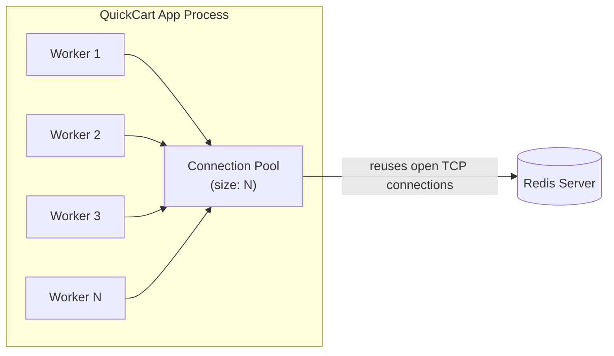
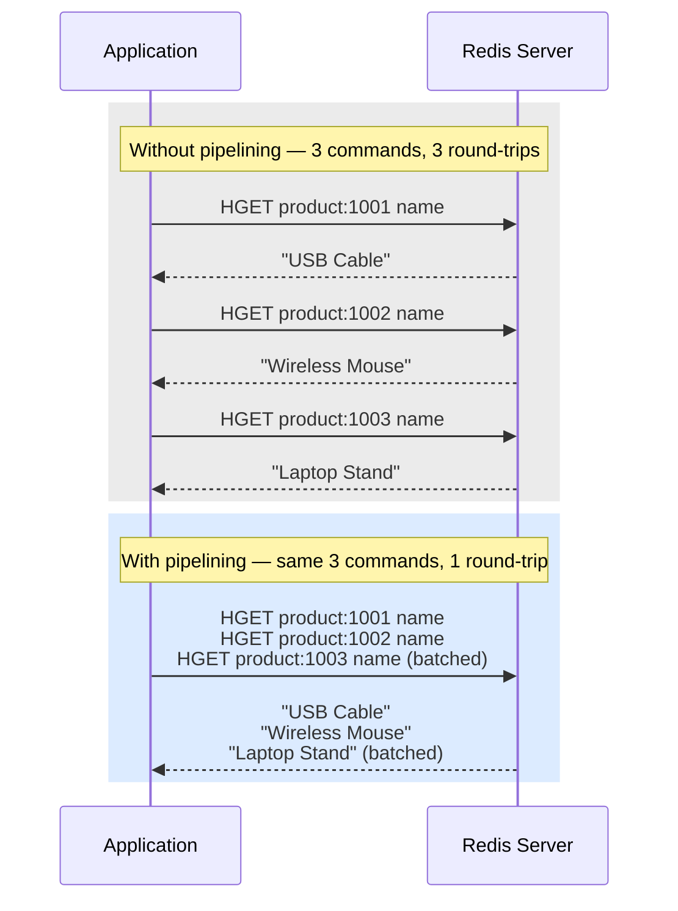

# Chapter 10: Client Libraries & Connection Management

Every chapter so far has talked to Redis through `redis-cli` — perfectly fine for learning, exploring, and debugging, but not how Redis gets used in production. Production systems talk to Redis through a **client library**, embedded in an application process, opening and reusing TCP connections, translating language-native calls (`cache.get("product:1001")`) into the RESP protocol you first met in Chapter 3, and handling the unglamorous but critical work of pooling, retries, and timeouts.

This chapter is where QuickCart's Redis usage stops being a sequence of commands typed into a terminal and starts being code that runs inside a web server, under real concurrency, with real failure modes. You'll write Python, Node.js, and Go snippets against QuickCart's actual data model — the `product:{sku}` hash, the `session:{userId}` key, the `cart:{userId}` hash, and a rate limiter you'll build along the way — and you'll learn the two techniques (pooling and pipelining) that separate a Redis integration that scales from one that quietly falls over under load.

---

## Learning Objectives

By the end of this chapter, you will be able to:

- Explain what a Redis "client" is at the protocol level, and name the mainstream client libraries for Python, Node.js, Go, and Java.
- Configure connection pooling correctly, size a pool to your application's actual concurrency, and explain why unpooled connections are expensive.
- Write working Redis client code in Python (`redis-py`), Node.js (`ioredis`), and Go (`go-redis`) against QuickCart's data model.
- Use pipelining to batch independent commands into a single round-trip, and quantify the latency savings.
- Describe client-side caching (RESP3 tracking) at a conceptual level, and know when it's worth reaching for.
- Design a sane reconnection strategy — exponential backoff with jitter — and explain why naive infinite retries create thundering-herd failures.

---

## Prerequisites for This Chapter

This chapter assumes you're comfortable with:

- **The RESP protocol basics**, introduced in [Chapter 2: Core Concepts](./02-core-concepts.md) and expanded on in [Chapter 3: Architecture & Internals](./03-architecture-and-internals.md) — a Redis client is, underneath the language-specific API, a program that speaks RESP over a TCP socket.
- **Transactions and Lua scripting** from [Chapter 8: Transactions & Lua Scripting](./08-transactions-and-lua-scripting.md) — every client library exposes `MULTI`/`EXEC`, `WATCH`, and `EVAL`/`EVALSHA` as first-class API surface, and this chapter builds on that vocabulary rather than re-explaining it.
- **Expiration semantics** from [Chapter 9: Expiration, Eviction & Memory Management](./09-expiration-eviction-and-memory-management.md) — the rate limiter example in this chapter leans on `EXPIRE` and TTL behavior you already know.
- Basic familiarity with at least one of Python, JavaScript/Node.js, or Go — you don't need fluency in all three, but the code samples assume you can read simple functions and understand what `async`/`await`, goroutines, or context managers mean in their respective ecosystems.

If any of that feels shaky, revisit the relevant chapter before continuing — this chapter treats those concepts as settled ground and moves fast.

---

## 1. The Client Library Landscape

### 1.1 What "a Redis client" actually is

Strip away the language-specific sugar, and a Redis client is a program that:

1. Opens a TCP connection (or several) to a Redis server or cluster.
2. Encodes your command and arguments into **RESP** (`REdis Serialization Protocol`) — the plain-text-ish wire format Chapter 3 introduced, where a command like `HSET product:1001 name "USB Cable"` becomes a length-prefixed array of bulk strings.
3. Writes those bytes to the socket, then reads and decodes the RESP reply into a native value in your language — a string, a list, a hash/dict, an error, or `nil`.
4. Optionally manages a **pool** of such connections, retry/backoff logic, and cluster/sentinel topology awareness.

This means, in principle, you could hand-roll a "Redis client" with nothing but a raw TCP socket and a RESP encoder/decoder — some people do, for embedded systems or exotic runtimes. In practice, mature client libraries have already solved connection pooling, RESP2/RESP3 negotiation, cluster redirection, Sentinel discovery, and dozens of edge cases, so hand-rolling one is rarely worth it outside of learning exercises.

### 1.2 The mainstream clients, by language

| Language | Library | Notes |
|---|---|---|
| Python | **redis-py** | The official, community-maintained client; async support via `redis.asyncio`. The de facto standard — most Python Redis code you'll see uses it. |
| Node.js | **ioredis** | Feature-rich, mature, widely used in production; strong Cluster and Sentinel support. |
| Node.js | **node-redis** (v4+) | The official Node client, rewritten in v4 with a modern Promise-based API; a solid alternative to `ioredis` with tighter alignment to Redis's own release cadence. |
| Go | **go-redis** | The dominant Go client; idiomatic context-aware API, built-in pooling, first-class Cluster/Sentinel support. |
| Java | **Jedis** | Simple, synchronous, thread-per-connection model; historically the default choice. |
| Java | **Lettuce** | Async/reactive, Netty-based, single connection can multiplex many concurrent commands — a different concurrency model than Jedis's pool-of-blocking-connections. |

You'll see all of Python, Node.js, and Go in this chapter, because QuickCart — like most real companies — doesn't run a single-language stack: the web frontend's checkout API might be Go, an internal admin tool might be Node.js, and a data pipeline might be Python. The underlying Redis concepts (pooling, pipelining, retries) are identical across all of them; only the syntax changes.

---

## 2. Connections and Connection Pooling

### 2.1 Why a new TCP connection per operation is expensive

Imagine a naive implementation: every time QuickCart's web app needs to read `product:1001`, it opens a fresh TCP connection to Redis, sends `HGETALL`, reads the reply, and closes the connection.

Each connection incurs:

- A **TCP three-way handshake** (SYN, SYN-ACK, ACK) — at least one network round-trip before you've sent a single byte of your actual command.
- **TLS handshake overhead**, if you're using encryption in transit (Chapter 15) — several more round-trips.
- Optionally, a Redis `AUTH` command and/or `HELLO` handshake for RESP3 negotiation — yet another round-trip.
- **Server-side cost**: Redis must allocate a new client structure, register the file descriptor with its event loop (Chapter 3), and eventually tear all of that down on close.
- **Socket exhaustion risk**: rapidly opening and closing connections churns through ephemeral ports and can leave sockets in `TIME_WAIT`, a real operational hazard under load.

For a single request that would otherwise take under a millisecond of actual Redis processing, you might spend several milliseconds — or, under TLS, tens of milliseconds — purely on connection setup. At QuickCart's scale (thousands of requests per second during a flash sale), that overhead alone could dwarf Redis's own processing time and exhaust the server's file descriptors.

### 2.2 How connection pooling fixes this

A **connection pool** keeps a set of already-established TCP connections open and hands them out to application code as needed, returning them to the pool when the caller is done. The handshake cost is paid once, up front (or lazily, on first use), and amortized across every subsequent command.



Key pool mechanics, common across every client library in this chapter:

- **Minimum/maximum size**: most pools support a floor (connections kept open even when idle) and a ceiling (the hard cap on concurrent connections).
- **Checkout/checkin**: a worker "checks out" a connection to issue a command and "checks it back in" when done (this is usually invisible — the client library does it around every command automatically).
- **Blocking or queuing on exhaustion**: if every pooled connection is busy and the pool is at its max, the next caller either blocks (with a configurable timeout) or the library opens a new connection anyway, depending on configuration.
- **Idle connection reaping**: connections idle for too long may be closed and recreated, both to free server-side resources and to avoid using a connection that a firewall or load balancer has silently killed.

### 2.3 Sizing a pool: QuickCart's example

Pool size should track **your application's actual concurrency**, not an arbitrary large number. A useful mental model: *how many Redis operations could genuinely be in flight at the same time?*

QuickCart's checkout API runs as a fleet of worker processes behind a load balancer — say, 8 worker processes per host, each handling requests with a thread pool or async event loop capped at 25 concurrent in-flight requests. If (on average) each in-flight request issues one Redis command at a time, a pool of roughly **25–30 connections per worker process** covers peak concurrency with a small safety margin — not 500, and not 2.

Two mistakes to avoid symmetrically:

- **Too small**: workers queue up waiting for a free pooled connection, adding latency even though Redis itself is idle and fully capable of handling more traffic.
- **Too large**: with 8 worker processes × an oversized pool of, say, 200 connections each, QuickCart could open 1,600 connections to a single Redis instance — bumping into `maxclients` (Redis's server-side connection cap, default 10,000 but often tuned lower) and wasting server memory, since Redis allocates real per-connection state for each one.

We'll return to concrete pool-sizing numbers in the Real-World Scenario at the end of this chapter.

---

## 3. Python with `redis-py`

### 3.1 Installation

```bash
pip install redis
```

### 3.2 Basic connection and a `ConnectionPool`

```python
import redis

# A ConnectionPool is created implicitly if you skip this step, but
# creating one explicitly lets you control size and share it across
# multiple Redis client objects in the same process.
pool = redis.ConnectionPool(
    host="redis.quickcart.internal",
    port=6379,
    db=0,
    max_connections=30,       # matches this worker's expected concurrency
    socket_connect_timeout=2, # seconds — fail fast on network issues
    socket_timeout=2,         # seconds — fail fast on a hung command
    decode_responses=True,    # return str instead of bytes
)

r = redis.Redis(connection_pool=pool)

r.ping()  # -> True, confirms the connection works
```

Every `redis.Redis(...)` instance you create against the same `pool` object shares its underlying connections — this is the idiomatic pattern: build the pool once at process startup, then pass the `Redis` client (or the pool itself) around your application.

### 3.3 QuickCart's product cache: `HGETALL` and `HSET`

Recall from earlier chapters that QuickCart caches product data in a hash at `product:{sku}`, with fields like `name`, `price`, and `stock`. Here's a realistic read-through cache pattern:

```python
import json
import redis

pool = redis.ConnectionPool(
    host="redis.quickcart.internal", port=6379,
    max_connections=30, decode_responses=True,
)
r = redis.Redis(connection_pool=pool)


def get_product(sku: str) -> dict:
    """Read-through cache: check Redis first, fall back to the database."""
    key = f"product:{sku}"
    cached = r.hgetall(key)
    if cached:
        return cached

    # Cache miss — load from the source of truth (Postgres, say) and populate.
    product = load_product_from_database(sku)  # application-defined
    r.hset(key, mapping={
        "name": product["name"],
        "price": str(product["price"]),
        "stock": str(product["stock"]),
    })
    r.expire(key, 3600)  # 1-hour TTL, per Chapter 9's expiration strategy
    return product


def update_stock(sku: str, delta: int) -> int:
    """Adjust stock atomically using HINCRBY, keeping the cache authoritative."""
    return r.hincrby(f"product:{sku}", "stock", delta)
```

`decode_responses=True` is worth calling out: without it, `redis-py` returns raw `bytes` for every string, which is technically correct (Redis strings are binary-safe) but annoying for everyday application code that expects `str`. Turn it on unless you specifically need to handle binary payloads (e.g., storing serialized images or protobuf messages).

### 3.4 Async `redis-py`

For an `asyncio`-based service, `redis-py` ships an async-native API with the identical method names:

```python
import redis.asyncio as aredis

pool = aredis.ConnectionPool(
    host="redis.quickcart.internal", max_connections=30, decode_responses=True,
)
r = aredis.Redis(connection_pool=pool)

async def get_product(sku: str) -> dict:
    return await r.hgetall(f"product:{sku}")
```

---

## 4. Node.js with `ioredis`

### 4.1 Installation

```bash
npm install ioredis
```

### 4.2 Basic connection and executing commands

```javascript
const Redis = require("ioredis");

const redis = new Redis({
  host: "redis.quickcart.internal",
  port: 6379,
  maxRetriesPerRequest: 3,
  connectTimeout: 2000, // ms
  // ioredis manages its own internal connection lifecycle; there isn't a
  // separate "pool" object to configure the way there is in redis-py —
  // a single ioredis instance multiplexes commands over one connection
  // by default, or you run several instances/clients for parallelism.
});

redis.on("error", (err) => console.error("Redis connection error:", err));

await redis.set("foo", "bar");
const value = await redis.get("foo"); // "bar"
```

A quick but important aside: unlike `redis-py` or `go-redis`, a single `ioredis` connection pipelines commands onto one socket by design (Redis itself processes commands from a single client sequentially but can interleave clients), so "pooling" in the Node.js world more often means running multiple `Redis` client instances behind your own round-robin, or relying on the fact that Node's single-threaded event loop rarely needs dozens of parallel sockets to one Redis host the way a multi-threaded Python or Go process does. For CPU-bound Node clusters (multiple worker processes via the `cluster` module), each worker process gets its own `ioredis` instance, and the analogous pool-sizing thinking from Section 2.3 still applies at the process level.

### 4.3 QuickCart's session store

QuickCart stores sessions as `session:{userId}` keys with a TTL, holding a JSON blob (or a hash, depending on how granular the reads/writes need to be). Here's a typical Express.js middleware pattern:

```javascript
const Redis = require("ioredis");
const redis = new Redis({ host: "redis.quickcart.internal", port: 6379 });

const SESSION_TTL_SECONDS = 1800; // 30-minute idle timeout

async function createSession(userId, sessionData) {
  const key = `session:${userId}`;
  await redis.set(key, JSON.stringify(sessionData), "EX", SESSION_TTL_SECONDS);
}

async function getSession(userId) {
  const key = `session:${userId}`;
  const raw = await redis.get(key);
  if (!raw) return null;

  // Sliding expiration: touch the TTL on every read, per Chapter 9's
  // discussion of idle-timeout session patterns.
  await redis.expire(key, SESSION_TTL_SECONDS);
  return JSON.parse(raw);
}

async function destroySession(userId) {
  await redis.del(`session:${userId}`);
}
```

### 4.4 `node-redis` v4 equivalent (for reference)

If your stack prefers the official client instead of `ioredis`, the shape is similar:

```javascript
const { createClient } = require("redis");

const client = createClient({
  socket: { host: "redis.quickcart.internal", port: 6379 },
});
client.on("error", (err) => console.error("Redis error:", err));
await client.connect();

await client.set("foo", "bar", { EX: 1800 });
const value = await client.get("foo");
```

Both libraries are production-grade; `ioredis` has historically had richer Cluster/Sentinel ergonomics, while `node-redis` v4 tracks the official Redis command set and RESP3 features closely. Pick one per project and stay consistent — mixing both in the same codebase adds no value.

---

## 5. Go with `go-redis`

### 5.1 Installation

```bash
go get github.com/redis/go-redis/v9
```

### 5.2 Context-aware calls and built-in pooling

`go-redis`'s `*redis.Client` is itself a connection pool — you don't construct a separate pool object; you configure pool behavior via `Options`:

```go
package main

import (
    "context"
    "time"

    "github.com/redis/go-redis/v9"
)

var rdb = redis.NewClient(&redis.Options{
    Addr:         "redis.quickcart.internal:6379",
    PoolSize:     30,              // matches expected concurrency, per Section 2.3
    MinIdleConns: 5,               // keep a few warm connections ready
    DialTimeout:  2 * time.Second,
    ReadTimeout:  1 * time.Second,
    WriteTimeout: 1 * time.Second,
})

func ping(ctx context.Context) error {
    return rdb.Ping(ctx).Err()
}
```

Every `go-redis` call takes a `context.Context` as its first argument — this is idiomatic Go, and it means Redis calls automatically respect request-scoped cancellation and deadlines from an HTTP handler's context, without any extra plumbing.

### 5.3 QuickCart's rate limiter: `INCR` + `EXPIRE`

QuickCart wants to rate-limit checkout attempts per user to, say, 5 per minute. The classic Redis pattern — an `INCR` on a per-window key, with `EXPIRE` set only on the first increment — looks like this in Go:

```go
package main

import (
    "context"
    "fmt"
    "time"

    "github.com/redis/go-redis/v9"
)

const (
    rateLimitWindow = time.Minute
    rateLimitMax    = 5
)

// AllowCheckoutAttempt returns true if the user is within their rate limit.
func AllowCheckoutAttempt(ctx context.Context, rdb *redis.Client, userID string) (bool, error) {
    key := fmt.Sprintf("ratelimit:checkout:%s", userID)

    count, err := rdb.Incr(ctx, key).Result()
    if err != nil {
        return false, err
    }

    if count == 1 {
        // Only the request that created the counter sets its expiry,
        // so the window resets exactly one minute after the first hit.
        if err := rdb.Expire(ctx, key, rateLimitWindow).Err(); err != nil {
            return false, err
        }
    }

    return count <= rateLimitMax, nil
}
```

Two calls (`INCR` then, conditionally, `EXPIRE`) means two round-trips in the common case. There's a well-known sharper version of this pattern using a Lua script (from Chapter 8) to make the increment-and-conditionally-expire logic atomic in a single round-trip — worth revisiting once you've read that chapter, since a race between two concurrent first-requests could each see `count == 1` and both set the expiry (harmless here, but worth recognizing as the kind of race Chapter 8's `WATCH`/Lua tools exist to close).

---

## 6. Pipelining: Batching Round-Trips

### 6.1 The problem: one round-trip per command

Every command you send to Redis and wait for a response on is one network round-trip. If your application logic calls Redis in a loop — say, fetching ten products one at a time — you pay the full round-trip-time (RTT) cost ten separate times, even though Redis itself might process each command in microseconds.

**The numbers make this concrete.** Suppose your app-to-Redis network RTT is a fairly typical 1 ms (same-datacenter, different host):

- **1,000 sequential commands, no pipelining**: 1,000 round-trips × 1 ms ≈ **1,000 ms (1 second)** of pure network latency, even though Redis's actual processing time for 1,000 simple commands might be a few milliseconds total.
- **1,000 commands, pipelined into one batch**: 1 round-trip × 1 ms ≈ **~1 ms** of network latency, plus Redis's processing time for the batch.

That's roughly a **1000x reduction in latency overhead** for this workload — not because Redis got faster, but because you stopped paying the network tax 1,000 times over.

### 6.2 How pipelining works

**Pipelining** means writing multiple commands to the socket back-to-back without waiting for each individual reply, then reading all the replies together once they arrive. The client library buffers your commands locally, flushes them as one (or a few) TCP writes, and Redis — because it processes each client's commands from the socket in order — sends back the replies in the same order you sent the requests, which the client then matches up for you.



Important nuance: pipelining is **not** the same thing as a transaction (`MULTI`/`EXEC`, Chapter 8). Pipelined commands are still executed by Redis one at a time, in order, and other clients' commands can interleave between them from Redis's point of view (Redis is single-threaded per the event loop from Chapter 3, so there's no true parallel execution, but there's no atomicity guarantee across a pipeline the way there is inside `MULTI`/`EXEC`). If you need "all these commands succeed/fail together, with nothing else able to run in between," you want a transaction or a Lua script, not just a pipeline. If you simply want to avoid paying round-trip latency for a batch of independent reads or writes, pipelining is the right (and much simpler) tool.

### 6.3 Pipelining in `redis-py`

```python
pipe = r.pipeline()
for sku in ["1001", "1002", "1003"]:
    pipe.hget(f"product:{sku}", "name")
names = pipe.execute()  # -> ["USB Cable", "Wireless Mouse", "Laptop Stand"]
```

### 6.4 Pipelining in `go-redis`

```go
pipe := rdb.Pipeline()
cmds := make(map[string]*redis.StringCmd)
for _, sku := range []string{"1001", "1002", "1003"} {
    cmds[sku] = pipe.HGet(ctx, fmt.Sprintf("product:%s", sku), "name")
}
_, err := pipe.Exec(ctx)
if err != nil && err != redis.Nil {
    // handle error
}
for sku, cmd := range cmds {
    fmt.Println(sku, cmd.Val())
}
```

### 6.5 Pipelining in `ioredis`

```javascript
const pipeline = redis.pipeline();
["1001", "1002", "1003"].forEach((sku) => {
  pipeline.hget(`product:${sku}`, "name");
});
const results = await pipeline.exec();
// results: [[null, "USB Cable"], [null, "Wireless Mouse"], [null, "Laptop Stand"]]
// each entry is [error, value] — check the first element per command.
```

---

## 7. Client-Side Caching (RESP3 Tracking)

Redis 6 introduced **RESP3**, a protocol revision that (among other things) enables **client-side caching**, also called **tracking**. The idea: rather than your application hitting Redis over the network for every single read of a value it just read a moment ago, the client library caches recently-read keys **in the application process's own memory**, and Redis proactively pushes an **invalidation message** to that client the moment the key changes (from any client, anywhere).

At a conceptual level:

1. The client opts into tracking (via `CLIENT TRACKING ON`, typically wrapped by the library) when it establishes a RESP3 connection.
2. When the client reads a key, it may cache the value locally.
3. If any client modifies or deletes that key, Redis sends an out-of-band invalidation push to every tracking client that had read it, so they know to drop their local copy.
4. The next read for that key either serves from the now-fresh local cache or, after invalidation, goes back to Redis and re-populates.

This can meaningfully cut both network round-trips and Redis server load for read-heavy, slow-changing data — a great conceptual fit for something like QuickCart's `product:{sku}` catalog data, where a given product is read thousands of times between updates. The trade-off is added complexity (your application now holds a second, invalidation-driven cache layer, with its own memory footprint and edge cases around reconnects and cache invalidation storms) and it requires both server (Redis 6+) and client library support — `redis-py`, `ioredis` (via `node-redis`'s RESP3 mode), `go-redis`, and Lettuce all have some form of tracking support, though maturity and API ergonomics vary. Treat this as a targeted optimization for specific hot, read-heavy keys — not a default you flip on everywhere — and validate it under your own workload before relying on it in production.

---

## 8. Handling Connection Failures and Retries

### 8.1 Failures are normal — plan for them

Networks partition, Redis processes restart (a deploy, an OOM kill, a failover covered in Chapter 11), and load balancers occasionally drop idle connections. A production Redis client needs an explicit strategy for what happens when a command fails because the connection is gone or a reply doesn't arrive in time.

### 8.2 Exponential backoff, not naive infinite retry

The tempting-but-dangerous approach: on any failure, immediately retry, in a tight loop, forever. This is dangerous for a specific, well-documented reason: **the thundering herd**. If QuickCart runs 200 web worker processes and Redis becomes briefly unavailable (say, during a Sentinel failover, Chapter 11), all 200 workers detect the failure at roughly the same moment and, if they retry immediately and repeatedly, they hammer the newly-recovered Redis instance with a synchronized burst of reconnect storms right as it's trying to come back up — potentially delaying or destabilizing the very recovery they're waiting for.

The standard fix is **exponential backoff with jitter**:

- On failure, wait a short base delay before retrying (e.g., 50 ms).
- On each subsequent failure, roughly double the delay, up to some maximum (e.g., 50 ms → 100 ms → 200 ms → ... → capped at 2 s).
- Add **jitter** — a small random offset — to each delay, so that many clients failing at the same instant don't all retry in lockstep.

Most client libraries implement some version of this internally for connection-level retries; `go-redis`, `ioredis`, and `redis-py` all expose configuration for retry counts and backoff behavior rather than requiring you to hand-roll it, but it's worth knowing the mechanism so you can tune it (or implement it yourself at the application level for higher-level operations, like "retry this whole checkout flow").

```python
# A hand-rolled illustration of the pattern (most libraries do this for you
# at the connection layer, but application-level retries often need it too)
import random
import time

def call_with_backoff(fn, max_attempts=5, base_delay=0.05, max_delay=2.0):
    for attempt in range(max_attempts):
        try:
            return fn()
        except redis.exceptions.ConnectionError:
            if attempt == max_attempts - 1:
                raise
            delay = min(max_delay, base_delay * (2 ** attempt))
            delay += random.uniform(0, delay * 0.5)  # jitter
            time.sleep(delay)
```

### 8.3 Timeout configuration

Every library lets you set, separately:

- **Connect timeout**: how long to wait while establishing the TCP (and TLS) connection before giving up.
- **Read/socket timeout**: how long to wait for a reply to a command already sent before treating it as failed.

Set both **explicitly**, and set them **short** relative to your application's own latency budget — a checkout API with a 500 ms total latency budget has no business waiting 30 seconds (a common library default) to discover Redis isn't answering. A good starting point for most QuickCart-scale services is a connect timeout of 1–2 seconds and a read timeout of 1 second, tightened further for latency-critical paths and loosened for background jobs that can tolerate more slack.

---

## 9. ORMs and Higher-Level Abstractions

Object-mapping libraries — **`redis-om`** for Python and Node.js is the most visible example — let you define a schema (e.g., a `Product` class with `name`, `price`, `stock` fields) and interact with Redis through model objects (`Product.get(sku)`, `product.save()`) rather than raw `HGETALL`/`HSET` calls. Under the hood, they typically use Redis hashes or RedisJSON (Chapter 18) plus, optionally, RediSearch (also Chapter 18) for indexed queries over those fields.

**When an abstraction like this is worth it:**

- You have many entity types with many fields, and hand-writing serialization/deserialization for each is repetitive and error-prone.
- You want secondary-index-style queries (e.g., "find all products under $20 in stock") backed by RediSearch, which raw commands don't give you directly.
- Your team values the type safety and IDE autocomplete a schema-driven model provides.

**When raw commands are preferable:**

- Your access patterns are simple and already match Redis's native data types closely (QuickCart's `cart:{userId}` hash, `leaderboard:daily` sorted set) — wrapping a `ZADD`/`ZRANGE` call in an ORM layer often adds indirection without adding value.
- You need to reach for pipelining, Lua scripts, or cluster-aware key routing tricks that an ORM's abstraction may not expose cleanly.
- Performance-critical hot paths (the checkout API, the rate limiter) benefit from full visibility and control over exactly which commands are sent and in what order — exactly the kind of control this chapter's pipelining section relies on.

A practical rule of thumb: reach for an ORM/abstraction for CRUD-heavy application data with many fields and query needs; reach for raw commands for latency-sensitive, structurally simple, high-throughput operations. QuickCart, in practice, would likely use raw `go-redis`/`redis-py` calls for the checkout path and rate limiter, and could reasonably use `redis-om` for a lower-traffic admin dashboard that manages product catalog entries.

---

## Real-World Scenario

QuickCart's checkout API is written in Go. On every checkout request, it needs to:

1. Read the user's cart (`cart:{userId}` hash).
2. Read current stock for every item in the cart (`product:{sku}` hash, `stock` field).
3. Read the user's session to confirm they're still authenticated (`session:{userId}`).

Done naively — one `go-redis` call at a time, each opening a fresh connection — this would be both connection-overhead-heavy and round-trip-heavy: for a 5-item cart, that's up to 7 sequential round-trips (1 cart + 5 stock lookups + 1 session check) before checkout logic even begins.

The fixed version uses a **properly sized pool** (configured once, at service startup, sized to the checkout service's real concurrency — say, 40 connections for a service running with 40 max concurrent in-flight requests per instance) and **pipelines the independent reads together**:

```go
package main

import (
    "context"
    "fmt"
    "time"

    "github.com/redis/go-redis/v9"
)

var rdb = redis.NewClient(&redis.Options{
    Addr:         "redis.quickcart.internal:6379",
    PoolSize:     40,               // matches checkout service's max concurrency
    MinIdleConns: 10,
    DialTimeout:  2 * time.Second,
    ReadTimeout:  500 * time.Millisecond, // tight budget for a latency-critical path
    WriteTimeout: 500 * time.Millisecond,
})

type CheckoutContext struct {
    Cart      map[string]string
    Stock     map[string]int64
    SessionOK bool
}

// LoadCheckoutContext gathers everything checkout needs in one round-trip,
// instead of one round-trip per key.
func LoadCheckoutContext(ctx context.Context, userID string) (*CheckoutContext, error) {
    pipe := rdb.Pipeline()

    cartCmd := pipe.HGetAll(ctx, fmt.Sprintf("cart:%s", userID))
    sessionCmd := pipe.Exists(ctx, fmt.Sprintf("session:%s", userID))

    // We don't know the cart's SKUs yet, so a first pipelined round-trip
    // fetches the cart, then a second pipelined round-trip fetches stock
    // for every SKU found — still just two round-trips total, regardless
    // of cart size, instead of one round-trip per item.
    if _, err := pipe.Exec(ctx); err != nil && err != redis.Nil {
        return nil, fmt.Errorf("loading cart/session: %w", err)
    }

    cart, err := cartCmd.Result()
    if err != nil && err != redis.Nil {
        return nil, err
    }
    sessionExists, err := sessionCmd.Result()
    if err != nil {
        return nil, err
    }

    stockPipe := rdb.Pipeline()
    stockCmds := make(map[string]*redis.StringCmd, len(cart))
    for sku := range cart {
        stockCmds[sku] = stockPipe.HGet(ctx, fmt.Sprintf("product:%s", sku), "stock")
    }
    if _, err := stockPipe.Exec(ctx); err != nil && err != redis.Nil {
        return nil, fmt.Errorf("loading stock levels: %w", err)
    }

    stock := make(map[string]int64, len(stockCmds))
    for sku, cmd := range stockCmds {
        val, err := cmd.Int64()
        if err != nil && err != redis.Nil {
            return nil, err
        }
        stock[sku] = val
    }

    return &CheckoutContext{
        Cart:      cart,
        Stock:     stock,
        SessionOK: sessionExists == 1,
    }, nil
}
```

This brings a 5-item checkout down from up to 7 sequential round-trips to **2 round-trips total**, regardless of cart size (one to fetch the cart and check the session together, one to fetch every item's stock together) — and because the pool is sized to the service's real concurrency (40, matching its max in-flight request count) rather than an arbitrarily large number, Redis's `maxclients` budget is respected even as the checkout service scales out to many instances behind a load balancer.

---

## Best Practices

- **Always use a connection pool** — never open a raw connection per request. Every mainstream client library makes this either the default or a one-line configuration away.
- **Size the pool to actual concurrency**, not to "as high as possible." Estimate your service's realistic peak in-flight Redis operations and set the pool at or slightly above that number, then verify under load.
- **Pipeline independent commands** whenever you find yourself calling Redis in a loop for unrelated keys (or unrelated reads/writes to related keys) — the round-trip savings scale with the number of commands batched.
- **Set explicit, tight connect/read timeouts** matched to your application's latency budget; never rely on a library's (often generous) default.
- **Handle reconnection with exponential backoff and jitter**, both at the connection layer (usually handled by the library) and, where relevant, at the application retry layer for higher-level operations.
- **Reuse client/pool objects across your application's lifetime** — construct once at process startup, not per request or per function call.

---

## Common Mistakes

- **Opening a new connection per request.** This is the single most common and most expensive Redis integration mistake — it turns sub-millisecond Redis operations into multi-millisecond ones dominated by handshake overhead, and it's often invisible until load testing or a production incident reveals it.
- **Oversized connection pools.** Setting `max_connections`/`PoolSize` to an arbitrarily large number "to be safe" can, across many application instances, collectively exhaust Redis's `maxclients` limit or waste server memory on idle per-connection state, for no throughput benefit beyond your actual concurrency ceiling.
- **Not pipelining N independent round-trips inside a hot loop.** Calling Redis once per item in a loop (fetching ten products one `HGETALL` at a time) is the most common missed pipelining opportunity — and usually the easiest to fix once spotted.
- **Ignoring library-specific gotchas around cluster mode.** A client configured for a single Redis instance often needs meaningfully different setup (`ClusterClient` in `go-redis`, `Redis.Cluster` in `ioredis`, `RedisCluster` in `redis-py`) to talk to a sharded Redis Cluster deployment correctly, including handling `MOVED`/`ASK` redirections. Chapter 12 covers this in depth — don't assume a single-node client configuration "just works" against a cluster.

---

## Summary

- A Redis client is, underneath its language-specific API, a RESP-speaking TCP client — this chapter covered `redis-py` (Python), `ioredis`/`node-redis` (Node.js), and `go-redis` (Go), the mainstream choices in each ecosystem.
- **Connection pooling** avoids the real, measurable cost of a fresh TCP (and possibly TLS) handshake per operation; size pools to your application's actual concurrency, not an arbitrarily large ceiling.
- **Pipelining** batches multiple independent commands into a single network round-trip, turning N × RTT of latency overhead into roughly 1 × RTT — a difference that can mean the gap between 1 second and 1 millisecond at N = 1,000.
- **Client-side caching (RESP3 tracking)**, introduced in Redis 6, lets a client cache reads locally and receive server-pushed invalidations, cutting round-trips for hot, slow-changing keys.
- **Connection failures are normal**; handle them with exponential backoff and jitter rather than naive infinite retries, which can create thundering-herd failures during an outage or failover.
- **ORMs like `redis-om`** are useful for schema-heavy, query-rich application data, but raw commands remain preferable for simple, latency-critical, high-throughput operations like QuickCart's checkout path and rate limiter.

---

## Knowledge Check

1. What does it mean for a Redis client library to be "a RESP-speaking TCP client," and why does that framing matter when comparing clients across languages?
2. Why is opening a new TCP connection for every Redis command expensive, even though Redis itself might process the command in microseconds?
3. QuickCart's checkout service handles up to 40 concurrent in-flight requests per instance. Explain why a connection pool of 500 would likely be worse than a pool of 40–50, not better.
4. Using the 1 ms RTT example from Section 6.1, roughly how long would 500 sequential (non-pipelined) `GET` calls take purely in network latency? How does pipelining change that number?
5. What is the difference between pipelining and a Redis transaction (`MULTI`/`EXEC`)? Give one scenario where you'd need a transaction instead of just a pipeline.
6. Explain, in your own words, how RESP3 client-side caching (tracking) reduces load on both the network and the Redis server, and name one QuickCart key that would be a good candidate for it.
7. Why can naive infinite-retry-on-failure logic make an outage worse instead of better? What two techniques mitigate this?
8. When would you prefer an ORM-style library like `redis-om` over raw client commands, and when would you prefer raw commands instead?

---

## Hands-On Exercise

**Exercise: Pipelining timing comparison.**

Using the language of your choice (Python with `redis-py` is the most concise for this), write a script that:

1. Connects to a local Redis instance using a properly configured connection pool.
2. Seeds 100 QuickCart cart items for a fake user: `cart:demo-user` as a hash with fields `sku:1001` through `sku:1100`, each mapped to a quantity.
3. **Without pipelining**: loops over all 100 fields, issuing one `HGET` per field, and times the total wall-clock duration.
4. **With pipelining**: issues the same 100 `HGET` calls batched into a single pipeline `execute()`/`exec()` call, and times that.
5. Prints both durations and the speedup ratio.

Example skeleton to build from:

```python
import time
import redis

pool = redis.ConnectionPool(host="localhost", port=6379, decode_responses=True)
r = redis.Redis(connection_pool=pool)

# --- seed data ---
r.delete("cart:demo-user")
r.hset("cart:demo-user", mapping={f"sku:{1000+i}": i % 5 + 1 for i in range(100)})
fields = [f"sku:{1000+i}" for i in range(100)]

# --- without pipelining ---
start = time.perf_counter()
for f in fields:
    r.hget("cart:demo-user", f)
no_pipeline_duration = time.perf_counter() - start

# --- with pipelining ---
start = time.perf_counter()
pipe = r.pipeline()
for f in fields:
    pipe.hget("cart:demo-user", f)
pipe.execute()
pipeline_duration = time.perf_counter() - start

print(f"Without pipelining: {no_pipeline_duration*1000:.2f} ms")
print(f"With pipelining:    {pipeline_duration*1000:.2f} ms")
print(f"Speedup: {no_pipeline_duration / pipeline_duration:.1f}x")
```

Run this against a local Redis instance (loopback RTT is tiny, so the absolute gap will be smaller than the 1000x illustration in Section 6.1 — but the relative speedup should still be clearly visible). Then try it again against a Redis instance on a different host (or add artificial latency with `tc netem` if you want to get elaborate) to see the gap widen as RTT increases — this is the most convincing way to internalize why pipelining matters more, not less, as network distance grows.

---

## Further Reading

- Redis official docs — [Client-side caching](https://redis.io/docs/latest/develop/reference/client-side-caching/) — the authoritative reference on RESP3 tracking, invalidation modes, and library support.
- Redis official docs — [Pipelining](https://redis.io/docs/latest/develop/use/pipelining/) — the canonical explanation of pipelining semantics and its relationship to transactions.
- `redis-py` documentation — [Connection pools](https://redis.readthedocs.io/en/stable/connections.html) — configuration reference for pool sizing and timeouts.
- `go-redis` documentation — [Connection pooling](https://redis.uptrace.dev/guide/go-redis-debugging.html) — pool internals and debugging guidance for the Go client.
- `ioredis` GitHub README — [Cluster and Sentinel support](https://github.com/redis/ioredis) — client-specific configuration for high-availability topologies, a preview of Chapter 11 and Chapter 12.

---

<div style="display:flex;justify-content:space-between;align-items:center;">
  <a href="./09-expiration-eviction-and-memory-management.md">← Previous: Expiration, Eviction & Memory Management</a>
  <a href="./00-index.md">🏠 Index</a>
  <a href="./11-replication-and-high-availability.md">Next: Replication & High Availability →</a>
</div>
