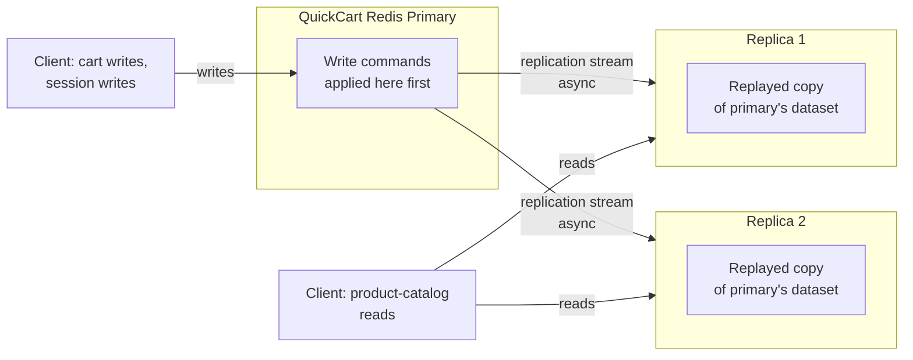
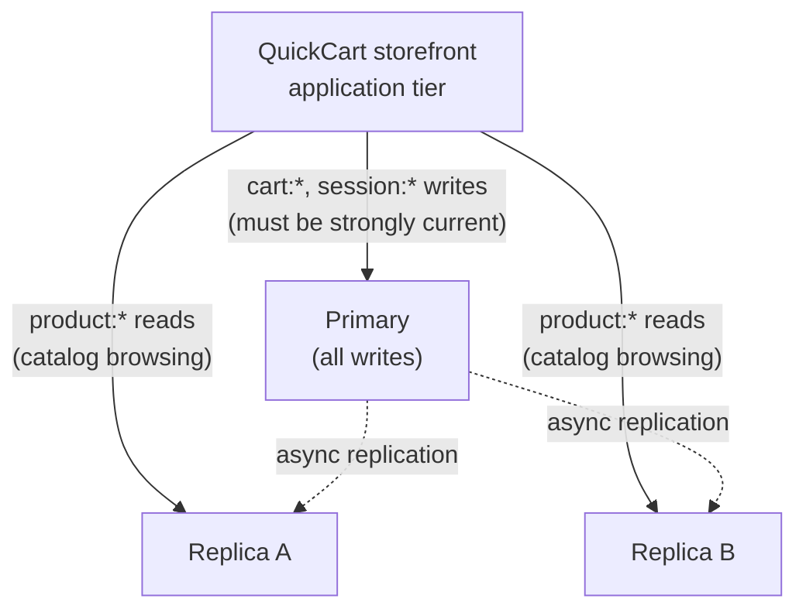
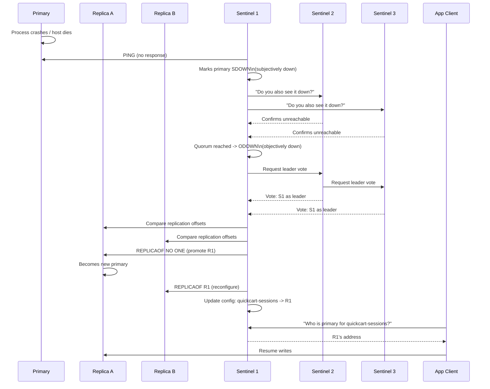

# Chapter 11: Replication & High Availability

Every chapter so far has treated "the Redis server" as a single process on a single machine. That's fine for learning, and it's even fine for a lot of low-stakes production workloads — but the moment Redis holds anything QuickCart can't afford to lose or lose access to (sessions, carts, rate limits, the leaderboard), a single process is a single point of failure. Disk dies, the host reboots for a kernel patch, an out-of-memory condition kills the process, a data center has a bad day — any of these takes your one Redis instance down, and with it, every feature built on top of it.

This chapter is about closing that gap in two layers. **Replication** gives you continuously up-to-date copies of your dataset on other machines, which solves "don't lose the data" and "spread out the read load." **Redis Sentinel** watches those copies and automates the painful part — deciding a primary is actually dead and promoting a replica to take its place — which solves "don't go down for long when the primary dies." Neither one is optional if QuickCart wants a production-grade Redis deployment, and neither one, on its own, is the whole story: replication without Sentinel means a human has to notice an outage and manually fail over; Sentinel without replication has nothing to fail over *to*. They're a package deal, and this chapter treats them as one.

---

## Learning Objectives

By the end of this chapter, you will be able to:

- Explain Redis's leader-replica replication model: how `REPLICAOF`/`SLAVEOF` works, and the difference between a full sync (RDB transfer) and a partial resync (replication backlog + replication ID).
- Articulate precisely what "asynchronous by default" means for a Redis write, including the exact window in which an acknowledged write can be lost, and when to reach for `WAIT` (and what it costs).
- Design a read-scaling strategy that routes read-heavy traffic to replicas while accepting — and mitigating — replication lag as a real consistency trade-off.
- Explain why replication alone does not provide automatic failover, and what Redis Sentinel adds on top of it: monitoring, notification, automatic failover, and configuration provision.
- Walk through a Sentinel-driven failover step by step — subjective/objective down detection, leader election among Sentinels, replica promotion, replica reconfiguration, and client redirection.
- Configure Sentinel-aware clients and apply the key safety knobs (`min-replicas-to-write`, quorum sizing) that reduce — but do not eliminate — data loss and split-brain risk during failover.

---

## Prerequisites for This Chapter

This chapter builds on two earlier ones:

- **[Chapter 7: Persistence — RDB & AOF](./07-persistence-rdb-and-aof.md)**. Full resynchronization between a primary and a new (or badly lagging) replica works by generating and transferring an **RDB snapshot** — the exact same point-in-time binary snapshot mechanism Chapter 7 covered for on-disk durability is reused, unmodified, as the bulk-transfer format for replication. If RDB's snapshot mechanics (the `fork()`-based copy-on-write snapshot, when a "full save" is triggered) are shaky, revisit that chapter before continuing — Section 1 below leans on it directly.
- **[Chapter 10: Client Libraries & Connection Management](./10-client-libraries-and-connection-management.md)**. Section 7 of this chapter discusses Sentinel-aware client configuration, which assumes you're comfortable with how a client library manages connections and discovers a server address in the first place.

We also assume the general QuickCart context established in [Chapter 2](./02-core-concepts.md): a single flat keyspace holding sessions, a product cache, shopping carts, a leaderboard, rate limits, an order stream, notifications, and a store locator. This chapter asks a new question about that same dataset: what happens to it when the machine it lives on disappears?

---

## 1. Leader-Replica Replication Fundamentals

Redis replication follows a **leader-replica** (historically "master-slave," and you'll still see `SLAVEOF` and `slave` in configuration and command output) topology: one Redis instance is the **primary** (leader), accepting all writes, and one or more **replicas** maintain a continuously updated copy of the primary's dataset, built by receiving and replaying the primary's write stream.

### 1.1 Setting up replication: `REPLICAOF` / `SLAVEOF`

A replica is told who its primary is with a single command (or the equivalent config-file directive):

```
# On the replica, at runtime:
127.0.0.1:6380> REPLICAOF 127.0.0.1 6379
OK

# Equivalent in redis.conf (loaded at startup):
replicaof 127.0.0.1 6379

# Older Redis versions (and still an alias today) use:
SLAVEOF 127.0.0.1 6379
```

The moment a replica runs this command, it initiates a connection to the primary and begins the synchronization process described below. To detach a replica back into a standalone primary (for example, right before promoting it during a failover), the command is:

```
127.0.0.1:6380> REPLICAOF NO ONE
OK
```

Replication in Redis is **one primary, many replicas**, and replicas can themselves have sub-replicas (a "replication chain"), which is useful for scaling read fan-out geographically without piling every replica's sync load onto a single primary — but the fundamentals below apply the same way at each hop.

### 1.2 The asynchronous replication model, at a glance

Once connected, a replica does two things, in order:

1. Gets a copy of the primary's dataset as it existed at connection time (a **sync**, full or partial — Section 1.3).
2. From then on, continuously receives every write command the primary processes, in the exact order the primary processed them, and replays each one against its own copy.

That second part is what makes replication *asynchronous*: the primary does not wait for a replica to acknowledge a write before telling the client the write succeeded. It fires the write off to its replicas as a side effect of applying it locally, and moves on. Section 2 works out the consequences of that design choice in detail — it's important enough to be its own section, not a footnote here.



### 1.3 Full sync vs. partial resync

When a replica connects (or reconnects after a network blip), Redis has two ways to get it up to date, and it always prefers the cheaper one if it can.

**Full synchronization** happens when a replica connects for the first time, or when a partial resync isn't possible (Section 1.3.2). It works like this:

1. The replica sends `PSYNC` to the primary.
2. The primary starts (or reuses) a background RDB save — the same snapshot mechanism from Chapter 7 — and, once it completes, streams the entire RDB file to the replica.
3. The replica discards whatever dataset it had, loads the RDB file wholesale, and now has a byte-for-byte-equivalent copy of the primary's dataset *as of the moment the snapshot was taken*.
4. Meanwhile, the primary buffers every write that arrives *during* the snapshot/transfer in memory, and streams that buffered backlog to the replica immediately afterward, so the replica catches up to "now" before being marked as online.

A full sync is expensive: generating an RDB snapshot costs CPU and I/O on the primary (via `fork()`, exactly as in Chapter 7), and transferring a multi-gigabyte file over the network takes real time and bandwidth — all while the primary is still serving live traffic. For a large QuickCart dataset, a full sync of a brand-new replica could take minutes.

**Partial resynchronization** is the cheap path, and it's what you want to happen on every routine reconnect (a replica restarts, a network blip drops the TCP connection for a few seconds, etc.). It relies on two pieces of state:

- **Replication ID** — a pseudo-random ID the primary assigns to identify one continuous "replication history." Every replica remembers the replication ID and the exact offset (byte position in the write stream) it last received.
- **Replication backlog buffer** — a fixed-size, in-memory circular buffer the primary keeps of the most recent writes it has streamed out, tagged by offset.

When a replica reconnects, it sends `PSYNC <replication-id> <offset>` — "I am at this exact point in this exact replication history." If the primary's backlog buffer still contains everything from that offset forward (i.e., the disconnect wasn't too long, or too much write traffic happened while it was gone), the primary just streams the missing slice of the backlog, and the replica is caught up in a fraction of a second, without a single byte of RDB transfer. If the backlog no longer covers that offset — the buffer wrapped around because the gap was too long or write volume too high, or the replication ID doesn't match (e.g., the primary itself restarted and lost its backlog) — the primary falls back to a full sync.

```
# INFO replication on the primary shows this state directly:
127.0.0.1:6379> INFO replication
# Replication
role:master
connected_slaves:2
slave0:ip=10.0.1.11,port=6380,state=online,offset=915042,lag=0
slave1:ip=10.0.1.12,port=6380,state=online,offset=915042,lag=0
master_failover_state:no-failover
master_replid:8a3a...
master_repl_offset:915042
second_repl_offset:-1
repl_backlog_active:1
repl_backlog_size:1048576
repl_backlog_first_byte_offset:1
repl_backlog_histlen:915042
```

The practical takeaway: **the size of `repl-backlog-size` determines how long a replica can be disconnected before it's forced into an expensive full sync.** A larger backlog buys more tolerance for network blips and brief replica restarts at the cost of a bit more memory on the primary — a cheap trade for most production deployments, and one worth tuning explicitly rather than leaving at its (fairly small) default.

---

## 2. Replication Is Asynchronous by Default: What That Actually Means

This is the single most consequential fact in this chapter, so it gets stated plainly before anything else: **by default, Redis acknowledges a write to the client as soon as the primary applies it in memory — before any replica has necessarily received it.**

Walk through the timeline of a single `HSET cart:42 sku:1001 2` on QuickCart's primary:

1. The primary receives the command and applies it to its in-memory dataset.
2. The primary replies `OK`-equivalent to the client. **The client now believes the write succeeded and is durable.**
3. Independently, and without the client waiting on it, the primary forwards the command to its connected replicas over the replication link.
4. Some (small, usually sub-millisecond on a healthy local network) amount of time later, each replica receives and applies the command.

Between steps 2 and 4, there is a real window — small, but nonzero — during which **the write exists on the primary and nowhere else.** If the primary's process crashes, or its host loses power, in that window, the write is gone: it was never persisted to disk (that's a separate, Chapter-7 concern) and it was never replicated. If a replica is later promoted to primary (Section 5–6), it promotes from *its* last-received state — which does not include that write. The client that got `OK` was told the truth about "the primary has this," but not about "this is safe from every single-node failure," and conflating the two is one of the most common production misunderstandings about Redis.

### 2.1 `WAIT`: trading latency for a synchronous-ish guarantee

For writes where that window is unacceptable — a payment confirmation, an inventory decrement during a flash sale where overselling is expensive — Redis gives you `WAIT numreplicas timeout`:

```
127.0.0.1:6379> SET order:9981:status "confirmed"
OK
127.0.0.1:6379> WAIT 1 100
(integer) 1
```

`WAIT` blocks the *calling client* (not the whole server) until at least `numreplicas` replicas have acknowledged receipt of all writes issued on that connection so far, or until `timeout` milliseconds elapse, whichever comes first — returning the number of replicas that actually acknowledged in time. In the example above, QuickCart asks for confirmation that at least 1 replica has the `order:9981:status` write, waiting up to 100ms; getting `1` back means it happened in time, getting `0` means it didn't (the write still happened on the primary — `WAIT` doesn't roll anything back — it just tells you replication hasn't caught up yet).

This is *not* the same guarantee as a synchronous, quorum-committing system like Raft-based stores. `WAIT` tells you replication reached N replicas at the moment you checked; it doesn't participate in the write path itself, doesn't block other clients' writes, and doesn't prevent a subsequent primary failure from losing data that hasn't yet been checked with a following `WAIT` call. Redis's design deliberately keeps the write path itself always-asynchronous and lets you opt into a synchronous-*style* check as an extra step precisely where you need it — a pattern sometimes called "asynchronous replication with synchronous confirmation."

### 2.2 The cost of `WAIT`

That confirmation is not free:

- **Added latency per write.** Every `WAIT` call is a round trip that blocks until replicas respond (or the timeout fires) — for QuickCart, calling `WAIT` on every single cart update would add real, felt latency to the checkout flow, for a guarantee most cart writes don't actually need.
- **A timeout doesn't mean failure, it means "unknown."** If `WAIT 1 100` returns `0`, the write still happened on the primary; you've simply learned you can't currently prove it reached a replica within your patience budget. Handling that ambiguity (retry? proceed anyway? alert?) is application-level work `WAIT` does not do for you.
- **It doesn't fix asynchronous replication, it audits it.** `WAIT` is a targeted tool for the small fraction of writes where the durability window genuinely matters — QuickCart should reach for it selectively (order confirmation, payment status) rather than reflexively, treating it the same way Chapter 8 treated `MULTI`/`EXEC`: powerful, but not something you wrap around every single command out of habit.

---

## 3. Read Scaling with Replicas

Replication's other everyday benefit — separate from durability and failover — is **spreading read load across multiple servers.** A primary that's saturated by read traffic has less headroom for writes and slower response times overall; routing reads to replicas frees that capacity.

By default, replicas are read-only (`replica-read-only yes`, the default), which is exactly what you want: it prevents an application bug or misconfigured client from accidentally writing to a replica and creating a silent, undetected divergence from the primary.

### 3.1 QuickCart's read-routing design

QuickCart's product catalog (`product:{sku}` hashes, Chapter 2) is read constantly — every storefront page view triggers several `HGETALL`/`HGET` calls — but written rarely (a price change, a restock). That access pattern is the textbook case for read routing:



- **Cart writes (`cart:{userId}`) and session writes (`session:{userId}`) go to the primary.** These need to reflect the very latest state immediately after being written — a customer who just added an item to their cart should see it there on the next page load, not a stale pre-write version served from a lagging replica.
- **Product-catalog reads (`product:{sku}`) route to replicas.** A price or stock count that's a few hundred milliseconds stale on a product page is a non-issue for almost every QuickCart shopper — and offloading this high-volume, low-stakes read traffic to replicas leaves the primary's capacity for the writes that actually need it.

Most client libraries support this pattern directly: redis-py accepts separate connection objects for primary and replica endpoints (or a Sentinel-aware client that resolves each role — Section 7); ioredis and go-redis have equivalent primary/replica routing options. The application code, not Redis itself, decides which logical operations are "read-from-replica-safe" — Redis has no idea that `product:*` reads tolerate staleness and `cart:*` reads don't; that judgment call is entirely QuickCart's to make, the same way key naming was entirely QuickCart's discipline to enforce (Chapter 2).

### 3.2 The consistency caveat: replication lag

Because replication is asynchronous (Section 2), a replica's dataset is **eventually consistent** with the primary's, not instantaneously consistent. The gap between "primary applied this write" and "replica applied this write" is **replication lag**, visible directly in `INFO replication`'s `lag` field on the primary, or by comparing `master_repl_offset` (primary) against a replica's own `slave_repl_offset`.

Under normal conditions on a healthy local or same-region network, lag is typically single-digit milliseconds — genuinely imperceptible for a product page. But lag is not a constant, and it's worth knowing what makes it worse:

- **Network latency or packet loss** between primary and replica (especially across regions/availability zones).
- **A slow or overloaded replica** — one doing its own heavy read traffic, running on undersized hardware, or mid-way through loading a large RDB after a reconnect.
- **A burst of write volume** on the primary that outpaces what a replica can apply and persist as fast as it arrives.
- **A replica performing its own background persistence** (an RDB save or AOF rewrite, Chapter 7) competing for the same CPU/disk resources needed to keep up with the incoming replication stream.

The design rule this motivates: **route to replicas only the reads that can tolerate being a little stale, and keep anything that needs read-your-own-write consistency (a user immediately re-reading their own cart or session right after writing it) on the primary.** This is exactly why QuickCart's split in Section 3.1 puts carts and sessions on the primary and only the catalog on replicas — it's not an arbitrary choice, it's a direct mapping from "how stale can this be without anyone noticing or caring" to "which node serves it."

---

## 4. What Replication Does *Not* Give You: Automatic Failover

Here's the gap this whole chapter exists to close. Replication, exactly as described in Sections 1–3, gives QuickCart:

- Multiple up-to-date (modulo lag) copies of the dataset, protecting against data loss on any single machine's disk failure.
- Read scaling across replicas.

It does **not** give QuickCart:

- **Automatic detection that the primary has failed.**
- **Automatic promotion of a replica to become the new primary.**
- **Automatic reconfiguration of the remaining replicas to follow the new primary.**
- **Automatic redirection of clients to the new primary's address.**

If QuickCart's primary crashes right now, with nothing but plain replication configured, here is exactly what happens: **nothing.** The replicas keep running as read-only replicas of a primary that no longer exists, silently accepting no further updates, forever, until a human notices the outage, manually picks a replica, runs `REPLICAOF NO ONE` on it to promote it, reconfigures the other replicas to point at the new primary, and updates every client's configuration (or DNS entry, or load balancer target) to point at the new address. That's minutes to hours of downtime and error-prone manual work, for a piece of infrastructure whose entire selling point in this scenario was reliability.

This is precisely the gap **Redis Sentinel** exists to close — automating exactly that sequence of steps, and doing it fast enough that QuickCart's storefront barely notices. The rest of this chapter is about Sentinel.

---

## 5. Redis Sentinel: Monitoring, Notification, Failover, Configuration Provider

**Redis Sentinel** is a distinct, separately-run process (`redis-sentinel`, or `redis-server --sentinel`) — not a mode a normal Redis instance switches into, but its own small program, built to watch primaries and replicas and act when something goes wrong. A production deployment runs a **cluster of Sentinel processes**, each independently watching the same set of primaries/replicas, coordinating with each other over the same protocol Redis itself uses.

Sentinel provides four distinct capabilities:

1. **Monitoring.** Every Sentinel continuously checks whether the primary and its replicas are reachable and responding as expected, via periodic `PING` health checks and by querying `INFO` output to discover the current topology (which replicas exist, who the current primary is).
2. **Notification.** Sentinel can notify operators or other systems (via configurable scripts) when something noteworthy happens — a primary going down, a failover starting or completing.
3. **Automatic failover.** If a quorum of Sentinels agrees the primary is genuinely down (Section 6), the Sentinel cluster elects one of its own to run the failover, promotes a replica, and reconfigures the rest — with no human in the loop.
4. **Configuration provider.** This is the piece that closes the loop for clients: rather than clients ever hardcoding "the primary is at 10.0.1.10:6379," a Sentinel-aware client asks the Sentinel cluster, "who is the current primary for `mymaster`?" — and gets back whatever the true current answer is, even seconds after a failover just changed it. Section 7 covers this in depth.

### 5.1 A minimal `sentinel.conf`

```
# sentinel.conf — one Sentinel process's configuration
port 26379

# Watch a primary named "quickcart-sessions", initially at this address,
# and require agreement from at least 2 Sentinels (quorum) to call it down.
sentinel monitor quickcart-sessions 10.0.1.10 6379 2

# How long the primary can be unresponsive before this Sentinel
# considers it "subjectively down" (Section 6).
sentinel down-after-milliseconds quickcart-sessions 5000

# How long a failover attempt gets before Sentinel considers it failed
# and may retry.
sentinel failover-timeout quickcart-sessions 60000

# How many replicas can resync from the new primary in parallel
# during failover (keep this low to avoid saturating the new primary).
sentinel parallel-syncs quickcart-sessions 1
```

Each Sentinel is given a **name for the primary it watches** (`quickcart-sessions` here — an arbitrary label, not a hostname), its current address, and a **quorum** number. Sentinel doesn't need to be told about the replicas explicitly — it discovers them automatically by asking the primary who its replicas are, via `INFO replication`.

### 5.2 Quorum, and why Sentinel runs as an odd-numbered group

**Quorum** is the minimum number of Sentinels that must agree "this primary looks down to me" before the Sentinel cluster treats it as **objectively down** and eligible for failover (Section 6 spells out the exact subjective/objective distinction). Quorum is a per-primary setting (the last number in `sentinel monitor`), and it exists specifically to prevent a single Sentinel's own network hiccup — it can't reach the primary, but every other Sentinel can — from triggering an unnecessary, disruptive failover.

Sentinel deployments conventionally run with an **odd number of processes — 3 or 5 being typical** — for the same reason many distributed consensus systems do: with 3 Sentinels, a quorum of 2 tolerates the loss (or network partition) of any single Sentinel while still being able to reach a majority decision; with an even number like 4, you can end up with two even 2-2 splits that can't reach majority agreement at all in a partition, which defeats the purpose. Running only **one Sentinel is explicitly a non-solution** — a single process is itself a single point of failure, has no quorum to check against (there's no "agreement" with only one opinion), and if it happens to be on the same host or network partition as the primary, it can be blind to a real outage or falsely trigger on a false one. This is codified as one of this chapter's Common Mistakes below, but it's worth internalizing here as the direct consequence of what quorum means.

Three Sentinels, each running on a separate host — ideally in a separate failure domain (different rack, different availability zone) from each other and from the Redis nodes they watch — is the baseline production topology, and it's what QuickCart's Real-World Scenario below uses.

---

## 6. Sentinel Failover Walkthrough, Step by Step

This section traces exactly what happens, moment by moment, from "the primary stops responding" to "clients are talking to the new primary again." Assume QuickCart's baseline topology: 1 primary, 2 replicas, 3 Sentinels (S1, S2, S3), quorum 2.



Now the same sequence, narrated stage by stage:

### 6.1 Subjectively down (SDOWN)

Every Sentinel independently `PING`s the primary (and replicas) at a regular interval. When a Sentinel gets no valid response for longer than `down-after-milliseconds` (5000ms in the config above), *that Sentinel alone* marks the primary as **SDOWN — subjectively down.** "Subjective" is the operative word: this is one Sentinel's private opinion, based only on what it can see from its own vantage point, and it could be wrong — the Sentinel itself might be on the far side of a network partition while the primary is perfectly healthy and reachable from everywhere else.

### 6.2 Objectively down (ODOWN)

A Sentinel that marks a primary SDOWN doesn't act alone. It asks the other Sentinels in the deployment for their own opinion (`SENTINEL is-master-down-by-addr`). If enough of them — meeting the configured **quorum** (Section 5.2) — also report the primary as down, the observing Sentinel escalates its local view to **ODOWN — objectively down.** This is the gate that turns "one Sentinel's suspicion" into "the group's agreed diagnosis," and it's precisely the mechanism that stops a single Sentinel's own connectivity problem from triggering a failover on a perfectly healthy primary.

### 6.3 Leader election among Sentinels

Once a primary is ODOWN, the Sentinels need exactly one of themselves to actually drive the failover — having all three try to promote a replica simultaneously would be chaos. They run a lightweight, Raft-inspired leader election (`SENTINEL` uses a variant of the Raft algorithm for this specific purpose): each Sentinel that wants to lead asks the others for their vote, and a Sentinel becomes the failover leader once it collects votes from a majority of the configured Sentinels. This is another reason the odd-Sentinel-count guidance from Section 5.2 matters: majority-vote elections behave cleanly with odd counts and can stall or split with even ones.

### 6.4 Promoting a replica

The elected leader Sentinel now picks which replica to promote — not arbitrarily, but by comparing replication offsets (Section 1.3) across all replicas and preferring the one that's most caught-up with the dead primary (with tie-breaks on configured replica priority and a few other factors). It sends that replica `REPLICAOF NO ONE`, detaching it from a primary that no longer exists and turning it into a standalone primary in its own right, serving both reads and writes from this point forward.

### 6.5 Reconfiguring the remaining replicas

The leader Sentinel then sends `REPLICAOF <new-primary-address>` to every other replica that was following the old primary, pointing them at the newly promoted one instead. Depending on how far behind each replica was, this may trigger a partial resync or a full sync (Section 1.3) against the new primary — `parallel-syncs` in the config controls how many of these happen concurrently, trading a faster overall recovery against extra load spikes on the freshly promoted primary.

### 6.6 Updating clients

This is the step that makes the whole mechanism actually useful in practice, and it's covered in full in Section 7: Sentinel updates its own internal record of "who is currently the primary for `quickcart-sessions`," and any client asking Sentinel that exact question from this point forward gets the new address. Clients that were mid-connection to the dead primary get connection errors, retry (per their library's reconnect logic), re-query Sentinel, and land on the new primary — typically within the same few-second window the failover itself took.

---

## 7. Client-Side Sentinel Awareness

The mechanism above only closes the loop if the application's Redis client actually knows to ask Sentinel, rather than connecting to a hardcoded IP address or hostname. This is a meaningfully different client configuration than everything Chapter 10 covered for a single-primary setup, and it's worth being explicit about the shift: **a Sentinel-aware client never connects directly to "the primary's address" as a fixed configuration value. It connects to the Sentinel cluster's addresses, asks "who is primary for `<name>` right now," and only then connects to whatever address comes back — repeating that lookup whenever its current connection fails.**

### 7.1 redis-py

```python
from redis.sentinel import Sentinel

# Connect to the Sentinel cluster itself, not to a Redis primary directly.
sentinel = Sentinel(
    [("sentinel1.quickcart.internal", 26379),
     ("sentinel2.quickcart.internal", 26379),
     ("sentinel3.quickcart.internal", 26379)],
    socket_timeout=0.5,
)

# Ask Sentinel for a connection to the current primary, by name.
primary = sentinel.master_for("quickcart-sessions", socket_timeout=0.5)
primary.set("session:42:last_seen", "2026-07-06T10:15:00Z")

# Ask Sentinel for a connection to any healthy replica, for reads.
replica = sentinel.slave_for("quickcart-sessions", socket_timeout=0.5)
replica.get("product:SKU-1001:price")
```

`master_for` and `slave_for` don't cache a fixed address forever — under the hood, they re-resolve against the Sentinel cluster, so a client using this pattern transparently picks up a new primary after a failover without any application-level retry logic of its own.

### 7.2 ioredis (Node.js)

```javascript
const Redis = require("ioredis");

const client = new Redis({
  sentinels: [
    { host: "sentinel1.quickcart.internal", port: 26379 },
    { host: "sentinel2.quickcart.internal", port: 26379 },
    { host: "sentinel3.quickcart.internal", port: 26379 },
  ],
  name: "quickcart-sessions", // the primary's name as configured in sentinel.conf
});

await client.set("session:42:last_seen", "2026-07-06T10:15:00Z");
```

ioredis's Sentinel mode maintains a persistent watch on the Sentinel cluster and automatically reconnects to whichever address the Sentinels currently report as primary, including transparently during and after a failover.

### 7.3 go-redis (Go)

```go
client := redis.NewFailoverClient(&redis.FailoverOptions{
    MasterName:    "quickcart-sessions",
    SentinelAddrs: []string{
        "sentinel1.quickcart.internal:26379",
        "sentinel2.quickcart.internal:26379",
        "sentinel3.quickcart.internal:26379",
    },
})

err := client.Set(ctx, "session:42:last_seen", "2026-07-06T10:15:00Z", 0).Err()
```

`NewFailoverClient` is go-redis's explicit Sentinel-aware constructor — notice the shared shape across all three libraries: you always configure the **Sentinel addresses plus a logical name**, never a Redis primary's address directly. That's the entire client-side contract Sentinel expects, and it's the one thing worth double-checking in any QuickCart service's Redis client configuration during a review — a hardcoded primary IP anywhere in the codebase is a silent guarantee that service will not survive a failover cleanly.

---

## 8. Failover Trade-offs: Data Loss and Split-Brain

Sentinel automates failover, but automation doesn't erase the underlying physics of asynchronous replication (Section 2). Two risks remain, and both are manageable but not eliminable.

### 8.1 The data-loss window

Recall from Section 2 that a write is acknowledged to the client as soon as the primary applies it — before replicas necessarily have it. If the primary dies at that exact moment, whatever writes were "acknowledged but not yet replicated" simply do not exist on any replica, and therefore do not exist on whatever replica gets promoted. From the client's point of view, it received a success response for a write that has now vanished. This window is typically small (milliseconds, under normal network conditions) but it is real, it cannot be fully closed without sacrificing Redis's default low-latency write path, and it's a fact every team running Sentinel needs to consciously accept, size, and communicate — not discover during an incident postmortem.

`WAIT` (Section 2.1) narrows this window for the specific writes you apply it to, at the cost of added latency on those calls; it does not narrow it for writes that don't use it.

### 8.2 Split-brain risk, and `min-replicas-to-write`

**Split-brain** is the scenario where a network partition leaves the *old* primary still running and still accepting writes from clients on its side of the partition, while Sentinel — unable to reach that primary from its side — has already promoted a replica into a *second* primary. Now two nodes both believe they're the one true primary, both accepting writes, and diverging from each other. When the partition heals, there is no clean way to merge two divergent write histories — one side's writes are simply lost.

Two mitigations, both worth understanding as complementary rather than either/or:

- **Quorum sizing (Section 5.2).** A well-sized Sentinel quorum, with Sentinels spread across genuinely independent failure domains, makes it much harder for a partition to simultaneously fool a majority of Sentinels *and* leave the old primary reachable by clients — but it does not make split-brain structurally impossible, since a sufficiently pathological partition can still produce a situation where each side has a self-consistent, locally-reachable majority view.
- **`min-replicas-to-write` (and `min-replicas-max-lag`).** This is a primary-side configuration knob, independent of Sentinel, that tells a primary to *refuse writes outright* if it doesn't currently have at least N replicas connected and within M seconds of lag:

```
# redis.conf on the primary:
min-replicas-to-write 1
min-replicas-max-lag 10
```

With this set, a primary that's been cut off from all its replicas by a partition (exactly the scenario that produces split-brain) stops accepting new writes itself, rather than happily continuing to serve a client population that's about to be told "actually, a different node is primary now, and it doesn't have your last few writes." This trades some availability (writes get rejected during a partition, even though the old primary is technically still reachable and running) for a meaningfully smaller divergence window if a promotion does happen on the other side. It's a deliberate CAP-theorem-flavored choice: QuickCart is explicitly saying "I'd rather reject a write during a network partition than silently accept one that's likely to be lost."

Neither mitigation is a silver bullet, and that's intentional to say plainly: **Sentinel gives you fast, automated recovery from the common case (a primary process or host genuinely dying), not a mathematical guarantee against every possible partition scenario.** Section — and the Real-World Scenario below — treat this honestly rather than oversell it.

---

## Real-World Scenario

QuickCart's session store (`session:{userId}` hashes, Chapter 2) runs on a primary with 2 replicas, watched by 3 Sentinel processes spread across three separate availability zones — one Sentinel per zone, none of them colocated with the Redis nodes they monitor. `sentinel monitor quickcart-sessions <primary-ip> 6379 2` — quorum 2 — is configured identically on all three. The primary also has `min-replicas-to-write 1` set.

**It's the first hour of QuickCart's biggest flash sale of the year.** Traffic is at 8x normal volume; session writes (login, cart-touch timestamps) are hitting the primary at a rate that would have been unthinkable in a normal week. Then the primary's host suffers a hardware fault and disappears from the network entirely.

**T+0s.** The primary stops responding to everything — client writes, Sentinel `PING`s, replica replication connections, all of it.

**T+0–5s.** Each of the 3 Sentinels independently notices the primary isn't responding to its `PING`s. Once 5 seconds pass (`down-after-milliseconds quickcart-sessions 5000`), each Sentinel individually marks it **SDOWN**.

**T+~5s.** The Sentinels exchange `is-master-down-by-addr` queries. All three agree — this isn't one Sentinel's network hiccup, the primary is genuinely unreachable from every vantage point. Quorum (2 of 3) is met; the primary is now **ODOWN**.

**T+~5–6s.** The Sentinels run their leader election. One Sentinel collects a majority of votes and becomes the failover leader.

**T+~6–7s.** The leader Sentinel compares replication offsets on the two remaining replicas. Replica A is marginally more caught-up than Replica B (it happened to be slightly closer to the primary on the network, so its lag was consistently a few milliseconds lower). The leader sends Replica A `REPLICAOF NO ONE` — Replica A is now the new primary — and sends Replica B `REPLICAOF <Replica A's address>`, so it starts replicating from the new primary instead.

**T+~7s.** The Sentinel cluster updates its record: `quickcart-sessions` now resolves to Replica A's address. Every application service running a Sentinel-aware client (Section 7) that attempts a Redis operation from this point forward — whether because its old connection just errored out, or because it does a fresh lookup — gets Replica A's address and reconnects there.

**T+~7–10s.** In-flight requests that were mid-connection to the dead primary at the moment it disappeared fail with a connection error; the application's retry logic (a short, bounded retry with backoff, as covered in Chapter 10) re-attempts, the Sentinel-aware client resolves the new primary, and the retry succeeds. From a shopper's point of view, at worst a single page action — "add to cart," a login attempt — has to be retried once, surfacing as at most a brief spinner, not a visible outage page.

**The data-loss window, honestly assessed.** Whatever session writes were acknowledged to clients in the last few tens-to-hundreds of milliseconds before the primary died, but hadn't yet replicated to either replica, are gone — those specific sessions' most recent field updates (say, a `lastActive` timestamp bump) revert to whatever Replica A had already received. Given `min-replicas-to-write 1` was in force, the primary would have already been refusing writes if it had lost *all* replica connectivity beforehand — but a sudden hardware fault doesn't give that safeguard any advance warning; it protects against a primary silently continuing to accept writes while *isolated*, not against a primary vanishing instantly. For QuickCart's session data specifically, this residual risk is judged acceptable — a lost `lastActive` timestamp update is a shrug, not an incident — which is exactly the kind of per-dataset risk call this chapter has been building toward: the same failover behavior would be judged unacceptable for, say, a payment-confirmation write, which is precisely why Section 2.1's `WAIT` exists as an escape hatch for the writes that need it.

Total wall-clock disruption: roughly 7–10 seconds from primary death to a fully reconfigured, client-redirected replacement — during a flash sale, with zero human intervention. That's the entire value proposition of this chapter's second half, made concrete.

---

## Best Practices

- **Run an odd number of Sentinel processes — 3 or 5 — spread across genuinely separate failure domains** (different hosts, different racks, ideally different availability zones), never colocated with the Redis nodes they're monitoring. This is what makes quorum-based decisions meaningful rather than theoretical.
- **Use Sentinel-aware client libraries exclusively** — `redis.sentinel.Sentinel` in redis-py, Sentinel mode in ioredis, `NewFailoverClient` in go-redis — and treat a hardcoded primary address anywhere in application code as a bug to fix, not a shortcut to tolerate.
- **Set `min-replicas-to-write` (and `min-replicas-max-lag`) on every primary that can't tolerate silent data loss during a partition**, accepting the availability trade-off (rejected writes during a partition) that comes with it as a deliberate choice, not a surprise.
- **Reach for `WAIT` selectively, on the specific writes whose loss would actually hurt** (payment confirmations, inventory decrements during high-contention sales) rather than universally, given its added per-call latency.
- **Test failover regularly — run "game days."** Deliberately kill a primary in a staging environment (or, for mature teams, in production via controlled chaos engineering) on a schedule, and confirm the whole chain — SDOWN, ODOWN, election, promotion, client redirection — actually completes the way this chapter describes. A failover mechanism nobody has watched succeed is a mechanism you don't actually know works.
- **Size the replication backlog (`repl-backlog-size`) generously enough to absorb realistic network blips** without forcing an expensive full resync on every brief disconnect.

---

## Common Mistakes

- **Running a single Sentinel process.** One Sentinel has no quorum to check its own opinion against, is itself a single point of failure, and provides the *appearance* of high availability without the substance. This is the single most common Sentinel misconfiguration in the wild — teams add "a Sentinel" as a checkbox item without internalizing that Sentinel's entire safety model depends on multiple independent observers agreeing.
- **Colocating all Sentinels with the Redis nodes they monitor, on the same host or in the same availability zone.** If the host or AZ that fails takes down both the primary *and* the Sentinel(s) meant to detect its failure, you've built a monitoring system that goes blind at exactly the moment you need it.
- **Assuming replication is synchronous.** This is the conceptual root of most "how did we lose that write?!" incidents involving Redis — a write acknowledged by the primary is not automatically safe from a primary crash; Section 2's window is real and needs to be an explicit, communicated part of the team's mental model, not an implicit assumption someone eventually discovers the hard way.
- **Never testing failover until a real outage forces it.** The first time a team watches Sentinel actually perform SDOWN → ODOWN → election → promotion should not be during a live incident. Untested failover mechanisms have a way of surfacing surprises — a client library silently not reconnecting correctly, a `parallel-syncs` setting that saturates the new primary, a Sentinel quorum that was quietly misconfigured — precisely when you can least afford them.
- **Hardcoding a primary's IP address or hostname anywhere in application configuration**, defeating the entire purpose of running Sentinel in the first place — a failover can complete flawlessly and still cause a full outage if half the fleet is still pointed at the old, now-demoted node.

---

## Summary

- Redis replication is **leader-replica**: one primary accepts writes, replicas maintain replayed copies via `REPLICAOF`/`SLAVEOF`, synchronized either by a **full sync** (RDB transfer, reusing Chapter 7's snapshot mechanism) or a cheaper **partial resync** (replication backlog buffer + replication ID) when a reconnect's gap is small enough.
- Replication is **asynchronous by default**: a write is acknowledged to the client before any replica necessarily has it, leaving a real (usually small) data-loss window. `WAIT numreplicas timeout` gives a synchronous-*style* confirmation for specific writes, at the cost of added per-call latency.
- **Read scaling** routes read-heavy, staleness-tolerant traffic (QuickCart's product catalog) to replicas, while anything needing immediate read-your-own-write consistency (carts, sessions) stays on the primary — a decision shaped directly by replication lag.
- Replication **does not provide automatic failover** — a dead primary just stays dead until a human manually promotes a replica, absent additional tooling.
- **Redis Sentinel** closes that gap: independent processes monitor primaries/replicas, agree via **quorum** on when a primary is truly down, elect a leader among themselves, promote a replica, reconfigure the rest, and serve as a **configuration provider** so clients always resolve the current primary rather than trusting a hardcoded address. Run Sentinel in odd-numbered groups (3+) across separate failure domains.
- Failover walks through **SDOWN → ODOWN → leader election → promotion → reconfiguration → client redirection**, typically completing in single-digit seconds.
- Failover carries residual **data-loss** and **split-brain** risk that automation reduces but does not eliminate; `min-replicas-to-write` and careful quorum sizing are the standard mitigations, each trading some availability for reduced divergence risk.

---

## Knowledge Check

1. Explain the difference between a full sync and a partial resync during replication, and name the two pieces of state (on the primary and on the replica) that make a partial resync possible.
2. A client issues `SET order:100:status "paid"` and receives `OK`. Is that write guaranteed to survive if the primary crashes one millisecond later? Explain why or why not, and name the command that can strengthen this guarantee — along with its cost.
3. QuickCart wants to route all `product:{sku}` reads to replicas but keep all `cart:{userId}` reads and writes on the primary. Explain the reasoning behind this split in terms of replication lag and consistency requirements.
4. Why doesn't plain Redis replication (without Sentinel) automatically fail over to a replica when the primary dies? What exactly is missing?
5. Explain the difference between a primary being "subjectively down" (SDOWN) and "objectively down" (ODOWN) in Sentinel's model, and why that distinction exists.
6. Why do production Sentinel deployments typically run 3 or 5 Sentinel processes rather than 1 or 2 or 4?
7. What does `min-replicas-to-write 1` actually do, and what trade-off does enabling it introduce?
8. A developer configures their application with a hardcoded connection string pointing directly at the current Redis primary's IP address, even though Sentinel is running. What breaks, and when?

---

## Hands-On Exercise

Stand up a full primary + 2 replicas + 3 Sentinels topology locally with Docker Compose, then kill the primary and watch Sentinel promote a replica in real time.

1. **Write a `docker-compose.yml`** with 6 services: `redis-primary` (plain `redis-server`), `redis-replica-1` and `redis-replica-2` (each started with `redis-server --replicaof redis-primary 6379`), and `sentinel-1`, `sentinel-2`, `sentinel-3` (each running `redis-sentinel /etc/sentinel.conf`, mounting a `sentinel.conf` with `sentinel monitor quickcart-sessions redis-primary 6379 2`, `sentinel down-after-milliseconds quickcart-sessions 5000`, and `sentinel failover-timeout quickcart-sessions 60000`).
2. **Bring the stack up** (`docker compose up -d`) and confirm topology: run `redis-cli -h <replica-1-ip> INFO replication` and confirm `role:slave` with a `master_host` pointing at the primary. Run `redis-cli -p 26379 SENTINEL master quickcart-sessions` against any Sentinel and confirm it reports the current primary's address correctly.
3. **Write some data** to the primary (`SET session:1:test "before-failover"`) and confirm it appears on both replicas within a moment (`GET session:1:test` on each).
4. **Kill the primary** (`docker compose stop redis-primary` or `docker kill <container>`), and immediately start watching one Sentinel's logs (`docker compose logs -f sentinel-1`). Observe the SDOWN, ODOWN, leader election, and promotion messages appear, in that order, within roughly 5–10 seconds.
5. **Confirm the new primary.** Run `redis-cli -p 26379 SENTINEL master quickcart-sessions` again against the same Sentinel and confirm the reported address has changed to one of the (former) replicas. Connect to that address directly and confirm `INFO replication` now reports `role:master`.
6. **Confirm the data survived.** `GET session:1:test` on the newly promoted primary should still return `"before-failover"` — full resyncs and offset tracking mean routine data isn't lost in this clean-shutdown scenario, in contrast to the abrupt-crash data-loss window discussed in Section 8.
7. **Stretch goal.** Write a tiny Python script using `redis.sentinel.Sentinel` (Section 7.1) that writes a counter key once per second in a loop. Kill the primary mid-loop and observe how many iterations fail with a connection error before the client transparently starts succeeding again against the new primary — this is the client-side view of the same failover you just watched from the server side.

---

## Further Reading

- [Redis Replication](https://redis.io/docs/latest/operate/oss_and_stack/management/replication/) — the official reference for `REPLICAOF`, full sync vs. partial resync, and the replication backlog.
- [Redis Sentinel Documentation](https://redis.io/docs/latest/operate/oss_and_stack/management/sentinel/) — the complete Sentinel specification: configuration, the failover algorithm, and client guidelines, covering everything in Sections 5–8 in full technical depth.
- [`WAIT` command reference](https://redis.io/docs/latest/commands/wait/) — exact semantics and return value behavior for the synchronous-confirmation pattern in Section 2.1.
- [redis-py Sentinel support](https://redis.readthedocs.io/en/stable/connections.html#sentinel-connection) — official docs for the `Sentinel`, `master_for`, and `slave_for` APIs used in Section 7.1.
- [ioredis Sentinel guide](https://github.com/redis/ioredis#sentinel) and [go-redis Sentinel/FailoverClient docs](https://redis.uptrace.dev/guide/go-redis-sentinel.html) — client-specific configuration references for Sections 7.2–7.3.
- *Redis in Action* (Josiah Carlson) — later chapters cover operational replication and failover patterns with additional worked examples.

---

<div style="display:flex;justify-content:space-between;align-items:center;">
  <a href="./10-client-libraries-and-connection-management.md">← Previous: Client Libraries & Connection Management</a>
  <a href="./00-index.md">🏠 Index</a>
  <a href="./12-redis-cluster-and-sharding.md">Next: Redis Cluster & Sharding →</a>
</div>

