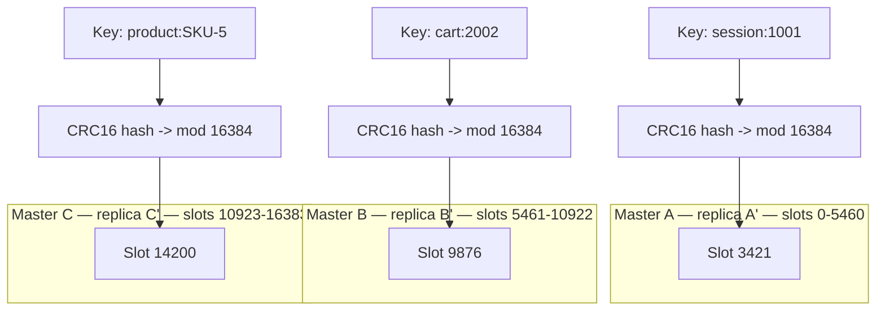
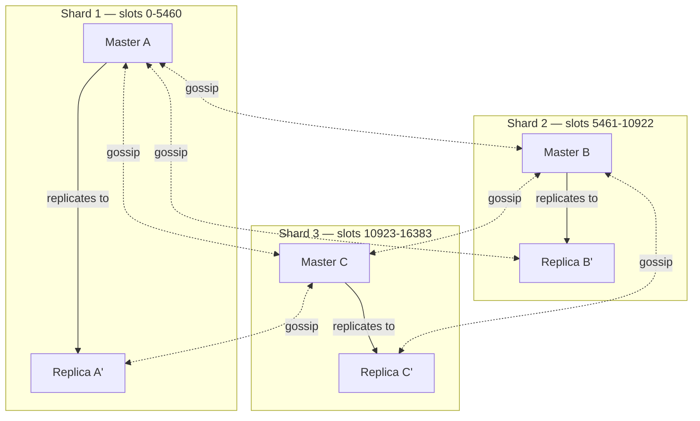
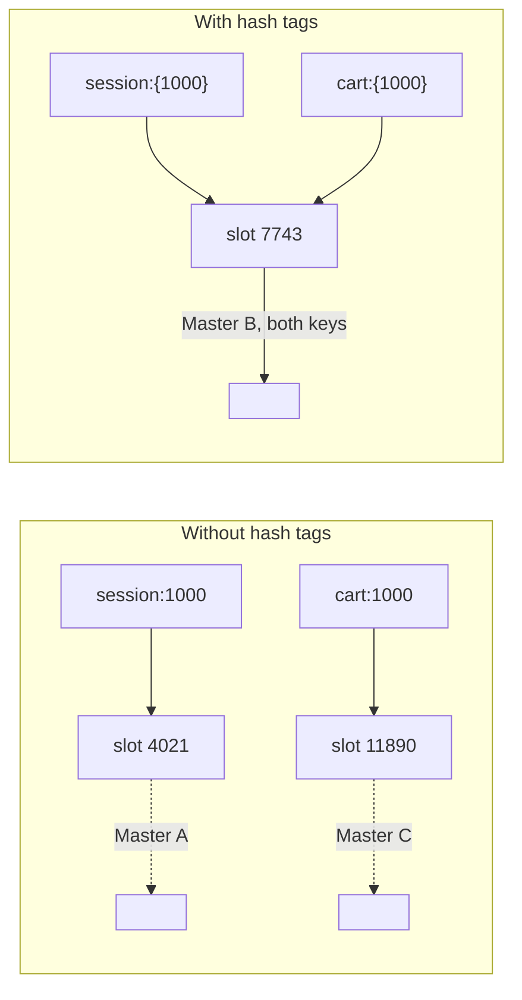
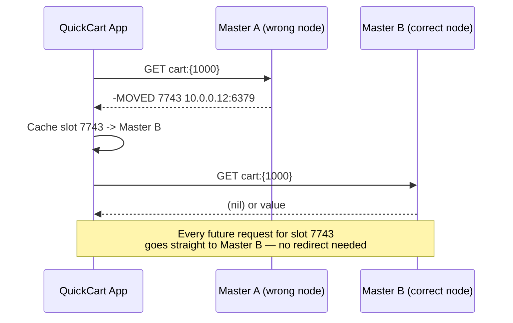

# Chapter 12: Redis Cluster & Sharding

Chapter 11 solved *availability*: with replication and Sentinel, QuickCart's Redis deployment survives a primary crashing without a human being paged at 3 a.m. But availability and capacity are different problems. A replica set — no matter how many replicas you attach — still has exactly one primary accepting writes, and that one primary's RAM and single-threaded command loop are a hard ceiling. When QuickCart's session store, cart store, or product cache outgrows what one machine can hold or serve, more replicas don't help at all: they copy the same data, they don't divide it.

This chapter covers **Redis Cluster**, Redis's native solution for horizontal scaling: splitting (sharding) the keyspace across multiple independent primaries, each responsible for a slice of the data, while still giving each shard its own replication-based high availability underneath.

---

## Learning Objectives

By the end of this chapter, you will be able to:

- Explain why Sentinel-managed replication alone cannot solve a capacity problem, and why sharding is the correct next step.
- Describe how Redis Cluster distributes data across masters using 16384 hash slots and `CRC16(key) mod 16384`.
- Design a minimum-viable cluster topology (masters, replicas, quorum) and explain why gossip keeps every node's view of cluster state in sync.
- Diagnose and fix `CROSSSLOT` errors using hash tags, and design keys up front so multi-key operations stay possible.
- Reshard a live cluster and explain what `MOVED` and `ASK` redirections mean to a client during that process.
- Choose correctly between a single primary+replicas, Sentinel, and Redis Cluster for a given workload, and name Cluster's operational limitations (no `SELECT`, careful key design).

---

## Prerequisites

This chapter builds directly on [Chapter 11: Replication & High Availability](./11-replication-and-high-availability.md). We assume you're comfortable with:

- Leader-replica (primary-replica) replication: how data flows from a primary to its replicas, and replication lag.
- Redis Sentinel: quorum-based failure detection, and automatic promotion of a replica to primary.
- The core distinction Chapter 11 draws between **availability** (surviving a node failure without data loss or prolonged downtime) and **capacity** (having enough memory and throughput to serve the workload at all).

Redis Cluster is best understood as "replication and failover, but per-shard, plus a routing layer on top" — if primary/replica failover from Chapter 11 isn't solid yet, this chapter will be harder than it needs to be. Go back and shore that up first if needed.

---

## 1. Why Sharding: When Sentinel Isn't Enough

QuickCart's Sentinel-managed primary+replica setup from Chapter 11 solves *"what happens if the primary dies?"* It does nothing for *"what happens when the primary is alive and healthy but simply too small?"* Two distinct ceilings eventually appear, and Sentinel is powerless against both:

- **Memory ceiling.** Every replica is a byte-for-byte copy of the primary's dataset. Adding a fourth or fifth replica doesn't add one extra gigabyte of usable capacity — it adds one more full copy of the *same* dataset. If QuickCart's session store, cart store, and product cache together need 400GB of RAM and the largest instance type available holds 128GB, no number of replicas fixes that. The whole dataset must fit on one machine, always.
- **Write throughput ceiling.** Redis is single-threaded for command execution (Chapter 3). One primary means one core doing the work, no matter how many replicas trail behind it. Replicas scale *read* throughput (route reads to replicas), but every write — every `HSET cart:{userId}`, every `SET session:{userId}`, every `INCR ratelimit:{userId}:{endpoint}` — still funnels through that single primary's single command loop. At QuickCart's scale during a flash sale, write volume alone can saturate one primary long before memory does.

Sentinel's job is entirely orthogonal to both problems: it watches a primary and its replicas and promotes a replica if the primary disappears. It has no concept of "split the dataset across more primaries" — that's not a failure-detection problem, it's a data-distribution problem. The moment QuickCart's answer to "we need more headroom" is "buy a bigger box" and there's no bigger box left to buy, replication-based HA has hit its structural limit. The only way past it is **sharding**: dividing the keyspace across multiple primaries, so no single node has to hold or serve *all* the data.

Redis Cluster is Redis's built-in, native answer to that need — sharding with the replication and failover machinery from Chapter 11 built in underneath each shard.

---

## 2. Redis Cluster Fundamentals: Hash Slots

Redis Cluster doesn't shard by letting you pick which server a key goes to by hand. It uses a fixed, deterministic scheme: the entire keyspace is divided into **16384 hash slots**, numbered 0 through 16383, and every key in the cluster is deterministically mapped to exactly one of those slots.

### 2.1 The slot formula

```
slot = CRC16(key) mod 16384
```

- **`CRC16(key)`** computes a 16-bit cyclic redundancy check checksum of the key's bytes — a fast, well-distributed hash function.
- **`mod 16384`** folds that checksum down into the fixed range of slot numbers.

This is pure, stateless math: given the same key, every node in the cluster computes the same slot, with no lookup table and no coordination required to figure out *which slot* a key belongs to. What can and does change over time is a separate piece of state — *which master currently owns that slot* — which is why Section 5 (resharding) exists at all.

### 2.2 Slots are assigned to masters, not to keys individually

Redis Cluster's unit of ownership is the **slot**, not the individual key. Each master node in the cluster is assigned a contiguous or scattered range of slot numbers, and it owns every key that hashes into any of its assigned slots. With three masters, a typical even split looks like:

| Master | Slot range | Approx. share |
|---|---|---|
| Master A | 0 – 5460 | ~33% |
| Master B | 5461 – 10922 | ~33% |
| Master C | 10923 – 16383 | ~33% |

QuickCart's `session:{userId}` and `cart:{userId}` keys land wherever `CRC16(key) mod 16384` happens to fall — different users' sessions will naturally spread across all three masters, which is exactly the point: no single master has to hold every session, and write load for sessions is divided three ways.

### 2.3 Why 16384, specifically

16384 (2^14) is a deliberate engineering trade-off, not an arbitrary round number:

- It's large enough to divide reasonably evenly across a realistic number of masters (Redis Cluster supports up to 1000 nodes in practice; 16384 slots gives ample granularity even at that scale).
- It's small enough that the per-slot bitmap each node gossips to every other node (Section 3) stays compact — a 16384-bit bitmap is 2KB, cheap to exchange in every gossip heartbeat. A slot count in the millions would bloat that bitmap and slow gossip down for no real distribution benefit.



---

## 3. Cluster Topology: Shards, Quorum, and Gossip

### 3.1 A shard is a master + its replica(s)

Redis Cluster reuses the exact replication mechanics from Chapter 11 *within* each shard. A **shard** is one master (owning a set of slots) plus one or more replicas that continuously replicate that master's data. If the master fails, one of its own replicas is promoted — the same primary/replica failover story as Chapter 11, just now scoped to a slice of the keyspace instead of the whole dataset.

QuickCart's minimum production-viable topology is therefore **3 masters + 3 replicas (one replica per master) = 6 nodes**:



### 3.2 Why a minimum of 3 masters — quorum

Redis Cluster makes cluster-state decisions — most importantly, "has a master actually failed, and should its replica be promoted?" — by majority vote among master nodes, the same quorum principle Sentinel uses in Chapter 11, but now baked directly into the cluster protocol instead of run by a separate Sentinel process.

With only **2 masters**, a majority is impossible to establish cleanly: if the two masters can't see each other (a network partition), each one sees exactly 50% of the master vote — neither side can declare itself the authoritative majority, and the cluster can stall on failover decisions or, worse, resolve them incorrectly. With **3 masters**, a majority is unambiguous: any 2 out of 3 agreeing is a clear quorum, and a partition can put at most one side in the majority, never both. This is exactly why 3 is called out as the minimum *viable* cluster size, not simply "the default" — going below it removes the mathematical guarantee that keeps the cluster from making split-brain decisions about slot ownership.

### 3.3 Gossip protocol: how nodes agree on cluster state

Every node in a Redis Cluster runs a lightweight **gossip protocol** over a dedicated cluster bus port (the node's normal port + 10000, e.g., 6379 and 16379). Periodically, each node picks a handful of other nodes at random and exchanges heartbeat messages containing:

- Its own view of the full slot-to-master mapping (the 16384-bit slot bitmap).
- Which nodes it currently believes are reachable (`PFAIL` — possibly failed) or confirmed unreachable (`FAIL`, once a quorum of masters agree).
- Configuration epoch numbers, used to resolve conflicting claims about slot ownership (e.g., after a failover, so every node converges on "who owns slot X now" without a central coordinator).

Because every node talks to a few others on every gossip round, and those others talk to a few more, information propagates through the whole cluster in a small number of hops — no single node needs to talk to all N-1 others, and there is no central metadata server to become a bottleneck or single point of failure. This is precisely what makes the cluster's state (slot ownership, node health) self-healing and eventually consistent across every node without any external coordinator like ZooKeeper or etcd.

### 3.4 Failure detection: `PFAIL` to `FAIL`

Gossip doubles as the cluster's failure-detection mechanism, using a two-stage escalation deliberately designed to avoid one node's flaky network blip triggering a needless failover:

1. **`PFAIL` (possibly failed).** If node X doesn't hear back from node Y within the configured `cluster-node-timeout`, X marks Y as `PFAIL` in its own local view — a private suspicion, not yet a cluster-wide fact.
2. **Gossip propagation.** X's suspicion about Y rides along in X's normal gossip messages to other nodes, the same way slot-map information does.
3. **`FAIL` (confirmed failed).** Once a *majority of known masters* have reported (directly or via gossip) that they also can't reach Y within the timeout window, the suspicion is promoted to `FAIL` — a cluster-wide, agreed-upon fact — and, if Y was a master, one of its replicas begins a promotion, the same election mechanics Chapter 11 introduced for Sentinel, just run natively by the cluster's own masters instead of by separate Sentinel processes.

This two-stage design is why a single master briefly losing its network connection to one peer doesn't cause a spurious failover — only when the *majority* corroborates the failure does the cluster act, which is the same quorum principle from Section 3.2 applied to failure detection instead of slot-ownership decisions.

---

## 4. Multi-Key Operations: `CROSSSLOT` and Hash Tags

### 4.1 The problem: keys can land on different masters

A single-node Redis instance happily runs `MGET session:1001 cart:1001`, a `MULTI`/`EXEC` transaction touching both keys, or a Lua script (Chapter 8) that reads one key and writes another, because everything lives in one keyspace on one process. Redis Cluster breaks that assumption: `session:1001` and `cart:1001` are two different strings, they hash to two different slots via `CRC16`, and those slots can easily be owned by two *different* masters.

Redis Cluster's design principle is that a **single command must be servable by a single node** — it never silently fans a command out across masters and stitches the results back together. So when a multi-key command's keys don't all map to the same slot, the cluster refuses the command outright:

```
(error) CROSSSLOT Keys in request don't hash to the same slot
```

This isn't a bug or a rough edge — it's the direct, unavoidable consequence of horizontal sharding. `MGET`, `MSET`, `MULTI`/`EXEC` transactions, and Lua scripts (`EVAL`) that touch multiple keys are all subject to this rule.

### 4.2 The fix: hash tags force co-location

Redis Cluster gives you an explicit escape hatch: if a key contains a substring wrapped in curly braces `{...}`, **only that substring** is hashed to determine the slot — the rest of the key name is ignored for slot-assignment purposes. This is called a **hash tag**.

```
CRC16("{user1000}.profile") mod 16384  ==  CRC16("{user1000}.cart") mod 16384
```

Both keys hash identically because only the `user1000` substring between the braces is fed into `CRC16` — the `.profile` and `.cart` suffixes never enter the hash calculation. That guarantees both keys land in the same slot, and therefore on the same master, no matter what else is in the key name.

### 4.3 QuickCart applies hash tags to sessions and carts

QuickCart's original key scheme from Chapter 2 — `session:{userId}` and `cart:{userId}` — is already using curly braces, but as *literal* characters, not as a Redis Cluster hash tag, unless the part inside the braces is the exact substring Redis hashes. To make Cluster actually co-locate a user's session and cart, QuickCart standardizes the key format so the hash tag wraps only the user ID:

```
session:{1000}          -- hash tag: 1000
cart:{1000}              -- hash tag: 1000
ratelimit:{1000}:checkout -- hash tag: 1000
```

Because all three keys share the identical hash-tagged substring `{1000}`, `CRC16` computes the same value for all three, all three land in the same slot, and all three are guaranteed to live on the same master — regardless of which master that happens to be, and regardless of future resharding. Now a Lua script or a `MULTI`/`EXEC` transaction that needs to atomically check the cart and touch the session for user 1000 is a single-slot operation the cluster will happily execute, instead of a `CROSSSLOT` error.



---

## 5. Resharding: Moving Slots Between Masters

Slot-to-master assignment isn't permanent. As QuickCart adds capacity (a fourth master) or rebalances after uneven growth, slots need to move — live, without downtime, and without losing writes in flight. This is **resharding**.

### 5.1 The tool: `redis-cli --cluster reshard`

```bash
redis-cli --cluster reshard <any-cluster-node>:<port>
```

Run interactively, this walks you through: how many slots to move, the destination master's node ID, and the source master(s) to pull slots from (or `all`, to pull evenly from every other master). It can also be scripted non-interactively for automation:

```bash
redis-cli --cluster reshard 127.0.0.1:7000 \
  --cluster-from <source-node-id> \
  --cluster-to <dest-node-id> \
  --cluster-slots 1000 \
  --cluster-yes
```

### 5.2 What happens under the hood, per slot

Resharding doesn't move a whole slot range in one atomic jump — it moves slots one at a time, and within a slot, key by key, so the cluster never has to pause the world:

1. The destination master is told the slot is `IMPORTING` from the source.
2. The source master is told the slot is `MIGRATING` to the destination.
3. Keys in that slot are moved one by one from source to destination (`MIGRATE` under the hood), each move being an atomic operation for that single key.
4. Once every key in the slot has moved, both nodes (and, via gossip, the rest of the cluster) update their slot map: the destination now owns the slot outright.

Because this happens incrementally, the cluster keeps serving both reads and writes for keys in that slot throughout the migration — with one caveat covered in Section 6 (`ASK` redirection) for the brief window a specific key is mid-flight.

### 5.3 Adding and removing nodes

- **Adding a master**: bring up a new empty node, join it to the cluster (`redis-cli --cluster add-node`), then reshard some slot ranges onto it from the existing masters so it starts carrying its fair share.
- **Adding a replica**: join a node and assign it to replicate an existing master (`redis-cli --cluster add-node --cluster-slave --cluster-master-id <id>`), extending that shard's HA the same way Chapter 11 describes for a single primary.
- **Removing a master**: first reshard *all* of its slots away to other masters (a master cannot be removed while it still owns slots), then remove the now-empty node from the cluster.
- **Rebalancing**: `redis-cli --cluster rebalance` automates the "figure out who has too many/too few slots and move the difference" calculation, instead of you manually computing reshard amounts.

---

## 6. Client-Side Cluster Awareness: `MOVED` and `ASK`

### 6.1 A client doesn't need to know the slot map in advance — but it should learn it fast

Any node in the cluster can receive any command. If a client sends `GET cart:{1000}` to a master that doesn't own that key's slot, that master doesn't proxy the request on the client's behalf — it responds with a redirect:

```
-MOVED 7743 10.0.0.12:6379
```

This tells the client: *slot 7743 is owned by the node at 10.0.0.12:6379 — reissue this command there.* A naive client can treat this as "try again at the new address," but a properly **cluster-aware client library** does something smarter: it caches the entire slot-to-node map (fetched once via `CLUSTER SLOTS` or `CLUSTER SHARDS`) and, after that first `MOVED` teaches it the map, routes every future command for that slot directly to the correct node — no redirect round-trip needed on subsequent requests.



- **`redis-py`** (Python), used in cluster mode via `RedisCluster`, maintains this slot cache internally and refreshes it whenever it sees a `MOVED`.
- **`ioredis`** (Node.js), constructed with `new Redis.Cluster([...])`, does the same, transparently retrying commands at the correct node.
- **`go-redis`**, via `redis.NewClusterClient(...)`, follows the identical pattern.

None of these require QuickCart's application code to know or care which physical master owns `cart:{1000}` — the library handles discovery, caching, and redirection, exposing the same `GET`/`HSET`/etc. API as single-node usage.

For debugging, `redis-cli` exposes the same slot map a client library caches internally:

```bash
redis-cli -c -p 7000 cluster nodes    # every node, its role, slot ranges, and health flags
redis-cli -c -p 7000 cluster shards   # slot ranges grouped by shard (master + replicas)
redis-cli -c -p 7000 cluster keyslot cart:{1000}   # the exact slot a given key hashes to
```

Reaching for these three commands is usually the fastest way to answer "why did my client just get redirected?" before assuming something is broken.

### 6.2 `ASK`: the mid-resharding case

`MOVED` means "this slot has *permanently* moved — update your map." `ASK` means something narrower and temporary: "this *specific key* has already migrated during an in-progress reshard, but the slot as a whole hasn't finished moving yet — try this one command at the new node, but don't update your map permanently."

During resharding (Section 5), a slot is briefly `MIGRATING` on the source and `IMPORTING` on the destination. If a client asks the source for a key that has *already* been moved to the destination, the source replies:

```
-ASK 7743 10.0.0.12:6379
```

The client sends the command to the destination node, prefixed with an `ASKING` command (to tell that node "accept this even though you don't officially own the slot yet"). Crucially, a cluster-aware client does **not** update its cached slot map on an `ASK` — it treats it as a one-off redirect for this command only, because the slot's permanent ownership isn't settled until the migration finishes and a `MOVED`-worthy state change occurs. This distinction (`MOVED` = update the map, `ASK` = one-time detour) is exactly what lets resharding happen without any client-visible downtime, at the cost of a few extra redirected requests during the migration window.

---

## 7. Redis Cluster vs. Sentinel vs. a Single Primary+Replicas

By this point in the course, QuickCart has three legitimate topologies available, and picking the right one is an explicit design decision, not a default:

| Topology | Solves | Doesn't solve | Choose when |
|---|---|---|---|
| **Single primary + replicas** (no Sentinel) | Read scaling, a manual-failover safety copy | Automatic failover, any capacity ceiling | Dataset and write load comfortably fit one node; downtime for manual failover is acceptable (dev/staging, low-stakes workloads) |
| **Sentinel + primary/replicas** (Chapter 11) | Automatic failover, high availability | Capacity — still exactly one write-serving primary | Dataset and write load fit one node, but you need automatic recovery from a primary failure (QuickCart's session store *before* hyper-growth) |
| **Redis Cluster** (this chapter) | Horizontal scale (memory and write throughput across many masters), *plus* per-shard HA via built-in replication | Adds operational complexity, multi-key operation constraints, no multiple logical DBs | Dataset or write throughput exceeds what one node can hold or serve — the actual trigger for QuickCart's migration in this chapter's scenario |

The decision framework in one sentence: **reach for Sentinel when the question is "what if this one node dies?" and reach for Cluster only when the question becomes "this one node isn't enough, even when it's healthy."** Cluster is not simply "Sentinel but fancier" — it solves a different problem (capacity) and happens to fold in HA (via per-shard replication) as a side effect, not the other way around.

---

## 8. Operational Realities

Redis Cluster's power comes with sharp edges that don't exist in single-node or Sentinel-managed Redis. Two matter enough to call out explicitly before QuickCart commits to it:

### 8.1 No multiple logical databases — `SELECT` is unavailable

Single-node Redis supports up to 16 numbered logical databases (`SELECT 0` through `SELECT 15`) as a lightweight way to namespace data within one instance. Redis Cluster does not support this at all — every cluster is effectively "database 0," and issuing `SELECT 1` (or anything other than 0) against a cluster node returns an error. If QuickCart was relying on separate logical DBs to isolate, say, session data from a test/staging dataset within the same instance, that pattern has to be replaced with key-prefix namespacing (`env:prod:session:{1000}` vs. `env:staging:session:{1000}`) before migrating to Cluster.

### 8.2 Cross-shard operations require key design decided up front

Section 4 already showed the mechanics of `CROSSSLOT` and hash tags, but the operational implication is broader: **you cannot retrofit hash tags painlessly onto a live, populated cluster.** Once `session:1000` and `cart:1000` have already hashed (without a shared tag) to two different slots and been written across two different masters, introducing a hash tag later means renaming the keys — which means a migration, not a config change. This is why hash-tag design has to happen at schema-design time, before the first key is ever written under a scheme you might later need atomic multi-key access to.

More generally, Cluster does not give you unlimited multi-key freedom just because a `redis-cli --cluster` command *looks* like it operates cluster-wide — administrative commands (like `--cluster reshard` or `--cluster rebalance`) operate over the whole cluster's metadata, but *data-plane* commands (`MGET`, transactions, Lua scripts) remain bound by the single-slot rule for every single command, forever. Plan key layouts around which sets of keys genuinely need atomicity together, and hash-tag exactly those, rather than hash-tagging everything (which would undo sharding's benefit by piling all traffic for a hash-tagged group onto one master) or hash-tagging nothing (which forecloses atomic multi-key operations later).

### 8.3 Hot shards from over-aggressive hash-tagging

A subtler version of the same mistake: hash-tagging too broadly. If QuickCart tagged every key for a given *store location* under one shared tag (`{store42}` on thousands of unrelated product, inventory, and order keys) to make some rare cross-key operation easy, every one of those keys would pile onto a single master's single slot — turning one popular store's traffic into a hot shard while other masters sit comparatively idle. Hash tags should scope the *smallest* group of keys that genuinely need to be co-located (a single user's session and cart), never a large, naturally growing category of keys.

### 8.4 Watching cluster health day to day

Beyond `CLUSTER NODES`/`CLUSTER SHARDS` (Section 6.1), `CLUSTER INFO` reports aggregate cluster health at a glance — `cluster_state:ok` vs. `fail`, the count of slots currently assigned, and the count of known nodes. A `cluster_state` of `fail` means some slots are currently unassigned or unreachable and the cluster will reject affected commands until that's resolved — this is the single most useful health check to wire into monitoring (Chapter 14) for a production cluster, since it directly reflects whether every slot in the keyspace currently has a reachable owner.

---

## Real-World Scenario: QuickCart Outgrows a Single Primary

**Setup.** QuickCart's Sentinel-managed session store (Chapter 11) has served the company well through steady growth, but a hyper-growth quarter — a viral marketing campaign plus a doubling of daily active shoppers — changes the picture fast. The session store's dataset now exceeds what fits comfortably on the largest instance type QuickCart's cloud provider offers, and write throughput during flash sales (every page view refreshing a session TTL, every cart update) is pushing the single primary's single-threaded command loop close to saturation. Sentinel is doing its job perfectly — failover would work fine if the primary died — but that was never the problem. The problem is that the healthy primary is running out of room and out of throughput at the same time.

**The migration.** QuickCart's platform team stands up a 3-master, 3-replica Redis Cluster (Section 3) — six nodes total, an odd number of masters for unambiguous quorum (Section 3.2). Before migrating a single key, they revisit their key-naming scheme from Chapter 2. The original `session:{userId}` and `cart:{userId}` keys use curly braces as decoration, not as genuine Redis Cluster hash tags, so the team standardizes the format explicitly: `session:{1000}`, `cart:{1000}`, `ratelimit:{1000}:checkout` — with the hash tag wrapping *only* the numeric user ID (Section 4.3). This guarantees that every key belonging to user 1000, regardless of feature, hashes to the same slot and lives on the same master.

**Why it mattered sooner than expected.** A few weeks after the migration, the team ships a new feature: a checkout Lua script (Chapter 8) that must atomically check the cart's contents *and* extend the session's TTL in one round trip, so a slow client can't end up with a session that expires mid-checkout while the cart is still being charged. Because `session:{userId}` and `cart:{userId}` were hash-tagged identically from the start, this script runs as an ordinary single-slot Lua script — Redis Cluster executes it against whichever single master owns that user's slot, with no `CROSSSLOT` error. Had the team migrated without the hash-tag redesign, this exact feature would have failed outright the moment it shipped, and fixing it would have meant renaming and re-migrating every session and cart key already live in production — a far more disruptive fix than getting the key design right before the first key was ever written.

**Result.** QuickCart's session and cart data now spreads across three masters instead of one, tripling usable write throughput and memory headroom, while each shard keeps its own Sentinel-free, Cluster-native replica for automatic failover — capacity and availability solved by the same topology, exactly the pairing Section 7's decision framework predicts.

---

## Best Practices

- **Design keys with hash tags from day one if there's any chance you'll need atomic multi-key operations later.** Retrofitting a hash tag onto already-sharded, already-populated keys means a data migration, not a config change — decide this at schema design time, the way QuickCart did for `session:{userId}`/`cart:{userId}`.
- **Use a cluster-aware client library rather than hand-rolling slot math.** `redis-py` (cluster mode), `ioredis` (cluster mode), and `go-redis` (cluster mode) already implement `CRC16`, slot-map caching, and `MOVED`/`ASK` handling correctly — reimplementing that logic in application code is unnecessary risk for zero benefit.
- **Keep an odd, sufficient number of masters for unambiguous quorum.** Three is the practical minimum; going lower removes the mathematical guarantee that a network partition can't put two halves of the cluster in simultaneous "majority" states.
- **Monitor slot migration actively during resharding**, using `CLUSTER SLOTS` / `CLUSTER SHARDS` and cluster-specific metrics, rather than assuming a `--cluster reshard` run finished cleanly — a stalled migration can leave a slot straddling two nodes in `MIGRATING`/`IMPORTING` state longer than intended.
- **Hash-tag deliberately, not universally.** Hash-tagging every key under one giant tag defeats sharding entirely by routing all traffic to one master; hash-tag only the specific groups of keys (like one user's session+cart) that genuinely need to co-locate for atomicity.

---

## Common Mistakes

- **Designing keys without hash tags, then hitting `CROSSSLOT` errors the moment a transaction or Lua script needs two related keys.** This is exactly the trap QuickCart avoided in this chapter's scenario by hash-tagging early — discovering it late means a live-data migration, not a quick patch.
- **Running a 2-master cluster** on the assumption that "2 is more than 1, so it must be more available." Two masters cannot form an unambiguous majority; a network partition can leave the cluster unable to safely resolve which side is authoritative, undermining the whole point of quorum-based cluster-state decisions.
- **Assuming Cluster gives unlimited multi-key operation support because it's "one logical database."** It is emphatically not — every multi-key command, transaction, and Lua script is still bound by the single-slot rule, forever, regardless of how the cluster is administered.
- **Forgetting that Cluster mode disables `SELECT` and multiple logical databases.** Applications or scripts that assume `SELECT 1` works for test isolation, or that rely on 16 numbered DBs for namespacing, will break outright on Cluster and need a key-prefix-based namespacing redesign instead.
- **Treating resharding as instantaneous and risk-free.** It's designed to be non-disruptive, but it still moves live data key by key over the network; running it during peak traffic without monitoring, or moving too many slots too aggressively at once, can add latency exactly when QuickCart can least afford it.

---

## Summary

- Sentinel-managed replication (Chapter 11) solves availability, not capacity — a single primary's memory and single-threaded throughput are a hard ceiling that more replicas cannot raise. Redis Cluster's whole purpose is to remove that ceiling via sharding.
- Redis Cluster divides the keyspace into **16384 hash slots**, assigns each key to a slot via `CRC16(key) mod 16384`, and assigns ranges of slots to different master nodes, distributing both data and write load across them.
- A cluster's unit of HA is the **shard** (one master + its replica(s)), the minimum viable topology is **3 masters** for unambiguous quorum, and nodes stay in sync about slot ownership and health via a **gossip protocol** over a dedicated cluster bus port.
- Multi-key commands (`MGET`, transactions, Lua scripts) fail with **`CROSSSLOT`** if their keys don't share a slot; **hash tags** (`{user1000}`) force related keys to co-locate on the same master by hashing only the tagged substring.
- **Resharding** (`redis-cli --cluster reshard`) moves slots between masters live, key by key, without downtime — enabling QuickCart to add or remove masters and rebalance capacity over time.
- Cluster-aware clients (`redis-py`, `ioredis`, `go-redis` in cluster mode) cache the slot map and route directly to the correct node, learning corrections via **`MOVED`** (permanent) and **`ASK`** (temporary, mid-resharding) redirects.
- Choose a single primary+replicas for workloads that fit one node, Sentinel when you need automatic HA without sharding, and Cluster only once you genuinely need to shard beyond one node's memory or throughput capacity.
- Cluster mode disables `SELECT`/multiple logical databases, and cross-shard atomicity is only possible for keys you deliberately hash-tagged together — both are decisions to make before writing your first key, not after.

---

## Knowledge Check

1. Why doesn't adding more replicas to a Sentinel-managed primary solve a memory-capacity problem? What specifically does sharding do differently?
2. Walk through the full slot-assignment formula for a key, and explain what changes (and what stays fixed) about it when a hash tag is present.
3. Why is 3 the minimum viable number of masters in a production Redis Cluster, in terms of quorum? What specifically goes wrong with 2?
4. QuickCart's Lua script needs to atomically read `cart:{userId}` and update `session:{userId}` for the same user. What key-naming change makes this possible in a cluster, and why does it work?
5. What is the difference between a `MOVED` redirect and an `ASK` redirect, and why does a cluster-aware client treat them differently when updating its cached slot map?
6. Describe, in your own words, the role of the gossip protocol in Redis Cluster. Why doesn't the cluster need a central coordinator to agree on slot ownership?
7. Name two things Redis Cluster cannot do that single-node Redis can, and explain the operational consequence of each for an application migrating to Cluster.
8. A team hash-tags every single key in their cluster under one shared tag to "keep things simple." What goes wrong, and why?

---

## Hands-On Exercise

**Goal:** Stand up a local 6-node Redis Cluster (3 masters + 3 replicas), insert hash-tagged keys, and simulate resharding.

**Step 1 — Launch six Redis instances.** Using Docker (or six local `redis-server` processes on ports 7000–7005), start six nodes, each with `--cluster-enabled yes` and its own `cluster-config-file` and `dbfilename`. Example for one node (repeat for ports 7000–7005, adjusting the port each time):

```bash
redis-server --port 7000 --cluster-enabled yes \
  --cluster-config-file nodes-7000.conf \
  --cluster-node-timeout 5000 \
  --appendonly yes --daemonize no
```

**Step 2 — Form the cluster.** With all six nodes running, use the cluster creation helper to assign masters and replicas automatically (one replica per master):

```bash
redis-cli --cluster create \
  127.0.0.1:7000 127.0.0.1:7001 127.0.0.1:7002 \
  127.0.0.1:7003 127.0.0.1:7004 127.0.0.1:7005 \
  --cluster-replicas 1
```

Confirm the topology and slot assignment:

```bash
redis-cli -c -p 7000 cluster nodes
redis-cli -c -p 7000 cluster slots
```

**Step 3 — Insert hash-tagged keys.** Connect with the `-c` (cluster mode) flag so `redis-cli` follows `MOVED` redirects automatically, and insert QuickCart-style session/cart pairs:

```bash
redis-cli -c -p 7000 set session:{1000} '{"userId":1000,"loggedInAt":"..."}'
redis-cli -c -p 7000 hset cart:{1000} sku:2001 3
redis-cli -c -p 7000 get session:{1000}
redis-cli -c -p 7000 hgetall cart:{1000}
```

Verify both keys report the same slot with `CLUSTER KEYSLOT`:

```bash
redis-cli -p 7000 cluster keyslot "session:{1000}"
redis-cli -p 7000 cluster keyslot "cart:{1000}"
```

**Step 4 — Reproduce a `CROSSSLOT` error on purpose.** Insert a session and cart key *without* a shared hash tag, and try a multi-key operation across them:

```bash
redis-cli -c -p 7000 set session:2000 "..."
redis-cli -c -p 7000 set cart:2000 "..."
redis-cli -c -p 7000 mget session:2000 cart:2000
```

Confirm you see `(error) CROSSSLOT Keys in request don't hash to the same slot` when the two keys land on different masters (they usually will, since they hash independently).

**Step 5 — Simulate a resharding operation.** Move 100 slots from one master to another and watch the cluster stay available throughout:

```bash
redis-cli --cluster reshard 127.0.0.1:7000
# Follow the prompts: how many slots (100), destination node ID,
# source node(s) — pick "all" to pull evenly, or a specific master ID.
```

While the reshard runs, in a second terminal, repeatedly read a key whose slot is being moved and confirm it continues to resolve correctly (via `MOVED`/`ASK` handled transparently by `redis-cli -c`):

```bash
watch -n 1 "redis-cli -c -p 7000 get session:{1000}"
```

**Step 6 — Clean up.** Shut down all six nodes and remove their `nodes-*.conf`, `dump.rdb`, and `appendonly*` files before your next exercise.

**Reflection:** Note which slots moved, whether you saw any `ASK` activity in `redis-cli`'s verbose output during the migration, and confirm the hash-tagged `session:{1000}`/`cart:{1000}` pair never triggered a `CROSSSLOT` error while the untagged `session:2000`/`cart:2000` pair did.

---

## Further Reading

- [Redis Cluster Specification](https://redis.io/docs/latest/operate/oss_and_stack/reference/cluster-spec/) — the authoritative protocol-level reference for hash slots, gossip, and failover.
- [Scale with Redis Cluster](https://redis.io/docs/latest/operate/oss_and_stack/management/scaling/) — official operational guide to creating, resharding, and managing a cluster with `redis-cli --cluster`.
- [Redis Cluster Tutorial](https://redis.io/docs/latest/operate/oss_and_stack/tutorials/scaling/) — a hands-on walkthrough closely mirroring this chapter's exercise.
- `redis-py` Cluster Client docs — for Python cluster-mode usage patterns (`RedisCluster`).
- `ioredis` Cluster documentation — for Node.js cluster-mode usage patterns (`Redis.Cluster`).
- `go-redis` Cluster documentation — for Go cluster-mode usage patterns (`redis.NewClusterClient`).
- *Redis in Action* (Josiah Carlson) — background on data modeling decisions (like hash-tag key design) that pay off once a dataset needs to be sharded.

---

<div style="display:flex;justify-content:space-between;align-items:center;">
  <a href="./11-replication-and-high-availability.md">← Previous: Replication & High Availability</a>
  <a href="./00-index.md">🏠 Index</a>
  <a href="./13-performance-tuning-and-benchmarking.md">Next: Performance Tuning & Benchmarking →</a>
</div>
