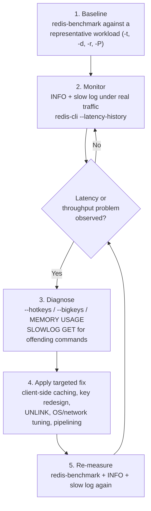

# Chapter 13: Performance Tuning & Benchmarking

Redis has a reputation for being fast — sub-millisecond latency, hundreds of thousands of operations per second on modest hardware. That reputation is earned, but it is a *ceiling*, not a guarantee. A misconfigured `maxmemory` policy, one enormous sorted set, a single viral product key, or Transparent Huge Pages left enabled on the host can turn a Redis deployment that should feel instantaneous into one with mysterious P99 latency spikes that make on-call engineers miserable.

This chapter is about closing the gap between "Redis is fast" and "*my* Redis deployment is fast, and I can prove it, and I know exactly what to do when it isn't." You'll learn Redis's own load-testing tool (`redis-benchmark`), the diagnostic tools built into `redis-cli` for catching slow commands, hot keys, and big keys, the OS-level knobs that matter specifically because of Redis's single-threaded, fork-based design (Chapter 3), and a repeatable workflow for turning "something feels slow" into "here is the root cause and here is the fix." QuickCart's flash-sale traffic spike — introduced in this chapter's Real-World Scenario — is the running example that ties every tool together.

---

## Learning Objectives

By the end of this chapter, you will be able to:

- Use `redis-benchmark` to establish a throughput and latency baseline, using pipelining (`-P`), concurrency (`-c`), request count (`-n`), and command-specific tests (`-t`) correctly.
- Use `redis-cli --latency`, `--latency-history`, and `--intrinsic-latency`, along with the slow log (`SLOWLOG GET`/`RESET`, `slowlog-log-slower-than`), to catch and characterize slow commands in a running instance.
- Diagnose a **hot key** (disproportionate traffic on a single key) and a **big key** (one oversized value) as two distinct failure modes with distinct symptoms, tools (`--hotkeys`, `--bigkeys`, `MEMORY USAGE`), and fixes.
- Explain why Transparent Huge Pages, `tcp-backlog`/`somaxconn`, and memory overcommit settings matter specifically because of Redis's single-threaded event loop and fork-based persistence (Chapter 3).
- Use `UNLINK` and the `lazyfree-lazy-*` family of settings to delete large keys without blocking the main thread.
- Apply a systematic, repeatable performance-tuning workflow — baseline, monitor, diagnose, fix, re-measure — to a live incident, as QuickCart does during a flash sale.

---

## Prerequisites

This chapter assumes you're comfortable with:

- **[Chapter 3: Architecture & Internals](./03-architecture-and-internals.md)** — specifically, that Redis serves commands on a single main thread, so any one slow command blocks every other client for its duration, and that RDB/AOF rewrites rely on `fork()` to create a point-in-time copy-on-write snapshot of the process. Nearly every tuning recommendation in this chapter is a direct consequence of one of those two facts.
- **[Chapter 9: Expiration, Eviction & Memory Management](./09-expiration-eviction-and-memory-management.md)** — `maxmemory`, eviction policies, and in particular the LFU (least-frequently-used) family of policies, which `redis-cli --hotkeys` depends on.
- **[Chapter 10: Client Libraries & Connection Management](./10-client-libraries-and-connection-management.md)** — pipelining, which this chapter revisits with concrete benchmark numbers.
- A local Redis instance you can run `redis-benchmark` and `redis-cli` against, per Chapter 1's setup.

If any of that feels shaky, revisit those chapters first — this one builds directly on all three.

---

## 1. `redis-benchmark`: Redis's Built-In Load-Testing Tool

`redis-benchmark` ships alongside `redis-server` and `redis-cli` in every Redis distribution. It exists to answer one question precisely: **how many operations per second, and at what latency, can this Redis instance sustain, under a controlled, repeatable load pattern?** That's a different question from "does my application feel fast" — `redis-benchmark` isolates Redis itself from your application code, network topology quirks, and client library overhead, giving you a clean baseline to compare against later.

### 1.1 Running a default benchmark

```bash
$ redis-benchmark -h 127.0.0.1 -p 6379 -q
```

The `-q` flag ("quiet") prints one summary line per command tested, instead of a full histogram — useful for a quick sanity check:

```
PING_INLINE: 142857.14 requests per second, p50=0.183 msec
PING_MLBULK: 138888.89 requests per second, p50=0.191 msec
SET: 133333.33 requests per second, p50=0.199 msec
GET: 137174.21 requests per second, p50=0.191 msec
INCR: 135135.14 requests per second, p50=0.199 msec
LPUSH: 131578.95 requests per second, p50=0.207 msec
RPUSH: 130718.95 requests per second, p50=0.209 msec
LPOP: 129032.26 requests per second, p50=0.215 msec
...
```

By default, `redis-benchmark` runs a whole battery of commands (`PING`, `SET`, `GET`, `INCR`, list/set/hash/sorted-set operations) with 50 concurrent clients issuing a total of 100,000 requests each, using small (~3 byte) values. That's a reasonable smoke test, but real tuning work means controlling the parameters deliberately.

### 1.2 The flags that matter

| Flag | Meaning | Why it matters |
|---|---|---|
| `-n <requests>` | Total number of requests to issue | Larger `-n` gives a more statistically stable result; too small and you're measuring noise, especially for p99/p999 tails. |
| `-c <clients>` | Number of parallel connections | This is your **concurrency** knob — it simulates how many clients hit Redis at once. Raising `-c` past the point where throughput plateaus tells you where the server (or the client machine, or the network) saturates. |
| `-P <pipeline>` | Number of commands pipelined per request (Section 6) | This is the single biggest throughput lever `redis-benchmark` exposes — batching commands amortizes round-trip latency across many operations. |
| `-t <commands>` | Restrict the test to specific comma-separated commands (e.g., `-t set,get,zadd`) | Lets you benchmark exactly the operations your application actually uses, rather than the full default battery. |
| `-d <size>` | Payload size in bytes for `SET`/`LPUSH`-style tests | Match this to your real value sizes — a benchmark run with 3-byte values tells you little about a workload built on 2KB JSON blobs. |
| `-r <keyspacelen>` | Randomize keys over a range (e.g., `-r 100000` uses keys like `key:<rand 0-99999>`) | Without `-r`, every request hits the *same* key, which is unrealistic and — as Section 3 explains — artificially exercises the hot-key code path rather than a realistic spread. |
| `--csv` | Output results in CSV format | Machine-parseable output, useful for feeding results into a spreadsheet or CI pipeline to track performance over time/releases. |
| `-a <password>` | Authenticate | Required if `requirepass`/ACLs are enabled (Chapter 15). |
| `--cluster` | Benchmark against a Redis Cluster, following redirects | Needed if you're benchmarking a Cluster deployment (Chapter 12) rather than a standalone instance. |

A realistic QuickCart benchmark — simulating the product-cache read path with 1KB product hashes spread across 500,000 SKUs, 50 concurrent clients, no pipelining — looks like:

```bash
$ redis-benchmark -h 127.0.0.1 -p 6379 -t get,hset,hgetall -n 200000 -c 50 -d 1024 -r 500000 -q
```

### 1.3 Interpreting requests-per-second and latency output

Two numbers matter, and they are not the same thing:

- **Requests per second (RPS)** is a *throughput* metric — how much work the server got through, aggregated across all concurrent clients. It's the number that tells you "will this instance keep up with our peak traffic."
- **Latency percentiles** (`p50`, `p95`, `p99`, `p999` — the higher-resolution output from `redis-benchmark` without `-q`, or with `--latency-history`, see Section 2) tell you the *experience of a single request*. A server can have excellent aggregate RPS while a small fraction of requests take far longer than the median — and that tail is exactly what a real user (or a QuickCart shopper hitting checkout at the wrong moment) feels.

**Never optimize for average latency alone.** Averages hide tail behavior; a p50 of 0.2ms and a p99 of 40ms describe a system where most requests are excellent and a meaningful fraction are terrible — precisely the shape a hot key or a big key produces (Sections 3–4). Always look at p99 (and ideally p999) before declaring a change a success.

A subtlety worth internalizing early: `redis-benchmark`'s RPS numbers are usually *higher* than what your real application will see end-to-end, because `redis-benchmark` runs on the same machine or the same low-latency network segment as the server, uses a minimal client with no serialization overhead, and (without `-r`) may hit a tiny, cache-friendly keyspace. Treat `redis-benchmark` output as **Redis's ceiling under ideal conditions**, not as a prediction of your application's real-world number — it's a baseline to compare configuration or hardware changes against, not a promise.

---

## 2. Latency Monitoring: `redis-cli --latency` and the Slow Log

`redis-benchmark` measures latency under *synthetic* load. In production, you need to measure latency under *real* traffic, continuously, and catch the specific commands responsible when something is slow. Redis gives you two complementary tools for this: a live latency sampler, and a server-side slow log.

### 2.1 `redis-cli --latency`

```bash
$ redis-cli -h 127.0.0.1 -p 6379 --latency
min: 0, max: 3, avg: 0.14 (1042 samples)
```

This continuously sends `PING` commands and reports the round-trip time, updating in place. It's a quick, live pulse-check — "is this Redis instance responsive *right now*, from where I'm sitting" — and it factors in real network conditions between your client and the server, unlike a benchmark run from the same host.

`--latency-history` is the same idea, but reports a fresh min/max/avg summary every 15 seconds (configurable with `-i`) instead of one continuously-updating line — useful for watching latency evolve over a longer window, e.g., across a deploy or through a traffic spike:

```bash
$ redis-cli --latency-history -i 5
min: 0, max: 2, avg: 0.15 (500 samples) -- 5.00 seconds range
min: 0, max: 47, avg: 0.61 (500 samples) -- 5.00 seconds range
min: 0, max: 3, avg: 0.13 (500 samples) -- 5.00 seconds range
```

That middle line — a max jumping to 47ms while the average barely moves — is exactly the signature of an intermittent problem (a slow command, a fork-induced pause, a hot key) that a single-shot average would hide entirely.

`--intrinsic-latency <seconds>` measures something different: the latency the *host itself* introduces, independent of Redis. It runs a tight loop for the given duration, checking how long the OS scheduler takes to give the process CPU time back, with no Redis server involved at all:

```bash
$ redis-cli --intrinsic-latency 30
Max latency so far: 1 microseconds.
...
Max latency so far: 92 microseconds.
30 total seconds, 88871822 fast cycles, 0 slow cycles
```

Run this once when provisioning new hardware or a new VM/container. A high intrinsic latency (hundreds of microseconds or more) points to noisy-neighbor CPU contention, virtualization overhead, or an overloaded host — a ceiling no amount of Redis configuration can fix, because the problem is below Redis entirely.

### 2.2 The Slow Log

`--latency` tells you *that* something was slow. The **slow log** tells you *which command* was slow, *when*, and *with what arguments* — the single most useful diagnostic tool this chapter covers.

Redis logs any command whose execution time (server-side processing only — not including network transfer) exceeds a configurable threshold:

```
# redis.conf
slowlog-log-slower-than 10000   # microseconds (10ms); 0 logs everything, negative disables logging
slowlog-max-len 128             # ring buffer size — oldest entries drop once full
```

Both are also settable live, without a restart:

```
127.0.0.1:6379> CONFIG SET slowlog-log-slower-than 10000
OK
127.0.0.1:6379> CONFIG SET slowlog-max-len 256
OK
```

Reading the log:

```
127.0.0.1:6379> SLOWLOG GET 5
1) 1) (integer) 14              # unique entry ID
   2) (integer) 1751792400      # Unix timestamp
   3) (integer) 18342           # execution time in microseconds
   4) 1) "ZRANGE"                # the command and its arguments
      2) "leaderboard:daily"
      3) "0"
      4) "-1"
   5) "127.0.0.1:54212"          # client address
   6) ""                         # client name (if set with CLIENT SETNAME)
```

Other useful slow log commands:

```
127.0.0.1:6379> SLOWLOG LEN
14
127.0.0.1:6379> SLOWLOG RESET
OK
127.0.0.1:6379> SLOWLOG HELP
```

**Sizing the threshold matters.** The default 10ms threshold is a reasonable starting point for most workloads, but if your SLA is "P99 under 1ms," 10ms is far too loose to catch the commands actually hurting you — lower it. Conversely, setting it to `0` on a busy production instance logs *every single command*, filling the ring buffer instantly and adding needless overhead; reserve `0` for short, deliberate diagnostic windows (exactly what this chapter's Hands-On Exercise does), not as a permanent production setting.

The slow log is a fixed-size ring buffer held in memory — it is **not persisted** across a restart, and old entries silently fall off once `slowlog-max-len` is exceeded. Treat it as a rolling recent-history tool, not a durable audit log; if you need long-term slow-command history, ship slow log entries to your monitoring stack (Chapter 14) rather than relying on `SLOWLOG GET` alone.

---

## 3. Diagnosing Hot Keys

A **hot key** is a single key receiving a disproportionate share of a workload's traffic — not "somewhat more popular than average," but orders of magnitude more, to the point that the single-threaded command sequence touching that one key becomes a meaningful fraction of the server's total work.

### 3.1 Why hot keys hurt, specifically

Recall from Chapter 3: Redis processes commands one at a time, on one thread. In isolation, a `GET product:SKU-1001` is a fast O(1) operation — a handful of microseconds. But if 80% of your instance's total request volume during a spike is that *same* `GET product:SKU-1001` (plus whatever writes are also hitting it), that key's command sequence dominates the main thread's attention. Every other client is still served — no single hot `GET` blocks anything the way a slow O(N) command does — but the *aggregate* load from one key can saturate the thread's capacity, starve everything else of throughput, and (if the hot key also involves writes) create lock-step contention at the application layer around cache invalidation and refresh.

Hot keys are also a **Cluster-specific hazard** (Chapter 12): because Redis Cluster shards by hash slot, a hot key pins all of its traffic to exactly one node, regardless of how many nodes the cluster has. Scaling out a Cluster does nothing for a hot-key problem — the extra nodes just sit idle while one node burns.

### 3.2 Finding hot keys with `redis-cli --hotkeys`

```bash
$ redis-cli -h 127.0.0.1 -p 6379 --hotkeys
```

This scans the keyspace (using `SCAN`, so it doesn't block the server — see Chapter 2's `KEYS` vs. `SCAN` discussion) and reports the keys with the highest access-frequency counters, ranked at the end:

```
[00.00%] Hot key 'product:SKU-88213' found so far with counter 48213
[00.00%] Hot key 'session:9981' found so far with counter 112

-------- summary -------

Sampled 512000 keys in the keyspace!
hot key found with counter: 48213	keyname: product:SKU-88213
hot key found with counter: 112	keyname: session:9981
```

**Critical prerequisite:** `--hotkeys` relies on Redis's built-in **LFU (least-frequently-used) access-frequency counter**, which is only maintained when `maxmemory-policy` is set to one of the `allkeys-lfu` or `volatile-lfu` policies (Chapter 9). If your instance runs an LRU policy, a `noeviction` policy, or no `maxmemory` at all, every key's frequency counter reads as unset, and `--hotkeys` has nothing meaningful to report. If you plan to use this tool in production, set an LFU policy *before* an incident, not during one:

```
127.0.0.1:6379> CONFIG SET maxmemory-policy allkeys-lfu
OK
```

### 3.3 QuickCart example: a viral product during a flash sale

QuickCart's product cache (`product:{sku}`, Chapter 2) normally sees an even spread of traffic across tens of thousands of SKUs — no single product dominates. During a flash sale, one item — a limited-edition sneaker — gets featured on the homepage and goes viral on social media. Within minutes, `product:SKU-88213` is receiving roughly 50x the request rate of any other product key, as hundreds of thousands of shoppers simultaneously load its product page.

This is a textbook hot key: a single `GET`/`HGETALL` on one key, repeated at massive scale, is not slow in isolation, but its sheer volume dominates the instance's request mix and shows up as elevated overall latency and CPU time on the node serving that key (or that hash slot, in a Cluster). Section 5's Real-World Scenario walks through QuickCart's full diagnosis and fix for exactly this situation.

---

## 4. Diagnosing Big Keys

A **big key** is the opposite failure mode: not many small operations on one key, but *one operation* on one key that is intrinsically expensive because the key's value is enormous — a hash with millions of fields, a sorted set with millions of members, a list with millions of elements.

### 4.1 Why big keys hurt, specifically

This ties directly back to Chapter 3's blocking-command discussion and Chapter 2's Big-O warning (Section 6 of that chapter). Many Redis commands are O(1) *per element* but O(N) *over the whole collection*: `HGETALL` on a hash, `LRANGE key 0 -1` on a list, `SMEMBERS` on a set, `ZRANGE key 0 -1` on a sorted set. Run any of these against a collection with a handful of elements and you'll never notice. Run the *exact same command* against a collection with two million elements, and that single command can take tens or hundreds of milliseconds of server-side processing time — and because Redis is single-threaded, every other client on the server waits for it to finish. A big key doesn't just hurt whoever asked for it; it's a latency spike for everyone, felt as a slow-log entry and a P99 blip across the whole instance.

Big keys also cause secondary problems beyond command latency:
- **Uneven memory distribution** across a Cluster's hash slots (Chapter 12), since one giant key can dominate a shard's memory footprint.
- **Slow replication and persistence**, since RDB serialization and AOF rewriting have to walk the entire structure.
- **Expensive deletion** — deleting a huge key is itself an O(N) operation (Section 7 covers the fix).

### 4.2 Finding big keys with `redis-cli --bigkeys`

```bash
$ redis-cli -h 127.0.0.1 -p 6379 --bigkeys
```

Like `--hotkeys`, this uses `SCAN` internally, so it's safe to run against a live production instance without blocking it. It reports the single largest key it finds for each data type, plus aggregate statistics:

```
# Scanning the entire keyspace to find biggest keys as well as
# average sizes per type.  You can use -i 0.1 to sleep 0.1 sec
# per 100 SCAN commands (not usually needed).

[00.00%] Biggest zset found so far 'leaderboard:daily' with 2145812 members
[00.00%] Biggest hash found so far 'product:SKU-1001' with 8 fields

-------- summary -------

Sampled 512000 keys in the keyspace!
Total key length in bytes is 7340032 (avg len 14.34)

Biggest zset found 'leaderboard:daily' has 2145812 members
Biggest hash found 'cart:8841' has 342 fields

2145813 zsets with 2145820 members (99.99% of keys)
498210 hashes with 3981234 fields (00.01% of keys)
```

`--bigkeys` reports element/field/member **count**, not byte size — a hash with 5 fields each holding a 10MB blob won't show up as "biggest" by this tool's count-based ranking even though it's a genuine big-key problem by memory footprint. For a precise byte-size answer on a specific key you already suspect, use `MEMORY USAGE`:

```
127.0.0.1:6379> MEMORY USAGE leaderboard:daily
(integer) 187345216
127.0.0.1:6379> MEMORY USAGE leaderboard:daily SAMPLES 0
(integer) 187345216
```

`MEMORY USAGE` returns the number of bytes a key (including its value, not just the key name) consumes, computed exactly for simple types and by *sampling* for large aggregate types by default (the `SAMPLES` option controls how many elements are sampled; `SAMPLES 0` forces an exact, but more expensive, full count — reasonable for occasional diagnostics, not for routine polling of a huge key).

### 4.3 QuickCart example

QuickCart's `leaderboard:daily` sorted set (Chapter 2, Chapter 5) is designed around a bounded assumption: "today's active shoppers," reset once a day. During a prolonged flash-sale event, a bug in the reset job leaves the leaderboard un-trimmed for several days running, and it grows to over two million members. Every homepage load calling `ZRANGE leaderboard:daily 0 9` for the top-10 display is still cheap (`ZRANGE` with a small, bounded range is O(log N + M), not O(N) — Chapter 2's Big-O point holds), but a promotional dashboard calling `ZRANGE leaderboard:daily 0 -1` to export the *entire* leaderboard is a full O(N) walk over two million members, and shows up squarely in the slow log. Section 5 picks this up as part of the same flash-sale incident as the hot-key scenario above.

---

## 5. Network and OS-Level Tuning

Some of the most impactful Redis performance fixes aren't Redis configuration at all — they're kernel and network settings on the host, and they matter *specifically* because of how Redis is built (single-threaded event loop, fork-based persistence).

### 5.1 `tcp-backlog` and `somaxconn`

`tcp-backlog` (in `redis.conf`) sets the size of the TCP listen backlog — the queue of pending connections the kernel holds before your application calls `accept()` on them. Redis's default is `511`, matching a common convention. But the kernel enforces a *ceiling* on this via the OS-level `net.core.somaxconn` setting, and if `somaxconn` is lower than `tcp-backlog` (a common out-of-the-box default is `128` on many Linux distributions), Redis silently uses the smaller of the two.

Under a burst of new connections — a deploy that reconnects a whole fleet of application servers at once, or a flash-sale traffic spike that opens many new client connections simultaneously — a too-small backlog causes connection attempts to be refused or delayed, which looks like intermittent connection timeouts that have nothing to do with Redis's command processing at all. Fix it at the OS level:

```bash
$ sudo sysctl -w net.core.somaxconn=1024
# persist across reboots:
$ echo "net.core.somaxconn = 1024" | sudo tee -a /etc/sysctl.conf
```

And keep `redis.conf`'s `tcp-backlog` at or below that value.

### 5.2 Transparent Huge Pages (THP)

This is the single most well-known Redis-specific OS recommendation, and it exists because of Chapter 3's fork mechanics. Redis uses `fork()` to create a child process for RDB snapshots and AOF rewrites, relying on the OS's copy-on-write (COW) memory semantics so the child can serialize a consistent point-in-time view without blocking the parent. **Transparent Huge Pages** is a Linux kernel feature that transparently backs memory with larger (2MB, instead of the standard 4KB) pages to reduce TLB pressure for some workloads — but it interacts badly with Redis's COW fork pattern: with THP enabled, a single byte written to any part of a 2MB huge page forces the *entire* 2MB page to be copied, not just a 4KB page. On a large, actively-written dataset, this dramatically increases the memory (and latency) cost of every fork-triggered write during a background save, producing exactly the kind of latency spike Section 2's slow log and `--latency-history` would catch.

Redis's own documentation and startup log explicitly warn about this:

```
WARNING you have Transparent Huge Pages (THP) support enabled in your kernel.
This will create latency and memory usage issues with Redis. To fix this issue
run the command 'echo madvise > /sys/kernel/mm/transparent_hugepage/enabled'
as root, and add it to your /etc/rc.local in order to retain the setting after
a reboot. Redis must be restarted after THP is disabled (set to 'madvise' or 'never').
```

The fix, on the host (not in `redis.conf` — this is an OS setting):

```bash
$ echo never | sudo tee /sys/kernel/mm/transparent_hugepage/enabled
```

Persist it across reboots via `/etc/rc.local`, a systemd unit, or your infrastructure-as-code tooling of choice — this is a permanent, one-time production hardening step for any host running Redis, not a per-incident fix.

### 5.3 `maxmemory` and overcommit for safe forking

Still on the fork theme: if `vm.overcommit_memory` (a Linux kernel setting) is at its default (`0`, heuristic overcommit), the kernel may refuse the `fork()` Redis needs for a background save under memory pressure, causing the save to fail outright — again, precisely because fork needs the kernel to believe it *could* duplicate the full address space, even though COW means it almost never actually needs that much. Redis's own log will warn about this too:

```bash
$ sudo sysctl -w vm.overcommit_memory=1
$ echo "vm.overcommit_memory = 1" | sudo tee -a /etc/sysctl.conf
```

Setting `vm.overcommit_memory=1` (always overcommit) is the standard, widely-recommended production setting for Redis hosts. Pair it with a sane `maxmemory` (Chapter 9) so Redis itself — not the OS's OOM killer — is the thing deciding what happens when memory runs low; a host that overcommits freely but has no `maxmemory` ceiling on Redis is trading "fork sometimes fails" for "the kernel may eventually kill the Redis process outright," which is worse.

---

## 6. Pipelining and Batching for Throughput

Chapter 10 introduced pipelining as a client technique: send multiple commands without waiting for each individual reply, then read all the replies back at once, cutting round-trip network latency out of the per-command cost. This chapter revisits it with concrete `redis-benchmark` numbers, because pipelining is one of the highest-leverage, lowest-effort performance wins available — and `-P` is how you measure its effect directly.

Without pipelining, each command pays a full network round trip:

```bash
$ redis-benchmark -t set -n 100000 -c 50 -P 1 -q
SET: 118203.31 requests per second, p50=0.399 msec
```

With pipelining of 16 commands per round trip:

```bash
$ redis-benchmark -t set -n 100000 -c 50 -P 16 -q
SET: 1052631.63 requests per second, p50=0.727 msec
```

That's roughly a **9x throughput improvement** from batching alone, on the same hardware, same command, same client count — because the fixed network round-trip cost is now amortized across 16 commands instead of paid once per command. Pushing pipelining further (`-P 64`, `-P 128`) typically keeps improving throughput up to a point, with diminishing (and eventually negative) returns as pipeline batches get so large that they themselves introduce buffering latency and memory pressure on the client and server.

The practical takeaway for QuickCart's application code (not just benchmarking): any workload that issues a *batch* of independent commands — warming ten product-cache keys at once, writing a batch of leaderboard score updates, bulk-expiring a set of session keys — should use the client library's pipeline API (Chapter 10) rather than issuing them one at a time in a loop. The gain scales with how many round trips you eliminate, and it costs nothing in server-side complexity; Redis processes pipelined commands exactly as if they'd arrived one at a time, just without the network wait in between.

One caveat repeated from Chapter 10 worth restating here: pipelining batches commands for network efficiency, but each command inside the pipeline is still executed individually and can still be interleaved with other clients' commands on the single thread — it is not the same guarantee as a transaction (`MULTI`/`EXEC`, Chapter 8). Don't reach for pipelining when you need atomicity; reach for it purely for throughput.

---

## 7. Lazy Freeing: `UNLINK` vs. `DEL`

Section 4 established that operations on a big key are O(N) and block the single thread for their duration. Deletion is no exception: `DEL` on a key with millions of elements has to walk the entire structure and free every allocated object, synchronously, on the main thread — for a genuinely huge key, this alone can produce a multi-hundred-millisecond (or worse) stall visible to every other client.

`UNLINK` solves this by decoupling the two things `DEL` does in one step: removing the key from the keyspace (fast, O(1), happens immediately on the main thread) and freeing the memory it occupied (potentially slow, O(N), deferred to a background thread). From the calling client's perspective, `UNLINK key` returns just as fast as `DEL` — the key is gone from the keyspace the instant it returns — but the actual memory reclamation happens asynchronously, off the thread that's serving every other client's requests.

```
127.0.0.1:6379> UNLINK leaderboard:daily
(integer) 1
```

You can also make this the *default* behavior for whole classes of internal deletions, via the `lazyfree-lazy-*` family of config options, so you don't have to remember to call `UNLINK` explicitly everywhere:

```
# redis.conf
lazyfree-lazy-eviction yes    # maxmemory eviction frees keys lazily
lazyfree-lazy-expire yes      # TTL-expired keys are freed lazily
lazyfree-lazy-server-del yes  # internal DEL-equivalents (e.g. RENAME overwriting a key) free lazily
lazyfree-lazy-user-del no     # if 'yes', DEL issued directly by clients behaves like UNLINK
replica-lazy-flush yes        # FLUSHALL/FLUSHDB on a replica during full resync frees lazily
```

Setting `lazyfree-lazy-user-del yes` is a reasonable, low-risk way to get `UNLINK` semantics even from application code that still calls `DEL` — useful if you don't control every code path that might delete a large key, though explicitly switching to `UNLINK` in code you *do* control is more intentional and self-documenting.

**The one thing lazy freeing does not change:** memory isn't reclaimed until the background thread gets to it, so if you delete a huge key expecting an *instant* drop in `INFO memory`'s `used_memory`, expect a short lag instead of an instant number. That's a worthwhile trade for keeping the main thread responsive.

---

## 8. A Systematic Performance-Tuning Workflow

Every tool in this chapter fits into one repeatable loop. Treat performance tuning as a cycle, not a one-shot fix — re-measuring after every change is what separates a real fix from a guess that happened to coincide with traffic dying down.



Walking through each stage:

1. **Baseline.** Before touching anything, run `redis-benchmark` against a workload shaped like your actual traffic — real value sizes (`-d`), a realistic key spread (`-r`), and the commands your application actually issues (`-t`). Record the numbers (RPS and p50/p95/p99). Without this step, "did the fix help?" is unanswerable.
2. **Monitor.** In production, watch `INFO` (Chapter 14 covers this in depth — `instantaneous_ops_per_sec`, `used_memory`, `mem_fragmentation_ratio`, `connected_clients`) and the slow log continuously, not just during an incident. `redis-cli --latency-history` run from a client machine near your application tier gives you the real-world tail-latency signal.
3. **Diagnose.** When you see a symptom — elevated P99, a growing slow log, rising CPU on one node — use `SLOWLOG GET` to find the offending commands, `--hotkeys` to check for a single key dominating traffic (LFU policy required), `--bigkeys` and `MEMORY USAGE` to check for an oversized value, and `--intrinsic-latency` to rule out the host itself as the cause.
4. **Apply a targeted fix.** This is the step most teams get wrong by skipping straight to it without steps 1–3: reach for the fix that matches the diagnosis. A hot key wants client-side caching or key splitting, not a bigger instance. A big key wants capping, archiving, or restructuring, not a faster disk. A THP-induced fork stall wants a kernel setting, not a Redis config change. Section 9 walks through exactly this matching process for QuickCart's flash-sale incident.
5. **Re-measure.** Re-run the same `redis-benchmark` command from step 1, and re-check the slow log and `--latency-history` under real traffic. If the numbers didn't move, the diagnosis was wrong (or incomplete) — go back to step 3, not step 4.

This loop is deliberately the same shape whether you're doing pre-launch capacity planning or firefighting a live incident — the only difference is whether step 2's "real traffic" is production traffic or a load-generation tool standing in for it.

---

## Real-World Scenario

It's the first hour of QuickCart's biggest flash sale of the year. The on-call engineer, Meera, gets paged: checkout latency has spiked, and the storefront's homepage — which shows the day's top sellers via the `leaderboard:daily` sorted set — is intermittently timing out.

**Step 1 — Baseline check.** Meera already has a `redis-benchmark` baseline from last month's capacity-planning exercise on file: roughly 90,000 RPS on the product-cache read path (`HGETALL`, 1KB hashes, `-P 1`, `-r 500000`) with a p99 under 2ms. She reruns the same command against the live instance right now — RPS looks similar, but that alone doesn't explain user-visible timeouts, so it's not a blanket capacity problem. Time to monitor and diagnose.

**Step 2 — Monitor.** She runs `redis-cli --latency-history -i 5` against the primary and watches the max latency column jump erratically between 1ms and 60ms every few intervals — an intermittent, not constant, problem. That points toward specific slow commands or specific hot spots, not a saturated instance.

**Step 3 — Diagnose.**

She pulls the slow log:

```
127.0.0.1:6379> SLOWLOG GET 10
1) 1) (integer) 402
   2) (integer) 1751792951
   3) (integer) 61204
   4) 1) "ZRANGE"
      2) "leaderboard:daily"
      3) "0"
      4) "-1"
   5) "10.0.4.12:51023"
```

A 61ms `ZRANGE leaderboard:daily 0 -1` — a full, unbounded range query. She runs `redis-cli --bigkeys` and confirms it: `leaderboard:daily` has grown to over 2 million members, well past its intended "today's active shoppers" size, because the nightly reset job silently failed two days into the sale prep window. A promotional analytics dashboard, built early in the project and forgotten about, calls exactly that unbounded `ZRANGE` every 30 seconds to export "the full leaderboard" — and each call now blocks the single thread for 60+ milliseconds, exactly matching the intermittent spikes she saw in `--latency-history`.

That explains the leaderboard, but not checkout timeouts specifically. She checks for a hot key next — the instance runs `allkeys-lfu` (Chapter 9 already made this the standard QuickCart policy for exactly this kind of diagnosis), so `--hotkeys` has real data to report:

```bash
$ redis-cli --hotkeys
[00.00%] Hot key 'product:SKU-88213' found so far with counter 987421

-------- summary -------
hot key found with counter: 987421	keyname: product:SKU-88213
```

`product:SKU-88213` — the flash sale's headline item, a limited-edition sneaker featured on the homepage banner — is receiving roughly 50x the traffic of any other product key, exactly as Section 3 described. It's not slow on its own (a `HGETALL` on an 8-field hash is fast), but the sheer *volume* of requests for that one key is consuming a disproportionate share of the instance's total capacity, competing directly with the checkout flow's own Redis calls for the same single thread.

**Step 4 — Apply targeted fixes.**

For the leaderboard: Meera doesn't wait for a full redesign mid-incident. She immediately trims the sorted set to a sane bound (`ZREMRANGEBYRANK leaderboard:daily 0 -100001` keeps the top 100,000 by score) and fixes the broken nightly reset job so it can't silently fail again. Separately, she has the dashboard team change their export to `ZRANGE leaderboard:daily 0 99` (top 100, which is all a dashboard needs anyway) instead of `0 -1`, eliminating the expensive unbounded query at its source rather than just capping the data it iterates over.

For the hot product key: the fix isn't "give Redis more capacity" — one key's traffic doesn't spread across more nodes or more CPU (Section 3.1). Instead, QuickCart's application team ships a short-term **local, in-process cache** in front of the Redis call for `product:{sku}`, with a deliberately short TTL (a few seconds) — since flash-sale product data (price, stock count in coarse buckets) doesn't need to be perfectly real-time on every single request, a few seconds of staleness on one viral SKU is an acceptable trade to remove 987,000 redundant round trips to Redis per sampling window. The application layer serves the vast majority of requests for that SKU straight out of local memory, and only a small fraction actually reach Redis.

**Step 5 — Re-measure.** Meera reruns `--hotkeys`: `product:SKU-88213`'s counter has dropped by roughly the same order of magnitude as the local cache's hit rate. `--bigkeys` shows `leaderboard:daily` back under 100,000 members. The slow log, reset with `SLOWLOG RESET` and watched over the next ten minutes, shows no more `ZRANGE` entries above the 10ms threshold. `--latency-history` settles back to a flat, low max. Checkout timeouts stop within minutes of the fixes going out.

The postmortem writes up both root causes as **two distinct failure modes that happened to collide during the same incident** — a big key (leaderboard) and a hot key (product) — and adds both `--hotkeys` and `--bigkeys` to QuickCart's standard pre-flash-sale checklist, run proactively next time instead of reactively during an incident.

---

## Best Practices

- **Benchmark before *and* after any configuration or infrastructure change.** A change that "should help" and a change that "measurably helped" are different claims; only `redis-benchmark` plus a real before/after slow-log comparison proves the second one.
- **Monitor the slow log continuously in production**, not just during an incident — ship its entries to your observability stack (Chapter 14) so a growing trend is visible before it becomes a page.
- **Disable Transparent Huge Pages on every Linux host running Redis**, as a standard part of provisioning, not a reactive fix applied only after a fork-induced latency incident is diagnosed.
- **Use `UNLINK` (or `lazyfree-lazy-*` settings) for any deletion that might touch a large key**, especially in code paths that could run during peak traffic.
- **Set an LFU `maxmemory-policy` and check for hot/big keys proactively** — run `--hotkeys` and `--bigkeys` on a recurring schedule (or before a known traffic event, like QuickCart's flash sales), not only after latency has already spiked.

---

## Common Mistakes

- **Benchmarking against a warm cache and drawing wrong conclusions about cold-start performance.** A `redis-benchmark` run with `-r` set to a small keyspace repeatedly hits the same handful of keys, which behaves nothing like a cold instance or a real production keyspace with millions of distinct keys — the RPS numbers you get back describe a best case, not the case that actually matters for capacity planning.
- **Ignoring the slow log until an incident forces you to look at it.** By the time p99 has visibly spiked, the slow log has often already recorded the same pattern for days at a lower frequency — treating it as a continuous monitoring signal, not just an incident-response tool, catches problems earlier.
- **Using `DEL` on a huge key during peak traffic instead of `UNLINK`.** A synchronous O(N) delete of a multi-million-element key is exactly the kind of single-thread-blocking operation Chapter 3 warns about, and it's entirely avoidable with a one-word command change.
- **Leaving Transparent Huge Pages enabled** on a production Redis host. It's a well-documented, well-known source of fork-related latency spikes — Redis's own startup log warns about it directly — yet it's routinely missed because it's an OS setting, not something visible in `redis.conf` or `CONFIG GET`.

---

## Summary

- `redis-benchmark` is Redis's built-in load-testing tool; use `-n`, `-c`, `-P`, `-t`, `-d`, and `-r` to shape a realistic test, and always look at latency percentiles (not just average RPS) since tail latency is what users actually feel.
- `redis-cli --latency`/`--latency-history` give a live pulse of round-trip latency under real conditions; `--intrinsic-latency` isolates host-level latency from Redis itself; the slow log (`SLOWLOG GET`/`RESET`, `slowlog-log-slower-than`) is the tool for finding exactly which commands are slow and why.
- **Hot keys** (one key, disproportionate traffic) and **big keys** (one key, disproportionately large value) are two distinct failure modes with distinct tools (`--hotkeys`, which requires an LFU `maxmemory-policy`, and `--bigkeys`/`MEMORY USAGE`) and distinct fixes — don't conflate them.
- OS-level tuning matters specifically because of Redis's architecture: `tcp-backlog`/`somaxconn` for connection bursts, disabling Transparent Huge Pages and setting `vm.overcommit_memory=1` for safe, low-latency forking during RDB/AOF background saves.
- Pipelining (Chapter 10, revisited here with concrete numbers) can deliver an order-of-magnitude throughput improvement by amortizing network round trips across many commands — one of the highest-leverage, lowest-effort tuning wins available.
- `UNLINK` and the `lazyfree-lazy-*` settings move the expensive part of deleting a large key off the main thread, avoiding the exact blocking behavior Chapter 3 warns O(N) commands cause.
- Performance tuning is a repeatable loop, not a one-shot fix: baseline → monitor → diagnose → apply a targeted fix → re-measure, cycling back to monitoring after every change.

---

## Knowledge Check

1. Explain why `redis-benchmark`'s reported RPS number is usually higher than what your real application will observe end-to-end. What should you conclude — and not conclude — from a benchmark run?
2. A colleague sets `slowlog-log-slower-than 0` on a production instance "just to see everything" and leaves it that way. What are the consequences, and what would you recommend instead?
3. Why does `redis-cli --hotkeys` report nothing useful on an instance configured with `maxmemory-policy noeviction`? What specifically has to change for it to work?
4. A single key holding a 2-million-member sorted set is causing latency spikes. Is this a hot-key problem or a big-key problem? What tool would you use to confirm it, and what's the difference between the fix for this problem versus the fix for a single key receiving 50x normal request volume?
5. Explain, in terms of Redis's fork-based persistence, why Transparent Huge Pages specifically make RDB/AOF background saves worse rather than just "generally slow."
6. What is the practical difference between `DEL` and `UNLINK`, and why does that difference matter specifically because Redis is single-threaded?
7. Walk through the five-stage performance-tuning workflow (Section 8) for a scenario where CPU on your Redis host is at 95% but `redis-benchmark` shows healthy throughput. Where would you look first, and why?
8. Why is it a mistake to jump straight to "apply a fix" after seeing a P99 latency spike, without first running steps 1–3 of the tuning workflow?

---

## Hands-On Exercise

Using a local Redis instance (Chapter 1's setup) and `redis-cli`/`redis-benchmark`:

1. **Baseline without pipelining.** Run `redis-benchmark -t set,get -n 100000 -c 50 -P 1 -q` and record the RPS and p50 latency for `SET` and `GET`.
2. **Benchmark with pipelining.** Rerun the exact same command with `-P 16`, then again with `-P 64`. Record RPS each time. Calculate the throughput improvement factor from `-P 1` to `-P 16`, and note whether `-P 64` keeps improving proportionally or shows diminishing returns.
3. **Enable a low slow log threshold.** Set `CONFIG SET slowlog-log-slower-than 1000` (1ms) on your local instance. Reset the log with `SLOWLOG RESET`.
4. **Reproduce a slow command.** Create a large collection — for example, `redis-cli` a loop that adds 500,000 members to a sorted set (`ZADD bigzset:test <score> member-N` for N in a loop, or use `redis-benchmark -t zadd -n 500000 -r 1 -q` against a single fixed key to build it quickly). Then run `ZRANGE bigzset:test 0 -1` and observe how long it takes.
5. **Inspect the slow log.** Run `SLOWLOG GET 5` and confirm your `ZRANGE` call appears with its execution time in microseconds. Compare that time against what `redis-cli --latency` reported while the command was running.
6. **Clean up with `UNLINK`.** Delete `bigzset:test` using `UNLINK` instead of `DEL`, and note that the command returns immediately regardless of the key's size.
7. **Stretch goal.** Set `maxmemory-policy allkeys-lfu`, generate uneven traffic against a handful of keys (hit one key in a tight loop many more times than the others), and run `redis-cli --hotkeys` to confirm it correctly identifies your artificially hot key.

---

## Further Reading

- [Redis Benchmark](https://redis.io/docs/latest/operate/oss_and_stack/management/optimization/benchmarks/) — official documentation for `redis-benchmark`'s full flag reference and interpretation guidance.
- [Latency Monitoring Framework](https://redis.io/docs/latest/operate/oss_and_stack/management/optimization/latency-monitor/) — official docs on `--latency`, `--latency-history`, and the `LATENCY` command family for deeper event-based latency tracking.
- [Slow Log](https://redis.io/docs/latest/operate/oss_and_stack/management/optimization/slowlog/) — official reference for `SLOWLOG` and its configuration options.
- [Redis Latency Troubleshooting](https://redis.io/docs/latest/operate/oss_and_stack/management/optimization/latency/) — the canonical guide covering Transparent Huge Pages, fork costs, and OS-level tuning in depth.
- [`MEMORY USAGE` command reference](https://redis.io/docs/latest/commands/memory-usage/) — exact semantics of sampling versus exact byte counting for large aggregate keys.
- [Lazy Freeing](https://redis.io/docs/latest/operate/oss_and_stack/management/optimization/lazyfree/) — official documentation on `UNLINK` and the `lazyfree-lazy-*` configuration family.

---

<div style="display:flex;justify-content:space-between;align-items:center;">
  <a href="./12-redis-cluster-and-sharding.md">← Previous: Redis Cluster & Sharding</a>
  <a href="./00-index.md">🏠 Index</a>
  <a href="./14-monitoring-and-observability.md">Next: Monitoring & Observability →</a>
</div>
