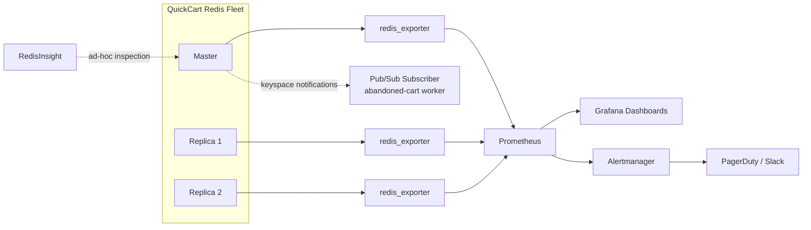

# Chapter 14: Monitoring & Observability

Chapter 13 gave you the tools to answer "is this Redis instance fast enough?" at a point in time — `redis-benchmark` for synthetic load, the slow log for finding expensive commands after the fact, and `redis-cli --latency` for measuring round-trip latency. Those are diagnostic tools you reach for when something already feels wrong.

This chapter is about knowing something is wrong *before* a customer notices — and having the data to say exactly what, when, and why. QuickCart's Redis fleet now backs sessions, the product cache, and the shopping cart service across a Sentinel-managed replica set and a small Redis Cluster (Chapters 11–12). At that scale, tailing logs by hand or running `redis-cli` interactively during an incident is not a monitoring strategy — it's a post-mortem waiting to happen. You need continuous, automated observability: metrics scraped on a schedule, dashboards that show trends, alerts that page someone before `used_memory` hits `maxmemory`, and event-driven hooks for business logic that cares about what happens inside the keyspace.

---

## Learning Objectives

By the end of this chapter, you will be able to:

- Read Redis's `INFO` command output section by section and identify the handful of fields that actually matter for day-to-day health.
- Stand up `redis_exporter` to expose Redis metrics in Prometheus format, and explain what it scrapes and how.
- Design a Grafana dashboard with the panels that catch the failure modes Redis actually has (memory exhaustion, cache misses, replication lag, connection storms) and set sane alert thresholds for each.
- Use RedisInsight to browse keys, profile commands, and visualize per-key-pattern memory usage without writing a line of code.
- Explain why `MONITOR` is a diagnostic tool of last resort, never a standing production practice, because of its performance overhead.
- Configure keyspace notifications and build a Pub/Sub consumer that reacts to key expiration — QuickCart's abandoned-cart email trigger.
- Design a health check for Kubernetes that distinguishes liveness from readiness, and know what "healthy" should mean beyond "the process exists."

---

## Prerequisites

This chapter builds directly on [Chapter 13: Performance Tuning & Benchmarking](./13-performance-tuning-and-benchmarking.md). We assume you're already comfortable with:

- The **slow log** (`SLOWLOG GET`, `CONFIG SET slowlog-log-slower-than`) for capturing expensive commands after they've happened.
- `redis-cli --latency`, `--latency-history`, and `--intrinsic-latency` for measuring round-trip and baseline system latency.
- `redis-benchmark` for generating synthetic load and reading its throughput/latency output.
- The general idea that Redis's single-threaded event loop (Chapter 3) means one slow command blocks every other client — which is exactly why the metrics in this chapter (`instantaneous_ops_per_sec`, `used_memory`, slow-log length) are the ones worth watching continuously rather than just after an incident.

If Chapter 13 hasn't landed in your copy of this repo yet, that's fine — everything here is self-contained; it just assumes you already know *how to look at one instance at one moment*. This chapter is about doing that continuously, at fleet scale, automatically.

---

## 1. The `INFO` Command in Depth

`INFO` is the single most important command for Redis observability. It returns a large, human-readable block of key-value pairs, grouped into sections, describing everything about the server's current state. Every monitoring tool in this chapter — `redis_exporter`, RedisInsight, even a hand-rolled health check — is, underneath, mostly just parsing `INFO`.

```bash
redis-cli INFO
# or a single section:
redis-cli INFO memory
```

### 1.1 Sections worth knowing

| Section | What it tells you |
|---|---|
| `server` | Redis version, build info, OS, process ID, uptime, config file path |
| `clients` | Connected clients, blocked clients, client memory usage, max clients configured |
| `memory` | Memory usage in detail — used, peak, RSS, fragmentation, `maxmemory` and its policy |
| `persistence` | RDB/AOF status — last save time, whether a `BGSAVE`/`BGREWRITEAOF` is in progress, whether the last one succeeded |
| `stats` | Cumulative counters since startup — total commands processed, keyspace hits/misses, evicted/expired keys, rejected/accepted connections |
| `replication` | Role (master/replica), connected replicas, replication offset, replica lag |
| `cpu` | CPU time consumed by the Redis process (user/system, main thread vs. background) |
| `keyspace` | Per-database key counts and count of keys with a TTL set |

Run `INFO everything` (or `INFO all` on some versions) to get every section, including the rarely-needed `commandstats`, `latencystats`, `cluster`, and `errorstats` sections.

### 1.2 Fields to watch continuously

Not every field in `INFO` deserves a dashboard panel or an alert. These do:

- **`connected_clients`** (`clients` section) — a steady climb usually means a connection leak in application code (connections opened but never closed/pooled) rather than organic growth. Compare against `maxclients` from `CONFIG GET maxclients`.
- **`used_memory`** (`memory` section) — the actual bytes Redis has allocated for data. This is the number to compare against `maxmemory`; when it approaches the ceiling, eviction (or OOM rejection, if `maxmemory-policy` is `noeviction`) is imminent. Also watch `mem_fragmentation_ratio` — well above 1.5 suggests the allocator is wasting memory that `used_memory` alone won't reveal.
- **`evicted_keys`** (`stats` section) — a cumulative counter. A non-zero and *rising* rate means Redis is actively deleting keys under memory pressure. For a cache, some eviction can be normal; for a data store using Redis for anything that must not silently disappear (like QuickCart's session store), rising eviction is a page-worthy event.
- **`keyspace_hits`** and **`keyspace_misses`** (`stats` section) — together they define your **cache hit rate**: `hits / (hits + misses)`. This is arguably the single most important business-facing Redis metric — a falling hit rate on QuickCart's product cache means more requests are falling through to the (much slower, more expensive) product database.
- **`instantaneous_ops_per_sec`** (`stats` section) — a smoothed, real-time measure of command throughput. Useful for spotting both traffic spikes and traffic that has mysteriously stopped (a silent failure upstream).

A few more worth a passing glance during any investigation: `rdb_changes_since_last_save` and `rdb_last_bgsave_status` (persistence health), `master_link_status` and `master_last_io_seconds_ago` (replica-side replication health), `blocked_clients` (clients waiting on `BLPOP`/`XREAD BLOCK`/etc.), and `rejected_connections` (hit `maxclients`).

```bash
# quick health snapshot in one line each
redis-cli INFO memory | grep -E 'used_memory:|maxmemory:|mem_fragmentation_ratio:'
redis-cli INFO stats  | grep -E 'keyspace_hits:|keyspace_misses:|evicted_keys:|instantaneous_ops_per_sec:'
redis-cli INFO clients | grep connected_clients
```

---

## 2. Exporting Metrics to Prometheus

Reading `INFO` by hand doesn't scale past one instance, and it captures a single moment, not a trend. Prometheus solves this by *scraping* metrics on a schedule and storing them as time series — but Prometheus only speaks its own text exposition format, and Redis doesn't speak it natively. That's the job of **`redis_exporter`** ([oliver006/redis_exporter](https://github.com/oliver006/redis_exporter)), the de facto standard exporter for Redis.

### 2.1 How it works

`redis_exporter` runs as a small standalone process (or sidecar container) next to your Redis instance. On every scrape from Prometheus, it:

1. Connects to the target Redis instance as a normal client.
2. Runs `INFO`, `CONFIG GET maxmemory`, and (optionally) `CLIENT LIST`, `LATENCY HISTORY`, and key-pattern-specific commands you configure.
3. Parses the output and translates every relevant field into a Prometheus metric with labels (e.g., which instance, which replica).
4. Serves those metrics on an HTTP endpoint (`/metrics`) for Prometheus to scrape.

```bash
docker run -d --name redis_exporter -p 9121:9121 \
  -e REDIS_ADDR=redis://quickcart-redis:6379 \
  -e REDIS_PASSWORD=$REDIS_PASSWORD \
  oliver006/redis_exporter
```

### 2.2 Key metrics it exposes

`redis_exporter` names its metrics `redis_<info_field>` for the most part, making the mapping back to `INFO` intuitive:

| Prometheus metric | Source | Meaning |
|---|---|---|
| `redis_up` | exporter-level | Whether the exporter could reach and scrape Redis at all (1 = up) |
| `redis_memory_used_bytes` | `used_memory` | Current memory usage |
| `redis_memory_max_bytes` | `maxmemory` | Configured ceiling (0 = unbounded) |
| `redis_connected_clients` | `connected_clients` | Current client connections |
| `redis_keyspace_hits_total` / `redis_keyspace_misses_total` | `stats` | Counters — compute hit rate with `rate()` in PromQL |
| `redis_evicted_keys_total` | `stats` | Cumulative evictions |
| `redis_expired_keys_total` | `stats` | Cumulative expirations |
| `redis_commands_processed_total` | `stats` | Cumulative command count — `rate()` gives ops/sec |
| `redis_connected_slaves` | `replication` | Number of connected replicas |
| `redis_master_repl_offset` / `redis_slave_repl_offset` | `replication` | Replication offsets — the diff is your lag proxy |
| `redis_rdb_last_save_time` / `redis_rdb_changes_since_last_save` | `persistence` | Snapshot freshness |
| `redis_db_keys` / `redis_db_keys_expiring` | `keyspace` | Per-DB key counts |

A minimal Prometheus scrape config pointing at the exporter:

```yaml
scrape_configs:
  - job_name: 'redis'
    static_configs:
      - targets: ['redis_exporter:9121']
```

Run one exporter per Redis instance (each master and each replica) so per-node metrics stay distinguishable in Grafana and alerting — a single exporter pointed at a single `REDIS_ADDR` only reports on that one node.

---

## 3. Building Grafana Dashboards

Grafana turns the time series Prometheus has been collecting into readable dashboards. There's a well-maintained community dashboard (search "Redis Dashboard for Prometheus Redis Exporter" on grafana.com) that's a fine starting point — but knowing which panels *matter* lets you trim it down to what QuickCart's on-call engineers actually look at during an incident.

### 3.1 Recommended panels

| Panel | PromQL sketch | Why it matters |
|---|---|---|
| Memory usage vs. `maxmemory` | `redis_memory_used_bytes / redis_memory_max_bytes` | The single clearest "are we about to have a bad day" signal |
| Ops/sec | `rate(redis_commands_processed_total[1m])` | Traffic trend; spikes and dead-flat lines are both worth investigating |
| Cache hit rate | `rate(redis_keyspace_hits_total[5m]) / (rate(redis_keyspace_hits_total[5m]) + rate(redis_keyspace_misses_total[5m]))` | Directly reflects whether the cache is doing its job |
| Connected clients | `redis_connected_clients` | Connection leaks show up as a slow, steady climb |
| Replication lag | `redis_master_repl_offset - redis_slave_repl_offset` (queried against each replica) | A widening gap means a replica is falling behind, risking stale reads or a bad failover |
| Evicted keys | `rate(redis_evicted_keys_total[5m])` | Non-zero on a store that shouldn't evict is a correctness problem, not just a performance one |

Round out the dashboard with panels for `mem_fragmentation_ratio`, `blocked_clients`, and per-instance `redis_up` (a red panel here means the exporter can't even reach Redis — the most basic possible alert).

### 3.2 Alert thresholds worth setting

Dashboards are for humans looking at screens; alerts are for machines paging humans when no one is looking. QuickCart's baseline alert set:

- **Memory approaching `maxmemory`**: fire a warning at 80% and a critical at 90-95% of `redis_memory_used_bytes / redis_memory_max_bytes`. Waiting until 100% means you alert *after* eviction or OOM has already started.
- **Hit rate dropping**: alert if the 15-minute rolling hit rate falls more than, say, 15 percentage points below its 24-hour baseline. An absolute floor (e.g., "below 80%") also works if your workload is stable enough to have a known-good baseline.
- **Replication lag growing**: alert if the offset gap (or `master_last_io_seconds_ago` on the replica) exceeds a threshold sustained for more than a minute — one bad data point during a brief network blip shouldn't page anyone.
- **`redis_up == 0`**: page immediately — the exporter can't reach the instance at all.
- **Evicted keys rate > 0** on any instance not explicitly configured as an evicting cache — evictions on a session store or primary data store are a correctness incident, not a performance blip.
- **Rejected connections > 0**: `connected_clients` has hit `maxclients` and new clients are being turned away.

---

## 4. RedisInsight

[RedisInsight](https://redis.io/insight/) is Redis's official free GUI. Where `INFO` and Prometheus give you numbers, RedisInsight gives you a visual, interactive way to explore what's actually *in* the keyspace and how commands are behaving — genuinely useful for both learning and production debugging, without writing a script.

Core capabilities:

- **Browsing keys**: a tree/list view of the keyspace, filterable by pattern (e.g., `cart:*`), with type-aware editors for strings, hashes, sets, sorted sets, streams, and JSON (if RedisJSON is loaded). You can inspect, edit, and delete values directly — genuinely handy for spot-checking what a bug actually wrote to a key during development.
- **Profiler**: a built-in equivalent of `MONITOR` with a GUI around it — start/stop a capture window, see commands as they stream in, and filter by command type or key pattern. Because it's explicitly opt-in and time-boxed through the UI, it's harder to accidentally leave running than a raw `MONITOR` session in a terminal (though it carries the same underlying overhead — see Section 5).
- **Memory analysis**: a per-key-pattern breakdown of memory usage (built on `MEMORY USAGE` and a sampling scan of the keyspace), rendered as a treemap. This is the fastest way to answer "which key pattern is eating our memory" without writing a scan-and-sum script by hand — directly useful for the big-key diagnosis workflow from Chapter 13.
- **Slowlog view**: a table view over `SLOWLOG GET`, sortable by duration, with the offending command visible at a glance.
- **Pub/Sub view**: a live console for publishing to and subscribing on channels — useful for testing the keyspace-notification setup in Section 6 without writing a subscriber script first.
- **Cluster view**: for Redis Cluster deployments, a visual map of shards, hash slot ranges, and node roles (Chapter 12's hash slots made visible instead of inferred from `CLUSTER SHARDS` output).

RedisInsight is a good complement to Prometheus/Grafana, not a replacement: Grafana is for continuous, unattended trend-watching and alerting; RedisInsight is for a human sitting down to actively investigate one instance.

---

## 5. `MONITOR`: Streaming Every Command in Real Time

`MONITOR` is the most direct possible window into a Redis instance: run it, and the server streams a copy of *every single command* any client sends, in real time, as it happens.

```bash
redis-cli MONITOR
# 1720262701.123456 [0 127.0.0.1:52344] "GET" "cart:u_9081"
# 1720262701.123601 [0 127.0.0.1:52346] "HSET" "product:1042" "stock" "17"
# ...
```

It's genuinely useful for a narrow purpose: watching, live, exactly what commands an application is sending during local development or a controlled test — catching a bug where a client is issuing `KEYS *` instead of `SCAN`, or sending far more round trips than expected for a single logical operation.

### 5.1 Why it must never run in production under load

`MONITOR` is not a passive observer. Every command any client sends still has to be serialized and pushed over the wire to *every* connected `MONITOR` client, in addition to being executed normally. On a busy production instance processing tens or hundreds of thousands of ops/sec, that means Redis is now doing meaningful extra work, per command, for the entire duration `MONITOR` is attached — extra CPU to format and copy each command, extra network I/O to stream it out, and a `MONITOR` client that itself becomes a consumer competing for the single-threaded event loop's attention.

The failure mode is exactly the one you'd fear: an engineer, mid-incident, on an already-struggling instance, runs `MONITOR` to "see what's going on" — and the added overhead pushes an already-stressed server further into trouble, sometimes dramatically. This is a well-known, repeatedly-learned-the-hard-way lesson in the Redis operations community: **`MONITOR` is a local-development and low-traffic debugging tool, never a production incident-response reflex.** If you need production visibility, that's what Sections 1–4 (and the slow log from Chapter 13) are for — they're designed for continuous, low-overhead operation. If you truly need to see live commands in production, prefer a short, targeted capture through RedisInsight's profiler (Section 4) with a strict time box, and only as a last resort.

---

## 6. Keyspace Notifications

`INFO`, Prometheus, and `MONITOR` all answer "what is Redis doing." Keyspace notifications answer a different question: "something specific just happened to this key — tell my application code." They turn Redis's internal key events into Pub/Sub messages your application can subscribe to and react to.

### 6.1 Enabling `notify-keyspace-events`

Disabled by default (it has a small but real cost — Redis publishes an extra message for every matching event), keyspace notifications are turned on with a `CONFIG SET` or a `redis.conf` line using a flag string:

```bash
redis-cli CONFIG SET notify-keyspace-events "Ex"
```

The flags:

| Flag | Meaning |
|---|---|
| `K` | Keyspace events, published as `__keyspace@<db>__:<key>` |
| `E` | Keyevent events, published as `__keyevent@<db>__:<event>` |
| `g` | Generic commands (`DEL`, `EXPIRE`, `RENAME`, ...) |
| `$` | String commands |
| `l` | List commands |
| `s` | Set commands |
| `h` | Hash commands |
| `z` | Sorted set commands |
| `x` | Expired events |
| `e` | Evicted events |
| `A` | Alias for `g$lshzxe` — all event classes |

`"Ex"` means: publish keyevent notifications (`E`) for expired keys (`x`) — exactly what QuickCart needs to react to a cart expiring.

### 6.2 Subscribing via Pub/Sub

```bash
redis-cli PSUBSCRIBE "__keyevent@0__:expired"
```

Every time a key expires in database 0, this channel receives a message whose payload is the key name that just expired — no value, since the key is already gone by the time the notification fires.

### 6.3 QuickCart example: abandoned-cart emails

QuickCart stores each user's active shopping cart as a hash at `cart:{userId}` with a TTL (say, 30 minutes of inactivity, set via `EXPIRE` on every cart update). When that TTL lapses without the user checking out, that's an abandoned cart — and marketing wants an email triggered within minutes.

Rather than polling the cart database on a schedule, QuickCart subscribes to expiration events and reacts immediately. This is covered in full with the `redis.conf` setting and a subscriber snippet in the Real-World Scenario below.

A caveat worth internalizing: expired-key events fire when Redis's lazy/active expiration cycle actually removes the key, which can lag the nominal TTL by a small amount under load — fine for an abandoned-cart email, not something to rely on for hard real-time guarantees.

---

## 7. Health Checks

"Is Redis healthy?" sounds simple until you have to encode it as a check an orchestrator runs every few seconds.

### 7.1 `PING`

```bash
redis-cli PING
# PONG
redis-cli --no-raw PING
# "PONG"
```

`PING` is the minimum viable health check: it confirms the server accepted the TCP connection, completed the protocol handshake, and its single-threaded event loop was free enough to process one trivial command and reply. `--no-raw` forces the reply to print with RESP-visible quoting — mostly useful when scripting output comparisons or debugging encoding issues, since the value itself doesn't change.

### 7.2 Liveness vs. readiness in Kubernetes

Running Redis under Kubernetes (as QuickCart does for its cluster nodes), you configure two conceptually different probes:

- **Liveness probe**: "should Kubernetes restart this container?" A liveness check should be minimal and conservative — a basic `PING` (or a TCP connect) is usually right. Its only job is to catch a truly wedged or crashed process; a liveness probe that's too strict (e.g., failing on transient slowness) causes Kubernetes to restart a Redis pod that was actually fine, which is far more disruptive than the problem it was meant to catch — especially disruptive for a master node, where a restart triggers failover.
- **Readiness probe**: "should this pod receive traffic?" This can be stricter — for a replica, it might also check `master_link_status:up` from `INFO replication` so a replica that's disconnected from its master (and therefore serving stale data) is pulled out of rotation until it catches up.

```yaml
livenessProbe:
  exec:
    command: ["redis-cli", "-a", "$(REDIS_PASSWORD)", "PING"]
  periodSeconds: 5
  failureThreshold: 3

readinessProbe:
  exec:
    command: ["sh", "-c", "redis-cli -a $(REDIS_PASSWORD) PING | grep -q PONG && redis-cli -a $(REDIS_PASSWORD) INFO replication | grep -q 'master_link_status:up\\|role:master'"]
  periodSeconds: 5
  failureThreshold: 2
```

### 7.3 What a good health check verifies beyond "the process is up"

A process existing in `ps aux` output tells you almost nothing. A meaningful health check should verify:

- **It responds at all** (`PING` succeeds) — catches a fully hung or crashed process.
- **It responds within a latency budget.** A `PING` that takes 4 seconds to return `PONG` because the event loop is choked behind a huge blocking command is technically "alive" but practically useless to callers with a much shorter timeout. Time the probe and fail it if the response exceeds, say, 100-200ms for a hot path instance.
- **It's not in a degraded replication state**, for anything read from replicas.
- **It's not out of memory and rejecting writes.** A cheap `SET __healthcheck__ 1` (on a dedicated key, with a short TTL) as part of a readiness check catches the case where `maxmemory-policy noeviction` is silently rejecting all writes even though reads and `PING` still work fine.

---

## 8. Logging

Redis writes operational log lines to its configured log file (or stdout in most container setups), and the verbosity is controlled in `redis.conf`:

```conf
loglevel notice
logfile /var/log/redis/redis-server.log
```

`loglevel` options, from quietest to loudest: `warning`, `notice` (the sensible production default), `verbose`, `debug` (development only — too noisy and too much overhead for production).

### 8.1 What's worth alerting on

Metrics from Prometheus catch trends; logs catch discrete events that a gauge or counter won't cleanly surface. Worth piping into your log aggregation and alerting on:

- **Repeated `BGSAVE` failures** — logged as an error when a background save can't fork or can't write the RDB file (often disk-space or permissions related). A single failure might be transient; repeated failures mean your durability story has quietly stopped working, and `rdb_last_bgsave_status` in `INFO persistence` will confirm it.
- **Replication link drops** — replicas log disconnection and reconnection to their master; masters log a replica going away. Occasional blips happen over real networks, but frequent flapping points at network instability or a replica that's too slow/overloaded to keep up.
- **Rejected connections** — logged when `maxclients` is hit; corroborate against `rejected_connections` in `INFO clients` and treat it as a capacity-planning signal, not just noise.
- **`Ready to accept connections` after an unexpected restart** — a log line you *want* to see, but seeing it when you didn't expect a restart is itself the alert; correlate against your deployment history to rule out a crash.

---

## Observability Stack Diagram



---

## Real-World Scenario

QuickCart's Redis fleet has grown past the point where "someone notices the site feels slow" counts as monitoring. The platform team wires up full observability in one sprint:

**1. Prometheus + Grafana across the cluster.** A `redis_exporter` sidecar is deployed next to every Redis instance — the Sentinel-managed master/replica set backing sessions, and every shard of the product-cache Cluster. Prometheus scrapes all of them every 15 seconds; Grafana renders the panels from Section 3.

**2. Memory alert.** Following Section 3.2:

```yaml
# Prometheus alerting rule
- alert: RedisMemoryNearMaxmemory
  expr: redis_memory_used_bytes / redis_memory_max_bytes > 0.90
  for: 2m
  labels:
    severity: critical
  annotations:
    summary: "Redis instance {{ $labels.instance }} is above 90% of maxmemory"
```

**3. Replication lag alert.**

```yaml
- alert: RedisReplicationLagHigh
  expr: (redis_master_repl_offset - redis_slave_repl_offset) / 1024 / 1024 > 5
  for: 1m
  labels:
    severity: warning
  annotations:
    summary: "Replica {{ $labels.instance }} is lagging behind master"
```

(In practice QuickCart also tracks `master_last_io_seconds_ago > 5` from `INFO replication` as a corroborating, offset-independent lag signal.)

**4. Abandoned-cart flow via keyspace notifications.** Each cart is a hash at `cart:{userId}` with a 30-minute idle TTL. `redis.conf` (or an equivalent `CONFIG SET` applied at startup by the deployment tooling):

```conf
notify-keyspace-events Ex
```

A small Python worker subscribes to expired-key events and, when it sees a `cart:*` key expire, enqueues an abandoned-cart email job:

```python
import redis

r = redis.Redis(host="quickcart-redis", port=6379, password="...", db=0)
pubsub = r.pubsub()
pubsub.psubscribe("__keyevent@0__:expired")

for message in pubsub.listen():
    if message["type"] != "pmessage":
        continue
    expired_key = message["data"].decode()
    if expired_key.startswith("cart:"):
        user_id = expired_key.split(":", 1)[1]
        # Hand off to the existing email pipeline — don't do slow work inline
        # in the subscriber loop, or you risk falling behind the event stream.
        enqueue_abandoned_cart_email(user_id)
```

The worker deliberately does the minimum in the Pub/Sub loop (parse the key, enqueue a job) and lets a separate downstream service handle the actual email send — a slow subscriber can miss events if Redis's Pub/Sub client buffer fills, so keeping the callback fast matters.

Within a week, the memory alert catches a slow leak in a batch job that was setting cart-related keys without a TTL; the replication alert catches a replica falling behind during a bulk re-index; and the abandoned-cart flow starts recovering a measurable slice of otherwise-lost checkouts.

---

## Best Practices

- **Monitor hit rate and evictions continuously, not just during an incident.** A slow decline in cache hit rate is easy to miss in real time but obvious in a week-over-week Grafana graph — put it on a dashboard someone actually looks at.
- **Alert on replication lag and memory headroom before they become outages.** A 90% memory alert gives you time to act; a 100% alert is often already an incident.
- **Never run `MONITOR` against a production instance under real load.** Use Prometheus/Grafana and the slow log for continuous visibility; reach for RedisInsight's time-boxed profiler, not a bare `MONITOR` session, if you truly need to see live commands.
- **Use keyspace notifications sparingly.** They add a real (if usually small) publish cost per matching event — enable only the event classes you'll actually act on (e.g., `Ex` for expirations), not a blanket `KEA` "just in case."
- **Separate liveness from readiness in orchestrated environments.** A liveness probe should rarely fail and never trigger on transient slowness; a readiness probe can and should be stricter about replication and write health.
- **Give every Redis instance its own exporter and its own dashboard row.** Aggregating metrics across a whole fleet into a single number hides exactly the one bad node you need to find during an incident.

---

## Common Mistakes

- **Treating "the Redis process is running" as sufficient health-checking.** A wedged event loop, a replica disconnected from its master, or an instance silently rejecting writes under `noeviction` can all coexist with a process that's technically alive and answering `PING`. Health checks need to verify behavior, not just existence.
- **Running `MONITOR` in production during an incident.** It's the most tempting thing to do when something feels wrong and the most likely to make an already-struggling instance worse, because it adds real per-command overhead exactly when the server can least afford it.
- **Ignoring `keyspace_misses` growth.** A rising miss rate is a quiet signal that the cache isn't doing its job — more traffic is falling through to the backing store — and it rarely announces itself as loudly as a memory or CPU alert would.
- **Not setting up any alerting until after a memory-exhaustion incident.** Building the dashboard is the easy half; the alert rules are what actually change the outcome next time, and they're cheap to write compared to the cost of the incident that motivates writing them.

---

## Summary

- `INFO` is the foundation of Redis observability — know its sections (`server`, `clients`, `memory`, `persistence`, `stats`, `replication`, `cpu`, `keyspace`) and watch `connected_clients`, `used_memory`, `evicted_keys`, `keyspace_hits`/`misses`, and `instantaneous_ops_per_sec` continuously.
- `redis_exporter` bridges `INFO` output to Prometheus, exposing metrics like `redis_memory_used_bytes`, `redis_keyspace_hits_total`, and `redis_connected_slaves` for scraping and alerting.
- A good Grafana dashboard tracks memory vs. `maxmemory`, ops/sec, hit rate, connected clients, replication lag, and evicted keys — with alert thresholds set well before those metrics reach crisis levels.
- RedisInsight is the official GUI for interactive exploration: key browsing, a profiler, per-key-pattern memory visualization, and built-in Slowlog/Pub-Sub/Cluster views.
- `MONITOR` streams every command in real time and is invaluable for local debugging, but its per-command overhead makes it unsafe to run against a loaded production instance.
- Keyspace notifications (`notify-keyspace-events`) turn key events like expiration into Pub/Sub messages your application can react to — QuickCart uses this for abandoned-cart emails — but should be scoped narrowly to events you'll actually act on.
- Health checks need to distinguish liveness (should this restart?) from readiness (should this get traffic?), and should verify real responsiveness and replication/write health, not just process existence.
- Redis's own logs surface events metrics don't — `BGSAVE` failures, replication link drops, and rejected connections are all worth alerting on directly.

---

## Knowledge Check

1. Which `INFO` section would you check to determine whether a replica is falling behind its master, and which specific fields would you look at?
2. Explain, in one or two sentences, how `redis_exporter` turns `INFO` output into something Prometheus can scrape and store.
3. Why is `keyspace_hits` / `keyspace_misses` arguably the single most important metric for a cache deployment, and what does a falling hit rate imply about the systems behind Redis?
4. A teammate suggests running `MONITOR` on the production checkout-cart instance during a live latency incident "just to see what's happening." What's the risk, and what would you suggest instead?
5. What `notify-keyspace-events` flag value would you set to receive keyevent notifications only for expired keys, and what channel would you subscribe to?
6. Explain the difference between a liveness probe and a readiness probe for a Redis replica running in Kubernetes, and give a concrete example of a check that belongs in one but not the other.
7. Name two log-level events (not metrics) worth alerting on directly from Redis's own logs, and explain why a metric alone might not catch them as reliably.
8. Why should `notify-keyspace-events` be scoped narrowly (e.g., `Ex`) rather than enabled for all event classes by default?

---

## Hands-On Exercise

1. **Start a local Redis instance** (via Docker or your local install) and confirm it's reachable: `redis-cli PING`.
2. **Run `redis_exporter` against it**:
   ```bash
   docker run -d --name redis_exporter -p 9121:9121 \
     -e REDIS_ADDR=redis://host.docker.internal:6379 \
     oliver006/redis_exporter
   curl localhost:9121/metrics | grep redis_memory_used_bytes
   ```
3. **Stand up a local Prometheus** with a scrape config pointing at `localhost:9121`, and confirm in Prometheus's UI (`http://localhost:9090/targets`) that the `redis` job is `UP`.
4. **Generate some load and evictions** to make the metrics move: run `redis-benchmark -n 100000` in one terminal, and in another, set a small `maxmemory` (`CONFIG SET maxmemory 10mb`) with `maxmemory-policy allkeys-lru`, then load enough keys to trigger eviction. Confirm `redis_evicted_keys_total` increments in Prometheus.
5. **Build one Grafana panel**: connect Grafana to your local Prometheus as a data source, and create a single time-series panel plotting `redis_memory_used_bytes` alongside `redis_memory_max_bytes` for your instance. Confirm the eviction-triggering load from step 4 is visible as the line approaching the ceiling.

*Stretch goal:* enable `notify-keyspace-events Ex`, set a key with a 5-second TTL, and write a five-line Python or Node.js script that subscribes to `__keyevent@0__:expired` and prints the key name the moment it expires.

---

## Further Reading

- Redis Docs: [`INFO`](https://redis.io/docs/latest/commands/info/) — the full, authoritative field reference for every section.
- [oliver006/redis_exporter](https://github.com/oliver006/redis_exporter) — README covers configuration flags, TLS, Redis Cluster mode, and the full metric list.
- Redis Docs: [Keyspace notifications](https://redis.io/docs/latest/develop/pubsub/keyspace-notifications/) — the complete flag reference and event semantics.
- Redis Docs: [`MONITOR`](https://redis.io/docs/latest/commands/monitor/) — includes the official performance-impact warning.
- [RedisInsight documentation](https://redis.io/docs/latest/operate/redisinsight/) — feature walkthroughs for the profiler, memory analysis, and cluster views.
- Grafana Labs: "Redis Dashboard for Prometheus Redis Exporter" (community dashboard on grafana.com) — a ready-made starting point to adapt rather than build from scratch.
- Kubernetes Docs: [Configure Liveness, Readiness and Startup Probes](https://kubernetes.io/docs/tasks/configure-pod-container/configure-liveness-readiness-startup-probes/) — general probe design guidance that applies directly to stateful services like Redis.

---

<div style="display:flex;justify-content:space-between;align-items:center;">
  <a href="./13-performance-tuning-and-benchmarking.md">← Previous: Performance Tuning & Benchmarking</a>
  <a href="./00-index.md">🏠 Index</a>
  <a href="./15-security.md">Next: Security →</a>
</div>
