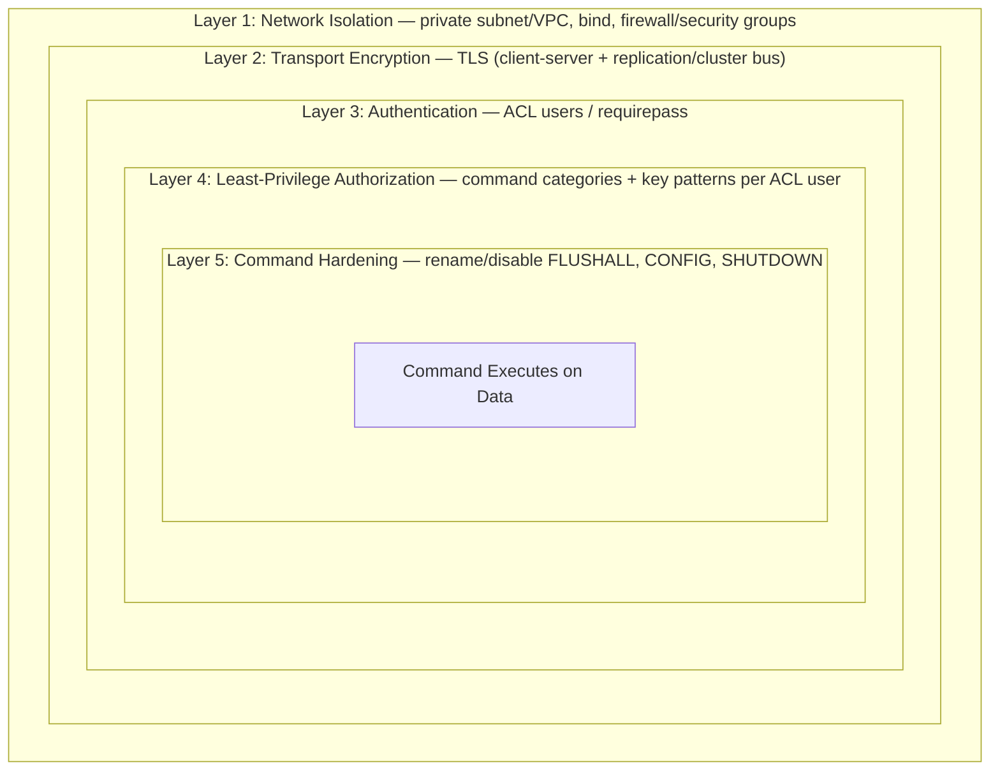

# Chapter 15: Security

Chapter 14 gave you the instruments to watch a Redis deployment — `INFO`, Prometheus/Grafana, `MONITOR`, keyspace notifications. All of that observability assumes the thing you're watching is actually yours to watch. Redis was designed, from its very first release, as a fast backend component meant to sit behind an application server on a trusted network — not as an internet-facing service with a login page. That design choice is exactly why Redis is so fast, and exactly why an unconfigured Redis instance is one of the most consistently, embarrassingly exploited pieces of infrastructure on the public internet. This chapter covers how to close that gap: authentication (`requirepass` and the modern ACL system), network hardening, TLS, command restriction, and how QuickCart layers all of it into a defense-in-depth posture before any of its Redis instances go anywhere near production traffic.

---

## Learning Objectives

By the end of this chapter, you will be able to:

- Explain Redis's default security posture out of the box, and why an exposed, unauthenticated instance is a well-documented, actively exploited class of incident.
- Configure authentication using both legacy `requirepass` and the modern Redis 6+ ACL system (`ACL SETUSER`, `ACL LIST`, `ACL WHOAMI`, `ACL CAT`).
- Design least-privilege ACL users scoped to specific commands, command categories, and key patterns.
- Harden network exposure with `bind`, `protected-mode`, firewalling, and TLS for both client and replication traffic.
- Restrict or rename dangerous administrative commands (`FLUSHALL`, `FLUSHDB`, `CONFIG`, `SHUTDOWN`) as a defense-in-depth measure.
- Explain why logical database numbers (`SELECT 0-15`) are not a security boundary, and design proper per-service isolation instead.

---

## Prerequisites for This Chapter

This chapter assumes the keyspace model from [Chapter 2: Core Concepts](./02-core-concepts.md) — in particular, that Redis's keyspace is flat and schema-free, which is exactly why key-pattern-based ACL restrictions (`~product:*`) matter so much: Redis has no structural concept of "this key belongs to this service," so access control has to be built explicitly, the same way key naming discipline had to be built explicitly in Chapter 2.

It also assumes the topologies from [Chapter 11: Replication & High Availability](./11-replication-and-high-availability.md) and [Chapter 12: Redis Cluster & Sharding](./12-redis-cluster-and-sharding.md). Securing Redis is not a single-node exercise: `requirepass`/ACL configuration, TLS settings, and renamed commands must be applied **identically** across a leader and every replica, and across every node in a cluster — a replica or cluster node that falls out of sync on security config is either an outage waiting to happen (replication fails to authenticate) or a silent hole in your defenses (one node still accepting unauthenticated connections). If you haven't worked through those chapters, at least keep this in mind: everything in this chapter needs to be rolled out fleet-wide, not host-by-host.

Finally, this chapter assumes you're comfortable with `redis-cli` basics (Chapter 2) and have a topology in mind (standalone, Sentinel-managed, or Cluster) that you'll be hardening.

---

## 1. Redis's Default Security Posture (and Why It's a Problem)

Redis ships optimized for the case it was actually designed for: a trusted backend service, reachable only from application servers on a private network, with no adversarial traffic anywhere nearby. That assumption shapes every default:

- **No authentication by default in many install paths.** A freshly installed Redis server (via `apt`, a plain Docker image, or building from source) accepts any connection and executes any command with no password and no identity check whatsoever, unless you explicitly configure one.
- **Binds broadly unless configured otherwise.** Depending on the install method and `redis.conf`, Redis can end up listening on `0.0.0.0` — every network interface on the host — rather than being scoped to loopback or a private interface.
- **`protected-mode` is a safety net, not a security boundary.** Modern Redis ships `protected-mode yes`, which refuses non-loopback connections *if* no password and no `bind` directive are configured. This genuinely prevents the most careless case — but it is trivially disabled (`protected-mode no`), and many container/cloud deployments disable it "to make things work," reintroducing the exact hole it exists to close. Treat it as a guardrail against total accident, never as your actual network security control.

### Why this makes Redis a well-known target

Put those defaults together — no password, reachable from anywhere, a rich command set that includes reading, deleting, and even writing arbitrary files to disk (via `CONFIG SET dir` + `SAVE`, historically) — and you get a genuinely dangerous combination. This isn't hypothetical:

- **Mass ransom campaigns against exposed Redis instances** have been documented repeatedly since at least 2015: internet-wide scanners look specifically for hosts answering on port 6379 with no `AUTH` required, connect, run `FLUSHALL` or `KEYS *`/`DEL` to wipe the dataset, and leave behind a single ransom-note key demanding cryptocurrency payment for a restore that, in most of these campaigns, never actually happens.
- **Instances have been used as a foothold for further compromise**, not just data loss — an unauthenticated Redis with an exposed data directory has historically been abused to write a crontab entry or an SSH authorized-key file to disk via `CONFIG SET dir`/`CONFIG SET dbfilename` followed by `SAVE`, turning a "just a cache" instance into remote code execution on the host.
- **None of these attacks exploit a Redis vulnerability.** They exploit a *configuration* gap — no password, reachable from the internet. This is the single most important sentence in this chapter: the fix is not a patch, it's turning on the controls covered in the rest of this chapter, before the instance is ever reachable from anywhere untrusted.

The takeaway that should anchor everything else here: **Redis is secure when you configure it to be, and dangerously open when you don't.** There is no "secure by default" floor to fall back on if you skip this chapter.

---

## 2. Authentication: `requirepass` and the ACL System

### 2.1 `requirepass` — legacy single-password auth

The original (and still supported) way to require authentication is a single shared password for the whole server:

```conf
# redis.conf
requirepass "a-long-random-string-not-a-dictionary-word"
```

Or at runtime (not persisted unless also written to config or via `CONFIG REWRITE`):

```
127.0.0.1:6379> CONFIG SET requirepass "a-long-random-string-not-a-dictionary-word"
OK
```

Once set, every client must authenticate before running most other commands:

```
127.0.0.1:6379> GET session:42
(error) NOAUTH Authentication required.
127.0.0.1:6379> AUTH a-long-random-string-not-a-dictionary-word
OK
127.0.0.1:6379> GET session:42
(nil)
```

`requirepass` is genuinely better than nothing, and it's fine for a single-developer local setup or a throwaway environment. Its ceiling is exactly what the name implies: **one password, all-or-nothing access.** Every client — QuickCart's recommendation service, its checkout service, and a human operator running ad hoc `redis-cli` commands — shares the same credential and the same unrestricted command set. There's no way to say "this service can read but not delete," and if any one of those credentials leaks, every client using it needs to be rotated at once, with no way to tell from Redis's side which client actually caused the leak.

### 2.2 The ACL system (Redis 6+)

Redis 6 introduced a proper **Access Control List (ACL)** system: multiple named users, each with their own password(s), their own set of permitted/denied commands, and their own set of permitted key patterns. This is the modern, recommended approach for anything beyond a single-user dev instance.

Core commands:

```
# Create/modify a user
ACL SETUSER <username> <rules...>

# List every configured user and their full rule set
ACL LIST

# Show which user the current connection is authenticated as
ACL WHOAMI

# List every command category ACLs can grant/deny by
ACL CAT

# List every command in a given category
ACL CAT read

# Delete a user
ACL DELUSER <username>

# Show the effective permissions of a specific user
ACL GETUSER <username>
```

A minimal example — creating an admin user with full access, replacing reliance on the single `requirepass` credential:

```
127.0.0.1:6379> ACL SETUSER admin on >a-strong-admin-password ~* &* +@all
OK
127.0.0.1:6379> ACL LIST
1) "user admin on #<hash> ~* &* +@all"
2) "user default on nopass ~* &* +@all"
```

Reading that rule syntax left to right:

| Token | Meaning |
|---|---|
| `on` / `off` | Enable or disable this user without deleting it |
| `>password` | Add a password (in cleartext here; Redis stores it hashed) |
| `~pattern` | Grant access to keys matching this glob pattern (`~*` = all keys) |
| `&pattern` | Grant access to Pub/Sub channels matching this pattern |
| `+@all` / `-@all` | Grant/deny an entire command category |
| `+command` / `-command` | Grant/deny one specific command |
| `nopass` | This user requires no password (dangerous — avoid outside `default` in a locked-down dev box) |
| `resetkeys` / `resetpass` | Clear previously granted key patterns / passwords before applying new rules |

Every fresh Redis 6+ install still ships a `default` user with `nopass` and `+@all ~*` — full access, no password — for backward compatibility with `requirepass`-style configs and existing clients. **Locking down or disabling the `default` user is the first real ACL step on any deployment that isn't a personal sandbox**, exactly parallel to the `default` user warning you'd see in this course's ClickHouse or MongoDB security material.

```
# Give default a strong password instead of leaving it passwordless
127.0.0.1:6379> ACL SETUSER default on >a-strong-default-password

# Or, once every service has its own dedicated ACL user, disable default entirely
127.0.0.1:6379> ACL SETUSER default off
```

ACL rules can also live in `redis.conf` (via `user` directives) or a dedicated external ACL file (`aclfile /etc/redis/users.acl`) loaded at startup, which is the recommended approach for production — it keeps user definitions in version control and survives a `CONFIG REWRITE`/restart cleanly, the same way ClickHouse's `users.xml` keeps user definitions as infrastructure-as-code rather than only living in a live, mutable session.

---

## 3. ACLs in Depth: Commands, Key Patterns, and Categories

The real power of ACLs isn't "password per user" — `requirepass` already gave you that (once). It's **least-privilege scoping**: a given user can be restricted to exactly the commands and exactly the keys it needs, nothing more.

### 3.1 Command-level restrictions

Individual commands can be explicitly granted (`+`) or denied (`-`):

```
127.0.0.1:6379> ACL SETUSER readonly_svc on >readonly-pass +get +mget +hget +hgetall -flushall -flushdb
```

This user can run `GET`, `MGET`, `HGET`, and `HGETALL`, and is explicitly denied `FLUSHALL`/`FLUSHDB` even if some broader rule elsewhere would otherwise allow them — an explicit `-command` always wins over a broader `+@category` grant for that same command, so denials are a reliable way to carve out exceptions.

### 3.2 Command categories

Listing every individual command a user needs is tedious and error-prone. Redis groups commands into **categories** you can grant or deny wholesale:

```
127.0.0.1:6379> ACL CAT
1) "keyspace"
2) "read"
3) "write"
4) "set"
5) "sortedset"
6) "list"
7) "hash"
8) "string"
9) "bitmap"
10) "hyperloglog"
11) "geo"
12) "stream"
13) "pubsub"
14) "admin"
15) "fast"
16) "slow"
17) "blocking"
18) "dangerous"
19) "connection"
20) "transaction"
21) "scripting"
```

The two categories that matter most for a least-privilege design:

- **`@read`** — every command that only reads data (`GET`, `HGET`, `SMEMBERS`, `ZRANGE`, etc.), never mutates it.
- **`@dangerous`** — commands with server-wide, destructive, or information-disclosure blast radius: `FLUSHALL`, `FLUSHDB`, `CONFIG`, `SHUTDOWN`, `DEBUG`, `KEYS`, `MONITOR`, `CLUSTER`, and similar.

A read-only service account expressed with categories instead of individual commands:

```
127.0.0.1:6379> ACL SETUSER readonly_svc on >readonly-pass +@read -@dangerous
```

### 3.3 Key-pattern restrictions

The `~pattern` tokens from Section 2.2 restrict *which keys* a user's granted commands can touch, using the same glob syntax as `SCAN ... MATCH` (Chapter 2). A user can hold multiple `~pattern` clauses, and any key not matching at least one is entirely invisible to that user — not just for reads, but as a target for any command at all:

```
127.0.0.1:6379> ACL SETUSER product_reader on >product-reader-pass ~product:* +@read
```

`product_reader` can run `GET product:SKU-1001:name` or `HGETALL product:SKU-1001` freely, but `GET session:42` or `HGETALL cart:42` both fail with a `NOPERM` error — not because the command is disallowed, but because the key doesn't match the user's permitted key pattern.

### 3.4 QuickCart example: a recommendation-service ACL user and an admin user

QuickCart's recommendation service reads product metadata (`product:*`) to generate "customers also bought" suggestions. It never writes, never touches carts or sessions, and has no business running `FLUSHALL` or `CONFIG`. That's exactly the shape a scoped ACL user should take:

```
127.0.0.1:6379> ACL SETUSER recommendation_svc on >a-long-random-service-password \
    ~product:* \
    +@read \
    -@dangerous
```

Verifying the boundary:

```
127.0.0.1:6379> AUTH recommendation_svc a-long-random-service-password
OK
127.0.0.1:6379> ACL WHOAMI
"recommendation_svc"
127.0.0.1:6379> HGETALL product:SKU-1001
1) "name"
2) "Wireless Mouse"
3) "price"
4) "799"
127.0.0.1:6379> HSET product:SKU-1001 stock 999
(error) NOPERM this user has no permissions to run the 'hset' command
127.0.0.1:6379> GET session:42
(error) NOPERM No permissions to access a key
127.0.0.1:6379> FLUSHALL
(error) NOPERM this user has no permissions to run the 'flushall' command
```

Contrast that with a genuine admin account — full command set, full keyspace, used only by operators and automated maintenance jobs, never by an application service:

```
127.0.0.1:6379> ACL SETUSER admin_ops on >a-different-long-random-password ~* &* +@all
```

The design principle: **every distinct service gets its own ACL user, scoped to exactly the commands and key patterns that service's job requires.** A leaked `recommendation_svc` credential lets an attacker read product data — annoying, not catastrophic. A leaked `admin_ops` credential is a full compromise. Least privilege turns "which credential leaked" into a meaningful, bounded question instead of an all-or-nothing disaster, the same reasoning this course's ClickHouse security chapter applies to `GRANT`-based RBAC roles.

---

## 4. Network Security

Authentication answers "who is this connection." Network security answers a prior question: "should this connection have been allowed to reach the server at all." Get this layer wrong and authentication never even gets a chance to run — the attacker is inside the trust boundary already.

### 4.1 `bind`

The `bind` directive in `redis.conf` restricts which network interfaces Redis listens on:

```conf
# Only accept connections on the loopback interface and one private IP
bind 127.0.0.1 10.0.4.15
```

For QuickCart, this means each Redis node binds only to `127.0.0.1` (for local tooling/health checks) and the private VPC address application servers use to reach it — never `0.0.0.0`, and never a public IP, full stop. If a host genuinely has no legitimate reason for a given interface to reach Redis, that interface should not be in the `bind` list.

### 4.2 `protected-mode`

As covered in Section 1, `protected-mode yes` (the default since Redis 3.2) blocks non-loopback connections when no `bind` and no password are configured — a safety net for the "I just ran `redis-server` with zero configuration" case. **Only set `protected-mode no` if you have already configured `bind` and authentication correctly** — disabling it is not itself a hardening step; it's removing a guardrail that should no longer be necessary once real controls are in place. If you find yourself disabling `protected-mode` to "get something working" without first setting a `bind` address and a password/ACL, stop — that's precisely the misconfiguration this chapter exists to prevent.

### 4.3 Firewalling port 6379 (and friends)

`bind` and `protected-mode` are Redis's own opinions about what it will accept; a firewall is an independent, external layer that blocks traffic before it ever reaches the Redis process at all — the same "second, independent barrier" role a security group plays in the ClickHouse security model. At minimum:

- Restrict inbound connections on Redis's port (default `6379`, plus `16379` for Cluster bus traffic and Sentinel's `26379`) to only the specific hosts that need them: application servers, other cluster/replica nodes, and monitoring collectors.
- Use security groups (cloud) or `iptables`/`nftables`/`ufw` (on-host) rather than relying on `bind` alone — a misconfigured `bind` directive shouldn't be the only thing standing between Redis and the public internet.
- Treat this as mandatory even inside a VPC. "Private network" is not the same as "trusted network" — lateral movement from a compromised host on the same subnet is exactly the scenario a properly scoped firewall rule (only app servers can reach 6379, nothing else) is designed to contain.

### 4.4 Never expose Redis directly to the public internet

This deserves its own explicit line, because it's the single most common real-world mistake (Section 1, and the Common Mistakes section below): **Redis should never have a public IP address or a public-facing load balancer/port-forward rule pointed at it, under any circumstance.** If a Redis instance genuinely needs to be reachable from outside a private network — a remote office, a third-party integration — put it behind a VPN, an SSH tunnel, or a bastion host, never a directly routable public address. There is no legitimate production pattern that requires Redis itself to answer on the open internet.

---

## 5. TLS for Client and Replication Traffic

Network scoping (Section 4) controls *who can open a connection*. TLS protects *what travels over the connections you do allow* — and, just like Chapter 11's replication traffic, there are two separate paths to think about: client-to-server, and node-to-node (replica-to-leader, and Cluster bus traffic).

### 5.1 Enabling TLS

Redis has built-in TLS support (no separate proxy required) since Redis 6, configured via a dedicated TLS port and certificate/key files:

```conf
# redis.conf
tls-port 6380
port 0                      # disable the plaintext port entirely once TLS is verified working

tls-cert-file /etc/redis/tls/redis.crt
tls-key-file /etc/redis/tls/redis.key
tls-ca-cert-file /etc/redis/tls/ca.crt

tls-auth-clients yes        # require client certificates (mutual TLS)

# Also require TLS for replication and Cluster bus traffic between nodes
tls-replication yes
tls-cluster yes
```

Notes on the pieces that matter:

- Setting `port 0` disables the plaintext port entirely, forcing every client onto `tls-port`. Keeping both open "for compatibility" during a migration is reasonable temporarily, but leaves the plaintext door open the whole time it's active.
- `tls-auth-clients yes` turns on mutual TLS — the server verifies the *client's* certificate too, not just the other way around, giving you certificate-based identity in addition to (or instead of) ACL passwords for service-to-service connections.
- `tls-replication yes` and `tls-cluster yes` are the two settings most often forgotten: it's entirely possible to TLS-enable client connections and leave replica-to-leader sync or Cluster bus gossip traffic in plaintext, silently exposing every replicated key on the internal network to anyone positioned to intercept it.

Connecting with `redis-cli`:

```
$ redis-cli --tls --cert client.crt --key client.key --cacert ca.crt -p 6380
```

### 5.2 Performance considerations

TLS is not free, and it's worth being honest about the trade-off rather than treating it as a checkbox with no cost:

- **CPU overhead from the TLS handshake and per-packet encryption/decryption.** For a server built around sub-millisecond, single-threaded command execution, this overhead is proportionally more noticeable than it would be for a slower backend — expect a measurable (though usually modest, single-digit-to-low-double-digit percentage) throughput hit versus plaintext, more pronounced on high-QPS workloads with small payloads where per-connection/per-packet overhead dominates.
- **Connection reuse matters more under TLS.** The handshake cost is paid once per connection, not per command — so client-side connection pooling (Chapter 10) is even more important with TLS enabled, since churning through short-lived connections pays the handshake tax repeatedly.
- **Hardware acceleration (AES-NI) closes most of the gap** on modern CPUs — this isn't 2010-era TLS overhead, but it's also not zero, and benchmarking your actual workload with `redis-benchmark --tls` (Chapter 13) before and after enabling it is the only way to know the real cost for your traffic pattern.
- **The right default answer is still "enable it" for anything crossing an untrusted network** — a VPC hop between availability zones, a cross-region replica link, any path outside a single trusted host — because the cost of a measured single-digit percentage throughput hit is trivially smaller than the cost of a plaintext credential or dataset leaking off the wire.

---

## 6. Command Renaming and Disabling

Beyond ACLs, Redis has an older, blunter tool for restricting dangerous commands: `rename-command`, set in `redis.conf`, which renames (or effectively disables) a command server-wide, for every client, regardless of ACL rules.

```conf
# Rename dangerous administrative commands to obscure, hard-to-guess names
rename-command FLUSHALL ""
rename-command FLUSHDB ""
rename-command CONFIG "CONFIG_9f3a7c2e1b"
rename-command SHUTDOWN "SHUTDOWN_9f3a7c2e1b"
rename-command DEBUG ""
```

Renaming a command to an empty string (`""`) disables it entirely — no client, including an authenticated admin, can run it at all under its original name. Renaming to an obscure string keeps the command usable only by whoever knows the new name (typically baked into an internal ops runbook or deployment script).

### Command renaming vs. ACL-based restriction

`rename-command` predates the ACL system and has real drawbacks the ACL model doesn't:

| | `rename-command` | ACL command restriction |
|---|---|---|
| **Scope** | Server-wide — affects every user identically | Per-user — different users can have different command sets |
| **Granularity** | All-or-nothing per command | Fine-grained (per-command, per-category, per-key-pattern) |
| **Auditability** | Obscurity-based; anyone with the new name bypasses it entirely | Genuine authorization check tied to an identity |
| **Replication/Cluster consistency** | Renamed commands **must be renamed identically on every node** — an easy source of drift | ACL files can be centrally managed and rolled out the same way, but the model itself is designed for per-identity precision, not just obfuscation |
| **Interaction with tooling** | Breaks tools/monitoring that call the command by its standard name unless they're also updated | Transparent to tooling — the command still exists under its normal name, just denied to specific users |

The practical recommendation: **treat `rename-command` as a legacy, defense-in-depth belt-and-suspenders measure, not your primary control.** ACLs are the modern, correct way to say "this user can't run `FLUSHALL`" — they're per-identity, auditable via `ACL LIST`/`ACL GETUSER`, and don't rely on an attacker simply not knowing the renamed alias (which, once discovered or leaked from a config file, gives away exactly nothing extra). Where `rename-command` still earns its place is disabling a command *globally*, for every identity including `default` and any future ACL user someone forgets to lock down — e.g., disabling `FLUSHALL`/`FLUSHDB` entirely in a production config so a mistake in *any* user's ACL configuration can't accidentally reintroduce the ability to wipe the dataset.

---

## 7. Defense in Depth: A Consolidated Checklist

No single control in this chapter is sufficient alone. Each layer exists to catch what the layer before it might miss — a firewall rule that's accidentally too permissive is still caught by ACL restrictions; an ACL misconfiguration is still caught by TLS not being the attacker's actual entry point; and so on.



Reading it top to bottom, in the order a connection actually passes through: network isolation decides whether a packet reaches Redis's listening socket at all; TLS protects what travels over the connections that do get through; authentication confirms an identity behind that connection; least-privilege ACL rules decide exactly which commands and which keys that identity can touch; and command hardening is the last, blunt backstop that holds even if an ACL was misconfigured somewhere upstream.

**Consolidated checklist** — walk this before any Redis instance touches production traffic:

- [ ] `bind` scoped to loopback + the specific private interface application servers use — never `0.0.0.0`, never a public IP.
- [ ] `protected-mode yes` remains on as a safety net (it should rarely, if ever, actually be the thing standing between you and exposure).
- [ ] Firewall/security group restricts inbound `6379`/`16379`/`26379` to only the hosts that legitimately need them.
- [ ] `default` ACL user has a strong password or is disabled entirely — never left `nopass`.
- [ ] Every distinct service (recommendation, checkout, session store, etc.) has its own ACL user, scoped with `~pattern` key restrictions and `+@read`/`-@dangerous`-style command restrictions matching exactly what that service does.
- [ ] A small number of named admin/operator ACL users hold `+@all ~*`, used only for genuine administration — never embedded in application code.
- [ ] TLS enabled for client connections (`tls-port`), with the plaintext `port` disabled once verified.
- [ ] TLS enabled for replication (`tls-replication yes`) and Cluster bus traffic (`tls-cluster yes`) — not just client-facing traffic.
- [ ] `FLUSHALL`, `FLUSHDB`, `CONFIG`, `SHUTDOWN`, `DEBUG` disabled or ACL-restricted in production, with a documented, audited path for the rare legitimate use.
- [ ] Security configuration (ACL files, `bind`, TLS settings, renamed commands) is identical across every replica and every Cluster node — verified, not assumed.
- [ ] Credentials and certificates are rotated on a schedule, not only after a suspected compromise.

---

## 8. Multi-Tenancy and Isolation

QuickCart runs several logically distinct workloads against Redis — sessions, product cache, cart, rate limiting, order events (Chapter 2's inventory). A natural question is whether Redis's 16 numbered logical databases (`SELECT 0` through `SELECT 15`, introduced in Chapter 2) can serve as an isolation boundary between services or tenants. **They cannot, and treating them as one is a real security mistake.**

### 8.1 Why `SELECT 0-15` is not a security boundary

- **No authentication or authorization is scoped per database.** An ACL user (or a `requirepass`-authenticated connection) that can reach the server at all can run `SELECT` to move between every one of the 16 databases and touch whatever is there — there's no equivalent of "this user may only ever `SELECT 3`." A key-pattern ACL restriction (`~product:*`) is enforced regardless of which numbered database it lives in, but nothing stops an authenticated-but-overprivileged client from simply switching databases and finding a completely different service's keys sitting right there, unguarded by anything database-number-specific.
- **No structural isolation.** Exactly as Chapter 2 established for the flat keyspace within one database, numbered databases are also just a convention-level grouping, not an enforced tenant boundary. There's no per-database resource limit, no per-database audit trail, and (critically for Cluster users) Redis Cluster doesn't support multiple databases at all beyond database 0 — so any design leaning on `SELECT` for isolation breaks the moment that workload needs to scale onto Cluster.
- **`FLUSHALL` and server-wide operations don't respect database boundaries either.** A `FLUSHALL` run against database 3 by mistake, or a misbehaving `MONITOR`/slow-log capture, isn't contained to "just that database" the way a mistake would be contained to one schema in a properly permissioned relational database.

### 8.2 What real isolation looks like instead

- **A dedicated ACL user per service**, scoped with `~pattern` key restrictions and appropriate command categories (Section 3) — the actual mechanism Redis provides for saying "this identity can only touch this data."
- **Consistent key-naming discipline** (`object-type:id`, Chapter 2) so that ACL key patterns can cleanly express "everything this service owns" as a single glob.
- **Separate Redis instances or Cluster deployments** for workloads that need genuinely hard resource or blast-radius isolation — e.g., a Redis instance used for a rate limiter that must never be affected by a runaway product-cache query pattern, or a compliance requirement that one tenant's data physically never coexists with another's process memory.
- **For numbered databases specifically**: reserve them, if you use them at all, for genuinely low-stakes purposes like separating a local dev sandbox (`SELECT 1`) from a manual scratch area (`SELECT 15`) on the same non-production instance — never as the isolation mechanism between production services or tenants that have different trust levels.

The general principle carries over directly from this course's ClickHouse and MongoDB security material: a convention-level grouping (a numbered database, a key prefix, a naming pattern) is a *readability* tool, not a *security* tool, unless something server-side actually enforces it. In Redis, the thing that actually enforces it is an ACL user's `~pattern` and command grants — nothing else in the numbered-database model does.

---

## Real-World Scenario

**Setup:** A security review at QuickCart flags an old proof-of-concept Redis instance, spun up months ago to prototype the recommendation feature, that was never properly decommissioned. It's still running, still holds a stale copy of product data, and — because it was "just a quick POC" — was launched with `bind 0.0.0.0`, `protected-mode no`, and no password at all. It's sitting in the same VPC as production, reachable from any host on the subnet, and (worse) the security group rule protecting it was accidentally left permissive during a load-balancer migration, making it reachable from a wider IP range than intended.

**Remediation, layer by layer:**

1. **Immediate containment.** Before touching configuration, the team tightens the security group to block all inbound traffic to the POC instance's port except from the one jump host used for the remediation work itself — stopping the bleeding while the real fix is prepared, exactly the "network controls first" instinct Section 4 emphasizes.

2. **Decide: decommission or properly harden.** Since the POC's data is stale and the recommendation feature has since moved to a production Redis instance, the team decides to decommission the POC entirely rather than harden a system nobody actually needs — the cheapest and safest fix for an unowned, forgotten instance is usually deleting it, not defending it. They snapshot it for a brief retention window in case anything unexpected depended on it, then tear it down.

3. **Audit the production instance the POC was meant to prototype for.** The real lesson isn't "fix the POC," it's "make sure production doesn't have the same shape of problem." The team runs through the Section 7 checklist against QuickCart's actual production Redis fleet (leader + replicas per Chapter 11, plus the Cluster deployment per Chapter 12) and finds it's mostly solid, but two gaps: the `default` ACL user still has `nopass` set (leftover from initial setup, never revisited), and TLS is enabled for client traffic but not for replication.

4. **Lock down `default` and add per-service ACL users.** They set a strong password on `default` and, more importantly, create dedicated ACL users for each real consumer:

   ```
   127.0.0.1:6379> ACL SETUSER default on >a-newly-rotated-strong-password

   127.0.0.1:6379> ACL SETUSER recommendation_svc on >rec-svc-long-random-password \
       ~product:* +@read -@dangerous

   127.0.0.1:6379> ACL SETUSER checkout_svc on >checkout-svc-long-random-password \
       ~cart:* ~product:* +@read +hset +hdel +hincrby +del -@dangerous
   ```

   `recommendation_svc` gets exactly what Section 3.4 described: read-only access to `product:*`, nothing else. `checkout_svc` gets a slightly broader but still scoped grant — it needs to read product prices and mutate cart hashes (`HSET`/`HDEL`/`HINCRBY` for quantity changes, `DEL` for "empty the cart"), but still has no access to sessions, no access to the leaderboard, and no administrative commands at all.

5. **Enable TLS for replication, not just client traffic.** The gap found in step 3 gets closed:

   ```conf
   tls-replication yes
   tls-cluster yes
   ```

   applied consistently across the leader and every replica, then verified with a controlled failover test to confirm replicas still sync correctly under TLS before considering the change complete.

6. **Disable `FLUSHALL` in production as a backstop.** Even with correct ACLs, the team adds a global command restriction as defense in depth, so a future ACL misconfiguration can't accidentally hand any user the ability to wipe the dataset:

   ```conf
   rename-command FLUSHALL ""
   rename-command FLUSHDB ""
   ```

   with a documented, break-glass procedure (temporarily re-enabling the command under a controlled maintenance window) for the rare legitimate case — a full cache invalidation during a scheduled migration — rather than leaving it callable day to day.

7. **Verify the whole chain.** The team authenticates as `recommendation_svc` and confirms `HSET`/`GET session:*`/`FLUSHALL` all fail as expected, authenticates as `checkout_svc` and confirms it can update a cart but not touch `product:*` write operations or read sessions, and confirms `ACL WHOAMI` and `ACL LIST` reflect exactly the intended rule set on every node — leader, replicas, and Cluster nodes alike.

The broader lesson QuickCart takes away: the POC instance wasn't a one-off mistake to patch and forget — it was a symptom of "quick prototypes get real network placement without real security review." The follow-up process change is as important as the technical fix: any new Redis instance, POC or not, gets the Section 7 checklist applied *before* it's placed on a network segment anywhere near production, not after a security review happens to notice it months later.

---

## Best Practices

- **Never expose Redis directly to the public internet, under any circumstance.** If remote access is genuinely required, use a VPN, SSH tunnel, or bastion host — never a public IP or port-forward pointed at Redis itself.
- **Use ACLs, not legacy `requirepass`, for anything beyond a single-user local dev setup.** `requirepass` gives you one password for everyone; ACLs give you per-service identity, least-privilege command and key restrictions, and a real audit surface (`ACL LIST`, `ACL GETUSER`).
- **Enable TLS for any traffic crossing an untrusted network** — client connections and, just as importantly, replication and Cluster bus traffic between nodes. Treat them as two separate checklist items, not one.
- **Apply least privilege per service.** Every distinct consumer of Redis (recommendation service, checkout service, session store, an ops/admin account) gets its own ACL user scoped to exactly the commands and key patterns it needs — never a shared credential across services.
- **Disable or ACL-restrict dangerous administrative commands in production** (`FLUSHALL`, `FLUSHDB`, `CONFIG`, `SHUTDOWN`, `DEBUG`), with a documented break-glass path for the rare legitimate need rather than leaving them callable by default.
- **Roll out security configuration fleet-wide, not host-by-host.** ACL files, `bind`, TLS settings, and renamed commands must be identical across a leader and every replica, and across every Cluster node — verify this explicitly rather than assuming a config management tool got it everywhere.

---

## Common Mistakes

- **Redis exposed with no authentication on the public internet.** Still shockingly common in 2026, and still the exact root cause behind real, ongoing ransom campaigns against exposed instances (Section 1). The fix (`bind`, a firewall, an ACL password) takes minutes; the failure mode (dataset wiped, ransom note left behind) is what happens when it's skipped.
- **Using one shared password or ACL user for every service.** This gives up least privilege entirely (any service can do anything any other service can) and destroys the audit trail — `ACL WHOAMI`/`ACL LIST` become meaningless if "checkout service" and "recommendation service" are indistinguishable from Redis's point of view.
- **Forgetting that replication and Cluster bus traffic also needs to be secured.** TLS enabled for client connections but not `tls-replication`/`tls-cluster` still leaves every replicated key exposed in plaintext on the internal network — a gap that's easy to miss because client traffic "looks secured" from the application's perspective.
- **Assuming `protected-mode` alone is sufficient network security.** It's a guardrail against the most careless zero-configuration case, not a substitute for a real `bind` directive and a firewall — and it's routinely disabled in container/cloud setups precisely because it gets in the way of an incomplete configuration, reopening the hole it was meant to close.
- **Treating numbered logical databases (`SELECT 0-15`) as a tenant or service isolation boundary.** As Section 8 covers, nothing about database numbers is authenticated, authorized, or resource-isolated independently — an ACL user that can reach the server can `SELECT` into any database it has key-pattern access to touch.
- **Leaving forgotten proof-of-concept or staging instances unhardened "because they're not real production."** As the Real-World Scenario shows, an unowned POC on the same network as production is exactly the kind of instance a security review — or an attacker — finds first.

---

## Summary

- Redis's default posture assumes a trusted network: many install paths ship with no authentication, and `bind`/`protected-mode` require deliberate configuration to actually restrict exposure. Unauthenticated, internet-reachable Redis instances have been targeted by real, documented ransom and data-wipe campaigns for years — this is a configuration gap, not a Redis vulnerability.
- **`requirepass`** provides simple, single-password, all-or-nothing authentication; the **ACL system** (Redis 6+) provides multiple named users, each with independently configurable passwords, command permissions, and key-pattern restrictions (`ACL SETUSER`, `ACL LIST`, `ACL WHOAMI`, `ACL CAT`).
- ACLs support fine-grained control via individual commands (`+get`, `-flushall`), command categories (`+@read`, `-@dangerous`), and key-pattern glob restrictions (`~product:*`) — the mechanism for building genuine least-privilege service accounts.
- **Network security** — `bind` scoped to trusted interfaces, `protected-mode` as a safety net (not a substitute for real controls), firewalling Redis's ports, and never exposing Redis to the public internet — is the layer most often gotten wrong, and the one attackers rely on most.
- **TLS** protects both client-server and replication/Cluster-bus traffic, at a real but usually modest CPU cost — worth paying for any traffic crossing an untrusted network.
- **`rename-command`** offers a blunt, server-wide backstop for disabling dangerous commands, but **ACL-based restriction is the modern, per-identity, auditable alternative** and should be the primary control.
- **Defense in depth** — network isolation, TLS, authentication, least-privilege authorization, and command hardening layered together — means no single misconfiguration is catastrophic on its own.
- **Numbered logical databases (`SELECT 0-15`) are not a security boundary.** Real isolation between services or tenants comes from dedicated ACL users scoped by key pattern and command category, not from database numbers.

---

## Knowledge Check

1. Why does Redis's default configuration make it a well-known target for opportunistic internet scanners, and what specific configuration gaps (not vulnerabilities) do those attacks actually exploit?
2. What is the key functional difference between `requirepass` and the Redis 6+ ACL system, and why does that difference matter once you have more than one distinct service talking to Redis?
3. Write an `ACL SETUSER` command that creates a user named `analytics_ro` who can run only read commands against keys matching `orders:*`, and is explicitly denied `CONFIG` and `FLUSHALL`.
4. Why is `protected-mode yes` not sufficient network security on its own, even though it's enabled by default in modern Redis?
5. Explain the difference between `rename-command` and ACL-based command restriction. Under what circumstance would you still reach for `rename-command` even with ACLs available?
6. A team enables TLS for client connections to their Redis leader and replicas but leaves `tls-replication` unset. What is actually still exposed, and to whom?
7. Why can't `SELECT 0` through `SELECT 15` be used as a security boundary between two services with different trust levels?
8. In the QuickCart scenario, why does `checkout_svc`'s ACL user need broader permissions than `recommendation_svc`'s, and what specific commands and key patterns would you grant it?

---

## Hands-On Exercise

Work through this against a local Redis instance (not shared or production) with the ACL system enabled (Redis 6+):

1. **Create a scoped read-only user.** Create an ACL user `product_reader` that can only run read commands against keys matching `product:*`:

   ```
   127.0.0.1:6379> ACL SETUSER product_reader on >demo-reader-password ~product:* +@read -@dangerous
   ```

2. **Create an admin user for comparison.** Create a second ACL user `admin_demo` with full access:

   ```
   127.0.0.1:6379> ACL SETUSER admin_demo on >demo-admin-password ~* &* +@all
   ```

3. **Seed some data as the default/admin connection.** Create at least one `product:*` key and one key outside that pattern (e.g., `session:1`) so you have something to test boundaries against:

   ```
   127.0.0.1:6379> HSET product:SKU-9001 name "Test Widget" price 499
   127.0.0.1:6379> SET session:1 "some-session-data"
   ```

4. **Verify the read-only user's boundaries with `redis-cli --user`.** Connect explicitly as `product_reader` and confirm:

   ```
   $ redis-cli --user product_reader --pass demo-reader-password
   127.0.0.1:6379> ACL WHOAMI
   "product_reader"
   127.0.0.1:6379> HGETALL product:SKU-9001
   1) "name"
   2) "Test Widget"
   3) "price"
   4) "499"
   127.0.0.1:6379> GET session:1
   (error) NOPERM No permissions to access a key
   127.0.0.1:6379> HSET product:SKU-9001 stock 10
   (error) NOPERM this user has no permissions to run the 'hset' command
   127.0.0.1:6379> FLUSHALL
   (error) NOPERM this user has no permissions to run the 'flushall' command
   ```

   Confirm each result matches expectations: reads on `product:*` succeed, reads outside that pattern fail, and every write/dangerous command fails regardless of key.

5. **Verify the admin user has no such restrictions.** Connect as `admin_demo` and confirm the same `HSET product:SKU-9001 stock 10` and `GET session:1` both succeed — establishing the contrast between a least-privilege user and a genuinely unrestricted one.

6. **Inspect and clean up.** Run `ACL LIST` and `ACL GETUSER product_reader` to see the full rule set Redis actually stored, then remove both demo users with `ACL DELUSER product_reader admin_demo` so they don't linger in your local instance.

---

## Further Reading

- [Redis ACL documentation](https://redis.io/docs/latest/operate/oss_and_stack/management/security/acl/) — the full reference for `ACL SETUSER` syntax, rule precedence, and the `aclfile` format.
- [Redis Security](https://redis.io/docs/latest/operate/oss_and_stack/management/security/) — the official overview covering authentication, TLS, and network hardening in one place.
- [TLS support in Redis](https://redis.io/docs/latest/operate/oss_and_stack/management/security/encryption/) — configuring `tls-port`, certificates, and mutual TLS for client and replication traffic.
- [`rename-command` in `redis.conf`](https://redis.io/docs/latest/operate/oss_and_stack/management/config/) — the annotated default configuration file, including the commented-out `rename-command` examples.
- OWASP and CVE advisories referencing "Redis unauthenticated" — useful background reading on the real-world exploitation pattern discussed in Section 1.

---

<div style="display:flex;justify-content:space-between;align-items:center;">
  <a href="./14-monitoring-and-observability.md">← Previous: Monitoring & Observability</a>
  <a href="./00-index.md">🏠 Index</a>
  <a href="./16-best-practices.md">Next: Best Practices →</a>
</div>
