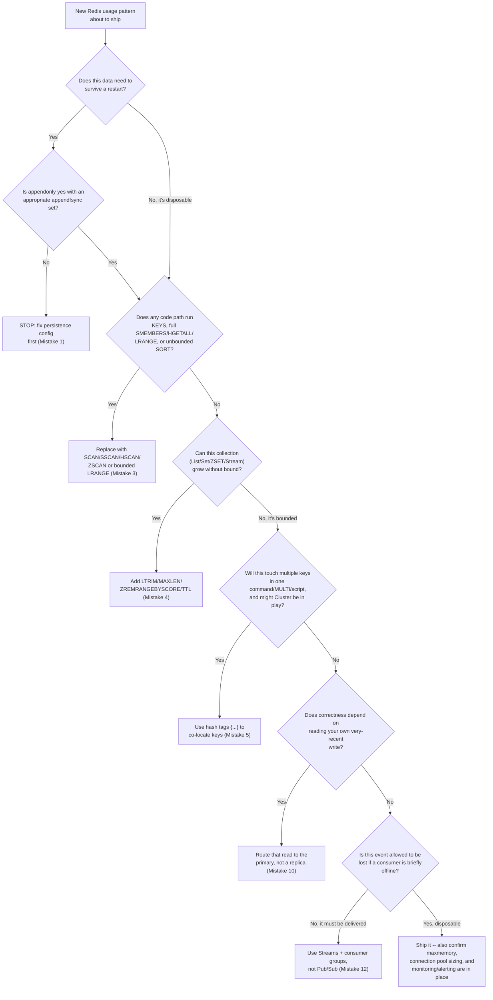

# Chapter 17: Common Mistakes & Pitfalls

Chapter 16 gave you the consolidated checklist of what to do. This chapter is its mirror image: a **failure mode catalog** of what actually goes wrong when Redis runs in anger, told the way a postmortem would tell it — symptom first (what you'd actually see paged for, or notice in a dashboard), then root cause (the architectural reason it happens, tracing back to the internals from Chapters 3, 7, 8, 9, 10, 11, 12, and 15), then the fix (concrete commands and configuration, before/after).

None of what follows is exotic. Every mistake below is one that teams running real production traffic have made — usually more than once, usually by carrying over a mental model from a different kind of system: a relational database's durability guarantees, a generic connection pool's sizing rules, a message queue's delivery guarantees, or simply the assumption that "it's just a cache" means operational sloppiness has no real cost. If Chapter 16 was "here's the map," this chapter is "here's exactly where teams drive off the road, and why the road is shaped that way."

---

## Learning Objectives

By the end of this chapter, you will be able to:

- Diagnose data loss after a Redis restart back to a specific persistence misconfiguration, rather than treating it as a mystery.
- Recognize O(N) commands (`KEYS`, unindexed `SORT`, `SMEMBERS`/`HGETALL`/`LRANGE` on huge collections) as single-threaded blocking hazards, and know their non-blocking replacements.
- Explain why unbounded lists, streams, and sets are a slow-motion outage, and design bounding strategies (`MAXLEN`, `LTRIM`, `ZREMRANGEBYSCORE`, TTLs) before they're needed.
- Recognize `CROSSSLOT` errors, split-brain-prone Sentinel/Cluster topologies, and stale-replica reads as consequences of specific architectural decisions from Chapters 11 and 12, not random flakiness.
- Distinguish Redis's transaction and Pub/Sub delivery guarantees from what a SQL database or a durable message broker promises, and choose the right primitive for each job.
- Treat operational discipline — `maxmemory`, connection pool sizing, backup/restore drills, monitoring — as non-negotiable the moment Redis holds anything you can't regenerate on demand.

---

## Prerequisites

This chapter assumes you've completed Chapters 1 through 16, in particular:

- **Chapter 3 (Architecture & Internals)** — the single-threaded event loop, which is why O(N) commands are dangerous (Mistake 3).
- **Chapter 7 (Persistence: RDB & AOF)** — RDB/AOF durability trade-offs (Mistakes 1, 11).
- **Chapter 8 (Transactions & Lua Scripting)** — `MULTI`/`EXEC`/`WATCH` semantics (Mistake 6).
- **Chapter 9 (Expiration, Eviction & Memory Management)** — `maxmemory` and eviction policies (Mistakes 4, 7).
- **Chapter 10 (Client Libraries & Connection Management)** — connection pooling and pipelining (Mistake 8).
- **Chapter 11 (Replication & High Availability)** and **Chapter 12 (Redis Cluster & Sharding)** — replication lag, Sentinel quorum, hash slots, and hash tags (Mistakes 5, 9, 10).
- **Chapter 14 (Monitoring & Observability)** — the metrics and alerting this chapter's incident scenario leans on to catch problems before they page someone.
- **Chapter 15 (Security)** — authentication, ACLs, and network exposure (Mistake 2 revisits this in postmortem form).
- **Chapter 16 (Best Practices)** — this chapter is the "why" behind nearly every checklist item there.

If any of those feel shaky, this chapter will still make sense on its own, but the fixes land better once you've seen the underlying mechanism taught properly — each mistake below links back to the chapter that covers it in depth.

---

## 1. Using Redis as a Source of Truth Without Understanding the Durability Trade-Offs

**Symptom:** Redis restarts — a routine `redis-server` upgrade, an OOM-kill, a container rescheduled by an orchestrator — and data that the application treated as authoritative (shopping carts, inventory reservations, session state used to reconstruct an order) is simply gone. There's no corruption, no error message. The keys that existed a minute ago just aren't there anymore.

**Root Cause:** Chapter 7 established that Redis's default persistence posture is opt-in, not automatic. A default `redis.conf` with RDB snapshotting on default triggers (`save 3600 1`, `save 300 100`, `save 60 10000`) can lose up to an hour of writes on an unclean shutdown, and a deployment with AOF disabled entirely loses everything since the last RDB snapshot. Teams that start with Redis purely as a cache — where losing data just means the next read recomputes it from the real database — gradually let Redis absorb more responsibility (cart state, rate-limit counters that gate money, deduplication windows, session data with no other copy) without revisiting the persistence configuration to match that new responsibility. The moment Redis quietly becomes a system of record for something, the durability question that Chapter 1 flagged as "a dial you turn deliberately" needs to actually be turned.

**Fix:** Match the persistence configuration to what the data is worth, and know the recovery point objective (RPO) you're accepting:

```
# Before: default RDB-only snapshotting, ~1 hour of possible data loss
save 3600 1
save 300 100
save 60 10000
appendonly no

# After: AOF with a bounded fsync window for data that must survive a crash
appendonly yes
appendfsync everysec        # at most ~1 second of loss, vs. "no" (OS-decided) or "always" (durable but slow)
aof-use-rdb-preamble yes    # faster AOF rewrites/restarts, RDB-compact + AOF-tail hybrid
```

For data that genuinely cannot be lost even for a second (e.g., a payment idempotency key), don't lean on Redis's own persistence alone — write it to the primary database (Postgres/MongoDB) synchronously and use Redis as an accelerator in front of it, not the only copy. The rule of thumb: if you can't answer "what happens to this key if Redis restarts right now, mid-write?" with a specific, acceptable answer, you don't yet know what durability tier this data needs.

---

## 2. The Unauthenticated, Internet-Exposed Redis Instance

**Symptom (an incident postmortem, told straight):** A team spins up Redis on a cloud VM for a "quick prototype," maps port 6379 outward for convenience during development, and moves on. Three weeks later, every key in the instance has been replaced with a single ransom-note string (`"PLEASE READ: your data has been encrypted and backed up..."`), `FLUSHALL` has clearly been run, and the security team's first question — "was this instance ever reachable from the public internet without a password?" — gets answered by a shodan.io search that finds it in under thirty seconds.

**Root cause, reconstructed:** Redis, out of the box, has historically defaulted to no `requirepass`, no ACLs beyond a permissive `default` user, and a `bind` directive that (depending on version and packaging) can end up listening on `0.0.0.0`. Combine that with a cloud security group or Docker `-p 6379:6379` port mapping that exposes the container to the internet, and you have a database with root-equivalent command access — including `CONFIG SET`, which lets an attacker rewrite the RDB save path and write an SSH authorized-keys file or a cron entry directly onto the host filesystem — reachable by anyone who scans the IPv4 space for open port 6379. This exact pattern (unauthenticated Redis → mass `FLUSHALL`/ransom, sometimes escalating to full host compromise via `CONFIG SET dir`/`CONFIG SET dbfilename` plus `SAVE`) has recurred across real internet-wide scanning campaigns for years; it isn't hypothetical, it's one of the most common Redis incidents that actually happens, precisely because "just for the prototype" instances routinely outlive the prototype.

**Fix:** Chapter 15 covered the mechanisms in depth; the incident-prevention checklist distilled from real postmortems is:

```
# redis.conf — minimum bar for anything reachable outside localhost
bind 127.0.0.1 -::1                      # never 0.0.0.0 unless a firewall/VPC boundary already isolates it
protected-mode yes
requirepass "<long-random-secret>"       # or better, ACLs per Chapter 15
rename-command CONFIG ""                 # or restrict via ACL categories instead of renaming blindly
rename-command FLUSHALL ""
rename-command FLUSHDB ""
```

Layer network controls on top — security groups/VPC-only binding, never a raw port mapping to the internet — and treat "can this instance be reached from outside our private network at all" as a question every deployment answers explicitly, prototype included. If an instance is ever compromised this way, the only real recovery is restoring from a known-good backup (Mistake 11) and rotating every credential the compromised host could have touched — there is no "clean it up in place" option once `CONFIG SET`-level access has been in an attacker's hands.

---

## 3. Blocking the Single Thread With Expensive O(N) Commands

**Symptom:** Latency on *every* client — not just the one running the offending command — spikes into the hundreds of milliseconds or seconds for a few moments, then recovers, seemingly at random. `redis-cli --latency-history` shows periodic latency cliffs. The slow log (`SLOWLOG GET`) shows a single command, run rarely, taking an alarmingly long time.

**Root Cause:** Chapter 3 established that Redis executes commands one at a time on a single thread. Most commands are O(1) or O(log N) and finish in microseconds, so this design is invisible in practice — until a command with O(N) or worse complexity runs against a large collection. `KEYS *` scans the entire keyspace; `SMEMBERS`/`HGETALL`/`LRANGE 0 -1` on a set/hash/list with millions of entries builds and serializes the whole thing; `SORT` without a `LIMIT` and `BY`/`GET` hints against a large list does a full in-memory sort. While any of these run, **no other client's command executes** — not reads, not writes, not even a health-check `PING`, because there is nothing else happening on the server until that one command returns.

**Fix:** Replace O(N) full-collection scans with cursor-based, incremental alternatives that never block for more than a tiny bounded slice of work per call:

```
# Before: blocks the entire server for the duration of the scan
KEYS session:*

# After: SCAN walks the keyspace in small cursor-driven batches
SCAN 0 MATCH session:* COUNT 100
# repeat with the returned cursor until it comes back as 0
```

The same substitution applies across data types: `SSCAN`/`HSCAN`/`ZSCAN` in place of `SMEMBERS`/`HGETALL`/`ZRANGE 0 -1` on large collections, and paginated `LRANGE start stop` in bounded chunks instead of `LRANGE 0 -1` on a long list. For `SORT`, add `LIMIT offset count` to cap the work, or precompute the order into a Sorted Set (Chapter 5) so ranking is O(log N) at write time instead of O(N log N) at read time. Chapter 13's guidance to benchmark and watch the slow log is exactly how you catch these before they reach production scale — a command that looks harmless against 500 test rows can single-handedly stall a cluster against 5 million real ones.

---

## 4. Unbounded Key and Collection Growth

**Symptom:** Memory usage on the Redis instance climbs steadily with no plateau, `INFO memory`'s `used_memory` trends upward day over day even though traffic is flat, and eventually either `maxmemory` eviction kicks in unexpectedly (evicting keys nobody intended to be evictable) or the box runs out of RAM. Separately, commands against one specific key — a list, a stream, a set — get slower over time even though nothing about the command itself changed.

**Root Cause:** Several of Redis's native structures have no built-in size cap: `RPUSH`/`LPUSH` will happily grow a List forever, `XADD` will grow a Stream forever, `SADD`/`ZADD` will grow a Set/Sorted Set forever. Nothing in Redis stops an application from writing to `activity:log:user:42` (a List) on every single user action for the lifetime of that user's account, or from adding every event ever seen to a Stream with no retention policy. The structure works fine at first — O(1) or O(log N) per-operation cost doesn't change — but the *key itself* becomes a "big key": more memory than intended, slower full-collection reads (Mistake 3), slower replication of that key on every write, and a single point of memory pressure that eviction policies handle badly (evicting an entire multi-megabyte key to free space is a blunt instrument).

**Fix:** Bound every collection that grows with usage, at write time, as a design decision — not as cleanup after the fact:

```
# Lists: cap length at insert time
LPUSH activity:log:user:42 "viewed:P-1001"
LTRIM activity:log:user:42 0 999          # keep only the most recent 1,000 entries

# Streams: bound with MAXLEN (approximate trimming is cheap; exact is more precise but costlier)
XADD orders:events MAXLEN '~' 100000 '*' order_id 9001 status "placed"

# Sorted sets used as time-windowed data: prune anything past a retention window
ZREMRANGEBYSCORE rate_limit:checkout:user:42 -inf (1751800000

# Sets/hashes that should not outlive a session or a day: give the key a TTL instead of
# trusting application code to remember to clean it up
EXPIRE product:P-1001:visitors 86400
```

The design habit to build: any time you write code that calls `RPUSH`, `LPUSH`, `SADD`, `HSET`, or `XADD` in a loop or on every event, ask "what stops this key from growing forever?" before shipping it, not after `MEMORY USAGE` surprises someone. Chapter 9's eviction policies are a safety net for memory pressure in general — they are not a substitute for bounding structures that should never have been allowed to grow unbounded in the first place.

---

## 5. Treating Redis Cluster Like a Single-Key-Space Store

**Symptom:** An application that worked perfectly against a single Redis instance (or a Sentinel-managed primary/replica pair) starts throwing `CROSSSLOT Keys in request don't hash to the same slot` errors the moment it's pointed at a Redis Cluster — often not during initial testing, but weeks later, the first time a multi-key command runs against two keys that happen to land on different shards.

**Root Cause:** Chapter 12 explained that Redis Cluster partitions the keyspace into 16,384 hash slots, distributed across shards, with a key's slot determined by `CRC16(key) mod 16384` (or the contents inside `{...}` if the key contains a hash tag). Multi-key commands — `MGET`, `MSET`, `SUNIONSTORE`, `ZINTERSTORE`, transactions spanning multiple keys, Lua scripts touching multiple keys — require every key involved to live on the *same* shard, because Cluster has no cross-shard atomic execution. Code written and tested against a non-clustered instance has no reason to fail this way, because every key trivially lives "on the same node" (there's only one). The failure only appears once Cluster is introduced, and it appears exactly on the multi-key operations nobody thought to check, often in production, because that's the first time keys with unrelated names actually land on different shards.

**Fix:** Design multi-key operations around **hash tags** from day one if Redis Cluster is even a future possibility, so related keys are pinned to the same slot deliberately:

```
# Before: keys hash independently, will CROSSSLOT the moment they land on different shards
MGET cart:user:42:items cart:user:42:totals

# After: a hash tag ({user:42}) forces both keys onto the same slot, regardless of cluster size
MGET cart:{user:42}:items cart:{user:42}:totals
```

Apply the same `{...}` convention to any keys that a transaction, Lua script, or multi-key command will ever touch together — cart items and cart totals for the same user, a leaderboard and its metadata Hash, a Set and the counters derived from it. The cost is a slightly less even distribution (all of one user's keys land on one shard, rather than being spread out), which is almost always an acceptable trade for correctness. The deeper defense is process, not just syntax: test against a real (even if small, 3-shard) Cluster topology in CI before shipping anything that uses multi-key commands, rather than discovering `CROSSSLOT` for the first time against production traffic.

---

## 6. Expecting SQL-Style Rollback Semantics From `MULTI`/`EXEC`

**Symptom:** A transaction runs several commands inside `MULTI`/`EXEC`, one of the commands in the middle fails at runtime (e.g., an `INCR` against a key that turns out to hold a non-numeric string), and the developer is surprised to find that the commands *before* and *after* the failing one still executed — nothing was "rolled back."

**Root Cause:** Chapter 8 drew this distinction carefully, and it's worth restating because the intuition from SQL is strong and wrong here. Redis validates commands for *syntax* errors when they're queued inside `MULTI` — an unknown command or wrong argument count aborts the entire transaction before `EXEC` even runs. But **runtime errors** (a type error like `INCR` on a string value, a key that doesn't exist when an operation requires it) are only discovered when each command actually executes during `EXEC`, one after another — and Redis does not stop or roll back the transaction because of it. Every other command in the batch still runs; only the failing command's individual reply is an error. This is a deliberate design choice, not a missing feature: Redis transactions guarantee **isolation** (no other client's commands interleave between your queued commands) and **atomicity of scheduling** (all queued commands run back-to-back, uninterrupted), but never promised all-or-nothing rollback on logic errors the way a SQL `ROLLBACK` does.

**Fix:** Validate types and preconditions *before* queuing, use `WATCH` for optimistic concurrency where the transaction's validity depends on another key's state, and treat each reply in the `EXEC` result array as independently checkable:

```
# Before: assuming a mid-transaction error undoes everything
MULTI
INCR inventory:P-1001          # this key happens to hold "in-stock" (a string) -- runtime error
DECR wallet:user:42
EXEC
# Both commands still ran except the failing one -- DECR wallet:user:42 succeeded regardless

# After: check preconditions before MULTI, and inspect every reply after EXEC
TYPE inventory:P-1001                              # confirm it's actually a numeric counter first
MULTI
INCR inventory:P-1001
DECR wallet:user:42
EXEC
# --> [ (error) ERR value is not an integer, (integer) 41 ]
# Application code must check each element of the reply array and compensate/retry as needed
```

For genuinely atomic, all-or-nothing multi-step logic with real branching (e.g., "only deduct wallet balance if inventory is available"), reach for a **Lua script** (`EVAL`/`EVALSHA`, or Redis Functions) instead of a bare transaction — a script runs as one atomic unit server-side and can check conditions and abort *before* making any writes, which is the closer analog to what most developers actually want when they reach for `MULTI`/`EXEC`.

---

## 7. No `maxmemory` Configured

**Symptom:** Redis's process is killed abruptly by the Linux OOM killer (visible in `dmesg`/`journalctl` as `Out of memory: Killed process <pid> (redis-server)`), with no Redis-level warning, no graceful degradation, and — if persistence wasn't configured carefully (Mistake 1) — a chunk of unsaved data lost in the process. The application sees Redis simply vanish and reconnect logic (Chapter 10) scrambles to reconnect to a cold instance.

**Root Cause:** By default, Redis's `maxmemory` is `0`, meaning "no limit" — Redis will keep allocating memory for new keys until the underlying host truly runs out. On a shared host or a container with a memory limit set at the orchestration layer (a Kubernetes `resources.limits.memory`, a Docker `--memory` flag) but no matching `maxmemory` set *inside* Redis, the OS or container runtime's OOM killer — not Redis's own eviction logic — is what ultimately intervenes, and it does so with a hard `SIGKILL`, not a graceful "reject new writes" or "evict some keys" response. Redis never got the chance to protect itself, because it was never told what its ceiling was.

**Fix:** Always set `maxmemory` below the container/host's hard memory limit, with headroom for non-dataset overhead (client buffers, replication backlogs, Lua script memory, fork-based RDB/AOF rewrite overhead which briefly needs up to ~2x resident memory in the worst case), and pick an eviction policy that matches the workload:

```
# redis.conf
maxmemory 3gb                       # comfortably under a 4gb container memory limit
maxmemory-policy allkeys-lru        # or volatile-lru/volatile-ttl if only some keys should be evictable
```

`maxmemory-policy noeviction` (the default once `maxmemory` is set but no policy is chosen) makes Redis reject writes with an `OOM command not allowed` error instead of evicting anything — the right choice when every key must survive, paired with alerting (Chapter 14) that fires well before that ceiling is hit, since "writes start failing" is not a graceful failure mode either. The core discipline: **`maxmemory` is not optional the moment Redis runs anywhere with a finite memory ceiling** — which is to say, everywhere.

---

## 8. Connection Pool Misconfiguration

**Symptom (too small):** Under load, application requests start queueing waiting for a Redis connection to free up, request latency climbs even though Redis's own `INFO commandstats` shows fast per-command execution, and client-side timeouts fire even though the server was never actually slow. **Symptom (too large):** `redis-cli INFO clients` shows `connected_clients` approaching `maxclients`, new connection attempts start failing with `ERR max number of clients reached`, and — because each connection carries its own output buffer — overall memory usage climbs from connection overhead alone, unrelated to the dataset.

**Root Cause:** Chapter 10 covered connection pooling as the mechanism that lets an application reuse a bounded set of TCP connections instead of opening one per request (expensive: TCP handshake, and for TLS, a full handshake, per request). A pool sized too small under-provisions concurrency — if the pool has 10 connections and 50 requests want to talk to Redis simultaneously, 40 of them wait in a queue regardless of how fast Redis itself responds, and that queueing latency is easy to misdiagnose as "Redis is slow" when Redis is actually idle. A pool sized too large, especially when multiplied across many application instances/pods that each maintain their own pool, can collectively approach or exceed Redis's `maxclients` (default 10,000, but often set lower deliberately), starving out other legitimate clients or exhausting server-side memory in per-client buffers.

**Fix:** Size the pool to genuine concurrent demand, not a guessed round number, and multiply by the number of application instances when reasoning about the aggregate against `maxclients`:

```
# Example (Python, redis-py) -- size to measured concurrency, not a guess
import redis
pool = redis.ConnectionPool(
    host="redis.internal", port=6379,
    max_connections=50,          # matches measured peak concurrent in-flight Redis calls per instance
    socket_timeout=2,
    socket_connect_timeout=1,
)
```

```
# redis.conf -- set an explicit ceiling and monitor headroom, don't rely on the default silently
maxclients 10000
```

Watch `connected_clients` and `blocked_clients` in `INFO clients` (Chapter 14) over time, size pools from measured peak concurrency (not from copying a number off a blog post), and remember that `maxclients` is a *cluster-wide* budget that every application instance's pool draws from — twenty pods with a pool of 50 each is 1,000 connections before a single request from a twenty-first pod is considered.

---

## 9. Sentinel/Cluster Quorum Misconfiguration

**Symptom:** A primary node fails, and instead of a clean, fast failover, the deployment either fails to fail over at all (clients keep being told the dead node is still the primary), or — worse — two different Sentinel groups or Cluster partitions each independently believe *they* have promoted the correct new primary, and the application ends up writing to both, with no correct answer for which set of writes is authoritative once the network partition heals.

**Root Cause:** Chapter 11 covered Sentinel's quorum mechanism: a failover is only agreed upon once a **majority** of Sentinels (not just `quorum`, which only defines "how many must agree the primary is down" — the actual failover requires a majority of the total Sentinel fleet to elect a leader Sentinel) can talk to each other and agree. Deploying an **even number** of Sentinels (commonly 2, or 4) creates a real risk that a network partition splits them into two equal halves, neither of which is a majority — so *neither* half can elect a failover leader, and the system sits in a degraded, undecided state exactly when it needs to act fastest. The same shape of problem applies to Redis Cluster: too few nodes, or a topology where a single network partition can isolate exactly half the masters, leaves the cluster unable to reach the majority agreement it needs to safely continue serving writes for the affected slots.

**Fix:** Always run an **odd number** of Sentinels (3 as a practical minimum, 5 for larger deployments), spread across failure domains (availability zones) so a single AZ outage can't take out a majority, and size Cluster's node count and layout the same way:

```
# sentinel.conf -- 3 Sentinels minimum, one per availability zone
sentinel monitor mymaster 10.0.1.10 6379 2   # quorum=2 out of 3 Sentinels to declare primary down
```

```
# Cluster: at least 3 masters (for meaningful slot distribution) each with at least
# one replica, spread so no single AZ holds a majority of masters
```

The underlying principle, shared with every quorum-based distributed system (etcd, ZooKeeper, Raft-based systems generally): **an even split can never produce a majority**, so an even number of voting members is a structural bug waiting for the right partition to expose it, not a cost-saving simplification. Test failover deliberately — kill the primary in a staging environment and time how long clients take to recover — rather than assuming quorum math works until the first real outage proves otherwise.

---

## 10. Ignoring Replication Lag When Reading From Replicas

**Symptom:** A user completes an action that writes to Redis (places an order, updates a profile, redeems a coupon), the application immediately reads that same data back to confirm or display it, and — intermittently, under load — the read comes back showing the *old* value, as if the write never happened, even though `INFO` on the primary clearly shows the write succeeded.

**Root Cause:** Chapter 11 covered Redis replication as **asynchronous** by default: a primary acknowledges a write to the client as soon as it's applied locally, then propagates it to replicas over the replication link without waiting for them to catch up. Under normal conditions replication lag is a few milliseconds and invisible. Under load — a large write, a replica doing its own background RDB save, network congestion, or a replica that's simply behind on the replication backlog — lag can grow to hundreds of milliseconds or more. An application that read-your-own-writes by routing reads to a replica (for read scaling, per Chapter 11) has no guarantee that a replica it happens to hit has caught up to a write that just landed on the primary a moment ago.

**Fix:** Route reads that require read-your-own-writes freshness to the **primary**, and reserve replica reads for genuinely tolerant use cases (analytics, dashboards, "eventually consistent is fine" lookups):

```
# Before: all reads load-balanced across primary + replicas, including the read
# immediately following this user's own write
SET cart:user:42:coupon "SAVE20"      # written to primary
GET cart:user:42:coupon               # routed to a replica by the client's read policy -- may be stale
```

```
# After: reads that must reflect this session's own recent writes are pinned to the primary;
# only reads with no freshness requirement are allowed to hit replicas
SET cart:user:42:coupon "SAVE20"      # primary
GET cart:user:42:coupon               # explicitly routed to primary, not the replica pool
```

Where the client library supports it, use `WAIT numreplicas timeout` after a critical write to block until a given number of replicas have acknowledged it — trading a little latency for a real freshness guarantee before proceeding — rather than hoping replication happened to keep up. Monitor `master_repl_offset` vs. each replica's `slave_repl_offset` (Chapter 14) so lag is a visible, alertable number, not something only noticed when a customer complains their own action "didn't save."

---

## 11. Not Testing Backup/Restore Until a Real Disaster

**Symptom:** A serious incident forces a restore from backup — a corrupted AOF file, a botched `FLUSHALL`, a compromised instance (Mistake 2) — and the team discovers, live, during the incident, that the RDB backups being dutifully copied to off-host storage every night are truncated, from the wrong instance, encrypted with a key nobody still has, or simply that nobody has ever actually run the restore procedure end-to-end before.

**Root Cause:** Backup jobs are easy to set up, easy to leave running unattended for years, and easy to silently start failing (a disk fills up, a cron job's environment changes, a cloud storage bucket's permissions get tightened) without anyone noticing — because the failure mode of a broken backup job is *silence*, not an error that pages anyone, right up until the moment someone actually needs the backup and it isn't there or isn't usable. "We take backups" and "we can restore from our backups" are different claims, and only the second one matters during an incident.

**Fix:** Treat restore as the thing you actually test, on a schedule, not the backup job itself:

```bash
# A restore drill, run periodically (e.g., monthly) against a scratch instance --
# not production -- to prove the whole pipeline actually works end to end
cp /backups/redis/dump-2026-07-05.rdb /scratch-redis/dump.rdb
redis-server /etc/redis/scratch.conf --dbfilename dump.rdb --dir /scratch-redis
redis-cli -p 6390 DBSIZE                 # sanity check: expected key count, roughly
redis-cli -p 6390 GET known:canary:key   # sanity check: a specific known value is correct
```

Verify, on that schedule: the backup file is recent, non-empty, and restorable in isolation; the restore completes within a time you'd actually tolerate during a real incident (a multi-hour restore for a business that can't be down for multi-hour is a discovery you want to make in a drill, not during the outage); and the people who'd actually run the restore during an incident have done it before, in this exact form, at least once. Combine RDB snapshots (fast, compact, point-in-time) with AOF (finer-grained recovery point) per Chapter 7's hybrid guidance, and store copies off-host — a backup that lives only on the same disk as the data it's backing up survives none of the disasters that actually matter.

---

## 12. Over-Relying on Pub/Sub for Critical Events

**Symptom:** An event published via `PUBLISH` — an order-status change, a cache-invalidation signal, a notification — is simply never received by a subscriber that should have gotten it, with no error anywhere in the stack. The problem is worse under exactly the conditions you'd most want reliability: a subscriber restart, a brief network blip, a subscriber that was momentarily slow to read.

**Root Cause:** Chapter 6 introduced Redis Pub/Sub as **fire-and-forget**: `PUBLISH` delivers a message to every client currently subscribed to the channel at that exact moment, and to no one else. There is no persistence, no queue, no replay. A subscriber that connects a second after the message was published never sees it. A subscriber that briefly disconnects (a deploy, a network hiccup, a client library reconnect) misses everything published during the gap, permanently — there is no backlog to catch up on, because Pub/Sub was never designed to have one. This is precisely the trade Redis's own documentation flags: Pub/Sub is for ephemeral broadcast, not for anything where "the message must eventually be delivered, even if the subscriber wasn't listening at the exact instant it was sent" is a requirement.

**Fix:** For events that must not be lost, use **Redis Streams** (Chapter 6) with consumer groups instead of Pub/Sub — Streams persist messages, track per-consumer-group delivery position, support acknowledgment (`XACK`), and let a consumer that was offline catch up on everything it missed:

```
# Before: a critical "order placed" event, fire-and-forget
PUBLISH orders:events '{"order_id": 9001, "status": "placed"}'
# Any consumer offline at the moment of PUBLISH never sees this event -- no replay, no error

# After: a Stream with a consumer group -- durable, replayable, acknowledgeable
XADD orders:events '*' order_id 9001 status "placed"
XREADGROUP GROUP fulfillment consumer-1 COUNT 10 STREAMS orders:events '>'
# ... process the order ...
XACK orders:events fulfillment <message-id>
```

A newly (re)started consumer can `XREADGROUP` from where the group last left off — including messages published while it was down — which is the entire class of guarantee Pub/Sub cannot offer by design. Reserve Pub/Sub for genuinely disposable signals (a live "someone is typing" indicator, a cache-invalidation ping where a missed message just means slightly staler data until the next natural refresh) where losing an occasional message has no lasting consequence.

---

## Pre-Flight Checklist: Before You Ship This Redis Usage Pattern

Before a new Redis-backed feature goes to production, run it through this checklist. Each branch maps back to one of the mistakes above.



---

## Real-World Scenario

**Setup:** QuickCart runs its "24-Hour Flash Sale" — historically its highest-traffic day of the year — and has, for the past two sales, relied on `leaderboard:daily` (Chapter 5's gamification Sorted Set) to power a live "top shoppers win extra discount codes" widget on the homepage. This year, traffic is nearly triple the previous record.

**Timeline:**

- **09:58** — The sale opens. Traffic ramps immediately; `leaderboard:daily` starts accumulating an entry for every logged-in and guest session that earns any points (views, adds-to-cart, purchases, referral clicks) — a much broader scoring event set than previous years, added by a well-meaning growth-team change two days earlier that nobody flagged as a capacity question.
- **11:15** — `INFO memory` on the primary shows `used_memory` climbing steadily, well past its usual flash-sale baseline. `leaderboard:daily`'s `ZCARD` has passed 40 million members — guest sessions, most of which will never be looked up individually again, are being added to the same unbounded Sorted Set as real, meaningful shopper scores.
- **11:22** — An on-call engineer, trying to eyeball how bad the leaderboard has gotten, runs an internal admin script that includes `KEYS leaderboard:*` to enumerate leaderboard-related keys for a quick manual check — a script that has "always worked fine" against the much smaller pre-sale dataset, run without a second thought.
- **11:22:03** — For the several seconds `KEYS leaderboard:*` takes to scan the now-enormous keyspace, **every other client is blocked**: checkout API calls time out, session reads stall, add-to-cart requests queue up. The site-wide p99 latency graph (Chapter 14's dashboard) spikes from ~5ms to over 4 seconds. Alerting fires: `redis_command_latency_p99` and `redis_blocked_clients` both breach their thresholds simultaneously.
- **11:23** — The `KEYS` call finishes, latency recovers — but the underlying pressure (a 40-million-member unbounded Sorted Set, still growing) hasn't gone anywhere. Ordinary `ZINCRBY`/`ZADD` traffic against `leaderboard:daily` is now measurably slower than baseline too, because the key's sheer size makes even normal skip-list operations (Chapter 5) more expensive, and the key's replication to the replica (used for the read-only "your rank" widget) is falling behind, adding replication lag on top of everything else.
- **11:31** — A second, smaller latency spike occurs — a different engineer, unaware of the first incident nine minutes earlier, runs the *same* `KEYS` pattern from a different admin tool, reproducing the exact same blocking event.

**Root Cause Analysis:**

1. **Unbounded growth (Mistake 4).** `leaderboard:daily` was designed for "shoppers who earn meaningful points," but a scope change silently redefined "meaningful" to include nearly every guest interaction, with no cap, no expiration of low-value entries, and no review of what that would do to the key's size under flash-sale-scale traffic.
2. **A blocking O(N) command in a routine admin tool (Mistake 3).** `KEYS` had been "fine" for years because nobody had ever run it against a keyspace this large. The command was never audited or removed because it never had a visible cost — until the one day traffic and key size both peaked simultaneously.
3. **A monitoring gap that let the underlying growth go unnoticed.** `ZCARD leaderboard:daily` and `used_memory` growth were both visible in `INFO`, but no alert existed for "a specific known key is growing unbounded" — only generic memory-pressure alerts, which hadn't yet crossed their threshold when the `KEYS` call turned a slow-building problem into an acute one.

**The Fix:**

- **Bound the structure.** `leaderboard:daily` was redesigned to only track scoring events above a minimum point threshold (filtering out low-value guest noise at write time), combined with a nightly job that archives and clears it (the `RENAME`-and-reset pattern from Chapter 5's real-world scenario) instead of letting a single day's key grow across the entire sale window unchecked.
- **Remove `KEYS` from every operational script, permanently.** The admin tooling was audited, and every `KEYS` call was replaced with `SCAN ... MATCH ... COUNT 100`, which returns the same logical result incrementally without ever blocking the server for more than a fraction of a millisecond per call:

  ```
  SCAN 0 MATCH leaderboard:* COUNT 100
  # repeat with each returned cursor until it's 0 again
  ```

- **Add monitoring and alerting specifically for known hot keys (Chapter 14).** A scheduled job now runs `MEMORY USAGE leaderboard:daily` and `ZCARD leaderboard:daily` on an interval, alerting if either crosses a threshold well before it becomes a "blocks the whole server" problem — catching the *cause* (unbounded growth) rather than only the *symptom* (a latency spike after someone runs a blocking command against it).
- **Add a `SLOWLOG`-based alert.** `SLOWLOG GET` entries above a configured threshold now feed directly into the on-call alerting pipeline, so the next time any command — not just a known-bad one like `KEYS` — takes unexpectedly long against production data, it's caught automatically rather than discovered by a second engineer independently reproducing the same incident nine minutes later.

**Outcome:** The latency incident itself resolved within seconds each time (once `KEYS` finished), but the underlying capacity risk — an unbounded key growing toward a size where *any* full-collection operation against it would eventually become expensive — was the real problem, and it would have recurred, worse, at the next sale had the root cause not been fixed rather than just the visible symptom.

---

## Best Practices

This chapter's fixes are the "why"; Chapter 16 has the full, consolidated professional checklist. The highlights most relevant to the mistakes above:

- Set `maxmemory` and an eviction policy on every deployment, without exception.
- Never run `KEYS`, unbounded `SMEMBERS`/`HGETALL`/`LRANGE`, or unbounded `SORT` against production data — reach for `SCAN` and its type-specific variants by default.
- Bound every List, Set, Sorted Set, and Stream that grows with usage at write time, not as post-hoc cleanup.
- Use hash tags for any multi-key operation the moment Redis Cluster is even a plausible future.
- Run an odd number of Sentinels (or a properly sized Cluster) across failure domains, and actually test failover.
- Test backup restore on a schedule, not just backup creation.
- Reserve Pub/Sub for disposable signals; use Streams with consumer groups for anything that must be delivered.

---

## Common Mistakes

- **Treating Redis's durability as an afterthought** once it's quietly become a system of record for something that matters (Mistake 1).
- **Leaving an instance unauthenticated and internet-reachable**, the single most common real-world Redis security incident (Mistake 2).
- **Running `KEYS`, unbounded full-collection reads, or unbounded `SORT`** against production-sized data, blocking every other client for the duration (Mistake 3).
- **Letting a List, Set, Sorted Set, or Stream grow without a bound**, turning a fine design into a slow-motion memory and latency problem (Mistake 4).
- **Assuming Redis Cluster is a single key-space**, and discovering `CROSSSLOT` errors on multi-key commands only after they're already in production (Mistake 5).
- **Expecting `MULTI`/`EXEC` to roll back on a runtime error**, the way a SQL transaction would (Mistake 6).
- **Running with no `maxmemory` configured**, leaving the OS OOM killer as the only thing standing between Redis and an ungraceful death (Mistake 7).
- **Sizing a connection pool by guesswork** instead of measured concurrency, in either direction (Mistake 8).
- **Deploying an even number of Sentinels, or too few Cluster nodes**, creating a quorum split that can prevent or double up a failover (Mistake 9).
- **Reading from a replica for anything that needs to reflect a just-completed write**, without accounting for asynchronous replication lag (Mistake 10).
- **Never testing backup restore until an actual disaster forces it**, and discovering the backup pipeline was broken all along (Mistake 11).
- **Relying on Pub/Sub for events that must not be lost**, when Streams with consumer groups exist for exactly that requirement (Mistake 12).
- **The meta-mistake: not treating Redis's operational discipline as seriously as a primary datastore's**, because "it's just a cache" — even in deployments where it has long since become the system of record for carts, sessions, rate limits, or leaderboards that the business genuinely depends on. Every mistake above is, at root, a consequence of this one: a team applies less rigor to Redis's persistence config, security posture, capacity planning, and backup drills than they would to their primary database, precisely because of a label ("cache") that stopped being accurate long before anyone updated the operational checklist to match.

---

## Summary

- Most Redis production incidents trace back to carrying over a mental model from a different kind of system — SQL transaction semantics, a durable message broker's delivery guarantees, or a general-purpose connection pool's sizing rules — into a place where Redis's actual design (single-threaded execution, asynchronous replication, opt-in persistence, fire-and-forget Pub/Sub) behaves differently, often without an error to flag it.
- Availability-shaped mistakes (no `maxmemory`, unbounded collections, blocking O(N) commands, quorum misconfiguration) tend to build quietly and then fail suddenly, exactly when load is highest — which is why monitoring and alerting (Chapter 14) on the leading indicators, not just the failure itself, matters as much as the fix.
- Correctness-shaped mistakes (`CROSSSLOT`, transaction rollback assumptions, stale replica reads, lost Pub/Sub messages) are the most dangerous class in a different way: they don't always error loudly, and can produce plausible-looking wrong behavior that goes unnoticed far longer than an outage would.
- A security-shaped mistake (unauthenticated public exposure) remains one of the most common real-world Redis incidents, and has nothing to do with Redis's internals and everything to do with deployment discipline.
- The meta-mistake underlying all of them is treating "it's just a cache" as a reason to skip the operational rigor that Redis's actual role in the system — often a system of record in every way that matters — has long since earned.
- `SLOWLOG`, `INFO` (memory, clients, replication sections), and a disciplined backup-restore drill schedule are your primary tools for catching these before they become an incident, not after.

---

## Knowledge Check

1. Your team's Redis instance restarts after a routine maintenance window and several minutes of recent cart data is missing, even though `appendonly` was set to `yes`. What specific setting should you check next, and why?
2. You observe a periodic latency spike affecting *every* client, not just one, lasting a few seconds at a time, correlated with an internal admin script running on a schedule. What's the most likely command involved, and what's the fix?
3. A Sorted Set that started at a few thousand members two years ago is now tens of millions of members, and ordinary `ZADD` calls against it have gotten noticeably slower. What's the underlying mistake, and what would you have done differently at design time?
4. Your application worked fine in staging against a single Redis instance, but throws `CROSSSLOT` errors in production against a Redis Cluster. What's the fix, and why didn't staging catch it?
5. A `MULTI`/`EXEC` block has one command fail with a type error in the middle. A teammate insists "the whole transaction should have rolled back." What do you tell them, and what should they use instead if true rollback-on-error is the actual requirement?
6. `dmesg` shows the Linux OOM killer terminated `redis-server` with no warning from Redis itself. What configuration was almost certainly missing, and what should it have been set to?
7. You have 3 Sentinels for high availability, and a network partition takes one down. Failover still works. A colleague suggests going down to 2 Sentinels "to save cost" since 2-out-of-2 still sounds like enough for quorum. What's wrong with that reasoning?
8. A "your order shipped" notification, published via `PUBLISH`, was never received by a subscriber that had briefly restarted moments before the publish. Is this a bug in Redis? What should this notification have used instead?

---

## Hands-On Exercise

Reproduce Mistake 3 (a blocking `KEYS` call) locally against a dataset large enough to make the effect observable, then apply the `SCAN` fix and re-measure.

**Part 1 — Build a large local dataset:**

```bash
# Generate ~500,000 keys quickly using redis-cli's pipe mode
redis-cli FLUSHALL
for i in $(seq 1 500000); do echo "SET session:$i \"user-data-$i\""; done | redis-cli --pipe
redis-cli DBSIZE
# (integer) 500000
```

**Part 2 — Simulate concurrent load and observe the blocking effect:**

1. In one terminal, start a continuous latency probe against the instance:

   ```bash
   redis-cli --latency-history -i 1
   ```

2. In a second terminal, start a background loop simulating ordinary application traffic:

   ```bash
   while true; do redis-cli SET heartbeat:check "$(date +%s)" > /dev/null; sleep 0.05; done
   ```

3. In a third terminal, run the offending command and note how long it takes, and watch what happens to the latency probe in terminal one **during** the call:

   ```bash
   time redis-cli KEYS "session:*" > /dev/null
   ```

   Observe: the latency probe in terminal one should show a visible spike (potentially into the hundreds of milliseconds, scaling with dataset size and hardware) for the exact duration `KEYS` is running — every other client, including your own heartbeat loop, stalls until it returns.

**Part 3 — Apply the fix and re-measure:**

1. Replace the blocking call with a `SCAN` loop (most client libraries wrap this into a single iterator call; here it's shown as raw `redis-cli` calls to make the cursor mechanics visible):

   ```bash
   time (
     cursor=0
     count=0
     while :; do
       result=$(redis-cli SCAN "$cursor" MATCH "session:*" COUNT 1000)
       cursor=$(echo "$result" | head -1)
       matched=$(echo "$result" | tail -n +2 | wc -l)
       count=$((count + matched))
       [ "$cursor" = "0" ] && break
     done
     echo "Matched: $count"
   )
   ```

2. Watch the latency probe from terminal one again during this run: it should stay flat and near-baseline throughout, because each individual `SCAN` call only does a small, bounded amount of work per round trip, letting your heartbeat loop's commands interleave normally between `SCAN` calls.

3. Compare the two `time` outputs and the two latency-probe behaviors side by side. The total wall-clock time for the `SCAN`-based approach may be similar or even slightly longer than `KEYS` — the point isn't that `SCAN` is faster in isolation, it's that `SCAN` never denies *other clients* service while it runs, which is the property that actually matters in production.

---

## Further Reading

- [Redis Docs — `KEYS`](https://redis.io/docs/latest/commands/keys/) — the official warning against production use, and the `SCAN` cross-reference, behind Mistake 3.
- [Redis Docs — `SCAN`](https://redis.io/docs/latest/commands/scan/) — cursor semantics and guarantees, the fix for Mistake 3.
- [Redis Docs — Persistence](https://redis.io/docs/latest/operate/oss_and_stack/management/persistence/) — RDB/AOF mechanics behind Mistakes 1 and 11.
- [Redis Docs — Transactions](https://redis.io/docs/latest/develop/interact/transactions/) — the exact runtime-error-vs-rollback semantics behind Mistake 6.
- [Redis Docs — Cluster Specification](https://redis.io/docs/latest/operate/oss_and_stack/reference/cluster-spec/) — hash slots and hash tags behind Mistake 5.
- [Redis Docs — Sentinel](https://redis.io/docs/latest/operate/oss_and_stack/management/sentinel/) — quorum and failover mechanics behind Mistake 9.
- [Redis Docs — Replication](https://redis.io/docs/latest/operate/oss_and_stack/management/replication/) — asynchronous replication and `WAIT`, behind Mistake 10.
- [Redis Docs — Security](https://redis.io/docs/latest/operate/oss_and_stack/management/security/) — authentication and network hardening behind Mistake 2.
- [Redis Docs — Pub/Sub](https://redis.io/docs/latest/develop/interact/pubsub/) and [Redis Docs — Streams](https://redis.io/docs/latest/develop/data-types/streams/) — the delivery-guarantee contrast behind Mistake 12.

---

<div style="display:flex;justify-content:space-between;align-items:center;">
  <a href="./16-best-practices.md">← Previous: Best Practices</a>
  <a href="./00-index.md">🏠 Index</a>
  <a href="./18-tools-and-ecosystem.md">Next: Tools & Ecosystem →</a>
</div>
