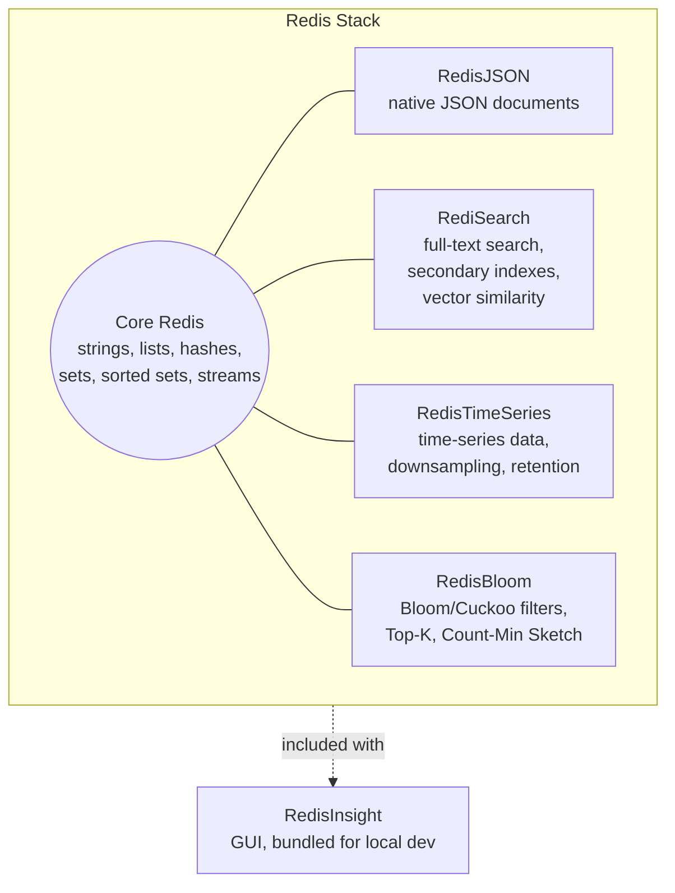

# Chapter 18: Tools & Ecosystem

Chapters 1–15 taught you Redis the server: the data types, the durability model, replication and clustering, and how to tune, monitor, and secure a deployment. Chapters 16 and 17 consolidated that into a professional checklist and a list of failure modes to avoid. This chapter widens the lens one more time. Redis today is not just a single binary with a handful of data types — it's a GUI (RedisInsight), a family of server-side modules that add entirely new data models (JSON documents, full-text search, time series, probabilistic structures), a bundled distribution that ships all of them together (Redis Stack), and a spectrum of managed offerings from Redis itself and every major cloud provider. Knowing this ecosystem exists — and knowing when reaching for a module beats reinventing its behavior in application code — is what separates "I know Redis commands" from "I can architect a Redis-backed system."

---

## Learning Objectives

By the end of this chapter, you will be able to:

- Navigate RedisInsight's key browser, CLI, Workbench, Profiler, and memory analysis views, and use it to inspect cluster/replication topology and the slow log.
- Use `redis-cli`'s bulk-loading and inspection features (`--pipe`, `--scan`, `--csv`, `--rdb`, `--cluster`) beyond the basic interactive REPL covered in earlier chapters.
- Explain what RedisJSON, RediSearch, RedisTimeSeries, and RedisBloom each add to Redis, and choose the right one (or none) for a given problem.
- Describe Redis Stack as a bundled distribution and contrast it with plain open-source Redis.
- Compare managed Redis offerings (Redis Cloud, AWS ElastiCache, Azure Cache for Redis, Google Cloud Memorystore) on module support, operational control, and what you trade away for convenience.
- Recall how `redis-benchmark`, `redis_exporter`, and Kubernetes Operators fit into the broader operational toolchain around a production Redis deployment.

---

## Prerequisites

This chapter assumes you've completed Chapters 1–15, in particular:

- **Chapter 2** (Core Concepts) and **Chapter 4** (Strings, Lists & Hashes) — the keyspace model, and specifically the string-holding-serialized-JSON vs. hash trade-off from Chapter 4, Section 6, which this chapter's RedisJSON section directly builds on and extends.
- **Chapter 5** (Sets, Sorted Sets & Bitmaps) — HyperLogLog, the approximate cardinality structure this chapter contrasts against RedisBloom's Bloom filters, Cuckoo filters, Top-K, and Count-Min Sketch.
- **Chapter 7** (Persistence) — RDB snapshot mechanics, since `redis-cli --rdb` and RDB inspection in this chapter assume you already know what an RDB file represents.
- **Chapter 11–12** (Replication & Cluster) — leader-replica topology and hash slots, since RedisInsight's topology view and `redis-cli --cluster` subcommands visualize and manage exactly those concepts.
- **Chapter 13–14** (Performance Tuning & Monitoring) — `redis-benchmark`, the slow log, and `redis_exporter`/Prometheus, which this chapter recaps briefly rather than re-teaches.
- **Chapter 15** (Security) — ACLs and TLS, relevant when evaluating what a managed offering does or doesn't let you control.

If any of those feel shaky, a quick pass back through the relevant chapter will make this one land better — this chapter surveys breadth rather than re-deriving depth you should already have.

---

## 1. RedisInsight in Depth

Chapter 14 introduced RedisInsight as a monitoring option alongside `INFO` and Prometheus/Grafana. It deserves a closer look here as the **official, free GUI** for Redis — the tool most engineers reach for first when exploring a new dataset or diagnosing a live issue, precisely because it turns several CLI-only workflows into visual ones.

### 1.1 Key browser

The key browser lets you navigate the keyspace visually: filter by pattern (`product:*`, `order:1042:*`), see each key's type, TTL, and memory footprint at a glance, and drill into a value's structure — a hash's fields, a sorted set's members and scores, a stream's entries — without hand-composing `HGETALL`/`ZRANGE`/`XRANGE` calls. For QuickCart's `product:{sku}` hashes (Chapter 4), this is the fastest way to eyeball whether a specific SKU's `stock` field looks right after a suspicious order.

### 1.2 Built-in CLI and Workbench

RedisInsight embeds a full `redis-cli`-equivalent terminal in the browser, so you never need to shell out separately just to run one more command while looking at a key. The **Workbench** goes further: it's a multi-line, syntax-highlighted command editor with autocomplete and inline documentation, closer to a SQL IDE than a REPL — useful for composing a multi-step Lua script (Chapter 8) or a multi-argument `FT.CREATE` (Section 4) without fighting a single-line prompt.

### 1.3 Profiler

The **Profiler** tab streams every command hitting the server in real time, similar to `MONITOR` (Chapter 14) but rendered as a readable, filterable, timestamped feed rather than raw text scrolling past. It's the fastest way to answer "what is this misbehaving client actually sending?" during a live incident, without the production risk of leaving a raw `MONITOR` session attached under real load for too long.

### 1.4 Memory analysis

RedisInsight can generate a memory analysis report — a breakdown of memory usage by key pattern and data type, surfacing which key families are consuming the most RAM. This is the GUI equivalent of the `MEMORY USAGE` and `--bigkeys` techniques from Chapter 13, but aggregated and visualized, which matters when a memory budget problem spans thousands of key patterns rather than one obvious offender.

### 1.5 Cluster and replication topology view

For a Cluster (Chapter 12) or a replicated deployment (Chapter 11), RedisInsight renders the topology graphically: primaries, replicas, hash slot ranges, and node health, updated live. Spotting a single under-replicated shard or a slot migration stuck mid-flight is far faster as a diagram than as `CLUSTER NODES` text output — though `CLUSTER NODES` remains the ground truth worth knowing when scripting around topology changes.

### 1.6 Slow log viewer

RedisInsight surfaces the slow log (Chapter 13) as a sortable, filterable table — command, duration, timestamp, client — instead of raw `SLOWLOG GET` output. For a team that doesn't live in the CLI daily, this is often the entry point that gets slow-command investigation actually adopted, rather than left as a command only the one Redis-fluent engineer remembers to run.

---

## 2. `redis-cli` Power Features Recap and Extras

Chapters 2, 13, and 14 used `redis-cli` for basic interaction, benchmarking, and `MONITOR`. A few additional flags turn it into a genuine bulk-operations and inspection tool worth knowing before reaching for a custom script.

### 2.1 `--cluster` subcommands

`redis-cli --cluster` bundles the cluster administration commands introduced conceptually in Chapter 12 into a single entry point:

```bash
# Create a new 3-primary, 1-replica-per-primary cluster from six running nodes
redis-cli --cluster create \
  10.0.0.1:6379 10.0.0.2:6379 10.0.0.3:6379 \
  10.0.0.4:6379 10.0.0.5:6379 10.0.0.6:6379 \
  --cluster-replicas 1

# Check cluster health and slot coverage from any node
redis-cli --cluster check 10.0.0.1:6379

# Rebalance slots across primaries after adding a new node
redis-cli --cluster rebalance 10.0.0.1:6379
```

These subcommands are what actually executes the reshard/rebalance operations Chapter 12 described at the concept level — worth revisiting now that the mechanics are familiar.

### 2.2 `--scan` for safe key iteration

`--scan` wraps the `SCAN` cursor pattern (the non-blocking alternative to `KEYS *` from Chapter 2) into a single CLI invocation, useful for quick ad hoc audits:

```bash
redis-cli --scan --pattern 'session:*' | wc -l
```

### 2.3 `--csv` for spreadsheet-friendly output

`--csv` formats command output as comma-separated values instead of Redis's default reply format, handy for piping a `HGETALL` or `ZRANGE` result into a spreadsheet or another tool that expects CSV:

```bash
redis-cli --csv HGETALL product:SKU-1001
```

### 2.4 `--pipe` for bulk loading

`--pipe` streams a file of raw Redis protocol commands directly into the server using pipelining (Chapter 10), bypassing the request-response round trip per command entirely. It is dramatically faster than issuing the same commands one at a time — the standard way to bulk-load millions of keys:

```bash
# Generate protocol-formatted commands, then pipe them straight in
redis-cli --pipe < quickcart_seed_data.resp
```

A common pattern for QuickCart-scale seeding: generate the `.resp` file with a small script (one `SET`/`HSET` per line in RESP wire format), then load the entire catalog in one `--pipe` invocation rather than one client round trip per product.

### 2.5 `--rdb` for RDB inspection

`--rdb` asks a running server to produce an RDB snapshot and save it to a local path — useful for pulling a point-in-time dump for offline inspection or migration without going through the full `SAVE`/`BGSAVE` file-management dance manually:

```bash
redis-cli --rdb /tmp/quickcart_snapshot.rdb
```

Once saved, tools like `redis-rdb-tools` (community, not bundled) can parse that file to report per-key-pattern memory usage offline — complementary to RedisInsight's live memory analysis (Section 1.4) when you want to analyze a snapshot without touching the live server at all.

---

## 3. RedisJSON: Native JSON Document Support

### 3.1 The problem it solves

Chapter 4, Section 6 established the trade-off between a hash and a string holding serialized JSON: a hash gives atomic field-level updates but only a flat field→value map, while a JSON string supports arbitrary nesting but forces a full `GET`-modify-`SET` round trip (non-atomic, and re-transmitting the entire blob) for even a one-field change. **RedisJSON** — a Redis module, bundled in Redis Stack (Section 7) — closes that gap: it stores JSON natively as a Redis value type, supports arbitrary nesting *and* atomic, path-addressed partial updates, without a client-side parse/mutate/serialize cycle.

### 3.2 Core commands

```bash
# Store a nested document in one call
JSON.SET product:SKU-2001 $ '{
  "name": "Bluetooth Headphones",
  "category": "Electronics",
  "variants": [
    {"color": "black", "sku": "SKU-2001-BLK", "stock": 40},
    {"color": "white", "sku": "SKU-2001-WHT", "stock": 15}
  ],
  "price": 59.99
}'

# Read the whole document, or just a path within it
JSON.GET product:SKU-2001
JSON.GET product:SKU-2001 $.variants[0].stock

# Atomically update one field deep inside the document — no read-modify-write round trip
JSON.SET product:SKU-2001 $.variants[1].stock 12

# Merge in a partial update (adds/overwrites only the given keys, leaves the rest untouched)
JSON.MERGE product:SKU-2001 $ '{"price": 54.99}'

# Numeric increment directly on a nested field
JSON.NUMINCRBY product:SKU-2001 $.variants[0].stock -1
```

`JSON.SET`/`JSON.GET` use **JSONPath** expressions (`$.variants[0].stock`) to address any location in the document, and every write is atomic at the server — exactly the property a plain JSON string couldn't offer.

### 3.3 QuickCart example: a nested product-catalog document

QuickCart's `product:{sku}` hash (Chapter 4) works well for a flat record where `name`, `price`, `category`, and `stock` are independent fields. But QuickCart's catalog actually has **variants** — a headphone SKU comes in multiple colors, each with its own stock count and its own child SKU — and a flat hash has no native way to represent "a list of variant objects" without flattening it into awkward, hard-to-query field names (`variant_0_color`, `variant_0_stock`, `variant_1_color`, ...).

This is precisely where RedisJSON beats both the hash and the JSON-string approaches:

| Requirement | Hash (Ch 4) | JSON string (Ch 4) | RedisJSON |
|---|---|---|---|
| Nested/array structure (variants) | No — flat only | Yes | Yes |
| Atomic partial update of one nested field | N/A (no nesting) | No — full read-modify-write | Yes (`JSON.SET`/`JSON.MERGE` on a path) |
| Network payload for a one-field update | Small (one field) | Large (whole blob) | Small (one path) |
| Queryable/indexable by nested field | No | No | Yes, when combined with RediSearch (Section 4) |

The rule of thumb: reach for RedisJSON specifically when your document has **genuine nesting** (arrays, sub-objects) *and* you need to update pieces of it atomically without re-sending the whole thing — QuickCart's variant list is exactly that shape. If a record is flat and update-heavy on independent fields, the Chapter 4 hash is still simpler and needs no module at all.

---

## 4. RediSearch: Full-Text Search and Secondary Indexing

### 4.1 What it adds

Plain Redis has no query language beyond key patterns and the structure-specific commands of each data type — there's no way to ask "give me all orders where the note field contains the word 'damaged'" without scanning and filtering client-side. **RediSearch** (also bundled in Redis Stack) adds a real query engine on top of Redis data: secondary indexes over hash or JSON documents, full-text search with relevance ranking, numeric/geo range filters, and aggregation pipelines — all served from RAM at Redis speed.

### 4.2 Core commands

```bash
# Define an index over all keys matching a prefix, mapping hash fields to searchable field types
FT.CREATE idx:orders ON HASH PREFIX 1 order: SCHEMA \
  notes TEXT \
  status TAG \
  total NUMERIC \
  created_at NUMERIC SORTABLE

# Full-text search: find orders whose notes mention "damaged" and are still "pending"
FT.SEARCH idx:orders '@notes:damaged @status:{pending}'

# Aggregate: total order value per status, across the whole indexed dataset
FT.AGGREGATE idx:orders '*' GROUPBY 1 @status REDUCE SUM 1 @total AS total_value
```

`FT.CREATE` builds and maintains the index automatically as matching keys are written — there's no separate ETL step, and the index stays live as the underlying hashes (or JSON documents, via `ON JSON`) change.

### 4.3 Foundation for vector similarity search

The same indexing engine underneath RediSearch is also what powers Redis's **vector similarity search** — storing embedding vectors as a field type and running approximate-nearest-neighbor queries (`KNN` search with `HNSW` or flat indexing) directly against them. This is the piece that makes Redis usable as a vector database for AI/RAG applications: application data, full-text fields, and embedding vectors can live in the same indexed document rather than in a separate specialized system. This course won't go deep on vector search mechanics — the [RAG course](../rag-course/00-index.md) in this repo covers vector databases and retrieval pipelines in depth — but it's worth knowing this capability sits on the same RediSearch foundation as the full-text search covered here.

---

## 5. RedisTimeSeries: Purpose-Built Time-Series Data

### 5.1 What it adds

Chapter 5 covered sorted sets, which *can* model a time series (score as timestamp, member as value) but weren't designed for it: no native downsampling, no retention policy, and range queries over millions of samples require care to keep efficient. **RedisTimeSeries** is a dedicated data type for exactly this shape of data, with built-in retention, automatic downsampling (compaction rules), and time-bucketed aggregation queries.

### 5.2 Core commands

```bash
# Create a time series with a 24-hour retention window
TS.CREATE quickcart:orders:per_minute RETENTION 86400000

# Add a sample (timestamp defaults to now with '*')
TS.ADD quickcart:orders:per_minute '*' 1

# Query a range, aggregated into 1-minute buckets (sum of orders per minute)
TS.RANGE quickcart:orders:per_minute - + AGGREGATION sum 60000

# Create a downsampling rule: continuously roll up into an hourly-average series with 90-day retention
TS.CREATE quickcart:orders:per_hour_avg RETENTION 7776000000
TS.CREATERULE quickcart:orders:per_minute quickcart:orders:per_hour_avg AGGREGATION avg 3600000
```

### 5.3 QuickCart example: per-minute order-rate metrics

QuickCart's operations dashboard wants to track order rate in real time — orders per minute — to catch a checkout outage within minutes rather than waiting for an hourly batch report. Every time an order is placed, the application calls `TS.ADD quickcart:orders:per_minute '*' 1` (or increments via a small Lua script for atomicity if multiple orders land in the same millisecond). `TS.CREATERULE` keeps a rolled-up hourly-average series for the 90-day trend view, while the raw per-minute series only needs a short retention window — RedisTimeSeries handles both the compaction and the expiry automatically, work that would otherwise mean a hand-rolled cron job trimming a sorted set and computing rollups client-side.

---

## 6. RedisBloom: Probabilistic Data Structures Beyond HyperLogLog

### 6.1 Why more than HyperLogLog

Chapter 5 covered HyperLogLog for approximate **cardinality** (distinct counting). That solves one specific problem well, but several other common problems are also naturally probabilistic and don't fit HyperLogLog's shape: "have I seen this exact item before?", "what are my top-K most frequent items?", "roughly how many times has this item occurred?" **RedisBloom** bundles a family of purpose-built probabilistic structures for these, trading a small, tunable false-positive rate for dramatically less memory than an exact structure would need.

### 6.2 Bloom filters

A Bloom filter answers "have I definitely never seen this, or possibly have?" — no false negatives, a small tunable rate of false positives, in a fraction of the memory a `SET` of the same items would need:

```bash
# Create a filter sized for ~10M items at a 1% false-positive rate
BF.RESERVE quickcart:skus_ever_viewed 0.01 10000000

# Record that a SKU was viewed
BF.ADD quickcart:skus_ever_viewed SKU-2001

# Check cheaply: has this SKU ever been viewed before?
BF.EXISTS quickcart:skus_ever_viewed SKU-2001
```

QuickCart's product-view analytics wants to distinguish a SKU's first-ever view (worth logging as a "new product discovered" event) from a repeat view, without keeping an exact, ever-growing set of every SKU ever seen. A Bloom filter is the right tool: false positives (occasionally treating a genuinely-first view as a repeat) are an acceptable cost for the memory saved, and false negatives are impossible, so a SKU is never wrongly counted as "new" twice.

### 6.3 Cuckoo filters

A **Cuckoo filter** solves a similar existence-check problem but adds one capability Bloom filters lack: deletion. If QuickCart ever needs to *remove* an item from an existence set (e.g., a SKU discontinued and later reused for a different product), a Cuckoo filter supports `CF.DEL`, where a classic Bloom filter has no safe way to un-set a bit without risking false negatives for other items.

```bash
CF.RESERVE quickcart:active_skus 1000000
CF.ADD quickcart:active_skus SKU-2001
CF.DEL quickcart:active_skus SKU-2001
```

### 6.4 Top-K

**Top-K** maintains an approximate list of the most frequent items in a stream, in bounded memory regardless of how many distinct items pass through — useful for "what are QuickCart's top 10 most-viewed products this hour?" without keeping an exact per-SKU counter for every SKU that ever gets a single view.

```bash
TOPK.RESERVE quickcart:top_viewed_skus 10
TOPK.ADD quickcart:top_viewed_skus SKU-2001 SKU-2001 SKU-3005
TOPK.LIST quickcart:top_viewed_skus WITHCOUNT
```

### 6.5 Count-Min Sketch

**Count-Min Sketch** estimates the frequency of individual items in a high-cardinality stream using a small, fixed-size structure — a good fit for "roughly how many times was SKU-2001 viewed today?" when tracking exact counts for every SKU individually would use far more memory than the estimate error is worth.

```bash
CMS.INITBYPROB quickcart:sku_view_counts 0.001 0.01
CMS.INCRBY quickcart:sku_view_counts SKU-2001 1
CMS.QUERY quickcart:sku_view_counts SKU-2001
```

### 6.6 Choosing among them

| Structure | Question it answers | Exactness |
|---|---|---|
| HyperLogLog (Ch 5) | How many *distinct* items have I seen? | Approximate count, no per-item lookup |
| Bloom filter | Have I *ever* seen this exact item? | No false negatives, tunable false positives |
| Cuckoo filter | Have I ever seen this item? (with deletion support) | Same as Bloom, plus safe removal |
| Top-K | What are my most frequent items? | Approximate ranking |
| Count-Min Sketch | Roughly how many times has this item occurred? | Approximate frequency, may overestimate |

---

## 7. Redis Stack: The Bundled Distribution

**Redis Stack** is a distribution that packages core Redis together with RedisJSON, RediSearch, RedisTimeSeries, and RedisBloom (plus RedisInsight for local development) as a single install — Docker image, package, or download — so you get all four modules pre-loaded rather than compiling or loading each one separately against plain open-source Redis.



**Plain open-source Redis** is just the core: the data types and commands covered in Chapters 4–6, persistence, replication, and Cluster — no modules included. Whether you need Redis Stack or plain Redis depends entirely on whether your application needs any of the four modules' capabilities:

| | Plain Redis (OSS) | Redis Stack |
|---|---|---|
| Core data types, persistence, replication, Cluster | Yes | Yes (identical) |
| JSON documents, full-text search, time series, probabilistic structures | No (build it yourself, or add modules manually) | Yes, out of the box |
| Footprint | Smaller | Larger (modules loaded even if unused) |
| Best fit | Caching, sessions, queues, leaderboards — the Chapters 4–6 use cases with no need for the extras | Anything also needing document storage, search, time series, or probabilistic structures without standing up a separate system |

For QuickCart, the honest framing is: plain Redis was the right choice for caching and session storage (Chapters 4, 9), and Redis Stack becomes the right choice the moment a specific feature — search, a richer document model, time-series metrics, or cheap existence checks — actually needs one of these modules, not by default for every deployment.

---

## 8. Managed Redis Offerings

Chapter 11–12's replication and Cluster setup, and Chapter 15's security hardening, are all things a managed offering can take off your plate — at a cost in configuration control. The major options:

| Offering | What you get | What you typically give up |
|---|---|---|
| **Redis Cloud** (Redis's own managed service) | Full Redis Stack module support, active-active geo-replication, automatic scaling and failover, official first-party support | Cost at scale vs. self-hosting on owned hardware |
| **AWS ElastiCache for Redis** | Deep AWS integration (VPC, IAM, CloudWatch), managed failover via replication groups, reserved-instance pricing | Historically lagged on newer Redis versions and module support; module availability varies by offering tier — verify before committing |
| **Azure Cache for Redis** | Deep Azure integration, tiered SKUs (Basic/Standard/Premium/Enterprise), Enterprise tiers add module support | Lower tiers lack clustering, persistence, or module support entirely — easy to under-provision by picking the wrong tier |
| **Google Cloud Memorystore for Redis** | Deep GCP integration, managed failover, private VPC networking | Historically no module support in the base tier; check current Memorystore documentation for module-enabled tiers before assuming parity |

The general trade-off across all of them: you gain **operational offloading** — failover, patching, backups, and scaling become the provider's job rather than yours — and you give up some combination of **module availability** (not every tier of every provider supports RedisJSON/RediSearch/RedisTimeSeries/RedisBloom), **configuration control** (some `redis.conf` directives are locked down or unavailable), and **version currency** (managed offerings often run a Redis version behind the latest open-source release). None of this makes managed Redis a wrong choice — it makes it a choice that needs evaluating against your own team's operational capacity and module requirements, not chosen on brand recognition or price alone (see Common Mistakes below).

---

## 9. Ecosystem Tools Recap

A few tools from earlier chapters round out the full picture and deserve a one-line reminder here rather than re-explanation:

- **`redis-benchmark`** (Chapter 13) — the built-in load-testing tool for measuring throughput and latency under synthetic load before trusting a sizing decision in production. Community alternatives like `memtier_benchmark` offer more realistic mixed-workload traffic patterns when `redis-benchmark`'s simpler command-mix model isn't representative enough.
- **`redis_exporter`** (Chapter 14) — the Prometheus exporter that turns `INFO` output and keyspace metrics into scrapeable time series for Grafana dashboards and alerting — the same monitoring foundation this chapter's RedisInsight section complements rather than replaces (RedisInsight for interactive investigation, Prometheus/Grafana for continuous alerting).
- **Redis Operator for Kubernetes** — mirroring the Kubernetes-native Operator pattern covered in this repo's [MinIO course, Chapter 18](../minio-course/18-tools-and-ecosystem.md): several Redis Operators (including one from Redis itself, and community options) manage Redis deployments on Kubernetes declaratively via Custom Resource Definitions, handling failover, scaling, and upgrade sequencing the way Chapters 11–12's manual replica/Sentinel/Cluster setup would otherwise require by hand. As with MinIO's Operator, this is worth adopting specifically when Redis needs to live inside an existing Kubernetes estate — not as a default replacement for a working manual or managed deployment.

---

## Real-World Scenario

**Setup:** QuickCart's platform team has three separate, previously-hand-rolled problems on their backlog: product-view analytics keeps double-counting first-time viewers (inflating a "trending new products" metric), the product catalog's variant data is awkwardly flattened across dozens of hash fields, and the customer-support team wants to search order notes for keywords like "damaged" or "wrong size" but currently has to export orders to a spreadsheet to do it. Rather than building three separate bespoke solutions, the team adopts **Redis Stack**, solving all three with modules instead of custom code.

**1. Bloom filter for view-analytics de-duplication.** The existing "has this SKU been viewed before?" check was an exact `SET` of every SKU ever viewed, growing unboundedly and never expiring. The team replaces it with a Bloom filter sized for the catalog's realistic scale:

```bash
BF.RESERVE quickcart:skus_ever_viewed 0.01 5000000
```

On every product-view event, the application checks and records in one round trip:

```bash
BF.EXISTS quickcart:skus_ever_viewed SKU-4102   # 0 = treat as first-ever view, log "new product" event
BF.ADD quickcart:skus_ever_viewed SKU-4102
```

Memory usage drops by over 90% compared to the exact set, and the small, accepted false-positive rate (occasionally miscounting a genuine first view as a repeat) is a non-issue for a "trending" metric that was never meant to be exact.

**2. RedisJSON for the nested product-catalog document.** The flattened `variant_0_color`, `variant_0_stock`, `variant_1_color`, ... hash fields are replaced with a single RedisJSON document per SKU:

```bash
JSON.SET product:SKU-4102 $ '{
  "name": "Running Shoes",
  "category": "Footwear",
  "variants": [
    {"size": "9", "color": "black", "sku": "SKU-4102-9-BLK", "stock": 22},
    {"size": "10", "color": "black", "sku": "SKU-4102-10-BLK", "stock": 8}
  ]
}'
```

A sale of one pair now updates exactly the field that changed, atomically, without touching the rest of the document:

```bash
JSON.NUMINCRBY product:SKU-4102 $.variants[1].stock -1
```

**3. RediSearch for order-note full-text search.** The support team's spreadsheet export is replaced with a live index over the existing `order:*` hashes:

```bash
FT.CREATE idx:orders ON HASH PREFIX 1 order: SCHEMA notes TEXT status TAG customer_id TAG

FT.SEARCH idx:orders '@notes:damaged|"wrong size"'
```

Support agents get live, ranked full-text search over order notes directly from the admin tool, with zero ETL pipeline to maintain — the index updates automatically as new orders and note edits are written.

**Result:** three previously bespoke, partially-correct pieces of application logic are replaced by three module features, each doing exactly the job it was purpose-built for, with less code for QuickCart's team to own and debug.

---

## Best Practices

- **Reach for a Redis Stack module before reinventing its behavior application-side.** Full-text search, JSON path updates, time-series downsampling, and probabilistic existence checks are all solved problems with a purpose-built command surface — hand-rolled equivalents are usually slower, less correct at the edges, and a maintenance burden nobody asked for.
- **Evaluate managed offerings against your team's actual operational capacity, not against a feature checklist alone.** A small team with no dedicated on-call infrastructure engineer benefits enormously from offloading failover and patching; a team that already runs its own Kubernetes/Redis expertise may find a managed tier's configuration limits more costly than the operational savings.
- **Pick the probabilistic structure that matches the exactness/memory trade-off you actually need** — HyperLogLog for distinct counts, Bloom/Cuckoo filters for existence checks, Top-K for "most frequent," Count-Min Sketch for per-item frequency estimates — rather than defaulting to an exact structure (a `SET`, a per-item counter) out of habit when an approximate one would use a fraction of the memory for an acceptable error rate.
- **Use RedisInsight for interactive investigation and Prometheus/Grafana (`redis_exporter`) for continuous alerting** — they complement rather than compete, and treating one as a full substitute for the other leaves a gap (RedisInsight isn't built for long-term alerting; Grafana isn't built for ad hoc key inspection).
- **Confirm module support and version currency on a managed offering before committing**, especially for RedisJSON/RediSearch, which are not universally available on every tier of every cloud provider's managed service.

---

## Common Mistakes

- **Reinventing full-text search or JSON path queries in application code** when RediSearch or RedisJSON already solve the problem natively — a hand-rolled "search" that does substring matching in application code, or a JSON-string read-modify-write cycle for what should be an atomic `JSON.SET` on a path, is strictly worse than the module's built-in behavior.
- **Assuming every managed Redis offering supports every module.** RedisJSON and RediSearch in particular are not available on every provider's every tier — verify compatibility against the specific SKU/tier you're evaluating before designing an architecture around a module that turns out to be unavailable in production.
- **Choosing a managed offering purely on price without checking failover and version-upgrade behavior.** The cheapest tier of a managed service often trades away exactly the properties (automatic failover, multi-AZ replication, timely version upgrades) that made "managed" worth paying for in the first place — read the specific tier's SLA and upgrade policy, not just its price page.
- **Loading Redis Stack's full module set when only one module is actually needed**, adding memory and operational surface area for capabilities the application never uses — pick the distribution (plain Redis vs. Redis Stack) based on actual requirements, not by default.
- **Treating a Bloom or Cuckoo filter's false-positive rate as zero risk without sizing it deliberately.** `BF.RESERVE`'s error-rate and capacity parameters are a real trade-off — under-sizing capacity degrades the false-positive rate silently as more items are added than planned for.

---

## Summary

- **RedisInsight** is the official free GUI, offering a key browser, embedded CLI, Workbench, Profiler, memory analysis, cluster/replication topology view, and a slow log viewer — the fastest path to visual investigation for most day-to-day tasks.
- **`redis-cli`** has bulk and inspection features beyond the basics: `--cluster` for cluster administration, `--scan` for safe iteration, `--csv` for spreadsheet output, `--pipe` for high-throughput bulk loading, and `--rdb` for pulling a snapshot for offline inspection.
- **RedisJSON** adds native, path-addressable JSON documents — atomic partial updates on nested structures that neither a Chapter 4 hash (flat only) nor a JSON string (whole-blob read-modify-write) can offer.
- **RediSearch** adds full-text search, secondary indexing, and aggregation (`FT.CREATE`/`FT.SEARCH`/`FT.AGGREGATE`) over hash or JSON data, and is also the foundation for Redis's vector similarity search used in AI/RAG applications.
- **RedisTimeSeries** is a purpose-built time-series type with native retention and downsampling (`TS.ADD`/`TS.RANGE`/`TS.CREATERULE`), avoiding the manual trimming and rollup logic a sorted-set-based time series would need.
- **RedisBloom** extends Chapter 5's HyperLogLog with Bloom filters (existence checks), Cuckoo filters (existence checks with deletion), Top-K (most-frequent items), and Count-Min Sketch (frequency estimates) — each a different exactness/memory trade-off.
- **Redis Stack** bundles core Redis with all four modules plus RedisInsight; **plain open-source Redis** is just the core — choose based on whether your application actually needs a module's capability.
- **Managed offerings** (Redis Cloud, AWS ElastiCache, Azure Cache for Redis, Google Cloud Memorystore) trade some module support, configuration control, and version currency for operational offloading — evaluate against your team's actual capacity, not price or brand alone.
- `redis-benchmark`, `redis_exporter`, and Kubernetes Operators round out the ecosystem for load testing, continuous monitoring, and cloud-native deployment, respectively.

---

## Knowledge Check

1. QuickCart's variant data is currently flattened across `variant_0_color`, `variant_0_stock`, `variant_1_color`, ... hash fields. Which module would you migrate this to, and what specific command lets you update one variant's stock count atomically without rewriting the whole document?
2. What's the difference between a Bloom filter and a Cuckoo filter, and name one QuickCart scenario where the Cuckoo filter's extra capability would actually matter.
3. QuickCart wants to let support agents search order notes by keyword. Which module solves this, and what two commands would you use to define the index and then run a search?
4. Explain why RedisTimeSeries is a better fit than a Chapter 5 sorted set for tracking QuickCart's per-minute order rate over a 90-day window.
5. Your team is evaluating three managed Redis offerings purely by their listed hourly price. What two things does this comparison risk missing, per this chapter's Common Mistakes section?
6. What does Redis Stack bundle that plain open-source Redis does not, and when would you deliberately choose plain Redis instead?
7. Name the `redis-cli` flag you'd use to bulk-load several million keys from a pre-generated file of protocol commands, and explain why it's faster than sending the same commands one at a time.
8. RediSearch's indexing engine also powers a capability relevant to AI/RAG applications. What is it, and which course in this repo covers it in depth?

---

## Hands-On Exercise

Work through the following using Redis Stack running locally via Docker:

1. **Start Redis Stack.**
   ```bash
   docker run -d --name redis-stack -p 6379:6379 -p 8001:8001 redis/redis-stack:latest
   ```
   Port 6379 is the Redis protocol port; port 8001 serves RedisInsight's web UI (open `http://localhost:8001` in a browser and confirm you can see the key browser).

2. **Store a nested product document with RedisJSON.**
   ```bash
   redis-cli JSON.SET product:SKU-9001 $ '{
     "name": "Trail Backpack",
     "category": "Outdoor",
     "variants": [
       {"color": "green", "sku": "SKU-9001-GRN", "stock": 30},
       {"color": "gray", "sku": "SKU-9001-GRY", "stock": 18}
     ]
   }'
   redis-cli JSON.GET product:SKU-9001 '$.variants[0].stock'
   redis-cli JSON.NUMINCRBY product:SKU-9001 '$.variants[0].stock' -1
   redis-cli JSON.GET product:SKU-9001 '$.variants[0].stock'
   ```
   Confirm the stock count decremented by exactly 1 without needing to re-send the rest of the document.

3. **Index and query it with RediSearch.**
   ```bash
   redis-cli FT.CREATE idx:products ON JSON PREFIX 1 product: SCHEMA \
     '$.name' AS name TEXT \
     '$.category' AS category TAG \
     '$.variants[*].stock' AS stock NUMERIC

   redis-cli FT.SEARCH idx:products '@category:{Outdoor}'
   redis-cli FT.SEARCH idx:products 'backpack'
   ```
   Add a second product in a different category, re-run both searches, and confirm the index reflects the new document automatically with no separate re-indexing step.

4. **Open RedisInsight** (`http://localhost:8001`), connect to the local instance, and locate the `product:SKU-9001` key in the key browser to confirm it renders as a structured JSON document rather than an opaque string.

---

## Further Reading

- [RedisInsight](https://redis.io/docs/latest/operate/redisinsight/) — official documentation for the GUI, including Workbench and Profiler usage.
- [redis-cli documentation](https://redis.io/docs/latest/develop/tools/cli/) — full flag reference, including `--cluster`, `--pipe`, `--scan`, and `--rdb`.
- [RedisJSON](https://redis.io/docs/latest/develop/data-types/json/) — commands, JSONPath syntax, and indexing integration with RediSearch.
- [RediSearch](https://redis.io/docs/latest/develop/interact/search-and-query/) — indexing, full-text query syntax, aggregations, and vector search.
- [RedisTimeSeries](https://redis.io/docs/latest/develop/data-types/timeseries/) — commands, retention, and downsampling/compaction rules.
- [RedisBloom](https://redis.io/docs/latest/develop/data-types/probabilistic/) — Bloom filter, Cuckoo filter, Top-K, and Count-Min Sketch reference.
- [Redis Stack](https://redis.io/docs/latest/operate/oss_and_stack/) — what's bundled, installation options, and version compatibility.
- This repo's [RAG course](../rag-course/00-index.md) — vector database concepts and retrieval pipelines that build on RediSearch's vector similarity search.
- This repo's [MinIO course, Chapter 18](../minio-course/18-tools-and-ecosystem.md) — the Kubernetes Operator pattern referenced in Section 9, for a parallel deep dive in another system.

---

<div style="display:flex;justify-content:space-between;align-items:center;">
  <a href="./17-common-mistakes-and-pitfalls.md">← Previous: Common Mistakes & Pitfalls</a>
  <a href="./00-index.md">🏠 Index</a>
  <a href="./19-capstone-projects.md">Next: Capstone Projects →</a>
</div>
