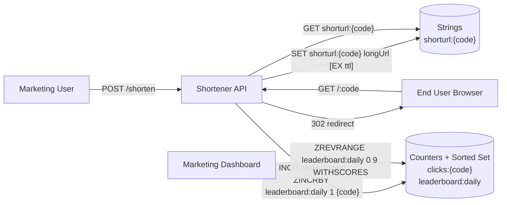
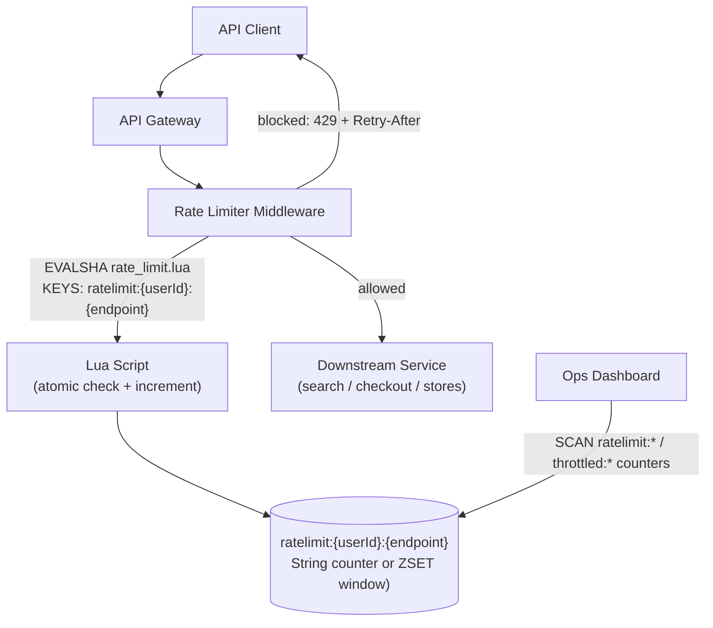
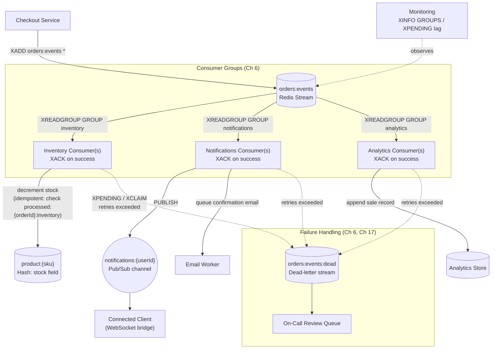
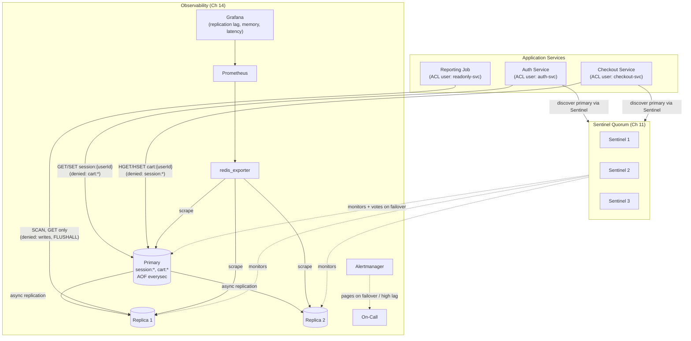
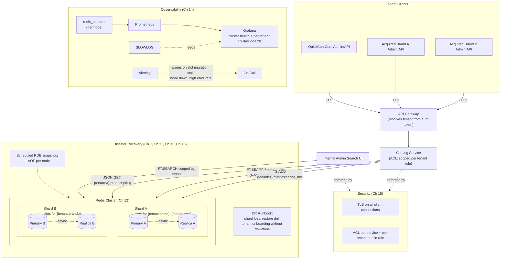

# Chapter 19: Capstone Projects

Eighteen chapters have handed you every individual piece: what an in-memory data structure store is and why Redis's single-threaded event loop is a feature, not a limitation (Ch 1–3); every core data type including streams, geo, bitmaps, and HyperLogLog (Ch 4–6); RDB/AOF persistence and atomic multi-step operations via transactions and Lua (Ch 7–8); expiration, eviction, and connection management (Ch 9–10); replication, Sentinel, and Cluster for scale and resilience (Ch 11–12); performance tuning, monitoring, and security (Ch 13–15); a professional best-practices checklist, the failure modes to avoid, and the broader ecosystem — RedisInsight, RedisJSON, RediSearch, RedisTimeSeries, RedisBloom (Ch 16–18). This chapter is where all of that stops being theory and becomes five real, portfolio-worthy systems, all built for the same running example this course has used from Chapter 2 onward: **QuickCart**, a fictional e-commerce company whose engineering team keeps running into problems that Redis is the right tool for.

Each project below is a self-contained brief — scenario, functional requirements, a suggested architecture, the exact chapters it draws on, and a Definition of Done checklist — presented in increasing order of difficulty. Read a brief fully before writing a line of code, and build the projects roughly in order: each one deliberately reuses skills and even literal key patterns from the one before it. By the fifth project you will have touched nearly every chapter in this course inside a single running system.

---

## Learning Objectives

By the end of this chapter, you will be able to:

- Translate a one-paragraph product requirement into a justified Redis data-modeling decision — which data type, which key pattern, which TTL — rather than reaching for a generic key-value `SET`/`GET` for everything
- Write atomic, race-free multi-step operations using Lua scripts (`EVAL`/`EVALSHA`/Redis Functions) for correctness-critical logic like rate limiting and idempotent stream consumers
- Design an event-driven pipeline on Redis Streams with multiple consumer groups, at-least-once delivery, idempotency, and dead-letter handling for poison messages
- Design a highly available topology — primary, replicas, and Sentinel — with ACL-scoped access per service and persistence tuned per key pattern, not one blanket policy for the whole keyspace
- Design a multi-tenant, horizontally sharded Redis Cluster deployment using hash tags, RedisJSON, RediSearch, and RedisTimeSeries together, secured with TLS and ACLs and backed by a documented disaster-recovery runbook
- Recognize which mistakes from Chapter 17 tend to resurface at each project tier, and design around them before they happen

## Prerequisites

This is the **synthesis chapter** of the course. It assumes you have completed Chapters 1 through 18 — no new Redis theory is introduced here, only application. If an implementation step below references a mechanism you don't remember (a specific data type's commands, `WATCH`-based optimistic locking, an eviction policy, a consumer group, Sentinel quorum, hash slots, an ACL rule, a RedisJSON path, a RediSearch index, a RedisTimeSeries retention policy), treat that as a signal to revisit the cited chapter, not to skip the step.

You will also need, practically:

- A local Redis installation (a single instance is enough for Projects 1–2; Docker Compose for a primary + replicas + Sentinel for Project 4; a multi-node Redis Cluster, optionally with the RedisJSON/RediSearch/RedisTimeSeries modules, for Project 5) (Ch 1, Ch 11, Ch 12, Ch 18)
- `redis-cli` and, ideally, RedisInsight for visual inspection of keys, streams, and cluster topology (Ch 18)
- A working backend environment in any language you're comfortable with (Python, Node.js, Go) and a Redis client library with connection pooling support (Ch 10)
- Comfort reading and writing Mermaid diagrams, since the harder projects below are specified with one
- For Project 4: familiarity with Docker Compose, since it stands up a primary/replica/Sentinel topology plus Prometheus/Grafana
- For Project 5: familiarity with Redis Cluster tooling (`redis-cli --cluster`) and, ideally, prior exposure to RedisJSON/RediSearch/RedisTimeSeries from Chapter 18

Work through the projects **in order**. Each one deliberately reuses the data-modeling, atomicity, and operational instincts built in the one before it — jumping straight to Project 5 means re-learning fundamentals under the pressure of the hardest project in the course.

---

## 1. Beginner: A URL Shortener with Click Analytics

### Scenario

QuickCart's marketing team keeps generating enormous, ugly campaign links — tracking parameters bolted onto product pages for every email newsletter, social post, and SMS promo. Support tickets are piling up from customers who can't paste these links reliably, and marketing has no visibility into which campaign links actually get clicked. QuickCart's engineering team is asked to build an internal URL shortener with basic click analytics, as a low-risk first project to prove Redis can support a real internal tool.

### Functional Requirements

- `POST /shorten` accepts a long URL (and optionally a custom expiry) and returns a short code
- `GET /:code` redirects to the original URL and atomically increments a click counter
- A "top 10 most-clicked links today" leaderboard, refreshable on demand
- Campaign links can be marked temporary (e.g., a 30-day flash-sale link) and must stop resolving after expiry, without a cleanup job
- Basic per-link analytics: total clicks, and clicks-today

### Suggested Architecture

### Redis Features / Chapters Drawn On

- **Strings** for `shorturl:{code} → longUrl` mapping, and `INCR` for atomic click counters (Ch 4)
- **TTL-based expiration** (`EXPIRE`/`SET ... EX`) so temporary campaign links stop resolving automatically, no cron job needed (Ch 9)
- **Sorted sets** (`ZINCRBY`, `ZREVRANGE`) for the daily "top 10 most-clicked" leaderboard — the same pattern QuickCart already uses for `leaderboard:daily` gamification (Ch 5)
- **`redis-cli`/RedisInsight** for manual inspection while debugging redirect/counter logic (Ch 2, Ch 18)

### Implementation Notes

Generate short codes with a base62 encoding of an auto-incrementing counter (`INCR shorturl:seq`), or a random 6–8 character string with a `SETNX`-based collision check — either is fine, but pick one and be able to explain the trade-off (sequential codes are guessable and enumerable; random codes need a retry loop on collision). Increment the click counter and the leaderboard score in the same request using a pipeline (or a small Lua script) so a burst of concurrent redirects never produces a counter value that doesn't match the number of redirects actually served. For "clicks today," either use a date-suffixed key (`clicks:{code}:2026-07-07`) or a single `HINCRBY` on a per-code hash keyed by date — both avoid the trap of trying to derive "today" from a running total after the fact.

### Definition of Done

- [ ] Short codes are unique, reasonably short (6–8 chars), and collision-checked before insert
- [ ] Redirect and click-increment happen as a single logical operation — a redirect is never served without incrementing the counter (a pipeline or Lua script, not two separate round trips with a gap)
- [ ] Temporary links set with an expiry actually stop resolving (return 404) once expired, verified with `TTL`
- [ ] The daily leaderboard resets naturally at midnight (e.g., a date-suffixed key like `leaderboard:daily:2026-07-07`, or an explicit rollover job) rather than growing unbounded
- [ ] Total-clicks and clicks-today are both queryable per link
- [ ] Load-tested with at least a few thousand synthetic clicks across a few hundred codes, confirming counters and leaderboard rankings stay correct under concurrent increments

---

## 2. Intermediate: A Real-Time Rate Limiter & API Gateway Middleware

### Scenario

QuickCart's public API — product search, checkout, and the store locator — has started getting hammered by scraping bots and a handful of misbehaving third-party integrations. One partner's buggy retry loop briefly took down the checkout endpoint for everyone during a flash sale. QuickCart needs rate-limiting middleware that sits in front of the API gateway, enforces per-user and per-endpoint limits, and gives the platform team a dashboard to see who's being throttled and why.

### Functional Requirements

- Enforce a configurable limit per `(userId, endpoint)` pair — e.g., 100 requests/minute to `/search`, 10 requests/minute to `/checkout`
- The limiter must be **atomic**: concurrent requests from the same user must never both slip through when only one should
- Support at least one of: sliding-window counter or token-bucket algorithm, implemented so the check-and-increment is a single atomic step
- Return a `429 Too Many Requests` with a `Retry-After` header when a limit is hit
- A small dashboard (or documented `curl`/RedisInsight queries) showing current usage and throttle counts per user/endpoint

### Suggested Architecture

### Redis Features / Chapters Drawn On

- **Lua scripting** (`EVAL`/`EVALSHA`, or Redis Functions) so the read-check-increment sequence for `ratelimit:{userId}:{endpoint}` is truly atomic under concurrency — the textbook use case for Chapter 8 (Ch 8)
- **Strings with TTL** for a fixed-window counter (`INCR` + `EXPIRE NX`), or **sorted sets** (`ZADD`/`ZREMRANGEBYSCORE`/`ZCARD`) for a sliding-window log — both approaches are worth implementing and comparing (Ch 4, Ch 5, Ch 9)
- **`MULTI`/`EXEC`/`WATCH`** as the fallback approach if you implement the limiter without Lua first, to understand *why* Lua is the better fit here (Ch 8)
- **Client libraries with connection pooling** so the middleware doesn't open a new connection per request under load (Ch 10)

### Implementation Notes

For a fixed-window counter, the Lua script needs to do three things atomically: read the current count, compare it against the limit, and either increment-and-allow or reject — with the key's `EXPIRE` set only on the very first increment of a new window (`SET key 1 EX window NX`, then `INCR` on subsequent calls) so the window doesn't keep sliding forward on every request. For a sliding-window log, `ZADD` a timestamp-scored member per request, `ZREMRANGEBYSCORE` anything older than the window, then `ZCARD` to check the count — all inside the same script so no other client can sneak a request in between the trim and the count. Token bucket is the most flexible (it naturally allows short bursts) but needs the script to track both a token count and a last-refill timestamp, computing how many tokens to add based on elapsed time before deciding whether to admit the request.

### Definition of Done

- [ ] The atomic check-and-increment is implemented as a single Lua script or Redis Function — not a `GET` followed by a separate `INCR` from application code
- [ ] Limits are configurable per endpoint without a code deploy (e.g., read from a config key or environment variable)
- [ ] A load test with concurrent requests from the same simulated user confirms the limiter never lets more than the configured count through in the window
- [ ] `429` responses include a correct `Retry-After` value derived from the key's remaining TTL
- [ ] The dashboard (or query set) shows, per user and per endpoint, current usage and total throttled-request count
- [ ] You can explain, in writing, the trade-off between the fixed-window, sliding-window-log, and token-bucket approaches, and why you chose the one you implemented

---

## 3. Intermediate-Advanced: An Event-Driven Order Processing Pipeline

### Scenario

QuickCart's checkout flow is a monolith: placing an order synchronously updates inventory, sends a confirmation email, and writes an analytics record, all in one request path. A slow email provider or a flaky analytics write has twice caused checkout itself to time out. QuickCart wants to decouple order processing: checkout should only need to record that an order happened, and independent consumers — inventory, notifications, analytics — should react to that event on their own schedule, resiliently, without ever double-processing an order or silently dropping one.

### Functional Requirements

- Checkout publishes an order-placed event to `orders:events`, a single durable stream, and returns immediately
- Three independent consumer groups read from `orders:events`: `inventory` (decrements stock), `notifications` (publishes a real-time update and queues a confirmation), and `analytics` (records the sale for reporting)
- Each consumer group processes every message **exactly once from its own perspective**, even if a consumer crashes mid-processing and another instance picks up the pending entry
- Customer-facing order-status updates are pushed live via Pub/Sub on `notifications:{userId}` for any connected client (e.g., a live "your order is confirmed" toast)
- Messages that fail processing repeatedly (e.g., a malformed event, or a downstream service that's down) are moved to a dead-letter stream after a bounded number of retries, instead of being retried forever or silently dropped

### Suggested Architecture

### Redis Features / Chapters Drawn On

- **Redis Streams and consumer groups** (`XADD`, `XREADGROUP`, `XACK`, `XPENDING`, `XCLAIM`, `XAUTOCLAIM`) as the backbone of the whole pipeline — this is the chapter this project exists to exercise (Ch 6)
- **Pub/Sub** (`PUBLISH`/`SUBSCRIBE`) for the fire-and-forget, real-time `notifications:{userId}` channel — fundamentally different delivery semantics from the stream, and the project should make that difference obvious (Ch 6)
- **Idempotency keys** using strings with TTL (e.g., `processed:{orderId}:{groupName}`) so a redelivered message after a crash doesn't double-decrement stock or double-send an email (Ch 4, Ch 9)
- **Persistence tuning** — `orders:events` needs durability guarantees (AOF with `appendfsync everysec` at minimum) that a purely ephemeral cache key doesn't (Ch 7)
- **Monitoring** consumer lag via `XINFO GROUPS`/`XPENDING`, since a stuck consumer is invisible unless you're watching for it (Ch 14)

### Implementation Notes

Give each consumer a stable, unique consumer name within its group (e.g., `inventory-worker-1`) so `XREADGROUP` correctly tracks per-consumer pending entries; a randomly generated name on every restart makes `XPENDING` output useless for diagnosing a stuck worker. Track retry counts either in the stream entry itself (a `retryCount` field you re-`XADD` with an incremented value when moving an entry, since stream entries are otherwise immutable) or in a companion hash keyed by entry ID. A simple, effective dead-letter policy: on the Nth failed `XACK`-less delivery (detected via `XPENDING`'s idle-time and delivery-count fields), `XADD` the entry to `orders:events:dead` with the original payload plus failure context, then `XACK` it out of the original group's pending list so it stops being redelivered forever.

### Definition of Done

- [ ] All three consumer groups independently track their own read position on `orders:events`; killing and restarting one consumer never causes another group to reprocess or skip messages
- [ ] Every consumer's message handler is idempotent, verified by manually re-delivering the same entry ID (via `XCLAIM`) and confirming no duplicate side effect occurs
- [ ] A message that a consumer fails to process N times (via a bounded retry count tracked per entry) is moved to a dead-letter stream, not retried forever
- [ ] Killing a consumer process mid-processing and restarting it results in the in-flight message being reclaimed (via `XAUTOCLAIM`/`XCLAIM`) and completed, not lost
- [ ] `notifications:{userId}` Pub/Sub delivers live updates to a connected client, and you can explain why Pub/Sub (not the stream) is the right tool for this specific piece
- [ ] `orders:events` survives a Redis restart with no data loss under your chosen AOF configuration, verified by an actual kill-and-restart test

---

## 4. Advanced: A Highly Available Session & Cart Store

### Scenario

QuickCart's `session:{userId}` and `cart:{userId}` keys live on a single Redis instance. During a routine hardware maintenance window, that instance went down for four minutes — every logged-in customer was silently logged out and every in-progress cart was lost, right in the middle of business hours. Leadership has mandated that this can never happen again: session and cart data must survive the loss of any single Redis node without customer-visible downtime, and access must be properly scoped so a compromised service can't read or write data it has no business touching.

### Functional Requirements

- A primary/replica topology with Redis Sentinel providing automatic failover — losing the primary must promote a replica within seconds, with clients reconnecting to the new primary automatically
- ACL-secured access: the checkout service can read/write `cart:*` but not `session:*`; the auth service can read/write `session:*` but not `cart:*`; a read-only reporting job can `GET`/`SCAN` but never write or run `FLUSHALL`
- Persistence tuned per key pattern: `session:{userId}` can tolerate a small loss window (short-lived, re-derivable from a login), while `cart:{userId}` should be durable enough to survive a crash without losing a customer's in-progress purchase
- Full monitoring: Prometheus scraping Redis metrics (via `redis_exporter`), Grafana dashboards for replication lag, memory usage, and command latency, with alerting on Sentinel failover events

### Suggested Architecture

### Redis Features / Chapters Drawn On

- **Replication and Sentinel** for automatic failover — quorum configuration, `down-after-milliseconds`, and client reconnection behavior after a promotion (Ch 11)
- **ACLs** (`ACL SETUSER`, key-pattern and command restrictions) so each service gets least-privilege access instead of a single shared password with full access (Ch 15)
- **Persistence tuning per key pattern** — comparing an AOF-heavy policy for `cart:*` against a looser policy for `session:*`, and justifying the difference in writing (Ch 7, Ch 9)
- **Monitoring and alerting** — `INFO replication` for lag, `redis_exporter` + Prometheus + Grafana dashboards, and an alert specifically on a Sentinel failover event (Ch 14)
- **Client library reconnection handling** — a client must detect a failover and reconnect to the new primary, not keep writing to a demoted, now-read-only, former primary (Ch 10, Ch 11)

### Implementation Notes

Configure Sentinel with at least three Sentinel processes and a quorum of two, so a single Sentinel losing network connectivity to the primary can't unilaterally trigger a false-positive failover — this is the same split-brain-avoidance reasoning behind quorum-based systems generally. For persistence, a reasonable split is AOF with `appendfsync everysec` (or even `always` if the checkout team demands it) for the primary serving `cart:*`, versus RDB-only or a longer AOF fsync interval for `session:*`, since a lost session just forces a re-login while a lost cart loses real purchase intent. Point every client at Sentinel's `SENTINEL get-master-addr-by-name` (or a Sentinel-aware client library mode) rather than a hardcoded primary IP, so a promotion is transparent to application code.

### Definition of Done

- [ ] Killing the primary Redis process triggers a Sentinel-driven failover, and connected clients resume reads/writes against the newly promoted primary within the configured `down-after-milliseconds` + failover time, with no manual intervention
- [ ] During the failover test, no customer-visible errors surface beyond a brief, bounded blip — verified by a script that continuously writes/reads `cart:{userId}` throughout the failover
- [ ] Each service's ACL user is verified to be denied the operations it shouldn't have (attempt a `checkout-svc` read of `session:*` and confirm it's rejected, not merely undocumented)
- [ ] `cart:{userId}` data survives a hard `kill -9` of the primary process with no data loss beyond your documented AOF fsync window; `session:{userId}` data loss under the same test matches your documented, looser tolerance
- [ ] Grafana shows live replication lag, memory usage, and command latency; an alert fires (verified by triggering it) on a Sentinel failover event
- [ ] A written runbook exists describing exactly what an on-call engineer should check first if paged for "Redis primary unreachable"

---

## 5. Production-Grade Capstone: A Multi-Tenant, Horizontally Scaled Caching & Real-Time Analytics Platform

### Scenario

QuickCart has just acquired two smaller regional retailers and is being folded into a single multi-brand platform. The unified product catalog is now far too large and too hot for a single Redis instance, each acquired brand needs its data logically isolated from the others (with the option to bill and rate-limit them independently), the platform team wants full-text admin search across product catalogs, and the business wants real-time operational metrics — cache hit ratio, request volume, error rate — visualized live per tenant. This is the platform team's biggest project yet, and it has to be built assuming it will be handed to someone else to operate.

### Functional Requirements

- A **Redis Cluster** backing the product catalog cache, sharded across multiple nodes, with every key **hash-tagged per tenant** (e.g., `{tenant:acme}:product:{sku}`) so a given tenant's keys colocate on one hash slot and multi-key operations for that tenant stay cluster-safe
- **RedisJSON** for the nested catalog documents themselves (variants, pricing tiers, nested attributes) instead of flattening everything into hash fields
- **RediSearch** providing a full-text/faceted search index for the internal admin tool ("find all products matching X across all tenants" or scoped to one tenant)
- **RedisTimeSeries** recording real-time operational metrics (cache hit/miss counts, request latency, error rate) per tenant, queryable for live dashboards
- **Full security**: TLS on every client connection, ACLs scoping each service and each tenant's admin tooling to only the keys/commands it needs
- **Full observability**: Prometheus/Grafana dashboards spanning cluster health, per-tenant metrics, and slow-command tracking
- A written, **tested** disaster-recovery runbook: what happens if a shard's primary and all its replicas are lost, how backups are taken and restored, and how a new tenant is onboarded without downtime to existing tenants

### Suggested Architecture

### Redis Features / Chapters Drawn On

- **Redis Cluster, hash slots, and hash tags** (`{tenant:X}:...`) so per-tenant multi-key operations remain cluster-safe and a tenant's data colocates on predictable shards (Ch 12)
- **RedisJSON** for nested catalog documents, avoiding an artificial flattening of variant/pricing data into hash fields (Ch 18)
- **RediSearch** for full-text and faceted admin search across (or scoped within) tenant catalogs (Ch 18)
- **RedisTimeSeries** for per-tenant operational metrics with retention policies, feeding real-time dashboards (Ch 18)
- **ACLs and TLS** for both service-to-Redis and tenant-scoped admin access (Ch 15)
- **Replication within each cluster shard**, resharding, and multi-key operation constraints (Ch 11, Ch 12)
- **Monitoring**: Prometheus/Grafana, `SLOWLOG`, and cluster-aware alerting (slot migration stalls, node failures) (Ch 14)
- **Persistence and backup/restore** strategy per shard, and a tested disaster-recovery runbook (Ch 7, Ch 16)
- Effectively **every prior chapter** feeds this project — it is the intended synthesis point of the whole course

### Implementation Notes

Choose the hash-tag granularity deliberately: tagging on `{tenant:X}` alone colocates an entire tenant's keys on one shard, which is great for multi-key tenant operations but risks an oversized "hot" shard if one acquired brand turns out to be far larger than the others — document this trade-off the same way Project 5's shard-key decision would be documented in any sharded-database course, and have a plan (a dedicated shard, or a finer-grained tag) for the tenant that outgrows the default. Use RedisJSON's path-based partial updates (`JSON.SET key $.variants[0].price 24.99`) for catalog edits instead of reading the whole document, mutating it in application code, and writing it back — the latter both wastes bandwidth and reintroduces the lost-update race conditions Chapter 8's optimistic locking exists to prevent. For RedisTimeSeries, set an explicit `RETENTION` and consider `TS.CREATERULE` for automatic downsampling (e.g., raw samples for 24 hours, 1-minute rollups for 30 days) so dashboards stay fast without the time series growing without bound.

### Definition of Done

- [ ] All catalog keys are hash-tagged per tenant (`{tenant:X}:...`), verified with `CLUSTER KEYSLOT` that a given tenant's related keys land on the same slot, and a cross-tenant multi-key command correctly fails or is never attempted
- [ ] RedisJSON documents model the real nested catalog shape (variants, pricing tiers), and at least one partial-update path (`JSON.SET` on a sub-path) is demonstrated without rewriting the whole document
- [ ] RediSearch returns correct, tenant-scoped results for a faceted admin query, and an unscoped superuser query can search across tenants when intentionally permitted
- [ ] RedisTimeSeries dashboards show live per-tenant cache hit ratio, latency, and error rate, with a sensible retention/downsampling policy so the time series doesn't grow unbounded
- [ ] TLS is enforced on every client connection (a plaintext connection attempt is refused), and each ACL user is verified to be denied operations outside its scope
- [ ] A shard primary is killed under load; the cluster promotes a replica, requests to unaffected shards continue uninterrupted, and requests to the affected shard resume automatically once promotion completes
- [ ] The disaster-recovery runbook has been **exercised**, not just written: a full restore from backup has actually been performed against a scratch cluster, and a new tenant has been onboarded live without disrupting existing tenants' traffic

---

## Real-World Scenario

Frame these five projects as QuickCart's actual engineering roadmap over two quarters, each one triggered by a real business event rather than assigned as an abstract exercise.

**Q1, Sprint 1–2 — The URL Shortener.** Support tickets about unshareable campaign links have become a recurring complaint in the weekly ops review. It's a low-risk, high-visibility first win: a small team ships it in under two weeks using nothing but strings, `INCR`, TTLs, and the same sorted-set pattern already powering QuickCart's `leaderboard:daily` gamification feature. Marketing gets click analytics for the first time; support-ticket volume for "the link doesn't work" drops to near zero.

**Q1, Sprint 3–4 — The Rate Limiter.** A partner integration's retry storm degrades checkout during a flash sale, and it makes it into the incident postmortem. The fix that follows isn't "add more servers" — it's admitting the API has no rate limiting at all. The platform team builds the Lua-scripted limiter directly in front of the gateway, scoped per `{userId}:{endpoint}` exactly like the `ratelimit:{userId}:{endpoint}` key pattern QuickCart has used conceptually since Chapter 2. The next attempted retry storm gets a clean `429` instead of an outage.

**Q1, Sprint 5–8 — The Order Processing Pipeline.** The checkout monolith's tight coupling to email and analytics causes its second timeout-related incident in a quarter, this time from a slow third-party email provider. Decoupling checkout from its downstream effects becomes a priority project: `orders:events` becomes QuickCart's central stream, with `inventory`, `notifications`, and `analytics` as independent, resilient consumer groups, and `notifications:{userId}` Pub/Sub finally gives customers a live "order confirmed" experience instead of a page refresh. This is the project that turns "Redis is our cache" into "Redis is core infrastructure."

**Q2, Sprint 1–4 — The HA Session & Cart Store.** A routine hardware maintenance window takes the single Redis instance holding every logged-in session and every in-progress cart offline for four minutes, logging out the entire customer base at 2pm on a Tuesday. It becomes the highest-priority reliability project of the quarter: primary/replica/Sentinel failover, ACL-scoped access per service, and tuned persistence so a repeat of that afternoon is invisible to customers instead of a headline incident.

**Q2, Sprint 5–8 — The Multi-Tenant Platform.** QuickCart acquires two smaller regional retailers, and leadership wants their catalogs and traffic served from the same infrastructure within the quarter, without QuickCart's existing customers noticing any change in latency or reliability. This is the project that finally demands Redis Cluster, hash-tagged multi-tenant keys, RedisJSON for the now genuinely varied catalog shapes, RediSearch for the internal admin tool the merged support team needs, RedisTimeSeries for the per-brand metrics finance wants for the acquisition integration report, and a disaster-recovery runbook good enough that the platform team can go on-call for three companies' worth of traffic with confidence.

Read back to back, the five projects trace a familiar arc: a junior engineer's low-risk first win, a mid-level engineer's incident-driven hardening, a senior engineer's architectural decoupling, a reliability-driven infrastructure investment, and finally the staff-level, cross-team platform project that only makes sense once everything before it is already working.

---

## Best Practices

- **Build incrementally, project by project.** The data-modeling instincts from Project 1, the atomicity discipline from Project 2, and the streams/HA operational muscle from Projects 3–4 are exactly what Project 5 assumes you already have — skipping ahead means learning them under the pressure of the hardest project instead of the easiest one.
- **Write tests as you go, not at the end.** A rate limiter without a concurrency test, a stream consumer without an idempotency test, or a failover setup without an actual kill-the-primary test all look correct until the exact moment they're relied upon in production; write the test for the specific failure mode each project is meant to survive.
- **Document your design decisions, especially the ones with trade-offs.** Why a sliding-window log over a fixed-window counter, why this hash-tag scheme, why this persistence policy for `cart:*` versus `session:*` — a short written justification next to the code is what turns a project from "it works" into "I can defend this in a design review."
- **Don't skip observability or security because it's "just a portfolio project."** The whole point of Projects 4 and 5 is that monitoring and ACLs are core requirements, not decoration — a capstone that has Sentinel failover but no alerting on it, or a Cluster with no TLS, is demonstrating half the skill it claims to.
- **Load-test before declaring a project done.** A rate limiter, a stream pipeline, or a failover setup that behaves correctly against a handful of manual test requests can behave completely differently under real concurrency — generate synthetic load deliberately, at every tier, not only in Project 5.
- **Reuse rather than rewrite.** By Project 4 you should be importing and adapting the connection-pooling, ACL, and monitoring setup from earlier projects — that reuse is itself evidence the earlier chapters have become instinct rather than reference material.
- **Version your Redis configuration and ACL definitions as code**, not as commands typed once into `redis-cli` and forgotten — a `redis.conf`, an `acl.conf`, or a set of `ACL SETUSER` statements checked into the repo means a fresh environment can be stood up reproducibly and a teammate can see exactly what access exists and why.
- **Pick the failure to inject before you start building, not after.** Decide up front which failure each project must survive — a killed consumer for Project 3, a killed primary for Project 4, a killed shard for Project 5 — and build the verification test for that exact failure alongside the feature, not as an afterthought once everything "looks done."

---

## Common Mistakes

- **Skipping error handling and idempotency in the streams project.** A consumer that assumes every message arrives exactly once and never gets redelivered will double-decrement inventory or double-send a confirmation email the first time a consumer crashes mid-processing — which, on a long enough timeline, it will.
- **Hardcoding configuration instead of using environment-based config.** Connection strings, ACL usernames, rate-limit thresholds, and TTLs baked directly into source code make a project impossible to run against a different environment (or safely share in a public repo) without a code change — externalize them from the start.
- **Not writing a README that explains architecture decisions.** For a portfolio piece specifically, the code alone under-sells the work: a reviewer skimming a repo needs a README that states the scenario, the key design decisions (and their trade-offs), how to run it, and what the Definition of Done checklist confirmed — without it, months of design thinking are invisible.
- **Treating the "Definition of Done" checklist as optional once the demo works.** A rate limiter that works in a single manual test but was never load-tested under concurrency, or a failover setup that was configured but never actually triggered by killing the primary, hasn't been proven to work — it's only been proven to look like it works.
- **Declaring the production capstone (Project 5) done after one successful manual walkthrough.** Without an actual restore drill, an actual shard-failure test, and actual tenant-isolation verification, a "disaster-recovery runbook" is an untested document, not a safety net.
- **Reaching for a generic key-value pattern everywhere instead of the data type that fits.** Storing a nested catalog document as a JSON-encoded string blob when RedisJSON exists, or building a leaderboard with `SORT` over a list instead of a sorted set, both work well enough to pass a quick test and both throw away exactly the modeling advantage this course has spent eighteen chapters building.
- **Forgetting that Sentinel/Cluster failover changes which node is writable, and not handling it in the client.** A client that caches a connection to "the primary" once at startup and never re-resolves it will keep sending writes to a demoted, now-replica node after a failover, and either get silent read-only errors or, worse, appear to work while writes quietly go nowhere.
- **Leaving default or blank `requirepass`/ACL configuration on anything beyond a throwaway local instance.** Even a portfolio project deployed to a public cloud VM for a demo link is a real target; the security steps from Project 4 onward aren't there only because "production" requires them.

---

## Summary

- **Project 1** (URL Shortener with Click Analytics) is a pure data-modeling exercise: strings, `INCR`, TTLs, and a sorted-set leaderboard — the deliverable is a working shortener and a verified expiration/leaderboard behavior, nothing else added.
- **Project 2** (Rate Limiter & API Gateway Middleware) adds atomicity: a Lua-scripted, concurrency-safe limiter enforcing per-user, per-endpoint limits, with a dashboard exposing usage and throttle counts.
- **Project 3** (Event-Driven Order Processing Pipeline) adds Redis Streams with multiple consumer groups, Pub/Sub for real-time client updates, idempotent consumers, and dead-letter handling — decoupling checkout from its downstream effects.
- **Project 4** (Highly Available Session & Cart Store) adds replication, Sentinel-driven automatic failover, ACL-scoped per-service access, per-key-pattern persistence tuning, and full Prometheus/Grafana monitoring.
- **Project 5** (Multi-Tenant, Horizontally Scaled Caching & Real-Time Analytics Platform) adds a Redis Cluster with hash-tagged multi-tenant keys, RedisJSON, RediSearch, RedisTimeSeries, full TLS/ACL security, full observability, and a tested disaster-recovery runbook — synthesizing nearly every chapter in this course into one working system.
- Each project deliberately builds on the one before it: the data-modeling instincts, the atomicity discipline, and the operational rigor are meant to carry forward, so working through them in order is itself part of the curriculum.
- The recurring meta-lesson across all five tiers is that **an untested failover, an untested restore, and an unverified concurrency guarantee are what separate "it worked in the demo" from "it's ready for production."**

---

## Knowledge Check

1. In Project 1, why must the redirect and the click-count increment happen as a single logical operation, and what specific bug would you expect if they were two independent, non-atomic Redis calls?
2. In Project 2, why is a plain `GET` followed by an application-level `if` check and then an `INCR` not sufficient for correct rate limiting under concurrent requests, and what does wrapping the logic in a Lua script fix?
3. In Project 3, what is the practical difference between using a Redis Stream (`orders:events`) versus Pub/Sub (`notifications:{userId}`) for the two different jobs they're assigned to in the pipeline, and what would break if you swapped them?
4. In Project 4, why does Sentinel-driven failover require the *client* to behave correctly (reconnect to the new primary) in addition to Redis promoting a replica — what happens to a client that doesn't?
5. In Project 5, why must multi-tenant keys be hash-tagged (e.g., `{tenant:acme}:product:{sku}`) rather than just prefixed (`tenant:acme:product:{sku}`) once the deployment moves to Redis Cluster?
6. Across Projects 4 and 5, why is a disaster-recovery runbook that has never been exercised with an actual restore or failover drill considered "unproven," even if it's thoroughly written?

---

## Hands-On Exercise

Implement **Project 1 (URL Shortener with Click Analytics)** and **Project 2 (Rate Limiter & API Gateway Middleware)** fully, and push both to a single public repository with a README:

1. **Scaffold the repo.** One repository, two clearly separated services (or two top-level folders) — `url-shortener/` and `rate-limiter/` — each with its own `README.md` describing the scenario, the Redis data model used, and how to run it locally against Docker-based Redis.
2. **Build the URL shortener end to end**: short-code generation and collision checking, redirect with atomic click increment, TTL-based expiry for temporary links, and a `GET /stats/:code` endpoint returning total clicks and today's clicks. Write an automated test that hits the redirect endpoint concurrently and asserts the final click count matches the number of requests exactly.
3. **Build the rate limiter end to end**: a Lua script implementing either a sliding-window log or a token bucket over `ratelimit:{userId}:{endpoint}`, wired in as middleware in front of at least two mock downstream endpoints with different limits. Write an automated concurrency test that fires more requests than the limit allows and asserts exactly the configured number succeed, no more.
4. **Externalize configuration.** Both services should read Redis connection details and their respective limits/TTLs from environment variables, not hardcoded values — this is a Common Mistake called out above, and fixing it here is part of the exercise.
5. **Write the top-level README.** State the scenario for each project (in QuickCart's voice, as in the Real-World Scenario section above), the exact Redis commands/data types used and why, how to run both services locally, and which Definition of Done checklist items you verified and how (link to or describe the automated tests).
6. **Push to a public repository** (GitHub, GitLab, or similar) and confirm a stranger cloning it fresh, with only Docker and the README, can get both services running and pass the tests without asking you a question.

Stop there for now — resist starting Project 3 until both README files exist, both automated concurrency tests pass reliably, and you could hand the repo URL to an interviewer as a portfolio artifact today.

---

## Further Reading

- [Redis Docs — Redis Streams](https://redis.io/docs/latest/develop/data-types/streams/) — the authoritative reference for `XADD`, consumer groups, `XCLAIM`/`XAUTOCLAIM`, and pending-entry handling used throughout Project 3.
- [Redis Docs — Scripting with Lua](https://redis.io/docs/latest/develop/interact/programmability/eval-intro/) — atomic scripting patterns underlying Project 2's rate limiter.
- [Redis Docs — Sentinel](https://redis.io/docs/latest/operate/oss_and_stack/management/sentinel/) — quorum configuration and failover mechanics for Project 4.
- [Redis Docs — Scaling with Redis Cluster](https://redis.io/docs/latest/operate/oss_and_stack/management/scaling/) — hash slots, hash tags, and resharding for Project 5.
- [Redis Docs — Access Control Lists (ACL)](https://redis.io/docs/latest/operate/oss_and_stack/management/security/acl/) — least-privilege access design for Projects 4 and 5.
- [Redis Docs — RedisJSON](https://redis.io/docs/latest/develop/data-types/json/), [RediSearch](https://redis.io/docs/latest/develop/interact/search-and-query/), and [RedisTimeSeries](https://redis.io/docs/latest/develop/data-types/timeseries/) — the module references for Project 5's catalog, search, and metrics layers.
- *Redis in Action* (Josiah Carlson) — real-world data-modeling patterns, including rate limiting and job queues, that map directly onto Projects 2 and 3.

---

  <a href="./18-tools-and-ecosystem.md">← Previous: Tools & Ecosystem</a>
  <a href="./00-index.md">🏠 Index</a>
  <a href="./20-interview-preparation.md">Next: Interview Preparation →</a>

