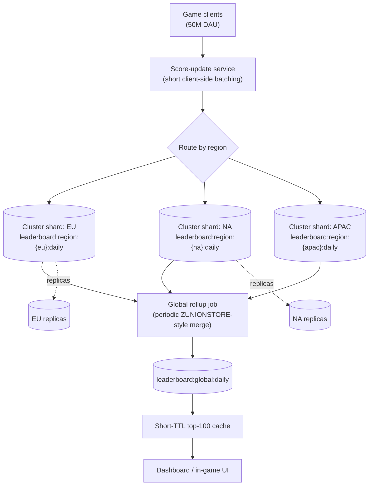
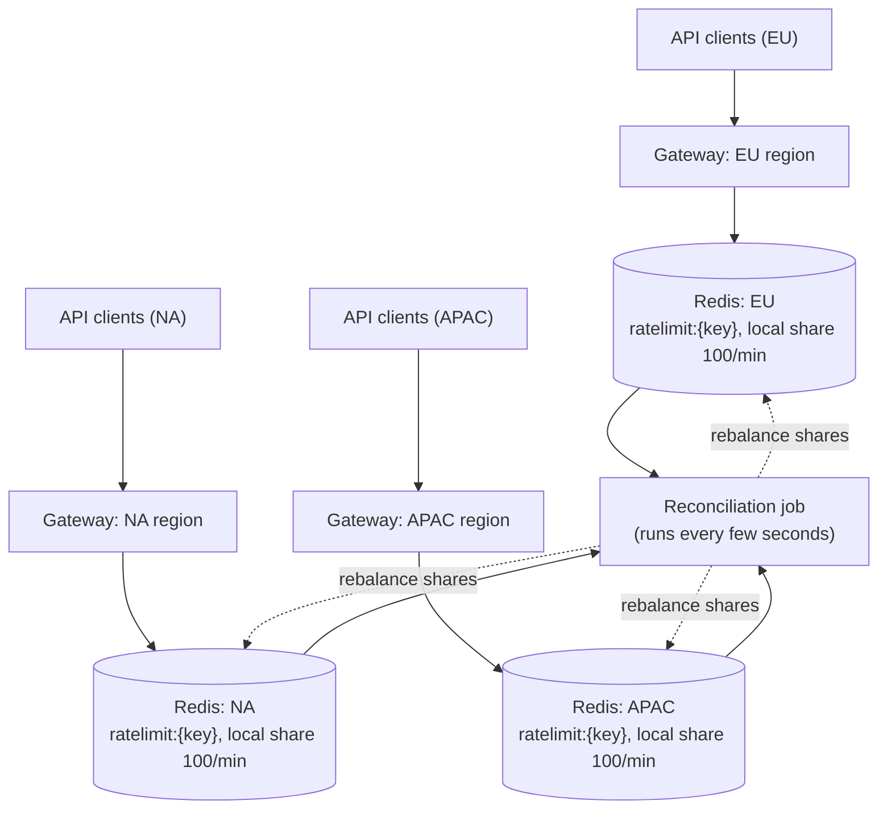

# Chapter 20: Interview Preparation

Nineteen chapters ago, QuickCart's Redis footprint was a single `SET`/`GET` pair typed into a terminal to see what an in-memory store even feels like. By now it's a `session:{userId}` hash with a TTL, a `product:{sku}` cache, a `cart:{userId}` hash, a `leaderboard:daily` sorted set, a `ratelimit:{userId}:{endpoint}` counter, an `orders:events` stream with three consumer groups, a `notifications:{userId}` Pub/Sub channel, and a `stores:locations` geo index — backed by RDB and AOF, made atomic with transactions and Lua, tuned against `maxmemory` and an eviction policy, replicated and Sentinel-managed, sharded across a Cluster, benchmarked, monitored, and locked down with ACLs and TLS. This chapter is not new material. It is a rehearsal — the exact shape a technical interviewer expects: a crisp conceptual answer in under a minute, a calm diagnosis under scenario pressure, working Lua and configuration under a shared editor, a structured system-design walkthrough with justified trade-offs, and a war story that proves you've operated Redis in production, not just read about it. Work through it the way you'd rehearse for a real loop: form your own answer before reading the model answer, and treat any gap between the two as a pointer back to the specific earlier chapter you need to revisit tonight, not a reason to reread the whole course.

---

## Learning Objectives

By the end of this chapter, you will be able to:

- Answer 15+ core Redis conceptual interview questions confidently, spanning the single-threaded architecture, data type selection, persistence, atomicity, memory management, and high availability
- Diagnose realistic production scenarios — a dropping cache hit rate, a 500MB key, a lagging replica — using the same diagnostic discipline taught in Chapters 13, 14, and 17
- Write correct, atomic Lua scripts and produce correct `redis.conf`/`CONFIG SET` configurations from a plain-English requirement, under interview time pressure
- Deliver a structured, interview-shaped system-design answer for a Redis-backed system, covering data modeling, atomicity, scaling, and operational concerns end to end
- Recognize composite, illustrative production case studies that show how the concepts in this course play out as real incidents and scaling milestones
- Run a full mock interview against yourself, self-grade honestly, and know exactly which chapter to revisit for any gap you find

---

## Prerequisites

This is the capstone review chapter of the entire course. It assumes you have completed, or can comfortably skim back through, **all of Chapters 1–19**:

- **Ch 1–3**: what an in-memory data structure store is, core keyspace terminology, and the single-threaded event loop / `fork()` internals
- **Ch 4–6**: every core data type — strings, lists, hashes, sets, sorted sets, bitmaps, HyperLogLog, streams, Pub/Sub, and geospatial commands
- **Ch 7–8**: RDB and AOF persistence trade-offs, `MULTI`/`EXEC`/`WATCH`, and Lua scripting (`EVAL`/`EVALSHA`, Redis Functions)
- **Ch 9–10**: expiration and eviction policies, `maxmemory`, and client-side connection pooling/pipelining
- **Ch 11–12**: leader-replica replication, Redis Sentinel, and Redis Cluster hash-slot sharding
- **Ch 13–15**: `redis-benchmark`, slow-log and latency diagnosis, Prometheus/Grafana monitoring, and security hardening (ACLs, TLS)
- **Ch 16–18**: the consolidated best-practices checklist, catalog of common failure modes, and the broader tooling ecosystem
- **Ch 19**: the capstone project you designed or built end to end

Every answer below is instructive on its own, but if any of it feels unfamiliar rather than "oh right, I remember this," that's your signal to reopen the relevant chapter before the interview — not during it.

---

## 1. Conceptual Q&A

Every question here comes with a full model answer, because that's exactly what an interview demands of you in real time — no partial credit for "I know it when I see it."

### Q1. What is Redis, and how is it fundamentally different from a traditional disk-based database?

Redis is an in-memory data structure store: it keeps its entire working dataset in RAM and serves reads and writes at RAM speed (sub-millisecond for most operations), with persistence to disk (RDB/AOF) as an explicit, tunable safety net rather than the primary storage mechanism a disk-based database like PostgreSQL relies on for every write. The deeper difference isn't just speed — it's that Redis exposes purpose-built native data structures (lists, hashes, sets, sorted sets, streams, bitmaps, HyperLogLog, geospatial indexes) with commands that operate directly on them server-side, so a problem like "atomically increment this user's cart quantity" or "get the top 10 leaderboard entries" is one O(1)/O(log N) command instead of a query, a deserialize step, an application-side mutation, and a rewrite. The trade-off is durability and dataset size: Redis's dataset is bounded by available RAM (unlike a disk-based database bounded by disk), and every durability guarantee beyond "instantaneous, in-memory" is something you explicitly configure, not something you get by default (Ch 1, 2).

### Q2. Explain Redis's single-threaded architecture. Why doesn't it limit throughput the way "single-threaded" sounds like it should?

The main Redis event loop processes all client commands on a single thread, using I/O multiplexing (`epoll`/`kqueue`) to handle thousands of concurrent client connections without needing a thread per connection. This works because Redis's operations are almost all extremely fast — RAM access plus simple data-structure manipulation — so a single core can execute hundreds of thousands of them per second, and single-threading buys you something valuable in return: every command is inherently atomic with respect to every other command, because there is no other thread to interleave with. There is no lock contention, no context-switching overhead, and no need to reason about concurrent mutation of a hash or sorted set the way you would in a multi-threaded system. The trade-off is that one accidentally slow command — an `O(N)` operation on a huge collection, a poorly written Lua script, an unindexed `KEYS *` — blocks every other client for its entire duration, since there's no second thread to pick up the slack; modern Redis offloads a handful of genuinely expensive operations (lazy freeing via `UNLINK`, background persistence via `fork()`) to separate threads/processes specifically to protect the main loop from this (Ch 3).

### Q3. Walk through Redis's core data types and when you'd reach for each.

**Strings** for scalars, counters (`INCR`/`DECRBY`), and cached blobs — QuickCart's `ratelimit:{userId}:{endpoint}` counter. **Lists** for ordered sequences accessed from the ends — simple queues/stacks via `LPUSH`/`BRPOP`, though Streams supersede this once you need replay or consumer groups. **Hashes** for a single logical object with several independently-updatable fields — QuickCart's `product:{sku}` (name/price/stock) and `cart:{userId}` (sku → quantity), avoiding the "fetch the whole JSON blob to change one field" tax. **Sets** for uniqueness and membership tests, and set algebra (`SINTER`/`SUNION`) for relationships like tag-to-product indexes. **Sorted Sets** for anything ranked — QuickCart's `leaderboard:daily` — giving O(log N) inserts and O(log N + M) range/rank queries with no application-side sorting. **Bitmaps** for compact per-user boolean flags at massive scale (feature flags, daily-active tracking). **HyperLogLog** for approximate distinct counts over huge inputs at fixed, tiny memory cost. **Streams** for an append-only, replayable log with consumer-group fan-out — QuickCart's `orders:events`. **Pub/Sub** for fire-and-forget real-time fan-out with no persistence — QuickCart's `notifications:{userId}`. **Geospatial** (built on sorted sets) for radius/distance queries — QuickCart's `stores:locations` (Ch 4, 5, 6).

### Q4. Compare RDB and AOF persistence. Why would you run both?

RDB is a point-in-time binary snapshot of the entire dataset, produced via `fork()`-based copy-on-write so the main thread never blocks; it's compact, fast to load on restart, but by design loses everything since the last snapshot if the process crashes. AOF logs every write command (or its effect) as it happens, replayed on startup to reconstruct state; with `appendfsync everysec` you lose at most ~1 second of writes, a dramatically tighter durability window than RDB's snapshot interval, at the cost of a larger file and slower restarts (mitigated by periodic AOF rewrite/compaction). Running both (Redis's default hybrid mode since 4.0, where AOF rewrite uses an RDB-format preamble) gives you RDB's fast restarts and compact backups plus AOF's tight recovery-point objective — the standard production recommendation is exactly this combination, tuned to your actual RPO/RTO requirements rather than either mechanism alone (Ch 7).

### Q5. `MULTI`/`EXEC`/`WATCH` versus Lua scripting — when do you reach for which?

`MULTI`/`EXEC` queues a batch of commands and runs them as an uninterruptible unit — perfect for unconditional multi-key operations with no read-decide-write logic in between. `WATCH` adds optimistic locking: it aborts the transaction if a watched key changed between the `WATCH` and the `EXEC`, which is enough to fix simple check-then-act races, but under high contention (many clients watching the same hot key) it degrades into a retry storm, since every conflicting client has to detect the abort and retry from scratch. A Lua script (`EVAL`/`EVALSHA`) collapses the entire read-decide-write sequence into one atomic server-side round trip — the single-threaded guarantee from Q2 means no other command can interleave partway through the script — so there's no abort/retry cycle at all, just a single always-succeeds-or-fails execution. The rule of thumb this course teaches: unconditional multi-key operations use `MULTI`/`EXEC`; low-contention conditional operations (a user editing their own cart) are fine on `WATCH`; high-contention conditional operations on a hot key (QuickCart's Black Friday doorbuster stock decrement) go through Lua or a Redis Function by default (Ch 8).

### Q6. What are Redis's eviction policies, and how do you choose one?

When `maxmemory` is reached, Redis needs a policy for what to do next: `noeviction` rejects writes with an error (correct for data that must never silently disappear, like a session store you'd rather alert on than lose); `allkeys-lru`/`allkeys-lfu` evict the least-recently/least-frequently-used key across the whole keyspace (correct for a pure cache like QuickCart's `product:{sku}` tier, where every value is reconstructible from the source database); `volatile-lru`/`volatile-lfu`/`volatile-random` restrict eviction to keys that already have a TTL, leaving keys without one untouched (useful when a single instance mixes must-keep and disposable data); and `volatile-ttl` evicts the key with the soonest expiration first, a natural fit for QuickCart's rate-limiter keyspace where every key is already "supposed to" die soon. The choice should follow directly from "is losing this key an inconvenience or a correctness bug," per key namespace, not a single blanket policy applied to a mixed-purpose instance (Ch 9).

### Q7. Explain leader-replica replication and how a replica catches up after a disconnect.

A primary asynchronously streams its write stream to one or more replicas; replicas apply those writes and can serve reads, offloading read traffic and providing failover candidates, but reads from a replica can be momentarily stale since replication is async by default. On a brief disconnect, Redis attempts **partial resynchronization**: the primary keeps a bounded in-memory replication backlog buffer, and if the replica's last-known offset is still within that backlog, the primary just streams the missed commands rather than a full resync. If the gap is too large (backlog wrapped, or a brand-new replica), a **full sync** happens instead: the primary forks, generates an RDB snapshot, and transfers it wholesale — expensive in CPU, I/O, and bandwidth, which is exactly why the backlog size should be sized against your realistic reconnect-gap duration, not left at a default tuned for a much smaller dataset (Ch 11).

### Q8. What problem does Redis Sentinel solve, and how does quorum work?

Plain replication gives you replicas, but promoting one to primary after a failure is a manual operation unless something is watching. Sentinel is a distributed monitoring/failover system: multiple Sentinel processes independently watch the primary, and when a majority (the `quorum` setting) agree it's genuinely down — not just unreachable from one Sentinel's perspective — they elect a leader Sentinel to orchestrate promoting the best-positioned replica and reconfiguring the rest, then republish the new topology to clients via Sentinel's own discovery protocol. Quorum governs **agreement to start** a failover, not the number of Sentinels required to complete one; running an even number of Sentinels, or too few (below 3), removes the mathematical guarantee that a network partition can't produce two simultaneous "majority" views — the same quorum reasoning Cluster uses for master-count decisions (Ch 11, 12).

### Q9. How does Redis Cluster shard data, and when do you reach for it over Sentinel?

Cluster partitions the entire keyspace into 16,384 fixed hash slots, and every key deterministically maps to one slot via `CRC16(key) mod 16384` (or just the substring inside `{...}` if the key uses a hash tag); each slot is owned by exactly one master, which typically has its own replica(s) for failover, and cluster nodes gossip slot ownership and health among themselves rather than relying on an external Sentinel process. Reach for Cluster when a single primary's write throughput or dataset size genuinely can't fit on one node anymore — Sentinel gives you availability but every write still goes through one primary's CPU and RAM ceiling, while Cluster gives you horizontal write and memory scaling at the cost of losing atomic cross-key operations unless you deliberately co-locate related keys with hash tags (Ch 12).

### Q10. What layers of security does Redis provide, and what does each protect against?

`requirepass` is legacy, single-password, all-or-nothing authentication — better than nothing but every client shares one credential and one unrestricted command set. The modern **ACL** system (`ACL SETUSER`) protects against an authenticated-but-overprivileged client, letting you scope a user to specific commands (`+get -flushall`), specific key patterns (`~product:*`), and specific Pub/Sub channels — so QuickCart's recommendation service can be given read-only access to `product:*` and nothing else, with no way to run `FLUSHALL` even if its credentials leak. **TLS** protects data in transit against network interception. Network hardening (`bind`, firewalls, not exposing port 6379 to the internet) protects against unauthorized connections reaching Redis at all — historically the single most common real-world Redis incident, since Redis was designed to sit behind an application server on a trusted network, not as an internet-facing service. Command renaming/disabling (`rename-command CONFIG ""`) protects against a compromised-but-limited client escalating via dangerous administrative commands. Together these form defense in depth; no single layer is assumed sufficient alone (Ch 15).

### Q11. Streams versus Pub/Sub — what's the actual difference, and when would you use both for the same event?

Pub/Sub is fire-and-forget: `PUBLISH` fans a message out instantly to every currently-subscribed client, and nothing is persisted — a subscriber that wasn't connected at publish time simply never sees that message. Streams (`XADD`/`XREADGROUP`/`XACK`) are a durable, replayable append-only log with per-entry IDs and consumer groups, so multiple independent downstream services can each process every entry at their own pace, acknowledge processed entries, and pick up exactly where they left off after a restart — Kafka-like guarantees built into Redis. QuickCart legitimately uses both for the *same* underlying event: `XADD` to `orders:events` as the durable record three worker groups (billing, fulfillment, analytics) reliably process, and `PUBLISH` to `notifications:{userId}` purely as a "hey, something changed, go re-render" doorbell to a live, currently-connected UI — the stream is truth, the Pub/Sub message is just a nudge (Ch 6).

### Q12. What is HyperLogLog, and what's the trade-off it makes?

HyperLogLog is a probabilistic data structure for approximating the count of distinct elements in a set, using a fixed ~12KB of memory regardless of whether you're counting thousands or billions of distinct items — a dramatic improvement over a real `Set` holding every element, which grows linearly with cardinality. The trade-off is that it's approximate: Redis's implementation guarantees roughly 0.81% standard error, which is entirely acceptable for "how many unique visitors hit this page today" but wrong for anything requiring an exact count (billing, inventory). `PFADD`/`PFCOUNT`/`PFMERGE` are the core commands, and `PFMERGE` — combining multiple HLLs into a union estimate without re-scanning original data — is the operation that makes it genuinely powerful for distributed counting (Ch 5).

### Q13. What's the difference between key expiration and eviction, and how does active expiration actually work?

Expiration is a TTL you explicitly set on a key (`EXPIRE`/`SET ... EX`); eviction is Redis forcibly removing keys under memory pressure according to a `maxmemory-policy`, regardless of whether those keys have a TTL (unless you chose a `volatile-*` policy). Expired keys are removed two ways: **passively**, checked and deleted the moment any command touches that key and finds it expired, and **actively**, via a background cycle that samples a small, bounded batch of keys with TTLs and deletes any that have expired — deliberately probabilistic and incremental rather than a full sweep, because scanning the entire expires dictionary every cycle would itself be a latency spike on a single-threaded server with millions of keys (Ch 9).

### Q14. What's the Big-O of the commands you use every day, and why does it matter in an interview?

`GET`/`SET`/`HGET`/`HSET`/`SADD`/`ZSCORE` are all O(1). `ZADD`/`ZRANK` are O(log N). `LRANGE`, `SMEMBERS`, `HGETALL` are O(N) in the size of the collection — fine for a bounded hash, dangerous for an unbounded list. `ZRANGE`/`ZREVRANGE` are O(log N + M) where M is the result size. `KEYS` is O(N) over the *entire keyspace* and blocks the single thread for its whole duration — `SCAN` exists specifically to do the same job incrementally, O(1) amortized per call, without blocking. Knowing this matters because most Redis production incidents are exactly "someone ran an O(N)-or-worse command against a collection that grew far larger than anyone assumed," and an interviewer asking "what happens if this list has 10 million elements" is testing whether you reach for the complexity answer instinctively (Ch 4, 5, 13, 17).

### Q15. Pipelining versus a transaction — aren't they the same thing?

Pipelining is purely a network-layer optimization: the client sends a batch of commands without waiting for each response individually, then reads all responses at the end, cutting round-trip latency to roughly one RTT for the whole batch — but Redis still executes each pipelined command as a normal, independent command, and another client's commands *can* interleave between them. A transaction (`MULTI`/`EXEC`) is about atomicity: the whole batch executes as one uninterruptible unit, with no other client's commands able to interleave — but by itself gives you no network-latency benefit unless you *also* pipeline the queued commands (which most clients do automatically). They solve different problems and are frequently combined, not substitutes for each other (Ch 8, 10).

### Q16. What are Redis Functions, and how do they improve on plain `EVAL`/`EVALSHA` Lua scripts?

Plain Lua scripts are registered ad hoc via `SCRIPT LOAD` and invoked by SHA1 hash via `EVALSHA` — functional, but the script cache can be flushed (`SCRIPT FLUSH`, or a primary failover to a replica that never cached it), silently breaking `EVALSHA` calls that assumed the script was still there. Redis Functions (7.0+) are a proper library system: functions are explicitly registered with `FUNCTION LOAD`, persist across restarts and replicate to replicas as part of normal replication (not as a side-channel cache), support multiple named functions per library, and are called by name (`FCALL`) rather than by hash — letting you group all of QuickCart's checkout-related atomic operations under one deployable, versioned unit instead of scattering hash-referenced scripts through application code (Ch 8).

### Q17. What is a hash tag, and why does it matter the moment you introduce Redis Cluster?

A hash tag is a substring wrapped in `{...}` inside a key name; when present, Cluster hashes *only* that substring to determine the key's slot, ignoring the rest of the key — `session:{1000}` and `cart:{1000}` both hash on `1000` and therefore land on the same slot/shard. This matters because Cluster has no cross-shard atomic execution: any multi-key command, transaction, or Lua script touching keys on different shards fails with a `CROSSSLOT` error, and code tested against a single non-clustered instance has no reason to hit this — every key trivially lives "on the same node" until Cluster is introduced. The fix is designing key names with hash tags up front for any keys that will ever be touched together (Ch 12).

### Q18. Why can a single big key cause outsized problems, even though Redis handles millions of small keys fine?

A "big key" — a hash with millions of fields, a list with millions of elements, a single 500MB string — breaks several of Redis's core assumptions at once: any O(N) command against it (a full `HGETALL`, a blocking `DEL`) ties up the single thread proportionally to its size, not to typical request latency; in a Cluster, it pins its entire footprint to one shard regardless of cluster size, since hashing doesn't split a key's value across shards; and it dominates RDB fork/COW memory growth and slows a full resync's snapshot transfer. Redis being fast per-operation is precisely why this surprises people: the "fast" assumption is engineered around small, bounded-size values, and a key that violates that assumption pays for it disproportionately (Ch 13, 17).

### Q19. What does `DEL` do differently from `UNLINK`, and why would you prefer one over the other?

`DEL` removes a key and frees its memory synchronously, on the main thread — for a small key this is imperceptible, but for a genuinely large collection, freeing that memory can itself take long enough to be a visible latency spike for every other client. `UNLINK` removes the key from the keyspace immediately (so it's instantly gone from every subsequent command's perspective) but defers the actual memory-freeing work to a background thread, decoupling "logically deleted" from "physically freed" — the standard fix for safely removing a big key you've identified without stalling the main event loop (Ch 9, 13).

### Q20. What's the difference between a cache and a data store, and which is QuickCart's `product:{sku}` versus its `session:{userId}`?

A cache holds data that is reconstructible from a slower source of truth — losing it is a performance regression, not data loss, so it's correct to let Redis evict it under memory pressure (`allkeys-lfu`) and rebuild lazily on a miss. A data store holds data with no other source of truth — losing it is a real incident, so it should use `noeviction` (fail loudly rather than silently drop) and a durability strategy (AOF `everysec` at minimum) matched to how much loss is tolerable. QuickCart's `product:{sku}` is purely a cache in front of Postgres — evictable, rebuildable. Its `session:{userId}` is closer to a data store for the duration of that session — losing an active session logs a user out mid-checkout, a real (if bounded) user-facing failure, which is why Chapter 9 sizes that tier with `noeviction` and generous headroom rather than treating it as disposable (Ch 2, 9).

---

## 2. Scenario-Based Questions

### Scenario 1: "Design a rate limiter that needs to handle 10 million requests/day across many users and endpoints."

At 10M/day (roughly 115 requests/second average, with real bursts far higher), a simple fixed-window counter is the right starting point, not an over-engineered token bucket: `INCR ratelimit:{userId}:{endpoint}` with `EXPIRE ... 60 NX` on first creation gives an atomic, self-resetting counter per user per endpoint, and at this volume the memory and CPU cost is trivial for a single Redis instance or a small replica set. The known weakness — a fixed window lets up to 2x the limit through right at the window boundary (a burst at 0:59 and another at 1:00) — is worth naming even if you don't fix it, since it shows you understand the trade-off rather than treating it as flawless. If the interviewer pushes for smoothness, upgrade to a sliding-window log using a sorted set (`ZADD` with the current timestamp as score, `ZREMRANGEBYSCORE` to evict entries older than the window, `ZCARD` to check the count) wrapped in a Lua script for atomicity — more accurate, at roughly 3-4x the memory and command cost per check. Either way, use a hash tag (`ratelimit:{1000}:checkout`) so the counter co-locates with that user's other keys if this ever moves to Cluster, and set `noeviction` or a `volatile-ttl` policy on this instance since silently losing a rate-limit counter defeats its purpose (Ch 4, 8, 9, 12).

### Scenario 2: "Your cache hit rate suddenly drops from 95% to 60% — what do you check, in order?"

First, `INFO stats` for `keyspace_hits`/`keyspace_misses` to confirm the drop is real and not a monitoring artifact, and check `evicted_keys` in the same output — a rising eviction rate means `maxmemory` is being hit and Redis is aggressively discarding entries that would otherwise still be warm, which is the single most common cause of a sudden hit-rate cliff (a deploy added a new cached type without raising `maxmemory`, or overall traffic/catalog size grew). Second, check whether a recent deploy changed key naming or TTLs (a renamed key pattern means every "cached" lookup is now a guaranteed miss against the old names still sitting in memory, going stale and simultaneously wasting space). Third, consider a cold-cache event — a recent restart, failover, or Cluster resharding that moved slot ownership — since a cold cache always shows exactly this symptom until it warms back up, and the fix there is patience or a deliberate warm-up job, not a code change. Fourth, check for a genuine traffic-pattern shift (a new feature surfacing a much wider, flatter distribution of product SKUs than the old page did, defeating LFU's "hot items stay hot" assumption). The diagnostic order that signals seniority: cheap `INFO` metrics first, deploy history second, cache-warmth/topology events third, traffic-pattern shift last — because the first two explain the overwhelming majority of real hit-rate cliffs (Ch 9, 13, 14, 17).

### Scenario 3: "Design a leaderboard for 50 million users with real-time score updates."

A single sorted set easily handles 50M members — `ZADD`/`ZINCRBY` are O(log N), so even at 50M entries a score update stays fast — so the data model doesn't need to change from QuickCart's `leaderboard:daily` pattern, just the operational posture around it. `ZINCRBY leaderboard:daily <points> user:<id>` updates a score atomically in one round trip; `ZREVRANGE leaderboard:daily 0 9 WITHSCORES` returns the top 10 in O(log N + 10); a user's own rank is `ZREVRANK leaderboard:daily user:<id>`, also O(log N) — none of this requires application-side sorting at any scale. At 50M members, watch memory (a sorted set this large is a genuinely sizeable single key — budget and monitor it explicitly, per Q18) and watch for tie-breaking correctness (Redis breaks score ties lexicographically by member name, usually wrong for a leaderboard — encode a tiebreaker like a timestamp into the score's low-order bits, per Chapter 5). For "reset daily" semantics, `RENAME leaderboard:daily leaderboard:2026-07-06` atomically archives the day's board and starts a fresh key with zero downtime, rather than a slow `ZADD` migration or a blocking `DEL`. If this ever needs to shard across a Cluster, splitting one global leaderboard is itself an interesting sub-problem (per-shard top-N merged at read time), worth flagging as a scaling frontier rather than something you'd build prematurely at 50M (Ch 5, 12).

### Scenario 4: "You find a single key that's 500MB. What's wrong, and what do you do?"

Nothing is inherently "wrong" with Redis holding a 500MB value, but a single key at that size almost always indicates a modeling mistake, not a legitimate requirement — most likely an unbounded list or set that's been appended to forever without trimming (an event log stored as a `List` instead of a capped `Stream`), or a single hash aggregating what should be many separate per-entity keys. Diagnose with `redis-cli --bigkeys` (a full scan reporting the largest key per type) or targeted `MEMORY USAGE <key>` on a suspect, and check `OBJECT ENCODING` to see if it's still in a compact encoding or has long since converted to the larger general encoding. Don't `DEL` it directly if it's actively serving traffic — use `UNLINK` to remove it without blocking the main thread (Q19), and if the data is still needed, migrate it into a properly bounded structure (a `Stream` with `MAXLEN` for an event log, or split a giant hash into per-entity keys with a natural TTL). Longer term, add exactly this check to your monitoring (Chapter 14's `MEMORY USAGE`/`--bigkeys` sweep) so the next big key is caught during a code review or a scheduled scan, not by an on-call page after it causes a latency spike or dominates a Cluster shard's memory (Ch 13, 14, 17).

### Scenario 5: "Design a session store expected to hold 2 million concurrent sessions with sub-millisecond reads."

Model each session as a hash (`session:{userId}`, fields for auth token, cart pointer, last-seen timestamp) rather than a serialized JSON string, so individual fields (like refreshing `last_seen` on every request) update without a full read-modify-write round trip. Set a sliding TTL via `EXPIRE` on every touch (30 minutes of inactivity is QuickCart's convention) so abandoned sessions clean themselves up with zero application cleanup code. Size the instance deliberately: 2M sessions at roughly 400 bytes of field data plus ~80 bytes of per-key overhead is on the order of a couple of gigabytes — round up generously and provision headroom above that estimate, since memory is cheap relative to an outage (Chapter 9's worked capacity-planning example uses this exact shape). Use `noeviction` — a session store is data, not a cache, per Q20 — paired with Sentinel for automatic failover, since losing the primary without a fast, automatic promotion means every logged-in user gets logged out simultaneously. For sub-millisecond reads at this scale, connection pooling and pipelining at the client (Chapter 10) matter as much as anything server-side, since network round-trip overhead dominates once the server-side operation itself is already O(1) (Ch 4, 9, 10, 11).

### Scenario 6: "Design a job queue with retry and dead-letter semantics using Redis."

A plain `List`-based queue (`LPUSH`/`BRPOP`) has no acknowledgment, no replay, and no visibility into "did a worker actually finish this job or did it crash mid-processing" — exactly the gap Streams close. Producers `XADD jobs:pending * <job fields>`; workers join a consumer group (`XGROUP CREATE jobs:pending workers $ MKSTREAM`) and read with `XREADGROUP`, which places each delivered entry into that consumer's **pending entries list (PEL)** until explicitly acknowledged with `XACK`. A separate reclaim process periodically runs `XAUTOCLAIM` (or the older `XPENDING` + `XCLAIM` pair) to find entries that have sat unacknowledged past a timeout — meaning the worker that claimed them likely crashed — and hands them to a healthy worker for retry. Track a per-job retry count as a stream-entry field or a companion counter key; once it exceeds a threshold, `XADD` the job into a separate `jobs:deadletter` stream instead of reclaiming it again, so a permanently-failing job doesn't loop forever and is visible for manual inspection. Cap `jobs:pending`'s growth with `MAXLEN ~` so a stuck consumer group doesn't turn the stream into an unbounded big key (Q18) (Ch 6, 17).

### Scenario 7: "A replica is lagging behind its primary by several minutes — how do you diagnose and fix it?"

Check `INFO replication` on both sides: `master_repl_offset` on the primary versus `slave_repl_offset` on the replica quantifies the actual lag in bytes/commands, and a growing gap over time (versus a one-time spike that's shrinking) tells you whether this is an ongoing problem or a recovering one. Common causes, roughly in likelihood order: the replica is under-resourced (CPU-starved or I/O-starved relative to the write rate it needs to apply, often from being co-located with other workloads); the replica is serving heavy read traffic that's competing with replication-stream application on the same single thread; a recent full resync is still in progress (check for an active `BGSAVE`-driven transfer); or network bandwidth between primary and replica is saturated or has added latency. The fix follows the diagnosis — move the replica to dedicated, adequately-sized hardware, reduce read load against it or add more replicas to spread reads, or address the network path — but the universal first move is confirming with `INFO replication` and `redis-cli --latency` rather than guessing, since "just add more replicas" can make a CPU-starvation problem worse, not better, if the new replicas compete for the same constrained primary bandwidth during their own full syncs (Ch 11, 13, 14).

### Scenario 8: "How would you migrate a single monolithic Redis instance to a Cluster with zero downtime?"

Start by auditing every multi-key command, transaction, and Lua script currently in use — grep the codebase for `MULTI`, `EVAL`/`EVALSHA`/`FCALL`, and any command taking more than one key argument (`MGET`, `SUNIONSTORE`, `ZINTERSTORE`) — since these are the operations that will start throwing `CROSSSLOT` the moment two of their keys land on different shards (Q17, Exercise 4). For each one, decide whether the keys involved can be given a shared hash tag (the common case — a user's cart and cart-totals keys, co-located under `{userId}`) or whether the operation is fundamentally cross-entity and needs to be redesigned to not require single-shard atomicity (rare, but real — a global leaderboard rebuild spanning arbitrary users, for instance). Stand up the target Cluster alongside the existing instance rather than in place of it, and cut traffic over gradually: point new writes at the Cluster's `Distributed`-equivalent client routing while a migration job reads the old instance key by key (via `SCAN`, never `KEYS`) and replays each into the new Cluster, letting Cluster's own hashing route each key to its correct shard automatically. Run both in parallel with reads still served from the old instance until the migration job confirms it has caught up, then cut reads over, and only decommission the old instance once the new Cluster has been serving 100% of traffic cleanly for a full observation window (through at least one full daily/weekly traffic cycle, to catch anything that only happens during a specific period). The single highest-risk step in the whole plan is the hash-tag audit at the start — skipping it is how teams end up discovering `CROSSSLOT` errors in production during the cutover instead of in a pre-migration review (Ch 12, 17).

---

## 3. Practical & Configuration Challenges

### Challenge 1 — Atomic conditional stock decrement in Lua

**Problem**: Decrement `product:{sku}`'s `stock` field only if there's enough stock, in one atomic round trip, returning whether it succeeded.

```lua
-- KEYS[1] = product:{sku}, ARGV[1] = quantity requested
local stock = tonumber(redis.call('HGET', KEYS[1], 'stock'))
if stock == nil or stock < tonumber(ARGV[1]) then
  return 0
end
redis.call('HINCRBY', KEYS[1], 'stock', -tonumber(ARGV[1]))
return 1
```

```
EVAL "<script above>" 1 product:{SKU777} 2
```

**Why it's correct**: the single-threaded guarantee (Q2) means no other client's command can run between the `HGET` and the `HINCRBY` inside this script, closing exactly the check-then-act race a bare `HGET`+`HINCRBY` pair from application code would have. Returning `0`/`1` instead of raising an error keeps the calling code's retry/failure branch simple, and registering this as a Redis Function in production (Q16) gives it a stable name and survives a `SCRIPT FLUSH`.

### Challenge 2 — Configure Redis as a pure LFU cache with a 2GB limit

**Problem**: `product:{sku}` should behave as a pure, self-managing cache capped at 2GB, evicting cold entries automatically.

```conf
maxmemory 2gb
maxmemory-policy allkeys-lfu
lfu-log-factor 10
lfu-decay-time 1
```

**Why it's correct**: `allkeys-lfu` evicts the least-frequently-used key across the whole keyspace once `maxmemory` is hit, which better reflects real popularity skew than LRU for a product catalog (a SKU viewed 10,000 times yesterday but not in the last hour should still outrank one viewed twice ever). `lfu-log-factor` controls how aggressively the frequency counter saturates at high access counts (higher = distinguishes very-hot keys longer before all "hot enough" keys look the same); `lfu-decay-time` controls how quickly a key's counted frequency decays as it goes cold, so yesterday's flash-sale item eventually loses priority over today's actually-hot items instead of squatting on cache space forever.

### Challenge 3 — Consumer-group reader with pending-entry reclaim logic

**Problem**: Write a worker loop against `orders:events` that processes new entries and reclaims entries abandoned by crashed workers.

```python
GROUP, CONSUMER, STREAM = "fulfillment", "worker-1", "orders:events"

while True:
    # Reclaim anything idle > 30s from any consumer in the group
    _, claimed, _ = r.xautoclaim(STREAM, GROUP, CONSUMER, min_idle_time=30000, start_id="0")
    for entry_id, fields in claimed:
        process(fields)
        r.xack(STREAM, GROUP, entry_id)

    # Read new entries for this consumer
    resp = r.xreadgroup(GROUP, CONSUMER, {STREAM: ">"}, count=50, block=5000)
    for _, entries in (resp or []):
        for entry_id, fields in entries:
            process(fields)
            r.xack(STREAM, GROUP, entry_id)
```

**Why it's correct**: `XAUTOCLAIM` handles the "worker crashed mid-processing" case by scanning the group's pending entries list for anything idle past `min_idle_time` and reassigning it to this consumer in one atomic call (replacing the older, two-step `XPENDING`+`XCLAIM` pattern); reading with `">"` fetches genuinely new, never-delivered entries; and `XACK` after successful processing removes the entry from the PEL so it isn't reclaimed again. Running the reclaim check before the new-entries read on every loop iteration means a crashed peer's backlog gets drained continuously rather than only when new traffic happens to arrive.

### Challenge 4 — Configure a 3-Sentinel setup for a 1-primary/2-replica deployment

**Problem**: Configure Sentinel to monitor QuickCart's session-store primary with automatic failover.

```conf
# sentinel.conf, deployed identically on 3 Sentinel processes across 3 failure domains
sentinel monitor session-primary 10.0.1.10 6379 2
sentinel down-after-milliseconds session-primary 5000
sentinel failover-timeout session-primary 60000
sentinel parallel-syncs session-primary 1
```

**Why it's correct**: `2` as the quorum out of 3 Sentinels means a majority (2 of 3) must agree the primary is down before a failover starts, avoiding a single Sentinel's flaky network view triggering a spurious failover, while still tolerating one Sentinel being briefly unreachable — the standard, deliberate middle ground (Q8). `parallel-syncs 1` limits how many replicas resync against the new primary simultaneously after a promotion, trading a slightly slower full recovery for not saturating the new primary's bandwidth with multiple concurrent full syncs at once (a real risk per the case study in Section 6).

### Challenge 5 — ACL user scoped to read-only access on the product cache

**Problem**: QuickCart's recommendation service should only be able to read `product:*` keys — nothing else, no writes, no admin commands.

```
ACL SETUSER recsvc on >a-long-random-secret ~product:* resetchannels +get +hget +hgetall +mget -@all
```

**Why it's correct**: `~product:*` restricts key access to that pattern only; `+get +hget +hgetall +mget` allowlists exactly the read commands this service needs; `-@all` (applied before the specific allows are evaluated as overrides) denies everything else by default, including any write or administrative command — so a leaked `recsvc` credential can't run `FLUSHALL`, `CONFIG SET`, or write to any key at all, scoping the blast radius of that one service's credentials to read-only access on one namespace (Ch 15).

### Challenge 6 — Safely find and remove oversized keys without blocking

**Problem**: Sweep the keyspace for any key over 10MB and remove it without a `KEYS *`-style latency spike.

```python
cursor = 0
while True:
    cursor, keys = r.scan(cursor=cursor, count=200)
    for key in keys:
        if r.memory_usage(key) and r.memory_usage(key) > 10 * 1024 * 1024:
            r.unlink(key)
    if cursor == 0:
        break
```

**Why it's correct**: `SCAN` walks the keyspace incrementally, O(1) amortized per call, never blocking the main thread the way `KEYS *` would; `MEMORY USAGE` checks each candidate's actual footprint without loading its full value into the client; and `UNLINK` (not `DEL`) removes any oversized match without a synchronous, main-thread-blocking free (Q19) — the same pattern behind `redis-cli --bigkeys`, hand-rolled for a targeted size threshold and a specific remediation action instead of just a report.

### Challenge 7 — Sliding-window rate limiter using a sorted set and Lua

**Problem**: The fixed-window limiter from Scenario 1 lets bursts through at window boundaries. Implement an accurate sliding-window limit of `N` requests per `window_ms` milliseconds, atomically.

```lua
-- KEYS[1] = ratelimit:{userId}:{endpoint}
-- ARGV[1] = current timestamp (ms), ARGV[2] = window size (ms), ARGV[3] = max requests
local now = tonumber(ARGV[1])
local window_start = now - tonumber(ARGV[2])
redis.call('ZREMRANGEBYSCORE', KEYS[1], 0, window_start)
local count = redis.call('ZCARD', KEYS[1])
if count >= tonumber(ARGV[3]) then
  return 0
end
redis.call('ZADD', KEYS[1], now, now .. '-' .. math.random())
redis.call('PEXPIRE', KEYS[1], ARGV[2])
return 1
```

**Why it's correct**: the sorted set holds one member per request timestamped by its own score, so `ZREMRANGEBYSCORE` cheaply evicts everything older than the current sliding window before `ZCARD` checks the live count — no fixed-boundary reset, so a burst spanning a window edge is counted accurately instead of getting a free doubled allowance. Wrapping the whole read-decide-write sequence in Lua makes it atomic under the same contention reasoning as Q5 and Challenge 1, and `PEXPIRE` on the key itself (not per member) means an inactive user's rate-limit key still cleans itself out of the keyspace entirely rather than lingering as an empty sorted set forever. The cost, worth naming out loud, is real: one sorted-set member per request instead of one integer per window, so this uses meaningfully more memory and CPU per check than the fixed-window counter — the right trade to offer only once accuracy is explicitly worth paying for.

### Challenge 8 — Hybrid RDB + AOF persistence tuned for a session-store tier

**Problem**: Configure QuickCart's session-store instance so a crash loses at most ~1 second of writes, restarts are still reasonably fast, and periodic full backups exist for disaster recovery.

```conf
appendonly yes
appendfsync everysec
aof-use-rdb-preamble yes
auto-aof-rewrite-percentage 100
auto-aof-rewrite-min-size 64mb

save 900 1
save 300 100
save 3600 0
```

**Why it's correct**: `appendonly yes` with `appendfsync everysec` bounds data loss on crash to roughly the last second of writes — a far tighter recovery point than RDB snapshots alone. `aof-use-rdb-preamble yes` (the default since Redis 4.0) makes AOF rewrites compact the log into an RDB-format preamble plus only the commands since, so restarts load nearly as fast as a pure-RDB restart instead of replaying the entire write history from scratch. The `auto-aof-rewrite-*` settings keep the AOF file from growing unboundedly between rewrites, triggering a background rewrite once it's doubled since the last one and is at least 64MB. The `save` points still run alongside AOF specifically for disaster-recovery portability — a single RDB file is trivial to copy offsite or load into a fresh instance, which AOF replay is not — giving this tier RDB's fast, portable backups plus AOF's tight recovery-point objective, exactly the hybrid default this course recommends for any data (not pure-cache) tier (Ch 7).

---

## 4. System Design Discussion

### System Design 1: A real-time leaderboard system for a mobile game with 50M DAU

**Requirements.** Players earn points continuously during matches; the game needs a live global top-100, a player's own rank within milliseconds of a score change, and per-region/per-event leaderboards, all under a write rate in the tens of thousands of score updates per second at peak.

**Data model.** One sorted set per leaderboard scope — `leaderboard:global:daily`, `leaderboard:region:{eu}:daily`, `leaderboard:event:{event_id}` — with `ZINCRBY` for score updates (atomic, O(log N)) and a tie-breaking composite score (real score in the high bits, inverted timestamp in the low bits, per Chapter 5) so ties resolve by "who got there first," not by member-name string comparison. Player metadata (display name, avatar) lives in a companion hash (`player:{id}`), fetched only for the ~100 members actually rendered on a leaderboard view via `MGET`/pipelined `HGETALL` calls — never denormalized into the sorted set itself, since that would force a rewrite of every score-holding structure whenever a display name changes.

**Scaling the write path.** At 50M DAU with realistic play session overlap, per-region sharding (one Cluster per major region, or hash-tagged region-scoped sorted sets on a shared Cluster) keeps score updates local and avoids one hot global sorted set absorbing 100% of write traffic on a single shard (per Q18's Cluster-hot-key reasoning). A small write-side buffer (batch score updates over a 1-2 second window per player, client-side or via a lightweight aggregation service) trades a little latency for meaningfully lower Redis command volume if a single player generates score events faster than once per leaderboard-relevant unit of gameplay.

**Reads.** `ZREVRANGE leaderboard:global:daily 0 99 WITHSCORES` for the top-100 view; `ZREVRANK` for "where do I rank" — both O(log N + 100)/O(log N), cheap regardless of the 50M-member cardinality. A short-TTL cache (a few seconds) in front of the top-100 read absorbs redundant identical reads from many simultaneously-viewing players without adding staleness anyone would notice.

**Availability.** Each regional Cluster shard is 3-master-minimum with replicas for read scaling and failover (Chapter 12's quorum reasoning); daily/event leaderboards use `RENAME` to atomically roll over without downtime, exactly as QuickCart does for `leaderboard:daily`.



### System Design 2: A distributed rate limiter for an API gateway across multiple regions

**Requirements.** An API gateway deployed in three regions needs to enforce a global per-API-key rate limit (not per-region), with low added latency per request and graceful degradation if cross-region connectivity degrades.

**Core tension.** A strictly accurate global limit needs every region to agree on one shared counter, which means a cross-region round trip per request — unacceptable latency. The standard resolution is to accept *approximate* global enforcement in exchange for low latency: each region maintains its own local Redis-backed counter against a *regional share* of the global limit (e.g., a 300 req/min global limit split into 100/region for 3 equal regions), enforced entirely locally with the sliding-window-via-sorted-set or Lua-script pattern from Scenario 1 — zero cross-region calls on the hot path.

**Reconciliation.** A lightweight background process periodically (every few seconds) aggregates each region's actual usage and can rebalance the per-region shares — if EU is running well under its 100/min share while NA is saturated, shift allocation dynamically rather than leaving NA clients rejected while EU capacity sits idle. This keeps the system self-correcting without ever putting a synchronous cross-region hop between a client request and its rate-limit decision.

**Failure mode.** If cross-region reconciliation itself fails or lags, each region keeps enforcing its last-known static share — a safe, conservative degradation (global limit is enforced slightly less optimally, never violated in a way that lets total traffic run unbounded) rather than a hard failure. State the trade-off explicitly in an interview: this design deliberately chooses "slightly imprecise, always available, always low-latency" over "perfectly precise, occasionally blocked on cross-region consensus" — the correct choice for rate limiting, where the cost of occasionally being 5% too permissive is far lower than the cost of adding 100+ms to every API call.

**Redis role per region.** Each region runs its own small Redis Cluster or Sentinel-managed pair purely for rate-limit state — an intentionally separate, disposable-if-lost deployment from any session or product-data Redis tier, since a rate limiter resetting to zero after a regional Redis restart is a minor, self-correcting blip, not a customer-facing data-loss incident.



### System Design 3: QuickCart's real-time order-and-notification backend, tying the course together

**Requirements.** From order placement through delivery, QuickCart needs: an atomic stock check-and-decrement at checkout, a durable, replayable event trail multiple services consume independently, and instant "your order shipped" pushes to any customer currently watching their order page.

**Design.** Checkout runs the Challenge 1 Lua script against `product:{sku}` for the atomic decrement, guaranteeing no oversell even under Black Friday-level contention (Ch 8). A successful checkout `XADD`s an entry to `orders:events`, consumed independently by billing, fulfillment, and analytics consumer groups with the reclaim logic from Challenge 3 protecting against a crashed worker silently dropping an order transition (Ch 6). Every state transition also `PUBLISH`es to `notifications:{userId}` so a currently-open browser tab re-renders instantly — a pure best-effort nudge, never the system of record (Ch 6). The whole tier runs on a Sentinel-managed replica set for the session/cart/rate-limit data and a small Cluster for the higher-write-volume product/order data, monitored per Chapter 14's dashboard (hit rate, eviction rate, replication lag, consumer-group pending-entry counts) and secured per Chapter 15's ACL-per-service model (Challenge 5) so a compromised recommendation service can never touch checkout logic. This is deliberately the same architecture built up incrementally across Chapters 4–15 — a system design answer in an interview is, at its core, "explain the architecture you already know how to build, for a scenario you haven't seen before."

---

## 5. Practical Troubleshooting Exercises

### Exercise 1 — "Latency spikes correlate with a recurring schedule, and `INFO` shows `rdb_bgsave_in_progress: 1` during each one"

**Symptom**: Every few hours, p99 latency across all clients jumps for several seconds, then recovers. `redis-cli --latency-history` shows the spikes align exactly with a scheduled `save` point firing.

**Diagnosis**: `BGSAVE` forks the process to snapshot memory via copy-on-write; the fork itself is fast, but under a high write rate during the snapshot window, pages the parent modifies get copied, and on a large dataset with heavy concurrent writes, this COW growth (and the fork syscall cost itself, proportional to page-table size) is enough to visibly stall the main thread, especially if `maxmemory` leaves little headroom above the fork's transient memory needs (Ch 3, 9).

**Fix**: Re-tune `save` points to match actual write volume rather than the shipped defaults — fewer, better-timed snapshots, or disable automatic RDB entirely and rely on AOF plus a manually-scheduled `BGSAVE` during a known low-traffic window. Ensure `maxmemory` leaves real headroom below total system RAM (a common baseline is 50-75%) specifically to absorb COW growth during a fork. If snapshot frequency genuinely can't drop, consider moving `BGSAVE` responsibility to a replica instead of the primary, so any fork-related latency lands on a node not serving primary write traffic (Ch 7, 9, 16).

### Exercise 2 — "Memory keeps growing even though every key has a TTL set"

**Symptom**: `used_memory` climbs steadily over days despite application code confirming every write includes an `EX`/`PX` option, and `dbsize` also keeps growing.

**Diagnosis**: Check whether every *write path* actually sets the TTL — a common gap is an `HSET`/`HINCRBY` against an existing hash key that was originally created with a TTL, where a later field update doesn't re-apply it, or worse, some code path calls `PERSIST` inadvertently, or a bug re-creates the key via a plain `SET` (no `EX`) after the TTL'd version expired. Also check whether `maxmemory` is even configured — without it, Redis has no ceiling to evict against regardless of policy, and TTL-less growth from a different, non-TTL'd key namespace (e.g., new orders written to `orders:events` without a `MAXLEN` cap) can dominate total memory even while the TTL'd keyspace behaves correctly (Ch 6, 9, 17).

**Fix**: Audit every write path against the key's intended namespace with `TTL <key>` spot checks in production, not just in the code that's supposed to set it; add a `MAXLEN ~` to any stream that's growing unbounded; and set `maxmemory` with an appropriate eviction policy as a backstop even for data you believe is fully TTL-managed, since a backstop policy converts "this bug causes an OOM crash" into "this bug causes elevated eviction that shows up in monitoring" — a strictly better failure mode.

### Exercise 3 — "Replication lag between primary and replica is spiking under normal traffic"

**Symptom**: `master_repl_offset` and the replica's `slave_repl_offset` diverge by megabytes during otherwise unremarkable traffic, `INFO replication`'s `master_last_io_seconds_ago` on the replica climbs, then catches up, then climbs again in a sawtooth pattern.

**Diagnosis**: A sawtooth (not a steady, ever-growing gap) pattern usually points to periodic contention rather than a fundamentally under-provisioned replica — a scheduled job running expensive read queries against the replica (competing with replication-stream application for the single thread), or a periodic burst of large writes on the primary (a batch job, a bulk import) that outpaces the replica's steady-state apply rate until the burst subsides (Ch 11, 13).

**Fix**: Move heavy analytical/reporting read traffic off this replica onto a dedicated read-replica reserved for exactly that purpose, so production replication application never competes with ad hoc analytical queries on the same thread. If bulk writes are the trigger, consider batching or rate-limiting the bulk job's write rate to something closer to steady-state, or scheduling it for a lower-traffic window so any transient lag it causes doesn't coincide with peak read-from-replica traffic elsewhere.

### Exercise 4 — "`CROSSSLOT` errors started appearing right after migrating to Redis Cluster"

**Symptom**: An application that worked fine against a single instance and a Sentinel-managed pair now intermittently throws `CROSSSLOT Keys in request don't hash to the same slot`, specifically on a `MULTI`/`EXEC` block touching a user's cart and cart-totals keys.

**Diagnosis**: Per Q17, Cluster requires every key in a multi-key command/transaction/Lua script to hash to the same slot, and `cart:{userId}` plus a separate `cart_totals:{userId}` key only land on the same slot if both use *identical* hash-tag substrings — a naming inconsistency (`cart:{userId}` vs. `cart_total:{userId}` with a slightly different key structure, or forgetting the braces on one of the two) is the near-universal root cause the first time this surfaces, because it never mattered pre-Cluster (Ch 12, 17).

**Fix**: Standardize the hash tag across every key touched together — `cart:{1000}` and `cart_totals:{1000}`, both wrapping only the numeric ID — and add a CI check running the same code against a real (even small, 3-shard) test Cluster before shipping any change touching multi-key operations, so this class of bug is caught before production traffic finds it.

### Exercise 5 — "`evicted_keys` is climbing on the session-store instance, which is configured with `noeviction`"

**Symptom**: A dashboard alert fires on rising `evicted_keys`, but the instance's `maxmemory-policy` is `noeviction`, which shouldn't evict anything at all.

**Diagnosis**: This is either a monitoring/config drift issue (the running instance's actual `CONFIG GET maxmemory-policy` doesn't match what the deployment manifest says — a manual `CONFIG SET` during a past incident that was never reverted or codified) or a fleet-consistency gap where a *replica* got provisioned with a different policy than its primary. `noeviction` genuinely evicting is otherwise not possible, so this is fundamentally a "what does the instance actually think its config is right now" question, not a Redis behavior question (Ch 9, 15, 16).

**Fix**: Run `CONFIG GET maxmemory-policy` directly against the affected instance to see ground truth, reconcile it back to `noeviction` if it drifted, and — since this class of drift is exactly what unaudited `CONFIG SET` access enables — tighten ACLs so only a specific, logged administrative path can change `maxmemory-policy` in production, per Chapter 15's guidance on auditing who can run `CONFIG SET`.

### Exercise 6 — "A single Lua script blocked the entire server for several seconds"

**Symptom**: All clients experience a multi-second stall; the slow log shows one `EVALSHA` entry with an execution time far above every other command.

**Diagnosis**: The single-threaded guarantee that makes Lua scripts atomic (Q5) has a matching cost: a script performing an unbounded operation — iterating every field of a huge hash, running `KEYS *` inside the script, or looping over a large collection without a bound — blocks every other client for its entire runtime, with no way for Redis to preempt a running script mid-execution the way it can time out a slow client command in some other systems (Ch 8, 13).

**Fix**: Audit the script for any O(N) operation against a collection whose size isn't tightly bounded, and rewrite it to operate on a fixed-size slice or reject inputs above a sane size rather than assuming the collection will always stay small. As a safety net, set `lua-time-limit` (or in newer Redis, function/script execution-time policies) so a runaway script gets flagged, and treat any script touching a collection as needing the same big-key scrutiny as a raw command would (Q18) before it ships.

---

## 6. Real-World Production Case Studies

The following are illustrative, composite scenarios reflecting well-known Redis failure and scaling patterns — not citations of a specific company's confidential incident — but each is a realistic, commonly-reported shape of production issue.

**The unauthenticated instance that became a ransom note.** A team stood up a Redis container for a weekend prototype, mapped port 6379 straight to the host with no `requirepass` and default `bind` behavior, and moved on once the prototype worked. Months later, the "temporary" container was still running, now holding real user session data, when an internet-wide scanner found the open port, connected with no credentials at all, and within seconds ran `CONFIG SET dir /some/writable/path` followed by `CONFIG SET dbfilename` and `SAVE` to drop an SSH authorized-keys file directly onto the host filesystem — full host compromise from an unauthenticated Redis connection, followed by a `FLUSHALL` and a ransom note left in a freshly-created key. The fix was the same handful of Chapter 15 controls that should have been there from day one: `requirepass`/ACLs, `bind` restricted to trusted interfaces, a firewall rule blocking 6379 from the public internet, and `rename-command CONFIG ""` in production. The lesson: "just for the prototype" instances routinely outlive the prototype, and this exact attack pattern — unauthenticated Redis, mass `FLUSHALL`/ransom, sometimes escalating to full host compromise — has recurred across real internet-wide scanning campaigns for years specifically because it keeps working (Ch 15, 17).

**The viral hot key that pinned all its traffic to one Cluster node.** An analytics dashboard's most-viewed widget read a single, frequently-updated sorted set on every page load. Under normal traffic this was invisible — one key's load spread thin enough across a small Cluster that no single node noticed. Then a company-wide announcement drove a spike in simultaneous dashboard views, and because Redis Cluster shards by hash slot (not by request volume), every one of those reads landed on the exact same node that owned that one key's slot; that node's CPU pegged while every other node in the cluster sat comfortably idle. Scaling the cluster out — the team's first instinct — did nothing, because adding nodes doesn't redistribute one key's traffic; only splitting the *data* helps. The actual fix was restructuring the read pattern: a short-TTL, application-level cache in front of the hot key absorbed the redundant identical reads, and a secondary, periodically-refreshed read replica of just that key's data (a denormalized copy under a different key, refreshed every few seconds) took the read load off the single authoritative key entirely. The lesson: a hot key is a data-distribution problem, not a cluster-size problem, and no amount of horizontal scaling fixes traffic concentrated on one shard by a key that can't be split (Ch 12, 13, 17).

**The full-sync storm after a network blip.** A fleet of a dozen replicas, all attached to one primary, briefly lost network connectivity to that primary during a routine network-gear maintenance window — long enough that every replica's replication offset fell outside the primary's replication backlog buffer, which had been left at a small default size sized for a much earlier, smaller deployment. When connectivity returned, all twelve replicas simultaneously requested a **full** resync rather than a partial one, and the primary — now forking twelve times in quick succession to generate RDB snapshots for each, while still serving live production write traffic — saw CPU and memory pressure spike hard enough to itself become briefly unresponsive, very nearly turning a two-minute network blip into a primary outage. The fix was twofold: sizing the replication backlog buffer generously against the fleet's realistic reconnect-gap duration (large enough that a brief blip stays a partial resync, not a full one) and staggering replica reconnection/resync attempts rather than letting every replica hammer the primary in the same instant. The lesson: a fleet-wide event (a network blip, a coordinated restart) can turn an individually-cheap recovery mechanism (one replica's full resync) into a fleet-wide, primary-threatening event purely through simultaneity — and backlog sizing, which looks like a minor tuning knob in Chapter 11, is exactly the setting that determines which side of that line you land on (Ch 11, 13).

**The list-based queue that outgrew itself.** An early-stage product built its background job processing on a plain Redis `List` (`LPUSH`/`BRPOP`) — simple, fast to build, and genuinely fine for a single worker processing non-critical email jobs. As the product grew, three new requirements arrived at once: a second, independent consumer needed to process the same events for analytics without stealing them from the original worker; jobs occasionally needed to be replayed after a bug fix; and the team needed visibility into which jobs a crashed worker had been holding when it died. A `List` structurally can't provide any of the three — once popped, an item is gone, there's no fan-out to independent consumers without duplicating writes, and there's no record of in-flight ownership. Rather than bolting workarounds onto Lists, the team migrated the same event data onto a `Stream` with consumer groups, giving each downstream concern (original worker, new analytics pipeline) its own independent read position over the same underlying log, `XACK`-based acknowledgment for reliable processing, and `XPENDING`/`XCLAIM` for exactly the crash-recovery visibility that had been impossible before. The lesson: a `List`-as-queue is a legitimate, simple starting point for a single-consumer, no-replay workload, and recognizing the moment its structural limits — not just its performance — become the actual constraint is the correct trigger to migrate to Streams, rather than retrofitting increasingly elaborate workarounds onto a data type that was never designed for those guarantees (Ch 4, 6, 17).

---

## Real-World Scenario

QuickCart's platform team is hiring a senior backend engineer, and the two engineers running the technical loop — the ones who built out every system referenced in this course, from the checkout Lua script to the Sentinel-managed session tier — structure the Redis portion of the interview using this exact chapter as their question bank, the same way they'd expect a strong candidate to have rehearsed it.

**The loop, as the interviewers run it:**

- **Warm-up (5 min).** "Walk us through a Redis-backed system you've built or would build." They're listening for whether the candidate reaches for mechanisms (data types, atomicity, memory policy) unprompted, or only description ("we used Redis for caching").
- **Rapid conceptual round (10 min).** Five questions pulled cold from Section 1 — typically one on architecture (Q2), one on data-type selection (Q3), one on atomicity (Q5), one on HA (Q7 or Q9), one on security (Q10) — each expected to land in under a minute with the definition-mechanism-trade-off shape from Best Practices below.
- **Scenario diagnosis (10 min).** One question from Section 2, most often Scenario 2 (the cache-hit-rate drop) or Scenario 4 (the 500MB key) — the interviewers narrate that they're grading the *order* of investigation as much as the eventual right answer.
- **Live coding (15 min).** One challenge from Section 3 — usually Challenge 1 (the Lua stock decrement) or Challenge 3 (the consumer-group reclaim loop) — written from scratch in a shared editor, no notes.
- **System design (15 min).** One prompt from Section 4, almost always System Design 1 (the game leaderboard) since it maps directly onto QuickCart's own `leaderboard:daily` work and lets the interviewers probe how the candidate would adapt a pattern they may already know to a scale they haven't personally operated.
- **Candidate questions (5 min).** The interviewers specifically note whether the candidate asks anything about QuickCart's actual Redis topology, incident history, or on-call load — a live-wire question here (mirroring Section 6's case studies) tends to correlate with candidates who go on to do well.

New hires are told, explicitly, that this chapter — not some external interview-prep resource — is the loop's actual question bank, precisely because a candidate who can work through it honestly is, by construction, ready for the job QuickCart is hiring for.

---

## Best Practices

- **Always state a trade-off, never just a choice.** "I'd use a Lua script here because the contention is high enough that `WATCH`'s retry storm would hurt, at the cost of needing to keep the script's logic auditable and versioned" is a materially stronger answer than "I'd use a Lua script."
- **Answer conceptual questions with the definition-mechanism-trade-off shape**: one sentence defining the concept, one sentence on the underlying mechanism (what actually happens inside Redis), one sentence on when it breaks down or costs something — this keeps answers tight (30-60 seconds) without sounding rehearsed.
- **Know the Big-O of the commands you reach for reflexively** (`GET`/`HSET` O(1), `ZADD` O(log N), `LRANGE`/`SMEMBERS`/`HGETALL` O(N), `KEYS` O(N)-and-blocking, `SCAN` O(1)-amortized) — an interviewer asking "what happens at 10x the data" is testing exactly this reflex, not asking you to recompute it live.
- **In scenario/debugging questions, narrate your diagnostic order out loud** — cheap `INFO`/config checks first, deploy/topology history second, traffic-pattern shifts last, exactly as Scenario 2 models — the interviewer is watching *how* you isolate the cause, not just whether you eventually guess right.
- **Be able to sketch an architecture diagram from scratch, unprompted**, the way Section 4's Mermaid diagrams do — boxes for services, arrows for data flow, explicit replication/sharding boundaries — a system-design answer delivered only in prose, with no diagram offered, reads as noticeably weaker even when the words are correct.
- **Ask clarifying questions before a system-design answer** — expected scale, latency budget, consistency requirements, and failure tolerance all change the right data model, persistence, and topology choices; asking first signals senior judgment rather than pattern-matching to a memorized architecture.
- **Have one real (or realistic, capstone-based) war story ready** — most interviewers eventually ask "tell me about a production issue you've seen," and a concrete, specific answer (even hypothetical but reasoned from first principles, like Section 6's case studies) outperforms a generic answer every time.

---

## Common Mistakes

- **Memorizing commands without understanding the single-threaded model's implications.** Knowing that `KEYS` "finds keys matching a pattern" without also knowing it blocks the entire server for O(N) is the single most common gap this chapter is designed to close — the command syntax is trivia; the blocking behavior is the actual interview signal.
- **Not asking clarifying questions before a system-design answer.** Diving straight into "I'd use a sorted set" before establishing scale, latency budget, and consistency requirements is the most common way candidates signal junior-level pattern-matching instead of senior-level engineering judgment.
- **Forgetting to mention monitoring and security in a system-design answer.** A design that ends at "and here's the data model and the scaling plan" without a word about what gets alerted on or how access is scoped reads as incomplete to any interviewer who has actually operated the system they're asking about — Chapters 14 and 15 exist precisely because production Redis is not just data modeling.
- **Treating RDB and AOF as mutually exclusive instead of complementary.** An answer that picks one "instead of" the other, without mentioning the hybrid default most production deployments actually run, misses the trade-off the question is testing.
- **Reaching for Redis Cluster before ruling out a better key design or a larger single primary.** Just as ClickHouse candidates reach for sharding before checking an index, Redis candidates often reach for Cluster before checking whether a hot-key problem, an inefficient command choice, or simple vertical scaling would have solved it — naming Cluster's `CROSSSLOT` and hash-tag cost up front shows you know it isn't a free scaling lever.
- **Overclaiming Redis's consistency and durability guarantees.** Describing replication as synchronous, or `AOF everysec` as zero-loss, signals you haven't actually operated the system — every one of Redis's core guarantees is a tunable trade-off, not an absolute, and naming the actual window (async replication lag, up-to-1-second AOF loss) is what a candidate who has operated Redis in production says instinctively.
- **Skipping the trade-off when naming a data type.** Saying "I'd use a Sorted Set" without following it with *why* (ranked O(log N) inserts and range queries) leaves the interviewer to assume you picked it by pattern-matching to a familiar example, not by reasoning about the actual access pattern.

---

## Summary

This course started with a single question — what does an in-memory data structure store actually give you that a disk-based database doesn't — and built outward one load-bearing layer at a time. Chapters 1–3 gave you the motivation, the keyspace model, and the single-threaded event loop's internals. Chapters 4–6 made you fluent in every core data type, from strings and hashes through sorted sets, streams, and geospatial commands. Chapters 7–8 covered durability and atomicity: RDB, AOF, transactions, and Lua. Chapters 9–10 took you through memory management and client-side connection discipline. Chapters 11–12 widened the lens to availability and scale: replication, Sentinel, and Cluster. Chapters 13–15 took the system into production operations: performance tuning, monitoring, and security. Chapters 16–18 consolidated everything into a best-practices checklist, a catalog of known failure modes, and a map of the ecosystem. Chapter 19 asked you to build something real. And this chapter, Chapter 20, rehearsed all of it under interview conditions — conceptual answers, scenario diagnosis, live Lua and configuration, system design, troubleshooting, and production war stories.

You are now equipped to:

- **Explain Redis's architecture precisely** — the single-threaded event loop, `fork()`-based persistence, and why each of those design choices is a deliberate trade-off, not an accident
- **Choose the correct data type and atomicity mechanism** for a given access pattern, and justify the choice in terms of mechanism and cost, not just familiarity
- **Design and defend a memory, replication, and sharding strategy** for a Redis deployment at a stated scale, including the operational concerns (monitoring, security) a design answer needs to include to be complete
- **Diagnose a slow or broken production system methodically**, working from the cheapest, most information-dense check outward rather than guessing
- **Write correct, atomic Lua and configuration** from a plain-English requirement under time pressure
- **Deliver a structured system-design answer**, diagram included, under real time constraints
- **Talk about Redis the way someone who has operated it talks about it** — in terms of trade-offs and mechanisms, not memorized command syntax

Congratulations on completing the course. Go back to the [course index](./00-index.md) and check off every box in the Milestones Checklist from memory — if any box gives you pause, that's your last-mile study list before an interview, not a sign you need to redo the whole course. This is the full arc: from "what is an in-memory data structure store?" to a professional capable of designing, building, operating, and defending a production Redis deployment in front of a whiteboard. Good luck.

---

## Knowledge Check

This is your final self-assessment for the course. If you can answer every question in Section 1 (Conceptual Q&A) confidently and without looking, you're ready for the conceptual portion of a Redis interview. Rate your honest confidence (1-5) on each of the following before you consider yourself done:

1. Can you explain Redis's single-threaded architecture, why it doesn't limit throughput, and the one failure mode it makes worse (a single slow command blocking everyone) — from memory, without notes?
2. Can you pick the correct data type and atomicity mechanism (`MULTI`/`WATCH` versus Lua) for a new, unfamiliar requirement in under a minute, and justify the choice out loud?
3. Can you write a correct, atomic Lua script for a conditional read-decide-write operation in under 10 minutes, without referring back to this chapter's solutions?
4. Can you explain replication, Sentinel quorum, and Cluster hash slots well enough to design a topology for a stated scale and defend it under follow-up questions?
5. Can you deliver a full system-design answer (requirements → data model → atomicity → scaling → operations) for a Redis-backed system you've never seen before, out loud, in under 15 minutes, sketching a diagram as you go?
6. Can you diagnose all six troubleshooting exercises in Section 5 correctly using only the symptom description, without reading the diagnosis first?

If every answer above is a confident 4 or 5, you are ready. If any are a 2 or lower, that's not a failure — it's a precise, actionable list of exactly which chapter to reopen tonight.

---

## Hands-On Exercise

Run a full, timed mock interview against yourself:

1. **Pick 3 scenario questions** from Section 2 — try to pick across different areas (one on capacity/rate-limiting, one on diagnosis, one on data modeling at scale).
2. **Set a strict 10-minute timer per question.**
3. **Answer each one out loud or in writing**, under realistic pressure, **without looking at the model answer first** — state your assumptions, name your data model, and call out at least one trade-off, exactly as the Best Practices section describes.
4. **Only after committing to your own answer**, compare it against this chapter's model answer and self-grade honestly against these criteria: Did you name the underlying mechanism, not just the command? Did you state at least one trade-off? Did you ask (or at least identify) the clarifying questions a real interviewer would want asked? Would your answer survive a skeptical follow-up question?

Repeat this exercise with a fresh set of 3 questions in a day or two — the goal isn't to memorize this chapter's specific answers, but to build the reflex of structuring any Redis question, seen or unseen, with the same disciplined shape: definition, mechanism, trade-off, and — for design questions — clarify, model, scale, operate.

---

## Further Reading

- [Redis Documentation](https://redis.io/docs/latest/) — the official reference; the commands reference and data types pages are the ones you'll return to most, both in interviews and on the job.
- [Redis Engineering Blog](https://redis.io/blog/) — Redis's own team and community publish deep-dive posts on internals, performance, and real production patterns.
- *Redis in Action* (Josiah Carlson) — a worked-example-driven book covering transactions, locking patterns, and application design very close in spirit to QuickCart's checkout and leaderboard flows used throughout this course.
- [try.redis.io](https://try.redis.io) — run every scenario and challenge in this chapter hands-on against a real instance rather than reading them passively; nothing replaces having actually executed the command yourself.
- [Redis University](https://redis.io/university/) — free, official courses covering everything from data-type fundamentals to Cluster operations, useful both for gap-filling and interview refreshers.
- This course's own [Chapter 16: Best Practices](./16-best-practices.md) and [Chapter 17: Common Mistakes & Pitfalls](./17-common-mistakes-and-pitfalls.md) — the two chapters most directly rehearsed by Section 5's troubleshooting exercises; revisit them if any exercise gave you pause.

---

<div style="display:flex;justify-content:space-between;align-items:center;">
  <a href="./19-capstone-projects.md">← Previous: Capstone Projects</a>
  <a href="./00-index.md">🏠 Index</a>
  <span></span>
</div>
