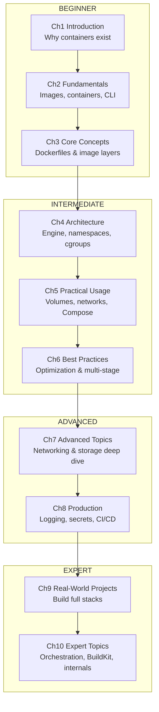

# Docker: From First Principles to Production — Course Roadmap

> A complete, professionally-oriented path from "I've never run a container" to
> "I design, secure, and operate containerized systems in production."

---

## 1. How This Course Works

This course teaches Docker from **first principles**: every feature is introduced
by first explaining the *problem it solves*, then *how it works under the hood*,
then *how to use it well*. You will not just memorize commands — you will
understand the Linux primitives (namespaces, cgroups, union filesystems) that make
containers possible, so that when something breaks in production you can reason
about it instead of guessing.

Each chapter is a standalone Markdown file with a fixed structure:

1. Introduction
2. Learning Goals
3. Concepts Explained
4. Internal Working / Deep Dive
5. Examples
6. Real-World Use Cases
7. Common Mistakes
8. Best Practices
9. Hands-On Exercise
10. Quiz Questions
11. Chapter Summary
12. Further Reading

---

## 2. Learning Roadmap (Visual)



---

## 3. Milestones

### Beginner Milestone (after Ch 1–3)
**You can:** explain what a container is and how it differs from a VM; pull and run
images; manage the container lifecycle; write a working Dockerfile; build, tag, and
push an image; read `docker ps`/`docker logs`/`docker inspect` output confidently.

**Proof of skill:** containerize a simple web app (e.g. a Flask/FastAPI or Node
service) and run it locally with a single `docker run`.

### Intermediate Milestone (after Ch 4–6)
**You can:** describe how the Docker daemon, containerd, and runc cooperate; explain
which Linux namespaces and cgroups isolate a container; persist data with volumes;
connect containers over user-defined networks; orchestrate a multi-service stack with
Docker Compose; cut image size dramatically with multi-stage builds and layer caching.

**Proof of skill:** ship a 3-service stack (app + database + cache) with Compose,
persistent data, healthchecks, and an image under a sensible size budget.

### Advanced Milestone (after Ch 7–8)
**You can:** choose the right network driver (bridge/host/overlay/macvlan); reason
about storage drivers; configure logging drivers and resource limits; manage secrets
and configuration safely; run a private registry; integrate image builds and scans
into CI/CD; set restart policies and health-based recovery.

**Proof of skill:** a production-shaped deployment with externalized config/secrets,
resource limits, structured logging, an automated build+scan+push pipeline.

### Expert Milestone (after Ch 9–10)
**You can:** design containerized architectures end to end; explain the OCI image and
runtime specs; use BuildKit features (cache mounts, secrets, multi-platform builds);
run rootless Docker; harden containers (seccomp, capabilities, read-only rootfs,
non-root users); and articulate the path from Docker to Kubernetes/Swarm orchestration.

**Proof of skill:** the capstone (below).

---

## 4. Estimated Learning Time

| Chapter | Topic | Reading + Exercises |
|---|---|---|
| 01 | Introduction | 1–2 h |
| 02 | Fundamentals | 3–4 h |
| 03 | Core Concepts (Dockerfiles & images) | 5–6 h |
| 04 | Architecture (internals) | 4–5 h |
| 05 | Practical Usage (volumes, networks, Compose) | 6–8 h |
| 06 | Best Practices | 4–5 h |
| 07 | Advanced Topics | 6–8 h |
| 08 | Production Considerations | 6–8 h |
| 09 | Real-World Projects | 10–15 h |
| 10 | Expert Topics | 8–10 h |
| — | **Core total** | **~53–71 h** |
| — | Capstone project | +15–25 h |

A focused learner doing ~6–8 hours/week reaches professional proficiency in roughly
**8–12 weeks**. With your existing Docker exposure, you can compress the early
chapters and front-load Ch 4, 7, 8, and 10.

---

## 5. Prerequisites

**Required**
- Comfort with a command line / terminal (cd, ls, editing files, env vars).
- Basic Linux familiarity (processes, files, permissions) — even surface-level is fine.
- Ability to run *some* application (a web server, a script) and know what "a port" is.

**Helpful but not required**
- One programming language (Python, Node, Go, Java — any).
- Basic networking concepts (IP addresses, ports, DNS).
- Git basics (you'll use it in CI/CD chapters).

**Explicitly NOT assumed**
- Any prior container, Docker, or Kubernetes knowledge.
- Knowledge of namespaces/cgroups — we build these from scratch in Ch 4.

**Environment to set up**
- Docker Engine or Docker Desktop on Linux/macOS/Windows (WSL2). Linux is ideal for
  the internals chapters because containers *are* a Linux technology. (On Ubuntu,
  installing Docker Engine directly gives you the most faithful behavior.)

---

## 6. Recommended Projects (by phase)

**Beginner**
1. *Hello-Container*: run nginx, map a port, replace its index page via a bind mount.
2. *Containerize a single service*: write a Dockerfile for a small web API.

**Intermediate**
3. *Compose stack*: API + PostgreSQL + Redis, with volumes and a custom network.
4. *Image diet*: take a >1 GB naive image down with multi-stage builds + slim bases.

**Advanced**
5. *Self-hosted registry*: run a private registry, push/pull, add image scanning.
6. *CI pipeline*: GitHub Actions that builds, tags, scans, and pushes on every commit.
7. *Observability*: wire structured logging + a log driver + resource limits.

**Expert**
8. *Multi-platform build*: build an image for amd64 + arm64 with BuildKit/buildx.
9. *Hardened container*: non-root, read-only rootfs, dropped capabilities, seccomp.
10. *Rootless + Swarm*: deploy the Compose stack to a Swarm and explore the K8s on-ramp.

---

## 7. Final Capstone Project

**"Production-grade containerized platform"**

Build and operate a small but realistic multi-service application end to end:

- A **backend API** (your language of choice) in a multi-stage, non-root, minimal image.
- A **database** with a named volume and a backup strategy.
- A **cache or queue** (Redis / RabbitMQ).
- A **reverse proxy** (nginx/Traefik) terminating traffic to the API.
- **Docker Compose** for local/dev; **Swarm** (or a documented Kubernetes manifest) for the orchestrated version.
- **Externalized config and secrets** (no credentials baked into images).
- **Healthchecks**, **resource limits**, and **restart policies**.
- **Structured logging** via a logging driver.
- A **CI/CD pipeline** that builds, runs tests, scans the image for vulnerabilities,
  tags by git SHA + semver, and pushes to a registry.
- **Security hardening**: dropped capabilities, read-only filesystem where possible,
  pinned base image digests, an SBOM.
- A short **architecture write-up** (a diagram + the "why" behind each decision).

**Definition of done:** a teammate can clone the repo, run one command for a working
local stack, and your CI produces a scanned, signed-ish, reproducible image ready to
deploy. You can defend every layer choice and isolation boundary.

---

## 8. Table of Contents

```text
00-roadmap.md                 ← (this file)
01-introduction.md            Why containers exist; containers vs VMs; the Docker model
02-fundamentals.md            Images, containers, registries, the lifecycle, core CLI
03-core-concepts.md           Dockerfiles, layers, the build cache, tagging, contexts
04-architecture.md            Engine/containerd/runc; namespaces, cgroups, union FS
05-practical-usage.md         Volumes & bind mounts; networking; Docker Compose
06-best-practices.md          Image optimization, multi-stage builds, .dockerignore, security basics
07-advanced-topics.md         Network drivers deep dive; storage drivers; advanced Compose; healthchecks
08-production-considerations.md  Logging, monitoring, secrets, limits, registries, CI/CD
09-real-world-projects.md     Guided end-to-end builds of realistic stacks
10-expert-topics.md           Orchestration on-ramp, BuildKit/buildx, rootless, hardening, OCI internals
```

---

*Next: `01-introduction.md`. After each chapter, review the roadmap fit and tell me to
continue — I'll generate the next file on its own so the depth stays high.*
